# Chapter 3: Data types

## This chapter covers

- Common mistakes related to basic types
- Fundamental concepts for slices and maps to prevent possible bugs, leaks, or inaccuracies
- Comparing values

Dealing with data types is a frequent operation for software engineers. This chapter delves into the most common mistakes related to basic types, slices, and maps. The only data type that we omit is strings because a later chapter deals with this type exclusively.

### 3.1 #17: Creating confusion with octal literals

Let's first look at a common misunderstanding with octal literal representation, which can lead to confusion or even bugs. What do you believe should be the output of the following code?

```
sum := 100 + 010
fmt.Println(sum)
```

At first glance, we may expect this code to print the result of 100 + 10 = 110. But it prints 108 instead. How is that possible?

In Go, an integer literal starting with 0 is considered an octal integer (base 8), so 10 in base 8 equals 8 in base 10. Thus, the sum in the previous example is equal to 100 + 8 = 108. This is an important property of integer literals to keep in mind—for example, to avoid confusion while reading existing code.

Octal integers are useful in different scenarios. For instance, suppose we want to open a file using os.OpenFile. This function requires passing a permission as a uint32. If we want to match a Linux permission, we can pass an octal number for readability instead of a base 10 number:

```
file, err := os.OpenFile("foo", os.O_RDONLY, 0644)
```

In this example, 0644 represents a specific Linux permission (read for all and write only for the current user). It's also possible to add an o character (the letter  $\theta$  in lower-case) following the zero:

```
file, err := os.OpenFile("foo", os.O_RDONLY, 0o644)
```

Using 00 as a prefix instead of only 0 means the same thing. However, it can help make the code clearer.

**NOTE** We can also use an uppercase 0 character instead of a lowercase 0. But passing 00644 can increase confusion because, depending on the character font, 0 can look very similar to 0.

We should also note the other integer literal representations:

- Binary—Uses a 0b or 0B prefix (for example, 0b100 is equal to 4 in base 10)
- Hexadecimal—Uses an 0x or 0x prefix (for example, 0xF is equal to 15 in base 10)
- Imaginary—Uses an i suffix (for example, 3i)

Finally, we can also use an underscore character (\_) as a separator for readability. For example, we can write 1 billion this way: 1\_000\_000\_000. We can also use the underscore character with other representations (for example, 0b00\_00\_01).

In summary, Go handles binary, hexadecimal, imaginary, and octal numbers. Octal numbers start with a 0. However, to improve readability and avoid potential mistakes for future code readers, make octal numbers explicit using a 00 prefix.

The next section digs into integers, and we discuss how overflows are handled in Go.

### 3.2 #18: Neglecting integer overflows

Not understanding how integer overflows are handled in Go can lead to critical bugs. This section delves into this topic. But first, let's remind ourselves of a few concepts related to integers.

### 3.2.1 Concepts

Go provides a total of 10 integer types. There are four signed integer types and four unsigned integer types, as the following table shows.

| Signed integers         | Unsigned integers        |
|-------------------------|--------------------------|
| int8 (8 bits)           | uint8(8bits)             |
| int16 (16 bits)         | uint16 (16 bits)         |
| int32 ( <b>32</b> bits) | uint32 ( <b>32</b> bits) |
| int64 (64 bits)         | uint 64 (64 bits)        |

The other two integer types are the most commonly used: int and uint. These two types have a size that depends on the system: 32 bits on 32-bit systems or 64 bits on 64-bit systems.

Let's now discuss overflow. Suppose we want to initialize an int32 to its maximum value and then increment it. What should be the behavior of this code?

```
var counter int32 = math.MaxInt32
counter++
fmt.Printf("counter=%d\n", counter)
```

This code compiles and doesn't panic at run time. However, the counter++ statement generates an integer overflow:

```
counter=-2147483648
```

An integer overflow occurs when an arithmetic operation creates a value outside the range that can be represented with a given number of bytes. An int32 is represented using 32 bits. Here is the binary representation of the maximum int32 value (math.MaxInt32):

```
01111111111111111111111111111111111111
```

Because an int32 is a signed integer, the bit on the left represents the integer's sign: 0 for positive, 1 for negative. If we increment this integer, there is no space left to represent the new value. Hence, this leads to an integer overflow. Binary-wise, here's the new value:

```
10000000000000000000000000000000000000
```

As we can see, the bit sign is now equal to 1, meaning negative. This value is the smallest possible value for a signed integer represented with 32 bits.

NOTE The smallest possible negative value isn't 111111111111111111111111111111111111

represent binary numbers (invert every bit and add 1). The main goal of this operation is to make x + (-x) equal 0 regardless of x.

In Go, an integer overflow that can be detected at compile time generates a compilation error. For example,

```
var counter int32 = math.MaxInt32 + 1
constant 2147483648 overflows int32
```

However, at run time, an integer overflow or underflow is silent; this does not lead to an application panic. It is essential to keep this behavior in mind, because it can lead to sneaky bugs (for example, an integer increment or addition of positive integers that leads to a negative result).

Before delving into how to detect an integer overflow with common operations, let's think about when to be concerned about it. In most contexts, like handling a counter of requests or basic additions/multiplications, we shouldn't worry too much if we use the right integer type. But in some cases, like memory-constrained projects using smaller integer types, dealing with large numbers, or doing conversions, we may want to check possible overflows.

**NOTE** The Ariane 5 launch failure in 1996 (https://www.bugsnag.com/blog/bug-day-ariane-5-disaster) was due to an overflow resulting from converting a 64-bit floating-point to a 16-bit signed integer.

### 3.2.2 Detecting integer overflow when incrementing

If we want to detect an integer overflow during an increment operation with a type based on a defined size (int8, int16, int32, int64, uint8, uint16, uint32, or uint64), we can check the value against the math constants. For example, with an int32:

```
func Inc32(counter int32) int32 {
    if counter == math.MaxInt32 {
        panic("int32 overflow")
    }
    return counter + 1
}
Compares with
math.MaxInt32
```

This function checks whether the input is already equal to math.MaxInt32. We know whether the increment leads to an overflow if that's the case.

What about int and uint types? Before Go 1.17, we had to build these constants manually. Now, math.MaxInt, math.MinInt, and math.MaxUint are part of the math package. If we have to test an overflow on an int type, we can do it using math.MaxInt:

```
func IncInt(counter int) int {
    if counter == math.MaxInt {
        panic("int overflow")
    }
    return counter + 1
}
```

The logic is the same for a uint. We can use math. MaxUint:

```
func IncUint(counter uint) uint {
    if counter == math.MaxUint {
        panic("uint overflow")
    }
    return counter + 1
}
```

In this section, we learned how to check integer overflows following an increment operation. Now, what about addition?

### 3.2.3 Detecting integer overflows during addition

How can we detect an integer overflow during an addition? The answer is to reuse math.MaxInt:

```
func AddInt(a, b int) int {
    if a > math.MaxInt-b {
        panic("int overflow")
    }

    return a + b
}
Checks if an integer
overflow will occur
```

In the example, a and b are the two operands. If a is greater than math.MaxInt - b, the operation will lead to an integer overflow. Now, let's look at the multiplication operation.

### 3.2.4 Detecting an integer overflow during multiplication

Multiplication is a bit more complex to handle. We have to perform checks against the minimal integer, math.MinInt:

```
func MultiplyInt(a, b int) int {
    if a == 0 || b == 0 {
                                       If one of the operands is equal
        return 0
                                       to 0, it directly returns 0.
    result := a * b
    if a == 1 || b == 1 {
                                      Checks if one of the
        return result
                                      operands is equal to 1
    if a == math.MinInt || b == math.MinInt {
                                                            Checks if one of the operands
        panic("integer overflow")
                                                            is equal to math.MinInt
    }
    if result/b != a {
                                        Checks if the multiplication
        panic("integer overflow")
                                       leads to an integer overflow
    return result
}
```

Checking an integer overflow with multiplication requires multiple steps. First, we need to test if one of the operands is equal to 0, 1, or math.MinInt. Then we divide

the multiplication result by b. If the result isn't equal to the original factor (a), it means an integer overflow occurred.

In summary, integer overflows (and underflows) are silent operations in Go. If we want to check for overflows to avoid sneaky errors, we can use the utility functions described in this section. Also remember that Go provides a package to deal with large numbers: math/big. This might be an option if an int isn't enough.

We continue talking about basic Go types in the next section with floating points.

### 3.3 #19: Not understanding floating points

In Go, there are two floating-point types (if we omit imaginary numbers): float32 and float64. The concept of a floating point was invented to solve the major problem with integers: their inability to represent fractional values. To avoid bad surprises, we need to know that floating-point arithmetic is an approximation of real arithmetic. Let's examine the impact of working with approximations and how to increase accuracy. For that, we'll look at a multiplication example:

```
var n float32 = 1.0001
fmt.Println(n * n)
```

We may expect this code to print the result of 1.0001 \* 1.0001 = 1.00020001, right? However, running it on most x86 processors prints 1.0002, instead. How do we explain that? We need to understand the arithmetic of floating points first.

Let's take the float64 type as an example. Note that there's an infinite number of real values between math. SmallestNonzeroFloat64 (the float64 minimum) and math. MaxFloat64 (the float64 maximum). Conversely, the float64 type has a finite number of bits: 64. Because making infinite values fit into a finite space isn't possible, we have to work with approximations. Hence, we may lose precision. The same logic goes for the float32 type.

Floating points in Go follow the IEEE-754 standard, with some bits representing a mantissa and other bits representing an exponent. A mantissa is a base value, whereas an exponent is a multiplier applied to the mantissa. In single-precision floating-point types (float32), 8 bits represent the exponent, and 23 bits represent the mantissa. In double-precision floating-point types (float64), the values are 11 and 52 bits, respectively, for the exponent and the mantissa. The remaining bit is for the sign. To convert a floating point into a decimal, we use the following calculation:

```
sign * 2^exponent * mantissa
```

Figure 3.1 illustrates the representation of 1.0001 as a float 32. The exponent uses the 8-bit excess/bias notation: the 011111111 exponent value means  $2^0$ , whereas the mantissa is equal to 1.000100016593933. (Note that the scope of this section isn't to explain how conversions work.) Hence, the decimal value equals  $1 \times 2^0 \times 1.000100016593933$ . Thus, what we store in a single-precision floating-point value isn't 1.0001 but 1.000100016593933. A lack of precision affects the accuracy of the value stored.

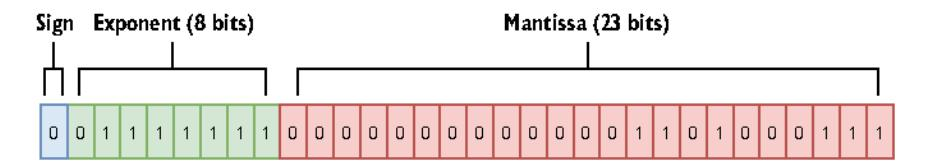

Figure 3.1 Representation of 1.0001 in float 32

Once we understand that float32 and float64 are approximations, what are the implications for us as developers? The first implication is related to comparisons. Using the == operator to compare two floating-point numbers can lead to inaccuracies. Instead, we should compare their difference to see if it is less than some small error value. For example, the testify testing library (https://github.com/stretchr/testify) has an InDelta function to assert that two values are within a given delta of each other.

Also bear in mind that the result of floating-point calculations depends on the actual processor. Most processors have a floating-point unit (FPU) to deal with such calculations. There is no guarantee that the result executed on one machine will be the same on another machine with a different FPU. Comparing two values using a delta can be a solution for implementing valid tests across different machines.

### Kinds of floating-point numbers

Go also has three special kinds of floating-point numbers:

- Positive infinite
- Negative infinite
- NaN (Not-a-Number), which is the result of an undefined or unrepresentable operation

According to IEEE-754, NaN is the only floating-point number satisfying f = f. Here's an example that constructs these special kinds of numbers, along with the output:

```
var a float64
positiveInf := 1 / a
negativeInf := -1 / a
nan := a / a
fmt.Println{positiveInf, negativeInf, nan}
+Inf -Inf NaN
```

We can check whether a floating-point number is infinite using math.IsInf and whether it is NaN using math.IsNaN.

So far, we have seen that decimal-to-floating-point conversions can lead to a loss of accuracy. This is the error due to conversion. Also note that the error can accumulate in a sequence of floating-point operations.

Let's look at an example with two functions that perform the same sequence of operations in a different order. In our example, £1 starts by initializing a £10at64 to 10,000 and then repeatedly adds 1.0001 to this result (n times). Conversely, £2 performs the same operations but in the opposite order (adding 10,000 in the end):

```
func f1(n int) float64 {
    result := 10_000.
    for i := 0; i < n; i++ {
        result += 1.0001
    }
    return result
}

func f2(n int) float64 {
    result := 0.
    for i := 0; i < n; i++ {
        result += 1.0001
    }
    return result + 10_000.
}</pre>
```

Now, let's run these functions on an x86 processor. This time, however, we'll vary n.

| n  | Exact result | f1                     | £2                     |
|----|--------------|------------------------|------------------------|
| 10 | 10010.001    | 10010.00099999993      | 10010.001              |
| 1k | 11000.1      | 11000.0999999993       | 11000.09999999982      |
| 1m | 1.0101e+06   | 1.0100999999761417e+06 | 1.0100999999766762e+06 |

Notice that the bigger n is, the greater the imprecision. However, we can also see that the £2 accuracy is better than £1. Keep in mind that the order of floating-point calculations can affect the accuracy of the result.

When performing a chain of additions and subtractions, we should group the operations to add or subtract values with a similar order of magnitude before adding or subtracting those with magnitudes that aren't close. Because £2 adds 10,000, in the end it produces more accurate results than £1.

What about multiplications and divisions? Let's imagine that we want to compute the following:

```
a \times (b + c)
```

As we know, this calculation is equal to

```
a \times b + a \times c
```

Let's run these two calculations with a having a different order of magnitude than b and c:

```
a := 100000.001
b := 1.0001
```

```
c := 1.0002
fmt.Println(a * (b + c))
fmt.Println(a*b + a*c)
200030.00200030004
200030.0020003
```

The exact result is 200,030.002. Hence, the first calculation has the worst accuracy. Indeed, when performing floating-point calculations involving addition, subtraction, multiplication, or division, we have to complete the multiplication and division operations first to get better accuracy. Sometimes, this may impact the execution time (in the previous example, it requires three operations instead of two). In that case, it's a choice between accuracy and execution time.

Go's float32 and float64 are approximations. Because of that, we have to bear a few rules in mind:

- When comparing two floating-point numbers, check that their difference is within an acceptable range.
- When performing additions or subtractions, group operations with a similar order of magnitude for better accuracy.
- To favor accuracy, if a sequence of operations requires addition, subtraction, multiplication, or division, perform the multiplication and division operations first.

The following section begins our examination of slices. It discusses two crucial concepts: a slice's length and capacity.

### 3.4 #20: Not understanding slice length and capacity

It's pretty common for Go developers to mix slice length and capacity or not understand them thoroughly. Assimilating these two concepts is essential for efficiently handling core operations such as slice initialization and adding elements with append, copying, or slicing. This misunderstanding can lead to using slices suboptimally or even to memory leaks (as we will see in later sections).

In Go, a slice is backed by an array. That means the slice's data is stored contiguously in an array data structure. A slice also handles the logic of adding an element if the backing array is full or shrinking the backing array if it's almost empty.

Internally, a slice holds a pointer to the backing array plus a length and a capacity. The length is the number of elements the slice contains, whereas the capacity is the number of elements in the backing array. Let's go through a few examples to make things clearer. First, let's initialize a slice with a given length and capacity:

```
s := make([]int, 3, 6) Three-length, six-capacity slice
```

The first argument, representing the length, is mandatory. However, the second argument representing the capacity is optional. Figure 3.2 shows the result of this code in memory.

In this case, make creates an array of six elements (the capacity). But because the length was set to 3, Go initializes only the first three elements. Also, because the slice is an []int type, the first three elements are initialized to the zeroed value of an int: 0. The grayed elements are allocated but not yet used.

If we print this slice, we get the elements within the range of the length, [0 0 0]. If we set s[1] to 1, the second element of the slice updates without impacting its length or capacity. Figure 3.3 illustrates this.

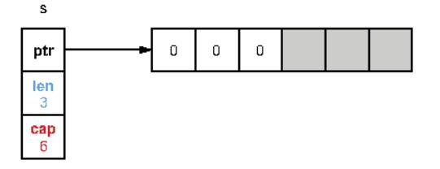

Figure 3.2 A three-length, six-capacity slice

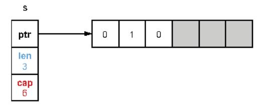

Figure 3.3 Updating the slice's second element: s[1] = 1

However, accessing an element outside the length range is forbidden, even though it's already allocated in memory. For example, s[4] = 0 would lead to the following panic:

```
panic: runtime error: index out of range [4] with length 3
```

How can we use the remaining space of the slice? By using the append built-in function:

```
s = append(s, 2)
```

This code appends to the existing s slice a new element. It uses the first grayed element (which was allocated but not yet used) to store element 2, as figure 3.4 shows.

The length of the slice is updated from 3 to 4 because the slice now contains four elements. Now, what happens if we add three more elements so that the backing array isn't large enough?

```
s = append(s, 3, 4, 5) fmt.Println(s)
```

If we run this code, we see that the slice was able to cope with our request:

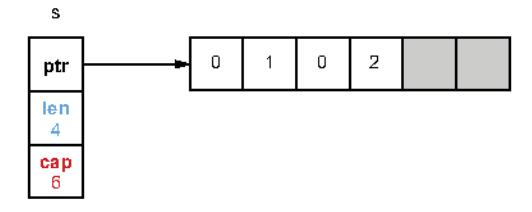

Figure 3.4 Appending an element to s

```
[0 1 0 2 3 4 5]
```

Because an array is a fixed-size structure, it can store the new elements until element 4. When we want to insert element 5, the array is already full: Go internally creates

another array by doubling the capacity, copying all the elements, and then inserting element 5. Figure 3.5 shows this process.

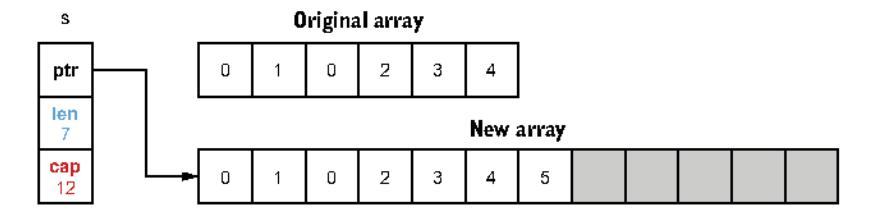

Figure 3.5 Because the initial backing array is full, Go creates another array and copies all the elements.

**NOTE** In Go, a slice grows by doubling its size until it contains 1,024 elements, after which it grows by 25%.

The slice now references the new backing array. What will happen to the previous backing array? If it's no longer referenced, it's eventually freed by the garbage collector (GC) if allocated on the heap. (We discuss heap memory in mistake #95, "Not understanding stack vs. heap," and we look at how the GC works in mistake #99, "Not understanding how the GC works.")

What happens with slicing? Slicing is an operation done on an array or a slice, providing a half-open range; the first index is included, whereas the second is excluded. The following example shows the impact, and figure 3.6 displays the result in memory:

```
S1 := make([]int, 3, 6)

Slicing from indices 1 to 3

Three-length, six-capacity slice
```

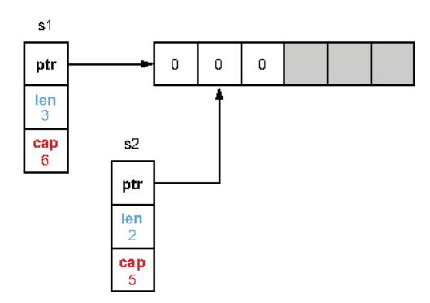

Figure 3.6 The slices s1 and s2 reference the same backing array with different lengths and capacities.

First, \$1 is created as a three-length, six-capacity slice. When \$2 is created by slicing \$1, both slices reference the same backing array. However, \$2 starts from a different index, 1. Therefore, its length and capacity (a two-length, five-capacity slice) differ from \$1. If we update \$1[1] or \$2[0], the change is made to the same array, hence, visible in both slices, as figure 3.7 shows.

Now, what happens if we append an element to \$2? Does the following code change \$1 as well?

```
s2 = append(s2, 2)
```

The shared backing array is modified, but only the length of s2 changes. Figure 3.8 shows the result of appending an element to s2.

s1 remains a three-length, sixcapacity slice. Therefore, if we print s1 and s2, the added element is only visible for s2:

```
s1=[0 1 0], s2=[1 0 2]
```

It's important to understand this behavior so that we don't make wrong assumptions while using append.

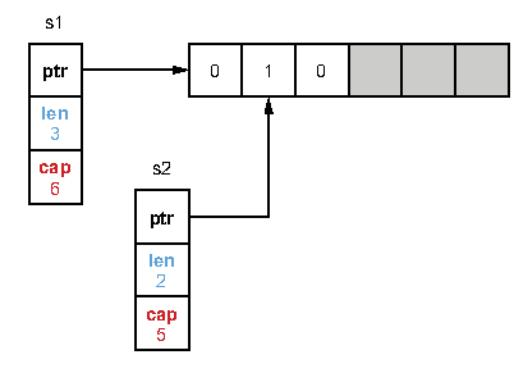

Figure 3.7 Because s1 and s2 are backed by the same array, updating a common element makes the change visible in both slices.

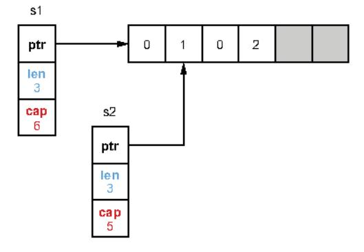

Figure 3.8 Appending an element to s2

**NOTE** In these examples, the backing array is internal and not available directly to the Go developer. The only exception is when a slice is created from slicing an existing array.

One last thing to note: what if we keep appending elements to s2 until the backing array is full? What will the state be, memory-wise? Let's add three more elements so that the backing array will not have enough capacity:

```
s2 = append(s2, 3)

s2 = append(s2, 4)

s2 = append(s2, 5)

At this stage, the backing array is already full.
```

This code leads to creating another backing array. Figure 3.9 displays the results in memory.

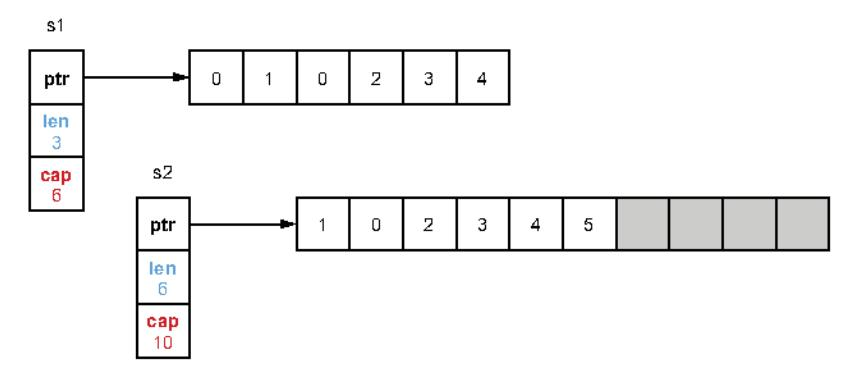

Figure 3.9 Appending elements to s2 until the backing array is full

s1 and s2 now reference two different arrays. As s1 is still a three-length, six-capacity slice, it still has some available buffer, so it keeps referencing the initial array. Also, the new backing array was made by copying the initial one from the first index of s2. That's why the new array starts with element 1, not 0.

To summarize, the *slice length* is the number of available elements in the slice, whereas the *slice capacity* is the number of elements in the backing array. Adding an element to a full slice (length == capacity) leads to creating a new backing array with a new capacity, copying all the elements from the previous array, and updating the slice pointer to the new array.

In the next section, we use the concepts of length and capacity with slice initialization.

### 3.5 #21: Inefficient slice initialization

While initializing a slice using make, we saw that we have to provide a length and an optional capacity. Forgetting to pass an appropriate value for both of these parameters when it makes sense is a widespread mistake. Let's see precisely when this is considered appropriate.

Suppose we want to implement a convert function that maps a slice of Foo into a slice of Bar, and both slices will have the same number of elements. Here is a first implementation:

```
func convert(foos []Foo) []Bar {
    bars := make{[]Bar, 0)
```

First, we initialize an empty slice of Bar elements using make([]Bar, 0). Then, we use append to add the Bar elements. At first, bars is empty, so adding the first element

First solution with

allocates a backing array of size 1. Every time the backing array is full, Go creates another array by doubling its capacity (discussed in the previous section).

This logic of creating another array because the current one is full is repeated multiple times when we add a third element, a fifth, a ninth, and so on. Assuming the input slice has 1,000 elements, this algorithm requires allocating 10 backing arrays and copying more than 1,000 elements in total from one array to another. This leads to additional effort for the GC to clean all these temporary backing arrays.

Performance-wise, there's no good reason not to give the Go runtime a helping hand. There are two different options for this. The first option is to reuse the same code but allocate the slice with a given capacity:

```
func convert(foos []Foo) []Bar {
    n := len(foos)
    bars := make([]Bar, 0, n)

    for _, foo := range foos {
        bars = append(bars, fooToBar(foo))
    }
    return bars
}

Initializes with a zero length
    and a given capacity

Updates bars to append
    a new element
```

The only change is to create bars with a capacity equal to n, the length of foos.

Internally, Go preallocates an array of *n* elements. Therefore, adding up to *n* elements means reusing the same backing array and hence reducing the number of allocations drastically. The second option is to allocate bars with a given length:

```
func convert(foos []Foo) []Bar {
    n := len(foos)
    bars := make([]Bar, n)

for i, foo := range foos {
    bars[i] = fooToBar(foo)
  }
    return bars
}

Initializes with
a given length

Sets element i
  of the slice
```

Because we initialize the slice with a length, n elements are already allocated and initialized to the zero value of Bar. Hence, to set elements, we have to use, not append but bars[i].

Which option is best? Let's run a benchmark with the three solutions and an input slice of 1 million elements:

```
BenchmarkConvert_EmptySlice-4 22 49739882 ns/op
BenchmarkConvert_GivenCapacity-4 86 13438544 ns/op

BenchmarkConvert_GivenLength-4 91 12800411 ns/op

Third solution using a given length and bars[i]

Second solution using a given capacity and append
```

As we can see, the first solution has a significant impact performance-wise. When we keep allocating arrays and copying elements, the first benchmark is almost 400% slower than the other two. Comparing the second and the third solutions, the third is about 4% faster because we avoid repeated calls to the built-in append function, which has a small overhead compared to a direct assignment.

If setting a capacity and using append is less efficient than setting a length and assigning to a direct index, why do we see this approach being used in Go projects? Let's look at a concrete example in Pebble, an open source key-value store developed by Cockroach Labs (https://github.com/cockroachdb/pebble).

A function called collectAllUserKeys needs to iterate over a slice of structs to format a particular byte slice. The resulting slice will be twice the length of the input slice:

```
func collectAllUserKeys(cmp Compare,
   tombstones []tombstoneWithLevel) [][]byte {
   keys := make{[][]byte, 0, len(tombstones)*2)
   for _, t := range tombstones {
       keys = append(keys, t.Start.UserKey)
       keys = append(keys, t.End)
   }
   // ...
}
```

Here, the conscious choice is to use a given capacity and append. What's the rationale? If we used a given length instead of a capacity, the code would be the following:

```
func collectAllUserKeys(cmp Compare,
   tombstones []tombstoneWithLevel) [][]byte {
   keys := make([][]byte, len(tombstones)*2)
   for i, t := range tombstones {
        keys[i*2] = t.Start.UserKey
        keys[i*2+1] = t.End
   }
   // ...
}
```

Notice how more complex the code to handle the slice index looks. Given that this function isn't performance sensitive, it was decided to favor the easiest option to read.

### Slices and conditions

What if the future length of the slice isn't known precisely? For example, what if the length of the output slice depends on a condition?

```
func convert(foos []Foo) []Bar {
    // bars initialization

for _, foo := range foos {
    if something(foo) {
```

```
}
return bars
}
```

In this example, a Foo element is converted into a Bar and added to the slice only in a specific condition (if something(foo)). Should we initialize bars as an empty slice or with a given length or capacity?

There's no strict rule here. It's a traditional software problem: is it better to trade CPU or memory? Perhaps if something(foo) is true in 99% of the cases, it's worth initializing bars with a length or capacity. It depends on our use case.

Converting one slice type into another is a frequent operation for Go developers. As we have seen, if the length of the future slice is already known, there is no good reason to allocate an empty slice first. Our options are to allocate a slice with either a given capacity or a given length. Of these two solutions, we have seen that the second tends to be slightly faster. But using a given capacity and append can be easier to implement and read in some contexts.

The next section discusses the difference between nil and empty slices and why it matters for Go developers.

### 3.6 #22: Being confused about nil vs. empty slices

Go developers fairly frequently mix nil and empty slices. We may want to use one over the other depending on the use case. Meanwhile, some libraries make a distinction between the two. To be proficient with slices, we need to make sure we don't mix these concepts. Before looking at an example, let's discuss some definitions:

- A slice is empty if its length is equal to 0.
- A slice is nil if it equals nil.

Now, let's look at different ways to initialize a slice. Can you guess the output of the following code? Each time, we will print whether the slice is empty or nil:

```
func main() {
    var s []string
```

This example prints the following:

```
1: empty=true nil=true
2: empty=true nil=true
3: empty=true nil=false
4: empty=true nil=false
```

All the slices are empty, meaning the length equals 0. Therefore, a nil slice is also an empty slice. However, only the first two are nil slices. If we have multiple ways to initialize a slice, which option should we favor? There are two things to note:

- One of the main differences between a nil and an empty slice regards allocations. Initializing a nil slice doesn't require any allocation, which isn't the case for an empty slice.
- Regardless of whether a slice is nil, calling the append built-in function works.
   For example,

```
var s1 []string
fmt.Println(append(s1, "foo")) // [foo]
```

Consequently, if a function returns a slice, we shouldn't do as in other languages and return a non-nil collection for defensive reasons. Because a nil slice doesn't require any allocation, we should favor returning a nil slice instead of an empty slice. Let's look at this function, which returns a slice of strings:

```
func f() []string {
    var s []string
    if foo() {
        s = append(s, "foo")
    }
    if bar() {
        s = append(s, "bar")
    }
    return s
}
```

If both foo and bar are false, we get an empty slice. To prevent allocating an empty slice for no particular reason, we should favor option 1 (var s []string). We can use option 4 (make([]string, 0)) with a zero-length string, but doing so doesn't bring any value compared to option 1; and it requires an allocation.

However, in the case where we have to produce a slice with a known length, we should use option 4, s := make([]string, length), as this example shows:

```
func intsToStrings(ints []int) []string {
    s := make([]string, len(ints))
    for i, v := range ints {
        s[i] = strconv.Itoa(v)
    }
    return s
}
```

As discussed in mistake #21, "Inefficient slice initialization," we need to set the length (or capacity) in such a scenario to avoid extra allocations and copies. Now, two options remain from the example that looks at different ways to initialize a slice:

```
Option 2: s := []string(nil)Option 3: s := []string{}
```

Option 2 isn't the most widely used. But it can be helpful as syntactic sugar because we can pass a nil slice in a single line—for example, using append:

```
s := append([]int(nil), 42)
```

If we had used option 1 (var s []string), it would have required two lines of code. This is probably not the most important readability optimization of all time, but it's still worth knowing.

**NOTE** In mistake #24, "Not making slice copies correctly," we will see one rationale to append to a nil slice.

Now, let's look at option 3: s := []string{}. This form is recommended to create a slice with initial elements:

```
s := []string{"foo", "bar", "baz"}
```

However, if we don't need to create a slice with initial elements, we shouldn't use this option. It brings the same benefits as option 1 (var s []string), except that the slice isn't nil; hence, it requires an allocation. Therefore, option 3 should be avoided without initial elements.

**NOTE** Some linters can catch option 3 without initial values and recommend changing it to option 1. However, we should remember that this also changes the semantics from a non-nil to a nil slice.

We should also mention that some libraries distinguish between nil and empty slices. This is the case, for example, with the encoding/json package. The following examples marshal two structs, one containing a nil slice and the second a non-nil, empty slice:

```
var s1 []float32
```

Running this example, notice that the marshaling results for these two structs are different:

```
{"ID":"foo","Operations":null}
{"ID":"bar","Operations":[]}
```

Here, a nil slice is marshaled as a null element, whereas a non-nil, empty slice is marshaled as an empty array. If we work in the context of strict JSON clients that differentiate between null and [], it's essential to keep this distinction in mind.

The encoding/json package isn't the only package from the standard library to make this distinction. For example, reflect.DeepEqual returns false if we compare a nil and a non-nil empty slice, which is something to remember in the context of unit tests, for example. In any case, while working with the standard library or external libraries, we should ensure that when using one version or another, our code doesn't lead to unexpected results.

To summarize, in Go, there is a distinction between nil and empty slices. A nil slice equals nil, whereas an empty slice has a length of zero. A nil slice is empty, but an empty slice isn't necessarily nil. Meanwhile, a nil slice doesn't require any allocation. We have seen throughout this section how to initialize a slice depending on the context by using

- var s []string if we aren't sure about the final length and the slice can be empty
- []string(nil) as syntactic sugar to create a nil and empty slice
- make([]string, length) if the future length is known

The last option, []string{}, should be avoided if we initialize the slice without elements. Finally, let's check whether the libraries we use make the distinctions between nil and empty slices to prevent unexpected behaviors.

In the next section, we continue this discussion and see the best way to check for an empty slice after having called a function.

### 3.7 #23: Not properly checking if a slice is empty

We saw in the previous section that there is a distinction between nil and empty slices. Having these notions in mind, what's the idiomatic way to check if a slice contains elements? Not having a clear answer can lead to subtle bugs.

In this example, we call a getOperations function that returns a slice of float32. We want to call a handle function only if the slice contains elements. Here's a first (erroneous) version:

```
func handleOperations(id string) {
   operations := getOperations(id)
   if operations != nil {
        handle(operations)
   }
}
Checks if the
operations slice is nil
}
```

```
func getOperations(id string) []float32 {
    operations := make([]float32, 0)
```

We determine whether the slice has elements by checking if the operations slice isn't nil. But there's a problem with this code: getOperations never returns a nil slice; instead, it returns an empty slice. Therefore, the operations != nil check will always be true.

What do we do in this situation? One approach might be to modify getOperations to return a nil slice if id is empty:

```
func getOperations(id string) []float32 {
    operations := make([]float32, 0)

    if id == "" {
        return nil
```

Instead of returning operations if id is empty, we return nil. This way, the check we implement about testing the slice nullity matches. However, this approach doesn't work in all situations—we're not always in a context where we can change the callee. For example, if we use an external library, we won't create a pull request just to change empty into nil slices.

How then can we check whether a slice is empty or nil? The solution is to check the length:

```
func handleOperations(id string) {
   operations := getOperations(id)
   if len(operations) != 0 {
        handle(operations)
   }
}
Checks the slice length
```

We mentioned in the previous section that an empty slice has, by definition, a length of zero. Meanwhile, nil slices are always empty. Therefore, by checking the length of the slice, we cover all the scenarios:

- If the slice is nil, len(operations) != 0 is false.
- If the slice isn't nil but empty, len(operations) != 0 is also false.

Hence, checking the length is the best option to follow as we can't always control the approach taken by the functions we call. Meanwhile, as the Go wiki states, when designing interfaces, we should avoid distinguishing nil and empty slices, which leads to subtle programming errors. When returning slices, it should make neither a semantic nor a technical difference if we return a nil or empty slice. Both should mean the same thing for the callers. This principle is the same with maps. To check if a map is empty, check its length, not whether it's nil.

In the next section, we see how to make slice copies correctly.

### 3.8 #24: Not making slice copies correctly

The copy built-in function allows copying elements from a source slice into a destination slice. Although it is a handy built-in function, Go developers sometimes misunderstand it. Let's look at a common mistake that results in copying the wrong number of elements.

In the following example, we create a slice and copy its elements to another slice. What should be the output of this code?

```
src := []int{0, 1, 2}
var dst []int
copy{dst, src)
fmt.Println{dst}
```

If we run this example, it prints [], not [0 1 2]. What did we miss?

To use copy effectively, it's essential to understand that the number of elements copied to the destination slice corresponds to the minimum between:

- The source slice's length
- The destination slice's length

In the previous example, src is a three-length slice, but dst is a zero-length slice because it is initialized to its zero value. Therefore, the copy function copies the minimum number of elements (between 3 and 0): 0 in this case. The resulting slice is then empty.

If we want to perform a complete copy, the destination slice must have a length greater than or equal to the source slice's length. Here, we set up a length based on the source slice:

```
src := []int{0, 1, 2}
dst := make{[]int, len(src))
copy{dst, src)
fmt.Println(dst)
Creates a dst slice but
with a given length
```

Because dst is now a slice initialized with a length equal to 3, it copies three elements. This time, if we run the code, it prints  $[0\ 1\ 2]$ .

**NOTE** Another common mistake is to invert the order of the arguments when calling copy. Remember that the destination is the former argument, whereas the source is the latter.

Let's also mention that using the copy built-in function isn't the only way to copy slice elements. There are different alternatives, the best known being probably the following, which uses append:

```
src := []int(0, 1, 2)
dst := append([]int(nil), src...)
```

We append the elements from the source slice to a nil slice. Hence, this code creates a three-length, three-capacity slice copy. This alternative has the advantage of being done in a single line. However, using copy is more idiomatic and, therefore, easier to understand, even though it takes an extra line.

Copying elements from one slice to another is a reasonably frequent operation. When using copy, we must recall that the number of elements copied to the destination corresponds to the minimum between the two slices' lengths. Also bear in mind that other alternatives exist to copy a slice, so we shouldn't be surprised if we find them in a codebase.

Let's continue discussing slices with a common mistake when using append.

### 3.9 #25: Unexpected side effects using slice append

This section discusses a common mistake when using append, which may have unexpected side effects in some situations. In the following example, we initialize an s1 slice, create s2 by slicing s1, and create s3 by appending an element to s2:

```
s1 := []int{1, 2, 3}
s2 := s1[1:2]
s3 := append{s2, 10}
```

We initialize an s1 slice containing three elements, and s2 is created from slicing s1. Then we call append on s3. What should be the state of these three slices at the end of this code? Can you guess?

Following the second line, after \$2\$ is created, figure 3.10 shows the state of both slices in memory. \$1\$ is a three-length, three-capacity slice, and \$2\$ is a one-length, two-capacity slice, both backed by the same array we already mentioned. Adding an element using append checks whether the slice is full (length == capacity). If it is not full, the append function adds the element by updating the backing array and returning a slice having a length incremented by 1.

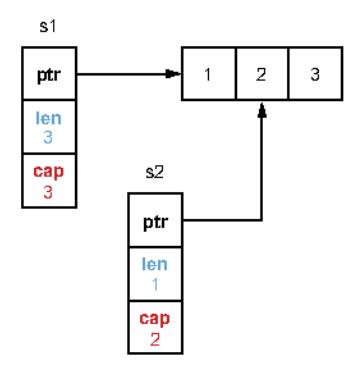

Figure 3.10 Both slices are backed by the same array but with a different length and capacity.

In this example, s2 isn't full; it can accept one more element. Figure 3.11 shows the final state of these three slices.

In the backing array, we updated the last element to store 10. Therefore, if we print all the slices, we get this output:

```
s1=[1 2 10], s2=[2], s3=[2 10]
```

The s1 slice's content was modified, even though we did not update s1[2] or s2[1] directly. We should keep this in mind to avoid unintended consequences.

Let's see one impact of this principle by passing the result of a slicing operation to a function.

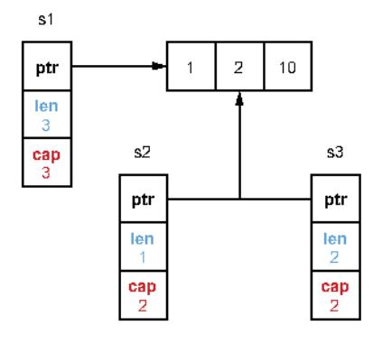

Figure 3.11 All the slices are backed by the same array.

In the following, we initialize a slice with three elements and call a function with only the first two elements:

```
func main() {
    s := []int{1, 2, 3}

    f(s[:2])
    // Use s
}

func f(s []int) {
    // Update s
}
```

In this implementation, if £ updates the first two elements, the changes are visible to the slice in main. However, if £ calls append, it updates the third element of the slice, even though we pass only two elements. For example,

```
func main() {
    s := []int{1, 2, 3}

    f(s[:2])
    fmt.Println(s) // [1 2 10]
}

func f(s []int) {
    _ = append(s, 10)
}
```

If we want to *protect* the third element for defensive reasons, meaning to ensure that £ doesn't update it, we have two options.

The first is to pass a copy of the slice and then construct the resulting slice:

```
func main() {
    s := []int(1, 2, 3)
```

```
sCopy := make([]int, 2)
copy(sCopy, s)
```

Because we pass a copy to f, even if this function calls append, it will not lead to a side effect outside of the range of the first two elements. The downside of this option is that it makes the code more complex to read and adds an extra copy, which can be a problem if the slice is large.

The second option can be used to limit the range of potential side effects to the first two elements only. This option involves the so-called *full slice expression*: s[low:high:max]. This statement creates a slice similar to the one created with s[low:high], except that the resulting slice's capacity is equal to max - low. Here's an example when calling f:

```
func main() {
    s := []int(1, 2, 3)
    f(s[:2:2])
```

Here, the slice passed to f isn't s[:2] but s[:2:2]. Hence, the slice's capacity is 2 - 0 = 2, as figure 3.12 shows.

When passing s[:2:2], we can limit the range of effects to the first two elements. Doing so also prevents us from having to perform a slice copy.

When using slicing, we must remember that we can face a situation leading to unintended side effects. If the resulting slice has a length smaller than its capacity, append can mutate the original slice. If we want to restrict the range of possible side effects, we can use either a slice copy or the full slice expression, which prevents us from doing a copy.

In the next section, we continue discussing slices but in the context of potential memory leaks.

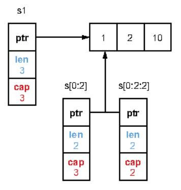

Figure 3.12 s[0:2] creates a two-length, three-capacity slice, whereas s[0:2:2] creates a two-length, two-capacity slice.

### 3.10 #26: Slices and memory leaks

This section shows that slicing an existing slice or array can lead to memory leaks in some conditions. We discuss two cases: one where the capacity is leaking and another that's related to pointers.

### 3.10.1 Leaking capacity

For the first case, leaking capacity, let's imagine implementing a custom binary protocol. A message can contain 1 million bytes, and the first 5 bytes represent the message type. In our code, we consume these messages, and for auditing purposes, we want to store the latest 1,000 message types in memory. This is the skeleton of our function:

```
func consumeMessages() {
    for (
        msg := receiveMessage()
        // Do something with msg
        storeMessageType(getMessageType(msg))
}

Stores the latest 1,000
message types in memory

func getMessageType(msg []byte) []byte {
    return msg[:5]
}
Computes the message
type by slicing msg
```

The getMessageType function computes the message type by slicing the input slice. We test this implementation, and everything is fine. However, when we deploy our application, we notice that our application consumes about 1 GB of memory. How is that possible?

The slicing operation on msg using msg[:5] creates a five-length slice. However, its capacity remains the same as the initial slice. The remaining elements are still allocated in memory, even if eventually msg is not referenced. Let's look at an example with a large message length of 1 million bytes, as shown in figure 3.13.

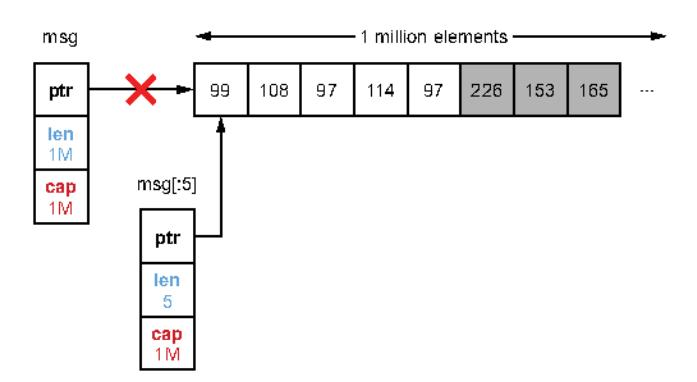

Figure 3.13 After a new loop iteration, msg is no longer used. However, its backing array will still be used by msg [:5].

The backing array of the slice still contains 1 million bytes after the slicing operation. Hence, if we keep 1,000 messages in memory, instead of storing about 5 KB, we hold about 1 GB.

What can we do to solve this issue? We can make a slice copy instead of slicing msg:

```
func getMessageType(msg []byte) []byte {
   msgType := make([]byte, 5)
   copy(msgType, msg)
   return msgType
}
```

Because we perform a copy, msgType is a five-length, five-capacity slice regardless of the size of the message received. Hence, we only store 5 bytes per message type.

### Full slice expressions and capacity leakage

What about using the full slice expression to solve this issue? Let's look at this example:

```
func getMessageType(msg []byte) []byte {
   return msg[:5:5]
}
```

Here, getMessageType returns a shrunken version of the initial slice: a five-length, five-capacity slice. But would the GC be able to reclaim the inaccessible space from byte 5? The Go specification doesn't officially specify the behavior. However, by using runtime.Memstats, we can record statistics about the memory allocator, such as the number of bytes allocated on the heap:

```
func printAlloc() {
   var m runtime.MemStats
   runtime.ReadMemStats(&m)
   fmt.Printf("%d KB\n", m.Alloc/1024)
}
```

If we call this function following a call to <code>getMessageType</code> and <code>runtime.GC()</code> to force running a garbage collection, the inaccessible space isn't reclaimed. The whole backing array still lives in memory. Therefore, using the full slice expression isn't a valid option (unless a future update of Go tackles this).

As a rule of thumb, remember that slicing a large slice or array can lead to potential high memory consumption. The remaining space won't be reclaimed by the GC, and we can keep a large backing array despite using only a few elements. Using a slice copy is the solution to prevent such a case.

### 3.10.2 Slice and pointers

We have seen that slicing can cause a leak because of the slice capacity. But what about the elements, which are still part of the backing array but outside the length range? Does the GC collect them?

Let's examine this question using a Foo struct containing a byte slice:

```
type Foo struct {
    v []byte
}
```

We want to check the memory allocations after each step as follows:

- 1 Allocate a slice of 1,000 Foo elements.
- 2 Iterate over each Foo element, and for each one, allocate 1 MB for the v slice.
- 3 Call keepFirstTwoElementsOnly, which returns only the first two elements using slicing, and then call a GC.

We want to see how memory behaves following the call to keepFirstTwoElementsOnly and a garbage collection. Here's the scenario in Go (we reuse the printAlloc function mentioned previously):

```
func main() {
    foos := make([]Foo, 1_000)
                                           Allocates a slice of
    printAlloc()
                                           1.000 elements
    for i := 0; i < len(foos); i++ {
                                                   For each element,
        foos[i] = Foo{}
                                                  allocates a slice of 1 MB
             v: make([]byte, 1024*1024),
    3
    printAlloc()
                                                          Keeps only the
                                                         first two elements
    two := keepFirstTwoElementsOnly(foos)
    runtime.GC()
                                                 Runs the GC to force
    printAlloc()
                                                cleaning the heap
    runtime.KeepAlive(two)
                                        Keeps a reference to
}
                                        the two variable
func keepFirstTwoElementsOnly(foos []Foo) []Foo {
    return foos[:2]
```

In this example, we allocate the foos slice, allocate a slice of 1 MB for each element, and then call keepFirstTwoElementsOnly and a GC. In the end, we use runtime .KeepAlive to keep a reference to the two variable after the garbage collection so that it won't be collected.

We may expect the GC to collect the 998 remaining Foo elements and the data allocated for the slice because these elements can no longer be accessed. However, this isn't the case. For example, the code can output the following:

```
83 KB
1024072 KB
```

The first output allocates about 83 KB of data. Indeed, we allocated 1,000 zero values of Foo. The second result allocates 1 MB per slice, which increases memory. However,

notice that the GC did not collect the remaining 998 elements after the last step. What's the reason?

It's essential to keep this rule in mind when working with slices: if the element is a pointer or a struct with pointer fields, the elements won't be reclaimed by the GC. In our example, because Foo contains a slice (and a slice is a pointer on top of a backing array), the remaining 998 Foo elements and their slice aren't reclaimed. Therefore, even though these 998 elements can't be accessed, they stay in memory as long as the variable returned by keepFirstTwoElementsOnly is referenced.

What are the options to ensure that we don't leak the remaining Foo elements? The first option, again, is to create a copy of the slice:

```
func keepFirstTwoElementsOnly(foos []Foo) []Foo {
  res := make([]Foo, 2)
  copy{res, foos)
  return res
}
```

Because we copy the first two elements of the slice, the GC knows that the 998 elements won't be referenced anymore and can now be collected.

There's a second option if we want to keep the underlying capacity of 1,000 elements, which is to mark the slices of the remaining elements explicitly as nil:

```
func keepFirstTwoElementsOnly(foos []Foo) []Foo {
   for i := 2; i < len(foos); i++ {
      foos[i].v = nil
   }
   return foos[:2]</pre>
```

Here, we return a 2-length, 1,000-capacity slice, but we set the slices of the remaining elements to nil. Hence, the GC can collect the 998 backing arrays.

Which option is the best? If we don't want to keep the capacity at 1,000 elements, the first option is probably the best. However, the decision can also depend on the proportion of the elements. Figure 3.14 provides a visual example of the options we can choose, assuming a slice containing n elements where we want to keep i elements.

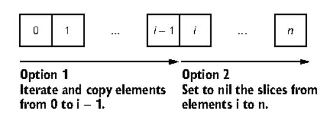

Figure 3.14 Option 1 iterates until 1, whereas option 2 iterates from 1.

The first option creates a copy of i elements. Hence, it must iterate from element 0 to i. The second option sets the remaining slices to nil, so it must iterate from element i to n. If performance is important and i is closer to n than 0, we may consider the second option. This requires iterating over fewer elements (at least, it's probably worth benchmarking the two options).

In this section, we saw two potential memory leak problems. The first was about slicing an existing slice or array to preserve the capacity. If we handle large slices and reslice them to keep only a fraction, a lot of memory will remain allocated but unused. The second problem is that when we use the slicing operation with pointers or structs with pointer fields, we need to know that the GC won't reclaim these elements. In that case, the two options are to either perform a copy or explicitly mark the remaining elements or their fields to nil.

Now, let's discuss maps in the context of initializations.

### 3.11 #27: Inefficient map initialization

This section discusses an issue similar to one we saw with slice initialization, but using maps. But first, we need to know the basics regarding how maps are implemented in Go to understand why tweaking map initialization is important.

### 3.11.1 Concepts

Arrow

A *map* provides an unordered collection of key-value pairs in which all the keys are distinct. In Go, a map is based on the hash table data structure. Internally, a hash table is an array of buckets, and each bucket is a pointer to an array of key-value pairs, as figure 3.15 illustrates.

An array of four elements backs the hash table in figure 3.15. If we examine the array index, we notice one bucket consisting of a single key-value pair (element): "two"/2. Each bucket has a fixed size of eight elements.

Each operation (read, update, insert, delete) is done by associating a key to an array index. This step relies on a hash function. This function is stable because we want it to return the same bucket, given the same key, consistently. In the previous

### Hash table representation: map[string]int

| Array |   |       |       |
|-------|---|-------|-------|
| 0     | - | Key   | Value |
| 1     |   | "two" | 2     |
| 2     |   |       |       |
| 3     |   |       |       |
|       |   |       |       |
|       |   |       |       |
|       |   |       |       |
|       |   |       |       |
|       |   |       |       |

Figure 3.15 A hash table example with a focus on bucket 0

example, hash("two") returns 0; hence, the element is stored in the bucket referenced by the array index 0.

If we insert another element, and hashing the key returns the same index, Go adds another element to the same bucket. Figure 3.16 shows this result.

### Hash table representation: map[string]int

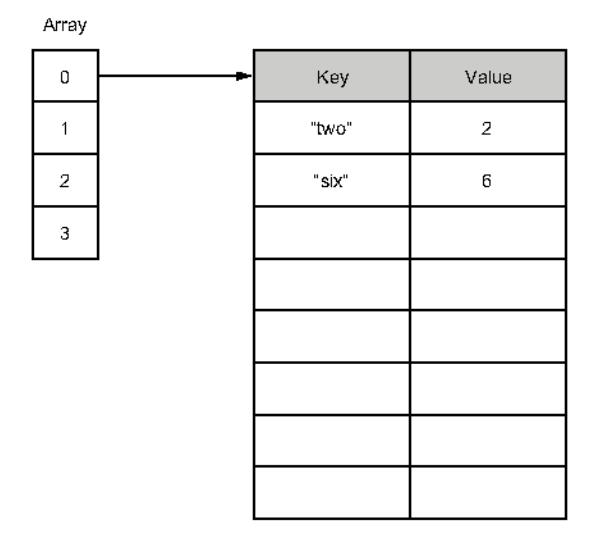

Figure 3.16 hash("six") returns 0; hence, the element is stored in the same bucket.

In the case of insertion into a bucket that is already full (bucket overflow), Go creates another bucket of eight elements and links the previous bucket to it. Figure 3.17 provides this result.

### Hash table representation: map[string]int

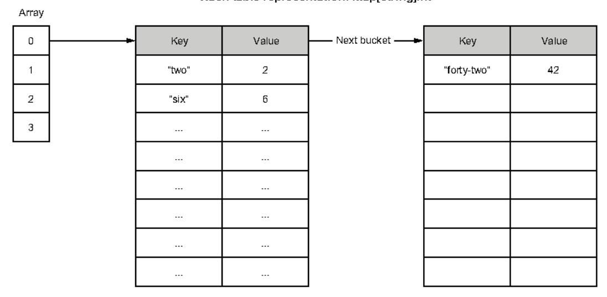

Figure 3.17 In case of a bucket overflow, Go allocates a new bucket and links the previous bucket to it.

Regarding reads, updates, and deletes, Go must calculate the corresponding array index. Then Go iterates sequentially over all the keys until it finds the provided one. Therefore, the worst-case time complexity for these three operations is O(p), where p is the total number of elements in the buckets (one bucket by default, multiple buckets in case of overflows).

Let's now discuss why initializing a map efficiently is important.

### 3.11.2 Initialization

To understand the problems related to inefficient map initialization, let's create a map[string]int type containing three elements:

```
m := map[string]int{
    "1": 1,
    "2": 2,
    "3": 3,
}
```

Internally, this map is backed by an array consisting of a single entry: hence, a single bucket. What happens if we add 1 million elements? In this case, a single entry won't be enough because finding a key would mean, in the worst case, going over thousands of buckets. This is why a map should be able to grow automatically to cope with the number of elements.

When a map grows, it doubles its number of buckets. What are the conditions for a map to grow?

- The average number of items in the buckets (called the *load factor*) is greater than a constant value. This constant equals 6.5 (but it may change in future versions because it's internal to Go).
- Too many buckets have overflowed (containing more than eight elements).

When a map grows, all the keys are dispatched again to all the buckets. This is why, in the worst-case scenario, inserting a key can be an O(n) operation, with n being the total number of elements in the map.

We saw that when using slices, if we knew up front the number of elements to be added to the slice, we could initialize it with a given size or capacity. This avoids having to keep repeating the costly slice growth operation. The idea is similar for maps. Indeed, we can use the make built-in function to provide an initial size when creating a map. For example, if we want to initialize a map that will contain 1 million elements, it can be done this way:

```
m := make(map[string]int, 1_000_000)
```

With a map, we can give the built-in function make only an initial size and not a capacity, as with slices: hence, a single argument.

By specifying a size, we provide a hint about the number of elements expected to go into the map. Internally, the map is created with an appropriate number of buckets

to store 1 million elements. This saves a lot of computation time because the map won't have to create buckets on the fly and handle rebalancing buckets.

Also, specifying a size n doesn't mean making a map with a maximum number of n elements. We can still add more than n elements if needed. Instead, it means asking the Go runtime to allocate a map with room for at least n elements, which is helpful if we already know the size up front.

To understand why specifying a size is important, let's run two benchmarks. The first inserts 1 million elements in a map without setting an initial size, whereas we initialize the second map with a size:

```
BenchmarkMapWithoutSize-4 6 227413490 ns/op
BenchmarkMapWithSize-4 13 91174193 ns/op
```

The second version, with an initial size, is about 60% faster. By providing a size, we prevent the map from growing to cope with the inserted elements.

Therefore, just like with slices, if we know up front the number of elements a map will contain, we should create it by providing an initial size. Doing this avoids potential map growth, which is quite heavy computation-wise because it requires reallocating enough space and rebalancing all the elements.

Let's continue our discussion about maps and look at a common mistake that leads to memory leaks.

### 3.12 #28: Maps and memory leaks

When working with maps in Go, we need to understand some important characteristics of how a map grows and shrinks. Let's delve into this to prevent an issue that can cause memory leaks.

First, to view a concrete example of this problem, let's design a scenario where we will work with the following map:

```
m := make(map[int][128]byte)
```

Each value of mis an array of 128 bytes. We will do the following:

- Allocate an empty map.
- 2 Add 1 million elements.
- Remove all the elements, and run a GC.

After each step, we want to print the size of the heap (using MB this time). This shows us how this example behaves memory-wise:

```
n := 1_000_000
m := make(map[int][128]byte)
printAlloc()
for i := 0; i < n; i++ {
         m[i] = randBytes()
}</pre>
Adds 1 million\nelements
```

```
printAlloc()
for i := 0; i < n; i++ {
    delete(m, i)
}

runtime.GC()
printAlloc()
runtime.KeepAlive(m)

Deletes 1 million\nelements

where i = 0; i < n; i++ {
    delete s 1 million\nelements

where i = 0; i < n; i++ {
    delete s 1 million\nelements

where i = 0; i < n; i++ {
    delete s 1 million\nelements

where i = 0; i < n; i++ {
    delete s 1 million\nelements

where i = 0; i < n; i++ {
    delete s 1 million\nelements

where i = 0; i < n; i++ {
    delete s 1 million\nelements

where i = 0; i < n; i++ {
    delete s 1 million\nelements

where i = 0; i < n; i++ {
    delete s 1 million\nelements

where i = 0; i < n; i++ {
    delete s 1 million\nelements

where i = 0; i < n; i++ {
    delete s 1 million\nelements

where i = 0; i < n; i++ {
    delete s 1 million\nelements

where i = 0; i < n; i++ {
    delete s 1 million\nelements

where i = 0; i < n; i++ {
    delete s 1 million\nelements

where i = 0; i < n; i++ {
    delete s 1 million\nelements

where i = 0; i < n; i++ {
    delete s 1 million\nelements

where i = 0; i < n; i++ {
    delete s 1 million\nelements

where i = 0; i < n; i++ {
    delete s 1 million\nelements

where i = 0; i < n; i++ {
    delete s 1 million\nelements

where i = 0; i < n; i++ {
    delete s 1 million\nelements

where i = 0; i < n; i++ {
    delete s 1 million\nelements

where i = 0; i < n; i++ {
    delete s 1 million\nelements

where i = 0; i < n; i++ {
    delete s 1 million\nelements

where i = 0; i < n; i++ {
    delete s 1 million\nelements

where i = 0; i < n; i++ {
    delete s 1 million\nelements

where i = 0; i < n; i++ {
    delete s 1 million\nelements

where i = 0; i < n; i++ {
    delete s 1 million\nelements

where i = 0; i < n; i++ {
    delete s 1 million\nelements

where i = 0; i < n; i++ {
    delete s 1 million\nelements

where i = 0; i < n; i++ {
    delete s 1 million\nelements

where i = 0; i < n; i++ {
    delete s 1 million\nelements

where i = 0; i < n; i++ {
    delete s 1 million\nelements

where i = 0; i < n; i++ {
    delete s 1 million\nelements

where i = 0; i < n;
```

We allocate an empty map, add 1 million elements, remove 1 million elements, and then run a GC. We also make sure to keep a reference to the map using runtime .KeepAlive so that the map isn't collected as well. Let's run this example:

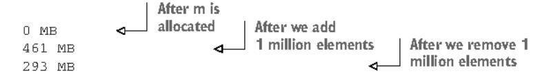

What can we observe? At first, the heap size is minimal. Then it grows significantly after having added 1 million elements to the map. But if we expected the heap size to decrease after removing all the elements, this isn't how maps work in Go. In the end, even though the GC has collected all the elements, the heap size is still 293 MB. So the memory shrunk, but not as we might have expected. What's the rationale?

We discussed in the previous section that a map is composed of eight-element buckets. Under the hood, a Go map is a pointer to a runtime.hmap struct. This struct contains multiple fields, including a B field, giving the number of buckets in the map:

```
type hmap struct {
    B uint8 // log_2 of # of buckets
```

After adding 1 million elements, the value of B equals 18, which means  $2^18 = 262,144$  buckets. When we remove 1 million elements, what's the value of B? Still 18. Hence, the map still contains the same number of buckets.

The reason is that the number of buckets in a map cannot shrink. Therefore, removing elements from a map doesn't impact the number of existing buckets; it just zeroes the slots in the buckets. A map can only grow and have more buckets; it never shrinks.

In the previous example, we went from 461 MB to 293 MB because the elements were collected, but running the GC didn't impact the map itself. Even the number of extra buckets (the buckets created because of overflows) remains the same.

Let's take a step back and discuss when the fact that a map cannot shrink can be a problem. Imagine building a cache using map[int][128]byte. This map holds per customer ID (the int), a sequence of 128 bytes. Now, suppose we want to save the last

1,000 customers. The map size will remain constant, so we shouldn't worry about the fact that a map cannot shrink.

However, let's say we want to store one hour of data. Meanwhile, our company has decided to have a big promotion for Black Friday: in one hour, we may have millions of customers connected to our system. But a few days after Black Friday, our map will contain the same number of buckets as during the peak time. This explains why we can experience high memory consumption that doesn't significantly decrease in such a scenario.

What are the solutions if we don't want to manually restart our service to clean the amount of memory consumed by the map? One solution could be to re-create a copy of the current map at a regular pace. For example, every hour, we can build a new map, copy all the elements, and release the previous one. The main drawback of this option is that following the copy and until the next garbage collection, we may consume twice the current memory for a short period.

Another solution would be to change the map type to store an array pointer: map[int]\*[128]byte. It doesn't solve the fact that we will have a significant number of buckets; however, each bucket entry will reserve the size of a pointer for the value instead of 128 bytes (8 bytes on 64-bit systems and 4 bytes on 32-bit systems).

Coming back to the original scenario, let's compare the memory consumption for each map type following each step. The following table shows the comparison.

| Step                                  | map[int][128]byte | map[int]*[128]byte |
|---------------------------------------|-------------------|--------------------|
| Allocate an empty map.                | 0 MB              | 0 MB               |
| Add 1 million elements.               | 461 MB            | 182 MB             |
| Remove all the elements and run a GC. | 293 MB            | 38 MB              |

As we can see, after removing all the elements, the amount of required memory is significantly less with a map[int]\*[128]byte type. Also, in this case, the amount of required memory is less significant during peak times due to some optimizations to reduce the memory consumed.

**NOTE** If a key or a value is over 128 bytes, Go won't store it directly in the map bucket. Instead, Go stores a pointer to reference the key or the value.

As we have seen, adding n elements to a map and then deleting all the elements means keeping the same number of buckets in memory. So, we must remember that because a Go map can only grow in size, so does its memory consumption. There is no automated strategy to shrink it. If this leads to high memory consumption, we can try different options such as forcing Go to re-create the map or using pointers to check if it can be optimized.

For the last section of this chapter, let's discuss comparing values in Go.

### 3.13 #29: Comparing values incorrectly

Comparing values is a common operation in software development. We frequently implement comparisons: writing a function to compare two objects, testing to compare a value against an expectation, and so on. Our first instinct might be to use the == operator everywhere. But as we will see in this section, this shouldn't always be the case. So when is it appropriate to use ==, and what are the alternatives?

To answer these questions, let's start with a concrete example. We create a basic customer struct and use == to compare two instances. What should be the output of this code, in your opinion?

```
type customer struct {
    id string
}

func main{) {
    cust1 := customer{id: "x"}
    cust2 := customer{id: "x"}
    fmt.Println{cust1 == cust2)
}
```

Comparing these two customer structs is a valid operation in Go, and it will print true. Now, what happens if we make a slight modification to the customer struct to add a slice field?

```
type customer struct {
   id
```

We might expect this code to print true as well. However, it doesn't even compile:

```
invalid operation:
    cust1 == cust2 (struct containing []float64 cannot be compared)
```

The problem relates to how the == and != operators work. These operators don't work with slices or maps. Hence, because the customer struct contains a slice, it doesn't compile.

It's essential to understand how to use == and != to make comparisons effectively. We can use these operators on operands that are *comparable*:

- Booleans—Compare whether two Booleans are equal.
- Numerics (int, float, and complex types)—Compare whether two numerics are equal.

- Strings—Compare whether two strings are equal.
- Channels—Compare whether two channels were created by the same call to make or if both are nil.
- Interfaces—Compare whether two interfaces have identical dynamic types and equal dynamic values or if both are nil.
- Pointers—Compare whether two pointers point to the same value in memory or if both are nil.
- Structs and arrays—Compare whether they are composed of similar types.

**NOTE** We can also use the ?, >=, <, and > operators with numeric types to compare values and with strings to compare their lexical order.

In the last example, our code failed to compile as the struct was composed on a non-comparable type (a slice).

We also need to know the possible issues of using == and != with any types. For example, comparing two integers assigned to any types is allowed:

```
var a any = 3
var b any = 3
fmt.Println(a == b)
```

### This code prints:

true

But what if we initialize two customer types (the latest version containing a slice field) and assign the values to any types? Here's an example:

```
var cust1 any = customer{id: "x", operations: []float64(1.}}
var cust2 any = customer{id: "x", operations: []float64(1.}}
fmt.Println(cust1 == cust2)
```

This code compiles. But as both types can't be compared because the customer struct contains a slice field, it leads to an error at run time:

```
panic: runtime error: comparing uncomparable type main.customer
```

With these behaviors in mind, what are the options if we have to compare two slices, two maps, or two structs containing noncomparable types? If we stick with the standard library, one option is to use run-time reflection with the reflect package.

Reflection is a form of metaprogramming, and it refers to the ability of an application to introspect and modify its structure and behavior. For example, in Go, we can use reflect. DeepEqual. This function reports whether two elements are deeply equal by recursively traversing two values. The elements it accepts are basic types plus arrays, structs, slices, maps, pointers, interfaces, and functions.

**NOTE** reflect. DeepEqual has a specific behavior depending on the type we provide. Before using it, read the documentation carefully.

Let's rerun the first example, adding reflect. DeepEqual:

```
cust1 := customer{id: "x", operations: []float64{1.}}
cust2 := customer{id: "x", operations: []float64{1.}}
fmt.Println{reflect.DeepEqual{cust1, cust2})
```

Even though the customer struct contains noncomparable types (slice), it operates as expected, printing true.

However, there are two things to keep in mind when using reflect.DeepEqual. First, it makes the distinction between an empty and a nil collection, as discussed in mistake #22, "Being confused about nil vs. empty slices." Is this a problem? Not necessarily; it depends on our use case. For example, if we want to compare the results of two unmarshaling operations (such as from JSON to a Go struct), we may want this difference to be raised. But it's worth keeping this behavior in mind to use reflect.DeepEqual effectively.

The other catch is something pretty standard in most languages. Because this function uses reflection, which introspects values at run time to discover how they are formed, it has a performance penalty. Doing a few benchmarks locally with structs of different sizes, on average, reflect.DeepEqual is about 100 times slower than ==. This might be a reason to favor using it in the context of testing instead of at run time.

If performance is a crucial factor, another option might be to implement our own comparison method. Here's an example that compares two customer structs and returns a Boolean:

```
func (a customer) equal(b customer) bool (
    if a.id != b.id {
                                               Compares
        return false
                                                the id fields
    if len(a.operations) != len(b.operations) {
                                                              Checks the length
        return false
                                                              of both slices
    for i := 0; i < len(a.operations); i++ {
                                                         Compares each
        if a.operations[i] != b.operations[i] {
                                                         element of both slices
            return false
    return true
}
```

In this code, we build our comparison method with custom checks on the different fields of the customer struct. Running a local benchmark on a slice composed of 100 elements shows that our custom equal method is about 96 times faster than reflect.DeepEqual.

In general, we should remember that the == operator is pretty limited. For example, it doesn't work with slices and maps. In most cases, using reflect.DeepEqual is a solution, but the main catch is the performance penalty. In the context of unit tests, some other options are possible, such as using external libraries with go-cmp (https://github.com/google/go-cmp) or testify (https://github.com/stretchr/testify).

Summary 93

However, if performance is crucial at run time, implementing our custom method might be the best solution.

One additional note: we must remember that the standard library has some existing comparison methods. For example, we can use the optimized bytes.Compare function to compare two slices of bytes. Before implementing a custom method, we need to make sure we don't reinvent the wheel.

### Summary

- When reading existing code, bear in mind that integer literals starting with 0 are octal numbers. Also, to improve readability, make octal integers explicit by prefixing them with 00.
- Because integer overflows and underflows are handled silently in Go, you can implement your own functions to catch them.
- Making floating-point comparisons within a given delta can ensure that your code is portable.
- When performing addition or subtraction, group the operations with a similar order of magnitude to favor accuracy. Also, perform multiplication and division before addition and subtraction.
- Understanding the difference between slice length and capacity should be part
  of a Go developer's core knowledge. The slice length is the number of available\nelements in the slice, whereas the slice capacity is the number of elements in
  the backing array.
- When creating a slice, initialize it with a given length or capacity if its length is already known. This reduces the number of allocations and improves performance. The same logic goes for maps, and you need to initialize their size.
- Using copy or the full slice expression is a way to prevent append from creating
  conflicts if two different functions use slices backed by the same array. However,
  only a slice copy prevents memory leaks if you want to shrink a large slice.
- To copy one slice to another using the copy built-in function, remember that the number of copied elements corresponds to the minimum between the two slice's lengths.
- Working with a slice of pointers or structs with pointer fields, you can avoid memory leaks by marking as nil the elements excluded by a slicing operation.
- To prevent common confusions such as when using the encoding/json or the reflect package, you need to understand the difference between nil and empty slices. Both are zero-length, zero-capacity slices, but only a nil slice doesn't require allocation.
- To check if a slice doesn't contain any element, check its length. This check works regardless of whether the slice is nil or empty. The same goes for maps.
- To design unambiguous APIs, you shouldn't distinguish between nil and empty slices.

- A map can always grow in memory, but it never shrinks. Hence, if it leads to some memory issues, you can try different options, such as forcing Go to recreate the map or using pointers.
- To compare types in Go, you can use the == and != operators if two types are comparable: Booleans, numerals, strings, pointers, channels, and structs are composed entirely of comparable types. Otherwise, you can either use reflect.DeepEqual and pay the price of reflection or use custom implementations and libraries.
