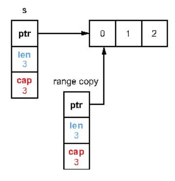
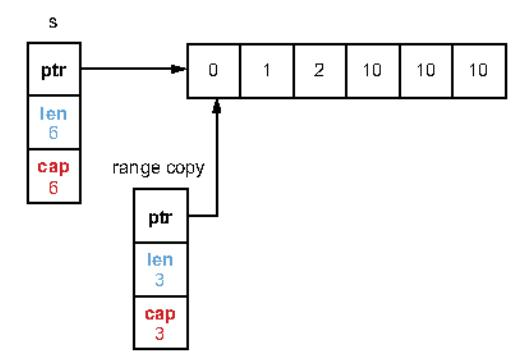
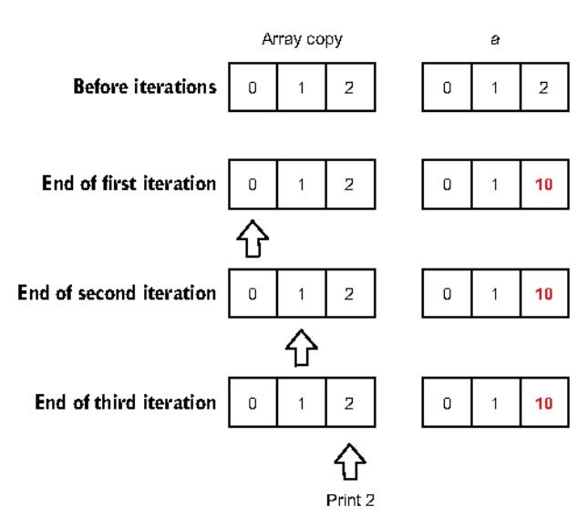
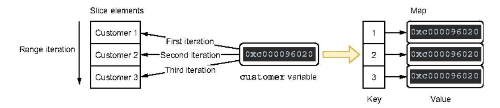
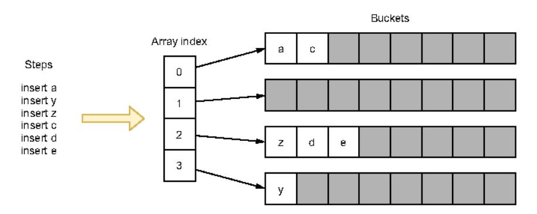

# Chapter 4: Control structures

## This chapter covers

- How a range loop assigns the element values and evaluates the provided expression
- Dealing with range loops and pointers
- Preventing common map iteration and loopbreaking mistakes
- Using defer inside a loop

Control structures in Go are similar to those in C or Java but differ from them in significant ways. For example, there is no do or while loop in Go, only a generalized for. This chapter delves into the most common mistakes related to control structures, with a strong focus on the range loop, which is a common source of misunderstanding.

### 4.1 #30: Ignoring the fact that elements are copied in range loops

A range loop is a convenient way to iterate over various data structures. We don't have to handle an index and the termination state. Go developers may forget or be

unaware of how a range loop assigns values, leading to common mistakes. First, let's remind ourselves how to use a range loop; then we'll look at how values are assigned.

### 4.1.1 Concepts

A range loop allows iterating over different data structures:

- String
- Array
- Pointer to an array
- Slice
- Map
- Receiving channel

Compared to a classic for loop, a range loop is a convenient way to iterate over all the elements of one of these data structures, thanks to its concise syntax. It's also less error-prone because we don't have to handle the condition expression and iteration variable manually, which may avoid mistakes such as off-by-one errors. Here is an example with an iteration over a slice of strings:

```
s := []string{"a", "b", "c"}
for i, v := range s {
    fmt.Printf("index=%d, value=%s\n", i, v)
}
```

This code loops over each element of the slice. In each iteration, as we iterate over a slice, range produces a pair of values: an index and an element value, assigned to i and v, respectively. In general, range produces two values for each data structure except a receiving channel, for which it produces a single element (the value).

In some cases, we may only be interested in the element value, not the index. Because not using a local variable would lead to a compilation error, we can instead use the blank identifier to replace the index variable, like so:

```
s := []string{"a", "b", "c"}
for _, v := range s {
    fmt.Printf{"value=%s\n", v)
}
```

Thanks to the blank identifier, we iterate over each element by ignoring the index and assigning only the element value to v.

If we're not interested in the value, we can omit the second element:

```
for i := range s {}
```

Now that we've refreshed our minds on using a range loop, let's see what kind of value is returned during an iteration.

### 4.1.2 Value copy

Understanding how the value is handled during each iteration is critical for using a range loop effectively. Let's see how it works with a concrete example.

We create an account struct containing a single balance field:

```
type account struct {
    balance float32
}
```

Next, we create a slice of account structs and iterate over each element using a range loop. During each iteration, we increment the balance of each account:

```
accounts := []account{
        (balance: 100.),
        (balance: 200.),
        (balance: 300.),
}
for _, a := range accounts {
        a.balance += 1000
}
```

Following this code, which of the following two choices do you think shows the slice's content?

```
[{100} {200} {300}][{1100} {1200} {1300}]
```

The answer is  $[\{100\} \{200\} \{300\}]$ . In this example, the range loop does not affect the slice's content. Let's see why.

In Go, everything we assign is a copy:

- If we assign the result of a function returning a struct, it performs a copy of that struct.
- If we assign the result of a function returning a pointer, it performs a copy of the memory address (an address is 64 bits long on a 64-bit architecture).

It's crucial to keep this in mind to avoid common mistakes, including those related to range loops. Indeed, when a range loop iterates over a data structure, it performs a copy of each element to the value variable (the second item).

Coming back to our example, iterating over each account element results in a struct copy being assigned to the value variable a. Therefore, incrementing the balance with a balance += 1000 mutates only the value variable (a), not an element in the slice.

So, what if we want to update the slice elements? There are two main options. The first option is to access the element using the slice index. This can be achieved with either a classic for loop or a range loop using the index instead of the value variable:

```
for i := range accounts {
    accounts[i].balance += 1000
}

for i := 0; i < len(accounts); i++ {
    accounts[i].balance += 1000
}</pre>
Uses the index variable to
access the element of the slice

Uses the traditional for loop
```

Both iterations have the same effect: updating the elements in the accounts slice.

Which one should we favor? It depends on the context. If we want to go over each element, the first loop is shorter to write and read. But if we need to control which element we want to update (such as one out of two), we should instead use the second loop.

### Updating slice elements: A third option

Another option is to keep using the range loop and access the value but modify the slice type to a slice of account pointers:

```
accounts := []*account{
     {balance: 100.},
     {balance: 200.},
     {balance: 300.},
}

for _, a := range accounts {
     a.balance += 1000
}
Updates the slice
type to []*account
Updates the slice\nelements directly
```

In this case, as we mentioned, the a variable is a copy of the account pointer stored in the slice. But as both pointers reference the same struct, the a.balance += 1000 statement updates the slice element.

However, this option has two main downsides. First, it requires updating the slice type, which may not always be possible. Second, if performance is important, we should note that iterating over a slice of pointers may be less efficient for a CPU because of the lack of predictability (we will discuss this point in mistake #91, "Not understanding CPU caches").

In general, we should remember that the value element in a range loop is a copy. Therefore, if the value is a struct we need to mutate, we will only update the copy, not the element itself, unless the value or field we modify is a pointer. The favored options are to access the element via the index using a range loop or a classic for loop.

In the next section, we keep working with range loops and see how the provided expression is evaluated.

### **4.2** #31: Ignoring how arguments are evaluated in range loops

The range loop syntax requires an expression. For example, in for i, v := range exp, exp is the expression. As we have seen, it can be a string, an array, a pointer to an array, a slice, a map, or a channel. Now, let's discuss the following question: how is this expression evaluated? When using a range loop, this is an essential point to avoid common mistakes.

Let's look at the following example, which appends an element to a slice we iterate over. Do you believe the loop will terminate?

```
s := []int{0, 1, 2}
for range s {
    s = append(s, 10)
}
```

To understand this question, we should know that when using a range loop, the provided expression is evaluated only once, before the beginning of the loop. In this context, "evaluated" means the provided expression is copied to a temporary variable, and then range iterates over this variable. In this example, when the s expression is evaluated, the result is a slice copy, as shown in figure 4.1.

The range loop uses this temporary variable. The original slice s is also updated during each iteration. Hence, after three iterations, the state is as shown in figure 4.2.



Figure 4.1 s is copied to a temporary variable used by range.



Figure 4.2 The temporary variable remains a three-length slice; hence, the iteration completes.

Each step results in appending a new element. However, after three steps, we have gone over all the elements. Indeed, the temporary slice used by range remains a three-length slice. Hence, the loop completes after three iterations.

The behavior is different with a classic for loop:

```
s := []int(0, 1, 2)
for i := 0; i < len(s); i++ {
    s = append(s, 10)
}</pre>
```

In this example, the loop never ends. The len(s) expression is evaluated during each iteration, and because we keep adding elements, we will never reach a termination state. It's essential to keep this difference in mind to use Go loops accurately.

Coming back to the range operator, we should know that the behavior we described (expression evaluated only once) also applies to all the data types provided.

As an example, let's look at the implication of this behavior with two other types: channels and arrays.

### 4.2.1 Channels

Let's see a concrete example based on iterating over a channel using a range loop. We create two goroutines, both sending elements to two distinct channels. Then, in the parent goroutine, we implement a consumer on one channel using a range loop that tries to switch to the other channel during the iteration:

```
ch1 := make(chan int, 3)
                                    Creates a first channel that will
go func() {
                                    contain elements 0, 1, and 2
    ch1 <- 0
    ch1 <- 1
    ch1 <- 2
    close(ch1)
} ()
ch2 := make(chan int, 3)
                                     Creates a second channel that will
go func() {
                                     contain elements 10, 11, and 12
    ch2 <- 10
    ch2 <- 11
    ch2 <- 12
    close(ch2)
} { }
                     Assigns the first
                      channel to ch
                                       | Creates a channel consumer
ch := ch1
                                       by iterating over ch
for v := range ch {
    fmt.Println(v)
    ch = ch2
                        Assigns the second
                       channel to ch
```

In this example, the same logic applies regarding how the range expression is evaluated. The expression provided to range is a ch channel pointing to ch1. Hence, range evaluates ch, performs a copy to a temporary variable, and iterates over elements from this channel. Despite the ch = ch2 statement, range keeps iterating over ch1, not ch2:

0 1 2

The ch = ch2 statement isn't without effect, though. Because we assigned ch to the second variable, if we call close(ch) following this code, it will close the second channel, not the first.

Let's now see the impact of the range operator evaluating each expression only once when used with an array.

### 4.2.2 Array

What's the impact of using a range loop with an array? Because the range expression is evaluated before the beginning of the loop, what is assigned to the temporary loop

variable is a copy of the array. Let's see this principle in action with the following example that updates a specific array index during the iteration:

```
creates an array
```

This code updates the last index to 10. However, if we run this code, it does not print 10; it prints 2, instead, as figure 4.3 shows.

### Array range iteration example



Figure 4.3 range iterates over the array copy (left) while the loop modifies a (right).

As we mentioned, the range operator creates a copy of the array. Meanwhile, the loop doesn't update the copy; it updates the original array: a. Therefore, the value of v during the last iteration is 2, not 10.

If we want to print the actual value of the last element, we can do so in two ways:

By accessing the element from its index:

```
a := [3]int(0, 1, 2)
for i := range a {
    a[2] = 10
    if i == 2 {
        fmt.Println(a[2])
    }
}
Accesses a[2] instead of
the range value variable
}
```

Because we access the original array, this code prints 2 instead of 10.

Using an array pointer:

```
a := [3]int(0, 1, 2)
for i, v := range &a {
    a[2] = 10
    if i == 2 {
        fmt.Println(v)
    }
}
Ranges over &a\ninstead of a
```

We assign a copy of the array pointer to the temporary variable used by range. But because both pointers reference the same array, accessing v also returns 10.

Both options are valid. However, the second option doesn't lead to copying the whole array, which may be something to keep in mind in case the array is significantly large.

In summary, the range loop evaluates the provided expression only once, before the beginning of the loop, by doing a copy (regardless of the type). We should remember this behavior to avoid common mistakes that might, for example, lead us to access the wrong element.

In the next section, we see how to avoid common mistakes using range loops with pointers.

### **4.3** #32: Ignoring the impact of using pointer elements in range loops

This section looks at a specific mistake when using a range loop with pointer elements. If we're not cautious enough, it can lead us to an issue where we reference the wrong elements. Let's examine this problem and how to fix it.

Before we begin, let's clarify the rationale for using a slice or map of pointer elements. There are three main cases:

• In terms of semantics, storing data using pointer semantics implies sharing the element. For example, the following method holds the logic to insert an element into a cache:

```
type Store struct {
    m map[string]*Foo
}

func (s Store) Put(id string, foo *Foo) {
    s.m[id] = foo
    // ...
}
```

Here, using the pointer semantics implies that the Foo element is shared by both the caller of Put and the Store struct.

 Sometimes we already manipulate pointers. Hence, it can be handy to store pointers directly in our collection instead of values. • If we store large structs, and these structs are frequently mutated, we can use pointers instead to avoid a copy and an insertion for each mutation:

```
func updateMapValue(mapValue map[string]LargeStruct, id string) {

Copies
```

Because updateMapPointer accepts a map of pointers, the mutation of the foo field can be done in a single step.

Now it's time to discuss the common mistake with pointer elements in range loops. We will consider the following two structs:

- A Customer struct representing a customer
- A Store that holds a map of Customer pointers

```
type Customer struct {
    ID     string
    Balance float64
}
type Store struct {
    m map[string]*Customer
}
```

The following method iterates over a slice of Customer elements and stores them in the m map:

```
func (s *Store) storeCustomers(customers []Customer) {
    for _, customer := range customers {
        s.m[customer.ID] = &customer
    }
}
Stores the customer
pointer in the map
```

In this example, we iterate over the input slice using the range operator and store Customer pointers in the map. But does this method do what we expect?

Let's give it a try by calling it with a slice of three different Customer structs:

```
s.storeCustomers{[]Customer{
```

Here's the result of this code if we print the map:

```
key=1, value=&main.Customer{ID:"3", Balance:0}
key=2, value=&main.Customer{ID:"3", Balance:0}
key=3, value=&main.Customer{ID:"3", Balance:0}
```

As we can see, instead of storing three different Customer structs, all the elements stored in the map reference the same Customer struct: 3. What have we done wrong?

Iterating over the customers slice using the range loop, regardless of the number of elements, creates a single customer variable with a fixed address. We can verify this by printing the pointer address during each iteration:

```
func (s *Store) storeCustomers(customers []Customer) {
    for _, customer := range customers {
        fmt.Printf("%p\n", &customer)
```

Why is this important? Let's examine each iteration:

- During the first iteration, customer references the first element: Customer 1.
   We store a pointer to a customer struct.
- During the second iteration, customer now references another element: Customer 2. We also store a pointer to a customer struct.
- Finally, during the last iteration, customer references the last element: Customer 3. Again, the same pointer is stored in the map.

At the end of the iterations, we have stored the same pointer in the map three times (see figure 4.4). This pointer's last assignment is a reference to the slice's last element: Customer 3. This is why all the map elements reference the same Customer.



Figure 4.4 The customer variable has a constant address, so we store in the map the same pointer.

So, how do we fix this problem? There are two main solutions. The first is similar to what we saw in mistake #1, "Unintended variable shadowing." It requires creating a local variable:

```
func (s *Store) storeCustomers(customers []Customer) {
   for _, customer := range customers {
        current := customer
        current variable
```

```
s.m[current.ID] = &current

Stores this pointer in the map
```

In this example, we don't store a pointer referencing customer; instead, we store a pointer referencing current. current is a variable referencing a unique Customer during each iteration. Therefore, following the loop, we have stored different pointers referencing different Customer structs in the map. The other solution is to store a pointer referencing each element using the slice index:

```
func (s *Store) storeCustomers(customers []Customer) {
   for i := range customers {
        customer := &customers[i]
```

In this solution, customer is now a pointer. Because it's initialized during each iteration, it has a unique address. Therefore, we store different pointers in the maps.

When iterating over a data structure using a range loop, we must recall that all the values are assigned to a unique variable with a single unique address. Therefore, if we store a pointer referencing this variable during each iteration, we will end up in a situation where we store the same pointer referencing the same element: the latest one. We can overcome this issue by forcing the creation of a local variable in the loop's scope or creating a pointer referencing a slice element via its index. Both solutions are fine. Also note that we took a slice data structure as an input, but the problem would be similar with a map.

In the next section, we see common mistakes related to map iteration.

### 4.4 #33: Making wrong assumptions during map iterations

Iterating over a map is a common source of misunderstanding and mistakes, mostly because developers make wrong assumptions. In this section, we discuss two different cases:

- Ordering
- Map update during an iteration

We will see two common mistakes based on wrong assumptions while iterating over a map.

### 4.4.1 Ordering

Regarding ordering, we need to understand a few fundamental behaviors of the map data structure:

- It doesn't keep the data sorted by key (a map isn't based on a binary tree).
- It doesn't preserve the order in which the data was added. For example, if we insert pair A before pair B, we shouldn't make any assumptions based on this insertion order.

Furthermore, when iterating over a map, we shouldn't make any ordering assumptions at all. Let's examine the implications of this statement.

We will consider the map shown in figure 4.5, consisting of four buckets (the elements represent the key). Each index of the backing array references a given bucket.



Figure 4.5 A map with four buckets

Now, let's iterate over this map using a range loop and print all the keys:

```
for k := range m {
    fmt.Print(k)
}
```

We mentioned that the data isn't sorted by key. Hence, we can't expect this code to print acdeyz. Meanwhile, we said the map doesn't preserve the insertion order. Hence, we also can't expect the code to print ayzcde.

But can we at least expect the code to print the keys in the order in which they are currently stored in the map, aczdey? No, not even this. In Go, the iteration order over a map is *not specified*. There is also no guarantee that the order will be the same from one iteration to the next. We should keep these map behaviors in mind so we don't base our code on wrong assumptions.

We can confirm all of these statements by running the previous loop twice:

```
zdyaec
czyade
```

As we can see, the order is different from one iteration to another.

**NOTE** Although there is no guarantee about the iteration order, the iteration distribution isn't uniform. It's why the official Go specification states that the iteration is unspecified, not random.

So why does Go have such a surprising way to iterate over a map? It was a conscious choice by the language designers. They wanted to add some form of randomness to

make sure developers never rely on any ordering assumptions while working with maps (see http://mng.bz/M2JW).

Hence, as Go developers, we should never make assumptions regarding ordering while iterating over a map. However, let's note that using packages from the standard library or external libraries can lead to different behaviors. For example, when the encoding/json package marshals a map into JSON, it reorders the data alphabetically by keys, regardless of the insertion order. But this isn't a property of the Go map itself. If ordering is necessary, we should rely on other data structures such as a binary heap (the GoDS library at https://github.com/emirpasic/gods contains helpful data structure implementations).

Let's now look at the second mistake related to updating a map while iterating over it.

### 4.4.2 Map insert during iteration

In Go, updating a map (inserting or deleting an element) during an iteration is allowed; it doesn't lead to a compilation error or a run-time error. However, there's another aspect we should consider when adding an entry in a map during an iteration, to avoid non-deterministic results.

Let's check the following example that iterates on a map[int]bool. If the pair value is true, we add another element. Can you guess what the output of this code will be?

```
m := map[int]bool{
    0: true,
    1: false,
    2: true,
}

for k, v := range m {
    if v {
        m[10+k] = true
    }
}

fmt.Println(m)
```

The result of this code is unpredictable. Here are some examples of results if we run this code multiple times:

```
map[0:true 1:false 2:true 10:true 12:true 20:true 22:true 30:true]
map[0:true 1:false 2:true 10:true 12:true 20:true 22:true 30:true 32:true]
map[0:true 1:false 2:true 10:true 12:true 20:true]
```

To understand the reason, we have to read what the Go specification says about a new map entry during an iteration:

If a map entry is created during iteration, it may be produced during the iteration or skipped. The choice may vary for each entry created and from one iteration to the next.

Hence, when an element is added to a map during an iteration, it may be produced during a follow-up iteration, or it may not. As Go developers, we don't have any way to

enforce the behavior. It also may vary from one iteration to another, which is why we got a different result three times.

It's essential to keep this behavior in mind to ensure that our code doesn't produce unpredictable outputs. If we want to update a map while iterating over it and make sure the added entries aren't part of the iteration, one solution is to work on a copy of the map, like so:

```
m := map[int]bool{
    0: true,
    1: false,
    2: true,
}
m2 := copyMap(m)

for k, v := range m {
    m2[k] = v
    if v {
        m2[10+k] = true
    }

fmt.Println(m2)
Creates a copy of the initial map

Updates m2\ninstead of m
}
```

In this example, we disassociate the map being read from the map being updated. Indeed, we keep iterating over m, but the updates are done on m2. This new version creates predictable and repeatable output:

```
map[0:true 1:false 2:true 10:true 12:true]
```

To summarize, when we work with a map, we shouldn't rely on the following:

- The data being ordered by keys
- Preservation of the insertion order
- A deterministic iteration order
- An element being produced during the same iteration in which it's added

Keeping these behaviors in mind should help us avoid common mistakes based on wrong assumptions.

In the next section, we see a mistake that is made fairly frequently while breaking loops.

### 4.5 #34: Ignoring how the break statement works

A break statement is commonly used to terminate the execution of a loop. When loops are used in conjunction with switch or select, developers frequently make the mistake of breaking the wrong statement.

Let's take a look at the following example. We implement a switch inside a for loop. If the loop index has the value 2, we want to break the loop:

```
for i := 0; i < 5; i++ {
   fmt.Printf("%d ", i)
   switch i {</pre>
```

```
default:
case 2:
break

break

}
```

This code may look right at first glance; however, it doesn't do what we expect. The break statement doesn't terminate the for loop: it terminates the switch statement, instead. Hence, instead of iterating from 0 to 2, this code iterates from 0 to 4: 0 1 2 3 4.

One essential rule to keep in mind is that a break statement terminates the execution of the innermost for, switch, or select statement. In the previous example, it terminates the switch statement.

So how can we write code that breaks the loop instead of the switch statement? The most idiomatic way is to use a label:

```
for i := 0; i < 5; i++ {
    fmt.Printf("%d ", i)

    switch i {
    default:
    case 2:
        break loop
    }

Terminates the loop attached to the loop label, not the switch</pre>
```

Here, we associate the loop label with the for loop. Then, because we provide the loop label to the break statement, it breaks the loop, not the switch. Therefore, this new version will print 0 1 2, as we expected.

### Is a break with a label just like goto?

Some developers may challenge whether a break with a label is idiomatic and see it as a fancy goto statement. However, this isn't the case, and such code is used in the standard library. For example, we see this in the net/http package while reading lines from a buffer:

```
readlines:
    for {
        line, err := rw.Body.ReadString('\n')
        switch {
        case err == io.EOF:
            break readlines
        case err != nil:
            t.Fatalf("unexpected error reading from CGI: %v", err)
        }
        // ...
}
```

This example uses an expressive label with readlines to emphasize the loop's goal. Hence, we should consider breaking a statement using labels an idiomatic approach in Go.

Breaking the wrong statement can also occur with a select inside a loop. In the following code, we want to use select with two cases and break the loop if the context cancels:

```
for {
    select {
    case <-ch:
        // Do something
    case <-ctx.Done():
        break
    }
    Breaks if the
    context cancels
}</pre>
```

Here the innermost for, switch, or select statement is the select statement, not the for loop. So, the loop repeats. Again, to break the loop itself, we can use a label:

```
for {
    select {
    case <-ch:
        // Do something
    case <-ctx.Done():
        break loop
    }
}

Terminates the loop attached to the loop label, not the select
```

Now, as expected, the break statement breaks the loop, not select.

**NOTE** We can also use continue with a label to go to the next iteration of the labeled loop.

We should remain cautious while using a switch or select statement inside a loop. When using break, we should always make sure we know which statement it will affect. As we have seen, using labels is the idiomatic solution to enforce breaking a specific statement.

In the last section of this chapter, we keep discussing loops, but this time in conjunction with the defer keyword.

### 4.6 #35: Using defer inside a loop

The defer statement delays a call's execution until the surrounding function returns. It's mainly used to reduce boilerplate code. For example, if a resource has to be closed eventually, we can use defer to avoid repeating the closure calls before every single return. However, one common mistake is to be unaware of the consequences of using defer inside a loop. Let's look into this problem.

We will implement a function that opens a set of files where the file paths are received via a channel. Hence, we have to iterate over this channel, open the files, and handle the closure. Here's our first version:

```
func readFiles(ch <-chan string) error { | Iterates over for path := range ch { | the channel
```

```
file, err := os.Open{path)
  if err != nil {
     return err
}

defer file.Close{)

// Do something with file
}
return nil
}
Opens
the file
to file.Close()
```

**NOTE** We will discuss how to handle defer errors in mistake #54, "Not handling defer errors."

There is a significant problem with this implementation. We have to recall that defer schedules a function call when the *surrounding* function returns. In this case, the defer calls are executed not during each loop iteration but when the readFiles function returns. If readFiles doesn't return, the file descriptors will be kept open forever, causing leaks.

What are the options to fix this problem? One might be to get rid of defer and handle the file closure manually. But if we did that, we would have to abandon a convenient feature of the Go toolset just because we were in a loop. So, what are the options if we want to keep using defer? We have to create another surrounding function around defer that is called during each iteration.

For example, we can implement a readFile function holding the logic for each new file path received:

```
func readFiles(ch <-chan string) error {
    for path := range ch {
        if err := readFile(path); err != mil {
                                                           Calls the readFile function
            return err
                                                           that contains the main logic
    3
    return nil
3
func readFile(path string) error {
   file, err := os.Open(path)
    if err != mil {
        return err
    }
    defer file.Close()
                                       Keeps the
                                       call to defer
    // Do something with file
    return nil
}
```

In this implementation, the defer function is called when readFile returns, meaning at the end of each iteration. Therefore, we do not keep file descriptors open until the parent readFiles function returns.

Another approach could be to make the readFile function a closure:

```
func readFiles(ch <-chan string) error {
    for path := range ch {
        err := func() error {
            // ...
            defer file.Close()
            // ...
        }()
        if err != nil {
            return err
        }
    }
    return nil
}</pre>
```

But intrinsically, this remains the same solution: adding another surrounding function to execute the defer calls during each iteration. The plain old function has the advantage of probably being a bit clearer, and we can also write a specific unit test for it.

When using defer, we must remember that it schedules a function call when the surrounding function returns. Hence, calling defer within a loop will stack all the calls: they won't be executed during each iteration, which may cause memory leaks if the loop doesn't terminate, for example. The most convenient approach to solving this problem is introducing another function to be called during each iteration. But if performance is crucial, one downside is the overhead added by the function call. If we have such a case and we want to prevent this overhead, we should get rid of defer and handle the defer call manually before looping.

### Summary

- The value element in a range loop is a copy. Therefore, to mutate a struct, for example, access it via its index or via a classic for loop (unless the element or the field you want to modify is a pointer).
- Understanding that the expression passed to the range operator is evaluated only once before the beginning of the loop can help you avoid common mistakes such as inefficient assignment in channel or slice iteration.
- Using a local variable or accessing an element using an index, you can prevent mistakes while copying pointers inside a loop.
- To ensure predictable outputs when using maps, remember that a map data structure
  - Doesn't order the data by keys
  - Doesn't preserve the insertion order
  - Doesn't have a deterministic iteration order
  - Doesn't guarantee that an element added during an iteration will be produced during this iteration
- Using break or continue with a label enforces breaking a specific statement. This can be helpful with switch or select statements inside loops.
- Extracting loop logic inside a function leads to executing a defer statement at the end of each iteration.
