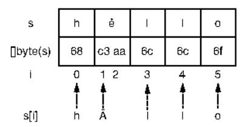

# Chapter 5: Strings

## This chapter covers

- Understanding the fundamental concept of the rune in Go
- Preventing common mistakes with string iteration and trimming
- Avoiding inefficient code due to string concatenations or useless conversions
- Avoiding memory leaks with substrings

In Go, a string is an immutable data structure holding the following:

- A pointer to an immutable byte sequence
- The total number of bytes in this sequence

We will see in this chapter that Go has a pretty unique way to deal with strings. Go introduces a concept called *runes*; this concept is essential to understand and may confuse newcomers. Once we know how strings are managed, we can avoid common mistakes while iterating on a string. We will also look at common mistakes made by Go developers while using or producing strings. In addition, we will see

that sometimes we can work directly with []byte, avoiding extra allocations. Finally, we will discuss how to avoid a common mistake that can create leaks from substrings. The primary goal of this chapter is to help you understand how strings work in Go by presenting common string mistakes.

### 5.1 #36: Not understanding the concept of a rune

We couldn't start this chapter about strings without discussing the concept of the rune in Go. As you will see in the following sections, this concept is key to thoroughly understanding how strings are handled and avoiding common mistakes. But before delving into Go runes, we need to make sure we are aligned about some fundamental programming concepts.

We should understand the distinction between a charset and an encoding:

- A charset, as the name suggests, is a set of characters. For example, the Unicode charset contains 2<sup>2</sup>1 characters.
- An encoding is the translation of a character's list in binary. For example, UTF-8 is an encoding standard capable of encoding all the Unicode characters in a variable number of bytes (from 1 to 4 bytes).

We mentioned characters to simplify the charset definition. But in Unicode, we use the concept of a *code point* to refer to an item represented by a single value. For example, the % character is identified by the U+6C49 code point. Using UTF-8, % is encoded using three bytes: 0xE6, 0xB1, and 0x89. Why is this important? Because in Go, a rune is a Unicode code point.

Meanwhile, we mentioned that UTF-8 encodes characters into 1 to 4 bytes, hence, up to 32 bits. This is why in Go, a rune is an alias of int32:

```
type rune = int32
```

Another thing to highlight about UTF-8: some people believe that Go strings are always UTF-8, but this isn't true. Let's consider the following example:

```
s := "hello"
```

We assign a string literal (a string constant) to s. In Go, a source code is encoded in UTF-8. So, all string literals are encoded into a sequence of bytes using UTF-8. However, a string is a sequence of arbitrary bytes; it's not necessarily based on UTF-8. Hence, when we manipulate a variable that wasn't initialized from a string literal (for example, reading from the filesystem), we can't necessarily assume that it uses the UTF-8 encoding.

**NOTE** golang.org/x, a repository that provides extensions to the standard library, contains packages to work with UTF-16 and UTF-32.

Let's get back to the hello example. We have a string composed of five characters: h, e, l, l, and o.

These *simple* characters are encoded using a single byte each. This is why getting the length of s returns 5:

```
s := "hello"
fmt.Println(len(s)) // 5
```

But a character isn't always encoded into a single byte. Coming back to the 汉 character, we mentioned that with UTF-8, this character is encoded into three bytes. We can validate this with the following example:

```
s := "没"
fmt.Println(len(s)) // 3
```

Instead of printing 1, this example prints 3. Indeed, the 1en built-in function applied on a string doesn't return the number of characters; it returns the number of bytes.

Conversely, we can create a string from a list of bytes. We mentioned that the  $\Re$  character was encoded using three bytes, 0xE6, 0xB1, and 0x89:

```
s := string{[]byte{0xE6, 0xB1, 0x89})
fmt.Printf("%s\n", s)
```

Here, we build a string composed of these three bytes. When we print the string, instead of printing three characters, the code prints a single one: X.

In summary:

- A charset is a set of characters, whereas an encoding describes how to translate a charset into binary.
- In Go, a string references an immutable slice of arbitrary bytes.
- Go source code is encoded using UTF-8. Hence, all string literals are UTF-8 strings. But because a string can contain arbitrary bytes, if it's obtained from somewhere else (not the source code), it isn't guaranteed to be based on the UTF-8 encoding.
- A rune corresponds to the concept of a Unicode code point, meaning an item represented by a single value.
- Using UTF-8, a Unicode code point can be encoded into 1 to 4 bytes.
- Using len on a string in Go returns the number of bytes, not the number of runes.

Having these concepts in mind is essential because runes as everywhere in Go. Let's see a concrete application of this knowledge involving a common mistake related to string iteration.

### 5.2 #37: Inaccurate string iteration

Iterating on a string is a common operation for developers. Perhaps we want to perform an operation for each rune in the string or implement a custom function to search for a specific substring. In both cases, we have to iterate on the different runes of a string. But it's easy to get confused about how iteration works.

Let's look at a concrete example. Here, we want to print the different runes in a string and their corresponding positions:

```
s := "hêllo"
for i := range s {
    fmt.Printf("position %d: %c\n", i, s[i])
}
fmt.Printf("len=%d\n", len(s))
The string literal contains
a special rune: ê.
```

We use the range operator to iterate over s, and then we want to print each rune using its index in the string. Here's the output:

```
position 0: h
position 1: Ã
position 3: 1
position 4: 1
position 5: o
len=6
```

This code doesn't do what we want. Let's highlight three points:

- The second rune is \( \tilde{A} \) in the output instead of \( \tilde{e} \).
- We jumped from position 1 to position 3: what is at position 2?
- len returns a count of 6, whereas s contains only 5 runes.

Let's start with the last observation. We already mentioned that len returns the number of bytes in a string, not the number of runes. Because we assigned a string literal to s, s is a UTF-8 string. Meanwhile, the special character ê isn't encoded in a single byte; it requires 2 bytes. Therefore, calling len(s) returns 6.

### Calculating the number of runes in a string

What if we want to get the number of runes in a string, not the number of bytes? How we can do this depends on the encoding.

In the previous example, because we assigned a string literal to  ${\tt s}$ , we can use the unicode/utf8 package:

```
fmt.Println(utf8.RuneCountInString(s)) // 5
```

Let's get back to the iteration to understand the remaining surprises:

```
for i := range s {
    fmt.Printf("position %d: %c\n", i, s[i])
}
```

We have to recognize that in this example, we don't iterate over each rune; instead, we iterate over each starting index of a rune, as shown in figure 5.1.

Printing s[i] doesn't print the ith rune; it prints the UTF-8 representation of the byte at index i. Hence, we printed hallo instead of hello. So how do we fix the code if we want to print all the different runes? There are two main options.



Figure 5.1 Printing s[i] prints the UTF-8 representation of each byte at index i.

We have to use the value element of the range operator:

```
s := "hêllo"
for i, r := range s {
    fmt.Printf("position %d: %c\n", i, r)
}
```

Instead of printing the rune using s[i], we use the r variable. Using a range loop on a string returns two variables, the starting index of a rune and the rune itself:

```
position 0: h
position 1: ê
position 3: 1
position 4: 1
position 5: o
```

The other approach is to convert the string into a slice of runes and iterate over it:

```
s := "hêllo"
runes := []rune(s)
for i, r := range runes {
    fmt.Printf("position %d: %c\n", i, r)
}

position 0: h
position 1: ê
position 2: 1
position 3: 1
position 4: o
```

Here, we convert s into a slice of runes using []rune(s). Then we iterate over this slice and use the value element of the range operator to print all the runes. The only difference has to do with the position: instead of printing the starting index of the rune's byte sequence, the code prints the rune's index directly.

Note that this solution introduces a run-time overhead compared to the previous one. Indeed, converting a string into a slice of runes requires allocating an additional slice and converting the bytes into runes: an O(n) time complexity with n the number of bytes in the string. Therefore, if we want to iterate over all the runes, we should use the first solution.

However, if we want to access the ith rune of a string with the first option, we don't have access to the rune index; rather, we know the starting index of a rune in the byte sequence. Hence, we should favor the second option in most cases:

```
s := "hêllo"
r := []rune(s)[4]
fmt.Printf("%c\n", r) // o
```

This code prints the fourth rune by first converting the string into a rune slice.

### A possible optimization to access a specific rune

One optimization is possible if a string is composed of single-byte runes: for example, if the string contains the letters A to Z and a to z. We can access the ith rune without converting the whole string into a slice of runes by accessing the byte directly using s[i]:

```
s := "hello"
fmt.Printf("%c\n", rune(s[4])) // o
```

In summary, if we want to iterate over a string's runes, we can use the range loop on the string directly. But we have to recall that the index corresponds not to the rune index but rather to the starting index of the byte sequence of the rune. Because a rune can be composed of multiple bytes, if we want to access the rune itself, we should use the value variable of range, not the index in the string. Meanwhile, if we are interested in getting the ith rune of a string, we should convert the string into a slice of runes in most cases.

In the next section, we look at a common source of confusion when using trim functions in the strings package.

### 5.3 #38: Misusing trim functions

One common mistake made by Go developers when using the strings package is to mix TrimRight and TrimSuffix. Both functions serve a similar purpose, and it can be fairly easy to confuse them. Let's take a look.

In the following example, we use TrimRight. What should be the output of this code?

```
fmt.Println(strings.TrimRight("123oxo", "xo"))
```

The answer is 123. Is that what you expected? If not, you were probably expecting the result of TrimSuffix, instead. Let's review both functions.

TrimRight removes all the trailing runes contained in a given set. In our example, we passed as a set  $x_0$ , which contains two runes: x and  $x_0$ . Figure 5.2 shows the logic.

```
123oxo
123ox
x is part of the set, remove
123o
o is part of the set, remove
123o
a o is part of the set, remove
123
3 is not part of the set, stop
```

Figure 5.2 TrimRight iterates backward until it finds a rune that is not part of the set.

TrimRight iterates backward over each rune. If a rune is part of the provided set, the function removes it. If not, the function stops its iteration and returns the remaining string. This is why our example returns 123.

On the other hand, TrimSuffix returns a string without a provided trailing suffix:

```
fmt.Println(strings.TrimSuffix("123oxo", "xo"))
```

Because 1230x0 ends with x0, this code prints 1230. Also, removing the trailing suffix isn't a repeating operation, so TrimSuffix ("123x0x0", "x0") returns 123x0.

The principle is the same for the left-hand side of a string with TrimLeft and TrimPrefix:

```
fmt.Println(strings.TrimLeft("oxo123", "ox")) // 123
fmt.Println(strings.TrimPrefix("oxo123", "ox")) /// o123
```

strings. TrimLeft removes all the leading runes contained in a set and hence prints 123. TrimPrefix removes the provided leading prefix, printing o123.

One last note related to this topic: Trim applies both TrimLeft and TrimRight on a string. So, it removes all the leading and trailing runes contained in a set:

```
fmt.Println(strings.Trim("oxo123oxo", "ox")) // 123
```

In summary, we have to make sure we understand the difference between TrimRight/TrimLeft, and TrimSuffix/TrimPrefix:

- TrimRight/TrimLeft removes the trailing/leading runes in a set.
- TrimSuffix/TrimPrefix removes a given suffix/prefix.

In the next section, we will delve into string concatenation.

### 5.4 #39: Under-optimized string concatenation

When it comes to concatenating strings, there are two main approaches in Go, and one of them can be really inefficient in some conditions. Let's examine this topic to understand which option we should favor and when.

Let's write a concat function that concatenates all the string elements of a slice using the += operator:

```
func concat(values []string) string {
    s := ""
    for _, value := range values {
        s += value
    }
    return s
}
```

During each iteration, the += operator concatenates s with the value string. At first sight, this function may not look wrong. But with this implementation, we forget one of the core characteristics of a string: its immutability. Therefore, each iteration doesn't update s; it reallocates a new string in memory, which significantly impacts the performance of this function.

Fortunately, there is a solution to deal with this problem, using the strings package and the Builder struct:

```
func concat(values []string) string {
    sb := strings.Builder{}
    for _, value := range values {
        _, _ = sb.WriteString(value)
    }
    return sb.String{)
}

Returns the
}
```

First, we created a strings. Builder struct using its zero value. During each iteration, we constructed the resulting string by calling the WriteString method that appends the content of value to its internal buffer, hence minimizing memory copying.

Note that WriteString returns an error as the second output, but we purposely ignore it. Indeed, this method will never return a non-nil error. So what's the purpose of this method returning an error as part of its signature? strings.Builder implements the io.StringWriter interface, which contains a single method: WriteString(s string) (n int, err error). Hence, to comply with this interface, WriteString must return an error.

**NOTE** We will discuss ignoring errors idiomatically in mistake #53, "Not handling an error."

Using strings. Builder, we can also append

- A byte slice using Write
- A single byte using WriteByte
- A single rune using WriteRune

Internally, strings. Builder holds a byte slice. Each call to WriteString results in a call to append on this slice. There are two impacts. First, this struct shouldn't be used concurrently, as the calls to append would lead to race conditions. The second impact is something that we saw in mistake #21, "Inefficient slice initialization": if the future length of a slice is already known, we should preallocate it. For that purpose, strings. Builder exposes a method  $Grow(n \ int)$  to guarantee space for another n bytes.

Let's write another version of the concat method by calling Grow with the total number of bytes:

```
func concat(values []string) string {
   total := 0
   for i := 0; i < len(values); i++ {
       total += len(values[i])
   }

   sb := strings.Builder{}
   sb.Grow(total)
   for _, value := range values {
       _, _ = sb.WriteString(value)</pre>
```

```
}
  return sb.String()
}
```

Before the iteration, we compute the total number of bytes the final string will contain and assign the result to total. Note that we're not interested in the number of runes but the number of bytes, so we use the len function. Then we call Grow to guarantee space for total bytes before iterating over the strings.

Let's run a benchmark to compare the three versions (v1 using +=; v2 using strings.Builder{} without preallocation; and v3 using strings.Builder{} with preallocation). The input slice contains 1,000 strings, and each string contains 1,000 bytes:

```
        BenchmarkConcatV1-4
        16
        72291485 ns/op

        BenchmarkConcatV2-4
        1188
        878962 ns/op

        BenchmarkConcatV3-4
        5922
        190340 ns/op
```

As we can see, the latest version is by far the most efficient: 99% faster than v1 and 78% faster than v2. We may ask ourselves, how can iterating twice on the input slice make the code faster? The answer lies in mistake #21, "Inefficient slice initialization": if a slice isn't allocated with a given length or capacity, the slice will keep growing each time it becomes full, resulting in additional allocations and copies. Hence, iterating twice is the most efficient option in this case.

strings.Builder is the recommended solution to concatenate a list of strings. Usually, this solution should be used within a loop. Indeed, if we just have to concatenate a few strings (such as a name and a surname), using strings.Builder is not recommended as doing so will make the code a bit less readable than using the += operator or fmt.Sprintf.

As a general rule, we can remember that performance-wise, the strings.Builder solution is faster from the moment we have to concatenate more than about five strings. Even though this exact number depends on many factors, such as the size of the concatenated strings and the machine, this can be a rule of thumb to help us decide when to choose one solution over the other. Also, we shouldn't forget that if the number of bytes of the future string is known in advance, we should use the Grow method to preallocate the internal byte slice.

Next, we will discuss the bytes package and why it may prevent useless string conversions.

### 5.5 #40: Useless string conversions

When choosing to work with a string or a []byte, most programmers tend to favor strings for convenience. But most I/O is actually done with []byte. For example, io.Reader, io.Writer, and io.ReadAll work with []byte, not strings. Hence, working with strings means extra conversions, although the bytes package contains many of the same operations as the strings package.

Let's see an example of what we *shouldn't* do. We will implement a getBytes function that takes an io. Reader as an input, reads from it, and calls a sanitize function.

The sanitization will be done by trimming all the leading and trailing white spaces. Here's the skeleton of getBytes:

```
func getBytes(reader io.Reader) ([]byte, error) {
    b, err := io.ReadAll(reader)
    if err != nil {
        return nil, err
    }
    // Call sanitize
}
```

We call ReadAll and assign the byte slice to b. How can we implement the sanitize function? One option might be to create a sanitize (string) string function using the strings package:

```
func sanitize(s string) string {
   return strings.TrimSpace(s)
}
```

Now, back to getBytes: as we manipulate a []byte, we must first convert it to a string before calling sanitize. Then we have to convert the results back into a []byte because getBytes returns a byte slice:

```
return []byte(sanitize(string(b))), nil
```

What's the problem with this implementation? We have to pay the extra price of converting a []byte into a string and then converting a string into a []byte. Memorywise, each of these conversions requires an extra allocation. Indeed, even though a string is backed by a []byte, converting a []byte into a string requires a copy of the byte slice. It means a new memory allocation and a copy of all the bytes.

### String immutability

We can use the following code to test the fact that creating a string from a []byte leads to a copy:

```
b := []byte('a', 'b', 'c')
s := string(b)
b[1] = 'x'
fmt.Println(s)
```

Running this code prints abc, not axc. Indeed, in Go, a string is immutable.

So, how should we implement the sanitize function? Instead of accepting and returning a string, we should manipulate a byte slice:

```
func sanitize(b []byte) []byte {
    return bytes.TrimSpace(b)
}
```

The bytes package also has a TrimSpace function to trim all the leading and trailing white spaces. Then, calling the sanitize function doesn't require any extra conversions:

```
return sanitize(b), nil
```

As we mentioned, most I/O is done with []byte, not strings. When we're wondering whether we should work with strings or []byte, let's recall that working with []byte isn't necessarily less convenient. Indeed, all the exported functions of the strings package also have alternatives in the bytes package: Split, Count, Contains, Index, and so on. Hence, whether we're doing I/O or not, we should first check whether we could implement a whole workflow using bytes instead of strings and avoid the price of additional conversions.

The last section of this chapter discusses how the substring operation can sometimes lead to memory leak situations.

### 5.6 #41: Substrings and memory leaks

In mistake #26, "Slices and memory leaks," we saw how slicing a slice or array may lead to memory leak situations. This principle also applies to string and substring operations. First, we will see how substrings are handled in Go to prevent memory leaks.

To extract a subset of a string, we can use the following syntax:

```
s1 := "Hello, World!"
s2 := s1[:5] // Hello
```

s2 is constructed as a substring of s1. This example creates a string from the first five bytes, not the first five runes. Hence, we shouldn't use this syntax in the case of runes encoded with multiple bytes. Instead, we should convert the input string into a []rune type first:

```
s1 := "Hêllo, World!"
s2 := string([]rune(s1)[:5]) // Hêllo
```

Now that we have refreshed our minds regarding the substring operation, let's look at a concrete problem to illustrate possible memory leaks.

We will receive log messages as strings. Each log will first be formatted with a universally unique identifier (UUID; 36 characters) followed by the message itself. We want to store these UUIDs in memory: for example, to keep a cache of the latest n UUIDs. We should also note that these log messages can potentially be quite heavy (up to thousands of bytes). Here is our implementation:

```
func (s store) handleLog(log string) error {
    if len(log) < 36 (
        return errors.New("log is not correctly formatted")
    }
    uuid := log[:36]
    s.store(uuid)
    // Do something
}</pre>
```

To extract the UUID, we use a substring operation with log[:36] as we know that the UUID is encoded on 36 bytes. Then we pass this unid variable to the store method that will store it in memory. Is this solution problematic? Yes, it is.

When doing a substring operation, the Go specification doesn't specify whether the resulting string and the one involved in the substring operation should share the same data. However, the standard Go compiler does let them share the same backing array, which is probably the best solution memory-wise and performance-wise as it prevents a new allocation and a copy.

We mentioned that log messages can be quite heavy. log[:36] will create a new string referencing the same backing array. Therefore, each unid string that we store in memory will contain not just 36 bytes but the number of bytes in the initial log string: potentially, thousands of bytes.

How can we fix this? By making a deep copy of the substring so that the internal byte slice of unid references a new backing array of only 36 bytes:

```
func (s store) handleLog(log string) error {
    if len(log) < 36 {
        return errors.New("log is not correctly formatted")
    }
    uuid := string([]byte(log[:36]))
```

The copy is performed by converting the substring into a []byte first and then into a string again. By doing this, we prevent a memory leak from occurring. The unid string is backed by an array consisting of only 36 bytes.

Note that some IDEs or linters may warn that the string([]byte(s)) conversions aren't necessary. For example, GoLand, the Go JetBrains IDE, warns about a redundant type conversion. This is true in the sense that we convert a string into a string, but this operation has an actual effect. As discussed, it prevents the new string from being backed by the same array as unid. We need to be aware that the warnings raised by IDEs or linters may sometimes be inaccurate.

**NOTE** Because a string is mostly a pointer, calling a function to pass a string doesn't result in a deep copy of the bytes. The copied string will still reference the same backing array.

As of Go 1.18, the standard library also includes a solution with strings. Clone that returns a fresh copy of a string:

```
uuid := strings.Clone(log[:36])
```

Calling strings.Clone makes a copy of log[:36] into a new allocation, preventing a memory leak.

We need to keep two things in mind while using the substring operation in Go. First, the interval provided is based on the number of bytes, not the number of runes.

Summary 125

Second, a substring operation may lead to a memory leak as the resulting substring will share the same backing array as the initial string. The solutions to prevent this case from happening are to perform a string copy manually or to use strings. Clone from Go 1.18.

### Summary

- Understanding that a rune corresponds to the concept of a Unicode code point and that it can be composed of multiple bytes should be part of the Go developer's core knowledge to work accurately with strings.
- Iterating on a string with the range operator iterates on the runes with the index corresponding to the starting index of the rune's byte sequence. To access a specific rune index (such as the third rune), convert the string into a []rune.
- strings.TrimRight/strings.TrimLeft removes all the trailing/leading runes contained in a given set, whereas strings.TrimSuffix/strings.TrimPrefix returns a string without a provided suffix/prefix.
- Concatenating a list of strings should be done with strings. Builder to prevent
  allocating a new string during each iteration.
- Remembering that the bytes package offers the same operations as the strings package can help avoid extra byte/string conversions.
- Using copies instead of substrings can prevent memory leaks, as the string returned by a substring operation will be backed by the same byte array.
