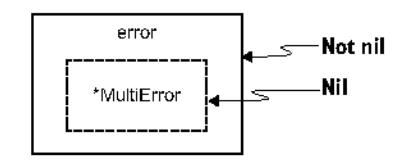

# Chapter 6: Functions and methods

## This chapter covers

- When to use value or pointer receivers
- When to use named result parameters and their potential side effects
- Avoiding a common mistake while returning a nil receiver
- Why using functions that accept a filename isn't a best practice
- Handling defer arguments

A function wraps a sequence of statements into a unit that can be called elsewhere. It can take some input(s) and produces some output(s). On the other hand, a method is a function attached to a given type. The attached type is called a receiver and can be a pointer or a value. We start this chapter by discussing how to choose one receiver type or the other, as this is usually a source of debate. Then we discuss named parameters, when to use them, and why they can sometimes lead to mistakes. We also discuss common mistakes when designing a function or returning specific values such as a nil receiver.

### 6.1 #42: Not knowing which type of receiver to use

Choosing a receiver type for a method isn't always straightforward. When should we use value receivers? When should we use pointer receivers? In this section, we look at the conditions to make the right decision.

In chapter 12, we will thoroughly discuss values versus pointers. So, this section will only scratch the surface in terms of performance. Also, in many contexts, using a value or pointer receiver should be dictated not by performance but rather by other conditions that we will discuss. But first, let's refresh our memories about how receivers work.

In Go, we can attach either a value or a pointer receiver to a method. With a value receiver, Go makes a copy of the value and passes it to the method. Any changes to the object remain local to the method. The original object remains unchanged.

As an illustration, the following example mutates a value receiver:

```
type customer struct {
    balance float64
}

func (c customer) add(v float64) {
    c.balance += v
}

func main() {
    c := customer{balance: 100.}
    c.add(50.)
    fmt.Printf{"balance: %.2f\n", c.balance)
}
The customer balance
remains unchanged.
```

Because we use a value receiver, incrementing the balance in the add method doesn't mutate the balance field of the original customer struct:

```
100.00
```

On the other hand, with a pointer receiver, Go passes the address of an object to the method. Intrinsically, it remains a copy, but we only copy a pointer, not the object itself (passing by reference doesn't exist in Go). Any modifications to the receiver are done on the original object. Here is the same example, but now the receiver is a pointer:

```
type customer struct {
    balance float64
}

func (c *customer) add(operation float64) {
    c.balance += operation
}

func main() {
    c := customer(balance: 100.0)
    c.add(50.0)
    fmt.Printf("balance: %.2f\n", c.balance)
}
The customer balance is updated.
```

Because we use a pointer receiver, incrementing the balance mutates the balance field of the original customer struct:

```
150.00
```

Choosing between value and pointer receivers isn't always straightforward. Let's discuss some of the conditions to help us choose.

A receiver must be a pointer

• If the method needs to mutate the receiver. This rule is also valid if the receiver is a slice and a method needs to append elements:

```
type slice []int
func (s *slice) add(element int) {
    *s = append(*s, element)
}
```

• If the method receiver contains a field that cannot be copied: for example, a type part of the sync package (we will discuss this point in mistake #74, "Copying a sync type").

A receiver should be a pointer

• If the receiver is a large object. Using a pointer can make the call more efficient, as doing so prevents making an extensive copy. When in doubt about how large is large, benchmarking can be the solution; it's pretty much impossible to state a specific size, because it depends on many factors.

A receiver must be a value

- If we have to enforce a receiver's immutability.
- If the receiver is a map, function, or channel. Otherwise, a compilation error occurs.

A receiver should be a value

- If the receiver is a slice that doesn't have to be mutated.
- If the receiver is a small array or struct that is naturally a value type without mutable fields, such as time. Time.
- If the receiver is a basic type such as int, float64, or string.

One case needs more discussion. Let's say that we design a different customer struct. Its mutable fields aren't part of the struct directly but are inside another struct:

```
type customer struct {
    data *data
```

```
func (c customer) add(operation float64) {
    c.data.balance += operation
}

func main() {
    c := customer{data: &data{
        balance: 100,
    }}
    c.add(50.)
    fmt.Printf{"balance: %.2f\n", c.data.balance)
}
```

Even though the receiver is a value, calling add changes the actual balance in the end:

150.00

In this case, we don't need the receiver to be a pointer to mutate balance. However, for clarity, we may favor using a pointer receiver to highlight that customer as a whole object is mutable.

### Mixing receiver types

Are we allowed to mix receiver types, such as a struct containing multiple methods, some of which have pointer receivers and others of which have value receivers? The consensus tends toward forbidding it. However, there are some counterexamples in the standard library, for example, time. Time.

The designers wanted to enforce that a time. Time struct is immutable. Hence, most methods such as After, IsZero, and UTC have a value receiver. But to comply with existing interfaces such as encoding. TextUnmarshaler, time. Time has to implement the UnmarshalBinary([]byte) error method, which mutates the receiver given a byte slice. Thus, this method has a pointer receiver.

Consequently, mixing receiver types should be avoided in general but is not forbidden in 100% of cases.

We should now have a good understanding of whether to use value or pointer receivers. Of course, it's impossible to be exhaustive, as there will always be edge cases, but this section's goal was to provide guidance to cover most cases. By default, we can choose to go with a value receiver unless there's a good reason not to do so. In doubt, we should use a pointer receiver.

In the next section, we discuss named result parameters: what they are and when to use them.

### 6.2 #43: Never using named result parameters

Named result parameters are an infrequently used option in Go. This section looks at when it's considered appropriate to use named result parameters to make our API more convenient. But first, let's refresh our memory about how they work.

When we return parameters in a function or a method, we can attach names to these parameters and use them as regular variables. When a result parameter is named, it's initialized to its zero value when the function/method begins. With named result parameters, we can also call a naked return statement (without arguments). In that case, the current values of the result parameters are used as the returned values.

Here's an example that uses a named result parameter b:

```
func f(a int) (b int) {

b = a

return

Returns the
current value of b
```

In this example, we attach a name to the result parameter: b. When we call return without arguments, it returns the current value of b.

When is it recommended that we use named result parameters? First, let's consider the following interface, which contains a method to get the coordinates from a given address:

```
type locator interface {
    getCoordinates(address string) {float32, float32, error)
}
```

Because this interface is unexported, documentation isn't mandatory. Just by reading this code, can you guess what these two float32 results are? Perhaps they are a latitude and a longitude, but in which order? Depending on the conventions, latitude isn't always the first element. Therefore, we have to check the implementation to understand the results.

In that case, we should probably use named result parameters to make the code easier to read:

```
type locator interface {
    getCoordinates(address string) {lat, lng float32, err error)
}
```

With this new version, we can understand the meaning of the method signature by looking at the interface: latitude first, longitude second.

Now, let's pursue the question of when to use named result parameters with the method implementation. Should we also use named result parameters as part of the implementation itself?

```
func (1 loc) getCoordinates(address string) {
   lat, lng float32, err error) {
   // ...
}
```

In this specific case, having an expressive method signature can also help code readers. Hence, we probably want to use named result parameters as well.

**NOTE** If we need to return multiple results of the same type, we can also think about creating an ad hoc struct with meaningful field names. However, this isn't always possible: for example, when satisfying an existing interface that we can't update.

Next, let's consider another function signature that allows us to store a Customer type in a database:

```
func StoreCustomer(customer Customer) (err error) {
    // ...
}
```

Here, naming the error parameter err isn't helpful and doesn't help readers. In this case, we should favor not using named result parameters.

So, when to use named result parameters depends on the context. In most cases, if it's not clear whether using them makes our code more readable, we shouldn't use named result parameters.

Also note that having the result parameters already initialized can be quite handy in some contexts, even though they don't necessarily help readability. The following example proposed in *Effective Go* (https://go.dev/doc/effective\_go) is inspired by the io.ReadFull function:

```
func ReadFull(r io.Reader, buf []byte) {n int, err error) {
   for len(buf) > 0 && err == nil {
      var nr int
      nr, err = r.Read(buf)
      n += nr
      buf = buf[nr:]
   }
   return
}
```

In this example, having named result parameters doesn't really increase readability. However, because both n and err are initialized to their zero value, the implementation is shorter. On the other hand, this function can be slightly confusing for readers at first sight. Again, it's a question of finding the right balance.

One note regarding naked returns (returns without arguments): they are considered acceptable in short functions; otherwise, they can harm readability because the reader must remember the outputs throughout the entire function. We should also be consistent within the scope of a function, using either only naked returns or only returns with arguments.

So what are the rules regarding named result parameters? In most cases, using named result parameters in the context of an interface definition can increase readability without leading to any side effects. But there's no strict rule in the context of a method implementation. In some cases, named result parameters can also increase readability: for example, if two parameters have the same type. In other cases, they can also be used for convenience. Therefore, we should use named result parameters sparingly when there's a clear benefit.

**NOTE** In mistake #54, "Not handling defer errors," we will discuss another use case for using named result parameters in the context of defer calls.

Furthermore, if we're not careful enough, using named result parameters can lead to side effects and unintended consequences, as we see in the next section.

### 6.3 #44: Unintended side effects with named result parameters

We mentioned why named result parameters can be useful in some situations. But as these result parameters are initialized to their zero value, using them can sometimes lead to subtle bugs if we're not careful enough. This section illustrates such a case.

Let's enhance our previous example of a method that returns the latitude and longitude from a given address. Because we return two float32s, we decide to use named result parameters to make the latitude and longitude explicit. This function will first validate the given address and then get the coordinates. In between, it will perform a check on the input context to make sure it wasn't canceled and that its deadline hasn't passed.

**NOTE** We will delve into the concept of context in Go in mistake #60, "Misunderstanding Go contexts." If you're not familiar with contexts, briefly, a context can carry a cancellation signal or a deadline. We can check those by calling the Err method and testing that the returned error isn't nil.

Here's the new implementation of the getCoordinates method. Can you spot what's wrong with this code?

```
func (1 loc) getCoordinates(ctx context.Context, address string) {
   lat, lng float32, err error) {
    isValid := 1.validateAddress(address)
    if !isValid {
        return 0, 0, errors.New("invalid address")
   }

   if ctx.Err() != nil {
        return 0, 0, err
   }

        Checks whether the context was canceled or the deadline has passed

   // Get and return coordinates
}
```

The error might not be obvious at first glance. Here, the error returned in the if ctx.Err() != nil scope is err. But we haven't assigned any value to the err variable. It's still assigned to the zero value of an error type: nil. Hence, this code will always return a nil error.

Furthermore, this code compiles because err was initialized to its zero value due to named result parameters. Without attaching a name, we would have gotten the following compilation error:

```
Unresolved reference 'err'
```

One possible fix is to assign ctx.Err() to err like so:

```
if err := ctx.Err{); err != nil {
    return 0, 0, err
}
```

We keep returning err, but we first assign it to the result of ctx. Err(). Note that err in this example shadows the result variable.

### Using a naked return statement

Another option is to use a naked return statement:

```
if err = ctx.Err(); err != nil {
    return
}
```

However, doing so would break the rule stating that we shouldn't mix naked returns and returns with arguments. In this case, we should probably stick with the first option. Remember that using named result parameters doesn't necessarily mean using naked returns. Sometimes we can just use named result parameters to make a signature clearer.

We conclude this discussion by emphasizing that named result parameters can improve code readability in some cases (such as returning the same type multiple times) and be quite handy in others. But we must recall that each parameter is initialized to its zero value. As we have seen in this section, this can lead to subtle bugs that aren't always straightforward to spot while reading code. Therefore, let's remain cautious when using named result parameters, to avoid potential side effects.

In the next section, we discuss a common mistake made by Go developers when a function returns an interface.

### 6.4 #45: Returning a nil receiver

In this section, we discuss the impact of returning an interface and why doing so may lead to errors in some conditions. This mistake is probably one of the most wide-spread in Go because it may be considered counterintuitive, at least before we've made it.

Let's consider the following example. We will work on a Customer struct and implement a Validate method to perform sanity checks. Instead of returning the first error, we want to return a list of errors. To do that, we will create a custom error type to convey multiple errors:

```
type MultiError struct (
    errs []string
}
func {m *MultiError) Add(err error) {
    m.errs = append{m.errs, err.Error())
}
```

```
func (m *MultiError) Error() string (
    return strings.Join(m.errs, ";")
}
Implements the\nerror interface
```

MultiError satisfies the error interface because it implements Error() string. Meanwhile, it exposes an Add method to append an error. Using this struct, we can implement a Customer. Validate method in the following manner to check the customer's age and name. If the sanity checks are OK, we want to return a nil error:

```
func (c Customer) Validate() error (
    var m *MultiError
                                         Instantiates an
                                         empty *MultiError
    if c.Age < 0 {
        m = &MultiError()
        m.Add(errors.New("age is negative"))
                                                          Appends an error if
                                                          the age is negative
    if c.Name == "" {
        if m == nil {
            m = &MultiError{}
        m.Add(errors.New("name is nil"))
                                                      Appends an error
    }
                                                      if the name is nil
    return m
```

In this implementation, m is initialized to the zero value of \*MultiError: hence, nil. When a sanity check fails, we allocate a new MultiError if needed and then append an error. In the end, we return m, which can be either a nil pointer or a pointer to a MultiError struct, depending on the checks.

Now, let's test this implementation by running a case with a valid Customer:

```
customer := Customer{Age: 33, Name: "John"}\nif err := customer.Validate(); err != nil {
    log.Fatalf("customer is invalid: %v", err)
}
```

### Here is the output:

```
2021/05/08 13:47:28 customer is invalid: <nil>
```

This result may be pretty surprising. The Customer was valid, yet the err != nil condition was true, and logging the error printed <nil>. So, what's the issue?

In Go, we have to know that a pointer receiver can be nil. Let's experiment by creating a dummy type and calling a method with a nil pointer receiver:

```
type Foo struct{}
func {foo *Foo) Bar{} string {
    return "bar"
}
```

```
func main() {
   var foo *Foo
   fmt.Println(foo.Bar())
}
```

foo is initialized to the zero value of a pointer: nil. But this code compiles, and it prints bar if we run it. A nil pointer is a valid receiver.

But why is this the case? In Go, a method is just syntactic sugar for a function whose first parameter is the receiver. Hence, the Bar method we've seen is similar to this function:

```
func Bar(foo *Foo) string {
    return "bar"
}
```

We know that passing a nil pointer to a function is valid. Therefore, using a nil pointer as a receiver is also valid.

Let's get back to our initial example:

```
func (c Customer) Validate() error {
    var m *MultiError

    if c.Age < 0 {
```

m is initialized to the zero value of a pointer: nil. Then, if all the checks are valid, the argument provided to the return statement isn't nil directly but a nil pointer. Because a nil pointer is a valid receiver, converting the result into an interface won't yield a nil value. In other words, the caller of Validate will always get a non-nil error.

To make this point clear, let's remember that in Go, an interface is a dispatch wrapper. Here, the wrappee is nil (the MultiError pointer), whereas the wrapper isn't (the error interface); see figure 6.1.

Therefore, regardless of the Customer provided, the caller of this function will always receive a non-nil error. Understanding this behavior is imperative, because it's a widespread Go mistake.



Figure 6.1 The error wrapper isn't nil.

So, what should we do to fix this example? The easiest solution is to return m only if it's not nil:

```
func (c Customer) Validate() error {
   var m *MultiError
```

```
if c.Age < 0 {
```

At the end of the method, we check whether m is not nil. If that is true, we return m; otherwise, we return nil explicitly. Hence, in the case of a valid Customer, we return a nil interface, not a nil receiver converted into a non-nil interface.

We've seen in this section that in Go, having a nil receiver is allowed, and an interface converted from a nil pointer isn't a nil interface. For that reason, when we have to return an interface, we should return not a nil pointer but a nil value directly. Generally, having a nil pointer isn't a desirable state and means a probable bug.

We saw an example with errors throughout this section because this is the most common case leading to this error. But this problem isn't only tied to errors: it can happen with any interface implemented using pointer receivers.

The next section discusses a common design mistake when using a filename as a function input.

### 6.5 #46: Using a filename as a function input

When creating a new function that needs to read a file, passing a filename isn't considered a best practice and can have negative effects, such as making unit tests harder to write. Let's delve into this problem and understand how to overcome it.

Suppose we want to implement a function to count the number of empty lines in a file. One way to implement this function would be to accept a filename and use bufio.NewScanner to scan and check every line:

```
func countEmptyLinesInFile(filename string) (int, error) {
    file, err := os.Open(filename)
```

We open a file from the filename. Then we use bufio. NewScanner to scan every line (by default, it splits the input per line).

This function will do what we expect it to do. Indeed, as long as the provided filename is valid, we will read from it and return the number of empty lines. So what's the problem?

Let's say we want to implement unit tests to cover the following cases:

- A nominal case
- An empty file
- A file containing only empty lines

Each unit test will require creating a file in our Go project. The more complex the function is, the more cases we may want to add, and the more files we will create. We may have to create dozens of files in some cases, which can quickly become unmanageable.

Furthermore, this function isn't reusable. For example, if we had to implement the same logic but count the number of empty lines with an HTTP request, we would have to duplicate the main logic:

```
func countEmptyLinesInHTTPRequest(request http.Request) (int, error) {
    scanner := bufio.NewScanner(request.Body)
    // Copy the same logic
}
```

One way to overcome these limitations might be to make the function accept a \*bufio.Scanner (the output returned by bufio.NewScanner). Both functions have the same logic from the moment we create the scanner variable, so this approach would work. But in Go, the idiomatic way is to start from the reader's abstraction.

Let's write a new version of the countEmptyLines function that receives an io.Reader abstraction instead:

```
func countEmptyLines(reader io.Reader) (int, error) {

scanner := bufio.NewScanner(reader)
for scanner.Scan() {

Creates a *bufio.Scanner from an io.Reader, not an *os.File

// ...
}
```

Because bufio. NewScanner accepts an io. Reader, we can directly pass the reader variable.

What are the benefits of this approach? First, this function abstracts the data source. Is it a file? An HTTP request? A socket input? It's not important for the function. Because \*os.File and the Body field of http.Request implement io.Reader, we can reuse the same function regardless of the input type.

Another benefit is related to testing. We mentioned that creating one file per test case could quickly become cumbersome. Now that countEmptyLines accepts an io.Reader, we can implement unit tests by creating an io.Reader from a string:

```
func TestCountEmptyLines(t *testing.T) {
   emptyLines, err := countEmptyLines(strings.NewReader(
```

```
baz
`))

// Test logic
}
```

In this test, we create an io.Reader using strings.NewReader from a string literal directly. Therefore, we don't have to create one file per test case. Each test case can be self-contained, improving the test readability and maintainability as we don't have to open another file to see the content.

Accepting a filename as a function input to read from a file should, in most cases, be considered a code smell (except in specific functions such as os.Open). As we've seen, it makes unit tests more complex because we may have to create multiple files. It also reduces the reusability of a function (although not all functions are meant to be reused). Using the io.Reader interface abstracts the data source. Regardless of whether the input is a file, a string, an HTTP request, or a gRPC request, the implementation can be reused and easily tested.

In the last section of the chapter, let's discuss a common mistake related to defer: how function/method arguments and method receivers are evaluated.

### 6.6 #47: Ignoring how defer arguments and receivers are evaluated

We mentioned in a previous section that the defer statement delays a call's execution until the surrounding function returns. A common mistake made by Go developers is not understanding how arguments are evaluated. We will delve into this problem with two subsections: one related to function and method arguments and the second related to method receivers.

### 6.6.1 Argument evaluation

To illustrate how arguments are evaluated with defer, let's work on a concrete example. A function needs to call two functions foo and bar. Meanwhile, it has to handle a status regarding execution:

- StatusSuccess if both foo and bar return no errors
- StatusErrorFoo if foo returns an error
- StatusErrorBar if bar returns an error

We will use this status for multiple actions: for example, to notify another goroutine and to increment counters. To avoid repeating these calls before every return statement, we will use defer. Here's our first implementation:

```
const {
    StatusSuccess = "success"
    StatusErrorFoo = "error_foo"
    StatusErrorBar = "error_bar"
}
```

```
func f() error (
   var status string
   defer notify(status)
                                        Defers the call to notify
   defer incrementCounter(status)
                                             I increment Counter
    if err := foo(); err != nil {
        status = StatusErrorFoo
                                           Sets the status
        return err
                                           to error foo
    }
    if err := bar{); err != mil {
        status = StatusErrorBar
                                            Sets the status
        return err
                                           to error bar
   status = StatusSuccess
                                      Sets the status
   return nil
                                      to success
```

First we declare a status variable. Then we defer the calls to notify and increment—Counter using defer. Throughout this function, and depending on the execution path, we update status accordingly.

However, if we give this function a try, we see that regardless of the execution path, notify and incrementCounter are always called with the same status: an empty string. How is this possible?

We need to understand something crucial about argument evaluation in a defer function: the arguments are evaluated *right away*, not once the surrounding function returns. In our example, we call notify(status) and incrementCounter(status) as defer functions. Therefore, Go will delay these calls to be executed once f returns with the current value of status at the stage we used defer, hence passing an empty string. How can we solve this problem if we want to keep using defer? There are two leading solutions.

The first solution is to pass a string pointer to the defer functions:

```
func f() error {
                                     Passes a string
   var status string
                                    pointer to notify
   defer notify(&status)
   defer incrementCounter(&status)
                                                 Passes a string pointer
                                                 to incrementCounter
    // The rest of the function is unchanged
    if err := foo(); err != mil {
        status = StatusErrorFoo
        return err
    if err := bar(); err != mil (
        status = StatusErrorBar
        return err
    }
```

```
status = StatusSuccess
return nil
}
```

We keep updating status depending on the cases, but now notify and increment—Counter receive a string pointer. Why does this approach work?

Using defer evaluates the arguments right away: here, the address of status. Yes, status itself is modified throughout the function, but its address remains constant, regardless of the assignments. Hence, if notify or incrementCounter uses the value referenced by the string pointer, it will work as expected. But this solution requires changing the signature of the two functions, which may not always be possible.

There's another solution: calling a closure as a defer statement. As a reminder, a closure is an anonymous function value that references variables from outside its body. The arguments passed to a defer function are evaluated right away. But we must know that the variables referenced by a defer closure are evaluated *during* the closure execution (hence, when the surrounding function returns).

Here is an example to clarify how defer closures work. A closure references two variables, one as a function argument and the second as a variable outside its body:

```
func main() {
    i := 0
    j := 0
    defer func(i int) {
        fmt.Println(i, j)
    }(i)
    i++
    j++
```

Here, the closure uses i and j variables. i is passed as a function argument, so it's evaluated immediately. Conversely, j references a variable outside of the closure body, so it's evaluated when the closure is executed. If we run this example, it will print 0 1.

Therefore, we can use a closure to implement a new version of our function:

```
func f() error {
    var status string
    defer func() {
        notify(status)
        incrementCounter(status)
    }()

// The rest of the function is unchanged

Calls a closure as the defer function

Calls notify within the closure and reference status

Calls incrementCounter within the closure and reference status
```

Here, we wrap the calls to both notify and incrementCounter within a closure. This closure references the status variable from outside its body. Therefore, status is evaluated once the closure is executed, not when we call defer. This solution also works and doesn't require notify and incrementCounter to change their signature.

Now, what about using defer on a method with a pointer or value receiver? Let's look at these questions.

### 6.6.2 Pointer and value receivers

In mistake #42, "Not knowing which type of receiver to use," we said that a receiver can be either a value or a pointer. The same logic related to argument evaluation applies when we use defer on a method: the receiver is also evaluated immediately. Let's understand the impact with both receiver types.

First, here's an example that calls a method on a value receiver using defer but mutates this receiver afterward:

```
func main() {
    s := Struct{id: "foo"}
    defer s.print()
    s.id = "bar"
}

type Struct struct {
    id string
}

func {s Struct) print() {
    fmt.Println(s.id)}

func {s is evaluated immediately.

Updates s.id
(not visible)
```

We defer the call to the print method. As with arguments, calling defer makes the receiver be evaluated immediately. Hence, defer delays the method's execution with a struct that contains an id field equal to foo. Therefore, this example prints foo.

Conversely, if the pointer is a receiver, the potential changes to the receiver after the call to defer are visible:

```
func main() {
    s := &Struct{id: "foo"}
    defer s.print()
    s.id = "bar"
}

type Struct struct {
    id string
}

func (s *Struct) print() {
    fmt.Println(s.id)
```

The s receiver is also evaluated immediately. However, calling the method leads to copying the pointer receiver. Hence, the changes made to the struct referenced by the pointer are visible. This example prints bar.

In summary, when we call defer on a function or method, the call's arguments are evaluated immediately. If we want to mutate the arguments provided to defer

afterward, we can use pointers or closures. For a method, the receiver is also evaluated immediately; hence, the behavior depends on whether the receiver is a value or a pointer.

### Summary

- The decision whether to use a value or a pointer receiver should be made based on factors such as the type, whether it has to be mutated, whether it contains a field that can't be copied, and how large the object is. When in doubt, use a pointer receiver.
- Using named result parameters can be an efficient way to improve the readability of a function/method, especially if multiple result parameters have the same type. In some cases, this approach can also be convenient because named result parameters are initialized to their zero value. But be cautious about potential side effects.
- When returning an interface, be cautious about returning not a nil pointer but an explicit nil value. Otherwise, unintended consequences may result because the caller will receive a non-nil value.
- Designing functions to receive io.Reader types instead of filenames improves
  the reusability of a function and makes testing easier.
- Passing a pointer to a defer function and wrapping a call inside a closure are two possible solutions to overcome the immediate evaluation of arguments and receivers.
