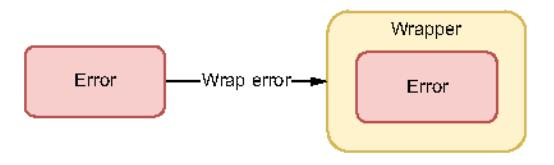
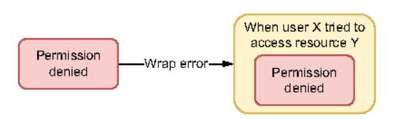
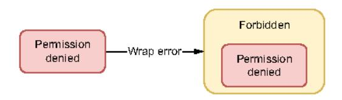
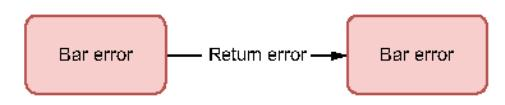
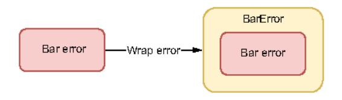
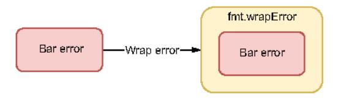
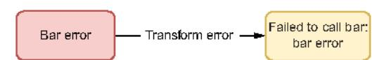
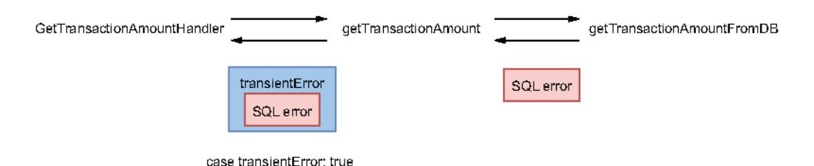
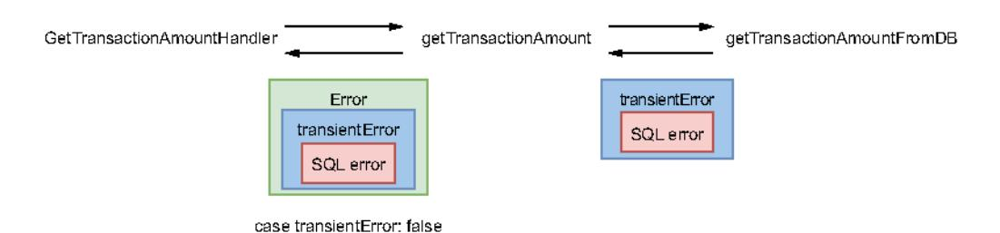

# Chapter 7: Error management

## This chapter covers

- Understanding when to panic
- Knowing when to wrap an error
- Comparing error types and error values efficiently since Go 1.13
- Handling errors idiomatically
- Understanding how to ignore an error
- Handling errors in defer calls

Error management is a fundamental aspect of building robust and observable applications, and it should be as important as any other part of a codebase. In Go, error management doesn't rely on the traditional try/catch mechanism as most programming languages do. Instead, errors are returned as normal return values.

This chapter will cover the most common mistakes related to errors.

### 7.1 #48: Panicking

It's pretty common for Go newcomers to be somewhat confused about error handling. In Go, errors are usually managed by functions or methods that return an

error type as the last parameter. But some developers may find this approach surprising and be tempted to reproduce exception handling in languages such as Java or Python using panic and recover. So, let's refresh our minds about the concept of panic and discuss when it's considered appropriate or not to panic.

In Go, panic is a built-in function that stops the ordinary flow:

```
func main() {
    fmt.Println("a")
    panic("foo")
    fmt.Println("b")
}
```

This code prints a and then stops before printing b:

```
a
panic: foo
goroutine 1 [running]:
main.main()
main.go:7 +0xb3
```

Once a panic is triggered, it continues up the call stack until either the current goroutine has returned or panic is caught with recover:

```
func main() {
    defer func() {
                                                 Calls recover within
        if r := recover(); r != nil {
                                                a defer closure
             fmt.Println("recover", r)
    }()
    f()
                  Calls f, which panics. This panic is
}
                 caught by the previous recover.
func f() {
    fmt.Println("a")
    panic("foo")
    fmt.Println("b")
}
```

In the f function, once panic is called, it stops the current execution of the function and goes up the call stack: main. In main, because the panic is caught with recover, it doesn't stop the goroutine:

```
a
recover foo
```

Note that calling recover() to capture a goroutine panicking is only useful inside a defer function; otherwise, the function would return nil and have no other effect. This is because defer functions are also executed when the surrounding function panics.

Now, let's tackle this question: when is it appropriate to panic? In Go, panic is used to signal genuinely exceptional conditions, such as a programmer error. For example,

if we look at the net/http package, we notice that in the WriteHeader method, there is a call to a checkWriteHeaderCode function to check whether the status code is valid:

```
func checkWriteHeaderCode(code int) {
   if code < 100 || code > 999 {
      panic{fmt.Sprintf{"invalid WriteHeader code %v", code)}
   }
}
```

This function panics if the status code is invalid, which is a pure programmer error.

Another example based on a programmer error can be found in the database/sql package while registering a database driver:

```
func Register(name string, driver driver.Driver) {
    driversMu.Lock()
    defer driversMu.Unlock()
    if driver == nil {
        panic("sql: Register driver is nil")
    }
    if _, dup := drivers[name]; dup {
        panic("sql: Register called twice for driver " + name)
    }
    drivers[name] = driver
}

Panics if the driver is already registered
```

This function panics if the driver is nil (driver.Driver is an interface) or has already been registered. Both cases would again be considered programmer errors. Also, in most cases (for example, with go-sql-driver/mysql [https://github.com/go-sql-driver/mysql], the most popular MySQL driver for Go), Register is called via an init function, which limits error handling. For all these reasons, the designers made the function panic in case of an error.

Another use case in which to panic is when our application requires a dependency but fails to initialize it. For example, let's imagine that we expose a service to create new customer accounts. At some stage, this service needs to validate the provided email address. To implement this, we decide to use a regular expression.

In Go, the regexp package exposes two functions to create a regular expression from a string: Compile and MustCompile. The former returns a \*regexp.Regexp and an error, whereas the latter returns only a \*regexp.Regexp but panics in case of an error. In this case, the regular expression is a mandatory dependency. Indeed, if we fail to compile it, we will never be able to validate any email input. Hence, we may favor using MustCompile and panicking in case of an error.

Panicking in Go should be used sparingly. We have seen two prominent cases, one to signal a programmer error and another where our application fails to create a mandatory dependency. Hence, there are exceptional conditions that lead us to stop the application. In most other cases, error management should be done with a function that returns a proper error type as the last return argument.

Let's now start our discussion of errors. In the next section, we see when to wrap an error.

### 7.2 #49: Ignoring when to wrap an error

Since Go 1.13, the %w directive allows us to wrap errors conveniently. But some developers may be confused about when to wrap an error (or not). So, let's remind ourselves what error wrapping is and then when to use it.

Error wrapping is about wrapping or packing an error inside a wrapper container that also makes the source error available (see figure 7.1). In general, the two main use cases for error wrapping are the following:

- Adding additional context to an error
- Marking an error as a specific error



Figure 7.1 Wrap the error inside a wrapper.

Regarding adding context, let's consider the following example. We receive a request from a specific user to access a database resource, but we get a "permission denied" error during the query. For debugging purposes, if the error is eventually logged, we want to add extra context. In this case, we can wrap the error to indicate who the user is and what resource is being accessed, as shown in figure 7.2.



Figure 7.2 Adding additional context to the "permission denied" error

Now let's say that instead of adding context, we want to mark the error. For example, we want to implement an HTTP handler that checks whether all the errors received while calling functions are of a Forbidden type so we can return a 403 status code. In that case, we can wrap this error inside Forbidden (see figure 7.3).



Figure 7.3 Marking the error Forbidden

In both cases, the source error remains available. Hence, a caller can also handle an error by unwrapping it and checking the source error. Also note that sometimes we want to combine both approaches: adding context and marking an error.

Now that we have clarified the main use cases in which to wrap an error, let's see different ways in Go to return an error we receive. We will consider the following piece of code and explore different options inside the if err != nil block:

```
func Foo() error {
    err := bar{}
    if err != nil {
```

The first option is to return this error directly. If we don't want to mark the error and there's no helpful context we want to add, this approach is fine:

```
if err != nil {
    return err
}
```

type BarError struct {

Figure 7.4 shows that we return the same error returned by bar.

Before Go 1.13, to wrap an error, the only option without using an external library was to create a custom error type:



```
Err error
}
func (b BarError) Error() string (
    return "bar failed:" + b.Err.Error()
```

Figure 7.4 We can return the error directly.

Then, instead of returning err directly, we wrapped the error into a BarError (see figure 7.5):

```
if err != nil {
    return BarError{Err: err}
}
```



Figure 7.5 Wrapping the error inside BarError

The benefit of this option is its flexibility. Because BarError is a custom struct, we can add any additional context if needed. However, being obliged to create a specific error type can quickly become cumbersome if we want to repeat this operation.

To overcome this situation. Go 1.13 introduced the %w directive:

```
if err != nil {
    return fmt.Errorf("bar failed: %w", err)
}
```

This code wraps the source error to add additional context without having to create another error type, as shown in figure 7.6.



Figure 7.6 Wrap an error into a standard error.

Because the source error remains available, a client can unwrap the parent error and then check whether the source error was of a specific type or value (we discuss these points in the following sections).

The last option we will discuss is to use the %v directive, instead:

```
if err != nil {
    return fmt.Errorf("bar failed: %v", err)
}
```

The difference is that the error itself isn't wrapped. We transform it into another error to add context, and the source error is no longer available, as shown in figure 7.7.



Figure 7.7 Converting the error

The information about the source of the problem remains available. However, a caller can't unwrap this error and check whether the source was bar error. So, in a sense, this option is more restrictive than %w. Should we prevent that, since the %w directive has been released? Not necessarily.

Wrapping an error makes the source error available for callers. Hence, it means introducing potential coupling. For example, imagine that we use wrapping and the caller of Foo checks whether the source error is bar error. Now, what if we change our implementation and use another function that will return another type of error? It will break the error check made by the caller.

To make sure our clients don't rely on something that we consider implementation details, the error returned should be transformed, not wrapped. In such a case, using %v instead of %w can be the way to go.

| Option                   | Extra context                                                     | Marking an<br>error | Source error available                                                |
|--------------------------|-------------------------------------------------------------------|---------------------|-----------------------------------------------------------------------|
| Returning error directly | No                                                                | No                  | Yes                                                                   |
| Custom error type        | Possible (if the error type contains a string field, for example) | Yes                 | Possible (if the source error is exported or accessible via a method) |
| fmt.Errorf with %w       | Yes                                                               | No                  | Yes                                                                   |
| fmt.Errorf with %v       | Yes                                                               | No                  | No                                                                    |

Let's review all the different options we tackled.

To summarize, when handling an error, we can decide to wrap it. Wrapping is about adding additional context to an error and/or marking an error as a specific type. If we need to mark an error, we should create a custom error type. However, if we just want to add extra context, we should use fmt. Errorf with the %w directive as it doesn't require creating a new error type. Yet, error wrapping creates potential coupling as it makes the source error available for the caller. If we want to prevent it, we shouldn't use error wrapping but error transformation, for example, using fmt. Errorf with the %v directive.

This section has shown how to wrap an error with the %w directive. But once we start using it, what's the impact of checking an error type?

### 7.3 #50: Checking an error type inaccurately

The previous section introduced a possible way to wrap errors using the %w directive. However, when we use that approach, it's also essential to change our way of checking for a specific error type; otherwise, we may handle errors inaccurately.

Let's discuss a concrete example. We will write an HTTP handler to return the transaction amount from an ID. Our handler will parse the request to get the ID and retrieve the amount from a database (DB). Our implementation can fail in two cases:

- If the ID is invalid (string length other than five characters)
- If querying the DB fails

In the former case, we want to return <code>StatusBadRequest</code> (400), whereas in the latter, we want to return <code>ServiceUnavailable</code> (503). To do so, we will create a transient-Error type to mark that an error is temporary. The parent handler will check the error type. If the error is a transientError, it will return a 503 status code; otherwise, it will return a 400 status code.

Let's first focus on the error type definition and the function the handler will call:

```
type transientError struct {
    err error
```

```
func (t transientError) Error() string (
    return fmt.Sprintf("transient error: %v", t.err)
```

getTransactionAmount returns an error using fmt.Errorf if the identifier is invalid. However, if getting the transaction amount from the DB fails, getTransactionAmount wraps the error into a transientError type.

Now, let's write the HTTP handler that checks the error type to return the appropriate HTTP status code:

```
Extracts the
                                                      transaction ID
func handler(w http.ResponseWriter, r *http.Request) {
                                                                     Calls
    transactionID := r.URL.Query().Get("transaction")
                                                                      getTransactionAmount
                                                                      that contains
                                                                     all the logic
    amount, err := getTransactionAmount(transactionID)
    if err != mil {
        switch err := err. (type) {
        case transientError:
            http.Error(w, err.Error(), http.StatusServiceUnavailable)
            http.Error(w, err.Error(), http.StatusBadRequest)
        return
                                                               Checks the error type and
                                                             returns a 503 if the error is a
                                                           transient one; otherwise, a 400
    // Write response
}
```

Using a switch on the error type, we return the appropriate HTTP status code: 400 in the case of a bad request or 503 in the case of a transient error.

This code is perfectly valid. However, let's assume that we want to perform a small refactoring of getTransactionAmount. The transientError will be returned by getTransactionAmountFromDB instead of getTransactionAmount. getTransactionAmount now wraps this error using the %w directive:

```
func getTransactionAmount(transactionID string) (float32, error) {
    // Check transaction ID validity
```

```
amount, err := getTransactionAmountFromDB(transactionID)\nif err != nil {
    return 0, fmt.Errorf("failed to get transaction %s: %w",
```

If we run this code, it always returns a 400 regardless of the error case, so the case Transient error will never be hit. How can we explain this behavior?

Before the refactoring, transientError was returned by getTransactionAmount (see figure 7.8). After the refactoring, transientError is now returned by getTransactionAmountFromDB (figure 7.9).



Figure 7.8 Because getTransactionAmount returned a transientError if the DB failed, the case was true.



Figure 7.9 Now getTransactionAmount returns a wrapped error. Hence, case transientError is false.

What getTransactionAmount returns isn't a transientError directly: it's an error wrapping transientError. Therefore case transientError is now false.

For that exact purpose, Go 1.13 came with a directive to wrap an error and a way to check whether the wrapped error is of a certain type with errors. As. This function recursively unwraps an error and returns true if an error in the chain matches the expected type.

Let's rewrite our implementation of the caller using errors. As:

```
func handler(w http.ResponseWriter, r *http.Request) {
    // Get transaction ID
                                                             Calls errors.As by
    amount, err := getTransactionAmount(transactionID)
                                                             providing a pointer
    if err != mil {
                                                             to transientError
        if errors.As{err, &transientError{}) {
            http.Error(w, err.Error(),
                http.StatusServiceUnavailable)
                                                           Returns a 503 if the
                                                          error is transient
            http.Error(w, err.Error(),
                http.StatusBadRequest)
                                                 | Else returns
        }
                                                 a 400
        return
    }
    // Write response
}
```

We got rid of the switch case type in this new version, and we now use errors.As. This function requires the second argument (the target error) to be a pointer. Otherwise, the function will compile but panic at runtime. Regardless of whether the runtime error is directly a transientError type or an error wrapping transientError, errors.As returns true; hence, the handler will return a 503 status code.

In summary, if we rely on Go 1.13 error wrapping, we must use errors. As to check whether an error is a specific type. This way, regardless of whether the error is returned directly by the function we call or wrapped inside an error, errors. As will be able to recursively unwrap our main error and see if one of the errors is a specific type.

We have just seen how to compare an error type; now it's time to compare an error value.

### 7.4 #51: Checking an error value inaccurately

This section is similar to the previous one but with sentinel errors (error values). First, we will define what a sentinel error conveys. Then, we will see how to compare an error to a value.

A sentinel error is an error defined as a global variable:

```
import "errors"
var ErrFoo = errors.New("foo")
```

In general, the convention is to start with Err followed by the error type: here, ErrFoo. A sentinel error conveys an *expected* error. But what do we mean by an expected error? Let's discuss it in the context of an SQL library.

We want to design a Query method that allows us to execute a query to a database. This method returns a slice of rows. How should we handle the case when no rows are found? We have two options:

- Return a sentinel value: for example, a nil slice (think about strings. Index, which returns the sentinel value -1 if a substring isn't present).
- Return a specific error that a client can check.

Let's take the second approach: our method can return a specific error if no rows are found. We can classify this as an *expected* error, because passing a request that returns no rows is allowed. Conversely, situations like network issues and connection polling errors are *unexpected* errors. It doesn't mean we don't want to handle unexpected errors; it means that semantically, those errors convey a different meaning.

If we take a look at the standard library, we can find many examples of sentinel errors:

- sql.ErrNoRows—Returned when a query doesn't return any rows (which was exactly our case)
- io.EOF—Returned by an io.Reader when no more input is available

That's the general principle behind sentinel errors. They convey an expected error that clients will expect to check. Therefore, as general guidelines,

- Expected errors should be designed as error values (sentinel errors): var
   ErrFoo = errors.New("foo").
- Unexpected errors should be designed as error types: type BarError struct
   ... }, with BarError implementing the error interface.

Let's get back to the common mistake. How can we compare an error to a specific value? By using the == operator:

```
err := query{)\nif err != nil {
    if err == sql.ErrNoRows {
        // ...
    } else {
        // ...
}
Checks error against the sql.ErrNoRows variable
```

Here, we call a query function and get an error. Checking whether the error is an sql.ErrnoRows is done using the == operator.

However, just as we discussed in the previous section, a sentinel error can also be wrapped. If an sql.ErrnoRows is wrapped using fmt.Errorf and the %w directive, err == sql.ErrnoRows will always be false.

Again, Go 1.13 provides an answer. We have seen how errors. As is used to check an error against a type. With error values, we can use its counterpart: errors. Is. Let's rewrite the previous example:

```
err := query()\nif err != nil {
```

```
if errors.Is(err, sql.ErrNoRows) {
```

Using errors. Is instead of the == operator allows the comparison to work even if the error is wrapped using %w.

In summary, if we use error wrapping in our application with the %w directive and fmt.Errorf, checking an error against a specific value should be done using errors. Is instead of ==. Thus, even if the sentinel error is wrapped, errors. Is can recursively unwrap it and compare each error in the chain against the provided value.

Now it's time to discuss one of the most important aspects of error handling: not handling an error twice.

### 7.5 #52: Handling an error twice

Handling an error multiple times is a mistake made frequently by developers, not specifically in Go. Let's understand why this is a problem and how to handle errors efficiently.

To illustrate the problem, let's write a GetRoute function to get the route from a pair of sources to a pair of target coordinates. Let's assume this function will call an unexported getRoute function that contains the business logic to calculate the best route. Before calling getRoute, we have to validate the source and target coordinates using validateCoordinates. We also want the possible errors to be logged. Here's a possible implementation:

```
func GetRoute(srcLat, srcLng, dstLat, dstLng float32) (Route, error) {
    err := validateCoordinates(srcLat, srcLng)
    if err != mil {
       log.Println("failed to validate source coordinates")
                                                                    Logs and returns
       return Route(), err
                                                                   the error
    err = validateCoordinates(dstLat, dstLng)
    if err != mil {
       log.Println("failed to validate target coordinates") <-
                                                                   Logs and returns
       return Route(), err
                                                                   the error
    return getRoute(srcLat, srcLng, dstLat, dstLng)
}
func validateCoordinates(lat, lng float32) error {
    if lat > 90.0 || lat < -90.0 {
       log.Printf("invalid latitude: %f", lat)
                                                          Logs and returns
       return fmt.Errorf("invalid latitude: %f", lat)
                                                          the error
                                                        Logs and returns
    if lng > 180.0 || lng < -180.0 {
        log.Printf("invalid longitude: %f", lng) <
```

```
return fmt.Errorf{"invalid longitude: %f", lng)
}
return nil
}
```

What's the problem with this code? First, in validateCoordinates, it is cumbersome to repeat the invalid latitude or invalid longitude error messages in both logging and the error returned. Also, if we run the code with an invalid latitude, for example, it will log the following lines:

```
2021/06/01 20:35:12 invalid latitude: 200.000000
2021/06/01 20:35:12 failed to validate source coordinates
```

Having two log lines for a single error is a problem. Why? Because it makes debugging harder. For example, if this function is called multiple times concurrently, the two messages may not be one after the other in the logs, making the debugging process more complex.

As a rule of thumb, an error should be handled only once. Logging an error is handling an error, and so is returning an error. Hence, we should either log or return an error, never both.

Let's rewrite our implementation to handle errors only once:

```
func GetRoute(srcLat, srcLng, dstLat, dstLng float32) (Route, error) {
   err := validateCoordinates(srcLat, srcLng)
   if err != nil {
       return Route(), err
                                    7 Only returns
                                    an error
   err = validateCoordinates(dstLat, dstLng)
    if err != nil {
       return Route(), err
                                    Only returns
   return getRoute(srcLat, srcLng, dstLat, dstLng)
func validateCoordinates(lat, lng float32) error {
                                                                 Only returns
   if lat > 90.0 || lat < -90.0 {
                                                                an error
       return fmt.Errorf("invalid latitude: %f", lat)
   if lng > 180.0 || lng < -180.0 {
        return fmt.Errorf("invalid longitude: %f", lng)
                                                                  Only returns
                                                                 an error
   return nil
}
```

In this version, each error is handled only once by being returned directly. Then, assuming the caller of GetRoute is handling the possible errors with logging, the code will output the following message in case of an invalid latitude:

```
2021/06/01 20:35:12 invalid latitude: 200.000000
```

Is this new Go version of the code perfect? Not really. For example, the first implementation led to two logs in case of an invalid latitude. Still, we knew which call to validateCoordinates was failing: either the source or the target coordinates. Here, we lose this information, so we need to add additional context to the error.

Let's rewrite the latest version of our code using Go 1.13 error wrapping (we omit validateCoordinates as it remains unchanged):

```
func GetRoute(srcLat, srcLng, dstLat, dstLng float32) (Route, error) (
    err := validateCoordinates(srcLat, srcLng)
    if err != nil {
        return Route(),
```

Each error returned by validateCoordinates is now wrapped to provide additional context for the error: whether it's related to the source or target coordinates. So if we run this new version, here's what the caller logs in case of an invalid source latitude:

```
2021/06/01 20:35:12 failed to validate source coordinates: invalid latitude: 200.000000
```

With this version, we have covered all the different cases: a single log, without losing any valuable information. In addition, each error is handled only once, which simplifies our code by, for example, avoiding repeating error messages.

Handling an error should be done only once. As we have seen, logging an error is handling an error. Hence, we should either log or return an error. By doing this, we simplify our code and gain better insights into the error situation. Using error wrapping is the most convenient approach as it allows us to propagate the source error and add context to an error.

In the next section, we see the appropriate way to ignore an error in Go.

### 7.6 #53: Not handling an error

In some cases, we may want to ignore an error returned by a function. There should be only one way to do this in Go; let's understand why.

We will consider the following example, where we call a notify function that returns a single error argument. We're not interested in this error, so we purposely omit any error handling:

```
func f() (
```

Because we want to ignore the error, in this example, we just call notify without assigning its output to a classic err variable. There's nothing wrong with this code from a functional standpoint: it compiles and runs as expected.

However, from a maintainability perspective, the code can lead to some issues. Let's consider a new reader looking at it. This reader notices that notify returns an error but that the error isn't handled by the parent function. How can they guess whether or not handling the error was intentional? How can they know whether the previous developer forgot to handle it or did it purposely?

For these reasons, when we want to ignore an error in Go, there's only one way to write it:

```
_{-} = notify()
```

Instead of not assigning the error to a variable, we assign it to the blank identifier. In terms of compilation and run time, this approach doesn't change anything compared to the first piece of code. But this new version makes explicit that we aren't interested in the error.

A comment can also accompany such code, but not a comment like the following that mentions ignoring the error:

```
// Ignore the error
_ = notify{)
```

This comment just duplicates what the code does and should be avoided. But it may be a good idea to write a comment that indicates the rationale for why the error is ignored, like this:

```
// At-most once delivery.
// Hence, it's accepted to miss some of them in case of errors.
_ = notify()
```

Ignoring an error in Go should be the exception. In many cases, we may still favor logging them, even at a low log level. But if we are sure that an error can and should be ignored, we must do so explicitly by assigning it to the blank identifier. This way, a future reader will understand that we ignored the error intentionally.

The last section of this chapter discusses how to handle errors returned by defer functions.

### 7.7 #54: Not handling defer errors

Not handling errors in defer statements is a mistake that's frequently made by Go developers. Let's understand what the problem is and the possible solutions.

In the following example, we will implement a function to query a DB to get the balance given a customer ID. We will use database/sql and the Query method.

**NOTE** We won't delve too deep here into how this package works; we do that in mistake #78, "Common SQL mistakes."

Here's a possible implementation (we focus on the query itself, not the parsing of the results):

```
const query = "..."
func getBalance(db *sql.DB, clientID string) {
    float32, error) {
    rows, err := db.Query(query, clientID)
    if err != mil {
       return O, err
    defer rows.Close()
                               ☐ Defers the call
                                to rows.Close()
    // Use rows
}
```

rows is a \*sql.Rows type. It implements the Closer interface:

```
type Closer interface {
   Close() error
```

This interface contains a single Close method that returns an error (we will also look at this topic in mistake #79, "Not closing transient resources"). We mentioned in the previous section that errors should always be handled. But in this case, the error returned by the defer call is ignored:

```
defer rows.Close()
```

As discussed in the previous section, if we don't want to handle the error, we should ignore it explicitly using the blank identifier:

```
defer func() { _ = rows.Close() }()
```

This version is more verbose but is better from a maintainability perspective as we explicitly mark that we are ignoring the error.

But in such a case, instead of blindly ignoring all errors from defer calls, we should ask ourselves whether that is the best approach. In this case, calling Close() returns an error when it fails to free a DB connection from the pool. Hence, ignoring this error is probably not what we want to do. Most likely, a better option would be to log a message:

```
defer func() {
    err := rows.Close{)
    if err != nil {
        log.Printf{"failed to close rows: %v", err)
    }
}{
```

Now, if closing rows fails, the code will log a message so we're aware of it.

What if, instead of handling the error, we prefer to propagate it to the caller of getBalance so that they can decide how to handle it?

```
defer func() {
    err := rows.Close()
    if err != nil (
        return err
    }
}()
```

This implementation doesn't compile. Indeed, the return statement is associated with the anonymous func() function, not getBalance.

If we want to tie the error returned by getBalance to the error caught in the defer call, we must use named result parameters. Let's write the first version:

```
func getBalance(db *sgl.DB, clientID string) {
   balance float32, err error) {
   rows, err := db.Query(query, clientID)
   if err != mil {
       return 0, err
   defer func() {
        err = rows.Close()
                                    Assigns the error to the
   }{)
                                    output named parameter
    if rows.Next() {
        err := rows.Scan(&balance)
        if err != mil {
           return O, err
        return balance, nil
    }
    // ...
}
```

Once the rows variable has been correctly created, we defer the call to rows.Close() in an anonymous function. This function assigns the error to the err variable, which is initialized using named result parameters.

This code may look okay, but there's a problem with it. If rows.Scan returns an error, rows.Close is executed anyway; but because this call overrides the error returned by getBalance, instead of returning an error, we may return a nil error if rows.Close returns successfully. In other words, if the call to db.Query succeeds (the first line of the function), the error returned by getBalance will always be the one returned by rows.Close, which isn't what we want.

The logic we need to implement isn't straightforward:

- If rows.Scan succeeds,
  - If rows.Close succeeds, return no error.
  - If rows.Close fails, return this error.

And if rows. Scan fails, the logic is a bit more complex because we may have to handle two errors:

- If rows.Scan fails,
  - If rows.Close succeeds, return the error from rows.Scan.
  - If rows.Close fails...then what?

If both rows. Scan and rows. Close fail, what should we do? There are several options. For example, we can return a custom error that conveys two errors. Another option, which we will implement, is to return the rows. Scan error but log the rows. Close error. Here's our final implementation of the anonymous function:

```
defer func() {
    closeErr := rows.Close()
    if err != nil {
        if closeErr != nil {
            log.Printf("failed to close rows: %v", err)
        }
        return
    }
    err = closeErr
} Otherwise, we
    return closeErr.
}()
```

The rows.Close error is assigned to another variable: closeErr. Before assigning it to err, we check whether err is different from nil. If that's the case, an error was already returned by getBalance, so we decide to log err and return the existing error.

As discussed, errors should always be handled. In the case of errors returned by defer calls, the very least we should do is ignore them explicitly. If this isn't enough, we can handle the error directly by logging it or propagating it up to the caller, as illustrated in this section.

### Summary

- Using panic is an option to deal with errors in Go. However, it should only be used sparingly in unrecoverable conditions: for example, to signal a programmer error or when you fail to load a mandatory dependency.
- Wrapping an error allows you to mark an error and/or provide additional context. However, error wrapping creates potential coupling as it makes the source error available for the caller. If you want to prevent that, don't use error wrapping.
- If you use Go 1.13 error wrapping with the %w directive and fmt.Errorf, comparing an error against a type or a value has to be done using errors. As or

Summary 161

errors. Is, respectively. Otherwise, if the returned error you want to check is wrapped, it will fail the checks.

- To convey an expected error, use error sentinels (error values). An unexpected error should be a specific error type.
- In most situations, an error should be handled only once. Logging an error is handling an error. Therefore, you have to choose between logging or returning an error. In many cases, error wrapping is the solution as it allows you to provide additional context to an error and return the source error.
- Ignoring an error, whether during a function call or in a defer function, should be done explicitly using the blank identifier. Otherwise, future readers may be confused about whether it was intentional or a miss.
- In many cases, you shouldn't ignore an error returned by a defer function.
   Either handle it directly or propagate it to the caller, depending on the context.
   If you want to ignore it, use the blank identifier.
