# Chapter 8: Concurrency: Foundations

## This chapter covers

- Understanding concurrency and parallelism
- Why concurrency isn't always faster.
- The impacts of CPU-bound and I/O-bound workloads
- Using channels vs. mutexes
- Understanding the differences between data races and race conditions
- Working with Go contexts

In recent decades, CPU vendors have stopped focusing only on clock speed. Instead, modern CPUs are designed with multiple cores and hyperthreading (multiple logical cores on the same physical core). Therefore, to leverage these architectures, concurrency has become critical for software developers. Even though Go provides *simple* primitives, this doesn't necessarily mean that writing concurrent code has become easy. This chapter discusses fundamental concepts related to concurrency; chapter 9 will then focus on practice.

### 8.1 #55: Mixing up concurrency and parallelism

Even after years of concurrent programming, developers may not clearly understand the differences between concurrency and parallelism. Before delving into Go-specific topics, it's first essential to understand these concepts so we share a common vocabulary. This section illustrates with a real-life example: a coffee shop.

In this coffee shop, one waiter is in charge of accepting orders and preparing them using a single coffee machine. Customers give their orders and then wait for their coffee (see figure 8.1).


Figure 8.1 A simple coffee shop

If the waiter is having a hard time serving all the customers and the coffee shop wants to speed up the overall process, one idea might be to have a second waiter and a second coffee machine. A customer in the queue would wait for a waiter to be available (figure 8.2).

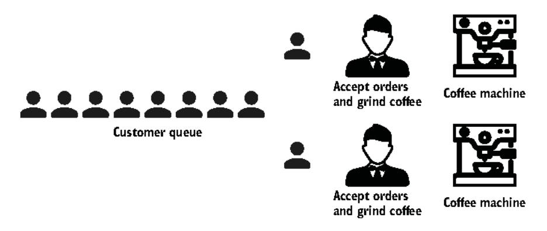

Figure 8.2 Duplicating everything in the coffee shop

In this new process, every part of the system is independent. The coffee shop should serve consumers twice as fast. This is a *parallel* implementation of a coffee shop.

If we want to scale, we can keep duplicating waiters and coffee machines over and over. However, this isn't the only possible coffee shop design. Another approach

might be to split the work done by the waiters and have one in charge of accepting orders and another one who grinds the coffee beans, which are then brewed in a single machine. Also, instead of blocking the customer queue until a customer is served, we could introduce another queue for customers waiting for their orders (think about Starbucks) (figure 8.3).

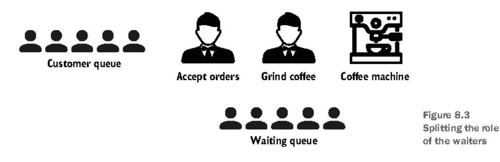

With this new design, we don't make things parallel. But the overall structure is affected: we split a given role into two roles, and we introduce another queue. Unlike parallelism, which is about doing the same thing multiple times at once, *concurrency* is about structure.

Assuming one thread represents the waiter accepting orders and another represents the coffee machine, we have introduced yet another thread to grind the coffee beans. Each thread is independent but has to coordinate with others. Here, the waiter thread accepting orders has to communicate which coffee beans to grind. Meanwhile, the coffee-grinding threads must communicate with the coffee machine thread.

What if we want to increase throughput by serving more customers per hour? Because grinding beans takes longer than accepting orders, a possible change could be to hire another coffee-grinding waiter (figure 8.4).

Waiting queue

coffee beans

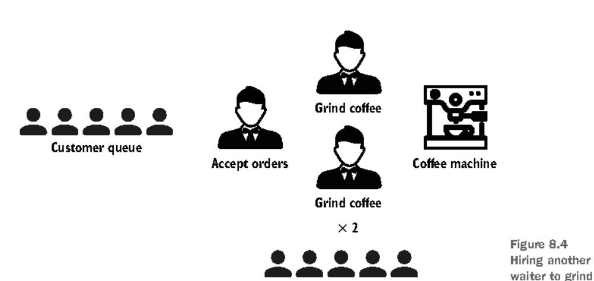

Here, the structure remains the same. It is still a three-step design: accept, grind, brew coffee. Hence, there are no changes in terms of concurrency. But we are back to adding parallelism, here for one particular step: the order preparation.

Now, let's assume that the part slowing down the whole process is the coffee machine. Using a single coffee machine introduces contentions for the coffee-grinding threads as they both wait for a coffee machine thread to be available. What could be a solution? Adding more coffee machine threads (figure 8.5).

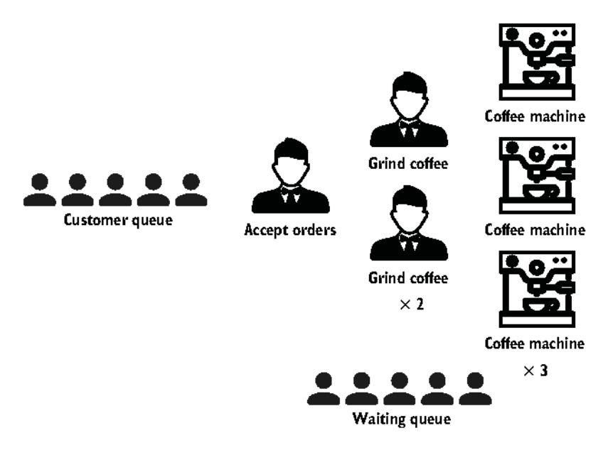

Figure 8.5 Adding more coffee machines

Instead of a single coffee machine, we have increased the level of parallelism by introducing more machines. Again, the structure hasn't changed; it remains a three-step design. But throughput should increase because the level of contention for the coffee-grinding threads should decrease.

With this design, we can notice something important: *concurrency enables parallelism*. Indeed, concurrency provides a structure to solve a problem with parts that may be parallelized.

Concurrency is about dealing with lots of things at once. Parallelism is about doing lots of things at once.

-Rob Pike

In summary, concurrency and parallelism are different. Concurrency is about structure, and we can change a sequential implementation into a concurrent one by

introducing different steps that separate concurrent threads can tackle. Meanwhile, parallelism is about execution, and we can use it at the step level by adding more parallel threads. Understanding these two concepts is fundamental to being a proficient Go developer.

The next section discusses a prevalent mistake: believing that concurrency is always the way to go.

### 8.2 #56: Thinking concurrency is always faster

A misconception among many developers is believing that a concurrent solution is always faster than a sequential one. This couldn't be more wrong. The overall performance of a solution depends on many factors, such as the efficiency of our structure (concurrency), which parts can be tackled in parallel, and the level of contention among the computation units. This section reminds us about some fundamental knowledge of concurrency in Go; then we will see a concrete example where a concurrent solution isn't necessarily faster.

### 8.2.1 Go scheduling

A thread is the smallest unit of processing that an OS can perform. If a process wants to execute multiple actions simultaneously, it spins up multiple threads. These threads can be

- Concurrent—Two or more threads can start, run, and complete in overlapping time periods, like the waiter thread and the coffee machine thread in the previous section.
- Parallel—The same task can be executed multiple times at once, like multiple waiter threads.

The OS is responsible for scheduling the thread's processes optimally so that

- All the threads can consume CPU cycles without being starved for too much time.
- The workload is distributed as evenly as possible among the different CPU cores.

**NOTE** The word *thread* can also have a different meaning at a CPU level. Each physical core can be composed of multiple logical cores (the concept of hyperthreading), and a logical core is also called a thread. In this section, when we use the word *thread*, we mean the unit of processing, not a logical core.

A CPU core executes different threads. When it switches from one thread to another, it executes an operation called *context switching*. The active thread consuming CPU cycles was in an *executing* state and moves to a *runnable* state, meaning it's ready to be executed pending an available core. Context switching is considered an expensive

operation because the OS needs to save the current execution state of a thread before the switch (such as the current register values).

As Go developers, we can't create threads directly, but we can create goroutines, which can be thought of as application-level threads. However, whereas an OS thread is context-switched on and off a CPU core by the OS, a goroutine is context-switched on and off an OS thread by the Go runtime. Also, compared to an OS thread, a goroutine has a smaller memory footprint: 2 KB for goroutines from Go 1.4. An OS thread depends on the OS, but, for example, on Linux/x86-32, the default size is 2 MB (see http://mng.bz/DgMw). Having a smaller size makes context switching faster.

**NOTE** Context switching a goroutine versus a thread is about 80% to 90% faster, depending on the architecture.

Let's now discuss how the Go scheduler works to overview how goroutines are handled. Internally, the Go scheduler uses the following terminology (see http://mng.bz/N611):

- G—Goroutine
- M—OS thread (stands for machine)
- P—CPU core (stands for processor)

Each OS thread (M) is assigned to a CPU core (P) by the OS scheduler. Then, each goroutine (G) runs on an M. The GOMAXPROCS variable defines the limit of Ms in charge of executing user-level code simultaneously. But if a thread is blocked in a system call (for example, I/O), the scheduler can spin up more Ms. As of Go 1.5, GOMAXPROCS is by default equal to the number of available CPU cores.

A goroutine has a simpler lifecycle than an OS thread. It can be doing one of the following:

- Executing—The goroutine is scheduled on an M and executing its instructions.
- Runnable—The goroutine is waiting to be in an executing state.
- Waiting—The goroutine is stopped and pending something completing, such as a system call or a synchronization operation (such as acquiring a mutex).

There's one last stage to understand about the implementation of Go scheduling: when a goroutine is created but cannot be executed yet; for example, all the other Ms are already executing a G. In this scenario, what will the Go runtime do about it? The answer is queuing. The Go runtime handles two kinds of queues: one local queue per P and a global queue shared among all the Ps.

Figure 8.6 shows a given scheduling situation on a four-core machine with GOMAX-PROCS equal to 4. The parts are the logical cores (Ps), goroutines (Gs), OS threads (Ms), local queues, and global queue.

First, we can see five Ms, whereas GOMAXPROCS is set to 4. But as we mentioned, if needed, the Go runtime can create more OS threads than the GOMAXPROCS value.

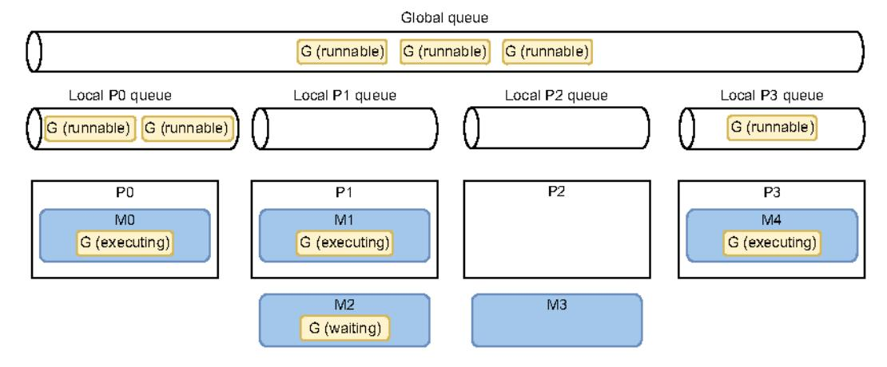

Figure 8.6 An example of the current state of a Go application executed on a four-core machine. Goroutines that aren't in an executing state are either runnable (pending being executed) or waiting (pending a blocking operation).

P0, P1, and P3 are currently busy executing Go runtime threads. But P2 is presently idle as M3 is switched off P2, and there's no goroutine to be executed. This isn't a good situation because six runnable goroutines are pending being executed, some in the global queue and some in other local queues. How will the Go runtime handle this situation? Here's the scheduling implementation in pseudocode (see http://mng.bz/lxY8):

```
runtime.schedule() {
    // Only 1/61 of the time, check the global runnable queue for a G.
    // If not found, check the local queue.
    // If not found,
    // Try to steal from other Ps.
    // If not, check the global runnable queue.
    // If not found, poll network.
}
```

Every sixty-first execution, the Go scheduler will check whether goroutines from the global queue are available. If not, it will check its local queue. Meanwhile, if both the global and local queues are empty, the Go scheduler can pick up goroutines from other local queues. This principle in scheduling is called *work stealing*, and it allows an underutilized processor to actively look for another processor's goroutines and *steal* some.

One last important thing to mention: prior to Go 1.14, the scheduler was cooperative, which meant a goroutine could be context-switched off a thread only in specific blocking cases (for example, channel send or receive, I/O, waiting to acquire a mutex). Since Go 1.14, the Go scheduler is now preemptive: when a goroutine is running for a specific amount of time (10 ms), it will be marked preemptible and can be context-switched off to be replaced by another goroutine. This allows a long-running job to be forced to share CPU time.

Now that we understand the fundamentals of scheduling in Go, let's look at a concrete example: implementing a merge sort in a parallel manner.

### 8.2.2 Parallel merge sort

First, let's briefly review how the merge sort algorithm works. Then we will implement a parallel version. Note that the objective isn't to implement the most efficient version but to support a concrete example showing why concurrency isn't always faster.

The merge sort algorithm works by breaking a list repeatedly into two sublists until each sublist consists of a single element and then merging these sublists so that the result is a sorted list (see figure 8.7). Each split operation splits the list into two sublists, whereas the merge operation merges two sublists into a sorted list.

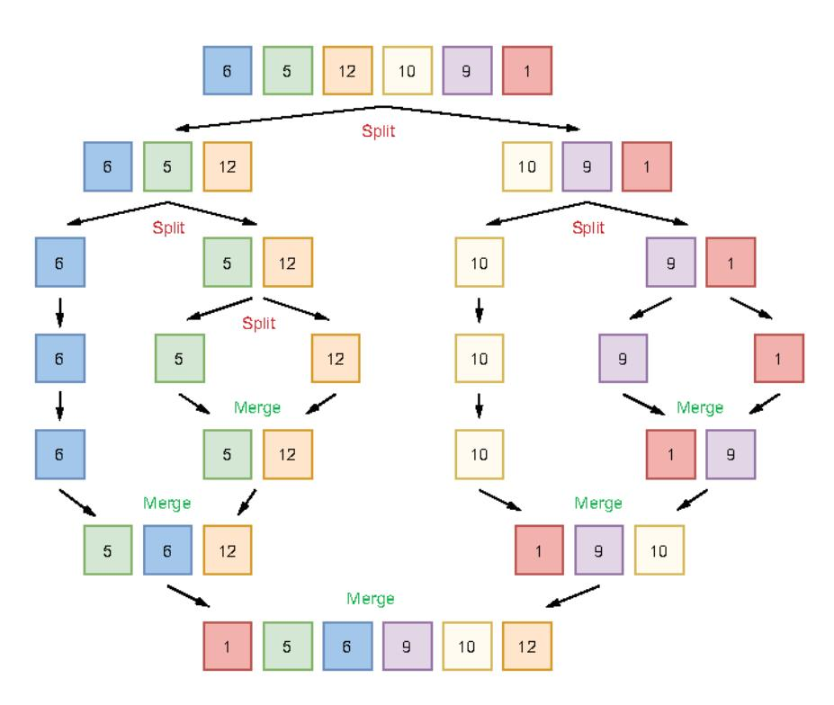

Figure 8.7 Applying the merge sort algorithm repeatedly breaks each list into two sublists. Then the algorithm uses a merge operation such that the resulting list is sorted.

Here is the sequential implementation of this algorithm. We don't include all of the code as it's not the main point of this section:

```
func sequentialMergesort(s []int) {
   if len(s) <= 1 {
      return
   }</pre>
```

```
middle := len(s) / 2
sequentialMergesort(s[:middle])
```

This algorithm has a structure that makes it open to concurrency. Indeed, as each sequential Mergesort operation works on an independent set of data that doesn't need to be fully copied (here, an independent view of the underlying array using slicing), we could distribute this workload among the CPU cores by spinning up each sequential Mergesort operation in a different goroutine. Let's write a first parallel implementation:

```
func parallelMergesortV1(s []int) {
   if len(s) <= 1 {
       return
   middle := len(s) / 2
   var wg sync.WaitGroup
    wg.Add(2)
                         Spins up the first half of
    go func() {                                   
       defer wg.Done()
       parallelMergesortV1(s[:middle])
    } ()
                         Spins up the second half of
                        the work in a goroutine
    go func{) {
       defer wq.Done()
       parallelMergesortV1(s[middle:])
    }()
   wg.Wait()
                             Merges
                            the halves
   merge(s, middle)
```

In this version, each half of the workload is handled in a separate goroutine. The parent goroutine waits for both parts by using sync.WaitGroup. Hence, we call the Wait method before the merge operation.

**NOTE** If you're not yet familiar with sync.WaitGroup, we will look at it in more detail in mistake #71, "Misusing sync.WaitGroup." In a nutshell, it allows us to wait for n operations to complete: usually goroutines, as in the previous example.

We now have a parallel version of the merge sort algorithm. Therefore, if we run a benchmark to compare this version against the sequential one, the parallel version should be faster, correct? Let's run it on a four-core machine with 10,000 elements:

```
Benchmark_sequentialMergesort-4 2278993555 ns/op
Benchmark_parallelMergesortV1-4 17525998709 ns/op
```

Surprisingly, the parallel version is almost an order of magnitude slower. How can we explain this result? How is it possible that a parallel version that distributes a workload across four cores is slower than a sequential version running on a single machine? Let's analyze the problem.

If we have a slice of, say, 1,024 elements, the parent goroutine will spin up two goroutines, each in charge of handling a half consisting of 512 elements. Each of these goroutines will spin up two new goroutines in charge of handling 256 elements, then 128, and so on, until we spin up a goroutine to compute a single element.

If the workload that we want to parallelize is too small, meaning we're going to compute it too fast, the benefit of distributing a job across cores is destroyed: the time it takes to create a goroutine and have the scheduler execute it is much too high compared to directly merging a tiny number of items in the current goroutine. Although goroutines are lightweight and faster to start than threads, we can still face cases where a workload is too small.

**NOTE** We will discuss how to recognize when an execution is poorly parallelized in mistake #98, "Not using Go diagnostics tooling."

So what can we conclude from this result? Does it mean the merge sort algorithm cannot be parallelized? Wait, not so fast.

Let's try another approach. Because merging a tiny number of elements within a new goroutine isn't efficient, let's define a threshold. This threshold will represent how many elements a half should contain in order to be handled in a parallel manner. If the number of elements in the half is fewer than this value, we will handle it sequentially. Here's a new version:

```
const max = 2048
                            → Defines the threshold
func parallelMergesortV2(s []int) {
    if len(s) <= 1 {
        return
    3
                                          Calls our initial
    if len(s) <= max {
                                          sequential version
        sequentialMergesort(s)
                                  If bigger than the threshold,
        middle := len(s) / 2
                                  keeps the parallel version
        var wg sync.WaitGroup
        wg.Add(2)
        go func() {
             defer wg.Done()
             parallelMergesortV2(s[:middle])
        }()
        go func() {
            defer wg.Done()
```

```
parallelMergesortV2(s[middle:])
}()

wg.Wait{)

merge{s, middle)
}
}
```

If the number of elements in the s slice is smaller than max, we call the sequential version. Otherwise, we keep calling our parallel implementation. Does this approach impact the result? Yes, it does:

```
Benchmark_sequentialMergesort-4 2278993555 ns/op
Benchmark_parallelMergesortV1-4 17525998709 ns/op
Benchmark_parallelMergesortV2-4 1313010260 ns/op
```

Our v2 parallel implementation is more than 40% faster than the sequential one, thanks to this idea of defining a threshold to indicate when parallel should be more efficient than sequential.

NOTE Why did I set the threshold to 2,048? Because it was the optimal value for this specific workload on my machine. In general, such magic values should be defined carefully with benchmarks (running on an execution environment similar to production). It's also pretty interesting to note that running the same algorithm in a programming language that doesn't implement the concept of goroutines has an impact on the value. For example, running the same example in Java using threads means an optimal value closer to 8,192. This tends to illustrate how goroutines are more efficient than threads.

We have seen throughout this chapter the fundamental concepts of scheduling in Go: the differences between a thread and a goroutine and how the Go runtime schedules goroutines. Meanwhile, using the parallel merge sort example, we illustrated that concurrency isn't always necessarily faster. As we have seen, spinning up goroutines to handle minimal workloads (merging only a small set of elements) demolishes the benefit we could get from parallelism.

So, where should we go from here? We must keep in mind that concurrency isn't always faster and shouldn't be considered the default way to go for all problems. First, it makes things more complex. Also, modern CPUs have become incredibly efficient at executing sequential code and predictable code. For example, a superscalar processor can parallelize instruction execution over a single core with high efficiency.

Does this mean we shouldn't use concurrency? Of course not. However, it's essential to keep these conclusions in mind. If we're not sure that a parallel version will be faster, the right approach may be to start with a simple sequential version and build from there using profiling (mistake #98, "Not using Go diagnostics tooling") and benchmarks (mistake #89, "Writing inaccurate benchmarks"), for example. It can be the only way to ensure that a concurrency is worth it.

The following section discusses a frequently asked question: when should we use channels or mutexes?

### 8.3 #57: Being puzzled about when to use channels or mutexes

Given a concurrency problem, it may not always be clear whether we can implement a solution using channels or mutexes. Because Go promotes sharing memory by communication, one mistake could be to always force the use of channels, regardless of the use case. However, we should see the two options as complementary. This section clarifies when we should favor one option over the other. The goal is not to discuss every possible use case (that would probably take an entire chapter) but to give general guidelines that can help us decide.

First, a brief reminder about channels in Go: channels are a communication mechanism. Internally, a channel is a pipe we can use to send and receive values and that allows us to *connect* concurrent goroutines. A channel can be either of the following:

- Unbuffered—The sender goroutine blocks until the receiver goroutine is ready.
- Buffered—The sender goroutine blocks only when the buffer is full.

Let's get back to our initial problem. When should we use channels or mutexes? We will use the example in figure 8.8 as a backbone. Our example has three different goroutines with specific relationships:

- G1 and G2 are parallel goroutines. They may be two goroutines executing the same function that keeps receiving messages from a channel, or perhaps two goroutines executing the same HTTP handler at the same time.
- On the other hand, G1 and G3 are concurrent goroutines, as are G2 and G3. All the goroutines are part of an overall concurrent structure, but G1 and G2 perform the first step, whereas G3 does the next step.

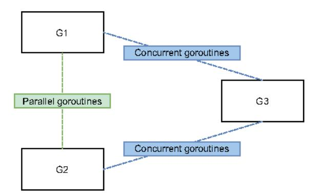

Figure 8.8 Goroutines G1 and G2 are parallel, whereas G2 and G3 are concurrent.

In general, parallel goroutines have to *synchronize*: for example, when they need to access or mutate a shared resource such as a slice. Synchronization is enforced with mutexes but not with any channel types (not with buffered channels). Hence, in general, synchronization between parallel goroutines should be achieved via mutexes.

Conversely, in general, concurrent goroutines have to *coordinate and orchestrate*. For example, if G3 needs to aggregate results from both G1 and G2, G1 and G2 need to signal to G3 that a new intermediate result is available. This coordination falls under the scope of communication—therefore, channels.

Regarding concurrent goroutines, there's also the case where we want to transfer the ownership of a resource from one step (G1 and G2) to another (G3); for example, if G1 and G2 are enriching a shared resource and at some point, we consider this job as complete. Here, we should use channels to signal that a specific resource is ready and handle the ownership transfer.

Mutexes and channels have different semantics. Whenever we want to share a state or access a shared resource, mutexes ensure exclusive access to this resource. Conversely, channels are a mechanic for signaling with or without data (chan struct{}) or not). Coordination or ownership transfer should be achieved via channels. It's important to know whether goroutines are parallel or concurrent because, in general, we need mutexes for parallel goroutines and channels for concurrent ones.

Let's now discuss a widespread issue regarding concurrency: race problems.

### 8.4 #58: Not understanding race problems

Race problems can be among the hardest and most insidious bugs a programmer can face. As Go developers, we must understand crucial aspects such as data races and race conditions, their possible impacts, and how to avoid them. We will go through these topics by first discussing data races versus race conditions and then examining the Go memory model and why it matters.

### 8.4.1 Data races vs. race conditions

Let's first focus on data races. A data race occurs when two or more goroutines simultaneously access the same memory location and at least one is writing. Here is an example where two goroutines increment a shared variable:

```
i := 0
go func() {
    i++
}()

go func() {
    i++
}()
```

If we run this code using the Go race detector (-race option), it warns us that a data race has occurred:

```
WARNING: DATA RACE
Write at 0x00c00008e000 by goroutine 7:
main.main.func2()
```

```
Previous write at 0x00c00008e000 by goroutine 6:
   main.main.func1()
------
```

The final value of i is also unpredictable. Sometimes it can be 1, and sometimes 2.

What's the issue with this code? The interpret can be decomposed into this

What's the issue with this code? The i++ statement can be decomposed into three operations:

- 1 Read i.
- 2 Increment the value.
- Write back to i.

If the first goroutine executes and completes before the second one, here's what happens.

| Goroutine 1 | Goroutine 2 | Operation | i |
|-------------|-------------|-----------|---|
|             |             |           | 0 |
| Read        |             | <-        | О |
| Increment   |             |           | О |
| Write back  |             | ->        | 1 |
|             | Read        | <-        | 1 |
|             | Increment   |           | 1 |
|             | Write back  | ->        | 2 |

The first goroutine reads, increments, and writes the value 1 back to i. Then the second goroutine performs the same set of actions but starts from 1. Hence, the final result written to i is 2.

However, there's no guarantee that the first goroutine will either start or complete before the second one in the previous example. We can also face the case of an interleaved execution where both goroutines run concurrently and compete to access i. Here's another possible scenario.

| Goroutine 1 | Goroutine 2 | Operation | i |
|-------------|-------------|-----------|---|
|             |             |           | 0 |
| Read        |             | <-        | О |
|             | Read        | <-        | 0 |
| Increment   |             |           | 0 |
|             | Increment   |           | 0 |
| Write back  |             | ->        | 1 |
|             | Write back  | ->        | 1 |

First, both goroutines read from i and get the value 0. Then, both increment it and write back their local result: 1, which isn't the expected result.

This is a possible impact of a data race. If two goroutines simultaneously access the same memory location with at least one writing to that memory location, the result can be hazardous. Even worse, in some situations, the memory location may end up holding a value containing a meaningless combination of bits.

**NOTE** In mistake #83, "Not enabling the -race flag," we will see how Go can help us detect data races.

How can we prevent a data race from happening? Let's look at some different techniques. The scope here isn't to present all the possible options (for example, we will omit atomic.Value) but to show the main ones.

The first option is to make the increment operation atomic, meaning it's done in a single operation. This prevents entangled running operations.

| Goroutine 1        | Goroutine 2        | Operation | i |
|--------------------|--------------------|-----------|---|
|                    |                    |           | 0 |
| Read and increment |                    | <->       | 1 |
|                    | Read and increment | <->       | 2 |

Even if the second goroutine runs before the first one, the result remains 2.

Atomic operations can be done in Go using the sync/atomic package. Here's an example of how we can increment atomically an int64:

```
var i int64
go func() {
    atomic.AddInt64(&i, 1)
```

Both goroutines update i atomically. An atomic operation can't be interrupted, thus preventing two accesses at the same time. Regardless of the goroutines' execution order, i will eventually equal 2.

NOTE The sync/atomic package provides primitives for int32, int64, uint32, and uint64 but not for int. This is why i is an int64 in this example.

Another option is to synchronize the two goroutines with an ad hoc data structure like a mutex. *Mutex* stands for *mutual exclusion*; a mutex ensures that at most one goroutine accesses a so-called critical section. In Go, the sync package provides a Mutex type:

```
i := 0
mutex := sync.Mutex{}

go func{) {
    mutex.Lock{}
    i++
```

In this example, incrementing i is the critical section. Regardless of the goroutines' ordering, this example also produces a deterministic value for i: 2.

Which approach works best? The boundary is pretty straightforward. As we mentioned, the sync/atomic package works only with specific types. If we want something else (for example, slices, maps, and structs), we can't rely on sync/atomic.

Another possible option is to prevent sharing the same memory location and instead favor communication across the goroutines. For example, we can create a channel that each goroutine uses to produce the value of the increment:

```
i := 0
ch := make{chan int}

go func{) {
    ch <- 1
}{}
```

Each goroutine sends a notification via the channel that we should increment i by 1. The parent goroutine collects the notifications and increments i. Because it's the only goroutine writing to i, this solution is also free of data races.

Let's sum up what we have seen so far. Data races occur when multiple goroutines access the same memory location simultaneously (for example, the same variable) and at least one of them is writing. We have also seen how to prevent this issue with three synchronization approaches:

- Using atomic operations
- Protecting a critical section with a mutex
- Using communication and channels to ensure that a variable is updated by only one goroutine

With these three approaches, the value of i will eventually be set to 2, regardless of the execution order of the two goroutines. But depending on the operation we want to perform, does a data-race-free application necessarily mean a deterministic result? Let's explore this question with another example.

Instead of having two goroutines increment a shared variable, now each one makes an assignment. We will follow the approach of using a mutex to prevent data races:

```
i := 0
mutex := sync.Mutex{}

go func{) {
    mutex.Lock{}
    defer mutex.Unlock{}
    i = 1
}{}

go func{} {
    mutex.Lock{}
    defer mutex.Unlock{}
    i = 2
}{}

The first goroutine assigns 1 to i.
```

The first goroutine assigns 1 to i, whereas the second one assigns 2.

Is there a data race in this example? No, there isn't. Both goroutines access the same variable, but not at the same time, as the mutex protects it. But is this example deterministic? No, it isn't.

Depending on the execution order, i will eventually equal either 1 or 2. This example doesn't lead to a data race. But it has a *race condition*. A race condition occurs when the behavior depends on the sequence or the timing of events that can't be controlled. Here, the timing of events is the goroutines' execution order.

Ensuring a specific execution sequence among goroutines is a question of coordination and orchestration. If we want to ensure that we first go from state 0 to state 1, and then from state 1 to state 2, we should find a way to guarantee that the goroutines are executed in order. Channels can be a way to solve this problem. Coordinating and orchestrating can also ensure that a particular section is accessed by only one goroutine, which can also mean removing the mutex in the previous example.

In summary, when we work in concurrent applications, it's essential to understand that a data race is different from a race condition. A data race occurs when multiple goroutines simultaneously access the same memory location and at least one of them is writing. A data race means unexpected behavior. However, a data-race-free application doesn't necessarily mean deterministic results. An application can be free of data races but still have behavior that depends on uncontrolled events (such as goroutine execution, how fast a message is published to a channel, or how long a call to a data-base lasts); this is a race condition. Understanding both concepts is crucial to becoming proficient in designing concurrent applications.

Let's now examine the Go memory model and understand why it matters.

### 8.4.2 The Go memory model

The previous section discussed three main techniques to synchronize goroutines: atomic operations, mutexes, and channels. However, there are some core principles we should be aware of as Go developers. For example, buffered and unbuffered channels offer differ guarantees. To avoid unexpected races caused by a lack of understanding of the core specifications of the language, we have to look at the Go memory model.

The Go memory model (https://golang.org/ref/mem) is a specification that defines the conditions under which a read from a variable in one goroutine can be guaranteed to happen after a write to the same variable in a different goroutine. In other words, it provides guarantees that developers should keep in mind to avoid data races and force deterministic output.

Within a single goroutine, there's no chance of unsynchronized access. Indeed, the happens-before order is guaranteed by the order expressed by our program.

However, within multiple goroutines, we should bear in mind some of these guarantees. We will use the notation A < B to denote that event A happens before event B. Let's examine these guarantees (some copied from the Go memory model):

Creating a goroutine happens before the goroutine's execution begins. Therefore, reading a variable and then spinning up a new goroutine that writes to this variable doesn't lead to a data race:

```
i := 0
go func() {
    i++
}()
```

• Conversely, the exit of a goroutine isn't guaranteed to happen before any event. Thus, the following example has a data race:

```
i := 0
go func() {
    i++
}()
fmt.Println(i)
```

Again, if we want to prevent the data race from happening, we should synchronize these goroutines.

• A send on a channel happens before the corresponding receive from that channel completes. In the next example, a parent goroutine increments a variable before a send, while another goroutine reads it after a channel read:

```
i := 0
ch := make{chan struct{}}
go func{} {
     <-ch
     fmt.Println{i}</pre>
```

```
}()\ni++
ch <- struct{}{}</pre>
```

The order is as follows:

```
variable increment < channel send < channel receive < variable read
```

By transitivity, we can ensure that accesses to i are synchronized and hence free from data races.

Closing a channel happens before a receive of this closure. The next example is similar to the previous one, except that instead of sending a message, we close the channel:

```
i := 0
ch := make{chan struct{}}
go func{) {
         <-ch
         fmt.Println{i}
}{)\ni++
close{ch}</pre>
```

Therefore, this example is also free from data races.

The last guarantee regarding channels may be counterintuitive at first sight: a receive from an unbuffered channel happens *before* the send on that channel completes.

First, let's look at an example with a buffered channel instead of an unbuffered channel. We have two goroutines, and the parent sends a message and reads a variable while the child updates this variable and receives from the channel:

```
i := 0
ch := make{chan struct{}, 1)
go func{} {
    i = 1
        <-ch
}{}
ch <- struct{}{}
fmt.Println{i}</pre>
```

This example leads to a data race. We can see in figure 8.9 that both the read and the write to i may occur simultaneously; therefore, i isn't synchronized.

Figure 8.9 If the channel is buffered, it leads to a data race.

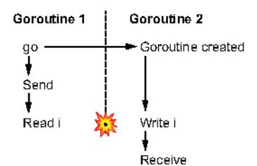

Now, let's change the channel to an unbuffered one to illustrate the memory model guarantee:

```
i := 0
ch := make{chan struct{}}
go func{) {
    i = 1
        <-ch
}{}
ch <- struct{}{}
fmt.Println{i}</pre>

Makes the channel\nunbuffered
```

Changing the channel type makes this example data-race-free (see figure 8.10). Here we can see the main difference: the write is guaranteed to happen before the read. Note that the arrows don't represent causality (of course, a receive is caused by a send); they represent the ordering guarantees of the Go memory model. Because a receive from an unbuffered channel happens before a send, the write to i will always occur before the read.

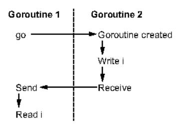

Figure 8.10 If the channel is unbuffered, it doesn't lead to a data race.

Throughout this section, we have covered the main guarantees of the Go memory model. Understanding these guarantees should be part of our core knowledge when writing concurrent code and can prevent us from making wrong assumptions that can lead to data races and/or race conditions.

The following section discusses why it's important to understand a workload type.

### 8.5 #59: Not understanding the concurrency impacts of a workload type

This section looks at the impacts of a workload type in a concurrent implementation. Depending on whether a workload is CPU- or I/O-bound, we may need to tackle the problem differently. Let's first define these concepts and then discuss the impacts.

In programming, the execution time of a workload is limited by one of the following:

- The speed of the CPU—For example, running a merge sort algorithm. The work-load is called CPU-bound.
- The speed of I/O—For example, making a REST call or a database query. The workload is called I/O-bound.
- The amount of available memory—The workload is called memory-bound.

**NOTE** The last is the rarest nowadays, given that memory has become very cheap in recent decades. Hence, this section focuses on the two first workload types: CPU- and I/O-bound.

Why is it important to classify a workload in the context of a concurrent application? Let's understand this alongside one concurrency pattern: worker pooling.

The following example implements a read function that accepts an io. Reader and reads 1,024 bytes from it repeatedly. We pass these 1,024 bytes to a task function that performs some tasks (we will see what kind of tasks later). This task function returns an integer, and we have to return the sum of all the results. Here's a sequential implementation:

```
func read(r io.Reader) (int, error) {
    count := 0
    for {
                                       Reads
        b := make([]byte, 1024)
                                      1.024 bytes
        _, err := r.Read(b)
        if err != nil {
            if err == io.EOF {
                                           Stops the loop when
                break
                                           we reach the end
            return 0, err
        count += task(b)
                                   Increments count based on
                                    the result of the task function
    return count, nil
}
```

This function creates a count variable, reads from the io.Reader input, calls task, and increments count. Now, what if we want to run all the task functions in a parallel manner?

One option is to use the so-called *worker-pooling pattern*. Doing so involves creating workers (goroutines) of a fixed size that poll tasks from a common channel (see figure 8.11).

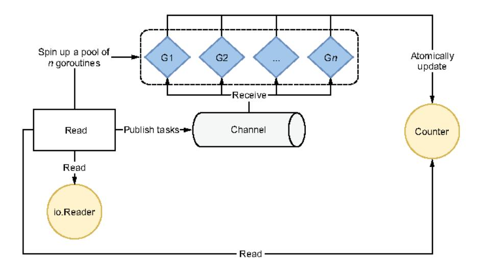

Figure 8.11 Each goroutine from the fixed pool receives from a shared channel.

First, we spin up a fixed pool of goroutines (we'll discuss how many afterward). Then we create a shared channel to which we publish tasks after each read to the io.Reader. Each goroutine from the pool receives from this channel, performs its work, and then atomically updates a shared counter.

Here is a possible way to write this in Go, with a pool size of 10 goroutines. Each goroutine atomically updates a shared counter:

```
func read(r io.Reader) (int, error) (
             var count int64
             wg := sync.WaitGroup{}
             var n = 10
                                                     Creates a channel with a
                                                     capacity equal to the pool
             ch := make{chan []byte, n)
             wg.Add(n)
Adds n
             for i := 0; i < n; i++ \{
                                                  Creates a pool of n goroutines
to the
                 go func() {
 wait
                      defer wg.Done()
group
                                                                      Calls the Done method
                      for b := range ch {
                                                                      once the goroutine has
                          v := task(b)
                                                                     received from the channel
                           atomic.AddInt64(&count, int64(v))
                                                                     Each goroutine receives
                                                                     from the shared channel.
                 }()
             }
             for {
                 b := make([]byte, 1024)
                                               Publishes a new task to the
                 // Read from r to b
                                               channel after every read
                 ch <- b
                                        Waits for the wait group to
             close(ch)
                                       complete before returning
             wg.Wait()
             return int(count), nil
        }
```

In this example, we use n to define the pool size. We create a channel with the same capacity as the pool and a wait group with a delta of n. This way, we reduce potential contention in the parent goroutine while publishing messages. We iterate n times to create a new goroutine that receives from the shared channel. Each message received is handled by executing task and incrementing the shared counter atomically. After reading from the channel, each goroutine decrements the wait group.

In the parent goroutine, we keep reading from io.Reader and publish each task to the channel. Last but not least, we close the channel and wait for the wait group to complete (meaning all the child goroutines have completed their jobs) before returning.

Having a fixed number of goroutines limits the downsides we discussed; it narrows the resources' impact and prevents an external system from being flooded. Now the golden question: what should be the value of the pool size? The answer depends on the workload type.

If the workload is I/O-bound, the answer mainly depends on the external system. How many concurrent accesses can the system cope with if we want to maximize throughput?

If the workload is CPU-bound, a best practice is to rely on GOMAXPROCS. GOMAXPROCS is a variable that sets the number of OS threads allocated to running goroutines. By default, this value is set to the number of logical CPUs.

### Using runtime.GOMAXPROCS

We can use the runtime.GOMAXPROCS(int) function to update the value of GOMAXPROCS. Calling it with 0 as an argument doesn't change the value; it just returns the current value:

n := runtime.GOMAXPROCS(0)

So, what's the rationale for mapping the size of the pool to GOMAXPROCS? Let's take a concrete example and say that we will run our application on a four-core machine; thus Go will instantiate four OS threads where goroutines will be executed. At first, things may not be ideal: we may face a scenario with four CPU cores and four goroutines but only one goroutine being executed, as shown in figure 8.12.

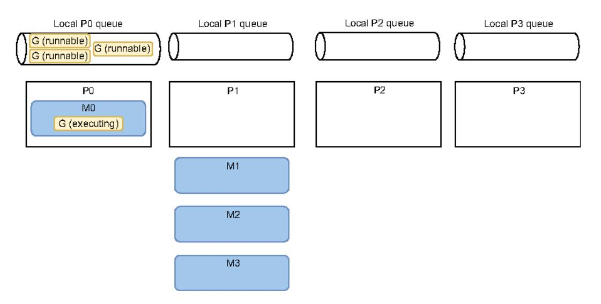

Figure 8.12 At most one goroutine is running.

M0 is currently running a goroutine of the worker pool. Hence, these goroutines start to receive messages from the channel and execute their jobs. But the three other goroutines from the pool aren't yet assigned to an M; hence, they are in a runnable state. M1, M2, and M3 don't have any goroutines to run, so they remain off a core. Thus only one goroutine is running.

Eventually, given the work-stealing concept we already described, P1 may steal goroutines from the local P0 queue. In figure 8.13, P1 stole three goroutines from P0. In

this situation, the Go scheduler may also eventually assign all the goroutines to a different OS thread, but there's no guarantee about when this should occur. However, since one of the main goals of the Go scheduler is to optimize resources (here, the distribution of the goroutines), we should end up in such a scenario given the nature of the workloads.

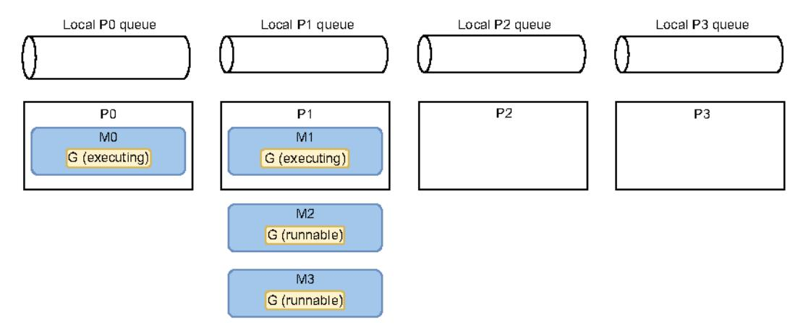

Figure 8.13 At most two goroutines are running.

This scenario is still not optimal, because at most two goroutines are running. Let's say the machine is running only our application (other than the OS processes), so P2 and P3 are free. Eventually, the OS should move M2 and M3 as shown in figure 8.14.

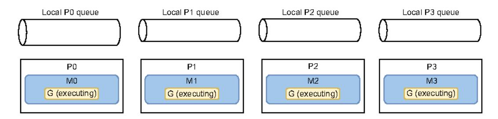

Figure 8.14 At most four goroutines are now running.

Here, the OS scheduler decided to move M2 to P2 and M3 to P3. Again, there is no guarantee about when this situation will happen. But given a machine executing only our four-thread application, this should be the final picture.

The situation has changed; it has become optimal. The four goroutines are running in separate threads and the threads on separate cores. This approach reduces the amount of context switching at both the goroutine and thread levels.

This global picture cannot be designed and requested by us (Go developers). However, as we have seen, we can enable it with favorable conditions in the case of CPU-bound workloads: having a worker pool based on GOMAXPROCS.

NOTE If, given particular conditions, we want the number of goroutines to be bound to the number of CPU cores, why not rely on runtime.NumCPU(), which returns the number of logical CPU cores? As we mentioned, GOMAXPROCS can be changed and can be less than the number of CPU cores. In the case of a CPU-bound workload, if the number of cores is four but we have only three threads, we should spin up three goroutines, not four. Otherwise, a thread will share its execution time among two goroutines, increasing the number of context switches.

When implementing the worker-pooling pattern, we have seen that the optimal number of goroutines in the pool depends on the workload type. If the workload executed by the workers is I/O-bound, the value mainly depends on the external system. Conversely, if the workload is CPU-bound, the optimal number of goroutines is close to the number of available threads. Knowing the workload type (I/O or CPU) is crucial when designing concurrent applications.

Last but not least, let's bear in mind that we should validate our assumptions via benchmarks in most cases. Concurrency isn't straightforward, and it can be pretty easy to make hasty assumptions that turn out to be invalid.

In the last section of this chapter, we discuss a crucial topic that we must understand to be proficient in Go: contexts.

### 8.6 #60: Misunderstanding Go contexts

Developers sometimes misunderstand the context.Context type despite it being one of the key concepts of the language and a foundation of concurrent code in Go. Let's look at this concept and be sure we understand why and how to use it efficiently.

According to the official documentation (https://pkg.go.dev/context):

A Context carries a deadline, a cancellation signal, and other values across API boundaries.

Let's examine this definition and understand all the concepts related to a Go context.

### 8.6.1 Deadline

A deadline refers to a specific point in time determined with one of the following:

- A time. Duration from now (for example, in 250 ms)
- A time. Time (for example, 2023-02-07 00:00:00 UTC)

The semantics of a deadline convey that an ongoing activity should be stopped if this deadline is met. An activity is, for example, an I/O request or a goroutine waiting to receive a message from a channel.

Let's consider an application that receives flight positions from a radar every four seconds. Once we receive a position, we want to share it with other applications that are only interested in the latest position. We have at our disposal a publisher interface containing a single method:

```
type publisher interface {
    Publish(ctx context.Context, position flight.Position) error
}
```

This method accepts a context and a position. We assume that the concrete implementation calls a function to publish a message to a broker (such as using Sarama to publish a Kafka message). This function is *context aware*, meaning it can cancel a request once the context is canceled.

Assuming we don't receive an existing context, what should we provide to the Publish method for the context argument? We have mentioned that the applications are interested only in the latest position. Hence, the context that we build should convey that after 4 seconds, if we haven't been able to publish a flight position, we should stop the call to Publish:

```
type publishHandler struct {
    pub publisher
}

Creates the context that will
time out after 4 seconds

func {h publishHandler} publishPosition{position flight.Position} error {
    ctx, cancel := context.WithTimeout{context.Background{}, 4*time.Second} ←
    defer cancel{}
    return h.pub.Publish(ctx, position)
}

Passes the created context
```

This code creates a context using the context.WithTimeout function. This function accepts a timeout and a context. Here, as publishPosition doesn't receive an existing context, we create one from an empty context with context.Background. Meanwhile, context.WithTimeout returns two variables: the context created and a cancellation func() function that will cancel the context once called. Passing the context created to the Publish method should make it return in at most 4 seconds.

What's the rationale for calling the cancel function as a defer function? Internally, context.WithTimeout creates a goroutine that will be retained in memory for 4 seconds or until cancel is called. Therefore, calling cancel as a defer function means that when we exit the parent function, the context will be canceled, and the goroutine created will be stopped. It's a safeguard so that when we return, we don't leave retained objects in memory.

Let's now move to the second aspect of Go contexts: cancellation signals.

### 8.6.2 Cancellation signals

Another use case for Go contexts is to carry a cancellation signal. Let's imagine that we want to create an application that calls <code>CreateFileWatcher(ctx context.Context, filename string)</code> within another goroutine. This function creates a specific file watcher that keeps reading from a file and catches updates. When the provided context expires or is canceled, this function handles it to close the file descriptor.

Finally, when main returns, we want things to be handled gracefully by closing this file descriptor. Therefore, we need to propagate a signal.

A possible approach is to use context. With Cancel, which returns a context (first variable returned) that will cancel once the cancel function (second variable returned) is called:

```
func main() {
    ctx, cancel := context.WithCancel(context.Background())
    defer cancel()
```

When main returns, it calls the cancel function to cancel the context passed to CreateFileWatcher so that the file descriptor is closed gracefully.

Next, let's discuss the last aspects of Go contexts: values.

### 8.6.3 Context values

The last use case for Go contexts is to carry a key-value list. Before understanding the rationale behind it, let's first see how to use it.

A context conveying values can be created this way:

```
ctx := context.WithValue(parentCtx, "key", "value")
```

Just like context.WithTimeout, context.WithDeadline, and context.WithCancel, context.WithValue is created from a parent context (here, parentCtx). In this case, we create a new ctx context containing the same characteristics as parentCtx but also conveying a key and a value.

We can access the value using the Value method:

```
ctx := context.WithValue(context.Background(), "key", "value")
fmt.Println(ctx.Value("key"))
value
```

The key and values provided are any types. Indeed, for the value, we want to pass any types. But why should the key be an empty interface as well and not a string, for example? That could lead to collisions: two functions from different packages could use the same string value as a key. Hence, the latter would override the former value. Consequently, a best practice while handling context keys is to create an unexported custom type:

```
package provider

type key string

const myCustomKey key = "key"
```

```
func f(ctx context.Context) {
    ctx = context.WithValue(ctx, myCustomKey, "foo")
    // ...
}
```

The myCustomKey constant is unexported. Hence, there's no risk that another package using the same context could override the value that is already set. Even if another package creates the same myCustomKey based on a key type as well, it will be a different key.

So what's the point of having a context carrying a key-value list? Because Go contexts are generic and mainstream, there are infinite use cases.

For example, if we use tracing, we may want different subfunctions to share the same correlation ID. Some developers may consider this ID too invasive to be part of the function signature. In this regard, we could also decide to include it as part of the provided context.

Another example is if we want to implement an HTTP middleware. If you're not familiar with such a concept, a middleware is an intermediate function executed before serving a request. For example, in figure 8.15, we have configured two middlewares that must be executed before executing the handler itself. If we want middlewares to communicate, they have to go through the context handled in the \*http.Request.

Let's write an example of a middleware that marks whether the source host is valid:

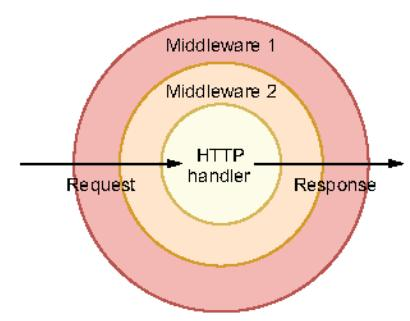

Figure 8.15 Before reaching the handler, a request goes through the configured middleware.

```
type key string
           const isValidHostKey key = "isValidHost"
                                                              Creates the context key
           func checkValid(next http.Handler) http.Handler {
               return http.HandlerFunc(func(w http.ResponseWriter, r *http.Request) {
                    validHost := r.Host == "acme"
Checks whether
                    ctx := context.WithValue(r.Context(), isValidHostKey, validHost) <-
the host is valid
                                                                          Creates a new context with
                    next.ServeHTTP(w, r.WithContext(ctx))
                                                                          a value to convey whether
               })
                                                                             the source host is valid
                                                    Calls the next step
           }
                                                 with the new context
```

First, we define a specific context key called isValidHostKey. Then the checkValid middleware checks whether the source host is valid. This information is conveyed in a new context, passed to the next HTTP step using next.ServeHTTP (the next step can be another HTTP middleware or the final HTTP handler).

This example has shown how context with values can be used in concrete Go applications. We have seen in the previous sections how to create a context to carry a

deadline, a cancellation signal, and/or values. We can use this context and pass it to context-aware libraries, meaning libraries exposing functions accepting a context. But now, suppose we have to create a library, and we want external clients to provide a context that could be canceled.

### 8.6.4 Catching a context cancellation

The context.Context type exports a Done method that returns a receive-only notification channel: <-chan struct{}. This channel is closed when the work associated with the context should be canceled. For example,

- The Done channel related to a context created with context.WithCancel is closed when the cancel function is called.
- The Done channel related to a context created with context. WithDeadline is closed when the deadline has expired.

One thing to note is that the internal channel should be closed when a context is canceled or has met a deadline, instead of when it receives a specific value, because the closure of a channel is the only channel action that all the consumer goroutines will receive. This way, all the consumers will be notified once a context is canceled or a deadline is reached.

Furthermore, context.Context exports an Err method that returns nil if the Done channel isn't yet closed. Otherwise, it returns a non-nil error explaining why the Done channel was closed: for example,

- A context. Canceled error if the channel was canceled
- A context. DeadlineExceeded error if the context's deadline passed

Let's see a concrete example in which we want to keep receiving messages from a channel. Meanwhile, our implementation should be context aware and return if the provided context is done:

```
func handler(ctx context.Context, ch chan Message) error {
    for {
        select {
            case msg := <-ch:
```

We create a for loop and use select with two cases: receiving messages from ch or receiving a signal that the context is done and we have to stop our job. While dealing with channels, this is an example of how to make a function context aware.

### Implementing a function that receives a context

Within a function that receives a context conveying a possible cancellation or timeout, the action of receiving or sending a message to a channel shouldn't be done in a blocking way. For example, in the following function, we send a message to a channel and receive one from another channel:

```
func f(ctx context.Context) error {
    // ...
    ch1 <- struct{}{}
    v := <-ch2
```

The problem with this function is that if the context is canceled or times out, we may have to wait until a message is sent or received, without benefit. Instead, we should use select to either wait for the channel actions to complete or wait for the context cancellation:

```
func f(ctx context.Context) error {
    // ...
    select {
    case <-ctx.Done():
        return ctx.Err()
    case ch1 <- struct(){{}:
    }

    select {
    case <-ctx.Done():
        return ctx.Err()
    case v := <-ch2:
        // ...
    }
}</pre>
Receives a message from ch2 or waits
for the context to be canceled

return ctx.Err()

case v := <-ch2:
    // ...
}
```

With this new version, if  $\mathtt{ctx}$  is canceled or times out, we return immediately, without blocking the channel send or receive.

In summary, to be a proficient Go developer, we have to understand what a context is and how to use it. In Go, context.Context is everywhere in the standard library and external libraries. As we mentioned, a context allows us to carry a deadline, a cancellation signal, and/or a list of keys-values. In general, a function that users wait for should take a context, as doing so allows upstream callers to decide when calling this function should be aborted.

When in doubt about which context to use, we should use <code>context.TODO()</code> instead of passing an empty context with <code>context.Background</code>. <code>context.TODO()</code> returns an empty context, but semantically, it conveys that the context to be used is either unclear or not yet available (not yet propagated by a parent, for example).

Finally, let's note that the available contexts in the standard library are all safe for concurrent use by multiple goroutines.

### Summary

- Understanding the fundamental differences between concurrency and parallelism is a cornerstone of the Go developer's knowledge. Concurrency is about structure, whereas parallelism is about execution.
- To be a proficient developer, you must acknowledge that concurrency isn't always faster. Solutions involving parallelization of minimal workloads may not necessarily be faster than a sequential implementation. Benchmarking sequential versus concurrent solutions should be the way to validate assumptions.
- Being aware of goroutine interactions can also be helpful when deciding between channels and mutexes. In general, parallel goroutines require synchronization and hence mutexes. Conversely, concurrent goroutines generally require coordination and orchestration and hence channels.
- Being proficient in concurrency also means understanding that data races and race conditions are different concepts. Data races occur when multiple goroutines simultaneously access the same memory location and at least one of them is writing. Meanwhile, being data-race-free doesn't necessarily mean deterministic execution. When a behavior depends on the sequence or the timing of events that can't be controlled, this is a race condition.
- Understanding the Go memory model and the underlying guarantees in terms of ordering and synchronization is essential to prevent possible data races and/ or race conditions.
- When creating a certain number of goroutines, consider the workload type. Creating CPU-bound goroutines means bounding this number close to the GOMAXPROCS variable (based by default on the number of CPU cores on the host). Creating I/O-bound goroutines depends on other factors, such as the external system.
- Go contexts are also one of the cornerstones of concurrency in Go. A context allows you to carry a deadline, a cancellation signal, and/or a list of keys-values.
