# Chapter 9: Concurrency: Practice

## This chapter covers

- Preventing common mistakes with goroutines and channels
- Understanding the impacts of using standard data structures alongside concurrent code
- Using the standard library and some extensions
- Avoiding data races and deadlocks

In the previous chapter, we discussed the foundations of concurrency. Now it's time to look at practical mistakes made by Go developers when working with the concurrency primitives.

### 9.1 #61: Propagating an inappropriate context

Contexts are omnipresent when working with concurrency in Go, and in many situations, it may be recommended to propagate them. However, context propagation can sometimes lead to subtle bugs, preventing subfunctions from being correctly executed.

Let's consider the following example. We expose an HTTP handler that performs some tasks and returns a response. But just before returning the response, we also want to send it to a Kafka topic. We don't want to penalize the HTTP consumer latency-wise, so we want the publish action to be handled asynchronously within a new goroutine. We assume that we have at our disposal a publish function that accepts a context so the action of publishing a message can be interrupted if the context is canceled, for example. Here is a possible implementation:

```
func handler(w http.ResponseWriter, r *http.Request) {
    response, err := doSomeTask(r.Context(), r)
    if err != mil {
        http.Error(w, err.Error(), http.StatusInternalServerError)
        return
                                                                 Performs some task to
                                                             compute the HTTP response
    go func() {
                                                    Creates a goroutine to publish
        err := publish(r.Context(), response)
                                                   the response to Kafka
        // Do something with err
    }()
    writeResponse(response)
                                       Writes the
}
                                       HTTP response
```

First we call a doSomeTask function to get a response variable. It's used within the goroutine calling publish and to format the HTTP response. Also, when calling publish, we propagate the context attached to the HTTP request. Can you guess what's wrong with this piece of code?

We have to know that the context attached to an HTTP request can cancel in different conditions:

- When the client's connection closes
- In the case of an HTTP/2 request, when the request is canceled
- When the response has been written back to the client

In the first two cases, we probably handle things correctly. For example, if we get a response from doSomeTask but the client has closed the connection, it's probably OK to call publish with a context already canceled so the message isn't published. But what about the last case?

When the response has been written to the client, the context associated with the request will be canceled. Therefore, we are facing a race condition:

- If the response is written after the Kafka publication, we both return a response and publish a message successfully.
- However, if the response is written before or during the Kafka publication, the message shouldn't be published.

In the latter case, calling publish will return an error because we returned the HTTP response quickly.

How can we fix this issue? One idea is to not propagate the parent context. Instead, we would call publish with an empty context:

```
err := publish(context.Background(), response)

Uses an empty context instead of the HTTP request context
```

Here, that would work. Regardless of how long it takes to write back the HTTP response, we can call publish.

But what if the context contained useful values? For example, if the context contained a correlation ID used for distributed tracing, we could correlate the HTTP request and the Kafka publication. Ideally, we would like to have a new context that is detached from the potential parent cancellation but still conveys the values.

The standard package doesn't provide an immediate solution to this problem. Hence, a possible solution is to implement our own Go context similar to the context provided, except that it doesn't carry the cancellation signal.

A context. Context is an interface containing four methods:

```
type Context interface {
    Deadline() (deadline time.Time, ok bool)
    Done() <-chan struct()
    Err() error
    Value(key any) any
}</pre>
```

The context's deadline is managed by the Deadline method and the cancellation signal is managed via the Done and Err methods. When a deadline has passed or the context has been canceled, Done should return a closed channel, whereas Err should return an error. Finally, the values are carried via the Value method.

Let's create a custom context that detaches the cancellation signal from a parent context:

```
ctx context.Context
}

func {d detach) Deadline{} (time.Time, bool) {
    return time.Time{}, false
}

func {d detach) Done{} <-chan struct{} {
    return nil
}

func {d detach) Err() error {
    return nil
}

func {d detach) Value(key any) any {
    return d.ctx.Value(key)
}</pre>

Custom struct acting as a wrapper
on top of the initial context

Delegates the get value call
to the parent context
```

Except for the Value method that calls the parent context to retrieve a value, the other methods return a default value so the context is never considered expired or canceled.

Thanks to our custom context, we can now call publish and detach the cancellation signal:

```
err := publish(detach(ctx: r.Context()), response) Uses detach on top of the HTTP context
```

Now the context passed to publish will never expire or be canceled, but it will carry the parent context's values.

In summary, propagating a context should be done cautiously. We illustrated that in this section with an example of handling an asynchronous action based on a context associated with an HTTP request. Because the context is canceled once we return the response, the asynchronous action can also be stopped unexpectedly. Let's bear in mind the impacts of propagating a given context and, if necessary, that it is always possible to create a custom context for a specific action.

The following section discusses a common concurrency mistake: starting a goroutine without plans to stop it.

### 9.2 #62: Starting a goroutine without knowing when to stop it

Goroutines are easy and cheap to start—so easy and cheap that we may not necessarily have a plan for when to stop a new goroutine, which can lead to leaks. Not knowing when to stop a goroutine is a design issue and a common concurrency mistake in Go. Let's understand why and how to prevent it.

First, let's quantify what a goroutine leak means. In terms of memory, a goroutine starts with a minimum stack size of 2 KB, which can grow and shrink as needed (the maximum stack size is 1 GB on 64-bit and 250 MB on 32-bit). Memory-wise, a goroutine can also hold variable references allocated to the heap. Meanwhile, a goroutine can hold resources such as HTTP or database connections, open files, and network sockets that should eventually be closed gracefully. If a goroutine is leaked, these kinds of resources will also be leaked.

Let's look at an example in which the point where a goroutine stops is unclear. Here, a parent goroutine calls a function that returns a channel and then creates a new goroutine that will keep receiving messages from this channel:

```
ch := foo()
go func() {
    for v := range ch {
```

The created goroutine will exit when ch is closed. But do we know exactly when this channel will be closed? It may not be evident, because ch is created by the foo

function. If the channel is never closed, it's a leak. So, we should always be cautious about the exit points of a goroutine and make sure one is eventually reached.

Let's discuss a concrete example. We will design an application that needs to watch some external configuration (for example, using a database connection). Here's a first implementation:

```
func main() {
    newWatcher()

    // Run the application
}

type watcher struct { /* Some resources */ }

func newWatcher() {
    w := watcher() {
    w := watcher() {
        go w.watch()
    }

    Creates a goroutine that watches some external configuration
}
```

We call newWatcher, which creates a watcher struct and spins up a goroutine in charge of watching the configuration. The problem with this code is that when the main goroutine exits (perhaps because of an OS signal or because it has a finite workload), the application is stopped. Hence, the resources created by watcher aren't closed gracefully. How can we prevent this from happening?

One option could be to pass to newWatcher a context that will be canceled when main returns:

```
func main() {
    ctx, cancel := context.WithCancel(context.Background())
    defer cancel()
```

We propagate the context created to the watch method. When the context is canceled, the watcher struct should close its resources. However, can we guarantee that watch will have time to do so? Absolutely not—and that's a design flaw.

The problem is that we used signaling to convey that a goroutine had to be stopped. We didn't block the parent goroutine until the resources had been closed. Let's make sure we do:

```
func main() (
    w := newWatcher()
    defer w.close()
Defers the call to
the close method
```

```
// Run the application
}
func newWatcher{) watcher {
   w := watcher{}
   go w.watch{}
   return w
}
func (w watcher) close{) {
    // Close the resources
}
```

watcher has a new method: close. Instead of signaling watcher that it's time to close its resources, we now call this close method, using defer to guarantee that the resources are closed before the application exits.

In summary, let's be mindful that a goroutine is a resource like any other that must eventually be closed to free memory or other resources. Starting a goroutine without knowing when to stop it is a design issue. Whenever a goroutine is started, we should have a clear plan about when it will stop. Last but not least, if a goroutine creates resources and its lifetime is bound to the lifetime of the application, it's probably safer to wait for this goroutine to complete before exiting the application. This way, we can ensure that the resources can be freed.

Let's now discuss one of the most common mistakes while working in Go: mishandling goroutines and loop variables.

### 9.3 #63: Not being careful with goroutines and loop variables

Mishandling goroutines and loop variables is probably one of the most common mistakes made by Go developers when writing concurrent applications. Let's look at a concrete example; then we will define the conditions of such a bug and how to prevent it.

In the following example, we initialize a slice. Then, within a closure executed as a new goroutine, we access this element:

```
s := []int{1, 2, 3}

for _, i := range s {
    go func{) {
       fmt.Print{i)
    }{}}

Accesses the loop variable
```

We might expect this code to print 123 in no particular order (as there is no guarantee that the first goroutine created will complete first). However, the output of this code isn't deterministic. For example, sometimes it prints 233 and other times 333. What's the reason?

In this example, we create new goroutines from a closure. As a reminder, a closure is a function value that references variables from outside its body: here, the i variable. We have to know that when a closure goroutine is executed, it doesn't capture the values when the goroutine is created. Instead, all the goroutines refer to the exact same variable. When a goroutine runs, it prints the value of i at the time fmt. Print is executed. Hence, i may have been modified since the goroutine was launched.

Figure 9.1 shows a possible execution when the code prints 233. Over time, the value of i varies: 1, 2, and then 3. In each iteration, we spin up a new goroutine. Because there's no guarantee when each goroutine will start and complete, the result varies as well. In this example, the first goroutine prints i when it's equal to 2. Then the other goroutines print i when the value is already equal to 3. Therefore, this example prints 233. The behavior of this code isn't deterministic.

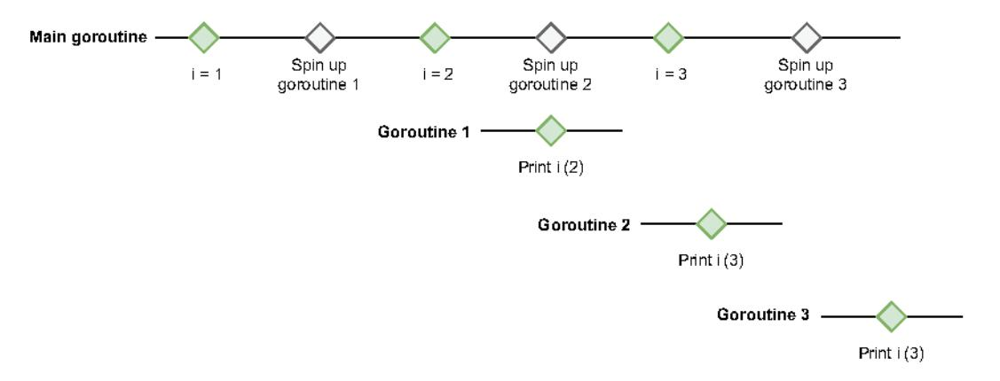

Figure 9.1 The goroutines access an i variable that isn't fixed but varies over time.

What are the solutions if we want each closure to access the value of i when the goroutine is created? The first option, if we want to keep using a closure, involves creating a new variable:

```
for _, i := range s {
   val := i
```

Why does this code work? In each iteration, we create a new local val variable. This variable captures the current value of i before the goroutine is created. Hence, when each closure goroutine executes the print statement, it does so with the expected value. This code prints 123 (again, in no particular order).

The second option no longer relies on a closure and instead uses an actual function:

```
for _, i := range s {
    go func(val int) {
        fmt.Print(val)
    } (i)
}

Calls this function and passes
the current value of i
```

We still execute an anonymous function within a new a goroutine (we don't run go f(i), for example), but this time it isn't a closure. The function doesn't reference val as a variable from outside its body; val is now part of the function input. By doing so, we fix i in each iteration and make our application work as expected.

We have to be cautious with goroutines and loop variables. If the goroutine is a closure that accesses an iteration variable declared from outside its body, that's a problem. We can fix it either by creating a local variable (for example, as we have seen using val:= i before executing the goroutine) or by making the function no longer a closure. Both options work, and there isn't one that we should favor over the other. Some developers may find the closure approach handier, whereas others may find the function approach more expressive.

What happens with a select statement on multiple channels? Let's find out.

### 9.4 #64: Expecting deterministic behavior using select and channels

One common mistake made by Go developers while working with channels is to make wrong assumptions about how select behaves with multiple channels. A false assumption can lead to subtle bugs that may be hard to identify and reproduce.

Let's imagine that we want to implement a goroutine that needs to receive from two channels:

- messageCh for new messages to be processed.
- disconnectCh to receive notifications conveying disconnections. In that case, we want to return from the parent function.

Of these two channels, we want to prioritize messageCh. For example, if a disconnection occurs, we want to ensure that we have received all the messages before returning.

We may decide to handle the prioritization like so:

```
for {
    select {
        select {
            case v := <-messageCh:
```

We use select to receive from multiple channels. Because we want to prioritize messageCh, we might assume that we should write the messageCh case first and the disconnectCh case next. But does this code even work? Let's give it a try by writing a dummy producer goroutine that sends 10 messages and then sends a disconnection notification:

```
for i := 0; i < 10; i++ {
    messageCh <- i
}
disconnectCh <- struct{}{}</pre>
```

If we run this example, here is a possible output if messageCh is buffered:

```
0
1
2
3
4
disconnection, return
```

Instead of consuming the 10 messages, we only received 5 of them. What's the reason? It lies in the specification of the select statement with multiple channels (https://go.dev/ref/spec):

If one or more of the communications can proceed, a single one that can proceed is chosen via a uniform pseudo-random selection.

Unlike a switch statement, where the first case with a match wins, the select statement selects randomly if multiple options are possible.

This behavior might look odd at first, but there's a good reason for it: to prevent possible starvation. Suppose the first possible communication chosen is based on the source order. In that case, we may fall into a situation where, for example, we only receive from one channel because of a fast sender. To prevent this, the language designers decided to use a random selection.

Coming back to our example, even though case v := <-messageCh is first in source order, if there's a message in both messageCh and disconnectCh, there is no guarantee about which case will be chosen. For that reason, the example's behavior isn't deterministic. We may receive 0 messages, or 5, or 10.

How can we overcome this situation? There are different possibilities if we want to receive all the messages before returning in case of a disconnection.

If there's a single producer goroutine, we have two options:

- Make messageCh an unbuffered channel instead of a buffered channel. Because the sender goroutine blocks until the receiver goroutine is ready, this approach guarantees that all the messages from messageCh are received before the disconnection from disconnectCh.
- Use a single channel instead of two channels. For example, we can define a struct that conveys either a new message or a disconnection. Channels

guarantee that the order for the messages sent is the same as for the messages received, so we can ensure that the disconnection is received last.

If we fall into the case where we have multiple producer goroutines, it may be impossible to guarantee which one writes first. Hence, whether we have an unbuffered messageCh channel or a single channel, it will lead to a race condition among the producer goroutines. In that case, we can implement the following solution:

- Receive from either messageCh or disconnectCh.
- 2 If a disconnection is received
  - Read all the existing messages in messageCh, if any.
  - Then return.

### Here is the solution:

```
for {
    select {
    case v := <-messageCh:
        fmt.Println(v)
    case <-disconnectCh:
        for {
                           Inner for/select
                                             Reads the remaining
            select {
                                             messages
            case v := <-messageCh:
                 fmt.Println(v)
            default:
                 fmt.Println("disconnection, return")
                                                           returns
                 return
            }
        }
    }
}
```

This solution uses an inner for/select with two cases: one on messageCh and a default case. Using default in a select statement is chosen only if none of the other cases match. In this case, it means we will return only after we have received all the remaining messages in messageCh.

Let's look at an example of how this code works. We will consider the case where we have two messages in messageCh and one disconnection in disconnectCh, as shown in figure 9.2.

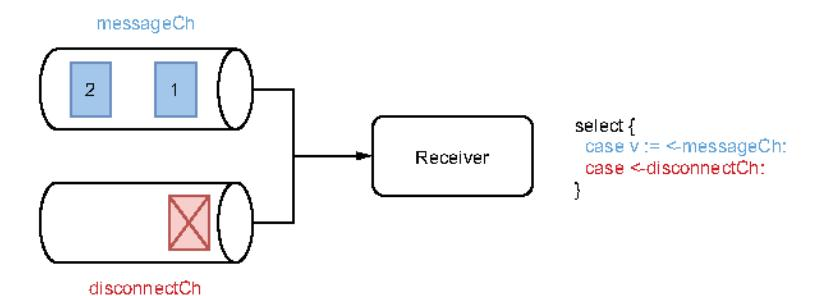

Figure 9.2 Initial state

In this situation, as we have said, select chooses one case or the other randomly. Let's assume select chooses the second case; see figure 9.3.

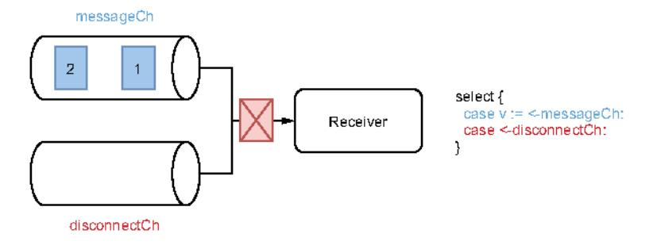

Figure 9.3 Receiving the disconnection

So, we receive the disconnection and enter in the inner select (figure 9.4). Here, as long as messages remain in messageCh, select will always prioritize the first case over default (figure 9.5).

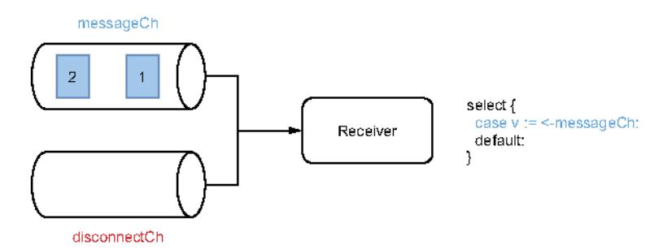

Figure 9.4 Inner select

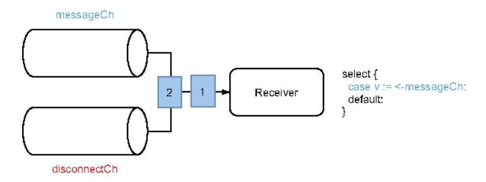

Figure 9.5 Receiving the remaining messages

Once we have received all the messages from messageCh, select does not block and chooses the default case (figure 9.6). Hence, we return and stop the goroutine.

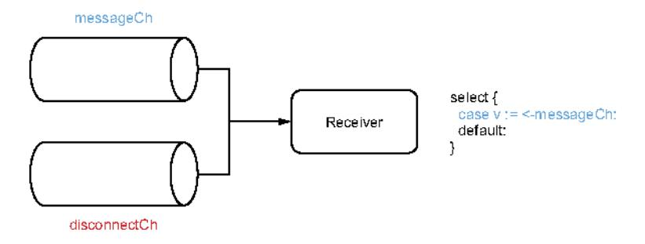

Figure 9.6 Default case

This is a way to ensure that we receive all the remaining messages from a channel with a receiver on multiple channels. Of course, if a messageCh is sent after the goroutine has returned (for example, if we have multiple producer goroutines), we will miss this message.

When using select with multiple channels, we must remember that if multiple options are possible, the first case in the source order does not automatically win. Instead, Go selects randomly, so there's no guarantee about which option will be chosen. To overcome this behavior, in the case of a single producer goroutine, we can use either unbuffered channels or a single channel. In the case of multiple producer goroutines, we can use inner selects and default to handle prioritizations.

The following section discusses a common type of channel: notification channels.

### 9.5 #65: Not using notification channels

Channels are a mechanism for communicating across goroutines via signaling. A signal can be either with or without data. But for Go programmers, it's not always straightforward how to tackle the latter case.

Let's look at a concrete example. We will create a channel that will notify us whenever a certain disconnection occurs. One idea is to handle it as a chan bool:

```
disconnectCh := make(chan bool)
```

Now, let's say we interact with an API that provides us with such a channel. Because it's a channel of Booleans, we can receive either true or false messages. It's probably clear what true conveys. But what does false mean? Does it mean we haven't been disconnected? And in this case, how frequently will we receive such a signal? Does it mean we have reconnected?

Should we even expect to receive false? Perhaps we should only expect to receive true messages. If that's the case, meaning we don't need a specific value to convey

some information, we need a channel without data. The idiomatic way to handle it is a channel of empty structs: chan struct{}.

In Go, an empty struct is a struct without any fields. Regardless of the architecture, it occupies zero bytes of storage, as we can verify using unsafe. Sizeof:

```
var s struct{}
fmt.Println{unsafe.Sizeof(s))
```

**NOTE** Why not use an empty interface (var i interface{})? Because an empty interface isn't free; it occupies 8 bytes on 32-bit architecture and 16 bytes on 64-bit architecture.

An empty struct is a de facto standard to convey an absence of meaning. For example, if we need a hash set structure (a collection of unique elements), we should use an empty struct as a value: map[K]struct{}.

Applied to channels, if we want to create a channel to send notifications without data, the appropriate way to do so in Go is a chan struct{}. One of the best-known utilizations of a channel of empty structs comes with Go contexts, which we discuss in this chapter.

A channel can be with or without data. If we want to design an idiomatic API in regard to Go standards, let's remember that a channel without data should be expressed with a chan struct{} type. This way, it clarifies for receivers that they shouldn't expect any meaning from a message's content—only the fact that they have received a message. In Go, such channels are called *notification channels*.

The next section discusses how Go behaves with nil channels and its rationale for using them.

### 9.6 #66: Not using nil channels

A common mistake while working with Go and channels is forgetting that nil channels can sometimes be helpful. So what are nil channels, and why should we care about them? That is the scope of this section.

Let's start with a goroutine that creates a nil channel and waits to receive a message. What should this code do?

```
var ch chan int 

✓───────────────────────────────────
```

ch is a chan int type. The zero value of a channel being nil, ch is nil. The goroutine won't panic; however, it will block forever.

The principle is the same if we send a message to a nil channel. This goroutine blocks forever:

```
var ch chan int
ch <- 0
```

Then what's the purpose of Go allowing messages to be received from or sent to a nil channel? We will discuss this question with a concrete example.

We will implement a func merge (ch1, ch2 <-chan int) <-chan int function to merge two channels into a single channel. By merging them (see figure 9.7), we mean each message received in either ch1 or ch2 will be sent to the channel returned.

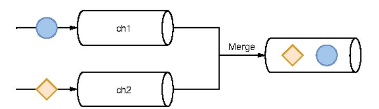

Figure 9.7 Merging two channels into one

How can we do this in Go? Let's first write a naive implementation that spins up a goroutine and receives from both channels (the resulting channel will be a buffered channel with one element):

```
func merge(ch1, ch2 <-chan int) <-chan int {
    ch := make(chan int, 1)

go func() {
        for v := range ch1 {
            ch <- v
        }
        for v := range ch2 {
            ch <- v
        }
        close(ch)
}()

return ch
}</pre>

Receives from ch1 and publishes
to the merged channel

Receives from ch2 and publishes
to the merged channel

return ch
}
```

Within another goroutine, we receive from both channels, and each message ends up being published in ch.

The main issue with this first version is that we receive from ch1 and then we receive from ch2. It means we won't receive from ch2 until ch1 is closed. This doesn't fit our use case, as ch1 may be open forever, so we want to receive from both channels simultaneously.

Let's write an improved version with concurrent receivers using select:

```
func merge(ch1, ch2 <-chan int) <-chan int {
   ch := make(chan int, 1)

   go func() {
      for {
            select {
```

```
case v := <-ch1:
```

The select statement lets a goroutine wait on multiple operations at the same time. Because we wrap it inside a for loop, we should repeatedly receive messages from one or the other channel, correct? But does this code even work?

One problem is that the close(ch) statement is unreachable. Looping over a channel using the range operator breaks when the channel is closed. However, the way we implemented a for/select doesn't catch when either ch1 or ch2 is closed. Even worse, if at some point ch1 or ch2 is closed, here's what a receiver of the merged channel will receive when logging the value:

```
received: 0
received: 0
received: 0
received: 0
received: 0
```

So a receiver will repeatedly receive an integer equal to zero. Why? Receiving from a closed channel is a non-blocking operation:

```
ch1 := make(chan int)
close(ch1)
fmt.Print(<-ch1, <-ch1)</pre>
```

Whereas we may expect this code to either panic or block, instead it runs and prints 0. What we catch here is the closure event, not an actual message. To check whether we receive a message or a closure signal, we must do it this way:

```
ch1 := make(chan int)
close(ch1)
v, open := <-ch1
fmt.Print(v, open)</pre>
Assigns to open whether
or not the channel is open
```

Using the open Boolean, we can now see whether ch1 is still open:

```
0 false
```

Meanwhile, we also assign 0 to v because it's the zero value of an integer.

Let's get back to our second solution. We said that it doesn't work very well if ch1 is closed; for example, because the select case is case v := <-ch1, we will keep entering this case and publishing a zero integer to the merged channel.

Let's take a step back and see what the best way would be to deal with this problem (see figure 9.8). We have to receive from both channels. Then, either

- ch1 is closed first, so we have to receive from ch2 until it is closed.
- ch2 is closed first, so we have to receive from ch1 until it is closed.

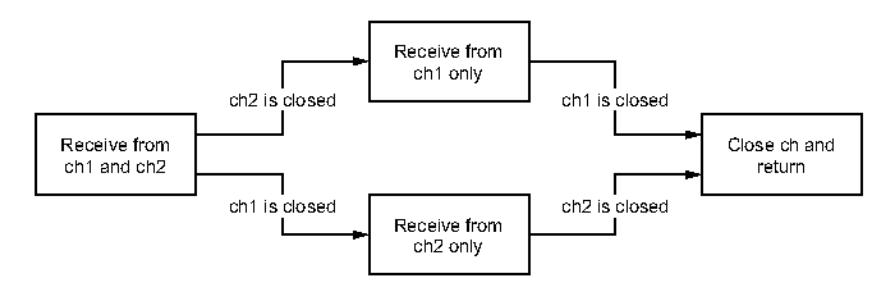

Figure 9.8 Handling different cases depending on whether ch1 or ch2 is closed first

How can we implement this in Go? Let's write a version like what we might do using a state machine approach and Booleans:

```
func merge(ch1, ch2 <-chan int) <-chan int {
    ch := make(chan int, 1)
    ch1Closed := false
    ch2Closed := false
    go func() {
        for {
             select f
             case v, open := <-ch1:
                 if !open {
                                             Handles if ch 1
                     ch1Closed = true
                                             is closed
                     break
                 }
                 ch <- v
             case v, open := <-ch2:
                 if !open {
                                             Handles if
                     ch2Closed = true
                                             ch2 is closed
                     break
                 ch <- v
             if ch1Closed && ch2Closed {
                                                      Closes and returns if both
                 close(ch)
                                                      channels are closed
                 return
             }
    }()
    return ch
}
```

We define two Booleans ch1Closed and ch2Closed. Once we receive a message from a channel, we check whether it's a closure signal. If so, we handle it by marking the channel as closed (for example, ch1Closed = true). After both channels are closed, we close the merged channel and stop the goroutine.

What is the problem with this code, apart from the fact that it's starting to get complex? There is one major issue: when one of the two channels is closed, the for loop will act as a busy-waiting loop, meaning it will keep looping even though no new message is received in the other channel. We have to keep in mind the behavior of the select statement in our example. Let's say ch1 is closed (so we won't receive any new messages here); when we reach select again, it will wait for one of these three conditions to happen:

- ch1 is closed.
- ch2 has a new message.
- ch2 is closed.

The first condition, ch1 is closed, will always be valid. Therefore, as long as we don't receive a message in ch2 and this channel isn't closed, we will keep looping over the first case. This will lead to wasting CPU cycles and must be avoided. Therefore, our solution isn't viable.

We could try to enhance the state machine part and implement sub-for/select loops within each case. But this would make our code even more complex and harder to understand.

It's the right time to come back to nil channels. As we mentioned, receiving from a nil channel will block forever. How about using this idea in our solution? Instead of setting a Boolean after a channel is closed, we will assign this channel to nil. Let's write the final version:

```
func merge(ch1, ch2 <-chan int) <-chan int {
   ch := make(chan int, 1)
   go func() {
        for ch1 != nil || ch2 != nil {
                                                 Continues if at least
           select {
                                                 one channel isn't nil
            case v, open := <-ch1:
                if !open {
                    ch1 = nil
                                      ☐ Assigns ch1 to a nil
                                       channel once closed
                }
                ch <- v
            case v, open := <-ch2:
                if !open {
                    ch2 = ni1
                                       Assigns ch2 to a nil
                    break
                                       channel once closed
                }
                ch <- v
            }
        close(ch)
    }()
```

```
return ch
```

First, we loop as long as at least one channel is still open. Then, for example, if ch1 is closed, we assign ch1 to nil. Hence, during the next loop iteration, the select statement will only wait for two conditions:

- ch2 has a new message.
- ch2 is closed.

ch1 is no longer part of the equation as it's a nil channel. Meanwhile, we keep the same logic for ch2 and assign it to nil after it's closed. Finally, when both channels are closed, we close the merged channel and return. Figure 9.9 shows a model of this implementation.

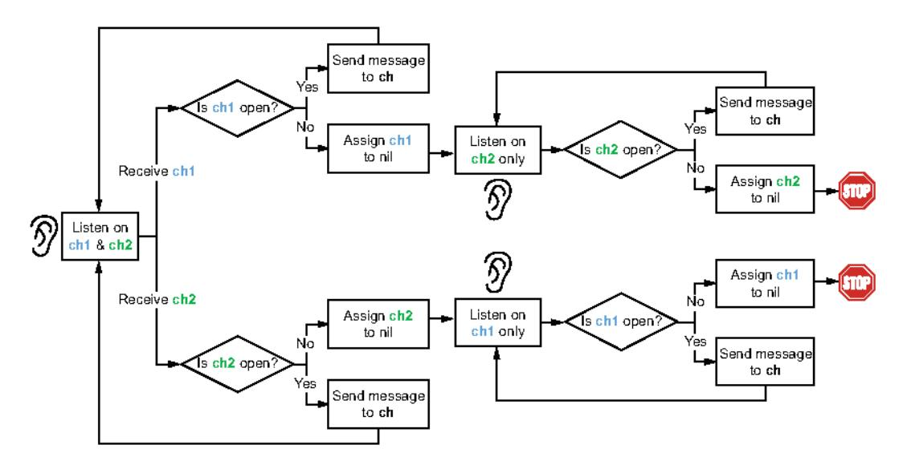

Figure 9.9 Receiving from both channels. If one is closed, we assign it to nil so we only receive from one channel.

This is the implementation we've been waiting for. We cover all the different cases, and it doesn't require a busy loop that will waste CPU cycles.

In summary, we have seen that waiting or sending to a nil channel is a blocking action, and this behavior isn't useless. As we have seen throughout the example of merging two channels, we can use nil channels to implement an elegant state machine that will *remove* one case from a select statement. Let's keep this idea in mind: nil channels are useful in some conditions and should be part of the Go developer's toolset when dealing with concurrent code.

In the next section, we discuss what size to set when creating a channel.

### 9.7 #67: Being puzzled about channel size

When we create a channel using the make built-in function, the channel can be either unbuffered or buffered. Related to this topic, two mistakes happen fairly frequently: being confused about when to use one or the other; and, if we use a buffered channel, what size to use. Let's examine these points.

First, let's remember the core concepts. An unbuffered channel is a channel without any capacity. It can be created by either omitting the size or providing a 0 size:

```
ch1 := make(chan int)
ch2 := make(chan int, 0)
```

Using an unbuffered channel (sometimes called a *synchronous channel*), the sender will block until the receiver receives data from the channel.

Conversely, a buffered channel has a capacity, and it must be created with a size greater than or equal to 1:

```
ch3 := make(chan int, 1)
```

With a buffered channel, a sender can send messages while the channel isn't full. Once the channel is full, it will block until a receiver goroutine receives a message. For example:

```
ch3 := make(chan int, 1)
ch3 <-1
```

The first send isn't blocking, whereas the second one is, as the channel is full at this stage.

Let's take a step back and discuss the fundamental differences between these two channel types. Channels are a concurrency abstraction to enable communication among goroutines. But what about synchronization? In concurrency, synchronization means we can guarantee that multiple goroutines will be in a known state at some point. For example, a mutex provides synchronization because it ensures that only one goroutine can be in a critical section at the same time. Regarding channels:

- An unbuffered channel enables synchronization. We have the guarantee that two goroutines will be in a known state: one receiving and another sending a message.
- A buffered channel doesn't provide any strong synchronization. Indeed, a producer goroutine can send a message and then continue its execution if the channel isn't full. The only guarantee is that a goroutine won't receive a message before it is sent. But this is only a guarantee because of causality (you don't drink your coffee before you prepare it).

It's essential to keep in mind this fundamental distinction. Both channel types enable communication, but only one provides synchronization. If we need synchronization, we must use unbuffered channels. Unbuffered channels may also be easier to reason

about: buffered channels can lead to obscure deadlocks that would be immediately apparent with unbuffered channels.

There are other cases where unbuffered channels are preferable: for example, in the case of a notification channel where the notification is handled via a channel closure (close(ch)). Here, using a buffered channel wouldn't bring any benefits.

But what if we need a buffered channel? What size should we provide? The default value we should use for buffered channels is its minimum: 1. So, we may approach the problem from this standpoint: is there any good reason *not* to use a value of 1? Here's a list of possible cases where we should use another size:

- While using a worker pooling-like pattern, meaning spinning a fixed number of goroutines that need to send data to a shared channel. In that case, we can tie the channel size to the number of goroutines created.
- When using channels for rate-limiting problems. For example, if we need to enforce resource utilization by bounding the number of requests, we should set up the channel size according to the limit.

If we are outside of these cases, using a different channel size should be done cautiously. It's pretty common to see a codebase using magic numbers for setting a channel size:

```
ch := make(chan int, 40)
```

Why 40? What's the rationale? Why not 50 or even 1000? Setting such a value should be done for a good reason. Perhaps it was decided following a benchmark or performance tests. In many cases, it's probably a good idea to comment on the rationale for such a value.

Let's bear in mind that deciding about an accurate queue size isn't an easy problem. First, it's a balance between CPU and memory. The smaller the value, the more CPU contention we can face. But the bigger the value, the more memory will need to be allocated.

Another point to consider is the one mentioned in a 2011 white paper about LMAX Disruptor (Martin Thompson et al.; https://lmax-exchange.github.io/disruptor/files/Disruptor-1.0.pdf):

Queues are typically always close to full or close to empty due to the differences in pace between consumers and producers. They very rarely operate in a balanced middle ground where the rate of production and consumption is evenly matched.

So, it's rare to find a channel size that will be steadily accurate, meaning an accurate value that won't lead to too much contention or a waste of memory allocation.

This is why, except for the cases described, it's usually best to start with a default channel size of 1. When unsure, we can still measure it using benchmarks, for example.

As with almost any topic in programming, exceptions can be found. Therefore, the goal of this section isn't to be exhaustive but to give directions about what size we

should use while creating channels. Synchronization is a guarantee with unbuffered channels, not buffered channels. Furthermore, if we need a buffered channel, we should remember to use one as the default value for the channel size. We should only decide to use another value with care using an accurate process, and the rationale should probably be commented. Last but not least, let's remember that choosing buffered channels may also lead to obscure deadlocks that would be easier to spot with unbuffered channels.

In the next section, we discuss possible side effects when dealing with string formatting.

### 9.8 #68: Forgetting about possible side effects with string formatting

Formatting strings is a common operation for developers, whether to return an error or log a message. However, it's pretty easy to forget the potential side effects of string formatting while working in a concurrent application. This section will see two concrete examples: one taken from the etcd repository leading to a data race and another leading to a deadlock situation.

### 9.8.1 etcd data race

etcd is a distributed key-value store implemented in Go. It is used in many projects, including Kubernetes, to store all cluster data. It provides an API to interact with a cluster. For example, the Watcher interface is used to be notified of data changes:

```
type Watcher interface {
    // Watch watches on a key or prefix. The watched events will be returned
    // through the returned channel.
    // ...
    Watch(ctx context.Context, key string, opts ...OpOption) WatchChan
    Close() error
}
```

The API relies on gRPC streaming. If you're not familiar with it, it's a technology to continuously exchange data between a client and a server. The server has to maintain a list of all the clients using this feature. Hence, the Watcher interface is implemented by a watcher struct containing all the active streams:

```
type watcher struct {
    // ...

// streams hold all the active gRPC streams keyed by ctx value.
    streams map[string]*watchGrpcStream
}
```

The map's key is based on the context provided when calling the Watch method:

```
func (w *watcher) Watch(ctx context.Context, key string,
```

```
ctxKey := fmt.Sprintf("%v", ctx)
// ...
wgs := w.streams[ctxKey]
// ...
Formats the map key depending
on the provided context
```

ctxKey is the map's key, formatted from the context provided by the client. When formatting a string from a context created with values (context.WithValue), Go will read all the values in this context. In this case, the etcd developers found that the context provided to Watch was a context containing mutable values (for example, a pointer to a struct) in some conditions. They found a case where one goroutine was updating one of the context values, whereas another was executing Watch, hence reading all the values in this context. This led to a data race.

The fix (https://github.com/etcd-io/etcd/pull/7816) was to not rely on fmt.Sprintf to format the map's key to prevent traversing and reading the chain of wrapped values in the context. Instead, the solution was to implement a custom streamKeyFromCtx function to extract the key from a specific context value that wasn't mutable.

**NOTE** A potentially mutable value in a context can introduce additional complexity to prevent data races. This is probably a design decision to be considered with care.

This example illustrates that we have to be careful about the side effects of string formatting in concurrent applications—in this case, a data race. In the following example, we will see a side effect leading to a deadlock situation.

### 9.8.2 Deadlock

Let's say we have to deal with a Customer struct that can be accessed concurrently. We will use a sync.RWMutex to protect the accesses, whether reading or writing. We will implement an UpdateAge method to update the customer's age and check that the age is positive. Meanwhile, we will implement the Stringer interface.

Can you see what the problem is in this code with a Customer struct exposing an UpdateAge method and implementing the fmt.Stringer interface?

```
type Customer struct (
   mutex sync.RWMutex
                                 Uses a sync.RWMutex to
   id
         string
                                 protect concurrent accesses
   age int
}
func (c *Customer) UpdateAge(age int) error {
   c.mutex.Lock()
                                1 Locks and defers unlock
    defer c.mutex.Unlock()
                                as we update Customer
                                                               Returns an error
                                                              」 if age is negative
    if age < 0 {
       return fmt.Errorf("age should be positive for customer %v", c)
```

```
c.age = age
return nil
}

func {c *Customer) String{} string {
    c.mutex.RLock{}
    defer c.mutex.RUnlock{}
    return fmt.Sprintf{"id %s, age %d", c.id, c.age}
}
Locks and defers unlock
as we read Customer
```

The problem here may not be straightforward. If the provided age is negative, we return an error. Because the error is formatted, using the %s directive on the receiver, it will call the String method to format Customer. But because UpdateAge already acquires the mutex lock, the String method won't be able to acquire it (see figure 9.10).

Hence, this leads to a deadlock situation. If all goroutines are also asleep, it leads to a panic:

```
fatal error: all goroutines are asleep - deadlock!
goroutine 1 [semacquire]:
sync.runtime_SemacquireMutex(0xc00009818c, 0x10b7d00, 0x0)
...
```

How should we deal with this situation? First, it illustrates how unit testing is important. In that case, we may argue that creating a test with a negative age isn't worth it, as the logic is quite simple. However, without proper test coverage, we might miss this issue.

One thing that could be improved here is to restrict the scope of the mutex locking. In UpdateAge, we first acquire the lock and check whether the input is valid. We should do the opposite: first check the input, and if the input is valid, acquire the lock. This has the benefit of reducing the potential side effects but can also have an impact performance-wise—a lock is acquired only when it's required, not before:

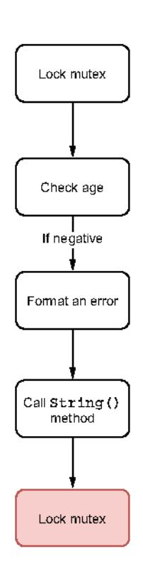

Figure 9.10 UpdateAge execution if age is negative

```
func {c *Customer) UpdateAge{age int) error {
    if age < 0 {
        return fmt.Errorf{"age should be positive for customer %v", c)
}

c.mutex.Lock{}
defer c.mutex.Unlock{}

c.age = age
return nil</pre>
Locks the mutex only when\ninput has been validated
```

In our case, locking the mutex only after the age has been checked avoids the dead-lock situation. If the age is negative, String is called without locking the mutex beforehand.

In some conditions, though, it's not straightforward or possible to restrict the scope of a mutex lock. In these conditions, we have to be extremely careful with string formatting. Perhaps we want to call another function that doesn't try to acquire the mutex, or we only want to change the way we format the error so that it doesn't call the String method. For example, the following code doesn't lead to a deadlock because we only log the customer ID in accessing the id field directly:

```
func {c *Customer) UpdateAge(age int) error {
   c.mutex.Lock()
   defer c.mutex.Unlock()

   if age < 0 {
       return fmt.Errorf("age should be positive for customer id %s", c.id)
   }

   c.age = age
   return nil
}</pre>
```

We have seen two concrete examples, one formatting a key from a context and another returning an error that formats a struct. In both cases, formatting a string leads to a problem: a data race and a deadlock situation, respectively. Therefore, in concurrent applications, we should remain cautious about the possible side effects of string formatting.

The following section discusses the behavior of append when it is called concurrently.

### 9.9 #69: Creating data races with append

We mentioned earlier what a data race is and what the impacts are. Now, let's look at slices and whether adding an element to a slice using append is data-race-free. Spoiler? It depends.

In the following example, we will initialize a slice and create two goroutines that will use append to create a new slice with an additional element:

```
s := make([]int, 1)

go func() {
    s1 := append(s, 1)
```

Do you believe this example has a data race? The answer is no.

We have to recall some slice fundamentals described in chapter 3. A slice is backed by an array and has two properties: length and capacity. The length is the number of available elements in the slice, whereas the capacity is the total number of elements in the backing array. When we use append, the behavior depends on whether the slice is full (length == capacity). If it is, the Go runtime creates a new backing array to add the new element; otherwise, the runtime adds it to the existing backing array.

In this example, we create a slice with <code>make([]int, 1)</code>. The code creates a one-length, one-capacity slice. Thus, because the slice is full, using append in each goroutine returns a slice backed by a new array. It doesn't mutate the existing array; hence, it doesn't lead to a data race.

Now, let's run the same example with a slight change in how we initialize s. Instead of creating a slice with a length of 1, we create it with a length of 0 but a capacity of 1:

```
s := make([]int, 0, 1) Changes the way the slice is initialized
```

How about this new example? Does it contain a data race? The answer is yes:

```
WARNING: DATA RACE
Write at 0x00c00009e080 by goroutine 10:
...

Previous write at 0x00c00009e080 by goroutine 9:
...
```

We create a slice with make ([] int, 0, 1). Therefore, the array isn't full. Both goroutines attempt to update the same index of the backing array (index 1), which is a data race.

How can we prevent the data race if we want both goroutines to work on a slice containing the initial elements of s plus an extra element? One solution is to create a copy of s:

```
s := make([]int, 0, 1)
go func() {
   sCopy := make([]int, len(s), cap(s))
   copy(sCopy, s) ◀
                              Makes a copy and uses
                             append on the copied slice
   s1 := append(sCopy, 1)
   fmt.Println(s1)
}{)
go func() {
   sCopy := make([]int, len(s), cap(s))
                                            Same
   copy(sCopy, s)
   s2 := append(sCopy, 1)
   fmt.Println(s2)
}()
```

Both goroutines make a copy of the slice. Then they use append on the slice copy, not the original slice. This prevents a data race because both goroutines work on isolated data.

### Data races with slices and maps

How much do data races impact slices and maps? When we have multiple goroutines the following is true:

- Accessing the same slice index with at least one goroutine updating the value is a data race. The goroutines access the same memory location.
- Accessing different slice indices regardless of the operation isn't a data race;
   different indices mean different memory locations.
- Accessing the same map (regardless of whether it's the same or a different key) with at least one goroutine updating it is a data race. Why is this different from a slice data structure? As we mentioned in chapter 3, a map is an array of buckets, and each bucket is a pointer to an array of key-value pairs. A hashing algorithm is used to determine the array index of the bucket. Because this algorithm contains some randomness during the map initialization, one execution may lead to the same array index, whereas another execution may not. The race detector handles this case by raising a warning regardless of whether an actual data race occurs.

While working with slices in concurrent contexts, we must recall that using append on slices isn't always race-free. Depending on the slice and whether it's full, the behavior will change. If the slice is full, append is race-free. Otherwise, multiple goroutines may compete to update the same array index, resulting in a data race.

In general, we shouldn't have a different implementation depending on whether the slice is full. We should consider that using append on a shared slice in concurrent applications can lead to a data race. Hence, it should be avoided.

Now, let's discuss a common mistake with inaccurate mutex locks on top of slices and maps.

### 9.10 #70: Using mutexes inaccurately with slices and maps

While working in concurrent contexts where data is both mutable and shared, we often have to implement protected accesses around data structures using mutexes. A common mistake is to use mutexes inaccurately when working with slices and maps. Let's look at a concrete example and understand the potential problems.

We will implement a Cache struct used to handle caching for customer balances. This struct will contain a map of balances per customer ID and a mutex to protect concurrent accesses:

```
type Cache struct {
    mu
```

**NOTE** This solution uses a sync.RWMutex to allow multiple readers as long as there are no writers.

Next, we add an AddBalance method that mutates the balances map. The mutation is done in a critical section (within a mutex lock and a mutex unlock):

```
func (c *Cache) AddBalance(id string, balance float64) {
    c.mu.Lock()
    c.balances[id] = balance
    c.mu.Unlock()
}
```

Meanwhile, we have to implement a method to calculate the average balance for all the customers. One idea is to handle a minimal critical section this way:

```
func (c *Cache) AverageBalance() float64 {
    c.mu.RLock()
    balances := c.balances
```

First we create a copy of the map to a local balances variable. Only the copy is done in the critical section to iterate over each balance and calculate the average outside of the critical section. Does this solution work?

If we run a test using the -race flag with two concurrent goroutines, one calling AddBalance (hence mutating balances) and another calling AverageBalance, a data race occurs. What's the problem here?

Internally, a map is a runtime.hmap struct containing mostly metadata (for example, a counter) and a pointer referencing data buckets. So, balances := c.balances doesn't copy the actual data. It's the same principle with a slice:

```
s1 := []int{1, 2, 3}
s2 := s1
s2[0] = 42
fmt.Println(s1)
```

Printing \$1 returns [42 2 3] even though we modify \$2. The reason is that \$2 := \$1 creates a new slice: \$2 has the same length and the same capacity and is backed by the same array as \$1.

Coming back to our example, we assign to balances a new map referencing the same data buckets as c.balances. Meanwhile, the two goroutines perform operations on the same data set, and one of them mutates it. Hence, it's a data race. How can we fix the data race? We have two options.

If the iteration operation isn't heavy (that's the case here, as we perform an increment operation), we should protect the whole function:

```
func (c *Cache) AverageBalance() float64 {
    c.mu.RLock()
    defer c.mu.RUnlock()
```

The critical section now encompasses the whole function, including the iterations. This prevents data races.

Another option, if the iteration operation isn't lightweight, is to work on an actual copy of the data and protect only the copy:

```
func (c *Cache) AverageBalance() float64 {
    c.mu.RLock()
    m := make(map[string]float64, len(c.balances))
    for k, v := range c.balances {
        m[k] = v
    }
    c.mu.RUnlock()

sum := 0.
    for _, balance := range m (
        sum += balance
    }
    return sum / float64(len(m))
}
```

Once we have made a deep copy, we release the mutex. The iterations are done on the copy outside of the critical section.

Let's think about this solution. We have to iterate twice on the map values: once to copy and once to perform the operations (here, the increments). But the critical section is only the map copy. Therefore, this solution can be a good fit if and only if an operation isn't *fast*. For example, if an operation requires calling an external database, this solution will probably be more efficient. It's impossible to define a threshold when choosing one solution or the other as the choice depends on factors such as the number of elements and the average size of the struct.

In summary, we have to be careful with the boundaries of a mutex lock. In this section, we have seen why assigning an existing map (or an existing slice) to a map isn't enough to protect against data races. The new variable, whether a map or a slice, is backed by the same data set. There are two leading solutions to prevent this: protect the whole function, or work on a copy of the actual data. In all cases, let's be cautious when designing critical sections and make sure the boundaries are accurately defined.

Let's now discuss a common mistake while using sync. Wait Group.

### 9.11 #71: Misusing sync.WaitGroup

sync. Wait Group is a mechanism to wait for n operations to complete; generally, we use it to wait for n goroutines to complete. Let's first recall the public API; then we will look at a pretty frequent mistake leading to non-deterministic behavior.

A wait group can be created with the zero value of sync. WaitGroup:

```
wg := symc.WaitGroup{}
```

Internally, a sync.WaitGroup holds an internal counter initialized by default to 0. We can increment this counter using the Add(int) method and decrement it using Done() or Add with a negative value. If we want to wait for the counter to be equal to 0, we have to use the Wait() method that is blocking.

**NOTE** The counter cannot be negative, or the goroutine will panic.

In the following example, we will initialize a wait group, start three goroutines that will update a counter atomically, and then wait for them to complete. We want to wait for these three goroutines to print the value of the counter (which should be 3). Can you guess whether there's an issue with this code?

```
wg := sync.WaitGroup{}
var v uint64
for i := 0; i < 3; i++ { | Creates
    go func() {                                   
                                           Increments the wait
                                             group counter
         wg.Add(1)
         atomic.AddUint64(&v, 1)
                                                     Atomically
         wg.Done() ←
                                                     increments v
                             Decrements the
    }()
                             wait group counter
}
wg.Wait()
                               Waits until all the goroutines have
fmt.Println(v)
                             incremented v before printing it
```

If we run this example, we get a non-deterministic value: the code can print any value from 0 to 3. Also, if we enable the -race flag, Go will even catch a data race. How is this possible, given that we are using the sync/atomic package to update v? What's wrong with this code?

The problem is that wg.Add(1) is called within the newly created goroutine, not in the parent goroutine. Hence, there is no guarantee that we have indicated to the wait group that we want to wait for three goroutines before calling wg.Wait().

Figure 9.11 shows a possible scenario when the code prints 2. In this scenario, the main goroutine spins up three goroutines. But the last goroutine is executed after the two first goroutines have already called wg.Done(), so, the parent goroutine is already unlocked. Therefore, in this scenario, when the main goroutine reads v, it's equal to 2. The race detector can also detect unsafe accesses to v.

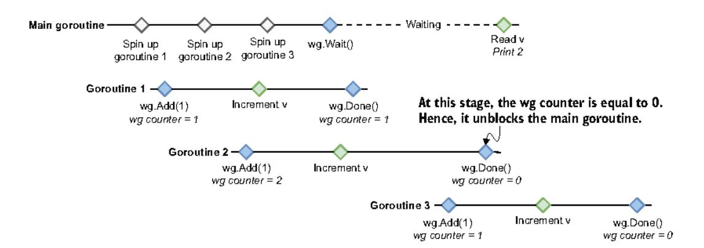

Figure 9.11 The last goroutine calls wg. Add (1) after the main goroutine is already unblocked.

When dealing with goroutines, it's crucial to remember that the execution isn't deterministic without synchronization. For example, the following code could print either ab or ba:

```
go func() {
    fmt.Print("a")
}()
go func() {
    fmt.Print("b")
}()
```

Both goroutines can be assigned to different threads, and there's no guarantee which thread will be executed first.

The CPU has to use a *memory fence* (also called a *memory barrier*) to ensure order. Go provides different synchronization techniques for implementing memory fences: for example, sync.WaitGroup enables a happens-before relationship between wg.Add and wg.Wait.

Coming back to our example, there are two options to fix our issue. First, we can call wg. Add before the loop with 3:

```
wg := sync.WaitGroup{}
var v uint64

wg.Add(3)
for i := 0; i < 3; i++ {
    go func() {
```

Or, second, we can call wg. Add during each loop iteration before spinning up the child goroutines:

```
wg := sync.WaitGroup{}
var v uint64

for i := 0; i < 3; i++ {
    wg.Add{1}
    go func{} {
```

Both solutions are fine. If the value we want to set eventually to the wait group counter is known in advance, the first solution prevents us from having to call wg. Add multiple times. However, it requires making sure the same count is used everywhere to avoid subtle bugs.

Let's be cautious not to reproduce this common mistake made by Go developers. When using a sync.WaitGroup, the Add operation must be done before spinning up a goroutine in the parent goroutine, whereas the Done operation must be done within the goroutine.

The following section discusses another primitive of the sync package: sync.Cond.

### 9.12 #72: Forgetting about sync.Cond

Among the synchronization primitives in the sync package, sync. Cond is probably the least used and understood. However, it provides features that we can't achieve with channels. This section goes through a concrete example to show when sync. Cond can be helpful and how to use it.

The example in this section implements a donation goal mechanism: an application that raises alerts whenever specific goals are reached. We will have one goroutine in charge of incrementing a balance (an updater goroutine). In contrast, other goroutines will receive updates and print a message whenever a specific goal is reached (listener goroutines). For example, one goroutine is waiting for a \$10 donation goal, whereas another is waiting for a \$15 donation goal.

One first naive solution uses mutexes. The updater goroutine increments the balance every second. On the other side, the listener goroutines loop until their donation goal is met:

```
type Donation struct (
                                    Creates and instantiates a
    mu sync.RWMutex
                                    Donation struct containing the
   balance int
                                   current balance and a mutex
donation := &Bonation()
                               Creates
// Listener goroutines
                               a closure
f := func(goal int) {
    donation.mu.RLock()
    for donation.balance < goal {
                                           7 Checks if the goal
        donation.mu.RUnlock()
                                           is reached
        donation.mu.RLock()
```

```
}
fmt.Printf("$%d goal reached\n", donation.balance)
donation.mu.RUnlock()
}
go f(10)
go f(15)

// Updater goroutine
go func() {
    for (
```

We protect the accesses to the shared donation. balance variable using the mutex. If we run this example, it works as expected:

```
$10 goal reached
$15 goal reached
```

The main issue—and what makes this a terrible implementation—is the busy loop. Each listener goroutine keeps looping until its donation goal is met, which wastes a lot of CPU cycles and makes the CPU usage gigantic. We need to find a better solution.

Let's take a step back. We have to find a way to signal from the updater goroutine whenever the balance is updated. If we think about signaling in Go, we should consider channels. So, let's try another version using the channel primitive:

```
type Donation struct {
                                Updates Donation so
    balance int
                               lit contains a channel
    ch chan int
donation := &Donation(ch: make(chan int))
// Listener goroutines
                                                 Receives channel
f := func(goal int) {
                                                 updates
    for balance := range donation.ch {
        if balance >= goal {
            fmt.Printf("$%d goal reached\n", balance)
            return
        }
    }
go f(10)
go f(15)
// Updater goroutine
for {
    time.Sleep(time.Second)
                                                 Sends a message whenever
    donation.balance++
                                                 the balance is updated
    donation.ch <- donation.balance
}
```

Each listener goroutine receives from a shared channel. Meanwhile, the updater goroutine sends messages whenever the balance is updated. But if we give this solution a try, here is a possible output:

```
$11 goal reached
$15 goal reached
```

The first goroutine should have been notified when the balance was \$10, not \$11. What happened?

A message sent to a channel is received by only one goroutine. In our example, if the first goroutine receives from the channel before the second one, figure 9.12 shows what could happen.

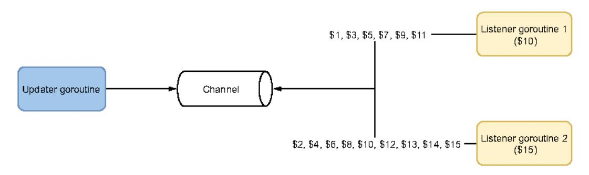

Figure 9.12 The first goroutine receives the \$1 message, then the second goroutine receives the \$2 message, then the first goroutine receives the \$3 message, and so forth.

The default distribution mode with multiple goroutines receiving from a shared channel is round-robin. It can change if one goroutine isn't ready to receive messages (not in a waiting state on the channel); in that case, Go distributes the message to the next available goroutine.

Each message is received by a single goroutine. Therefore, the first goroutine didn't receive the \$10 message in this example, but the second one did. Only a channel closure event can be broadcast to multiple goroutines. But here we don't want to close the channel, because then the updater goroutine couldn't send messages.

There's another issue with using channels in this situation. The listener goroutines return whenever their donation goal is met. Hence, the updater goroutine has to know when all the listeners stop receiving messages to the channel. Otherwise, the channel will eventually become full and block the sender. A possible solution could be to add a sync. WaitGroup to the mix, but doing so would make the solution more complex.

Ideally, we need to find a way to repeatedly broadcast notifications whenever the balance is updated to multiple goroutines. Fortunately, Go has a solution: sync.Cond. Let's first discuss the theory; then we will see how to solve our problem using this primitive.

According to the official documentation (https://pkg.go.dev/sync),

Cond implements a condition variable, a rendezvous point for goroutines waiting for or announcing the occurrence of an event.

A condition variable is a container of threads (here, goroutines) waiting for a certain condition. In our example, the condition is a balance update. The updater goroutine broadcasts a notification whenever a balance is updated, and the listener goroutine waits until an update. Furthermore, sync.Cond relies on a sync.Locker (a \*sync.Mutex or \*sync.RWMutex) to prevent data races. Here is a possible implementation:

```
type Donation struct {
    cond *sync.Cond
                                Adds a
    balance int
                                *sync.Cond
3
                                                 sync.Cond relies
donation := &Bonation(
                                                 on a mutex.
    cond: sync.NewCond(&sync.Mutex()),
// Listener goroutines
f := func(goal int) {
    donation.cond.L.Lock()
                                          Waits for a condition (balance
    for donation.balance < goal {
                                         updated) within lock/unlock
        donation.cond.Wait()
    fmt.Printf("%d$ goal reached\n", donation.balance)
    donation.cond.L.Unlock()
go f(10)
go f(15)
// Updater goroutine
for {
    time.Sleep(time.Second)
                                    Increments the balance
    donation.cond.L.Lock()
                                    within lock/unlock
    donation.balance++
    donation.cond.L.Unlock()
    donation.cond.Broadcast()
                                       Broadcasts the fact that a condition
}
                                      was met (balance updated)
```

First we create a \*sync.Cond using sync.NewCond and provide a \*sync.Mutex. What about the listener and updater goroutines?

The listener goroutines loop until the donation balance is met. Within the loop, we use the Wait method that blocks until the condition is met.

**NOTE** Let's make sure the term *condition* is understood here. In this context, we're talking about the balance being updated, not the donation goal condition. So, it's a single condition variable shared by two listener goroutines.

The call to Wait must happen within a critical section, which may sound odd. Won't the lock prevent other goroutines from waiting for the same condition? Actually, the implementation of Wait is the following:

- Unlock the mutex.
- 2 Suspend the goroutine, and wait for a notification.
- 3 Lock the mutex when the notification arrives.

So, the listener goroutines have two critical sections:

- When accessing donation.balance in for donation.balance < goal</li>
- When accessing donation.balance in fmt.Printf

This way, all the accesses to the shared donation.balance variable are protected.

Now, what about the updater goroutine? The balance update is done within a critical section to prevent data races. Then we call the Broadcast method, which wakes all the goroutines waiting on the condition each time the balance is updated.

Hence, if we run this example, it prints what we expect:

```
10$ goal reached 15$ goal reached
```

In our implementation, the condition variable is based on the balance being updated. Therefore, the listener variables wake each time a new donation is made, to check whether their donation goal is met. This solution prevents us from having a busy loop that burns CPU cycles in repeated checks.

Let's also note one possible drawback when using sync.Cond. When we send a notification—for example, to a chan struct—even if there's no active receiver, the message is buffered, which guarantees that this notification will be received eventually. Using sync.Cond with the Broadcast method wakes all goroutines currently waiting on the condition; if there are none, the notification will be missed. This is also an essential principle that we have to keep in mind.

### Signal() vs. Broadcast()

We can wake a single goroutine using Signal() instead of Broadcast(). In terms of semantics, it is the same as sending a message in a chan struct in a non-blocking fashion:

```
ch := make(chan struct())
select {
case ch <- struct()():
default:
}</pre>
```

Signaling in Go can be achieved with channels. The only event that multiple goroutines can catch is a channel closure, but this can happen just once. Therefore, if we

repeatedly send notifications to multiple goroutines, sync.Cond is a solution. This primitive is based on condition variables that set up containers of threads waiting for a specific condition. Using sync.Cond, we can broadcast signals that wake all the goroutines waiting on a condition.

Let's extend our knowledge of concurrency primitives using golang.org/x and the errgroup package.

### 9.13 #73: Not using errgroup

Regardless of the programming language, reinventing the wheel is rarely a good idea. It's also pretty common for codebases to reimplement how to spin up multiple goroutines and aggregate the errors. But a package in the Go ecosystem is designed to support this frequent use case. Let's look at it and understand why it should be part of the toolset of Go developers.

golang.org/x is a repository providing extensions to the standard library. The sync sub-repository contains a handy package: errgroup.

Suppose we have to handle a function, and we receive as an argument some data that we want to use to call an external service. Due to constraints, we can't make a single call; we make multiple calls with a different subset each time. Also, these calls are made in parallel (see figure 9.13).

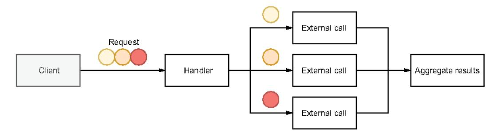

Figure 9.13 Each circle results in a parallel call.

In case of one error during a call, we want to return it. In case of multiple errors, we want to return only one of them. Let's write the skeleton of the implementation using only the standard concurrency primitives:

```
func handler(ctx context.Context, circles []Circle) {[]Result, error) {
    results := make([]Result, len(circles))
    wg := sync.WaitGroup{}
    wg.Add(len(results))

for i, circle := range circles {

Same for circle
    circle := circle
```

```
go func() {
                    defer wg.Done()
                                           goroutine per Circle
  Indicates
  when the
                    result, err := foo(ctx, circle)
goroutine is
                    if err != mil {
  complete |
                         // ?
                    results[i] = result
                                                    Aggregates
                } { }
                                                    the results
           }
           wg.Wait()
           // ...
```

We decided to use a sync.WaitGroup to wait until all the goroutines are completed and handle the aggregations in a slice. This is one way to do it; another would be to send each partial result to a channel and aggregate them in another goroutine. The main challenge would be to reorder the incoming messages if ordering was required. Therefore, we decided to go with the easiest approach and a shared slice.

**NOTE** Because each goroutine writes to a specific index, this implementation is data-race-free.

However, there's one crucial case we haven't tackled. What if foo (the call made within a new goroutine) returns an error? How should we handle it? There are various options, including these:

- Just like the results slice, we could have a slice of errors shared among the goroutines. Each goroutine would write to this slice in case of an error. We would have to iterate over this slice in the parent goroutine to determine whether an error occurred (O(n) time complexity).
- We could have a single error variable accessed by the goroutines via a shared mutex.
- We could think about sharing a channel of errors, and the parent goroutine would receive and handle these errors.

Regardless of the option chosen, it starts to make the solution pretty complex. For that reason, the errgroup package was designed and developed.

It exports a single WithContext function that returns a \*Group struct given a context. This struct provides synchronization, error propagation, and context cancellation for a group of goroutines and exports only two methods:

- Go to trigger a call in a new goroutine.
- Wait to block until all the goroutines have completed. It returns the first nonnil error, if any.

Let's rewrite the solution using errgroup. First we need to import the errgroup package:

```
$ go get golang.org/x/sync/errgroup
```

### And here's the implementation:

```
func handler(ctx context.Context, circles []Circle) {[]Result, error) {
    results := make([]Result, len(circles))
    g, ctx := errgroup.WithContext(ctx)
                                                    Creates an *errgroup.Group
                                                    given the parent context
    for i, circle := range circles {
        i := i
        circle := circle
        g.Go(func() error (
                                                   Calls Go to spin up the logic of
             result, err := foo(ctx, circle)
                                                   handling the error and aggregating
             if err != nil {
                                                   the results in a new goroutine
                 return err
             results[i] = result
             return nil
        })
    }
    if err := q.Wait{); err != nil {
                                                Calls Wait to wait
        return nil, err
                                                for all the goroutines
    return results. nil
}
```

First, we create an \*errgroup.Group by providing the parent context. In each iteration, we use g.Go to trigger a call in a new goroutine. This method takes a func() error as an input, with a closure wrapping the call to foo and handling the result and error. As the main difference from our first implementation, if we get an error, we return it from this closure. Then, g.Wait allows us to wait for all the goroutines to complete.

This solution is inherently more straightforward than the first one (which was partial, as we didn't handle the error). We don't have to rely on extra concurrency primitives, and the errgroup. Group is sufficient to tackle our use case.

Another benefit that we haven't tackled yet is the shared context. Let's imagine we have to trigger three parallel calls:

- The first returns an error in 1 millisecond.
- The second and third calls return a result or an error in 5 seconds.

We want to return an error, if any. Hence, there's no point in waiting until the second and third calls are complete. Using errgroup.WithContext creates a shared context used in all the parallel calls. Because the first call returns an error in 1 millisecond, it will cancel the context and thus the other goroutines. So, we won't have to wait 5 seconds to return an error. This is another benefit when using errgroup.

**NOTE** The process invoked by g. Go must be *context aware*. Otherwise, canceling the context won't have any effect.

In summary, when we have to trigger multiple goroutines and handle errors plus context propagation, it may be worth considering whether errgroup could be a solution.

As we have seen, this package enables synchronization for a group of goroutines and provides an answer to deal with errors and shared contexts.

The last section of this chapter discusses a common mistake made by Go developers when copying a sync type.

### 9.14 #74: Copying a sync type

The sync package provides basic synchronization primitives such as mutexes, condition variables, and wait groups. For all these types, there's a hard rule to follow: they should never be copied. Let's understand the rationale and the possible problems.

We will create a thread-safe data structure to store counters. It will contain a map[string]int representing the current value for each counter. We will also use a sync.Mutex because the accesses have to be protected. And let's add an increment method to increment a given counter name:

```
type Counter struct {
    mu
```

The increment logic is done in a critical section: between c.mu.Lock() and c.mu .Unlock(). Let's give our method a try by using the -race option to run the following example that spins up two goroutines and increments their respective counters:

```
counter := NewCounter()

go func() {
    counter.Increment("foo")
}()

go func() {
    counter.Increment("bar")
}()
```

If we run this example, it raises a data race:

```
WARNING: DATA RACE
```

The problem in our Counter implementation is that the mutex is copied. Because the receiver of Increment is a value, whenever we call Increment, it performs a copy of the

Counter struct, which also copies the mutex. Therefore, the increment isn't done in a shared critical section.

sync types shouldn't be copied. This rule applies to the following types:

- sync.Cond
- sync.Map
- sync.Mutex
- sync.RWMutex
- sync.Once
- sync.Pool
- sync.WaitGroup

Therefore, the mutex shouldn't have been copied. What are the alternatives? The first is to modify the receiver type for the Increment method:

```
func (c *Counter) Increment(name string) {
    // Same code
}
```

Changing the receiver type avoids copying Counter when Increment is called. Therefore, the internal mutex isn't copied.

If we want to keep a value receiver, the second option is to change the type of the mu field in Counter to be a pointer:

```
type Counter struct {
    mu    *sync.Mutex
```

If Increment has a value receiver, it still copies the Counter struct. However, as mu is now a pointer, it will perform a pointer copy only, not an actual copy of a sync.Mutex. Hence, this solution also prevents data races.

NOTE We also changed the way mu was initialized. Because mu is a pointer, if we omit it when creating Counter, it will be initialized to the zero value of a pointer: nil. This will cause to the goroutine to panic when c.mu.Lock() is called.

We may face the issue of unintentionally copying a sync field in the following conditions:

- Calling a method with a value receiver (as we have seen)
- Calling a function with a sync argument
- Calling a function with an argument that contains a sync field

Summary 233

In each case, we should remain very cautious. Also, let's note that some linters can catch this issue—for example, using go vet:

```
$ go vet .
./main.go:19:9: Increment passes lock by value: Counter contains sync.Mutex
```

As a rule of thumb, whenever multiple goroutines have to access a common sync element, we must ensure that they all rely on the same instance. This rule applies to all the types defined in the sync package. Using pointers is a way to solve this problem: we can have either a pointer to a sync element or a pointer to a struct containing a sync element.

### Summary

- Understanding the conditions when a context can be canceled should matter when propagating it: for example, an HTTP handler canceling the context when the response has been sent.
- Avoiding leaks means being mindful that whenever a goroutine is started, you should have a plan to stop it eventually.
- To avoid bugs with goroutines and loop variables, create local variables or call functions instead of closures.
- Understanding that select with multiple channels chooses the case randomly\nif multiple options are possible prevents making wrong assumptions that can
  lead to subtle concurrency bugs.
- Send notifications using a chan struct {} type.
- Using nil channels should be part of your concurrency toolset because it allows
  you to remove cases from select statements, for example.
- Carefully decide on the right channel type to use, given a problem. Only unbuffered channels provide strong synchronization guarantees.
- You should have a good reason to specify a channel size other than one for buffered channels.
- Being aware that string formatting may lead to calling existing functions means watching out for possible deadlocks and other data races.
- Calling append isn't always data-race-free; hence, it shouldn't be used concurrently on a shared slice.
- Remembering that slices and maps are pointers can prevent common data races.
- To accurately use sync.WaitGroup, call the Add method before spinning up goroutines.
- You can send repeated notifications to multiple goroutines with sync.Cond.
- You can synchronize a group of goroutines and handle errors and contexts with the errgroup package.
- sync types shouldn't be copied.
