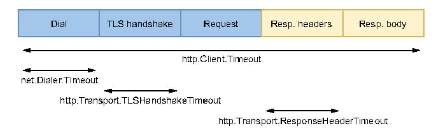

# Chapter 10: The standard library

## This chapter covers

- Providing a correct time duration
- Understanding potential memory leaks while using time. After
- Avoiding common mistakes in JSON handling and SQL
- Closing transient resources
- Remembering the return statement in HTTP handlers
- Why production-grade applications shouldn't use default HTTP clients and servers

The Go standard library is a set of core packages that enhance and extend the language. For example, Go developers can write HTTP clients or servers, handle JSON data, or interact with SQL databases. All of these features are provided by the standard library. However, it can be easy to misuse the standard library, or we may have a limited understanding of its behavior, which can lead to bugs and writing applications that shouldn't be considered production-grade. Let's look at some of the most common mistakes while using the standard library.

### 10.1 #75: Providing a wrong time duration

The standard library provides common functions and methods that accept a time. Duration. However, because time. Duration is an alias for the int64 type, newcomers to the language can get confused and provide a wrong duration. For example, developers with a Java or JavaScript background are used to passing numeric types.

To illustrate this common error, let's create a new time. Ticker that will deliver the ticks of a clock every second:

```
ticker := time.NewTicker(1000)
for {
    select {
    case <-ticker.C:
```

If we run this code, we notice that ticks aren't delivered every second; they are delivered every microsecond.

Because time. Duration is based on the int64 type, the previous code is correct since 1000 is a valid int64. But time. Duration represents the elapsed time between two instants in *nanoseconds*. Therefore, we provided NewTicker with a duration of 1,000 nanoseconds = 1 microsecond.

This mistake happens frequently. Indeed, standard libraries in languages such as Java and JavaScript sometimes ask developers to provide durations in milliseconds.

Furthermore, if we want to purposely create a time. Ticker with an interval of 1 microsecond, we shouldn't pass an int64 directly. We should instead always use the time. Duration API to avoid possible confusion:

```
ticker = time.NewTicker(time.Microsecond)
// Or
ticker = time.NewTicker(1000 * time.Nanosecond)
```

This is not the most complex mistake in this book, but developers with a background in other languages can easily fall into the trap of believing that milliseconds are expected for the functions and methods in the time package. We must remember to use the time. Duration API and provide an int64 alongside a time unit.

Now, let's discuss a common mistake when using the time package with time. After.

### 10.2 #76: time.After and memory leaks

time.After(time.Duration) is a convenient function that returns a channel and waits for a provided duration to elapse before sending a message to this channel. Usually, it's used in concurrent code; otherwise, if we want to sleep for a given duration, we can use time.Sleep(time.Duration). The advantage of time.After is that it can

be used to implement scenarios such as "If I don't receive any message in this channel for 5 seconds, I will ... ." But codebases often include calls to time. After in a loop, which, as we describe in this section, may be a root cause of memory leaks.

Let's consider the following example. We will implement a function that repeatedly consumes messages from a channel. We also want to log a warning if we haven't received any messages for more than 1 hour. Here is a possible implementation:

```
func consumer(ch <-chan Event) {
    for {
        select {
            case event := <-ch:
```

Here, we use select in two cases: receiving a message from ch and after 1 hour without messages (time.After is evaluated during each iteration, so the timeout is reset every time). At first sight, this code looks OK. However, it may lead to memory usage issues.

As we said, time. After returns a channel. We may expect this channel to be closed during each loop iteration, but this isn't the case. The resources created by time. After (including the channel) are released once the timeout expires and use memory until that happens. How much memory? In Go 1.15, about 200 bytes of memory are used per call to time. After. If we receive a significant volume of messages, such as 5 million per hour, our application will consume 1 GB of memory to store the time. After resources.

Can we fix this issue by closing the channel programmatically during each iteration? No. The returned channel is a <-chan time. Time, meaning it is a receive-only channel that can't be closed.

We have several options to fix our example. The first is to use a context instead of time. After:

```
func consumer(ch <-chan Event) {
```

The downside of this approach is that we have to re-create a context during every single loop iteration. Creating a context isn't the most lightweight operation in Go: for example, it requires creating a channel. Can we do better?

The second option comes from the time package: time.NewTimer. This function creates a time.Timer struct that exports the following:

- A C field, which is the internal timer channel
- A Reset (time.Duration) method to reset the duration
- A Stop() method to stop the timer

### time.After internals

We should note that time. After also relies on time. Timer. However, it only returns the C field, so we don't have access to the Reset method:

```
func After(d Duration) <-chan Time {
    return NewTimer(d).C</pre>
Creates a new time.Timer and
    returns the channel field
}
```

Let's implement a new version using time. NewTimer:

```
func consumer(ch <-chan Event) {
                                                     Creates a
          timerDuration := 1 * time.Hour
                                                     new timer
          timer := time.NewTimer(timerDuration)
                                               Resets
         for {
Main
                                               the duration
              timer.Reset(timerDuration)
loop
              select {
              case event := <-ch:
                                         Timer
                 handle{event}
                                    expiration
              case <-timer.C:
                 log.Println("warning: no messages received")
          }
```

In this implementation, we keep a recurring action during each loop iteration: calling the Reset method. However, calling Reset is less cumbersome than having to create a new context every time. It's faster and puts less pressure on the garbage collector because it doesn't require any new heap allocation. Therefore, using time. Timer is the best possible solution for our initial problem.

NOTE For the sake of simplicity, in the example, the previous goroutine doesn't stop. As we mentioned in mistake #62, "Starting a goroutine without knowing when to stop it," this isn't a best practice. In production-grade code, we should find an exit condition such as a context that can be cancelled. In that case, we should also remember to stop the time. Timer using defer timer. Stop(), for example, right after the timer creation.

Using time. After in a loop isn't the only case that may lead to a peak in memory consumption. The problem relates to code that is repeatedly called. A loop is one case,

but using time. After in an HTTP handler function can lead to the same issues because the function will be called multiple times.

In general, we should be cautious when using time. After. Remember that the resources created will only be released when the timer expires. When the call to time. After is repeated (for example, in a loop, a Kafka consumer function, or an HTTP handler), it may lead to a peak in memory consumption. In this case, we should favor time. NewTimer.

The following section discusses the most common mistakes during JSON handling.

### 10.3 #77: Common JSON-handling mistakes

Go has excellent support for JSON with the <code>encoding/json</code> package. This section covers three common mistakes related to encoding (marshaling) and decoding (unmarshaling) JSON data.

### 10.3.1 Unexpected behavior due to type embedding

In mistake #10, "Not being aware of the possible problems with type embedding," we looked at issues related to type embedding. In the context of JSON handling, let's discuss another potential impact of type embedding that can lead to unexpected marshaling/unmarshaling results.

In the following example, we create an Event struct containing an ID and an embedded timestamp:

```
type Event struct {
   ID int
   time.Time
```

Because time. Time is embedded, in the same way we described previously, we can access the time. Time methods directly at the Event level: for example, event . Second().

What are the possible impacts of embedded fields with JSON marshaling? Let's find out in the following example. We will instantiate an Event and marshal it into JSON. What should be the output of this code?

```
event := Event{
    ID: 1234,
    Time: time.Now{),
}

b, err := json.Marshal{event}\nif err != nil {
    return err
}

fmt.Println(string{b})
The name of an anonymous field during a struct instantiation is the name of the struct (Time).
```

We may expect this code to print something like the following:

```
{"ID":1234."Time":"2021-05-18T21:15:08.381652+02:00"}
```

Instead, it prints this:

```
"2021-05-18T21:15:08.381652+02:00"
```

How can we explain this output? What happened to the ID field and the 1234 value? Because this field is exported, it should have been marshaled. To understand this problem, we have to highlight two points.

First, as discussed in mistake #10, if an embedded field type implements an interface, the struct containing the embedded field will also implement this interface. Second, we can change the default marshaling behavior by making a type implement the json.Marshaler interface. This interface contains a single MarshalJSON function:

```
type Marshaler interface {
    MarshalJSON() ([]byte, error)
}
```

Here is an example with custom marshaling:

```
Defines the struct
type foo struct{}
                                                       Implements the
                                                      MarshalJSON method
func (foo) MarshalJSON() ([]byte, error) {
    return []byte(`"foo"`), nil
                                           Returns a static
                                          response
func main() {
   b, err := json.Marshal(foo()) <-
                                         ison.Marshal then relies
    if err != nil {
                                          on the custom MarshallSON
        panic(err)
                                         implementation.
    fmt.Println(string(b))
}
```

Because we have changed the default JSON marshaling behavior by implementing the Marshaler interface, this code prints "foo".

Having clarified these two points, let's get back to the initial problem with the Event struct:

```
type Event struct {
    ID int
    time.Time
}
```

We have to know that time. Time *implements* the json. Marshaler interface. Because time. Time is an embedded field of Event, the compiler promotes its methods. Therefore, Event also implements json. Marshaler.

Consequently, passing an Event to json.Marshal uses the marshaling behavior provided by time. Time instead of the default behavior. This is why marshaling an Event leads to ignoring the ID field.

**NOTE** We would also face the issue the other way around if we were unmarshaling an Event using json.Unmarshal.

To fix this issue, there are two main possibilities. First, we can add a name so the time. Time field is no longer embedded:

```
type Event struct {
   ID int
```

This way, if we marshal a version of this Event struct, it will print something like this:

```
{"ID":1234, "Time":"2021-05-18T21:15:08.381652+02:00"}
```

If we want or have to keep the time. Time field embedded, the other option is to make Event implement the json. Marshaler interface:

```
func {e Event) MarshalJSON{) {[]byte, error) {
    return json.Marshal{
        struct {
```

In this solution, we implement a custom MarshalJSON method while defining an anonymous struct reflecting the structure of Event. But this solution is more cumbersome and requires that we ensure that the MarshalJSON method is always up to date with the Event struct.

We should be careful with embedded fields. While promoting the fields and methods of an embedded field type can sometimes be convenient, it can also lead to subtle bugs because it can make the parent struct implement interfaces without a clear signal. Again, when using embedded fields, we should clearly understand the possible side effects.

In the next section, we see another common JSON mistake related to using time. Time.

### 10.3.2 JSON and the monotonic clock

When marshaling or unmarshaling a struct that contains a time. Time type, we can sometimes face unexpected comparison errors. It's helpful to examine time. Time to refine our assumptions and prevent possible mistakes.

An OS handles two different clock types: wall and monotonic. This section looks first at these clock types and then at a possible impact while working with JSON and time. Time.

The wall clock is used to determine the current time of day. This clock is subject to variations. For example, if the clock is synchronized using the Network Time Protocol

(NTP), it can jump backward or forward in time. We shouldn't measure durations using the wall clock because we may face strange behavior, such as negative durations. This is why OSs provide a second clock type: monotonic clocks. The monotonic clock guarantees that time always moves forward and is not impacted by jumps in time. It can be affected by frequency adjustments (for example, if the server detects that the local quartz clock is moving at a different pace than the NTP server) but never by jumps in time.

In the following example, we consider an Event struct containing a single time. Time field (not embedded):

```
type Event struct {
    Time time.Time
}
```

We instantiate an Event, marshal it into JSON, and unmarshal it into another struct. Then we compare both structs. Let's find out if the marshaling/unmarshaling process is always symmetric:

```
Gets the current
                     ✓ local time
t := time.Now{)
event1 := Event{
                          Instantiates an
    Time: t,
                          Event struct
b, err := json.Marshal(event1)                                    
if err != mil {
                                      into JSON
    return err
var event2 Event
err = json.Unmarshal(b, &event2)                                    
if err != nil {
    return err
fmt.Println(event1 == event2)
```

What should be the output of this code? It prints false, not true. How can we explain this?

First, let's print the contents of event1 and event2:

```
fmt.Println(event1.Time)
fmt.Println(event2.Time)

2021-01-10 17:13:08.852061 +0100 CET m=+0.000338660
2021-01-10 17:13:08.852061 +0100 CET
```

The code prints different contents for event1 and event2. They are the same except for the m=+0.000338660 part. What does this mean?

In Go, instead of splitting the two clocks into two different APIs, time. Time may contain both a wall clock and a monotonic time. When we get the local time using time. Now(), it returns a time. Time with both times:

```
2021-01-10 17:13:08.852061 +0100 CET m=+0.000338660
-----------------------------------
```

Conversely, when we unmarshal the JSON, the time. Time field doesn't contain the monotonic time—only the wall time. Therefore, when we compare the structs, the result is false because of a monotonic time difference; this is also why we see a difference when we print both structs. How can we fix this problem? There are two main options.

When we use the == operator to compare both time. Time fields, it compares all the struct fields, including the monotonic part. To avoid this, we can use the Equal method instead:

```
fmt.Println(event1.Time.Equal(event2.Time))
true
```

The Equal method doesn't consider monotonic time; therefore, this code prints true. But in this case, we only compare the time. Time fields, not the parent Event structs.

The second option is to keep the == to compare the two structs but strip away the monotonic time using the Truncate method. This method returns the result of rounding the time. Time value down to a multiple of a given duration. We can use it by providing a zero duration like so:

```
t := time.Now{)\nevent1 := Event{
    Time: t.Truncate{0},
}

b, err := json.Marshal(event1)\nif err != nil {
    return err
}

var event2 Event\nerr = json.Unmarshal(b, &event2)\nif err != nil {
    return err
}

Performs the comparison\nusing the == operator
```

With this version, the two time. Time fields are equal. Therefore, this code prints true.

### time.Time and location

Let's also note that each time. Time is associated with a time. Location that represents the time zone. For example:

```
t := time.Now() // 2021-01-10 17:13:08.852061 +0100 CET
```

Here, the location is set to CET because I used time.Now(), which returns my current local time. The JSON marshaling result depends on the location. To prevent this, we can stick to a particular location:

```
location, err := time.LoadLocation("America/New_York")\nif err != nil {
```

In summary, the marshaling/unmarshaling process isn't always symmetric, and we faced this case with a struct containing a time. Time. We should keep this principle in mind so we don't, for example, write erroneous tests.

### 10.3.3 Map of any

When unmarshaling data, we can provide a map instead of a struct. The rationale is that when the keys and values are uncertain, passing a map gives us some flexibility instead of a static struct. However, there's a rule to bear in mind to avoid wrong assumptions and possible goroutine panics.

Let's write an example that unmarshals a message into a map:

```
b := getMessage()
var m map[string]any\nerr := json.Unmarshal(b, &m)\nif err != nil {
    return err
}
Provides
a map pointer
}
```

Let's provide the following JSON to the previous code:

```
"id": 32,
    "name": "foo"
}
```

Because we use a generic map[string]any, it parses all the different fields automatically:

```
map[id:32 name:foo]
```

However, there's an important gotcha to remember if we use a map of any: any numeric value, regardless of whether it contains a decimal, is converted into a float64 type. We can observe this by printing the type of m["id"]:

```
fmt.Printf("%T\n", m["id"])
float64
```

We should be sure we don't make the wrong assumption and expect numeric values without decimals to be converted into integers by default. Making incorrect assumptions with type conversions could lead, for example, to goroutine panics.

The following section discusses the most common mistakes while writing applications that interact with SQL databases.

### 10.4 #78: Common SQL mistakes

The database/sql package provides a generic interface around SQL (or SQL-like) databases. It's also fairly common to see some patterns or mistakes while using this package. Let's delve into five common mistakes.

### 10.4.1 Forgetting that sql.Open doesn't necessarily establish connections to a database

When using sql.Open, one common misconception is expecting this function to establish connections to a database:

```
db, err := sql.Open("mysql", dsn)\nif err != nil {
    return err
}
```

But this isn't necessarily the case. According to the documentation (https://pkg.go.dev/database/sql),

Open may just validate its arguments without creating a connection to the database.

Actually, the behavior depends on the SQL driver used. For some drivers, sql.Open doesn't establish a connection: it's only a preparation for later use (for example, with db.Query). Therefore, the first connection to the database may be established lazily.

Why do we need to know about this behavior? For example, in some cases, we want to make a service ready only after we know that all the dependencies are correctly set up and reachable. If we don't know this, the service may accept traffic despite an erroneous configuration.

If we want to ensure that the function that uses sql.Open also guarantees that the underlying database is reachable, we should use the Ping method:

```
db, err := sql.Open("mysql", dsn)\nif err != nil {
```

```
return err
}\nif err := db.Ping(); err != nil {
    return err
}
Calls the Ping method
following sql.Open
```

Ping forces the code to establish a connection that ensures that the data source name is valid and the database is reachable. Note that an alternative to Ping is PingContext, which asks for an additional context conveying when the ping should be canceled or time out.

Despite being perhaps counterintuitive, let's remember that sql.Open doesn't necessarily establish a connection, and the first connection can be opened lazily. If we want to test our configuration and be sure a database is reachable, we should follow sql.Open with a call to the Ping or PingContext method.

### 10.4.2 Forgetting about connections pooling

Just as the default HTTP client and server provide default behaviors that may not be effective in production (see mistake #81, "Using the default HTTP client and server"), it's essential to understand how database connections are handled in Go. sql.Open returns an \*sql.DB struct. This struct doesn't represent a single database connection; instead, it represents a pool of connections. This is worth noting so we're not tempted to implement it manually. A connection in the pool can have two states:

- Already used (for example, by another goroutine that triggers a query)
- Idle (already created but not in use for the time being)

It's also important to remember that creating a pool leads to four available config parameters that we may want to override. Each of these parameters is an exported method of \*sql.DB:

- SetMaxOpenConns—Maximum number of open connections to the database (default value: unlimited)
- SetMaxIdleConns—Maximum number of idle connections (default value: 2)
- SetConnMaxIdleTime—Maximum amount of time a connection can be idle before it's closed (default value: unlimited)
- SetConnMaxLifetime—Maximum amount of time a connection can be held open before it's closed (default value: unlimited)

Figure 10.1 shows an example with a maximum of five connections. It has four ongoing connections: three idle and one in use. Therefore, one slot remains available for an extra connection. If a new query comes in, it will pick one of the idle connections (if still available). If there are no more idle connections, the pool will create a new connection if an extra slot is available; otherwise, it will wait until a connection is available.


Figure 10.1 A connection pool with five connections

So, why should we tweak these config parameters?

- Setting SetMaxOpenConns is important for production-grade applications.
   Because the default value is unlimited, we should set it to make sure it fits what the underlying database can handle.
- The value of SetMaxIdleConns (default: 2) should be increased if our application generates a significant number of concurrent requests. Otherwise, the application may experience frequent reconnects.
- Setting SetConnMaxIdleTime is important if our application may face a burst of requests. When the application returns to a more peaceful state, we want to make sure the connections created are eventually released.
- Setting SetConnMaxLifetime can be helpful if, for example, we connect to a load-balanced database server. In that case, we want to ensure that our application never uses a connection for too long.

For production-grade applications, we must consider these four parameters. We can also use multiple connection pools if an application faces different use cases.

### 10.4.3 Not using prepared statements

A prepared statement is a feature implemented by many SQL databases to execute a repeated SQL statement. Internally, the SQL statement is precompiled and separated from the data provided. There are two main benefits:

- Efficiency—The statement doesn't have to be recompiled (compilation means parsing + optimization + translation).
- Security—This approach reduces the risks of SQL injection attacks.

Therefore, if a statement is repeated, we should use prepared statements. We should also use prepared statements in untrusted contexts (such as exposing an endpoint on the internet, where the request is mapped to an SQL statement).

To use prepared statements, instead of calling the Query method of \*sql.DB, we call Prepare:

```
stmt, err := db.Prepare{"SELECT * FROM ORDER WHERE ID = ?")\nif err != nil {
    return err
Prepares the
statement
```

```
}
rows, err := stmt.Query(id)
```

We prepare the statement and then execute it while providing the arguments. The first output of the Prepare method is an \*sql.Stmt, which can be reused and run concurrently. When the statement is no longer needed, it must be closed using the Close() method.

**NOTE** The Prepare and Query methods have alternatives to provide an additional context: PrepareContext and QueryContext.

For efficiency and security, we need to remember to use prepared statements when it makes sense.

### 10.4.4 Mishandling null values

The next mistake is to mishandle null values with queries. Let's write an example where we retrieve the department and age of an employee:

```
rows, err := db.Query{"SELECT DEP, AGE FROM EMP WHERE ID = ?", id)\nif err != nil {
    return err
}

// Defer closing rows

var {
    department string
    age int
}

for rows.Next{) {
    err := rows.Scan{&department, &age}
    if err != nil {
        return err
    }
    // ...
}
Scans each row
```

We use Query to execute a query. Then, we iterate over the rows and use Scan to copy the column into the values pointed to by the department and age pointers. If we run this example, we may get the following error while calling Scan:

```
2021/10/29 17:58:05 sql: Scan error on column index 0, name "DEPARTMENT": converting NULL to string is unsupported
```

Here, the SQL driver raises an error because the department value is equal to NULL. If a column can be nullable, there are two options to prevent Scan from returning an error.

The first approach is to declare department as a string pointer:

```
var {
    department *string
```

```
for rows.Next() {
    err := rows.Scan(&department, &age)
    // ...
}
```

We provide scan with the address of a pointer, not the address of a string type directly. By doing so, if the value is NULL, department will be nil.

The other approach is to use one of the sql.NullXXX types, such as sql.Null-String:

```
var {
    department sql.NullString
    age    int
}

for rows.Next() {
    err := rows.Scan{&department, &age)
    // ...
}
Changes the type
to sql.NullString
```

sql.NullString is a wrapper on top of a string. It contains two exported fields: String contains the string value, and Valid conveys whether the string isn't NULL. The following wrappers are accessible:

- sql.NullString
- sql.NullBool
- sql.NullInt32
- sql.NullInt64
- sql.NullFloat64
- sql.NullTime

Both approaches work, with sql.NullXXX expressing the intent more clearly, as mentioned by Russ Cox, a core Go maintainer (http://mng.bz/rJNX):

There's no effective difference. We thought people might want to use NullString because it is so common and perhaps expresses the intent more clearly than \*string. But either will work.

So, the best practice with a nullable column is to either handle it as a pointer or use an sql.NullXXX type.

### 10.4.5 Not handling row iteration errors

Another common mistake is to miss possible errors from iterating over rows. Let's look at a function where error handling is misused:

```
func get(ctx context.Context, db *sql.DB, id string) (string, int, error) {
  rows, err := db.QueryContext(ctx,
```

```
Handles errors while
   defer func() {
      err := rows.Close() <--- closing the rows
       if err != nil {
           log.Printf{"failed to close rows: %v\n", err)
   }{)
   var {
        department string
       age
    for rows.Next() {
        err := rows.Scan(&department, &age)
                                                    1 Handles errors while
        if err != nil {
                                                    scanning a row
           return "", 0, err
        }
   }
   return department, age, nil
}
```

In this function, we handle three errors: while executing the query, closing the rows, and scanning a row. But this isn't enough. We have to know that the for rows .Next() {} loop can break either when there are no more rows or when an error happens while preparing the next row. Following a row iteration, we should call rows.Err to distinguish between the two cases:

```
func get(ctx context.Context, db *sql.DB, id string) (string, int, error) {
    // ...
    for rows.Next() {
```

This is the best practice to keep in mind: because rows.Next can stop either when we have iterated over all the rows or when an error happens while preparing the next row, we should check rows.Err following the iteration.

Let's now discuss a frequent mistake: forgetting to close transient resources.

### 10.5 #79: Not closing transient resources

Pretty frequently, developers work with transient (temporary) resources that must be closed at some point in the code: for example, to avoid leaks on disk or in memory. Structs can generally implement the io.Closer interface to convey that a transient resource has to be closed. Let's look at three common examples of what happens when resources aren't correctly closed and how to handle them properly.

### 10.5.1 HTTP body

First, let's discuss this problem in the context of HTTP. We will write a getBody method that makes an HTTP GET request and returns the HTTP body response. Here's a first implementation:

```
type handler struct {
    client http.Client
   url string
3
func (h handler) getBody() (string, error) {
   resp, err := h.client.Get(h.url)
                                            Makes an HTTP
    if err != mil {
                                            GET request
       return "", err
    body, err := io.ReadAll(resp.Body)
                                              Reads resp. Body and
    if err != mil {
                                               gets a body as a []byte
       return "", err
    return string(body), nil
}
```

We use http.Get and parse the response using io.ReadAll. This method looks OK, and it correctly returns the HTTP response body. However, there's a resource leak. Let's understand where.

resp is an \*http.Response type. It contains a Body io.ReadCloser field (io.ReadCloser implements both io.Reader and io.Closer). This body must be closed if http.Get doesn't return an error; otherwise, it's a resource leak. In this case, our application will keep some memory allocated that is no longer needed but can't be reclaimed by the GC and may prevent clients from reusing the TCP connection in the worst cases.

The most convenient way to deal with body closure is to handle it as a defer statement this way:

```
defer func() {
    err := resp.Body.Close()
    if err != nil {
        log.Printf("failed to close response: %v\n", err)
    }
}()
```

In this implementation, we properly handle the body resource closure as a defer function that will be executed once getBody returns.

**NOTE** On the server side, while implementing an HTTP handler, we aren't required to close the request body because the server does this automatically.

We should also understand that a response body must be closed regardless of whether we read it. For example, if we are only interested in the HTTP status code and not in the body, it has to be closed no matter what, to avoid a leak:

```
func (h handler) getStatusCode(body io.Reader) (int, error) {
    resp, err := h.client.Post(h.url, "application/json", body)
    if err != nil {
        return 0, err
    }
    defer func() {
        err := resp.Body.Close()
        if err != nil {
            log.Printf("failed to close response: %v\n", err)
        }
    }()
    return resp.StatusCode, nil
}
```

This function closes the body even though we haven't read it.

Another essential thing to remember is that the behavior is different when we close the body, depending on whether we have read from it:

- If we close the body without a read, the default HTTP transport may close the connection.
- If we close the body following a read, the default HTTP transport won't close the connection; hence, it may be reused.

Therefore, if getStatusCode is called repeatedly and we want to use keep-alive connections, we should read the body even though we aren't interested in it:

```
func (h handler) getStatusCode(body io.Reader) (int, error) {
    resp, err := h.client.Post(h.url, "application/json", body)
    if err != nil {
        return 0, err
    }

    // Close response body

    _, _ = io.Copy(io.Discard, resp.Body)
    return resp.StatusCode, nil
}

Reads the
    response body
```

In this example, we read the body to keep the connection alive. Note that instead of using io.ReadAll, we used io.Copy to io.Discard, an io.Writer implementation. This code reads the body but discards it without any copy, making it more efficient than io.ReadAll.

### When to close the response body

Fairly frequently, implementations close the body if the response isn't empty, not if the error is nil:

```
resp, err := http.Get(url)\nif resp != nil (
    defer resp.Body.Close()
}
\nif err != nil {
    return "", err
}
If the response\nisn't nil ...
... close the response
body as a defer function.
```

This implementation isn't necessary. It's based on the fact that in some conditions (such as a redirection failure), neither resp nor err will be nil. But according to the official Go documentation (https://pkg.go.dev/net/http).

On error, any Response can be ignored. A non-nil Response with a non-nil error only occurs when CheckRedirect fails, and even then, the returned Response. Body is already closed.

Therefore, the if resp != nil  $\{\}$  check isn't necessary. We should stick with the initial solution that closes the body in a defer function only if there is no error.

Closing a resource to avoid leaks isn't only related to HTTP body management. In general, all structs implementing the io.Closer interface should be closed at some point. This interface contains a single Close method:

```
type Closer interface {
    Close() error
}
```

Let's now see the impacts with sql.Rows.

### 10.5.2 sql.Rows

sql.Rows is a struct used as a result of an SQL query. Because this struct implements io.Closer, it has to be closed. The following example omits closing the rows:

```
db, err := sql.Open("postgres", dataSourceName)\nif err != nil {
    return err
}

rows, err := db.Query("SELECT * FROM CUSTOMERS")
```

Forgetting to close the rows means a connection leak, which prevents the database connection from being put back into the connection pool.

We can handle the closure as a defer function following the if err != nil block:

```
// Open connection

rows, err := db.Query("SELECT * FROM CUSTOMERS")\nif err != nil {
    return err
}

Closes

defer func() {
    if err := rows.Close(); err != nil {
        log.Printf("failed to close rows: %v\n", err)
    }
}()

// Use rows
```

Following the Query call, we should eventually close rows to prevent a connection leak if it doesn't return an error.

**NOTE** As discussed in the previous section, the db variable (\*sql.DB type) represents a pool of connections. It also implements the io.Closer interface. But as the documentation suggests, it is rare to close an sql.DB because it's meant to be long-lived and shared among many goroutines.

Next, let's discuss closing resources while working with files.

### 10.5.3 os.File

os.File represents an open file descriptor. Like sql.Rows, it must be closed eventually:

```
f, err := os.OpenFile{filename, os.O_APPEND|os.O_WRONLY, os.ModeAppend)\nif err != nil {
    return err
}

defer func() {
    if err := f.Close{); err != nil {
        log.Printf{"failed to close file: %v\n", err)
    }
}{
```

In this example, we use defer to defer the call to the Close method. If we don't eventually close an os.File, it will not lead to a leak per se: the file will be closed automatically when os.File is garbage collected. However, it's better to call Close explicitly because we don't know when the next GC will be triggered (unless we manually run it).

There's another benefit of calling Close explicitly: to actively monitor the error that is returned. For example, this should be the case with writable files.

Writing to a file descriptor isn't a synchronous operation. For performance concerns, data is buffered. The BSD manual page for close(2) mentions that a closure can lead to an error in a previously uncommitted write (still living in a buffer) encountered during an I/O error. For that reason, if we want to write to a file, we should propagate any error that occurs while closing the file:

```
func writeToFile{filename string, content []byte) {err error) {
    // Open file

    defer func{) {
        closeErr := f.Close{})
```

In this example, we use named arguments and set the error to the response of f.Close if the write succeeds. This way, clients will be aware if something goes wrong with this function and can react accordingly.

Furthermore, success while closing a writable os.File doesn't guarantee that the file will be written on disk. The write can still live in a buffer on the filesystem and not be flushed on disk. If durability is a critical factor, we can use the Sync() method to commit a change. In that case, errors coming from Close can be safely ignored:

```
func writeToFile(filename string, content []byte) error {
    // Open file

    defer func() {
        _ = f.Close() | Ignores possible
        errors

    _, err = f.Write(content)
    if err != nil {
        return err
    }
        Commits the write
    return f.Sync()
```

This example is a synchronous write function. It ensures that the content is written to disk before returning. But its downside is an impact on performance.

To summarize this section, we've seen how important it is to close ephemeral resources and thus avoid leaks. Ephemeral resources must be closed at the right time and in specific situations. It's not always clear up front what has to be closed. We can only acquire this information by carefully reading the API documentation and/or

through experience. But we should remember that if a struct implements the io.Closer interface, we must eventually call the Close method. Last but not least, it's essential to understand what to do if a closure fails: is it enough to log a message, or should we also propagate it? The appropriate action depends on the implementation, as seen in the three examples in this section.

Let's now switch to common mistakes related to HTTP handling: forgetting return statements.

### 10.6 #80: Forgetting the return statement after replying to an HTTP request

While writing an HTTP handler, it's easy to forget the return statement after replying to an HTTP request. This may lead to an odd situation where we should have stopped a handler after an error, but we didn't.

We can observe this situation in the following example:

```
func handler(w http.ResponseWriter, req *http.Request) {
    err := foo(req)
    if err != nil {
        http.Error(w, "foo", http.StatusInternalServerError)
```

If foo returns an error, we handle it using http.Error, which replies to the request with the foo error message and a 500 Internal Server Error. The problem with this code is that if we enter the if err != nil branch, the application will continue its execution, because http.Error doesn't stop the handler's execution.

What's the real impact of such an error? First, let's discuss it at the HTTP level. For example, suppose we had completed the previous HTTP handler by adding a step to write a successful HTTP response body and status code:

```
func handler(w http.ResponseWriter, req *http.Request) {
    err := foo(req)
    if err != nil {
        http.Error(w, "foo", http.StatusInternalServerError)
    }
    _, _ = w.Write([]byte("all good"))
    w.WriteHeader(http.StatusCreated)
}
```

In the case err != nil, the HTTP response would be the following:

```
foo
all good
```

The response contains both the error and success messages.

We would return only the first HTTP status code: in the previous example, 500. However, Go would also log a warning:

```
2021/10/29 16:45:33 http: superfluous response.WriteHeader call from main.handler \{main.go:20\}
```

This warning means we tried to write the status code multiple times and doing so was superfluous.

In terms of execution, the main impact would be to continue the execution of a function that should have been stopped. For example, if foo was returning a pointer in addition to the error, continuing execution would mean using this pointer, perhaps leading to a nil pointer dereference (and hence a goroutine panic).

The fix for this mistake is to keep thinking about adding the return statement following http. Error:

```
func handler(w http.ResponseWriter, req *http.Request) {
    err := foo(req)
    if err != nil {
        http.Error(w, "foo", http.StatusInternalServerError)
        return
    }

Adds the return
}

// ...
}
```

Thanks to the return statement, the function will stop its execution if we end in the if err != nil branch.

This error is probably not the most complex of this book. Yet, it's so easy to forget about it that this mistake occurs fairly frequently. We always need to remember that http.Error doesn't stop a handler execution and must be added manually. Such an issue can and should be caught during testing if we have decent coverage.

The last section of this chapter continues our discussion of HTTP. We see why production-grade applications shouldn't rely on the default HTTP client and server implementations.

### 10.7 #81: Using the default HTTP client and server

The http package provides HTTP client and server implementations. However, it's all too easy for developers to make a common mistake: relying on the default implementations in the context of applications that are eventually deployed in production. Let's look at the problems and how to overcome them.

### 10.7.1 HTTP client

Let's define what *default client* means. We will use a GET request as an example. We can use the zero value of an http.Client struct like so:

```
client := &http.Client()
resp, err := client.Get("https://golang.org/")
```

Or we can use the http. Get function:

```
resp, err := http.Get("https://golang.org/")
```

In the end, both approaches are the same. The http.Get function uses http.DefaultClient, which is also based on the zero value of http.Client:

```
// DefaultClient is the default Client and is used by Get, Head, and Post.
var DefaultClient = &Client{}
```

So, what's the problem with using the default HTTP client?

First, the default client doesn't specify any timeouts. This absence of timeout is not something we want for production-grade systems: it can lead to many issues, such as never-ending requests that could exhaust system resources.

Before delving into the available timeouts while making a request, let's review the five steps involved in an HTTP request:

- 1 Dial to establish a TCP connection.
- 2 TLS handshake (if enabled).
- 3 Send the request.
- 4 Read the response headers.
- 5 Read the response body.

Figure 10.2 shows how these steps relate to the main client timeouts.



Figure 10.2 The five steps during an HTTP request, and the related timeouts

The four main timeouts are the following:

- net.Dialer.Timeout—Specifies the maximum amount of time a dial will wait for a connection to complete.
- http.Transport.TLSHandshakeTimeout—Specifies the maximum amount of time to wait for the TLS handshake.
- http.Transport.ResponseHeaderTimeout—Specifies the amount of time to wait for a server's response headers.
- http.Client.Timeout—Specifies the time limit for a request. It includes all the steps, from step 1 (dial) to step 5 (read the response body).

### **HTTP** client timeout

You may have encountered the following error when specifying http.Client .Timeout:

```
net/http: request canceled (Client.Timeout exceeded while awaiting
headers)
```

This error means the endpoint failed to respond on time. We get this error about headers because reading them is the first step while waiting for a response.

Here's an example of an HTTP client that overrides these timeouts:

```
client := &http.Client{
    Timeout: 5 * time.Second,
                                     Global request
    Transport: &http.Transport(
                                     timeout
        DialContext: {&net.Dialer{
                                        Dial timeout
            Timeout: time.Second,
                                                        TLS handshake
        }).BialContext,
                                                       timeout
        TLSHandshakeTimeout: time.Second,
        ResponseHeaderTimeout: time.Second,
                                                    Response
    },
                                                    header timeout
}
```

We create a client with a 1-second timeout for the dial, the TLS handshake, and reading the response header. Meanwhile, each request has a global 5-second timeout.

The second aspect to bear in mind about the default HTTP client is how connections are handled. By default, the HTTP client does connection pooling. The default client reuses connections (it can be disabled by setting http.Transport.Disable-KeepAlives to true). There's an extra timeout to specify how long an idle connection is kept in the pool: http.Transport.IdleConnTimeout. The default value is 90 seconds, which means the connection can be reused for other requests during this time. After that, if the connection hasn't been reused, it will be closed.

To configure the number of connections in the pool, we must override http.Transport.MaxIdleConns. This value is set to 100 by default. But there's something important to note: the http.Transport.MaxIdleConnsPerHost limit per host, which by default is set to 2. For example, if we trigger 100 requests to the same host, only 2 connections will remain in the connection pool after that. Hence, if we trigger 100 requests again, we will have to reopen at least 98 connections. This configuration can also impact the average latency if we have to deal with a significant number of parallel requests to the same host.

For production-grade systems, we probably want to override the default timeouts. And tweaking the parameters related to connection pooling can also have a significant impact on the latency.

### 10.7.2 HTTP server

We should also be careful while implementing an HTTP server. Again, a default server can be created using the zero value of http. Server:

```
server := &http.Server{}
server.Serve{listener)
```

Or we can use a function such as http.Serve, http.ListenAndServe, or http.ListenAndServeTLS that also relies on the default http.Server.

Once a connection is accepted, an HTTP response is divided into five steps:

- Wait for the client to send the request.
- 2 TLS handshake (if enabled).
- 3 Read the request headers.
- 4 Read the request body.
- 5 Write the response.

**NOTE** The TLS handshake doesn't have to be repeated with an already established connection.

Figure 10.3 shows how these steps relate to the main server timeouts. The three main timeouts are the following:

- http.Server.ReadHeaderTimeout—A field that specifies the maximum amount of time to read the request headers
- http.Server.ReadTimeout—A field that specifies the maximum amount of time to read the entire request
- http.TimeoutHandler—A wrapper function that specifies the maximum amount of time for a handler to complete

## Connection is accepted. HTTP Handler Wait TLS handshake Req. headers Req. body Response http.Server.ReadHeaderTimeout http.Server.ReadTimeout http.TimeoutHandler

Figure 10.3 The five steps of an HTTP response, and the related timeouts

The last parameter isn't a server parameter but a wrapper on top of a handler to limit its duration. If a handler fails to respond on time, the server will reply 503 Service

Unavailable with a specific message, and the context passed to the handler will be canceled.

NOTE We purposely omitted http.Server.WriteTimeout, which isn't necessary since http.TimeoutHandler was released (Go 1.8). http.Server.WriteTimeout has a few issues. First, its behavior depends on whether TLS is enabled, making it more complex to understand and use. It also closes the TCP connection without returning a proper HTTP code if the timeout is reached. And it doesn't propagate the cancellation to the handler context, so a handler may continue its execution without knowing that the TCP connection is already closed.

While exposing our endpoint to untrusted clients, the best practice is to set at least the http.Server.ReadHeaderTimeout field and use the http.TimeoutHandler wrapper function. Otherwise, clients may exploit this flaw and, for example, create neverending connections that can lead to exhaustion of system resources.

Here's how to set up a server with these timeouts in place:

```
s := %http.Server{
Addr: ":8080",
ReadHeaderTimeout: 500 * time.Millisecond,
ReadTimeout: 500 * time.Millisecond,
Handler: http.TimeoutHandler(handler, time.Second, "foo"), ◆
```

http.TimeoutHandler wraps the provided handler. Here, if handler fails to respond in 1 second, the server returns a 503 status code with foo as the HTTP response.

Just as we described regarding HTTP clients, on the server side we can configure the maximum amount of time for the next request when keep-alives are enabled. We do so using http.Server.IdleTimeout:

```
s := &http.Server{
    // ...
    IdleTimeout: time.Second,
}
```

Note that if http.Server.IdleTimeout isn't set, the value of http.Server .ReadTimeout is used for the idle timeout. If neither is set, there won't be any timeouts, and connections will remain open until they are closed by clients.

For production-grade applications, we need to make sure not to use default HTTP clients and servers. Otherwise, requests may be stuck forever due to an absence of timeouts or even malicious clients that exploit the fact that our server doesn't have any timeouts.

### Summary

Remain cautious with functions accepting a time. Duration. Even though passing an integer is allowed, strive to use the time API to prevent any possible confusion.

Summary 261

- Avoiding calls to time. After in repeated functions (such as loops or HTTP handlers) can avoid peak memory consumption. The resources created by time. After are released only when the timer expires.
- Be careful about using embedded fields in Go structs. Doing so may lead to sneaky bugs like an embedded time. Time field implementing the json .Marshaler interface, hence overriding the default marshaling behavior.
- When comparing two time. Time structs, recall that time. Time contains both a wall clock and a monotonic clock, and the comparison using the == operator is done on both clocks.
- To avoid wrong assumptions when you provide a map while unmarshaling JSON data, remember that numerics are converted to float64 by default.
- Call the Ping or PingContext method if you need to test your configuration and make sure a database is reachable.
- Configure the database connection parameters for production-grade applications.
- Using SQL prepared statements makes queries more efficient and more secure.
- Deal with nullable columns in tables using pointers or sql.NullXXX types.
- Call the Err method of \*sql.Rows after row iterations to ensure that you
  haven't missed an error while preparing the next row.
- Eventually close all structs implementing io.Closer to avoid possible leaks.
- To avoid unexpected behaviors in HTTP handler implementations, make sure you don't miss the return statement if you want a handler to stop after http.Error.
- For production-grade applications, don't use the default HTTP client and server implementations. These implementations are missing timeouts and behaviors that should be mandatory in production.
