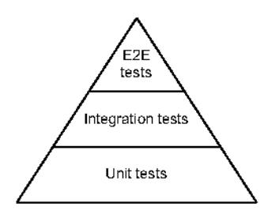

# Chapter 11: Testing

## This chapter covers

- Categorizing tests and making them more robust
- Making Go tests deterministic
- Working with utility packages such as httptest and iotest
- Avoiding common benchmark mistakes
- Improving the testing process

Testing is a crucial aspect of a project's lifecycle. It offers countless benefits, such as building confidence in an application, acting as code documentation, and making refactoring easier. Compared to some other languages, Go has strong primitives for writing tests. Throughout this chapter, we look at common mistakes that make the testing process brittle, less effective, and less accurate.

### 11.1 #82: Not categorizing tests

The testing pyramid is a model that groups tests into different categories (see figure 11.1). Unit tests occupy the base of the pyramid. Most tests should be unit tests: they're cheap to write, fast to execute, and highly deterministic. Usually, as we go

further up the pyramid, tests become more complex to write and slower to run, and it is more difficult to guarantee their determinism.

A common technique is to be explicit about which kind of tests to run. For instance, depending on the project lifecycle stage, we may want to run only unit tests or run all the tests in the project. Not categorizing tests means potentially wasting time and effort and losing accuracy about the scope of a test. This section discusses three main ways to categorize tests in Go.



Figure 11.1 An example of the testing pyramid

### 11.1.1 Build tags

The most common way to classify tests is using build tags. A build tag is a special comment at the beginning of a Go file, followed by an empty line.

For example, look at this bar.go file:

```
//go:build foo package bar
```

This file contains the foo tag. Note that one package may contain multiple files with different build tags.

**NOTE** As of Go 1.17, the syntax // +build foo was replaced by //go:build foo. For the time being (Go 1.18), gofmt synchronizes the two forms to help with migration.

Build tags are used for two primary use cases. First, we can use a build tag as a conditional option to build an application: for example, if we want a source file to be included only if ego is enabled (ego is a way to let Go packages call C code), we can add the //go:build ego build tag. Second, if we want to categorize a test as an integration test, we can add a specific build flag, such as integration.

Here is an example db\_test.go file:

```
//go:build integration

package db\nimport {
    "testing"
}

func TestInsert(t *testing.T) {
    // ...
}
```

Here we add the integration build tag to categorize that this file contains integration tests. The benefit of using build tags is that we can select which kinds of tests to execute. For example, let's assume a package contains two test files:

- The file we just created: db\_test.go
- Another file that doesn't contain a build tag: contract\_test.go

If we run go test inside this package without any options, it will run only the test files without build tags (contract\_test.go):

```
$ go test -v .
=== RUN    TestContract
--- PASS: TestContract (0.01s)
PASS
```

However, if we provide the integration tag, running go test will also include db\_test.go:

```
$ go test --tags=integration -v .
=== RUN    TestInsert
--- PASS: TestInsert (0.01s)
=== RUN    TestContract
--- PASS: TestContract (2.89s)
PASS
```

So, running tests with a specific tag includes both the files without tags and the files matching this tag. What if we want to run *only* integration tests? A possible way is to add a negation tag on the unit test files. For example, using !integration means we want to include the test file only if the integration flag is *not* enabled (contract\_test.go):

```
//go:build !integration

package db
\nimport {
    "testing"
}

func TestContract(t *testing.T) {
    // ...
}
```

Using this approach,

- Running go test with the integration flag runs only the integration tests.
- Running go test without the integration flag runs only the unit tests.

Let's discuss an option that works at the level of a single test, not a file.

### 11.1.2 Environment variables

As mentioned by Peter Bourgon, a member of the Go community, build tags have one main drawback: the absence of signals that a test has been ignored (see <a href="http://mng.bz/qYlr">http://mng.bz/qYlr</a>). In the first example, when we executed go test without build flags, it showed only the tests that were executed:

```
$ go test -v .
=== RUN   TestUnit
--- PASS: TestUnit (0.01s)
PASS
ok    db  0.319s
```

If we're not careful with the way tags are handled, we may forget about existing tests. For that reason, some projects favor the approach of checking the test category using environment variables.

For example, we can implement the TestInsert integration test by checking a specific environment variable and potentially skipping the test:

```
func TestInsert(t *testing.T) {
   if os.Getenv{"INTEGRATION") != "true" {
       t.Skip{"skipping integration test")
   }
   // ...
}
```

If the INTEGRATION environment variable isn't set to true, the test is skipped with a message:

```
$ go test -v .

=== RUN    TestInsert
    db_integration_test.go:12: skipping integration test
--- SKIP: TestInsert (0.00s)
=== RUN    TestUnit
--- PASS: TestUnit (0.00s)
PASS
ok    db  0.319s
```

One benefit of using this approach is making explicit which tests are skipped and why. This technique is probably less widely used than build tags, but it's worth knowing about because it presents some advantages, as we discussed.

Next, let's look at another way to categorize tests: short mode.

### 11.1.3 Short mode

Another approach to categorize tests is related to their speed. We may have to dissociate short-running tests from long-running tests.

As an illustration, suppose we have a set of unit tests, one of which is notoriously slow. We would like to categorize the slow test so we don't have to run it every time (especially if the trigger is after saving a file, for example). Short mode allows us to make this distinction:

```
func TestLongRunning(t *testing.T) {
    if testing.Short() {
        t.Skip("skipping long-running test")
    }
    // ...
}
```

Using testing. Short, we can retrieve whether short mode was enabled while running the test. Then we use Skip to skip the test. To run tests using short mode, we have to pass -short:

```
% go test -short -v .
=== RUN   TestLongRunning
    foo_test.go:9: skipping long-running test
--- SKIP: TestLongRunning (0.00s)
PASS
ok    foo 0.174s
```

TestLongRunning is explicitly skipped when the tests are executed. Note that unlike build tags, this option works per test, not per file.

In summary, categorizing tests is a best practice for a successful testing strategy. In this section, we've seen three ways to categorize tests:

- Using build tags at the test file level
- Using environment variables to mark a specific test
- Based on the test pace using short mode

We can also combine approaches: for example, using build tags or environment variables to classify a test (for example, as a unit or integration test) and short mode if our project contains long-running unit tests.

In the next section, we discuss why enabling the -race flag matters.

### 11.2 #83: Not enabling the -race flag

In mistake #58, "Not understanding race problems," we defined a data race as occurring when two goroutines simultaneously access the same variable, with at least one writing to the variable. We should also know that Go has a standard race-detector tool to help detect data races. One common mistake is forgetting how important this tool is and not enabling it. This section looks at what the race detector catches, how to use it, and its limitations.

In Go, the race detector isn't a static analysis tool used during compilation; instead, it's a tool to find data races that occur at runtime. To enable it, we have to enable the -race flag while compiling or running a test. For example:

```
$ go test -race ./...
```

Once the race detector is enabled, the compiler instruments the code to detect data races. *Instrumentation* refers to a compiler adding extra instructions: here, tracking all memory accesses and recording when and how they occur. At runtime, the race detector watches for data races. However, we should keep in mind the runtime overhead of enabling the race detector:

- Memory usage may increase by 5 to 10x.
- Execution time may increase by 2 to 20x.

Because of this overhead, it's generally recommended to enable the race detector only during local testing or continuous integration (CI). In production, we should avoid it (or only use it in the case of canary releases, for example).

If a race is detected, Go raises a warning. For instance, this example contains a data race because i can be accessed at the same time for both a read and a write:

```
package main\nimport {
    "fmt"
)
func main{} {
    i := 0
    go func{} { i++ }{}
    fmt.Println{i}
}
```

Running this application with the -race flag logs the following data race warning:

```
______
WARNING: DATA RACE
Write at 0x00c000026078 by goroutine 7:
                                               Indicates that
 main.main.func1()
                                               goroutine 7 was writing
      /tmp/app/main.go:9 +0x4e
Previous read at 0x00c000026078 by main goroutine:
                                                         Indicates that the main
  main.main()
                                                         goroutine was reading
      /tmp/app/main.go:10 +0x88
Goroutine 7 (running) created at:
                                         Indicates when
 main.main()
                                         goroutine 7 was created
     /tmp/app/main.go:9 +0x7a
______
```

Let's make sure we are comfortable reading these messages. Go always logs the following:

- The concurrent goroutines that are incriminated: here, the main goroutine and goroutine 7.
- Where accesses occur in the code: in this case, lines 9 and 10.
- When these goroutines were created: goroutine 7 was created in main().

**NOTE** Internally, the race detector uses vector clocks, a data structure used to determine a partial ordering of events (and also used in distributed systems such as databases). Each goroutine creation leads to the creation of a vector clock. The instrumentation updates the vector clock at each memory access and synchronization event. Then, it compares the vector clocks to detect potential data races.

The race detector cannot catch a false positive (an apparent data race that isn't a real one). Therefore, we know our code contains a data race if we get a warning. Conversely, it can sometimes lead to false negatives (missing actual data races).

We need to note two things regarding testing. First, the race detector can only be as good as our tests. Thus, we should ensure that concurrent code is tested thoroughly against data races. Second, given the possible false negatives, if we have a test to check data races, we can put this logic inside a loop. Doing so increases the chances of catching possible data races:

```
func TestDataRace(t *testing.T) {
   for i := 0; i < 100; i++ {
```

In addition, if a specific file contains tests that lead to data races, we can exclude it from race detection using the !race build tag:

```
//go:build !race
package main\nimport {
    "testing"
}
func TestFoo(t *testing.T) {
    // ...
}
func TestBar(t *testing.T) {
    // ...
}
```

This file will be built only if the race detector is disabled. Otherwise, the entire file won't be built, so the tests won't be executed.

In summary, we should bear in mind that running tests with the -race flag for applications using concurrency is highly recommended, if not mandatory. This approach allows us to enable the race detector, which instruments our code to catch potential data races. While enabled, it has a significant impact on memory and performance, so it must be used in specific conditions such as local tests or CI.

The following section discusses two flags related to execution mode: parallel and shuffle.

### 11.3 #84: Not using test execution modes

While running tests, the go command can accept a set of flags to impact how tests are executed. A common mistake is not being aware of these flags and missing opportunities that could lead to faster execution or a better way to spot possible bugs. Let's look at two of these flags: parallel and shuffle.

### 11.3.1 The parallel flag

Parallel execution mode allows us to run specific tests in parallel, which can be very useful: for example, to speed up long-running tests. We can mark that a test has to be run in parallel by calling t.Parallel:

```
func TestFoo(t *testing.T) {
    t.Parallel()
    // ...
}
```

When we mark a test using t.Parallel, it is executed in parallel alongside all the other parallel tests. In terms of execution, though, Go first runs all the sequential tests one by one. Once the sequential tests are completed, it executes the parallel tests.

For example, the following code contains three tests, but only two of them are marked to be run in parallel:

```
func TestA(t *testing.T) {
        t.Parallel()
        // ...
}

func TestB(t *testing.T) {
        t.Parallel()
        // ...
}

func TestC(t *testing.T) {
        // ...
}
```

Running the tests for this file gives the following logs:

```
=== RUN TestA
=== PAUSE TestA
```

TestC is the first to be executed. TestA and TestB are logged first, but they are paused, waiting for TestC to complete. Then both are resumed and executed in parallel.

By default, the maximum number of tests that can run simultaneously equals the GOMAXPROCS value. To serialize tests or, for example, increase this number in the context of long-running tests doing a lot of I/O, we can change this value using the -parallel flag:

```
$ go test -parallel 16 .
```

Here, the maximum number of parallel tests is set to 16. Let's now see another mode while running Go tests: shuffle.

### 11.3.2 The -shuffle flag

As of Go 1.17, it's possible to randomize the execution order of tests and benchmarks. What's the rationale? A best practice while writing tests is to make them isolated. For example, they shouldn't depend on execution order or shared variables. These hidden dependencies can mean a possible test error or, even worse, a bug that won't be caught during testing. To prevent that, we can use the -shuffle flag to randomize tests. We can set it to on or off to enable or disable test shuffling (its disabled by default):

```
$ go test -shuffle=on -v .
```

However, in some cases, we want to rerun tests in the same order. For example, if tests fail during CI, we may want to reproduce the error locally. To do that, instead of passing on to the -shuffle flag, we can pass the seed used to randomize the tests. We can access this seed value when running shuffled tests by enabling verbose mode (-v):

```
$ go test -shuffle=on -v .
-test.shuffle 1636399552801504000 

=== RUN    TestBar
--- PASS: TestBar (0.00s)
=== RUN    TestFoo
--- PASS: TestFoo (0.00s)
PASS
ok    teivah  0.129s
```

We executed the tests randomly, but go test printed the seed value: 1636399552801504000. To force the tests to be run in the same order, we provide this seed value to shuffle:

```
$ go test -shuffle=1636399552801504000 -v .
-test.shuffle 1636399552801504000
=== RUN    TestBar
--- PASS: TestBar (0.00s)
=== RUN    TestFoo
--- PASS: TestFoo (0.00s)
PASS
ok    teivah  0.129s
```

The tests were executed in the same order: TestBar and then TestFoo.

In general, we should be cautious about existing test flags and keep ourselves informed about new features with recent Go releases. Running tests in parallel can be an excellent way to decrease the overall execution time of running all the tests. And shuffle mode can help us spot hidden dependencies that may mean testing errors or even invisible bugs while running tests in the same order.

### 11.4 #85: Not using table-driven tests

Table-driven tests are an efficient technique for writing condensed tests and thus reducing boilerplate code to help us focus on what matters: the testing logic. This section goes through a concrete example to see why table-driven tests are worth knowing when working with Go.

Let's consider the following function that removes all the new-line suffixes ( $\n$  or  $\n$ ) from a string:

```
func removeNewLineSuffixes(s string) string (
    if s == "" {
        return s
    }
    if strings.HasSuffix(s, "\r\n") {
        return removeNewLineSuffixes(s[:len(s)-2])
    }
    if strings.HasSuffix(s, "\n") {
        return removeNewLineSuffixes(s[:len(s)-1])
    }
    return s
}
```

This function removes all the leading \r\n and \n suffixes recursively. Now, let's say we want to test this function extensively. We should at least cover the following cases:

- Input is empty.
- Input ends with \n.
- Input ends with \r\n.
- Input ends with multiple \n.
- Input ends without newlines.

The following approach creates one unit test per case:

```
func TestRemoveNewLineSuffix_Empty(t *testing.T) {
   got := removeNewLineSuffixes("")
   expected := ""
   if got != expected {
       t.Errorf("got: %s", got)
    }
func TestRemoveNewLineSuffix_EndingWithCarriageReturnNewLine(t *testing.T) {
   got := removeNewLineSuffixes("a\r\n")
   expected := "a"
   if got != expected {
        t.Errorf("got: %s", got)
   }
}
func TestRemoveNewLineSuffix_EndingWithNewLine{t *testing.T) {
   got := removeNewLineSuffixes("a\n")
   expected := "a"
```

```
if got != expected {
        t.Errorf("got: %s", got)
    }
}
func TestRemoveNewLineSuffix EndingWithMultipleNewLines(t *testing.T) {
    got := removeNewLineSuffixes("a\n\n\n")
   expected := "a"
    if got != expected {
       t.Errorf("got: %s", got)
}
func TestRemoveNewLineSuffix_EndingWithoutNewLine(t *testing.T) {
    got := removeNewLineSuffixes("a\n")
    expected := "a"
    if got != expected {
        t.Errorf("got: %s", got)
}
```

Each function represents a specific case that we want to cover. However, there are two main drawbacks. First, the function names are more complex (TestRemoveNewLine-Suffix\_EndingWithCarriageReturnNewLine is 55 characters long), which can quickly affect the clarity of what the function is supposed to test. The second drawback is the amount of duplication among these functions, given that the structure is always the same:

- 1 Call removeNewLineSuffixes.
- 2 Define the expected value.
- 3 Compare the values.
- 4 Log an error message.

If we want to change one of these steps—for example, include the expected value as part of the error message—we will have to repeat it in all the tests. And the more tests we write, the more difficult the code becomes to maintain.

Instead, we can use table-driven tests so we write the logic only once. Table-driven tests rely on subtests, and a single test function can include multiple subtests. For example, the following test contains two subtests:

```
func TestFoo(t *testing.T) {
    t.Run("subtest 1", func(t *testing.T) {
        if false {
            t.Error()
        }
    })
    t.Run("subtest 2", func(t *testing.T) {
        if 2 != 2 {
            t.Error()
        }
    })
}
Runs a first subtest
1
Runs a second subtest
2 called subtest 2
called subtest 2
called subtest 2
called subtest 2
called subtest 2
```

The TestFoo function includes two subtests. If we run this test, it shows the results for both subtest 1 and subtest 2:

```
--- PASS: TestFoo (0.00s)
--- PASS: TestFoo/subtest_1 (0.00s)
--- PASS: TestFoo/subtest_2 (0.00s)
PASS
```

We can also run a single test using the -run flag and concatenating the parent test name with the subtest. For example, we can run only subtest 1:

```
$ go test -run=TestFoo/subtest_1 -v
```

Let's return to our example and see how to use subtests to prevent duplicating the testing logic. The main idea is to create one subtest per case. Variations exist, but we will discuss a map data structure where the key represents the test name and the value represents the test data (input, expected).

Table-driven tests avoid boilerplate code by using a data structure containing test data together with subtests. Here's a possible implementation using a map:

```
func TestRemoveNewLineSuffix(t *testing.T) {
   tests := map[string]struct {
                                                  Defines the
       input string
                                                 test data
       expected string
   } {
        'empty': {
                            Teach entry in the map
            input: "",
                            represents a subtest.
            expected: "",
       },
        ending with \r\n`: {
            input:
                    "a\r\n".
            expected: "a",
        },
        ending with \n': {
           input: "a\n",
           expected: "a",
        `ending with multiple \n`: {
            input: "a\n\n\n",
            expected: "a",
         ending without newline': {
           imput: "a",
            expected: "a",
       },
                                            Iterates over
    }
                                           the map
    for name, tt := range tests {
       t.Run(name, func(t *testing.T) {
                                                       Runs a new subtest
            got := removeNewLineSuffixes(tt.input)
                                                     for each map entry
            if got != tt.expected {
```

```
t.Errorf{"got: %s, expected: %s", got, tt.expected)
}
}
}
```

The tests variable is a map. The key is the test name, and the value represents test data: in our case, input and expected string. Each map entry is a new test case that we want to cover. We run a new subtest for each map entry.

This test solves the two drawbacks we discussed:

- Each test name is now a string instead of a PascalCase function name, making it simpler to read.
- The logic is written only once and shared for all the different cases. Modifying the testing structure or adding a new test requires minimal effort.

We need to mention one last thing regarding table-driven tests that can also be a source of mistakes: as we mentioned previously, we can mark a test to be run in parallel by calling t.Parallel. We can also do this in subtests inside the closure provided to t.Run:

```
for name, tt := range tests {
    t.Run{name, func(t *testing.T) {
        t.Parallel()
```

However, this closure uses a loop variable. To prevent an issue similar to that discussed in mistake #63, "Not being careful with goroutines and loop variables," which may cause the closures to use a wrong value of the tt variable, we should create another variable or shadow tt:

```
for name, tt := range tests {
   tt := tt
   t.Run(name, func(t *testing.T) {
        t.Parallel()
        // Use tt
   })
}
Shadows tt to make it
local to the loop iteration
```

This way, each closure accesses its own tt variable.

In summary, if multiple unit tests have a similar structure, we can mutualize them using table-driven tests. Because this technique prevents duplication, it makes it simple to change the testing logic and easier to add new use cases.

Next, let's discuss how to prevent flaky tests in Go.

### 11.5 #86: Sleeping in unit tests

A *flaky* test is a test that may both pass and fail without any code change. Flaky tests are among the biggest hurdles in testing because they are expensive to debug and undermine our confidence in testing accuracy. In Go, calling time. Sleep in a test can be a

signal of possible flakiness. For example, concurrent code is often tested using sleeps. This section presents concrete techniques to remove sleeps from tests and thus prevent us from writing flaky tests.

We will illustrate this section with a function that returns a value and spins up a goroutine that performs a job in the background. We will call a function to get a slice of Foo structs and return the best element (the first one). In the meantime, the other goroutine will be in charge of calling a Publish method with the first n Foo elements:

```
type Handler struct {
    П
             int
    publisher publisher
type publisher interface {
    Publish ([]Foo)
func (h Handler) getBestFoo(someInputs int) Foo (
   foos := getFoos(someInputs)
   best := foos[0]
                               Keeps the first element (checking the length)
                                of foos is omitted for the sake of simplicity)
    go func() {
        if len(foos) > h.n (

← Keeps only the

            foos = foos[:h.n]
                                       first n Foo structs
        h.publisher.Publish(foos)
                                            Calls the Publish
    }()
                                            method
    return best
}
```

The Handler struct contains two fields: an n field and a publisher dependency used to publish the first n Foo structs. First we get a slice of Foo; but before returning the first element, we spin up a new goroutine, filter the foos slice, and call Publish.

How can we test this function? Writing the part to assert the response is straightforward. However, what if we also want to check what is passed to Publish?

We could mock the publisher interface to record the arguments passed while calling the Publish method. Then we could sleep for a few milliseconds before checking the arguments recorded:

```
type publisherMock struct {
    mu
```

```
defer p.mu.RUnlock()
    return p.got
}
func TestGetBestFoo(t *testing.T) {
    mock := publisherMock()
   h := Handler{
       publisher: &mock,
        n: 2,
    }
    foo := h.getBestFoo(42)
                                                Sleeps for 10 milliseconds
    // Check foo
                                                before checking the arguments
                                           passed to Publish
    time.Sleep(10 * time.Millisecond)
    published := mock.Get()
    // Check published
}
```

We write a mock of publisher that relies on a mutex to protect access to the published field. In our unit test, we call time. Sleep to leave some time before checking the arguments passed to Publish.

This test is inherently flaky. There is no strict guarantee that 10 milliseconds will be enough (in this example, it is likely but not guaranteed).

So, what are the options to improve this unit test? First, we can periodically assert a given condition using retries. For example, we can write a function that takes an assertion as an argument and a maximum number of retries plus a wait time that is called periodically to avoid a busy loop:

```
func assert(t *testing.T, assertion func() bool,
    maxRetry int, waitTime time.Duration) {
    for i := 0; i < maxRetry; i++ {
        if assertion() {
            return
```

This function checks the assertion provided and fails after a certain number of retries. We also use time. Sleep, but we could use a shorter sleep with this code.

For example, let's go back to TestGetBestFoo:

```
assert(t, func() bool (
    return len(mock.Get()) == 2
}, 30, time.Millisecond)
```

Instead of sleeping for 10 milliseconds, we sleep each millisecond and configure a maximum number of retries. Such an approach reduces the execution time if the test succeeds because we reduce the waiting interval. Therefore, implementing a retry strategy is a better approach than using passive sleeps.

**NOTE** Some testing libraries, such as testify, offer retry features. For example, in testify, we can use the Eventually function, which implements assertions that should eventually succeed and other features such as configuring the error message.

Another strategy is to use channels to synchronize the goroutine publishing the Foo structs and the testing goroutine. For example, in the mock implementation, instead of copying the slice received into a field, we can send this value to a channel:

```
type publisherMock struct {
   ch chan []Foo
func (p *publisherMock) Publish(got []Foo) {
   p.ch <- got                                   
                       arguments received
func TestGetBestFoo(t *testing.T) {
   mock := publisherMock{
       ch: make(chan []Foo),
   defer close(mock.ch)
   h := Handler{
       publisher: &mock,
       n: 2,
   foo := h.getBestFoo(42)
   // Check foo
                                              Compares these

    □ arguments

   if v := len(<-mock.ch); v != 2 (
        t.Fatalf{"expected 2, got %d", v)
}
```

The publisher sends the received argument to a channel. Meanwhile, the testing goroutine sets up the mock and creates the assertion based on the received value. We can also implement a timeout strategy to make sure we don't wait forever for mock.ch if something goes wrong. For example, we can use select with a time. After case.

Which option should we favor: retry or synchronization? Indeed, synchronization reduces waiting time to the bare minimum and makes a test fully deterministic if well designed.

If we can't apply synchronization, we should perhaps reconsider our design since we may have a problem. If synchronization is truly impossible, we should use the retry option, which is a better choice than using passive sleeps to eradicate non-determinism in tests.

Let's continue our discussion of how to prevent flakiness in testing, this time when using the time API.

### 11.6 #87: Not dealing with the time API efficiently

Some functions have to rely on the time API: for example, to retrieve the current time. In such a case, it can be pretty easy to write brittle unit tests that may fail at some point. In this section, we go through a concrete example and discuss the options. The goal is not to cover every use case and technique but rather to give directions about writing more robust tests of functions using the time API.

Let's say an application receives events that we want to store in an in-memory cache. We will implement a Cache struct to hold the most recent events. This struct will expose three methods that do the following:

- Append events
- Get all the events
- Trim the events for a given duration (we will focus on this method)

Each of these methods needs to access the current time. Let's write a first implementation of the third method using time.Now() (we will assume that all the events are sorted by time):

```
type Cache struct {
   mu sync.RWMutex
   events [] Event
type Event struct {
   Timestamo time. Time
   Data string
}
func {c *Cache) TrimOlderThan{since time.Duration) {
   c.mu.RLock()
    defer c.mu.RUnlock()
                                         Subtracts the given duration
                                    from the current time
    t := time.Now().Add(-since)
    for i := 0; i < len(c.events); i++ {
       if c.events[i].Timestamp.After(t) {
           c.events = c.events[i:]
                                            Trims
           return
                                           the events
       }
   }
}
```

We compute a t variable that is the current time minus the provided duration. Then, because the events are sorted by time, we update the internal events slice as soon as we reach an event whose time is after t.

How can we test this method? We could rely on the current time using time. Now to create the events:

```
func TestCache_TrimOlderThan(t *testing.T) {
    events := []Event(
```

```
{Timestamp: time.Now{}.Add{-10 * time.Millisecond}},
        {Timestamp: time.Now{}.Add{10 * time.Millisecond}},
   }
                                               Adds these events
   cache := &Cache{}
                                              to the cache
   cache.Add(events)
   cache.TrimOlderThan(15 * time.Millisecond)
                                                       Trims the events since
   got := cache.GetAll()
                                                      15 milliseconds ago
   expected := 2
                                    the events
   if len(got) != expected {
       t.Fatalf("expected %d, got %d", expected, len(got))
   }
}
```

We add a slice of events to the cache using time.Now() and add or subtract some small durations. Then we trim these events for 15 milliseconds, and we perform the assertion.

Such an approach has one main drawback: if the machine executing the test is suddenly busy, we may trim fewer events than expected. We might be able to increase the duration provided to reduce the chance of having a failing test, but doing so isn't always possible. For example, what if the timestamp field was an unexported field generated while adding an event? In this case, it wouldn't be possible to pass a specific timestamp, and one might end up adding sleeps in the unit test.

The problem is related to the implementation of TrimOlderThan. Because it calls time.Now(), it's harder to implement robust unit tests. Let's discuss two approaches to make our test less brittle.

The first approach is to make the way to retrieve the current time a dependency of the Cache struct. In production, we would inject the *real* implementation, whereas in unit tests, we would pass a stub, for example.

There are various techniques to handle this dependency, such as an interface or a function type. In our case, because we only rely on a single method (time.Now()), we can define a function type:

```
type now func() time.Time
type Cache struct {
    mu
```

The now type is a function that returns a time. Time. In the factory function, we can pass the actual time. Now function this way:

```
func NewCache() *Cache {
    return &Cache(
```

Because the now dependency remains unexported, it isn't accessible by external clients. Furthermore, in our unit test, we can create a Cache struct by injecting a *fake* implementation of func() time. Time based on a predefined time:

```
func TestCache_TrimOlderThan(t *testing.T) {
    events := []Event{
                                                                   Creates events
        {Timestamp: parseTime{t, "2020-01-01T12:00:00.04Z")},
                                                                   based on specific
        {Timestamp: parseTime{t, "2020-01-01T12:00:00.05Z")},
                                                                  timestamps
        {Timestamp: parseTime{t, "2020-01-01T12:00:00.06Z")},
    }
    cache := &Cache(now: func() time.Time (
                                                            Injects a static function
        return parseTime(t, "2020-01-01T12:00:00.06Z")
                                                           to fix the time
    cache.Add(events)
    cache.TrimOlderThan(15 * time.Millisecond)
    // ...
func parseTime(t *testing.T, timestamp string) time.Time {
    // ...
```

While creating a new Cache struct, we inject the now dependency based on a given time. Thanks to this approach, the test is robust. Even in the worst conditions, the outcome of this test is deterministic.

### Using a global variable

Instead of using a field, we can retrieve the time via a global variable:

```
var now = time.Now
```

In general, we should try to avoid having such a mutable shared state. In our case, it would lead to at least one concrete issue: tests would no longer be isolated because they would all depend on a shared variable. Therefore, the tests couldn't be run in parallel, for example. If possible, we should handle these cases as part of struct dependencies, fostering testing isolation.

This solution is also extensible. For example, what if the function calls time. After? We can either add another after dependency or create one interface grouping the two methods: Now and After. However, this approach has one main drawback: the now dependency isn't available if we, for example, create a unit test from an external package (we explore this in mistake #90, "Not exploring all the Go testing features").

In that case, we can use another technique. Instead of handling the time as an unexported dependency, we can ask clients to provide the current time:

```
func (c *Cache) TrimOlderThan{now time.Time, since time.Duration) {
      // ...
}
```

To go even further, we can *merge* the two function arguments in a single time. Time that represents a specific point in time until which we want to trim the events:

```
func (c *Cache) TrimOlderThan(t time.Time) {
    // ...
}
```

It is up to the caller to calculate this point in time:

```
cache.TrimOlderThan(time.Now().Add(time.Second))
```

And in the test, we also have to pass the corresponding time:

```
func TestCache_TrimOlderThan(t *testing.T) {
    // ...
    cache.TrimOlderThan(parseTime(t, "2020-01-01T12:00:00.06Z").
        Add(-15 * time.Millisecond))
    // ...
}
```

This approach is the simplest because it doesn't require creating another type and a stub.

In general, we should be cautious about testing code that uses the time API. It can be an open door for flaky tests. In this section, we have seen two ways to deal with it. We can keep the time interactions as part of a dependency that we can fake in unit tests by using our own implementations or relying on external libraries; or we can rework our API and ask clients to provide us with the information we need, such as the current time (this technique is simpler but more limited).

Let's now discuss two helpful Go packages related to testing: httptest and iotest.

### 11.7 #88: Not using testing utility packages

The standard library provides utility packages for testing. A common mistake is being unaware of these packages and trying to reinvent the wheel or rely on other solutions that aren't as handy. This section examines two of these packages: one to help us when using HTTP and another to use when doing I/O and using readers and writers.

### 11.7.1 The httptest package

The httptest package (https://pkg.go.dev/net/http/httptest) provides utilities for HTTP testing for both clients and servers. Let's look at these two use cases.

First, let's see how httptest can help us while writing an HTTP server. We will implement a handler that performs some basic actions: writing a header and body, and returning a specific status code. For the sake of clarity, we will omit error handling:

```
func Handler(w http.ResponseWriter, r *http.Request) {
    w.Header().Add("X-API-VERSION", "1.0")
    b, _ := io.ReadAll(r.Body)
    _, _ = w.Write(append([]byte("hello "), b...))
    w.WriteHeader(http.StatusCreated)
}
Concatenates hello
with the request body
```

An HTTP handler accepts two arguments: the request and a way to write the response. The httptest package provides utilities for both. For the request, we can use http-test.NewRequest to build an \*http.Request using an HTTP method, a URL, and a body. For the response, we can use httptest.NewRecorder to record the mutations made within the handler. Let's write a unit test of this handler:

```
func TestHandler(t *testing.T) {
             req := httptest.NewRequest(http.MethodGet, "http://localhost",
                 strings.NewReader("foo"))
                                                                                     Builds
             w := httptest.NewRecorder()
                                                  Creates the
                                                                                 the request
            Handler(w, req)
Calls the
                                                  response recorder
handler
             if got := w.Result().Header.Get("X-API-VERSION"); got != "1.0" {
                 t.Errorf("api version: expected 1.0, got %s", got)
                                                                                 Verifies the
                                                                                HTTP header
             body, _ := ioutil.ReadAll(wordy)
                                                                        Verifies the
             if got := string(body); got != "hello foo" {
                                                                       HTTP body
                 t.Errorf("body: expected hello foo, got %s", got)
             if http.StatusOK != w.Result().StatusCode {
                                                                    Verifies the HTTP
                 t.FailNow{)
                                                                    status code
             }
         }
```

Testing a handler using httptest doesn't test the transport (the HTTP part). The focus of the test is calling the handler directly with a request and a way to record the response. Then, using the response recorder, we write the assertions to verify the HTTP header, body, and status code.

Let's look at the other side of the coin: testing an HTTP client. We will write a client in charge to query an HTTP endpoint that calculates how long it takes to drive from one coordinate to another. The client looks like this:

```
func (c DurationClient) GetDuration(url string,
    lat1, lng1, lat2, lng2 float64) {
    time.Duration, error) {
    resp, err := c.client.Post{
        url, "application/json",
        buildRequestBody(lat1, lng1, lat2, lng2),
    }
    if err != nil {
        return 0, err
    }
    return parseResponseBody(resp.Body)
}
```

This code performs an HTTP POST request to the provided URL and returns the parsed response (let's say, some JSON).

What if we want to test this client? One option is to use Docker and spin up a mock server to return some preregistered responses. However, this approach makes the test

slow to execute. The other option is to use httptest.NewServer to create a local HTTP server based on a handler that we will provide. Once the server is up and running, we can pass its URL to GetDuration:

```
func TestDurationClientGet(t *testing.T) {
   srv := httptest.NewServer{
        http.HandlerFunc{
            func(w http.ResponseWriter, r *http.Request) {
                _, _ = w.Write([]byte(`("duration": 314)`))
                                                                       Registers the
        ),
                                                                    handler to serve
                                Shuts down
                                                                       the response
                               the server
    defer srv.Close()
   client := NewDurationClient()
   duration, err :=
        client.GetDuration(srv.URL, 51.551261, -0.1221146, 51.57, -0.13) 	←
    if err != nil {
                                                                       Provides the
        t.Fatal(err)
                                                                        server URL
                                                Verifies the
                                               response
    if duration != 314*time.Second {
        t.Errorf("expected 314 seconds, got %v", duration)
```

In this test, we create a server with a static handler returning 314 seconds. We could also make assertions based on the request sent. Furthermore, when we call GetDuration, we provide the URL of the server that's started. Compared to testing a handler, this test performs an actual HTTP call, but it executes in only a few milliseconds.

We can also start a new server using TLS with httptest.NewTLSServer and create an unstarted server with httptest.NewUnstartedServer so that we can start it lazily.

Let's remember how helpful httptest is when working in the context of HTTP applications. Whether we're writing a server or a client, httptest can help us create efficient tests.

### 11.7.2 The iotest package

The iotest package (https://pkg.go.dev/testing/iotest) implements utilities for testing readers and writers. It's a convenient package that Go developers too often forget.

When implementing a custom io.Reader, we should remember to test it using iotest.TestReader. This utility function tests that a reader behaves correctly: it accurately returns the number of bytes read, fills the provided slice, and so on. It also tests different behaviors if the provided reader implements interfaces such as io.ReaderAt.

Let's assume we have a custom LowerCaseReader that streams lowercase letters from a given input io.Reader. Here's how to test that this reader doesn't misbehave:

```
func TestLowerCaseReader{t *testing.T) {
    err := iotest.TestReader{
        &LowerCaseReader{reader: strings.NewReader{"aBcDeFgHiJ")}},
```

```
[]byte("acegi"),
```

We call iotest. TestReader by providing the custom LowerCaseReader and an expectation: the lowercase letters acegi.

Another use case for the iotest package is to make sure an application using readers and writers is tolerant to errors:

- iotest.ErrReader creates an io.Reader that returns a provided error.
- iotest.HalfReader creates an io.Reader that reads only half as many bytes as requested from an io.Reader.
- iotest.OneByteReader creates an io.Reader that reads a single byte for each non-empty read from an io.Reader.
- iotest.TimeoutReader creates an io.Reader that returns an error on the second read with no data. Subsequent calls will succeed.
- iotest.TruncateWriter creates an io.Writer that writes to an io.Writer but stops silently after n bytes.

For example, let's assume we implement the following function that starts by reading all the bytes from a reader:

```
func foo(r io.Reader) error {
   b, err := io.ReadAll(r)
   if err != nil {
      return err
   }
   // ...
}
```

We want to make sure our function is resilient if, for example, the provided reader fails during a read (such as to simulate a network error):

```
func TestFoo(t *testing.T) {
    err := foo(iotest.TimeoutReader(
        strings.NewReader(randomString(1024)),
    if err != nil {
        t.Fatal(err)
    }
}

Wraps the provided io.Reader\nusing io.TimeoutReader

    vs.TimeoutReader
```

We wrap an io.Reader using io.TimeoutReader. As we mentioned, the second read will fail. If we run this test to make sure our function is tolerant to error, we get a test failure. Indeed, io.ReadAll returns any errors it finds.

Knowing this, we can implement our custom readAll function that tolerates up to n errors:

```
func readAll(r io.Reader, retries int) {[]byte, error) {
   b := make([]byte, 0, 512)
   for {
        if len(b) == cap(b) {
           b = append(b, 0)[:len(b)]
       n, err := r.Read(b[len(b):cap(b)])
       b = b[:len(b)+n]
        if err != nil {
           if err == io.EOF {
               return b, nil
            retries--
            if retries < 0 {
                                    1 Tolerates
               return b, err
                                    retries
       }
   }
}
```

This implementation is similar to io.ReadAll, but it also handles configurable retries. If we change the implementation of our initial function to use our custom readAll instead of io.ReadAll, the test will no longer fail:

```
func foo(r io.Reader) error {
   b, err := readAll(r, 3)
   if err != nil {
      return err
   }

// ...
}
Indicates up to three retries
```

We have seen an example of how to check that a function is tolerant to errors while reading from an io.Reader. We performed the test by relying on the iotest package.

When doing I/O and working with io.Reader and io.Writer, let's remember how handy the iotest package is. As we have seen, it provides utilities to test the behavior of a custom io.Reader and test our application against errors that occur while reading or writing data.

The following section discusses some common traps that can lead to writing inaccurate benchmarks.

### 11.8 #89: Writing inaccurate benchmarks

In general, we should never guess about performance. When writing optimizations, so many factors may come into play that even if we have a strong opinion about the results, it's rarely a bad idea to test them. However, writing benchmarks isn't straightforward. It can be pretty simple to write inaccurate benchmarks and make wrong assumptions based on them. The goal of this section is to examine common and concrete traps leading to inaccuracy.

Before discussing these traps, let's briefly review how benchmarks work in Go. The skeleton of a benchmark is as follows:

```
func BenchmarkFoo(b *testing.B) {
    for i := 0; i < b.N; i++ {
        foo()
    }
}</pre>
```

The function name starts with the Benchmark prefix. The function under test (foo) is called within the for loop. b.N represents a variable number of iterations. When running a benchmark, Go tries to make it match the requested benchmark time. The benchmark time is set by default to 1 second and can be changed with the -benchtime flag. b.N starts at 1; if the benchmark completes in under 1 second, b.N is increased, and the benchmark runs again until b.N roughly matches benchtime:

```
$ go test -bench=.
cpu: Intel(R) Core(TM) i5-7360U CPU @ 2.30GHz
BenchmarkFoo-4 73 16511228 ns/op
```

Here, the benchmark took about 1 second, and foo was executed 73 times, for an average execution time of 16,511,228 nanoseconds. We can change the benchmark time using -benchtime:

```
$ go test -bench=. -benchtime=2s
BenchmarkFoo-4
```

 ${\tt foo}$  was executed roughly twice more than during the previous benchmark.

Next, let's look at some common traps.

### 11.8.1 Not resetting or pausing the timer

In some cases, we need to perform operations before the benchmark loop. These operations may take quite a while (for example, generating a large slice of data) and may significantly impact the benchmark results:

```
func BenchmarkFoo(b *testing.B) {
    expensiveSetup()
    for i := 0; i < b.N; i++ {
        functionUnderTest()
    }
}</pre>
```

In this case, we can use the ResetTimer method before entering the loop:

```
func BenchmarkFoo(b *testing.B) {
    expensiveSetup()
    b.ResetTimer()
    for i := 0; i < b.N; i++ {
        functionUnderTest()
    }
}</pre>
Resets the
benchmark timer
```

Calling ResetTimer zeroes the elapsed benchmark time and memory allocation counters since the beginning of the test. This way, an expensive setup can be discarded from the test results.

What if we have to perform an expensive setup not just once but within each loop iteration?

```
func BenchmarkFoo(b *testing.B) {
   for i := 0; i < b.N; i++ {
      expensiveSetup()
      functionUnderTest()
   }
}</pre>
```

We can't reset the timer, because that would be executed during each loop iteration. But we can stop and resume the benchmark timer, surrounding the call to expensiveSetup:

```
func BenchmarkFoo(b *testing.B) {
   for i := 0; i < b.N; i++ {
       b.StopTimer()
       expensiveSetup()
      b.StartTimer()
      functionUnderTest()
}</pre>
Resumes the
benchmark timer
}
```

Here, we pause the benchmark timer to perform the expensive setup and then resume the timer.

NOTE There's one catch to remember about this approach: if the function under test is too fast to execute compared to the setup function, the benchmark may take too long to complete. The reason is that it would take much longer than 1 second to reach benchtime. Calculating the benchmark time is based solely on the execution time of functionUnderTest. So, if we wait a significant time in each loop iteration, the benchmark will be much slower than 1 second. If we want to keep the benchmark, one possible mitigation is to decrease benchtime.

We must be sure to use the timer methods to preserve the accuracy of a benchmark.

### 11.8.2 Making wrong assumptions about micro-benchmarks

A micro-benchmark measures a tiny computation unit, and it can be extremely easy to make wrong assumptions about it. Let's say, for example, that we aren't sure whether to use atomic.StoreInt32 or atomic.StoreInt64 (assuming that the values we handle will always fit in 32 bits). We want to write a benchmark to compare both functions:

```
func BenchmarkAtomicStoreInt32(b *testing.B) {
  var v int32
  for i := 0; i < b.N; i++ {
     atomic.StoreInt32(&v, 1)</pre>
```

```
}
}
func BenchmarkAtomicStoreInt64(b *testing.B) {
  var v int64
  for i := 0; i < b.N; i++ {
     atomic.StoreInt64(&v, 1)
  }
}</pre>
```

### If we run this benchmark, here's some example output:

```
cpu: Intel(R) Core(TM) i5-7360U CPU @ 2.30GHz
BenchmarkAtomicStoreInt32
BenchmarkAtomicStoreInt32-4 197107742 5.682 ns/op
BenchmarkAtomicStoreInt64
BenchmarkAtomicStoreInt64-4 213917528 5.134 ns/op
```

We could easily take this benchmark for granted and decide to use atomic. Store—Int64 because it appears to be faster. Now, for the sake of doing a *fair* benchmark, we reverse the order and test atomic. StoreInt64 first, followed by atomic. StoreInt32. Here is some example output:

```
      BenchmarkAtomicStoreInt64
      224900722
      5.434 ns/op

      BenchmarkAtomicStoreInt32
      5.24900722
      5.434 ns/op

      BenchmarkAtomicStoreInt32
      230253900
      5.159 ns/op
```

This time, atomic.StoreInt32 has better results. What happened?

In the case of micro-benchmarks, many factors can impact the results, such as machine activity while running the benchmarks, power management, thermal scaling, and better cache alignment of a sequence of instructions. We must remember that many factors, even outside the scope of our Go project, can impact the results.

**NOTE** We should make sure the machine executing the benchmark is idle. However, external processes may run in the background, which may affect benchmark results. For that reason, tools such as perflock can limit how much CPU a benchmark can consume. For example, we can run a benchmark with 70% of the total available CPU, giving 30% to the OS and other processes and reducing the impact of the machine activity factor on the results.

One option is to increase the benchmark time using the -benchtime option. Similar to the law of large numbers in probability theory, if we run a benchmark a large number of times, it should tend to approach its expected value (assuming we omit the benefits of instructions caching and similar mechanics).

Another option is to use external tools on top of the classic benchmark tooling. For instance, the benchstat tool, which is part of the golang.org/x repository, allows us to compute and compare statistics about benchmark executions.

Let's run the benchmark 10 times using the -count option and pipe the output to a specific file:

```
$ go test -bench=. -count=10 | tee stats.txt
cpu: Intel(R) Core(TM) i5-7360U CPU @ 2.30GHz
BenchmarkAtomicStoreInt32-4
```

We can then run benchstat on this file:

```
$ benchstat stats.txt
name
```

The results are the same: both functions take on average 5.10 nanoseconds to complete. We also see the percent variation between the executions of a given benchmark:  $\pm 1\%$ . This metric tells us that both benchmarks are stable, giving us more confidence in the computed average results. Therefore, instead of concluding that  $\pm 1\%$ . StoreInt32 is faster or slower, we can conclude that its execution time is similar to that of  $\pm 1\%$ . StoreInt64 for the usage we tested (in a specific Go version on a particular machine).

In general, we should be cautious about micro-benchmarks. Many factors can significantly impact the results and potentially lead to wrong assumptions. Increasing the benchmark time or repeating the benchmark executions and computing stats with tools such as benchstat can be an efficient way to limit external factors and get more accurate results, leading to better conclusions.

Let's also highlight that we should be careful about using the results of a microbenchmark executed on a given machine if another system ends up running the application. The production system may act quite differently from the one on which we ran the micro-benchmark.

### 11.8.3 Not being careful about compiler optimizations

Another common mistake related to writing benchmarks is being fooled by compiler optimizations, which can also lead to wrong benchmark assumptions. In this section, we look at Go issue 14813 (https://github.com/golang/go/issues/14813, also discussed by Go project member Dave Cheney) with a population count function (a function that counts the number of bits set to 1):

```
const m1 = 0x55555555555555555555555555555555555
```

This function takes and returns a uint 64. To benchmark this function, we can write the following:

```
func BenchmarkPopent1{b *testing.B) {
   for i := 0; i < b.N; i++ {
      popent{uint64(i)}
   }
}</pre>
```

However, if we execute this benchmark, we get a surprisingly low result:

```
cpu: Intel(R) Core(TM) i5-7360U CPU @ 2.30GHz
BenchmarkPopcnt1-4 1000000000 0.2858 ns/op
```

A duration of 0.28 nanoseconds is roughly one clock cycle, so this number is unreasonably low. The problem is that the developer wasn't careful enough about compiler optimizations. In this case, the function under test is simple enough to be a candidate for *inlining*: an optimization that replaces a function call with the body of the called function and lets us prevent a function call, which has a small footprint. Once the function is inlined, the compiler notices that the call has no side effects and replaces it with the following benchmark:

```
func BenchmarkPopcnt1(b *testing.B) {
   for i := 0; i < b.N; i++ {
```

The benchmark is now empty—which is why we got a result close to one clock cycle. To prevent this from happening, a best practice is to follow this pattern:

- 1 During each loop iteration, assign the result to a local variable (local in the context of the benchmark function).
- 2 Assign the latest result to a global variable.

In our case, we write the following benchmark:

```
var global uint64

func BenchmarkPopent2(b *testing.B) {
   var v uint64
   for i := 0; i < b.N; i++ {
       v = popent(uint64(i))
   }
   global = v

Assigns the result to the local variable
   to the global variable
}</pre>
```

global is a global variable, whereas v is a local variable whose scope is the benchmark function. During each loop iteration, we assign the result of popent to the local variable. Then we assign the latest result to the global variable.

NOTE Why not assign the result of the popent call directly to global to simplify the test? Writing to a global variable is slower than writing to a local

variable (we discuss these concepts in mistake #95, "Not understanding stack vs. heap"). Therefore, we should write each result to a local variable to limit the footprint during each loop iteration.

If we run these two benchmarks, we now get a significant difference in the results:

```
cpu: Intel(R) Core(TM) i5-7360U CPU @ 2.30GHz

BenchmarkPopcnt1-4 1000000000 0.2858 ns/op

BenchmarkPopcnt2-4 606402058 1.993 ns/op
```

BenchmarkPopent2 is the accurate version of the benchmark. It guarantees that we avoid the inlining optimizations, which can artificially lower the execution time or even remove the call to the function under test. Relying on the results of Benchmark-Popent1 could have led to wrong assumptions.

Let's remember the pattern to avoid compiler optimizations fooling benchmark results: assign the result of the function under test to a local variable, and then assign the latest result to a global variable. This best practice also prevents us from making incorrect assumptions.

### 11.8.4 Being fooled by the observer effect

In physics, the observer effect is the disturbance of an observed system by the act of observation. This effect can also be seen in benchmarks and can lead to wrong assumptions about results. Let's look at a concrete example and then try to mitigate it.

We want to implement a function receiving a matrix of int64 elements. This matrix has a fixed number of 512 columns, and we want to compute the total sum of the first eight columns, as shown in figure 11.2.

## We iterate over the first eight columns for each line. ... 512 columns in total

Figure 11.2 Computing the sum of the first eight columns

For the sake of optimizations, we also want to determine whether varying the number of columns has an impact, so we also implement a second function with 513 columns. The implementation is the following:

```
func calculateSum512(s [][512]int64) int64 {
    var sum int64
    for i := 0; i < len(s); i++ {
        for j := 0; j < 8; j++ {
            sum += s[i][j]
```

We iterate over each row and then over the first eight columns, and we increment a sum variable that we return. The implementation in calculateSum513 remains the same.

We want to benchmark these functions to decide which one is the most performant given a fixed number of rows:

```
const rows = 1000
var res int64
func BenchmarkCalculateSum512(b *testing.B) {
    var sum int64
    s := createMatrix512(rows)
                                        Creates a matrix
    b.ResetTimer()
                                        of 512 columns
    for i := 0; i < b.N; i++ \{
        sum = calculateSum512(s)
                                            Calculates
                                            the sum
    res = sum
func BenchmarkCalculateSum513(b *testing.B) {
    var sum int64
    s := createMatrix513(rows)
                                         Creates a matrix
    b.ResetTimer()
                                        of 513 columns
    for i := 0; i < b.N; i++ \{
        sum = calculateSum513(s)
                                           Calculates
                                           the sum
    res = sum
}
```

We want to create the matrix only once, to limit the footprint on the results. Therefore, we call createMatrix512 and createMatrix513 outside of the loop. We may expect the results to be similar as again we only want to iterate on the first eight columns, but this isn't the case (on my machine):

```
cpu: Intel(R) Core(TM) i5-7360U CPU @ 2.30GHz
BenchmarkCalculateSum512-4 81854 15073 ns/op
BenchmarkCalculateSum513-4 161479 7358 ns/op
```

The second benchmark with 513 columns is about 50% faster. Again, because we iterate only over the first eight columns, this result is quite surprising.

To understand this difference, we need to understand the basics of CPU caches. In a nutshell, a CPU is composed of different caches (usually L1, L2, and L3). These caches reduce the average cost of accessing data from the main memory. In some conditions, the CPU can fetch data from the main memory and copy it to L1. In this case, the CPU tries to fetch into L1 the matrix's subset that calculateSum is interested in (the first eight columns of each row). However, the matrix fits in memory in one case (513 columns) but not in the other case (512 columns).

**NOTE** It isn't in the scope of this chapter to explain why, but we look at this problem in mistake #91, "Not understanding CPU caches."

Coming back to the benchmark, the main issue is that we keep reusing the same matrix in both cases. Because the function is repeated thousands of times, we don't measure the function's execution when it receives a plain new matrix. Instead, we measure a function that gets a matrix that already has a subset of the cells present in the cache. Therefore, because calculateSum513 leads to fewer cache misses, it has a better execution time.

This is an example of the observer effect. Because we keep observing a repeatedly called CPU-bound function, CPU caching may come into play and significantly affect the results. In this example, to prevent this effect, we should create a matrix during each test instead of reusing one:

```
func BenchmarkCalculateSum512(b *testing.B) {
   var sum int64
   for i := 0; i < b.N; i++ {
        b.StopTimer()
        s := createMatrix512(rows)
        b.StartTimer()
        sum = calculateSum512(s)
   }
   res = sum
}</pre>
Creates a new matrix during each loop iteration
```

A new matrix is now created during each loop iteration. If we run the benchmark again (and adjust benchtime—otherwise, it takes too long to execute), the results are closer to each other:

```
cpu: Intel(R) Core(TM) i5-7360U CPU @ 2.30GHz
BenchmarkCalculateSum512-4 1116 33547 ns/op
BenchmarkCalculateSum513-4 998 35507 ns/op
```

Instead of making the incorrect assumption that calculateSum513 is faster, we see that both benchmarks lead to similar results when receiving a new matrix.

As we have seen in this section, because we were reusing the same matrix, CPU caches significantly impacted the results. To prevent this, we had to create a new matrix during each loop iteration. In general, we should remember that observing a function under test may lead to significant differences in results, especially in the context of micro-benchmarks of CPU-bound functions where low-level optimizations matter. Forcing a benchmark to re-create data during each iteration can be a good way to prevent this effect.

In the last section of this chapter, let's see some common tips regarding testing in Go.

### 11.9 #90: Not exploring all the Go testing features

When it comes to writing tests, developers should know about Go's specific testing features and options. Otherwise, the testing process can be less accurate and even less efficient. This section discusses topics that can make us more comfortable while writing Go tests.

### 11.9.1 Code coverage

During the development process, it can be handy to see visually which parts of our code are covered by tests. We can access this information using the -coverprofile flag:

```
$ go test -coverprofile=coverage.out ./...
```

This command creates a coverage out file that we can then open using go tool cover:

```
$ go tool cover -html=coverage.out
```

This command opens the web browser and shows the coverage for each line of code.

By default, the code coverage is analyzed only for the current package being tested. For example, suppose we have the following structure:

```
/myapp
|_ foo
```

If some portion of foo.go is only tested in bar\_test.go, by default, it won't be shown in the coverage report. To include it, we have to be in the myapp folder and use the -coverpkg flag:

```
go test -coverpkg=./... -coverprofile=coverage.out ./...
```

We need to remember this feature to see the current code coverage and decide which parts deserve more tests.

**NOTE** Remain cautious when it comes to chasing code coverage. Having 100% test coverage doesn't imply a bug-free application. Properly reasoning about what our tests cover is more important than any static threshold.

### 11.9.2 Testing from a different package

When writing unit tests, one approach is to focus on behaviors instead of internals. Suppose we expose an API to clients. We may want our tests to focus on what's visible from the outside, not the implementation details. This way, if the implementation changes (for example, if we refactor one function into two), the tests will remain the same. They can also be easier to understand because they show how our API is used. If we want to enforce this practice, we can do so using a different package.

In Go, all the files in a folder should belong to the same package, with only one exception: a test file can belong to a \_test package. For example, suppose the following counter.go source file belongs to the counter package:

```
package counter\nimport "sync/atomic"
var count uint64
func Inc() uint64 {
    atomic.AddUint64(&count, 1)
    return count
}
```

The test file can live in the same package and access internals such as the count variable. Or it can live in a counter\_test package, like this counter\_test.go file:

```
package counter_test\nimport {
    "testing"

    "myapp/counter"
}

func TestCount(t *testing.T) {
    if counter.Inc() != 1 {
        t.Errorf("expected 1")
    }
}
```

In this case, the test is implemented in an external package and cannot access internals such as the count variable. Using this practice, we can guarantee that a test won't use any unexported elements; hence, it will focus on testing the exposed behavior.

### 11.9.3 Utility functions

When writing tests, we can handle errors differently than we do in our production code. For example, let's say we want to test a function that takes as an argument a Customer struct. Because the creation of a Customer will be reused, we decide to create a specific createCustomer function for the sake of the tests. This function will return a possible error alongside a Customer:

```
func TestCustomer(t *testing.T) {
    customer, err := createCustomer("foo")
    if err != nil {
        t.Fatal(err)
    }
    // ...
}

func createCustomer(someArg string) {Customer, error) {
    // Create customer
    if err != nil {
        return Customer(), err
    }
    return customer, nil
}
```

We create a customer using the createCustomer utility function, and then we perform the rest of the test. However, in the context of testing functions, we can simplify error management by passing the \*testing.T variable to the utility function:

```
func TestCustomer(t *testing.T) {
    customer := createCustomer(t, "foo")
    // ...
}

func createCustomer(t *testing.T, someArg string) Customer {
    // Create customer
    if err != nil {
```

Instead of returning an error, createCustomer fails the test directly if it can't create a Customer. This makes TestCustomer smaller to write and easier to read.

Let's remember this practice regarding error management and testing to improve our tests.

### 11.9.4 Setup and teardown

In some cases, we may have to prepare a testing environment. For example, in integration tests, we spin up a specific Docker container and then stop it. We can call setup and teardown functions per test or per package. Fortunately, in Go, both are possible.

To do so per test, we can call the setup function as a preaction and the teardown function using defer:

```
func TestMySQLIntegration(t *testing.T) {
    setupMySQL()
    defer teardownMySQL()
    // ...
}
```

It's also possible to register a function to be executed at the end of a test. For example, let's assume TestMySQLIntegration needs to call createConnection to create the

Summary 297

database connection. If we want this function to also include the teardown part, we can use t.Cleanup to register a cleanup function:

```
func TestMySQLIntegration(t *testing.T) {
    // ...
    db := createConnection(t, "tcp(localhost:3306)/db")
    // ...
}

func createConnection(t *testing.T, dsn string) *sql.DB {
    db, err := sql.Open("mysql", dsn)
    if err != nil {
        t.FailNow()
    }
    t.Cleanup(
```

At the end of the test, the closure provided to t.Cleanup is executed. This makes future unit tests easier to write because they won't be responsible for closing the db variable.

Note that we can register multiple cleanup functions. In that case, they will be executed just as if we were using defer: last in, first out.

To handle setup and teardown per package, we have to use the TestMain function. A simple implementation of TestMain is the following:

```
func TestMain{m *testing.M) {
   os.Exit{m.Run{}}
}
```

This particular function accepts a \*testing.M argument that exposes a single Run method to run all the tests. Therefore, we can surround this call with setup and teardown functions:

```
func TestMain(m *testing.M) {
    setupMySQL()
    code := m.Run()
```

This code spins up MySQL once before all the tests and then tears it down.

Using these practices to add setup and teardown functions, we can configure a complex environment for our tests.

### Summary

 Categorizing tests using build flags, environment variables, or short mode makes the testing process more efficient. You can create test categories using build flags or environment variables (for example, unit versus integration tests)

- and differentiate short- from long-running tests to decide which kinds of tests to execute.
- Enabling the -race flag is highly recommended when writing concurrent applications. Doing so allows you to catch potential data races that can lead to software bugs.
- Using the -parallel flag is an efficient way to speed up tests, especially longrunning ones.
- Use the -shuffle flag to help ensure that a test suite doesn't rely on wrong assumptions that could hide bugs.
- Table-driven tests are an efficient way to group a set of similar tests to prevent code duplication and make future updates easier to handle.
- Avoid sleeps using synchronization to make a test less flaky and more robust. If synchronization isn't possible, consider a retry approach.
- Understanding how to deal with functions using the time API is another way to
  make a test less flaky. You can use standard techniques such as handling the
  time as part of a hidden dependency or asking clients to provide it.
- The httptest package is helpful for dealing with HTTP applications. It provides a set of utilities to test both clients and servers.
- The iotest package helps write io. Reader and test that an application is tolerant to errors.
- Regarding benchmarks:
  - Use time methods to preserve the accuracy of a benchmark.
  - Increasing benchtime or using tools such as benchstat can be helpful when dealing with micro-benchmarks.
  - Be careful with the results of a micro-benchmark if the system that ends up running the application is different from the one running the micro-benchmark.
  - Make sure the function under test leads to a side effect, to prevent compiler optimizations from fooling you about the benchmark results.
  - To prevent the observer effect, force a benchmark to re-create the data used by a CPU-bound function.
- Use code coverage with the -coverprofile flag to quickly see which part of the code needs more attention.
- Place unit tests in a different package to enforce writing tests that focus on an exposed behavior, not internals.
- Handling errors using the \*testing.T variable instead of the classic if err
   != nil makes code shorter and easier to read.
- You can use setup and teardown functions to configure a complex environment, such as in the case of integration tests.
