# Chapter 12: Optimizations

## This chapter covers

- Delving into the concept of mechanical sympathy
- Understanding heap vs. stack and reducing allocations
- Using standard Go diagnostics tooling
- Understanding how the garbage collector works.
- Running Go inside Docker and Kubernetes

Before we begin this chapter, a disclaimer: in most contexts, writing readable, clear code is better than writing code that is optimized but more complex and difficult to understand. Optimization generally comes with a price, and we advocate that you follow this famous quote from software engineer Wes Dyer:

Make it correct, make it clear, make it concise, make it fast, in that order.

That doesn't mean optimizing an application for speed and efficiency is prohibited. For example, we can try to identify code paths that need to be optimized

because there's a need to do so, such as making our customers happy or reducing our costs. Throughout this chapter, we discuss common optimization techniques; some are specific to Go, and some aren't. We also discuss methods to identify bottlenecks so we don't work blindly.

### 12.1 #91: Not understanding CPU caches

Mechanical sympathy is a term coined by Jackie Stewart, a three-time F1 world champion:

You don't have to be an engineer to be a racing driver, but you do have to have mechanical sympathy.

In a nutshell, when we understand how a system is designed to be used, be it an F1 car, an airplane, or a computer, we can align with the design to gain optimal performance. Throughout this section, we discuss concrete examples where a mechanical sympathy for how CPU caches work can help us optimize Go applications.

### 12.1.1 CPU architecture

First, let's understand the fundamentals of CPU architecture and why CPU caches are important. We will take as an example the Intel Core i5-7300.

Modern CPUs rely on caching to speed up memory access, in most cases via three caching levels: L1, L2, and L3. On the i5-7300, here are the sizes of these caches:

- L1: 64 KB
- L2: 256 KB
- L3: 4 MB

The i5-7300 has two physical cores but four logical cores (also called *virtual cores* or *threads*). In the Intel family, dividing a physical core into multiple logical cores is called Hyper-Threading.

Figure 12.1 gives an overview of the Intel Core i5-7300 (Tn stands for thread n). Each physical core (core 0 and core 1) is divided into two logical cores (thread 0 and thread 1). The L1 cache is split into two sub-caches: L1D for data and L1I for instructions (each 32 KB). Caching isn't solely related to data—when a CPU executes an application, it can also cache some instructions with the same rationale: to speed up overall execution.

The closer a memory location is to a logical core, the faster accesses are (see http://mng.bz/o29v):

- L1: about 1 ns
- L2: about 4 times slower than L1
- L3: about 10 times slower than L1

The physical location of the CPU caches can also explain these differences. L1 and L2 are called *on-die*, meaning they belong to the same piece of silicon as the rest of the

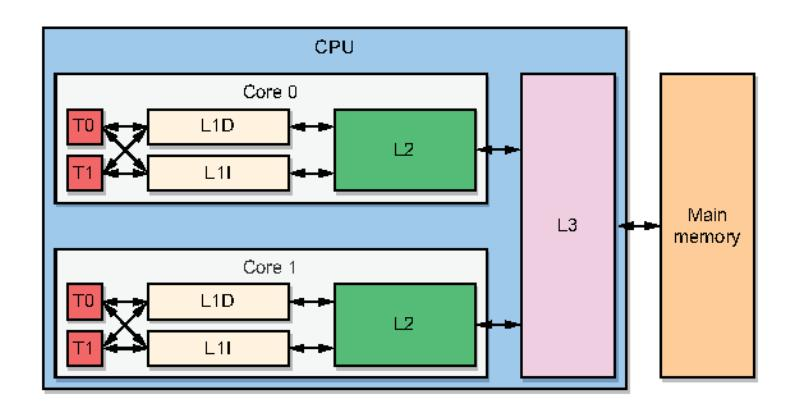

Figure 12.1
The i5-7300 has three levels of caches, two physical cores, and four logical cores.

processor. Conversely, L3 is off-die, which partly explains the latency differences compared to L1 and L2.

For main memory (or RAM), average accesses are between 50 and 100 times slower than L1. We can access up to 100 variables stored on L1 for the price of a single access to the main memory. Therefore, as Go developers, one avenue for improvement is making sure our applications use CPU caches.

### 12.1.2 Cache line

The concept of cache lines is crucial to understand. But before presenting what they are, let's understand why we need them.

When a specific memory location is accessed (for example, by reading a variable), one of the following is likely to happen in the near future:

- The same location will be referenced again.
- Nearby memory locations will be referenced.

The former refers to temporal locality, and the latter refers to spatial locality. Both are part of a principle called *locality of reference*.

For example, let's look at the following function that computes the sum of an int64 slice:

```
func sum(s []int64) int64 {
   var total int64
  length := len(s)
  for i := 0; i < length; i++ {
      total += s[i]
  }
  return total
}</pre>
```

In this example, temporal locality applies to multiple variables: i, length, and total. Throughout the iteration, we keep accessing these variables. Spatial locality applies to code instructions and the slice s. Because a slice is backed by an array allocated

contiguously in memory, in this case, accessing s[0] means also accessing s[1], s[2], and so on.

Temporal locality is part of why we need CPU caches: to speed up repeated accesses to the same variables. However, because of spatial locality, the CPU copies what we call a *cache line* instead of copying a single variable from the main memory to a cache.

A cache line is a contiguous memory segment of a fixed size, usually 64 bytes (8 int64 variables). Whenever a CPU decides to cache a memory block from RAM, it copies the memory block to a cache line. Because memory is a hierarchy, when the CPU wants to access a specific memory location, it first checks in L1, then L2, then L3, and finally, if the location is not in those caches, in the main memory.

Let's illustrate fetching a memory block with a concrete example. We call the sum function with a slice of  $16 \, \text{int} 64$  elements for the first time. When sum accesses s[0], this memory address isn't in the cache yet. If the CPU decides to cache this variable (we also discuss this decision later in the chapter), it copies the whole memory block; see figure 12.2.

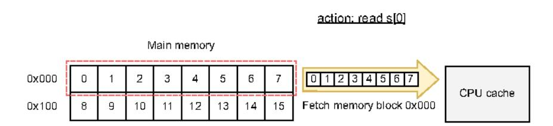

Figure 12.2 Accessing s[0] makes the CPU copy the 0x000 memory block.

At first, accessing s[0] results in a cache miss because the address isn't in the cache. This kind of miss is called a *compulsory miss*. However, if the CPU fetches the 0x000 memory block, accessing elements from 1 to 7 results in a cache hit. The same logic applies when sum accesses s[8] (see figure 12.3).

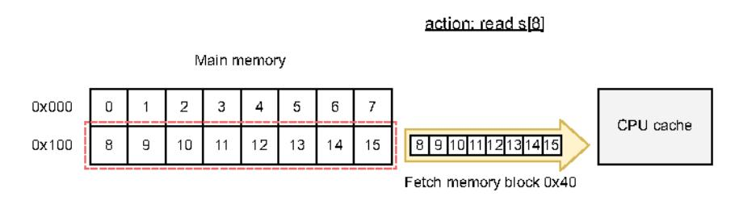

Figure 12.3 Accessing s [8] makes the CPU copy the 0x100 memory block.

Again, accessing 88 results in a compulsory miss. But if the 0x100 memory block is copied into a cache line, it will also speed up accesses for elements 9 to 15. In the end, iterating over the 16 elements results in 2 compulsory cache misses and 14 cache hits.

### **CPU** caching strategies

You may wonder about the exact strategy when a CPU copies a memory block. For example, will it copy a block to all the levels? Only to L1? In this case, what about L2 and L3?

We have to know that different strategies exist. Sometimes caches are inclusive (for example, L2 data is also present in L3), and sometimes caches are exclusive (for example, L3 is called a *victim cache* because it contains only data evicted from L2).

In general, these strategies are hidden by CPU vendors and not necessarily useful to know. So, we won't delve deeper into these questions.

Let's look at a concrete example to illustrate how fast CPU caches are. We will implement two functions that compute a total while iterating over a slice of int64 elements. In one case we will iterate over every two elements, and in the other case over every eight elements:

```
func sum2(s []int64) int64 {
   var total int64
    for i := 0; i < len(s); i+=2 (
                                            lterates over every
       total += s[i]
                                            two elements
    return total
}
func sum8(s []int64) int64 {
    var total int64
    for i := 0; i < len(s); i += 8 {

← Iterates over every

        total += s[i]
                                               eight elements
    return total
}
```

Both functions are the same except for the iteration. If we benchmark these two functions, our gut feeling may be that the second version will be about four times faster because we have to increment over four times fewer elements. However, running a benchmark shows that sum8 is only about 10% faster on my machine: still faster, but only 10%.

The reason is related to cache lines. We saw that a cache line is usually 64 bytes, containing up to eight int 64 variables. Here, the running time of these loops is dominated by memory accesses, not increment instruction. Three out of four accesses result in a cache hit in the first case. Therefore, the execution time difference for these two functions isn't significant. This example demonstrates why the cache line

matters and that we can easily be fooled by our gut feeling if we lack mechanical sympathy—in this case, for how CPUs cache data.

Let's keep discussing locality of reference and see a concrete example of using spatial locality.

### 12.1.3 Slice of structs vs. struct of slices

This section looks at an example that compares the execution time of two functions. The first takes as an argument a slice of structs and sums all the a fields:

```
type Foo struct {
    a int64
    b int64
}

func sumFoo(foos []Foo) int64 {
    var total int64
    for i := 0; i < len(foos); i++ {
        total += foos[i].a
    }
    return total
}</pre>

Receives a
slice of Foo

and sums each Foo
and sums each a field
}
```

sumFoo receives a slice of Foo and increments total by reading each a field.

The second function also computes a sum. But this time, the argument is a struct containing slices:

```
type Bar struct {
    a []int64
                         a and b are
    b []int64
                        now slices.
                                        Receives a
                                        single struct
func sumBar(bar Bar) int64 {
    var total int64
    for i := 0; i < len(bar.a); i++ {
                                                   Iterates over each
         total += bar.a[i]
                                     Increments
                                                   element of a
                                     the total
    return total
}
```

sumBar receives a single Bar struct that contains two slices: a and b. It iterates over each element of a to increment total.

Do we expect any difference in terms of speed for these two functions? Before running a benchmark, let's visually look at the differences in memory in figure 12.4. Both cases have the same amount of data: 16

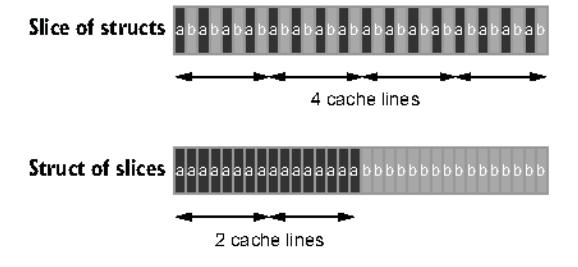

Figure 12.4 A struct of slices is more compact and therefore requires fewer cache lines to iterate over.

Foo elements in the slice and 16 elements in the slices of Bar. Each black bar represents an int64 that is read to compute the sum, whereas each gray bar represents an int64 that is skipped.

In the case of sumFoo, we receive a slice of structs containing two fields, a and b. Therefore, we have a succession of a and b in memory. Conversely, in the case of sumBar, we receive a struct containing two slices, a and b. Therefore, all the elements of a are allocated contiguously.

This difference doesn't lead to any memory compaction optimization. But the goal of both functions is to iterate over each a, and doing so requires four cache lines in one case and only two cache lines in the other.

If we benchmark these two functions, sumBar is faster (about 20% on my machine). The main reason is a better spatial locality that makes the CPU fetch fewer cache lines from memory.

This example demonstrates how spatial locality can have a substantial impact on performance. To optimize an application, we should organize data to get the most value out of each individual cache line.

However, is using spatial locality enough to help the CPU? We are still missing one crucial characteristic: predictability.

### 12.1.4 Predictability

Predictability refers to the ability of a CPU to anticipate what the application will do to speed up its execution. Let's see a concrete example where a lack of predictability negatively impacts application performance.

Again, let's look at two functions that sum a list of elements. The first iterates over a linked list and sums all the values:

```
type node struct {
    value int64
    next *node
}

func linkedList(n *node) int64 {
    var total int64
    for n != nil {
        total += n.value
        n = n.next
    }
    return total
}
Linked list
data structure
literates over\neach node
    increments
total
}
```

This function receives a linked list, iterates over it, and increments a total.

On the other side, let's again take the sum2 function that iterates over a slice, one element out of two:

```
func sum2(s []int64) int64 {
   var total int64
   for i := 0; i < len(s); i+=2 {
        two elements</pre>
```

```
total += s[i]
}
return total
}
```

Let's assume that the linked list is allocated contiguously: for example, by a single function. On a 64-bit architecture, a word is 64 bits long. Figure 12.5 compares the two data structures that the functions receive (linked list or slice); the darker bars represent

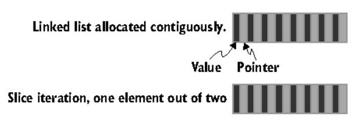

Figure 12.5 In memory, linked lists and slices are compacted in a similar manner.

the int64 elements we use to increment the total.

In both examples, we face similar compaction. Because a linked list is a succession of values and 64-bit pointer elements, we increment the sum using one element out of two. Meanwhile, the sum2 example reads only one element out of two.

The two data structures have the same spatial locality, so we may expect a similar execution time for these two functions. But the function iterating on the slice is significantly faster (about 70% on my machine). What's the reason?

To understand this, we have to discuss the concept of striding. Striding relates to how CPUs work through data. There are three different types of strides (see figure 12.6):

- Unit stride—All the values we want to access are allocated contiguously: for example, a slice of int64 elements. This stride is predictable for a CPU and the most efficient because it requires a minimum number of cache lines to walk through the elements.
- Constant stride—Still predictable for the CPU: for example, a slice that iterates
  over every two elements. This stride requires more cache lines to walk through
  data, so it's less efficient than a unit stride.

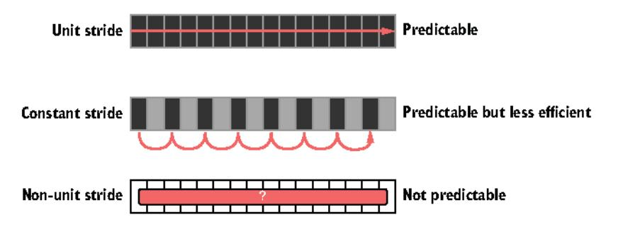

Figure 12.6 The three types of strides

 Non-unit stride—A stride the CPU can't predict: for example, a linked list or a slice of pointers. Because the CPU doesn't know whether data is allocated contiguously, it won't fetch any cache lines.

For sum2, we face a constant stride. However, for the linked list, we face a non-unit stride. Even though we know the data is allocated contiguously, the CPU doesn't know that. Therefore, it can't predict how to walk through the linked list.

Because of the different stride and similar spatial locality, iterating over a linked list is significantly slower than a slice of values. We should generally favor unit strides over constant strides because of the better spatial locality. But a non-unit stride cannot be predicted by the CPU regardless of how the data is allocated, leading to negative performance impacts.

So far, we have discussed that CPU caches are fast but significantly smaller than the main memory. Therefore, a CPU needs a strategy to fetch a memory block to a cache line. This policy is called *cache placement policy* and can significantly impact performance.

### 12.1.5 Cache placement policy

In mistake #89, "Writing inaccurate benchmarks," we discussed an example with a matrix in which we had to compute the total sum of the first eight columns. At that point, we didn't explain why changing the overall number of columns impacted the benchmark results. It might sound counterintuitive: because we need to read only the first eight columns, why does changing the total number of columns affect the execution time? Let's take a look in this section.

As a reminder, the implementation is the following:

```
func calculateSum512(s [][512]int64) int64 {
   var sum int64
   for i := 0; i < len(s); i++ {
       for j := 0; j < 8; j++ {
            sum += s[i][j]
       }
   }
   return sum
}

Receives a matrix
of 512 columns

Receives a matrix
of 513 columns

Receives a matrix
of 513 columns

**The colour of 513 columns
**The colour of 513 columns
**The colour of 513 columns
**The colour of 513 columns
**The colour of 513 columns
**The colour of 513 columns
**The colour of 513 columns
**The colour of 513 columns
**The colour of 513 columns
**The colour of 513 columns
**The colour of 513 columns
**The colour of 513 columns
**The colour of 513 columns
**The colour of 513 columns
**The colour of 513 columns
**The colour of 513 columns
**The colour of 513 columns
**The colour of 513 columns
**The colour of 513 columns
**The colour of 513 columns
**The colour of 513 columns
**The colour of 513 columns
**The colour of 513 columns
**The colour of 513 columns
**The colour of 513 columns
**The colour of 513 columns
**The colour of 513 columns
**The colour of 513 columns
**The colour of 513 columns
**The colour of 513 columns
**The colour of 513 columns
**The colour of 513 columns
**The colour of 513 columns
**The colour of 513 columns
**The colour of 513 columns
**The colour of 513 columns
**The colour of 513 columns
**The colour of 513 columns
**The colour of 513 columns
**The colour of 513 columns
**The colour of 513 columns
**The colour of 513 columns
**The colour of 513 columns
**The colour of 513 columns
**The colour of 513 columns
**The colour of 513 columns
**The colour of 513 columns
**The colour of 513 columns
**The colour of 513 columns
**The colour of 513 columns
**The colour of 513 columns
**The colour of 513 columns
**The colour of 513 columns
**The colour of 513 columns
**The colour of 513 columns
**The colour of 513 columns
**The colour of 513 columns
**The colour of 513 columns
**The colour of 513 columns
**The colour of 513 columns
**The colour of 513 columns
**The colour of 513 columns
**The columns of 5
```

We iterate over each row, summing the first eight columns each time. When these two functions are benchmarked each time with a new matrix, we don't observe any difference. However, if we keep reusing the same matrix, calculateSum513 is about 50% faster on my machine. The reason lies in CPU caches and how a memory block is copied to a cache line. Let's examine this to understand this difference.

When a CPU decides to copy a memory block and place it into the cache, it must follow a particular strategy. Assuming an L1D cache of 32 KB and a cache line of 64 bytes,

if a block is placed randomly into L1D, the CPU will have to iterate over 512 cache lines in the worst case to read a variable. This kind of cache is called *fully associative*.

To improve how fast an address can be accessed from a CPU cache, designers work on different policies regarding cache placement. Let's skip the history and discuss today's most widely used option: *set-associative cache*, which relies on cache partitioning.

For the sake of clarity in the following figures, we will work with a reduced version of the problem:

- We will assume an L1D cache of 512 bytes (8 cache lines).
- The matrix is composed of 4 rows and 32 columns, and we will read only the first 8 columns.

Figure 12.7 shows how this matrix can be stored in memory. We will use the binary representation for the memory block addresses. Also, the gray blocks represent the first 8 int64 elements we want to iterate over. The remaining blocks are skipped during the iteration.

| N                 | lemory addresses |
|-------------------|------------------|
| s[0][0] s[0][7]   | 00000000000000   |
| s[0][8] s[0][15]  | 00010000000000   |
| s[0][16] s[0][23] | 00100000000000   |
| s[0][24] s[0][31] | 00110000000000   |
| s[1][0] s[1][7]   | 01000000000000   |
| s[1][8] s[1][15]  | 0101000000000    |
| s[1][16] s[1][23] | 01100000000000   |
| s[1][24] s[1][31] | 01110000000000   |
| s[2][0] s[2][7]   | 10000000000000   |
| s[2][8] s[2][15]  | 1001000000000    |
| s[2][16] s[2][23] | 10100000000000   |
| s[2][24] s[2][31] | 10110000000000   |
| s[3][0] s[3][7]   | 11000000000000   |
| s[3][8] s[3][15]  | 11010000000000   |
| s[3][16] s[3][23] | 11100000000000   |
| s[3][24] s[3][31] | 11110000000000   |

Cache

Figure 12.7 The matrix stored in memory, and an empty cache for the execution

Each memory block contains 64 bytes and hence 8 int 64 elements. The first memory block starts at 0x0000000000000, the second begins at 0001000000000 (512 in binary), and so on. We also show the cache that can hold 8 lines.

**NOTE** We will see in mistake #94, "Not being aware of data alignment," that a slice doesn't necessarily start at the beginning of a block.

With the set-associative cache policy, a cache is partitioned into sets. We assume the cache is two-way set associative, meaning each set contains two lines. A memory block can belong to only one set, and the placement is determined by its memory address. To understand this, we have to dissect the memory block address into three parts:

- The block offset is based on the block size. Here a block size is 512 bytes, and 512 equals 2^9. Therefore, the first 9 bits of the address represent the block offset (bo).
- The set index indicates the set to which an address belongs. Because the cache is two-way set associative and contains 8 lines, we have 8 / 2 = 4 sets. Furthermore, 4 equals 2^2, so the next two bits represent the set index (si).
- The rest of the address consists of the tag bits (tb). In figure 12.7, we represent an address using 13 bits for simplicity. To compute tb, we use 13 bo si. This means the two remaining bits represent the tag bits.

Let's say the function starts and tries to read s[0][0], which belongs to address 0000000000000. Because this address isn't present in the cache yet, the CPU calculates its set index and copies it to the corresponding cache set (figure 12.8).

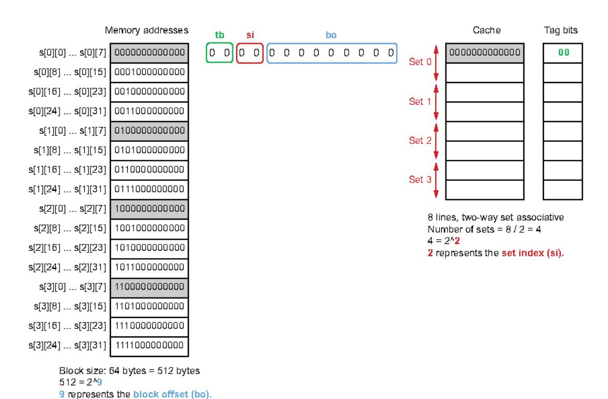

Figure 12.8 Memory address 00000000000 is copied into set 0.

As discussed, 9 bits represent the block offset: it's the minimum common prefix for each memory block address. Then, 2 bits represent the set index. With address 0000000000000, si equals 00. Hence, this memory block is copied to set 0.

When the function reads from s[0][1] to s[0][7], the data is already in the cache. How does the CPU know about it? The CPU calculates the starting address of the memory block, computes the set index and the tag bits, and then checks whether 00 is present in set 0.

Next the function reads s[0][8], and this address isn't cached yet. So the same operation occurs to copy memory block 0100000000000 (figure 12.9).

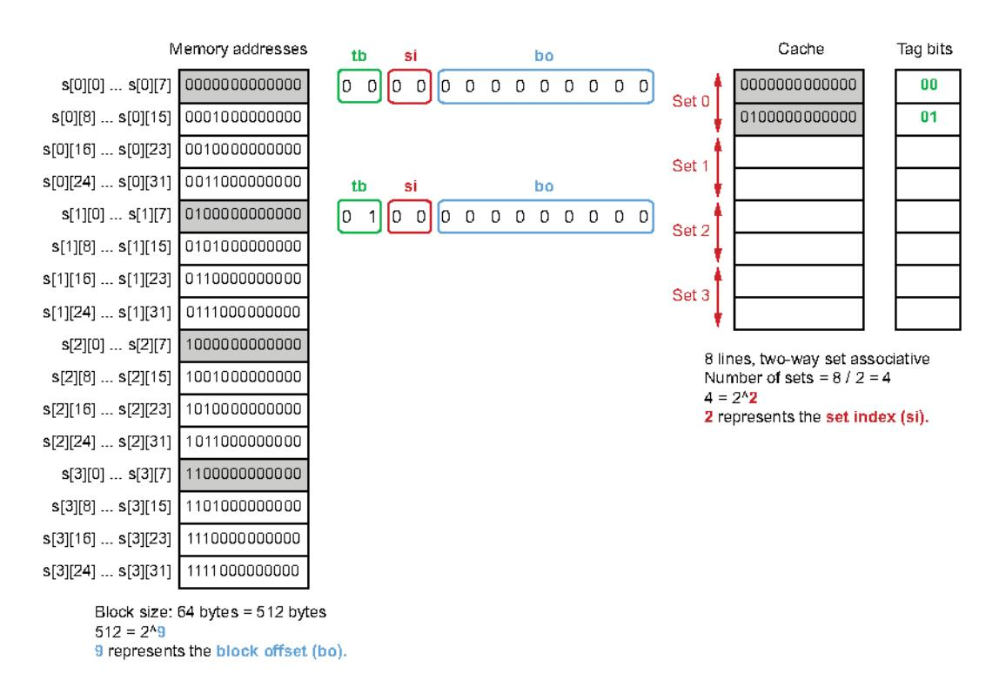

Figure 12.9 Memory address 010000000000 is copied into set 0.

This memory has a set index equal to 00, so it also belongs to set 0. The cache line is copied to the next available line in set 0. Then, again, reading from s[1][1] to s[1][7] results in cache hits.

Now things are getting interesting. The function reads s[2][0], and this address isn't present in the cache. The same operation is performed (figure 12.10).

The set index is again equal to 00. However, set 0 is full—what does the CPU do? Copy the memory block to another set? No. The CPU replaces one of the existing cache lines to copy memory block 1000000000000.

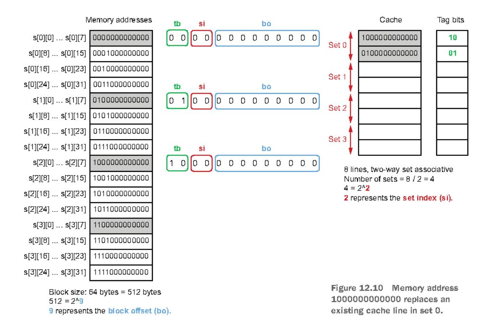

The cache replacement policy depends on the CPU, but it's usually a pseudo-LRU policy (a real LRU [least recently used] would be too complex to handle). In this case, let's say it replaces our first cache line: 0000000000000. This situation is repeated when iterating on row 3: memory address 11000000000000 also has a set index equal to 00, resulting in replacing an existing cache line.

Now, let's say the benchmark executes the function with a slice pointing to the same matrix starting at address 000000000000. When the function reads s[0][0], the address isn't in the cache. This block was already replaced.

Instead of using CPU caches from one execution to another, the benchmark will lead to more cache misses. This type of cache miss is called a *conflict miss*: a miss that wouldn't occur if the cache wasn't partitioned. All the variables we iterate belong to a memory block whose set index is 00. Therefore, we use only one cache set instead of having a distribution across the entire cache.

Previously we discussed the concept of striding, which we defined as how a CPU walks through our data. In this example, this stride is called a *critical stride*: it leads to accessing memory addresses with the same set index that are hence stored to the same cache set.

Let's come back to our real-world example with the two functions calculate-Sum512 and calculateSum513. The benchmark was executed on a 32 KB eight-way set-associative L1D cache: 64 sets total. Because a cache line is 64 bytes, the critical stride equals 64 × 64 bytes = 4 KB. Four KB of int64 types represent 512 elements.

Therefore, we reach a critical stride with a matrix of 512 columns, so we have a poor caching distribution. Meanwhile, if the matrix contains 513 columns, it doesn't lead to a critical stride. This is why we observed such a massive difference between the two benchmarks.

In summary, we have to be aware that modern caches are partitioned. Depending on the striding, in some cases only one set is used, which may harm application performance and lead to conflict misses. This kind of stride is called a critical stride. For performance-intensive applications, we should avoid critical strides to get the most out of CPU caches.

**NOTE** Our example also highlights why we should take care with the results of a micro-benchmark if it's executed on a system other than production. If the production system has a different cache architecture, performance may be significantly different.

Let's continue discussing the impact of CPU caching. This time, we see concrete effects while writing concurrent code.

### 12.2 #92: Writing concurrent code that leads to false sharing

So far, we have discussed the fundamental concepts of CPU caching. We have seen that some specific caches (typically, L1 and L2) aren't shared among all the logical cores but are specific to a physical core. This specificity has some concrete impacts such as concurrency and the concept of false sharing, which can lead to a significant performance decrease. Let's look at what false sharing is via an example and then see how to prevent it.

In this example, we use two structs, Input and Result:

```
type Input struct {
    a int64
    b int64
}

type Result struct {
    sumA int64
    sumB int64
}
```

The goal is to implement a count function that receives a slice of Input and computes the following:

- The sum of all the Input.a fields into Result.sumA
- The sum of all the Input.b fields into Result.sumB

For the sake of the example, we implement a concurrent solution with one goroutine that computes sumA and another that computes sumB:

```
func count(inputs []Input) Result {
   wg := sync.WaitGroup()
   wg.Add(2)
```

```
go func() {
    for i := 0; i < len{inputs); i++ {
        result.sumA += inputs[i].a }
    }
    wg.Done()
}()

go func() {
    for i := 0; i < len(inputs); i++ {
        result.sumB += inputs[i].b }
    wg.Done()
}()

wg.Wait()
return result
}</pre>
Computes sumB
```

We spin up two goroutines: one that iterates over each a field and another that iterates over each b field. This example is fine from a concurrency perspective. For instance, it doesn't lead to a data race, because each goroutine increments its own

variable. But this example illustrates the false sharing concept that degrades expected performance.

Let's look at the main memory (see figure 12.11). Because sumA and sumB are allocated contiguously, in most cases (seven out of eight), both variables are allocated to the same memory block.

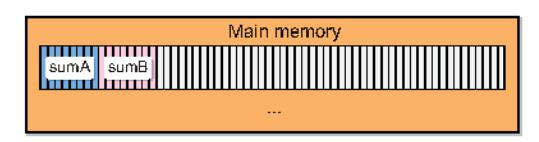

Figure 12.11 In this example, sumA and sumB are part of the same memory block.

Now, let's assume that the machine contains two cores. In most cases, we should eventually have two threads scheduled on different cores. So if the CPU decides to copy this memory block to a cache line, it is copied twice (figure 12.12).

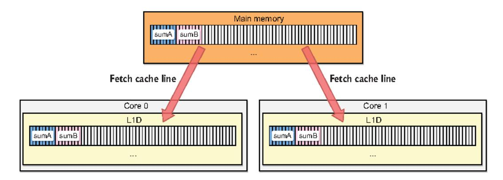

Figure 12.12 Each block is copied to a cache line on both core 0 and core 1.

Both cache lines are replicated because L1D (L1 data) is per core. Recall that in our example, each goroutine updates its own variable: sumA on one side, and sumB on the other side (figure 12.13).

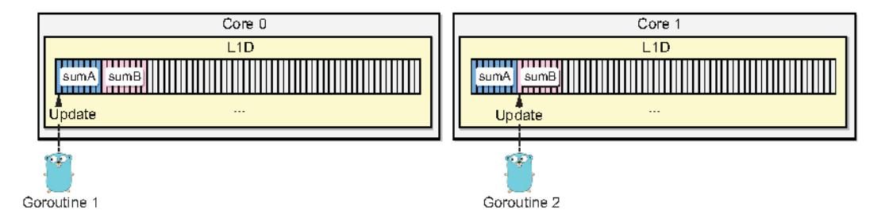

Figure 12.13 Each goroutine updates its own variable.

Because these cache lines are replicated, one of the goals of the CPU is to guarantee cache coherency. For example, if one goroutine updates sumA and another reads sumA (after some synchronization), we expect our application to get the latest value.

However, our example doesn't do exactly this. Both goroutines access their own variables, not a shared one. We might expect the CPU to know about this and understand that it isn't a conflict, but this isn't the case. When we write a variable that's in a cache, the granularity tracked by the CPU isn't the variable: it's the cache line.

When a cache line is shared across multiple cores and at least one goroutine is a writer, the entire cache line is invalidated. This happens even if the updates are logically independent (for example, sumA and sumB). This is the problem of false sharing, and it degrades performance.

**NOTE** Internally, a CPU uses the MESI protocol to guarantee cache coherency. It tracks each cache line, marking it modified, exclusive, shared, or invalid (MESI).

One of the most important aspects to understand about memory and caching is that sharing memory across cores isn't real—it's an illusion. This understanding comes from the fact that we don't consider a machine a black box; instead, we try to have mechanical sympathy with underlying levels.

So how do we solve false sharing? There are two main solutions.

The first solution is to use the same approach we've shown but ensure that sumA and sumB aren't part of the same cache line. For example, we can update the Result struct to add *padding* between the fields. Padding is a technique to allocate extra memory. Because an int 64 requires an 8-byte allocation and a cache line 64 bytes long, we need 64 - 8 = 56 bytes of padding:

```
type Result struct {
   sumA int64
```

```
_ [56]byte ← Padding sumB int64
```

Figure 12.14 shows a possible memory allocation. Using padding, sumA and sumB will always be part of different memory blocks and hence different cache lines.

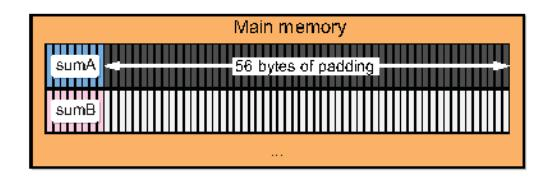

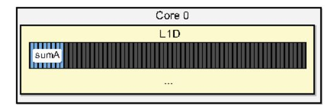

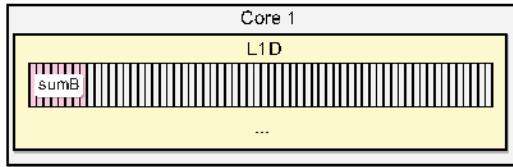

Figure 12.14 sumA and sumB are part of different memory blocks.

If we benchmark both solutions (with and without padding), we see that the padding solution is significantly faster (about 40% on my machine). This is an important improvement that results from the addition of padding between the two fields to prevent false sharing.

The second solution is to rework the structure of the algorithm. For example, instead of having both goroutines share the same struct, we can make them communicate their local result via channels. The result benchmark is roughly the same as with padding.

In summary, we must remember that sharing memory across goroutines is an illusion at the lowest memory levels. False sharing occurs when a cache line is shared across two cores when at least one goroutine is a writer. If we need to optimize an application that relies on concurrency, we should check whether false sharing applies, because this pattern is known to degrade application performance. We can prevent false sharing with either padding or communication.

The following section discusses how CPUs can execute instructions in parallel and how to leverage that capability.

### 12.3 #93: Not taking into account instruction-level parallelism

Instruction-level parallelism is another factor that can significantly impact performance. Before defining this concept, let's discuss a concrete example and how to optimize it.

We will write a function that receives an array of two int64 elements. This function will iterate a certain number of times (a constant). During each iteration, it will do the following:

- Increment the first element of the array.
- Increment the second element of the array if the first element is even.

### Here's the Go version:

```
const n = 1_000_000

func add(s [2]int64) [2]int64 {
    for i := 0; i < n; i++ {
        s[0]++
```

The instructions executed within the loop are shown in figure 12.15 (an increment requires both a read and then a write). The sequence of instructions is sequential: first we increment s[0]; then, before incrementing s[1], we need to read s[0] again.

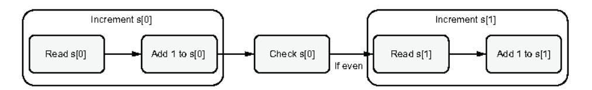

Figure 12.15 Three main steps: increment, check, increment

**NOTE** This sequence of instructions doesn't match the granularity of the assembly instructions. But for clarity throughout this section, we use a simplified view.

Let's take a moment to discuss the theory behind instruction-level parallelism (ILP). A few decades ago, CPU designers stopped focusing solely on clock speed to improve CPU performance. They developed multiple optimizations, including ILP, which allows developers to parallelize the execution of a sequence of instructions. A processor that implements ILP in a single virtual core is called a *superscalar processor*. For example, figure 12.16 illustrates a CPU executing an application consisting of three instructions, I1, I2, and I3.

Executing a sequence of instructions requires different stages. In a nutshell, the CPU needs to decode the instructions and execute them. The execution is handled by the execution unit, which performs the various operations and calculations.

In figure 12.16, the CPU decided to execute the three instructions in parallel. Note that not all the instructions necessarily complete in a single clock cycle. For example, an instruction that reads a value already present in a register will finish in one clock cycle, but an instruction that reads an address that must be fetched from main memory may take dozens of clock cycles to complete.

If executed sequentially, this sequence of instructions would have taken the following time (the function t(x) denotes the time the CPU takes to execute instruction x):

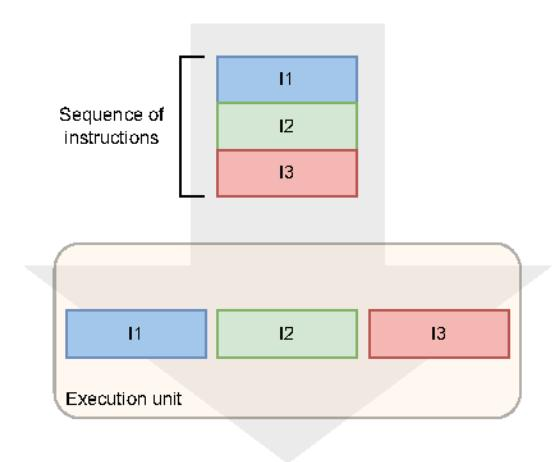

Figure 12.16 Despite being written sequentially, the three instructions are executed in parallel.

```
total time = t(I1) + t(I2) + t(I3)
```

Thanks to ILP, the total time is the following:

```
total time = max{t(I1), t(I2), t(I3))
```

ILP looks magic, theoretically. But it leads to a few challenges called hazards.

For example, what if I3 sets a variable to 42 but I2 is a conditional instruction (for example, if foo == 1)? In theory, this scenario should prevent executing I2 and I3 in parallel. This is called a *control hazard* or *branching hazard*. In practice, CPU designers solved control hazards using branch prediction.

For example, a CPU can count that the condition was true 99 of the last 100 times; therefore, it will execute both 12 and 13 in parallel. In case of a wrong prediction (12 happens to be false), the CPU will flush its current execution pipeline, ensuring that there are no inconsistencies. This flush leads to a performance penalty of 10 to 20 clock cycles.

Other types of hazards can prevent executing instructions in parallel. As soft-ware engineers, we should be aware of that. For example, let's consider the two following instructions that update registers (temporary storage areas used to execute operations):

- I1 adds the numbers in registers A and B to C.
- I2 adds the numbers in registers C and D to D.

Because I2 depends on the outcome of I1 concerning the value of register C, the two instructions cannot be executed simultaneously. I1 must complete before I2. This is called a *data hazard*. To deal with data hazards, CPU designers have come up with a trick called *forwarding* that basically bypasses writing to a register. This technique doesn't solve the problem but rather tries to alleviate the effects.

**NOTE** There are also *structural hazards*, when at least two instructions in the pipeline need the same resource. As Go developers, we can't really impact these kinds of hazards, so we don't discuss them in this section.

Now that we have a decent understanding of ILP theory, let's get back to our initial problem and focus on the content of the loop:

```
s[0]++\nif s[0]%2 == 0 {
    s[1]++
}
```

As we discussed, data hazards prevent instructions from being executed simultaneously. Let's look at the sequence of instructions in figure 12.17; this time we highlight the hazards between the instructions.

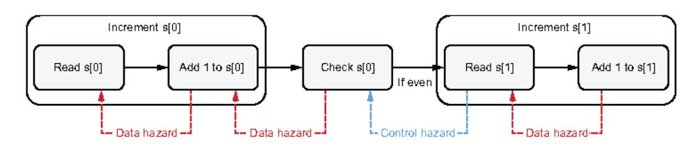

Figure 12.17 Hazard types between the instructions

This sequence contains one control hazard because of the if statement. However, as discussed, it's the scope of the CPU to optimize the execution and predict what branch should be taken. There are also multiple data hazards. As we discussed, data hazards prevent ILP from executing instructions in parallel. Figure 12.18 shows the sequence of instructions from an ILP standpoint: the only independent instructions are the  $\mathfrak{s}[0]$  check and the  $\mathfrak{s}[1]$  increment, so these two instruction sets can be executed in parallel thanks to branch prediction.

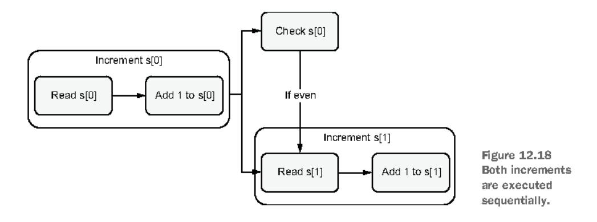

What about the increments? Can we improve our code to minimize the number of data hazards?

Let's write another version (add2) that introduces a temporary variable:

```
func add(s [2]int64) [2]int64 {
                                          First
    for i := 0; i < n; i++ \{
                                           version
        s[0]++
        if s[0]%2 == 0 {
            s[1]++
    }
    return s
func add2(s [2]int64) [2]int64 {
                                           Second version
    for i := 0; i < n; i++ \{
        v := s[0]
                                   Introduces a new variable
        s[0] = v + 1
                                  to fix the s[0] value
        if v%2 != 0 {
            s[1]++
    }
    return s
```

In this new version, we fix the value of s[0] to a new variable, v. Previously we incremented s[0] and checked whether it was even. To replicate this behavior, because v is based on s[0], to increment s[1] we now check whether v is odd.

Figure 12.19 compares the two versions in terms of hazards. The number of steps is the same. The significant difference is regarding the data hazards: the s[0] increment step and the check v step now depend on the same instruction (read s[0] into v).

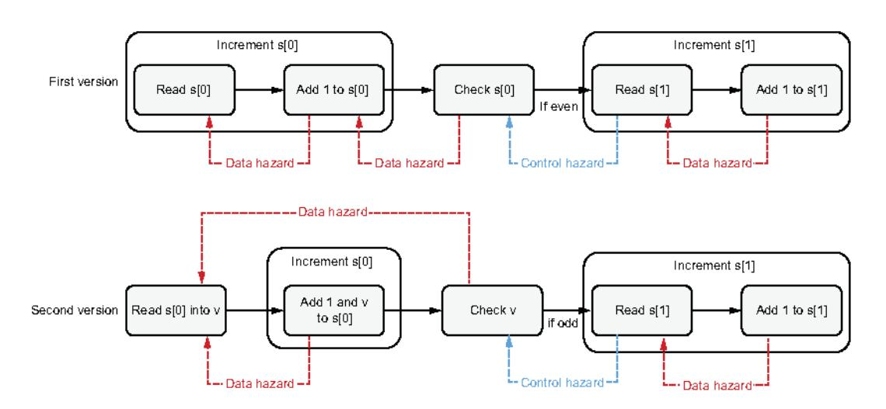

Figure 12.19 One significant difference: the data hazard for the v check step

Why does this matter? Because it allows the CPU to increase the level of parallelism (figure 12.20).

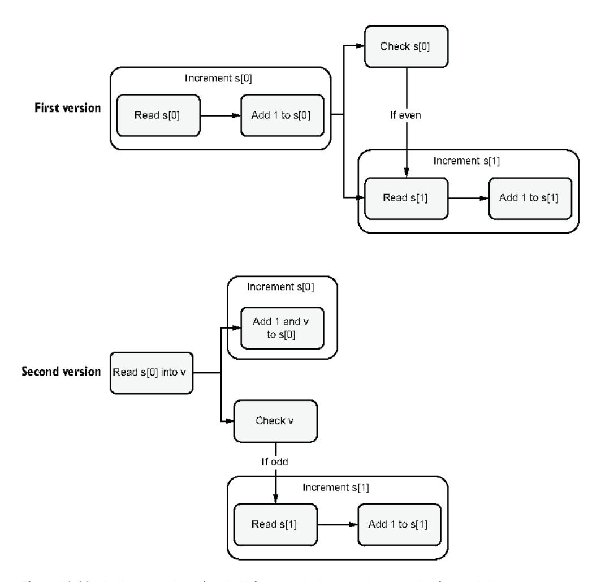

Figure 12.20 In the second version, both increment steps can be executed in parallel.

Despite having the same number of steps, the second version increases how many steps can be executed in parallel: three parallel routes instead of two. Meanwhile, the execution time should be optimized because the longest path has been reduced. If we benchmark these two functions, we see a significant speed improvement for the second version (about 20% on my machine), mainly because of ILP.

Let's take a step back to conclude this section. We discussed how modern CPUs use parallelism to optimize the execution time of a set of instructions. We also looked at

data hazards, which can prevent executing instructions in parallel. And we optimized a Go example by reducing the number of data hazards to increase the number of instructions that can be executed in parallel.

Understanding how Go compiles our code into assembly and how to use CPU optimizations such as ILP is another avenue for improvement. Here, introducing a temporary variable resulted in a significant performance improvement. This example demonstrated how mechanical sympathy can help us optimize a Go application.

Let's also remember to remain cautious about such micro-optimizations. Because the Go compiler keeps evolving, an application's generated assembly may also change when the Go version is bumped.

The following section discusses the effects of data alignment.

### 12.4 #94: Not being aware of data alignment

Data alignment is a way to arrange how data is allocated to speed up memory accesses by the CPU. Not being aware of this concept can lead to extra memory consumption and even degraded performance. This section discusses this concept, where it applies, and techniques to prevent under-optimized code.

To understand how data alignment works, let's first discuss what would happen without it. Suppose we allocate two variables, an int32 (32 bytes) and an int64 (64 bytes):

```
var i int32
var j int64
```

Without data alignment, on a 64-bit architecture, these two variables could be allocated as shown in figure 12.21. The j variable allocation could be spread over two words. If the CPU wanted to read j, it would require two memory accesses instead of one.

To prevent such a case, a variable's memory address should be a multiple of its own size. This is the concept of data alignment. In Go, the alignment guarantees are as follows:

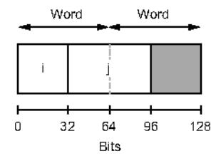

Figure 12.21 j allocated on two words

- byte, uint8, int8: 1 byte
- uint16, int16:2 bytes
- uint32, int32, float32: 4 bytes
- uint64, int64, float64, complex64:8 bytes
- complex128: 16 bytes

All these types are guaranteed to be aligned: their addresses are a multiple of their size. For example, the address of any int 32 variable is a multiple of 4.

Let's get back to the real world. Figure 12.22 shows two different cases where i and j are allocated in memory.

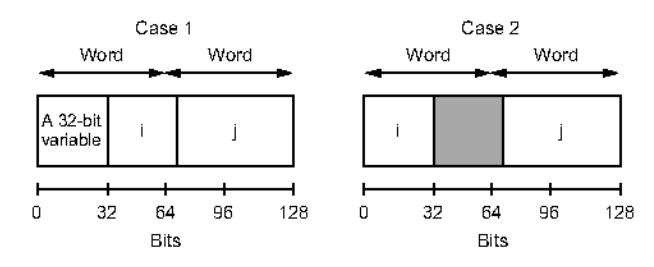

Figure 12.22 In both cases, j is aligned to its own size.

In the first case, a 32-bit variable was allocated just before i. Therefore, i and j were allocated contiguously. In the second case, the 32-bit variable wasn't allocated before i (for example, it was a 64-bit variable); so, i was allocated at the beginning of a word. To respect data alignment (an address that is a multiple of 64), j can't be allocated alongside i but to the next multiple of 64. The gray box represents 32 bits of padding.

Next, let's look at when padding can be an issue. We will consider the following struct containing three fields:

```
type Foo struct {
    b1 byte
    i int64
    b2 byte
}
```

We have a byte type (1 byte), an int64 (8 bytes), and another byte type (1 byte). On a 64-bit architecture, the struct is allocated in memory as shown in figure 12.23. b1 is allocated first. Because i is an int64, its address must be a multiple of 8. Therefore, it's impossible to allocate it alongside b1 at 0x01. What's the next address that is a multiple of 8? 0x08. b2 is allocated to the next available address that is a multiple of 1: 0x10.

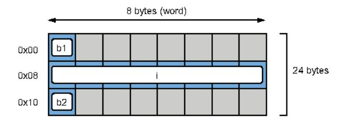

Figure 12.23 The struct occupies 24 bytes total.

Because a struct's size must be a multiple of the word size (8 bytes), its address isn't 17 bytes but 24 bytes total. During the compilation, the Go compiler adds padding to guarantee data alignment:

```
type Foo struct {
   b1 byte
```

```
i int64
b2 byte
_ [7]byte 

Added by
the compiler
}
```

Every time a Foo struct is created, it requires 24 bytes in memory, but only 10 bytes contain data—the remaining 14 bytes are padding. Because a struct is an atomic unit, it will never be reorganized, even after a garbage collection (GC); it will always occupy 24 bytes in memory. Note that the compiler doesn't rearrange the fields; it only adds padding to guarantee data alignment.

How can we reduce the amount of memory allocated? The rule of thumb is to reorganize a struct so that its fields are sorted by type size in descending order. In our case, the int64 type is first, followed by the two byte types:

```
type Foo struct {
    i int64
    b1 byte
    b2 byte
}
```

Figure 12.24 shows how this new version of Foo is allocated in memory. i is allocated first and occupies a complete word. The main difference is that now b1 and b2 can live alongside each other in the same word.

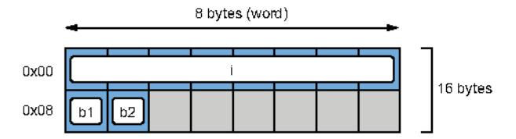

Figure 12.24 The struct now occupies 16 bytes in memory.

Again, the struct must be a multiple of the word size; but instead of occupying 24 bytes in memory, it occupies only 16 bytes. We saved 33% of the memory just by moving i to the first position.

What would be the concrete impacts if we used the first version of the Foo struct (24 bytes) instead of the compacted one? If the Foo structs were retained (for example, an in-memory Foo cache), our application would consume extra memory. But even if the Foo structs weren't retained, there would be other effects. For example, if we created Foo variables frequently and they were allocated to the heap (we discuss this concept in the next section), the result would be more frequent GCs, impacting overall application performance.

Speaking of performance, there's another effect on spatial locality. For example, let's consider the following sum function that takes a slice of Foo structs as an argument. This function iterates over the slice and sums all the i fields (int64):

```
func sum(foos []Foo) int64 {
   var s int64
```

```
for i := 0; i < len(foos); i++ {
```

Because a slice is backed by an array, it means a contiguous allocation of Foo structs.

Let's discuss the backing array for the two versions of Foo and check two cache lines of data (128 bytes). In figure 12.25, each gray bar represents 8 bytes of data, and the darker bars are the i variables (the fields we want to sum).

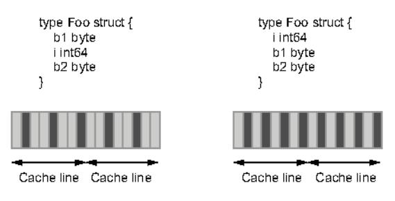

Figure 12.25 Because each cache line contains more i variables, iterating over a slice of Foo requires fewer cache lines total.

As we can see, with the latest version of Foo, each cache line is more useful because it contains on average 33% more i variables. Therefore, iterating over a Foo slice to sum all the int 64 elements is more efficient.

We can confirm this observation with a benchmark. If we run two benchmarks with the two versions of Foo using a slice of 10,000 elements, the version using the latest Foo struct is about 15% faster on my machine. That's a 15% speed improvement from changing the position of a single field in a struct.

Let's be mindful of data alignment. As we have seen in this section, reorganizing the fields of a Go struct to sort them by size in descending order prevents padding. Preventing padding means allocating more compact structs, possibly leading to optimizations such as reducing the frequency of GCs and better spatial locality.

The following section discusses the fundamental differences between stack and heap and why they matter.

### 12.5 #95: Not understanding stack vs. heap

In Go, a variable can be allocated either on the stack or on the heap. These two types of memory are fundamentally different and can significantly impact data-intensive applications. Let's examine these concepts and the rules the compiler follows to decide where a variable should be allocated.

### 12.5.1 Stack vs. heap

First, let's discuss the differences between the stack and the heap. The stack is the default memory; it's a last-in, first-out (LIFO) data structure that stores all the local

variables for a specific goroutine. When a goroutine starts, it gets 2 KB of contiguous memory as its stack space (this size has evolved over time and could change again). However, this size isn't fixed at run time and can grow and shrink as necessary (but it always remains contiguous in memory, preserving data locality).

When Go enters a function, a stack frame is created, representing an interval in memory that only the current function can access. Let's look at a concrete example to understand this concept. Here, the main function will print the result of a sumValue function:

```
func main() {
    a := 3
    b := 2
                                   Calls the sumValue
                                  function
    c := sumValue(a, b)
    println(c)
                              Prints
3
                              the result
//go:noinline
                                   Disables
func sumValue(x, y int) int {
    z := x + y
    return z
}
```

There are two things to note here. First, we use the println built-in function instead of fmt.Println, which would force allocating the c variable on the heap. Second, we disable inlining on the sumValue function; otherwise, the function call would not occur (we discuss inlining in mistake #97, "Not relying on inlining").

Figure 12.26 shows the stack following a and b allocations. Because we executed main, a stack frame was created for this function. The two variables a and b were allocated to the stack in this stack frame. All the variables stored are valid addresses, meaning they can be referenced and accessed.

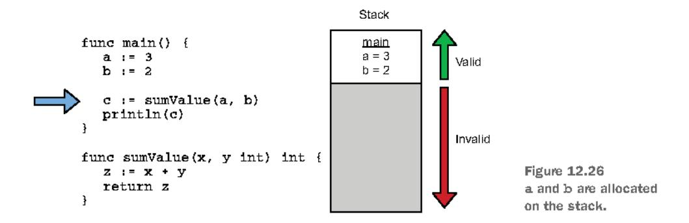

Figure 12.27 shows what happens if we enter into the sumValue function up to the return statement. The Go runtime creates a new stack frame as part of the current goroutine stack, x and y are allocated alongside z in the current stack frame.

```
Stack
func main() {
                                        main
   a := 3
                                        a = 3
                                        h = 2
   b := 2
                                                      Valid
                                      sumValue
   c := sumValue(a, b)
                                        x = 3
   println(c)
                                        y = 2
                                        z = 5
func sumValue(x, y int) int {
   z := x + v
                                                      Invalid
                                                                Figure 12.27 Calling
   return z
                                                                sumValue creates a
                                                                new stack frame.
```

The previous stack frame (main) contains addresses that are still considered valid. We can't access a and b directly; but if we had a pointer on a, for example, it would be valid. We discuss pointers shortly.

Let's move to the last statement of the main function: println. We exited the sum-Value function, so what happens to its stack frame? See figure 12.28.

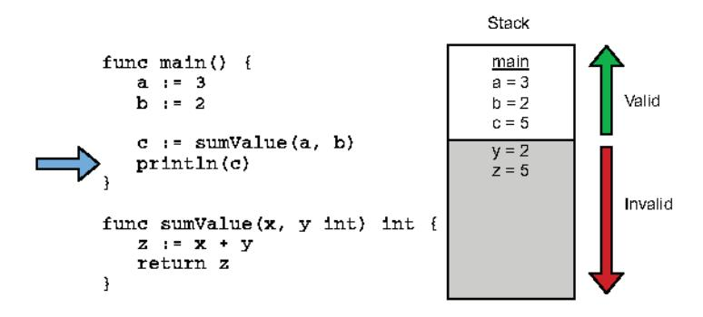

Figure 12.28 The sumValue stack frame was deleted and replaced by variables from main. In this example, x has been erased by c, while y and z are still allocated in memory but unreachable.

The sumValue stack frame wasn't completely erased from memory. When a function returns, Go doesn't take time to deallocate the variables to reclaim free space. But these previous variables can no longer be accessed, and when new variables from the parent function are allocated to the stack, they replace earlier allocations. In a sense, a stack is self-cleaning; it doesn't require an additional mechanism such as a GC.

Now, let's make a slight change to understand the stack's limitations. Instead of returning an int, the function will return a pointer:

```
func main() {
    a := 3
    b := 2
```

```
c := sumPtr(a, b)
  println(*c)
}

//go:noinline
func sumPtr(x, y int) *int {
    z := x + y
    return &z
}
Returns
a pointer
```

The c variable in main is now a \*int type. Let's move directly to the last println statement, following the call to sumPtr. What would happen if z remained allocated on the stack (which can't be the case)? See figure 12.29.

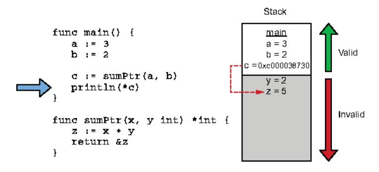

Figure 12.29 The c variable references an address that is no longer valid.

If c was referencing the address of the z variable, and that z was allocated on the stack, we would have a major problem. The address would no longer be valid, plus the stack frame of main would keep growing and erase the z variable. For that reason, the stack isn't enough, and we need another type of memory: the heap.

A memory heap is a pool of memory shared by all the goroutines. In figure 12.30, each of the three goroutines G1, G2, and G3 has its own stack. They all share the same heap.

In the previous example, we saw that the z variable couldn't live on the stack; therefore, it is *escaped* to the heap. If the compiler cannot prove that a variable *isn't* referenced after the function returns, the variable is allocated on the heap.

Why should we care? What's the point of understanding the differences between stack and heap? Because there's a significant impact in terms of performance.

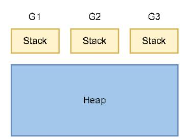

Figure 12.30 Three goroutines that have their own stacks but share the heap

As we said, a stack is self-cleaning and is accessed by a single goroutine. Conversely, the heap must be cleaned by an external system: the GC. The more heap allocations are made, the more we pressure the GC. When the GC runs, it uses 25% of the available CPU capacity and may create milliseconds of "stop the world" latency (the phase when an application is paused).

We must also understand that allocating on the stack is faster for the Go runtime because it's trivial: a pointer references the following available memory address. Conversely, allocating on the heap requires more effort to find the right place and hence takes more time.

To illustrate these differences, let's benchmark sumValue and sumPtr:

```
var globalValue int
var globalPtr *int
func BenchmarkSumValue(b *testing.B) {
   b.ReportAllocs()

var local int

Reports heap
    var local int
                                 allocations
    for i := 0; i < b.N; i++ \{
       local = sumValue(i, i)
                                       7 Sums by
                                       value
    globalValue = local
}
func BenchmarkSumPtr(b *testing.B) {
   b.ReportAllocs() Reports heap allocations
    for i := 0; i < b.N; i++ \{
        local = sumPtr(i, i) 	 ◆
                                    Sums by
                                    pointer
    globalValue = *local
}
```

If we run these benchmarks (and still disable inlining), we get the following results:

```
BenchmarkSumValue-4 992800992 1.261 ns/op 0 B/op 0 allocs/op
BenchmarkSumPtr-4 82829653 14.84 ns/op 8 B/op 1 allocs/op
```

sumPtr is about an order of magnitude slower than sumValue, which is the direct consequence of using the heap instead of the stack.

NOTE This example shows that using pointers to avoid a copy isn't necessarily faster; it depends on the context. So far in this book, we have only discussed values versus pointers via the prism of semantics: using a pointer when a value has to be shared. In most cases, this should be the rule to follow. Also bear in mind that modern CPUs are extremely efficient at copying data, especially within the same cache line. Let's avoid premature optimization and focus on readability and semantics first.

We should also note that in the previous benchmarks, we called b.ReportAllocs(), which highlights heap allocation (stack allocations aren't counted):

- B/op: how many bytes per operation allocated
- allocs/op: how many allocations per operation

Next, let's discuss the conditions for a variable to escape to the heap.

### 12.5.2 Escape analysis

Escape analysis refers to the work performed by the compiler to decide whether a variable should be allocated on the stack or the heap. Let's look at the main rules.

When an allocation cannot be done on the stack, it is done on the heap. Even though this sounds like a simplistic rule, it's important to remember. For example, if the compiler cannot prove that a variable isn't referenced after a function returns, this variable is allocated on the heap. In the previous section, this was the case with the sumPtr function returning a pointer to a variable created in the function's scope. In general, sharing up escapes to the heap.

But what about the opposite situation? What if we accept a pointer, as in the following example?

```
func main() {
    a := 3
    b := 2
    c := sum(&a, &b)
    println(c)
}

//go:noinline
func sum(x, y *int) int {
    return *x + *y
}
Accepts
pointers
```

sum accepts two pointers on variables created in the parent. If we move to the return statement in the sum function, figure 12.31 shows the current stack.

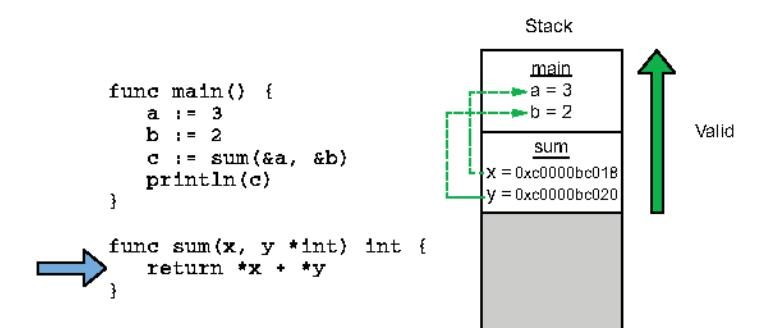

Figure 12.31 The x and y variables reference valid addresses.

Despite being part of another stack frame, the x and y variables reference valid addresses. Therefore, a and b won't have to be escaped; they can stay on the stack. In general, *sharing down* stays on the stack.

The following are other cases in which a variable can be escaped to the heap:

- Global variables, because multiple goroutines can access them.
- A pointer sent to a channel:

```
type Foo struct( s string )
ch := make(chan *Foo, 1)
foo := &Foo(s: "x")
ch <- foo</pre>
```

Here, foo escapes to the heap.

A variable referenced by a value sent to a channel:

```
type Foo struct{ s *string }
ch := make{chan Foo, 1)
s := "x"
bar := Foo{s: &s}
ch <- bar</pre>
```

Because s is referenced by Foo via its address, it escapes to the heap in these situations.

- If a local variable is too large to fit on the stack.
- If the size of a local variable is unknown. For example, s := make([]int, 10) may not escape to the heap, but s := make([]int, n) will, because its size is based on a variable.
- If the backing array of a slice is reallocated using append.

Although this list gives us ideas for understanding the compiler's decisions, it's not exhaustive and may change in future Go versions. To confirm an assumption, we can access the compiler's decisions using -gcflags:

```
$ go build -gcflags "-m=2"
...
./main.go:12:2: z escapes to heap:
```

Here, the compiler informs us that the z variable will escape to the heap.

Understanding the fundamental differences between heap and stack is crucial in optimizing a Go application. As we have seen, heap allocations are more complex for the Go runtime to handle and require an external system with the GC to deallocate data. Heap management can account for up to 20% or 30% of the total CPU time consumed in some data-intensive applications. On the other hand, a stack is self-cleaning and local to a single goroutine, making allocations faster. Therefore, optimizing memory allocation can have a great return on investment.

It's also essential to understand the rules of escape analysis to write more efficient code. In general, sharing down stays on the stack, whereas sharing up escapes to the heap. This should prevent common mistakes such as premature optimizations where we want to return pointers, for example, "to avoid a copy." Let's focus on readability and semantics first and then optimize allocations if needed.

The following section discusses how to reduce allocations.

### 12.6 #96: Not knowing how to reduce allocations

Reducing allocations is a common optimization technique to speed up Go applications. This book has already covered a few approaches that reduce the number of heap allocations:

- Under-optimized string concatenation (mistake #39): using strings.Builder instead of the + operator to concatenate strings.
- Useless string conversions (mistake #40): whenever possible, avoid having to convert [] byte into strings.
- Inefficient slice and map initialization (mistakes #21 and #27): preallocate slices and maps if the length is already known.
- Better data struct alignment to reduce struct size (mistake #94).

As part of this section, we discuss three common approaches to reduce allocations:

- Changing our API
- Relying on compiler optimizations
- Using tools such as sync.Pool

### 12.6.1 API changes

The first option is to work carefully on the API we provide. Let's take as a concrete example the io. Reader interface:

```
type Reader interface {
    Read(p []byte) (n int, err error)
}
```

The Read method accepts a slice and returns the number of bytes read. Now, imagine if the io. Reader interface had been designed the other way around: passing an int representing how many bytes have to be read and returning a slice:

```
type Reader interface {
    Read(n int) {p []byte, err error)
}
```

Semantically, there is nothing wrong with this. But the returned slice would automatically escape to the heap in this case. We would be in the sharing-up case described in the previous section.

The Go designers used the sharing-down approach to prevent automatically escaping the slice to the heap. Therefore, it's up to the caller to provide a slice. That doesn't necessarily mean this slice won't be escaped: the compiler may have decided that this slice cannot stay on the stack. However, it's up to the caller to handle it, not a constraint caused by calling the Read method.

Sometimes even a slight change in an API can positively affect allocations. When designing an API, let's remain aware of the escape analysis rules described in the previous section and, if needed, use -gcflags to understand the compiler's decisions.

### 12.6.2 Compiler optimizations

One of the goals of the Go compiler is to optimize our code if possible. Here's a concrete example regarding maps.

In Go, we can't define a map using a slice as a key type. In some cases, especially in applications doing I/O, we may receive []byte data that we would like to use as a key. We are obliged to transform it into a string first, so we can write the following code:

```
type cache struct {
    m map[string]int
```

Because the get function receives a [] byte slice, we convert it to a key string to query the map.

However, the Go compiler implements a specific optimization if we query the map using string(bytes):

```
func (c *cache) get(bytes []byte) (v int, contains bool) {
    v, contains = c.m[string(bytes)]
```

Despite this being almost the same code (we call string(bytes) directly instead of passing a variable), the compiler will avoid doing this bytes-to-string conversion. Hence, the second version is faster than the first.

This example illustrates that two versions of a function that look similar may result in different assembly code following the Go compiler's work. We should also be aware of the possible compiler optimizations to optimize an application. And we need to watch future Go releases to check whether new optimizations are added to the language.

### 12.6.3 sync.Pool

Another avenue for improvement if we want to tackle the number of allocations is using sync.Pool. We should understand that sync.Pool isn't a cache: there's no fixed size or maximum capacity that we can set. Instead, it's a pool to reuse common objects.

Let's imagine that we want to implement a write function that receives an io.Writer, calls a function to get a []byte slice, and then writes it to the io.Writer. Our code looks like this (we omit error handling for the sake of clarity):

```
func write(w io.Writer) {
    b := getResponse()
    _, _ = w.Write(b)
}

    #Receives a []byte
    response
```

Here, getResponse returns a new []byte slice upon each call. What if we want to reduce the number of allocations by reusing this slice? We assume that all the responses have a max size of 1,024 bytes. In this situation, we can use sync.Pool.

Creating a sync.Pool requires a func() any factory function; see figure 12.32. sync.Pool exposes two methods:

- Get() any—Gets an object from the pool
- Put (any)—Returns an object to the pool

Using Get either creates a new object if the pool is empty or reuses an object, otherwise. Then, after using the object, we can put it back into the pool using Put. Figure 12.33 shows an example with the previously defined factory with a Get when the pool is empty, a Put, and a Get when the pool isn't empty.

```
func factory() any {
    return 
}
```

Figure 12.32 Define a factory function that creates a new object upon each call.

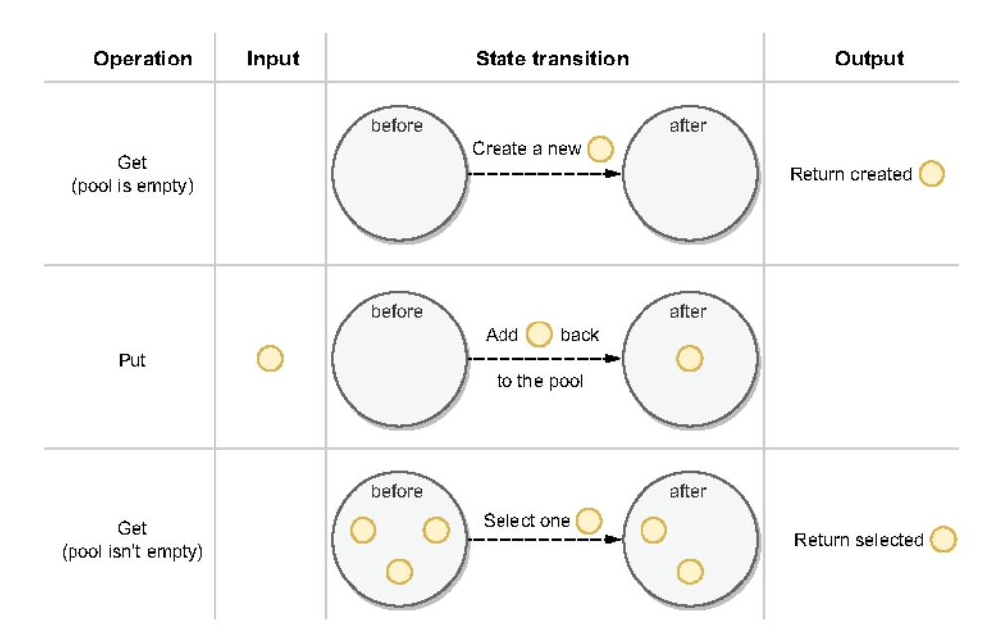

Figure 12.33 Get either creates a new object or returns one from the pool. Put returns the object to the pool.

When are objects drained from the pool? There's no specific method to do this: it relies on the GC. After each GC, objects from the pool are destroyed.

Back in our example, assuming that we can update the getResponse function to write data to a given slice instead of creating one, we can implement another version of the write method that relies on a pool:

```
var pool = symc.Pool{
    New: func() any (
                                        Creates a pool and sets
        return make([]byte, 1024)
                                       the factory function
3
                                                Gets a []byte from the
func write(w io.Writer) {
                                                pool or creates one
    buffer := pool.Get().([]byte)
    buffer = buffer[:0]
                                   Resets the buffer
    defer pool.Put(buffer)
                                                        Puts the buffer
                                                        back into the pool
    getResponse(buffer)
                          4
                                 | Writes the response
    _, _ = w.Write(buffer)
                                 to the provided buffer
}
```

We define a new pool using the sync. Pool struct and set the factory function to create a new []byte with a length of 1,024 elements. In the write function, we try to retrieve one buffer from the pool. If the pool is empty, the function creates a new buffer; otherwise, it selects an arbitrary buffer from the pool and returns it. One crucial step is to reset the buffer using buffer[:0], as this slice may already have been used. Then we defer the call to Put to put the slice back into the pool.

With this new version, calling write doesn't lead to creating a new []byte slice for every call. Instead, we can reuse existing allocated slices. In the worst-case scenario—for example, after a GC—the function will create a new buffer; however, the amortized allocation cost is reduced.

In summary, if we frequently allocate many objects of the same type, we can consider using <code>sync.Pool</code>. It is a set of temporary objects that can help us prevent reallocating the same kind of data repeatedly. And <code>sync.Pool</code> is safe for use by multiple goroutines simultaneously.

Next, let's discuss the concept of inlining to understand that this computer optimization is worth knowing about.

### 12.7 #97: Not relying on inlining

*Inlining* refers to replacing a function call with the body of the function. Nowadays, inlining is done automatically by compilers. Understanding the fundamentals of inlining can also be a way to optimize particular code paths of an application.

Let's see a concrete example of inlining with a simple sum function that sums two int types:

```
func main() {
    a := 3
    b := 2
    s := sum(a, b)
    println(s)
}
func sum(a int, b int) int {
    return a + b
}
Inlines the function
```

If we run go build using -gcflags, we access the decision made by the compiler regarding the sum function:

```
$ go build -gcflags "-m=2"
./main.go:10:6: can inline sum with cost 4 as:
    func(int, int) int { return a + b }
...
./main.go:6:10: inlining call to sum func(int, int) int { return a + b }
```

The compiler decided to inline the call to sum. Hence, the previous code is replaced by the following:

```
func main() {
    a := 3
    b := 2
    s := a + b
```

Inlining only works for functions with a certain complexity, also known as an *inlining budget*. Otherwise, the compiler will inform us that the function is too complex to be inlined:

```
./main.go:10:6: cannot inline foo: function too complex: cost 84 exceeds budget 80
```

Inlining has two main benefits. First, it removes the overhead of a function call (even though the overhead has been mitigated since Go 1.17 and register-based calling conventions). Second, it allows the compiler to proceed to further optimizations. For example, after inlining a function, the compiler can decide that a variable it was initially supposed to escape on the heap may stay on the stack.

The question is, if this optimization is applied automatically by the compiler, why should we care about it as Go developers? The answer lies in the concept of mid-stack inlining.

Mid-stack inlining is about inlining functions that call other functions. Before Go 1.9, only leaf functions were considered for inlining. Now, thanks to mid-stack inlining, the following foo function can also be inlined:

```
func main() {
    foo()
}

func foo() {
    x := 1
    bar(x)
```

Because the foo function isn't too complex, the compiler can inline its call:

```
func main() {
    x := 1
    bar(x)
}
Replaced with
the body of foo
```

Thanks to mid-stack inlining, as Go developers, we can now optimize an application using the concept of fast-path inlining to distinguish between fast and slow paths. Let's look at a concrete example released in the sync. Mutex implementation to understand how this works.

Before mid-stack inlining, the implementation of the Lock method was the following:

```
func (m *Mutex) Lock() {
   if atomic.CompareAndSwapInt32(&m.state, 0, mutexLocked) {
       // Mutex isn't locked
       if race.Enabled (
           race.Acquire(unsafe.Pointer(m))
       return
   }
   // Mutex is already locked
   var waitStartTime int64
   starving := false
   awoke := false
   iter := 0
   old := m.state
   for {
       // · · · ← Complex logic
   }
   if race.Enabled {
       race.Acquire(unsafe.Pointer(m))
}
```

We can distinguish two primary paths:

- If the mutex isn't locked (atomic.CompareAndSwapInt32 is true), fast path
- If the mutex is already locked (atomic.CompareAndSwapInt32 is false), slow path

However, regardless of the path taken, the function cannot be inlined because of its complexity. To use mid-stack inlining, the Lock method was refactored so that the slow path lives in a specific function:

```
func (m *Mutex) Lock() {
    if atomic.CompareAndSwapInt32(&m.state, 0, mutexLocked) {
        if race.Enabled {
            race.Acquire(unsafe.Pointer(m))
        }
        return
    }
    m.lockSlow()
```

```
awoke := false\niter := 0
old := m.state
for {
```

Thanks to this change, the Lock method can be inlined. The benefit is that a mutex that isn't already locked is now locked without paying the overhead of calling a function (speed improves around 5%). The slow path, when the mutex is already locked, didn't change. Previously it required one function call to execute this logic; it remains one function call, this time to lockSlow.

This optimization technique is about distinguishing between fast and slow paths. If a fast path can be inlined but not a slow one, we can extract the slow path inside a dedicated function. Hence, if the inlining budget isn't exceeded, our function is a candidate for inlining.

Inlining isn't just an invisible compiler optimization that we shouldn't care about. As seen in this section, understanding how inlining works and how to access the compiler's decision can be a road to optimization using the fast-path inlining technique. Extracting the slow path in a dedicated function prevents a function call if the fast path is executed.

The next section discusses common diagnostics tooling that can help us understand what should be optimized in our Go applications.

### 12.8 #98: Not using Go diagnostics tooling

Go offers a few excellent diagnostics tools to help us get insights into how an application performs. This section focuses on the most important ones: profiling and the execution tracer. Both tools are so important that they should be part of the core toolset of any Go developer who is interested in optimization. We'll discuss profiling first.

### 12.8.1 Profiling

Profiling provides insights into the execution of an application. It allows us to resolve performance issues, detect contention, locate memory leaks, and more. These insights can be collected via several profiles:

- CPU—Determines where an application spends its time
- Goroutine—Reports the stack traces of the ongoing goroutines
- Heap—Reports heap memory allocation to monitor current memory usage and check for possible memory leaks

- Mutex—Reports lock contentions to see the behaviors of the mutexes used in our code and whether an application spends too much time in locking calls
- Block—Shows where goroutines block waiting on synchronization primitives

Profiling is achieved via instrumentation using a tool called a profiler: in Go, pprof. First, let's understand how and when to enable pprof; then, we discuss the most critical profile types.

### ENABLING PPROF

There are several ways to enable pprof. For example, we can use the net/http/pprof package to serve the profiling data via HTTP:

```
package main\nimport {
    "fmt"
    "log"
    "net/http"
    _ "net/http/pprof"
```

Importing net/http/pprof leads to a side effect that allows us to reach the pprof URL, http://host/debug/pprof. Note that enabling pprof is safe even in production (https://go.dev/doc/diagnostics#profiling). The profiles that impact performance, such as CPU profiling, aren't enabled by default, nor do they run continuously: they are activated only for a specific period.

Now that we have seen how to expose a pprof endpoint, let's discuss the most common profiles.

### CPU PROFILING

The CPU profiler relies on the OS and signaling. When it is activated, the application asks the OS to interrupt it every 10 ms by default via a SIGPROF signal. When the application receives a SIGPROF, it suspends the current activity and transfers the execution to the profiler. The profiler collects data such as the current goroutine activity and aggregates execution statistics that we can retrieve. Then it stops, and the execution resumes until the next SIGPROF.

We can access the /debug/pprof/profile endpoint to activate CPU profiling. Accessing this endpoint executes CPU profiling for 30 seconds by default. For 30 seconds, our application is interrupted every 10 ms. Note that we can change these two default values: we can use the seconds parameter to pass to the endpoint how long the profiling should last (for example, /debug/pprof/profile?seconds=15), and we

can change the interruption rate (even to less than 10 ms). But in most cases, 10 ms should be enough, and in decreasing this value (meaning increasing the rate), we should be careful not to harm performance. After 30 seconds, we download the results of the CPU profiler.

### **CPU** profiling during benchmarks

We can also enable the CPU profiler using the -cpuprofile flag, such as when running a benchmark:

```
$ go test -bench=. -cpuprofile profile.out
```

This command produces the same type of file that can be downloaded via /debug/pprof/profile.

From this file, we can navigate to the results using go tool:

```
$ go tool pprof -http=:8080 <file>
```

This command opens a web UI showing the call graph. Figure 12.34 shows an example taken from an application. The larger the arrow, the more it was a hot path. We can then navigate into this graph and get execution insights.

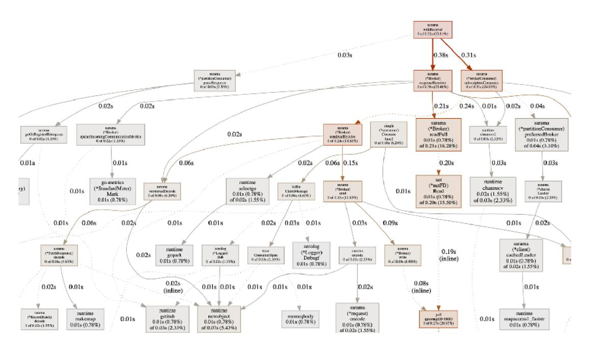

Figure 12.34 The call graph of an application during 30 seconds

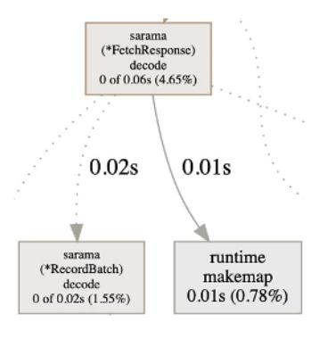

Figure 12.35 Example call graph

For example, the graph in figure 12.35 tells us that during 30 seconds, 0.06 seconds were spent in the decode method (\*FetchResponse receiver). Of these 0.06 seconds, 0.02 were spent in Record-Batch.decode and 0.01 in makemap (creating a map).

We can also access this kind of information from the web UI with different representations. For example, the Top view sorts the functions per execution time, and Flame Graph visualizes the execution time hierarchy. The UI can even display the expensive parts of the source code line by line.

**NOTE** We can also delve into profiling data via a command line. However, we focus on the web UI in this section.

Thanks to this data, we can get a general idea of how an application behaves:

- Too many calls to runtime.mallogc can mean an excessive number of small heap allocations that we can try to minimize.
- Too much time spent in channel operations or mutex locks can indicate excessive contention that is harming the application's performance.
- Too much time spent on syscall.Read or syscall.Write means the application spends a significant amount of time in Kernel mode. Working on I/O buffering may be an avenue for improvement.

These are the kinds of insights we can get from the CPU profiler. It's valuable to understand the hottest code path and identify bottlenecks. But it won't determine more than the configured rate because the CPU profiler is executed at a fixed pace (by default, 10 ms). To get finer-grained insights, we should use tracing, which we discuss later in this chapter.

**NOTE** We can also attach labels to the different functions. For example, imagine a common function called from different clients. To track the time spent for both clients, we can use pprof. Labels.

### HEAP PROFILING

Heap profiling allows us to get statistics about the current heap usage. Like CPU profiling, heap profiling is sample-based. We can change this rate, but we shouldn't be too granular because the more we decrease the rate, the more effort heap profiling will require to collect data. By default, samples are profiled at one allocation for every 512 KB of heap allocation.

If we reach /debug/pprof/heap/, we get raw data that can be hard to read. However, we can download a heap profile using debug/pprof/heap/?debug=0 and then open it with go tool (the same command as in the previous section) to navigate into the data using the web UI.

Figure 12.36 shows an example of a heap graph. Calling the MetadataResponse .decode method leads to allocating 1536 KB of heap data (which represents 6.32% of the total heap). However, 0 out of these 1536 KB were allocated by this function directly, so we need to inspect the second call. The Topic-Metadata.decode method allocated 512 KB out of the 1536 KB; the rest—1024 KB—were allocated in another method.

This is how we can navigate the call chain to understand what part of an application is responsible for most of the heap allocations. We can also look at different sample types:

- alloc\_objects—Total number of objects allocated
- alloc\_space—Total amount of memory allocated

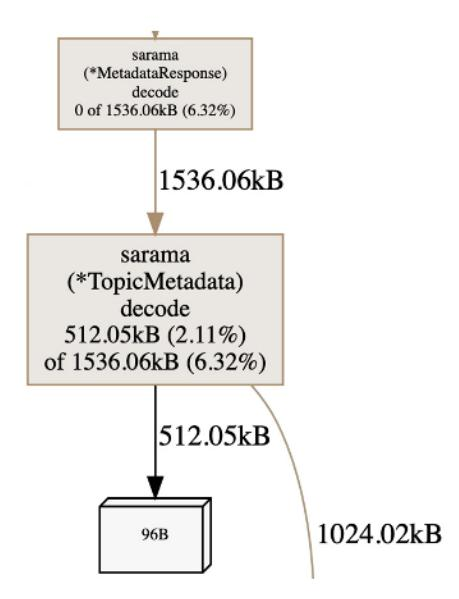

Figure 12.36 A heap graph

- inuse\_objects—Number of objects allocated and not yet released
- inuse\_space—Amount of memory allocated and not yet released

Another very helpful capability with heap profiling is tracking memory leaks. With a GC-based language, the usual procedure is the following:

- Trigger a GC.
- 2 Download heap data.
- 3 Wait for a few seconds/minutes.
- 4 Trigger another GC.
- 5 Download another heap data.
- 6 Compare.

Forcing a GC before downloading data is a way to prevent false assumptions. For example, if we see a peak of retained objects without running a GC first, we cannot be sure whether it's a leak or objects that the next GC will collect.

Using pprof, we can download a heap profile and force a GC in the meantime. The procedure in Go is the following:

- Go to /debug/pprof/heap?gc=1 (trigger the GC and download the heap profile).
- 2 Wait for a few seconds/minutes.
- 3 Go to /debug/pprof/heap?gc=1 again.
- 4 Use go tool to compare both heap profiles:

```
$ go tool pprof -http=:8080 -diff_base <file2> <file1>
```

Figure 12.37 shows the kind of data we can access. For example, the amount of heap memory held by the newTopicProducer method (top left) has decreased (-513 KB). In contrast, the amount held by updateMetadata (bottom right) has increased (+512 KB). Slow increases are normal. The second heap profile may have been calculated in the middle of a service call, for example. We can repeat this process or wait longer; the important part is to track steady increases in allocations of a specific object.

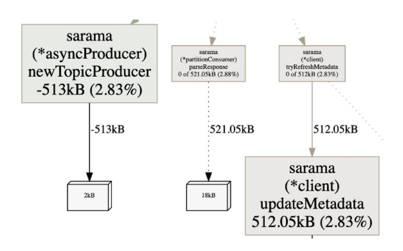

Figure 12.37 The differences between the two heap profiles

**NOTE** Another type of profiling related to the heap is allocs, which reports allocations. Heap profiling shows the current state of the heap memory. To get insights about past memory allocations since the application started, we can use allocations profiling. As discussed, because stack allocations are cheap, they aren't part of this profiling, which only focuses on the heap.

### GOROUTINES PROFILING

The goroutine profile reports the stack trace of all the current goroutines in an application. We can download a file using debug/pprof/goroutine/?debug=0 and use go tool again. Figure 12.38 shows the kind of information we can get.

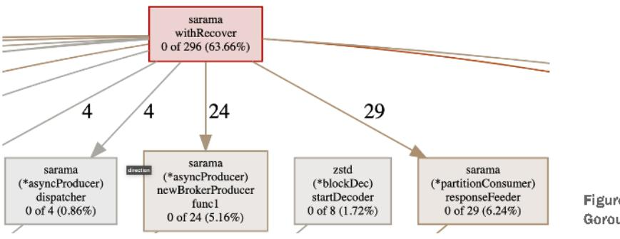

Figure 12.38 Goroutine graph

We can see the current state of the application and how many goroutines were created per function. In this case, with Recover has created 296 ongoing goroutines (63%), and 29 were related to a call to response Feeder.

This kind of information is also beneficial if we suspect goroutine leaks. We can look at goroutine profiler data to know which part of a system is the suspect.

### BLOCK PROFILING

The block profile reports where ongoing goroutines block waiting on synchronization primitives. Possibilities include

- Sending or receiving on an unbuffered channel
- Sending to a full channel
- Receiving from an empty channel
- Mutex contention
- Network or filesystem waits

Block profiling also records the amount of time a goroutine has been waiting and is accessible via debug/pprof/block. This profile can be extremely helpful if we suspect that performance is being harmed by blocking calls.

The block profile isn't enabled by default: we have to call runtime. SetBlock-ProfileRate to enable it. This function controls the fraction of goroutine blocking events that are reported. Once enabled, the profiler will keep collecting data in the background even if we don't call the debug/pprof/block endpoint. Let's be cautious if we want to set a high rate so we don't harm performance.

### Full goroutine stack dump

If we face a deadlock or suspect that goroutines are in a blocked state, the full goroutine stack dump (debug/pprof/goroutine/?debug=2) creates a dump of all the current goroutine stack traces. This can be helpful as a first analysis step. For example, the following dump shows a Sarama goroutine blocked for 1,420 minutes on a channel-receive operation:

```
goroutine 2494290 [chan receive, 1420 minutes]:
github.com/Shopify/sarama.(*syncProducer).SendMessages{0xc00071a090,
```

### MUTEX PROFILING

The last profile type is related to blocking but only regarding mutexes. If we suspect that our application spends significant time waiting for locking mutexes, thus harming execution, we can use mutex profiling. It's accessible via /debug/pprof/mutex.

This profile works in a manner similar to that for blocking. It's disabled by default: we have to enable it using runtime. SetMutexProfileFraction, which controls the fraction of mutex contention events reported.

Following are a few additional notes about profiling:

- We haven't mentioned the threadcreate profile because it's been broken since 2013 (https://github.com/golang/go/issues/6104).
- Be sure to enable only one profiler at a time: for example, do not enable CPU
  and heap profiling simultaneously. Doing so can lead to erroneous observations.
- pprof is extensible, and we can create our own custom profiles using pprof.
   Profile.

We have seen the most important profiles that we can enable to help us understand how an application performs and possible avenues for optimization. In general, enabling pprof is recommended, even in production, because in most cases it offers an excellent balance between its footprint and the amount of insight we can get from it. Some profiles, such as the CPU profile, lead to performance penalties but only during the time they are enabled.

Let's now look at the execution tracer.

### 12.8.2 Execution tracer

The execution tracer is a tool that captures a wide range of runtime events with go tool to make them available for visualization. It is helpful for the following:

- Understanding runtime events such as how the GC performs
- Understanding how goroutines execute
- Identifying poorly parallelized execution

Let's try it with an example given in mistake #56, "Thinking concurrency is always faster." We discussed two parallel versions of the merge sort algorithm. The issue with the first version was poor parallelization, leading to the creation of too many goroutines. Let's see how the tracer can help us in validating this statement.

We will write a benchmark for the first version and execute it with the -trace flag to enable the execution tracer:

```
$ go test -bench=. -v -trace=trace.out
```

**NOTE** We can also download a remote trace file using the /debug/pprof/trace?debug=0 pprof endpoint.

This command creates a trace out file that we can open using go tool:

```
$ go tool trace trace.out
2021/11/26 21:36:03 Parsing trace...
2021/11/26 21:36:31 Splitting trace...
2021/11/26 21:37:00 Opening browser. Trace viewer is listening on
    http://127.0.0.1:54518
```

The web browser opens, and we can click View Trace to see all the traces during a specific timeframe, as shown in figure 12.39. This figure represents about 150 ms. We can see multiple helpful metrics, such as the goroutine count and the heap size. The heap size grows steadily until a GC is triggered. We can also observe the activity of the Go

application per CPU core. The timeframe starts with user-level code; then a "stop the world" is executed, which occupies the four CPU cores for approximately 40 ms.

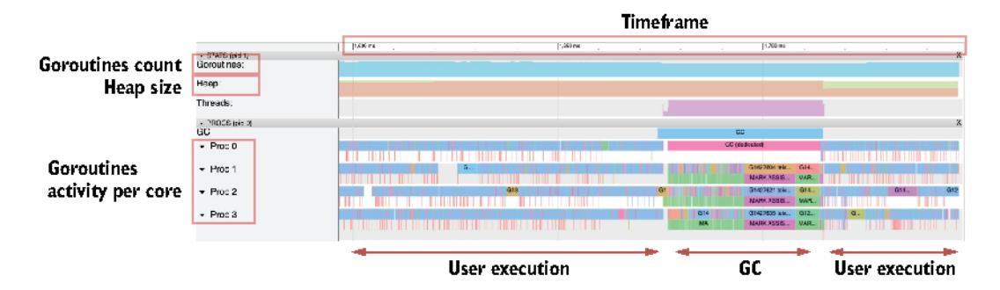

Figure 12.39 Showing goroutine activity and runtime events such as a GC phase

Regarding concurrency, we can see that this version uses all the available CPU cores on the machine. However, figure 12.40 zooms in on a portion of 1 ms. Each bar corresponds to a single goroutine execution. Having too many small bars doesn't look right: it means execution that is poorly parallelized.

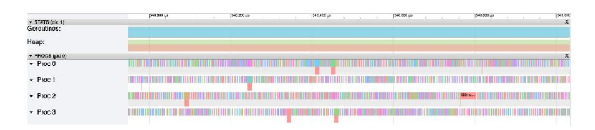

Figure 12.40 Too many small bars mean poorly parallelized execution.

Figure 12.41 zooms even closer to see how these goroutines are orchestrated. Roughly 50% of the CPU time isn't spent executing application code. The white spaces represent the time the Go runtime takes to spin up and orchestrate new goroutines.

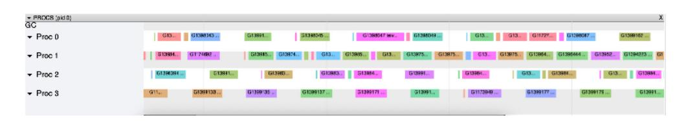

Figure 12.41 About 50% of CPU time is spent handling goroutine switches.

Let's compare this with the second parallel implementation, which was about an order of magnitude faster. Figure 12.42 again zooms to a 1 ms timeframe.

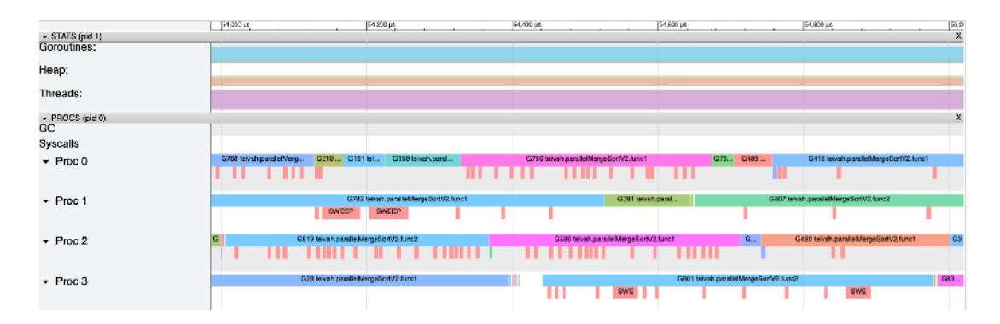

Figure 12.42 The number of white spaces has been significantly reduced, proving that the CPU is more fully occupied.

Each goroutine takes more time to execute, and the number of white spaces has been significantly reduced. Hence, the CPU is much more occupied executing application code than it was in the first version. Each millisecond of CPU time is spent more efficiently, explaining the benchmark differences.

Note that the granularity of the traces is per goroutine, not per function like CPU profiling. However, it's possible to define user-level tasks to get insights per function or group of functions using the runtime/trace package.

For example, imagine a function that computes a Fibonacci number and then writes it to a global variable using atomic. We can define two different tasks:

```
var v int64
ctx, fibTask := trace.NewTask(context.Background(), "fibonacci")
trace.WithRegion(ctx, "main", func() {
    v = fibonacci(10)
}

fibTask.End()
ctx, fibStore := trace.NewTask(ctx, "store")
trace.WithRegion(ctx, "main", func() {
    atomic.StoreInt64(&result, v)
})
fibStore.End()
Creates a
store task
```

Using 90 too1, we can get more precise information about how these two tasks perform. In the previous trace UI (figure 12.42), we can see the boundaries for each task per goroutine. In User-Defined Tasks, we can follow the duration distribution (see figure 12.43).

We see that in most cases, the fibonacci task is executed in less than 15 microseconds, whereas the store task takes less than 6309 nanoseconds.

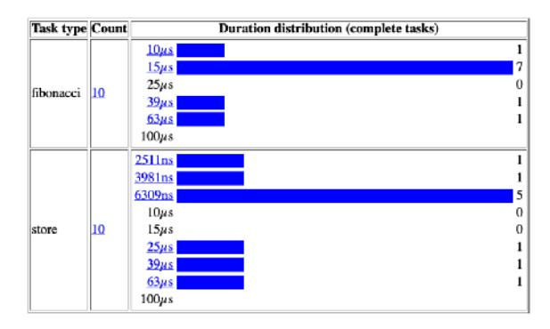

Figure 12.43 Distribution of user-level tasks

In the previous section, we discussed the kinds of information we can get from CPU profiling. What are the main differences compared to the data we can get from user-level traces?

- CPU profiling:
  - Sample-based.
  - Per function.
  - Doesn't go below the sampling rate (10 ms by default).
- User-level traces:
  - Not sample-based.
  - Per-goroutine execution (unless we use the runtime/trace package).
  - Time executions aren't bound by any rate.

In summary, the execution tracer is a powerful tool for understanding how an application performs. As we have seen with the merge sort example, we can identify poorly parallelized execution. However, the tracer's granularity remains per goroutine unless we manually use runtime/trace compared to a CPU profile, for example. We can use both profiling and the execution tracer to get the most out of the standard Go diagnostics tools when optimizing an application.

The next section discusses how the GC works and how to tune it.

### 12.9 #99: Not understanding how the GC works

The garbage collector (GC) is a critical piece of the Go language that simplifies the lives of developers. It allows us to track and free heap allocations that are no longer needed. Because we can't replace every heap allocation with a stack allocation, understanding how the GC works should be part of the Go developer's toolset to optimize applications.

### 12.9.1 Concepts

A GC keeps a tree of object references. The Go GC is based on the mark-and-sweep algorithm, which relies on two stages:

 Mark stage—Traverses all the objects of the heap and marks whether they are still in use  Sweep stage—Traverses the tree of references from the root and deallocates blocks of objects that are no longer referenced

When a GC runs, it first performs a set of actions that lead to *stopping the world* (two stop-the-worlds per GC, to be precise). That is, all the available CPU time is used to perform the GC, putting our application code on hold. Following these steps, it starts the world again, resuming our application but also running a concurrent phase. For that reason, the Go GC is called *concurrent mark-and-sweep*: it aims to reduce the number of stop-the-world operations per GC cycle and mostly run concurrently alongside our application.

The Go GC also includes a way to free memory after consumption peak. Imagine that our application is based on two phases:

- An init phase that leads to frequent allocations and a large heap
- A runtime phase with moderate allocations and a small heap

How will Go tackle the fact that the large heap is only helpful when the application starts, not after that? This is handled as part of the GC with a so-called *periodic scavenger*. After a certain time, the GC detects that such a large heap is no longer necessary, so it frees some memory and returns it to the OS.

**NOTE** If the scavenger isn't quick enough, we can manually force memory to be returned to the OS using debug. FreeOSMemory().

The important question is, when will a GC cycle run? Compared to other languages such as Java, the Go configuration remains reasonably simple. It relies on a single environment variable: GOGC. This variable defines the percentage of the heap growth since the last GC before triggering another GC; the default value is 100%.

Let's look at a concrete example to be sure we understand. Let's assume a GC just got triggered and the current heap size is 128 MB. If GOGC=100, the next GC is triggered when the heap size reaches 256 MB. A GC is executed by default every time the heap size doubles. Also, if a GC hasn't been executed during the last 2 minutes, Go will force one to run.

If we profile our application with production loads, we can fine-tune GOGC:

- Reducing it will cause the heap to grow more slowly, increasing the pressure on the GC.
- Conversely, bumping it will cause the heap to grow faster, reducing the pressure on the GC.

### **GC** traces

We can print the GC traces by setting the GODEBUG environment variable, such as while running a benchmark:

```
$ GODEBUG=gctrace=1 go test -bench=. -v
```

Enabling getrace writes a trace to stderr each time the GC runs.

Let's go through some concrete examples to understand how the GC behaves in the event of a load increase.

### 12.9.2 Examples

Let's imagine that we expose some public services to users. During peak time at 12:00 PM, 1 million users connect. However, it's a steady increase in connected users. Figure 12.44 represents the average heap size and when a GC will be triggered if we keep GOGC set to 100.

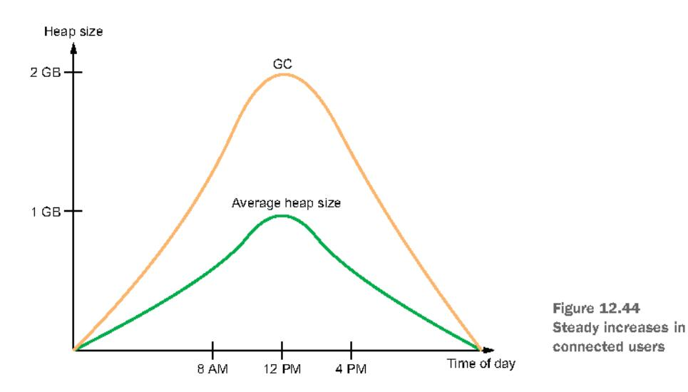

Because GOGC is set to 100, the GC is triggered every time the heap size doubles. In these conditions, because the number of users steadily increases, we should face an acceptable number of GCs throughout the day (figure 12.45).

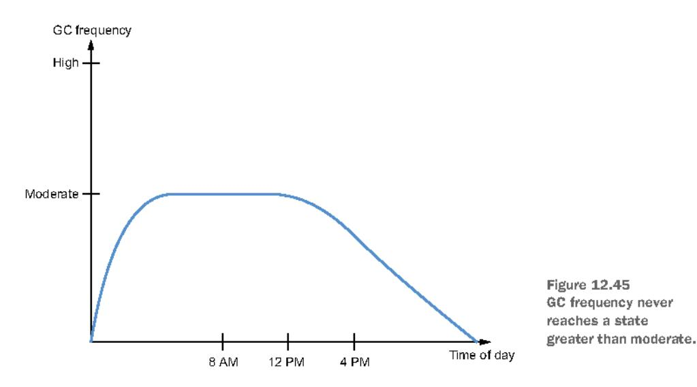

We should have a moderate number of GC cycles at the beginning of the day. When we reach 12:00 PM, when the number of users starts to decrease, the number of GC cycles should also decrease steadily. In such a scenario, keeping GOGC to 100 should be fine.

Now, let's consider a second scenario where most of the 1 million users connect in less than an hour; see figure 12.46. At 8:00 AM, the average heap size grows rapidly, reaching its peak in about an hour.

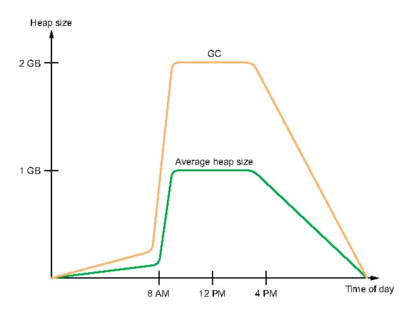

Figure 12.46 A sudden increase in users

The frequency of the GC cycles is heavily impacted during this hour, as shown in figure 12.47. Because of the significant and sudden bump of the heap, we face frequent GC cycles during a short period. Even though the Go GC is concurrent, this situation will lead to a significant number of stop-the-world periods and can cause impacts such as increasing the average latency seen by users.

In this case, we should consider bumping GOGC to a higher value to reduce the pressure on the GC. Note that increasing GOGC doesn't lead to linear benefits: the bigger the heap, the longer it will take to clean. Hence, using production load, we should be careful when configuring GOGC.

In exceptional conditions with a bump that is even more significant, tweaking GOGC may not be enough. For example, let's say that instead of going from 0 to 1 million users in an hour, we do so in a few seconds. During these seconds, the number of GCs may reach a critical state, causing the application to perform very poorly.

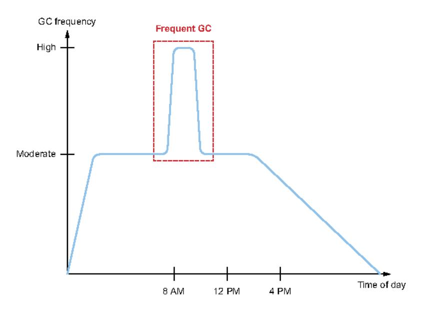

Figure 12.47 During one hour, we observe a high frequency of GCs.

If we know about the heap peak, we can use a trick that forces a large allocation of memory to improve the stability of the heap. For example, we can force the allocation of 1 GB using a global variable in main.go:

```
var min = make([]byte, 1_000_000_000) // 1 GB
```

What's the point of such an allocation? If GOGC is kept at 100, instead of triggering a GC every time the heap doubles (which, again, happens extremely frequently during these few seconds), Go will only trigger a GC when the heap reaches 2 GB. This should reduce the number of GC cycles triggered when all the users connect, reducing the impact on average latency.

We could argue that when the heap size decreases, this trick will waste a lot of memory. But that isn't the case. On most OSs, allocating this min variable won't make our application consume 1 GB of memory. Calling make results in a system call to mmap(), which leads to a lazy allocation. For example, on Linux, memory is virtually addressed and mapped through page tables. Using mmap() allocates 1 GB of memory in the virtual address space, not the physical space. Only a read or a write will cause a page fault leading to an actual physical memory allocation. So even if the application starts without any connected clients, it won't consume 1 GB of physical memory.

**NOTE** We can validate this behavior using tools such as ps.

It's essential to understand how the GC behaves in order to optimize it. As Go developers, we can use GOGC to configure when the next GC cycle is triggered. In most

cases, keeping it at 100 should be enough. However, if our application may face request peaks leading to frequent GC and latency impacts, we can increase this value. Finally, in the event of an exceptional request peak, we can consider using the trick of keeping the virtual heap size to a minimum.

The last section of this chapter discusses the impacts of running Go in Docker and Kubernetes.

### 12.10 #100: Not understanding the impacts of running Go in Docker and Kubernetes

Writing services with Go is the most common use, according to the 2021 Go developer survey (https://go.dev/blog/survey2021-results). Meanwhile, Kubernetes is the most widely used platform to deploy these services. It's important to understand the implications of running Go in Docker and Kubernetes, to prevent common situations such as CPU throttling.

We mentioned in mistake #56, "Thinking concurrency is always faster," that the GOMAXPROCS variable defines the limit of OS threads in charge of executing user-level code simultaneously. By default, it's set to the number of OS-apparent logical CPU cores. What does this mean in the context of Docker and Kubernetes?

Let's assume that our Kubernetes cluster is composed of eight-core nodes. When a container is deployed in Kubernetes, we can define a CPU limit to ensure that an application won't consume all the host's resources. For example, the following configuration limits the use of CPU to 4,000 millicpu (or millicores), so four CPU cores:

```
spec:
containers:
- name: myapp\nimage: myapp
resources:
limits:
cpu: 4000m
```

We may assume that when our application is deployed, GOMAXPROCS will be based on these limits and hence will have a value of 4. But that won't be the case; it is set to the number of logical cores on the host: 8. So, what's the impact?

Kubernetes uses Completely Fair Scheduler (CFS) as a process scheduler. CFS is also used to enforce CPU limits for Pod resources. When administrating a Kubernetes cluster, an administrator can configure these two parameters:

- cpu.cfs\_period\_us (global setting)
- cpu.cfs\_quota\_us (setting per Pod)

The former defines a period and the latter a quota. By default, the period is set to 100 ms. Meanwhile, the default quota value is how much CPU time the application can consume in 100 ms. The limit is set to four cores, which means 400 ms ( $4 \times 100$  ms). Therefore, CFS will ensure that our application never consumes more than 400 ms of CPU time for 100 ms.

Let's imagine a scenario where multiple goroutines are currently being executed on four different threads. Each thread is scheduled on a different core (1, 3, 4, and 8); see figure 12.48.

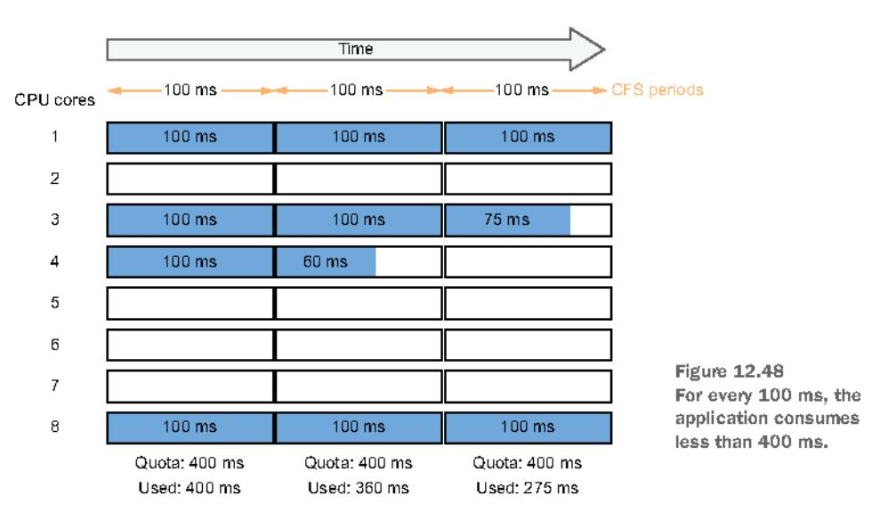

During the first period of 100 ms, four threads are busy, so we consume 400 out of 400 ms: 100% of the quota. During the second period, we consume 360 out of 400 ms, and so on. Everything is fine because the application consumes less than the quota.

However, let's remember that GOMAXPROCS is set to 8. Therefore, in the worst-case scenario, we can have eight threads, each scheduled on a different core (figure 12.49).

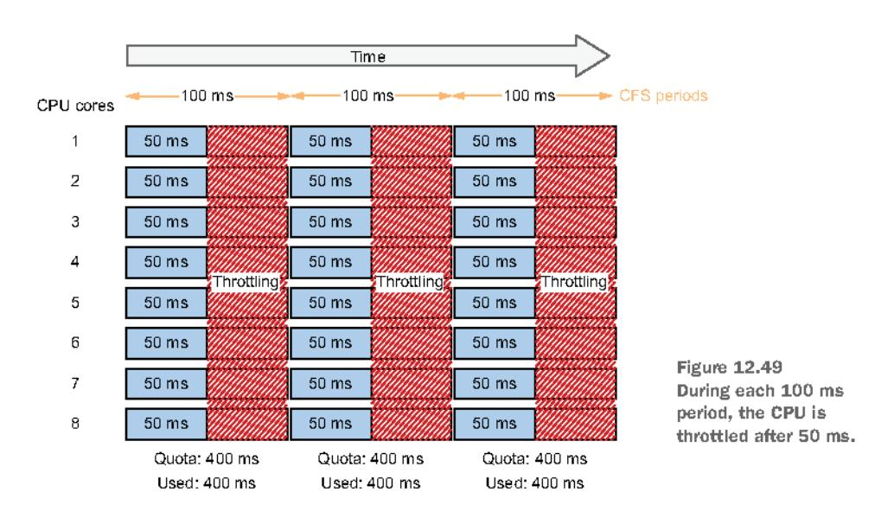

For every 100 ms, the quota is set to 400 ms. If the eight threads are busy executing goroutines, after 50 ms, we reach the quota of 400 ms ( $8 \times 50$  ms = 400 ms). What will be the consequence? CFS will throttle the CPU resource. Hence, no more CPU resources will be allocated until the start of another period. In other words, our application will be on hold for 50 ms.

For example, a service with an average latency of 50 ms can take up to 150 ms to complete. This is a possible 300% penalty on the latency.

So, what's the solution? First, keep an eye on Go issue 33803 (https://github.com/golang/go/issues/33803). Perhaps in a future version of Go, GOMAXPROCS will be CFS-aware.

A solution for today is to rely on a library made by Uber called automaxprocs (github.com/uber-go/automaxprocs). We can use this library by adding a blank import to go.uber.org/automaxprocs in main.go; it will automatically set GOMAXPROCS to match the Linux container CPU quota. In the previous example, GOMAXPROCS would be set to 4 instead of 8, so we wouldn't be able to reach a state where the CPU is throttled.

In summary, let's remember that currently, Go isn't CFS-aware. GOMAXPROCS is based on the host machine rather than on the defined CPU limits. Consequently, we can reach a state where the CPU is throttled, leading to long pauses and substantial effects such as a significant latency increase. Until Go becomes CFS-aware, one solution is to rely on automaxprocs to automatically set GOMAXPROCS to the defined quota.

### Summary

- Understanding how to use CPU caches is important for optimizing CPU-bound applications because the L1 cache is about 50 to 100 times faster than the main memory.
- Being conscious of the cache line concept is critical to understanding how to organize data in data-intensive applications. A CPU doesn't fetch memory word by word; instead, it usually copies a memory block to a 64-byte cache line. To get the most out of each individual cache line, enforce spatial locality.
- Making code predictable for the CPU can also be an efficient way to optimize certain functions. For example, a unit or constant stride is predictable for the CPU, but a non-unit stride (for example, a linked list) isn't predictable.
- To avoid a critical stride, hence utilizing only a tiny portion of the cache, be aware that caches are partitioned.
- Knowing that lower levels of CPU caches aren't shared across all the cores helps avoid performance-degrading patterns such as false sharing while writing concurrency code. Sharing memory is an illusion.
- Use instruction-level parallelism (ILP) to optimize specific parts of your code to allow a CPU to execute as many parallel instructions as possible. Identifying data hazards is one of the main steps.
- You can avoid common mistakes by remembering that in Go, basic types are aligned with their own size. For example, keep in mind that reorganizing the

Final words 355

fields of a struct by size in descending order can lead to more compact structs (less memory allocation and potentially a better spatial locality).

- Understanding the fundamental differences between heap and stack should also be part of your core knowledge when optimizing a Go application. Stack allocations are almost free, whereas heap allocations are slower and rely on the GC to clean the memory.
- Reducing allocations is also an essential aspect of optimizing a Go application. This can be done in different ways, such as designing the API carefully to prevent sharing up, understanding the common Go compiler optimizations, and using sync.Pool.
- Use the fast-path inlining technique to efficiently reduce the amortized time to call a function.
- Rely on profiling and the execution tracer to understand how an application performs and the parts to optimize.
- Understanding how to tune the GC can lead to multiple benefits such as handling sudden load increases more efficiently.
- To help avoid CPU throttling when deployed in Docker and Kubernetes, keep in mind that Go isn't CFS-aware.

### Final words

Congratulations for reaching the end of 100 Go Mistakes and How to Avoid Them. I genuinely hope that you enjoyed reading this book and that it will help you with your personal and/or professional projects.

Remember that making mistakes is part of the learning process, and as I highlighted in the preface, it was also a significant source of inspiration for this book. What matters, in the end, is our capacity to learn from them.

If you want to continue the discussion, you can follow me on Twitter: @teivah.
