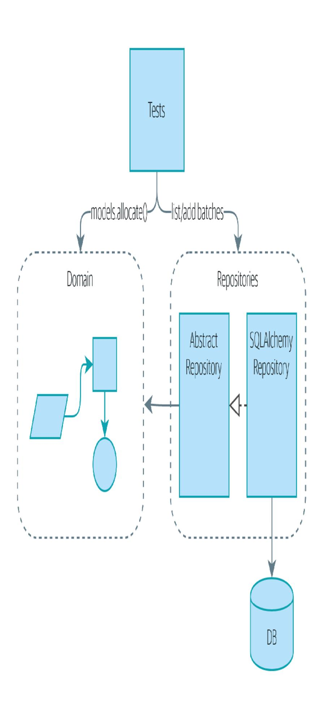
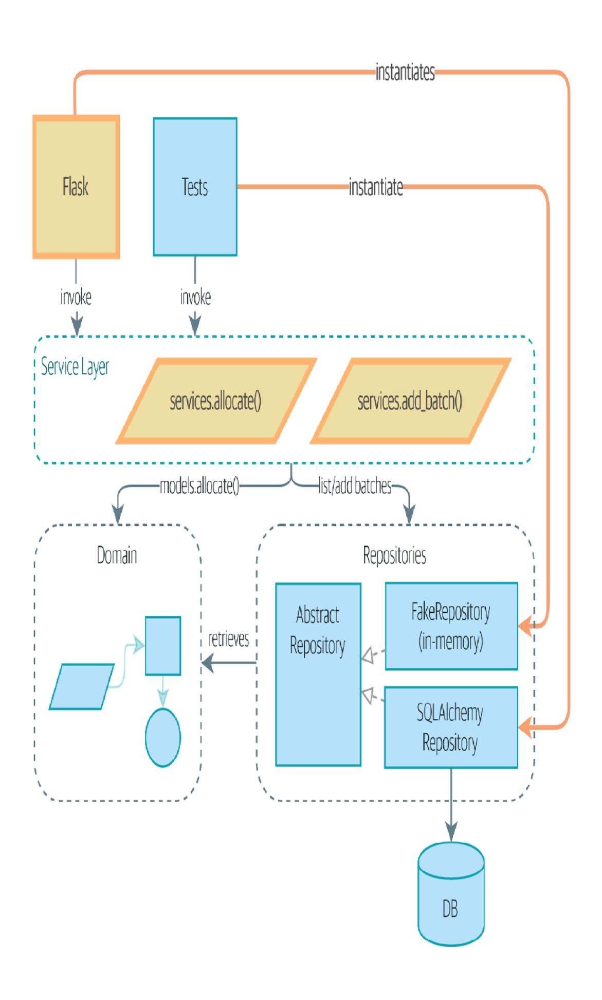
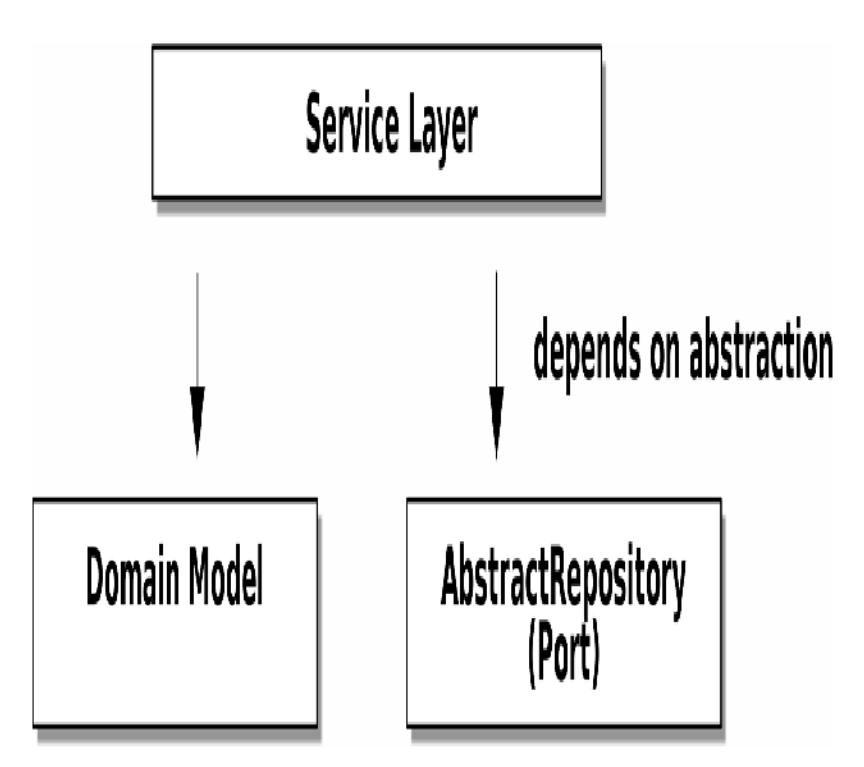
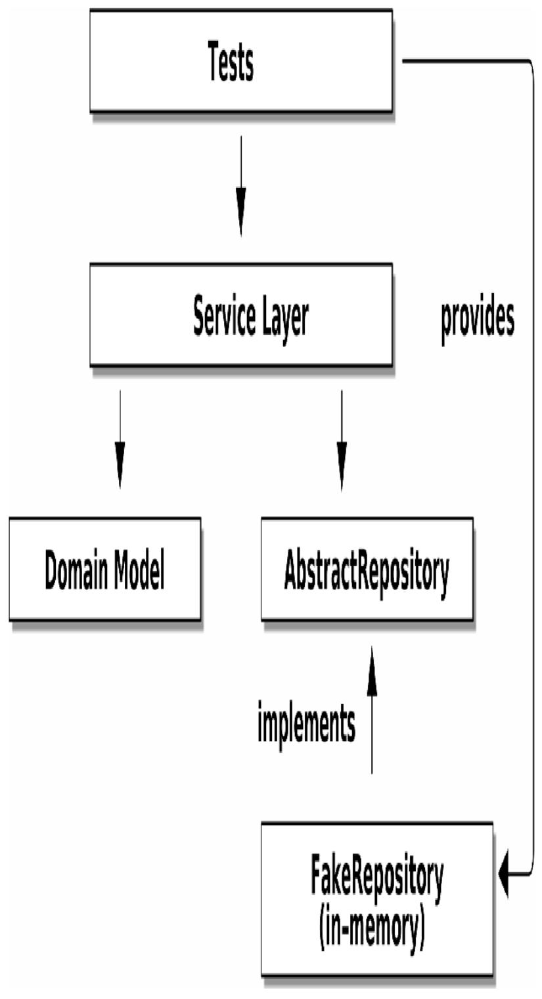
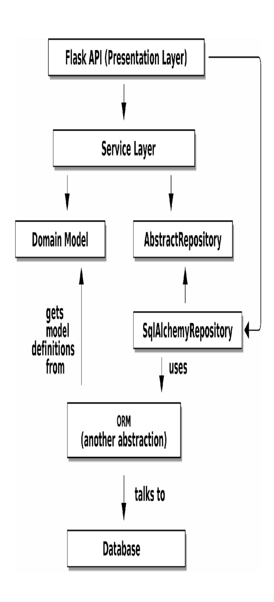

# Chapter 4: Our First Use Case: Flask API and Service Layer

Back to our allocations project! Figure 4-1 shows the point we reached at the end of Chapter 2, which covered the Repository pattern.



Figure 4-1. Before: we drive our app by talking to repositories and the domain model

In this chapter, we discuss the differences between orchestration logic, business logic, and interfacing code, and we introduce the *Service Layer* pattern to take care of orchestrating our workflows and defining the use cases of our system.

We'll also discuss testing: by combining the Service Layer with our repository abstraction over the database, we're able to write fast tests, not just of our domain model but of the entire workflow for a use case.

Figure 4-2 shows what we're aiming for: we're going to add a Flask API that will talk to the service layer, which will serve as the entrypoint to our domain model. Because our service layer depends on the AbstractRepository, we can unit test it by using FakeRepository but run our production code using SqlAlchemyRepository.



Figure 4-2. The service layer will become the main way into our app

In our diagrams, we are using the convention that new components are highlighted with bold text/lines (and yellow/orange color, if you're reading a digital version).

```
TIP

The code for this chapter is in the chapter_04_service_layer branch on GitHub:

git clone https://github.com/cosmicpython/code.git
cd code
git checkout chapter_04_service_layer
# or to code along, checkout Chapter 2:
git checkout chapter_02_repository
```

## Connecting Our Application to the Real World

Like any good agile team, we're hustling to try to get an MVP out and in front of the users to start gathering feedback. We have the core of our domain model and the domain service we need to allocate orders, and we have the repository interface for permanent storage.

Let's plug all the moving parts together as quickly as we can and then refactor toward a cleaner architecture. Here's our plan:

1. Use Flask to put an API endpoint in front of our allocate domain service. Wire up the database session and our repository. Test it with an end-to-end test and some quick-and-dirty SQL to prepare test data.

- 2. Refactor out a service layer that can serve as an abstraction to capture the use case and that will sit between Flask and our domain model. Build some service-layer tests and show how they can use FakeRepository.
- 3. Experiment with different types of parameters for our service layer functions; show that using primitive data types allows the service layer's clients (our tests and our Flask API) to be decoupled from the model layer.

### A First End-to-End Test

No one is interested in getting into a long terminology debate about what counts as an end-to-end (E2E) test versus a functional test versus an acceptance test versus an integration test versus a unit test. Different projects need different combinations of tests, and we've seen perfectly successful projects just split things into "fast tests" and "slow tests."

For now, we want to write one or maybe two tests that are going to exercise a "real" API endpoint (using HTTP) and talk to a real database. Let's call them *end-to-end tests* because it's one of the most self-explanatory names.

The following shows a first cut:

A first API test (test api.py)

```
@pytest.mark.usefixtures('restart_api')
def test_api_returns_allocation(add_stock):
    sku, othersku = random_sku(), random_sku('other')
    earlybatch = random_batchref(1)
    laterbatch = random_batchref(2)
    otherbatch = random_batchref(3)
```

```
add_stock([
          (laterbatch, sku, 100, '2011-01-02'),
          (earlybatch, sku, 100, '2011-01-01'),
          (otherbatch, othersku, 100, None),
])
data = {'orderid': random_orderid(), 'sku': sku, 'qty': 3}\nurl = config.get_api_url()
```

- random\_sku(), random\_batchref(), and so on are little helper functions that generate randomized characters by using the uuid module. Because we're running against an actual database now, this is one way to prevent various tests and runs from interfering with each other.
- add\_stock is a helper fixture that just hides away the details of manually inserting rows into the database using SQL. We'll show a nicer way of doing this later in the chapter.
- config.py is a module in which we keep configuration information.

Everyone solves these problems in different ways, but you're going to need some way of spinning up Flask, possibly in a container, and of talking to a Postgres database. If you want to see how we did it, check out Appendix B.

## The Straightforward Implementation

Implementing things in the most obvious way, you might get something like this:

First cut of Flask app (flask app.py)

```
from flask import Flask, jsonify, request
from sqlalchemy import create engine
from sqlalchemy.orm import sessionmaker
import config
import model
import orm
import repository
orm.start_mappers()
get_session = sessionmaker(bind=create_engine(config.get_postgres_uri()))
app = Flask(__name__)
@app.route("/allocate", methods=['POST'])
def allocate endpoint():
    session = get_session()
    batches = repository.SqlAlchemyRepository(session).list()
    line = model.OrderLine(
        request.json['orderid'],
        request.json['sku'],
        request.json['qty'],
    )
    batchref = model.allocate(line, batches)
    return jsonify({'batchref': batchref}), 201
```

So far, so good. No need for too much more of your "architecture astronaut" nonsense, Bob and Harry, you may be thinking.

But hang on a minute—there's no commit. We're not actually saving our allocation to the database. Now we need a second test, either one that will inspect the database state after (not very black-boxy), or maybe one that checks that we can't allocate a second line if a first should have already depleted the batch:

Test allocations are persisted (test\_api.py)

```
@pytest.mark.usefixtures('restart_api')
def test_allocations_are_persisted(add_stock):
    sku = random sku()
    batch1, batch2 = random_batchref(1), random_batchref(2)
    order1, order2 = random_orderid(1), random_orderid(2)
    add stock([
        (batch1, sku, 10, '2011-01-01'),
       (batch2, sku, 10, '2011-01-02'),
    1)
    line1 = {'orderid': order1, 'sku': sku, 'qty': 10}
   line2 = {'orderid': order2, 'sku': sku, 'qty': 10}
    url = config.get_api_url()
    # first order uses up all stock in batch 1
    r = requests.post(f'{url}/allocate', json=line1)
    assert r.status code == 201
    assert r.json()['batchref'] == batch1
    # second order should go to batch 2
    r = requests.post(f'{url}/allocate', json=line2)
    assert r.status_code == 201
    assert r.json()['batchref'] == batch2
```

Not quite so lovely, but that will force us to add the commit.

## Error Conditions That Require Database Checks

If we keep going like this, though, things are going to get uglier and uglier.

Suppose we want to add a bit of error handling. What if the domain raises an error, for a SKU that's out of stock? Or what about a SKU that doesn't even exist? That's not something the domain even knows about, nor should it. It's more of a sanity check that we should

implement at the database layer, before we even invoke the domain service.

Now we're looking at two more end-to-end tests:

Yet more tests at the E2E layer (test api.py)

```
@pytest.mark.usefixtures('restart_api')
def test_400_message_for_out_of_stock(add_stock):                                    
    sku, small_batch, large_order = random_sku(), random_batchref(),
random orderid()
    add stock([
        (smalL_batch, sku, 10, '2011-01-01'),
    1)
    data = {'orderid': large_order, 'sku': sku, 'qty': 20}
    url = config.get_api_url()
    r = requests.post(f'{url}/allocate', json=data)
    assert r.status_code == 400
    assert r.json()['message'] = f'Out of stock for sku {sku}'
@pytest.mark.usefixtures('restart_api')
def test_400_message_for_invalid_sku(): @
    unknown_sku, orderid = random_sku(), random_orderid()
    data = {'orderid': orderid, 'sku': unknown_sku, 'qty': 20}
    url = config.get_api_url()
    r = requests.post(f'{url}/allocate', json=data)
    assert r.status code == 400
    assert r.json()['message'] = f'Invalid sku {unknown_sku}'
```

- In the first test, we're trying to allocate more units than we have in stock.
- In the second, the SKU just doesn't exist (because we never called add\_stock), so it's invalid as far as our app is concerned.

And sure, we could implement it in the Flask app too:

```
def is_valid_sku(sku, batches):
   return sku in {b.sku for b in batches}
@app.route("/allocate", methods=['POST'])
def allocate_endpoint():
   session = get_session()
   batches = repository.SqlAlchemyRepository(session).list()
   line = model.OrderLine(
        request.json['orderid'],
       request.json['sku'],
       request.json['qty'],
   )
   if not is_valid_sku(line.sku, batches):
        return jsonify({'message': f'Invalid sku {line.sku}'}), 400
   try:
        batchref = model.allocate(line, batches)
   except model.OutOfStock as e:
        return jsonify({'message': str(e)}), 400
   session.commit()
   return jsonify({'batchref': batchref}), 201
```

But our Flask app is starting to look a bit unwieldy. And our number of E2E tests is starting to get out of control, and soon we'll end up with an inverted test pyramid (or "ice-cream cone model," as Bob likes to call it).

## Introducing a Service Layer, and Using FakeRepository to Unit Test It

If we look at what our Flask app is doing, there's quite a lot of what we might call *orchestration*—fetching stuff out of our repository,

validating our input against database state, handling errors, and committing in the happy path. Most of these things don't have anything to do with having a web API endpoint (you'd need them if you were building a CLI, for example; see Appendix C), and they're not really things that need to be tested by end-to-end tests.

It often makes sense to split out a service layer, sometimes called an orchestration layer or a use-case layer.

Do you remember the FakeRepository that we prepared in Chapter 3?

Our fake repository, an in-memory collection of batches (test services.py)

```
class FakeRepository(repository.AbstractRepository):

    def __init__(self, batches):
        self._batches = set(batches)

    def add(self, batch):
        self._batches.add(batch)

    def get(self, reference):
        return next(b for b in self._batches if b.reference == reference)

    def list(self):
        return list(self._batches)
```

Here's where it will come in useful; it lets us test our service layer with nice, fast unit tests:

Unit testing with fakes at the service layer (test services.py)

```
def test_returns_allocation():
    line = model.OrderLine("o1", "COMPLICATED-LAMP", 10)
    batch = model.Batch("b1", "COMPLICATED-LAMP", 100, eta=None)
    repo = FakeRepository([batch])
```

- FakeRepository holds the Batch objects that will be used by our test.
- Our services module (services.py) will define an allocate() service-layer function. It will sit between our allocate\_endpoint() function in the API layer and the allocate() domain service function from our domain model. 1
- We also need a FakeSession to fake out the database session, as shown in the following code snippet.

A fake database session (test\_services.py)

```
class FakeSession():
    committed = False

    def commit(self):
        self.committed = True
```

This fake session is only a temporary solution. We'll get rid of it and make things even nicer soon, in Chapter 6. But in the meantime the fake

.commit() lets us migrate a third test from the E2E layer:

A second test at the service layer (test\_services.py)

```
def test_commits():
    line = model.OrderLine('o1', 'OMINOUS-MIRROR', 10)
    batch = model.Batch('b1', 'OMINOUS-MIRROR', 100, eta=None)
    repo = FakeRepository([batch])
    session = FakeSession()

services.allocate(line, repo, session)
    assert session.committed is True
```

### A Typical Service Function

We'll write a service function that looks something like this:

Basic allocation service (services.py)

```
class InvalidSku(Exception):
    pass

def is_valid_sku(sku, batches):
    return sku in {b.sku for b in batches}

def allocate(line: OrderLine, repo: AbstractRepository, session) -> str:
    batches = repo.list()
```

Typical service-layer functions have similar steps:

• We fetch some objects from the repository.

- We make some checks or assertions about the request against the current state of the world.
- **3** We call a domain service.
- If all is well, we save/update any state we've changed.

That last step is a little unsatisfactory at the moment, as our service layer is tightly coupled to our database layer. We'll improve that in Chapter 6 with the Unit of Work pattern.

#### DEPEND ON ABSTRACTIONS

Notice one more thing about our service-layer function:

```
def allocate(line: OrderLine, repo: AbstractRepository, session) -> str:
```

It depends on a repository. We've chosen to make the dependency explicit, and we've used the type hint to say that we depend on AbstractRepository. This means it'll work both when the tests give it a FakeRepository and when the Flask app gives it a SqlAlchemyRepository.

If you remember "The Dependency Inversion Principle", this is what we mean when we say we should "depend on abstractions." Our *high-level module*, the service layer, depends on the repository abstraction. And the *details* of the implementation for our specific choice of persistent storage also depend on that same abstraction. See Figures 4-3 and 4-4.

See also in  $\underline{\mathsf{Appendix}\,\mathsf{C}}$  a worked example of swapping out the  $\mathit{details}$  of which persistent storage system to use while leaving the abstractions intact.

But the essentials of the service layer are there, and our Flask app now looks a lot cleaner:

Flask app delegating to service layer (flask\_app.py)

```
@app.route("/allocate", methods=['POST'])
def allocate_endpoint():
    session = get_session()
```

```
line = model.OrderLine(
    request.json['orderid'],
```

- We instantiate a database session and some repository objects.
- We extract the user's commands from the web request and pass them to a domain service.
- **8** We return some JSON responses with the appropriate status codes.

The responsibilities of the Flask app are just standard web stuff: perrequest session management, parsing information out of POST parameters, response status codes, and JSON. All the orchestration logic is in the use case/service layer, and the domain logic stays in the domain.

Finally, we can confidently strip down our E2E tests to just two, one for the happy path and one for the unhappy path:

E2E tests only happy and unhappy paths (test\_api.py)

```
@pytest.mark.usefixtures('restart_api')
def test_happy_path_returns_201_and_allocated_batch(add_stock):
    sku, othersku = random_sku(), random_sku('other')
    earlybatch = random_batchref(1)
    laterbatch = random_batchref(2)
    otherbatch = random_batchref(3)
```

```
add_stock([
        (laterbatch, sku, 100, '2011-01-02'),
        (earlybatch, sku, 100, '2011-01-01'),
        (otherbatch, othersku, 100, None),
    1)
    data = {'orderid': random_orderid(), 'sku': sku, 'qty': 3}
    url = config.get_api_url()
    r = requests.post(f'{url}/allocate', json=data)
    assert r.status_code == 201
    assert r.json()['batchref'] == earlybatch
@pytest.mark.usefixtures('restart_api')
def test_unhappy_path_returns_400_and_error_message():
    unknown_sku, orderid = random_sku(), random_orderid()
    data = {'orderid': orderid, 'sku': unknown_sku, 'qty': 20}
    url = config.get_api_url()
    r = requests.post(f'{url}/allocate', json=data)
    assert r.status_code == 400
    assert r.json()['message'] = f'Invalid sku {unknown_sku}'
```

We've successfully split our tests into two broad categories: tests about web stuff, which we implement end to end; and tests about orchestration stuff, which we can test against the service layer in memory.

#### EXERCISE FOR THE READER

Now that we have an allocate service, why not build out a service for deallocate? We've added an E2E test and a few stub service-layer tests for you to get started on GitHub.

If that's not enough, continue into the E2E tests and <code>flask\_app.py</code>, and refactor the Flask adapter to be more RESTful. Notice how doing so doesn't require any change to our service layer or domain layer!

#### TIP

If you decide you want to build a read-only endpoint for retrieving allocation info, just do "the simplest thing that can possibly work," which is repo.get() right in the Flask handler. We'll talk more about reads versus writes in Chapter 12.

## Why Is Everything Called a Service?

Some of you are probably scratching your heads at this point trying to figure out exactly what the difference is between a domain service and a service layer.

We're sorry—we didn't choose the names, or we'd have much cooler and friendlier ways to talk about this stuff.

We're using two things called a *service* in this chapter. The first is an *application service* (our service layer). Its job is to handle requests from the outside world and to *orchestrate* an operation. What we mean is that the service layer *drives* the application by following a bunch of simple steps:

- Get some data from the database
- Update the domain model

### Persist any changes

This is the kind of boring work that has to happen for every operation in your system, and keeping it separate from business logic helps to keep things tidy.

The second type of service is a *domain service*. This is the name for a piece of logic that belongs in the domain model but doesn't sit naturally inside a stateful entity or value object. For example, if you were building a shopping cart application, you might choose to build taxation rules as a domain service. Calculating tax is a separate job from updating the cart, and it's an important part of the model, but it doesn't seem right to have a persisted entity for the job. Instead a stateless TaxCalculator class or a calculate\_tax function can do the job.

## Putting Things in Folders to See Where It All Belongs

As our application gets bigger, we'll need to keep tidying our directory structure. The layout of our project gives us useful hints about what kinds of object we'll find in each file.

Here's one way we could organize things:

Some subfolders

```
.
— config.py
— domain ①
| — __init__.py
| — model.py
```

```
– service_layer 🛭 🛭 🥹
   — __init__.py

— services.py

– adapters 🔞

— __init__.py

    - orm.py

	— repository.py

– entrypoints 🛭 🗨
  — __init__.py
  ☐ flask app.py
- tests

— __init__.py

  conftest.py
   — unit
      test_allocate.py
      test batches.py
     └─ test services.py
  integration
      ├─ test_orm.py

    - e2e
```

- Let's have a folder for our domain model. Currently that's just one file, but for a more complex application, you might have one file per class; you might have helper parent classes for Entity, ValueObject, and Aggregate, and you might add an exceptions.py for domain-layer exceptions and, as you'll see in Part II, commands.py and events.py.
- We'll distinguish the service layer. Currently that's just one file called *services.py* for our service-layer functions. You could add service-layer exceptions here, and as you'll see in <a href="https://example.com/Chapter-5">Chapter 5</a>, we'll add <a href="mailto:unit\_of\_work.py">unit\_of\_work.py</a>.
- Adapters is a nod to the ports and adapters terminology. This will fill up with any other abstractions around external I/O (e.g., a redis\_client.py). Strictly speaking, you would call these secondary adapters or driven adapters, or sometimes inward-facing adapters.

Entrypoints are the places we drive our application from. In the official ports and adapters terminology, these are adapters too, and are referred to as *primary*, *driving*, or *outward-facing* adapters.

What about ports? As you may remember, they are the abstract interfaces that the adapters implement. We tend to keep them in the same file as the adapters that implement them.

### Wrap-Up

Adding the service layer has really bought us quite a lot:

- Our Flask API endpoints become very thin and easy to write: their only responsibility is doing "web stuff," such as parsing JSON and producing the right HTTP codes for happy or unhappy cases.
- We've defined a clear API for our domain, a set of use cases or entrypoints that can be used by any adapter without needing to know anything about our domain model classes—whether that's an API, a CLI (see <u>Appendix C</u>), or the tests! They're an adapter for our domain too.
- We can write tests in "high gear" by using the service layer, leaving us free to refactor the domain model in any way we see fit. As long as we can still deliver the same use cases, we can experiment with new designs without needing to rewrite a load of tests.
- And our test pyramid is looking good—the bulk of our tests are fast unit tests, with just the bare minimum of E2E and integration tests.

### The DIP in Action

Figure 4-3 shows the dependencies of our service layer: the domain model and AbstractRepository (the port, in ports and adapters terminology).

When we run the tests, <u>Figure 4-4</u> shows how we implement the abstract dependencies by using FakeRepository (the adapter).

And when we actually run our app, we swap in the "real" dependency shown in Figure 4-5.



Figure 4-3. Abstract dependencies of the service layer



Figure 4-4. Tests provide an implementation of the abstract dependency



Figure 4-5. Dependencies at runtime

Wonderful.

Let's pause for <u>Table 4-1</u>, in which we consider the pros and cons of having a service layer at all.

Table 4-1. Service layer: the trade-offs

Pros Cons

Pros Cons

- We have a single place to capture all the use cases for our application.
- We've placed our clever domain logic behind an API, which leaves us free to refactor.
- We have cleanly separated "stuff that talks HTTP" from "stuff that talks allocation."
- When combined with the Repository pattern and FakeRep ository, we have a nice way of writing tests at a higher level than the domain layer; we can test more of our workflow without needing to use integration tests (read on to Chapter 5 for more elaboration on this).

- If your app is *purely* a web app, your controllers/view functions can be the single place to capture all the use cases.
- It's yet another layer of abstraction.
- Putting too much logic into the service layer can lead to the *Anemic Domain* anti-pattern. It's better to introduce this layer after you spot orchestration logic creeping into your controllers.
- You can get a lot of the benefits that come from having rich domain models by simply pushing logic out of your controllers and down to the model layer, without needing to add an extra layer in between (aka "fat models, thin controllers").

But there are still some bits of awkwardness to tidy up:

- The service layer is still tightly coupled to the domain, because its API is expressed in terms of OrderLine objects. In Chapter 5, we'll fix that and talk about the way that the service layer enables more productive TDD.
- The service layer is tightly coupled to a session object. In Chapter 6, we'll introduce one more pattern that works closely with the Repository and Service Layer patterns, the Unit of Work pattern, and everything will be absolutely lovely. You'll see!

<sup>1</sup> Service-layer services and domain services do have confusingly similar names. We tackle this topic later in "Why Is Everything Called a Service?".
