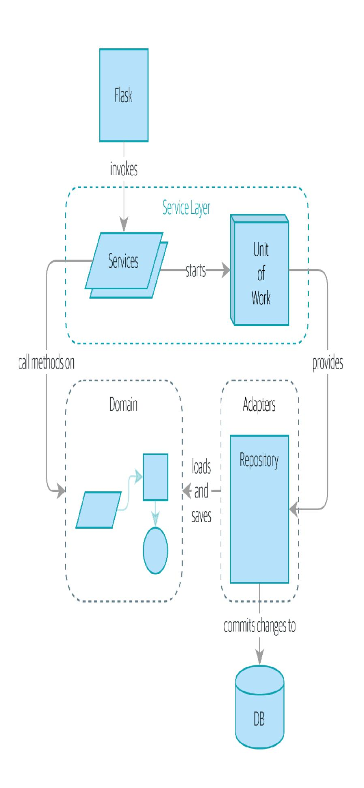

# Part I Recap

Do you remember <u>Figure 7-5</u>, the diagram we showed at the beginning of Part I to preview where we were heading?

Figure 7-5. A component diagram for our app at the end of Part I

So that's where we are at the end of Part I. What have we achieved? We've seen how to build a domain model that's exercised by a set of high-level unit tests. Our tests are living documentation: they describe the behavior of our system—the rules upon which we agreed with our business stakeholders—in nice readable code. When our business requirements change, we have confidence that our tests will help us to prove the new functionality, and when new developers join the project, they can read our tests to understand how things work.

We've decoupled the infrastructural parts of our system, like the database and API handlers, so that we can plug them into the outside of our application. This helps us to keep our codebase well organized and stops us from building a big ball of mud.

By applying the dependency inversion principle, and by using portsand-adapters-inspired patterns like Repository and Unit of Work, we've made it possible to do TDD in both high gear and low gear and to maintain a healthy test pyramid. We can test our system edge to edge, and the need for integration and end-to-end tests is kept to a minimum.

Lastly, we've talked about the idea of consistency boundaries. We don't want to lock our entire system whenever we make a change, so we have to choose which parts are consistent with one another.

For a small system, this is everything you need to go and play with the ideas of domain-driven design. You now have the tools to build

database-agnostic domain models that represent the shared language of your business experts. Hurrah!

## NOTE

At the risk of laboring the point—we've been at pains to point out that each pattern comes at a cost. Each layer of indirection has a price in terms of complexity and duplication in our code and will be confusing to programmers who've never seen these patterns before. If your app is essentially a simple CRUD wrapper around a database and isn't likely to be anything more than that in the foreseeable future, you don't need these patterns. Go ahead and use Django, and save yourself a lot of bother.

In Part II, we'll zoom out and talk about a bigger topic: if aggregates are our boundary, and we can update only one at a time, how do we model processes that cross consistency boundaries?

- 1 Perhaps we could get some ORM/SQLAlchemy magic to tell us when an object is dirty, but how would that work in the generic case—for example, for a CsvRepository?
- 2 time.sleep() works well in our use case, but it's not the most reliable or efficient way to reproduce concurrency bugs. Consider using semaphores or similar synchronization primitives shared between your threads to get better guarantees of behavior.
- 3 If you're not using Postgres, you'll need to read different documentation. Annoyingly, different databases all have quite different definitions. Oracle's SERIALIZABLE is equivalent to Postgres's REPEATABLE READ, for example.
