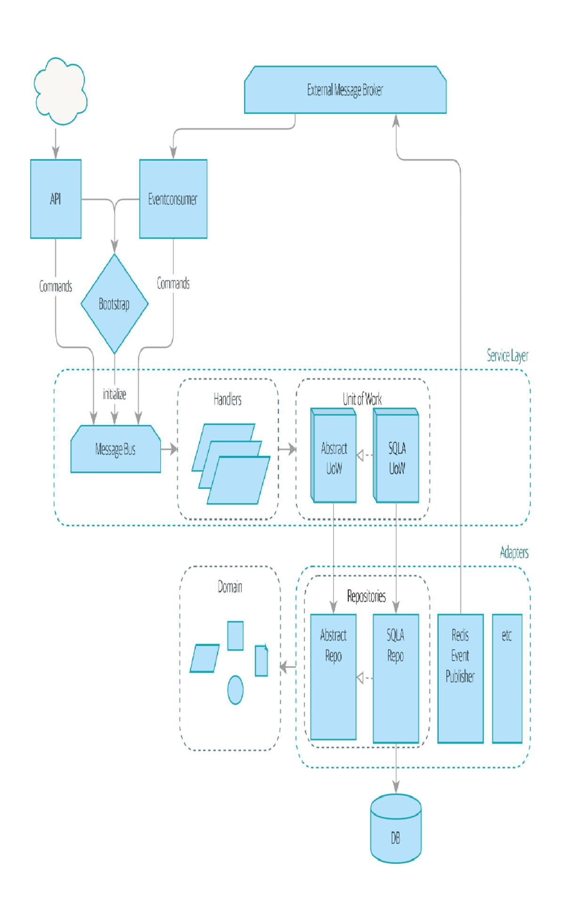

# Appendix A. Summary Diagram and Table

Here's what our architecture looks like by the end of the book:

Table A-1 recaps each pattern and what it does.

Table A-1. The components of our architecture and what they all do

| Layer                                                                             | Compo nent                | Description                                                                                                                                                |
|-----------------------------------------------------------------------------------|------------------------------|------------------------------------------------------------------------------------------------------------------------------------------------------------|
| Domain                                                                            | Entity                       | A domain object whose attributes may change but that has a recognizable identity over time.                                                                |
| Defines the business logic.                                                       | Value object              | An immutable domain object whose attributes entirely define it. It is fungible with other identical objects.                                               |
|                                                                                   | Aggregat e                | Cluster of associated objects that we treat as a unit for the purpose of data changes.  Defines and enforces a consistency boundary.                       |
|                                                                                   | Event                        | Represents something that happened.                                                                                                                        |
|                                                                                   | Comman d                  | Represents a job the system should perform.                                                                                                                |
| Service Layer                                                                     | Handler                      | Receives a command or an event and performs what needs to happen.                                                                                          |
| Defines the jobs the system should perform and orchestrates different components. | Unit of work              | Abstraction around data integrity. Each unit of work represents an atomic update. Makes repositories available. Tracks new events on retrieved aggregates. |
|                                                                                   | Message bus (internal) | Handles commands and events by routing them to the appropriate handler.                                                                                    |
| Adapters (Secondary)                                                              | Repositor y               | Abstraction around persistent storage. Each aggregate has its own repository.                                                                              |

Concrete implementations of an interface that goes

| Layer                                                              | Compo nent                                     | Description                                                                                                                  |
|--------------------------------------------------------------------|---------------------------------------------------|------------------------------------------------------------------------------------------------------------------------------|
| from our system to the outside world (I/O).                        | Event publisher                                | Pushes events onto the external message bu                                                                                   |
| Entrypoints (Primary adapters)                                     | Web                                               | Receives web requests and translates them into commands, passing them to the internal message bus.                           |
| Translate external inputs into calls into the service layer. | Event consumer                                    | Reads events from the external message bu and translates them into commands, passing them to the internal message bus. |
| N/A                                                                | External message bus (message broker) | A piece of infrastructure that different services use to intercommunicate, via events                                        |
