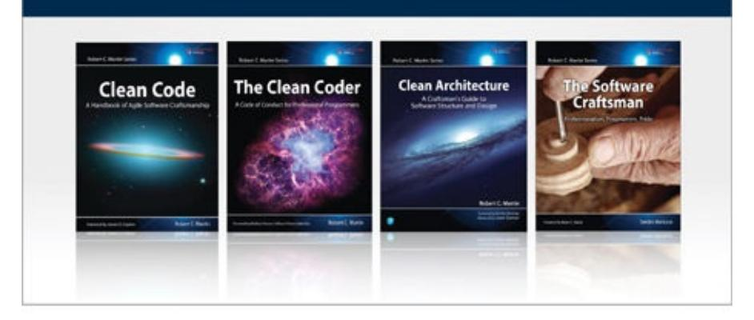

# Clean Architecture

A Craftsman's Guide to Software Structure and Design

Robert C. Martin

With contributions by James Grenning and Simon Brown

## About This E-Book

EPUB is an open, industry-standard format for e-books. However, support for EPUB and its many features varies across reading devices and applications. Use your device or app settings to customize the presentation to your liking. Settings that you can customize often include font, font size, single or double column, landscape or portrait mode, and figures that you can click or tap to enlarge. For additional information about the settings and features on your reading device or app, visit the device manufacturer's Web site.

Many titles include programming code or configuration examples. To optimize the presentation of these elements, view the e-book in single-column, landscape mode and adjust the font size to the smallest setting. In addition to presenting code and configurations in the reflowable text format, we have included images of the code that mimic the presentation found in the print book; therefore, where the reflowable format may compromise the presentation of the code listing, you will see a "Click here to view code image" link. Click the link to view the printfidelity code image. To return to the previous page viewed, click the Back button on your device or app.

## Robert C. Martin Series

Visit informit.com/martinseries for a complete list of available publications.

The Robert C. Martin Series is directed at software developers, teamleaders, business analysts, and managers who want to increase their skills and proficiency to the level of a Master Craftsman. The series contains books that guide software professionals in the principles, patterns, and practices of programming, software project management, requirements gathering, design, analysis, testing, and others.

## Clean Architecture

### A CRAFTSMAN'S GUIDE TO SOFTWARE STRUCTURE AND DESIGN

Boston • Columbus • Indianapolis • New York • San Francisco • Amsterdam • Cape Town Dubai • London • Madrid • Milan • Munich • Paris • Montreal • Toronto • Delhi • Mexico City São Paulo • Sydney • Hong Kong • Seoul • Singapore • Taipei • Tokyo

Many of the designations used by manufacturers and sellers to distinguish their products are claimed as trademarks. Where those designations appear in this book, and the publisher was aware of a trademark claim, the designations have been printed with initial capital letters or in all capitals.

The author and publisher have taken care in the preparation of this book, but make no expressed or implied warranty of any kind and assume no responsibility for errors or omissions. No liability is assumed for incidental or consequential damages in connection with or arising out of the use of the information or programs contained herein.

For information about buying this title in bulk quantities, or for special sales opportunities (which may include electronic versions; custom cover designs; and content particular to your business, training goals, marketing focus, or branding interests), please contact our corporate sales department at [corpsales@pearsoned.com](mailto:corpsales@pearsoned.com) or (800) 382-3419.

For government sales inquiries, please contact [governmentsales@pearsoned.com.](mailto:governmentsales@pearsoned.com)

For questions about sales outside the U.S., please contact [intlcs@pearson.com](mailto:intlcs@pearson.com).

Visit us on the Web: [informit.com](http://informit.com)

Library of Congress Control Number: 2017945537

Copyright © 2018 Pearson Education, Inc.

All rights reserved. Printed in the United States of America. This publication is protected by copyright, and permission must be obtained from the publisher prior to any prohibited reproduction, storage in a retrieval system, or transmission in any form or by any means, electronic, mechanical, photocopying, recording, or likewise. For information regarding permissions, request forms and the appropriate contacts within the Pearson Education Global Rights & Permissions Department, please visit [www.pearsoned.com/permissions/](http://www.pearsoned.com/permissions/).

ISBN-13: 978-0-13-449416-6 ISBN-10: 0-13-449416-4

This book is dedicated to my lovely wife, my four spectacular children, and their families, including my quiver full of five grandchildren—who are the dessert of my life.
