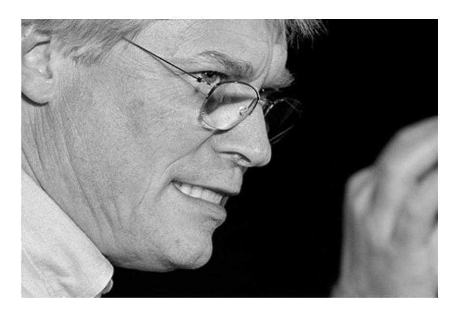

# ABOUT THE AUTHOR

**Robert C. Martin** (Uncle Bob) has been a programmer since 1970. He is the cofounder of [cleancoders.com](http://cleancoders.com), which offers online video training for software developers, and is the founder of Uncle Bob Consulting LLC, which offers software consulting, training, and skill development services to major corporations worldwide. He served as the Master Craftsman at 8th Light, Inc., a Chicago-based software consulting firm. He has published dozens of articles in various trade journals and is a regular speaker at international conferences and trade shows. He served three years as the editor-in-chief of the *C++ Report* and served as the first chairman of the Agile Alliance.

Martin has authored and edited many books, including *The Clean Coder*, *Clean Code*, *UML for Java Programmers*, *Agile Software Development*, *Extreme Programming in Practice*, *More C++ Gems*, *Pattern Languages of Program Design 3*, and *Designing Object Oriented C++ Applications Using the Booch*

## *Method*.
