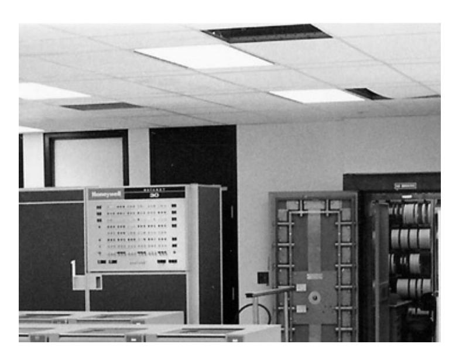
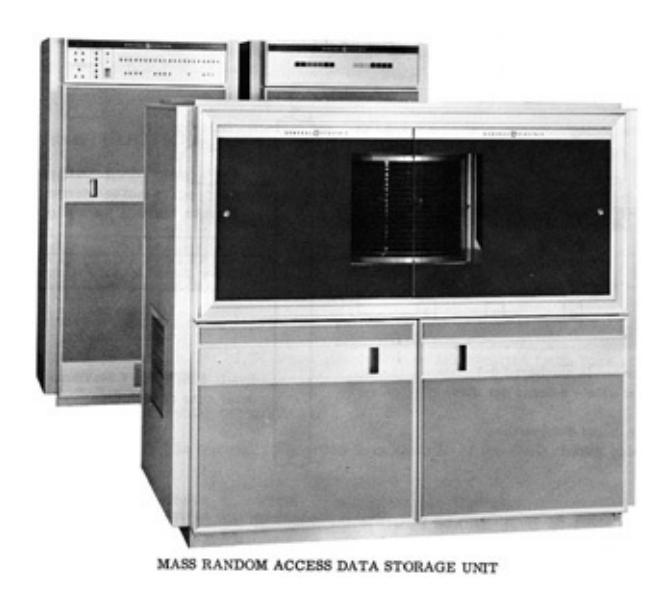
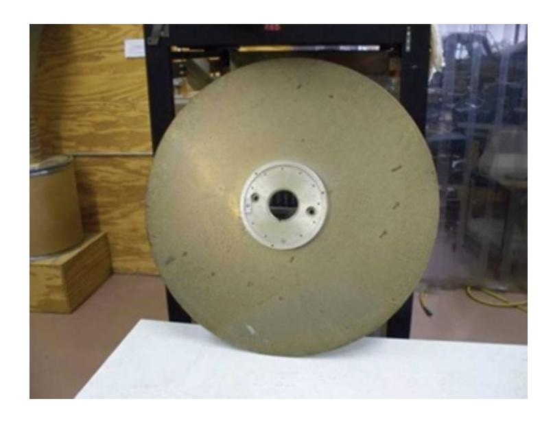
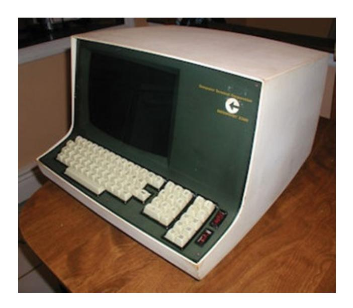
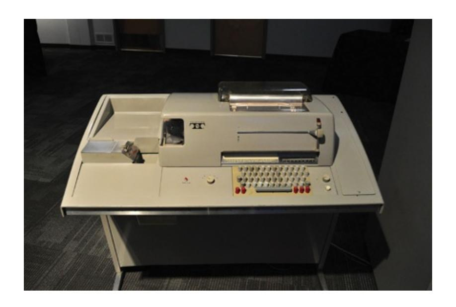
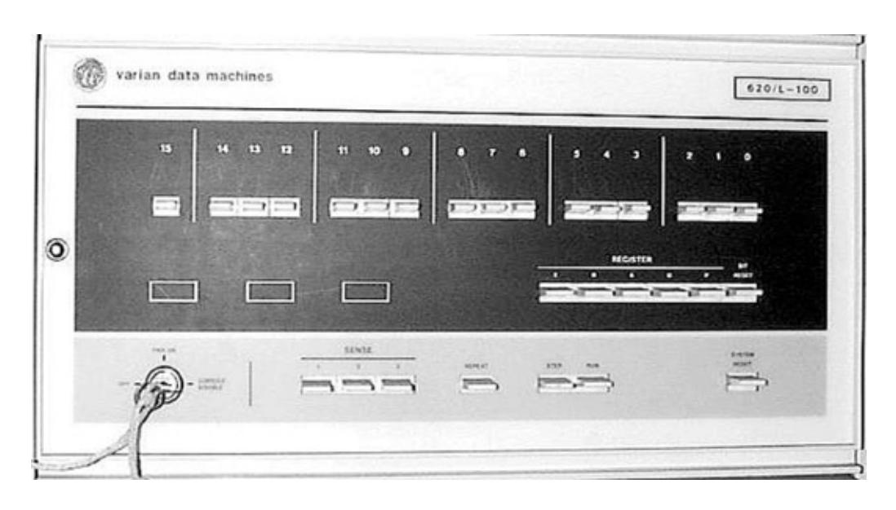
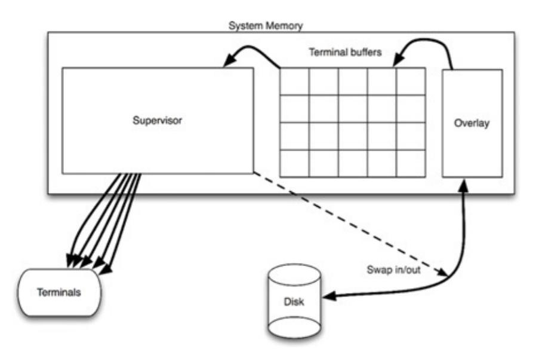
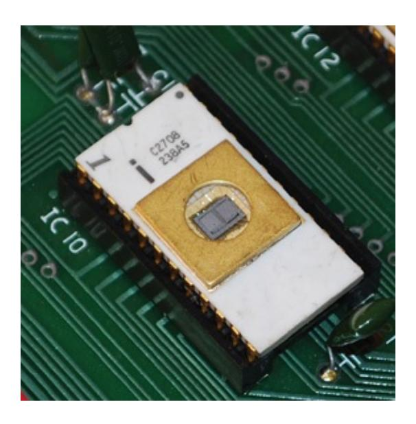
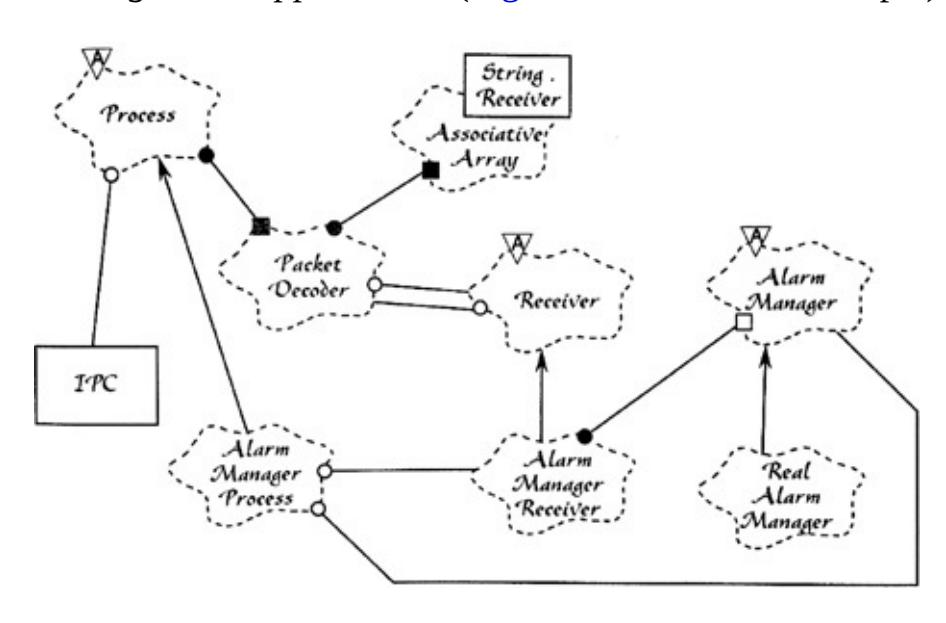

# VII Appendix

## A

## ARCHITECTURE ARCHAEOLOGY

To unearth the principles of good architecture, let's take a 45-year journey through some of the projects I have worked on since 1970. Some of these projects are interesting from an architectural point of view. Others are interesting because of the lessons learned and because of how they fed into subsequent projects.

This appendix is somewhat autobiographical. I've tried to keep the discussion relevant to the topic of architecture; but, as in anything autobiographical, other factors sometimes intrude. ;-)

## UNION ACCOUNTING SYSTEM

In the late 1960s, a company by the name of ASC Tabulating signed a contract with Local 705 of the Teamsters Union to provide an accounting system. The computer ASC chose to implement this system on was a GE Datanet 30, as shown in [Figure](#page-305-0) A.1.

**Figure A.1** GE Datanet 30

*Courtesy Ed Thelen, ed-thelen.org*

As you can see from the picture, this was a huge [1](#page-346-0) machine. It filled a room, and the room needed strict environmental controls.

This computer was built in the days before integrated circuits. It was built out of discrete transistors. There were even some vacuum tubes in it (albeit only in the sense amplifiers of the tape drives).

By today's standards the machine was huge, slow, small, and primitive. It had 16K × 18 bits of core, with a cycle time of about 7 microseconds. [2](#page-346-1) It filled a big, environmentally controlled room. It had 7 track magnetic tape drives and a disk drive with a capacity of 20 megabytes or so.

That disk was a monster. You can see it in the picture in [Figure](#page-306-0) A.2—but that doesn't quite give you the scale of the beast. The top of that cabinet was over my head. The platters were 36 inches in diameter, and 3/8 of an inch thick. One of the platters is pictured in [Figure](#page-307-0) A.3.

Now count the platters in that first picture. There are more than a dozen. Each

one had its own individual seek arm that was driven by pneumatic actuators. You could watch those seek heads move across the platters. The seek time was probably about half a second to a second.

When this beast was turned on, it sounded like a jet engine. The floor would rumble and shake until it got up to speed. [3](#page-346-2)

**Figure A.2** The data storage unit with its platters

*Courtesy Ed Thelen, ed-thelen.org*

The great claim to fame of the Datanet 30 was its capability to drive a large number of asynchronous terminals at relatively high speed. That's exactly what ASC needed.

ASC was based in Lake Bluff, Illinois, 30 miles north of Chicago. The Local 705 office was in downtown Chicago. The union wanted a dozen or so of their data entry clerks to use CRT [4](#page-346-3) terminals ([Figure](#page-308-0) A.4) to enter data into the system. They would print reports on ASR35 teletypes ([Figure](#page-309-0) A.5).

**Figure A.3** One platter of that disk: 3/8 inch thick, 36 inches in diameter

*Courtesy, Ed Thelen, ed-thelen.org*

The CRT terminals ran at 30 characters per second. This was a pretty good rate for the late 1960s because modems were relatively unsophisticated in those days.

ASC leased a dozen or so dedicated phone lines and twice that number of 300 baud modems from the phone company to connect the Datanet 30 to these terminals.

These computers did not come with operating systems. They didn't even come with file systems. What you got was an assembler.

If you needed to store data on the disk, you stored data on the disk. Not in a file. Not in a directory. You figured out which track, platter, and sector to put the data into, and then you operated the disk to put the data there. Yes, that means we wrote our own disk driver.

**Figure A.4** Datapoint CRT terminal

*Courtesy of Bill Degnan, vintagecomputer.net*

The Union Accounting system had three kinds of records: Agents, Employers, and Members. The system was a CRUD system for these records, but also included operations for posting dues, computing changes in the general ledger, and so on.

The original system was written in assembler by a consultant who somehow managed to cram the whole thing into 16K.

As you might imagine, that big Datanet 30 was an expensive machine to operate and maintain. The software consultant who kept the software running was expensive, too. What's more, minicomputers were becoming popular, and were much cheaper.

**Figure A.5** ASR35 teletype

*Joe Mabel, with permission*

In 1971, when I was 18 years old, ASC hired me and two of my geeky friends to replace the whole union accounting system with one that was based on a Varian 620/f minicomputer [\(Figure](#page-310-0) A.6). The computer was cheap. We were cheap. So it seemed like a good deal for ASC.

The Varian machine had a 16-bit bus and 32K \* 16 core memory. It had a cycle time of about 1 microsecond. It was much more powerful than the Datanet 30. It used IBM's wildly successful 2314 disk technology, allowing us to store 30 megabytes on platters that were only 14 inches in diameter and could not explode through concrete block walls!

Of course, we still had no operating system. No file system. No high-level language. All we had was an assembler. But we made do.

**Figure A.6** Varian 620/f minicomputer

*The Minicomputer Orphanage*

Instead of trying to cram the whole system into 32K, we created an overlay system. Applications would be loaded from disk into a block of memory dedicated to overlays. They would be executed in that memory, and preemptively swapped back out onto disk, with their local RAM, to allow other programs to execute.

Programs would get swapped into the overlay area, execute enough to fill the output buffers, and then get swapped out so that another program could be swapped in.

Of course, when your UI runs at 30 characters per second, your programs spend a lot of time waiting. We had plenty of time to swap the programs in and off the disk to keep all of the terminals running as fast as they could go. Nobody ever complained of response time issues.

We wrote a preemptive supervisor that managed the interrupts and IO. We wrote the applications; we wrote the disk drivers, the terminal drivers, the tape drivers, and everything else in that system. There was not a single bit in that system that we did not write. Though it was a struggle involving far too many 80-hour weeks, we got the beast up and running in a matter of 8 or 9 months.

The architecture of the system was simple ([Figure](#page-311-0) A.7). When an application was started, it would generate output until its particular terminal buffer was full. Then the supervisor would swap the application out, and swap a new application in. The supervisor would continue to dribble out the contents of the terminal buffer at 30 cps until it was nearly empty. Then it would swap the application back in to fill the buffer again.

**Figure A.7** The system architecture

There are two boundaries in this system. The first is the character output boundary. The applications had no idea that their output was going to a 30-cps terminal. Indeed, the character output was entirely abstract from the applications' point of view. The applications simply passed strings to the supervisor, and the supervisor took care of loading the buffers, sending the characters to the terminals, and swapping the applications in and out of memory.

This boundary was dependency normal—that is, dependencies pointed *with* the flow of control. The applications had compile-time dependencies on the supervisor, and the flow of control passed from the applications to the supervisor. The boundary prevented the applications from knowing which kind of device the output was going to.

The second boundary was dependency inverted. The supervisor could start the applications, but had no compile-time dependencies upon them. The flow of control passed from the supervisor to the applications. The polymorphic interface that inverted the dependency was simply this: Every application was started by jumping to the exact same memory address within the overlay area. The boundary prevented the supervisor from knowing anything about the

applications other than the starting point.

### LASER TRIM

In 1973, I joined a company in Chicago called Teradyne Applied Systems (TAS). This was a division of Teradyne Inc., which was headquartered in Boston. Our product was a system that used relatively high-powered lasers to trim electronic components to very fine tolerances.

Back in those days, manufacturers would silk-screen electronic components onto ceramic substrates. Those substrates were on the order of 1 inch square. The components were typically resistors—devices that resist the flow of current.

The resistance of a resistor depends on a number of factors, including its composition and its geometry. The wider the resistor, the less resistance it has.

Our system would position the ceramic substrate in a harness that had probes that made contact with the resistors. The system would measure the resistance of the resistors, and then use a laser to burn off parts of the resistor, making it thinner and thinner until it reached the desired resistance value within a tenth of a percent or so.

We sold these systems to manufacturers. We also used some in-house systems to trim relatively small batches for small manufacturers.

The computer was an M365. This was in the days when many companies built their own computers: Teradyne built the M365 and supplied it to all its divisions. The M365 was an enhanced version of a PDP-8—a popular minicomputer of the day.

The M365 controlled the positioning table, which moved the ceramic substrates under the probes. It controlled the measurement system and the laser. The laser was positioned using *X*-*Y* mirrors that could rotate under program control. The computer could also control the power setting of the laser.

The development environment of the M365 was relatively primitive. There was no disk. Mass storage was on tape cartridges that looked like old 8-track audio tape cassettes. The tapes and drives were made by Tri-Data.

Like the 8-track audio cassettes of the day, the tape was oriented in a loop. The drive moved the tape in only one direction—there was no rewind! If you wanted to position the tape at the beginning, you had to send it forward to its "load point."

The tape moved at a speed of approximately 1 foot per second. Thus, if the tape loop was 25 feet long, it could take as long as 25 seconds to send it to the load point. For this reason Tridata made cartridges in several lengths, ranging from 10 feet to 100 feet.

The M365 had a button on the front that would load memory with a little bootstrap program and execute it. This program would read the first block of data from the tape, and execute that. Typically this block held a loader that loaded the operating system that lived on the rest of the tape.

The operating system would prompt the user for the name of a program to run. Those programs were stored on the tape, just after the operating system. We would type in the name of the program—for example, the ED-402 Editor—and the operating system would search the tape for that program, load it, and execute it.

The console was an ASCII CRT with green phosphors, 72 characters wide [5](#page-346-4) by 24 lines. The characters were all uppercase.

To edit a program, you would load the ED-402 Editor, and then insert the tape that held your source code. You would read one tape block of that source code into memory, and it would be displayed on the screen. The tape block might hold 50 lines of code. You would make your edits by moving the cursor around on the screen and typing in a manner similar to vi. When you were done, you would write that block onto a different tape, and read the next block from the source tape. You kept on doing this until you were done.

There was no scrolling back to previous blocks. You edited your program in a straight line, from beginning to end. Going back to the beginning forced you to finish copying the source code onto the output tape and then start a new editing session on that tape. Perhaps not surprisingly, given these constraints, we printed our programs out on paper, marked all the edits by hand in red ink, and then edited our programs block by block by consulting our markups on the listing.

Once the program was edited, we returned to the OS and invoked the assembler. The assembler read the source code tape, and wrote a binary tape, while also producing a listing on our data products line printer.

The tapes weren't 100% reliable, so we always wrote two tapes at the same time. That way, at least one of them had a high probability of being free of errors.

Our program was approximately 20,000 lines of code, and took nearly 30 minutes to compile. The odds that we would get a tape read error during that time were roughly 1 in 10. If the assembler got a tape error, it would ring the bell on the console and then start printing a stream of errors on the printer. You could hear this maddening bell all across the lab. You could also hear the cursing of the poor programmer who just learned that the 30-minute compile needed to start over.

The architecture of the program was typical for those days. There was a Master Operating Program, appropriately called "the MOP." Its job was to manage basic IO functions and provide the rudiments of a console "shell." Many of the divisions of Teradyne shared the MOP source code, but each had forked it for its own uses. Consequently, we would send source code updates around to each other in the form of marked-up listings that we would then integrate manually (and very carefully).

A special-purpose utility layer controlled the measurement hardware, the positioning tables, and the laser. The boundary between this layer and the MOP was muddled at best. While the utility layer called the MOP, the MOP had been specifically modified for that layer, and often called back into it. Indeed, we didn't really think of these two as separate layers. To us, it was just some code that we added to the MOP in a highly coupled way.

Next came the isolation layer. This layer provided a virtual machine interface for the application programs, which were written in a completely different domainspecific data-driven language (DSL). The language had operations for moving the laser, moving the table, making cuts, making measurements, and so on. Our customers would write their laser trimming application programs in this language, and the isolation layer would execute them.

This approach was not intended to create a machine-independent laser trim language. Indeed, the language had many idiosyncrasies that were deeply

coupled to the layers below. Rather, this approach gave the application programmers a "simpler" language than M356 assembler in which to program their trim jobs.

Trim jobs could be loaded from tape and executed by the system. Essentially, our system was an operating system for trim applications.

The system was written in M365 assembler and compiled in a single compilation unit that produced absolute binary code.

The boundaries in this application were soft at best. Even the boundary between the system code and the applications written in the DSL was not well enforced. There were couplings everywhere.

But that was typical of software in the early 1970s.

### ALUMINUM DIE-CAST MONITORING

In the middle of the 1970s, while OPEC was placing an embargo on oil, and gasoline shortages were causing angry drivers to get into fights at gas stations, I began working at Outboard Marine Corporation (OMC). This is the parent company of Johnson Motors and Lawnboy lawnmowers.

OMC maintained a huge facility in Waukegan, Illinois, for creating die-cast aluminum parts for all of the company's motors and products. Aluminum was melted down in huge furnaces, and then carried in large buckets to dozens upon dozens of individually operated aluminum die-cast machines. Each machine had a human operator responsible for setting the molds, cycling the machine, and extracting the newly cast parts. These operators were paid based on how many parts they produced.

I was hired to work on a shop-floor automation project. OMC had purchased an IBM System/7—which was IBM's answer to the minicomputer. They tied this computer to all the die-cast machines on the floor, so that we could count, and time, the cycles of each machine. Our role was to gather all that information and present it on 3270 green-screen displays.

The language was assembler. And, again, every bit of code that executed in this computer was code that we wrote. There was no operating system, no subroutine libraries, and no framework. It was just raw code.

It was also interrupt-driven real-time code. Every time a die-cast machine cycled, we had to update a batch of statistics, and send messages to a great IBM 370 in-the-sky, running a CICS-COBOL program that presented those statistics on the green screens.

I hated this job. Oh, boy, did I. Oh, the *work* was *fun*! But the culture … Suffice it to say that I was *required* to wear a tie.

Oh, I tried. I really did. But I was clearly unhappy working there, and my colleagues knew it. They knew it because I couldn't remember critical dates or manage to get up early enough to attend important meetings. This was the only programming job I was ever fired from—and I deserved it.

From an architectural point of view, there's not a lot to learn here except for one thing. The System/7 had a very interesting instruction called *set program interrupt* (SPI). This allowed you to trigger an interrupt of the processor, allowing it to handle any other queued lower-priority interrupts. Nowadays, in Java we call this Thread.yield().

### 4-TEL

In October 1976, having been fired from OMC, I returned to a different division of Teradyne—a division I would stay with for 12 years. The product I worked on was named 4-TEL. Its purpose was to test every telephone line in a telephone service area, every night, and produce a report of all lines requiring repair. It also allowed telephone test personnel to test specific telephone lines in detail.

This system started its life with the same kind of architecture as the Laser Trim system. It was a monolithic application written in assembly language without any significant boundaries. But at the time I joined the company, that was about to change.

The system was used by testers located in a service center (SC). A service center covered many central offices (CO), each of which could handle as many as 10,000 phone lines. The dialing and measurement hardware had to be located inside the CO. So that's where the M365 computers were put. We called those

computers the central office line testers (COLTs). Another M365 was placed at the SC; it was called the service area computer (SAC). The SAC had several modems that it could use to dial up the COLTs and communicate at 300 baud (30 cps).

At first, the COLT computers did everything, including all the console communication, menus, and reports. The SAC was just a simple multiplexor that took the output from the COLTs and put it on a screen.

The problem with this setup was that 30 cps is really slow. The testers didn't like watching the characters trickle across the screen, especially since they were only interested in a few key bits of data. Also, in those days, the core memory in the M365 was expensive, and the program was big.

The solution was to separate the part of the software that dialed and measured lines from the part that analyzed the results and printed the reports. The latter would be moved into the SAC, and the former would remain behind in the COLTs. This would allow the COLT to be a smaller machine, with much less memory, and would greatly speed up the response at the terminal, since the reports would be generated in the SAC.

The result was remarkably successful. Screen updates were very fast (once the appropriate COLT had been dialed), and the memory footprint of the COLTs shrank a lot.

The boundary was very clean and highly decoupled. Very short packets of data were exchanged between the SAC and COLT. These packets were a very simple form of DSL, representing primitive commands like "DIAL XXXX" or "MEASURE."

The M365 was loaded from tape. Those tape drives were expensive and weren't very reliable—especially in the industrial environment of a telephone central office. Also, the M365 was an expensive machine relative to the rest of the electronics within the COLT. So we embarked upon a project to replace the M365 with a microcomputer based on an 8085 µprocessor.

The new computer was composed of a processor board that held the 8085, a RAM board that held 32K of RAM, and three ROM boards that held 12K of read-only memory apiece. All these boards fit into the same chassis as the measurement hardware, thereby eliminating the bulky extra chassis that had

housed the M365.

The ROM boards held 12 Intel 2708 EPROM (Erasable Programmable Read-Only Memory) chips. [6](#page-346-5) [Figure](#page-318-0) A.8 shows an example of such a chip. We loaded those chips with software by inserting them into special devices called PROM burners that were driven by our development environment. The chips could be erased by exposing them to high-intensity ultraviolet light. [7](#page-346-6)

My buddy CK and I translated the M365 assembly language program for the COLT into 8085 assembly language. This translation was done by hand and took us about 6 months. The end result was approximately 30K of 8085 code.

Our development environment had 64K of RAM and no ROM, so we could quickly download our compiled binaries into RAM and test them.

Once we got the program working, we switched to using the EPROMs. We burned 30 chips and inserted them into just the right slots in the three ROM boards. Each chip was labeled so we could tell which chip went into which slot.

The 30K program was a single binary, 30K long. To burn the chips, we simply divided that binary image into 30 different 1K segments, and burned each segment onto the appropriately labeled chip.

**Figure A.8** EPROM chip

This worked very well, and we began to mass-produce the hardware and deploy

the system into the field.

But software is soft. [8](#page-346-7) Features needed to be added. Bugs needed to be fixed. And as the installed base grew, the logistics of updating the software by burning 30 chips per installation, and having field service people replace all 30 chips at each site became a nightmare.

There were all kinds of problems. Sometimes chips would be mislabeled, or the labels would fall off. Sometimes the field service engineer would mistakenly replace the wrong chip. Sometimes the field service engineer would inadvertently break a pin off one of the new chips. Consequently, the field engineers had to carry extras of all 30 chips with them.

Why did we have to change all 30 chips? Every time we added or removed code from our 30K executable, it changed the addresses in which each instruction was loaded. It also changed the addresses of the subroutines and functions that we called. So every chip was affected, no matter how trivial the change.

One day, my boss came to me and asked me to solve that problem. He said we needed a way to make a change to the firmware without replacing all 30 chips every time. We brainstormed this issue for a while, and then embarked upon the "Vectorization" project. It took me three months.

The idea was beautifully simple. We divided the 30K program into 32 independently compilable source files, each less than 1K. At the beginning of each source file, we told the compiler in which address to load the resulting program (e.g., ORG C400 for the chip that was to be inserted into the C4 position).

Also at the beginning of each source file, we created a simple, fixed-size data structure that contained all the addresses of all the subroutines on that chip. This data structure was 40 bytes long, so it could hold no more than 20 addresses. This meant that no chip could have more than 20 subroutines.

Next, we created a special area in RAM known as the vectors. It contained 32 tables of 40 bytes—exactly enough RAM to hold the pointers at the start of each chip.

Finally, we changed every call to every subroutine on every chip into an indirect call through the appropriate RAM vector.

When our processor booted, it would scan each chip and load the vector table at the start of each chip into the RAM vectors. Then it would jump into the main program.

This worked very well. Now, when we fixed a bug, or added a feature, we could simply recompile one or two chips, and send just those chips to the field service engineers.

We had made the chips *independently deployable*. We had invented polymorphic dispatch. We had invented objects.

This was a plugin architecture, quite literally. We plugged those chips in. We eventually engineered it so that a feature could be installed into our products by plugging the chip with that feature into one of the open chip sockets. The menu control would automatically appear, and the binding into the main application would happen automatically.

Of course, we didn't know about object-oriented principles at the time, and we knew nothing about separating user interface from business rules. But the rudiments were there, and they were very powerful.

One unexpected side benefit of the approach was that we could patch the firmware over a dial-up connection. If we found a bug in the firmware, we could dial up our devices and use the on-board monitor program to alter the RAM vector for the faulty subroutine to point to a bit of empty RAM. Then we'd enter the repaired subroutine into that RAM area, by typing it in machine code, in hexadecimal.

This was a great boon to our field service operation, and to our customers. If they had a problem, they didn't need us to ship new chips and schedule an urgent field service call. The system could be patched, and a new chip could be installed at the next regularly scheduled maintenance visit.

### THE SERVICE AREA COMPUTER

The 4-TEL service area computer (SAC) was based on an M365 minicomputer. This system communicated with all the COLTs out in the field, through either dedicated or dial-up modems. It would command those COLTs to measure

telephone lines, would receive back the raw results, and would then perform a complex analysis of those results to identify and locate any faults.

#### DISPATCH DETERMINATION

One of the economic foundations for this system was based on the correct allocation of repair craftsmen. Repair craft were separated, by union rules, into three categories: central office, cable, and drop. CO craftsmen fixed problems inside the central office. Cable craftsmen fixed problems in the cable plant that connected the CO to the customer. Drop craftsmen fixed problems inside the customer's premises, and in the lines connecting the external cable to that premises (the "drop").

When a customer complained about a problem, our system could diagnose that problem and determine which kind of craftsman to dispatch. This saved the phone companies lots of money because incorrect dispatches meant delays for the customer and wasted trips for the craftsmen.

The code that made this dispatch determination was designed and written by someone who was very bright, but a terrible communicator. The process of writing the code has been described as "Three weeks of staring at the ceiling and two days of code pouring out of every orifice of his body—after which he quit."

Nobody understood this code. Every time we tried to add a feature or fix a defect, we broke it in some way. And since it was upon this code that one of the primary economic benefits our system rested, every new defect was deeply embarrassing to the company.

In the end, our management simply told us to lock that code down and never modify it. That code became *officially rigid*.

This experience impressed upon me the value of good, clean code.

#### ARCHITECTURE

The system was written in 1976 in M365 assembler. It was a single, monolithic program of roughly 60,000 lines. The operating system was a home-grown, nonpreemptive, task-switcher based on polling. We called it MPS for *multiprocessing system.* The M365 computer had no built-in stack, so taskspecific variables were kept in a special area of memory and swapped out at every context switch. Shared variables were managed with locks and semaphores. Reentrancy issues and race conditions were constant problems.

There was no isolation of device control logic, or UI logic, from the business rules of the system. For example, modem control code could be found smeared throughout the bulk of the business rules and UI code. There was no attempt to gather it into a module or abstract the interface. The modems were controlled, at the bit level, by code that was scattered everywhere around the system.

The same was true for the terminal UI. Messages and formatting control code were not isolated. They ranged far and wide throughout the 60,000-line code base.

The modem modules we were using were designed to be mounted on PC boards. We bought those units from a third party, and integrated them with other circuitry onto a board that fit into our custom backplane. These units were expensive. So, after a few years, we decided to design our own modems. We, in the software group, begged the hardware designer to use the same bit formats for controlling the new modem. We explained that the modem control code was smeared everywhere, and that our system would have to deal with both kinds of modems in the future. So, we begged and cajoled, "Please make the new modem look just like the old modem from a software control point of view."

But when we got the new modem, the control structured was entirely different. It was not just a little different. It was entirely, and completely, different.

Thanks, hardware engineer.

What were we to do? We were not simply replacing all the old modems with new modems. Instead, we were mixing old and new modems in our systems. The software needed to be able to handle both kinds of modems at the same time. Were we doomed to surround every place in the code that manipulated the modems with flags and special cases? There were hundreds of such places!

In the end, we opted for an even worse solution.

One particular subroutine wrote data to the serial communication bus that was used to control all our devices, including our modems. We modified that subroutine to recognize the bit patterns that were specific to the old modem, and translate them into the bit patterns needed by the new modem.

This was not straightforward. Commands to the modem consisted of sequences of writes to different IO addresses on the serial bus. Our hack had to interpret these commands, in sequence, and translate them into a different sequence using different IO addresses, timings, and bit positions.

We got it to work, but it was the worst hack imaginable. It was because of this fiasco that I learned the value of isolating hardware from business rules, and of abstracting interfaces.

#### THE GRAND REDESIGN IN THE SKY

By the time the 1980s rolled around, the idea of producing your own minicomputer and your own computer architecture was beginning to fall out of fashion. There were many microcomputers on the market, and getting them to work was cheaper and more standard then continuing to rely on proprietary computer architectures from the late 1960s. That, plus the horrible architecture of the SAC software, induced our technical management to start a complete rearchitecture of the SAC system.

The new system was to be written in C using a UNIX O/S on disk, running on an Intel 8086 microcomputer. Our hardware guys started working on the new computer hardware, and a select group of software developers, "The Tiger Team," was commissioned with the rewrite.

I won't bore you with the details of the initial fiasco. Suffice it to say that the first Tiger Team failed entirely after burning two or three man-years on a software project that never delivered anything.

A year or two later, probably 1982, the process was started again. The goal was the total and complete redesign of the SAC in C and UNIX on our own, newly designed, impressively powerful 80286 hardware. We called that computer "Deep Thought."

It took years, then more years, and then even more years. I don't know when the first UNIX-based SAC was finally deployed; I believe I had left the company by then (1988). Indeed, I'm not at all sure it ever was deployed.

Why the delay? In short, it is very difficult for a redesign team to catch up with a

large staff of programmers who are actively maintaining the old system. Here's just one example of the difficulties they encountered.

#### EUROPE

At about the same time that the SAC was being redesigned in C, the company started to expand sales into Europe. They could not wait for the redesigned software to be finished, so of course, they deployed the old M365 systems into Europe.

The problem was that the phone systems in Europe were very different from the phone systems in the United States. The organization of the craft and of the bureaucracies were different as well. So one of our best programmers was sent to the United Kingdom to lead a team of U.K. developers to modify the SAC software to deal with all these European issues.

Of course, no serious attempt was made to integrate these changes into the U.S. based software. This was long before networks made it feasible to transmit large code bases across the ocean. These U.K. developers simply forked the U.S. based code and modified it as needed.

This, of course, caused difficulties. Bugs were found on both sides of the Atlantic that needed repair on the other side. But the modules had changed significantly, so it was very difficult to determine whether the fix made in the United States would work in the United Kingdom.

After a few years of heartburn, and the installation of a high-throughput line connecting the U.S. and U.K. offices, a serious attempt was made to integrate these two forks back together again, making the differences a matter of configuration. This effort failed the first, second, and third times it was tried. The two code bases, though remarkably similar, were still too different to reintegrate —especially in the rapidly changing market environment that existed at that time.

Meanwhile, the "Tiger Team," trying to rewrite everything in C and UNIX, realized that it also had to deal with this European/US dichotomy. And, of course, that did nothing to accelerate their progress.

#### SAC CONCLUSION

There are many other stories I could tell you about this system, but it's just too depressing for me to continue. Suffice it to say that many of the hard lessons of my software life were learned while immersed in the horrible assembler code of the SAC.

### C LANGUAGE

The 8085 computer hardware that we used in the 4-Tel Micro project gave us a relatively low-cost computing platform for many different projects that could be embedded into industrial environments. We could load it up with 32K of RAM and another 32K of ROM, and we had an extremely flexible and powerful scheme for controlling peripherals. What we did not have was a flexible and convenient language with which to program the machine. The 8085 assembler was simply not fun to write code in.

On top of that, the assembler we were using was written by our own programmers. It ran on our M365 computers, using the cartridge tape operating system described in the "Laser Trim" section.

As fate would have it, our lead *hardware* engineer convinced our CEO that we needed a *real* computer. He didn't actually know what he would do with it, but he had a lot of political clout. So we purchased a PDP-11/60.

I, a lowly software developer at the time, was ecstatic. I knew *precisely* what I wanted to do with that computer. I was determined that this was going to be *my* machine.

When the manuals arrived, many months before the delivery of the machine, I took them home and devoured them. By the time the computer was delivered, I knew how to operate both the hardware and the software at an intimate level—at least, as intimate as home study can make it.

I helped to write the purchase order. In particular, I specified the disk storage that the new computer would have. I decided we should buy two disk drives that could take removable disk packs that held 25 megabytes each. [9](#page-347-0)

Fifty megabytes! The number seemed infinite! I remember walking through the halls of the office, late at night, cackling like the Wicked Witch of the West:

"Fifty megabytes! Hahahahahahahahahah!"

I had the facilities manager build a little room that would house six VT100 terminals. I decorated it with pictures from space. Our software developers would use this room to write and compile code.

When the machine arrived, I spent several days setting it up, wiring all the terminals, and getting everything to work. It was a joy—a labor of love.

We purchased standard assemblers for the 8085 from Boston Systems Office, and we translated the 4-Tel Micro code into that syntax. We built a crosscompilation system that allowed us to download compiled binaries from the PDP-11 to our 8085 development environments, and ROM burners. And—Bob's your Uncle—it all worked like a champ.

#### C

But that left us with the problem of still using 8085 assembler. That was not a situation that I was happy with. I had heard that there was this "new" language that was heavily used at Bell Labs. They called it "C." So I purchased a copy of *The C Programming Language* by Kernighan and Ritchie. Like the PDP-11 manuals a few months before, I *inhaled* this book.

I was astounded by the simple elegance of this language. It sacrificed none of the power of assembly language, and provided access to that power with a much more convenient syntax. I was sold.

I purchased a C compiler from Whitesmiths, and got it running on the PDP-11. The output of the compiler was assembler syntax that was compatible with the Boston Systems Office 8085 compiler. So we had a pathway to go from C to the 8085 hardware! We were in business.

Now the only problem was convincing a group of embedded assembly language programmers that they should be using C. But that's a nightmare tale for another time …

### BOSS

Our 8085 platform had no operating system. My experience with the MPS system of the M365, and the primitive interrupt mechanisms of the IBM System 7, convinced me that we needed a simple task switcher for the 8085. So I conceived of BOSS: Basic Operating System and Scheduler. [10](#page-347-1)

The vast majority of BOSS was written in C. It provided the ability to create concurrent tasks. Those tasks were not preemptive—task switching did not take place based on interrupts. Instead, and just like with the MPS system on the M365, tasks were switched based on a simple polling mechanism. The polling happened whenever a task blocked for an event.

The BOSS call to block a task looked like this:

block(eventCheckFunction);

This call suspended the current task, placed the eventCheckFunction in the polling list, and associated it with the newly blocked task. It then waited in the polling loop, calling each of the functions in the polling list until one of them returned true. The task associated with that function was then allowed to run.

In other words, as I said before, it was a simple, nonpreemptive task switcher.

This software became the basis for a vast number of projects over the following years. But one of the first was the pCCU.

### pCCU

The late 1970s and early 1980s were a tumultuous time for telephone companies. One of the sources of that tumult was the digital revolution.

For the preceding century, the connection between the central switching office and the customer's telephone had been a pair of copper wires. These wires were bundled into cables that spread in a huge network across the countryside. They were sometimes carried on poles, and sometimes buried underground.

Copper is a precious metal, and the phone company had tons (literally tons) of it covering the country. The capital investment was enormous. Much of that capital could be reclaimed by transporting the telephone conversation over digital

connections. A single pair of copper wires could carry hundreds of conversations in digital form.

In response, the phone companies embarked upon the process of replacing their old analog central switching equipment with modern digital switches.

Our 4-Tel product tested copper wires, not digital connections. There were still plenty of copper wires in a digital environment, but they were much shorter than before, and they were localized near the customer's telephones. The signal would be carried digitally from the central office to a local distribution point, where it would be converted back to an analog signal and distributed to the customer over standard copper wires. This meant that our measurement device needed to be located out where the copper wires began, but our dialing device needed to remain at the central office. The problem was that all our COLTs embodied both dialing and measurement in the same device. (We could have saved ourselves a fortune had we recognized that obvious architectural boundary a few years earlier!)

Thus we conceived of a new product architecture: the CCU/CMU (the COLT control unit and the COLT measurement unit). The CCU would be located at the central switching office, and would handle the dialing of the phone lines to be tested. The CMU would be located at the local distribution points, and would measure the copper wires that led to the customer's phone.

The problem was that for each CCU, there were many CMUs. The information about which CMU should be used for each phone number was held by the digital switch itself. Thus the CCU had to interrogate the digital switch to determine which CMU to communicate with and control.

We promised the phone companies that we would have this new architecture working in time for their transition. We knew they were months, if not years away, so we did not feel rushed. We also knew that it would take several manyears to develop this new CCU/CMU hardware and software.

#### THE SCHEDULE TRAP

As time went on, we found that there were always urgent matters that required us to postpone development of the CCU/CMU architecture. We felt safe about this decision because the phone companies were consistently delaying the

deployment of digital switches. As we looked at their schedules, we felt confident that we had plenty of time, so we consistently delayed our development.

Then came the day that my boss called me into his office and said: "*One of our customers is deploying a digital switch next month. We have to have a working CCU/CMU by then.*"

I was aghast! How could we possibly do man-years of development in a month? But my boss had a plan …

We did not, in fact, need a full CCU/CMU architecture. The phone company that was deploying the digital switch was tiny. They had only one central office, and only two local distribution points. More importantly, the "local" distribution points were not particularly local. They actually had regular-old analog switches in them that switched to several hundred customers. Better yet, those switches were of a kind that could be dialed by a normal COLT. Better even still, the customer's phone number contained all the information necessary to decide which local distribution point to use. If the phone number had a 5, 6, or 7 in a certain position, it went to distribution point 1; otherwise, it went to distribution point 2.

So, as my boss explained to me, we did not actually need a CCU/CMU. What we needed was a simple computer at the central office connected by modem lines to two standard COLTs at the distribution points. The SAC would communicate with our computer at the central office, and that computer would decode the phone number and then relay the dialing and measurement commands to the COLT at the appropriate distribution point.

Thus was born the pCCU.

This was the first product written in C and using BOSS that was deployed to a customer. It took me about a week to develop. There is no deep architectural significance to this tale, but it makes a nice preface to the next project.

### DLU/DRU

In the early 1980s, one of our customers was a telephone company in Texas.

They had large geographic areas to cover. In fact, the areas were so large that a single service area required several different offices from which to dispatch craftsmen. Those offices had test craftspeople who needed terminals into our SAC.

You might think that this was a simple problem to solve—but remember that this story takes place in the early 1980s. Remote terminals were not very common. To make matters worse, the hardware of the SAC presumed that all the terminals were local. Our terminals actually sat on a proprietary, high-speed, serial bus.

We had remote terminal capability, but it was based on modems, and in the early 1980s modems were generally limited to 300 bits per second. Our customers were not happy with that slow speed.

High-speed modems were available, but they were very expensive, and they needed to run on "conditioned" permanent connections. Dial-up quality was definitely not good enough.

Our customers demanded a solution. Our response was DLU/DRU.

DLU/DRU stood for "Display Local Unit" and "Display Remote Unit." The DLU was a computer board that plugged into the SAC computer chassis and pretended to be a terminal manager board. Instead of controlling the serial bus for local terminals, however, it took the character stream and multiplexed it over a single 9600-bps conditioned modem link.

The DRU was a box placed at the customer's remote location. It connected to the other end of the 9600-bps link, and had the hardware to control the terminals on our proprietary serial bus. It demultiplexed the characters received from the 9600-bps link and sent them to the appropriate local terminals.

Strange, isn't it? We had to engineer a solution that nowadays is so ubiquitous we never even think about it. But back then …

We even had to invent our own communications protocol because, in those days, standard communications protocols were not open source shareware. Indeed, this was long before we had any kind of Internet connection.

#### ARCHITECTURE

The architecture of this system was very simple, but there are some interesting quirks I want to highlight. First, both units used our 8085 technology, and both were written in C and used BOSS. But that's where the similarity ended.

There were two of us on the project. I was the project lead, and Mike Carew was my close associate. I took on the design and coding of the DLU; Mike did the DRU.

The architecture of the DLU was based on a dataflow model. Each task did a small and focused job, and then passed its output to the next task in line, using a queue. Think of a pipes and filters model in UNIX. The architecture was intricate. One task might feed a queue that many others would service. Other tasks would feed a queue that just one task would service.

Think of an assembly line. Each position on the assembly line has a single, simple, highly focused job to perform. Then the product moves to the next position in line. Sometimes the assembly line splits into many lines. Sometimes those lines merge back into a single line. That was the DLU.

Mike's DRU used a remarkably different scheme. He created one task per terminal, and simply did the entire job for that terminal in that task. No queues. No data flow. Just many identical large tasks, each managing its own terminal.

This is the opposite of an assembly line. In this case the analogy is many expert builders, each of whom builds an entire product.

At the time I thought my architecture was superior. Mike, of course, thought his was better. We had many entertaining discussions about this. In the end, of course, both worked quite well. And I was left with the realization that software architectures can be wildly different, yet equally effective.

## VRS

As the 1980s progressed, newer and newer technologies appeared. One of those technologies was the computer control of *voice*.

One of the features of the 4-Tel system was the ability of the craftsman to locate a fault in a cable. The procedure was as follows:

- The tester, in the central office, would use our system to determine the approximate distance, in feet, to the fault. This would be accurate to within 20% or so. The tester would dispatch a cable repair craftsman to an appropriate access point near that position.
- The cable repair craftsman, upon arrival, would call the tester and ask to begin the fault location process. The tester would invoke the fault location feature of the 4-Tel system. The system would begin measuring the electronic characteristics of that faulty line, and would print messages on the screen requesting that certain operations be performed, such as opening the cable or shorting the cable.
- The tester would tell the craftsman which operations the system wanted, and the craftsman would tell the tester when the operation was complete. The tester would then tell the system that the operation was complete, and the system would continue with the test.
- After two or three such interactions, the system would calculate a new distance to the fault. The cable craftsman would then drive to that location and begin the process again.

Imagine how much better that would be if the cable craftsmen, up on the pole or standing at a pedestal, could operate the system themselves. And that is exactly what the new voice technologies allowed us to do. The cable craftsmen could call directly into our system, direct the system with touch tones, and listen to the results being read back to them in a pleasant voice.

### THE NAME

The company held a little contest to select a name for the new system. One of the most creative of the names suggested was SAM CARP. This stood for "Still Another Manifestation of Capitalist Avarice Repressing the Proletariat." Needless to say, that wasn't selected.

Another was the Teradyne Interactive Test System. That one was also not selected.

Still another was Service Area Test Access Network. That, too, was not selected.

The winner, in the end, was VRS: Voice Response System.

#### ARCHITECTURE

I did not work on this system, but I heard about what happened. The story I am going to relate to you is second-hand, but for the most part, I believe it to be correct.

These were the heady days of microcomputers, UNIX operating systems, C, and SQL databases. We were determined to use them all.

From the many database vendors out there, we eventually chose UNIFY. UNIFY was a database system that worked with UNIX, which was perfect for us.

UNIFY also supported a new technology called *Embedded SQL*. This technology allowed us to embed SQL commands, as strings, right into our C code. And so we did—everywhere.

I mean, it was just so cool that you could put your SQL right into your code, anywhere you wanted. And where did we want to? Everywhere! And so there was SQL smeared throughout the body of that code.

Of course, in those days SQL was hardly a solid standard. There were lots of special vendor-specific quirks. So the special SQL and special UNIFY API calls were also smeared throughout the code.

This worked great! The system was a success. The craftsmen used it, and the telephone companies loved it. Life was all smiles.

Then the UNIFY product we were using was cancelled.

Oh. Oh.

So we decided to switch to SyBase. Or was it Ingress? I don't remember. Suffice it to say, we had to search through all that C code, find all the embedded SQL and special API calls, and replace them with corresponding gestures for the new vendor.

After three months of effort or so, we gave up. We couldn't make it work. We were so coupled to UNIFY that there was no serious hope of restructuring the code at any practical expense.

So, we hired a third party to maintain UNIFY for us, based on a maintenance contract. And, of course, the maintenance rates went up year after year after year.

#### VRS CONCLUSION

This is one of the ways that I learned that databases are details that should be isolated from the overall business purpose of the system. This is also one of the reasons that I don't like strongly coupling to third-party software systems.

### THE ELECTRONIC RECEPTIONIST

In 1983, our company sat at the confluence of computer systems, telecommunications systems, and voice systems. Our CEO thought this might be a fertile position from which to develop new products. To address this goal, he commissioned a team of three (which included me) to conceive, design, and implement a new product for the company.

It didn't take us long to come up with *The Electronic Receptionist* (ER).

The idea was simple. When you called a company, ER would answer and ask you who you wanted to speak with. You would use touch tones to spell the name of that person, and ER would then connect you. The users of ER could dial in and, by using simple touch-tone commands, tell it which phone number the desired person could be reached at, anywhere in the world. In fact, the system could list several alternate numbers.

When you called ER and dialed RMART (my code), ER would call the first number on my list. If I failed to answer and identify myself, it would call the next number, and the next. If I still wasn't reached, ER would record a message from the caller.

ER would then, periodically, try to find me to deliver that message, and any other message left for me by anyone else.

This was the first voice mail system ever, and we [11](#page-347-2) held the patent to it.

We built all the hardware for this system—the computer board, the memory

board, the voice/telecom boards, everything. The main computer board was *Deep Thought*, the Intel 80286 processor that I mentioned earlier.

The voice boards each supported one telephone line. They consisted of a telephone interface, a voice encoder/decoder, some memory, and an Intel 80186 microcomputer.

The software for the main computer board was written in C. The operating system was MP/M-86, an early command-line–driven, multiprocessing, disk operating system. MP/M was the poor man's UNIX.

The software for the voice boards was written in assembler, and had no operating system. Communication between Deep Thought and the voice boards occurred through shared memory.

The architecture of this system would today be called *service oriented*. Each telephone line was monitored by a listener process running under MP/M. When a call came in, an initial handler process was started and the call was passed to it. As the call proceeded from state to state, the appropriate handler process would be started and take control.

Messages were passed between these services through disk files. The currently running service would determine what the next service should be; would write the necessary state information into a disk file; would issue the command line to start that service; and then would exit.

This was the first time I had built a system like this. Indeed, this was the first time I had been the principal architect of an entire product. Everything having to do with software was mine—and it worked like a champ.

I would not say that the architecture of this system was "clean" in the sense of this book; it was not a "plugin" architecture. However, it definitely showed signs of true boundaries. The services were independently deployable, and lived within their own domain of responsibility. There were high-level processes and low-level processes, and many of the dependencies ran in the right direction.

#### ER DEMISE

Unfortunately, the marketing of this product did not go very well. Teradyne was a company that sold test equipment. We did not understand how to break into the office equipment market.

After repeated attempts over two years, our CEO gave up and—unfortunately dropped the patent application. The patent was picked up by the company that filed three months after we filed; thus we surrendered the entire voice mail and electronic call-forwarding market.

#### Ouch!

On the other hand, you can't blame me for those annoying machines that now plague our existence.

### CRAFT DISPATCH SYSTEM

ER had failed as a product, but we still had all this hardware and software that we could use to enhance our existing product lines. Moreover, our marketing success with VRS convinced us that we should offer a voice response system for interacting with telephone craftsmen that did not depend on our test systems.

Thus was born CDS, the Craft Dispatch System. CDS was essentially ER, but specifically focused on the very narrow domain of managing the deployment of telephone repairmen in the field.

When a problem was discovered in a phone line, a trouble ticket was created in the service center. Trouble tickets were kept in an automated system. When a repairman in the field finished a job, he would call the service center for the next assignment. The service center operator would pull up the next trouble ticket and read it off to the repairman.

We set about to automate that process. Our goal was for the repairman in the field to call into CDS and ask for the next assignment. CDS would consult the trouble ticket system, and read off the results. CDS would keep track of which repairman was assigned to which trouble ticket, and would inform the trouble ticket system of the status of the repair.

There were quite a few interesting features of this system having to do with interacting with the trouble ticket system, the plant management system, and any automated testing systems.

The experience with the service-oriented architecture of ER made me want to try the same idea more aggressively. The state machine for a trouble ticket was much more involved than the state machine for handling a call with ER. I set about to create what would now be called a *micro-service architecture*.

Every state transition of any call, no matter how insignificant, caused the system to start up a new service. Indeed, the state machine was externalized into a text file that the system read. Each event coming into the system from a phone line turned into a transition in that finite state machine. The existing process would start a new process dictated by the state machine to handle that event; then the existing process would either exit or wait on a queue.

This externalized state machine allowed us to change the flow of the application without changing any code (the Open-Closed Principle). We could easily add a new service, independently of any of the others, and wire it into the flow by modifying the text file that contained the state machine. We could even do this while the system was running. In other words we had *hot-swapping* and an effective BPEL (Business Process Execution Language).

The old ER approach of using disk files to communicate between services was too slow for this much more rapid flip-flopping of services, so we invented a shared memory mechanism that we called the 3DBB. [12](#page-347-3) The 3DBB allowed data to be accessed by name; the names we used were names assigned to each state machine instance.

The 3DBB was great for storing strings and constants, but couldn't be used for holding complex data structures. The reason for this is technical but easy to understand. Each process in MP/M lived in its own memory partition. Pointers to data in one memory partition had no meaning in another memory partition. As a consequence, the data in the 3DBB could not contain pointers. Strings were fine, but trees, linked lists, or any data structure with pointers would not work.

The trouble tickets in the trouble ticket system came from many different sources. Some were automated, and some were manual. The manual entries were created by operators who were talking to customers about their troubles. As the customers described their problems, the operators would type in their complaints and observations in a structured text stream. It looked something like this:

You get the idea. The / character started a new topic. Following the slash was a code, and following the code were parameters. There were *thousands* of codes, and an individual trouble ticket could have dozens of them in the description. Worse, since they were manually entered, they were often misspelled or improperly formatted. They were meant for humans to interpret, not for machines to process.

Our problem was to decode these semi-free-form strings, interpret and fix any errors, and then turn them into voice output so we could read them to the repairman, up on a pole, listening with a handset. This required, among other things, a very flexible parsing and data representation technique. That data representation had to be passed through the 3DBB, which could handle only strings.

And so, on an airplane, flying between customer visits, I invented a scheme that I called FLD: *Field Labeled Data*. Nowadays we would call this XML or JSON. The format was different, but the idea was the same. FLDs were binary trees that associated names with data in a recursive hierarchy. FLDs could be queried by a simple API, and could be translated to and from a convenient string format that was ideal for the 3DBB.

So, micro-services communicating through shared memory analog of sockets using an XML analog—in 1985.

There is nothing new under the Sun.

### CLEAR COMMUNICATIONS

In 1988, a group of Teradyne employees left the company to form a startup named Clear Communications. I joined them a few months later. Our mission was to build the software for a system that would monitor the communications quality of T1 lines—the digital lines that carried long-distance communications across the country. The vision was a huge monitor with a map of the United States crisscrossed by T1 lines flashing red if they were degrading.

Remember, graphical user interfaces were brand new in 1988. The Apple

Macintosh was only five years old. Windows was a joke back then. But Sun Microsystems was building Sparcstations that had credible X-Windows GUIs. So we went with Sun—and therefore with C and UNIX.

This was a startup. We worked 70 to 80 hours per week. We had the vision. We had the motivation. We had the will. We had the energy. We had the expertise. We had equity. We had dreams of being millionaires. We were full of shit.

The C code poured out of every orifice of our bodies. We slammed it here, and shoved it there. We constructed huge castles in the air. We had processes, and message queues, and grand, superlative architectures. We wrote a full sevenlayer ISO communications stack from scratch—right down to the data link layer.

We wrote GUI code. GOOEY CODE! OMG! We wrote GOOOOOEY code.

I personally wrote a 3000-line C function named gi(); its name stood for Graphic Interpreter. It was a masterpiece of goo. It was not the only goo I wrote at Clear, but it was my most infamous.

Architecture? Are you joking? This was a startup. We didn't have time for *architecture*. Just code, dammit! *Code for your very lives!*

So we coded. And we coded. And we coded. But, after three years, what we failed to do was sell. Oh, we had an installation or two. But the market was not particularly interested in our grand vision, and our venture capital financiers were getting pretty fed up.

I hated my life at this point. I saw all my effort and dreams crashing down. I had conflicts at work, conflicts at home because of work, and conflicts with myself.

And then I got a phone call that changed everything.

#### THE SETUP

Two years before that phone call, two things of significance happened.

First, I managed to set up a uucp connection to a nearby company that had a uucp connection to another facility that was connected to the Internet. These connections were dial-up, of course. Our main Sparcstation (the one on my desk) used a 1200-bps modem to call up our uucp host twice per day. This gave us

email and Netnews (an early social network where people discussed interesting issues).

Second, Sun released a C++ compiler. I had been interested in C++ and OO since 1983, but compilers were difficult to come by. So when the opportunity presented itself, I changed languages right away. I left the 3000-line C functions behind, and started to write C++ code at Clear. And I learned …

I read books. Of course, I read *The C++ Programming Language* and *The Annotated C++ Reference Manual* (*The ARM*) by Bjarne Stroustrup. I read Rebecca Wirfs-Brock's lovely book on responsibility-driven design: *Designing Object Oriented Software*. I read *OOA* and *OOD* and *OOP* by Peter Coad. I read *Smalltalk-80* by Adele Goldberg. I read *Advanced C++ Programming Styles and Idioms* by James O. Coplien. But perhaps most significantly of all, I read *Object Oriented Design with Applications* by Grady Booch.

What a name! Grady Booch. How could anyone forget a name like that. What's more, he was the *Chief Scientist* at a company called Rational! How I wanted to be a *Chief Scientist*! And so I read his book. And I learned, and I learned, and I learned …

As I learned, I also began debating on Netnews, the way people now debate on Facebook. My debates were about C++ and OO. For two years, I relieved the frustrations that were building at work by debating with hundreds of folks on Usenet about the best language features and the best principles of design. After a while, I even started making a certain amount of sense.

It was in one of those debates that the foundations of the SOLID principles were laid.

And all that debating, and perhaps even some of the sense, got me noticed …

#### UNCLE BOB

One of the engineers at Clear was a young fellow by the name of Billy Vogel. Billy gave nicknames to everyone. He called me Uncle Bob. I suspect, despite my name being Bob, that he was making an offhand reference to J. R. "Bob" Dobbs (see [https://en.wikipedia.org/wiki/File:Bobdobbs.png\)](https://en.wikipedia.org/wiki/File:Bobdobbs.png).

At first I tolerated it. But as the months went by, his incessant chattering of

"Uncle Bob, … Uncle Bob," in the context of the pressures and disappointments of the startup, started to wear pretty thin.

And then, one day, the phone rang.

#### THE PHONE CALL

It was a recruiter. He had gotten my name as someone who knew C++ and object-oriented design. I'm not sure how, but I suspect it had something to do with my Netnews presence.

He said he had an opportunity in Silicon Valley, at a company named Rational. They were looking for help building a CASE [13](#page-347-4) tool.

The blood drained from my face. I *knew* what this was. I don't know how I knew, but I *knew*. This was *Grady Booch's* company. I saw before me the opportunity to join forces with *Grady Booch*!

### ROSE

I joined Rational, as a contract programmer, in 1990. I was working on the ROSE product. This was a tool that allowed programmers to draw Booch diagrams—the diagrams that Grady had written about in *Object-Oriented Analysis and Design with Applications* [\(Figure](#page-342-0) A.9 shows an example).

The Booch notation was very powerful. It presaged notations like UML.

ROSE had an architecture—a *real* architecture. It was constructed in true layers, and the dependencies between layers were properly controlled. The architecture made it releasable, developable, and independently deployable.

Oh, it wasn't perfect. There were a lot of things we still didn't understand about architectural principles. We did not, for example, create a true plugin structure.

We also fell for one of the most unfortunate fads of the day—we used a so-called object-oriented database.

But, overall, the experience was a great one. I spent a lovely year and a half working with the Rational team on ROSE. This was one of the most intellectually stimulating experiences of my professional life.

#### THE DEBATES CONTINUED

Of course, I did not stop debating on Netnews. In fact, I drastically increased my network presence. I started writing articles for *C++ Report*. And, with Grady's help, I started working on my first book: *Designing Object-Oriented C++ Applications Using the Booch Method*.

One thing bothered me. It was perverse, but it was true. No one was calling me "Uncle Bob." I found that I missed it. So I made the mistake of putting "Uncle Bob" in my email and Netnews signatures. And the name stuck. Eventually I realized that it was a pretty good brand.

#### ... BY ANY OTHER NAME

ROSE was a gigantic C++ application. It was composed of layers, with a strictly enforced dependency rule. That rule is not the rule that I have described in this book. We did *not* point our dependencies toward high-level policies. Rather, we pointed our dependencies in the more traditional direction of flow control. The GUI pointed at the representation, which pointed at the manipulation rules, which pointed at the database. In the end, it was this failure to direct our dependencies toward policy that aided the eventual demise of the product.

The architecture of ROSE was similar to the architecture of a good compiler. The graphical notation was "parsed" into an internal representation; that representation was then manipulated by rules and stored in an object-oriented database.

Object-oriented databases were a relatively new idea, and the OO world was all abuzz with the implications. Every object-oriented programmer wanted to have an object-oriented database in his or her system. The idea was relatively simple, and deeply idealistic. The database stores objects, not tables. The database was supposed to look like RAM. When you accessed an object, it simply appeared in memory. If that object pointed to another object, the other object would appear in memory as soon as you accessed it. It was like magic.

That database was probably our biggest practical mistake. We wanted the magic, but what we got was a big, slow, intrusive, expensive third-party framework that made our lives hell by impeding our progress on just about every level.

That database was not the only mistake we made. The biggest mistake, in fact, was over-architecture. There were many more layers than I have described here, and each had its own brand of communications overhead. This served to significantly reduce the productivity of the team.

Indeed, after many man-years of work, immense struggles, and two tepid releases, the whole tool was scrapped and replaced with a cute little application written by a small team in Wisconsin.

And so I learned that great architectures sometimes lead to great failures. Architecture must be flexible enough to adapt to the size of the problem. Architecting for the enterprise, when all you really need is a cute little desktop tool, is a recipe for failure.

### ARCHITECTS REGISTRY EXAM

In the early 1990s, I became a true consultant. I traveled the world teaching people what this new OO thing was. My consulting was focused strongly on the design and architecture of object-oriented systems.

One of my first consulting clients was Educational Testing Service (ETS). It was

under contract with the National Council of Architects Registry Board (NCARB) to conduct the registration exams for new architect candidates.

Anyone desiring to be a registered architect (the kind who design buildings) in the United States or Canada must pass the registration exam. This exam involved having the candidate solve a number of architectural problems involving building design. The candidate might be given a set of requirements for a public library, or a restaurant, or a church, and then asked to draw the appropriate architectural diagrams.

The results would be collected and saved until such time as a group of senior architects could be gathered together as jurors, to score the submissions. These gatherings were big, expensive events and were the source of much ambiguity and delay.

NCARB wanted to automate the process by having the candidates take the exams using a computer, and then have another computer do the evaluation and scoring. NCARB asked ETS to develop that software, and ETS hired me to gather a team of developers to produce the product.

ETS had broken the problem down into 18 individual test vignettes. Each would require a CAD-like GUI application that the candidate would use to express his or her solution. A separate scoring application would take in the solutions and produce scores.

My partner, Jim Newkirk, and I realized that these 36 applications had vast amounts of similarity. The 18 GUI apps all used similar gestures and mechanisms. The 18 scoring applications all used the same mathematical techniques. Given these shared elements, Jim and I were determined to develop a reusable framework for all 36 applications. Indeed, we sold this idea to ETS by saying that we'd spend a long time working on the first application, but then the rest would just pop out every few weeks.

At this point you should be face-palming or banging your head on this book. Those of you who are old enough may remember the "reuse" promise of OO. We were all convinced, back then, that if you just wrote good clean object-oriented C++ code, you would just naturally produce lots and lots of reusable code.

So we set about to write the first application—which was the most complicated of the batch. It was called Vignette Grande.

The two of us worked full time on Vignette Grande with an eye toward creating a reusable framework. It took us a year. At the end of that year we had 45,000 lines of framework code and 6000 lines of application code. We delivered this product to ETS, and they contracted with us to write the other 17 applications post-haste.

So Jim and I recruited a team of three other developers and we began to work on the next few vignettes.

But something went wrong. We found that the reusable framework we had created was not particularly reusable. It did not fit well into the new applications being written. There were subtle frictions that just didn't work.

This was deeply discouraging, but we believed we knew what to do about it. We went to ETS and told them that there would be a delay—that the 45,000-line framework needed to be rewritten, or at least readjusted. We told them that it would take a while longer to get that done.

I don't need to tell you that ETS was not particularly happy with this news.

So we began again. We set the old framework aside and began writing four new vignettes simultaneously. We would borrow ideas and code from the old framework but rework them so that they fit into all four without modification. This effort took another year. It produced another 45,000-line framework, plus four vignettes that were on the order of 3000 to 6000 lines each.

Needless to say, the relationship between the GUI applications and the framework followed the Dependency Rule. The vignettes were plugins to the framework. All the high-level GUI policy was in the framework. The vignette code was just glue.

The relationship between the scoring applications and the framework was a bit more complex. The high-level scoring policy was in the vignette. The scoring framework plugged into the scoring vignette.

Of course, both of these applications were statically linked C++ applications, so the notion of plugin was nowhere in our minds. And yet, the way the dependencies ran was consistent with the Dependency Rule.

Having delivered those four applications, we began on the next four. And this

time they started popping out the back end every few weeks, just as we had predicted. The delay had cost us nearly a year on our schedule, so we hired another programmer to speed the process along.

We met our dates and our commitments. Our customer was happy. We were happy. Life was good.

But we learned a good lesson: You can't make a reusable framework until you first make a usable framework. Reusable frameworks require that you build them in concert with *several* reusing applications.

### CONCLUSION

As I said at the start, this appendix is somewhat autobiographical. I've hit the high points of the projects that I felt had an architectural impact. And, of course, I mentioned a few episodes that were not exactly relevant to the technical content of this book, but were significant nonetheless.

Of course, this was a partial history. There were many other projects that I worked on over the decades. I also purposely stopped this history in the early 1990s—because I have another book to write about the events of the late 1990s.

My hope is that you enjoyed this little trip down my memory lane; and that you were able to learn some things along the way.

- [1](#page-305-1). One of the stories we heard about the particular machine at ASC was that it was shipped in a large semitrailer truck along with a household of furniture. On the way, the truck hit a bridge at high speed. The computer was fine, but it slid forward and crushed the furniture into splinters.
- [2](#page-305-2). Today we would say that it had a clock rate of 142 kHz.
- [3](#page-306-1). Imagine the mass of that disk. Imagine the kinetic energy! One day we came in and saw little metal shavings dropping out from the button of the cabinet. We called the maintenance man. He advised us to shut the unit down. When he came to repair it, he said that one of the bearings had worn out. Then he told us stories about how these disks, if not repaired, could tear loose from their moorings, plow through concrete block walls, and embed themselves into cars in the parking lot.
- [4](#page-306-2). Cathode ray tube: monochrome, green-screen, ASCII displays.
- [5](#page-313-0). The magic number 72 came from Hollerith punched cards, which held 80 characters each. The last 8 characters were "reserved" for sequence numbers in case you dropped the deck.
- [6](#page-318-1). Yes, I understand that's an oxymoron.
- [7](#page-318-2). They had a little clear plastic window that allowed you to see the silicon chip inside, and allowed the UV to erase the data.
- [8](#page-319-0). Yes, I know that when software is burned into ROM, it's called firmware—but even firmware is really

still soft.

- [9](#page-325-0). RKO7.
- 10. This was later renamed as Bob's Only Successful Software.
- 11. Our company held the patent. Our employment contract made it clear that anything we invented belonged to our company. My boss told me: "You sold it to us for one dollar, and we didn't pay you that dollar."
- 12. Three-Dimensional Black Board. If you were born in the 1950s, you likely get this reference: Drizzle, Drazzle, Druzzle, Drone.
- 13. Computer Aided Software Engineering
