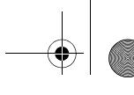
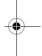

# Table of Contents

|           | Preface xix Acknowledgmentsxxvii List of Checklists xxix List of Tables xxxi List of Figures xxxiii |    |
|-----------|-----------------------------------------------------------------------------------------------------------------------|----|
| Part I | Laying the Foundation                                                                                                 |    |
| 1         | Welcome to Software Construction3                                                                                     |    |
|           | 1.1 What Is Software Construction?                                                                                    | 3  |
|           | 1.2 Why Is Software Construction Important?                                                                        | 6  |
|           | 1.3 How to Read This Book                                                                                             | 8  |
| 2         | Metaphors for a Richer Understanding of Software Development                                                          | 9  |
|           | 2.1 The Importance of Metaphors                                                                                    | 9  |
|           | 2.2 How to Use Software Metaphors                                                                                     | 11 |
|           | 2.3 Common Software Metaphors                                                                                         | 13 |
| 3         | Measure Twice, Cut Once: Upstream Prerequisites 23                                                                    |    |
|           | 3.1 Importance of Prerequisites                                                                                    | 24 |
|           | 3.2 Determine the Kind of Software You're Working On                                                                  | 31 |
|           | 3.3 Problem-Definition Prerequisite                                                                                   | 36 |
|           | 3.4 Requirements Prerequisite                                                                                         | 38 |
|           | 3.5 Architecture Prerequisite                                                                                      | 43 |
|           | 3.6 Amount of Time to Spend on Upstream Prerequisites                                                                 | 55 |
| 4         | Key Construction Decisions 61                                                                                         |    |
|           | 4.1 Choice of Programming Language                                                                                 | 61 |
|           | 4.2 Programming Conventions                                                                                        | 66 |
|           | 4.3 Your Location on the Technology Wave                                                                              | 66 |
|           | 4.4 Selection of Major Construction Practices                                                                      | 69 |

**What do you think of this book?** We want to hear from you!

Microsoft is interested in hearing your feedback about this publication so we can continually improve our books and learning resources for you. To participate in a brief online survey, please visit: *www.microsoft.com/learning/booksurvey/*

## x Table of Contents

| Part II | Creating High-Quality Code |  |  |
|------------|----------------------------|--|--|
|            |                            |  |  |

| 5 | Design in Construction 73                                      |     |
|---|-------------------------------------------------------------------|-----|
|   | 5.1 Design Challenges 74                                          |     |
|   | 5.2 Key Design Concepts 77                                     |     |
|   | 5.3 Design Building Blocks: Heuristics 87                      |     |
|   | 5.4 Design Practices 110                                          |     |
|   | 5.5 Comments on Popular Methodologies 118                         |     |
| 6 | Working Classes 125                                            |     |
|   | 6.1 Class Foundations: Abstract Data Types (ADTs) 126          |     |
|   | 6.2 Good Class Interfaces 133                                     |     |
|   | 6.3 Design and Implementation Issues 143                          |     |
|   | 6.4 Reasons to Create a Class 152                                 |     |
|   | 6.5 Language-Specific Issues 156                                  |     |
|   | 6.6 Beyond Classes: Packages 156                               |     |
| 7 | High-Quality Routines 161                                         |     |
|   | 7.1 Valid Reasons to Create a Routine 164                         |     |
|   | 7.2 Design at the Routine Level 168                               |     |
|   | 7.3 Good Routine Names 171                                     |     |
|   | 7.4 How Long Can a Routine Be? 173                                |     |
|   | 7.5 How to Use Routine Parameters 174                          |     |
|   | 7.6 Special Considerations in the Use of Functions 181            |     |
|   | 7.7 Macro Routines and Inline Routines 182                        |     |
| 8 | Defensive Programming 187                                      |     |
|   | 8.1 Protecting Your Program from Invalid Inputs 188               |     |
|   | 8.2 Assertions 189                                                |     |
|   | 8.3 Error-Handling Techniques 194                                 |     |
|   | 8.4 Exceptions 198                                                |     |
|   | 8.5 Barricade Your Program to Contain the Damage Caused by Errors | 203 |
|   | 8.6 Debugging Aids 205                                            |     |
|   | 8.7 Determining How Much Defensive Programming to Leave in        |     |
|   | Production Code 209                                               |     |
|   | 8.8 Being Defensive About Defensive Programming 210               |     |

|             | Table of Contents                                           | xi  |
|-------------|-------------------------------------------------------------|-----|
| 9           | The Pseudocode Programming Process 215                   |     |
|             | 9.1 Summary of Steps in Building Classes and Routines       | 216 |
|             | 9.2 Pseudocode for Pros                                     | 218 |
|             | 9.3 Constructing Routines by Using the PPP               | 220 |
|             | 9.4 Alternatives to the PPP                                 | 232 |
| Part III | Variables                                                   |     |
| 10          | General Issues in Using Variables 237                       |     |
|             | 10.1 Data Literacy                                          | 238 |
|             | 10.2 Making Variable Declarations Easy                   | 239 |
|             | 10.3 Guidelines for Initializing Variables                  | 240 |
|             | 10.4 Scope                                               | 244 |
|             | 10.5 Persistence                                         | 251 |
|             | 10.6 Binding Time                                           | 252 |
|             | 10.7 Relationship Between Data Types and Control Structures | 254 |
|             | 10.8 Using Each Variable for Exactly One Purpose         | 255 |
| 11          | The Power of Variable Names 259                          |     |
|             | 11.1 Considerations in Choosing Good Names               | 259 |
|             | 11.2 Naming Specific Types of Data                          | 264 |
|             | 11.3 The Power of Naming Conventions                        | 270 |
|             | 11.4 Informal Naming Conventions                         | 272 |
|             | 11.5 Standardized Prefixes                                  | 279 |
|             | 11.6 Creating Short Names That Are Readable              | 282 |
|             | 11.7 Kinds of Names to Avoid                                | 285 |
| 12          | Fundamental Data Types 291                               |     |
|             | 12.1 Numbers in General                                     | 292 |
|             | 12.2 Integers                                               | 293 |
|             | 12.3 Floating-Point Numbers                              | 295 |
|             | 12.4 Characters and Strings                              | 297 |
|             | 12.5 Boolean Variables                                   | 301 |
|             | 12.6 Enumerated Types                                    | 303 |
|             | 12.7 Named Constants                                     | 307 |
|             | 12.8 Arrays                                                 | 310 |
|             | 12.9 Creating Your Own Types (Type Aliasing)             | 311 |

[PUBLISHED BY](021-part-iv-statements.md#page-381-0)

Microsoft Press [A Division of Microsoft Corporation](022-chapter-14-organizing-straight-line-code.md#page-383-0) One Microsoft Way Redmond, Washington 98052-6399

Copyright © 2004 by Steven C. McConnell

[All rights reserved. No part of the contents of this book may be reproduced or transmitted in any form or by](023-chapter-15-using-conditionals.md#page-391-0)  any means without the written permission of the publisher.

Library of Congress Cataloging-in-Publication Data

McConnell, Steve

[Code Complete / Steve McConnell.--2nd ed.](024-chapter-16-controlling-loops.md#page-403-0)

p. cm.

Includes index.

ISBN 0-7356-1967-0

1. Computer Software--Development--Handbooks, manuals, etc. I. Title.

QA76.76.D47M39 2004

005.1--dc22 2004049981

[Printed and bound in the United States of America.](025-chapter-17-unusual-control-structures.md#page-427-0)

15 16 17 18 19 20 21 22 23 24 QGT 6 5 4 3 2 1

Distributed in Canada by H.B. Fenn and Company Ltd. A CIP catalogue record for this book is available from the British Library.

Microsoft Press books are available through booksellers and distributors worldwide. For further information [about international editions, contact your local Microsoft Corporation office or contact Microsoft Press Inter](026-chapter-18-table-driven-methods.md#page-447-0)national directly at fax (425) 936-7329. Visit our Web site at www.microsoft.com/mspress. Send comments to *mspinput@microsoft.com*.

Microsoft, Microsoft Press, PowerPoint, Visual Basic, Windows, and Windows NT are either registered trademarks or trademarks of Microsoft Corporation in the United States and/or other countries. Other product and company names mentioned herein may be the trademarks of their respective owners.

The example companies, organizations, products, domain names, e-mail addresses, logos, people, places, and events depicted herein are fictitious. No association with any real company, organization, product, domain [name, e-mail address, logo, person, place, or event is intended or should be inferred.](027-chapter-19-general-control-issues.md#page-467-0)

This book expresses the author's views and opinions. The information contained in this book is provided without any express, statutory, or implied warranties. Neither the authors, Microsoft Corporation, nor its resellers, or distributors will be held liable for any damages caused or alleged to be caused either directly or indirectly by this book.

**Acquisitions Editors:** Linda Engelman and Robin Van Steenburgh

**Project Editor:** Devon Musgrave

**Indexer:** Bill Myers

**Principal Desktop Publisher:** Carl Diltz

Body Part No. X10-53130

|           | Table of Contents                                                                                                                                                                                                                                                                                | xiii                                          |
|-----------|--------------------------------------------------------------------------------------------------------------------------------------------------------------------------------------------------------------------------------------------------------------------------------------------------|-----------------------------------------------|
|           | 19.3 Null Statements 19.4 Taming Dangerously Deep Nesting 19.5 A Programming Foundation: Structured Programming 19.6 Control Structures and Complexity                                                                                                                                  | 444 445 454 456                      |
| Part V | Code Improvements                                                                                                                                                                                                                                                                                |                                               |
| 20        | The Software-Quality Landscape 463 20.1 Characteristics of Software Quality  20.2 Techniques for Improving Software Quality 20.3 Relative Effectiveness of Quality Techniques 20.4 When to Do Quality Assurance  20.5 The General Principle of Software Quality             | 463 466 469 473 474               |
| 21        | Collaborative Construction 479 21.1 Overview of Collaborative Development Practices  21.2 Pair Programming 21.3 Formal Inspections 21.4 Other Kinds of Collaborative Development Practices                                                                                        | 480 483 485 492                      |
| 22        | Developer Testing 499 22.1 Role of Developer Testing in Software Quality  22.2 Recommended Approach to Developer Testing  22.3 Bag of Testing Tricks  22.4 Typical Errors  22.5 Test-Support Tools 22.6 Improving Your Testing  22.7 Keeping Test Records | 500 503 505 517 523 528 529 |
| 23        | Debugging 535 23.1 Overview of Debugging Issues  23.2 Finding a Defect 23.3 Fixing a Defect 23.4 Psychological Considerations in Debugging  23.5 Debugging Tools—Obvious and Not-So-Obvious                                                                              | 535 540 550 554 556               |

| xiv | Table of Contents                               |
|-----|-------------------------------------------------|
| 24  | Refactoring 563                                 |
|     | 24.1 Kinds of Software Evolution 564            |
|     | 24.2 Introduction to Refactoring 565            |
|     | 24.3 Specific Refactorings 571                  |
|     | 24.4 Refactoring Safely 579                  |
|     | 24.5 Refactoring Strategies 582              |
|     |                                                 |
| 25  | Code-Tuning Strategies 587                      |
|     | 25.1 Performance Overview 588                |
|     | 25.2 Introduction to Code Tuning 591         |
|     | 25.3 Kinds of Fat and Molasses 597              |
|     | 25.4 Measurement 603                            |
|     | 25.5 Iteration 605                           |
|     | 25.6 Summary of the Approach to Code Tuning 606 |

 **[27 How Program Size Affects Construction . . . . . . . . . . . . . . . . . . . . . . . . 649](037-chapter-27-how-program-size-affects-construction.md#page-685-0)**

**Part VI [System Considerations](036-part-vi-system-considerations.md#page-683-0)**

26.1 Logic . . . . . . . . . . . . . . . . . . . . . . . . . . . . . . . . . . . . . . . . . . . . . . . . . . . . . . . . . . . . . . 610 26.2 Loops. . . . . . . . . . . . . . . . . . . . . . . . . . . . . . . . . . . . . . . . . . . . . . . . . . . . . . . . . . . . . . 616 26.3 Data Transformations . . . . . . . . . . . . . . . . . . . . . . . . . . . . . . . . . . . . . . . . . . . . . . . . 624 26.4 Expressions . . . . . . . . . . . . . . . . . . . . . . . . . . . . . . . . . . . . . . . . . . . . . . . . . . . . . . . . . 630 26.5 Routines . . . . . . . . . . . . . . . . . . . . . . . . . . . . . . . . . . . . . . . . . . . . . . . . . . . . . . . . . . . 639 26.6 Recoding in a Low-Level Language . . . . . . . . . . . . . . . . . . . . . . . . . . . . . . . . . . . . 640 26.7 The More Things Change, the More They Stay the Same . . . . . . . . . . . . . . . . . 643

27.1 Communication and Size . . . . . . . . . . . . . . . . . . . . . . . . . . . . . . . . . . . . . . . . . . . . . 650 27.2 Range of Project Sizes . . . . . . . . . . . . . . . . . . . . . . . . . . . . . . . . . . . . . . . . . . . . . . . 651 27.3 Effect of Project Size on Errors . . . . . . . . . . . . . . . . . . . . . . . . . . . . . . . . . . . . . . . . 651 27.4 Effect of Project Size on Productivity. . . . . . . . . . . . . . . . . . . . . . . . . . . . . . . . . . . 653 27.5 Effect of Project Size on Development Activities . . . . . . . . . . . . . . . . . . . . . . . . . 654

|             |                                                   | Table of Contents | xv  |
|-------------|---------------------------------------------------|-------------------|-----|
| 28          | Managing Construction 661                      |                   |     |
|             | 28.1 Encouraging Good Coding                      |                   | 662 |
|             | 28.2 Configuration Management                     |                   | 664 |
|             | 28.3 Estimating a Construction Schedule        |                   | 671 |
|             | 28.4 Measurement                               |                   | 677 |
|             | 28.5 Treating Programmers as People               |                   | 680 |
|             | 28.6 Managing Your Manager                     |                   | 686 |
| 29          | Integration 689                                |                   |     |
|             | 29.1 Importance of the Integration Approach       |                   | 689 |
|             | 29.2 Integration Frequency—Phased or Incremental? |                   | 691 |
|             | 29.3 Incremental Integration Strategies           |                   | 694 |
|             | 29.4 Daily Build and Smoke Test                   |                   | 702 |
| 30          | Programming Tools 709                          |                   |     |
|             | 30.1 Design Tools                              |                   | 710 |
|             | 30.2 Source-Code Tools                            |                   | 710 |
|             | 30.3 Executable-Code Tools                     |                   | 716 |
|             | 30.4 Tool-Oriented Environments                |                   | 720 |
|             | 30.5 Building Your Own Programming Tools          |                   | 721 |
|             | 30.6 Tool Fantasyland                             |                   | 722 |
| Part VII | Software Craftsmanship                            |                   |     |
| 31          | Layout and Style 729                              |                   |     |
|             | 31.1 Layout Fundamentals                          |                   | 730 |
|             | 31.2 Layout Techniques                            |                   | 736 |
|             | 31.3 Layout Styles                                |                   | 738 |
|             | 31.4 Laying Out Control Structures             |                   | 745 |
|             | 31.5 Laying Out Individual Statements          |                   | 753 |
|             | 31.6 Laying Out Comments                       |                   | 763 |
|             | 31.7 Laying Out Routines                          |                   | 766 |
|             | 31.8 Laying Out Classes                        |                   | 768 |

| Table of Contents | xvi |  |  |
|-------------------|-----|--|--|
|-------------------|-----|--|--|

| 32 | Self-Documenting Code 777                                      |     |
|----|-------------------------------------------------------------------|-----|
|    | 32.1 External Documentation 777                                |     |
|    | 32.2 Programming Style as Documentation 778                       |     |
|    | 32.3 To Comment or Not to Comment 781                             |     |
|    | 32.4 Keys to Effective Comments 785                               |     |
|    | 32.5 Commenting Techniques 792                                    |     |
|    | 32.6 IEEE Standards 813                                        |     |
| 33 | Personal Character 819                                         |     |
|    | 33.1 Isn't Personal Character Off the Topic? 820               |     |
|    | 33.2 Intelligence and Humility 821                                |     |
|    | 33.3 Curiosity 822                                                |     |
|    | 33.4 Intellectual Honesty 826                                  |     |
|    | 33.5 Communication and Cooperation 828                            |     |
|    | 33.6 Creativity and Discipline 829                                |     |
|    | 33.7 Laziness 830                                              |     |
|    | 33.8 Characteristics That Don't Matter As Much As You Might Think | 830 |
|    | 33.9 Habits 833                                                |     |
| 34 | Themes in Software Craftsmanship 837                              |     |
|    | 34.1 Conquer Complexity 837                                       |     |
|    | 34.2 Pick Your Process 839                                        |     |
|    | 34.3 Write Programs for People First, Computers Second 841        |     |
|    | 34.4 Program into Your Language, Not in It 843                 |     |
|    | 34.5 Focus Your Attention with the Help of Conventions 844        |     |
|    | 34.6 Program in Terms of the Problem Domain 845                   |     |
|    | 34.7 Watch for Falling Rocks 848                                  |     |
|    | 34.8 Iterate, Repeatedly, Again and Again 850                  |     |
|    | 34.9 Thou Shalt Rend Software and Religion Asunder 851         |     |

|    |                                              | Table of Contents | xvii |
|----|----------------------------------------------|-------------------|------|
| 35 | Where to Find More Information 855           |                   |      |
|    | 35.1 Information About Software Construction |                   | 856  |
|    | 35.2 Topics Beyond Construction           |                   | 857  |
|    | 35.3 Periodicals                          |                   | 859  |
|    | 35.4 A Software Developer's Reading Plan     |                   | 860  |
|    | 35.5 Joining a Professional Organization     |                   | 862  |
|    | Bibliography 863                             |                   |      |
|    | Index 885                                    |                   |      |
