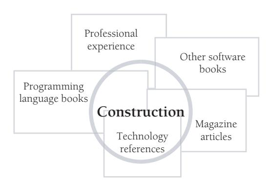

# Preface

*The gap between the best software engineering practice and the average practice is very wide—perhaps wider than in any other engineering discipline. A tool that disseminates good practice would be important.*

*—Fred Brooks*

My primary concern in writing this book has been to narrow the gap between the knowledge of industry gurus and professors on the one hand and common commercial practice on the other. Many powerful programming techniques hide in journals and academic papers for years before trickling down to the programming public.

Although leading-edge software-development practice has advanced rapidly in recent years, common practice hasn't. Many programs are still buggy, late, and over budget, and many fail to satisfy the needs of their users. Researchers in both the software industry and academic settings have discovered effective practices that eliminate most of the programming problems that have been prevalent since the 1970s. Because these practices aren't often reported outside the pages of highly specialized technical journals, however, most programming organizations aren't yet using them today. Studies have found that it typically takes 5 to 15 years or more for a research development to make its way into commercial practice (Raghavan and Chand 1989, Rogers 1995, Parnas 1999). This handbook shortcuts the process, making key discoveries available to the average programmer now.

## Who Should Read This Book?

The research and programming experience collected in this handbook will help you to create higher-quality software and to do your work more quickly and with fewer problems. This book will give you insight into why you've had problems in the past and will show you how to avoid problems in the future. The programming practices described here will help you keep big projects under control and help you maintain and modify software successfully as the demands of your projects change.

### Experienced Programmers

This handbook serves experienced programmers who want a comprehensive, easy-touse guide to software development. Because this book focuses on construction, the most familiar part of the software life cycle, it makes powerful software development techniques understandable to self-taught programmers as well as to programmers with formal training.

#### Technical Leads

Many technical leads have used *Code Complete* to educate less-experienced programmers on their teams. You can also use it to fill your own knowledge gaps. If you're an experienced programmer, you might not agree with all my conclusions (and I would be surprised if you did), but if you read this book and think about each issue, only rarely will someone bring up a construction issue that you haven't previously considered.

#### Self-Taught Programmers

If you haven't had much formal training, you're in good company. About 50,000 new developers enter the profession each year (BLS 2004, Hecker 2004), but only about 35,000 software-related degrees are awarded each year (NCES 2002). From these figures it's a short hop to the conclusion that many programmers don't receive a formal education in software development. Self-taught programmers are found in the emerging group of professionals—engineers, accountants, scientists, teachers, and smallbusiness owners—who program as part of their jobs but who do not necessarily view themselves as programmers. Regardless of the extent of your programming education, this handbook can give you insight into effective programming practices.

#### Students

The counterpoint to the programmer with experience but little formal training is the fresh college graduate. The recent graduate is often rich in theoretical knowledge but poor in the practical know-how that goes into building production programs. The practical lore of good coding is often passed down slowly in the ritualistic tribal dances of software architects, project leads, analysts, and more-experienced programmers. Even more often, it's the product of the individual programmer's trials and errors. This book is an alternative to the slow workings of the traditional intellectual potlatch. It pulls together the helpful tips and effective development strategies previously available mainly by hunting and gathering from other people's experience. It's a hand up for the student making the transition from an academic environment to a professional one.

#### Where Else Can You Find This Information?

This book synthesizes construction techniques from a variety of sources. In addition to being widely scattered, much of the accumulated wisdom about construction has resided outside written sources for years (Hildebrand 1989, McConnell 1997a). There is nothing mysterious about the effective, high-powered programming techniques used by expert programmers. In the day-to-day rush of grinding out the latest project, however, few experts take the time to share what they have learned. Consequently, programmers may have difficulty finding a good source of programming information.

The techniques described in this book fill the void after introductory and advanced programming texts. After you have read *Introduction to Java*, *Advanced Java*, and *Advanced Advanced Java*, what book do you read to learn more about programming? You could read books about the details of Intel or Motorola hardware, Microsoft Windows or Linux operating-system functions, or another programming language—you can't use a language or program in an environment without a good reference to such details. But this is one of the few books that discusses programming per se. Some of the most beneficial programming aids are practices that you can use regardless of the environment or language you're working in. Other books generally neglect such practices, which is why this book concentrates on them.

The information in this book is distilled from many sources, as shown below. The only other way to obtain the information you'll find in this handbook would be to plow through a mountain of books and a few hundred technical journals and then add a significant amount of real-world experience. If you've already done all that, you can still benefit from this book's collecting the information in one place for easy reference.

#### Key Benefits of This Handbook

Whatever your background, this handbook can help you write better programs in less time and with fewer headaches.

*Complete software-construction reference* This handbook discusses general aspects of construction such as software quality and ways to think about programming. It gets into nitty-gritty construction details such as steps in building classes, ins and outs of using data and control structures, debugging, refactoring, and code-tuning techniques and strategies. You don't need to read it cover to cover to learn about these topics. The book is designed to make it easy to find the specific information that interests you.

*Ready-to-use checklists* This book includes dozens of checklists you can use to assess your software architecture, design approach, class and routine quality, variable names, control structures, layout, test cases, and much more.

*State-of-the-art information* This handbook describes some of the most up-to-date techniques available, many of which have not yet made it into common use. Because this book draws from both practice and research, the techniques it describes will remain useful for years.

*Larger perspective on software development* This book will give you a chance to rise above the fray of day-to-day fire fighting and figure out what works and what doesn't. Few practicing programmers have the time to read through the hundreds of books and journal articles that have been distilled into this handbook. The research and realworld experience gathered into this handbook will inform and stimulate your thinking about your projects, enabling you to take strategic action so that you don't have to fight the same battles again and again.

*Absence of hype* Some software books contain 1 gram of insight swathed in 10 grams of hype. This book presents balanced discussions of each technique's strengths and weaknesses. You know the demands of your particular project better than anyone else. This book provides the objective information you need to make good decisions about your specific circumstances.

*Concepts applicable to most common languages* This book describes techniques you can use to get the most out of whatever language you're using, whether it's C++, C#, Java, Microsoft Visual Basic, or other similar languages.

*Numerous code examples* The book contains almost 500 examples of good and bad code. I've included so many examples because, personally, I learn best from examples. I think other programmers learn best that way too.

The examples are in multiple languages because mastering more than one language is often a watershed in the career of a professional programmer. Once a programmer realizes that programming principles transcend the syntax of any specific language, the doors swing open to knowledge that truly makes a difference in quality and productivity.

To make the multiple-language burden as light as possible, I've avoided esoteric language features except where they're specifically discussed. You don't need to understand every nuance of the code fragments to understand the points they're making. If you focus on the point being illustrated, you'll find that you can read the code regardless of the language. I've tried to make your job even easier by annotating the significant parts of the examples.

*Access to other sources of information* This book collects much of the available information on software construction, but it's hardly the last word. Throughout the chapters, "Additional Resources" sections describe other books and articles you can read as you pursue the topics you find most interesting.

**cc2e.com/1234** *Book website* Updated checklists, books, magazine articles, Web links, and other content are provided on a companion website at *cc2e.com*. To access information related to *Code Complete*, 2d ed., enter *cc2e.com/* followed by a four-digit code, an example of which is shown here in the left margin. These website references appear throughout the book.

#### Why This Handbook Was Written

The need for development handbooks that capture knowledge about effective development practices is well recognized in the software-engineering community. A report of the Computer Science and Technology Board stated that the biggest gains in software-development quality and productivity will come from codifying, unifying, and distributing existing knowledge about effective software-development practices (CSTB 1990, McConnell 1997a). The board concluded that the strategy for spreading that knowledge should be built on the concept of software-engineering handbooks.

#### The Topic of Construction Has Been Neglected

At one time, software development and coding were thought to be one and the same. But as distinct activities in the software-development life cycle have been identified, some of the best minds in the field have spent their time analyzing and debating methods of project management, requirements, design, and testing. The rush to study these newly identified areas has left code construction as the ignorant cousin of software development.

Discussions about construction have also been hobbled by the suggestion that treating construction as a distinct software development *activity* implies that construction must also be treated as a distinct *phase*. In reality, software activities and phases don't have to be set up in any particular relationship to each other, and it's useful to discuss the activity of construction regardless of whether other software activities are performed in phases, in iterations, or in some other way.

#### Construction Is Important

Another reason construction has been neglected by researchers and writers is the mistaken idea that, compared to other software-development activities, construction is a relatively mechanical process that presents little opportunity for improvement. Nothing could be further from the truth.

Code construction typically makes up about 65 percent of the effort on small projects and 50 percent on medium projects. Construction accounts for about 75 percent of the errors on small projects and 50 to 75 percent on medium and large projects. Any activity that accounts for 50 to 75 percent of the errors presents a clear opportunity for improvement. (Chapter 27 contains more details on these statistics.)

Some commentators have pointed out that although construction errors account for a high percentage of total errors, construction errors tend to be less expensive to fix than those caused by requirements and architecture, the suggestion being that they are therefore less important. The claim that construction errors cost less to fix is true but misleading because the cost of not fixing them can be incredibly high. Researchers have found that small-scale coding errors account for some of the most expensive software errors of all time, with costs running into hundreds of millions of dollars (Weinberg 1983, SEN 1990). An inexpensive cost to fix obviously does not imply that fixing them should be a low priority.

The irony of the shift in focus away from construction is that construction is the only activity that's guaranteed to be done. Requirements can be assumed rather than developed; architecture can be shortchanged rather than designed; and testing can be abbreviated or skipped rather than fully planned and executed. But if there's going to be a program, there has to be construction, and that makes construction a uniquely fruitful area in which to improve development practices.

#### No Comparable Book Is Available

In light of construction's obvious importance, I was sure when I conceived this book that someone else would already have written a book on effective construction practices. The need for a book about how to program effectively seemed obvious. But I found that only a few books had been written about construction and then only on parts of the topic. Some had been written 15 years or more earlier and employed relatively esoteric languages such as ALGOL, PL/I, Ratfor, and Smalltalk. Some were written by professors who were not working on production code. The professors wrote about techniques that worked for student projects, but they often had little idea of how the techniques would play out in full-scale development environments. Still other books trumpeted the authors' newest favorite methodologies but ignored the huge repository of mature practices that have proven their effectiveness over time.

When art critics get together they talk about Form and Structure and Meaning. When artists get together they talk about where you can buy cheap turpentine. —Pablo Picasso

In short, I couldn't find any book that had even attempted to capture the body of practical techniques available from professional experience, industry research, and academic work. The discussion needed to be brought up to date for current programming languages, object-oriented programming, and leading-edge development practices. It seemed clear that a book about programming needed to be written by someone who was knowledgeable about the theoretical state of the art but who was also building enough production code to appreciate the state of the practice. I

conceived this book as a full discussion of code construction—from one programmer to another.

#### Author Note

I welcome your inquiries about the topics discussed in this book, your error reports, or other related subjects. Please contact me at *stevemcc@construx.com*, or visit my website at *www.stevemcconnell.com*.

> *Bellevue, Washington Memorial Day, 2004*

#### Microsoft Learning Technical Support

Every effort has been made to ensure the accuracy of this book. Microsoft Press provides corrections for books through the World Wide Web at the following address:

*http://www.microsoft.com/learning/support/*

To connect directly to the Microsoft Knowledge Base and enter a query regarding a question or issue that you may have, go to:

*http://www.microsoft.com/learning/support/search.asp*

If you have comments, questions, or ideas regarding this book, please send them to Microsoft Press using either of the following methods:

Postal Mail:

*Microsoft Press Attn: Code Complete 2E Editor One Microsoft Way Redmond, WA 98052-6399*

E-mail:

*mspinput@microsoft.com*
