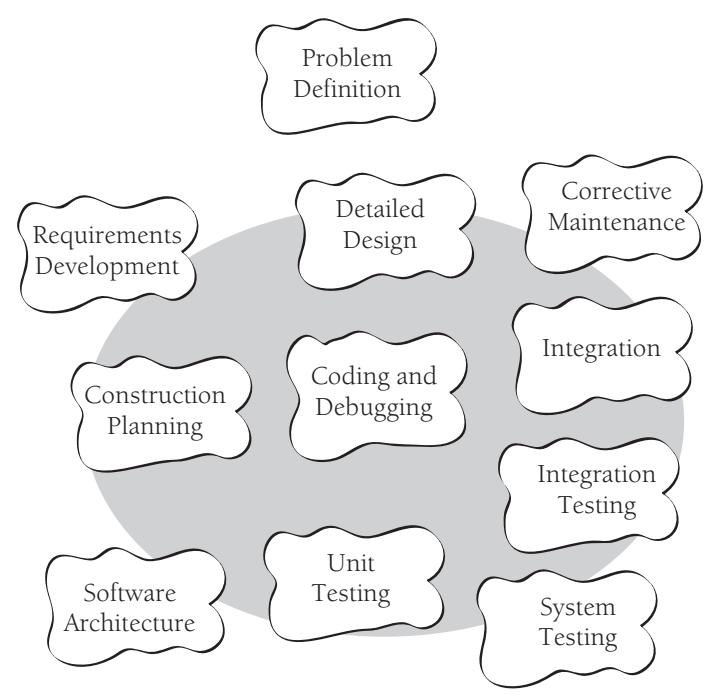
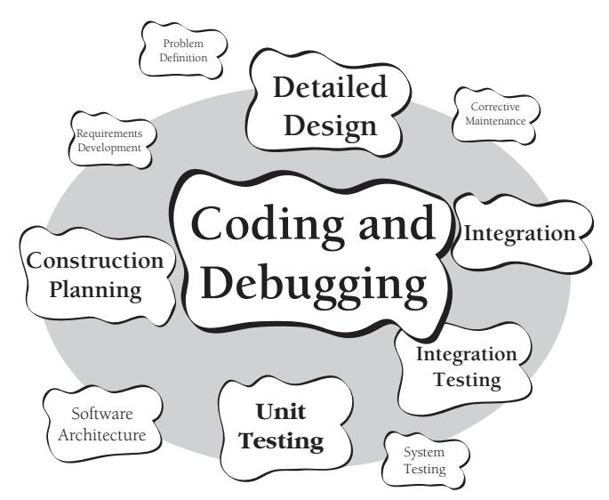
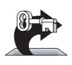

# Chapter 1: Welcome to Software Construction

### cc2e.com/0178 Contents

- 1.1 What Is Software Construction?: page 3
- 1.2 Why Is Software Construction Important?: page 6
- 1.3 How to Read This Book: page 8

#### Related Topics

- Who should read this book: Preface
- Benefits of reading the book: Preface
- Why the book was written: Preface

You know what "construction" means when it's used outside software development. "Construction" is the work "construction workers" do when they build a house, a school, or a skyscraper. When you were younger, you built things out of "construction paper." In common usage, "construction" refers to the process of building. The construction process might include some aspects of planning, designing, and checking your work, but mostly "construction" refers to the hands-on part of creating something.

#### 1.1 What Is Software Construction?

Developing computer software can be a complicated process, and in the last 25 years, researchers have identified numerous distinct activities that go into software development. They include

- Problem definition
- Requirements development
- Construction planning
- Software architecture, or high-level design
- Detailed design
- Coding and debugging
- Unit testing

- Integration testing
- Integration
- System testing
- Corrective maintenance

If you've worked on informal projects, you might think that this list represents a lot of red tape. If you've worked on projects that are too formal, you *know* that this list represents a lot of red tape! It's hard to strike a balance between too little and too much formality, and that's discussed later in the book.

If you've taught yourself to program or worked mainly on informal projects, you might not have made distinctions among the many activities that go into creating a software product. Mentally, you might have grouped all of these activities together as "programming." If you work on informal projects, the main activity you think of when you think about creating software is probably the activity the researchers refer to as "construction."

This intuitive notion of "construction" is fairly accurate, but it suffers from a lack of perspective. Putting construction in its context with other activities helps keep the focus on the right tasks during construction and appropriately emphasizes important nonconstruction activities. Figure 1-1 illustrates construction's place related to other software-development activities.

**Figure 1-1** Construction activities are shown inside the gray circle. Construction focuses on coding and debugging but also includes detailed design, unit testing, integration testing, and other activities.

As the figure indicates, construction is mostly coding and debugging but also involves detailed design, construction planning, unit testing, integration, integration testing, and other activities. If this were a book about all aspects of software development, it would feature nicely balanced discussions of all activities in the development process. Because this is a handbook of construction techniques, however, it places a lopsided emphasis on construction and only touches on related topics. If this book were a dog, it would nuzzle up to construction, wag its tail at design and testing, and bark at the other development activities.

Construction is also sometimes known as "coding" or "programming." "Coding" isn't really the best word because it implies the mechanical translation of a preexisting design into a computer language; construction is not at all mechanical and involves substantial creativity and judgment. Throughout the book, I use "programming" interchangeably with "construction."

In contrast to Figure 1-1's flat-earth view of software development, Figure 1-2 shows the round-earth perspective of this book.

**Figure 1-2** This book focuses on coding and debugging, detailed design, construction planning, unit testing, integration, integration testing, and other activities in roughly these proportions.

Figure 1-1 and Figure 1-2 are high-level views of construction activities, but what about the details? Here are some of the specific tasks involved in construction:

- Verifying that the groundwork has been laid so that construction can proceed successfully
- Determining how your code will be tested

- Designing and writing classes and routines
- Creating and naming variables and named constants
- Selecting control structures and organizing blocks of statements
- Unit testing, integration testing, and debugging your own code
- Reviewing other team members' low-level designs and code and having them review yours
- Polishing code by carefully formatting and commenting it
- Integrating software components that were created separately
- Tuning code to make it faster and use fewer resources

For an even fuller list of construction activities, look through the chapter titles in the table of contents.

With so many activities at work in construction, you might say, "OK, Jack, what activities are *not* part of construction?" That's a fair question. Important nonconstruction activities include management, requirements development, software architecture, user-interface design, system testing, and maintenance. Each of these activities affects the ultimate success of a project as much as construction—at least the success of any project that calls for more than one or two people and lasts longer than a few weeks. You can find good books on each activity; many are listed in the "Additional Resources" sections throughout the book and in Chapter 35, "Where to Find More Information," at the end of the book.

### 1.2 Why Is Software Construction Important?

Since you're reading this book, you probably agree that improving software quality and developer productivity is important. Many of today's most exciting projects use software extensively. The Internet, movie special effects, medical life-support systems, space programs, aeronautics, high-speed financial analysis, and scientific research are a few examples. These projects and more conventional projects can all benefit from improved practices because many of the fundamentals are the same.

If you agree that improving software development is important in general, the question for you as a reader of this book becomes, Why is construction an important focus?

Here's why:

**Cross-Reference** For details on the relationship between project size and the percentage of time consumed by construction, see "Activity Proportions and Size" in Section 27.5.

*Construction is a large part of software development* Depending on the size of the project, construction typically takes 30 to 80 percent of the total time spent on a project. Anything that takes up that much project time is bound to affect the success of the project.

*Construction is the central activity in software development* Requirements and architecture are done before construction so that you can do construction effectively. System testing (in the strict sense of independent testing) is done after construction to verify that construction has been done correctly. Construction is at the center of the software-development process.

**Cross-Reference** For data on variations among programmers, see "Individual Variation" in Section 28.5.

*With a focus on construction, the individual programmer's productivity can improve enormously* A classic study by Sackman, Erikson, and Grant showed that the productivity of individual programmers varied by a factor of 10 to 20 during construction (1968). Since their study, their results have been confirmed by numerous other studies (Curtis 1981, Mills 1983, Curtis et al. 1986, Card 1987, Valett and McGarry 1989, DeMarco and Lister 1999, Boehm et al. 2000). This book helps all programmers learn techniques that are already used by the best programmers.

*Construction's product, the source code, is often the only accurate description of the software* In many projects, the only documentation available to programmers is the code itself. Requirements specifications and design documents can go out of date, but the source code is always up to date. Consequently, it's imperative that the source code be of the highest possible quality. Consistent application of techniques for source-code improvement makes the difference between a Rube Goldberg contraption and a detailed, correct, and therefore informative program. Such techniques are most effectively applied during construction.

KEY POINT

*Construction is the only activity that's guaranteed to be done* The ideal software project goes through careful requirements development and architectural design before construction begins. The ideal project undergoes comprehensive, statistically controlled system testing after construction. Imperfect, real-world projects, however, often skip requirements and design to jump into construction. They drop testing because they have too many errors to fix and they've run out of time. But no matter how rushed or poorly planned a project is, you can't drop construction; it's where the rubber meets the road. Improving construction is thus a way of improving any software-development effort, no matter how abbreviated.

#### 1.3 How to Read This Book

This book is designed to be read either cover to cover or by topic. If you like to read books cover to cover, you might simply dive into Chapter 2, "Metaphors for a Richer Understanding of Software Development." If you want to get to specific programming tips, you might begin with Chapter 6, "Working Classes," and then follow the cross references to other topics you find interesting. If you're not sure whether any of this applies to you, begin with Section 3.2, "Determine the Kind of Software You're Working On."

#### Key Points

- Software construction is the central activity in software development; construction is the only activity that's guaranteed to happen on every project.
- The main activities in construction are detailed design, coding, debugging, integration, and developer testing (unit testing and integration testing).
- Other common terms for construction are "coding" and "programming."
- The quality of the construction substantially affects the quality of the software.
- In the final analysis, your understanding of how to do construction determines how good a programmer you are, and that's the subject of the rest of the book.
