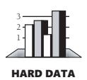
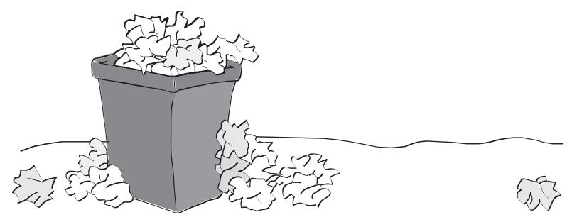
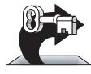
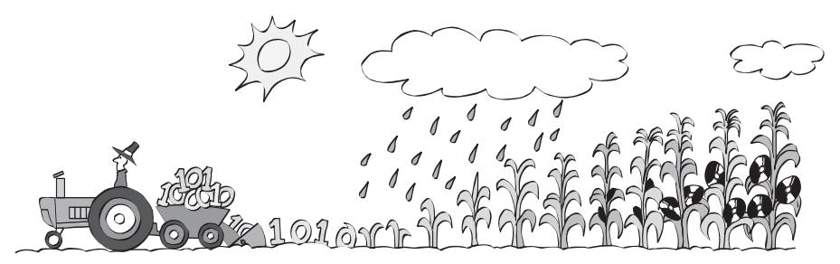
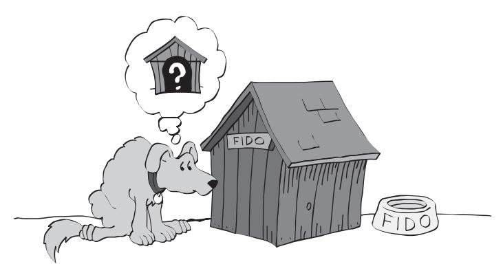
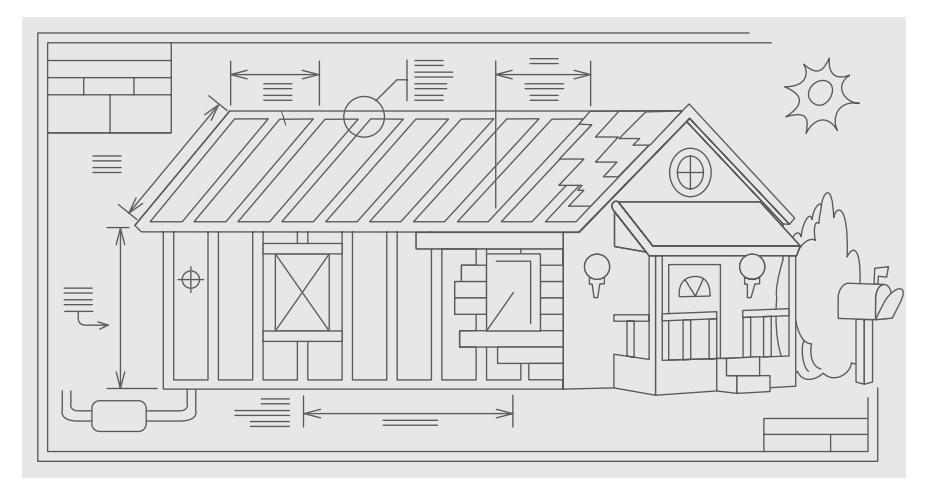

# Chapter 2: Metaphors for a Richer Understanding of Software Development

### cc2e.com/0278 Contents

- 2.1 The Importance of Metaphors: page 9
- 2.2 How to Use Software Metaphors: page 11
- 2.3 Common Software Metaphors: page 13

#### Related Topic

■ Heuristics in design: "Design Is a Heuristic Process" in Section 5.1

Computer science has some of the most colorful language of any field. In what other field can you walk into a sterile room, carefully controlled at 68°F, and find viruses, Trojan horses, worms, bugs, bombs, crashes, flames, twisted sex changers, and fatal errors?

These graphic metaphors describe specific software phenomena. Equally vivid metaphors describe broader phenomena, and you can use them to improve your understanding of the software-development process.

The rest of the book doesn't directly depend on the discussion of metaphors in this chapter. Skip it if you want to get to the practical suggestions. Read it if you want to think about software development more clearly.

#### 2.1 The Importance of Metaphors

Important developments often arise out of analogies. By comparing a topic you understand poorly to something similar you understand better, you can come up with insights that result in a better understanding of the less-familiar topic. This use of metaphor is called "modeling."

The history of science is full of discoveries based on exploiting the power of metaphors. The chemist Kekulé had a dream in which he saw a snake grasp its tail in its mouth. When he awoke, he realized that a molecular structure based on a similar ring shape would account for the properties of benzene. Further experimentation confirmed the hypothesis (Barbour 1966).

The kinetic theory of gases was based on a "billiard-ball" model. Gas molecules were thought to have mass and to collide elastically, as billiard balls do, and many useful theorems were developed from this model.

The wave theory of light was developed largely by exploring similarities between light and sound. Light and sound have amplitude (brightness, loudness), frequency (color, pitch), and other properties in common. The comparison between the wave theories of sound and light was so productive that scientists spent a great deal of effort looking for a medium that would propagate light the way air propagates sound. They even gave it a name —"ether"—but they never found the medium. The analogy that had been so fruitful in some ways proved to be misleading in this case.

In general, the power of models is that they're vivid and can be grasped as conceptual wholes. They suggest properties, relationships, and additional areas of inquiry. Sometimes a model suggests areas of inquiry that are misleading, in which case the metaphor has been overextended. When the scientists looked for ether, they overextended their model.

As you might expect, some metaphors are better than others. A good metaphor is simple, relates well to other relevant metaphors, and explains much of the experimental evidence and other observed phenomena.

Consider the example of a heavy stone swinging back and forth on a string. Before Galileo, an Aristotelian looking at the swinging stone thought that a heavy object moved naturally from a higher position to a state of rest at a lower one. The Aristotelian would think that what the stone was really doing was falling with difficulty. When Galileo saw the swinging stone, he saw a pendulum. He thought that what the stone was really doing was repeating the same motion again and again, almost perfectly.

The suggestive powers of the two models are quite different. The Aristotelian who saw the swinging stone as an object falling would observe the stone's weight, the height to which it had been raised, and the time it took to come to rest. For Galileo's pendulum model, the prominent factors were different. Galileo observed the stone's weight, the radius of the pendulum's swing, the angular displacement, and the time per swing. Galileo discovered laws the Aristotelians could not discover because their model led them to look at different phenomena and ask different questions.

Metaphors contribute to a greater understanding of software-development issues in the same way that they contribute to a greater understanding of scientific questions. In his 1973 Turing Award lecture, Charles Bachman described the change from the prevailing earth-centered view of the universe to a sun-centered view. Ptolemy's earthcentered model had lasted without serious challenge for 1400 years. Then in 1543, Copernicus introduced a heliocentric theory, the idea that the sun rather than the earth was the center of the universe. This change in mental models led ultimately to the discovery of new planets, the reclassification of the moon as a satellite rather than as a planet, and a different understanding of humankind's place in the universe.

The value of metaphors should not be underestimated. Metaphors have the virtue of an expected behavior that is understood by all. Unnecessary communication and misunderstandings are reduced. Learning and education are quicker. In effect, metaphors are a way of internalizing and abstracting concepts, allowing one's thinking to be on a higher plane and low-level mistakes to be avoided.

—*Fernando J. Corbató*

Bachman compared the Ptolemaic-to-Copernican change in astronomy to the change in computer programming in the early 1970s. When Bachman made the comparison in 1973, data processing was changing from a computer-centered view of information systems to a database-centered view. Bachman pointed out that the ancients of data processing wanted to view all data as a sequential stream of cards flowing through a computer (the computer-centered view). The change was to focus on a pool of data on which the computer happened to act (a database-oriented view).

Today it's difficult to imagine anyone thinking that the sun moves around the earth. Similarly, it's difficult to imagine a programmer thinking that all data could be viewed as a sequential stream of cards. In both cases, once the old theory has been discarded, it seems incredible that anyone ever believed it at all. More fantastically, people who believed the old theory thought the new theory was just as ridiculous then as you think the old theory is now.

The earth-centered view of the universe hobbled astronomers who clung to it after a better theory was available. Similarly, the computer-centered view of the computing universe hobbled computer scientists who held on to it after the database-centered theory was available.

It's tempting to trivialize the power of metaphors. To each of the earlier examples, the natural response is to say, "Well, of course the right metaphor is more useful. The other metaphor was wrong!" Though that's a natural reaction, it's simplistic. The history of science isn't a series of switches from the "wrong" metaphor to the "right" one. It's a series of changes from "worse" metaphors to "better" ones, from less inclusive to more inclusive, from suggestive in one area to suggestive in another.

In fact, many models that have been replaced by better models are still useful. Engineers still solve most engineering problems by using Newtonian dynamics even though, theoretically, Newtonian dynamics have been supplanted by Einsteinian theory.

Software development is a younger field than most other sciences. It's not yet mature enough to have a set of standard metaphors. Consequently, it has a profusion of complementary and conflicting metaphors. Some are better than others. Some are worse. How well you understand the metaphors determines how well you understand software development.

### 2.2 How to Use Software Metaphors

A software metaphor is more like a searchlight than a road map. It doesn't tell you where to find the answer; it tells you how to look for it. A metaphor serves more as a heuristic than it does as an algorithm.

An algorithm is a set of well-defined instructions for carrying out a particular task. An algorithm is predictable, deterministic, and not subject to chance. An algorithm tells

you how to go from point A to point B with no detours, no side trips to points D, E, and F, and no stopping to smell the roses or have a cup of joe.

A heuristic is a technique that helps you look for an answer. Its results are subject to chance because a heuristic tells you only how to look, not what to find. It doesn't tell you how to get directly from point A to point B; it might not even know where point A and point B are. In effect, a heuristic is an algorithm in a clown suit. It's less predictable, it's more fun, and it comes without a 30-day, money-back guarantee.

Here is an algorithm for driving to someone's house: Take Highway 167 south to Puyallup. Take the South Hill Mall exit and drive 4.5 miles up the hill. Turn right at the light by the grocery store, and then take the first left. Turn into the driveway of the large tan house on the left, at 714 North Cedar.

**Cross-Reference** For details on how to use heuristics in designing software, see "Design Is a Heuristic Process" in Section 5.1.

Here's a heuristic for getting to someone's house: Find the last letter we mailed you. Drive to the town in the return address. When you get to town, ask someone where our house is. Everyone knows us—someone will be glad to help you. If you can't find anyone, call us from a public phone, and we'll come get you.

The difference between an algorithm and a heuristic is subtle, and the two terms overlap somewhat. For the purposes of this book, the main difference between the two is the level of indirection from the solution. An algorithm gives you the instructions directly. A heuristic tells you how to discover the instructions for yourself, or at least where to look for them.

Having directions that told you exactly how to solve your programming problems would certainly make programming easier and the results more predictable. But programming science isn't yet that advanced and may never be. The most challenging part of programming is conceptualizing the problem, and many errors in programming are conceptual errors. Because each program is conceptually unique, it's difficult or impossible to create a general set of directions that lead to a solution in every case. Thus, knowing how to approach problems in general is at least as valuable as knowing specific solutions for specific problems.

How do you use software metaphors? Use them to give you insight into your programming problems and processes. Use them to help you think about your programming activities and to help you imagine better ways of doing things. You won't be able to look at a line of code and say that it violates one of the metaphors described in this chapter. Over time, though, the person who uses metaphors to illuminate the software-development process will be perceived as someone who has a better understanding of programming and produces better code faster than people who don't use them.

#### 2.3 Common Software Metaphors

A confusing abundance of metaphors has grown up around software development. David Gries says writing software is a science (1981). Donald Knuth says it's an art (1998). Watts Humphrey says it's a process (1989). P. J. Plauger and Kent Beck say it's like driving a car, although they draw nearly opposite conclusions (Plauger 1993, Beck 2000). Alistair Cockburn says it's a game (2002). Eric Raymond says it's like a bazaar (2000). Andy Hunt and Dave Thomas say it's like gardening. Paul Heckel says it's like filming *Snow White and the Seven Dwarfs* (1994). Fred Brooks says that it's like farming, hunting werewolves, or drowning with dinosaurs in a tar pit (1995). Which are the best metaphors?

#### Software Penmanship: Writing Code

The most primitive metaphor for software development grows out of the expression "writing code." The writing metaphor suggests that developing a program is like writing a casual letter—you sit down with pen, ink, and paper and write it from start to finish. It doesn't require any formal planning, and you figure out what you want to say as you go.

Many ideas derive from the writing metaphor. Jon Bentley says you should be able to sit down by the fire with a glass of brandy, a good cigar, and your favorite hunting dog to enjoy a "literate program" the way you would a good novel. Brian Kernighan and P. J. Plauger named their programming-style book *The Elements of Programming Style* (1978) after the writing-style book *The Elements of Style* (Strunk and White 2000). Programmers often talk about "program readability."

For an individual's work or for small-scale projects, the letter-writing metaphor works adequately, but for other purposes it leaves the party early—it doesn't describe software development fully or adequately. Writing is usually a one-person activity, whereas a software project will most likely involve many people with many different responsibilities. When you finish writing a letter, you stuff it into an envelope and mail it. You can't change it anymore, and for all intents and purposes it's complete. Software isn't as difficult to change and is hardly ever fully complete. As much as 90 percent of the development effort on a typical software system comes after its initial release, with two-thirds being typical (Pigoski 1997). In writing, a high premium is placed on originality. In software construction, trying to create truly original work is often less effective than focusing on the reuse of design ideas, code, and test cases from previous projects. In short, the writing metaphor implies a software-development process that's too simple and rigid to be healthy.

Plan to throw one away; you will, anyhow. —*Fred Brooks*

If you plan to throw one

away, you will throw away two.

—*Craig Zerouni*

Unfortunately, the letter-writing metaphor has been perpetuated by one of the most popular software books on the planet, Fred Brooks's *The Mythical Man-Month* (Brooks 1995). Brooks says, "Plan to throw one away; you will, anyhow." This conjures up an image of a pile of half-written drafts thrown into a wastebasket, as shown in Figure 2-1.

**Figure 2-1** The letter-writing metaphor suggests that the software process relies on expensive trial and error rather than careful planning and design.

Planning to throw one away might be practical when you're writing a polite how-doyou-do to your aunt. But extending the metaphor of "writing" software to a plan to throw one away is poor advice for software development, where a major system already costs as much as a 10-story office building or an ocean liner. It's easy to grab the brass ring if you can afford to sit on your favorite wooden pony for an unlimited number of spins around the carousel. The trick is to get it the first time around—or to take several chances when they're cheapest. Other metaphors better illuminate ways of attaining such goals.

#### Software Farming: Growing a System

In contrast to the rigid writing metaphor, some software developers say you should envision creating software as something like planting seeds and growing crops. You design a piece, code a piece, test a piece, and add it to the system a little bit at a time. By taking small steps, you minimize the trouble you can get into at any one time.

KEY POINT

**Further Reading** For an illustration of a different farming metaphor, one that's applied to software maintenance, see the chapter "On the Origins of Designer Intuition" in *Rethinking Systems Analysis and Design* (Weinberg 1988).

Sometimes a good technique is described with a bad metaphor. In such cases, try to keep the technique and come up with a better metaphor. In this case, the incremental technique is valuable, but the farming metaphor is terrible.

The idea of doing a little bit at a time might bear some resemblance to the way crops grow, but the farming analogy is weak and uninformative, and it's easy to replace with the better metaphors described in the following sections. It's hard to extend the farming metaphor beyond the simple idea of doing things a little bit at a time. If you buy into the farming metaphor, imagined in Figure 2-2, you might find yourself talking about fertilizing the system plan, thinning the detailed design, increasing code yields through effective land management, and harvesting the code itself. You'll talk about

rotating in a crop of C++ instead of barley, of letting the land rest for a year to increase the supply of nitrogen in the hard disk.

The weakness in the software-farming metaphor is its suggestion that you don't have any direct control over how the software develops. You plant the code seeds in the spring. *Farmer's Almanac* and the Great Pumpkin willing, you'll have a bumper crop of code in the fall.

**Figure 2-2** It's hard to extend the farming metaphor to software development appropriately.

#### Software Oyster Farming: System Accretion

Sometimes people talk about growing software when they really mean software accretion. The two metaphors are closely related, but software accretion is the more insightful image. "Accretion," in case you don't have a dictionary handy, means any growth or increase in size by a gradual external addition or inclusion. Accretion describes the way an oyster makes a pearl, by gradually adding small amounts of calcium carbonate. In geology, "accretion" means a slow addition to land by the deposit of waterborne sediment. In legal terms, "accretion" means an increase of land along the shores of a body of water by the deposit of waterborne sediment.

**Cross-Reference** For details on how to apply incremental strategies to system integration, see Section 29.2, "Integration Frequency—Phased or Incremental?"

This doesn't mean that you have to learn how to make code out of waterborne sediment; it means that you have to learn how to add to your software systems a small amount at a time. Other words closely related to accretion are "incremental," "iterative," "adaptive," and "evolutionary." Incremental designing, building, and testing are some of the most powerful software-development concepts available.

In incremental development, you first make the simplest possible version of the system that will run. It doesn't have to accept realistic input, it doesn't have to perform realistic manipulations on data, it doesn't have to produce realistic output—it just has to be a skeleton strong enough to hold the real system as it's developed. It might call dummy classes for each of the basic functions you have identified. This basic beginning is like the oyster's beginning a pearl with a small grain of sand.

After you've formed the skeleton, little by little you lay on the muscle and skin. You change each of the dummy classes to real classes. Instead of having your program

pretend to accept input, you drop in code that accepts real input. Instead of having your program pretend to produce output, you drop in code that produces real output. You add a little bit of code at a time until you have a fully working system.

The anecdotal evidence in favor of this approach is impressive. Fred Brooks, who in 1975 advised building one to throw away, said that nothing in the decade after he wrote his landmark book *The Mythical Man-Month* so radically changed his own practice or its effectiveness as incremental development (1995). Tom Gilb made the same point in his breakthrough book, *Principles of Software Engineering Management*  (1988), which introduced Evolutionary Delivery and laid the groundwork for much of today's Agile programming approach. Numerous current methodologies are based on this idea (Beck 2000, Cockburn 2002, Highsmith 2002, Reifer 2002, Martin 2003, Larman 2004).

As a metaphor, the strength of the incremental metaphor is that it doesn't overpromise. It's harder than the farming metaphor to extend inappropriately. The image of an oyster forming a pearl is a good way to visualize incremental development, or accretion.

#### Software Construction: Building Software

KEY POINT

The image of "building" software is more useful than that of "writing" or "growing" software. It's compatible with the idea of software accretion and provides more detailed guidance. Building software implies various stages of planning, preparation, and execution that vary in kind and degree depending on what's being built. When you explore the metaphor, you find many other parallels.

Building a four-foot tower requires a steady hand, a level surface, and 10 undamaged beer cans. Building a tower 100 times that size doesn't merely require 100 times as many beer cans. It requires a different kind of planning and construction altogether.

If you're building a simple structure—a doghouse, say—you can drive to the lumber store and buy some wood and nails. By the end of the afternoon, you'll have a new house for Fido. If you forget to provide for a door, as shown in Figure 2-3, or make some other mistake, it's not a big problem; you can fix it or even start over from the beginning. All you've wasted is part of an afternoon. This loose approach is appropriate for small software projects too. If you use the wrong design for 1000 lines of code, you can refactor or start over completely without losing much.

**Figure 2-3** The penalty for a mistake on a simple structure is only a little time and maybe some embarrassment.

If you're building a house, the building process is more complicated, and so are the consequences of poor design. First you have to decide what kind of house you want to build—analogous in software development to problem definition. Then you and an architect have to come up with a general design and get it approved. This is similar to software architectural design. You draw detailed blueprints and hire a contractor. This is similar to detailed software design. You prepare the building site, lay a foundation, frame the house, put siding and a roof on it, and plumb and wire it. This is similar to software construction. When most of the house is done, the landscapers, painters, and decorators come in to make the best of your property and the home you've built. This is similar to software optimization. Throughout the process, various inspectors come to check the site, foundation, frame, wiring, and other inspectables. This is similar to software reviews and inspections.

Greater complexity and size imply greater consequences in both activities. In building a house, materials are somewhat expensive, but the main expense is labor. Ripping out a wall and moving it six inches is expensive not because you waste a lot of nails but because you have to pay the people for the extra time it takes to move the wall. You have to make the design as good as possible, as suggested by Figure 2-4, so that you don't waste time fixing mistakes that could have been avoided. In building a software product, materials are even less expensive, but labor costs just as much. Changing a report format is just as expensive as moving a wall in a house because the main cost component in both cases is people's time.

**Figure 2-4** More complicated structures require more careful planning.

What other parallels do the two activities share? In building a house, you won't try to build things you can buy already built. You'll buy a washer and dryer, dishwasher, refrigerator, and freezer. Unless you're a mechanical wizard, you won't consider building them yourself. You'll also buy prefabricated cabinets, counters, windows, doors, and bathroom fixtures. If you're building a software system, you'll do the same thing. You'll make extensive use of high-level language features rather than writing your own operating-system-level code. You might also use prebuilt libraries of container classes, scientific functions, user interface classes, and database-manipulation classes. It generally doesn't make sense to code things you can buy ready-made.

If you're building a fancy house with first-class furnishings, however, you might have your cabinets custom-made. You might have a dishwasher, refrigerator, and freezer built in to look like the rest of your cabinets. You might have windows custom-made in unusual shapes and sizes. This customization has parallels in software development. If you're building a first-class software product, you might build your own scientific functions for better speed or accuracy. You might build your own container classes, user interface classes, and database classes to give your system a seamless, perfectly consistent look and feel.

Both building construction and software construction benefit from appropriate levels of planning. If you build software in the wrong order, it's hard to code, hard to test, and hard to debug. It can take longer to complete, or the project can fall apart because everyone's work is too complex and therefore too confusing when it's all combined.

Careful planning doesn't necessarily mean exhaustive planning or over-planning. You can plan out the structural supports and decide later whether to put in hardwood floors or carpeting, what color to paint the walls, what roofing material to use, and so on. A well-planned project improves your ability to change your mind later about details. The more experience you have with the kind of software you're building, the more details you can take for granted. You just want to be sure that you plan enough so that lack of planning doesn't create major problems later.

The construction analogy also helps explain why different software projects benefit from different development approaches. In building, you'd use different levels of planning, design, and quality assurance if you're building a warehouse or a toolshed than if you're building a medical center or a nuclear reactor. You'd use still different approaches for building a school, a skyscraper, or a three-bedroom home. Likewise, in software you might generally use flexible, lightweight development approaches, but sometimes you'll need rigid, heavyweight approaches to achieve safety goals and other goals.

Making changes in the software brings up another parallel with building construction. To move a wall six inches costs more if the wall is load-bearing than if it's merely a partition between rooms. Similarly, making structural changes in a program costs more than adding or deleting peripheral features.

Finally, the construction analogy provides insight into extremely large software projects. Because the penalty for failure in an extremely large structure is severe, the structure has to be over-engineered. Builders make and inspect their plans carefully. They build in margins of safety; it's better to pay 10 percent more for stronger material than to have a skyscraper fall over. A great deal of attention is paid to timing. When the Empire State Building was built, each delivery truck had a 15-minute margin in which to make its delivery. If a truck wasn't in place at the right time, the whole project was delayed.

Likewise, for extremely large software projects, planning of a higher order is needed than for projects that are merely large. Capers Jones reports that a software system with one million lines of code requires an average of 69 *kinds* of documentation (1998). The requirements specification for such a system would typically be about 4000–5000 pages long, and the design documentation can easily be two or three times as extensive as the requirements. It's unlikely that an individual would be able to understand the complete design for a project of this size—or even read it. A greater degree of preparation is appropriate.

We build software projects comparable in economic size to the Empire State Building, and technical and managerial controls of similar stature are needed.

The building-construction metaphor could be extended in a variety of other directions, which is why the metaphor is so powerful. Many terms common in software development derive from the building metaphor: software architecture, scaffolding, construction, foundation classes, and tearing code apart. You'll probably hear many more.

**Further Reading** For some good comments about extending the construction metaphor, see "What Supports the Roof?" (Starr 2003).

#### Applying Software Techniques: The Intellectual Toolbox

KEY POINT

People who are effective at developing high-quality software have spent years accumulating dozens of techniques, tricks, and magic incantations. The techniques are not rules; they are analytical tools. A good craftsman knows the right tool for the job and knows how to use it correctly. Programmers do, too. The more you learn about programming, the more you fill your mental toolbox with analytical tools and the knowledge of when to use them and how to use them correctly.

**Cross-Reference** For details on selecting and combining methods in design, see Section 5.3, "Design Building Blocks: Heuristics."

In software, consultants sometimes tell you to buy into certain software-development methods to the exclusion of other methods. That's unfortunate because if you buy into any single methodology 100 percent, you'll see the whole world in terms of that methodology. In some instances, you'll miss opportunities to use other methods better suited to your current problem. The toolbox metaphor helps to keep all the methods, techniques, and tips in perspective—ready for use when appropriate.

#### Combining Metaphors

KEY POINT

Because metaphors are heuristic rather than algorithmic, they are not mutually exclusive. You can use both the accretion and the construction metaphors. You can use writing if you want to, and you can combine writing with driving, hunting for werewolves, or drowning in a tar pit with dinosaurs. Use whatever metaphor or combination of metaphors stimulates your own thinking or communicates well with others on your team.

Using metaphors is a fuzzy business. You have to extend them to benefit from the heuristic insights they provide. But if you extend them too far or in the wrong direction, they'll mislead you. Just as you can misuse any powerful tool, you can misuse metaphors, but their power makes them a valuable part of your intellectual toolbox.

#### Additional Resources

**cc2e.com/0285** Among general books on metaphors, models, and paradigms, the touchstone book is by Thomas Kuhn.

> Kuhn, Thomas S. *The Structure of Scientific Revolutions*, 3d ed. Chicago, IL: The University of Chicago Press, 1996. Kuhn's book on how scientific theories emerge, evolve, and succumb to other theories in a Darwinian cycle set the philosophy of science on its ear when it was first published in 1962. It's clear and short, and it's loaded with interesting examples of the rise and fall of metaphors, models, and paradigms in science.

> Floyd, Robert W. "The Paradigms of Programming." 1978 Turing Award Lecture. *Communications of the ACM*, August 1979, pp. 455–60. This is a fascinating discussion of models in software development, and Floyd applies Kuhn's ideas to the topic.

#### Key Points

- Metaphors are heuristics, not algorithms. As such, they tend to be a little sloppy.
- Metaphors help you understand the software-development process by relating it to other activities you already know about.
- Some metaphors are better than others.
- Treating software construction as similar to building construction suggests that careful preparation is needed and illuminates the difference between large and small projects.
- Thinking of software-development practices as tools in an intellectual toolbox suggests further that every programmer has many tools and that no single tool is right for every job. Choosing the right tool for each problem is one key to being an effective programmer.
- Metaphors are not mutually exclusive. Use the combination of metaphors that works best for you.
