
# Chapter 3: Measure Twice, Cut Once: Upstream Prerequisites

### cc2e.com/0309 Contents

- 3.1 Importance of Prerequisites: page 24
- 3.2 Determine the Kind of Software You're Working On: page 31
- 3.3 Problem-Definition Prerequisite: page 36
- 3.4 Requirements Prerequisite: page 38
- 3.5 Architecture Prerequisite: page 43
- 3.6 Amount of Time to Spend on Upstream Prerequisites: page 55

#### Related Topics

- Key construction decisions: Chapter 4
- Effect of project size on construction and prerequisites: Chapter 27
- Relationship between quality goals and construction activities: Chapter 20
- Managing construction: Chapter 28
- Design: Chapter 5

Before beginning construction of a house, a builder reviews blueprints, checks that all permits have been obtained, and surveys the house's foundation. A builder prepares for building a skyscraper one way, a housing development a different way, and a doghouse a third way. No matter what the project, the preparation is tailored to the project's specific needs and done conscientiously before construction begins.

This chapter describes the work that must be done to prepare for software construction. As with building construction, much of the success or failure of the project has already been determined before construction begins. If the foundation hasn't been laid well or the planning is inadequate, the best you can do during construction is to keep damage to a minimum.

The carpenter's saying, "Measure twice, cut once" is highly relevant to the construction part of software development, which can account for as much as 65 percent of the total project costs. The worst software projects end up doing construction two or

three times or more. Doing the most expensive part of the project twice is as bad an idea in software as it is in any other line of work.

Although this chapter lays the groundwork for successful software construction, it doesn't discuss construction directly. If you're feeling carnivorous or you're already well versed in the software-engineering life cycle, look for the construction meat beginning in Chapter 5, "Design in Construction." If you don't like the idea of prerequisites to construction, review Section 3.2, "Determine the Kind of Software You're Working On," to see how prerequisites apply to your situation, and then take a look at the data in Section 3.1, which describes the cost of not doing prerequisites.

#### 3.1 Importance of Prerequisites

**Cross-Reference** Paying attention to quality is also the best way to improve productivity. For details, see Section 20.5, "The General Principle of Software Quality."

A common denominator of programmers who build high-quality software is their use of high-quality practices. Such practices emphasize quality at the beginning, middle, and end of a project.

If you emphasize quality at the end of a project, you emphasize system testing. Testing is what many people think of when they think of software quality assurance. Testing, however, is only one part of a complete quality-assurance strategy, and it's not the most influential part. Testing can't detect a flaw such as building the wrong product or building the right product in the wrong way. Such flaws must be worked out earlier than in testing—before construction begins.

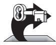

KEY POINT

If you emphasize quality in the middle of the project, you emphasize construction practices. Such practices are the focus of most of this book.

If you emphasize quality at the beginning of the project, you plan for, require, and design a high-quality product. If you start the process with designs for a Pontiac Aztek, you can test it all you want to, and it will never turn into a Rolls-Royce. You might build the best possible Aztek, but if you want a Rolls-Royce, you have to plan from the beginning to build one. In software development, you do such planning when you define the problem, when you specify the solution, and when you design the solution.

Since construction is in the middle of a software project, by the time you get to construction, the earlier parts of the project have already laid some of the groundwork for success or failure. During construction, however, you should at least be able to determine how good your situation is and to back up if you see the black clouds of failure looming on the horizon. The rest of this chapter describes in detail why proper preparation is important and tells you how to determine whether you're really ready to begin construction.

#### Do Prerequisites Apply to Modern Software Projects?

The methodology used should be based on choice of the latest and best, and not based on ignorance. It should also be laced liberally with the old and dependable. —*Harlan Mills*

Some people have asserted that upstream activities such as architecture, design, and project planning aren't useful on modern software projects. In the main, such assertions are not well supported by research, past or present, or by current data. (See the rest of this chapter for details.) Opponents of prerequisites typically show examples of prerequisites that have been done poorly and then point out that such work isn't effective. Upstream activities can be done well, however, and industry data from the 1970s to the present day indicates that projects will run best if appropriate preparation activities are done before construction begins in earnest.

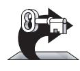

KEY POINT

The overarching goal of preparation is risk reduction: a good project planner clears major risks out of the way as early as possible so that the bulk of the project can proceed as smoothly as possible. By far the most common project risks in software development are poor requirements and poor project planning, thus preparation tends to focus on improving requirements and project plans.

Preparation for construction is not an exact science, and the specific approach to risk reduction must be decided project by project. Details can vary greatly among projects. For more on this, see Section 3.2.

#### Causes of Incomplete Preparation

You might think that all professional programmers know about the importance of preparation and check that the prerequisites have been satisfied before jumping into construction. Unfortunately, that isn't so.

**Further Reading** For a description of a professional development program that cultivates these skills, see Chapter 16 of *Professional Software Development* (McConnell 2004).

A common cause of incomplete preparation is that the developers who are assigned to work on the upstream activities do not have the expertise to carry out their assignments. The skills needed to plan a project, create a compelling business case, develop comprehensive and accurate requirements, and create high-quality architectures are far from trivial, but most developers have not received training in how to perform these activities. When developers don't know how to do upstream work, the recommendation to "do more upstream work" sounds like nonsense: If the work isn't being done well in the first place, doing *more* of it will not be useful! Explaining how to perform these activities is beyond the scope of this book, but the "Additional Resources" sections at the end of this chapter provide numerous options for gaining that expertise.

**cc2e.com/0316**

Some programmers do know how to perform upstream activities, but they don't prepare because they can't resist the urge to begin coding as soon as possible. If you feed your

horse at this trough, I have two suggestions. Suggestion 1: Read the argument in the next section. It may tell you a few things you haven't thought of. Suggestion 2: Pay attention to the problems you experience. It takes only a few large programs to learn that you can avoid a lot of stress by planning ahead. Let your own experience be your guide.

A final reason that programmers don't prepare is that managers are notoriously unsympathetic to programmers who spend time on construction prerequisites. People like Barry Boehm, Grady Booch, and Karl Wiegers have been banging the requirements and design drums for 25 years, and you'd expect that managers would have started to understand that software development is more than coding.

**Further Reading** For many entertaining variations on this theme, read Gerald Weinberg's classic, *The Psychology of Computer Programming* (Weinberg 1998). A few years ago, however, I was working on a Department of Defense project that was focusing on requirements development when the Army general in charge of the project came for a visit. We told him that we were developing requirements and that we were mainly talking to our customer, capturing requirements, and outlining the design. He insisted on seeing code anyway. We told him there was no code, but he walked around a work bay of 100 people, determined to catch someone programming. Frustrated by seeing so many people away from their desks or working on requirements and design, the large, round man with the loud voice finally pointed to the engineer sitting next to me and bellowed, "What's he doing? He must be writing code!" In fact, the engineer was working on a document-formatting utility, but the general wanted to find code, thought it looked like code, and wanted the engineer to be working on code, so we told him it was code.

This phenomenon is known as the WISCA or WIMP syndrome: Why Isn't Sam Coding Anything? or Why Isn't Mary Programming?

If the manager of your project pretends to be a brigadier general and orders you to start coding right away, it's easy to say, "Yes, Sir!" (What's the harm? The old guy must know what he's talking about.) This is a bad response, and you have several better alternatives. First, you can flatly refuse to do work in an ineffective order. If your relationships with your boss and your bank account are healthy enough for you to be able to do this, good luck.

A second questionable alternative is pretending to be coding when you're not. Put an old program listing on the corner of your desk. Then go right ahead and develop your requirements and architecture, with or without your boss's approval. You'll do the project faster and with higher-quality results. Some people find this approach ethically objectionable, but from your boss's perspective, ignorance will be bliss.

Third, you can educate your boss in the nuances of technical projects. This is a good approach because it increases the number of enlightened bosses in the world. The next subsection presents an extended rationale for taking the time to do prerequisites before construction.

Finally, you can find another job. Despite economic ups and downs, good programmers are perennially in short supply (BLS 2002), and life is too short to work in an unenlightened programming shop when plenty of better alternatives are available.

#### Utterly Compelling and Foolproof Argument for Doing Prerequisites Before Construction

Suppose you've already been to the mountain of problem definition, walked a mile with the man of requirements, shed your soiled garments at the fountain of architecture, and bathed in the pure waters of preparedness. Then you know that before you implement a system, you need to understand what the system is supposed to do and how it's supposed to do it.

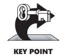

Part of your job as a technical employee is to educate the nontechnical people around you about the development process. This section will help you deal with managers and bosses who have not yet seen the light. It's an extended argument for doing requirements and architecture—getting the critical aspects right—before you begin coding, testing, and debugging. Learn the argument, and then sit down with your boss and have a heart-to-heart talk about the programming process.

#### Appeal to Logic

One of the key ideas in effective programming is that preparation is important. It makes sense that before you start working on a big project, you should plan the project. Big projects require more planning; small projects require less. From a management point of view, planning means determining the amount of time, number of people, and number of computers the project will need. From a technical point of view, planning means understanding what you want to build so that you don't waste money building the wrong thing. Sometimes users aren't entirely sure what they want at first, so it might take more effort than seems ideal to find out what they really want. But that's cheaper than building the wrong thing, throwing it away, and starting over.

It's also important to think about how to build the system before you begin to build it. You don't want to spend a lot of time and money going down blind alleys when there's no need to, especially when that increases costs.

#### Appeal to Analogy

Building a software system is like any other project that takes people and money. If you're building a house, you make architectural drawings and blueprints before you begin pounding nails. You'll have the blueprints reviewed and approved before you pour any concrete. Having a technical plan counts just as much in software.

You don't start decorating the Christmas tree until you've put it in the stand. You don't start a fire until you've opened the flue. You don't go on a long trip with an empty tank of gas. You don't get dressed before you take a shower, and you don't put your shoes on before your socks. You have to do things in the right order in software, too.

Programmers are at the end of the software food chain. The architect consumes the requirements; the designer consumes the architecture; and the coder consumes the design.

Compare the software food chain to a real food chain. In an ecologically sound environment, seagulls eat fresh salmon. That's nourishing to them because the salmon ate fresh herring, and they in turn ate fresh water bugs. The result is a healthy food chain. In programming, if you have healthy food at each stage in the food chain, the result is healthy code written by happy programmers.

In a polluted environment, the water bugs have been swimming in nuclear waste, the herring are contaminated by PCBs, and the salmon that eat the herring swam through oil spills. The seagulls are, unfortunately, at the end of the food chain, so they don't eat just the oil in the bad salmon. They also eat the PCBs and the nuclear waste from the herring and the water bugs. In programming, if your requirements are contaminated, they contaminate the architecture, and the architecture in turn contaminates construction. This leads to grumpy, malnourished programmers and radioactive, polluted software that's riddled with defects.

If you are planning a highly iterative project, you will need to identify the critical requirements and architectural elements that apply to each piece you're constructing before you begin construction. A builder who is building a housing development doesn't need to know every detail of every house in the development before beginning construction on the first house. But the builder will survey the site, map out sewer and electrical lines, and so on. If the builder doesn't prepare well, construction may be delayed when a sewer line needs to be dug under a house that's already been constructed.

#### Appeal to Data

Studies over the last 25 years have proven conclusively that it pays to do things right the first time. Unnecessary changes are expensive.

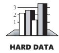

Researchers at Hewlett-Packard, IBM, Hughes Aircraft, TRW, and other organizations have found that purging an error by the beginning of construction allows rework to be done 10 to 100 times less expensively than when it's done in the last part of the process, during system test or after release (Fagan 1976; Humphrey, Snyder, and Willis 1991; Leffingwell 1997; Willis et al. 1998; Grady 1999; Shull et al. 2002; Boehm and Turner 2004).

In general, the principle is to find an error as close as possible to the time at which it was introduced. The longer the defect stays in the software food chain, the more damage it causes further down the chain. Since requirements are done first, requirements defects have the potential to be in the system longer and to be more expensive. Defects inserted into the software upstream also tend to have broader effects than those inserted further downstream. That also makes early defects more expensive.

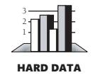

Table 3-1 shows the relative expense of fixing defects depending on when they're introduced and when they're found.

**Table 3-1 Average Cost of Fixing Defects Based on When They're Introduced and Detected**

|                 |              |              | Time Detected |             |              |
|-----------------|--------------|--------------|---------------|-------------|--------------|
| Time Introduced | Requirements | Architecture | Construction  | System Test | Post-Release |
| Requirements    | 1            | 3            | 5–10          | 10          | 10–100       |
| Architecture    | —            | 1            | 10            | 15          | 25–100       |
| Construction    | —            | —            | 1             | 10          | 10–25        |

Source: Adapted from "Design and Code Inspections to Reduce Errors in Program Development" (Fagan 1976), *Software Defect Removal* (Dunn 1984), "Software Process Improvement at Hughes Aircraft" (Humphrey, Snyder, and Willis 1991), "Calculating the Return on Investment from More Effective Requirements Management" (Leffingwell 1997), "Hughes Aircraft's Widespread Deployment of a Continuously Improving Software Process" (Willis et al. 1998), "An Economic Release Decision Model: Insights into Software Project Management" (Grady 1999), "What We Have Learned About Fighting Defects" (Shull et al. 2002), and *Balancing Agility and Discipline: A Guide for the Perplexed* (Boehm and Turner 2004).

> The data in Table 3-1 shows that, for example, an architecture defect that costs \$1000 to fix when the architecture is being created can cost \$15,000 to fix during system test. Figure 3-1 illustrates the same phenomenon.

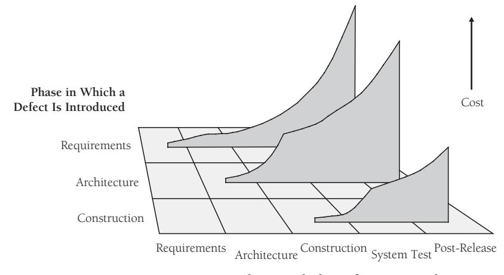

**Phase in Which a Defect Is Detected**

**Figure 3-1** The cost to fix a defect rises dramatically as the time from when it's introduced to when it's detected increases. This remains true whether the project is highly sequential (doing 100 percent of requirements and design up front) or highly iterative (doing 5 percent of requirements and design up front).

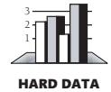

The average project still exerts most of its defect-correction effort on the right side of Figure 3-1, which means that debugging and associated rework takes about 50 percent of the time spent in a typical software development cycle (Mills 1983; Boehm 1987a; Cooper and Mullen 1993; Fishman 1996; Haley 1996; Wheeler, Brykczynski, and Meeson 1996; Jones 1998; Shull et al. 2002; Wiegers 2002). Dozens of companies have found that simply focusing on correcting defects earlier rather than later in a project can cut development costs and schedules by factors of two or more (McConnell 2004). This is a healthy incentive to find and fix your problems as early as you can.

#### Boss-Readiness Test

When you think your boss understands the importance of working on prerequisites before moving into construction, try the test below to be sure.

Which of these statements are self-fulfilling prophecies?

- We'd better start coding right away because we're going to have a lot of debugging to do.
- We haven't planned much time for testing because we're not going to find many defects.

■ We've investigated requirements and design so much that I can't think of any major problems we'll run into during coding or debugging.

All of these statements are self-fulfilling prophecies. Aim for the last one.

If you're still not convinced that prerequisites apply to your project, the next section will help you decide.

#### 3.2 Determine the Kind of Software You're Working On

Capers Jones, Chief Scientist at Software Productivity Research, summarized 20 years of software research by pointing out that he and his colleagues have seen 40 different methods for gathering requirements, 50 variations in working on software designs, and 30 kinds of testing applied to projects in more than 700 different programming languages (Jones 2003).

Different kinds of software projects call for different balances between preparation and construction. Every project is unique, but projects do tend to fall into general development styles. Table 3-2 shows three of the most common kinds of projects and lists the practices that are typically best suited to each kind of project.

**Table 3-2 Typical Good Practices for Three Common Kinds of Software Projects** 

|              |                                                                         | Kind of Software            |                                   |
|--------------|-------------------------------------------------------------------------|-----------------------------|-----------------------------------|
|              | Business Systems                                                        | Mission-Critical Systems | Embedded Life-Critical Systems |
| Typical      | Internet site                                                           | Embedded software           | Avionics software                 |
| applications | Intranet site                                                           | Games                       | Embedded software                 |
|              | Inventory                                                               | Internet site               | Medical devices                   |
|              | management                                                              | Packaged software           | Operating systems                 |
|              | Games                                                                   | Software tools              | Packaged software                 |
|              | Management information systems                                       | Web services                |                                   |
|              | Payroll system                                                          |                             |                                   |
| Life-cycle   | Agile development                                                       | Staged delivery             | Staged delivery                   |
| models       | (Extreme Program ming, Scrum, time box development, and so on) | Evolutionary                | Spiral development                |
|              |                                                                         | delivery                    | Evolutionary delivery             |
|              |                                                                         | Spiral development          |                                   |
|              | Evolutionary prototyping                                             |                             |                                   |

**Table 3-2 Typical Good Practices for Three Common Kinds of Software Projects** 

|              |                      | Kind of Software                   |                                       |
|--------------|----------------------|------------------------------------|---------------------------------------|
|              | Business Systems     | Mission-Critical Systems        | Embedded Life-Critical Systems     |
| Planning and | Incremental project  | Basic up-front                     | Extensive up-front                    |
| management   | planning             | planning                           | planning                              |
|              | As-needed test and   | Basic test planning                | Extensive test                        |
|              | QA planning          | As-needed QA                       | planning                              |
|              | Informal change      | planning                           | Extensive QA                          |
|              | control              | Formal change                      | planning                              |
|              |                      | control                            | Rigorous change control            |
| Requirements | Informal require     | Semiformal require                 | Formal requirements                   |
|              | ments specification  | ments specification                | specification                         |
|              |                      | As-needed require ments reviews | Formal requirements inspections    |
| Design       | Design and coding    | Architectural design               | Architectural design                  |
|              | are combined         | Informal detailed design        | Formal architecture inspections    |
|              |                      | As-needed design reviews        | Formal detailed design             |
|              |                      |                                    | Formal detailed design inspections |
| Construction | Pair programming     | Pair programming                   | Pair programming or                   |
|              | or individual coding | or individual coding               | individual coding                     |
|              | Informal check-in    | Informal check-in                  | Formal check-in                       |
|              | procedure or no      | procedure                          | procedure                             |
|              | check-in procedure   | As-needed code reviews          | Formal code inspections            |
| Testing      | Developers test      | Developers test                    | Developers test their                 |
| and QA       | their own code       | their own code                     | own code                              |
|              | Test-first           | Test-first                         | Test-first                            |
|              | development          | development                        | development                           |
|              | Little or no testing | Separate testing                   | Separate testing                      |
|              | by a separate test   | group                              | group                                 |
|              | group                |                                    | Separate QA group                     |
| Deployment   | Informal deploy      | Formal deployment                  | Formal deployment                     |
|              | ment procedure       | procedure                          | procedure                             |

On real projects, you'll find infinite variations on the three themes presented in this table; however, the generalities in the table are illuminating. Business systems projects tend to benefit from highly iterative approaches, in which planning, requirements,

and architecture are interleaved with construction, system testing, and quality-assurance activities. Life-critical systems tend to require more sequential approaches requirements stability is part of what's needed to ensure ultrahigh levels of reliability.

#### Iterative Approaches' Effect on Prerequisites

Some writers have asserted that projects that use iterative techniques don't need to focus on prerequisites much at all, but that point of view is misinformed. Iterative approaches tend to reduce the impact of inadequate upstream work, but they don't eliminate it. Consider the examples shown in Table 3-3 of projects that don't focus on prerequisites. One project is conducted sequentially and relies solely on testing to discover defects; the other is conducted iteratively and discovers defects as it progresses. The first approach delays most defect correction work to the end of the project, making the costs higher, as noted in Table 3-1. The iterative approach absorbs rework piecemeal over the course of the project, which makes the total cost lower. The data in this table and the next is for purposes of illustration only, but the relative costs of the two general approaches are well supported by the research described earlier in this chapter.

**Table 3-3 Effect of Skipping Prerequisites on Sequential and Iterative Projects**

|                              | Approach #1: Sequential Approach Without Prerequisites |                   | Approach #2: Iterative Approach Without Prerequisites |                   |
|------------------------------|--------------------------------------------------------------|-------------------|-------------------------------------------------------------|-------------------|
| Project Completion Status | Cost of Work                                                 | Cost of Rework | Cost of Work                                                | Cost of Rework |
| 20%                          | \$100,000                                                    | \$0               | \$100,000                                                   | \$75,000          |
| 40%                          | \$100,000                                                    | \$0               | \$100,000                                                   | \$75,000          |
| 60%                          | \$100,000                                                    | \$0               | \$100,000                                                   | \$75,000          |
| 80%                          | \$100,000                                                    | \$0               | \$100,000                                                   | \$75,000          |
| 100%                         | \$100,000                                                    | \$0               | \$100,000                                                   | \$75,000          |
| End-of-Project               |                                                              |                   |                                                             |                   |
| Rework                       | \$0                                                          | \$500,000         | \$0                                                         | \$0               |
| TOTAL                        | \$500,000                                                    | \$500,000         | \$500,000                                                   | \$375,000         |
| GRAND TOTAL                  |                                                              | \$1,000,000       |                                                             | \$875,000         |

The iterative project that abbreviates or eliminates prerequisites will differ in two ways from a sequential project that does the same thing. First, average defect correction costs will be lower because defects will tend to be detected closer to the time they were inserted into the software. However, the defects will still be detected late in each iteration, and correcting them will require parts of the software to be redesigned, recoded, and retested—which makes the defect-correction cost higher than it needs to be.

Second, with iterative approaches costs will be absorbed piecemeal, throughout the project, rather than being clustered at the end. When all the dust settles, the total cost will be similar but it won't seem as high because the price will have been paid in small installments over the course of the project, rather than paid all at once at the end.

As Table 3-4 illustrates, a focus on prerequisites can reduce costs regardless of whether you use an iterative or a sequential approach. Iterative approaches are usually a better option for many reasons, but an iterative approach that ignores prerequisites can end up costing significantly more than a sequential project that pays close attention to prerequisites.

**Table 3-4 Effect of Focusing on Prerequisites on Sequential and Iterative Projects** 

|                    | Approach #3: Sequential Approach with Prerequisites |           | Approach #4: Iterative Approach with Prerequisites |           |
|--------------------|--------------------------------------------------------|-----------|-------------------------------------------------------|-----------|
| Project completion |                                                        | Cost of   |                                                       | Cost of   |
| status             | Cost of Work                                           | Rework    | Cost of Work                                          | Rework    |
| 20%                | \$100,000                                              | \$20,000  | \$100,000                                             | \$10,000  |
| 40%                | \$100,000                                              | \$20,000  | \$100,000                                             | \$10,000  |
| 60%                | \$100,000                                              | \$20,000  | \$100,000                                             | \$10,000  |
| 80%                | \$100,000                                              | \$20,000  | \$100,000                                             | \$10,000  |
| 100%               | \$100,000                                              | \$20,000  | \$100,000                                             | \$10,000  |
| End-of-Project     |                                                        |           |                                                       |           |
| Rework             | \$0                                                    | \$0       | \$0                                                   | \$0       |
| TOTAL              | \$500,000                                              | \$100,000 | \$500,000                                             | \$50,000  |
| GRAND TOTAL        |                                                        | \$600,000 |                                                       | \$550,000 |

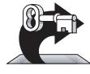

KEY POINT

**Cross-Reference** For details on how to adapt your development approach for programs of different sizes, see Chapter 27, "How Program Size Affects Construction."

As Table 3-4 suggested, most projects are neither completely sequential nor completely iterative. It isn't practical to specify 100 percent of the requirements or design up front, but most projects find value in identifying at least the most critical requirements and architectural elements early.

One common rule of thumb is to plan to specify about 80 percent of the requirements up front, allocate time for additional requirements to be specified later, and then practice systematic change control to accept only the most valuable new requirements as the project progresses. Another alternative is to specify only the most important 20 percent of the requirements up front and plan to develop the rest of the software in small increments, specifying additional requirements and designs as you go. Figures 3-2 and 3-3 reflect these different approaches.

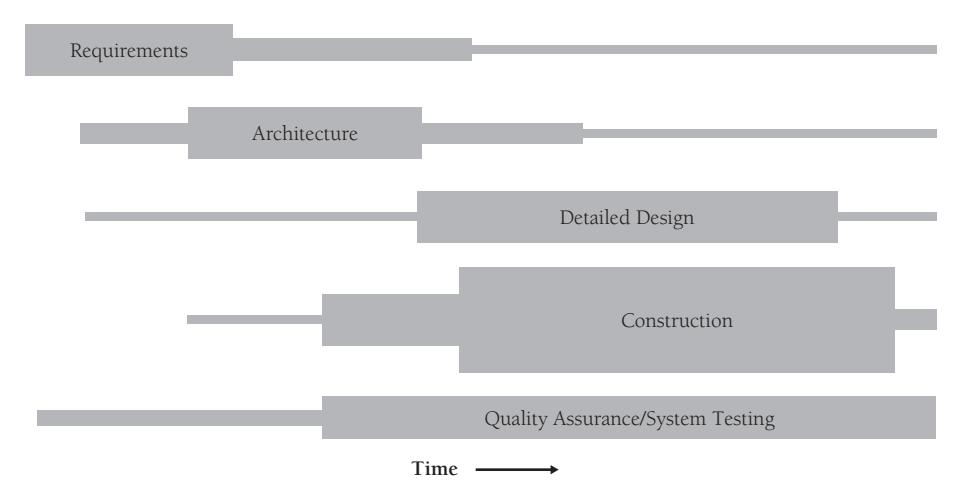

**Figure 3-2** Activities will overlap to some degree on most projects, even those that are highly sequential.

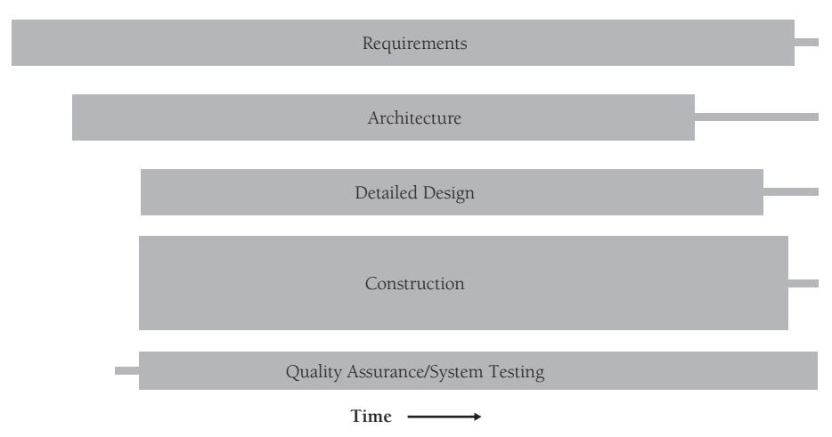

**Figure 3-3** On other projects, activities will overlap for the duration of the project. One key to successful construction is understanding the degree to which prerequisites have been completed and adjusting your approach accordingly.

#### Choosing Between Iterative and Sequential Approaches

The extent to which prerequisites need to be satisfied up front will vary with the project type indicated in Table 3-2, project formality, technical environment, staff capabilities, and project business goals. You might choose a more sequential (upfront) approach when

- The requirements are fairly stable.
- The design is straightforward and fairly well understood.
- The development team is familiar with the applications area.

- The project contains little risk.
- Long-term predictability is important.
- The cost of changing requirements, design, and code downstream is likely to be high.

You might choose a more iterative (as-you-go) approach when

- The requirements are not well understood or you expect them to be unstable for other reasons.
- The design is complex, challenging, or both.
- The development team is unfamiliar with the applications area.
- The project contains a lot of risk.
- Long-term predictability is not important.
- The cost of changing requirements, design, and code downstream is likely to be low.

Software being what it is, iterative approaches are useful much more often than sequential approaches are. You can adapt the prerequisites to your specific project by making them more or less formal and more or less complete, as you see fit. For a detailed discussion of different approaches to large and small projects (also known as the different approaches to formal and informal projects), see Chapter 27.

The net impact on construction prerequisites is that you should first determine what construction prerequisites are well suited to your project. Some projects spend too little time on prerequisites, which exposes construction to an unnecessarily high rate of destabilizing changes and prevents the project from making consistent progress. Some projects do too much up front; they doggedly adhere to requirements and plans that have been invalidated by downstream discoveries, and that can also impede progress during construction.

Now that you've studied Table 3-2 and determined what prerequisites are appropriate for your project, the rest of this chapter describes how to determine whether each specific construction prerequisite has been "prereq'd" or "prewrecked."

#### 3.3 Problem-Definition Prerequisite

If the "box" is the boundary of constraints and conditions, then the trick is to find the box.... Don't think outside the box—find the box. —*Andy Hunt and Dave Thomas*

The first prerequisite you need to fulfill before beginning construction is a clear statement of the problem that the system is supposed to solve. This is sometimes called "product vision," "vision statement," "mission statement," or "product definition." Here it's called "problem definition." Since this book is about construction, this section doesn't tell you how to write a problem definition; it tells you how to recognize whether one has been written at all and whether the one that's written will form a good foundation for construction.

A problem definition defines what the problem is without any reference to possible solutions. It's a simple statement, maybe one or two pages, and it should sound like a problem. The statement "We can't keep up with orders for the Gigatron" sounds like a problem and is a good problem definition. The statement "We need to optimize our automated data-entry system to keep up with orders for the Gigatron" is a poor problem definition. It doesn't sound like a problem; it sounds like a solution.

As shown in Figure 3-4, problem definition comes before detailed requirements work, which is a more in-depth investigation of the problem.

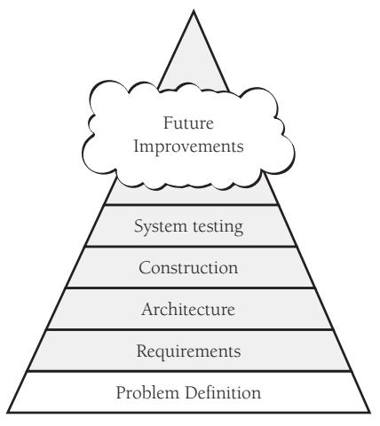

**Figure 3-4** The problem definition lays the foundation for the rest of the programming process.

The problem definition should be in user language, and the problem should be described from a user's point of view. It usually should not be stated in technical computer terms. The best solution might not be a computer program. Suppose you need a report that shows your annual profit. You already have computerized reports that show quarterly profits. If you're locked into the programmer mindset, you'll reason that adding an annual report to a system that already does quarterly reports should be easy. Then you'll pay a programmer to write and debug a time-consuming program that calculates annual profits. If you're not locked into the programmer mindset, you'll pay your secretary to create the annual figures by taking one minute to add up the quarterly figures on a pocket calculator.

The exception to this rule applies when the problem is with the computer: compile times are too slow or the programming tools are buggy. Then it's appropriate to state the problem in computer or programmer terms.

As Figure 3-5 suggests, without a good problem definition, you might put effort into solving the wrong problem.

**Figure 3-5** Be sure you know what you're aiming at before you shoot.

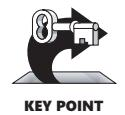

The penalty for failing to define the problem is that you can waste a lot of time solving the wrong problem. This is a double-barreled penalty because you also don't solve the right problem.

#### 3.4 Requirements Prerequisite

Requirements describe in detail what a software system is supposed to do, and they are the first step toward a solution. The requirements activity is also known as "requirements development," "requirements analysis," "analysis," "requirements definition," "software requirements," "specification," "functional spec," and "spec."

#### Why Have Official Requirements?

An explicit set of requirements is important for several reasons.

Explicit requirements help to ensure that the user rather than the programmer drives the system's functionality. If the requirements are explicit, the user can review them and agree to them. If they're not, the programmer usually ends up making requirements decisions during programming. Explicit requirements keep you from guessing what the user wants.

Explicit requirements also help to avoid arguments. You decide on the scope of the system before you begin programming. If you have a disagreement with another programmer about what the program is supposed to do, you can resolve it by looking at the written requirements.

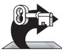

KEY POINT

Paying attention to requirements helps to minimize changes to a system after development begins. If you find a coding error during coding, you change a few lines of code and work goes on. If you find a requirements error during coding, you have to alter the design to meet the changed requirement. You might have to throw away part of the old design, and because it has to accommodate code that's already written, the new design will take longer than it would have in the first place. You also have to discard

code and test cases affected by the requirement change and write new code and test cases. Even code that's otherwise unaffected must be retested so that you can be sure the changes in other areas haven't introduced any new errors.

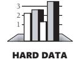

As Table 3-1 reported, data from numerous organizations indicates that on large projects an error in requirements detected during the architecture stage is typically 3 times as expensive to correct as it would be if it were detected during the requirements stage. If detected during coding, it's 5–10 times as expensive; during system test, 10 times; and post-release, a whopping 10–100 times as expensive as it would be if it were detected during requirements development. On smaller projects with lower administrative costs, the multiplier post-release is closer to 5–10 than 100 (Boehm and Turner 2004). In either case, it isn't money you'd want to have taken out of your salary.

Specifying requirements adequately is a key to project success, perhaps even more important than effective construction techniques. (See Figure 3-6.) Many good books have been written about how to specify requirements well. Consequently, the next few sections don't tell you how to do a good job of specifying requirements, they tell you how to determine whether the requirements have been done well and how to make the best of the requirements you have.

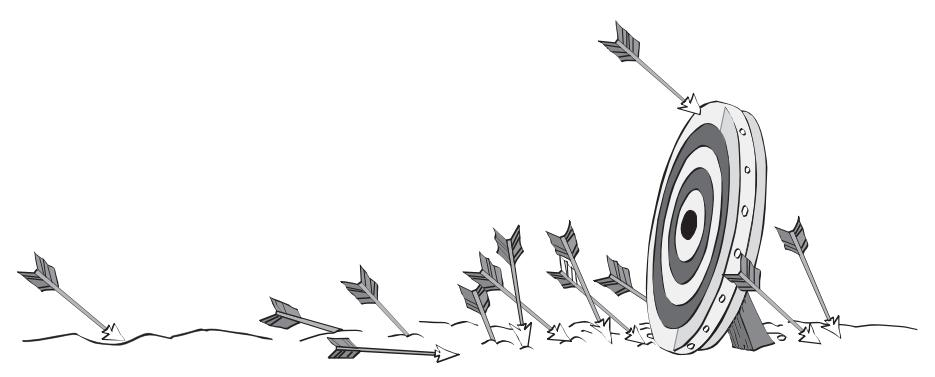

**Figure 3-6** Without good requirements, you can have the right general problem but miss the mark on specific aspects of the problem.

#### The Myth of Stable Requirements

Requirements are like water. They're easier to build on when they're frozen. —*Anonoymous*

Stable requirements are the holy grail of software development. With stable requirements, a project can proceed from architecture to design to coding to testing in a way that's orderly, predictable, and calm. This is software heaven! You have predictable expenses, and you never have to worry about a feature costing 100 times as much to implement as it would otherwise because your user didn't think of it until you were finished debugging.

It's fine to hope that once your customer has accepted a requirements document, no changes will be needed. On a typical project, however, the customer can't reliably describe what is needed before the code is written. The problem isn't that the customers are a lower life form. Just as the more you work with the project, the better you understand it, the more they work with it, the better they understand it. The development process helps customers better understand their own needs, and this is a major source of requirements changes (Curtis, Krasner, and Iscoe 1988; Jones 1998; Wiegers 2003). A plan to follow the requirements rigidly is actually a plan not to respond to your customer.

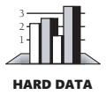

How much change is typical? Studies at IBM and other companies have found that the average project experiences about a 25 percent change in requirements during development (Boehm 1981, Jones 1994, Jones 2000), which accounts for 70 to 85 percent of the rework on a typical project (Leffingwell 1997, Wiegers 2003).

Maybe you think the Pontiac Aztek was the greatest car ever made, belong to the Flat Earth Society, and make a pilgrimage to the alien landing site at Roswell, New Mexico, every four years. If you do, go ahead and believe that requirements won't change on your projects. If, on the other hand, you've stopped believing in Santa Claus and the Tooth Fairy, or at least have stopped admitting it, you can take several steps to minimize the impact of requirements changes.

#### Handling Requirements Changes During Construction

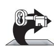

Here are several things you can do to make the best of changing requirements during construction:

KEY POINT

*Use the requirements checklist at the end of the section to assess the quality of your requirements* If your requirements aren't good enough, stop work, back up, and make them right before you proceed. Sure, it feels like you're getting behind if you stop coding at this stage. But if you're driving from Chicago to Los Angeles, is it a waste of time to stop and look at a road map when you see signs for New York? No. If you're not heading in the right direction, stop and check your course.

*Make sure everyone knows the cost of requirements changes* Clients get excited when they think of a new feature. In their excitement, their blood thins and runs to their medulla oblongata and they become giddy, forgetting all the meetings you had to discuss requirements, the signing ceremony, and the completed requirements document. The easiest way to handle such feature-intoxicated people is to say, "Gee, that

sounds like a great idea. Since it's not in the requirements document, I'll work up a revised schedule and cost estimate so that you can decide whether you want to do it now or later." The words "schedule" and "cost" are more sobering than coffee and a cold shower, and many "must haves" will quickly turn into "nice to haves."

If your organization isn't sensitive to the importance of doing requirements first, point out that changes at requirements time are much cheaper than changes later. Use this chapter's "Utterly Compelling and Foolproof Argument for Doing Prerequisites Before Construction."

**Cross-Reference** For details on handling changes to design and code, see Section 28.2, "Configuration Management."

*Set up a change-control procedure* If your client's excitement persists, consider establishing a formal change-control board to review such proposed changes. It's all right for customers to change their minds and to realize that they need more capabilities. The problem is their suggesting changes so frequently that you can't keep up. Having a built-in procedure for controlling changes makes everyone happy. You're happy because you know that you'll have to work with changes only at specific times. Your customers are happy because they know that you have a plan for handling their input.

**Cross-Reference** For details on iterative development approaches, see "Iterate" in Section 5.4 and Section 29.3, "Incremental Integration Strategies."

*Use development approaches that accommodate changes* Some development approaches maximize your ability to respond to changing requirements. An evolutionary prototyping approach helps you explore a system's requirements before you send your forces in to build it. Evolutionary delivery is an approach that delivers the system in stages. You can build a little, get a little feedback from your users, adjust your design a little, make a few changes, and build a little more. The key is using short development cycles so that you can respond to your users quickly.

**Further Reading** For details on development approaches that support flexible requirements, see *Rapid Development* (McConnell 1996).

*Dump the project* If the requirements are especially bad or volatile and none of the suggestions above are workable, cancel the project. Even if you can't really cancel the project, think about what it would be like to cancel it. Think about how much worse it would have to get before you would cancel it. If there's a case in which you would dump it, at least ask yourself how much difference there is between your case and that case.

**Cross-Reference** For details on the differences between formal and informal projects (often caused by differences in project size), see Chapter 27, "How Program Size Affects Construction."

*Keep your eye on the business case for the project* Many requirements issues disappear before your eyes when you refer back to the business reason for doing the project. Requirements that seemed like good ideas when considered as "features" can seem like terrible ideas when you evaluate the "incremental business value." Programmers who remember to consider the business impact of their decisions are worth their weight in gold—although I'll be happy to receive my commission for this advice in cash.

#### cc2e.com/0323 Checklist: Requirements

The requirements checklist contains a list of questions to ask yourself about your project's requirements. This book doesn't tell you how to do good requirements development, and the list won't tell you how to do one either. Use the list as a sanity check at construction time to determine how solid the ground that you're standing on is—where you are on the requirements Richter scale.

Not all of the checklist questions will apply to your project. If you're working on an informal project, you'll find some that you don't even need to think about. You'll find others that you need to think about but don't need to answer formally. If you're working on a large, formal project, however, you may need to consider every one.

#### Specific Functional Requirements

- ❑ Are all the inputs to the system specified, including their source, accuracy, range of values, and frequency?
- ❑ Are all the outputs from the system specified, including their destination, accuracy, range of values, frequency, and format?
- ❑ Are all output formats specified for Web pages, reports, and so on?
- ❑ Are all the external hardware and software interfaces specified?
- ❑ Are all the external communication interfaces specified, including handshaking, error-checking, and communication protocols?
- ❑ Are all the tasks the user wants to perform specified?
- ❑ Is the data used in each task and the data resulting from each task specified?

#### Specific Nonfunctional (Quality) Requirements

- ❑ Is the expected response time, from the user's point of view, specified for all necessary operations?
- ❑ Are other timing considerations specified, such as processing time, datatransfer rate, and system throughput?
- ❑ Is the level of security specified?
- ❑ Is the reliability specified, including the consequences of software failure, the vital information that needs to be protected from failure, and the strategy for error detection and recovery?
- ❑ Are minimum machine memory and free disk space specified?
- ❑ Is the maintainability of the system specified, including its ability to adapt to changes in specific functionality, changes in the operating environment, and changes in its interfaces with other software?
- ❑ Is the definition of success included? Of failure?

#### Requirements Quality

- ❑ Are the requirements written in the user's language? Do the users think so?
- ❑ Does each requirement avoid conflicts with other requirements?
- ❑ Are acceptable tradeoffs between competing attributes specified—for example, between robustness and correctness?
- ❑ Do the requirements avoid specifying the design?
- ❑ Are the requirements at a fairly consistent level of detail? Should any requirement be specified in more detail? Should any requirement be specified in less detail?
- ❑ Are the requirements clear enough to be turned over to an independent group for construction and still be understood? Do the developers think so?
- ❑ Is each item relevant to the problem and its solution? Can each item be traced to its origin in the problem environment?
- ❑ Is each requirement testable? Will it be possible for independent testing to determine whether each requirement has been satisfied?
- ❑ Are all possible changes to the requirements specified, including the likelihood of each change?

#### Requirements Completeness

- ❑ Where information isn't available before development begins, are the areas of incompleteness specified?
- ❑ Are the requirements complete in the sense that if the product satisfies every requirement, it will be acceptable?
- ❑ Are you comfortable with all the requirements? Have you eliminated requirements that are impossible to implement and included just to appease your customer or your boss?

#### 3.5 Architecture Prerequisite

**Cross-Reference** For more information on design at all levels, see Chapters 5 through 9.

Software architecture is the high-level part of software design, the frame that holds the more detailed parts of the design (Buschman et al. 1996; Fowler 2002; Bass Clements, Kazman 2003; Clements et al. 2003). Architecture is also known as "system architecture," "high-level design," and "top-level design." Typically, the architecture is described in a single document referred to as the "architecture specification" or "toplevel design." Some people make a distinction between architecture and high-level

design—architecture refers to design constraints that apply systemwide, whereas highlevel design refers to design constraints that apply at the subsystem or multiple-class level, but not necessarily systemwide.

Because this book is about construction, this section doesn't tell you how to develop a software architecture; it focuses on how to determine the quality of an existing architecture. Because architecture is one step closer to construction than requirements, however, the discussion of architecture is more detailed than the discussion of requirements.

Why have architecture as a prerequisite? Because the quality of the architecture determines the conceptual integrity of the system. That in turn determines the ultimate quality of the system. A well-thought-out architecture provides the structure needed to maintain a system's conceptual integrity from the top levels down to the bottom. It provides guidance to programmers—at a level of detail appropriate to the skills of the programmers and to the job at hand. It partitions the work so that multiple developers or multiple development teams can work independently.

Good architecture makes construction easy. Bad architecture makes construction almost impossible. Figure 3-7 illustrates another problem with bad architecture.

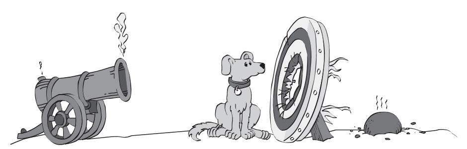

**Figure 3-7** Without good software architecture, you may have the right problem but the wrong solution. It may be impossible to have successful construction.

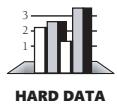

Architectural changes are expensive to make during construction or later. The time needed to fix an error in a software architecture is on the same order as that needed to fix a requirements error—that is, more than that needed to fix a coding error (Basili and Perricone 1984, Willis 1998). Architecture changes are like requirements changes in that seemingly small changes can be far-reaching. Whether the architectural changes arise from the need to fix errors or the need to make improvements, the earlier you can identify the changes, the better.

#### Typical Architectural Components

**Cross-Reference** For details on lower-level program design, see Chapters 5 through 9.

Many components are common to good system architectures. If you're building the whole system yourself, your work on the architecture will overlap your work on the more detailed design. In such a case, you should at least think about each architectural component. If you're working on a system that was architected by someone else, you should be able to find the important components without a bloodhound, a deerstalker cap, and a magnifying glass. In either case, here are the architectural components to consider.

#### Program Organization

If you can't explain something to a six-year-old, you really don't understand it yourself.

—*Albert Einstein*

A system architecture first needs an overview that describes the system in broad terms. Without such an overview, you'll have a hard time building a coherent picture from a thousand details or even a dozen individual classes. If the system were a little 12-piece jigsaw puzzle, your one-year-old could solve it between spoonfuls of strained asparagus. A puzzle of 12 subsystems is harder to put together, and if you can't put it together, you won't understand how a class you're developing contributes to the system.

In the architecture, you should find evidence that alternatives to the final organization were considered and find the reasons for choosing the final organization over its alternatives. It's frustrating to work on a class when it seems as if the class's role in the system has not been clearly conceived. By describing the organizational alternatives, the architecture provides the rationale for the system organization and shows that each class has been carefully considered. One review of design practices found that the design rationale is at least as important for maintenance as the design itself (Rombach 1990).

**Cross-Reference** For details on different size building blocks in design, see "Levels of Design" in Section 5.2.

The architecture should define the major building blocks in a program. Depending on the size of the program, each building block might be a single class or it might be a subsystem consisting of many classes. Each building block is a class, or it's a collection of classes or routines that work together on high-level functions such as interacting with the user, displaying Web pages, interpreting commands, encapsulating business rules, or accessing data. Every feature listed in the requirements should be covered by at least one building block. If a function is claimed by two or more building blocks, their claims should cooperate, not conflict.

**Cross-Reference** Minimizing what each building block knows about other building blocks is a key part of information hiding. For details, see "Hide Secrets (Information Hiding)" in Section 5.3.

What each building block is responsible for should be well defined. A building block should have one area of responsibility, and it should know as little as possible about other building blocks' areas of responsibility. By minimizing what each building block knows about the other building blocks, you localize information about the design into single building blocks.

The communication rules for each building block should be well defined. The architecture should describe which other building blocks the building block can use directly, which it can use indirectly, and which it shouldn't use at all.

#### Major Classes

**Cross-Reference** For details on class design, see Chapter 6, "Working Classes."

The architecture should specify the major classes to be used. It should identify the responsibilities of each major class and how the class will interact with other classes. It should include descriptions of the class hierarchies, of state transitions, and of object persistence. If the system is large enough, it should describe how classes are organized into subsystems.

The architecture should describe other class designs that were considered and give reasons for preferring the organization that was chosen. The architecture doesn't need to specify every class in the system. Aim for the 80/20 rule: specify the 20 percent of the classes that make up 80 percent of the system's behavior (Jacobsen, Booch, and Rumbaugh 1999; Kruchten 2000).

#### Data Design

**Cross-Reference** For details on working with variables, see Chapters 10 through 13. The architecture should describe the major files and table designs to be used. It should describe alternatives that were considered and justify the choices that were made. If the application maintains a list of customer IDs and the architects have chosen to represent the list of IDs using a sequential-access list, the document should explain why a sequential-access list is better than a random-access list, stack, or hash table. During construction, such information gives you insight into the minds of the architects. During maintenance, the same insight is an invaluable aid. Without it, you're watching a foreign movie with no subtitles.

Data should normally be accessed directly by only one subsystem or class, except through access classes or routines that allow access to the data in controlled and abstract ways. This is explained in more detail in "Hide Secrets (Information Hiding)" in Section 5.3.

The architecture should specify the high-level organization and contents of any databases used. The architecture should explain why a single database is preferable to multiple databases (or vice versa), explain why a database is preferable to flat files, identify possible interactions with other programs that access the same data, explain what views have been created on the data, and so on.

#### Business Rules

If the architecture depends on specific business rules, it should identify them and describe the impact the rules have on the system's design. For example, suppose the system is required to follow a business rule that customer information should be no

more than 30 seconds out of date. In that case, the impact that rule has on the architecture's approach to keeping customer information up to date and synchronized should be described.

#### User Interface Design

The user interface is often specified at requirements time. If it isn't, it should be specified in the software architecture. The architecture should specify major elements of Web page formats, GUIs, command line interfaces, and so on. Careful architecture of the user interface makes the difference between a well-liked program and one that's never used.

The architecture should be modularized so that a new user interface can be substituted without affecting the business rules and output parts of the program. For example, the architecture should make it fairly easy to lop off a group of interactive interface classes and plug in a group of command line classes. This ability is often useful, especially since command line interfaces are convenient for software testing at the unit or subsystem level.

**cc2e.com/0393** The design of user interfaces deserves its own book-length discussion but is outside the scope of this book.

#### Resource Management

The architecture should describe a plan for managing scarce resources such as database connections, threads, and handles. Memory management is another important area for the architecture to treat in memory-constrained applications areas such as driver development and embedded systems. The architecture should estimate the resources used for nominal and extreme cases. In a simple case, the estimates should show that the resources needed are well within the capabilities of the intended implementation environment. In a more complex case, the application might be required to more actively manage its own resources. If it is, the resource manager should be architected as carefully as any other part of the system.

#### cc2e.com/0330 Security

**Further Reading** For an excellent discussion of software security, see *Writing Secure Code*, 2d Ed. (Howard and LeBlanc 2003) as well as the January 2002 issue of *IEEE Software*.

The architecture should describe the approach to design-level and code-level security. If a threat model has not previously been built, it should be built at architecture time. Coding guidelines should be developed with security implications in mind, including approaches to handling buffers, rules for handling untrusted data (data input from users, cookies, configuration data, and other external interfaces), encryption, level of detail contained in error messages, protecting secret data that's in memory, and other issues.

#### Performance

**Further Reading** For additional information on designing systems for performance, see Connie Smith's *Performance Engineering of Software Systems* (1990).

If performance is a concern, performance goals should be specified in the requirements. Performance goals can include resource use, in which case the goals should also specify priorities among resources, including speed vs. memory vs. cost.

The architecture should provide estimates and explain why the architects believe the goals are achievable. If certain areas are at risk of failing to meet their goals, the architecture should say so. If certain areas require the use of specific algorithms or data types to meet their performance goals, the architecture should say that. The architecture can also include space and time budgets for each class or object.

#### Scalability

Scalability is the ability of a system to grow to meet future demands. The architecture should describe how the system will address growth in number of users, number of servers, number of network nodes, number of database records, size of database records, transaction volume, and so on. If the system is not expected to grow and scalability is not an issue, the architecture should make that assumption explicit.

#### Interoperability

If the system is expected to share data or resources with other software or hardware, the architecture should describe how that will be accomplished.

#### Internationalization/Localization

"Internationalization" is the technical activity of preparing a program to support multiple locales. Internationalization is often known as "I18n" because the first and last characters in "internationalization" are "I" and "N" and because there are 18 letters in the middle of the word. "Localization" (known as "L10n" for the same reason) is the activity of translating a program to support a specific local language.

Internationalization issues deserve attention in the architecture for an interactive system. Most interactive systems contain dozens or hundreds of prompts, status displays, help messages, error messages, and so on. Resources used by the strings should be estimated. If the program is to be used commercially, the architecture should show that the typical string and character-set issues have been considered, including character set used (ASCII, DBCS, EBCDIC, MBCS, Unicode, ISO 8859, and so on), kinds of strings used (C strings, Visual Basic strings, and so on), maintaining the strings without changing code, and translating the strings into foreign languages with minimal impact on the code and the user interface. The architecture can decide to use strings in line in the code where they're needed, keep the strings in a class and reference them through the class interface, or store the strings in a resource file. The architecture should explain which option was chosen and why.

#### Input/Output

Input/output (I/O) is another area that deserves attention in the architecture. The architecture should specify a look-ahead, look-behind, or just-in-time reading scheme. And it should describe the level at which I/O errors are detected: at the field, record, stream, or file level.

#### Error Processing

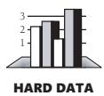

Error processing is turning out to be one of the thorniest problems of modern computer science, and you can't afford to deal with it haphazardly. Some people have estimated that as much as 90 percent of a program's code is written for exceptional, errorprocessing cases or housekeeping, implying that only 10 percent is written for nominal cases (Shaw in Bentley 1982). With so much code dedicated to handling errors, a strategy for handling them consistently should be spelled out in the architecture.

Error handling is often treated as a coding-convention-level issue, if it's treated at all. But because it has systemwide implications, it is best treated at the architectural level. Here are some questions to consider:

- Is error processing corrective or merely detective? If corrective, the program can attempt to recover from errors. If it's merely detective, the program can continue processing as if nothing had happened, or it can quit. In either case, it should notify the user that it detected an error.
- Is error detection active or passive? The system can actively anticipate errors—for example, by checking user input for validity—or it can passively respond to them only when it can't avoid them—for example, when a combination of user input produces a numeric overflow. It can clear the way or clean up the mess. Again, in either case, the choice has user-interface implications.
- How does the program propagate errors? Once it detects an error, it can immediately discard the data that caused the error, it can treat the error as an error and enter an error-processing state, or it can wait until all processing is complete and notify the user that errors were detected (somewhere).
- What are the conventions for handling error messages? If the architecture doesn't specify a single, consistent strategy, the user interface will appear to be a confusing macaroni-and-dried-bean collage of different interfaces in different parts of the program. To avoid such an appearance, the architecture should establish conventions for error messages.
- How will exceptions be handled? The architecture should address when the code can throw exceptions, where they will be caught, how they will be logged, how they will be documented, and so on.

**Cross-Reference** A consistent method of handling bad parameters is another aspect of error-processing strategy that should be addressed architecturally. For examples, see Chapter 8, "Defensive Programming."

- Inside the program, at what level are errors handled? You can handle them at the point of detection, pass them off to an error-handling class, or pass them up the call chain.
- What is the level of responsibility of each class for validating its input data? Is each class responsible for validating its own data, or is there a group of classes responsible for validating the system's data? Can classes at any level assume that the data they're receiving is clean?
- Do you want to use your environment's built-in exception-handling mechanism or build your own? The fact that an environment has a particular error-handling approach doesn't mean that it's the best approach for your requirements.

#### Fault Tolerance

**Further Reading** For a good introduction to fault tolerance, see the July 2001 issue of *IEEE Software*. In addition to providing a good introduction, the articles cite many key books and key articles on the topic.

The architecture should also indicate the kind of fault tolerance expected. Fault tolerance is a collection of techniques that increase a system's reliability by detecting errors, recovering from them if possible, and containing their bad effects if not.

For example, a system could make the computation of the square root of a number fault tolerant in any of several ways:

- The system might back up and try again when it detects a fault. If the first answer is wrong, it would back up to a point at which it knew everything was all right and continue from there.
- The system might have auxiliary code to use if it detects a fault in the primary code. In the example, if the first answer appears to be wrong, the system switches over to an alternative square-root routine and uses it instead.
- The system might use a voting algorithm. It might have three square-root classes that each use a different method. Each class computes the square root, and then the system compares the results. Depending on the kind of fault tolerance built into the system, it then uses the mean, the median, or the mode of the three results.
- The system might replace the erroneous value with a phony value that it knows to have a benign effect on the rest of the system.

Other fault-tolerance approaches include having the system change to a state of partial operation or a state of degraded functionality when it detects an error. It can shut itself down or automatically restart itself. These examples are necessarily simplistic. Fault tolerance is a fascinating and complex subject—unfortunately, it's one that's outside the scope of this book.

#### Architectural Feasibility

The designers might have concerns about a system's ability to meet its performance targets, work within resource limitations, or be adequately supported by the implementation environments. The architecture should demonstrate that the system is technically feasible. If infeasibility in any area could render the project unworkable, the architecture should indicate how those issues have been investigated—through proof-of-concept prototypes, research, or other means. These risks should be resolved before full-scale construction begins.

#### Overengineering

Robustness is the ability of a system to continue to run after it detects an error. Often an architecture specifies a more robust system than that specified by the requirements. One reason is that a system composed of many parts that are minimally robust might be less robust than is required overall. In software, the chain isn't as strong as its weakest link; it's as weak as all the weak links multiplied together. The architecture should clearly indicate whether programmers should err on the side of overengineering or on the side of doing the simplest thing that works.

Specifying an approach to overengineering is particularly important because many programmers overengineer their classes automatically, out of a sense of professional pride. By setting expectations explicitly in the architecture, you can avoid the phenomenon in which some classes are exceptionally robust and others are barely adequate.

#### Buy-vs.-Build Decisions

**Cross-Reference** For a list of kinds of commercially available software components and libraries, see "Code Libraries" in Section 30.3.

The most radical solution to building software is not to build it at all—to buy it instead or to download open-source software for free. You can buy GUI controls, database managers, image processors, graphics and charting components, Internet communications components, security and encryption components, spreadsheet tools, textprocessing tools—the list is nearly endless. One of the greatest advantages of programming in modern GUI environments is the amount of functionality you get automatically: graphics classes, dialog box managers, keyboard and mouse handlers, code that works automatically with any printer or monitor, and so on.

If the architecture isn't using off-the-shelf components, it should explain the ways in which it expects custom-built components to surpass ready-made libraries and components.

#### Reuse Decisions

If the plan calls for using preexisting software, test cases, data formats, or other materials, the architecture should explain how the reused software will be made to conform to the other architectural goals—if it will be made to conform.

#### Change Strategy

**Cross-Reference** For details on handling changes systematically, see Section 28.2, "Configuration Management." Because building a software product is a learning process for both the programmers and the users, the product is likely to change throughout its development. Changes arise from volatile data types and file formats, changed functionality, new features, and so on. The changes can be new capabilities likely to result from planned enhancements, or they can be capabilities that didn't make it into the first version of the system. Consequently, one of the major challenges facing a software architect is making the architecture flexible enough to accommodate likely changes.

Design bugs are often subtle and occur by evolution with early assumptions being forgotten as new features or uses are added to a system. —*Fernando J. Corbató*

The architecture should clearly describe a strategy for handling changes. The architecture should show that possible enhancements have been considered and that the enhancements most likely are also the easiest to implement. If changes are likely in input or output formats, style of user interaction, or processing requirements, the architecture should show that the changes have all been anticipated and that the effects of any single change will be limited to a small number of classes. The architecture's plan for changes can be as simple as one to put version numbers in data files, reserve fields for future use, or design files so that you can add new tables. If a code generator is being used, the architecture should show that the anticipated changes are within the capabilities of the code generator.

**Cross-Reference** For a full explanation of delaying commitment, see "Choose Binding Time Consciously" in Section 5.3.

The architecture should indicate the strategies that are used to delay commitment. For example, the architecture might specify that a table-driven technique be used rather than hard-coded *if* tests. It might specify that data for the table is to be kept in an external file rather than coded inside the program, thus allowing changes in the program without recompiling.

#### General Architectural Quality

**Cross-Reference** For more information about how quality attributes interact, see Section 20.1, "Characteristics of Software Quality."

A good architecture specification is characterized by discussions of the classes in the system, of the information that's hidden in each class, and of the rationales for including and excluding all possible design alternatives.

The architecture should be a polished conceptual whole with few ad hoc additions. The central thesis of the most popular software-engineering book ever, *The Mythical Man-Month*, is that the essential problem with large systems is maintaining their conceptual integrity (Brooks 1995). A good architecture should fit the problem. When you look at the architecture, you should be pleased by how natural and easy the solution seems. It shouldn't look as if the problem and the architecture have been forced together with duct tape.

You might know of ways in which the architecture was changed during its development. Each change should fit in cleanly with the overall concept. The architecture shouldn't look like a U.S. Congress appropriations bill complete with pork-barrel, boondoggle riders for each representative's home district.

The architecture's objectives should be clearly stated. A design for a system with a primary goal of modifiability will be different from one with a goal of uncompromised performance, even if both systems have the same function.

The architecture should describe the motivations for all major decisions. Be wary of "we've always done it that way" justifications. One story goes that Beth wanted to cook a pot roast according to an award-winning pot roast recipe handed down in her husband's family. Her husband, Abdul, said that his mother had taught him to sprinkle it with salt and pepper, cut both ends off, put it in the pan, cover it, and cook it. Beth asked, "Why do you cut both ends off?" Abdul said, "I don't know. I've always done it that way. Let me ask my mother." He called her, and she said, "I don't know. I've always done it that way. Let me ask your grandmother." She called his grandmother, who said, "I don't know why you do it that way. I did it that way because it was too big to fit in my pan."

Good software architecture is largely machine- and language-independent. Admittedly, you can't ignore the construction environment. By being as independent of the environment as possible, however, you avoid the temptation to overarchitect the system or to do a job that you can do better during construction. If the purpose of a program is to exercise a specific machine or language, this guideline doesn't apply.

The architecture should tread the line between underspecifying and overspecifying the system. No part of the architecture should receive more attention than it deserves, or be overdesigned. Designers shouldn't pay attention to one part at the expense of another. The architecture should address all requirements without gold-plating (without containing elements that are not required).

The architecture should explicitly identify risky areas. It should explain why they're risky and what steps have been taken to minimize the risk.

The architecture should contain multiple views. Plans for a house will include elevations, floor plan, framing plan, electrical diagrams, and other views of the house. Software architecture descriptions also benefit from providing different views of the system that flush out errors and inconsistencies and help programmers fully understand the system's design (Kruchten 1995).

Finally, you shouldn't be uneasy about any parts of the architecture. It shouldn't contain anything just to please the boss. It shouldn't contain anything that's hard for you to understand. You're the one who'll implement it; if it doesn't make sense to you, how can you implement it?

#### cc2e.com/0337 Checklist: Architecture

Here's a list of issues that a good architecture should address. The list isn't intended to be a comprehensive guide to architecture but to be a pragmatic way of evaluating the nutritional content of what you get at the programmer's end of the software food chain. Use this checklist as a starting point for your own checklist. As with the requirements checklist, if you're working on an informal project, you'll find some items that you don't even need to think about. If you're working on a larger project, most of the items will be useful.

#### Specific Architectural Topics

- ❑ Is the overall organization of the program clear, including a good architectural overview and justification?
- ❑ Are major building blocks well defined, including their areas of responsibility and their interfaces to other building blocks?
- ❑ Are all the functions listed in the requirements covered sensibly, by neither too many nor too few building blocks?
- ❑ Are the most critical classes described and justified?
- ❑ Is the data design described and justified?
- ❑ Is the database organization and content specified?
- ❑ Are all key business rules identified and their impact on the system described?
- ❑ Is a strategy for the user interface design described?
- ❑ Is the user interface modularized so that changes in it won't affect the rest of the program?
- ❑ Is a strategy for handling I/O described and justified?
- ❑ Are resource-use estimates and a strategy for resource management described and justified for scarce resources like threads, database connections, handles, network bandwidth, and so on?
- ❑ Are the architecture's security requirements described?
- ❑ Does the architecture set space and speed budgets for each class, subsystem, or functionality area?
- ❑ Does the architecture describe how scalability will be achieved?
- ❑ Does the architecture address interoperability?
- ❑ Is a strategy for internationalization/localization described?
- ❑ Is a coherent error-handling strategy provided?
- ❑ Is the approach to fault tolerance defined (if any is needed)?

- ❑ Has technical feasibility of all parts of the system been established?
- ❑ Is an approach to overengineering specified?
- ❑ Are necessary buy-vs.-build decisions included?
- ❑ Does the architecture describe how reused code will be made to conform to other architectural objectives?
- ❑ Is the architecture designed to accommodate likely changes?

#### General Architectural Quality

- ❑ Does the architecture account for all the requirements?
- ❑ Is any part overarchitected or underarchitected? Are expectations in this area set out explicitly?
- ❑ Does the whole architecture hang together conceptually?
- ❑ Is the top-level design independent of the machine and language that will be used to implement it?
- ❑ Are the motivations for all major decisions provided?
- ❑ Are you, as a programmer who will implement the system, comfortable with the architecture?

### 3.6 Amount of Time to Spend on Upstream Prerequisites

**Cross-Reference** The amount of time you spend on prerequisites will depend on your project type. For details on adapting prerequisites to your specific project, see Section 3.2, "Determine the Kind of Software You're Working On," earlier in this chapter.

The amount of time to spend on problem definition, requirements, and software architecture varies according to the needs of your project. Generally, a well-run project devotes about 10 to 20 percent of its effort and about 20 to 30 percent of its schedule to requirements, architecture, and up-front planning (McConnell 1998, Kruchten 2000). These figures don't include time for detailed design—that's part of construction.

If requirements are unstable and you're working on a large, formal project, you'll probably have to work with a requirements analyst to resolve requirements problems that are identified early in construction. Allow time to consult with the requirements analyst and for the requirements analyst to revise the requirements before you'll have a workable version of the requirements.

If requirements are unstable and you're working on a small, informal project, you'll probably need to resolve requirements issues yourself. Allow time for defining the requirements well enough that their volatility will have a minimal impact on construction.

**Cross-Reference** For approaches to handling changing requirements, see "Handling Requirements Changes During Construction" in Section 3.4, earlier in this chapter.

If the requirements are unstable on any project—formal or informal—treat requirements work as its own project. Estimate the time for the rest of the project after you've finished the requirements. This is a sensible approach since no one can reasonably expect you to estimate your schedule before you know what you're building. It's as if you were a contractor called to work on a house. Your customer says, "What will it cost to do the work?" You reasonably ask, "What do you want me to do?" Your customer says, "I can't tell you, but how much will it cost?" You reasonably thank the customer for wasting your time and go home.

With a building, it's clear that it's unreasonable for clients to ask for a bid before telling you what you're going to build. Your clients wouldn't want you to show up with wood, hammer, and nails and start spending their money before the architect had finished the blueprints. People tend to understand software development less than they understand two-by-fours and sheetrock, however, so the clients you work with might not immediately understand why you want to plan requirements development as a separate project. You might need to explain your reasoning to them.

When allocating time for software architecture, use an approach similar to the one for requirements development. If the software is a kind that you haven't worked with before, allow more time for the uncertainty of designing in a new area. Ensure that the time you need to create a good architecture won't take away from the time you need for good work in other areas. If necessary, plan the architecture work as a separate project, too.

#### Additional Resources

**cc2e.com/0344** Following are more resources on requirements:

#### cc2e.com/0351 Requirements

Here are a few books that give much more detail on requirements development:

Wiegers, Karl. *Software Requirements*, 2d ed. Redmond, WA: Microsoft Press, 2003. This is a practical, practitioner-focused book that describes the nuts and bolts of requirements activities, including requirements elicitation, requirements analysis, requirements specification, requirements validation, and requirements management.

Robertson, Suzanne and James Robertson. *Mastering the Requirements Process*. Reading, MA: Addison-Wesley, 1999. This is a good alternative to Wiegers' book for the more advanced requirements practitioner.

Gilb, Tom. *Competitive Engineering*. Reading, MA: Addison-Wesley, 2004. This book describes Gilb's requirements language, known as "Planguage." The book covers Gilb's specific approach to requirements engineering, design and design evaluation, and evolutionary project management. This book can be downloaded from Gilb's website at *www.gilb.com*.

*IEEE Std 830-1998. IEEE Recommended Practice for Software Requirements Specifications*. Los Alamitos, CA: IEEE Computer Society Press. This document is the IEEE-ANSI guide for writing software-requirements specifications. It describes what should be included in the specification document and shows several alternative outlines for one.

Abran, Alain, et al. S*webok: Guide to the Software Engineering Body of Knowledge*. Los Alamitos, CA: IEEE Computer Society Press, 2001. This contains a detailed description of the body of software-requirements knowledge. It can also be downloaded from *www.swebok.org*.

**cc2e.com/0365**

Other good alternatives include the following:

Lauesen, Soren. *Software Requirements: Styles and Techniques*. Boston, MA: Addison-Wesley, 2002.

Kovitz, Benjamin L. *Practical Software Requirements: A Manual of Content and Style*. Manning Publications Company, 1998.

Cockburn, Alistair. *Writing Effective Use Cases*. Boston, MA: Addison-Wesley, 2000.

#### cc2e.com/0372 Software Architecture

Numerous books on software architecture have been published in the past few years. Here are some of the best:

Bass, Len, Paul Clements, and Rick Kazman. *Software Architecture in Practice*, 2d ed. Boston, MA: Addison-Wesley, 2003.

Buschman, Frank, et al. *Pattern-Oriented Software Architecture, Volume 1: A System of Patterns*. New York, NY: John Wiley & Sons, 1996.

Clements, Paul, ed. *Documenting Software Architectures: Views and Beyond*. Boston, MA: Addison-Wesley, 2003.

Clements, Paul, Rick Kazman, and Mark Klein. *Evaluating Software Architectures: Methods and Case Studies*. Boston, MA: Addison-Wesley, 2002.

Fowler, Martin. *Patterns of Enterprise Application Architecture*. Boston, MA: Addison-Wesley, 2002.

Jacobson, Ivar, Grady Booch, and James Rumbaugh. *The Unified Software Development Process*. Reading, MA: Addison-Wesley, 1999.

*IEEE Std 1471-2000. Recommended Practice for Architectural Description of Software-Intensive Systems*. Los Alamitos, CA: IEEE Computer Society Press. This document is the IEEE-ANSI guide for creating software-architecture specifications.

#### cc2e.com/0379 General Software-Development Approaches

Many books are available that map out different approaches to conducting a software project. Some are more sequential, and some are more iterative.

McConnell, Steve. *Software Project Survival Guide*. Redmond, WA: Microsoft Press, 1998. This book presents one particular way to conduct a project. The approach presented emphasizes deliberate up-front planning, requirements development, and architecture work followed by careful project execution. It provides long-range predictability of costs and schedules, high quality, and a moderate amount of flexibility.

Kruchten, Philippe. *The Rational Unified Process: An Introduction*, 2d ed. Reading, MA: Addison-Wesley, 2000. This book presents a project approach that is "architecturecentric and use-case driven." Like *Software Project Survival Guide*, it focuses on up-front work that provides good long-range predictability of costs and schedules, high quality, and moderate flexibility. This book's approach requires somewhat more sophisticated use than the approaches described in *Software Project Survival Guide* and *Extreme Programming Explained: Embrace Change*.

Jacobson, Ivar, Grady Booch, and James Rumbaugh. *The Unified Software Development Process*. Reading, MA: Addison-Wesley, 1999. This book is a more in-depth treatment of the topics covered in *The Rational Unified Process: An Introduction*, 2d ed.

Beck, Kent. *Extreme Programming Explained: Embrace Change*. Reading, MA: Addison-Wesley, 2000. Beck describes a highly iterative approach that focuses on developing requirements and designs iteratively, in conjunction with construction. The Extreme Programming approach offers little long-range predictability but provides a high degree of flexibility.

Gilb, Tom. *Principles of Software Engineering Management*. Wokingham, England: Addison-Wesley, 1988. Gilb's approach explores critical planning, requirements, and architecture issues early in a project and then continuously adapts the project plans as the project progresses. This approach provides a combination of long-range predictability, high quality, and a high degree of flexibility. It requires more sophistication than the approaches described in *Software Project Survival Guide* and *Extreme Programming Explained: Embrace Change*.

McConnell, Steve. *Rapid Development*. Redmond, WA: Microsoft Press, 1996. This book presents a toolbox approach to project planning. An experienced project planner can use the tools presented in this book to create a project plan that is highly adapted to a project's unique needs.

Boehm, Barry and Richard Turner. *Balancing Agility and Discipline: A Guide for the Perplexed*. Boston, MA: Addison-Wesley, 2003. This book explores the contrast between agile development and plan-driven development styles. Chapter 3 has four especially revealing sections: "A Typical Day using PSP/TSP," "A Typical Day using Extreme Programming," "A Crisis Day using PSP/TSP," and "A Crisis Day using Extreme Programming." Chapter 5 is on using risk to balance agility, which provides incisive guidance for selecting between agile and plan-driven methods. Chapter 6, "Conclusions," is also well balanced and gives great perspective. Appendix E is a gold mine of empirical data on agile practices.

Larman, Craig. *Agile and Iterative Development: A Manager's Guide*. Boston, MA: Addison Wesley, 2004. This is a well-researched introduction to flexible, evolutionary development styles. It overviews Scrum, Extreme Programming, the Unified Process, and Evo.

#### cc2e.com/0386 Checklist: Upstream Prerequisites

- ❑ Have you identified the kind of software project you're working on and tailored your approach appropriately?
- ❑ Are the requirements sufficiently well defined and stable enough to begin construction? (See the requirements checklist for details.)
- ❑ Is the architecture sufficiently well defined to begin construction? (See the architecture checklist for details.)
- ❑ Have other risks unique to your particular project been addressed, such that construction is not exposed to more risk than necessary?

#### Key Points

- The overarching goal of preparing for construction is risk reduction. Be sure your preparation activities are reducing risks, not increasing them.
- If you want to develop high-quality software, attention to quality must be part of the software-development process from the beginning to the end. Attention to quality at the beginning has a greater influence on product quality than attention at the end.
- Part of a programmer's job is to educate bosses and coworkers about the software-development process, including the importance of adequate preparation before programming begins.
- The kind of project you're working on significantly affects construction prerequisites—many projects should be highly iterative, and some should be more sequential.
- If a good problem definition hasn't been specified, you might be solving the wrong problem during construction.

- If good requirements work hasn't been done, you might have missed important details of the problem. Requirements changes cost 20 to 100 times as much in the stages following construction as they do earlier, so be sure the requirements are right before you start programming.
- If a good architectural design hasn't been done, you might be solving the right problem the wrong way during construction. The cost of architectural changes increases as more code is written for the wrong architecture, so be sure the architecture is right, too.
- Understand what approach has been taken to the construction prerequisites on your project, and choose your construction approach accordingly.
