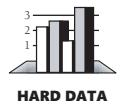

# Chapter 4: Key Construction Decisions

### cc2e.com/0489 Contents

- 4.1 Choice of Programming Language: page 61
- 4.2 Programming Conventions: page 66
- 4.3 Your Location on the Technology Wave: page 66
- 4.4 Selection of Major Construction Practices: page 69

#### Related Topics

- Upstream prerequisites: Chapter 3
- Determine the kind of software you're working on: Section 3.2
- How program size affects construction: Chapter 27
- Managing construction: Chapter 28
- Software design: Chapter 5, and Chapters 6 through 9

Once you're sure an appropriate groundwork has been laid for construction, preparation turns toward more construction-specific decisions. Chapter 3, "Measure Twice, Cut Once: Upstream Prerequisites," discussed the software equivalent of blueprints and construction permits. You might not have had much control over those preparations, so the focus of that chapter was on assessing what you have to work with when construction begins. This chapter focuses on preparations that individual programmers and technical leads are responsible for, directly or indirectly. It discusses the software equivalent of how to select specific tools for your tool belt and how to load your truck before you head out to the job site.

If you feel you've read enough about construction preparations already, you might skip ahead to Chapter 5, "Design in Construction."

### 4.1 Choice of Programming Language

*By relieving the brain of all unnecessary work, a good notation sets it free to concentrate on more advanced problems, and in effect increases the mental power of the race. Before the introduction of the Arabic notation, multiplication was difficult, and the division even of integers called into play the highest mathematical faculties. Probably nothing in the modern world would have more astonished a Greek mathematician than to learn that ... a huge proportion of the population* 

*of Western Europe could perform the operation of division for the largest numbers. This fact would have seemed to him a sheer impossibility.... Our modern power of easy reckoning with decimal fractions is the almost miraculous result of the gradual discovery of a perfect notation.*

*—Alfred North Whitehead*

The programming language in which the system will be implemented should be of great interest to you since you will be immersed in it from the beginning of construction to the end.

Studies have shown that the programming-language choice affects productivity and code quality in several ways.

Programmers are more productive using a familiar language than an unfamiliar one. Data from the Cocomo II estimation model shows that programmers working in a language they've used for three years or more are about 30 percent more productive than programmers with equivalent experience who are new to a language (Boehm et al. 2000). An earlier study at IBM found that programmers who had extensive experience with a programming language were more than three times as productive as those with minimal experience (Walston and Felix 1977). (Cocomo II is more careful to isolate effects of individual factors, which accounts for the different results of the two studies.)

Programmers working with high-level languages achieve better productivity and quality than those working with lower-level languages. Languages such as C++, Java, Smalltalk, and Visual Basic have been credited with improving productivity, reliability, simplicity, and comprehensibility by factors of 5 to 15 over low-level languages such as assembly and C (Brooks 1987, Jones 1998, Boehm 2000). You save time when you don't need to have an awards ceremony every time a C statement does what it's supposed to. Moreover, higher-level languages are more expressive than lower-level languages. Each line of code says more. Table 4-1 shows typical ratios of source statements in several high-level languages to the equivalent code in C. A higher ratio means that each line of code in the language listed accomplishes more than does each line of code in C.

**Table 4-1 Ratio of High-Level-Language Statements to Equivalent C Code**

| Language               | Level Relative to C |
|------------------------|---------------------|
| C                      | 1                   |
| C++                    | 2.5                 |
| Fortran 95             | 2                   |
| Java                   | 2.5                 |
| Perl                   | 6                   |
| Python                 | 6                   |
| Smalltalk              | 6                   |
| Microsoft Visual Basic | 4.5                 |

Source: Adapted from *Estimating Software Costs* (Jones 1998), *Software Cost Estimation with Cocomo II* (Boehm 2000), and "An Empirical Comparison of Seven Programming Languages" (Prechelt 2000).

Some languages are better at expressing programming concepts than others. You can draw a parallel between natural languages such as English and programming languages such as Java and C++. In the case of natural languages, the linguists Sapir and Whorf hypothesize a relationship between the expressive power of a language and the ability to think certain thoughts. The Sapir-Whorf hypothesis says that your ability to think a thought depends on knowing words capable of expressing the thought. If you don't know the words, you can't express the thought and you might not even be able to formulate it (Whorf 1956).

Programmers may be similarly influenced by their languages. The words available in a programming language for expressing your programming thoughts certainly determine how you express your thoughts and might even determine what thoughts you can express.

Evidence of the effect of programming languages on programmers' thinking is common. A typical story goes like this: "We were writing a new system in C++, but most of our programmers didn't have much experience in C++. They came from Fortran backgrounds. They wrote code that compiled in C++, but they were really writing disguised Fortran. They stretched C++ to emulate Fortran's bad features (such as gotos and global data) and ignored C++'s rich set of object-oriented capabilities." This phenomenon has been reported throughout the industry for many years (Hanson 1984, Yourdon 1986a).

#### Language Descriptions

The development histories of some languages are interesting, as are their general capabilities. Here are descriptions of the most common languages in use today.

#### Ada

Ada is a general-purpose, high-level programming language based on Pascal. It was developed under the aegis of the Department of Defense and is especially well suited to real-time and embedded systems. Ada emphasizes data abstraction and information hiding and forces you to differentiate between the public and private parts of each class and package. "Ada" was chosen as the name of the language in honor of Ada Lovelace, a mathematician who is considered to have been the world's first programmer. Today, Ada is used primarily in military, space, and avionics systems.

#### Assembly Language

Assembly language, or "assembler," is a kind of low-level language in which each statement corresponds to a single machine instruction. Because the statements use specific machine instructions, an assembly language is specific to a particular processor for example, specific Intel or Motorola CPUs. Assembler is regarded as the secondgeneration language. Most programmers avoid it unless they're pushing the limits in execution speed or code size.

#### C

C is a general-purpose, mid-level language that was originally associated with the UNIX operating system. C has some high-level language features, such as structured data, structured control flow, machine independence, and a rich set of operators. It has also been called a "portable assembly language" because it makes extensive use of pointers and addresses, has some low-level constructs such as bit manipulation, and is weakly typed.

C was developed in the 1970s at Bell Labs. It was originally designed for and used on the DEC PDP-11—whose operating system, C compiler, and UNIX application programs were all written in C. In 1988, an ANSI standard was issued to codify C, which was revised in 1999. C was the de facto standard for microcomputer and workstation programming in the 1980s and 1990s.

#### C++

C++, an object-oriented language founded on C, was developed at Bell Laboratories in the 1980s. In addition to being compatible with C, C++ provides classes, polymorphism, exception handling, templates, and it provides more robust type checking than C does. It also provides an extensive and powerful standard library.

#### C#

C# is a general-purpose, object-oriented language and programming environment developed by Microsoft with syntax similar to C, C++, and Java, and it provides extensive tools that aid development on Microsoft platforms.

#### Cobol

Cobol is an English-like programming language that was originally developed in 1959–1961 for use by the Department of Defense. Cobol is used primarily for business applications and is still one of the most widely used languages today, second only to Visual Basic in popularity (Feiman and Driver 2002). Cobol has been updated over the years to include mathematical functions and object-oriented capabilities. The acronym "Cobol" stands for COmmon Business-Oriented Language.

#### Fortran

Fortran was the first high-level computer language, introducing the ideas of variables and high-level loops. "Fortran" stands for FORmula TRANslation. Fortran was originally developed in the 1950s and has seen several significant revisions, including Fortran 77 in 1977, which added block-structured if-then-else statements and characterstring manipulations. Fortran 90 added user-defined data types, pointers, classes, and a rich set of operations on arrays. Fortran is used mainly in scientific and engineering applications.

#### Java

Java is an object-oriented language with syntax similar to C and C++ that was developed by Sun Microsystems, Inc. Java was designed to run on any platform by converting Java source code to byte code, which is then run in each platform within an environment known as a virtual machine. Java is in widespread use for programming Web applications.

#### JavaScript

JavaScript is an interpreted scripting language that was originally loosely related to Java. It is used primarily for client-side programming such as adding simple functions and online applications to Web pages.

#### Perl

Perl is a string-handling language that is based on C and several UNIX utilities. Perl is often used for system administration tasks, such as creating build scripts, as well as for report generation and processing. It's also used to create Web applications such as Slashdot. The acronym "Perl" stands for Practical Extraction and Report Language.

#### PHP

PHP is an open-source scripting language with a simple syntax similar to Perl, Bourne Shell, JavaScript, and C. PHP runs on all major operating systems to execute serverside interactive functions. It can be embedded in Web pages to access and present database information. The acronym "PHP" originally stood for Personal Home Page but now stands for PHP: Hypertext Processor.

#### Python

Python is an interpreted, interactive, object-oriented language that runs in numerous environments. It is used most commonly for writing scripts and small Web applications and also contains some support for creating larger programs.

#### SQL

SQL is the de facto standard language for querying, updating, and managing relational databases. "SQL" stands for Structured Query Language. Unlike other languages listed in this section, SQL is a "declarative language," meaning that it does not define a sequence of operations, but rather the result of some operations.

#### Visual Basic

The original version of Basic was a high-level language developed at Dartmouth College in the 1960s. The acronym BASIC stands for Beginner's All-purpose Symbolic

Instruction Code. Visual Basic is a high-level, object-oriented, visual programming version of Basic developed by Microsoft that was originally designed for creating Microsoft Windows applications. It has since been extended to support customization of desktop applications such as Microsoft Office, creation of Web programs, and other applications. Experts report that by the early 2000s more professional developers were working in Visual Basic than in any other language (Feiman and Driver 2002).

#### 4.2 Programming Conventions

**Cross-Reference** For more details on the power of conventions, see Sections 11.3 through 11.5.

In high-quality software, you can see a relationship between the conceptual integrity of the architecture and its low-level implementation. The implementation must be consistent with the architecture that guides it and consistent internally. That's the point of construction guidelines for variable names, class names, routine names, formatting conventions, and commenting conventions.

In a complex program, architectural guidelines give the program structural balance and construction guidelines provide low-level harmony, articulating each class as a faithful part of a comprehensive design. Any large program requires a controlling structure that unifies its programming-language details. Part of the beauty of a large structure is the way in which its detailed parts bear out the implications of its architecture. Without a unifying discipline, your creation will be a jumble of sloppy variations in style. Such variations tax your brain—and only for the sake of understanding coding-style differences that are essentially arbitrary. One key to successful programming is avoiding arbitrary variations so that your brain can be free to focus on the variations that are really needed. For more on this, see "Software's Primary Technical Imperative: Managing Complexity" in Section 5.2.

What if you had a great design for a painting, but one part was classical, one impressionist, and one cubist? It wouldn't have conceptual integrity no matter how closely you followed its grand design. It would look like a collage. A program needs low-level integrity, too.

Before construction begins, spell out the programming conventions you'll use. Coding-convention details are at such a level of precision that they're nearly impossible to retrofit into software after it's written. Details of such conventions are provided throughout the book.

### 4.3 Your Location on the Technology Wave

During my career I've seen the PC's star rise while the mainframe's star dipped toward the horizon. I've seen GUI programs replace character-based programs. And I've seen the Web ascend while Windows declines. I can only assume that by the time you read

this some new technology will be in ascendance, and Web programming as I know it today (2004) will be on its way out. These technology cycles, or waves, imply different programming practices depending on where you find yourself on the wave.

In mature technology environments—the end of the wave, such as Web programming in the mid-2000s—we benefit from a rich software development infrastructure. Latewave environments provide numerous programming language choices, comprehensive error checking for code written in those languages, powerful debugging tools, and automatic, reliable performance optimization. The compilers are nearly bug-free. The tools are well documented in vendor literature, in third-party books and articles, and in extensive Web resources. Tools are integrated, so you can do UI, database, reports, and business logic from within a single environment. If you do run into problems, you can readily find quirks of the tools described in FAQs. Many consultants and training classes are also available.

In early-wave environments—Web programming in the mid-1990s, for example—the situation is the opposite. Few programming language choices are available, and those languages tend to be buggy and poorly documented. Programmers spend significant amounts of time simply trying to figure out how the language works instead of writing new code. Programmers also spend countless hours working around bugs in the language products, underlying operating system, and other tools. Programming tools in early-wave environments tend to be primitive. Debuggers might not exist at all, and compiler optimizers are still only a gleam in some programmer's eye. Vendors revise their compiler version often, and it seems that each new version breaks significant parts of your code. Tools aren't integrated, and so you tend to work with different tools for UI, database, reports, and business logic. The tools tend not to be very compatible, and you can expend a significant amount of effort just to keep existing functionality working against the onslaught of compiler and library releases. If you run into trouble, reference literature exists on the Web in some form, but it isn't always reliable and, if the available literature is any guide, every time you encounter a problem it seems as though you're the first one to do so.

These comments might seem like a recommendation to avoid early-wave programming, but that isn't their intent. Some of the most innovative applications arise from early-wave programs, like Turbo Pascal, Lotus 123, Microsoft Word, and the Mosaic browser. The point is that how you spend your programming days will depend on where you are on the technology wave. If you're in the late part of the wave, you can plan to spend most of your day steadily writing new functionality. If you're in the early part of the wave, you can assume that you'll spend a sizeable portion of your time trying to figure out your programming language's undocumented features, debugging errors that turn out to be defects in the library code, revising code so that it will work with a new release of some vendor's library, and so on.

When you find yourself working in a primitive environment, realize that the programming practices described in this book can help you even more than they can in mature environments. As David Gries pointed out, your programming tools don't have to determine how you think about programming (1981). Gries makes a distinction between programming *in* a language vs. programming *into* a language. Programmers who program "in" a language limit their thoughts to constructs that the language directly supports. If the language tools are primitive, the programmer's thoughts will also be primitive.

Programmers who program "into" a language first decide what thoughts they want to express, and then they determine how to express those thoughts using the tools provided by their specific language.

#### Example of Programming** *into* **a Language

In the early days of Visual Basic, I was frustrated because I wanted to keep the business logic, the UI, and the database separate in the product I was developing, but there wasn't any built-in way to do that in the language. I knew that if I wasn't careful, over time some of my Visual Basic "forms" would end up containing business logic, some forms would contain database code, and some would contain neither—I would end up never being able to remember which code was located in which place. I had just completed a C++ project that had done a poor job of separating those issues, and I didn't want to experience déjà vu of those headaches in a different language.

Consequently, I adopted a design convention that the .frm file (the form file) was allowed only to retrieve data from the database and store data back into the database. It wasn't allowed to communicate that data directly to other parts of the program. Each form supported an IsFormCompleted() routine, which was used by the calling routine to determine whether the form that had been activated had saved its data. IsFormCompleted() was the only public routine that forms were allowed to have. Forms also weren't allowed to contain any business logic. All other code had to be contained in an associated .bas file, including validity checks for entries in the form.

Visual Basic did not encourage this kind of approach. It encouraged programmers to put as much code into the .frm file as possible, and it didn't make it easy for the .frm file to call back into an associated .bas file.

This convention was pretty simple, but as I got deeper into my project, I found that it helped me avoid numerous cases in which I would have been writing convoluted code without the convention. I would have been loading forms but keeping them hidden so that I could call the data-validity-checking routines inside them, or I would have been copying code from the forms into other locations and then maintaining parallel code in multiple places. The IsFormCompleted() convention also kept things simple. Because every form worked exactly the same way, I never had to second-guess the semantics of IsFormCompleted()—it meant the same thing every time it was used.

Visual Basic didn't support this convention directly, but my use of a simple programming convention—programming *into* the language—made up for the language's lack of structure at that time and helped keep the project intellectually manageable.

Understanding the distinction between programming in a language and programming into one is critical to understanding this book. Most of the important programming principles depend not on specific languages but on the way you use them. If your language lacks constructs that you want to use or is prone to other kinds of problems, try to compensate for them. Invent your own coding conventions, standards, class libraries, and other augmentations.

#### 4.4 Selection of Major Construction Practices

Part of preparing for construction is deciding which of the many available good practices you'll emphasize. Some projects use pair programming and test-first development, while others use solo development and formal inspections. Either combination of techniques can work well, depending on specific circumstances of the project.

The following checklist summarizes the specific practices you should consciously decide to include or exclude during construction. Details of these practices are contained throughout the book.

#### cc2e.com/0496 Checklist: Major Construction Practices Coding

- ❑ Have you defined how much design will be done up front and how much will be done at the keyboard, while the code is being written?
- ❑ Have you defined coding conventions for names, comments, and layout?
- ❑ Have you defined specific coding practices that are implied by the architecture, such as how error conditions will be handled, how security will be addressed, what conventions will be used for class interfaces, what standards will apply to reused code, how much to consider performance while coding, and so on?
- ❑ Have you identified your location on the technology wave and adjusted your approach to match? If necessary, have you identified how you will program *into* the language rather than being limited by programming *in* it?

#### Teamwork

- ❑ Have you defined an integration procedure—that is, have you defined the specific steps a programmer must go through before checking code into the master sources?
- ❑ Will programmers program in pairs, or individually, or some combination of the two?

**Cross-Reference** For more details on quality assurance, see Chapter 20, "The Software-Quality Landscape."

**Cross-Reference** For more details on tools, see Chapter 30, "Programming Tools."

#### Quality Assurance

- ❑ Will programmers write test cases for their code before writing the code itself?
- ❑ Will programmers write unit tests for their code regardless of whether they write them first or last?
- ❑ Will programmers step through their code in the debugger before they check it in?
- ❑ Will programmers integration-test their code before they check it in?
- ❑ Will programmers review or inspect each other's code?

#### Tools

- ❑ Have you selected a revision control tool?
- ❑ Have you selected a language and language version or compiler version?
- ❑ Have you selected a framework such as J2EE or Microsoft .NET or explicitly decided not to use a framework?
- ❑ Have you decided whether to allow use of nonstandard language features?
- ❑ Have you identified and acquired other tools you'll be using—editor, refactoring tool, debugger, test framework, syntax checker, and so on?

### Key Points

- Every programming language has strengths and weaknesses. Be aware of the specific strengths and weaknesses of the language you're using.
- Establish programming conventions before you begin programming. It's nearly impossible to change code to match them later.
- More construction practices exist than you can use on any single project. Consciously choose the practices that are best suited to your project.
- Ask yourself whether the programming practices you're using are a response to the programming language you're using or controlled by it. Remember to program *into* the language, rather than programming *in* it.
- Your position on the technology wave determines what approaches will be effective—or even possible. Identify where you are on the technology wave, and adjust your plans and expectations accordingly.
