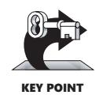
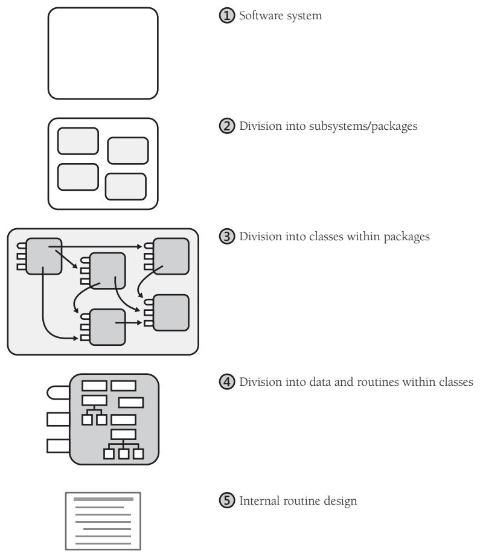
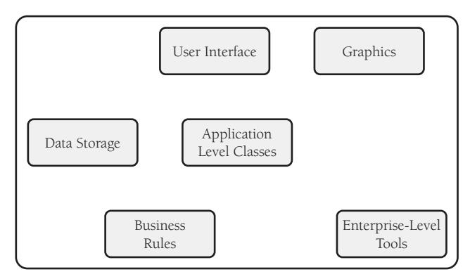
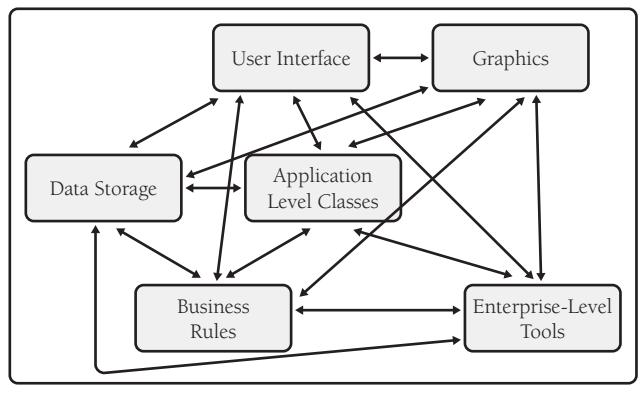
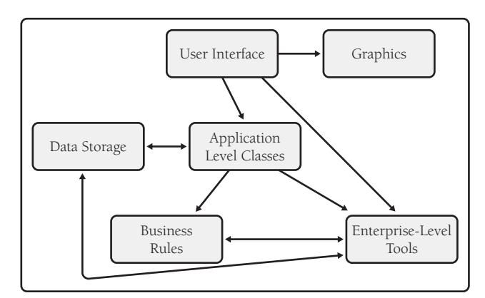
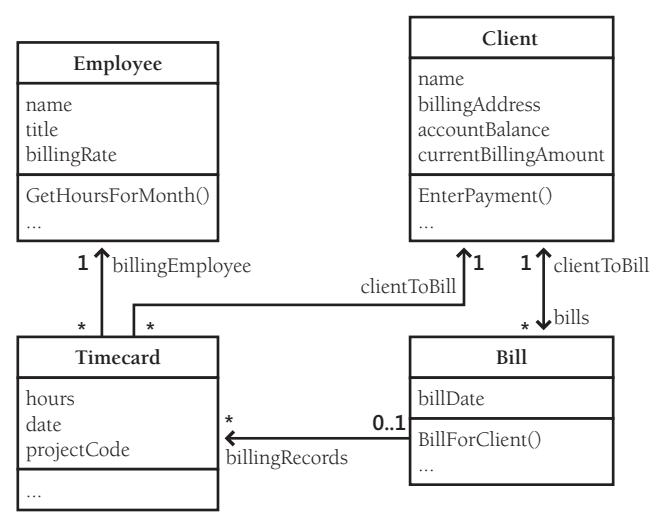
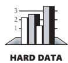
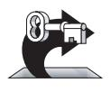
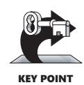
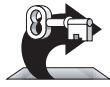

# Chapter 5: Design in Construction

### cc2e.com/0578 Contents

- 5.1 Design Challenges: page 74
- 5.2 Key Design Concepts: page 77
- 5.3 Design Building Blocks: Heuristics: page 87
- 5.4 Design Practices: page 110
- 5.5 Comments on Popular Methodologies: page 118

#### Related Topics

- Software architecture: Section 3.5
- Working classes: Chapter 6
- Characteristics of high-quality routines: Chapter 7
- Defensive programming: Chapter 8
- Refactoring: Chapter 24
- How program size affects construction: Chapter 27

Some people might argue that design isn't really a construction activity, but on small projects, many activities are thought of as construction, often including design. On some larger projects, a formal architecture might address only the system-level issues and much design work might intentionally be left for construction. On other large projects, the design might be intended to be detailed enough for coding to be fairly mechanical, but design is rarely that complete—the programmer usually designs part of the program, officially or otherwise.

**Cross-Reference** For details on the different levels of formality required on large and small projects, see Chapter 27, "How Program Size Affects Construction."

On small, informal projects, a lot of design is done while the programmer sits at the keyboard. "Design" might be just writing a class interface in pseudocode before writing the details. It might be drawing diagrams of a few class relationships before coding them. It might be asking another programmer which design pattern seems like a better choice. Regardless of how it's done, small projects benefit from careful design just as larger projects do, and recognizing design as an explicit activity maximizes the benefit you will receive from it.

Design is a huge topic, so only a few aspects of it are considered in this chapter. A large part of good class or routine design is determined by the system architecture, so be

sure that the architecture prerequisite discussed in Section 3.5 has been satisfied. Even more design work is done at the level of individual classes and routines, described in Chapter 6, "Working Classes," and Chapter 7, "High-Quality Routines."

If you're already familiar with software design topics, you might want to just hit the highlights in the sections about design challenges in Section 5.1 and key heuristics in Section 5.3.

### 5.1 Design Challenges

**Cross-Reference** The difference between heuristic and deterministic processes is described in Chapter 2, "Metaphors for a Richer Understanding of Software Development."

The phrase "software design" means the conception, invention, or contrivance of a scheme for turning a specification for computer software into operational software. Design is the activity that links requirements to coding and debugging. A good toplevel design provides a structure that can safely contain multiple lower-level designs. Good design is useful on small projects and indispensable on large projects.

Design is also marked by numerous challenges, which are outlined in this section.

#### Design Is a Wicked Problem

The picture of the software designer deriving his design in a rational, error-free way from a statement of requirements is quite unrealistic. No system has ever been developed in that way, and probably none ever will. Even the small program developments shown in textbooks and papers are unreal. They have been revised and polished until the author has shown us what he wishes he had done, not what actually did happen.

—*David Parnas and Paul Clements*

Horst Rittel and Melvin Webber defined a "wicked" problem as one that could be clearly defined only by solving it, or by solving part of it (1973). This paradox implies, essentially, that you have to "solve" the problem once in order to clearly define it and then solve it again to create a solution that works. This process has been motherhood and apple pie in software development for decades (Peters and Tripp 1976).

In my part of the world, a dramatic example of such a wicked problem was the design of the original Tacoma Narrows bridge. At the time the bridge was built, the main consideration in designing a bridge was that it be strong enough to support its planned load. In the case of the Tacoma Narrows bridge, wind created an unexpected, side-toside harmonic ripple. One blustery day in 1940, the ripple grew uncontrollably until the bridge collapsed, as shown in Figure 5-1.

This is a good example of a wicked problem because, until the bridge collapsed, its engineers didn't know that aerodynamics needed to be considered to such an extent. Only by building the bridge (solving the problem) could they learn about the additional consideration in the problem that allowed them to build another bridge that still stands.

Figure 5-1 The Tacoma Narrows bridge—an example of a wicked problem.

One of the main differences between programs you develop in school and those you develop as a professional is that the design problems solved by school programs are rarely, if ever, wicked. Programming assignments in school are devised to move you in a beeline from beginning to end. You'd probably want to tar and feather a teacher who gave you a programming assignment, then changed the assignment as soon as you finished the design, and then changed it again just as you were about to turn in the completed program. But that very process is an everyday reality in professional programming.

#### Design Is a Sloppy Process (Even If it Produces a Tidy Result)

The finished software design should look well organized and clean, but the process used to develop the design isn't nearly as tidy as the end result.

Further Reading For a fuller exploration of this viewpoint, see "A Rational Design Process: How and Why to Fake It" (Parnas and Clements 1986).

Design is sloppy because you take many false steps and go down many blind alleys—you make a lot of mistakes. Indeed, making mistakes is the point of design—it's cheaper to make mistakes and correct designs than it would be to make the same mistakes, recognize them after coding, and have to correct full-blown code. Design is sloppy because a good solution is often only subtly different from a poor one.

**Cross-Reference** For a better answer to this question, see "How Much Design is Enough?" in Section 5.4 later in this chapter.

Design is also sloppy because it's hard to know when your design is "good enough." How much detail is enough? How much design should be done with a formal design notation, and how much should be left to be done at the keyboard? When are you done? Since design is open-ended, the most common answer to that question is "When you're out of time."

#### Design Is About Tradeoffs and Priorities

In an ideal world, every system could run instantly, consume zero storage space, use zero network bandwidth, never contain any errors, and cost nothing to build. In the real world, a key part of the designer's job is to weigh competing design characteristics and strike a balance among those characteristics. If a fast response rate is more important than minimizing development time, a designer will choose one design. If minimizing development time is more important, a good designer will craft a different design.

#### Design Involves Restrictions

The point of design is partly to create possibilities and partly to *restrict possibilities*. If people had infinite time, resources, and space to build physical structures, you would see incredible sprawling buildings with one room for each shoe and hundreds of rooms. This is how software can turn out without deliberately imposed restrictions. The constraints of limited resources for constructing buildings force simplifications of the solution that ultimately improve the solution. The goal in software design is the same.

#### Design Is Nondeterministic

If you send three people away to design the same program, they can easily return with three vastly different designs, each of which could be perfectly acceptable. There might be more than one way to skin a cat, but there are usually dozens of ways to design a computer program.

#### Design Is a Heuristic Process

KEY POINT

Because design is nondeterministic, design techniques tend to be heuristics—"rules of thumb" or "things to try that sometimes work"—rather than repeatable processes that are guaranteed to produce predictable results. Design involves trial and error. A design tool or technique that worked well on one job or on one aspect of a job might not work as well on the next project. No tool is right for everything.

#### Design Is Emergent

**cc2e.com/0539** A tidy way of summarizing these attributes of design is to say that design is "emergent." Designs don't spring fully formed directly from someone's brain. They evolve and improve through design reviews, informal discussions, experience writing the code itself, and experience revising the code.

**Further Reading** Software isn't the only kind of structure that changes over time. Physical structures evolve, too—see *How Buildings Learn* (Brand 1995).

Virtually all systems undergo some degree of design changes during their initial development, and then they typically change to a greater extent as they're extended into later versions. The degree to which change is beneficial or acceptable depends on the nature of the software being built.

#### 5.2 Key Design Concepts

Good design depends on understanding a handful of key concepts. This section discusses the role of complexity, desirable characteristics of designs, and levels of design.

#### Software's Primary Technical Imperative: Managing Complexity

**Cross-Reference** For discussion of the way complexity affects programming issues other than design, see Section 34.1, "Conquer Complexity."

To understand the importance of managing complexity, it's useful to refer to Fred Brooks's landmark paper, "No Silver Bullets: Essence and Accidents of Software Engineering" (1987).

#### Accidental and Essential Difficulties

Brooks argues that software development is made difficult because of two different classes of problems—the *essential* and the *accidental*. In referring to these two terms, Brooks draws on a philosophical tradition going back to Aristotle. In philosophy, the essential properties are the properties that a thing must have in order to be that thing. A car must have an engine, wheels, and doors to be a car. If it doesn't have any of those essential properties, it isn't really a car.

Accidental properties are the properties a thing just happens to have, properties that don't really bear on whether the thing is what it is. A car could have a V8, a turbocharged 4-cylinder, or some other kind of engine and be a car regardless of that detail. A car could have two doors or four; it could have skinny wheels or mag wheels. All those details are accidental properties. You could also think of accidental properties as *incidental*, *discretionary*, *optional*, and *happenstance*.

**Cross-Reference** Accidental difficulties are more prominent in early-wave development than in late-wave development. For details, see Section 4.3, "Your Location on the Technology Wave."

Brooks observes that the major accidental difficulties in software were addressed long ago. For example, accidental difficulties related to clumsy language syntaxes were largely eliminated in the evolution from assembly language to third-generation languages and have declined in significance incrementally since then. Accidental difficulties related to noninteractive computers were resolved when time-share operating systems replaced batch-mode systems. Integrated programming environments further eliminated inefficiencies in programming work arising from tools that worked poorly together.

Brooks argues that progress on software's remaining *essential* difficulties is bound to be slower. The reason is that, at its essence, software development consists of working out all the details of a highly intricate, interlocking set of concepts. The essential difficulties arise from the necessity of interfacing with the complex, disorderly real world; accurately and completely identifying the dependencies and exception cases; designing solutions that can't be just approximately correct but that must be exactly correct; and so on. Even if we could invent a programming language that used the same terminology as the real-world problem we're trying to solve, programming would still be difficult because of the challenge in determining precisely how the real world works. As software addresses ever-larger real-world problems, the interactions among the real-world entities become increasingly intricate, and that in turn increases the essential difficulty of the software solutions.

The root of all these essential difficulties is complexity—both accidental and essential.

#### Importance of Managing Complexity

When software-project surveys report causes of project failure, they rarely identify technical reasons as the primary causes of project failure. Projects fail most often because of poor requirements, poor planning, or poor management. But when projects do fail for reasons that are primarily technical, the reason is often uncontrolled complexity. The software is allowed to grow so complex that no one really knows what it does. When a project reaches the point at which no one completely understands the impact that code changes in one area will have on other areas, progress grinds to a halt.

*ous* deficiencies. —*C. A. R. Hoare*

There are two ways of constructing a software design: one way is to make it so simple that there are *obviously* no deficiencies, and the other is to make it so complicated that there are no *obvi-*

Managing complexity is the most important technical topic in software development. In my view, it's so important that Software's Primary Technical Imperative has to be *managing complexity*.

Complexity is not a new feature of software development. Computing pioneer Edsger Dijkstra pointed out that computing is the only profession in which a single mind is obliged to span the distance from a bit to a few hundred megabytes, a ratio of 1 to 109, or nine orders of magnitude (Dijkstra 1989). This gigantic ratio is staggering. Dijkstra put it this way: "Compared to that number of semantic levels, the average mathematical theory is almost flat. By evoking the need for deep conceptual hierarchies, the automatic computer confronts us with a radically new intellectual challenge that has no precedent in our history." Of course software has become even more complex since 1989, and Dijkstra's ratio of 1 to 109 could easily be more like 1 to 1015 today.

One symptom that you have bogged down in complexity overload is when you find yourself doggedly applying a method that is clearly irrelevant, at least to any outside observer. It is like the mechanically inept person whose car breaks down—so he puts water in the battery and empties the ashtrays. —*P. J. Plauger*

Dijkstra pointed out that no one's skull is really big enough to contain a modern computer program (Dijkstra 1972), which means that we as software developers shouldn't try to cram whole programs into our skulls at once; we should try to organize our programs in such a way that we can safely focus on one part of it at a time. The goal is to minimize the amount of a program you have to think about at any one time. You might think of this as mental juggling—the more mental balls the program requires you to keep in the air at once, the more likely you'll drop one of the balls, leading to a design or coding error.

At the software-architecture level, the complexity of a problem is reduced by dividing the system into subsystems. Humans have an easier time comprehending several simple pieces of information than one complicated piece. The goal of all software-design techniques is to break a complicated problem into simple pieces. The more independent the subsystems are, the more you make it safe to focus on one bit of complexity at a time. Carefully defined objects separate concerns so that you can focus on one thing at a time. Packages provide the same benefit at a higher level of aggregation.

Keeping routines short helps reduce your mental workload. Writing programs in terms of the problem domain, rather than in terms of low-level implementation details, and working at the highest level of abstraction reduce the load on your brain.

The bottom line is that programmers who compensate for inherent human limitations write code that's easier for themselves and others to understand and that has fewer errors.

#### How to Attack Complexity

with at any one time.

Overly costly, ineffective designs arise from three sources:

- A complex solution to a simple problem
- A simple, incorrect solution to a complex problem
- An inappropriate, complex solution to a complex problem

As Dijkstra pointed out, modern software is inherently complex, and no matter how hard you try, you'll eventually bump into some level of complexity that's inherent in the real-world problem itself. This suggests a two-prong approach to managing complexity:

■ Minimize the amount of essential complexity that anyone's brain has to deal

■ Keep accidental complexity from needlessly proliferating.

Once you understand that all other technical goals in software are secondary to managing complexity, many design considerations become straightforward.

#### Desirable Characteristics of a Design

When I am working on a problem I never think about beauty. I think only how to solve the problem. But when I have finished, if the solution is not beautiful, I know it is wrong.

—*R. Buckminster Fuller*

**Cross-Reference** These characteristics are related to general software-quality attributes. For details on general attributes, see Section 20.1, "Characteristics of Software Quality."

A high-quality design has several general characteristics. If you could achieve all these goals, your design would be very good indeed. Some goals contradict other goals, but that's the challenge of design—creating a good set of tradeoffs from competing objectives. Some characteristics of design quality are also characteristics of a good program: reliability, performance, and so on. Others are internal characteristics of the design.

Here's a list of internal design characteristics:

*Minimal complexity* The primary goal of design should be to minimize complexity for all the reasons just described. Avoid making "clever" designs. Clever designs are usually hard to understand. Instead make "simple" and "easy-to-understand" designs. If your design doesn't let you safely ignore most other parts of the program when you're immersed in one specific part, the design isn't doing its job.

*Ease of maintenance* Ease of maintenance means designing for the maintenance programmer. Continually imagine the questions a maintenance programmer would ask about the code you're writing. Think of the maintenance programmer as your audience, and then design the system to be self-explanatory.

*Loose coupling* Loose coupling means designing so that you hold connections among different parts of a program to a minimum. Use the principles of good abstractions in class interfaces, encapsulation, and information hiding to design classes with as few interconnections as possible. Minimal connectedness minimizes work during integration, testing, and maintenance.

*Extensibility* Extensibility means that you can enhance a system without causing violence to the underlying structure. You can change a piece of a system without affecting other pieces. The most likely changes cause the system the least trauma.

*Reusability* Reusability means designing the system so that you can reuse pieces of it in other systems.

*High fan-in* High fan-in refers to having a high number of classes that use a given class. High fan-in implies that a system has been designed to make good use of utility classes at the lower levels in the system.

*Low-to-medium fan-out* Low-to-medium fan-out means having a given class use a low-to-medium number of other classes. High fan-out (more than about seven) indicates that a class uses a large number of other classes and may therefore be overly complex. Researchers have found that the principle of low fan-out is beneficial whether you're considering the number of routines called from within a routine or the number of classes used within a class (Card and Glass 1990; Basili, Briand, and Melo 1996).

*Portability* Portability means designing the system so that you can easily move it to another environment.

*Leanness* Leanness means designing the system so that it has no extra parts (Wirth 1995, McConnell 1997). Voltaire said that a book is finished not when nothing more can be added but when nothing more can be taken away. In software, this is especially true because extra code has to be developed, reviewed, tested, and considered when the other code is modified. Future versions of the software must remain backwardcompatible with the extra code. The fatal question is "It's easy, so what will we hurt by putting it in?"

*Stratification* Stratification means trying to keep the levels of decomposition stratified so that you can view the system at any single level and get a consistent view. Design the system so that you can view it at one level without dipping into other levels.

**Cross-Reference** For more on working with old systems, see Section 24.5, "Refactoring Strategies."

For example, if you're writing a modern system that has to use a lot of older, poorly designed code, write a layer of the new system that's responsible for interfacing with the old code. Design the layer so that it hides the poor quality of the old code, presenting a consistent set of services to the newer layers. Then have the rest of the system use those classes rather than the old code. The beneficial effects of stratified design in such a case are (1) it compartmentalizes the messiness of the bad code and (2) if you're ever allowed to jettison the old code or refactor it, you won't need to modify any new code except the interface layer.

**Cross-Reference** An especially valuable kind of standardization is the use of design patterns, which are discussed in "Look for Common Design Patterns" in Section 5.3.

*Standard techniques* The more a system relies on exotic pieces, the more intimidating it will be for someone trying to understand it the first time. Try to give the whole system a familiar feeling by using standardized, common approaches.

#### Levels of Design

Design is needed at several different levels of detail in a software system. Some design techniques apply at all levels, and some apply at only one or two. Figure 5-2 illustrates the levels.

**Figure 5-2** The levels of design in a program. The system (1) is first organized into subsystems (2). The subsystems are further divided into classes (3), and the classes are divided into routines and data (4). The inside of each routine is also designed (5).

#### Level 1: Software System

The first level is the entire system. Some programmers jump right from the system level into designing classes, but it's usually beneficial to think through higher level combinations of classes, such as subsystems or packages.

#### Level 2: Division into Subsystems or Packages

The main product of design at this level is the identification of all major subsystems. The subsystems can be big: database, user interface, business rules, command interpreter,

In other words—and this is the rock-solid principle on which the whole of the Corporation's Galaxywide success is founded—their fundamental design flaws are completely hidden by their superficial design flaws. —*Douglas Adams*

report engine, and so on. The major design activity at this level is deciding how to partition the program into major subsystems and defining how each subsystem is allowed to use each other subsystem. Division at this level is typically needed on any project that takes longer than a few weeks. Within each subsystem, different methods of design might be used—choosing the approach that best fits each part of the system. In Figure 5- 2, design at this level is marked with a *2*.

Of particular importance at this level are the rules about how the various subsystems can communicate. If all subsystems can communicate with all other subsystems, you lose the benefit of separating them at all. Make each subsystem meaningful by restricting communications.

Suppose for example that you define a system with six subsystems, as shown in Figure 5-3. When there are no rules, the second law of thermodynamics will come into play and the entropy of the system will increase. One way in which entropy increases is that, without any restrictions on communications among subsystems, communication will occur in an unrestricted way, as in Figure 5-4.

**Figure 5-3** An example of a system with six subsystems.

**Figure 5-4** An example of what happens with no restrictions on intersubsystem communications.

As you can see, every subsystem ends up communicating directly with every other subsystem, which raises some important questions:

- How many different parts of the system does a developer need to understand at least a little bit to change something in the graphics subsystem?
- What happens when you try to use the business rules in another system?
- What happens when you want to put a new user interface on the system, perhaps a command-line UI for test purposes?
- What happens when you want to put data storage on a remote machine?

You might think of the lines between subsystems as being hoses with water running through them. If you want to reach in and pull out a subsystem, that subsystem is going to have some hoses attached to it. The more hoses you have to disconnect and reconnect, the more wet you're going to get. You want to architect your system so that if you pull out a subsystem to use elsewhere, you won't have many hoses to reconnect and those hoses will reconnect easily.

With forethought, all of these issues can be addressed with little extra work. Allow communication between subsystems only on a "need to know" basis—and it had better be a *good* reason. If in doubt, it's easier to restrict communication early and relax it later than it is to relax it early and then try to tighten it up after you've coded several hundred intersubsystem calls. Figure 5-5 shows how a few communication guidelines could change the system depicted in Figure 5-4.

**Figure 5-5** With a few communication rules, you can simplify subsystem interactions significantly.

To keep the connections easy to understand and maintain, err on the side of simple intersubsystem relations. The simplest relationship is to have one subsystem call routines in another. A more involved relationship is to have one subsystem contain classes from another. The most involved relationship is to have classes in one subsystem inherit from classes in another.

A good general rule is that a system-level diagram like Figure 5-5 should be an acyclic graph. In other words, a program shouldn't contain any circular relationships in which Class A uses Class B, Class B uses Class C, and Class C uses Class A.

On large programs and families of programs, design at the subsystem level makes a difference. If you believe that your program is small enough to skip subsystem-level design, at least make the decision to skip that level of design a conscious one.

**Common Subsystems** Some kinds of subsystems appear again and again in different systems. Here are some of the usual suspects.

**Cross-Reference** For more on simplifying business logic by expressing it in tables, see Chapter 18, "Table-Driven Methods."

*Business rules* Business rules are the laws, regulations, policies, and procedures that you encode into a computer system. If you're writing a payroll system, you might encode rules from the IRS about the number of allowable withholdings and the estimated tax rate. Additional rules for a payroll system might come from a union contract specifying overtime rates, vacation and holiday pay, and so on. If you're writing a program to quote automobile insurance rates, rules might come from government regulations on required liability coverages, actuarial rate tables, or underwriting restrictions

*User interface* Create a subsystem to isolate user-interface components so that the user interface can evolve without damaging the rest of the program. In most cases, a user-interface subsystem uses several subordinate subsystems or classes for the GUI interface, command line interface, menu operations, window management, help system, and so forth.

*Database access* You can hide the implementation details of accessing a database so that most of the program doesn't need to worry about the messy details of manipulating low-level structures and can deal with the data in terms of how it's used at the business-problem level. Subsystems that hide implementation details provide a valuable level of abstraction that reduces a program's complexity. They centralize database operations in one place and reduce the chance of errors in working with the data. They make it easy to change the database design structure without changing most of the program.

*System dependencies* Package operating-system dependencies into a subsystem for the same reason you package hardware dependencies. If you're developing a program for Microsoft Windows, for example, why limit yourself to the Windows environment? Isolate the Windows calls in a Windows-interface subsystem. If you later want to move your program to Mac OS or Linux, all you'll have to change is the interface subsystem. An interface subsystem can be too extensive for you to implement on your own, but such subsystems are readily available in any of several commercial code libraries.

#### Level 3: Division into Classes

**Further Reading** For a good discussion of database design, see *Agile Database Techniques* (Ambler 2003).

Design at this level includes identifying all classes in the system. For example, a database-interface subsystem might be further partitioned into data access classes and persistence framework classes as well as database metadata. Figure 5-2, Level 3, shows how one of Level 2's subsystems might be divided into classes, and it implies that the other three subsystems shown at Level 2 are also decomposed into classes.

Details of the ways in which each class interacts with the rest of the system are also specified as the classes are specified. In particular, the class's interface is defined. Overall, the major design activity at this level is making sure that all the subsystems have been decomposed to a level of detail fine enough that you can implement their parts as individual classes.

**Cross-Reference** For details on characteristics of highquality classes, see Chapter 6, "Working Classes."

The division of subsystems into classes is typically needed on any project that takes longer than a few days. If the project is large, the division is clearly distinct from the program partitioning of Level 2. If the project is very small, you might move directly from the whole-system view of Level 1 to the classes view of Level 3.

**Classes vs. Objects** A key concept in object-oriented design is the differentiation between objects and classes. An object is any specific entity that exists in your program at run time. A class is the static thing you look at in the program listing. An object is the dynamic thing with specific values and attributes you see when you run the program. For example, you could declare a class *Person* that had attributes of name, age, gender, and so on. At run time you would have the objects *nancy*, *hank*, *diane*, *tony*, and so on—that is, specific instances of the class. If you're familiar with database terms, it's the same as the distinction between "schema" and "instance." You could think of the class as the cookie cutter and the object as the cookie. This book uses the terms informally and generally refers to classes and objects more or less interchangeably.

#### Level 4: Division into Routines

Design at this level includes dividing each class into routines. The class interface defined at Level 3 will define some of the routines. Design at Level 4 will detail the class's private routines. When you examine the details of the routines inside a class, you can see that many routines are simple boxes but a few are composed of hierarchically organized routines, which require still more design.

The act of fully defining the class's routines often results in a better understanding of the class's interface, and that causes corresponding changes to the interface—that is, changes back at Level 3.

This level of decomposition and design is often left up to the individual programmer, and it's needed on any project that takes more than a few hours. It doesn't need to be done formally, but it at least needs to be done mentally.

#### Level 5: Internal Routine Design

**Cross-Reference** For details on creating high-quality routines, see Chapter 7, "High-Quality Routines," and Chapter 8, "Defensive Programming."

Design at the routine level consists of laying out the detailed functionality of the individual routines. Internal routine design is typically left to the individual programmer working on an individual routine. The design consists of activities such as writing pseudocode, looking up algorithms in reference books, deciding how to organize the paragraphs of code in a routine, and writing programming-language code. This level of design is always done, though sometimes it's done unconsciously and poorly rather than consciously and well. In Figure 5-2, design at this level is marked with a *5*.

#### 5.3 Design Building Blocks: Heuristics

Software developers tend to like our answers cut and dried: "Do A, B, and C, and X, Y, Z will follow every time." We take pride in learning arcane sets of steps that produce desired effects, and we become annoyed when instructions don't work as advertised. This desire for deterministic behavior is highly appropriate to detailed computer programming, where that kind of strict attention to detail makes or breaks a program. But software design is a much different story.

Because design is nondeterministic, skillful application of an effective set of heuristics is the core activity in good software design. The following subsections describe a number of heuristics—ways to think about a design that sometime produce good design insights. You might think of heuristics as the guides for the trials in "trial and error." You undoubtedly have run across some of these before. Consequently, the following subsections describe each of the heuristics in terms of Software's Primary Technical Imperative: managing complexity.

#### Find Real-World Objects

Ask not first what the system does; ask WHAT it does it to! —*Bertrand Meyer*

The first and most popular approach to identifying design alternatives is the "by the book" object-oriented approach, which focuses on identifying real-world and synthetic objects.

The steps in designing with objects are

**Cross-Reference** For more details on designing using classes, see Chapter 6, "Working Classes."

- Identify the objects and their attributes (methods and data).
- Determine what can be done to each object.
- Determine what each object is allowed to do to other objects.
- Determine the parts of each object that will be visible to other objects—which parts will be public and which will be private.
- Define each object's public interface.

These steps aren't necessarily performed in order, and they're often repeated. Iteration is important. Each of these steps is summarized below.

*Identify the objects and their attributes* Computer programs are usually based on real-world entities. For example, you could base a time-billing system on real-world employees, clients, timecards, and bills. Figure 5-6 shows an object-oriented view of such a billing system.

**Figure 5-6** This billing system is composed of four major objects. The objects have been simplified for this example.

Identifying the objects' attributes is no more complicated than identifying the objects themselves. Each object has characteristics that are relevant to the computer program. For example, in the time-billing system, an employee object has a name, a title, and a billing rate. A client object has a name, a billing address, and an account balance. A bill object has a billing amount, a client name, a billing date, and so on.

Objects in a graphical user interface system would include windows, dialog boxes, buttons, fonts, and drawing tools. Further examination of the problem domain might produce better choices for software objects than a one-to-one mapping to real-world objects, but the real-world objects are a good place to start.

*Determine what can be done to each object* A variety of operations can be performed on each object. In the billing system shown in Figure 5-6, an employee object could have a change in title or billing rate, a client object could have its name or billing address changed, and so on.

*Determine what each object is allowed to do to other objects* This step is just what it sounds like. The two generic things objects can do to each other are containment and inheritance. Which objects can *contain* which other objects? Which objects can *inherit*  *from* which other objects? In Figure 5-6, a timecard object can contain an employee object and a client object, and a bill can contain one or more timecards. In addition, a bill can indicate that a client has been billed, and a client can enter payments against a bill. A more complicated system would include additional interactions.

**Cross-Reference** For details on classes and information hiding, see "Hide Secrets (Information Hiding)" in Section 5.3.

*Determine the parts of each object that will be visible to other objects* One of the key design decisions is identifying the parts of an object that should be made public and those that should be kept private. This decision has to be made for both data and methods.

*Define each object's interfaces* Define the formal, syntactic, programming-languagelevel interfaces to each object. The data and methods the object exposes to every other object is called the object's "public interface." The parts of the object that it exposes to derived objects via inheritance is called the object's "protected interface." Think about both kinds of interfaces.

When you finish going through the steps to achieve a top-level object-oriented system organization, you'll iterate in two ways. You'll iterate on the top-level system organization to get a better organization of classes. You'll also iterate on each of the classes you've defined, driving the design of each class to a more detailed level.

#### Form Consistent Abstractions

Abstraction is the ability to engage with a concept while safely ignoring some of its details—handling different details at different levels. Any time you work with an aggregate, you're working with an abstraction. If you refer to an object as a "house" rather than a combination of glass, wood, and nails, you're making an abstraction. If you refer to a collection of houses as a "town," you're making another abstraction.

Base classes are abstractions that allow you to focus on common attributes of a set of derived classes and ignore the details of the specific classes while you're working on the base class. A good class interface is an abstraction that allows you to focus on the interface without needing to worry about the internal workings of the class. The interface to a well-designed routine provides the same benefit at a lower level of detail, and the interface to a well-designed package or subsystem provides that benefit at a higher level of detail.

From a complexity point of view, the principal benefit of abstraction is that it allows you to ignore irrelevant details. Most real-world objects are already abstractions of some kind. As just mentioned, a house is an abstraction of windows, doors, siding, wiring, plumbing, insulation, and a particular way of organizing them. A door is in turn an abstraction of a particular arrangement of a rectangular piece of material with hinges and a doorknob. And the doorknob is an abstraction of a particular formation of brass, nickel, iron, or steel.

People use abstraction continuously. If you had to deal with individual wood fibers, varnish molecules, and steel molecules every time you used your front door, you'd hardly make it in or out of your house each day. As Figure 5-7 suggests, abstraction is a big part of how we deal with complexity in the real world.

**Figure 5-7** Abstraction allows you to take a simpler view of a complex concept.

**Cross-Reference** For more details on abstraction in class design, see "Good Abstraction" in Section 6.2.

Software developers sometimes build systems at the wood-fiber, varnish-molecule, and steel-molecule level. This makes the systems overly complex and intellectually hard to manage. When programmers fail to provide larger programming abstractions, the system itself sometimes fails to make it through the front door.

Good programmers create abstractions at the routine-interface level, class-interface level, and package-interface level—in other words, the doorknob level, door level, and house level—and that supports faster and safer programming.

#### Encapsulate Implementation Details

Encapsulation picks up where abstraction leaves off. Abstraction says, "You're allowed to look at an object at a high level of detail." Encapsulation says, "Furthermore, you aren't allowed to look at an object at any other level of detail."

Continuing with the housing-materials analogy: encapsulation is a way of saying that you can look at the outside of the house but you can't get close enough to make out the door's details. You are allowed to know that there's a door, and you're allowed to know whether the door is open or closed, but you're not allowed to know whether the door is made of wood, fiberglass, steel, or some other material, and you're certainly not allowed to look at each individual wood fiber.

As Figure 5-8 suggests, encapsulation helps to manage complexity by forbidding you to look at the complexity. The section titled "Good Encapsulation" in Section 6.2 provides more background on encapsulation as it applies to class design.

**Figure 5-8** Encapsulation says that, not only are you allowed to take a simpler view of a complex concept, you are *not* allowed to look at any of the details of the complex concept. What you see is what you get—it's all you get!

#### Inherit—When Inheritance Simplifies the Design

In designing a software system, you'll often find objects that are much like other objects, except for a few differences. In an accounting system, for instance, you might have both full-time and part-time employees. Most of the data associated with both kinds of employees is the same, but some is different. In object-oriented programming, you can define a general type of employee and then define full-time employees as general employees, except for a few differences, and part-time employees also as general employees, except for a few differences. When an operation on an employee doesn't depend on the type of employee, the operation is handled as if the employee were just a general employee. When the operation depends on whether the employee is full-time or part-time, the operation is handled differently.

Defining similarities and differences among such objects is called "inheritance" because the specific part-time and full-time employees inherit characteristics from the general-employee type.

The benefit of inheritance is that it works synergistically with the notion of abstraction. Abstraction deals with objects at different levels of detail. Recall the door that was a collection of certain kinds of molecules at one level, a collection of wood fibers at the next, and something that keeps burglars out of your house at the next level. Wood has certain properties—for example, you can cut it with a saw or glue it with wood glue—and two-by-fours or cedar shingles have the general properties of wood as well as some specific properties of their own.

Inheritance simplifies programming because you write a general routine to handle anything that depends on a door's general properties and then write specific routines to handle specific operations on specific kinds of doors. Some operations, such as

*Open()* or *Close()*, might apply regardless of whether the door is a solid door, interior door, exterior door, screen door, French door, or sliding glass door. The ability of a language to support operations like *Open()* or *Close()* without knowing until run time what kind of door you're dealing with is called "polymorphism." Object-oriented languages such as C++, Java, and later versions of Microsoft Visual Basic support inheritance and polymorphism.

Inheritance is one of object-oriented programming's most powerful tools. It can provide great benefits when used well, and it can do great damage when used naively. For details, see "Inheritance ("is a" Relationships)" in Section 6.3.

#### Hide Secrets (Information Hiding)

Information hiding is part of the foundation of both structured design and object-oriented design. In structured design, the notion of "black boxes" comes from information hiding. In object-oriented design, it gives rise to the concepts of encapsulation and modularity and it is associated with the concept of abstraction. Information hiding is one of the seminal ideas in software development, and so this subsection explores it in depth.

Information hiding first came to public attention in a paper published by David Parnas in 1972 called "On the Criteria to Be Used in Decomposing Systems Into Modules." Information hiding is characterized by the idea of "secrets," design and implementation decisions that a software developer hides in one place from the rest of a program.

In the 20th Anniversary edition of *The Mythical Man Month*, Fred Brooks concluded that his criticism of information hiding was one of the few ways in which the first edition of his book was wrong. "Parnas was right, and I was wrong about information hiding," he proclaimed (Brooks 1995). Barry Boehm reported that information hiding was a powerful technique for eliminating rework, and he pointed out that it was particularly effective in incremental, high-change environments (Boehm 1987).

Information hiding is a particularly powerful heuristic for Software's Primary Technical Imperative because, beginning with its name and throughout its details, it emphasizes *hiding complexity*.

#### Secrets and the Right to Privacy

In information hiding, each class (or package or routine) is characterized by the design or construction decisions that it hides from all other classes. The secret might be an area that's likely to change, the format of a file, the way a data type is implemented, or an area that needs to be walled off from the rest of the program so that errors in that area cause as little damage as possible. The class's job is to keep this information hidden and to protect its own right to privacy. Minor changes to a system might affect several routines within a class, but they should not ripple beyond the class interface.

Strive for class interfaces that are complete and minimal.

—*Scott Meyers*

One key task in designing a class is deciding which features should be known outside the class and which should remain secret. A class might use 25 routines and expose only 5 of them, using the other 20 internally. A class might use several data types and expose no information about them. This aspect of class design is also known as "visibility" since it has to do with which features of the class are "visible" or "exposed" outside the class.

The interface to a class should reveal as little as possible about its inner workings. As shown in Figure 5-9, a class is a lot like an iceberg: seven-eighths is under water, and you can see only the one-eighth that's above the surface.

**Figure 5-9** A good class interface is like the tip of an iceberg, leaving most of the class unexposed.

Designing the class interface is an iterative process just like any other aspect of design. If you don't get the interface right the first time, try a few more times until it stabilizes. If it doesn't stabilize, you need to try a different approach.

#### An Example of Information Hiding

Suppose you have a program in which each object is supposed to have a unique ID stored in a member variable called *id*. One design approach would be to use integers for the IDs and to store the highest ID assigned so far in a global variable called *g\_maxId*. As each new object is allocated, perhaps in each object's constructor, you could simply use the *id = ++g\_maxId* statement, which would guarantee a unique id, and it would add the absolute minimum of code in each place an object is created. What could go wrong with that?

A lot of things could go wrong. What if you want to reserve ranges of IDs for special purposes? What if you want to use nonsequential IDs to improve security? What if you want to be able to reuse the IDs of objects that have been destroyed? What if you want to add an assertion that fires when you allocate more IDs than the maximum number you've anticipated? If you allocated IDs by spreading *id = ++g\_maxId* statements throughout your program, you would have to change code associated with every one of those statements. And, if your program is multithreaded, this approach won't be thread-safe.

The way that new IDs are created is a design decision that you should hide. If you use the phrase *++g\_maxId* throughout your program, you expose the way a new ID is created, which is simply by incrementing *g\_maxId*. If instead you put the *id = NewId()* statement throughout your program, you hide the information about how new IDs are created. Inside the *NewId()* routine you might still have just one line of code, *return ( ++g\_maxId )* or its equivalent, but if you later decide to reserve certain ranges of IDs for special purposes or to reuse old IDs, you could make those changes within the *NewId()* routine itself—without touching dozens or hundreds of *id = NewId()* statements. No matter how complicated the revisions inside *NewId()* might become, they wouldn't affect any other part of the program.

Now suppose you discover you need to change the type of the ID from an integer to a string. If you've spread variable declarations like *int id* throughout your program, your use of the *NewId()* routine won't help. You'll still have to go through your program and make dozens or hundreds of changes.

An additional secret to hide is the ID's type. By exposing the fact that IDs are integers, you encourage programmers to perform integer operations like *>*, *<*, *=* on them. In C++, you could use a simple *typedef* to declare your IDs to be of *IdType*—a userdefined type that resolves to *int*—rather than directly declaring them to be of type *int*. Alternatively, in C++ and other languages you could create a simple *IdType* class. Once again, hiding a design decision makes a huge difference in the amount of code affected by a change.

Information hiding is useful at all levels of design, from the use of named constants instead of literals, to creation of data types, to class design, routine design, and subsystem design.

#### Two Categories of Secrets

Secrets in information hiding fall into two general camps:

- Hiding complexity so that your brain doesn't have to deal with it unless you're specifically concerned with it
- Hiding sources of change so that when change occurs, the effects are localized

Sources of complexity include complicated data types, file structures, boolean tests, involved algorithms, and so on. A comprehensive list of sources of change is described later in this chapter.

#### Barriers to Information Hiding

**Further Reading** Parts of this section are adapted from "Designing Software for Ease of Extension and Contraction" (Parnas 1979). In a few instances, information hiding is truly impossible, but most of the barriers to information hiding are mental blocks built up from the habitual use of other techniques.

*Excessive distribution of information* One common barrier to information hiding is an excessive distribution of information throughout a system. You might have hardcoded the literal *100* throughout a system. Using *100* as a literal decentralizes references to it. It's better to hide the information in one place, in a constant *MAX\_EMPLOYEES* perhaps, whose value is changed in only one place.

Another example of excessive information distribution is interleaving interaction with human users throughout a system. If the mode of interaction changes—say, from a GUI interface to a command line interface—virtually all the code will have to be modified. It's better to concentrate user interaction in a single class, package, or subsystem you can change without affecting the whole system.

**Cross-Reference** For more on accessing global data through class interfaces, see "Using Access Routines Instead of Global Data" in Section 13.3.

Yet another example would be a global data element—perhaps an array of employee data with 1000 elements maximum that's accessed throughout a program. If the program uses the global data directly, information about the data item's implementation—such as the fact that it's an array and has a maximum of 1000 elements—will be spread throughout the program. If the program uses the data only through access routines, only the access routines will know the implementation details.

*Circular dependencies* A more subtle barrier to information hiding is circular dependencies, as when a routine in class *A* calls a routine in class *B*, and a routine in class *B* calls a routine in class *A*.

Avoid such dependency loops. They make it hard to test a system because you can't test either class *A* or class *B* until at least part of the other is ready.

*Class data mistaken for global data* If you're a conscientious programmer, one of the barriers to effective information hiding might be thinking of class data as global data and avoiding it because you want to avoid the problems associated with global data. While the road to programming hell is paved with global variables, class data presents far fewer risks.

Global data is generally subject to two problems: routines operate on global data without knowing that other routines are operating on it, and routines are aware that other routines are operating on the global data but they don't know exactly what they're doing to it. Class data isn't subject to either of these problems. Direct access to the data is restricted to a few routines organized into a single class. The routines are aware that other routines operate on the data, and they know exactly which other routines they are.

Of course, this whole discussion assumes that your system makes use of welldesigned, small classes. If your program is designed to use huge classes that contain dozens of routines each, the distinction between class data and global data will begin to blur and class data will be subject to many of the same problems as global data.

**Cross-Reference** Code-level performance optimizations are discussed in Chapter 25, "Code-Tuning Strategies" and Chapter 26, "Code-Tuning Techniques."

*Perceived performance penalties* A final barrier to information hiding can be an attempt to avoid performance penalties at both the architectural and the coding levels. You don't need to worry at either level. At the architectural level, the worry is unnecessary because architecting a system for information hiding doesn't conflict with architecting it for performance. If you keep both information hiding and performance in mind, you can achieve both objectives.

The more common worry is at the coding level. The concern is that accessing data items indirectly incurs run-time performance penalties for additional levels of object instantiations, routine calls, and so on. This concern is premature. Until you can measure the system's performance and pinpoint the bottlenecks, the best way to prepare for code-level performance work is to create a highly modular design. When you detect hot spots later, you can optimize individual classes and routines without affecting the rest of the system.

#### Value of Information Hiding

Information hiding is one of the few theoretical techniques that has indisputably proven its value in practice, which has been true for a long time (Boehm 1987a). Large programs that use information hiding were found years ago to be easier to modify—by a factor of 4—than programs that don't (Korson and Vaishnavi 1986). Moreover, information hiding is part of the foundation of both structured design and object-oriented design.

Information hiding has unique heuristic power, a unique ability to inspire effective design solutions. Traditional object-oriented design provides the heuristic power of modeling the world in objects, but object thinking wouldn't help you avoid declaring the ID as an *int* instead of an *IdType*. The object-oriented designer would ask, "Should an ID be treated as an object?" Depending on the project's coding standards, a "Yes" answer might mean that the programmer has to write a constructor, destructor, copy operator, and assignment operator; comment it all; and place it under configuration control. Most programmers would decide, "No, it isn't worth creating a whole class just for an ID. I'll just use *int*s."

Note what just happened. A useful design alternative, that of simply hiding the ID's data type, was not even considered. If, instead, the designer had asked, "What about the ID should be hidden?" he might well have decided to hide its type behind a simple type declaration that substitutes *IdType* for *int*. The difference between object-oriented design and information hiding in this example is more subtle than a clash of explicit rules and regulations. Object-oriented design would approve of this design decision as much as information hiding would. Rather, the difference is one of heuristicsthinking about information hiding inspires and promotes design decisions that thinking about objects does not.

Information hiding can also be useful in designing a class's public interface. The gap between theory and practice in class design is wide, and among many class designers the decision about what to put into a class's public interface amounts to deciding what interface would be the most convenient to use, which usually results in exposing as much of the class as possible. From what I've seen, some programmers would rather expose all of a class's private data than write 10 extra lines of code to keep the class's secrets intact.

Asking "What does this class need to hide?" cuts to the heart of the interface-design issue. If you can put a function or data into the class's public interface without compromising its secrets, do. Otherwise, don't.

Asking about what needs to be hidden supports good design decisions at all levels. It promotes the use of named constants instead of literals at the construction level. It helps in creating good routine and parameter names inside classes. It guides decisions about class and subsystem decompositions and interconnections at the system level.

KEY POINT

Get into the habit of asking "What should I hide?" You'll be surprised at how many difficult design issues dissolve before your eyes.

#### Identify Areas Likely to Change

**Further Reading** The approach described in this section is adapted from "Designing Software for Ease of Extension and Contraction" (Parnas 1979).

A study of great designers found that one attribute they had in common was their ability to anticipate change (Glass 1995). Accommodating changes is one of the most challenging aspects of good program design. The goal is to isolate unstable areas so that the effect of a change will be limited to one routine, class, or package. Here are the steps you should follow in preparing for such perturbations.

- **1. Identify items that seem likely to change.** If the requirements have been done well, they include a list of potential changes and the likelihood of each change. In such a case, identifying the likely changes is easy. If the requirements don't cover potential changes, see the discussion that follows of areas that are likely to change on any project.
- **2. Separate items that are likely to change.** Compartmentalize each volatile component identified in step 1 into its own class or into a class with other volatile components that are likely to change at the same time.
- **3. Isolate items that seem likely to change.** Design the interclass interfaces to be insensitive to the potential changes. Design the interfaces so that changes are limited to the inside of the class and the outside remains unaffected. Any other class using the changed class should be unaware that the change has occurred. The class's interface should protect its secrets.

Here are a few areas that are likely to change:

**Cross-Reference** One of the most powerful techniques for anticipating change is to use table-driven methods. For details, see Chapter 18, "Table-Driven Methods."

*Business rules* Business rules tend to be the source of frequent software changes. Congress changes the tax structure, a union renegotiates its contract, or an insurance company changes its rate tables. If you follow the principle of information hiding, logic based on these rules won't be strewn throughout your program. The logic will stay hidden in a single dark corner of the system until it needs to be changed.

*Hardware dependencies* Examples of hardware dependencies include interfaces to screens, printers, keyboards, mice, disk drives, sound facilities, and communications devices. Isolate hardware dependencies in their own subsystem or class. Isolating such dependencies helps when you move the program to a new hardware environment. It also helps initially when you're developing a program for volatile hardware. You can write software that simulates interaction with specific hardware, have the hardware-interface subsystem use the simulator as long as the hardware is unstable or unavailable, and then unplug the hardware-interface subsystem from the simulator and plug the subsystem into the hardware when it's ready to use.

*Input and output* At a slightly higher level of design than raw hardware interfaces, input/output is a volatile area. If your application creates its own data files, the file format will probably change as your application becomes more sophisticated. User-level input and output formats will also change—the positioning of fields on the page, the number of fields on each page, the sequence of fields, and so on. In general, it's a good idea to examine all external interfaces for possible changes.

*Nonstandard language features* Most language implementations contain handy, nonstandard extensions. Using the extensions is a double-edged sword because they might not be available in a different environment, whether the different environment is different hardware, a different vendor's implementation of the language, or a new version of the language from the same vendor.

If you use nonstandard extensions to your programming language, hide those extensions in a class of their own so that you can replace them with your own code when you move to a different environment. Likewise, if you use library routines that aren't available in all environments, hide the actual library routines behind an interface that works just as well in another environment.

*Difficult design and construction areas* It's a good idea to hide difficult design and construction areas because they might be done poorly and you might need to do them again. Compartmentalize them and minimize the impact their bad design or construction might have on the rest of the system.

*Status variables* Status variables indicate the state of a program and tend to be changed more frequently than most other data. In a typical scenario, you might originally define an error-status variable as a boolean variable and decide later that it

would be better implemented as an enumerated type with the values *ErrorType\_None*, *ErrorType\_Warning*, and *ErrorType\_Fatal*.

You can add at least two levels of flexibility and readability to your use of status variables:

- Don't use a boolean variable as a status variable. Use an enumerated type instead. It's common to add a new state to a status variable, and adding a new type to an enumerated type requires a mere recompilation rather than a major revision of every line of code that checks the variable.
- Use access routines rather than checking the variable directly. By checking the access routine rather than the variable, you allow for the possibility of more sophisticated state detection. For example, if you wanted to check combinations of an error-state variable and a current-function-state variable, it would be easy to do if the test were hidden in a routine and hard to do if it were a complicated test hard-coded throughout the program.

*Data-size constraints* When you declare an array of size *100,* you're exposing information to the world that the world doesn't need to see. Defend your right to privacy! Information hiding isn't always as complicated as a whole class. Sometimes it's as simple as using a named constant such as *MAX\_EMPLOYEES* to hide a *100*.

#### Anticipating Different Degrees of Change

When thinking about potential changes to a system, design the system so that the effect or scope of the change is proportional to the chance that the change will occur. If a change is likely, make sure that the system can accommodate it easily. Only extremely unlikely changes should be allowed to have drastic consequences for more than one class in a system. Good designers also factor in the cost of anticipating change. If a change is not terribly likely but easy to plan for, you should think harder about anticipating it than if it isn't very likely and is difficult to plan for.

A good technique for identifying areas likely to change is first to identify the minimal subset of the program that might be of use to the user. The subset makes up the core of the system and is unlikely to change. Next, define minimal increments to the system. They can be so small that they seem trivial. As you consider functional changes, be sure also to consider qualitative changes: making the program thread-safe, making it localizable, and so on. These areas of potential improvement constitute potential changes to the system; design these areas using the principles of information hiding. By identifying the core first, you can see which components are really add-ons and then extrapolate and hide improvements from there.

**Cross-Reference** This section's approach to anticipating change does not involve designing ahead or coding ahead. For a discussion of those practices, see "A program contains code that seems like it might be needed someday" in Section 24.2.

**Further Reading** This discussion draws on the approach described in "On the design and development of program families" (Parnas 1976).

#### Keep Coupling Loose

Coupling describes how tightly a class or routine is related to other classes or routines. The goal is to create classes and routines with small, direct, visible, and flexible relations to other classes and routines, which is known as "loose coupling." The concept of coupling applies equally to classes and routines, so for the rest of this discussion I'll use the word "module" to refer to both classes and routines.

Good coupling between modules is loose enough that one module can easily be used by other modules. Model railroad cars are coupled by opposing hooks that latch when pushed together. Connecting two cars is easy—you just push the cars together. Imagine how much more difficult it would be if you had to screw things together, or connect a set of wires, or if you could connect only certain kinds of cars to certain other kinds of cars. The coupling of model railroad cars works because it's as simple as possible. In software, make the connections among modules as simple as possible.

Try to create modules that depend little on other modules. Make them detached, as business associates are, rather than attached, as Siamese twins are. A routine like *sin()* is loosely coupled because everything it needs to know is passed in to it with one value representing an angle in degrees. A routine such as *InitVars( var 1, var2, var3, ..., varN )* is more tightly coupled because, with all the variables it must pass, the calling module practically knows what is happening inside *InitVars()*. Two classes that depend on each other's use of the same global data are even more tightly coupled.

#### Coupling Criteria

Here are several criteria to use in evaluating coupling between modules:

*Size* Size refers to the number of connections between modules. With coupling, small is beautiful because it's less work to connect other modules to a module that has a smaller interface. A routine that takes one parameter is more loosely coupled to modules that call it than a routine that takes six parameters. A class with four welldefined public methods is more loosely coupled to modules that use it than a class that exposes 37 public methods.

*Visibility* Visibility refers to the prominence of the connection between two modules. Programming is not like being in the CIA; you don't get credit for being sneaky. It's more like advertising; you get lots of credit for making your connections as blatant as possible. Passing data in a parameter list is making an obvious connection and is therefore good. Modifying global data so that another module can use that data is a sneaky connection and is therefore bad. Documenting the global-data connection makes it more obvious and is slightly better.

*Flexibility* Flexibility refers to how easily you can change the connections between modules. Ideally, you want something more like the USB connector on your computer than like bare wire and a soldering gun. Flexibility is partly a product of the other

coupling characteristics, but it's a little different too. Suppose you have a routine that looks up the amount of vacation an employee receives each year, given a hiring date and a job classification. Name the routine *LookupVacationBenefit()*. Suppose in another module you have an *employee* object that contains the hiring date and the job classification, among other things, and that module passes the object to *LookupVacationBenefit()*.

From the point of view of the other criteria, the two modules would look loosely coupled. The *employee* connection between the two modules is visible, and there's only one connection. Now suppose that you need to use the *LookupVacationBenefit()* module from a third module that doesn't have an *employee* object but that does have a hiring date and a job classification. Suddenly *LookupVacationBenefit()* looks less friendly, unwilling to associate with the new module.

For the third module to use *LookupVacationBenefit()*, it has to know about the *Employee* class. It could dummy up an *employee* object with only two fields, but that would require internal knowledge of *LookupVacationBenefit()*, namely that those are the only fields it uses. Such a solution would be a kludge, and an ugly one. The second option would be to modify *LookupVacationBenefit()* so that it would take hiring date and job classification instead of *employee*. In either case, the original module turns out to be a lot less flexible than it seemed to be at first.

The happy ending to the story is that an unfriendly module can make friends if it's willing to be flexible—in this case, by changing to take hiring date and job classification specifically instead of *employee*.

In short, the more easily other modules can call a module, the more loosely coupled it is, and that's good because it's more flexible and maintainable. In creating a system structure, break up the program along the lines of minimal interconnectedness. If a program were a piece of wood, you would try to split it with the grain.

#### Kinds of Coupling

Here are the most common kinds of coupling you'll encounter.

*Simple-data-parameter coupling* Two modules are simple-data-parameter coupled if all the data passed between them are of primitive data types and all the data is passed through parameter lists. This kind of coupling is normal and acceptable.

*Simple-object coupling* A module is simple-object coupled to an object if it instantiates that object. This kind of coupling is fine.

*Object-parameter coupling* Two modules are object-parameter coupled to each other if *Object1* requires *Object2* to pass it an *Object3*. This kind of coupling is tighter than *Object1* requiring *Object2* to pass it only primitive data types because it requires *Object2* to know about *Object3*.

*Semantic coupling* The most insidious kind of coupling occurs when one module makes use not of some syntactic element of another module but of some semantic knowledge of another module's inner workings. Here are some examples:

- *Module1* passes a control flag to *Module2* that tells *Module2* what to do. This approach requires *Module1* to make assumptions about the internal workings of *Module2*, namely what *Module2* is going to do with the control flag. If *Module2*  defines a specific data type for the control flag (enumerated type or object), this usage is probably OK.
- *Module2* uses global data after the global data has been modified by *Module1*. This approach requires *Module2* to assume that *Module1* has modified the data in the ways *Module2* needs it to be modified, and that *Module1* has been called at the right time.
- *Module1*'s interface states that its *Module1.Initialize()* routine should be called before its *Module1.Routine()* is called. *Module2* knows that *Module1.Routine()* calls *Module1.Initialize()* anyway, so it just instantiates *Module1* and calls *Module1.Routine()* without calling *Module1.Initialize()* first.
- *Module1* passes *Object* to *Module2*. Because *Module1* knows that *Module2* uses only three of *Object*'s seven methods, it initializes *Object* only partially—with the specific data those three methods need.
- *Module1* passes *BaseObject* to *Module2*. Because *Module2* knows that *Module1* is really passing it *DerivedObject*, it casts *BaseObject* to *DerivedObject* and calls methods that are specific to *DerivedObject*.

Semantic coupling is dangerous because changing code in the used module can break code in the using module in ways that are completely undetectable by the compiler. When code like this breaks, it breaks in subtle ways that seem unrelated to the change made in the used module, which turns debugging into a Sisyphean task.

The point of loose coupling is that an effective module provides an additional level of abstraction—once you write it, you can take it for granted. It reduces overall program complexity and allows you to focus on one thing at a time. If using a module requires you to focus on more than one thing at once—knowledge of its internal workings, modification to global data, uncertain functionality—the abstractive power is lost and the module's ability to help manage complexity is reduced or eliminated.

Classes and routines are first and foremost intellectual tools for reducing complexity. If they're not making your job simpler, they're not doing their jobs.

#### Look for Common Design Patterns

**cc2e.com/0585** Design patterns provide the cores of ready-made solutions that can be used to solve many of software's most common problems. Some software problems require solutions that are derived from first principles. But most problems are similar to past problems, and those can be solved using similar solutions, or patterns. Common patterns include Adapter, Bridge, Decorator, Facade, Factory Method, Observor, Singleton, Strategy, and Template Method. The book *Design Patterns* by Erich Gamma, Richard Helm, Ralph Johnson, and John Vlissides (1995) is the definitive description of design patterns.

Patterns provide several benefits that fully custom design doesn't:

*Patterns reduce complexity by providing ready-made abstractions* If you say, "This code uses a Factory Method to create instances of derived classes," other programmers on your project will understand that your code involves a fairly rich set of interrelationships and programming protocols, all of which are invoked when you refer to the design pattern of Factory Method.

The Factory Method is a pattern that allows you to instantiate any class derived from a specific base class without needing to keep track of the individual derived classes anywhere but the Factory Method. For a good discussion of the Factory Method pattern, see "Replace Constructor with Factory Method" in *Refactoring* (Fowler 1999).

You don't have to spell out every line of code for other programmers to understand the design approach found in your code.

*Patterns reduce errors by institutionalizing details of common solutions* Software design problems contain nuances that emerge fully only after the problem has been solved once or twice (or three times, or four times, or...). Because patterns represent standardized ways of solving common problems, they embody the wisdom accumulated from years of attempting to solve those problems, and they also embody the corrections to the false attempts that people have made in solving those problems.

Using a design pattern is thus conceptually similar to using library code instead of writing your own. Sure, everybody has written a custom Quicksort a few times, but what are the odds that your custom version will be fully correct on the first try? Similarly, numerous design problems are similar enough to past problems that you're better off using a prebuilt design solution than creating a novel solution.

*Patterns provide heuristic value by suggesting design alternatives* A designer who's familiar with common patterns can easily run through a list of patterns and ask "Which of these patterns fits my design problem?" Cycling through a set of familiar alternatives is immeasurably easier than creating a custom design solution out of whole cloth. And the code arising from a familiar pattern will also be easier for readers of the code to understand than fully custom code would be.

*Patterns streamline communication by moving the design dialog to a higher level* In addition to their complexity-management benefit, design patterns can accelerate design discussions by allowing designers to think and discuss at a larger level of granularity. If you say "I can't decide whether I should use a Creator or a Factory Method in this situation," you've communicated a great deal with just a few words—as long as you and your listener are both familiar with those patterns. Imagine how much longer it would take you to dive into the details of the code for a Creator pattern and the code for a Factory Method pattern and then compare and contrast the two approaches.

If you're not already familiar with design patterns, Table 5-1 summarizes some of the most common patterns to stimulate your interest.

**Table 5-1 Popular Design Patterns**

| Pattern          | Description                                                                                                                                                                                   |
|------------------|-----------------------------------------------------------------------------------------------------------------------------------------------------------------------------------------------|
| Abstract Factory | Supports creation of sets of related objects by specifying the kind of set but not the kinds of each specific object.                                                                      |
| Adapter          | Converts the interface of a class to a different interface.                                                                                                                                   |
| Bridge           | Builds an interface and an implementation in such a way that either can vary without the other varying.                                                                                    |
| Composite        | Consists of an object that contains additional objects of its own type so that client code can interact with the top-level object and not concern itself with all the detailed objects. |
| Decorator        | Attaches responsibilities to an object dynamically, without creating specific subclasses for each possible configuration of responsibilities.                                              |
| Facade           | Provides a consistent interface to code that wouldn't otherwise offer a consistent interface.                                                                                              |
| Factory Method   | Instantiates classes derived from a specific base class without needing to keep track of the individual derived classes anywhere but the Factory Method.                                |
| Iterator         | A server object that provides access to each element in a set sequentially.                                                                                                                |
| Observer         | Keeps multiple objects in synch with one another by making an object responsible for notifying the set of related objects about changes to any member of the set.                       |
| Singleton        | Provides global access to a class that has one and only one instance.                                                                                                                         |
| Strategy         | Defines a set of algorithms or behaviors that are dynamically interchangeable with each other.                                                                                             |
| Template Method  | Defines the structure of an algorithm but leaves some of the detailed implementation to subclasses.                                                                                        |

If you haven't seen design patterns before, your reaction to the descriptions in Table 5- 1 might be "Sure, I already know most of these ideas." That reaction is a big part of why design patterns are valuable. Patterns are familiar to most experienced programmers, and assigning recognizable names to them supports efficient and effective communication about them.

One potential trap with patterns is force-fitting code to use a pattern. In some cases, shifting code slightly to conform to a well-recognized pattern will improve understandability of the code. But if the code has to be shifted too far, forcing it to look like a standard pattern can sometimes increase complexity.

Another potential trap with patterns is feature-itis: using a pattern because of a desire to try out a pattern rather than because the pattern is an appropriate design solution.

Overall, design patterns are a powerful tool for managing complexity. You can read more detailed descriptions in any of the good books that are listed at the end of this chapter.

#### Other Heuristics

The preceding sections describe the major software design heuristics. Following are a few other heuristics that might not be useful quite as often but are still worth mentioning.

#### Aim for Strong Cohesion

Cohesion arose from structured design and is usually discussed in the same context as coupling. Cohesion refers to how closely all the routines in a class or all the code in a routine support a central purpose—how focused the class is. Classes that contain strongly related functionality are described as having strong cohesion, and the heuristic goal is to make cohesion as strong as possible. Cohesion is a useful tool for managing complexity because the more that code in a class supports a central purpose, the more easily your brain can remember everything the code does.

Thinking about cohesion at the routine level has been a useful heuristic for decades and is still useful today. At the class level, the heuristic of cohesion has largely been subsumed by the broader heuristic of well-defined abstractions, which was discussed earlier in this chapter and in Chapter 6. Abstractions are useful at the routine level, too, but on a more even footing with cohesion at that level of detail.

#### Build Hierarchies

A hierarchy is a tiered information structure in which the most general or abstract representation of concepts is contained at the top of the hierarchy, with increasingly detailed, specialized representations at the hierarchy's lower levels. In software, hierarchies are found in class hierarchies, and, as Level 4 in Figure 5-2 illustrated, in routine-calling hierarchies as well.

Hierarchies have been an important tool for managing complex sets of information for at least 2000 years. Aristotle used a hierarchy to organize the animal kingdom. Humans frequently use outlines to organize complex information (like this book). Researchers have found that people generally find hierarchies to be a natural way to organize complex information. When they draw a complex object such as a house, they draw it hierarchically. First they draw the outline of the house, then the windows

and doors, and then more details. They don't draw the house brick by brick, shingle by shingle, or nail by nail (Simon 1996).

Hierarchies are a useful tool for achieving Software's Primary Technical Imperative because they allow you to focus on only the level of detail you're currently concerned with. The details don't go away completely; they're simply pushed to another level so that you can think about them when you want to rather than thinking about all the details all of the time.

#### Formalize Class Contracts

**Cross-Reference** For more on contracts, see "Use assertions to document and verify preconditions and postconditions" in Section 8.2.

At a more detailed level, thinking of each class's interface as a contract with the rest of the program can yield good insights. Typically, the contract is something like "If you promise to provide data x, y, and z and you promise they'll have characteristics a, b, and c, I promise to perform operations 1, 2, and 3 within constraints 8, 9, and 10." The promises the clients of the class make to the class are typically called "preconditions," and the promises the object makes to its clients are called the "postconditions."

Contracts are useful for managing complexity because, at least in theory, the object can safely ignore any noncontractual behavior. In practice, this issue is much more difficult.

#### Assign Responsibilities

Another heuristic is to think through how responsibilities should be assigned to objects. Asking what each object should be responsible for is similar to asking what information it should hide, but I think it can produce broader answers, which gives the heuristic unique value.

#### Design for Test

A thought process that can yield interesting design insights is to ask what the system will look like if you design it to facilitate testing. Do you need to separate the user interface from the rest of the code so that you can exercise it independently? Do you need to organize each subsystem so that it minimizes dependencies on other subsystems? Designing for test tends to result in more formalized class interfaces, which is generally beneficial.

#### Avoid Failure

Civil engineering professor Henry Petroski wrote an interesting book, *Design Paradigms: Case Histories of Error and Judgment in Engineering* (Petroski 1994), that chronicles the history of failures in bridge design. Petroski argues that many spectacular bridge failures have occurred because of focusing on previous successes and not adequately considering possible failure modes. He concludes that failures like the Tacoma Narrows bridge could have been avoided if the designers had carefully considered the ways the bridge might fail and not just copied the attributes of other successful designs.

The high-profile security lapses of various well-known systems the past few years make it hard to disagree that we should find ways to apply Petroski's design-failure insights to software.

#### Choose Binding Time Consciously

**Cross-Reference** For more on binding time, see Section 10.6, "Binding Time."

Binding time refers to the time a specific value is bound to a variable. Code that binds early tends to be simpler, but it also tends to be less flexible. Sometimes you can get a good design insight from asking questions like these: What if I bound these values earlier? What if I bound these values later? What if I initialized this table right here in the code? What if I read the value of this variable from the user at run time?

#### Make Central Points of Control

P.J. Plauger says his major concern is "The Principle of One Right Place—there should be One Right Place to look for any nontrivial piece of code, and One Right Place to make a likely maintenance change" (Plauger 1993). Control can be centralized in classes, routines, preprocessor macros, *#include* files—even a named constant is an example of a central point of control.

The reduced-complexity benefit is that the fewer places you have to look for something, the easier and safer it will be to change.

#### Consider Using Brute Force

When in doubt, use brute force.

—*Butler Lampson*

One powerful heuristic tool is brute force. Don't underestimate it. A brute-force solution that works is better than an elegant solution that doesn't work. It can take a long time to get an elegant solution to work. In describing the history of searching algorithms, for example, Donald Knuth pointed out that even though the first description of a binary search algorithm was published in 1946, it took another 16 years for someone to publish an algorithm that correctly searched lists of all sizes (Knuth 1998). A binary search is more elegant, but a brute-force, sequential search is often sufficient.

#### Draw a Diagram

Diagrams are another powerful heuristic tool. A picture is worth 1000 words—kind of. You actually want to leave out most of the 1000 words because one point of using a picture is that a picture can represent the problem at a higher level of abstraction. Sometimes you want to deal with the problem in detail, but other times you want to be able to work with more generality.

#### Keep Your Design Modular

Modularity's goal is to make each routine or class like a "black box": You know what goes in, and you know what comes out, but you don't know what happens inside. A

black box has such a simple interface and such well-defined functionality that for any specific input you can accurately predict the corresponding output.

The concept of modularity is related to information hiding, encapsulation, and other design heuristics. But sometimes thinking about how to assemble a system from a set of black boxes provides insights that information hiding and encapsulation don't, so the concept is worth having in your back pocket.

#### Summary of Design Heuristics

More alarming, the same programmer is quite capable of doing the same task himself in two or three ways, sometimes unconsciously, but quite often simply for a change, or to provide elegant variation. —*A. R. Brown and W. A. Sampson*

Here's a summary of major design heuristics:

- Find Real-World Objects
- Form Consistent Abstractions
- Encapsulate Implementation Details
- Inherit When Possible
- Hide Secrets (Information Hiding)
- Identify Areas Likely to Change
- Keep Coupling Loose
- Look for Common Design Patterns

The following heuristics are sometimes useful too:

- Aim for Strong Cohesion
- Build Hierarchies
- Formalize Class Contracts
- Assign Responsibilities
- Design for Test
- Avoid Failure
- Choose Binding Time Consciously
- Make Central Points of Control
- Consider Using Brute Force
- Draw a Diagram
- Keep Your Design Modular

#### Guidelines for Using Heuristics

Approaches to design in software can learn from approaches to design in other fields. One of the original books on heuristics in problem solving was G. Polya's *How to Solve It* (1957). Polya's generalized problem-solving approach focuses on problem solving in mathematics. Figure 5-10 is a summary of his approach, adapted from a similar summary in his book (emphases his).

#### cc2e.com/0592

#### *1. Understanding the Problem.* You have to *understand* the problem.

 *What is the unknown? What are the data? What is the condition?* Is it possible to satisfy the condition? Is the condition sufficient to determine the unknown? Or is it insufficient? Or redundant? Or contradictory?

 Draw a figure. Introduce suitable notation. Separate the various parts of the condition. Can you write them down?

*2. Devising a Plan.* Find the connection between the data and the unknown. You might be obliged to consider auxiliary problems if you can't find an intermediate connection. You should eventually come up with a *plan* of the solution.

 Have you seen the problem before? Or have you seen the same problem in a slightly different form? *Do you know a related problem?* Do you know a theorem that could be useful?

*Look at the unknown!* And try to think of a familiar problem having the same or a similar unknown. *Here is a problem related to yours and solved before. Can you use it?* Can you use its result? Can you use its method? Should you introduce some auxiliary element in order to make its use possible?

 Can you restate the problem? Can you restate it still differently? Go back to definitions.

 If you cannot solve the proposed problem, try to solve some related problem first. Can you imagine a more accessible related problem? A more general problem? A more special problem? An analogous problem? Can you solve a part of the problem? Keep only a part of the condition, drop the other part; how far is the unknown then determined, how can it vary? Can you derive something useful from the data? Can you think of other data appropriate for determining the unknown? Can you change the unknown or the data, or both if necessary, so that the new unknown and the new data are nearer to each other?

 Did you use all the data? Did you use the whole condition? Have you taken into account all essential notions involved in the problem?

#### *3. Carrying out the Plan. Carry out* your plan.

 Carrying out your plan of the solution, *check each step*. Can you see clearly that the step is correct? Can you prove that it's correct?

#### *4. Looking Back. Examine* the solution.

 Can you *check the result*? Can you check the argument? Can you derive the result differently? Can you see it at a glance?

Can you use the result, or the method, for some other problem?

**Figure 5-10** G. Polya developed an approach to problem solving in mathematics that's also useful in solving problems in software design (Polya 1957).

One of the most effective guidelines is not to get stuck on a single approach. If diagramming the design in UML isn't working, write it in English. Write a short test program. Try a completely different approach. Think of a brute-force solution. Keep outlining and sketching with your pencil, and your brain will follow. If all else fails, walk away from the problem. Literally go for a walk, or think about something else before returning to the problem. If you've given it your best and are getting nowhere, putting it out of your mind for a time often produces results more quickly than sheer persistence can.

You don't have to solve the whole design problem at once. If you get stuck, remember that a point needs to be decided but recognize that you don't yet have enough information to resolve that specific issue. Why fight your way through the last 20 percent of the design when it will drop into place easily the next time through? Why make bad decisions based on limited experience with the design when you can make good decisions based on more experience with it later? Some people are uncomfortable if they don't come to closure after a design cycle, but after you have created a few designs without resolving issues prematurely, it will seem natural to leave issues unresolved until you have more information (Zahniser 1992, Beck 2000).

### 5.4 Design Practices

The preceding section focused on heuristics related to design attributes—what you want the completed design to look like. This section describes *design practice* heuristics, steps you can take that often produce good results.

#### Iterate

You might have had an experience in which you learned so much from writing a program that you wished you could write it again, armed with the insights you gained from writing it the first time. The same phenomenon applies to design, but the design cycles are shorter and the effects downstream are bigger, so you can afford to whirl through the design loop a few times.

KEY POINT

Design is an iterative process. You don't usually go from point A only to point B; you go from point A to point B and back to point A.

As you cycle through candidate designs and try different approaches, you'll look at both high-level and low-level views. The big picture you get from working with highlevel issues will help you to put the low-level details in perspective. The details you get from working with low-level issues will provide a foundation in solid reality for the high-level decisions. The tug and pull between top-level and bottom-level

considerations is a healthy dynamic; it creates a stressed structure that's more stable than one built wholly from the top down or the bottom up.

Many programmers—many people, for that matter—have trouble ranging between highlevel and low-level considerations. Switching from one view of a system to another is mentally strenuous, but it's essential to creating effective designs. For entertaining exercises to enhance your mental flexibility, read *Conceptual Blockbusting* (Adams 2001), described in the "Additional Resources" section at the end of the chapter.

**Cross-Reference** Refactoring is a safe way to try different alternatives in code. For more on this, see Chapter 24, "Refactoring."

When you come up with a first design attempt that seems good enough, don't stop! The second attempt is nearly always better than the first, and you learn things on each attempt that can improve your overall design. After trying a thousand different materials for a light bulb filament with no success, Thomas Edison was reportedly asked if he felt his time had been wasted since he had discovered nothing. "Nonsense," Edison is supposed to have replied. "I have discovered a thousand things that don't work." In many cases, solving the problem with one approach will produce insights that will enable you to solve the problem using another approach that's even better.

#### Divide and Conquer

As Edsger Dijkstra pointed out, no one's skull is big enough to contain all the details of a complex program, and that applies just as well to design. Divide the program into different areas of concern, and then tackle each of those areas individually. If you run into a dead end in one of the areas, iterate!

Incremental refinement is a powerful tool for managing complexity. As Polya recommended in mathematical problem solving, understand the problem, devise a plan, carry out the plan, and then *look back* to see how you did (Polya 1957).

#### Top-Down and Bottom-Up Design Approaches

"Top down" and "bottom up" might have an old-fashioned sound, but they provide valuable insight into the creation of object-oriented designs. Top-down design begins at a high level of abstraction. You define base classes or other nonspecific design elements. As you develop the design, you increase the level of detail, identifying derived classes, collaborating classes, and other detailed design elements.

Bottom-up design starts with specifics and works toward generalities. It typically begins by identifying concrete objects and then generalizes aggregations of objects and base classes from those specifics.

Some people argue vehemently that starting with generalities and working toward specifics is best, and some argue that you can't really identify general design principles until you've worked out the significant details. Here are the arguments on both sides.

#### Argument for Top Down

The guiding principle behind the top-down approach is the idea that the human brain can concentrate on only a certain amount of detail at a time. If you start with general classes and decompose them into more specialized classes step by step, your brain isn't forced to deal with too many details at once.

The divide-and-conquer process is iterative in a couple of senses. First, it's iterative because you usually don't stop after one level of decomposition. You keep going for several levels. Second, it's iterative because you don't usually settle for your first attempt. You decompose a program one way. At various points in the decomposition, you'll have choices about which way to partition the subsystems, lay out the inheritance tree, and form compositions of objects. You make a choice and see what happens. Then you start over and decompose it another way and see whether that works better. After several attempts, you'll have a good idea of what will work and why.

How far do you decompose a program? Continue decomposing until it seems as if it would be easier to code the next level than to decompose it. Work until you become somewhat impatient at how obvious and easy the design seems. At that point, you're done. If it's not clear, work some more. If the solution is even slightly tricky for you now, it'll be a bear for anyone who works on it later.

#### Argument for Bottom Up

Sometimes the top-down approach is so abstract that it's hard to get started. If you need to work with something more tangible, try the bottom-up design approach. Ask yourself, "What do I know this system needs to do?" Undoubtedly, you can answer that question. You might identify a few low-level responsibilities that you can assign to concrete classes. For example, you might know that a system needs to format a particular report, compute data for that report, center its headings, display the report on the screen, print the report on a printer, and so on. After you identify several low-level responsibilities, you'll usually start to feel comfortable enough to look at the top again.

In some other cases, major attributes of the design problem are dictated from the bottom. You might have to interface with hardware devices whose interface requirements dictate large chunks of your design.

Here are some things to keep in mind as you do bottom-up composition:

- Ask yourself what you know the system needs to do.
- Identify concrete objects and responsibilities from that question.
- Identify common objects, and group them using subsystem organization, packages, composition within objects, or inheritance, whichever is appropriate.
- Continue with the next level up, or go back to the top and try again to work down.

#### No Argument, Really

The key difference between top-down and bottom-up strategies is that one is a decomposition strategy and the other is a composition strategy. One starts from the general problem and breaks it into manageable pieces; the other starts with manageable pieces and builds up a general solution. Both approaches have strengths and weaknesses that you'll want to consider as you apply them to your design problems.

The strength of top-down design is that it's easy. People are good at breaking something big into smaller components, and programmers are especially good at it.

Another strength of top-down design is that you can defer construction details. Since systems are often perturbed by changes in construction details (for example, changes in a file structure or a report format), it's useful to know early on that those details should be hidden in classes at the bottom of the hierarchy.

One strength of the bottom-up approach is that it typically results in early identification of needed utility functionality, which results in a compact, well-factored design. If similar systems have already been built, the bottom-up approach allows you to start the design of the new system by looking at pieces of the old system and asking "What can I reuse?"

A weakness of the bottom-up composition approach is that it's hard to use exclusively. Most people are better at taking one big concept and breaking it into smaller concepts than they are at taking small concepts and making one big one. It's like the old assemble-it-yourself problem: I thought I was done, so why does the box still have parts in it? Fortunately, you don't have to use the bottom-up composition approach exclusively.

Another weakness of the bottom-up design strategy is that sometimes you find that you can't build a program from the pieces you've started with. You can't build an airplane from bricks, and you might have to work at the top before you know what kinds of pieces you need at the bottom.

To summarize, top down tends to start simple, but sometimes low-level complexity ripples back to the top, and those ripples can make things more complex than they really needed to be. Bottom up tends to start complex, but identifying that complexity early on leads to better design of the higher-level classes—if the complexity doesn't torpedo the whole system first!

In the final analysis, top-down and bottom-up design aren't competing strategies they're mutually beneficial. Design is a heuristic process, which means that no solution is guaranteed to work every time. Design contains elements of trial and error. Try a variety of approaches until you find one that works well.

#### Experimental Prototyping

**cc2e.com/0599** Sometimes you can't really know whether a design will work until you better understand some implementation detail. You might not know if a particular database organization will work until you know whether it will meet your performance goals. You might not know whether a particular subsystem design will work until you select the specific GUI libraries you'll be working with. These are examples of the essential "wickedness" of software design—you can't fully define the design problem until you've at least partially solved it.

> A general technique for addressing these questions at low cost is experimental prototyping. The word "prototyping" means lots of different things to different people (McConnell 1996). In this context, prototyping means writing the absolute minimum amount of throwaway code that's needed to answer a specific design question.

> Prototyping works poorly when developers aren't disciplined about writing the *absolute minimum* of code needed to answer a question. Suppose the design question is, "Can the database framework we've selected support the transaction volume we need?" You don't need to write any production code to answer that question. You don't even need to know the database specifics. You just need to know enough to approximate the problem space—number of tables, number of entries in the tables, and so on. You can then write very simple prototyping code that uses tables with names like *Table1*, *Table2*, and *Column1*, and *Column2*, populate the tables with junk data, and do your performance testing.

> Prototyping also works poorly when the design question is not *specific* enough. A design question like "Will this database framework work?" does not provide enough direction for prototyping. A design question like "Will this database framework support 1,000 transactions per second under assumptions X, Y, and Z?" provides a more solid basis for prototyping.

> A final risk of prototyping arises when developers do not treat the code as *throwaway*  code. I have found that it is not possible for people to write the absolute minimum amount of code to answer a question if they believe that the code will eventually end up in the production system. They end up implementing the system instead of prototyping. By adopting the attitude that once the question is answered the code will be thrown away, you can minimize this risk. One way to avoid this problem is to create prototypes in a different technology than the production code. You could prototype a Java design in Python or mock up a user interface in Microsoft PowerPoint. If you do create prototypes using the production technology, a practical standard that can help is requiring that class names or package names for prototype code be prefixed with *prototype*. That at least makes a programmer think twice before trying to extend prototype code (Stephens 2003).

Used with discipline, prototyping is the workhorse tool a designer has to combat design wickedness. Used without discipline, prototyping adds some wickedness of its own.

#### Collaborative Design

**Cross-Reference** For more details on collaborative development, see Chapter 21, "Collaborative Construction."

In design, two heads are often better than one, whether those two heads are organized formally or informally. Collaboration can take any of several forms:

- You informally walk over to a co-worker's desk and ask to bounce some ideas around.
- You and your co-worker sit together in a conference room and draw design alternatives on a whiteboard.
- You and your co-worker sit together at the keyboard and do detailed design in the programming language you're using—that is, you can use pair programming, described in Chapter 21, "Collaborative Construction."
- You schedule a meeting to walk through your design ideas with one or more coworkers.
- You schedule a formal inspection with all the structure described in Chapter 21.
- You don't work with anyone who can review your work, so you do some initial work, put it into a drawer, and come back to it a week later. You will have forgotten enough that you should be able to give yourself a fairly good review.
- You ask someone outside your company for help: send questions to a specialized forum or newsgroup.

If the goal is quality assurance, I tend to recommend the most structured review practice, formal inspections, for the reasons described in Chapter 21. But if the goal is to foster creativity and to increase the number of design alternatives generated, not just to find errors, less structured approaches work better. After you've settled on a specific design, switching to a more formal inspection might be appropriate, depending on the nature of your project.

#### How Much Design Is Enough?

We try to solve the problem by rushing through the design process so that enough time is left at the end of the project to uncover the errors that were made because we rushed through the design process. —*Glenford Myers*

Sometimes only the barest sketch of an architecture is mapped out before coding begins. Other times, teams create designs at such a level of detail that coding becomes a mostly mechanical exercise. How much design should you do before you begin coding?

A related question is how formal to make the design. Do you need formal, polished design diagrams, or would digital snapshots of a few drawings on a whiteboard be enough?

Deciding how much design to do before beginning full-scale coding and how much formality to use in documenting that design is hardly an exact science. The experience of the team, expected lifetime of the system, desired level of reliability, and size of project and team should all be considered. Table 5-2 summarizes how each of these factors influence the design approach.

**Table 5-2 Design Formality and Level of Detail Needed**

| Factor                                                                                               | Level of Detail Needed in Design Before Construction | Documentation Formality |
|------------------------------------------------------------------------------------------------------|------------------------------------------------------------|----------------------------|
| Design/construction team has deep experience in applications area.                             | Low Detail                                                 | Low Formality              |
| Design/construction team has deep experience but is inexperienced in the applications area. | Medium Detail                                              | Medium Formality           |
| Design/construction team is inexperienced.                                                        | Medium to High Detail                                      | Low-Medium Formality       |
| Design/construction team has moderate-to-high turnover.                                        | Medium Detail                                              | —                          |
| Application is safety-critical.                                                                   | High Detail                                                | High Formality             |
| Application is mission-critical.                                                                  | Medium Detail                                              | Medium-High Formality      |
| Project is small.                                                                                    | Low Detail                                                 | Low Formality              |
| Project is large.                                                                                    | Medium Detail                                              | Medium Formality           |
| Software is expected to have a short lifetime (weeks or months).                               | Low Detail                                                 | Low Formality              |
| Software is expected to have a long lifetime (months or years).                                | Medium Detail                                              | Medium Formality           |

Two or more of these factors might come into play on any specific project, and in some cases the factors might provide contradictory advice. For example, you might have a highly experienced team working on safety critical software. In that case, you'd probably want to err on the side of the higher level of design detail and formality. In such cases, you'll need to weigh the significance of each factor and make a judgment about what matters most.

If the level of design is left to each individual, then, when the design descends to the level of a task that you've done before or to a simple modification or extension of such a task, you're probably ready to stop designing and begin coding.

If I can't decide how deeply to investigate a design before I begin coding, I tend to err on the side of going into more detail. The biggest design errors arise from cases in which I thought I went far enough, but it later turns out that I didn't go far enough to realize there were additional design challenges. In other words, the biggest design problems tend to arise not from areas I knew were difficult and created bad designs for, but from areas I thought were easy and didn't create any designs for at all. I rarely encounter projects that are suffering from having done too much design work.

I've never met a human being who would want to read 17,000 pages of documentation, and if there was, I'd kill him to get him out of the gene pool. —*Joseph Costello*

On the other hand, occasionally I have seen projects that are suffering from too much design *documentation*. Gresham's Law states that "programmed activity tends to drive out nonprogrammed activity" (Simon 1965). A premature rush to polish a design description is a good example of that law. I would rather see 80 percent of the design effort go into creating and exploring numerous design alternatives and 20 percent go into creating less polished documentation than to have 20 percent go into creating mediocre design alternatives and 80 percent go into polishing documentation of designs that are not very good.

#### Capturing Your Design Work

**cc2e.com/0506** The traditional approach to capturing design work is to write up the designs in a formal design document. However, you can capture designs in numerous alternative ways that work well on small projects, informal projects, or projects that need a lightweight way to record a design:

The bad news is that, in our opinion, we will never find the philosopher's stone. We will never find a process that allows us to design software in a perfectly rational way. The good news is that we can fake it. —*David Parnas and Paul Clements*

*Insert design documentation into the code itself* Document key design decisions in code comments, typically in the file or class header. When you couple this approach with a documentation extractor like JavaDoc, this assures that design documentation will be readily available to a programmer working on a section of code, and it improves the chance that programmers will keep the design documentation reasonably up to date.

*Capture design discussions and decisions on a Wiki* Have your design discussions in writing, on a project Wiki (that is, a collection of Web pages that can be edited easily by anyone on your project using a Web browser). This will capture your design discussions and decision automatically, albeit with the extra overhead of typing rather than talking. You can also use the Wiki to capture digital pictures to supplement the text discussion, links to websites that support the design decision, white papers, and other materials. This technique is especially useful if your development team is geographically distributed.

*Write e-mail summaries* After a design discussion, adopt the practice of designating someone to write a summary of the discussion—especially what was decided—and send it to the project team. Archive a copy of the e-mail in the project's public e-mail folder.

*Use a digital camera* One common barrier to documenting designs is the tedium of creating design drawings in some popular drawing tools. But the documentation choices are not limited to the two options of "capturing the design in a nicely formatted, formal notation" vs. "no design documentation at all."

Taking pictures of whiteboard drawings with a digital camera and then embedding those pictures into traditional documents can be a low-effort way to get 80 percent of the benefit of saving design drawings by doing about 1 percent of the work required if you use a drawing tool.

*Save design flip charts* There's no law that says your design documentation has to fit on standard letter-size paper. If you make your design drawings on large flip chart paper, you can simply archive the flip charts in a convenient location—or, better yet, post them on the walls around the project area so that people can easily refer to them and update them when needed.

**cc2e.com/0513** *Use CRC (Class, Responsibility, Collaborator) cards* Another low-tech alternative for documenting designs is to use index cards. On each card, designers write a class name, responsibilities of the class, and collaborators (other classes that cooperate with the class). A design group then works with the cards until they're satisfied that they've created a good design. At that point, you can simply save the cards for future reference. Index cards are cheap, unintimidating, and portable, and they encourage group interaction (Beck 1991).

> *Create UML diagrams at appropriate levels of detail* One popular technique for diagramming designs is called Unified Modeling Language (UML), which is defined by the Object Management Group (Fowler 2004). Figure 5-6 earlier in this chapter was one example of a UML class diagram. UML provides a rich set of formalized representations for design entities and relationships. You can use informal versions of UML to explore and discuss design approaches. Start with minimal sketches and add detail only after you've zeroed in on a final design solution. Because UML is standardized, it supports common understanding in communicating design ideas and it can accelerate the process of considering design alternatives when working in a group.

> These techniques can work in various combinations, so feel free to mix and match these approaches on a project-by-project basis or even within different areas of a single project.

### 5.5 Comments on Popular Methodologies

The history of design in software has been marked by fanatic advocates of wildly conflicting design approaches. When I published the first edition of *Code Complete* in the early 1990s, design zealots were advocating dotting every design *i* and crossing every design *t* before beginning coding. That recommendation didn't make any sense.

People who preach software design as a disciplined activity spend considerable energy making us all feel guilty. We can never be structured enough or objectoriented enough to achieve nirvana in this lifetime. We all truck around a kind of original sin from having learned Basic at an impressionable age. But my bet is that most of us are better designers than the purists will ever acknowledge. —*P. J. Plauger*

As I write this edition in the mid-2000s, some software swamis are arguing for not doing any design at all. "Big Design Up Front is *BDUF*," they say. "BDUF is bad. You're better off not doing any design before you begin coding!"

In ten years the pendulum has swung from "design everything" to "design nothing." But the alternative to BDUF isn't no design up front, it's a Little Design Up Front (LDUF) or Enough Design Up Front—*ENUF*.

How do you tell how much is enough? That's a judgment call, and no one can make that call perfectly. But while you can't know the exact right amount of design with any confidence, two amounts of design are guaranteed to be wrong every time: designing every last detail and not designing anything at all. The two positions advocated by extremists on both ends of the scale turn out to be the only two positions that are always wrong!

As P.J. Plauger says, "The more dogmatic you are about applying a design method, the fewer real-life problems you are going to solve" (Plauger 1993). Treat design as a wicked, sloppy, heuristic process. Don't settle for the first design that occurs to you. Collaborate. Strive for simplicity. Prototype when you need to. Iterate, iterate, and iterate again. You'll be happy with your designs.

#### Additional Resources

**cc2e.com/0520** Software design is a rich field with abundant resources. The challenge is identifying which resources will be most useful. Here are some suggestions.

#### Software Design, General

Weisfeld, Matt. *The Object-Oriented Thought Process*, 2d ed. SAMS, 2004. This is an accessible book that introduces object-oriented programming. If you're already familiar with object-oriented programming, you'll probably want a more advanced book, but if you're just getting your feet wet in object orientation, this book introduces fundamental object-oriented concepts, including objects, classes, interfaces, inheritance, polymorphism, overloading, abstract classes, aggregation and association, constructors/destructors, exceptions, and others.

Riel, Arthur J. *Object-Oriented Design Heuristics*. Reading, MA: Addison-Wesley, 1996. This book is easy to read and focuses on design at the class level.

Plauger, P. J. *Programming on Purpose: Essays on Software Design*. Englewood Cliffs, NJ: PTR Prentice Hall, 1993. I picked up as many tips about good software design from reading this book as from any other book I've read. Plauger is well-versed in a widevariety of design approaches, he's pragmatic, and he's a great writer.

Meyer, Bertrand. *Object-Oriented Software Construction*, 2d ed. New York, NY: Prentice Hall PTR, 1997. Meyer presents a forceful advocacy of hard-core object-oriented programming.

Raymond, Eric S. *The Art of UNIX Programming*. Boston, MA: Addison-Wesley, 2004. This is a well-researched look at software design through UNIX-colored glasses. Section 1.6 is an especially concise 12-page explanation of 17 key UNIX design principles.

Larman, Craig. *Applying UML and Patterns: An Introduction to Object-Oriented Analysis and Design and the Unified Process*, 2d ed. Englewood Cliffs, NJ: Prentice Hall, 2001. This book is a popular introduction to object-oriented design in the context of the Unified Process. It also discusses object-oriented analysis.

#### Software Design Theory

Parnas, David L., and Paul C. Clements. "A Rational Design Process: How and Why to Fake It." *IEEE Transactions on Software Engineering* SE-12, no. 2 (February 1986): 251–57. This classic article describes the gap between how programs are really designed and how you sometimes wish they were designed. The main point is that no one ever really goes through a rational, orderly design process but that aiming for it makes for better designs in the end.

I'm not aware of any comprehensive treatment of information hiding. Most softwareengineering textbooks discuss it briefly, frequently in the context of object-oriented techniques. The three Parnas papers listed below are the seminal presentations of the idea and are probably still the best resources on information hiding.

Parnas, David L. "On the Criteria to Be Used in Decomposing Systems into Modules." *Communications of the ACM* 5, no. 12 (December 1972): 1053-58.

Parnas, David L. "Designing Software for Ease of Extension and Contraction." *IEEE Transactions on Software Engineering* SE-5, no. 2 (March 1979): 128-38.

Parnas, David L., Paul C. Clements, and D. M. Weiss. "The Modular Structure of Complex Systems." *IEEE Transactions on Software Engineering* SE-11, no. 3 (March 1985): 259-66.

#### Design Patterns

Gamma, Erich, et al. *Design Patterns*. Reading, MA: Addison-Wesley, 1995. This book by the "Gang of Four" is the seminal book on design patterns.

Shalloway, Alan, and James R. Trott. *Design Patterns Explained*. Boston, MA: Addison-Wesley, 2002. This book contains an easy-to-read introduction to design patterns.

#### Design in General

Adams, James L. *Conceptual Blockbusting: A Guide to Better Ideas*, 4th ed. Cambridge, MA: Perseus Publishing, 2001. Although not specifically about software design, this book was written to teach design to engineering students at Stanford. Even if you never design anything, the book is a fascinating discussion of creative thought processes. It includes many exercises in the kinds of thinking required for effective design. It also contains a well-annotated bibliography on design and creative thinking. If you like problem solving, you'll like this book.

Polya, G. *How to Solve It: A New Aspect of Mathematical Method*, 2d ed. Princeton, NJ: Princeton University Press, 1957. This discussion of heuristics and problem solving focuses on mathematics but is applicable to software development. Polya's book was the first written about the use of heuristics in mathematical problem solving. It draws a clear distinction between the messy heuristics used to discover solutions and the tidier techniques used to present them once they've been discovered. It's not easy reading, but if you're interested in heuristics, you'll eventually read it whether you want to or not. Polya's book makes it clear that problem solving isn't a deterministic activity and that adherence to any single methodology is like walking with your feet in chains. At one time, Microsoft gave this book to all its new programmers.

Michalewicz, Zbigniew, and David B. Fogel. *How to Solve It: Modern Heuristics*. Berlin: Springer-Verlag, 2000. This is an updated treatment of Polya's book that's quite a bit easier to read and that also contains some nonmathematical examples.

Simon, Herbert. *The Sciences of the Artificial*, 3d ed. Cambridge, MA: MIT Press, 1996. This fascinating book draws a distinction between sciences that deal with the natural world (biology, geology, and so on) and sciences that deal with the artificial world created by humans (business, architecture, and computer science). It then discusses the characteristics of the sciences of the artificial, emphasizing the science of design. It has an academic tone and is well worth reading for anyone intent on a career in software development or any other "artificial" field.

Glass, Robert L. *Software Creativity*. Englewood Cliffs, NJ: Prentice Hall PTR, 1995. Is software development controlled more by theory or by practice? Is it primarily creative or is it primarily deterministic? What intellectual qualities does a software developer need? This book contains an interesting discussion of the nature of software development with a special emphasis on design.

Petroski, Henry. *Design Paradigms: Case Histories of Error and Judgment in Engineering*. Cambridge: Cambridge University Press, 1994. This book draws heavily from the field of civil engineering (especially bridge design) to explain its main argument that successful design depends at least as much upon learning from past failures as from past successes.

#### Standards

*IEEE Std 1016-1998, Recommended Practice for Software Design Descriptions*. This document contains the IEEE-ANSI standard for software-design descriptions. It describes what should be included in a software-design document.

*IEEE Std 1471-2000. Recommended Practice for Architectural Description of Software Intensive Systems*. Los Alamitos, CA: IEEE Computer Society Press. This document is the IEEE-ANSI guide for creating software architecture specifications.

#### cc2e.com/0527 CHECKLIST: Design in Construction

#### Design Practices

- ❑ Have you iterated, selecting the best of several attempts rather than the first attempt?
- ❑ Have you tried decomposing the system in several different ways to see which way will work best?
- ❑ Have you approached the design problem both from the top down and from the bottom up?
- ❑ Have you prototyped risky or unfamiliar parts of the system, creating the absolute minimum amount of throwaway code needed to answer specific questions?
- ❑ Has your design been reviewed, formally or informally, by others?
- ❑ Have you driven the design to the point that its implementation seems obvious?
- ❑ Have you captured your design work using an appropriate technique such as a Wiki, e-mail, flip charts, digital photography, UML, CRC cards, or comments in the code itself?

#### Design Goals

- ❑ Does the design adequately address issues that were identified and deferred at the architectural level?
- ❑ Is the design stratified into layers?
- ❑ Are you satisfied with the way the program has been decomposed into subsystems, packages, and classes?
- ❑ Are you satisfied with the way the classes have been decomposed into routines?
- ❑ Are classes designed for minimal interaction with each other?

- ❑ Are classes and subsystems designed so that you can use them in other systems?
- ❑ Will the program be easy to maintain?
- ❑ Is the design lean? Are all of its parts strictly necessary?
- ❑ Does the design use standard techniques and avoid exotic, hard-to-understand elements?
- ❑ Overall, does the design help minimize both accidental and essential complexity?

#### Key Points

- Software's Primary Technical Imperative is *managing complexity*. This is greatly aided by a design focus on simplicity.
- Simplicity is achieved in two general ways: minimizing the amount of essential complexity that anyone's brain has to deal with at any one time, and keeping accidental complexity from proliferating needlessly.
- Design is heuristic. Dogmatic adherence to any single methodology hurts creativity and hurts your programs.
- Good design is iterative; the more design possibilities you try, the better your final design will be.
- Information hiding is a particularly valuable concept. Asking "What should I hide?" settles many difficult design issues.
- Lots of useful, interesting information on design is available outside this book. The perspectives presented here are just the tip of the iceberg.
