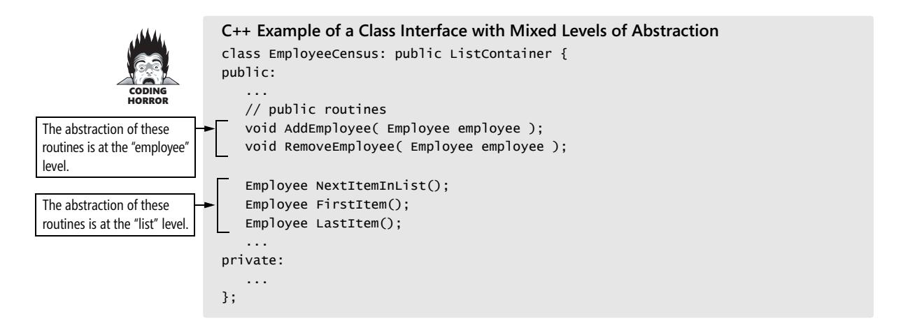
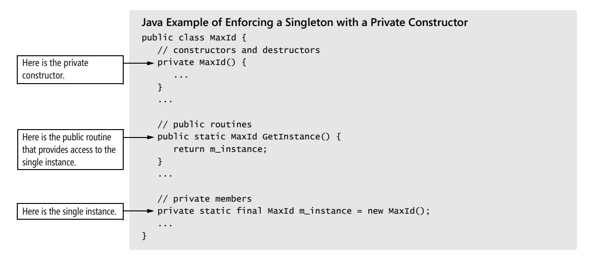

# Chapter 6: Working Classes


<span id="page-161-0"></span>
### cc2e.com/0665 Contents

- 6.1 Class Foundations: Abstract Data Types (ADTs): page 126
- 6.2 Good Class Interfaces: page 133
- 6.3 Design and Implementation Issues: page 143
- 6.4 Reasons to Create a Class: page 152
- 6.5 Language-Specific Issues: page 156
- 6.6 Beyond Classes: Packages: page 156

#### Related Topics

- Design in construction: Chapter 5
- Software architecture: Section 3.5
- High-quality routines: Chapter 7
- The Pseudocode Programming Process: Chapter 9
- Refactoring: Chapter 24

In the dawn of computing, programmers thought about programming in terms of statements. Throughout the 1970s and 1980s, programmers began thinking about programs in terms of routines. In the twenty-first century, programmers think about programming in terms of classes.


A class is a collection of data and routines that share a cohesive, well-defined responsibility. A class might also be a collection of routines that provides a cohesive set of services even if no common data is involved. A key to being an effective programmer is maximizing the portion of a program that you can safely ignore while working on any one section of code. Classes are the primary tool for accomplishing that objective.

This chapter contains a distillation of advice in creating high-quality classes. If you're still warming up to object-oriented concepts, this chapter might be too advanced. Make sure you've read Chapter 5, "Design in Construction." Then start with Section 6.1, "Class Foundations: Abstract Data Types (ADTs)," and ease your way into the remaining sections. If you're already familiar with class basics, you might skim Section 6.1 and then dive into the discussion of class interfaces in Section 6.2. The "Additional Resources" section at the end of this chapter contains pointers to introductory reading, advanced reading, and programming-language-specific resources.

#### 6.1 Class Foundations: Abstract Data Types (ADTs)

An abstract data type is a collection of data and operations that work on that data. The operations both describe the data to the rest of the program and allow the rest of the program to change the data. The word "data" in "abstract data type" is used loosely. An ADT might be a graphics window with all the operations that affect it, a file and file operations, an insurance-rates table and the operations on it, or something else.

**Cross-Reference** Thinking about ADTs first and classes second is an example of programming *into* a language vs. programming in one. See Section 4.3, "Your Location on the Technology Wave," and Section 34.4, "Program into Your Language, Not in It." Understanding ADTs is essential to understanding object-oriented programming. Without understanding ADTs, programmers create classes that are "classes" in name only—in reality, they are little more than convenient carrying cases for loosely related collections of data and routines. With an understanding of ADTs, programmers can create classes that are easier to implement initially and easier to modify over time.

Traditionally, programming books wax mathematical when they arrive at the topic of abstract data types. They tend to make statements like "One can think of an abstract data type as a mathematical model with a collection of operations defined on it." Such books make it seem as if you'd never actually use an abstract data type except as a sleep aid.

Such dry explanations of abstract data types completely miss the point. Abstract data types are exciting because you can use them to manipulate real-world entities rather than low-level, implementation entities. Instead of inserting a node into a linked list, you can add a cell to a spreadsheet, a new type of window to a list of window types, or another passenger car to a train simulation. Tap into the power of being able to work in the problem domain rather than at the low-level implementation domain!

#### Example of the Need for an ADT

To get things started, here's an example of a case in which an ADT would be useful. We'll get to the details after we have an example to talk about.

Suppose you're writing a program to control text output to the screen using a variety of typefaces, point sizes, and font attributes (such as bold and italic). Part of the program manipulates the text's fonts. If you use an ADT, you'll have a group of font routines bundled with the data—the typeface names, point sizes, and font attributes—they operate on. The collection of font routines and data is an ADT.

If you're not using ADTs, you'll take an ad hoc approach to manipulating fonts. For example, if you need to change to a 12-point font size, which happens to be 16 pixels high, you'll have code like this:

currentFont.size = 16

If you've built up a collection of library routines, the code might be slightly more readable:

```
currentFont.size = PointsToPixels( 12 )
```

Or you could provide a more specific name for the attribute, something like

```
currentFont.sizeInPixels = PointsToPixels( 12 )
```

But what you can't do is have both *currentFont.sizeInPixels* and *currentFont.sizeInPoints*, because, if both the data members are in play, *currentFont* won't have any way to know which of the two it should use. And if you change sizes in several places in the program, you'll have similar lines spread throughout your program.

If you need to set a font to bold, you might have code like this that uses a logical *or* and a hexidecimal constant *0x02*:

```
currentFont.attribute = currentFont.attribute or 0x02
```

If you're lucky, you'll have something cleaner than that, but the best you'll get with an ad hoc approach is something like this:

```
currentFont.attribute = currentFont.attribute or BOLD
```

Or maybe something like this:

```
currentFont.bold = True
```

As with the font size, the limitation is that the client code is required to control the data members directly, which limits how *currentFont* can be used.

If you program this way, you're likely to have similar lines in many places in your program.

#### Benefits of Using ADTs

The problem isn't that the ad hoc approach is bad programming practice. It's that you can replace the approach with a better programming practice that produces these benefits:

*You can hide implementation details* Hiding information about the font data type means that if the data type changes, you can change it in one place without affecting the whole program. For example, unless you hid the implementation details in an ADT, changing the data type from the first representation of bold to the second would entail changing your program in every place in which bold was set rather than in just one place. Hiding the information also protects the rest of the program if you decide to store data in external storage rather than in memory or to rewrite all the fontmanipulation routines in another language.

*Changes don't affect the whole program* If fonts need to become richer and support more operations (such as switching to small caps, superscripts, strikethrough, and so on), you can change the program in one place. The change won't affect the rest of the program.

*You can make the interface more informative* Code like *currentFont.size = 16* is ambiguous because *16* could be a size in either pixels or points. The context doesn't tell you which is which. Collecting all similar operations into an ADT allows you to define the entire interface in terms of points, or in terms of pixels, or to clearly differentiate between the two, which helps avoid confusing them.

*It's easier to improve performance* If you need to improve font performance, you can recode a few well-defined routines rather than wading through an entire program.

*The program is more obviously correct* You can replace the more tedious task of verifying that statements like *currentFont.attribute = currentFont.attribute or 0x02* are correct with the easier task of verifying that calls to *currentFont.SetBoldOn()* are correct. With the first statement, you can have the wrong structure name, the wrong field name, the wrong operation (*and* instead of *or*), or the wrong value for the attribute (*0x20* instead of *0x02*). In the second case, the only thing that could possibly be wrong with the call to *currentFont.SetBoldOn()* is that it's a call to the wrong routine name, so it's easier to see whether it's correct.

*The program becomes more self-documenting* You can improve statements like *currentFont.attribute or 0x02* by replacing *0x02* with *BOLD* or whatever *0x02* represents, but that doesn't compare to the readability of a routine call such as *currentFont.SetBoldOn()*.


Woodfield, Dunsmore, and Shen conducted a study in which graduate and senior undergraduate computer-science students answered questions about two programs: one that was divided into eight routines along functional lines, and one that was divided into eight abstract-data-type routines (1981). Students using the abstract-datatype program scored over 30 percent higher than students using the functional version.

*You don't have to pass data all over your program* In the examples just presented, you have to change *currentFont* directly or pass it to every routine that works with fonts. If. you use an abstract data type, you don't have to pass *currentFont* all over the program and you don't have to turn it into global data either. The ADT has a structure that contains *currentFont*'s data. The data is directly accessed only by routines that are part of the ADT. Routines that aren't part of the ADT don't have to worry about the data.

*You're able to work with real-world entities rather than with low-level implementation structures* You can define operations dealing with fonts so that most of the program operates solely in terms of fonts rather than in terms of array accesses, structure definitions, and *True* and *False*.

In this case, to define an abstract data type, you'd define a few routines to control fonts—perhaps like this:

```
currentFont.SetSizeInPoints( sizeInPoints )
currentFont.SetSizeInPixels( sizeInPixels )
currentFont.SetBoldOn()
currentFont.SetBoldOff()
currentFont.SetItalicOn()
currentFont.SetItalicOff()
currentFont.SetTypeFace( faceName )
```


The code inside these routines would probably be short—it would probably be similar to the code you saw in the ad hoc approach to the font problem earlier. The difference is that you've isolated font operations in a set of routines. That provides a better level of abstraction for the rest of your program to work with fonts, and it gives you a layer of protection against changes in font operations.

#### More Examples of ADTs

Suppose you're writing software that controls the cooling system for a nuclear reactor. You can treat the cooling system as an abstract data type by defining the following operations for it:

```
coolingSystem.GetTemperature()
coolingSystem.SetCirculationRate( rate )
coolingSystem.OpenValve( valveNumber )
coolingSystem.CloseValve( valveNumber )
```

The specific environment would determine the code written to implement each of these operations. The rest of the program could deal with the cooling system through these functions and wouldn't have to worry about internal details of data-structure implementations, data-structure limitations, changes, and so on.

Here are more examples of abstract data types and likely operations on them:

| Cruise Control           | Blender                 | Fuel Tank            |
|--------------------------|-------------------------|----------------------|
| Set speed                | Turn on                 | Fill tank            |
| Get current settings     | Turn off                | Drain tank           |
| Resume former speed      | Set speed               | Get tank capacity    |
| Deactivate               | Start "Insta-Pulverize" | Get tank status      |
|                          | Stop "Insta-Pulverize"  |                      |
| List                     |                         | Stack                |
| Initialize list          | Light                   | Initialize stack     |
| Insert item in list      | Turn on                 | Push item onto stack |
| Remove item from list    | Turn off                | Pop item from stack  |
| Read next item from list |                         | Read top of stack    |

allocated

| Set of Help Screens                        | Menu                 | File                                         |
|--------------------------------------------|----------------------|----------------------------------------------|
| Add help topic                             | Start new menu       | Open file                                    |
| Remove help topic                          | Delete menu          | Read file                                    |
| Set current help topic                     | Add menu item        | Write file                                   |
| Display help screen                        | Remove menu item     | Set current file location                    |
| Remove help display                        | Activate menu item   | Close file                                   |
| Display help index                         | Deactivate menu item |                                              |
| Back up to previous screen                 | Display menu         | Elevator                                     |
|                                            | Hide menu            | Move up one floor                            |
| Pointer                                    | Get menu choice      | Move down one floor                          |
| Get pointer to new memory                  |                      | Move to specific floor                       |
| Dispose of memory from<br>existing pointer |                      | Report current floor<br>Return to home floor |
| Change amount of memory                    |                      |                                              |

Yon can derive several guidelines from a study of these examples; those guidelines are described in the following subsections:

*Build or use typical low-level data types as ADTs, not as low-level data types* Most discussions of ADTs focus on representing typical low-level data types as ADTs. As you can see from the examples, you can represent a stack, a list, and a queue, as well as virtually any other typical data type, as an ADT.

The question you need to ask is, "What does this stack, list, or queue represent?" If a stack represents a set of employees, treat the ADT as employees rather than as a stack. If a list represents a set of billing records, treat it as billing records rather than a list. If a queue represents cells in a spreadsheet, treat it as a collection of cells rather than a generic item in a queue. Treat yourself to the highest possible level of abstraction.

*Treat common objects such as files as ADTs* Most languages include a few abstract data types that you're probably familiar with but might not think of as ADTs. File operations are a good example. While writing to disk, the operating system spares you the grief of positioning the read/write head at a specific physical address, allocating a new disk sector when you exhaust an old one, and interpreting cryptic error codes. The operating system provides a first level of abstraction and the ADTs for that level. High-level languages provide a second level of abstraction and ADTs for that higher level. A highlevel language protects you from the messy details of generating operating-system calls and manipulating data buffers. It allows you to treat a chunk of disk space as a "file."

You can layer ADTs similarly. If you want to use an ADT at one level that offers datastructure level operations (like pushing and popping a stack), that's fine. You can create another level on top of that one that works at the level of the real-world problem.

*Treat even simple items as ADTs* You don't have to have a formidable data type to justify using an abstract data type. One of the ADTs in the example list is a light that supports only two operations—turning it on and turning it off. You might think that it would be a waste to isolate simple "on" and "off" operations in routines of their own, but even simple operations can benefit from the use of ADTs. Putting the light and its operations into an ADT makes the code more self-documenting and easier to change, confines the potential consequences of changes to the *TurnLightOn()* and *TurnLight-Off()* routines, and reduces the number of data items you have to pass around.

*Refer to an ADT independently of the medium it's stored on* Suppose you have an insurance-rates table that's so big that it's always stored on disk. You might be tempted to refer to it as a "rate *file*" and create access routines such as *RateFile.Read()*. When you refer to it as a file, however, you're exposing more information about the data than you need to. If you ever change the program so that the table is in memory instead of on disk, the code that refers to it as a file will be incorrect, misleading, and confusing. Try to make the names of classes and access routines independent of how the data is stored, and refer to the abstract data type, like the insurance-rates table, instead. That would give your class and access routine names like *rateTable.Read()* or simply *rates.Read()*.

#### Handling Multiple Instances of Data with ADTs in Non-Object-Oriented Environments

Object-oriented languages provide automatic support for handling multiple instances of an ADT. If you've worked exclusively in object-oriented environments and you've never had to handle the implementation details of multiple instances yourself, count your blessings! (You can also move on to the next section, "ADTs and Classes.")

If you're working in a non-object-oriented environment such as C, you will have to build support for multiple instances manually. In general, that means including services for the ADT to create and delete instances and designing the ADT's other services so that they can work with multiple instances.

The font ADT originally offered these services:

```
currentFont.SetSize( sizeInPoints )
currentFont.SetBoldOn()
currentFont.SetBoldOff()
currentFont.SetItalicOn()
currentFont.SetItalicOff()
currentFont.SetTypeFace( faceName )
```

In a non-object-oriented environment, these functions would not be attached to a class and would look more like this:

```
SetCurrentFontSize( sizeInPoints )
SetCurrentFontBoldOn()
SetCurrentFontBoldOff()
SetCurrentFontItalicOn()
SetCurrentFontItalicOff()
SetCurrentFontTypeFace( faceName )
```

If you want to work with more than one font at a time, you'll need to add services to create and delete font instances—maybe these:

```
CreateFont( fontId )
DeleteFont( fontId )
SetCurrentFont( fontId )
```

The notion of a *fontId* has been added as a way to keep track of multiple fonts as they're created and used. For other operations, you can choose from among three ways to handle the ADT interface:

- Option 1: Explicitly identify instances each time you use ADT services. In this case, you don't have the notion of a "current font." You pass *fontId* to each routine that manipulates fonts. The *Font* functions keep track of any underlying data, and the client code needs to keep track only of the *fontId*. This requires adding *fontId* as a parameter to each font routine.
- Option 2: Explicitly provide the data used by the ADT services. In this approach, you declare the data that the ADT uses within each routine that uses an ADT service. In other words, you create a *Font* data type that you pass to each of the ADT service routines. You must design the ADT service routines so that they use the *Font* data that's passed to them each time they're called. The client code doesn't need a font ID if you use this approach because it keeps track of the font data itself. (Even though the data is available directly from the *Font* data type, you should access it only with the ADT service routines. This is called keeping the structure "closed.")

The advantage of this approach is that the ADT service routines don't have to look up font information based on a font ID. The disadvantage is that it exposes font data to the rest of the program, which increases the likelihood that client code will make use of the ADT's implementation details that should have remained hidden within the ADT.

■ Option 3: Use implicit instances (with great care). Design a new service to call to make a specific font instance the current one—something like *SetCurrentFont ( fontId )*. Setting the current font makes all other services use the current font when they're called. If you use this approach, you don't need *fontId* as a parameter to the other services. For simple applications, this can streamline use of

multiple instances. For complex applications, this systemwide dependence on state means that you must keep track of the current font instance throughout code that uses the *Font* functions. Complexity tends to proliferate, and for applications of any size, better alternatives exist.

Inside the abstract data type, you'll have a wealth of options for handling multiple instances, but outside, this sums up the choices if you're working in a non-object-oriented language.

#### ADTs and Classes

Abstract data types form the foundation for the concept of classes. In languages that support classes, you can implement each abstract data type as its own class. Classes usually involve the additional concepts of inheritance and polymorphism. One way of thinking of a class is as an abstract data type plus inheritance and polymorphism.

### 6.2 Good Class Interfaces

The first and probably most important step in creating a high-quality class is creating a good interface. This consists of creating a good abstraction for the interface to represent and ensuring that the details remain hidden behind the abstraction.

#### Good Abstraction

As "Form Consistent Abstractions" in Section 5.3 described, abstraction is the ability to view a complex operation in a simplified form. A class interface provides an abstraction of the implementation that's hidden behind the interface. The class's interface should offer a group of routines that clearly belong together.

You might have a class that implements an employee. It would contain data describing the employee's name, address, phone number, and so on. It would offer services to initialize and use an employee. Here's how that might look.

**Cross-Reference** Code samples in this book are formatted using a coding convention that emphasizes similarity of styles across multiple languages. For details on the convention (and discussions about multiple coding styles), see "Mixed-Language Programming Considerations" in Section 11.4.

```
C++ Example of a Class Interface That Presents a Good Abstraction
class Employee {
public:
 // public constructors and destructors
 Employee();
 Employee( 
 FullName name, 
 String address, 
 String workPhone, 
 String homePhone,
 TaxId taxIdNumber, 
 JobClassification jobClass 
 );
 virtual ~Employee();
```

```
 // public routines
 FullName GetName() const; 
 String GetAddress() const; 
 String GetWorkPhone() const; 
 String GetHomePhone() const; 
 TaxId GetTaxIdNumber() const; 
 JobClassification GetJobClassification() const; 
 ...
private:
 ...
};
```

Internally, this class might have additional routines and data to support these services, but users of the class don't need to know anything about them. The class interface abstraction is great because every routine in the interface is working toward a consistent end.

A class that presents a poor abstraction would be one that contained a collection of miscellaneous functions. Here's an example:


```
C++ Example of a Class Interface That Presents a Poor Abstraction
class Program {
public:
 ...
 // public routines
 void InitializeCommandStack();
 void PushCommand( Command command );
 Command PopCommand(); 
 void ShutdownCommandStack();
 void InitializeReportFormatting(); 
 void FormatReport( Report report );
 void PrintReport( Report report );
 void InitializeGlobalData(); 
 void ShutdownGlobalData(); 
 ...
private:
 ...
};
```

Suppose that a class contains routines to work with a command stack, to format reports, to print reports, and to initialize global data. It's hard to see any connection among the command stack and report routines or the global data. The class interface doesn't present a consistent abstraction, so the class has poor cohesion. The routines should be reorganized into more-focused classes, each of which provides a better abstraction in its interface.

If these routines were part of a *Program* class, they could be revised to present a consistent abstraction, like so:

```
C++ Example of a Class Interface That Presents a Better Abstraction
class Program {
public:
 ...
 // public routines
 void InitializeUserInterface(); 
 void ShutDownUserInterface(); 
 void InitializeReports(); 
 void ShutDownReports(); 
 ...
private:
 ...
};
```

The cleanup of this interface assumes that some of the original routines were moved to other, more appropriate classes and some were converted to private routines used by *InitializeUserInterface()* and the other routines.

This evaluation of class abstraction is based on the class's collection of public routines—that is, on the class's interface. The routines inside the class don't necessarily present good individual abstractions just because the overall class does, but they need to be designed to present good abstractions too. For guidelines on that, see Section 7.2, "Design at the Routine Level."

The pursuit of good, abstract interfaces gives rise to several guidelines for creating class interfaces.

*Present a consistent level of abstraction in the class interface* A good way to think about a class is as the mechanism for implementing the abstract data types described in Section 6.1. Each class should implement one and only one ADT. If you find a class implementing more than one ADT, or if you can't determine what ADT the class implements, it's time to reorganize the class into one or more well-defined ADTs.

Here's an example of a class that presents an interface that's inconsistent because its level of abstraction is not uniform:



This class is presenting two ADTs: an *Employee* and a *ListContainer*. This sort of mixed abstraction commonly arises when a programmer uses a container class or other library classes for implementation and doesn't hide the fact that a library class is used. Ask yourself whether the fact that a container class is used should be part of the abstraction. Usually that's an implementation detail that should be hidden from the rest of the program, like this:

```
C++ Example of a Class Interface with Consistent Levels of Abstraction
                         class EmployeeCensus {
                         public:
                          ...
                          // public routines
The abstraction of all these 
routines is now at the 
"employee" level. 
                          void AddEmployee( Employee employee ); 
                          void RemoveEmployee( Employee employee ); 
                          Employee NextEmployee();
                          Employee FirstEmployee();
                          Employee LastEmployee();
                          ...
                         private:
That the class uses the 
ListContainer library is now 
hidden.
                          ListContainer m_EmployeeList; 
                          ...
                         };
```

Programmers might argue that inheriting from *ListContainer* is convenient because it supports polymorphism, allowing an external search or sort function that takes a *List-Container* object. That argument fails the main test for inheritance, which is, "Is inheritance used only for "is a" relationships?" To inherit from *ListContainer* would mean that *EmployeeCensus* "is a" *ListContainer*, which obviously isn't true. If the abstraction of the *EmployeeCensus* object is that it can be searched or sorted, that should be incorporated as an explicit, consistent part of the class interface.

If you think of the class's public routines as an air lock that keeps water from getting into a submarine, inconsistent public routines are leaky panels in the class. The leaky panels might not let water in as quickly as an open air lock, but if you give them enough time, they'll still sink the boat. In practice, this is what happens when you mix levels of abstraction. As the program is modified, the mixed levels of abstraction make the program harder and harder to understand, and it gradually degrades until it becomes unmaintainable.


*Be sure you understand what abstraction the class is implementing* Some classes are similar enough that you must be careful to understand which abstraction the class interface should capture. I once worked on a program that needed to allow information to be edited in a table format. We wanted to use a simple grid control, but the grid controls that were available didn't allow us to color the data-entry cells, so we decided to use a spreadsheet control that did provide that capability.

The spreadsheet control was far more complicated than the grid control, providing about 150 routines to the grid control's 15. Since our goal was to use a grid control, not a spreadsheet control, we assigned a programmer to write a wrapper class to hide the fact that we were using a spreadsheet control as a grid control. The programmer grumbled quite a bit about unnecessary overhead and bureaucracy, went away, and came back a couple days later with a wrapper class that faithfully exposed all 150 routines of the spreadsheet control.

This was not what was needed. We wanted a grid-control interface that encapsulated the fact that, behind the scenes, we were using a much more complicated spreadsheet control. The programmer should have exposed just the 15 grid-control routines plus a 16th routine that supported cell coloring. By exposing all 150 routines, the programmer created the possibility that, if we ever wanted to change the underlying implementation, we could find ourselves supporting 150 public routines. The programmer failed to achieve the encapsulation we were looking for, as well as creating a lot more work for himself than necessary.

Depending on specific circumstances, the right abstraction might be either a spreadsheet control or a grid control. When you have to choose between two similar abstractions, make sure you choose the right one.

*Provide services in pairs with their opposites* Most operations have corresponding, equal, and opposite operations. If you have an operation that turns a light on, you'll probably need one to turn it off. If you have an operation to add an item to a list, you'll probably need one to delete an item from the list. If you have an operation to activate a menu item, you'll probably need one to deactivate an item. When you design a class, check each public routine to determine whether you need its complement. Don't create an opposite gratuitously, but do check to see whether you need one.

*Move unrelated information to another class* In some cases, you'll find that half a class's routines work with half the class's data and half the routines work with the other half of the data. In such a case, you really have two classes masquerading as one. Break them up!

*Make interfaces programmatic rather than semantic when possible* Each interface consists of a programmatic part and a semantic part. The programmatic part consists of the data types and other attributes of the interface that can be enforced by the compiler. The semantic part of the interface consists of the assumptions about how the interface will be used, which cannot be enforced by the compiler. The semantic interface includes considerations such as "*RoutineA* must be called before *RoutineB*" or "*RoutineA* will crash if *dataMember1* isn't initialized before it's passed to *RoutineA*." The semantic interface should be documented in comments, but try to keep interfaces minimally dependent on documentation. Any aspect of an interface that can't be enforced by the compiler is an aspect that's likely to be misused. Look for ways to convert semantic interface elements to programmatic interface elements by using *Asserts* or other techniques.

**Cross-Reference** For more suggestions about how to preserve code quality as code is modified, see Chapter 24, "Refactoring."

*Beware of erosion of the interface's abstraction under modification* As a class is modified and extended, you often discover additional functionality that's needed, that doesn't quite fit with the original class interface, but that seems too hard to implement any other way. For example, in the *Employee* class, you might find that the class evolves to look like this:


```
C++ Example of a Class Interface That's Eroding Under Maintenance
class Employee {
public:
 ...
 // public routines
 FullName GetName() const; 
 Address GetAddress() const; 
 PhoneNumber GetWorkPhone() const; 
 ...
 bool IsJobClassificationValid( JobClassification jobClass ); 
 bool IsZipCodeValid( Address address ); 
 bool IsPhoneNumberValid( PhoneNumber phoneNumber ); 
 SqlQuery GetQueryToCreateNewEmployee() const; 
 SqlQuery GetQueryToModifyEmployee() const; 
 SqlQuery GetQueryToRetrieveEmployee() const; 
 ...
private:
 ...
};
```

What started out as a clean abstraction in an earlier code sample has evolved into a hodgepodge of functions that are only loosely related. There's no logical connection between employees and routines that check ZIP Codes, phone numbers, or job classifications. The routines that expose SQL query details are at a much lower level of abstraction than the *Employee* class, and they break the *Employee* abstraction.

*Don't add public members that are inconsistent with the interface abstraction* Each time you add a routine to a class interface, ask "Is this routine consistent with the abstraction provided by the existing interface?" If not, find a different way to make the modification and preserve the integrity of the abstraction.

*Consider abstraction and cohesion together* The ideas of abstraction and cohesion are closely related—a class interface that presents a good abstraction usually has strong cohesion. Classes with strong cohesion tend to present good abstractions, although that relationship is not as strong.

I have found that focusing on the abstraction presented by the class interface tends to provide more insight into class design than focusing on class cohesion. If you see that a class has weak cohesion and aren't sure how to correct it, ask yourself whether the class presents a consistent abstraction instead.

#### Good Encapsulation

**Cross-Reference** For more on encapsulation, see "Encapsulate Implementation Details" in Section 5.3. As Section 5.3 discussed, encapsulation is a stronger concept than abstraction. Abstraction helps to manage complexity by providing models that allow you to ignore implementation details. Encapsulation is the enforcer that prevents you from looking at the details even if you want to.

The two concepts are related because, without encapsulation, abstraction tends to break down. In my experience, either you have both abstraction and encapsulation or you have neither. There is no middle ground.

The single most important factor that distinguishes a well-designed module from a poorly designed one is the degree to which the module hides its internal data and other implementation details from other modules. —*Joshua Bloch*

*Minimize accessibility of classes and members* Minimizing accessibility is one of several rules that are designed to encourage encapsulation. If you're wondering whether a specific routine should be public, private, or protected, one school of thought is that you should favor the strictest level of privacy that's workable (Meyers 1998, Bloch 2001). I think that's a fine guideline, but I think the more important guideline is, "What best preserves the integrity of the interface abstraction?" If exposing the routine is consistent with the abstraction, it's probably fine to expose it. If you're not sure, hiding more is generally better than hiding less.

*Don't expose member data in public* Exposing member data is a violation of encapsulation and limits your control over the abstraction. As Arthur Riel points out, a *Point* class that exposes

```
float x;
float y;
float z;
```

is violating encapsulation because client code is free to monkey around with *Point*'s data and *Point* won't necessarily even know when its values have been changed (Riel 1996). However, a *Point* class that exposes

```
float GetX();
float GetY();
float GetZ();
void SetX( float x );
void SetY( float y );
void SetZ( float z );
```

is maintaining perfect encapsulation. You have no idea whether the underlying implementation is in terms of *float*s *x*, *y*, and *z*, whether *Point* is storing those items as *double*s and converting them to *float*s, or whether *Point* is storing them on the moon and retrieving them from a satellite in outer space.

*Avoid putting private implementation details into a class's interface* With true encapsulation, programmers would not be able to see implementation details at all. They would be hidden both figuratively and literally. In popular languages, including C++, however, the structure of the language requires programmers to disclose implementation details in the class interface. Here's an example:

```
C++ Example of Exposing a Class's Implementation Details
                      class Employee {
                      public:
                       ...
                       Employee( 
                       FullName name,
                       String address,
                       String workPhone,
                       String homePhone,
                       TaxId taxIdNumber,
                       JobClassification jobClass 
                       );
                       ...
                       FullName GetName() const; 
                       String GetAddress() const; 
                       ...
                      private:
Here are the exposed 
implementation details. 
                       String m_Name;
                       String m_Address;
                       int m_jobClass;
                       ...
                      };
```

Including *private* declarations in the class header file might seem like a small transgression, but it encourages other programmers to examine the implementation details. In this case, the client code is intended to use the *Address* type for addresses but the header file exposes the implementation detail that addresses are stored as *Strings*.

Scott Meyers describes a common way to address this issue in Item 34 of *Effective C++*, 2d ed. (Meyers 1998). You separate the class interface from the class implementation. Within the class declaration, include a pointer to the class's implementation but don't include any other implementation details.

```
C++ Example of Hiding a Class's Implementation Details
                        class Employee {
                        public:
                         ...
                         Employee( ... );
                         ...
                         FullName GetName() const; 
                         String GetAddress() const; 
                         ...
                        private:
Here the implementation 
details are hidden behind 
the pointer. 
                         EmployeeImplementation *m_implementation;
                        };
```

Now you can put implementation details inside the *EmployeeImplementation* class, which should be visible only to the *Employee* class and not to the code that uses the *Employee* class.

If you've already written lots of code that doesn't use this approach for your project, you might decide it isn't worth the effort to convert a mountain of existing code to use this approach. But when you *read* code that exposes its implementation details, you can resist the urge to comb through the *private* section of the class interface looking for implementation clues.

*Don't make assumptions about the class's users* A class should be designed and implemented to adhere to the contract implied by the class interface. It shouldn't make any assumptions about how that interface will or won't be used, other than what's documented in the interface. Comments like the following one are an indication that a class is more aware of its users than it should be:

```
-- initialize x, y, and z to 1.0 because DerivedClass blows 
-- up if they're initialized to 0.0
```

*Avoid friend classes* In a few circumstances such as the State pattern, friend classes can be used in a disciplined way that contributes to managing complexity (Gamma et al. 1995). But, in general, friend classes violate encapsulation. They expand the amount of code you have to think about at any one time, thereby increasing complexity.

*Don't put a routine into the public interface just because it uses only public routines* The fact that a routine uses only public routines is not a significant consideration. Instead, ask whether exposing the routine would be consistent with the abstraction presented by the interface.

*Favor read-time convenience to write-time convenience* Code is read far more times than it's written, even during initial development. Favoring a technique that speeds write-time convenience at the expense of read-time convenience is a false economy. This is especially applicable to creation of class interfaces. Even if a routine doesn't quite fit the interface's abstraction, sometimes it's tempting to add a routine to an interface that would be convenient for the particular client of a class that you're working on at the time. But adding that routine is the first step down a slippery slope, and it's better not to take even the first step.

It ain't abstract if you have to look at the underlying implementation to understand what's going on. —*P. J. Plauger*

*Be very, very wary of semantic violations of encapsulation* At one time I thought that when I learned how to avoid syntax errors I would be home free. I soon discovered that learning how to avoid syntax errors had merely bought me a ticket to a whole new theater of coding errors, most of which were more difficult to diagnose and correct than the syntax errors.

The difficulty of semantic encapsulation compared to syntactic encapsulation is similar. Syntactically, it's relatively easy to avoid poking your nose into the internal workings of another class just by declaring the class's internal routines and data *private*. Achieving

semantic encapsulation is another matter entirely. Here are some examples of the ways that a user of a class can break encapsulation semantically:

- Not calling Class A's *InitializeOperations()* routine because you know that Class A's *PerformFirstOperation()* routine calls it automatically.
- Not calling the *database.Connect()* routine before you call *employee.Retrieve( database )* because you know that the *employee.Retrieve()* function will connect to the database if there isn't already a connection.
- Not calling Class A's *Terminate()* routine because you know that Class A's *PerformFinalOperation()* routine has already called it.
- Using a pointer or reference to *ObjectB* created by *ObjectA* even after *ObjectA* has gone out of scope, because you know that *ObjectA* keeps *ObjectB* in *static* storage and *ObjectB* will still be valid.
- Using Class B's *MAXIMUM\_ELEMENTS* constant instead of using *ClassA.MAXIMUM\_ELEMENTS*, because you know that they're both equal to the same value.


KEY POINT

The problem with each of these examples is that they make the client code dependent not on the class's public interface, but on its private implementation. Anytime you find yourself looking at a class's implementation to figure out how to use the class, you're not programming to the interface; you're programming *through* the interface *to* the implementation. If you're programming through the interface, encapsulation is broken, and once encapsulation starts to break down, abstraction won't be far behind.

If you can't figure out how to use a class based solely on its interface documentation, the right response is *not* to pull up the source code and look at the implementation. That's good initiative but bad judgment. The right response is to contact the author of the class and say "I can't figure out how to use this class." The right response on the class-author's part is *not* to answer your question face to face. The right response for the class author is to check out the class-interface file, modify the class-interface documentation, check the file back in, and then say "See if you can understand how it works now." You want this dialog to occur in the interface code itself so that it will be preserved for future programmers. You don't want the dialog to occur solely in your own mind, which will bake subtle semantic dependencies into the client code that uses the class. And you don't want the dialog to occur interpersonally so that it benefits only your code but no one else's.

*Watch for coupling that's too tight* "Coupling" refers to how tight the connection is between two classes. In general, the looser the connection, the better. Several general guidelines flow from this concept:

- Minimize accessibility of classes and members.
- Avoid *friend* classes, because they're tightly coupled.

- Make data *private* rather than *protected* in a base class to make derived classes less tightly coupled to the base class.
- Avoid exposing member data in a class's public interface.
- Be wary of semantic violations of encapsulation.
- Observe the "Law of Demeter" (discussed in Section 6.3 of this chapter).

Coupling goes hand in glove with abstraction and encapsulation. Tight coupling occurs when an abstraction is leaky, or when encapsulation is broken. If a class offers an incomplete set of services, other routines might find they need to read or write its internal data directly. That opens up the class, making it a glass box instead of a black box, and it virtually eliminates the class's encapsulation.

### 6.3 Design and Implementation Issues

Defining good class interfaces goes a long way toward creating a high-quality program. The internal class design and implementation are also important. This section discusses issues related to containment, inheritance, member functions and data, class coupling, constructors, and value-vs.-reference objects.

#### Containment ("has a" Relationships)


Containment is the simple idea that a class contains a primitive data element or object. A lot more is written about inheritance than about containment, but that's because inheritance is more tricky and error-prone, not because it's better. Containment is the work-horse technique in object-oriented programming.

*Implement "has a" through containment* One way of thinking of containment is as a "has a" relationship. For example, an employee "has a" name, "has a" phone number, "has a" tax ID, and so on. You can usually accomplish this by making the name, phone number, and tax ID member data of the *Employee* class.

*Implement "has a" through private inheritance as a last resort* In some instances you might find that you can't achieve containment through making one object a member of another. In that case, some experts suggest privately inheriting from the contained object (Meyers 1998, Sutter 2000). The main reason you would do that is to set up the containing class to access protected member functions or protected member data of the class that's contained. In practice, this approach creates an overly cozy relationship with the ancestor class and violates encapsulation. It tends to point to design errors that should be resolved some way other than through private inheritance.

*Be critical of classes that contain more than about seven data members* The number "7±2" has been found to be a number of discrete items a person can remember while performing other tasks (Miller 1956). If a class contains more than about seven data

members, consider whether the class should be decomposed into multiple smaller classes (Riel 1996). You might err more toward the high end of 7±2 if the data members are primitive data types like integers and strings, more toward the lower end of 7±2 if the data members are complex objects.

#### Inheritance ("is a" Relationships)

Inheritance is the idea that one class is a specialization of another class. The purpose of inheritance is to create simpler code by defining a base class that specifies common elements of two or more derived classes. The common elements can be routine interfaces, implementations, data members, or data types. Inheritance helps avoid the need to repeat code and data in multiple locations by centralizing it within a base class.

When you decide to use inheritance, you have to make several decisions:

- For each member routine, will the routine be visible to derived classes? Will it have a default implementation? Will the default implementation be overridable?
- For each data member (including variables, named constants, enumerations, and so on), will the data member be visible to derived classes?

The following subsections explain the ins and outs of making these decisions:

*Implement "is a" through public inheritance* When a programmer decides to create a new class by inheriting from an existing class, that programmer is saying that the new class "is a" more specialized version of the older class. The base class sets expectations about how the derived class will operate and imposes constraints on how the derived class can operate (Meyers 1998).

If the derived class isn't going to adhere *completely* to the same interface contract defined by the base class, inheritance is not the right implementation technique. Consider containment or making a change further up the inheritance hierarchy.

*Design and document for inheritance or prohibit it* Inheritance adds complexity to a program, and, as such, it's a dangerous technique. As Java guru Joshua Bloch says, "Design and document for inheritance, or prohibit it." If a class isn't designed to be inherited from, make its members non-*virtual* in C++, *final* in Java, or non-*overridable* in Microsoft Visual Basic so that you can't inherit from it.

*Adhere to the Liskov Substitution Principle (LSP)* In one of object-oriented programming's seminal papers, Barbara Liskov argued that you shouldn't inherit from a base class unless the derived class truly "is a" more specific version of the base class (Liskov 1988). Andy Hunt and Dave Thomas summarize LSP like this: "Subclasses must be usable through the base class interface without the need for the user to know the difference" (Hunt and Thomas 2000).

The single most important rule in object-oriented programming with C++ is this: public inheritance means "is a." Commit this rule to memory.

—*Scott Meyers*

In other words, all the routines defined in the base class should mean the same thing when they're used in each of the derived classes.

If you have a base class of *Account* and derived classes of *CheckingAccount*, *SavingsAccount*, and *AutoLoanAccount*, a programmer should be able to invoke any of the routines derived from *Account* on any of *Account*'s subtypes without caring about which subtype a specific account object is.

If a program has been written so that the Liskov Substitution Principle is true, inheritance is a powerful tool for reducing complexity because a programmer can focus on the generic attributes of an object without worrying about the details. If a programmer must be constantly thinking about semantic differences in subclass implementations, then inheritance is increasing complexity rather than reducing it. Suppose a programmer has to think this: "If I call the *InterestRate()* routine on *CheckingAccount* or *SavingsAccount*, it returns the interest the bank pays, but if I call *InterestRate()* on *AutoLoanAccount* I have to change the sign because it returns the interest the consumer pays to the bank." According to LSP, *AutoLoanAccount* should not inherit from the *Account* base class in this example because the semantics of the *InterestRate()* routine are not the same as the semantics of the base class's *InterestRate()* routine.

*Be sure to inherit only what you want to inherit* A derived class can inherit member routine interfaces, implementations, or both. Table 6-1 shows the variations of how routines can be implemented and overridden.

|                                        | Overridable                     | Not Overridable                                                  |
|----------------------------------------|---------------------------------|------------------------------------------------------------------|
| Implementation: Default<br>Provided    | Overridable Routine             | Non-Overridable Routine                                          |
| Implementation: No Default<br>Provided | Abstract Overridable<br>Routine | Not used (doesn't make sense to<br>leave a routine undefined and |

**Table 6-1 Variations on Inherited Routines** 

As the table suggests, inherited routines come in three basic flavors:

■ An *abstract overridable routine* means that the derived class inherits the routine's interface but not its implementation.

not allow it to be overridden)

- An *overridable routine* means that the derived class inherits the routine's interface and a default implementation and it is allowed to override the default implementation.
- A *non-overridable routine* means that the derived class inherits the routine's interface and its default implementation and it is not allowed to override the routine's implementation.

When you choose to implement a new class through inheritance, think through the kind of inheritance you want for each member routine. Beware of inheriting implementation just because you're inheriting an interface, and beware of inheriting an interface just because you want to inherit an implementation. If you want to use a class's implementation but not its interface, use containment rather than inheritance.

*Don't "override" a non-overridable member function* Both C++ and Java allow a programmer to override a non-overridable member routine—kind of. If a function is *private* in the base class, a derived class can create a function with the same name. To the programmer reading the code in the derived class, such a function can create confusion because it looks like it should be polymorphic, but it isn't; it just has the same name. Another way to state this guideline is, "Don't reuse names of non-overridable base-class routines in derived classes."

*Move common interfaces, data, and behavior as high as possible in the inheritance tree* The higher you move interfaces, data, and behavior, the more easily derived classes can use them. How high is too high? Let *abstraction* be your guide. If you find that moving a routine higher would break the higher object's abstraction, don't do it.

*Be suspicious of classes of which there is only one instance* A single instance might indicate that the design confuses objects with classes. Consider whether you could just create an object instead of a new class. Can the variation of the derived class be represented in data rather than as a distinct class? The Singleton pattern is one notable exception to this guideline.

*Be suspicious of base classes of which there is only one derived class* When I see a base class that has only one derived class, I suspect that some programmer has been "designing ahead"—trying to anticipate future needs, usually without fully understanding what those future needs are. The best way to prepare for future work is not to design extra layers of base classes that "might be needed someday"; it's to make current work as clear, straightforward, and simple as possible. That means not creating any more inheritance structure than is absolutely necessary.

*Be suspicious of classes that override a routine and do nothing inside the derived routine* This typically indicates an error in the design of the base class. For instance, suppose you have a class *Cat* and a routine *Scratch()* and suppose that you eventually find out that some cats are declawed and can't scratch. You might be tempted to create a class derived from *Cat* named *ScratchlessCat* and override the *Scratch()* routine to do nothing. This approach presents several problems:

- It violates the abstraction (interface contract) presented in the *Cat* class by changing the semantics of its interface.
- This approach quickly gets out of control when you extend it to other derived classes. What happens when you find a cat without a tail? Or a cat that doesn't catch mice? Or a cat that doesn't drink milk? Eventually you'll end up with derived classes like *ScratchlessTaillessMicelessMilklessCat*.

■ Over time, this approach gives rise to code that's confusing to maintain because the interfaces and behavior of the ancestor classes imply little or nothing about the behavior of their descendants.

The place to fix this problem is not in the base class, but in the original *Cat* class. Create a *Claws* class and contain that within the *Cats* class. The root problem was the assumption that all cats scratch, so fix that problem at the source, rather than just bandaging it at the destination.

*Avoid deep inheritance trees* Object-oriented programming provides a large number of techniques for managing complexity. But every powerful tool has its hazards, and some object-oriented techniques have a tendency to increase complexity rather than reduce it.

In his excellent book *Object-Oriented Design Heuristics* (1996), Arthur Riel suggests limiting inheritance hierarchies to a maximum of six levels. Riel bases his recommendation on the "magic number 7±2," but I think that's grossly optimistic. In my experience most people have trouble juggling more than two or three levels of inheritance in their brains at once. The "magic number 7±2" is probably better applied as a limit to the *total number of subclasses* of a base class rather than the number of levels in an inheritance tree.

Deep inheritance trees have been found to be significantly associated with increased fault rates (Basili, Briand, and Melo 1996). Anyone who has ever tried to debug a complex inheritance hierarchy knows why. Deep inheritance trees increase complexity, which is exactly the opposite of what inheritance should be used to accomplish. Keep the primary technical mission in mind. Make sure you're using inheritance to avoid duplicating code and to *minimize complexity*.

*Prefer polymorphism to extensive type checking* Frequently repeated *case* statements sometimes suggest that inheritance might be a better design choice, although this is not always true. Here is a classic example of code that cries out for a more object-oriented approach:

```
C++ Example of a Case Statement That Probably Should Be Replaced 
by Polymorphism
switch ( shape.type ) {
 case Shape_Circle:
 shape.DrawCircle();
 break;
 case Shape_Square:
 shape.DrawSquare();
 break;
 ...
}
```

In this example, the calls to *shape.DrawCircle()* and *shape.DrawSquare()* should be replaced by a single routine named *shape.Draw()*, which can be called regardless of whether the shape is a circle or a square.

On the other hand, sometimes *case* statements are used to separate truly different kinds of objects or behavior. Here is an example of a *case* statement that is appropriate in an object-oriented program:

```
C++ Example of a Case Statement That Probably Should Not Be Replaced 
by Polymorphism
switch ( ui.Command() ) {
 case Command_OpenFile:
 OpenFile();
 break;
 case Command_Print:
 Print(); 
 break;
 case Command_Save:
 Save(); 
 break;
 case Command_Exit:
 ShutDown();
 break;
 ...
}
```

In this case, it would be possible to create a base class with derived classes and a polymorphic *DoCommand()* routine for each command (as in the Command pattern). But in a simple case like this one, the meaning of *DoCommand()* would be so diluted as to be meaningless, and the *case* statement is the more understandable solution.

*Make all data private, not protected* As Joshua Bloch says, "Inheritance breaks encapsulation" (2001). When you inherit from an object, you obtain privileged access to that object's protected routines and data. If the derived class really needs access to the base class's attributes, provide protected accessor functions instead.

#### Multiple Inheritance

Inheritance is a power tool. It's like using a chain saw to cut down a tree instead of a manual crosscut saw. It can be incredibly useful when used with care, but it's dangerous in the hands of someone who doesn't observe proper precautions.

The one indisputable fact about multiple inheritance in C++ is that it opens up a Pandora's box of complexities that simply do not exist under single inheritance. —*Scott Meyers*

If inheritance is a chain saw, multiple inheritance is a 1950s-era chain saw with no blade guard, no automatic shutoff, and a finicky engine. There are times when such a tool is valuable; mostly, however, you're better off leaving the tool in the garage where it can't do any damage.

Although some experts recommend broad use of multiple inheritance (Meyer 1997), in my experience multiple inheritance is useful primarily for defining "mixins," simple classes that are used to add a set of properties to an object. Mixins are called mixins because they allow properties to be "mixed in" to derived classes. Mixins might be classes like *Displayable*, *Persistant*, *Serializable*, or *Sortable*. Mixins are nearly always abstract and aren't meant to be instantiated independently of other objects.

Mixins require the use of multiple inheritance, but they aren't subject to the classic diamond-inheritance problem associated with multiple inheritance as long as all mixins are truly independent of each other. They also make the design more comprehensible by "chunking" attributes together. A programmer will have an easier time understanding that an object uses the mixins *Displayable* and *Persistent* than understanding that an object uses the 11 more-specific routines that would otherwise be needed to implement those two properties.

Java and Visual Basic recognize the value of mixins by allowing multiple inheritance of interfaces but only single-class inheritance. C++ supports multiple inheritance of both interface and implementation. Programmers should use multiple inheritance only after carefully considering the alternatives and weighing the impact on system complexity and comprehensibility.

#### Why Are There So Many Rules for Inheritance?


**Cross-Reference** For more on complexity, see "Software's Primary Technical

Imperative: Managing Complexity" in Section 5.2.

This section has presented numerous rules for staying out of trouble with inheritance. The underlying message of all these rules is that *inheritance tends to work against the primary technical imperative you have as a programmer, which is to manage complexity*. For the sake of controlling complexity, you should maintain a heavy bias against inheritance. Here's a summary of when to use inheritance and when to use containment:

- If multiple classes share common data but not behavior, create a common object that those classes can contain.
- If multiple classes share common behavior but not data, derive them from a common base class that defines the common routines.
- If multiple classes share common data and behavior, inherit from a common base class that defines the common data and routines.
- Inherit when you want the base class to control your interface; contain when you want to control your interface.

#### Member Functions and Data

**Cross-Reference** For more discussion of routines in general, see Chapter 7, "High-Quality Routines."

Here are a few guidelines for implementing member functions and member data effectively.

*Keep the number of routines in a class as small as possible* A study of C++ programs found that higher numbers of routines per class were associated with higher fault rates (Basili, Briand, and Melo 1996). However, other competing factors were found to be more significant, including deep inheritance trees, large number of routines called within a class, and strong coupling between classes. Evaluate the tradeoff between minimizing the number of routines and these other factors.

#### Disallow implicitly generated member functions and operators you don't want

Sometimes you'll find that you want to disallow certain functions—perhaps you want to disallow assignment, or you don't want to allow an object to be constructed. You might think that, since the compiler generates operators automatically, you're stuck allowing access. But in such cases you can disallow those uses by declaring the constructor, assignment operator, or other function or operator *private*, which will prevent clients from accessing it. (Making the constructor private is a standard technique for defining a singleton class, which is discussed later in this chapter.)

*Minimize the number of different routines called by a class* One study found that the number of faults in a class was statistically correlated with the total number of routines that were called from within a class (Basili, Briand, and Melo 1996). The same study found that the more classes a class used, the higher its fault rate tended to be. These concepts are sometimes called "fan out."

*Minimize indirect routine calls to other classes* Direct connections are hazardous enough. Indirect connections—such as *account.ContactPerson().DaytimeContact-Info().PhoneNumber()*—tend to be even more hazardous. Researchers have formulated a rule called the "Law of Demeter" (Lieberherr and Holland 1989), which essentially states that Object A can call any of its own routines. If Object A instantiates an Object B, it can call any of Object B's routines. But it should avoid calling routines on objects provided by Object B. In the *account* example above, that means *account.ContactPerson()* is OK but *account.ContactPerson().DaytimeContactInfo()* is not.

This is a simplified explanation. See the additional resources at the end of this chapter for more details.

*In general, minimize the extent to which a class collaborates with other classes* Try to minimize all of the following:

- Number of kinds of objects instantiated
- Number of different direct routine calls on instantiated objects
- Number of routine calls on objects returned by other instantiated objects

**Further Reading** Good accounts of the Law of Demeter can be found in *Pragmatic Programmer* (Hunt and Thomas 2000), *Applying UML and Patterns* (Larman 2001), and *Fundamentals of Object-Oriented Design in UML* (Page-Jones 2000).

#### Constructors

Following are some guidelines that apply specifically to constructors. Guidelines for constructors are pretty similar across languages (C++, Java, and Visual Basic, anyway). Destructors vary more, so you should check out the materials listed in this chapter's "Additional Resources" section for information on destructors.

*Initialize all member data in all constructors, if possible* Initializing all data members in all constructors is an inexpensive defensive programming practice.

**Further Reading** The code to do this in C++ would be similar. For details, see *More Effective C++*, Item 26 (Meyers 1998).

*Enforce the singleton property by using a private constructor* If you want to define a class that allows only one object to be instantiated, you can enforce this by hiding all the constructors of the class and then providing a *static GetInstance()* routine to access the class's single instance. Here's an example of how that would work:



The private constructor is called only when the *static* object *m\_instance* is initialized. In this approach, if you want to reference the *MaxId* singleton, you would simply refer to *MaxId.GetInstance()*.

*Prefer deep copies to shallow copies until proven otherwise* One of the major decisions you'll make about complex objects is whether to implement deep copies or shallow copies of the object. A deep copy of an object is a member-wise copy of the object's member data; a shallow copy typically just points to or refers to a single reference copy, although the specific meanings of "deep" and "shallow" vary.

The motivation for creating shallow copies is typically to improve performance. Although creating multiple copies of large objects might be aesthetically offensive, it rarely causes any measurable performance impact. A small number of objects might cause performance issues, but programmers are notoriously poor at guessing which code really causes problems. (For details, see Chapter 25, "Code-Tuning Strategies.") Because it's a poor tradeoff to add complexity for dubious performance gains, a good approach to deep vs. shallow copies is to prefer deep copies until proven otherwise.

Deep copies are simpler to code and maintain than shallow copies. In addition to the code either kind of object would contain, shallow copies add code to count references, ensure safe object copies, safe comparisons, safe deletes, and so on. This code can be error-prone, and you should avoid it unless there's a compelling reason to create it.

If you find that you do need to use a shallow-copy approach, Scott Meyers's *More Effective C++*, Item 29 (1996) contains an excellent discussion of the issues in C++. Martin Fowler's *Refactoring* (1999) describes the specific steps needed to convert from shallow copies to deep copies and from deep copies to shallow copies. (Fowler calls them reference objects and value objects.)

#### 6.4 Reasons to Create a Class

**Cross-Reference** Reasons for creating classes and routines overlap. See Section 7.1.

**Cross-Reference** For more on identifying real-world objects, see "Find Real-World Objects" in Section 5.3.

If you believe everything you read, you might get the idea that the only reason to create a class is to model real-world objects. In practice, classes get created for many more reasons than that. Here's a list of good reasons to create a class.

*Model real-world objects* Modeling real-world objects might not be the only reason to create a class, but it's still a good reason! Create a class for each real-world object type that your program models. Put the data needed for the object into the class, and then build service routines that model the behavior of the object. See the discussion of ADTs in Section 6.1 for examples.

*Model abstract objects* Another good reason to create a class is to model an *abstract object*—an object that isn't a concrete, real-world object but that provides an abstraction of other concrete objects. A good example is the classic *Shape* object. *Circle* and *Square* really exist, but *Shape* is an abstraction of other specific shapes.

On programming projects, the abstractions are not ready-made the way *Shape* is, so we have to work harder to come up with clean abstractions. The process of distilling abstract concepts from real-world entities is non-deterministic, and different designers will abstract out different generalities. If we didn't know about geometric shapes like circles, squares and triangles, for example, we might come up with more unusual shapes like squash shape, rutabaga shape, and Pontiac Aztek shape. Coming up with appropriate abstract objects is one of the major challenges in object-oriented design.


*Reduce complexity* The single most important reason to create a class is to reduce a program's complexity. Create a class to hide information so that you won't need to think about it. Sure, you'll need to think about it when you write the class. But after it's written, you should be able to forget the details and use the class without any knowledge of its internal workings. Other reasons to create classes—minimizing code size,

improving maintainability, and improving correctness—are also good reasons, but without the abstractive power of classes, complex programs would be impossible to manage intellectually.

*Isolate complexity* Complexity in all forms—complicated algorithms, large data sets, intricate communications protocols, and so on—is prone to errors. If an error does occur, it will be easier to find if it isn't spread through the code but is localized within a class. Changes arising from fixing the error won't affect other code because only one class will have to be fixed—other code won't be touched. If you find a better, simpler, or more reliable algorithm, it will be easier to replace the old algorithm if it has been isolated into a class. During development, it will be easier to try several designs and keep the one that works best.

*Hide implementation details* The desire to hide implementation details is a wonderful reason to create a class whether the details are as complicated as a convoluted database access or as mundane as whether a specific data member is stored as a number or a string.

*Limit effects of changes* Isolate areas that are likely to change so that the effects of changes are limited to the scope of a single class or a few classes. Design so that areas that are most likely to change are the easiest to change. Areas likely to change include hardware dependencies, input/output, complex data types, and business rules. The subsection titled "Hide Secrets (Information Hiding)" in Section 5.3 described several common sources of change.

**Cross-Reference** For a discussion of problems associated with using global data, see Section 13.3, "Global Data."

*Hide global data* If you need to use global data, you can hide its implementation details behind a class interface. Working with global data through access routines provides several benefits compared to working with global data directly. You can change the structure of the data without changing your program. You can monitor accesses to the data. The discipline of using access routines also encourages you to think about whether the data is really global; it often becomes apparent that the "global data" is really just object data.

*Streamline parameter passing* If you're passing a parameter among several routines, that might indicate a need to factor those routines into a class that share the parameter as object data. Streamlining parameter passing isn't a goal, per se, but passing lots of data around suggests that a different class organization might work better.

**Cross-Reference** For details on information hiding, see "Hide Secrets (Information Hiding)" in Section 5.3.

*Make central points of control* It's a good idea to control each task in one place. Control assumes many forms. Knowledge of the number of entries in a table is one form. Control of devices—files, database connections, printers, and so on—is another. Using one class to read from and write to a database is a form of centralized control. If the database needs to be converted to a flat file or to in-memory data, the changes will affect only one class.

The idea of centralized control is similar to information hiding, but it has unique heuristic power that makes it worth adding to your programming toolbox.

*Facilitate reusable code* Code put into well-factored classes can be reused in other programs more easily than the same code embedded in one larger class. Even if a section of code is called from only one place in the program and is understandable as part of a larger class, it makes sense to put it into its own class if that piece of code might be used in another program.


NASA's Software Engineering Laboratory studied ten projects that pursued reuse aggressively (McGarry, Waligora, and McDermott 1989). In both the object-oriented and the functionally oriented approaches, the initial projects weren't able to take much of their code from previous projects because previous projects hadn't established a sufficient code base. Subsequently, the projects that used functional design were able to take about 35 percent of their code from previous projects. Projects that used an object-oriented approach were able to take more than 70 percent of their code from previous projects. If you can avoid writing 70 percent of your code by planning ahead, do it!

**Cross-Reference** For more on implementing the minimum amount of functionality required, see "A program contains code that seems like it might be needed someday" in Section 24.2.

Notably, the core of NASA's approach to creating reusable classes does not involve "designing for reuse." NASA identifies reuse candidates at the ends of their projects. They then perform the work needed to make the classes reusable as a special project at the end of the main project or as the first step in a new project. This approach helps prevent "gold-plating"—creation of functionality that isn't required and that unnecessarily adds complexity.

*Plan for a family of programs* If you expect a program to be modified, it's a good idea to isolate the parts that you expect to change by putting them into their own classes. You can then modify the classes without affecting the rest of the program, or you can put in completely new classes instead. Thinking through not just what one program will look like but what the whole family of programs might look like is a powerful heuristic for anticipating entire categories of changes (Parnas 1976).

Several years ago I managed a team that wrote a series of programs used by our clients to sell insurance. We had to tailor each program to the specific client's insurance rates, quote-report format, and so on. But many parts of the programs were similar: the classes that input information about potential customers, that stored information in a customer database, that looked up rates, that computed total rates for a group, and so on. The team factored the program so that each part that varied from client to client was in its own class. The initial programming might have taken three months or so, but when we got a new client, we merely wrote a handful of new classes for the new client and dropped them into the rest of the code. A few days' work and—voila!—custom software!

*Package related operations* In cases in which you can't hide information, share data, or plan for flexibility, you can still package sets of operations into sensible groups, such as trig functions, statistical functions, string-manipulation routines, bit-manipulation routines, graphics routines, and so on. Classes are one means of combining related operations. You could also use packages, namespaces, or header files, depending on the language you're working in.

*Accomplish a specific refactoring* Many of the specific refactorings described in Chapter 24, "Refactoring," result in new classes—including converting one class to two, hiding a delegate, removing a middle man, and introducing an extension class. These new classes could be motivated by a desire to better accomplish any of the objectives described throughout this section.

#### Classes to Avoid

While classes in general are good, you can run into a few gotchas. Here are some classes to avoid.

*Avoid creating god classes* Avoid creating omniscient classes that are all-knowing and all-powerful. If a class spends its time retrieving data from other classes using *Get()* and *Set()* routines (that is, digging into their business and telling them what to do), ask whether that functionality might better be organized into those other classes rather than into the god class (Riel 1996).

**Cross-Reference** This kind of class is usually called a structure. For more on structures, see Section 13.1, "Structures."

*Eliminate irrelevant classes* If a class consists only of data but no behavior, ask yourself whether it's really a class and consider demoting it so that its member data just becomes attributes of one or more other classes.

*Avoid classes named after verbs* A class that has only behavior but no data is generally not really a class. Consider turning a class like *DatabaseInitialization()* or *String-Builder()* into a routine on some other class.

#### Summary of Reasons to Create a Class

Here's a summary list of the valid reasons to create a class:

- Model real-world objects
- Model abstract objects
- Reduce complexity
- Isolate complexity
- Hide implementation details
- Limit effects of changes
- Hide global data

- Streamline parameter passing
- Make central points of control
- Facilitate reusable code
- Plan for a family of programs
- Package related operations
- Accomplish a specific refactoring

#### 6.5 Language-Specific Issues

Approaches to classes in different programming languages vary in interesting ways. Consider how you override a member routine to achieve polymorphism in a derived class. In Java, all routines are overridable by default and a routine must be declared *final* to prevent a derived class from overriding it. In C++, routines are not overridable by default. A routine must be declared *virtual* in the base class to be overridable. In Visual Basic, a routine must be declared *overridable* in the base class and the derived class should use the *overrides* keyword.

Here are some of the class-related areas that vary significantly depending on the language:

- Behavior of overridden constructors and destructors in an inheritance tree
- Behavior of constructors and destructors under exception-handling conditions
- Importance of default constructors (constructors with no arguments)
- Time at which a destructor or finalizer is called
- Wisdom of overriding the language's built-in operators, including assignment and equality
- How memory is handled as objects are created and destroyed or as they are declared and go out of scope

Detailed discussions of these issues are beyond the scope of this book, but the "Additional Resources" section points to good language-specific resources.

#### 6.6 Beyond Classes: Packages

**Cross-Reference** For more on the distinction between classes and packages, see "Levels of Design" in Section 5.2.

Classes are currently the best way for programmers to achieve modularity. But modularity is a big topic, and it extends beyond classes. Over the past several decades, software development has advanced in large part by increasing the granularity of the aggregations that we have to work with. The first aggregation we had was the statement, which at the time seemed like a big step up from machine instructions. Then came subroutines, and later came classes.

It's evident that we could better support the goals of abstraction and encapsulation if we had good tools for aggregating groups of objects. Ada supported the notion of packages more than a decade ago, and Java supports packages today. If you're programming in a language that doesn't support packages directly, you can create your own poor-programmer's version of a package and enforce it through programming standards that include the following:

- Naming conventions that differentiate which classes are public and which are for the package's private use
- Naming conventions, code-organization conventions (project structure), or both that identify which package each class belongs to
- Rules that define which packages are allowed to use which other packages, including whether the usage can be inheritance, containment, or both

These workarounds are good examples of the distinction between programming *in* a language vs. programming *into* a language. For more on this distinction, see Section 34.4, "Program into Your Language, Not in It."

#### cc2e.com/0672

**Cross-Reference** This is a checklist of considerations about the quality of the class. For a list of the steps used to build a class, see the checklist "The Pseudocode Programming Process" in Chapter 9, page 233.

#### CHECKLIST: Class Quality

#### Abstract Data Types

❑ Have you thought of the classes in your program as abstract data types and evaluated their interfaces from that point of view?

#### Abstraction

- ❑ Does the class have a central purpose?
- ❑ Is the class well named, and does its name describe its central purpose?
- ❑ Does the class's interface present a consistent abstraction?
- ❑ Does the class's interface make obvious how you should use the class?
- ❑ Is the class's interface abstract enough that you don't have to think about how its services are implemented? Can you treat the class as a black box?
- ❑ Are the class's services complete enough that other classes don't have to meddle with its internal data?
- ❑ Has unrelated information been moved out of the class?
- ❑ Have you thought about subdividing the class into component classes, and have you subdivided it as much as you can?
- ❑ Are you preserving the integrity of the class's interface as you modify the class?

#### Encapsulation

- ❑ Does the class minimize accessibility to its members?
- ❑ Does the class avoid exposing member data?
- ❑ Does the class hide its implementation details from other classes as much as the programming language permits?
- ❑ Does the class avoid making assumptions about its users, including its derived classes?
- ❑ Is the class independent of other classes? Is it loosely coupled?

#### Inheritance

- ❑ Is inheritance used only to model "is a" relationships—that is, do derived classes adhere to the Liskov Substitution Principle?
- ❑ Does the class documentation describe the inheritance strategy?
- ❑ Do derived classes avoid "overriding" non-overridable routines?
- ❑ Are common interfaces, data, and behavior as high as possible in the inheritance tree?
- ❑ Are inheritance trees fairly shallow?
- ❑ Are all data members in the base class private rather than protected?

#### Other Implementation Issues

- ❑ Does the class contain about seven data members or fewer?
- ❑ Does the class minimize direct and indirect routine calls to other classes?
- ❑ Does the class collaborate with other classes only to the extent absolutely necessary?
- ❑ Is all member data initialized in the constructor?
- ❑ Is the class designed to be used as deep copies rather than shallow copies unless there's a measured reason to create shallow copies?

#### Language-Specific Issues

❑ Have you investigated the language-specific issues for classes in your specific programming language?

#### Additional Resources

#### Classes in General

**cc2e.com/0679** Meyer, Bertrand. *Object-Oriented Software Construction*, 2d ed. New York, NY: Prentice Hall PTR, 1997. This book contains an in-depth discussion of abstract data types and explains how they form the basis for classes. Chapters 14–16 discuss inheritance in depth. Meyer provides an argument in favor of multiple inheritance in Chapter 15.

> Riel, Arthur J. *Object-Oriented Design Heuristics*. Reading, MA: Addison-Wesley, 1996. This book contains numerous suggestions for improving program design, mostly at the class level. I avoided the book for several years because it appeared to be too big—talk about people in glass houses! However, the body of the book is only about 200 pages long. Riel's writing is accessible and enjoyable. The content is focused and practical.

#### C++

**cc2e.com/0686** Meyers, Scott. *Effective C++: 50 Specific Ways to Improve Your Programs and Designs*, 2d ed. Reading, MA: Addison-Wesley, 1998.

> Meyers, Scott, 1996, *More Effective C++: 35 New Ways to Improve Your Programs and Designs*. Reading, MA: Addison-Wesley, 1996. Both of Meyers' books are canonical references for C++ programmers. The books are entertaining and help to instill a language-lawyer's appreciation for the nuances of C++.

#### Java

**cc2e.com/0693** Bloch, Joshua. *Effective Java Programming Language Guide*. Boston, MA: Addison-Wesley, 2001. Bloch's book provides much good Java-specific advice as well as introducing more general, good object-oriented practices.

#### Visual Basic

**cc2e.com/0600** The following books are good references on classes in Visual Basic:

Foxall, James. *Practical Standards for Microsoft Visual Basic .NET*. Redmond, WA: Microsoft Press, 2003.

Cornell, Gary, and Jonathan Morrison. *Programming VB .NET: A Guide for Experienced Programmers*. Berkeley, CA: Apress, 2002.

Barwell, Fred, et al. *Professional VB.NET*, 2d ed. Wrox, 2002.

#### Key Points

- Class interfaces should provide a consistent abstraction. Many problems arise from violating this single principle.
- A class interface should hide something—a system interface, a design decision, or an implementation detail.
- Containment is usually preferable to inheritance unless you're modeling an "is a" relationship.
- Inheritance is a useful tool, but it adds complexity, which is counter to Software's Primary Technical Imperative of managing complexity.
- Classes are your primary tool for managing complexity. Give their design as much attention as needed to accomplish that objective.
