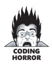
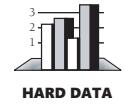
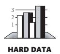
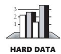
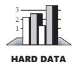

# Chapter 7: High-Quality Routines


<span id="page-197-0"></span>
### cc2e.com/0778 Contents

- 7.1 Valid Reasons to Create a Routine: page 164
- 7.2 Design at the Routine Level: page 168
- 7.3 Good Routine Names: page 171
- 7.4 How Long Can a Routine Be?: page 173
- 7.5 How to Use Routine Parameters: page 174
- 7.6 Special Considerations in the Use of Functions: page 181
- 7.7 Macro Routines and Inline Routines: page 182

#### Related Topics

- Steps in routine construction: Section 9.3
- Working classes: Chapter 6
- General design techniques: Chapter 5
- Software architecture: Section 3.5

Chapter 6 described the details of creating classes. This chapter zooms in on routines, on the characteristics that make the difference between a good routine and a bad one. If you'd rather read about issues that affect the design of routines before wading into the nitty-gritty details, be sure to read Chapter 5, "Design in Construction," first and come back to this chapter later. Some important attributes of high-quality routines are also discussed in Chapter 8, "Defensive Programming." If you're more interested in reading about steps to create routines and classes, Chapter 9, "The Pseudocode Programming Process," might be a better place to start.

Before jumping into the details of high-quality routines, it will be useful to nail down two basic terms. What is a "routine"? A routine is an individual method or procedure invocable for a single purpose. Examples include a function in C++, a method in Java, a function or sub procedure in Microsoft Visual Basic. For some uses, macros in C and C++ can also be thought of as routines. You can apply many of the techniques for creating a high-quality routine to these variants.

What is a *high-quality* routine? That's a harder question. Perhaps the easiest answer is to show what a high-quality routine is not. Here's an example of a low-quality routine:



#### **C++ Example of a Low-Quality Routine** void HandleStuff( CORP\_DATA & inputRec, int crntQtr, EMP\_DATA empRec, double & estimRevenue, double ytdRevenue, int screenX, int screenY, COLOR\_TYPE & newColor, COLOR\_TYPE & prevColor, StatusType & status, int expenseType ) { int i; for ( i = 0; i < 100; i++ ) { inputRec.revenue[i] = 0; inputRec.expense[i] = corpExpense[ crntQtr ][ i ]; } UpdateCorpDatabase( empRec ); estimRevenue = ytdRevenue \* 4.0 / (double) crntQtr; newColor = prevColor; status = SUCCESS; if ( expenseType == 1 ) { for ( i = 0; i < 12; i++ ) profit[i] = revenue[i] - expense.type1[i]; } else if ( expenseType == 2 ) { profit[i] = revenue[i] - expense.type2[i]; } else if ( expenseType == 3 ) profit[i] = revenue[i] - expense.type3[i]; }

What's wrong with this routine? Here's a hint: you should be able to find at least 10 different problems with it. Once you've come up with your own list, look at the following list:

- The routine has a bad name. *HandleStuff()* tells you nothing about what the routine does.
- The routine isn't documented. (The subject of documentation extends beyond the boundaries of individual routines and is discussed in Chapter 32, "Self-Documenting Code.")
- The routine has a bad layout. The physical organization of the code on the page gives few hints about its logical organization. Layout strategies are used haphazardly, with different styles in different parts of the routine. Compare the styles where *expenseType == 2* and *expenseType == 3*. (Layout is discussed in Chapter 31, "Layout and Style.")
- The routine's input variable, *inputRec,* is changed. If it's an input variable, its value should not be modified (and in C++ it should be declared *const*). If the value of the variable is supposed to be modified, the variable should not be called *inputRec*.
- The routine reads and writes global variables—it reads from *corpExpense* and writes to *profit*. It should communicate with other routines more directly than by reading and writing global variables.

- The routine doesn't have a single purpose. It initializes some variables, writes to a database, does some calculations—none of which seem to be related to each other in any way. A routine should have a single, clearly defined purpose.
- The routine doesn't defend itself against bad data. If *crntQtr* equals *0*, the expression *ytdRevenue \* 4.0 / (double) crntQtr* causes a divide-by-zero error.
- The routine uses several magic numbers: *100*, *4.0, 12*, *2*, and *3*. Magic numbers are discussed in Section 12.1, "Numbers in General."
- Some of the routine's parameters are unused: *screenX* and *screenY* are not referenced within the routine.
- One of the routine's parameters is passed incorrectly: *prevColor* is labeled as a reference parameter (&) even though it isn't assigned a value within the routine.
- The routine has too many parameters. The upper limit for an understandable number of parameters is about 7; this routine has 11. The parameters are laid out in such an unreadable way that most people wouldn't try to examine them closely or even count them.
- The routine's parameters are poorly ordered and are not documented. (Parameter ordering is discussed in this chapter. Documentation is discussed in Chapter 32.)

Aside from the computer itself, the routine is the single greatest invention in computer science. The routine makes programs easier to read and easier to understand than any other feature of any programming language, and it's a crime to abuse this senior statesman of computer science with code like that in the example just shown.

The routine is also the greatest technique ever invented for saving space and improving performance. Imagine how much larger your code would be if you had to repeat the code for every call to a routine instead of branching to the routine. Imagine how hard it would be to make performance improvements in the same code used in a dozen places instead of making them all in one routine. The routine makes modern programming possible.

"OK," you say, "I already know that routines are great, and I program with them all the time. This discussion seems kind of remedial, so what do you want me to do about it?"

I want you to understand that many valid reasons to create a routine exist and that there are right ways and wrong ways to go about it. As an undergraduate computer-science student, I thought that the main reason to create a routine was to avoid duplicate code. The introductory textbook I used said that routines were good because the avoidance of duplication made a program easier to develop, debug, document, and maintain. Period. Aside from syntactic details about how to use parameters and local variables, that was the extent of the textbook's coverage. It was not a good or complete explanation of the theory and practice of routines. The following sections contain a much better explanation.

#### cc2e.com/0799

**Cross-Reference** The class is also a good contender for the single greatest invention in computer science. For details on how to use classes effectively, see Chapter 6, "Working Classes."

#### 7.1 Valid Reasons to Create a Routine

Here's a list of valid reasons to create a routine. The reasons overlap somewhat, and they're not intended to make an orthogonal set.


*Reduce complexity* The single most important reason to create a routine is to reduce a program's complexity. Create a routine to hide information so that you won't need to think about it. Sure, you'll need to think about it when you write the routine. But after it's written, you should be able to forget the details and use the routine without any knowledge of its internal workings. Other reasons to create routines—minimizing code size, improving maintainability, and improving correctness—are also good reasons, but without the abstractive power of routines, complex programs would be impossible to manage intellectually.

One indication that a routine needs to be broken out of another routine is deep nesting of an inner loop or a conditional. Reduce the containing routine's complexity by pulling the nested part out and putting it into its own routine.

*Introduce an intermediate, understandable abstraction* Putting a section of code into a well-named routine is one of the best ways to document its purpose. Instead of reading a series of statements like

```
if ( node <> NULL ) then
   while ( node.next <> NULL ) do
      node = node.next
      leafName = node.name
   end while
else
   leafName = ""
end if
```

you can read a statement like this:

```
leafName = GetLeafName( node )
```

The new routine is so short that nearly all it needs for documentation is a good name. The name introduces a higher level of abstraction than the original eight lines of code, which makes the code more readable and easier to understand, and it reduces complexity within the routine that originally contained the code.

*Avoid duplicate code* Undoubtedly the most popular reason for creating a routine is to avoid duplicate code. Indeed, creation of similar code in two routines implies an error in decomposition. Pull the duplicate code from both routines, put a generic version of the common code into a base class, and then move the two specialized routines into subclasses. Alternatively, you could migrate the common code into its own routine, and then let both call the part that was put into the new routine. With code in one place, you save the space that would have been used by duplicated code. Modifications will be easier because you'll need to modify the code in only one location. The

code will be more reliable because you'll have to check only one place to ensure that the code is right. Modifications will be more reliable because you'll avoid making successive and slightly different modifications under the mistaken assumption that you've made identical ones.

*Support subclassing* You need less new code to override a short, well-factored routine than a long, poorly factored routine. You'll also reduce the chance of error in subclass implementations if you keep overrideable routines simple.

*Hide sequences* It's a good idea to hide the order in which events happen to be processed. For example, if the program typically gets data from the user and then gets auxiliary data from a file, neither the routine that gets the user data nor the routine that gets the file data should depend on the other routine's being performed first. Another example of a sequence might be found when you have two lines of code that read the top of a stack and decrement a *stackTop* variable. Put those two lines of code into a *PopStack()* routine to hide the assumption about the order in which the two operations must be performed. Hiding that assumption will be better than baking it into code from one end of the system to the other.

*Hide pointer operations* Pointer operations tend to be hard to read and error prone. By isolating them in routines, you can concentrate on the intent of the operation rather than on the mechanics of pointer manipulation. Also, if the operations are done in only one place, you can be more certain that the code is correct. If you find a better data type than pointers, you can change the program without traumatizing the code that would have used the pointers.

*Improve portability* Use of routines isolates nonportable capabilities, explicitly identifying and isolating future portability work. Nonportable capabilities include nonstandard language features, hardware dependencies, operating-system dependencies, and so on.

*Simplify complicated boolean tests* Understanding complicated boolean tests in detail is rarely necessary for understanding program flow. Putting such a test into a function makes the code more readable because (1) the details of the test are out of the way and (2) a descriptive function name summarizes the purpose of the test.

Giving the test a function of its own emphasizes its significance. It encourages extra effort to make the details of the test readable inside its function. The result is that both the main flow of the code and the test itself become clearer. Simplifying a boolean test is an example of reducing complexity, which was discussed earlier.

*Improve performance* You can optimize the code in one place instead of in several places. Having code in one place will make it easier to profile to find inefficiencies. Centralizing code into a routine means that a single optimization benefits all the code that uses that routine, whether it uses it directly or indirectly. Having code in one place makes it practical to recode the routine with a more efficient algorithm or in a faster, more efficient language.

**Cross-Reference** For details on information hiding, see "Hide Secrets (Information Hiding)" in Section 5.3.

*To ensure all routines are small?* No. With so many good reasons for putting code into a routine, this one is unnecessary. In fact, some jobs are performed better in a single large routine. (The best length for a routine is discussed in Section 7.4, "How Long Can a Routine Be?")

#### Operations That Seem Too Simple to Put Into Routines


One of the strongest mental blocks to creating effective routines is a reluctance to create a simple routine for a simple purpose. Constructing a whole routine to contain two or three lines of code might seem like overkill, but experience shows how helpful a good small routine can be.

Small routines offer several advantages. One is that they improve readability. I once had the following single line of code in about a dozen places in a program:

```
Pseudocode Example of a Calculation
points = deviceUnits * ( POINTS_PER_INCH / DeviceUnitsPerInch() )
```

This is not the most complicated line of code you'll ever read. Most people would eventually figure out that it converts a measurement in device units to a measurement in points. They would see that each of the dozen lines did the same thing. It could have been clearer, however, so I created a well-named routine to do the conversion in one place:

```
Pseudocode Example of a Calculation Converted to a Function
Function DeviceUnitsToPoints ( deviceUnits Integer ): Integer
   DeviceUnitsToPoints = deviceUnits *
      ( POINTS_PER_INCH / DeviceUnitsPerInch() )
End Function
```

When the routine was substituted for the inline code, the dozen lines of code all looked more or less like this one:

```
Pseudocode Example of a Function Call to a Calculation Function
points = DeviceUnitsToPoints( deviceUnits )
```

This line is more readable—even approaching self-documenting.

This example hints at another reason to put small operations into functions: small operations tend to turn into larger operations. I didn't know it when I wrote the routine, but under certain conditions and when certain devices were active, *Device-UnitsPerlnch()* returned *0*. That meant I had to account for division by zero, which took three more lines of code:

#### **Pseudocode Example of a Calculation That Expands Under Maintenance** Function DeviceUnitsToPoints( deviceUnits: Integer ) Integer; if ( DeviceUnitsPerInch() <> 0 ) DeviceUnitsToPoints = deviceUnits \* ( POINTS\_PER\_INCH / DeviceUnitsPerInch() ) else DeviceUnitsToPoints = 0 end if End Function

If that original line of code had still been in a dozen places, the test would have been repeated a dozen times, for a total of 36 new lines of code. A simple routine reduced the 36 new lines to 3.

#### Summary of Reasons to Create a Routine

Here's a summary list of the valid reasons for creating a routine:

- Reduce complexity
- Introduce an intermediate, understandable abstraction
- Avoid duplicate code
- Support subclassing
- Hide sequences
- Hide pointer operations
- Improve portability
- Simplify complicated boolean tests
- Improve performance

In addition, many of the reasons to create a class are also good reasons to create a routine:

- Isolate complexity
- Hide implementation details
- Limit effects of changes
- Hide global data
- Make central points of control
- Facilitate reusable code
- Accomplish a specific refactoring

#### 7.2 Design at the Routine Level

The idea of cohesion was introduced in a paper by Wayne Stevens, Glenford Myers, and Larry Constantine (1974). Other more modern concepts, including abstraction and encapsulation, tend to yield more insight at the class level (and have, in fact, largely superceded cohesion at the class level), but cohesion is still alive and well as the workhorse design heuristic at the individual-routine level.

**Cross-Reference** For a discussion of cohesion in general, see "Aim for Strong Cohesion" in Section 5.3.

For routines, cohesion refers to how closely the operations in a routine are related. Some programmers prefer the term "strength": how strongly related are the operations in a routine? A function like *Cosine()* is perfectly cohesive because the whole routine is dedicated to performing one function. A function like *CosineAndTan()* has lower cohesion because it tries to do more than one thing. The goal is to have each routine do one thing well and not do anything else.



The payoff is higher reliability. One study of 450 routines found that 50 percent of the highly cohesive routines were fault free, whereas only 18 percent of routines with low cohesion were fault free (Card, Church, and Agresti 1986). Another study of a different 450 routines (which is just an unusual coincidence) found that routines with the highest coupling-to-cohesion ratios had 7 times as many errors as those with the lowest coupling-to-cohesion ratios and were 20 times as costly to fix (Selby and Basili 1991).

Discussions about cohesion typically refer to several levels of cohesion. Understanding the concepts is more important than remembering specific terms. Use the concepts as aids in thinking about how to make routines as cohesive as possible.

*Functional cohesion* is the strongest and best kind of cohesion, occurring when a routine performs one and only one operation. Examples of highly cohesive routines include *sin()*, *GetCustomerName()*, *EraseFile()*, *CalculateLoanPayment()*, and *AgeFrom-Birthdate()*. Of course, this evaluation of their cohesion assumes that the routines do what their names say they do—if they do anything else, they are less cohesive and poorly named.

Several other kinds of cohesion are normally considered to be less than ideal:

- *Sequential cohesion* exists when a routine contains operations that must be performed in a specific order, that share data from step to step, and that don't make up a complete function when done together.
  - An example of sequential cohesion is a routine that, given a birth date, calculates an employee's age and time to retirement. If the routine calculates the age and then uses that result to calculate the employee's time to retirement, it has sequential cohesion. If the routine calculates the age and then calculates the time to retirement in a completely separate computation that happens to use the same birth-date data, it has only communicational cohesion.

How would you make the routine functionally cohesive? You'd create separate routines to compute an employee's age given a birth date and compute time to retirement given a birth date. The time-to-retirement routine could call the age routine. They'd both have functional cohesion. Other routines could call either routine or both routines.

■ *Communicational cohesion* occurs when operations in a routine make use of the same data and aren't related in any other way. If a routine prints a summary report and then reinitializes the summary data passed into it, the routine has communicational cohesion: the two operations are related only by the fact that they use the same data.

To give this routine better cohesion, the summary data should be reinitialized close to where it's created, which shouldn't be in the report-printing routine. Split the operations into individual routines. The first prints the report. The second reinitializes the data, close to the code that creates or modifies the data. Call both routines from the higher-level routine that originally called the communicationally cohesive routine.

■ *Temporal cohesion* occurs when operations are combined into a routine because they are all done at the same time. Typical examples would be *Startup()*, *CompleteNewEmployee()*, and *Shutdown()*. Some programmers consider temporal cohesion to be unacceptable because it's sometimes associated with bad programming practices such as having a hodgepodge of code in a *Startup()* routine.

To avoid this problem, think of temporal routines as organizers of other events. The *Startup()* routine, for example, might read a configuration file, initialize a scratch file, set up a memory manager, and show an initial screen. To make it most effective, have the temporally cohesive routine call other routines to perform specific activities rather than performing the operations directly itself. That way, it will be clear that the point of the routine is to orchestrate activities rather than to do them directly.

This example raises the issue of choosing a name that describes the routine at the right level of abstraction. You could decide to name the routine *ReadConfig-FileInitScratchFileEtc()*, which would imply that the routine had only coincidental cohesion. If you name it *Startup()*, however, it would be clear that it had a single purpose and clear that it had functional cohesion.

The remaining kinds of cohesion are generally unacceptable. They result in code that's poorly organized, hard to debug, and hard to modify. If a routine has bad cohesion, it's better to put effort into a rewrite to have better cohesion than investing in a pinpoint diagnosis of the problem. Knowing what to avoid can be useful, however, so here are the unacceptable kinds of cohesion:

■ *Procedural cohesion* occurs when operations in a routine are done in a specified order. An example is a routine that gets an employee name, then an address, and then a phone number. The order of these operations is important only because it matches the order in which the user is asked for the data on the input screen. Another routine gets the rest of the employee data. The routine has procedural cohesion because it puts a set of operations in a specified order and the operations don't need to be combined for any other reason.

To achieve better cohesion, put the separate operations into their own routines. Make sure that the calling routine has a single, complete job: *GetEmployee()* rather than *GetFirstPartOfEmployeeData()*. You'll probably need to modify the routines that get the rest of the data too. It's common to modify two or more original routines before you achieve functional cohesion in any of them.

■ *Logical cohesion* occurs when several operations are stuffed into the same routine and one of the operations is selected by a control flag that's passed in. It's called logical cohesion because the control flow or "logic" of the routine is the only thing that ties the operations together—they're all in a big *if* statement or *case* statement together. It isn't because the operations are logically related in any other sense. Considering that the defining attribute of logical cohesion is that the operations are unrelated, a better name might "illogical cohesion."

One example would be an *InputAll()* routine that inputs customer names, employee timecard information, or inventory data depending on a flag passed to the routine. Other examples would be *ComputeAll()*, *EditAll()*, *PrintAll()*, and *SaveAll()*. The main problem with such routines is that you shouldn't need to pass in a flag to control another routine's processing. Instead of having a routine that does one of three distinct operations, depending on a flag passed to it, it's cleaner to have three routines, each of which does one distinct operation. If the operations use some of the same code or share data, the code should be moved into a lower-level routine and the routines should be packaged into a class.

It's usually all right, however, to create a logically cohesive routine if its code consists solely of a series of *if* or *case* statements and calls to other routines. In such a case, if the routine's only function is to dispatch commands and it doesn't do any of the processing itself, that's usually a good design. The technical term for this kind of routine is "event handler." An event handler is often used in interactive environments such as the Apple Macintosh, Microsoft Windows, and other GUI environments.

■ *Coincidental cohesion* occurs when the operations in a routine have no discernible relationship to each other. Other good names are "no cohesion" or "chaotic cohesion." The low-quality C++ routine at the beginning of this chapter had coincidental cohesion. It's hard to convert coincidental cohesion to any better kind of cohesion—you usually need to do a deeper redesign and reimplementation.

**Cross-Reference** Although the routine might have better cohesion, a higher-level design issue is whether the system should be using a *case* statement instead of polymorphism. For more on this issue, see "Replace conditionals with polymorphism (especially repeated *case* statements)" in Section 24.3


None of these terms are magical or sacred. Learn the ideas rather than the terminology. It's nearly always possible to write routines with functional cohesion, so focus your attention on functional cohesion for maximum benefit.

#### 7.3 Good Routine Names

**Cross-Reference** For details on naming variables, see Chapter 11, "The Power of Variable Names."

A good name for a routine clearly describes everything the routine does. Here are guidelines for creating effective routine names:

*Describe everything the routine does* In the routine's name, describe all the outputs and side effects. If a routine computes report totals and opens an output file, *Compute-ReportTotals()* is not an adequate name for the routine. *ComputeReportTotalsAndOpen-OutputFile()* is an adequate name but is too long and silly. If you have routines with side effects, you'll have many long, silly names. The cure is not to use less-descriptive routine names; the cure is to program so that you cause things to happen directly rather than with side effects.

*Avoid meaningless, vague, or wishy-washy verbs* Some verbs are elastic, stretched to cover just about any meaning. Routine names like *HandleCalculation()*, *PerformServices()*, *OutputUser()*, *ProcessInput()*, and *DealWithOutput()* don't tell you what the routines do. At the most, these names tell you that the routines have something to do with calculations, services, users, input, and output. The exception would be when the verb "handle" was used in the specific technical sense of handling an event.


KEY POINT

Sometimes the only problem with a routine is that its name is wishy-washy; the routine itself might actually be well designed. If *HandleOutput()* is replaced with *FormatAndPrintOutput()*, you have a pretty good idea of what the routine does.

In other cases, the verb is vague because the operations performed by the routine are vague. The routine suffers from a weakness of purpose, and the weak name is a symptom. If that's the case, the best solution is to restructure the routine and any related routines so that they all have stronger purposes and stronger names that accurately describe them.


*Don't differentiate routine names solely by number* One developer wrote all his code in one big function. Then he took every 15 lines and created functions named *Part1*, *Part2*, and so on. After that, he created one high-level function that called each part. This method of creating and naming routines is especially egregious (and rare, I hope). But programmers sometimes use numbers to differentiate routines with names like *OutputUser*, *OutputUser1*, and *OutputUser2*. The numerals at the ends of these names provide no indication of the different abstractions the routines represent, and the routines are thus poorly named.

*Make names of routines as long as necessary* Research shows that the optimum average length for a variable name is 9 to 15 characters. Routines tend to be more complicated than variables, and good names for them tend to be longer. On the other hand, routine names are often attached to object names, which essentially provides part of the name for free. Overall, the emphasis when creating a routine name should be to make the name as clear as possible, which means you should make its name as long or short as needed to make it understandable.

**Cross-Reference** For the distinction between procedures and functions, see Section 7.6, "Special Considerations in the Use of Functions," later in this chapter.

*To name a function, use a description of the return value* A function returns a value, and the function should be named for the value it returns. For example, *cos()*, *customerId.Next()*, *printer.IsReady()*, and *pen.CurrentColor()* are all good function names that indicate precisely what the functions return.

*To name a procedure, use a strong verb followed by an object* A procedure with functional cohesion usually performs an operation on an object. The name should reflect what the procedure does, and an operation on an object implies a verb-plusobject name. *PrintDocument()*, *CalcMonthlyRevenues()*, *CheckOrderlnfo()*, and *RepaginateDocument()* are samples of good procedure names.

In object-oriented languages, you don't need to include the name of the object in the procedure name because the object itself is included in the call. You invoke routines with statements like *document.Print()*, *orderInfo.Check()*, and *monthlyRevenues.Calc()*. Names like *document.PrintDocument()* are redundant and can become inaccurate when they're carried through to derived classes. If *Check* is a class derived from *Document*, *check.Print()* seems clearly to be printing a check, whereas *check.PrintDocument()* sounds like it might be printing a checkbook register or monthly statement, but it doesn't sound like it's printing a check.

**Cross-Reference** For a similar list of opposites in variable names, see "Common Opposites in Variable Names" in Section 11.1.

*Use opposites precisely* Using naming conventions for opposites helps consistency, which helps readability. Opposite-pairs like *first/last* are commonly understood. Opposite-pairs like *FileOpen()* and *\_lclose()* are not symmetrical and are confusing. Here are some common opposites:

| add/remove     | increment/decrement | open/close    |
|----------------|---------------------|---------------|
| begin/end      | insert/delete       | show/hide     |
| create/destroy | lock/unlock         | source/target |
| first/last     | min/max             | start/stop    |
| get/put        | next/previous       | up/down       |
| get/set        | old/new             |               |

*Establish conventions for common operations* In some systems, it's important to distinguish among different kinds of operations. A naming convention is often the easiest and most reliable way of indicating these distinctions.

The code on one of my projects assigned each object a unique identifier. We neglected to establish a convention for naming the routines that would return the object identifier, so we had routine names like these:

employee.id.Get() dependent.GetId() supervisor() candidate.id()

The *Employee* class exposed its *id* object, which in turn exposed its *Get()* routine. The *Dependent* class exposed a *GetId()* routine. The *Supervisor* class made the *id* its default return value. The *Candidate* class made use of the fact that the *id* object's default return value was the *id*, and exposed the *id* object. By the middle of the project, no one could remember which of these routines was supposed to be used on which object, but by that time too much code had been written to go back and make everything consistent. Consequently, every person on the team had to devote an unnecessary amount of gray matter to remembering the inconsequential detail of which syntax was used on which class to retrieve the *id*. A naming convention for retrieving *id*s would have eliminated this annoyance.

#### 7.4 How Long Can a Routine Be?

On their way to America, the Pilgrims argued about the best maximum length for a routine. After arguing about it for the entire trip, they arrived at Plymouth Rock and started to draft the Mayflower Compact. They still hadn't settled the maximum-length question, and since they couldn't disembark until they'd signed the compact, they gave up and didn't include it. The result has been an interminable debate ever since about how long a routine can be.

The theoretical best maximum length is often described as one screen or one or two pages of program listing, approximately 50 to 150 lines. In this spirit, IBM once limited routines to 50 lines, and TRW limited them to two pages (McCabe 1976). Modern programs tend to have volumes of extremely short routines mixed in with a few longer routines. Long routines are far from extinct, however. Shortly before finishing this book, I visited two client sites within a month. Programmers at one site were wrestling with a routine that was about 4,000 lines of code long, and programmers at the other site were trying to tame a routine that was more than 12,000 lines long!

A mountain of research on routine length has accumulated over the years, some of which is applicable to modern programs, and some of which isn't:



- A study by Basili and Perricone found that routine size was inversely correlated with errors: as the size of routines increased (up to 200 lines of code), the number of errors per line of code decreased (Basili and Perricone 1984).
- Another study found that routine size was not correlated with errors, even though structural complexity and amount of data were correlated with errors (Shen et al. 1985).

- A 1986 study found that small routines (32 lines of code or fewer) were not correlated with lower cost or fault rate (Card, Church, and Agresti 1986; Card and Glass 1990). The evidence suggested that larger routines (65 lines of code or more) were cheaper to develop per line of code.
- An empirical study of 450 routines found that small routines (those with fewer than 143 source statements, including comments) had 23 percent more errors per line of code than larger routines but were 2.4 times less expensive to fix than larger routines (Selby and Basili 1991).
- Another study found that code needed to be changed least when routines averaged 100 to 150 lines of code (Lind and Vairavan 1989).
- A study at IBM found that the most error-prone routines were those that were larger than 500 lines of code. Beyond 500 lines, the error rate tended to be proportional to the size of the routine (Jones 1986a).

Where does all this leave the question of routine length in object-oriented programs? A large percentage of routines in object-oriented programs will be accessor routines, which will be very short. From time to time, a complex algorithm will lead to a longer routine, and in those circumstances, the routine should be allowed to grow organically up to 100–200 lines. (A line is a noncomment, nonblank line of source code.) Decades of evidence say that routines of such length are no more error prone than shorter routines. Let issues such as the routine's cohesion, depth of nesting, number of variables, number of decision points, number of comments needed to explain the routine, and other complexity-related considerations dictate the length of the routine rather than imposing a length restriction per se.

That said, if you want to write routines longer than about 200 lines, be careful. None of the studies that reported decreased cost, decreased error rates, or both with larger routines distinguished among sizes larger than 200 lines, and you're bound to run into an upper limit of understandability as you pass 200 lines of code.

Interfaces between routines are some of the most error-prone areas of a program. One often-cited study by Basili and Perricone (1984) found that 39 percent of all errors were internal interface errors—errors in communication between routines. Here are a

#### 7.5 How to Use Routine Parameters

few guidelines for minimizing interface problems:

are examples of parameter lists in Ada:


HARD DATA

*Put parameters in input-modify-output order* Instead of ordering parameters randomly or alphabetically, list the parameters that are input-only first, input-and-output second, and output-only third. This ordering implies the sequence of operations happening within the routine-inputting data, changing it, and sending back a result. Here

**Cross-Reference** For details on documenting routine parameters, see "Commenting Routines" in Section 32.5. For details on formatting parameters, see Section 31.7, "Laying Out Routines."

#### **Ada Example of Parameters in Input-Modify-Output Order** procedure InvertMatrix( originalMatrix: in Matrix; resultMatrix: out Matrix ); ... procedure ChangeSentenceCase( desiredCase: in StringCase; sentence: in out Sentence ); ... procedure PrintPageNumber( pageNumber: in Integer; status: out StatusType );

Ada uses *in* and *out* keywords to make input and output parameters clear.

> This ordering convention conflicts with the C-library convention of putting the modified parameter first. The input-modify-output convention makes more sense to me, but if you consistently order parameters in some way, you will still do the readers of your code a service.

> *Consider creating your own* **in** *and* **out** *keywords* Other modern languages don't support the *in* and *out* keywords like Ada does. In those languages, you might still be able to use the preprocessor to create your own *in* and *out* keywords:

```
C++ Example of Defining Your Own In and Out Keywords
#define IN
#define OUT
void InvertMatrix(
   IN Matrix originalMatrix,
   OUT Matrix *resultMatrix
);
...
void ChangeSentenceCase(
   IN StringCase desiredCase,
   IN OUT Sentence *sentenceToEdit
);
...
void PrintPageNumber(
   IN int pageNumber,
   OUT StatusType &status
);
```

In this case, the *IN* and *OUT* macro-keywords are used for documentation purposes. To make the value of a parameter changeable by the called routine, the parameter still needs to be passed as a pointer or as a reference parameter.

Before adopting this technique, be sure to consider a pair of significant drawbacks. Defining your own *IN* and *OUT* keywords extends the C++ language in a way that will be unfamiliar to most people reading your code. If you extend the language this way, be sure to do it consistently, preferably projectwide. A second limitation is that the *IN* and *OUT* keywords won't be enforceable by the compiler, which means that you could potentially label a parameter as *IN* and then modify it inside the routine anyway. That could lull a reader of your code into assuming code is correct when it isn't. Using C++'s *const* keyword will normally be the preferable means of identifying input-only parameters.

*If several routines use similar parameters, put the similar parameters in a consistent order* The order of routine parameters can be a mnemonic, and inconsistent order can make parameters hard to remember. For example, in C, the *fprintf()* routine is the same as the *printf()* routine except that it adds a file as the first argument. A similar routine, *fputs()*, is the same as *puts()* except that it adds a file as the last argument. This is an aggravating, pointless difference that makes the parameters of these routines harder to remember than they need to be.

On the other hand, the routine *strncpy()* in C takes the arguments target string, source string, and maximum number of bytes, in that order, and the routine *memcpy()* takes the same arguments in the same order. The similarity between the two routines helps in remembering the parameters in either routine.



*Use all the parameters* If you pass a parameter to a routine, use it. If you aren't using it, remove the parameter from the routine interface. Unused parameters are correlated with an increased error rate. In one study, 46 percent of routines with no unused variables had no errors, and only 17 to 29 percent of routines with more than one unreferenced variable had no errors (Card, Church, and Agresti 1986).

This rule to remove unused parameters has one exception. If you're compiling part of your program conditionally, you might compile out parts of a routine that use a certain parameter. Be nervous about this practice, but if you're convinced it works, that's OK too. In general, if you have a good reason not to use a parameter, go ahead and leave it in place. If you don't have a good reason, make the effort to clean up the code.

*Put status or error variables last* By convention, status variables and variables that indicate an error has occurred go last in the parameter list. They are incidental to the main purpose of the routine, and they are output-only parameters, so it's a sensible convention.

*Don't use routine parameters as working variables* It's dangerous to use the parameters passed to a routine as working variables. Use local variables instead. For example, in the following Java fragment, the variable *inputVal* is improperly used to store intermediate results of a computation:

```
Java Example of Improper Use of Input Parameters
                         int Sample( int inputVal ) {
                             inputVal = inputVal * CurrentMultiplier( inputVal );
                             inputVal = inputVal + CurrentAdder( inputVal );
                             ...
At this point, inputVal no 
longer contains the value 
that was input.
                             return inputVal;
                         }
```

In this code fragment, *inputVal* is misleading because by the time execution reaches the last line, *inputVal* no longer contains the input value; it contains a computed value based in part on the input value, and it is therefore misnamed. If you later need to modify the routine to use the original input value in some other place, you'll probably use *inputVal* and assume that it contains the original input value when it actually doesn't.

How do you solve the problem? Can you solve it by renaming *inputVal*? Probably not. You could name it something like *workingVal*, but that's an incomplete solution because the name fails to indicate that the variable's original value comes from outside the routine. You could name it something ridiculous like *inputValThatBecomesWorkingVal* or give up completely and name it *x* or *val*, but all these approaches are weak.

A better approach is to avoid current and future problems by using working variables explicitly. The following code fragment demonstrates the technique:

```
Java Example of Good Use of Input Parameters
                          int Sample( int inputVal ) {
                             int workingVal = inputVal;
                             workingVal = workingVal * CurrentMultiplier( workingVal );
                             workingVal = workingVal + CurrentAdder( workingVal );
                             ...
If you need to use the origi-
nal value of inputVal here 
or somewhere else, it's still 
available.
                             ...
                             return workingVal;
                          }
```

Introducing the new variable *workingVal* clarifies the role of *inputVal* and eliminates the chance of erroneously using *inputVal* at the wrong time. (Don't take this reasoning as a justification for literally naming a variable *inputVal* or *workingVal*. In general, *inputVal* and *workingVal* are terrible names for variables, and these names are used in this example only to make the variables' roles clear.)

Assigning the input value to a working variable emphasizes where the value comes from. It eliminates the possibility that a variable from the parameter list will be modified accidentally. In C++, this practice can be enforced by the compiler using the keyword *const*. If you designate a parameter as *const*, you're not allowed to modify its value within a routine.

**Cross-Reference** For details on interface assumptions, see the introduction to Chapter 8, "Defensive Programming." For details on documentation, see Chapter 32, "Self-Documenting Code."

*Document interface assumptions about parameters* If you assume the data being passed to your routine has certain characteristics, document the assumptions as you make them. It's not a waste of effort to document your assumptions both in the routine itself and in the place where the routine is called. Don't wait until you've written the routine to go back and write the comments—you won't remember all your assumptions. Even better than commenting your assumptions, use assertions to put them into code.

What kinds of interface assumptions about parameters should you document?

- Whether parameters are input-only, modified, or output-only
- Units of numeric parameters (inches, feet, meters, and so on)
- Meanings of status codes and error values if enumerated types aren't used
- Ranges of expected values
- Specific values that should never appear



*Limit the number of a routine's parameters to about seven* Seven is a magic number for people's comprehension. Psychological research has found that people generally cannot keep track of more than about seven chunks of information at once (Miller 1956). This discovery has been applied to an enormous number of disciplines, and it seems safe to conjecture that most people can't keep track of more than about seven routine parameters at once.

In practice, how much you can limit the number of parameters depends on how your language handles complex data types. If you program in a modern language that supports structured data, you can pass a composite data type containing 13 fields and think of it as one mental "chunk" of data. If you program in a more primitive language, you might need to pass all 13 fields individually.

**Cross-Reference** For details on how to think about interfaces, see "Good Abstraction" in Section 6.2.

If you find yourself consistently passing more than a few arguments, the coupling among your routines is too tight. Design the routine or group of routines to reduce the coupling. If you are passing the same data to many different routines, group the routines into a class and treat the frequently used data as class data.

*Consider an input, modify, and output naming convention for parameters* If you find that it's important to distinguish among input, modify, and output parameters, establish a naming convention that identifies them. You could prefix them with *i\_*, *m\_*, and *o\_*. If you're feeling verbose, you could prefix them with *Input\_*, *Modify\_*, and *Output\_*.

*Pass the variables or objects that the routine needs to maintain its interface abstraction* There are two competing schools of thought about how to pass members of an object to a routine. Suppose you have an object that exposes data through 10 access routines and the called routine needs three of those data elements to do its job.

Proponents of the first school of thought argue that only the three specific elements needed by the routine should be passed. They argue that doing this will keep the connections between routines to a minimum; reduce coupling; and make them easier to understand, reuse, and so on. They say that passing the whole object to a routine violates the principle of encapsulation by potentially exposing all 10 access routines to the routine that's called.

Proponents of the second school argue that the whole object should be passed. They argue that the interface can remain more stable if the called routine has the flexibility to use additional members of the object without changing the routine's interface. They argue that passing three specific elements violates encapsulation by exposing which specific data elements the routine is using.

I think both these rules are simplistic and miss the most important consideration: *what abstraction is presented by the routine's interface?* If the abstraction is that the routine expects you to have three specific data elements, and it is only a coincidence that those three elements happen to be provided by the same object, then you should pass the three specific data elements individually. However, if the abstraction is that you will always have that particular object in hand and the routine will do something or other with that object, then you truly do break the abstraction when you expose the three specific data elements.

If you're passing the whole object and you find yourself creating the object, populating it with the three elements needed by the called routine, and then pulling those elements out of the object after the routine is called, that's an indication that you should be passing the three specific elements rather than the whole object. (In general, code that "sets up" for a call to a routine or "takes down" after a call to a routine is an indication that the routine is not well designed.)

If you find yourself frequently changing the parameter list to the routine, with the parameters coming from the same object each time, that's an indication that you should be passing the whole object rather than specific elements.

*Use named parameters* In some languages, you can explicitly associate formal parameters with actual parameters. This makes parameter usage more self-documenting and helps avoid errors from mismatching parameters. Here's an example in Visual Basic:

```
Visual Basic Example of Explicitly Identifying Parameters
                         Private Function Distance3d( _
Here's where the formal 
parameters are declared. 
                            ByVal xDistance As Coordinate, _
                            ByVal yDistance As Coordinate, _
                            ByVal zDistance As Coordinate _
                         )
                            ...
                         End Function
                         ...
                         Private Function Velocity( _
                            ByVal latitude as Coordinate, _
                            ByVal longitude as Coordinate, _
                            ByVal elevation as Coordinate _
                         )
                            ...
Here's where the actual 
parameters are mapped to 
the formal parameters. 
                            Distance = Distance3d( xDistance := latitude, yDistance := longitude, _
                                zDistance := elevation )
                            ...
                         End Function
```

This technique is especially useful when you have longer-than-average lists of identically typed arguments, which increases the chances that you can insert a parameter mismatch without the compiler detecting it. Explicitly associating parameters may be overkill in many environments, but in safety-critical or other high-reliability environments the extra assurance that parameters match up the way you expect can be worthwhile.

*Make sure actual parameters match formal parameters* Formal parameters, also known as "dummy parameters," are the variables declared in a routine definition. Actual parameters are the variables, constants, or expressions used in the actual routine calls.

A common mistake is to put the wrong type of variable in a routine call—for example, using an integer when a floating point is needed. (This is a problem only in weakly typed languages like C when you're not using full compiler warnings. Strongly typed languages such as C++ and Java don't have this problem.) When arguments are input only, this is seldom a problem; usually the compiler converts the actual type to the formal type before passing it to the routine. If it is a problem, usually your compiler gives you a warning. But in some cases, particularly when the argument is used for both input and output, you can get stung by passing the wrong type of argument.

Develop the habit of checking types of arguments in parameter lists and heeding compiler warnings about mismatched parameter types.

#### 7.6 Special Considerations in the Use of Functions

Modern languages such as C++, Java, and Visual Basic support both functions and procedures. A function is a routine that returns a value; a procedure is a routine that does not. In C++, all routines are typically called "functions"; however, a function with a *void* return type is semantically a procedure. The distinction between functions and procedures is as much a semantic distinction as a syntactic one, and semantics should be your guide.

#### When to Use a Function and When to Use a Procedure

Purists argue that a function should return only one value, just as a mathematical function does. This means that a function would take only input parameters and return its only value through the function itself. The function would always be named for the value it returned, as *sin()*, *CustomerID()*, and *ScreenHeight()* are. A procedure, on the other hand, could take input, modify, and output parameters—as many of each as it wanted to.

A common programming practice is to have a function that operates as a procedure and returns a status value. Logically, it works as a procedure, but because it returns a value, it's officially a function. For example, you might have a routine called *FormatOutput()* used with a *report* object in statements like this one:

```
if ( report.FormatOutput( formattedReport ) = Success ) then ...
```

In this example, *report.FormatOutput()* operates as a procedure in that it has an output parameter, *formattedReport*, but it is technically a function because the routine itself returns a value. Is this a valid way to use a function? In defense of this approach, you could maintain that the function return value has nothing to do with the main purpose of the routine, formatting output, or with the routine name, *report.FormatOutput().* In that sense it operates more as a procedure does even if it is technically a function. The use of the return value to indicate the success or failure of the procedure is not confusing if the technique is used consistently.

The alternative is to create a procedure that has a status variable as an explicit parameter, which promotes code like this fragment:

```
report.FormatOutput( formattedReport, outputStatus )
if ( outputStatus = Success ) then ...
```

I prefer the second style of coding, not because I'm hard-nosed about the difference between functions and procedures but because it makes a clear separation between the routine call and the test of the status value. To combine the call and the test into one line of code increases the density of the statement and, correspondingly, its complexity. The following use of a function is fine too:

```
outputStatus = report.FormatOutput( formattedReport )
if ( outputStatus = Success ) then ...
```


In short, use a function if the primary purpose of the routine is to return the value indicated by the function name. Otherwise, use a procedure.

#### Setting the Function's Return Value

Using a function creates the risk that the function will return an incorrect return value. This usually happens when the function has several possible paths and one of the paths doesn't set a return value. To reduce this risk, do the following:

*Check all possible return paths* When creating a function, mentally execute each path to be sure that the function returns a value under all possible circumstances. It's good practice to initialize the return value at the beginning of the function to a default value—this provides a safety net in the event that the correct return value is not set.

*Don't return references or pointers to local data* As soon as the routine ends and the local data goes out of scope, the reference or pointer to the local data will be invalid. If an object needs to return information about its internal data, it should save the information as class member data. It should then provide accessor functions that return the values of the member data items rather than references or pointers to local data.

#### 7.7 Macro Routines and Inline Routines

**Cross-Reference** Even if your language doesn't have a macro preprocessor, you can build your own. For details, see Section 30.5, "Building Your Own Programming Tools."

Routines created with preprocessor macros call for a few unique considerations. The following rules and examples pertain to using the preprocessor in C++. If you're using a different language or preprocessor, adapt the rules to your situation.

*Fully parenthesize macro expressions* Because macros and their arguments are expanded into code, be careful that they expand the way you want them to. One common problem lies in creating a macro like this one:

```
C++ Example of a Macro That Doesn't Expand Properly
#define Cube( a ) a*a*a
```

If you pass this macro nonatomic values for *a*, it won't do the multiplication properly. If you use the expression *Cube( x+1 )*, it expands to *x+1 \* x + 1 \* x + 1*, which, because of the precedence of the multiplication and addition operators, is not what you want. A better, but still not perfect, version of the macro looks like this:

```
C++ Example of a Macro That Still Doesn't Expand Properly 
#define Cube( a ) (a)*(a)*(a)
```

This is close, but still no cigar. If you use *Cube()* in an expression that has operators with higher precedence than multiplication, the *(a)\*(a)\*(a)* will be torn apart. To prevent that, enclose the whole expression in parentheses:

```
C++ Example of a Macro That Works 
#define Cube( a ) ((a)*(a)*(a))
```

*Surround multiple-statement macros with curly braces* A macro can have multiple statements, which is a problem if you treat it as if it were a single statement. Here's an example of a macro that's headed for trouble:


```
C++ Example of a Nonworking Macro with Multiple Statements
#define LookupEntry( key, index ) \
   index = (key - 10) / 5; \
   index = min( index, MAX_INDEX ); \
   index = max( index, MIN_INDEX );
...
for ( entryCount = 0; entryCount < numEntries; entryCount++ )
   LookupEntry( entryCount, tableIndex[ entryCount ] );
```

This macro is headed for trouble because it doesn't work as a regular function would. As it's shown, the only part of the macro that's executed in the *for* loop is the first line of the macro:

```
index = (key - 10) / 5;
```

To avoid this problem, surround the macro with curly braces:

```
C++ Example of a Macro with Multiple Statements That Works
#define LookupEntry( key, index ) { \
   index = (key - 10) / 5; \
   index = min( index, MAX_INDEX ); \
   index = max( index, MIN_INDEX ); \
}
```

The practice of using macros as substitutes for function calls is generally considered risky and hard to understand—bad programming practice—so use this technique only if your specific circumstances require it.

*Name macros that expand to code like routines so that they can be replaced by routines if necessary* The convention in C++ for naming macros is to use all capital letters. If the macro can be replaced by a routine, however, name it using the naming convention for routines instead. That way you can replace macros with routines and vice versa without changing anything but the routine involved.

Following this recommendation entails some risk. If you commonly use *++* and *--* as side effects (as part of other statements), you'll get burned when you use macros that you think are routines. Considering the other problems with side effects, this is yet another reason to avoid using side effects.

#### Limitations on the Use of Macro Routines

Modern languages like C++ provide numerous alternatives to the use of macros:

- *const* for declaring constant values
- *inline* for defining functions that will be compiled as inline code
- *template* for defining standard operations like *min*, *max*, and so on in a type-safe way
- *enum* for defining enumerated types
- *typedef* for defining simple type substitutions


As Bjarne Stroustrup, designer of C++ points out, "Almost every macro demonstrates a flaw in the programming language, in the program, or in the programmer.... When you use macros, you should expect inferior service from tools such as debuggers, cross-reference tools, and profilers" (Stroustrup 1997). Macros are useful for supporting conditional compilation—see Section 8.6, "Debugging Aids"—but careful programmers generally use a macro as an alternative to a routine only as a last resort.

#### Inline Routines

C++ supports an *inline* keyword. An inline routine allows the programmer to treat the code as a routine at code-writing time, but the compiler will generally convert each instance of the routine into inline code at compile time. The theory is that *inline* can help produce highly efficient code that avoids routine-call overhead.

*Use inline routines sparingly* Inline routines violate encapsulation because C++ requires the programmer to put the code for the implementation of the inline routine in the header file, which exposes it to every programmer who uses the header file.

Inline routines require a routine's full code to be generated every time the routine is invoked, which for an inline routine of any size will increase code size. That can create problems of its own.

The bottom line on inlining for performance reasons is the same as the bottom line on any other coding technique that's motivated by performance: profile the code and measure the improvement. If the anticipated performance gain doesn't justify the bother of profiling the code to verify the improvement, it doesn't justify the erosion in code quality either.

#### cc2e.com/0792

**Cross-Reference** This is a checklist of considerations about the quality of the routine. For a list of the steps used to build a routine, see the checklist "The Pseudocode Programming Process" in Chapter 9, page 215.

#### CHECKLIST: High-Quality Routines

#### Big-Picture Issues

- ❑ Is the reason for creating the routine sufficient?
- ❑ Have all parts of the routine that would benefit from being put into routines of their own been put into routines of their own?
- ❑ Is the routine's name a strong, clear verb-plus-object name for a procedure or a description of the return value for a function?
- ❑ Does the routine's name describe everything the routine does?
- ❑ Have you established naming conventions for common operations?
- ❑ Does the routine have strong, functional cohesion—doing one and only one thing and doing it well?
- ❑ Do the routines have loose coupling—are the routine's connections to other routines small, intimate, visible, and flexible?
- ❑ Is the length of the routine determined naturally by its function and logic, rather than by an artificial coding standard?

#### Parameter-Passing Issues

- ❑ Does the routine's parameter list, taken as a whole, present a consistent interface abstraction?
- ❑ Are the routine's parameters in a sensible order, including matching the order of parameters in similar routines?
- ❑ Are interface assumptions documented?
- ❑ Does the routine have seven or fewer parameters?
- ❑ Is each input parameter used?
- ❑ Is each output parameter used?
- ❑ Does the routine avoid using input parameters as working variables?
- ❑ If the routine is a function, does it return a valid value under all possible circumstances?

#### Key Points

- The most important reason for creating a routine is to improve the intellectual manageability of a program, and you can create a routine for many other good reasons. Saving space is a minor reason; improved readability, reliability, and modifiability are better reasons.
- Sometimes the operation that most benefits from being put into a routine of its own is a simple one.
- You can classify routines into various kinds of cohesion, but you can make most routines functionally cohesive, which is best.
- The name of a routine is an indication of its quality. If the name is bad and it's accurate, the routine might be poorly designed. If the name is bad and it's inaccurate, it's not telling you what the program does. Either way, a bad name means that the program needs to be changed.
- Functions should be used only when the primary purpose of the function is to return the specific value described by the function's name.
- Careful programmers use macro routines with care and only as a last resort.
