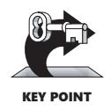
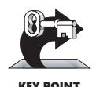
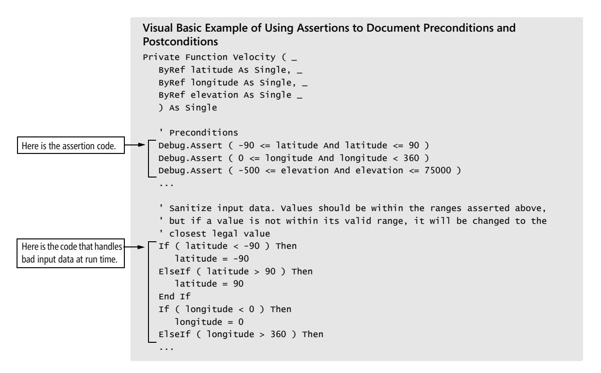
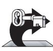
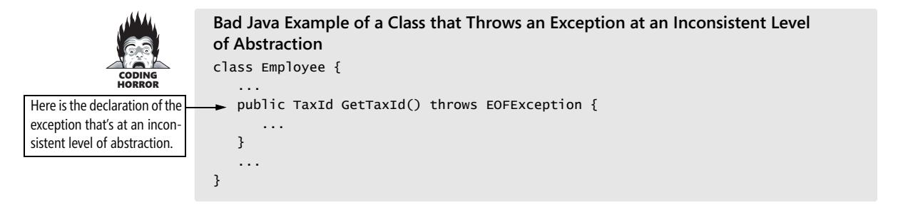
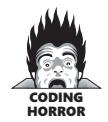
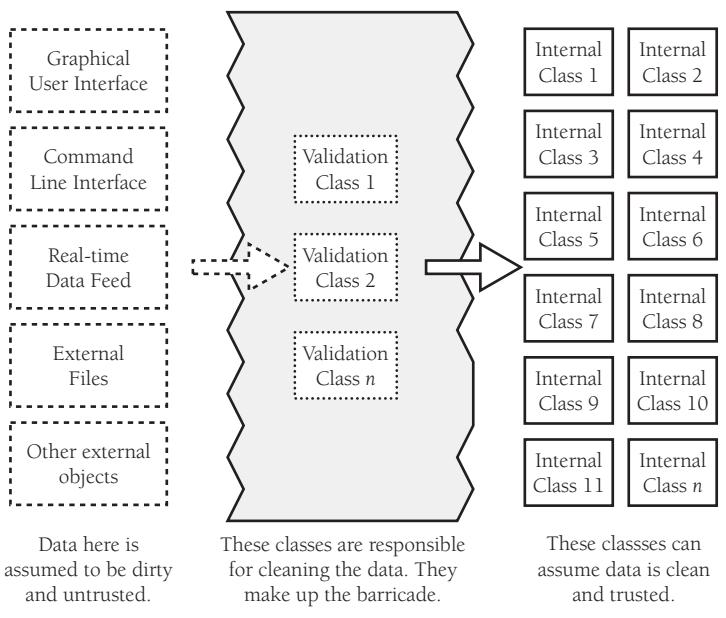

# Chapter 8: Defensive Programming


<span id="page-223-0"></span>
### cc2e.com/0861 Contents

- 8.1 Protecting Your Program from Invalid Inputs: page 188
- 8.2 Assertions: page 189
- 8.3 Error-Handling Techniques: page 194
- 8.4 Exceptions: page 198
- 8.5 Barricade Your Program to Contain the Damage Caused by Errors: page 203
- 8.6 Debugging Aids: page 205
- 8.7 Determining How Much Defensive Programming to Leave in Production Code: page 209
- 8.8 Being Defensive About Defensive Programming: page 210

#### Related Topics

- Information hiding: "Hide Secrets (Information Hiding)" in Section 5.3
- Design for change: "Identify Areas Likely to Change" in Section 5.3
- Software architecture: Section 3.5
- Design in Construction: Chapter 5
- Debugging: Chapter 23


Defensive programming doesn't mean being defensive about your programming—"It does so work!" The idea is based on defensive driving. In defensive driving, you adopt the mind-set that you're never sure what the other drivers are going to do. That way, you make sure that if they do something dangerous you won't be hurt. You take responsibility for protecting yourself even when it might be the other driver's fault. In defensive programming, the main idea is that if a routine is passed bad data, it won't be hurt, even if the bad data is another routine's fault. More generally, it's the recognition that programs will have problems and modifications, and that a smart programmer will develop code accordingly.

This chapter describes how to protect yourself from the cold, cruel world of invalid data, events that can "never" happen, and other programmers' mistakes. If you're an experienced programmer, you might skip the next section on handling input data and begin with Section 8.2, which reviews the use of assertions.

#### 8.1 Protecting Your Program from Invalid Inputs

In school you might have heard the expression, "Garbage in, garbage out." That expression is essentially software development's version of caveat emptor: let the user beware.



For production software, garbage in, garbage out isn't good enough. A good program never puts out garbage, regardless of what it takes in. A good program uses "garbage in, nothing out," "garbage in, error message out," or "no garbage allowed in" instead. By today's standards, "garbage in, garbage out" is the mark of a sloppy, nonsecure program.

There are three general ways to handle garbage in:

*Check the values of all data from external sources* When getting data from a file, a user, the network, or some other external interface, check to be sure that the data falls within the allowable range. Make sure that numeric values are within tolerances and that strings are short enough to handle. If a string is intended to represent a restricted range of values (such as a financial transaction ID or something similar), be sure that the string is valid for its intended purpose; otherwise reject it. If you're working on a secure application, be especially leery of data that might attack your system: attempted buffer overflows, injected SQL commands, injected HTML or XML code, integer overflows, data passed to system calls, and so on.

*Check the values of all routine input parameters* Checking the values of routine input parameters is essentially the same as checking data that comes from an external source, except that the data comes from another routine instead of from an external interface. The discussion in Section 8.5, "Barricade Your Program to Contain the Damage Caused by Errors," provides a practical way to determine which routines need to check their inputs.

*Decide how to handle bad inputs* Once you've detected an invalid parameter, what do you do with it? Depending on the situation, you might choose any of a dozen different approaches, which are described in detail in Section 8.3, "Error-Handling Techniques," later in this chapter.

Defensive programming is useful as an adjunct to the other quality-improvement techniques described in this book. The best form of defensive coding is not inserting errors in the first place. Using iterative design, writing pseudocode before code, writing test cases before writing the code, and having low-level design inspections are all activities that help to prevent inserting defects. They should thus be given a higher priority than defensive programming. Fortunately, you can use defensive programming in combination with the other techniques.

As Figure 8-1 suggests, protecting yourself from seemingly small problems can make more of a difference than you might think. The rest of this chapter describes specific options for checking data from external sources, checking input parameters, and handling bad inputs.


**Figure 8-1** Part of the Interstate-90 floating bridge in Seattle sank during a storm because the flotation tanks were left uncovered, they filled with water, and the bridge became too heavy to float. During construction, protecting yourself against the small stuff matters more than you might think.

#### 8.2 Assertions

An assertion is code that's used during development—usually a routine or macro—that allows a program to check itself as it runs. When an assertion is true, that means everything is operating as expected. When it's false, that means it has detected an unexpected error in the code. For example, if the system assumes that a customer-information file will never have more than 50,000 records, the program might contain an assertion that the number of records is less than or equal to 50,000. As long as the number of records is less than or equal to 50,000, the assertion will be silent. If it encounters more than 50,000 records, however, it will loudly "assert" that an error is in the program.



Assertions are especially useful in large, complicated programs and in high-reliability programs. They enable programmers to more quickly flush out mismatched interface assumptions, errors that creep in when code is modified, and so on.

An assertion usually takes two arguments: a boolean expression that describes the assumption that's supposed to be true, and a message to display if it isn't. Here's what a Java assertion would look like if the variable *denominator* were expected to be nonzero:

#### Java Example of an Assertion

assert denominator != 0 : "denominator is unexpectedly equal to 0.";

This assertion asserts that *denominator* is not equal to *0*. The first argument, *denominator != 0*, is a boolean expression that evaluates to *true* or *false*. The second argument is a message to print if the first argument is *false*—that is, if the assertion is false.

Use assertions to document assumptions made in the code and to flush out unexpected conditions. Assertions can be used to check assumptions like these:

- That an input parameter's value falls within its expected range (or an output parameter's value does)
- That a file or stream is open (or closed) when a routine begins executing (or when it ends executing)
- That a file or stream is at the beginning (or end) when a routine begins executing (or when it ends executing)
- That a file or stream is open for read-only, write-only, or both read and write
- That the value of an input-only variable is not changed by a routine
- That a pointer is non-null
- That an array or other container passed into a routine can contain at least *X* number of data elements
- That a table has been initialized to contain real values
- That a container is empty (or full) when a routine begins executing (or when it finishes)
- That the results from a highly optimized, complicated routine match the results from a slower but clearly written routine

Of course, these are just the basics, and your own routines will contain many more specific assumptions that you can document using assertions.

Normally, you don't want users to see assertion messages in production code; assertions are primarily for use during development and maintenance. Assertions are normally compiled into the code at development time and compiled out of the code for production. During development, assertions flush out contradictory assumptions, unexpected conditions, bad values passed to routines, and so on. During production, they can be compiled out of the code so that the assertions don't degrade system performance.

#### Building Your Own Assertion Mechanism

**Cross-Reference** Building your own assertion routine is a good example of programming "into" a language rather than just programming "in" a language. For more details on this distinction, see Section 34.4, "Program into Your Language, Not in It."

Many languages have built-in support for assertions, including C++, Java, and Microsoft Visual Basic. If your language doesn't directly support assertion routines, they are easy to write. The standard C++ *assert* macro doesn't provide for text messages. Here's an example of an improved *ASSERT* implemented as a C++ macro:

```
C++ Example of an Assertion Macro
#define ASSERT( condition, message ) { \
  if ( !(condition) ) { \
    LogError( "Assertion failed: ", \
       #condition, message ); \
    exit( EXIT_FAILURE ); \
  } \
}
```

#### Guidelines for Using Assertions

Here are some guidelines for using assertions:

*Use error-handling code for conditions you expect to occur; use assertions for conditions that should* **never** *occur* Assertions check for conditions that should *never* occur. Error-handling code checks for off-nominal circumstances that might not occur very often, but that have been anticipated by the programmer who wrote the code and that need to be handled by the production code. Error handling typically checks for bad input data; assertions check for bugs in the code.

If error-handling code is used to address an anomalous condition, the error handling will enable the program to respond to the error gracefully. If an assertion is fired for an anomalous condition, the corrective action is not merely to handle an error gracefully—the corrective action is to change the program's source code, recompile, and release a new version of the software.

A good way to think of assertions is as executable documentation—you can't rely on them to make the code work, but they can document assumptions more actively than program-language comments can.

*Avoid putting executable code into assertions* Putting code into an assertion raises the possibility that the compiler will eliminate the code when you turn off the assertions. Suppose you have an assertion like this:

**Cross-Reference** You could view this as one of many problems associated with putting multiple statements on one line. For more examples, see "Using Only One Statement per Line" in Section 31.5.

```
Visual Basic Example of a Dangerous Use of an Assertion
Debug.Assert( PerformAction() ) ' Couldn't perform action
```

The problem with this code is that, if you don't compile the assertions, you don't compile the code that performs the action. Put executable statements on their own lines, assign the results to status variables, and test the status variables instead. Here's an example of a safe use of an assertion:

```
Visual Basic Example of a Safe Use of an Assertion
actionPerformed = PerformAction()
Debug.Assert( actionPerformed ) ' Couldn't perform action
```

**Further Reading** For much more on preconditions and postconditions, see *Object-Oriented Software Construction* (Meyer 1997).

*Use assertions to document and verify preconditions and postconditions* Preconditions and postconditions are part of an approach to program design and development known as "design by contract" (Meyer 1997). When preconditions and postconditions are used, each routine or class forms a contract with the rest of the program.

*Preconditions* are the properties that the client code of a routine or class promises will be true before it calls the routine or instantiates the object. Preconditions are the client code's obligations to the code it calls.

*Postconditions* are the properties that the routine or class promises will be true when it concludes executing. Postconditions are the routine's or class's obligations to the code that uses it.

Assertions are a useful tool for documenting preconditions and postconditions. Comments could be used to document preconditions and postconditions, but, unlike comments, assertions can check dynamically whether the preconditions and postconditions are true.

In the following example, assertions are used to document the preconditions and postcondition of the *Velocity* routine.

```
Visual Basic Example of Using Assertions to Document Preconditions and 
Postconditions
Private Function Velocity ( _
   ByVal latitude As Single, _
   ByVal longitude As Single, _
   ByVal elevation As Single _
   ) As Single
   ' Preconditions
   Debug.Assert ( -90 <= latitude And latitude <= 90 )
   Debug.Assert ( 0 <= longitude And longitude < 360 )
   Debug.Assert ( -500 <= elevation And elevation <= 75000 )
```

```
...
   ' Postconditions
   Debug.Assert ( 0 <= returnVelocity And returnVelocity <= 600 )
   ' return value
   Velocity = returnVelocity
End Function
```

If the variables *latitude*, *longitude*, and *elevation* were coming from an external source, invalid values should be checked and handled by error-handling code rather than by assertions. If the variables are coming from a trusted, internal source, however, and the routine's design is based on the assumption that these values will be within their valid ranges, then assertions are appropriate.

**Cross-Reference** For more on robustness, see "Robustness vs. Correctness" in Section 8.3, later in this chapter. *For highly robust code, assert and then handle the error anyway* For any given error condition, a routine will generally use either an assertion or error-handling code, but not both. Some experts argue that only one kind is needed (Meyer 1997).

But real-world programs and projects tend to be too messy to rely solely on assertions. On a large, long-lasting system, different parts might be designed by different designers over a period of 5–10 years or more. The designers will be separated in time, across numerous versions. Their designs will focus on different technologies at different points in the system's development. The designers will be separated geographically, especially if parts of the system are acquired from external sources. Programmers will have worked to different coding standards at different points in the system's lifetime. On a large development team, some programmers will inevitably be more conscientious than others and some parts of the code will be reviewed more rigorously than other parts of the code. Some programmers will unit test their code more thoroughly than others. With test teams working across different geographic regions and subject to business pressures that result in test coverage that varies with each release, you can't count on comprehensive, system-level regression testing, either.

In such circumstances, both assertions and error-handling code might be used to address the same error. In the source code for Microsoft Word, for example, conditions that should always be true are asserted, but such errors are also handled by error-handling code in case the assertion fails. For extremely large, complex, longlived applications like Word, assertions are valuable because they help to flush out as many development-time errors as possible. But the application is so complex (millions of lines of code) and has gone through so many generations of modification that it isn't realistic to assume that every conceivable error will be detected and corrected before the software ships, and so errors must be handled in the production version of the system as well.

Here's an example of how that might work in the *Velocity* example:



#### 8.3 Error-Handling Techniques

Assertions are used to handle errors that should never occur in the code. How do you handle errors that you do expect to occur? Depending on the specific circumstances, you might want to return a neutral value, substitute the next piece of valid data, return the same answer as the previous time, substitute the closest legal value, log a warning message to a file, return an error code, call an error-processing routine or object, display an error message, or shut down—or you might want to use a combination of these responses.

Here are some more details on these options:

*Return a neutral value* Sometimes the best response to bad data is to continue operating and simply return a value that's known to be harmless. A numeric computation might return 0. A string operation might return an empty string, or a pointer operation might return an empty pointer. A drawing routine that gets a bad input value for color in a video game might use the default background or foreground color. A drawing routine that displays x-ray data for cancer patients, however, would not want to display a "neutral value." In that case, you'd be better off shutting down the program than displaying incorrect patient data.

*Substitute the next piece of valid data* When processing a stream of data, some circumstances call for simply returning the next valid data. If you're reading records from a database and encounter a corrupted record, you might simply continue reading until you find a valid record. If you're taking readings from a thermometer 100 times per second and you don't get a valid reading one time, you might simply wait another 1/100th of a second and take the next reading.

*Return the same answer as the previous time* If the thermometer-reading software doesn't get a reading one time, it might simply return the same value as last time. Depending on the application, temperatures might not be very likely to change much in 1/100th of a second. In a video game, if you detect a request to paint part of the screen an invalid color, you might simply return the same color used previously. But if you're authorizing transactions at a cash machine, you probably wouldn't want to use the "same answer as last time"—that would be the previous user's bank account number!

*Substitute the closest legal value* In some cases, you might choose to return the closest legal value, as in the *Velocity* example earlier. This is often a reasonable approach when taking readings from a calibrated instrument. The thermometer might be calibrated between 0 and 100 degrees Celsius, for example. If you detect a reading less than 0, you can substitute 0, which is the closest legal value. If you detect a value greater than 100, you can substitute 100. For a string operation, if a string length is reported to be less than 0, you could substitute 0. My car uses this approach to error handling whenever I back up. Since my speedometer doesn't show negative speeds, when I back up it simply shows a speed of 0—the closest legal value.

*Log a warning message to a file* When bad data is detected, you might choose to log a warning message to a file and then continue on. This approach can be used in conjunction with other techniques like substituting the closest legal value or substituting the next piece of valid data. If you use a log, consider whether you can safely make it publicly available or whether you need to encrypt it or protect it some other way.

*Return an error code* You could decide that only certain parts of a system will handle errors. Other parts will not handle errors locally; they will simply report that an error has been detected and trust that some other routine higher up in the calling hierarchy will handle the error. The specific mechanism for notifying the rest of the system that an error has occurred could be any of the following:

- Set the value of a status variable
- Return status as the function's return value
- Throw an exception by using the language's built-in exception mechanism

In this case, the specific error-reporting mechanism is less important than the decision about which parts of the system will handle errors directly and which will just report that they've occurred. If security is an issue, be sure that calling routines always check return codes.

*Call an error-processing routine/object* Another approach is to centralize error handling in a global error-handling routine or error-handling object. The advantage of this approach is that error-processing responsibility can be centralized, which can make debugging easier. The tradeoff is that the whole program will know about this central capability and will be coupled to it. If you ever want to reuse any of the code from the system in another system, you'll have to drag the error-handling machinery along with the code you reuse.

This approach has an important security implication. If your code has encountered a buffer overrun, it's possible that an attacker has compromised the address of the handler routine or object. Thus, once a buffer overrun has occurred while an application is running, it is no longer safe to use this approach.

*Display an error message wherever the error is encountered* This approach minimizes error-handling overhead; however, it does have the potential to spread user interface messages through the entire application, which can create challenges when you need to create a consistent user interface, when you try to clearly separate the UI from the rest of the system, or when you try to localize the software into a different language. Also, beware of telling a potential attacker of the system too much. Attackers sometimes use error messages to discover how to attack a system.

*Handle the error in whatever way works best locally* Some designs call for handling all errors locally—the decision of which specific error-handling method to use is left up to the programmer designing and implementing the part of the system that encounters the error.

This approach provides individual developers with great flexibility, but it creates a significant risk that the overall performance of the system will not satisfy its requirements for correctness or robustness (more on this in a moment). Depending on how developers end up handling specific errors, this approach also has the potential to spread user interface code throughout the system, which exposes the program to all the problems associated with displaying error messages.

*Shut down* Some systems shut down whenever they detect an error. This approach is useful in safety-critical applications. For example, if the software that controls radiation equipment for treating cancer patients receives bad input data for the radiation dosage, what is its best error-handling response? Should it use the same value as last time? Should it use the closest legal value? Should it use a neutral value? In this case, shutting down is the best option. We'd much prefer to reboot the machine than to run the risk of delivering the wrong dosage.

A similar approach can be used to improve the security of Microsoft Windows. By default, Windows continues to operate even when its security log is full. But you can configure Windows to halt the server if the security log becomes full, which can be appropriate in a security-critical environment.

#### Robustness vs. Correctness

As the video game and x-ray examples show us, the style of error processing that is most appropriate depends on the kind of software the error occurs in. These examples also illustrate that error processing generally favors more correctness or more robustness. Developers tend to use these terms informally, but, strictly speaking, these terms are at opposite ends of the scale from each other. *Correctness* means never returning an inaccurate result; returning no result is better than returning an inaccurate result. *Robustness* means always trying to do something that will allow the software to keep operating, even if that leads to results that are inaccurate sometimes.

Safety-critical applications tend to favor correctness to robustness. It is better to return no result than to return a wrong result. The radiation machine is a good example of this principle.

Consumer applications tend to favor robustness to correctness. Any result whatsoever is usually better than the software shutting down. The word processor I'm using occasionally displays a fraction of a line of text at the bottom of the screen. If it detects that condition, do I want the word processor to shut down? No. I know that the next time I hit Page Up or Page Down, the screen will refresh and the display will be back to normal.

#### High-Level Design Implications of Error Processing



KEY POINT

With so many options, you need to be careful to handle invalid parameters in consistent ways throughout the program. The way in which errors are handled affects the software's ability to meet requirements related to correctness, robustness, and other nonfunctional attributes. Deciding on a general approach to bad parameters is an architectural or highlevel design decision and should be addressed at one of those levels.

Once you decide on the approach, make sure you follow it consistently. If you decide to have high-level code handle errors and low-level code merely report errors, make sure the high-level code actually handles the errors! Some languages give you the option of ignoring the fact that a function is returning an error code—in C++, you're not required to do anything with a function's return value—but don't ignore error information! Test the function return value. If you don't expect the function ever to produce an error, check it anyway. The whole point of defensive programming is guarding against errors you don't expect.

This guideline holds true for system functions as well as for your own functions. Unless you've set an architectural guideline of not checking system calls for errors, check for error codes after each call. If you detect an error, include the error number and the description of the error.

#### 8.4 Exceptions

Exceptions are a specific means by which code can pass along errors or exceptional events to the code that called it. If code in one routine encounters an unexpected condition that it doesn't know how to handle, it throws an exception, essentially throwing up its hands and yelling, "I don't know what to do about this—I sure hope somebody else knows how to handle it!" Code that has no sense of the context of an error can return control to other parts of the system that might have a better ability to interpret the error and do something useful about it.

Exceptions can also be used to straighten out tangled logic within a single stretch of code, such as the "Rewrite with *try-finally*" example in Section 17.3. The basic structure of an exception is that a routine uses *throw* to throw an exception object. Code in some other routine up the calling hierarchy will *catch* the exception within a *try-catch* block.

Popular languages vary in how they implement exceptions. Table 8-1 summarizes the major differences in three of them:

**Table 8-1 Popular-Language Support for Exceptions** 

| Exception<br>Attribute                                     | C++                                                                                                                                     | Java                                                                                                                                        | Visual Basic                                                  |
|------------------------------------------------------------|-----------------------------------------------------------------------------------------------------------------------------------------|---------------------------------------------------------------------------------------------------------------------------------------------|---------------------------------------------------------------|
| Try-catch support                                          | yes                                                                                                                                     | yes                                                                                                                                         | yes                                                           |
| Try-catch-finally<br>support                               | no                                                                                                                                      | yes                                                                                                                                         | yes                                                           |
| What can be<br>thrown                                      | Exception object or<br>object derived from<br>Exception class; object<br>pointer; object refer<br>ence; data type like<br>string or int | Exception object or<br>object derived from<br>Exception class                                                                               | Exception object or<br>object derived from<br>Exception class |
| Effect of uncaught<br>exception                            | Invokes std::unex<br>pected(), which by<br>default invokes<br>std::terminate(),<br>which by default<br>invokes abort()                  | Terminates thread<br>of execution if<br>exception is a<br>"checked excep<br>tion"; no effect if<br>exception is a<br>"runtime<br>exception" | Terminates<br>program                                         |
| Exceptions thrown<br>must be defined<br>in class interface | No                                                                                                                                      | Yes                                                                                                                                         | No                                                            |
| Exceptions caught<br>must be defined<br>in class interface | No                                                                                                                                      | Yes                                                                                                                                         | No                                                            |

Programs that use exceptions as part of their normal processing suffer from all the readability and maintainability problems of classic spaghetti code.

—*Andy Hunt and Dave Thomas*

Exceptions have an attribute in common with inheritance: used judiciously, they can reduce complexity. Used imprudently, they can make code almost impossible to follow. This section contains suggestions for realizing the benefits of exceptions and avoiding the difficulties often associated with them.

*Use exceptions to notify other parts of the program about errors that should not be ignored* The overriding benefit of exceptions is their ability to signal error conditions in such a way that they cannot be ignored (Meyers 1996). Other approaches to handling errors create the possibility that an error condition can propagate through a code base undetected. Exceptions eliminate that possibility.

*Throw an exception only for conditions that are truly exceptional* Exceptions should be reserved for conditions that are truly exceptional—in other words, for conditions that cannot be addressed by other coding practices. Exceptions are used in similar circumstances to assertions—for events that are not just infrequent but for events that should *never* occur.

Exceptions represent a tradeoff between a powerful way to handle unexpected conditions on the one hand and increased complexity on the other. Exceptions weaken encapsulation by requiring the code that calls a routine to know which exceptions might be thrown inside the code that's called. That increases code complexity, which works against what Chapter 5, "Design in Construction," refers to as Software's Primary Technical Imperative: Managing Complexity.

*Don't use an exception to pass the buck* If an error condition can be handled locally, handle it locally. Don't throw an uncaught exception in a section of code if you can handle the error locally.

*Avoid throwing exceptions in constructors and destructors unless you catch them in the same place* The rules for how exceptions are processed become very complicated very quickly when exceptions are thrown in constructors and destructors. In C++, for example, destructors aren't called unless an object is fully constructed, which means if code within a constructor throws an exception, the destructor won't be called, thereby setting up a possible resource leak (Meyers 1996, Stroustrup 1997). Similarly complicated rules apply to exceptions within destructors.

Language lawyers might say that remembering rules like these is "trivial," but programmers who are mere mortals will have trouble remembering them. It's better programming practice simply to avoid the extra complexity such code creates by not writing that kind of code in the first place.

*Throw exceptions at the right level of abstraction* A routine should present a consistent abstraction in its interface, and so should a class. The exceptions thrown are part of the routine interface, just like specific data types are.

**Cross-Reference** For more on maintaining consistent interface abstractions, see "Good Abstraction" in Section 6.2.

When you choose to pass an exception to the caller, make sure the exception's level of abstraction is consistent with the routine interface's abstraction. Here's an example of what not to do:



The *GetTaxId()* code passes the lower-level *EOFException* exception back to its caller. It doesn't take ownership of the exception itself; it exposes some details about how it's implemented by passing the lower-level exception to its caller. This effectively couples the routine's client's code not to the *Employee* class's code but to the code below the *Employee* class that throws the *EOFException* exception. Encapsulation is broken, and intellectual manageability starts to decline.

Instead, the *GetTaxId()* code should pass back an exception that's consistent with the class interface of which it's a part, like this:

```
Good Java Example of a Class that Throws an Exception at a Consistent Level 
                           of Abstraction
                           class Employee {
                               ...
Here is the declaration of 
the exception that contrib-
utes to a consistent level 
of abstraction.
                               public TaxId GetTaxId() throws EmployeeDataNotAvailable {
                                  ...
                               }
                               ...
                           }
```

The exception-handling code inside *GetTaxId()* will probably just map the *io\_disk\_not\_ready* exception onto the *EmployeeDataNotAvailable* exception, which is fine because that's sufficient to preserve the interface abstraction.

*Include in the exception message all information that led to the exception* Every exception occurs in specific circumstances that are detected at the time the code throws the exception. This information is invaluable to the person who reads the exception message. Be sure the message contains the information needed to understand why the exception was thrown. If the exception was thrown because of an array index error, be sure the exception message includes the upper and lower array limits and the value of the illegal index.

*Avoid empty* **catch** *blocks* Sometimes it's tempting to pass off an exception that you don't know what to do with, like this:



```
Bad Java Example of Ignoring an Exception
try {
   ...
   // lots of code
  ...
} catch ( AnException exception ) {
}
```

Such an approach says that either the code within the *try* block is wrong because it raises an exception for no reason, or the code within the *catch* block is wrong because it doesn't handle a valid exception. Determine which is the root cause of the problem, and then fix either the *try* block or the *catch* block.

You might occasionally find rare circumstances in which an exception at a lower level really doesn't represent an exception at the level of abstraction of the calling routine. If that's the case, at least document why an empty *catch* block is appropriate. You could "document" that case with comments or by logging a message to a file, as follows:

```
Good Java Example of Ignoring an Exception
try {
   ...
   // lots of code
  ...
} catch ( AnException exception ) {
   LogError( "Unexpected exception" );
}
```

*Know the exceptions your library code throws* If you're working in a language that doesn't require a routine or class to define the exceptions it throws, be sure you know what exceptions are thrown by any library code you use. Failing to catch an exception generated by library code will crash your program just as fast as failing to catch an exception you generated yourself. If the library code doesn't document the exceptions it throws, create prototyping code to exercise the libraries and flush out the exceptions.

*Consider building a centralized exception reporter* One approach to ensuring consistency in exception handling is to use a centralized exception reporter. The centralized exception reporter provides a central repository for knowledge about what kinds of exceptions there are, how each exception should be handled, formatting of exception messages, and so on.

Here is an example of a simple exception handler that simply prints a diagnostic message:

**Further Reading** For a more detailed explanation of this technique, see *Practical Standards for Microsoft Visual Basic .NET* (Foxall 2003).

```
Visual Basic Example of a Centralized Exception Reporter, Part 1
Sub ReportException( _
   ByVal className, _
   ByVal thisException As Exception _
)
   Dim message As String
   Dim caption As String
   message = "Exception: " & thisException.Message & "." & ControlChars.CrLf & _
      "Class: " & className & ControlChars.CrLf & _
      "Routine: " & thisException.TargetSite.Name & ControlChars.CrLf
   caption = "Exception"
   MessageBox.Show( message, caption, MessageBoxButtons.OK, _
      MessageBoxIcon.Exclamation )
End Sub
```

You would use this generic exception handler with code like this:

```
Visual Basic Example of a Centralized Exception Reporter, Part 2
Try
   ...
Catch exceptionObject As Exception
   ReportException( CLASS_NAME, exceptionObject )
End Try
```

The code in this version of *ReportException()* is simple. In a real application, you could make the code as simple or as elaborate as needed to meet your exceptionhandling needs.

If you do decide to build a centralized exception reporter, be sure to consider the general issues involved in centralized error handling, which are discussed in "Call an error-processing routine/object" in Section 8.3.

*Standardize your project's use of exceptions* To keep exception handling as intellectually manageable as possible, you can standardize your use of exceptions in several ways:

■ If you're working in a language like C++ that allows you to throw a variety of kinds of objects, data, and pointers, standardize on what specifically you will throw. For compatibility with other languages, consider throwing only objects derived from the *Exception* base class.

- Consider creating your own project-specific exception class, which can serve as the base class for all exceptions thrown on your project. This supports centralizing and standardizing logging, error reporting, and so on.
- Define the specific circumstances under which code is allowed to use *throwcatch* syntax to perform error processing locally.
- Define the specific circumstances under which code is allowed to throw an exception that won't be handled locally.
- Determine whether a centralized exception reporter will be used.
- Define whether exceptions are allowed in constructors and destructors.

**Cross-Reference** For numerous alternative error-handling approaches, see Section 8.3, "Error-Handling Techniques," earlier in this chapter.

*Consider alternatives to exceptions* Several programming languages have supported exceptions for 5–10 years or more, but little conventional wisdom has emerged about how to use them safely.

Some programmers use exceptions to handle errors just because their language provides that particular error-handling mechanism. You should always consider the full set of error-handling alternatives: handling the error locally, propagating the error by using an error code, logging debug information to a file, shutting down the system, or using some other approach. Handling errors with exceptions just because your language provides exception handling is a classic example of programming *in* a language rather than programming *into* a language. (For details on that distinction, see Section 4.3, "Your Location on the Technology Wave," and Section 34.4, "Program into Your Language, Not in It."

Finally, consider whether your program really needs to handle exceptions, period. As Bjarne Stroustrup points out, sometimes the best response to a serious run-time error is to release all acquired resources and abort. Let the user rerun the program with proper input (Stroustrup 1997).

#### 8.5 Barricade Your Program to Contain the Damage Caused by Errors

Barricades are a damage-containment strategy. The reason is similar to that for having isolated compartments in the hull of a ship. If the ship runs into an iceberg and pops open the hull, that compartment is shut off and the rest of the ship isn't affected. They are also similar to firewalls in a building. A building's firewalls prevent fire from spreading from one part of a building to another part. (Barricades used to be called "firewalls," but the term "firewall" now commonly refers to blocking hostile network traffic.)

One way to barricade for defensive programming purposes is to designate certain interfaces as boundaries to "safe" areas. Check data crossing the boundaries of a safe area for validity, and respond sensibly if the data isn't valid. Figure 8-2 illustrates this concept.



**Figure 8-2** Defining some parts of the software that work with dirty data and some that work with clean data can be an effective way to relieve the majority of the code of the responsibility for checking for bad data.

This same approach can be used at the class level. The class's public methods assume the data is unsafe, and they are responsible for checking the data and sanitizing it. Once the data has been accepted by the class's public methods, the class's private methods can assume the data is safe.

Another way of thinking about this approach is as an operating-room technique. Data is sterilized before it's allowed to enter the operating room. Anything that's in the operating room is assumed to be safe. The key design decision is deciding what to put in the operating room, what to keep out, and where to put the doors—which routines are considered to be inside the safety zone, which are outside, and which sanitize the data. The easiest way to do this is usually by sanitizing external data as it arrives, but data often needs to be sanitized at more than one level, so multiple levels of sterilization are sometimes required.

*Convert input data to the proper type at input time* Input typically arrives in the form of a string or number. Sometimes the value will map onto a boolean type like "yes" or "no." Sometimes the value will map onto an enumerated type like *Color\_Red*, *Color\_Green*, and *Color\_Blue*. Carrying data of questionable type for any length of time in a program increases complexity and increases the chance that someone can crash your program by inputting a color like "Yes." Convert input data to the proper form as soon as possible after it's input.

#### Relationship Between Barricades and Assertions

The use of barricades makes the distinction between assertions and error handling clean-cut. Routines that are outside the barricade should use error handling because it isn't safe to make any assumptions about the data. Routines inside the barricade should use assertions, because the data passed to them is supposed to be sanitized before it's passed across the barricade. If one of the routines inside the barricade detects bad data, that's an error in the program rather than an error in the data.

The use of barricades also illustrates the value of deciding at the architectural level how to handle errors. Deciding which code is inside and which is outside the barricade is an architecture-level decision.

#### 8.6 Debugging Aids

Another key aspect of defensive programming is the use of debugging aids, which can be a powerful ally in quickly detecting errors.

#### Don't Automatically Apply Production Constraints to the Development Version

**Further Reading** For more on using debug code to support defensive programming, see *Writing Solid Code* (Maguire 1993).

A common programmer blind spot is the assumption that limitations of the production software apply to the development version. The production version has to run fast. The development version might be able to run slow. The production version has to be stingy with resources. The development version might be allowed to use resources extravagantly. The production version shouldn't expose dangerous operations to the user. The development version can have extra operations that you can use without a safety net.

One program I worked on made extensive use of a quadruply linked list. The linkedlist code was error prone, and the linked list tended to get corrupted. I added a menu option to check the integrity of the linked list.

In debug mode, Microsoft Word contains code in the idle loop that checks the integrity of the *Document* object every few seconds. This helps to detect data corruption quickly, and it makes for easier error diagnosis.


Be willing to trade speed and resource usage during development in exchange for built-in tools that can make development go more smoothly.

#### Introduce Debugging Aids Early

The earlier you introduce debugging aids, the more they'll help. Typically, you won't go to the effort of writing a debugging aid until after you've been bitten by a problem several times. If you write the aid after the first time, however, or use one from a previous project, it will help throughout the project.

#### Use Offensive Programming

**Cross-Reference** For more details on handling unanticipated cases, see "Tips for Using *case* Statements" in Section 15.2.

Exceptional cases should be handled in a way that makes them obvious during development and recoverable when production code is running. Michael Howard and David LeBlanc refer to this approach as "offensive programming" (Howard and LeBlanc 2003).

Suppose you have a *case* statement that you expect to handle only five kinds of events. During development, the default case should be used to generate a warning that says "Hey! There's another case here! Fix the program!" During production, however, the default case should do something more graceful, like writing a message to an error-log file.

A dead program normally does a lot less damage than a crippled one. —*Andy Hunt and Dave Thoma*s

Here are some ways you can program offensively:

- Make sure *assert*s abort the program. Don't allow programmers to get into the habit of just hitting the Enter key to bypass a known problem. Make the problem painful enough that it will be fixed.
- Completely fill any memory allocated so that you can detect memory allocation errors.
- Completely fill any files or streams allocated to flush out any file-format errors.
- Be sure the code in each *case* statement's *default* or *else* clause fails hard (aborts the program) or is otherwise impossible to overlook.
- Fill an object with junk data just before it's deleted.
- Set up the program to e-mail error log files to yourself so that you can see the kinds of errors that are occurring in the released software, if that's appropriate for the kind of software you're developing.

Sometimes the best defense is a good offense. Fail hard during development so that you can fail softer during production.

#### Plan to Remove Debugging Aids

If you're writing code for your own use, it might be fine to leave all the debugging code in the program. If you're writing code for commercial use, the performance penalty in size and speed can be prohibitive. Plan to avoid shuffling debugging code in and out of a program. Here are several ways to do that:

**Cross-Reference** For details on version control, see Section 28.2, "Configuration Management."

*Use version-control tools and build tools like ant and make* Version-control tools can build different versions of a program from the same source files. In development mode, you can set the build tool to include all the debug code. In production mode, you can set it to exclude any debug code you don't want in the commercial version.

*Use a built-in preprocessor* If your programming environment has a preprocessor as C++ does, for example—you can include or exclude debug code at the flick of a compiler switch. You can use the preprocessor directly or by writing a macro that works with preprocessor definitions. Here's an example of writing code using the preprocessor directly:

```
C++ Example of Using the Preprocessor Directly to Control Debug Code
To include the debugging 
code, use #define to define 
the symbol DEBUG. To 
exclude the debugging code, 
don't define DEBUG.
                           #define DEBUG
                           ...
                           #if defined( DEBUG )
                           // debugging code
                           ...
                           #endif
```

This theme has several variations. Rather than just defining *DEBUG*, you can assign it a value and then test for the value rather than testing whether it's defined. That way you can differentiate between different levels of debug code. You might have some debug code that you want in your program all the time, so you surround that by a statement like *#if DEBUG > 0*. Other debug code might be for specific purposes only, so you can surround it by a statement like *#if DEBUG == POINTER\_ERROR*. In other places, you might want to set debug levels, so you could have statements like *#if DEBUG > LEVEL\_A*.

If you don't like having *#if defined()*s spread throughout your code, you can write a preprocessor macro to accomplish the same task. Here's an example:

```
C++ Example of Using a Preprocessor Macro to Control Debug Code 
                         #define DEBUG
                         #if defined( DEBUG )
                         #define DebugCode( code_fragment ) { code_fragment }
                         #else
                         #define DebugCode( code_fragment )
                         #endif
                         ...
                         DebugCode(
This code is included or 
excluded, depending on 
whether DEBUG has been 
defined.
                            statement 1;
                            statement 2;
                            ...
                            statement n;
                         );
                         ...
```

As in the first example of using the preprocessor, this technique can be altered in a variety of ways that make it more sophisticated than completely including all debug code or completely excluding all of it.

**Cross-Reference** For more information on preprocessors and for direction to sources of information on writing one of your own, see "Macro Preprocessors" in Section 30.3.

*Write your own preprocessor* If a language doesn't include a preprocessor, it's fairly easy to write one for including and excluding debug code. Establish a convention for designating debug code, and write your precompiler to follow that convention. For example, in Java you could write a precompiler to respond to the keywords //*#BEGIN*  DEBUG and //*#END DEBUG*. Write a script to call the preprocessor, and then compile the processed code. You'll save time in the long run, and you won't mistakenly compile the unpreprocessed code.

**Cross-Reference** For details on stubs, see "Building Scaffolding to Test Individual Routines" in Section 22.5.

*Use debugging stubs* In many instances, you can call a routine to do debugging checks. During development, the routine might perform several operations before control returns to the caller. For production code, you can replace the complicated routine with a stub routine that merely returns control immediately to the caller or that performs a couple of quick operations before returning control. This approach incurs only a small performance penalty, and it's a quicker solution than writing your own preprocessor. Keep both the development and production versions of the routines so that you can switch back and forth during future development and production.

You might start with a routine designed to check pointers that are passed to it:

```
C++ Example of a Routine That Uses a Debugging Stub
                          void DoSomething(
                             SOME_TYPE *pointer;
                             ...
                             ) {
                             // check parameters passed in
This line calls the routine to 
check the pointer.
                             CheckPointer( pointer );
                             ...
                          }
```

During development, the *CheckPointer()* routine would perform full checking on the pointer. It would be slow but effective, and it could look like this:

```
C++ Example of a Routine for Checking Pointers During Development
This routine checks any 
pointer that's passed to it. It 
can be used during develop-
ment to perform as many 
checks as you can bear. 
                         void CheckPointer( void *pointer ) {
                             // perform check 1--maybe check that it's not NULL
                             // perform check 2--maybe check that its dogtag is legitimate
                             // perform check 3--maybe check that what it points to isn't corrupted
                             ...
                             // perform check n--...
                         }
```

When the code is ready for production, you might not want all the overhead associated with this pointer checking. You could swap out the preceding routine and swap in this routine:

```
C++ Example of a Routine for Checking Pointers During Production
This routine just returns 
immediately to the caller.
                          void CheckPointer( void *pointer ) {
                             // no code; just return to caller
                          }
```

This is not an exhaustive survey of all the ways you can plan to remove debugging aids, but it should be enough to give you an idea for some things that will work in your environment.

#### 8.7 Determining How Much Defensive Programming to Leave in Production Code

One of the paradoxes of defensive programming is that during development, you'd like an error to be noticeable—you'd rather have it be obnoxious than risk overlooking it. But during production, you'd rather have the error be as unobtrusive as possible, to have the program recover or fail gracefully. Here are some guidelines for deciding which defensive programming tools to leave in your production code and which to leave out:

*Leave in code that checks for important errors* Decide which areas of the program can afford to have undetected errors and which areas cannot. For example, if you were writing a spreadsheet program, you could afford to have undetected errors in the screen-update area of the program because the main penalty for an error is only a messy screen. You could not afford to have undetected errors in the calculation engine because such errors might result in subtly incorrect results in someone's spreadsheet. Most users would rather suffer a messy screen than incorrect tax calculations and an audit by the IRS.

*Remove code that checks for trivial errors* If an error has truly trivial consequences, remove code that checks for it. In the previous example, you might remove the code that checks the spreadsheet screen update. "Remove" doesn't mean physically remove the code. It means use version control, precompiler switches, or some other technique to compile the program without that particular code. If space isn't a problem, you could leave in the error-checking code but have it log messages to an error-log file unobtrusively.

*Remove code that results in hard crashes* As I mentioned, during development, when your program detects an error, you'd like the error to be as noticeable as possible so that you can fix it. Often, the best way to accomplish that goal is to have the program print a debugging message and crash when it detects an error. This is useful even for minor errors.

During production, your users need a chance to save their work before the program crashes and they are probably willing to tolerate a few anomalies in exchange for keeping the program going long enough for them to do that. Users don't appreciate anything that results in the loss of their work, regardless of how much it helps debugging and ultimately improves the quality of the program. If your program contains debugging code that could cause a loss of data, take it out of the production version.

*Leave in code that helps the program crash gracefully* If your program contains debugging code that detects potentially fatal errors, leave the code in that allows the program to crash gracefully. In the Mars Pathfinder, for example, engineers left some of the debug code in by design. An error occurred after the Pathfinder had landed. By using the debug aids that had been left in, engineers at JPL were able to diagnose the problem and upload revised code to the Pathfinder, and the Pathfinder completed its mission perfectly (March 1999).

*Log errors for your technical support personnel* Consider leaving debugging aids in the production code but changing their behavior so that it's appropriate for the production version. If you've loaded your code with assertions that halt the program during development, you might consider changing the assertion routine to log messages to a file during production rather than eliminating them altogether.

*Make sure that the error messages you leave in are friendly* If you leave internal error messages in the program, verify that they're in language that's friendly to the user. In one of my early programs, I got a call from a user who reported that she'd gotten a message that read "You've got a bad pointer allocation, Dog Breath!" Fortunately for me, she had a sense of humor. A common and effective approach is to notify the user of an "internal error" and list an e-mail address or phone number the user can use to report it.

#### 8.8 Being Defensive About Defensive Programming

Too much of anything is bad, but too much whiskey is just enough.

—*Mark Twain*

Too much defensive programming creates problems of its own. If you check data passed as parameters in every conceivable way in every conceivable place, your program will be fat and slow. What's worse, the additional code needed for defensive programming adds complexity to the software. Code installed for defensive programming is not immune to defects, and you're just as likely to find a defect in defensive-programming code as in any other code—more likely, if you write the code casually. Think about where you need to be defensive, and set your defensive-programming priorities accordingly.

#### cc2e.com/0868 CHECKLIST: Defensive Programming

#### General

- ❑ Does the routine protect itself from bad input data?
- ❑ Have you used assertions to document assumptions, including preconditions and postconditions?
- ❑ Have assertions been used only to document conditions that should never occur?
- ❑ Does the architecture or high-level design specify a specific set of errorhandling techniques?
- ❑ Does the architecture or high-level design specify whether error handling should favor robustness or correctness?
- ❑ Have barricades been created to contain the damaging effect of errors and reduce the amount of code that has to be concerned about error processing?
- ❑ Have debugging aids been used in the code?
- ❑ Have debugging aids been installed in such a way that they can be activated or deactivated without a great deal of fuss?
- ❑ Is the amount of defensive programming code appropriate—neither too much nor too little?
- ❑ Have you used offensive-programming techniques to make errors difficult to overlook during development?

#### Exceptions

- ❑ Has your project defined a standardized approach to exception handling?
- ❑ Have you considered alternatives to using an exception?
- ❑ Is the error handled locally rather than throwing a nonlocal exception, if possible?
- ❑ Does the code avoid throwing exceptions in constructors and destructors?
- ❑ Are all exceptions at the appropriate levels of abstraction for the routines that throw them?
- ❑ Does each exception include all relevant exception background information?
- ❑ Is the code free of empty *catch* blocks? (Or if an empty *catch* block truly is appropriate, is it documented?)

#### Security Issues

- ❑ Does the code that checks for bad input data check for attempted buffer overflows, SQL injection, HTML injection, integer overflows, and other malicious inputs?
- ❑ Are all error-return codes checked?
- ❑ Are all exceptions caught?
- ❑ Do error messages avoid providing information that would help an attacker break into the system?

#### Additional Resources

**cc2e.com/0875** Take a look at the following defensive-programming resources:

#### Security

Howard, Michael, and David LeBlanc. *Writing Secure Code*, 2d ed. Redmond, WA: Microsoft Press, 2003. Howard and LeBlanc cover the security implications of trusting input. The book is eye-opening in that it illustrates just how many ways a program can be breached—some of which have to do with construction practices and many of which don't. The book spans a full range of requirements, design, code, and test issues.

#### Assertions

Maguire, Steve. *Writing Solid Code*. Redmond, WA: Microsoft Press, 1993. Chapter 2 contains an excellent discussion on the use of assertions, including several interesting examples of assertions in well-known Microsoft products.

Stroustrup, Bjarne. *The C++ Programming Language*, 3d ed. Reading, MA: Addison-Wesley, 1997. Section 24.3.7.2 describes several variations on the theme of implementing assertions in C++, including the relationship between assertions and preconditions and postconditions.

Meyer, Bertrand. *Object-Oriented Software Construction*, 2d ed. New York, NY: Prentice Hall PTR, 1997. This book contains the definitive discussion of preconditions and postconditions.

#### Exceptions

Meyer, Bertrand. *Object-Oriented Software Construction*, 2d ed. New York, NY: Prentice Hall PTR, 1997. Chapter 12 contains a detailed discussion of exception handling.

Stroustrup, Bjarne. *The C++ Programming Language*, 3d ed. Reading, MA: Addison-Wesley, 1997. Chapter 14 contains a detailed discussion of exception handling in C++. Section 14.11 contains an excellent summary of 21 tips for handling C++ exceptions.

Meyers, Scott. *More Effective C++: 35 New Ways to Improve Your Programs and Designs*. Reading, MA: Addison-Wesley, 1996. Items 9–15 describe numerous nuances of exception handling in C++.

Arnold, Ken, James Gosling, and David Holmes. *The Java Programming Language*, 3d ed. Boston, MA: Addison-Wesley, 2000. Chapter 8 contains a discussion of exception handling in Java.

Bloch, Joshua. *Effective Java Programming Language Guide*. Boston, MA: Addison-Wesley, 2001. Items 39–47 describe nuances of exception handling in Java.

Foxall, James. *Practical Standards for Microsoft Visual Basic .NET*. Redmond, WA: Microsoft Press, 2003. Chapter 10 describes exception handling in Visual Basic.

#### Key Points

- Production code should handle errors in a more sophisticated way than "garbage in, garbage out."
- Defensive-programming techniques make errors easier to find, easier to fix, and less damaging to production code.
- Assertions can help detect errors early, especially in large systems, high-reliability systems, and fast-changing code bases.
- The decision about how to handle bad inputs is a key error-handling decision and a key high-level design decision.
- Exceptions provide a means of handling errors that operates in a different dimension from the normal flow of the code. They are a valuable addition to the programmer's intellectual toolbox when used with care, and they should be weighed against other error-processing techniques.
- Constraints that apply to the production system do not necessarily apply to the development version. You can use that to your advantage, adding code to the development version that helps to flush out errors quickly.
