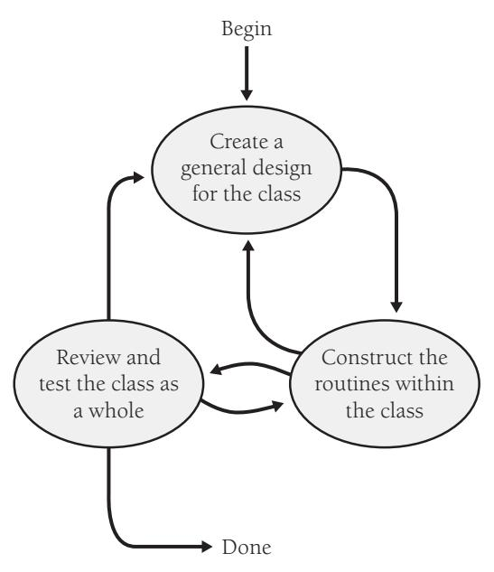
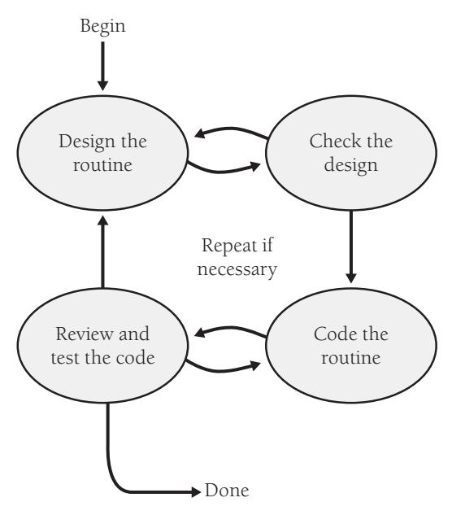
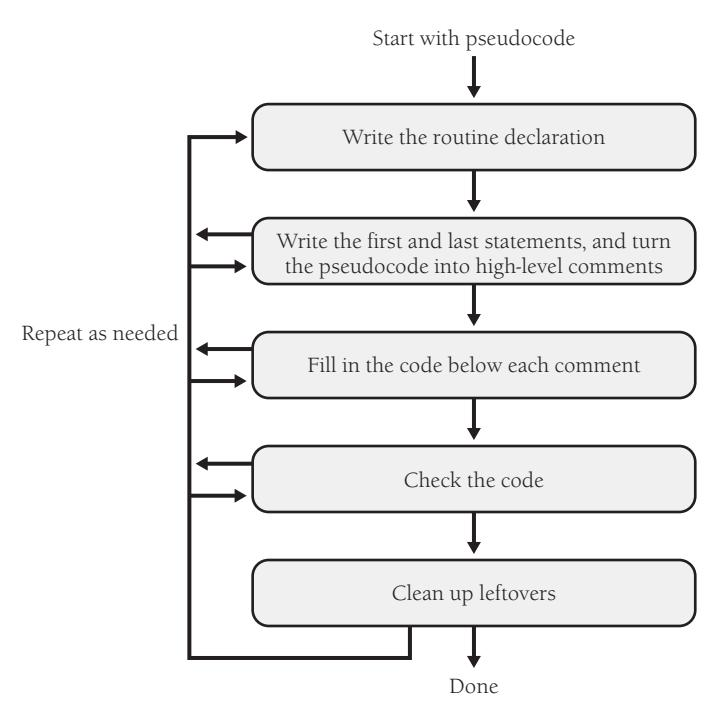
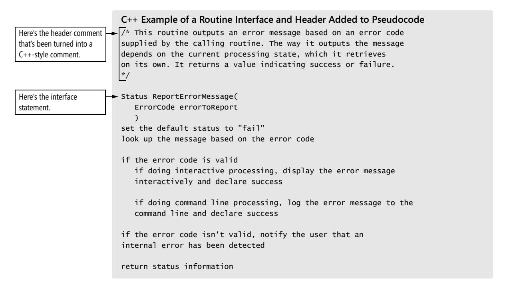

<span id="page-251-0"></span>
# Chapter 9: The Pseudocode Programming Process


### cc2e.com/0936 Contents

- 9.1 Summary of Steps in Building Classes and Routines: page 216
- 9.2 Pseudocode for Pros: page 218
- 9.3 Constructing Routines by Using the PPP: page 220
- 9.4 Alternatives to the PPP: page 232

#### Related Topics

- Creating high-quality classes: Chapter 6
- Characteristics of high-quality routines: Chapter 7
- Design in Construction: Chapter 5
- Commenting style: Chapter 32

Although you could view this whole book as an extended description of the programming process for creating classes and routines, this chapter puts the steps in context. This chapter focuses on programming in the small—on the specific steps for building an individual class and its routines, the steps that are critical on projects of all sizes. The chapter also describes the Pseudocode Programming Process (PPP), which reduces the work required during design and documentation and improves the quality of both.

If you're an expert programmer, you might just skim this chapter, but look at the summary of steps and review the tips for constructing routines using the Pseudocode Programming Process in Section 9.3. Few programmers exploit the full power of the process, and it offers many benefits.

The PPP is not the only procedure for creating classes and routines. Section 9.4, at the end of this chapter, describes the most popular alternatives, including test-first development and design by contract.

#### 9.1 Summary of Steps in Building Classes and Routines

Class construction can be approached from numerous directions, but usually it's an iterative process of creating a general design for the class, enumerating specific routines within the class, constructing specific routines, and checking class construction as a whole. As Figure 9-1 suggests, class creation can be a messy process for all the reasons that design is a messy process (reasons that are described in Section 5.1, "Design Challenges").



**Figure 9-1** Details of class construction vary, but the activities generally occur in the order shown here.

#### Steps in Creating a Class

The key steps in constructing a class are:

*Create a general design for the class* Class design includes numerous specific issues. Define the class's specific responsibilities, define what "secrets" the class will hide, and define exactly what abstraction the class interface will capture. Determine whether the class will be derived from another class and whether other classes will be allowed to derive from it. Identify the class's key public methods, and identify and design any nontrivial data members used by the class. Iterate through these topics as many times as needed to create a straightforward design for the routine. These considerations and many others are discussed in more detail in Chapter 6, "Working Classes."

*Construct each routine within the class* Once you've identified the class's major routines in the first step, you must construct each specific routine. Construction of each routine typically unearths the need for additional routines, both minor and major, and issues arising from creating those additional routines often ripple back to the overall class design.

*Review and test the class as a whole* Normally, each routine is tested as it's created. After the class as a whole becomes operational, the class as a whole should be reviewed and tested for any issues that can't be tested at the individual-routine level.

#### Steps in Building a Routine

Many of a class's routines will be simple and straightforward to implement: accessor routines, pass-throughs to other objects' routines, and the like. Implementation of other routines will be more complicated, and creation of those routines benefits from a systematic approach. The major activities involved in creating a routine—designing the routine, checking the design, coding the routine, and checking the code—are typically performed in the order shown in Figure 9-2.



**Figure 9-2** These are the major activities that go into constructing a routine. They're usually performed in the order shown.

Experts have developed numerous approaches to creating routines, and my favorite approach is the Pseudocode Programming Process, described in the next section.

#### 9.2 Pseudocode for Pros

The term "pseudocode" refers to an informal, English-like notation for describing how an algorithm, a routine, a class, or a program will work. The Pseudocode Programming Process defines a specific approach to using pseudocode to streamline the creation of code within routines.

Because pseudocode resembles English, it's natural to assume that any English-like description that collects your thoughts will have roughly the same effect as any other. In practice, you'll find that some styles of pseudocode are more useful than others. Here are guidelines for using pseudocode effectively:

- Use English-like statements that precisely describe specific operations.
- Avoid syntactic elements from the target programming language. Pseudocode allows you to design at a slightly higher level than the code itself. When you use programming-language constructs, you sink to a lower level, eliminating the main benefit of design at a higher level, and you saddle yourself with unnecessary syntactic restrictions.

■ Write pseudocode at the level of intent. Describe the meaning of the approach rather than how the approach will be implemented in the target language.

■ Write pseudocode at a low enough level that generating code from it will be nearly automatic. If the pseudocode is at too high a level, it can gloss over problematic details in the code. Refine the pseudocode in more and more detail until it seems as if it would be easier to simply write the code.

Once the pseudocode is written, you build the code around it and the pseudocode turns into programming-language comments. This eliminates most commenting effort. If the pseudocode follows the guidelines, the comments will be complete and meaningful.

Here's an example of a design in pseudocode that violates virtually all the principles just described:


#### Example of Bad Pseudocode

increment resource number by 1 allocate a dlg struct using malloc if malloc() returns NULL then return 1 invoke OSrsrc\_init to initialize a resource for the operating system \*hRsrcPtr = resource number return 0

What is the intent of this block of pseudocode? Because it's poorly written, it's hard to tell. This so-called pseudocode is bad because it includes target language coding details, such as *\*hRsrcPtr* (in specific C-language pointer notation) and *malloc()* (a spe-

**Cross-Reference** For details on commenting at the level of intent, see "Kinds of Comments" in Section 32.4.

cific C-language function). This pseudocode block focuses on how the code will be written rather than on the meaning of the design. It gets into coding details—whether the routine returns a *1* or a *0*. If you think about this pseudocode from the standpoint of whether it will turn into good comments, you'll begin to understand that it isn't much help.

Here's a design for the same operation in a much-improved pseudocode:

```
Example of Good Pseudocode
Keep track of current number of resources in use
If another resource is available
 Allocate a dialog box structure
 If a dialog box structure could be allocated
 Note that one more resource is in use
 Initialize the resource
 Store the resource number at the location provided by the caller
 Endif
Endif
Return true if a new resource was created; else return false
```

This pseudocode is better than the first because it's written entirely in English; it doesn't use any syntactic elements of the target language. In the first example, the pseudocode could have been implemented only in C. In the second example, the pseudocode doesn't restrict the choice of languages. The second block of pseudocode is also written at the level of intent. What does the second block of pseudocode mean? It is probably easier for you to understand than the first block.

Even though it's written in clear English, the second block of pseudocode is precise and detailed enough that it can easily be used as a basis for programming-language code. When the pseudocode statements are converted to comments, they'll be a good explanation of the code's intent.

Here are the benefits you can expect from using this style of pseudocode:

- Pseudocode makes reviews easier. You can review detailed designs without examining source code. Pseudocode makes low-level design reviews easier and reduces the need to review the code itself.
- Pseudocode supports the idea of iterative refinement. You start with a high-level design, refine the design to pseudocode, and then refine the pseudocode to source code. This successive refinement in small steps allows you to check your design as you drive it to lower levels of detail. The result is that you catch highlevel errors at the highest level, mid-level errors at the middle level, and low-level errors at the lowest level—before any of them becomes a problem or contaminates work at more detailed levels.

**Further Reading** For more information on the advantages of making changes at the least-value stage, see Andy Grove's *High Output Management* (Grove 1983).

- Pseudocode makes changes easier. A few lines of pseudocode are easier to change than a page of code. Would you rather change a line on a blueprint or rip out a wall and nail in the two-by-fours somewhere else? The effects aren't as physically dramatic in software, but the principle of changing the product when it's most malleable is the same. One of the keys to the success of a project is to catch errors at the "least-value stage," the stage at which the least effort has been invested. Much less has been invested at the pseudocode stage than after full coding, testing, and debugging, so it makes economic sense to catch the errors early.
- Pseudocode minimizes commenting effort. In the typical coding scenario, you write the code and add comments afterward. In the PPP, the pseudocode statements become the comments, so it actually takes more work to remove the comments than to leave them in.
- Pseudocode is easier to maintain than other forms of design documentation. With other approaches, design is separated from the code, and when one changes, the two fall out of agreement. With the PPP, the pseudocode statements become comments in the code. As long as the inline comments are maintained, the pseudocode's documentation of the design will be accurate.


As a tool for detailed design, pseudocode is hard to beat. One survey found that programmers prefer pseudocode for the way it eases construction in a programming language, for its ability to help them detect insufficiently detailed designs, and for the ease of documentation and ease of modification it provides (Ramsey, Atwood, and Van Doren 1983). Pseudocode isn't the only tool for detailed design, but pseudocode and the PPP are useful tools to have in your programmer's toolbox. Try them. The next section shows you how.

#### 9.3 Constructing Routines by Using the PPP

This section describes the activities involved in constructing a routine, namely these:

- Design the routine.
- Code the routine.
- Check the code.
- Clean up loose ends.
- Repeat as needed.

#### Design the Routine

**Cross-Reference** For details on other aspects of design, see Chapters 5 through 8.

Once you've identified a class's routines, the first step in constructing any of the class's more complicated routines is to design it. Suppose that you want to write a routine to

output an error message depending on an error code, and suppose that you call the routine *ReportErrorMessage()*. Here's an informal spec for *ReportErrorMessage()*:

ReportErrorMessage() *takes an error code as an input argument and outputs an error message corresponding to the code. It's responsible for handling invalid codes. If the program is operating interactively,* ReportErrorMessage() *displays the message to the user. If it's operating in command-line mode,*  ReportErrorMessage() *logs the message to a message file. After outputting the message,* ReportErrorMessage() *returns a status value, indicating whether it succeeded or failed.*

The rest of the chapter uses this routine as a running example. The rest of this section describes how to design the routine.

**Cross-Reference** For details on checking prerequisites, see Chapter 3, "Measure Twice, Cut Once: Upstream Prerequisites," and Chapter 4, "Key Construction Decisions."

*Check the prerequisites* Before doing any work on the routine itself, check to see that the job of the routine is well defined and fits cleanly into the overall design. Check to be sure that the routine is actually called for, at the very least indirectly, by the project's requirements.

*Define the problem the routine will solve* State the problem the routine will solve in enough detail to allow creation of the routine. If the high-level design is sufficiently detailed, the job might already be done. The high-level design should at least indicate the following:

- The information the routine will hide
- Inputs to the routine
- Outputs from the routine
- Preconditions that are guaranteed to be true before the routine is called (input values within certain ranges, streams initialized, files opened or closed, buffers filled or flushed, etc.)
- Postconditions that the routine guarantees will be true before it passes control back to the caller (output values within specified ranges, streams initialized, files opened or closed, buffers filled or flushed, etc.)

Here's how these concerns are addressed in the *ReportErrorMessage()* example:

- The routine hides two facts: the error message text and the current processing method (interactive or command line).
- There are no preconditions guaranteed to the routine.
- The input to the routine is an error code.
- Two kinds of output are called for: the first is the error message, and the second is the status that *ReportErrorMessage()* returns to the calling routine.
- The routine guarantees that the status value will have a value of either *Success* or *Failure*.

**Cross-Reference** For details on preconditions and postconditions, see "Use assertions to document and verify preconditions and postconditions" in Section 8.2.

**Cross-Reference** For details on naming routines, see Section 7.3, "Good Routine Names."

*Name the routine* Naming the routine might seem trivial, but good routine names are one sign of a superior program and they're not easy to come up with. In general, a routine should have a clear, unambiguous name. If you have trouble creating a good name, that usually indicates that the purpose of the routine isn't clear. A vague, wishywashy name is like a politician on the campaign trail. It sounds as if it's saying something, but when you take a hard look, you can't figure out what it means. If you can make the name clearer, do so. If the wishy-washy name results from a wishy-washy design, pay attention to the warning sign. Back up and improve the design.

In the example, *ReportErrorMessage()* is unambiguous. It is a good name.

**Further Reading** For a different approach to construction that focuses on writing test cases first, see *Test-Driven Development: By Example* (Beck 2003).

*Decide how to test the routine* As you're writing the routine, think about how you can test it. This is useful for you when you do unit testing and for the tester who tests your routine independently.

In the example, the input is simple, so you might plan to test *ReportErrorMessage()* with all valid error codes and a variety of invalid codes.

*Research functionality available in the standard libraries* The single biggest way to improve both the quality of your code and your productivity is to reuse good code. If you find yourself grappling to design a routine that seems overly complicated, ask whether some or all of the routine's functionality might already be available in the library code of the language, platform, or tools you're using. Ask whether the code might be available in library code maintained by your company. Many algorithms have already been invented, tested, discussed in the trade literature, reviewed, and improved. Rather than spending your time inventing something when someone has already written a Ph.D. dissertation on it, take a few minutes to look through the code that's already been written and make sure you're not doing more work than necessary.

*Think about error handling* Think about all the things that could possibly go wrong in the routine. Think about bad input values, invalid values returned from other routines, and so on.

Routines can handle errors numerous ways, and you should choose consciously how to handle errors. If the program's architecture defines the program's error-handling strategy, you can simply plan to follow that strategy. In other cases, you have to decide what approach will work best for the specific routine.

*Think about efficiency* Depending on your situation, you can address efficiency in one of two ways. In the first situation, in the vast majority of systems, efficiency isn't critical. In such a case, see that the routine's interface is well abstracted and its code is readable so that you can improve it later if you need to. If you have good encapsulation, you can replace a slow, resource-hogging, high-level language implementation with a better algorithm or a fast, lean, low-level language implementation, and you won't affect any other routines.

**Cross-Reference** For details on efficiency, see Chapter 25, "Code-Tuning Strategies," and Chapter 26, "Code-Tuning Techniques."

In the second situation—in the minority of systems—performance is critical. The performance issue might be related to scarce database connections, limited memory, few available handles, ambitious timing constraints, or some other scarce resource. The architecture should indicate how many resources each routine (or class) is allowed to use and how fast it should perform its operations.

Design your routine so that it will meet its resource and speed goals. If either resources or speed seems more critical, design so that you trade resources for speed or vice versa. It's acceptable during initial construction of the routine to tune it enough to meet its resource and speed budgets.

Aside from taking the approaches suggested for these two general situations, it's usually a waste of effort to work on efficiency at the level of individual routines. The big optimizations come from refining the high-level design, not the individual routines. You generally use micro-optimizations only when the high-level design turns out not to support the system's performance goals, and you won't know that until the whole program is done. Don't waste time scraping for incremental improvements until you know they're needed.

*Research the algorithms and data types* If functionality isn't available in the available libraries, it might still be described in an algorithms book. Before you launch into writing complicated code from scratch, check an algorithms book to see what's already available. If you use a predefined algorithm, be sure to adapt it correctly to your programming language.

*Write the pseudocode* You might not have much in writing after you finish the preceding steps. The main purpose of the steps is to establish a mental orientation that's useful when you actually write the routine.

**Cross-Reference** This discussion assumes that good design techniques are used to create the pseudocode version of the routine. For details on design, see Chapter 5, "Design in Construction."

With the preliminary steps completed, you can begin to write the routine as high-level pseudocode. Go ahead and use your programming editor or your integrated environment to write the pseudocode—the pseudocode will be used shortly as the basis for programming-language code.

Start with the general and work toward something more specific. The most general part of a routine is a header comment describing what the routine is supposed to do, so first write a concise statement of the purpose of the routine. Writing the statement will help you clarify your understanding of the routine. Trouble in writing the general comment is a warning that you need to understand the routine's role in the program better. In general, if it's hard to summarize the routine's role, you should probably assume that something is wrong. Here's an example of a concise header comment describing a routine:

#### Example of a Header Comment for a Routine

This routine outputs an error message based on an error code supplied by the calling routine. The way it outputs the message depends on the current processing state, which it retrieves on its own. It returns a value indicating success or failure.

After you've written the general comment, fill in high-level pseudocode for the routine. Here's the pseudocode for this example:

#### Example of Pseudocode for a Routine

This routine outputs an error message based on an error code supplied by the calling routine. The way it outputs the message depends on the current processing state, which it retrieves on its own. It returns a value indicating success or failure.

set the default status to "fail" look up the message based on the error code

if the error code is valid if doing interactive processing, display the error message interactively and declare success

 if doing command line processing, log the error message to the command line and declare success

if the error code isn't valid, notify the user that an internal error has been detected

return status information

Again, note that the pseudocode is written at a fairly high level. It certainly isn't written in a programming language. Instead, it expresses in precise English what the routine needs to do.

**Cross-Reference** For details on effective use of variables, see Chapters 10 through 13.

*Think about the data* You can design the routine's data at several different points in the process. In this example, the data is simple and data manipulation isn't a prominent part of the routine. If data manipulation is a prominent part of the routine, it's worthwhile to think about the major pieces of data before you think about the routine's logic. Definitions of key data types are useful to have when you design the logic of a routine.

**Cross-Reference** For details on review techniques, see Chapter 21, "Collaborative Construction."

*Check the pseudocode* Once you've written the pseudocode and designed the data, take a minute to review the pseudocode you've written. Back away from it, and think about how you would explain it to someone else.

Ask someone else to look at it or listen to you explain it. You might think that it's silly to have someone look at 11 lines of pseudocode, but you'll be surprised. Pseudocode can make your assumptions and high-level mistakes more obvious than programming-language code does. People are also more willing to review a few lines of pseudocode than they are to review 35 lines of C++ or Java.

Make sure you have an easy and comfortable understanding of what the routine does and how it does it. If you don't understand it conceptually, at the pseudocode level, what chance do you have of understanding it at the programming-language level? And if you don't understand it, who else will?

**Cross-Reference** For more on iteration, see Section 34.8, "Iterate, Repeatedly, Again and Again."

*Try a few ideas in pseudocode, and keep the best (iterate)* Try as many ideas as you can in pseudocode before you start coding. Once you start coding, you get emotionally involved with your code and it becomes harder to throw away a bad design and start over.

The general idea is to iterate the routine in pseudocode until the pseudocode statements become simple enough that you can fill in code below each statement and leave the original pseudocode as documentation. Some of the pseudocode from your first attempt might be high-level enough that you need to decompose it further. Be sure you do decompose it further. If you're not sure how to code something, keep working with the pseudocode until you are sure. Keep refining and decomposing the pseudocode until it seems like a waste of time to write it instead of the actual code.

#### Code the Routine

Once you've designed the routine, construct it. You can perform construction steps in a nearly standard order, but feel free to vary them as you need to. Figure 9-3 shows the steps in constructing a routine.



**Figure 9-3** You'll perform all of these steps as you design a routine but not necessarily in any particular order.

*Write the routine declaration* Write the routine interface statement—the function declaration in C++, method declaration in Java, function or sub procedure declaration in Microsoft Visual Basic, or whatever your language calls for. Turn the original header comment into a programming-language comment. Leave it in position above the pseudocode you've already written. Here are the example routine's interface statement and header in C++:



This is a good time to make notes about any interface assumptions. In this case, the interface variable *errorToReport* is straightforward and typed for its specific purpose, so it doesn't need to be documented.

*Turn the pseudocode into high-level comments* Keep the ball rolling by writing the first and last statements: *{* and *}* in C++. Then turn the pseudocode into comments. Here's how it would look in the example:

```
C++ Example of Writing the First and Last Statements Around Pseudocode 
/* This routine outputs an error message based on an error code
supplied by the calling routine. The way it outputs the message
depends on the current processing state, which it retrieves
on its own. It returns a value indicating success or failure.
*/
Status ReportErrorMessage(
 ErrorCode errorToReport
 ) {
```

```
The pseudocode statements 
from here down have been 
turned into C++ comments.
                       // set the default status to "fail"
                       // look up the message based on the error code
                       // if the error code is valid
                       // if doing interactive processing, display the error message 
                       // interactively and declare success
                       // if doing command line processing, log the error message to the 
                       // command line and declare success
                       // if the error code isn't valid, notify the user that an 
                       // internal error has been detected
                       // return status information
                      }
```

At this point, the character of the routine is evident. The design work is complete, and you can sense how the routine works even without seeing any code. You should feel that converting the pseudocode to programming-language code will be mechanical, natural, and easy. If you don't, continue designing in pseudocode until the design feels solid.

**Cross-Reference** This is a case where the writing metaphor works well—in the small. For criticism of applying the writing metaphor in the large, see "Software Penmanship: Writing Code" in Section 2.3.

*Fill in the code below each comment* Fill in the code below each line of pseudocode comment. The process is a lot like writing a term paper. First you write an outline, and then you write a paragraph for each point in the outline. Each pseudocode comment describes a block or paragraph of code. Like the lengths of literary paragraphs, the lengths of code paragraphs vary according to the thought being expressed, and the quality of the paragraphs depends on the vividness and focus of the thoughts in them.

In this example, the first two pseudocode comments give rise to two lines of code:

```
C++ Example of Expressing Pseudocode Comments as Code
                       /* This routine outputs an error message based on an error code
                       supplied by the calling routine. The way it outputs the message
                       depends on the current processing state, which it retrieves
                       on its own. It returns a value indicating success or failure.
                       */
                       Status ReportErrorMessage(
                        ErrorCode errorToReport
                        ) {
                        // set the default status to "fail"
Here's the code that's been 
filled in.
                          Status errorMessageStatus = Status_Failure;
                        // look up the message based on the error code
Here's the new variable 
errorMessage.
                        Message errorMessage = LookupErrorMessage( errorToReport );
                        // if the error code is valid
                        // if doing interactive processing, display the error message 
                        // interactively and declare success
                        // if doing command line processing, log the error message to the 
                        // command line and declare success
```

down.

*Message()*.

```
 // if the error code isn't valid, notify the user that an 
 // internal error has been detected
 // return status information
}
```

This is a start on the code. The variable *errorMessage* is used, so it needs to be declared. If you were commenting after the fact, two lines of comments for two lines of code would nearly always be overkill. In this approach, however, it's the semantic content of the comments that's important, not how many lines of code they comment. The comments are already there, and they explain the intent of the code, so leave them in.

The code below each of the remaining comments needs to be filled in:

```
C++ Example of a Complete Routine Created with the Pseudocode 
                      Programming Process
                      /* This routine outputs an error message based on an error code
                      supplied by the calling routine. The way it outputs the message
                      depends on the current processing state, which it retrieves
                      on its own. It returns a value indicating success or failure. 
                      */
                      Status ReportErrorMessage(
                       ErrorCode errorToReport
                       ) {
                       // set the default status to "fail"
                       Status errorMessageStatus = Status_Failure;
                       // look up the message based on the error code
                       Message errorMessage = LookupErrorMessage( errorToReport );
                       // if the error code is valid
The code for each comment 
has been filled in from here 
                        if ( errorMessage.ValidCode() ) {
                       // determine the processing method
                       ProcessingMethod errorProcessingMethod = CurrentProcessingMethod();
                       // if doing interactive processing, display the error message 
                       // interactively and declare success
                       if ( errorProcessingMethod == ProcessingMethod_Interactive ) {
                       DisplayInteractiveMessage( errorMessage.Text() );
                       errorMessageStatus = Status_Success;
                       }
                       // if doing command line processing, log the error message to the 
                       // command line and declare success
This code is a good candidate 
for being further decom-
posed into a new routine: 
DisplayCommandLine-
                       else if ( errorProcessingMethod == ProcessingMethod_CommandLine ) {
                       CommandLine messageLog;
                       if ( messageLog.Status() == CommandLineStatus_Ok ) { 
                       messageLog.AddToMessageQueue( errorMessage.Text() );
                       messageLog.FlushMessageQueue();
                       errorMessageStatus = Status_Success;
                       }
```

```
This code and comment are 
new and are the result of 
fleshing out the if test. 
                       else {
                       // can't do anything because the routine is already error processing
                       }
This code and comment are 
also new. 
                       else {
                       // can't do anything because the routine is already error processing
                       }
                       }
                       // if the error code isn't valid, notify the user that an 
                       // internal error has been detected
                       else {
                       DisplayInteractiveMessage( 
                       "Internal Error: Invalid error code in ReportErrorMessage()" 
                       );
                       }
                       // return status information
                       return errorMessageStatus;
                      }
```

Each comment has given rise to one or more lines of code. Each block of code forms a complete thought based on the comment. The comments have been retained to provide a higher-level explanation of the code. All variables have been declared and defined close to the point they're first used. Each comment should normally expand to about 2 to 10 lines of code. (Because this example is just for purposes of illustration, the code expansion is on the low side of what you should usually experience in practice.)

Now look again at the spec on page 221 and the initial pseudocode on page 224. The original five-sentence spec expanded to 15 lines of pseudocode (depending on how you count the lines), which in turn expanded into a page-long routine. Even though the spec was detailed, creation of the routine required substantial design work in pseudocode and code. That low-level design is one reason why "coding" is a nontrivial task and why the subject of this book is important.

*Check whether code should be further factored* In some cases, you'll see an explosion of code below one of the initial lines of pseudocode. In this case, you should consider taking one of two courses of action:

**Cross-Reference** For more on refactoring, see Chapter 24, "Refactoring."

- Factor the code below the comment into a new routine. If you find one line of pseudocode expanding into more code that than you expected, factor the code into its own routine. Write the code to call the routine, including the routine name. If you've used the PPP well, the name of the new routine should drop out easily from the pseudocode. Once you've completed the routine you were originally creating, you can dive into the new routine and apply the PPP again to that routine.
- Apply the PPP recursively. Rather than writing a couple dozen lines of code below one line of pseudocode, take the time to decompose the original line of pseudocode into several more lines of pseudocode. Then continue filling in the code below each of the new lines of pseudocode.

#### Check the Code

After designing and implementing the routine, the third big step in constructing it is checking to be sure that what you've constructed is correct. Any errors you miss at this stage won't be found until later testing. They're more expensive to find and correct then, so you should find all that you can at this stage.

**Cross-Reference** For details on checking for errors in architecture and requirements, see Chapter 3, "Measure Twice, Cut Once: Upstream Prerequisites."

A problem might not appear until the routine is fully coded for several reasons. An error in the pseudocode might become more apparent in the detailed implementation logic. A design that looks elegant in pseudocode might become clumsy in the implementation language. Working with the detailed implementation might disclose an error in the architecture, high-level design, or requirements. Finally, the code might have an old-fashioned, mongrel coding error—nobody's perfect! For all these reasons, review the code before you move on.

*Mentally check the routine for errors* The first formal check of a routine is mental. The cleanup and informal checking steps mentioned earlier are two kinds of mental checks. Another is executing each path mentally. Mentally executing a routine is difficult, and that difficulty is one reason to keep your routines small. Make sure that you check nominal paths and endpoints and all exception conditions. Do this both by yourself, which is called "desk checking," and with one or more peers, which is called a "peer review," a "walk-through," or an "inspection," depending on how you do it.


One of the biggest differences between hobbyists and professional programmers is the difference that grows out of moving from superstition into understanding. The word "superstition" in this context doesn't refer to a program that gives you the creeps or generates extra errors when the moon is full. It means substituting feelings about the code for understanding. If you often find yourself suspecting that the compiler or the hardware made an error, you're still in the realm of superstition. A study conducted many years ago found that only about five percent of all errors are hardware, compiler, or operating-system errors (Ostrand and Weyuker 1984). Today, that percentage would probably be even lower. Programmers who have moved into the realm of understanding always suspect their own work first because they know that they cause 95 percent of errors. Understand the role of each line of code and why it's needed. Nothing is ever right just because it seems to work. If you don't know why it works, it probably doesn't—you just don't know it yet.


Bottom line: A working routine isn't enough. If you don't know why it works, study it, discuss it, and experiment with alternative designs until you do.

KEY POINT

*Compile the routine* After reviewing the routine, compile it. It might seem inefficient to wait this long to compile since the code was completed several pages ago. Admittedly, you might have saved some work by compiling the routine earlier and letting the computer check for undeclared variables, naming conflicts, and so on.

You'll benefit in several ways, however, by not compiling until late in the process. The main reason is that when you compile new code, an internal stopwatch starts ticking. After the first compile, you step up the pressure: "I'll get it right with just one more compile." The "Just One More Compile" syndrome leads to hasty, error-prone changes that take more time in the long run. Avoid the rush to completion by not compiling until you've convinced yourself that the routine is right.

The point of this book is to show how to rise above the cycle of hacking something together and running it to see if it works. Compiling before you're sure your program works is often a symptom of the hacker mindset. If you're not caught in the hacking-and-compiling cycle, compile when you feel it's appropriate. But be conscious of the tug most people feel toward "hacking, compiling, and fixing" their way to a working program.

Here are some guidelines for getting the most out of compiling your routine:

- Set the compiler's warning level to the pickiest level possible. You can catch an amazing number of subtle errors simply by allowing the compiler to detect them.
- Use validators. The compiler checking performed by languages like C can be supplemented by use of tools like lint. Even code that isn't compiled, such as HTML and JavaScript, can be checked by validation tools.
- Eliminate the causes of all error messages and warnings. Pay attention to what the messages tell you about your code. A large number of warnings often indicates low-quality code, and you should try to understand each warning you get. In practice, warnings you've seen again and again have one of two possible effects: you ignore them and they camouflage other, more important, warnings, or they simply become annoying. It's usually safer and less painful to rewrite the code to solve the underlying problem and eliminate the warnings.

*Step through the code in the debugger* Once the routine compiles, put it into the debugger and step through each line of code. Make sure each line executes as you expect it to. You can find many errors by following this simple practice.

*Test the code* Test the code using the test cases you planned or created while you were developing the routine. You might have to develop scaffolding to support your test cases—that is, code that's used to support routines while they're tested and that isn't included in the final product. Scaffolding can be a test-harness routine that calls your routine with test data, or it can be stubs called by your routine.

**Cross-Reference** For details, see Chapter 22, "Developer Testing." Also see "Building Scaffolding to Test Individual Classes" in Section 22.5.

**Cross-Reference** For details, see Chapter 23, "Debugging." *Remove errors from the routine* Once an error has been detected, it has to be removed. If the routine you're developing is buggy at this point, chances are good that it will stay buggy. If you find that a routine is unusually buggy, start over. Don't hack around it—rewrite it. Hacks usually indicate incomplete understanding and guarantee errors both now and later. Creating an entirely new design for a buggy routine pays off. Few things are more satisfying than rewriting a problematic routine and never finding another error in it.

#### Clean Up Leftovers

When you've finished checking your code for problems, check it for the general characteristics described throughout this book. You can take several cleanup steps to make sure that the routine's quality is up to your standards:

- Check the routine's interface. Make sure that all input and output data is accounted for and that all parameters are used. For more details, see Section 7.5, "How to Use Routine Parameters."
- Check for general design quality. Make sure the routine does one thing and does it well, that it's loosely coupled to other routines, and that it's designed defensively. For details, see Chapter 7, "High-Quality Routines."
- Check the routine's variables. Check for inaccurate variable names, unused objects, undeclared variables, improperly initialized objects, and so on. For details, see the chapters on using variables, Chapters 10 through 13.
- Check the routine's statements and logic. Check for off-by-one errors, infinite loops, improper nesting, and resource leaks. For details, see the chapters on statements, Chapters 14 through 19.
- Check the routine's layout. Make sure you've used white space to clarify the logical structure of the routine, expressions, and parameter lists. For details, see Chapter 31, "Layout and Style."
- Check the routine's documentation. Make sure the pseudocode that was translated into comments is still accurate. Check for algorithm descriptions, for documentation on interface assumptions and nonobvious dependencies, for justification of unclear coding practices, and so on. For details, see Chapter 32, "Self-Documenting Code."
- Remove redundant comments. Sometimes a pseudocode comment turns out to be redundant with the code the comment describes, especially when the PPP has been applied recursively and the comment just precedes a call to a well-named routine.

#### Repeat Steps as Needed

If the quality of the routine is poor, back up to the pseudocode. High-quality programming is an iterative process, so don't hesitate to loop through the construction activities again.

### 9.4 Alternatives to the PPP

For my money, the PPP is the best method for creating classes and routines. Here are some different approaches recommended by other experts. You can use these approaches as alternatives or as supplements to the PPP.

*Test-first development* Test-first is a popular development style in which test cases are written prior to writing any code. This approach is described in more detail in "Test First or Test Last?" in Section 22.2. A good book on test-first programming is Kent Beck's *Test-Driven Development: By Example* (Beck 2003).

*Refactoring* Refactoring is a development approach in which you improve code through a series of semantic preserving transformations. Programmers use patterns of bad code or "smells" to identify sections of code that need to be improved. Chapter 24, "Refactoring," describes this approach in detail, and a good book on the topic is Martin Fowler's *Refactoring: Improving the Design of Existing Code* (Fowler 1999).

*Design by contract* Design by contract is a development approach in which each routine is considered to have preconditions and postconditions. This approach is described in "Use assertions to document and verify preconditions and postconditions" in Section 8.2. The best source of information on design by contract is Bertrand Meyers's *Object-Oriented Software Construction* (Meyer 1997).

*Hacking?* Some programmers try to hack their way toward working code rather than using a systematic approach like the PPP. If you've ever found that you've coded yourself into a corner in a routine and have to start over, that's an indication that the PPP might work better. If you find yourself losing your train of thought in the middle of coding a routine, that's another indication that the PPP would be beneficial. Have you ever simply forgotten to write part of a class or part of routine? That hardly ever happens if you're using the PPP. If you find yourself staring at the computer screen not knowing where to start, that's a surefire sign that the PPP would make your programming life easier.

**Cross-Reference** The point of this list is to check whether you followed a good set of steps to create a routine. For a checklist that focuses on the quality of the routine itself, see the "High-Quality Routines" checklist in Chapter 7, page 185.

#### cc2e.com/0943 CHECKLIST: The Pseudocode Programming Process

- ❑ Have you checked that the prerequisites have been satisfied?
- ❑ Have you defined the problem that the class will solve?
- ❑ Is the high-level design clear enough to give the class and each of its routines a good name?
- ❑ Have you thought about how to test the class and each of its routines?
- ❑ Have you thought about efficiency mainly in terms of stable interfaces and readable implementations or mainly in terms of meeting resource and speed budgets?
- ❑ Have you checked the standard libraries and other code libraries for applicable routines or components?
- ❑ Have you checked reference books for helpful algorithms?

- ❑ Have you designed each routine by using detailed pseudocode?
- ❑ Have you mentally checked the pseudocode? Is it easy to understand?
- ❑ Have you paid attention to warnings that would send you back to design (use of global data, operations that seem better suited to another class or another routine, and so on)?
- ❑ Did you translate the pseudocode to code accurately?
- ❑ Did you apply the PPP recursively, breaking routines into smaller routines when needed?
- ❑ Did you document assumptions as you made them?
- ❑ Did you remove comments that turned out to be redundant?
- ❑ Have you chosen the best of several iterations, rather than merely stopping after your first iteration?
- ❑ Do you thoroughly understand your code? Is it easy to understand?

#### Key Points

- Constructing classes and constructing routines tends to be an iterative process. Insights gained while constructing specific routines tend to ripple back through the class's design.
- Writing good pseudocode calls for using understandable English, avoiding features specific to a single programming language, and writing at the level of intent (describing what the design does rather than how it will do it).
- The Pseudocode Programming Process is a useful tool for detailed design and makes coding easy. Pseudocode translates directly into comments, ensuring that the comments are accurate and useful.
- Don't settle for the first design you think of. Iterate through multiple approaches in pseudocode and pick the best approach before you begin writing code.
- Check your work at each step, and encourage others to check it too. That way, you'll catch mistakes at the least expensive level, when you've invested the least amount of effort.
