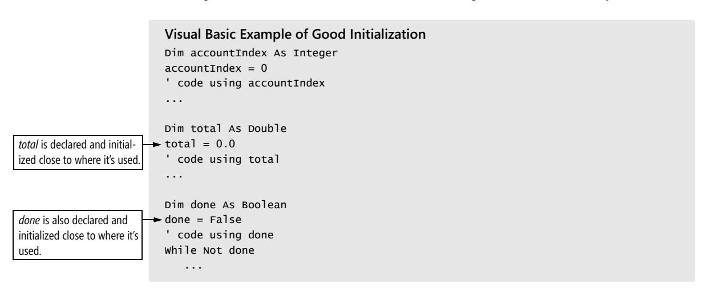
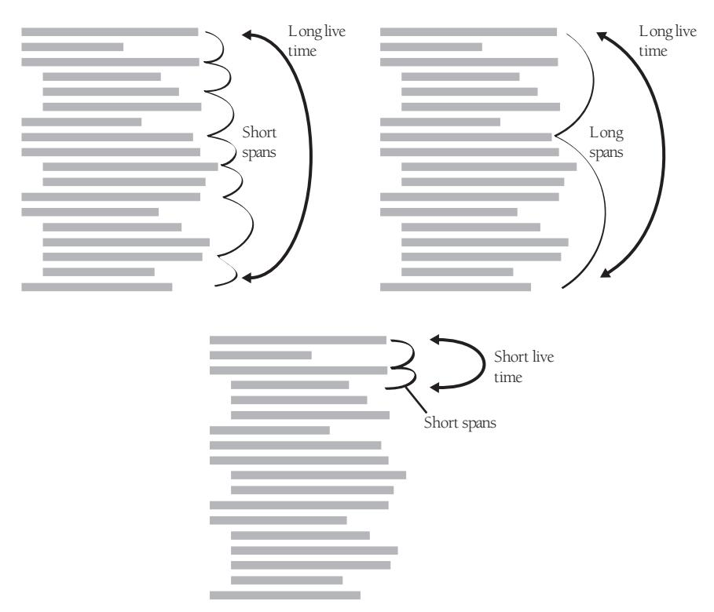
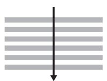
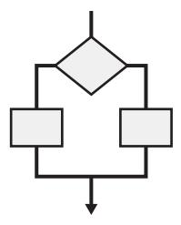
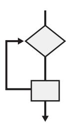
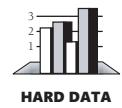

<span id="page-273-0"></span>
# Chapter 10: General Issues in Using Variables


### cc2e.com/1085 Contents

- 10.1 Data Literacy: page 238
- 10.2 Making Variable Declarations Easy: page 239
- 10.3 Guidelines for Initializing Variables: page 240
- 10.4 Scope: page 244
- 10.5 Persistence: page 251
- 10.6 Binding Time: page 252
- 10.7 Relationship Between Data Types and Control Structures: page 254
- 10.8 Using Each Variable for Exactly One Purpose: page 255

#### Related Topics

- Naming variables: Chapter 11
- Fundamental data types: Chapter 12
- Unusual data types: Chapter 13
- Formatting data declarations: "Laying Out Data Declarations" in Section 31.5
- Documenting variables: "Commenting Data Declarations" in Section 32.5

It's normal and desirable for construction to fill in small gaps in the requirements and architecture. It would be inefficient to draw blueprints to such a microscopic level that every detail was completely specified. This chapter describes a nuts-and-bolts construction issue: the ins and outs of using variables.

The information in this chapter should be particularly valuable to you if you're an experienced programmer. It's easy to start using hazardous practices before you're fully aware of your alternatives and then to continue to use them out of habit even after you've learned ways to avoid them. An experienced programmer might find the discussions on binding time in Section 10.6 and on using each variable for one purpose in Section 10.8 particularly interesting. If you're not sure whether you qualify as an "experienced programmer," take the "Data Literacy Test" in the next section and find out.

Throughout this chapter I use the word "variable" to refer to objects as well as to builtin data types like integers and arrays. The phrase "data type" generally refers to builtin data types, while the word "data" refers to either objects or built-in types.

#### 10.1 Data Literacy


The first step in creating effective data is knowing which kind of data to create. A good repertoire of data types is a key part of a programmer's toolbox. A tutorial in data types is beyond the scope of this book, but the "Data Literacy Test" will help you determine how much more you might need to learn about them.

#### The Data Literacy Test

Put a *1* next to each term that looks familiar. If you think you know what a term means but aren't sure, give yourself a *0.5*. Add the points when you're done, and interpret your score according to the scoring table below.

| abstract data type | literal               |
|--------------------|-----------------------|
| array              | local variable        |
| bitmap             | lookup table          |
| boolean variable   | member data           |
| B-tree             | pointer               |
| character variable | private               |
| container class    | retroactive synapse   |
| double precision   | referential integrity |
| elongated stream   | stack                 |
| enumerated type    | string                |
| floating point     | structured variable   |
| heap               | tree                  |
| index              | typedef               |
| integer            | union                 |
| linked list        | value chain           |
| named constant     | variant               |
|                    | Total Score           |
|                    |                       |

Here is how you can interpret the scores (loosely):

| 0–14  | You are a beginning programmer, probably in your first year of computer sci<br>ence in school or teaching yourself your first programming language. You can<br>learn a lot by reading one of the books listed in the next subsection. Many of<br>the descriptions of techniques in this part of the book are addressed to<br>advanced programmers, and you'll get more out of them after you've read<br>one of these books. |
|-------|-----------------------------------------------------------------------------------------------------------------------------------------------------------------------------------------------------------------------------------------------------------------------------------------------------------------------------------------------------------------------------------------------------------------------------|
| 15–19 | You are an intermediate programmer or an experienced programmer who has<br>forgotten a lot. Although many of the concepts will be familiar to you, you<br>too can benefit from reading one of the books listed below.                                                                                                                                                                                                       |
| 20–24 | You are an expert programmer. You probably already have the books listed<br>below on your shelf.                                                                                                                                                                                                                                                                                                                            |
| 25–29 | You know more about data types than I do. Consider writing your own com<br>puter book. (Send me a copy!)                                                                                                                                                                                                                                                                                                                    |
| 30–32 | You are a pompous fraud. The terms "elongated stream," "retroactive syn<br>apse," and "value chain" don't refer to data types—I made them up. Please                                                                                                                                                                                                                                                                        |

#### Additional Resources on Data Types

These books are good sources of information about data types:

Cormen, H. Thomas, Charles E. Leiserson, Ronald L. Rivest. *Introduction to Algorithms*. New York, NY: McGraw Hill. 1990.

read the "Intellectual Honesty" section in Chapter 33, "Personal Character"!

Sedgewick, Robert. *Algorithms in C++, Parts 1-4*, 3d ed. Boston, MA: Addison-Wesley, 1998.

Sedgewick, Robert. *Algorithms in C++, Part 5*, 3d ed. Boston, MA: Addison-Wesley, 2002.

#### 10.2 Making Variable Declarations Easy

**Cross-Reference** For details on layout of variable declarations, see "Laying Out Data Declarations" in Section 31.5. For details on documenting them, see "Commenting Data Declarations" in Section 32.5.

This section describes what you can do to streamline the task of declaring variables. To be sure, this is a small task, and you might think it's too small to deserve its own section in this book. Nevertheless, you spend a lot of time creating variables, and developing the right habits can save time and frustration over the life of a project.

#### Implicit Declarations

Some languages have implicit variable declarations. For example, if you use a variable in Microsoft Visual Basic without declaring it, the compiler declares it for you automatically (depending on your compiler settings).

Implicit declaration is one of the most hazardous features available in any language. If you program in Visual Basic, you know how frustrating it is to try to figure out why *acctNo* doesn't have the right value and then notice that *acctNum* is the variable that's reinitialized to *0*. This kind of mistake is an easy one to make if your language doesn't require you to declare variables.


KEY POINT

If you're programming in a language that requires you to declare variables, you have to make two mistakes before your program will bite you. First you have to put both *acct-Num* and *acctNo* into the body of the routine. Then you have to declare both variables in the routine. This is a harder mistake to make, and it virtually eliminates the synonymous-variables problem. Languages that require you to declare data explicitly are, in essence, requiring you to use data more carefully, which is one of their primary advantages. What do you do if you program in a language with implicit declarations? Here are some suggestions:

*Turn off implicit declarations* Some compilers allow you to disable implicit declarations. For example, in Visual Basic you would use an *Option Explicit* statement, which forces you to declare all variables before you use them.

*Declare all variables* As you type in a new variable, declare it, even though the compiler doesn't require you to. This won't catch all the errors, but it will catch some of them.

**Cross-Reference** For details on the standardization of abbreviations, see "General Abbreviation Guidelines" in Section 11.6.

*Use naming conventions* Establish a naming convention for common suffixes such as *Num* and *No* so that you don't use two variables when you mean to use one.

*Check variable names* Use the cross-reference list generated by your compiler or another utility program. Many compilers list all the variables in a routine, allowing you to spot both *acctNum* and *acctNo*. They also point out variables that you've declared and not used.

### 10.3 Guidelines for Initializing Variables


KEY POINT

Improper data initialization is one of the most fertile sources of error in computer programming. Developing effective techniques for avoiding initialization problems can save a lot of debugging time.

The problems with improper initialization stem from a variable's containing an initial value that you do not expect it to contain. This can happen for any of several reasons:

**Cross-Reference** For a testing approach based on data initialization and use patterns, see "Data-Flow Testing" in Section 22.3.

- The variable has never been assigned a value. Its value is whatever bits happened to be in its area of memory when the program started.
- The value in the variable is outdated. The variable was assigned a value at some point, but the value is no longer valid.
- Part of the variable has been assigned a value and part has not.

This last theme has several variations. You can initialize some of the members of an object but not all of them. You can forget to allocate memory and then initialize the "variable" the uninitialized pointer points to. This means that you are really selecting a random portion of computer memory and assigning it some value. It might be memory that contains data. It might be memory that contains code. It might be the operating system. The symptom of the pointer problem can manifest itself in completely surprising ways that are different each time—that's what makes debugging pointer errors harder than debugging other errors.

Following are guidelines for avoiding initialization problems:

*Initialize each variable as it's declared* Initializing variables as they're declared is an inexpensive form of defensive programming. It's a good insurance policy against initialization errors. The example below ensures that *studentGrades* will be reinitialized each time you call the routine that contains it.

```
C++ Example of Initialization at Declaration Time
float studentGrades[ MAX_STUDENTS ] = { 0.0 };
```

**Cross-Reference** Checking input parameters is a form of defensive programming. For details on defensive programming, see Chapter 8, "Defensive Programming."

*Initialize each variable close to where it's first used* Some languages, including Visual Basic, don't support initializing variables as they're declared. That can lead to coding styles like the following one, in which declarations are grouped together and then initializations are grouped together—all far from the first actual use of the variables.


#### Visual Basic Example of Bad Initialization

```
' declare all variables
Dim accountIndex As Integer
Dim total As Double
Dim done As Boolean
' initialize all variables
accountIndex = 0
total = 0.0
done = False
...
' code using accountIndex
...
' code using total
...
' code using done
While Not done
 ...
```

A better practice is to initialize variables as close as possible to where they're first used:



The second example is superior to the first for several reasons. By the time execution of the first example gets to the code that uses *done*, *done* could have been modified. If that's not the case when you first write the program, later modifications might make it so. Another problem with the first approach is that throwing all the initializations together creates the impression that all the variables are used throughout the whole routine—when in fact *done* is used only at the end. Finally, as the program is modified (as it will be, if only by debugging), loops might be built around the code that uses *done*, and *done* will need to be reinitialized. The code in the second example will require little modification in such a case. The code in the first example is more prone to producing an annoying initialization error.

**Cross-Reference** For more details on keeping related actions together, see Section 10.4, "Scope."

This is an example of the Principle of Proximity: keep related actions together. The same principle applies to keeping comments close to the code they describe, keeping loop setup code close to the loop, grouping statements in straight-line code, and to many other areas.

*Ideally, declare and define each variable close to where it's first used* A declaration establishes a variable's type. A definition assigns the variable a specific value. In languages that support it, such as C++ and Java, variables should be declared and defined close to where they are first used. Ideally, each variable should be defined at the same time it's declared, as shown next:

```
Java Example of Good Initialization
int accountIndex = 0;
// code using accountIndex
...
```

```
total is initialized close to 
where it's used.
                             double total = 0.0;
                             // code using total
                             ...
done is also initialized close 
to where it's used.
                             boolean done = false;
                             // code using done
                             while ( ! done ) {
                              ...
```

**Cross-Reference** For more details on keeping related actions together, see Section 14.2, "Statements Whose Order Doesn't Matter."

*Use* **final** *or* **const** *when possible* By declaring a variable to be *final* in Java or *const*  in C++, you can prevent the variable from being assigned a value after it's initialized. The *final* and *const* keywords are useful for defining class constants, input-only parameters, and any local variables whose values are intended to remain unchanged after initialization.

*Pay special attention to counters and accumulators* The variables *i*, *j*, *k*, *sum*, and *total* are often counters or accumulators. A common error is forgetting to reset a counter or an accumulator before the next time it's used.

*Initialize a class's member data in its constructor* Just as a routine's variables should be initialized within each routine, a class's data should be initialized within its constructor. If memory is allocated in the constructor, it should be freed in the destructor.

*Check the need for reinitialization* Ask yourself whether the variable will ever need to be reinitialized, either because a loop in the routine uses the variable many times or because the variable retains its value between calls to the routine and needs to be reset between calls. If it needs to be reinitialized, make sure that the initialization statement is inside the part of the code that's repeated.

*Initialize named constants once; initialize variables with executable code* If you're using variables to emulate named constants, it's OK to write code that initializes them once, at the beginning of the program. To do this, initialize them in a *Startup()* routine. Initialize true variables in executable code close to where they're used. One of the most common program modifications is to change a routine that was originally called once so that you call it multiple times. Variables that are initialized in a program-level *Startup()* routine aren't reinitialized the second time through the routine.

*Use the compiler setting that automatically initializes all variables* If your compiler supports such an option, having the compiler set to automatically initialize all variables is an easy variation on the theme of relying on your compiler. Relying on specific compiler settings, however, can cause problems when you move the code to another machine and another compiler. Make sure you document your use of the compiler setting; assumptions that rely on specific compiler settings are hard to uncover otherwise.

*Take advantage of your compiler's warning messages* Many compilers warn you that you're using an uninitialized variable.

**Cross-Reference** For more on checking input parameters, see Section 8.1, "Protecting Your Program from Invalid Inputs," and the rest of Chapter 8, "Defensive Programming."

*Check input parameters for validity* Another valuable form of initialization is checking input parameters for validity. Before you assign input values to anything, make sure the values are reasonable.

*Use a memory-access checker to check for bad pointers* In some operating systems, the operating-system code checks for invalid pointer references. In others, you're on your own. You don't have to stay on your own, however, because you can buy memory-access checkers that check your program's pointer operations.

*Initialize working memory at the beginning of your program* Initializing working memory to a known value helps to expose initialization problems. You can take any of several approaches:

- You can use a preprogram memory filler to fill the memory with a predictable value. The value *0* is good for some purposes because it ensures that uninitialized pointers point to low memory, making it relatively easy to detect them when they're used. On the Intel processors, *0xCC* is a good value to use because it's the machine code for a breakpoint interrupt; if you are running code in a debugger and try to execute your data rather than your code, you'll be awash in breakpoints. Another virtue of the value *0xCC* is that it's easy to recognize in memory dumps—and it's rarely used for legitimate reasons. Alternatively, Brian Kernighan and Rob Pike suggest using the constant *0xDEADBEEF* as memory filler that's easy to recognize in a debugger (1999).
- If you're using a memory filler, you can change the value you use to fill the memory once in awhile. Shaking up the program sometimes uncovers problems that stay hidden if the environmental background never changes.
- You can have your program initialize its working memory at startup time. Whereas the purpose of using a preprogram memory filler is to expose defects, the purpose of this technique is to hide them. By filling working memory with the same value every time, you guarantee that your program won't be affected by random variations in the startup memory.

#### 10.4 Scope

"Scope" is a way of thinking about a variable's celebrity status: how famous is it? Scope, or visibility, refers to the extent to which your variables are known and can be referenced throughout a program. A variable with limited or small scope is known in only a small area of a program—a loop index used in only one small loop, for instance. A variable with large scope is known in many places in a program—a table of employee information that's used throughout a program, for instance.

Different languages handle scope in different ways. In some primitive languages, all variables are global. You therefore don't have any control over the scope of a variable, and that can create a lot of problems. In C++ and similar languages, a variable can be visible to a block (a section of code enclosed in curly brackets), a routine, a class (and possibly its derived classes), or the whole program. In Java and C#, a variable can also be visible to a package or namespace (a collection of classes).

The following sections provide guidelines that apply to scope.

#### Localize References to Variables

The code between references to a variable is a "window of vulnerability." In the window, new code might be added, inadvertently altering the variable, or someone reading the code might forget the value the variable is supposed to contain. It's always a good idea to localize references to variables by keeping them close together.

The idea of localizing references to a variable is pretty self-evident, but it's an idea that lends itself to formal measurement. One method of measuring how close together the references to a variable are is to compute the "span" of a variable. Here's an example:

```
Java Example of Variable Span
a = 0;
b = 0;
c = 0;
a = b + c;
```

In this case, two lines come between the first reference to *a* and the second, so *a* has a span of two. One line comes between the two references to *b*, so *b* has a span of one, and *c* has a span of zero. Here's another example:

```
Java Example of Spans of One and Zero
a = 0;
b = 0;
c = 0;
b = a + 1;
b = b / c;
```

**Further Reading** For more information on variable span, see *Software Engineering Metrics and Models* (Conte, Dunsmore, and Shen 1986).

In this case, there is one line between the first reference to *b* and the second, for a span of one. There are no lines between the second reference to *b* and the third, for a span of zero.

The average span is computed by averaging the individual spans. In the second example, for *b*, (1+0)/2 equals an average span of 0.5. When you keep references to variables close together, you enable the person reading your code to focus on one section at a time. If the references are far apart, you force the reader to jump around in the program. Thus the main advantage of keeping references to variables together is that it improves program readability.

#### Keep Variables "Live" for as Short a Time as Possible

A concept that's related to variable span is variable "live time," the total number of statements over which a variable is live. A variable's life begins at the first statement in which it's referenced; its life ends at the last statement in which it's referenced.

Unlike span, live time isn't affected by how many times the variable is used between the first and last times it's referenced. If the variable is first referenced on line 1 and last referenced on line 25, it has a live time of 25 statements. If those are the only two lines in which it's used, it has an average span of 23 statements. If the variable were used on every line from line 1 through line 25, it would have an average span of 0 statements, but it would still have a live time of 25 statements. Figure 10-1 illustrates both span and live time.



**Figure 10-1** "Long live time" means that a variable is live over the course of many statements. "Short live time" means it's live for only a few statements. "Span" refers to how close together the references to a variable are.

As with span, the goal with respect to live time is to keep the number low, to keep a variable live for as short a time as possible. And as with span, the basic advantage of maintaining a low number is that it reduces the window of vulnerability. You reduce the chance of incorrectly or inadvertently altering a variable between the places in which you intend to alter it.

A second advantage of keeping the live time short is that it gives you an accurate picture of your code. If a variable is assigned a value in line 10 and not used again until line 45, the very space between the two references implies that the variable is used between lines 10 and 45. If the variable is assigned a value in line 44 and used in line 45, no other uses of the variable are implied, and you can concentrate on a smaller section of code when you're thinking about that variable.

A short live time also reduces the chance of initialization errors. As you modify a program, straight-line code tends to turn into loops and you tend to forget initializations that were made far away from the loop. By keeping the initialization code and the loop code closer together, you reduce the chance that modifications will introduce initialization errors.

A short live time makes your code more readable. The fewer lines of code a reader has to keep in mind at once, the easier your code is to understand. Likewise, the shorter the live time, the less code you have to keep on your screen when you want to see all the references to a variable during editing and debugging.

Finally, short live times are useful when splitting a large routine into smaller routines. If references to variables are kept close together, it's easier to refactor related sections of code into routines of their own.

#### Measuring the Live Time of a Variable

You can formalize the concept of live time by counting the number of lines between the first and last references to a variable (including both the first and last lines). Here's an example with live times that are too long:

```
Java Example of Variables with Excessively Long Live Times
                      1 // initialize all variables
                      2 recordIndex = 0;
                      3 total = 0;
                      4 done = false;
                       ...
                      26 while ( recordIndex < recordCount ) {
                      27 ...
Last reference to recordIndex. 28 recordIndex = recordIndex + 1;
                       ...
                      64 while ( !done ) {
                       ...
Last reference to total.
Last reference to done.
                      69 if ( total > projectedTotal ) {
                      70 done = true;
```

Here are the live times for the variables in this example:

```
recordIndex ( line 28 - line 2 + 1 ) = 27
total ( line 69 - line 3 + 1 ) = 67
done ( line 70 - line 4 + 1 ) = 67
Average Live Time ( 27 + 67 + 67 ) / 3 ≈54
```

The example has been rewritten below so that the variable references are closer together:

```
Java Example of Variables with Good, Short Live Times
                         ...
Initialization of recordIndex
is moved down from line 3.
                        25 recordIndex = 0;
                        26 while ( recordIndex < recordCount ) {
                        27 ...
                        28 recordIndex = recordIndex + 1;
                         ...
Initialization of total and 
done are moved down from 
lines 4 and 5.
                        62 total = 0;
                        63 done = false;
                        64 while ( !done ) {
                         ...
                        69 if ( total > projectedTotal ) {
                        70 done = true;
```

Here are the live times for the variables in this example:

```
recordIndex ( line 28 - line 25 + 1 ) = 4
total ( line 69 - line 62 + 1 ) = 8
done ( line 70 - line 63 + 1 ) = 8
Average Live Time ( 4 + 8 + 8 ) / 3 ≈7
```

**Further Reading** For more information on "live" variables, see *Software Engineering Metrics and Models* (Conte, Dunsmore, and Shen 1986).

Intuitively, the second example seems better than the first because the initializations for the variables are performed closer to where the variables are used. The measured difference in average live time between the two examples is significant: An average of 54 vs. an average of 7 provides good quantitative support for the intuitive preference for the second piece of code.

Does a hard number separate a good live time from a bad one? A good span from a bad one? Researchers haven't yet produced that quantitative data, but it's safe to assume that minimizing both span and live time is a good idea.

If you try to apply the ideas of span and live time to global variables, you'll find that global variables have enormous spans and live times—one of many good reasons to avoid global variables.

#### General Guidelines for Minimizing Scope

Here are some specific guidelines you can use to minimize scope:

**Cross-Reference** For details on initializing variables close to where they're used, see Section 10.3, "Guidelines for Initializing Variables," earlier in this chapter.

**Cross-Reference** For more on this style of variable declaration and definition, see "Ideally, declare and define each variable close to where it's first used" in Section 10.3. *Initialize variables used in a loop immediately before the loop rather than back at the beginning of the routine containing the loop* Doing this improves the chance that when you modify the loop, you'll remember to make corresponding modifications to the loop initialization. Later, when you modify the program and put another loop around the initial loop, the initialization will work on each pass through the new loop rather than on only the first pass.

*Don't assign a value to a variable until just before the value is used* You might have experienced the frustration of trying to figure out where a variable was assigned its value. The more you can do to clarify where a variable receives its value, the better. Languages like C++ and Java support variable initializations like these:

```
C++ Example of Good Variable Declarations and Initializations
int receiptIndex = 0; 
float dailyReceipts = TodaysReceipts();
double totalReceipts = TotalReceipts( dailyReceipts );
```

**Cross-Reference** For more details on keeping related statements together, see Section 14.2, "Statements Whose Order Doesn't Matter."

*Group related statements* The following examples show a routine for summarizing daily receipts and illustrate how to put references to variables together so that they're easier to locate. The first example illustrates the violation of this principle:

```
C++ Example of Using Two Sets of Variables in a Confusing Way 
                       void SummarizeData(...) {
                        ...
Statements using two sets 
of variables.
                        GetOldData( oldData, &numOldData );
                        GetNewData( newData, &numNewData );
                        totalOldData = Sum( oldData, numOldData );
                        totalNewData = Sum( newData, numNewData );
                        PrintOldDataSummary( oldData, totalOldData, numOldData );
                        PrintNewDataSummary( newData, totalNewData, numNewData );
                        SaveOldDataSummary( totalOldData, numOldData );
                        SaveNewDataSummary( totalNewData, numNewData );
                        ...
                       }
```

Note that, in this example, you have to keep track of *oldData*, *newData*, *numOldData*, *numNewData*, *totalOldData*, and *totalNewData* all at once—six variables for just this

short fragment. The next example shows how to reduce that number to only three elements within each block of code:

```
C++ Example of Using Two Sets of Variables More Understandably
                      void SummarizeData( ... ) {
Statements using oldData. GetOldData( oldData, &numOldData );
                       totalOldData = Sum( oldData, numOldData );
                       PrintOldDataSummary( oldData, totalOldData, numOldData );
                       SaveOldDataSummary( totalOldData, numOldData );
                       ...
Statements using newData. GetNewData( newData, &numNewData );
                       totalNewData = Sum( newData, numNewData );
                       PrintNewDataSummary( newData, totalNewData, numNewData );
                       SaveNewDataSummary( totalNewData, numNewData );
                       ...
                      }
```

When the code is broken up, the two blocks are each shorter than the original block and individually contain fewer variables. They're easier to understand, and if you need to break this code out into separate routines, the shorter blocks with fewer variables will promote better-defined routines.

*Break groups of related statements into separate routines* All other things being equal, a variable in a shorter routine will tend to have smaller span and live time than a variable in a longer routine. By breaking related statements into separate, smaller routines, you reduce the scope that the variable can have.

**Cross-Reference** For more on global variables, see Section 13.3, "Global Data." *Begin with most restricted visibility, and expand the variable's scope only if necessary* Part of minimizing the scope of a variable is keeping it as local as possible. It is much more difficult to reduce the scope of a variable that has had a large scope than to expand the scope of a variable that has had a small scope—in other words, it's harder to turn a global variable into a class variable than it is to turn a class variable into a global variable. It's harder to turn a protected data member into a private data member than vice versa. For that reason, when in doubt, favor the smallest possible scope for a variable: local to a specific loop, local to an individual routine, then private to a class, then protected, then package (if your programming language supports that), and global only as a last resort.

#### Comments on Minimizing Scope

Many programmers' approach to minimizing variables' scope depends on their views of the issues of "convenience" and "intellectual manageability." Some programmers make many of their variables global because global scope makes variables convenient to access and the programmers don't have to fool around with parameter lists and class-scoping rules. In their minds, the convenience of being able to access variables at any time outweighs the risks involved.

**Cross-Reference** The idea of minimizing scope is related to the idea of information hiding. For details, see "Hide Secrets (Information Hiding)" in Section 5.3.

Other programmers prefer to keep their variables as local as possible because local scope helps intellectual manageability. The more information you can hide, the less you have to keep in mind at any one time. The less you have to keep in mind, the smaller the chance that you'll make an error because you forgot one of the many details you needed to remember.


KEY POINT

The difference between the "convenience" philosophy and the "intellectual manageability" philosophy boils down to a difference in emphasis between writing programs and reading them. Maximizing scope might indeed make programs easy to write, but a program in which any routine can use any variable at any time is harder to understand than a program that uses well-factored routines. In such a program, you can't understand only one routine; you have to understand all the other routines with which that routine shares global data. Such programs are hard to read, hard to debug, and hard to modify.

**Cross-Reference** For details on using access routines, see "Using Access Routines Instead of Global Data" in Section 13.3.

Consequently, you should declare each variable to be visible to the smallest segment of code that needs to see it. If you can confine the variable's scope to a single loop or to a single routine, great. If you can't confine the scope to one routine, restrict the visibility to the routines in a single class. If you can't restrict the variable's scope to the class that's most responsible for the variable, create access routines to share the variable's data with other classes. You'll find that you rarely, if ever, need to use naked global data.

#### 10.5 Persistence

"Persistence" is another word for the life span of a piece of data. Persistence takes several forms. Some variables persist

- for the life of a particular block of code or routine. Variables declared inside a *for*  loop in C++ or Java are examples of this kind of persistence.
- as long as you allow them to. In Java, variables created with *new* persist until they are garbage collected. In C++, variables created with *new* persist until you *delete* them.
- for the life of a program. Global variables in most languages fit this description, as do *static* variables in C++ and Java.
- forever. These variables might include values that you store in a database between executions of a program. For example, if you have an interactive program in which users can customize the color of the screen, you can store their colors in a file and then read them back each time the program is loaded.

The main problem with persistence arises when you assume that a variable has a longer persistence than it really does. The variable is like that jug of milk in your refrigerator. It's supposed to last a week. Sometimes it lasts a month, and sometimes it

turns sour after five days. A variable can be just as unpredictable. If you try to use the value of a variable after its normal life span is over, will it have retained its value? Sometimes the value in the variable is sour, and you know that you've got an error. Other times, the computer leaves the old value in the variable, letting you imagine that you have used it correctly.

Here are a few steps you can take to avoid this kind of problem:

**Cross-Reference** Debug code is easy to include in access routines and is discussed more in "Advantages of Access Routines" in Section 13.3.

- Use debug code or assertions in your program to check critical variables for reasonable values. If the values aren't reasonable, display a warning that tells you to look for improper initialization.
- Set variables to "unreasonable values" when you're through with them. For example, you could set a pointer to null after you delete it.
- Write code that assumes data isn't persistent. For example, if a variable has a certain value when you exit a routine, don't assume it has the same value the next time you enter the routine. This doesn't apply if you're using language-specific features that guarantee the value will remain the same, such as *static* in C++ and Java.
- Develop the habit of declaring and initializing all data right before it's used. If you see data that's used without a nearby initialization, be suspicious!

#### 10.6 Binding Time

An initialization topic with far-reaching implications for program maintenance and modifiability is "binding time": the time at which the variable and its value are bound together (Thimbleby 1988). Are they bound together when the code is written? When it is compiled? When it is loaded? When the program is run? Some other time?

It can be to your advantage to use the latest binding time possible. In general, the later you make the binding time, the more flexibility you build into your code. The next example shows binding at the earliest possible time, when the code is written:

```
Java Example of a Variable That's Bound at Code-Writing Time 
titleBar.color = 0xFF; // 0xFF is hex value for color blue
```

The value *0xFF* is bound to the variable *titleBar.color* at the time the code is written because *0xFF* is a literal value hard-coded into the program. Hard-coding like this is nearly always a bad idea because if this *0xFF* changes, it can get out of synch with *0xFF*s used elsewhere in the code that must be the same value as this one.

Here's an example of binding at a slightly later time, when the code is compiled:

```
Java Example of a Variable That's Bound at Compile Time 
private static final int COLOR_BLUE = 0xFF; 
private static final int TITLE_BAR_COLOR = COLOR_BLUE; 
...
titleBar.color = TITLE_BAR_COLOR;
```

*TITLE\_BAR\_COLOR* is a named constant, an expression for which the compiler substitutes a value at compile time. This is nearly always better than hard-coding, if your language supports it. It increases readability because *TITLE\_BAR\_COLOR* tells you more about what is being represented than *0xFF* does. It makes changing the title bar color easier because one change accounts for all occurrences. And it doesn't incur a run-time performance penalty.

Here's an example of binding later, at run time:

```
Java Example of a Variable That's Bound at Run Time
titleBar.color = ReadTitleBarColor();
```

*ReadTitleBarColor()* is a routine that reads a value while a program is executing, perhaps from the Microsoft Windows registry file or a Java properties file.

The code is more readable and flexible than it would be if a value were hard-coded. You don't need to change the program to change *titleBar.color*; you simply change the contents of the source that's read by *ReadTitleBarColor(*). This approach is commonly used for interactive applications in which a user can customize the application environment.

There is still another variation in binding time, which has to do with when the *Read-TitleBarColor()* routine is called. That routine could be called once at program load time, each time the window is created, or each time the window is drawn—each alternative represents successively later binding times.

To summarize, following are the times a variable can be bound to a value in this example. (The details could vary somewhat in other cases.)

- Coding time (use of magic numbers)
- Compile time (use of a named constant)
- Load time (reading a value from an external source such as the Windows registry file or a Java properties file)
- Object instantiation time (such as reading the value each time a window is created)
- Just in time (such as reading the value each time the window is drawn)

In general, the earlier the binding time, the lower the flexibility and the lower the complexity. For the first two options, using named constants is preferable to using magic numbers for many reasons, so you can get the flexibility that named constants provide just by using good programming practices. Beyond that, the greater the flexibility desired, the higher the complexity of the code needed to support that flexibility and the more error-prone the code will be. Because successful programming depends on minimizing complexity, a skilled programmer will build in as much flexibility as needed to meet the software's requirements but will not add flexibility—and related complexity—beyond what's required.

### 10.7 Relationship Between Data Types and Control Structures

Data types and control structures relate to each other in well-defined ways that were originally described by the British computer scientist Michael Jackson (Jackson 1975). This section sketches the regular relationship between data and control flow.

Jackson draws connections between three types of data and corresponding control structures:

**Cross-Reference** For details on sequences, see Chapter 14, "Organizing Straight-Line Code."

*Sequential data translates to sequential statements in a program* Sequences consist of clusters of data used together in a certain order, as suggested by Figure 10-2. If you have five statements in a row that handle five different values, they are sequential statements. If you read an employee's name, Social Security Number, address, phone number, and age from a file, you'd have sequential statements in your program to read sequential data from the file.



**Figure 10-2** Sequential data is data that's handled in a defined order.

**Cross-Reference** For details on conditionals, see Chapter 15, "Using Conditionals."

*Selective data translates to* **if** *and* **case** *statements in a program* In general, selective data is a collection in which one of several pieces of data is used at any particular time, but only one, as shown in Figure 10-3. The corresponding program statements must do the actual selection, and they consist of *if-then-else* or *case* statements. If you had an employee payroll program, you might process employees differently depending on whether they were paid hourly or salaried. Again, patterns in the code match patterns in the data.



**Figure 10-3** Selective data allows you to use one piece or the other, but not both.

**Cross-Reference** For details on loops, see Chapter 16, "Controlling Loops."

#### Iterative data translates to* **for***,* **repeat***, and* **while** *looping structures in a program

Iterative data is the same type of data repeated several times, as suggested by Figure 10-4. Typically, iterative data is stored as elements in a container, records in a file, or elements in an array. You might have a list of Social Security Numbers that you read from a file. The iterative data would match the iterative code loop used to read the data.



**Figure 10-4** Iterative data is repeated.

Your real data can be combinations of the sequential, selective, and iterative types of data. You can combine the simple building blocks to describe more complicated data types.

#### 10.8 Using Each Variable for Exactly One Purpose


KEY POINT

It's possible to use variables for more than one purpose in several subtle ways. You're better off without this kind of subtlety.

*Use each variable for one purpose only* It's sometimes tempting to use one variable in two different places for two different activities. Usually, the variable is named inappropriately for one of its uses or a "temporary" variable is used in both cases (with the usual unhelpful name *x* or *temp*). Here's an example that shows a temporary variable that's used for two purposes:


```
C++ Example of Using One Variable for Two Purposes—Bad Practice
// Compute roots of a quadratic equation.
// This code assumes that (b*b-4*a*c) is positive.
temp = Sqrt( b*b - 4*a*c );
root[O] = ( -b + temp ) / ( 2 * a );
root[1] = ( -b - temp ) / ( 2 * a );
...
// swap the roots
temp = root[0];
root[0] = root[1];
root[1] = temp;
```

**Cross-Reference** Routine parameters should also be used for one purpose only. For details on using routine parameters, see Section 7.5, "How to Use Routine Parameters."

Question: What is the relationship between *temp* in the first few lines and *temp* in the last few? Answer: The two *temp*s have no relationship. Using the same variable in both instances makes it seem as though they're related when they're not. Creating unique variables for each purpose makes your code more readable. Here's an improvement:

```
C++ Example of Using Two Variables for Two Purposes—Good Practice
// Compute roots of a quadratic equation.
// This code assumes that (b*b-4*a*c) is positive.
discriminant = Sqrt( b*b - 4*a*c );
root[0] = ( -b + discriminant ) / ( 2 * a );
root[1] = ( -b - discriminant ) / ( 2 * a );
...
// swap the roots
oldRoot = root[0];
root[0] = root[1];
root[1] = oldRoot;
```

*Avoid variables with hidden meanings* Another way in which a variable can be used for more than one purpose is to have different values for the variable mean different things. For example:


- The value in the variable *pageCount* might represent the number of pages printed, unless it equals *-1*, in which case it indicates that an error has occurred.
- The variable *customerId* might represent a customer number, unless its value is greater than *500,000*, in which case you subtract *500,000* to get the number of a delinquent account.
- The variable *bytesWritten* might be the number of bytes written to an output file, unless its value is negative, in which case it indicates the number of the disk drive used for the output.

Avoid variables with these kinds of hidden meanings. The technical name for this kind of abuse is "hybrid coupling" (Page-Jones 1988). The variable is stretched over two jobs, meaning that the variable is the wrong type for one of the jobs. In the *page-Count* example, *pageCount* normally indicates the number of pages; it's an integer. When *pageCount* is *-1*, however, it indicates that an error has occurred; the integer is moonlighting as a boolean!

Even if the double use is clear to you, it won't be to someone else. The extra clarity you'll achieve by using two variables to hold two kinds of information will amaze you. And no one will begrudge you the extra storage.



*Make sure that all declared variables are used* The opposite of using a variable for more than one purpose is not using it at all. A study by Card, Church, and Agresti found that unreferenced variables were correlated with higher fault rates (1986). Get in the habit of checking to be sure that all variables that are declared are used. Some compilers and utilities (such as lint) report unused variables as a warning.

**Cross-Reference** For a checklist that applies to specific types of data rather than general issues, see the checklist in Chapter 12, "Fundamental Data Types," on page 316. For issues in naming variables, see the checklist in Chapter 11, "The Power of Variable Names," on page 288.

#### cc2e.com/1092 CHECKLIST: General Considerations In Using Data Initializing Variables

- ❑ Does each routine check input parameters for validity?
- ❑ Does the code declare variables close to where they're first used?
- ❑ Does the code initialize variables as they're declared, if possible?
- ❑ Does the code initialize variables close to where they're first used, if it isn't possible to declare and initialize them at the same time?
- ❑ Are counters and accumulators initialized properly and, if necessary, reinitialized each time they are used?
- ❑ Are variables reinitialized properly in code that's executed repeatedly?
- ❑ Does the code compile with no warnings from the compiler? (And have you turned on all the available warnings?)
- ❑ If your language uses implicit declarations, have you compensated for the problems they cause?

#### Other General Issues in Using Data

- ❑ Do all variables have the smallest scope possible?
- ❑ Are references to variables as close together as possible, both from each reference to a variable to the next reference and in total live time?
- ❑ Do control structures correspond to the data types?

- ❑ Are all the declared variables being used?
- ❑ Are all variables bound at appropriate times—that is, are you striking a conscious balance between the flexibility of late binding and the increased complexity associated with late binding?
- ❑ Does each variable have one and only one purpose?
- ❑ Is each variable's meaning explicit, with no hidden meanings?

#### Key Points

- Data initialization is prone to errors, so use the initialization techniques described in this chapter to avoid the problems caused by unexpected initial values.
- Minimize the scope of each variable. Keep references to a variable close together. Keep it local to a routine or class. Avoid global data.
- Keep statements that work with the same variables as close together as possible.
- Early binding tends to limit flexibility but minimize complexity. Late binding tends to increase flexibility but at the price of increased complexity.
- Use each variable for one and only one purpose.
