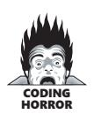
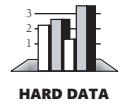
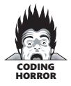
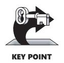

# Chapter 11: The Power of Variable Names


<span id="page-295-0"></span>
### cc2e.com/1184 Contents

- 11.1 Considerations in Choosing Good Names: page 259
- 11.2 Naming Specific Types of Data: page 264
- 11.3 The Power of Naming Conventions: page 270
- 11.4 Informal Naming Conventions: page 272
- 11.5 Standardized Prefixes: page 279
- 11.6 Creating Short Names That Are Readable: page 282
- 11.7 Kinds of Names to Avoid: page 285

#### Related Topics

- Routine names: Section 7.3
- Class names: Section 6.2
- General issues in using variables: Chapter 10
- Formatting data declarations: "Laying Out Data Declarations" in Section 31.5
- Documenting variables: "Commenting Data Declarations" in Section 32.5

As important as the topic of good names is to effective programming, I have never read a discussion that covered more than a handful of the dozens of considerations that go into creating good names. Many programming texts devote a few paragraphs to choosing abbreviations, spout a few platitudes, and expect you to fend for yourself. I intend to be guilty of the opposite: to inundate you with more information about good names than you will ever be able to use!

This chapter's guidelines apply primarily to naming variables—objects and primitive data. But they also apply to naming classes, packages, files, and other programming entities. For details on naming routines, see Section 7.3, "Good Routine Names."

#### 11.1 Considerations in Choosing Good Names

You can't give a variable a name the way you give a dog a name—because it's cute or it has a good sound. Unlike the dog and its name, which are different entities, a variable and a variable's name are essentially the same thing. Consequently, the goodness or badness of a variable is largely determined by its name. Choose variable names with care.

Here's an example of code that uses bad variable names:



```
Java Example of Poor Variable Names
x = x - xx;
xxx = fido + SalesTax( fido );
x = x + LateFee( x1, x ) + xxx;
x = x + Interest( x1, x );
```

What's happening in this piece of code? What do *x1*, *xx*, and *xxx* mean? What does *fido* mean? Suppose someone told you that the code computed a total customer bill based on an outstanding balance and a new set of purchases. Which variable would you use to print the customer's bill for just the new set of purchases?

Here's a version of the same code that makes these questions easier to answer:

```
Java Example of Good Variable Names
balance = balance - lastPayment;
monthlyTotal = newPurchases + SalesTax( newPurchases );
balance = balance + LateFee( customerID, balance ) + monthlyTotal;
balance = balance + Interest( customerID, balance );
```

In view of the contrast between these two pieces of code, a good variable name is readable, memorable, and appropriate. You can use several general rules of thumb to achieve these goals.

#### The Most Important Naming Consideration


The most important consideration in naming a variable is that the name fully and accurately describe the entity the variable represents. An effective technique for coming up with a good name is to state in words what the variable represents. Often that statement itself is the best variable name. It's easy to read because it doesn't contain cryptic abbreviations, and it's unambiguous. Because it's a full description of the entity, it won't be confused with something else. And it's easy to remember because the name is similar to the concept.

For a variable that represents the number of people on the U.S. Olympic team, you would create the name *numberOfPeopleOnTheUsOlympicTeam*. A variable that represents the number of seats in a stadium would be *numberOfSeatsInTheStadium*. A variable that represents the maximum number of points scored by a country's team in any modern Olympics would be *maximumNumberOfPointsInModernOlympics*. A variable that contains the current interest rate is better named *rate* or *interestRate* than *r* or *x*. You get the idea.

Note two characteristics of these names. First, they're easy to decipher. In fact, they don't need to be deciphered at all because you can simply read them. But second, some of the names are long—too long to be practical. I'll get to the question of variablename length shortly.

Table 11-1 shows several examples of variable names, good and bad:

**Table 11-1 Examples of Good and Bad Variable Names**

| Purpose of Variable                        | Good Names,<br>Good Descriptors           | Bad Names,<br>Poor Descriptors            |
|--------------------------------------------|-------------------------------------------|-------------------------------------------|
| Running total of<br>checks written to date | runningTotal, checkTotal                  | written, ct, checks, CHKTTL, x,<br>x1, x2 |
| Velocity of a bullet<br>train              | velocity, trainVelocity,<br>velocityInMph | velt, v, tv, x, x1, x2, train             |
| Current date                               | currentDate, todaysDate                   | cd, current, c, x, x1, x2, date           |
| Lines per page                             | linesPerPage                              | lpp, lines, l, x, x1, x2                  |

The names *currentDate* and *todaysDate* are good names because they fully and accurately describe the idea of "current date." In fact, they use the obvious words. Programmers sometimes overlook using the ordinary words, which is often the easiest solution. Because they're too short and not at all descriptive, *cd* and *c* are poor names. *current* is poor because it doesn't tell you what is current. *date* is almost a good name, but it's a poor name in the final analysis because the date involved isn't just any date, but the current date; *date* by itself gives no such indication. *x*, *x1*, and *x2* are poor names because they're always poor names—*x* traditionally represents an unknown quantity; if you don't want your variables to be unknown quantities, think of better names.


Names should be as specific as possible. Names like *x*, *temp*, and *i* that are general enough to be used for more than one purpose are not as informative as they could be and are usually bad names.

#### Problem Orientation

A good mnemonic name generally speaks to the problem rather than the solution. A good name tends to express the *what* more than the *how*. In general, if a name refers to some aspect of computing rather than to the problem, it's a *how* rather than a *what*. Avoid such a name in favor of a name that refers to the problem itself.

A record of employee data could be called *inputRec* or *employeeData*. *inputRec* is a computer term that refers to computing ideas—input and record. *employeeData* refers to the problem domain rather than the computing universe. Similarly, for a bit field indicating printer status, *bitFlag* is a more computerish name than *printerReady*. In an accounting application, *calcVal* is more computerish than *sum*.

#### Optimum Name Length

The optimum length for a name seems to be somewhere between the lengths of *x* and *maximumNumberOfPointsInModernOlympics*. Names that are too short don't convey enough meaning. The problem with names like *x1* and *x2* is that even if you can discover what *x* is, you won't know anything about the relationship between *x1* and *x2*. Names that are too long are hard to type and can obscure the visual structure of a program.



Gorla, Benander, and Benander found that the effort required to debug a program was minimized when variables had names that averaged 10 to 16 characters (1990). Programs with names averaging 8 to 20 characters were almost as easy to debug. The guideline doesn't mean that you should try to make all of your variable names 9 to 15 or 10 to 16 characters long. It does mean that if you look over your code and see many names that are shorter, you should check to be sure that the names are as clear as they need to be.

You'll probably come out ahead by taking the Goldilocks-and-the-Three-Bears approach to naming variables, as Table 11-2 illustrates.

**Table 11-2 Variable Names That Are Too Long, Too Short, or Just Right**

| numberOfPeopleOnTheUsOlympicTeam      |
|---------------------------------------|
| numberOfSeatsInTheStadium             |
| maximumNumberOfPointsInModernOlympics |
| n, np, ntm                            |
| n, ns, nsisd                          |
| m, mp, max, points                    |
| numTeamMembers, teamMemberCount       |
| numSeatsInStadium, seatCount          |
| teamPointsMax, pointsRecord           |
|                                       |

#### The Effect of Scope on Variable Names

**Cross-Reference** Scope is discussed in more detail in Section 10.4, "Scope."

Are short variable names always bad? No, not always. When you give a variable a short name like *i*, the length itself says something about the variable—namely, that the variable is a scratch value with a limited scope of operation.

A programmer reading such a variable should be able to assume that its value isn't used outside a few lines of code. When you name a variable *i*, you're saying, "This variable is a run-of-the-mill loop counter or array index and doesn't have any significance outside these few lines of code."

A study by W. J. Hansen found that longer names are better for rarely used variables or global variables and shorter names are better for local variables or loop variables

(Shneiderman 1980). Short names are subject to many problems, however, and some careful programmers avoid them altogether as a matter of defensive-programming policy.

*Use qualifiers on names that are in the global namespace* If you have variables that are in the global namespace (named constants, class names, and so on), consider whether you need to adopt a convention for partitioning the global namespace and avoiding naming conflicts. In C++ and C#, you can use the *namespace* keyword to partition the global namespace.

```
C++ Example of Using the namespace Keyword to Partition the Global Namespace
namespace UserInterfaceSubsystem {
 ...
 // lots of declarations
 ...
}
namespace DatabaseSubsystem { 
 ...
 // lots of declarations
 ...
}
```

If you declare an *Employee* class in both the *UserInterfaceSubsystem* and the *Database-Subsystem*, you can identify which you wanted to refer to by writing *UserInterfaceSubsystem::Employee* or *DatabaseSubsystem::Employee*. In Java, you can accomplish the same thing by using packages.

In languages that don't support namespaces or packages, you can still use naming conventions to partition the global namespace. One convention is to require that globally visible classes be prefixed with subsystem mnemonic. The user interface employee class might become *uiEmployee*, and the database employee class might become *dbEmployee*. This minimizes the risk of global-namespace collisions.

#### Computed-Value Qualifiers in Variable Names

Many programs have variables that contain computed values: totals, averages, maximums, and so on. If you modify a name with a qualifier like *Total*, *Sum*, *Average*, *Max*, *Min*, *Record*, *String*, or *Pointer*, put the modifier at the end of the name.

This practice offers several advantages. First, the most significant part of the variable name, the part that gives the variable most of its meaning, is at the front, so it's most prominent and gets read first. Second, by establishing this convention, you avoid the confusion you might create if you were to use both *totalRevenue* and *revenueTotal* in the same program. The names are semantically equivalent, and the convention would prevent their being used as if they were different. Third, a set of names like *revenueTotal*, *expenseTotal*, *revenueAverage*, and *expenseAverage* has a pleasing symmetry. A set of names like *totalRevenue*, *expenseTotal*, *revenueAverage*, and *averageExpense* doesn't appeal to a sense of order. Finally, the consistency improves readability and eases maintenance.

An exception to the rule that computed values go at the end of the name is the customary position of the *Num* qualifier. Placed at the beginning of a variable name, *Num* refers to a total: *numCustomers* is the total number of customers. Placed at the end of the variable name, *Num* refers to an index: *customerNum* is the number of the current customer. The *s* at the end of *numCustomers* is another tip-off about the difference in meaning. But, because using *Num* so often creates confusion, it's probably best to sidestep the whole issue by using *Count* or *Total* to refer to a total number of customers and *Index* to refer to a specific customer. Thus, *customerCount* is the total number of customers and *customerIndex* refers to a specific customer.

#### Common Opposites in Variable Names

**Cross-Reference** For a similar list of opposites in routine names, see "Use opposites precisely" in Section 7.3.

Use opposites precisely. Using naming conventions for opposites helps consistency, which helps readability. Pairs like *begin/end* are easy to understand and remember. Pairs that depart from common-language opposites tend to be hard to remember and are therefore confusing. Here are some common opposites:

- begin/end
- first/last
- locked/unlocked
- min/max
- next/previous
- old/new
- opened/closed
- visible/invisible
- source/target
- source/destination
- up/down

#### 11.2 Naming Specific Types of Data

In addition to the general considerations in naming data, special considerations come up in the naming of specific kinds of data. This section describes considerations specifically for loop variables, status variables, temporary variables, boolean variables, enumerated types, and named constants.

#### Naming Loop Indexes

**Cross-Reference** For details on loops, see Chapter 16, "Controlling Loops."

Guidelines for naming variables in loops have arisen because loops are such a common feature of computer programming. The names *i*, *j*, and *k* are customary:

```
Java Example of a Simple Loop Variable Name
for ( i = firstItem; i < lastItem; i++ ) {
 data[ i ] = 0;
}
```

If a variable is to be used outside the loop, it should be given a name more meaningful than *i*, *j*, or *k*. For example, if you are reading records from a file and need to remember how many records you've read, a name like *recordCount* would be appropriate:

```
Java Example of a Good Descriptive Loop Variable Name
recordCount = 0;
while ( moreScores() ) {
 score[ recordCount ] = GetNextScore();
 recordCount++;
}
// lines using recordCount
...
```

If the loop is longer than a few lines, it's easy to forget what *i* is supposed to stand for and you're better off giving the loop index a more meaningful name. Because code is so often changed, expanded, and copied into other programs, many experienced programmers avoid names like *i* altogether.

One common reason loops grow longer is that they're nested. If you have several nested loops, assign longer names to the loop variables to improve readability.

```
Java Example of Good Loop Names in a Nested Loop
for ( teamIndex = 0; teamIndex < teamCount; teamIndex++ ) {
 for ( eventIndex = 0; eventIndex < eventCount[ teamIndex ]; eventIndex++ ) {
 score[ teamIndex ][ eventIndex ] = 0;
 }
}
```

Carefully chosen names for loop-index variables avoid the common problem of index cross-talk: saying *i* when you mean *j* and *j* when you mean *i*. They also make array accesses clearer: *score[ teamIndex ][ eventIndex ]* is more informative than *score[ i ][ j ]*.

If you have to use *i*, *j*, and *k*, don't use them for anything other than loop indexes for simple loops—the convention is too well established, and breaking it to use them in other ways is confusing. The simplest way to avoid such problems is simply to think of more descriptive names than *i*, *j*, and *k*.

#### Naming Status Variables

Status variables describe the state of your program. Here's a naming guideline:

*Think of a better name than* **flag** *for status variables* It's better to think of flags as status variables. A flag should never have *flag* in its name because that doesn't give you any clue about what the flag does. For clarity, flags should be assigned values and their values should be tested with enumerated types, named constants, or global variables that act as named constants. Here are some examples of flags with bad names:



```
C++ Examples of Cryptic Flags
if ( flag ) ...
if ( statusFlag & 0x0F ) ...
if ( printFlag == 16 ) ...
if ( computeFlag == 0 ) ...
flag = 0x1;
statusFlag = 0x80;
printFlag = 16;
computeFlag = 0;
```

Statements like *statusFlag = 0x80* give you no clue about what the code does unless you wrote the code or have documentation that tells you both what *statusFlag* is and what *0x80* represents. Here are equivalent code examples that are clearer:

```
C++ Examples of Better Use of Status Variables
if ( dataReady ) ...
if ( characterType & PRINTABLE_CHAR ) ...
if ( reportType == ReportType_Annual ) ...
if ( recalcNeeded = false ) ...
dataReady = true;
characterType = CONTROL_CHARACTER;
reportType = ReportType_Annual;
recalcNeeded = false;
```

Clearly, *characterType = CONTROL\_CHARACTER* is more meaningful than *statusFlag = 0x80*. Likewise, the conditional *if ( reportType == ReportType\_Annual )* is clearer than *if ( printFlag == 16 )*. The second example shows that you can use this approach with enumerated types as well as predefined named constants. Here's how you could use named constants and enumerated types to set up the values used in the example:

```
Declaring Status Variables in C++
// values for CharacterType
const int LETTER = 0x01;
const int DIGIT = 0x02;
const int PUNCTUATION = 0x04;
const int LINE_DRAW = 0x08;
```

```
const int PRINTABLE_CHAR = ( LETTER | DIGIT | PUNCTUATION | LINE_DRAW );
const int CONTROL_CHARACTER = 0x80;
// values for ReportType
enum ReportType { 
 ReportType_Daily, 
 ReportType_Monthly, 
 ReportType_Quarterly, 
 ReportType_Annual,
 ReportType_All 
};
```

When you find yourself "figuring out" a section of code, consider renaming the variables. It's OK to figure out murder mysteries, but you shouldn't need to figure out code. You should be able to read it.

#### Naming Temporary Variables

Temporary variables are used to hold intermediate results of calculations, as temporary placeholders, and to hold housekeeping values. They're usually called *temp*, *x*, or some other vague and nondescriptive name. In general, temporary variables are a sign that the programmer does not yet fully understand the problem. Moreover, because the variables are officially given a "temporary" status, programmers tend to treat them more casually than other variables, increasing the chance of errors.

*Be leery of "temporary" variables* It's often necessary to preserve values temporarily. But in one way or another, most of the variables in your program are temporary. Calling a few of them temporary may indicate that you aren't sure of their real purposes. Consider the following example:

```
C++ Example of an Uninformative "Temporary" Variable Name
// Compute solutions of a quadratic equation. 
// This assumes that (b^2-4*a*c) is positive.
temp = sqrt( b^2 - 4*a*c );
solution[0] = ( -b + temp ) / ( 2 * a );
solution[1] = ( -b - temp ) / ( 2 * a );
```

It's fine to store the value of the expression *sqrt( b^2 - 4 \* a \* c )* in a variable, especially since it's used in two places later. But the name *temp* doesn't tell you anything about what the variable does. A better approach is shown in this example:

```
C++ Example with a "Temporary" Variable Name Replaced with a Real Variable
// Compute solutions of a quadratic equation. 
// This assumes that (b^2-4*a*c) is positive.
discriminant = sqrt( b^2 - 4*a*c );
solution[0] = ( -b + discriminant ) / ( 2 * a );
solution[1] = ( -b - discriminant ) / ( 2 * a );
```

This is essentially the same code, but it's improved with the use of an accurate, descriptive variable name.

#### Naming Boolean Variables

Following are a few guidelines to use in naming boolean variables:

*Keep typical boolean names in mind* Here are some particularly useful boolean variable names:

- *done* Use *done* to indicate whether something is done. The variable can indicate whether a loop is done or some other operation is done. Set *done* to *false* before something is done, and set it to *true* when something is completed.
- *error* Use *error* to indicate that an error has occurred. Set the variable to *false* when no error has occurred and to *true* when an error has occurred.
- *found* Use *found* to indicate whether a value has been found. Set *found* to *false* when the value has not been found and to *true* once the value has been found. Use *found* when searching an array for a value, a file for an employee ID, a list of paychecks for a certain paycheck amount, and so on.
- *success* **or** *ok* Use *success* or *ok* to indicate whether an operation has been successful. Set the variable to *false* when an operation has failed and to *true* when an operation has succeeded. If you can, replace *success* with a more specific name that describes precisely what it means to be successful. If the program is successful when processing is complete, you might use *processingComplete* instead. If the program is successful when a value is found, you might use *found* instead.

*Give boolean variables names that imply true or false* Names like *done* and *success* are good boolean names because the state is either *true* or *false*; something is done or it isn't; it's a success or it isn't. Names like *status* and *sourceFile*, on the other hand, are poor boolean names because they're not obviously *true* or *false*. What does it mean if *status* is *true*? Does it mean that something has a status? Everything has a status. Does *true* mean that the status of something is OK? Or does *false* mean that nothing has gone wrong? With a name like *status*, you can't tell.

For better results, replace *status* with a name like *error* or *statusOK*, and replace *source-File* with *sourceFileAvailable* or *sourceFileFound*, or whatever the variable represents.

Some programmers like to put *Is* in front of their boolean names. Then the variable name becomes a question: *isdone*? *isError*? *isFound*? *isProcessingComplete*? Answering the question with *true* or *false* provides the value of the variable. A benefit of this approach is that it won't work with vague names: *isStatus*? makes no sense at all. A drawback is that it makes simple logical expressions less readable: *if ( isFound )* is slightly less readable than *if ( found )*.

*Use positive boolean variable names* Negative names like *notFound*, *notdone*, and *notSuccessful* are difficult to read when they are negated—for example,

```
if not notFound
```

Such a name should be replaced by *found*, *done*, or *processingComplete* and then negated with an operator as appropriate. If what you're looking for is found, you have *found* instead of *not notFound*.

#### Naming Enumerated Types

**Cross-Reference** For details on using enumerated types, see Section 12.6, "Enumerated Types."

When you use an enumerated type, you can ensure that it's clear that members of the type all belong to the same group by using a group prefix, such as *Color\_*, *Planet\_*, or *Month\_*. Here are some examples of identifying elements of enumerated types using prefixes:

```
Visual Basic Example of Using a Prefix Naming Convention for Enumerated Types
Public Enum Color
 Color_Red
 Color_Green
 Color_Blue
End Enum
Public Enum Planet
 Planet_Earth
 Planet_Mars
 Planet_Venus
End Enum
Public Enum Month
 Month_January
 Month_February
 ...
 Month_December
End Enum
```

In addition, the enum type itself (*Color*, *Planet*, or *Month*) can be identified in various ways, including all caps or prefixes (*e\_Color*, *e\_Planet*, or *e\_Month*). A person could argue that an enum is essentially a user-defined type and so the name of the enum should be formatted the same as other user-defined types like classes. A different argument would be that enums are types, but they are also constants, so the enum type name should be formatted as constants. This book uses the convention of mixed case for enumerated type names.

In some languages, enumerated types are treated more like classes, and the members of the enumeration are always prefixed with the enum name, like *Color.Color\_Red* or *Planet.Planet\_Earth*. If you're working in that kind of language, it makes little sense to repeat the prefix, so you can treat the name of the enum type itself as the prefix and simplify the names to *Color.Red* and *Planet.Earth*.

#### Naming Constants

**Cross-Reference** For details on using named constants, see Section 12.7, "Named Constants."

When naming constants, name the abstract entity the constant represents rather than the number the constant refers to. *FIVE* is a bad name for a constant (regardless of whether the value it represents is *5.0*). *CYCLES\_NEEDED* is a good name. *CYCLES\_NEEDED* can equal *5.0* or *6.0*. *FIVE = 6.0* would be ridiculous. By the same token, *BAKERS\_DOZEN* is a poor constant name; *DONUTS\_MAX* is a good constant name.

### 11.3 The Power of Naming Conventions

Some programmers resist standards and conventions—and with good reason. Some standards and conventions are rigid and ineffective—destructive to creativity and program quality. This is unfortunate since effective standards are some of the most powerful tools at your disposal. This section discusses why, when, and how you should create your own standards for naming variables.

#### Why Have Conventions?

Conventions offer several specific benefits:

- They let you take more for granted. By making one global decision rather than many local ones, you can concentrate on the more important characteristics of the code.
- They help you transfer knowledge across projects. Similarities in names give you an easier and more confident understanding of what unfamiliar variables are supposed to do.
- They help you learn code more quickly on a new project. Rather than learning that Anita's code looks like this, Julia's like that, and Kristin's like something else, you can work with a more consistent set of code.
- They reduce name proliferation. Without naming conventions, you can easily call the same thing by two different names. For example, you might call total points both *pointTotal* and *totalPoints*. This might not be confusing to you when you write the code, but it can be enormously confusing to a new programmer who reads it later.
- They compensate for language weaknesses. You can use conventions to emulate named constants and enumerated types. The conventions can differentiate among local, class, and global data and can incorporate type information for types that aren't supported by the compiler.

■ They emphasize relationships among related items. If you use object data, the compiler takes care of this automatically. If your language doesn't support objects, you can supplement it with a naming convention. Names like *address*, *phone*, and *name* don't indicate that the variables are related. But suppose you decide that all employee-data variables should begin with an *Employee* prefix. *employeeAddress*, *employeePhone*, and *employeeName* leave no doubt that the variables are related. Programming conventions can make up for the weakness of the language you're using.


The key is that any convention at all is often better than no convention. The convention may be arbitrary. The power of naming conventions doesn't come from the specific convention chosen but from the fact that a convention exists, adding structure to the code and giving you fewer things to worry about.

#### When You Should Have a Naming Convention

There are no hard-and-fast rules for when you should establish a naming convention, but here are a few cases in which conventions are worthwhile:

- When multiple programmers are working on a project
- When you plan to turn a program over to another programmer for modifications and maintenance (which is nearly always)
- When your programs are reviewed by other programmers in your organization
- When your program is so large that you can't hold the whole thing in your brain at once and must think about it in pieces
- When the program will be long-lived enough that you might put it aside for a few weeks or months before working on it again
- When you have a lot of unusual terms that are common on a project and want to have standard terms or abbreviations to use in coding

You always benefit from having some kind of naming convention. The considerations above should help you determine the extent of the convention to use on a particular project.

#### Degrees of Formality

**Cross-Reference** For details on the differences in formality in small and large projects, see Chapter 27, "How Program Size Affects Construction."

Different conventions have different degrees of formality. An informal convention might be as simple as "Use meaningful names." Other informal conventions are described in the next section. In general, the degree of formality you need is dependent on the number of people working on a program, the size of the program, and the program's expected life span. On tiny, throwaway projects, a strict convention might be unnecessary overhead. On larger projects in which several people are involved, either initially or over the program's life span, formal conventions are an indispensable aid to readability.

#### 11.4 Informal Naming Conventions

Most projects use relatively informal naming conventions such as the ones laid out in this section.

#### Guidelines for a Language-Independent Convention

Here are some guidelines for creating a language-independent convention:

*Differentiate between variable names and routine names* The convention this book uses is to begin variable and object names with lower case and routine names with upper case: *variableName* vs. *RoutineName()*.

*Differentiate between classes and objects* The correspondence between class names and object names—or between types and variables of those types—can get tricky. Several standard options exist, as shown in the following examples:

#### Option 1: Differentiating Types and Variables via Initial Capitalization

Widget widget;

LongerWidget longerWidget;

#### Option 2: Differentiating Types and Variables via All Caps

WIDGET widget;

LONGERWIDGET longerWidget

#### Option 3: Differentiating Types and Variables via the "t\_" Prefix for Types

t\_Widget Widget;

t\_LongerWidget LongerWidget;

#### Option 4: Differentiating Types and Variables via the "a" Prefix for Variables

Widget aWidget;

LongerWidget aLongerWidget;

#### Option 5: Differentiating Types and Variables via Using More Specific Names for the Variables

Widget employeeWidget;

LongerWidget fullEmployeeWidget;

Each of these options has strengths and weaknesses. Option 1 is a common convention in case-sensitive languages including C++ and Java, but some programmers are uncomfortable differentiating names solely on the basis of capitalization. Indeed, creating names that differ only in the capitalization of the first letter in the name seems to provide too little "psychological distance" and too small a visual distinction between the two names.

The Option 1 approach can't be applied consistently in mixed-language environments if any of the languages are case-insensitive. In Microsoft Visual Basic, for example, *Dim widget as Widget* will generate a syntax error because *widget* and *Widget* are treated as the same token.

Option 2 creates a more obvious distinction between the type name and the variable name. For historical reasons, all caps are used to indicate constants in C++ and Java, however, and the approach is subject to the same problems in mixed-language environments that Option 1 is subject to.

Option 3 works adequately in all languages, but some programmers dislike the idea of prefixes for aesthetic reasons.

Option 4 is sometimes used as an alternative to Option 3, but it has the drawback of altering the name of every instance of a class instead of just the one class name.

Option 5 requires more thought on a variable-by-variable basis. In most instances, being forced to think of a specific name for a variable results in more readable code. But sometimes a *widget* truly is just a generic *widget*, and in those instances you'll find yourself coming up with less-than-obvious names, like *genericWidget*, which are arguably less readable.

In short, each of the available options involves tradeoffs. The code in this book uses Option 5 because it's the most understandable in situations in which the person reading the code isn't necessarily familiar with a less intuitive naming convention.

*Identify global variables* One common programming problem is misuse of global variables. If you give all global variable names a *g\_* prefix, for example, a programmer seeing the variable *g\_RunningTotal* will know it's a global variable and treat it as such.

*Identify member variables* Identify a class's member data. Make it clear that the variable isn't a local variable and that it isn't a global variable either. For example, you can identify class member variables with an *m\_* prefix to indicate that it is member data.

*Identify type definitions* Naming conventions for types serve two purposes: they explicitly identify a name as a type name, and they avoid naming clashes with variables. To meet those considerations, a prefix or suffix is a good approach. In C++, the customary approach is to use all uppercase letters for a type name—for example, *COLOR* and *MENU*. (This convention applies to *typedef*s and *struct*s, not class names.) But this creates the possibility of confusion with named preprocessor constants. To avoid confusion, you can prefix the type names with *t\_*, such as *t\_Color* and *t\_Menu*.

*Identify named constants* Named constants need to be identified so that you can tell whether you're assigning a variable a value from another variable (whose value might change) or from a named constant. In Visual Basic, you have the additional possibility that the value might be from a function. Visual Basic doesn't require function names to use parentheses, whereas in C++ even a function with no parameters uses parentheses.

One approach to naming constants is to use a prefix like *c\_* for constant names. That would give you names like *c\_RecsMax* or *c\_LinesPerPageMax*. In C++ and Java, the convention is to use all uppercase letters, possibly with underscores to separate words, *RECSMAX* or *RECS\_ MAX* and *LINESPERPAGEMAX* or *LINES\_PER\_PAGE\_ MAX*.

*Identify elements of enumerated types* Elements of enumerated types need to be identified for the same reasons that named constants do—to make it easy to tell that the name is for an enumerated type as opposed to a variable, named constant, or function. The standard approach applies: you can use all caps or an *e\_* or *E\_* prefix for the name of the type itself and use a prefix based on the specific type like *Color\_* or *Planet\_* for the members of the type.

*Identify input-only parameters in languages that don't enforce them* Sometimes input parameters are accidentally modified. In languages such as C++ and Visual Basic, you must indicate explicitly whether you want a value that's been modified to be returned to the calling routine. This is indicated with the *\**, *&*, and *const* qualifiers in C++ or *ByRef* and *ByVal* in Visual Basic.

In other languages, if you modify an input variable, it is returned whether you like it or not. This is especially true when passing objects. In Java, for example, all objects are passed "by value," so when you pass an object to a routine, the contents of the object can be changed within the called routine (Arnold, Gosling, Holmes 2000).

In those languages, if you establish a naming convention in which input-only parameters are given a *const* prefix (or *final*, *nonmodifiable*, or something comparable) , you'll know that an error has occurred when you see anything with a *const* prefix on the left side of an equal sign. If you see *constMax.SetNewMax( ... )*, you'll know it's a goof because the *const* prefix indicates that the variable isn't supposed to be modified.

*Format names to enhance readability* Two common techniques for increasing readability are using capitalization and spacing characters to separate words. For example, *GYMNASTICSPOINTTOTAL* is less readable than *gymnasticsPointTotal* or *gymnastics\_point\_total*. C++, Java, Visual Basic, and other languages allow for mixed uppercase and lowercase characters. C++, Java, Visual Basic, and other languages also allow the use of the underscore (\_) separator.

Try not to mix these techniques; that makes code hard to read. If you make an honest attempt to use any of these readability techniques consistently, however, it will improve your code. People have managed to have zealous, blistering debates over fine points such as whether the first character in a name should be capitalized (*TotalPoints* vs. *totalPoints*), but as long as you and your team are consistent, it won't make much difference. This book uses initial lowercase because of the strength of the Java practice and to facilitate similarity in style across several languages.

**Cross-Reference** Augmenting a language with a naming convention to make up for limitations in the language itself is an example of programming *into* a language instead of just programming in it. For more details on programming *into* a language, see Section 34.4, "Program into Your Language, Not in It."

#### Guidelines for Language-Specific Conventions

Follow the naming conventions of the language you're using. You can find books for most languages that describe style guidelines. Guidelines for C, C++, Java, and Visual Basic are provided in the following sections.

#### C Conventions

**Further Reading** The classic book on C programming style is *C Programming Guidelines* (Plum 1984).

Several naming conventions apply specifically to the C programming language:

- *c* and *ch* are character variables.
- *i* and *j* are integer indexes.
- *n* is a number of something.
- *p* is a pointer.
- *s* is a string.
- Preprocessor macros are in *ALL\_CAPS*. This is usually extended to include typedefs as well.
- Variable and routine names are in *all\_lowercase*.
- The underscore (\_) character is used as a separator: *letters\_in\_lowercase* is more readable than *lettersinlowercase*.

These are the conventions for generic, UNIX-style and Linux-style C programming, but C conventions are different in different environments. In Microsoft Windows, C programmers tend to use a form of the Hungarian naming convention and mixed uppercase and lowercase letters for variable names. On the Macintosh, C programmers tend to use mixed-case names for routines because the Macintosh toolbox and operating-system routines were originally designed for a Pascal interface.

#### C++ Conventions

Here are the conventions that have grown up around C++ programming:

- *i* and *j* are integer indexes.
- *p* is a pointer.
- Constants, typedefs, and preprocessor macros are in *ALL\_CAPS*.
- Class and other type names are in *MixedUpperAndLowerCase()*.
- Variable and function names use lowercase for the first word, with the first letter of each following word capitalized—for example, *variableOrRoutineName*.
- The underscore is not used as a separator within names, except for names in all caps and certain kinds of prefixes (such as those used to identify global variables).

**Further Reading** For more on C++ programming style, see *The Elements of C++ Style* (Misfeldt, Bumgardner, and Gray 2004).

As with C programming, this convention is far from standard and different environments have standardized on different convention details.

#### Java Conventions

**Further Reading** For more on Java programming style, see *The Elements of Java Style*, 2d ed. (Vermeulen et al. 2000).

In contrast with C and C++, Java style conventions have been well established since the language's beginning:

- *i* and *j* are integer indexes.
- Constants are in *ALL\_CAPS* separated by underscores.
- Class and interface names capitalize the first letter of each word, including the first word—for example, *ClassOrInterfaceName*.
- Variable and method names use lowercase for the first word, with the first letter of each following word capitalized—for example, *variableOrRoutineName*.
- The underscore is not used as a separator within names except for names in all caps.
- The *get* and *set* prefixes are used for accessor methods.

#### Visual Basic Conventions

Visual Basic has not really established firm conventions. The next section recommends a convention for Visual Basic.

#### Mixed-Language Programming Considerations

When programming in a mixed-language environment, the naming conventions (as well as formatting conventions, documentation conventions, and other conventions) can be optimized for overall consistency and readability—even if that means going against convention for one of the languages that's part of the mix.

In this book, for example, variable names all begin with lowercase, which is consistent with conventional Java programming practice and some but not all C++ conventions. This book formats all routine names with an initial capital letter, which follows the C++ convention. The Java convention would be to begin method names with lowercase, but this book uses routine names that begin in uppercase across all languages for the sake of overall readability.

#### Sample Naming Conventions

The standard conventions above tend to ignore several important aspects of naming that were discussed over the past few pages—including variable scoping (private, class, or global), differentiating between class, object, routine, and variable names, and other issues.

The naming-convention guidelines can look complicated when they're strung across several pages. They don't need to be terribly complex, however, and you can adapt them to your needs. Variable names include three kinds of information:

- The contents of the variable (what it represents)
- The kind of data (named constant, primitive variable, user-defined type, or class)
- The scope of the variable (private, class, package, or global)

Tables 11-3, 11-4, and 11-5 provide naming conventions for C, C++, Java, and Visual Basic that have been adapted from the guidelines presented earlier. These specific conventions aren't necessarily recommended, but they give you an idea of what an informal naming convention includes.

**Table 11-3 Sample Naming Conventions for C++ and Java**

| Entity              | Description                                                                                                                                                                                                       |
|---------------------|-------------------------------------------------------------------------------------------------------------------------------------------------------------------------------------------------------------------|
| ClassName           | Class names are in mixed uppercase and lowercase with<br>an initial capital letter.                                                                                                                               |
| TypeName            | Type definitions, including enumerated types and type<br>defs, use mixed uppercase and lowercase with an initial<br>capital letter.                                                                               |
| EnumeratedTypes     | In addition to the rule above, enumerated types are<br>always stated in the plural form.                                                                                                                          |
| localVariable       | Local variables are in mixed uppercase and lowercase<br>with an initial lowercase letter. The name should be inde<br>pendent of the underlying data type and should refer to<br>whatever the variable represents. |
| routineParameter    | Routine parameters are formatted the same as local vari<br>ables.                                                                                                                                                 |
| RoutineName()       | Routines are in mixed uppercase and lowercase. (Good<br>routine names are discussed in Section 7.3.)                                                                                                              |
| m_ClassVariable     | Member variables that are available to multiple routines<br>within a class, but only within a class, are prefixed with an<br>m                                                                                    |
| g_GlobalVariable    | Global variables are prefixed with a g                                                                                                                                                                            |
| CONSTANT            | Named constants are in ALL_CAPS.                                                                                                                                                                                  |
| MACRO               | Macros are in ALL_CAPS.                                                                                                                                                                                           |
| Base_EnumeratedType | Enumerated types are prefixed with a mnemonic for their<br>base type stated in the singular—for example, Color_Red,<br>Color_Blue.                                                                                |

**Table 11-4 Sample Naming Conventions for C**

| Entity                  | Description                                                                                                                                                                                          |
|-------------------------|------------------------------------------------------------------------------------------------------------------------------------------------------------------------------------------------------|
| TypeName                | Type definitions use mixed uppercase and lowercase with<br>an initial capital letter.                                                                                                                |
| GlobalRoutineName()     | Public routines are in mixed uppercase and lowercase.                                                                                                                                                |
| f_FileRoutineName()     | Routines that are private to a single module (file) are pre<br>fixed with an f                                                                                                                       |
| LocalVariable           | Local variables are in mixed uppercase and lowercase.<br>The name should be independent of the underlying data<br>type and should refer to whatever the variable repre<br>sents.                     |
| RoutineParameter        | Routine parameters are formatted the same as local vari<br>ables.                                                                                                                                    |
| f_FileStaticVariable    | Module (file) variables are prefixed with an f                                                                                                                                                       |
| G_GLOBAL_GlobalVariable | Global variables are prefixed with a G_ and a mnemonic<br>of the module (file) that defines the variable in all upper<br>case—for example, SCREEN_Dimensions.                                        |
| LOCAL_CONSTANT          | Named constants that are private to a single routine or<br>module (file) are in all uppercase—for example,<br>ROWS_MAX.                                                                              |
| G_GLOBALCONSTANT        | Global named constants are in all uppercase and are pre<br>fixed with G_ and a mnemonic of the module (file) that<br>defines the named constant in all uppercase—for exam<br>ple, G_SCREEN_ROWS_MAX. |
| LOCALMACRO()            | Macro definitions that are private to a single routine or<br>module (file) are in all uppercase.                                                                                                     |
| G_GLOBAL_MACRO()        | Global macro definitions are in all uppercase and are<br>prefixed with G_ and a mnemonic of the module (file)<br>that defines the macro in all uppercase—for example,<br>G_SCREEN_LOCATION().        |

Because Visual Basic is not case-sensitive, special rules apply for differentiating between type names and variable names. Take a look at Table 11-5.

**Table 11-5 Sample Naming Conventions for Visual Basic**

| Entity            | Description                                                                                                                                         |
|-------------------|-----------------------------------------------------------------------------------------------------------------------------------------------------|
| C_ClassName       | Class names are in mixed uppercase and lowercase with<br>an initial capital letter and a C_ prefix.                                                 |
| T_TypeName        | Type definitions, including enumerated types and type<br>defs, use mixed uppercase and lowercase with an initial<br>capital letter and a T_ prefix. |
| T_EnumeratedTypes | In addition to the rule above, enumerated types are<br>always stated in the plural form.                                                            |

| Entity              | Description                                                                                                                                                                                                       |
|---------------------|-------------------------------------------------------------------------------------------------------------------------------------------------------------------------------------------------------------------|
| localVariable       | Local variables are in mixed uppercase and lowercase<br>with an initial lowercase letter. The name should be inde<br>pendent of the underlying data type and should refer to<br>whatever the variable represents. |
| routineParameter    | Routine parameters are formatted the same as local vari<br>ables.                                                                                                                                                 |
| RoutineName()       | Routines are in mixed uppercase and lowercase. (Good<br>routine names are discussed in Section 7.3.)                                                                                                              |
| m_ClassVariable     | Member variables that are available to multiple routines<br>within a class, but only within a class, are prefixed with an<br>m                                                                                    |
| g_GlobalVariable    | Global variables are prefixed with a g                                                                                                                                                                            |
| CONSTANT            | Named constants are in ALL_CAPS.                                                                                                                                                                                  |
| Base_EnumeratedType | Enumerated types are prefixed with a mnemonic for their<br>base type stated in the singular—for example, Color_Red,<br>Color_Blue.                                                                                |

**Table 11-5 Sample Naming Conventions for Visual Basic**

#### 11.5 Standardized Prefixes

**Further Reading** For further details on the Hungarian naming convention, see "The Hungarian Revolution" (Simonyi and Heller 1991).

Standardizing prefixes for common meanings provides a terse but consistent and readable approach to naming data. The best known scheme for standardizing prefixes is the Hungarian naming convention, which is a set of detailed guidelines for naming variables and routines (not Hungarians!) that was widely used at one time in Microsoft Windows programming. Although the Hungarian naming convention is no longer in widespread use, the basic idea of standardizing on terse, precise abbreviations continues to have value.

Standardized prefixes are composed of two parts: the user-defined type (UDT) abbreviation and the semantic prefix.

#### User-Defined Type Abbreviations

The UDT abbreviation identifies the data type of the object or variable being named. UDT abbreviations might refer to entities such as windows, screen regions, and fonts. A UDT abbreviation generally doesn't refer to any of the predefined data types offered by the programming language.

UDTs are described with short codes that you create for a specific program and then standardize on for use in that program. The codes are mnemonics such as *wn* for windows and *scr* for screen regions. Table 11-6 offers a sample list of UDTs that you might use in a program for a word processor.

**Table 11-6 Sample of UDTs for a Word Processor**

| UDT<br>Abbreviation | Meaning                                                                                                                                                          |
|---------------------|------------------------------------------------------------------------------------------------------------------------------------------------------------------|
| ch                  | Character (a character not in the C++ sense, but in the sense of the<br>data type a word-processing program would use to represent a<br>character in a document) |
| doc                 | Document                                                                                                                                                         |
| pa                  | Paragraph                                                                                                                                                        |
| scr                 | Screen region                                                                                                                                                    |
| sel                 | Selection                                                                                                                                                        |
| wn                  | Window                                                                                                                                                           |

When you use UDTs, you also define programming-language data types that use the same abbreviations as the UDTs. Thus, if you had the UDTs in Table 11-6, you'd see data declarations like these:

```
CH chCursorPosition;
SCR scrUserWorkspace;
DOC docActive
PA firstPaActiveDocument;
PA lastPaActiveDocument;
WN wnMain;
```

Again, these examples relate to a word processor. For use on your own projects, you'd create UDT abbreviations for the UDTs that are used most commonly within your environment.

#### Semantic Prefixes

Semantic prefixes go a step beyond the UDT and describe how the variable or object is used. Unlike UDTs, which vary from project to project, semantic prefixes are somewhat standard across projects. Table 11-7 shows a list of standard semantic prefixes.

**Table 11-7 Semantic Prefixes** 

| Semantic<br>Prefix | Meaning                                                                                                                                                      |
|--------------------|--------------------------------------------------------------------------------------------------------------------------------------------------------------|
| c                  | Count (as in the number of records, characters, and so on)                                                                                                   |
| first              | The first element that needs to be dealt with in an array. first is similar to<br>min but relative to the current operation rather than to the array itself. |
| g                  | Global variable                                                                                                                                              |
| i                  | Index into an array                                                                                                                                          |
| last               | The last element that needs to be dealt with in an array. last is the counter<br>part of first.                                                              |

**Table 11-7 Semantic Prefixes** 

| Semantic |                                                                                                                                                                                                                                                                                                       |
|----------|-------------------------------------------------------------------------------------------------------------------------------------------------------------------------------------------------------------------------------------------------------------------------------------------------------|
| Prefix   | Meaning                                                                                                                                                                                                                                                                                               |
| lim      | The upper limit of elements that need to be dealt with in an array. lim is<br>not a valid index. Like last, lim is used as a counterpart of first. Unlike last,<br>lim represents a noninclusive upper bound on the array; last represents a<br>final, legal element. Generally, lim equals last + 1. |
| m        | Class-level variable                                                                                                                                                                                                                                                                                  |
| max      | The absolute last element in an array or other kind of list. max refers to the<br>array itself rather than to operations on the array.                                                                                                                                                                |
| min      | The absolute first element in an array or other kind of list.                                                                                                                                                                                                                                         |
| p        | Pointer                                                                                                                                                                                                                                                                                               |

Semantic prefixes are formatted in lowercase or mixed uppercase and lowercase and are combined with the UDTs and with other semantic prefixes as needed. For example, the first paragraph in a document would be named *pa* to show that it's a paragraph and *first* to show that it's the first paragraph: *firstPa*. An index into the set of paragraphs would be named *iPa*; *cPa* is the count, or the number of paragraphs; and *firstPaActiveDocument* and *lastPaActiveDocument* are the first and last paragraphs in the current active document.

#### Advantages of Standardized Prefixes


KEY POINT

Standardized prefixes give you all the general advantages of having a naming convention as well as several other advantages. Because so many names are standard, you have fewer names to remember in any single program or class.

Standardized prefixes add precision to several areas of naming that tend to be imprecise. The precise distinctions between *min*, *first*, *last*, and *max* are particularly helpful.

Standardized prefixes make names more compact. For example, you can use *cpa* for the count of paragraphs rather than *totalParagraphs*. You can use *ipa* to identify an index into an array of paragraphs rather than *indexParagraphs* or *paragraphsIndex*.

Finally, standardized prefixes allow you to check types accurately when you're using abstract data types that your compiler can't necessarily check: *paReformat = docReformat* is probably wrong because *pa* and *doc* are different UDTs.

The main pitfall with standardized prefixes is a programmer neglecting to give the variable a meaningful name in addition to its prefix. If *ipa* unambiguously designates an index into an array of paragraphs, it's tempting not to make the name more meaningful like *ipaActiveDocument*. For readability, close the loop and come up with a descriptive name.

#### 11.6 Creating Short Names That Are Readable



The desire to use short variable names is in some ways a remnant of an earlier age of computing. Older languages like assembler, generic Basic, and Fortran limited variable names to 2–8 characters and forced programmers to create short names. Early computing was more closely linked to mathematics and its use of terms like *i*, *j*, and *k* as the variables in summations and other equations. In modern languages like C++, Java, and Visual Basic, you can create names of virtually any length; you have almost no reason to shorten meaningful names.

If circumstances do require you to create short names, note that some methods of shortening names are better than others. You can create good short variable names by eliminating needless words, using short synonyms, and using any of several abbreviation strategies. It's a good idea to be familiar with multiple techniques for abbreviating because no single technique works well in all cases.

#### General Abbreviation Guidelines

Here are several guidelines for creating abbreviations. Some of them contradict others, so don't try to use them all at the same time.

- Use standard abbreviations (the ones in common use, which are listed in a dictionary).
- Remove all nonleading vowels. (*computer* becomes *cmptr*, and *screen* becomes *scrn*. *apple* becomes *appl*, and *integer* becomes *intgr*.)
- Remove articles: *and*, *or*, *the*, and so on.
- Use the first letter or first few letters of each word.
- Truncate consistently after the first, second, or third (whichever is appropriate) letter of each word.
- Keep the first and last letters of each word.
- Use every significant word in the name, up to a maximum of three words.
- Remove useless suffixes—*ing*, *ed*, and so on.
- Keep the most noticeable sound in each syllable.
- Be sure not to change the meaning of the variable.
- Iterate through these techniques until you abbreviate each variable name to between 8 to 20 characters or the number of characters to which your language limits variable names.

#### Phonetic Abbreviations

Some people advocate creating abbreviations based on the sound of the words rather than their spelling. Thus *skating* becomes *sk8ing*, *highlight* becomes *hilite*, *before* becomes *b4*, *execute* becomes *xqt*, and so on. This seems too much like asking people to figure out personalized license plates to me, and I don't recommend it. As an exercise, figure out what these names mean:

*ILV2SK8 XMEQWK S2DTM8O NXTC TRMN8R*

#### Comments on Abbreviations

You can fall into several traps when creating abbreviations. Here are some rules for avoiding pitfalls:

*Don't abbreviate by removing one character from a word* Typing one character is little extra work, and the one-character savings hardly justifies the loss in readability. It's like the calendars that have "Jun" and "Jul." You have to be in a big hurry to spell June as "Jun." With most one-letter deletions, it's hard to remember whether you removed the character. Either remove more than one character or spell out the word.

*Abbreviate consistently* Always use the same abbreviation. For example, use *Num* everywhere or *No* everywhere, but don't use both. Similarly, don't abbreviate a word in some names and not in others. For instance, don't use the full word *Number* in some places and the abbreviation *Num* in others.

*Create names that you can pronounce* Use *xPos* rather than *xPstn* and *needsComp* rather than *ndsCmptg*. Apply the telephone test—if you can't read your code to someone over the phone, rename your variables to be more distinctive (Kernighan and Plauger 1978).

*Avoid combinations that result in misreading or mispronunciation* To refer to the end of *B*, favor *ENDB* over *BEND*. If you use a good separation technique, you won't need this guideline since *B-END*, *BEnd*, or *b\_end* won't be mispronounced.

*Use a thesaurus to resolve naming collisions* One problem in creating short names is naming collisions—names that abbreviate to the same thing. For example, if you're limited to three characters and you need to use *fired* and *full revenue disbursal* in the same area of a program, you might inadvertently abbreviate both to *frd*.

One easy way to avoid naming collisions is to use a different word with the same meaning, so a thesaurus is handy. In this example, *dismissed* might be substituted for *fired* and *complete revenue disbursal* might be substituted for *full revenue disbursal*. The three-letter abbreviations become *dsm* and *crd*, eliminating the naming collision.

**Document extremely short names with translation tables in the code** In languages that allow only very short names, include a translation table to provide a reminder of the mnemonic content of the variables. Include the table as comments at the beginning of a block of code. Here's an example:

```
Fortran Example of a Good Translation Table
C **********************
    Translation Table
C
C
C
  Variable Meaning
  -----
C
            x-Coordinate Position (in meters)
  XPOS
\boldsymbol{c}
C YPOS Y-Coordinate Position (in meters)
C NDSCMP Needs Computing (=0 if no computation is needed;
C
                                =1 if computation is needed)
C PTGTTL Point Grand Total
C PTVLMX Point Value Maximum
C PSCRMX Possible Score Maximum
C *********************
```

You might think that this technique is outdated, but as recently as mid-2003 I worked with a client that had hundreds of thousands of lines of code written in RPG that was subject to a 6-character-variable-name limitation. These issues still come up from time to time.

**Document all abbreviations in a project-level "Standard Abbreviations" document** Abbreviations in code create two general risks:

- A reader of the code might not understand the abbreviation.
- Other programmers might use multiple abbreviations to refer to the same word, which creates needless confusion.

To address both these potential problems, you can create a "Standard Abbreviations" document that captures all the coding abbreviations used on your project. The document can be a word processor document or a spreadsheet. On a very large project, it could be a database. The document is checked into version control and checked out anytime anyone creates a new abbreviation in the code. Entries in the document should be sorted by the full word, not the abbreviation.

This might seem like a lot of overhead, but aside from a small amount of startup overhead, it really just sets up a mechanism that helps the project use abbreviations effectively. It addresses the first of the two general risks described above by documenting all abbreviations in use. The fact that a programmer can't create a new abbreviation without the overhead of checking the Standard Abbreviations document out of ver-

sion control, entering the abbreviation, and checking it back in *is a good thing*. It means that an abbreviation won't be created unless it's so common that it's worth the hassle of documenting it.

This approach addresses the second risk by reducing the likelihood that a programmer will create a redundant abbreviation. A programmer who wants to abbreviate something will check out the abbreviations document and enter the new abbreviation. If there is already an abbreviation for the word the programmer wants to abbreviate, the programmer will notice that and will then use the existing abbreviation instead of creating a new one.


The general issue illustrated by this guideline is the difference between write-time convenience and read-time convenience. This approach clearly creates a write-time *inconvenience*, but programmers over the lifetime of a system spend far more time reading code than writing code. This approach increases read-time convenience. By the time all the dust settles on a project, it might well also have improved write-time convenience.

*Remember that names matter more to the reader of the code than to the writer* Read code of your own that you haven't seen for at least six months and notice where you have to work to understand what the names mean. Resolve to change the practices that cause such confusion.

#### 11.7 Kinds of Names to Avoid

Here are some guidelines regarding variable names to avoid:

*Avoid misleading names or abbreviations* Make sure that a name is unambiguous. For example, *FALSE* is usually the opposite of *TRUE* and would be a bad abbreviation for "Fig and Almond Season."

*Avoid names with similar meanings* If you can switch the names of two variables without hurting the program, you need to rename both variables. For example, *input* and *inputValue*, *recordNum* and *numRecords*, and *fileNumber* and *fileIndex* are so semantically similar that if you use them in the same piece of code you'll easily confuse them and install some subtle, hard-to-find errors.

**Cross-Reference** The technical term for differences like this between similar variable names is "psychological distance." For details, see "How 'Psychological Distance' Can Help" in Section 23.4.

*Avoid variables with different meanings but similar names* If you have two variables with similar names and different meanings, try to rename one of them or change your abbreviations. Avoid names like *clientRecs* and *clientReps*. They're only one letter different from each other, and the letter is hard to notice. Have at least two-letter differences between names, or put the differences at the beginning or at the end. *clientRecords* and *clientReports* are better than the original names.

*Avoid names that sound similar, such as* **wrap** *and* **rap** Homonyms get in the way when you try to discuss your code with others. One of my pet peeves about Extreme Programming (Beck 2000) is its overly clever use of the terms Goal Donor and Gold Owner, which are virtually indistinguishable when spoken. You end up having conversations like this:

```
I was just speaking with the Goal Donor—
Did you say "Gold Owner" or "Goal Donor"? 
I said "Goal Donor." 
What?
GOAL - - - DONOR!
OK, Goal Donor. You don't have to yell, Goll' Darn it. 
Did you say "Gold Donut?"
```

Remember that the telephone test applies to similar sounding names just as it does to oddly abbreviated names.

*Avoid numerals in names* If the numerals in a name are really significant, use an array instead of separate variables. If an array is inappropriate, numerals are even more inappropriate. For example, avoid *file1* and *file2*, or *total1* and *total2*. You can almost always think of a better way to differentiate between two variables than by tacking a *1* or a *2* onto the end of the name. I can't say *never* use numerals. Some real-world entities (such as Route 66 or Interstate 405) have numerals embedded in them. But consider whether there are better alternatives before you create a name that includes numerals.

*Avoid misspelled words in names* It's hard enough to remember how words are supposed to be spelled. To require people to remember "correct" misspellings is simply too much to ask. For example, misspelling *highlight* as *hilite* to save three characters makes it devilishly difficult for a reader to remember how *highlight* was misspelled. Was it *highlite*? *hilite*? *hilight*? *hilit*? *jai-a-lai-t*? Who knows?

*Avoid words that are commonly misspelled in English Absense*, *acummulate*, *acsend*, *calender*, *concieve*, *defferred*, *definate*, *independance*, *occassionally*, *prefered*, *reciept*, *superseed*, and many others are common misspellings in English. Most English handbooks contain a list of commonly misspelled words. Avoid using such words in your variable names.

*Don't differentiate variable names solely by capitalization* If you're programming in a case-sensitive language such as C++, you may be tempted to use *frd* for *fired*, *FRD* for *final review duty*, and *Frd* for *full revenue disbursal*. Avoid this practice. Although the names are unique, the association of each with a particular meaning is arbitrary and confusing. *Frd* could just as easily be associated with *final review duty* and *FRD* with *full revenue disbursal*, and no logical rule will help you or anyone else to remember which is which.

*Avoid multiple natural languages* In multinational projects, enforce use of a single natural language for all code, including class names, variable names, and so on. Reading another programmer's code can be a challenge; reading another programmer's code in Southeast Martian is impossible.

A more subtle problem occurs in variations of English. If a project is conducted in multiple English-speaking countries, standardize on one version of English so that you're not constantly wondering whether the code should say "color" or "colour," "check" or "cheque," and so on.

*Avoid the names of standard types, variables, and routines* All programminglanguage guides contain lists of the language's reserved and predefined names. Read the list occasionally to make sure you're not stepping on the toes of the language you're using. For example, the following code fragment is legal in PL/I, but you would be a certifiable idiot to use it:


```
if if = then then
 then = else;
else else = if;
```

*Don't use names that are totally unrelated to what the variables represent* Sprinkling names such as *margaret* and *pookie* throughout your program virtually guarantees that no one else will be able to understand it. Avoid your boyfriend's name, wife's name, favorite beer's name, or other clever (aka silly) names for variables, unless the program is really about your boyfriend, wife, or favorite beer. Even then, you would be wise to recognize that each of these might change, and that therefore the generic names *boyfriend*, *wife*, and *favoriteBeer* are superior!

*Avoid names containing hard-to-read characters* Be aware that some characters look so similar that it's hard to tell them apart. If the only difference between two names is one of these characters, you might have a hard time telling the names apart. For example, try to circle the name that doesn't belong in each of the following sets:

```
eyeChartl eyeChartI eyeChartl
TTLCONFUSION TTLCONFUSION TTLC0NFUSION
hard2Read hardZRead hard2Read
GRANDTOTAL GRANDTOTAL 6RANDTOTAL
ttl5 ttlS ttlS
```

Pairs that are hard to distinguish include (1 and l), (1 and I), (. and ,), (0 and O), (2 and Z), (; and :), (S and 5), and (G and 6).

**Cross-Reference** For considerations in using data, see the checklist on page 257 in Chapter 10, "General Issues in Using Variables."

Do details like these really matter? Indeed! Gerald Weinberg reports that in the 1970s, a comma was used in a Fortran *FORMAT* statement where a period should have been used. The result was that scientists miscalculated a spacecraft's trajectory and lost a space probe—to the tune of \$1.6 billion (Weinberg 1983).

#### cc2e.com/1191 CHECKLIST: Naming Variables

#### General Naming Considerations

- ❑ Does the name fully and accurately describe what the variable represents?
- ❑ Does the name refer to the real-world problem rather than to the programming-language solution?
- ❑ Is the name long enough that you don't have to puzzle it out?
- ❑ Are computed-value qualifiers, if any, at the end of the name?
- ❑ Does the name use *Count* or *Index* instead of *Num*?

#### Naming Specific Kinds of Data

- ❑ Are loop index names meaningful (something other than *i*, *j*, or *k* if the loop is more than one or two lines long or is nested)?
- ❑ Have all "temporary" variables been renamed to something more meaningful?
- ❑ Are boolean variables named so that their meanings when they're *true* are clear?
- ❑ Do enumerated-type names include a prefix or suffix that indicates the category—for example, *Color\_* for *Color\_Red*, *Color\_Green*, *Color\_Blue*, and so on?
- ❑ Are named constants named for the abstract entities they represent rather than the numbers they refer to?

#### Naming Conventions

- ❑ Does the convention distinguish among local, class, and global data?
- ❑ Does the convention distinguish among type names, named constants, enumerated types, and variables?
- ❑ Does the convention identify input-only parameters to routines in languages that don't enforce them?
- ❑ Is the convention as compatible as possible with standard conventions for the language?
- ❑ Are names formatted for readability?

#### Short Names

- ❑ Does the code use long names (unless it's necessary to use short ones)?
- ❑ Does the code avoid abbreviations that save only one character?
- ❑ Are all words abbreviated consistently?

- ❑ Are the names pronounceable?
- ❑ Are names that could be misread or mispronounced avoided?
- ❑ Are short names documented in translation tables?

#### Common Naming Problems: Have You Avoided...

- ❑ ...names that are misleading?
- ❑ ...names with similar meanings?
- ❑ ...names that are different by only one or two characters?
- ❑ ...names that sound similar?
- ❑ ...names that use numerals?
- ❑ ...names intentionally misspelled to make them shorter?
- ❑ ...names that are commonly misspelled in English?
- ❑ ...names that conflict with standard library routine names or with predefined variable names?
- ❑ ...totally arbitrary names?
- ❑ ...hard-to-read characters?

### Key Points

- Good variable names are a key element of program readability. Specific kinds of variables such as loop indexes and status variables require specific considerations.
- Names should be as specific as possible. Names that are vague enough or general enough to be used for more than one purpose are usually bad names.
- Naming conventions distinguish among local, class, and global data. They distinguish among type names, named constants, enumerated types, and variables.
- Regardless of the kind of project you're working on, you should adopt a variable naming convention. The kind of convention you adopt depends on the size of your program and the number of people working on it.
- Abbreviations are rarely needed with modern programming languages. If you do use abbreviations, keep track of abbreviations in a project dictionary or use the standardized prefixes approach.
- Code is read far more times than it is written. Be sure that the names you choose favor read-time convenience over write-time convenience.
