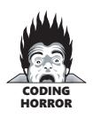
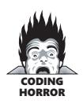
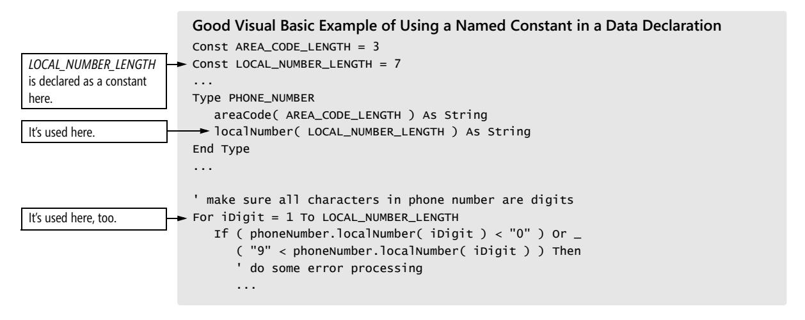
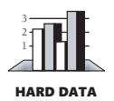
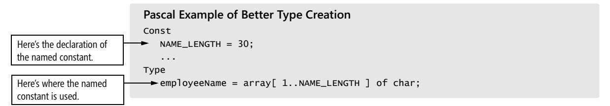

# Chapter 12: Fundamental Data Types


<span id="page-327-0"></span>
### cc2e.com/1278 Contents

- 12.1 Numbers in General: page 292
- 12.2 Integers: page 293
- 12.3 Floating-Point Numbers: page 295
- 12.4 Characters and Strings: page 297
- 12.5 Boolean Variables: page 301
- 12.6 Enumerated Types: page 303
- 12.7 Named Constants: page 307
- 12.8 Arrays: page 310
- 12.9 Creating Your Own Types (Type Aliasing[\): page 311](#page-347-0)

#### Related Topics

- Naming data: Chapter 11
- Unusual data types: Chapter 13
- General issues in using variables: Chapter 10
- Formatting data declarations: "Laying Out Data Declarations" in Section 31.5
- Documenting variables: "Commenting Data Declarations" in Section 32.5
- Creating classes: Chapter 6

The fundamental data types are the basic building blocks for all other data types. This chapter contains tips for using numbers (in general), integers, floating-point numbers, characters and strings, boolean variables, enumerated types, named constants, and arrays. The final section in this chapter describes how to create your own types.

This chapter covers basic troubleshooting for the fundamental types of data. If you've got your fundamental-data bases covered, skip to the end of the chapter, review the checklist of problems to avoid, and move on to the discussion of unusual data types in Chapter 13.

### 12.1 Numbers in General

Here are several guidelines for making your use of numbers less error-prone:

**Cross-Reference** For more details on using named constants instead of magic numbers, see Section 12.7, "Named Constants," later in this chapter.

*Avoid "magic numbers"* Magic numbers are literal numbers, such as *100* or *47524*, that appear in the middle of a program without explanation. If you program in a language that supports named constants, use them instead. If you can't use named constants, use global variables when it's feasible to do so.

Avoiding magic numbers yields three advantages:

- Changes can be made more reliably. If you use named constants, you won't overlook one of the *100*s or change a *100* that refers to something else.
- Changes can be made more easily. When the maximum number of entries changes from *100* to *200*, if you're using magic numbers you have to find all the *100*s and change them to *200*s. If you use *100+1* or *100-1*, you'll also have to find all the *101*s and *99*s and change them to *201*s and *199*s. If you're using a named constant, you simply change the definition of the constant from *100* to *200* in one place.
- Your code is more readable. Sure, in the expression

```
for i = 0 to 99 do ...
```

you can guess that *99* refers to the maximum number of entries. But the expression

```
for i = 0 to MAX_ENTRIES-1 do ...
```

leaves no doubt. Even if you're certain that a number will never change, you get a readability benefit if you use a named constant.

*Use hard-coded 0s and 1s if you need to* The values *0* and *1* are used to increment, decrement, and start loops at the first element of an array. The *0* in

```
for i = 0 to CONSTANT do ...
is OK, and the 1 in 
total = total + 1
```

is OK. A good rule of thumb is that the only literals that should occur in the body of a program are *0* and *1*. Any other literals should be replaced with something more descriptive.

*Anticipate divide-by-zero errors* Each time you use the division symbol (/ in most languages), think about whether it's possible for the denominator of the expression to be *0*. If the possibility exists, write code to prevent a divide-by-zero error.

*Make type conversions obvious* Make sure that someone reading your code will be aware of it when a conversion between different data types occurs. In C++ you could say

```
y = x + (float) i
```

and in Microsoft Visual Basic you could say

```
y = x + CSng( i )
```

This practice also helps to ensure that the conversion is the one you want to occur different compilers do different conversions, so you're taking your chances otherwise.

**Cross-Reference** For a variation on this example, see "Avoid equality comparisons" in Section 12.3.

*Avoid mixed-type comparisons* If *x* is a floating-point number and *i* is an integer, the test

```
if ( i = x ) then ...
```

is almost guaranteed not to work. By the time the compiler figures out which type it wants to use for the comparison, converts one of the types to the other, does a bunch of rounding, and determines the answer, you'll be lucky if your program runs at all. Do the conversion manually so that the compiler can compare two numbers of the same type and you know exactly what's being compared.


*Heed your compiler's warnings* Many modern compilers tell you when you have different numeric types in the same expression. Pay attention! Every programmer has been asked at one time or another to help someone track down a pesky error, only to find that the compiler had warned about the error all along. Top programmers fix their code to eliminate all compiler warnings. It's easier to let the compiler do the work than to do it yourself.

#### 12.2 Integers

Bear these considerations in mind when using integers:

*Check for integer division* When you're using integers, 7/10 does not equal 0.7. It usually equals 0, or minus infinity, or the nearest integer, or—you get the picture. What it equals varies from language to language. This applies equally to intermediate results. In the real world 10 \* (7/10) = (10\*7) / 10 = 7. Not so in the world of integer arithmetic. 10 \* (7/10) equals 0 because the integer division (7/10) equals 0. The easiest way to remedy this problem is to reorder the expression so that the divisions are done last: (10\*7) / 10.

*Check for integer overflow* When doing integer multiplication or addition, you need to be aware of the largest possible integer. The largest possible unsigned integer is often 232-1 and is sometimes 216-1, or 65,535. The problem comes up when you multiply two numbers that produce a number bigger than the maximum integer. For

example, if you multiply 250 \* 300, the right answer is 75,000. But if the maximum integer is 65,535, the answer you'll get is probably 9464 because of integer overflow (75,000 - 65,536 = 9464). Table 12-1 shows the ranges of common integer types.

**Table 12-1 Ranges for Different Types of Integers**

| Integer Type    | Range                                                           |
|-----------------|-----------------------------------------------------------------|
| Signed 8-bit    | -128 through 127                                                |
| Unsigned 8-bit  | 0 through 255                                                   |
| Signed 16-bit   | -32,768 through 32,767                                          |
| Unsigned 16-bit | 0 through 65,535                                                |
| Signed 32-bit   | -2,147,483,648 through 2,147,483,647                            |
| Unsigned 32-bit | 0 through 4,294,967,295                                         |
| Signed 64-bit   | -9,223,372,036,854,775,808 through<br>9,223,372,036,854,775,807 |
| Unsigned 64-bit | 0 through 18,446,744,073,709,551,615                            |

The easiest way to prevent integer overflow is to think through each of the terms in your arithmetic expression and try to imagine the largest value each can assume. For example, if in the integer expression *m = j \* k*, the largest expected value for *j* is 200 and the largest expected value for *k* is 25, the largest value you can expect for *m* is *200 \* 25 = 5,000*. This is OK on a 32-bit machine since the largest integer is 2,147,483,647. On the other hand, if the largest expected value for *j* is 200,000 and the largest expected value for *k* is 100,000, the largest value you can expect for *m* is *200,000 \* 100,000 = 20,000,000,000*. This is not OK since 20,000,000,000 is larger than 2,147,483,647. In this case, you would have to use 64-bit integers or floating-point numbers to accommodate the largest expected value of *m*.

Also consider future extensions to the program. If *m* will never be bigger than 5,000, that's great. But if you expect *m* to grow steadily for several years, take that into account.

*Check for overflow in intermediate results* The number at the end of the equation isn't the only number you have to worry about. Suppose you have the following code:

```
Java Example of Overflow of Intermediate Results
int termA = 1000000;
int termB = 1000000;
int product = termA * termB / 1000000;
System.out.println( "( " + termA + " * " + termB + " ) / 1000000 = " + product );
```

If you think the *Product* assignment is the same as *(1,00,000\*1,000,000) / 1,000*,*000*, you might expect to get the answer *1,000,000*. But the code has to compute the intermediate result of *1,000,000\*1,000,000* before it can divide by the final *1,000,000*, and that means it needs a number as big as *1,000,000,000,000*. Guess what? Here's the result:

```
( 1000000 * 1000000 ) / 1000000 = -727
```

If your integers go to only 2,147,483,647, the intermediate result is too large for the integer data type. In this case, the intermediate result that should be *1,000,000,000,000* is *-727,379,968*, so when you divide by *1,000,000*, you get -*727*, rather than *1,000,000*.

You can handle overflow in intermediate results the same way you handle integer overflow, by switching to a long-integer or floating-point type.

#### 12.3 Floating-Point Numbers


KEY POINT

The main consideration in using floating-point numbers is that many fractional decimal numbers can't be represented accurately using the 1s and 0s available on a digital computer. Nonterminating decimals like 1/3 or 1/7 can usually be represented to only 7 or 15 digits of accuracy. In my version of Microsoft Visual Basic, a 32-bit floating-point representation of 1/3 equals 0.33333330. It's accurate to 7 digits. This is accurate enough for most purposes but inaccurate enough to trick you sometimes.

Following are a few specific guidelines for using floating-point numbers:

**Cross-Reference** For algorithms books that describe ways to solve these problems, see "Additional Resources on Data Types" in Section 10.1.

*Avoid additions and subtractions on numbers that have greatly different magnitudes* With a 32-bit floating-point variable, 1,000,000.00 + 0.1 probably produces an answer of 1,000,000.00 because 32 bits don't give you enough significant digits to encompass the range between 1,000,000 and 0.1. Likewise, 5,000,000.02 - 5,000,000.01 is probably 0.0.

Solutions? If you have to add a sequence of numbers that contains huge differences like this, sort the numbers first, and then add them starting with the smallest values. Likewise, if you need to sum an infinite series, start with the smallest term—essentially, sum the terms backwards. This doesn't eliminate round-off problems, but it minimizes them. Many algorithms books have suggestions for dealing with cases like this.

1 is equal to 2 for sufficiently large values of 1. —*Anonymous*

*Avoid equality comparisons* Floating-point numbers that should be equal are not always equal. The main problem is that two different paths to the same number don't always lead to the same number. For example, 0.1 added 10 times rarely equals 1.0. The following example shows two variables, *nominal* and *sum*, that should be equal but aren't.

```
Java Example of a Bad Comparison of Floating-Point Numbers 
The variable nominal is a
64-bit real.
                         double nominal = 1.0;
                         double sum = 0.0;
                         for ( int i = 0; i < 10; i++ ) {
sum is 10*0.1. It should be 
1.0.
                          sum += 0.1;
                         }
Here's the bad comparison. if ( nominal == sum ) {
                          System.out.println( "Numbers are the same." );
                         }
                         else {
                          System.out.println( "Numbers are different." );
                         }
```

As you can probably guess, the output from this program is

Numbers are different.

The line-by-line values of *sum* in the *for* loop look like this:

```
0.1
0.2
0.30000000000000004
0.4
0.5
0.6
0.7
0.7999999999999999
0.8999999999999999
0.9999999999999999
```

Thus, it's a good idea to find an alternative to using an equality comparison for floating-point numbers. One effective approach is to determine a range of accuracy that is acceptable and then use a boolean function to determine whether the values are close enough. Typically, you'd write an *Equals()* function that returns *true* if the values are close enough and *false* otherwise. In Java, such a function would look like this:

**Cross-Reference** This example is proof of the maxim that there's an exception to every rule. Variables in this realistic example have digits in their names. For the rule *against* using digits in variable names, see Section 11.7, "Kinds of Names to Avoid."

```
Java Example of a Routine to Compare Floating-Point Numbers 
final double ACCEPTABLE_DELTA = 0.00001;
boolean Equals( double Term1, double Term2 ) { 
 if ( Math.abs( Term1 - Term2 ) < ACCEPTABLE_DELTA ) {
 return true;
 }
 else {
 return false;
 }
}
```

If the code in the "bad comparison of floating-point numbers" example were converted so that this routine could be used for comparisons, the new comparison would look like this:

```
if ( Equals( Nominal, Sum ) ) ...
```

The output from the program when it uses this test is

Numbers are the same.

Depending on the demands of your application, it might be inappropriate to use a hard-coded value for *ACCEPTABLE\_DELTA*. You might need to compute *ACCEPTABLE\_DELTA* based on the size of the two numbers being compared.

*Anticipate rounding errors* Rounding-error problems are no different from the problem of numbers with greatly different magnitudes. The same issue is involved, and many of the same techniques help to solve rounding problems. In addition, here are common specific solutions to rounding problems:

- Change to a variable type that has greater precision. If you're using single-precision floating point, change to double-precision floating point, and so on.
- Change to binary coded decimal (BCD) variables. The BCD scheme is typically slower and takes up more storage space, but it prevents many rounding errors. This is particularly valuable if the variables you're using represent dollars and cents or other quantities that must balance precisely.
- Change from floating-point to integer variables. This is a roll-your-own approach to BCD variables. You will probably have to use 64-bit integers to get the precision you want. This technique requires you to keep track of the fractional part of your numbers yourself. Suppose you were originally keeping track of dollars using floating point with cents expressed as fractional parts of dollars. This is a normal way to handle dollars and cents. When you switch to integers, you have to keep track of cents using integers and of dollars using multiples of 100 cents. In other words, you multiply dollars by 100 and keep the cents in the 0-to-99 range of the variable. This might seem absurd at first glance, but it's an effective solution in terms of both speed and accuracy. You can make these manipulations easier by creating a *DollarsAndCents* class that hides the integer representation and supports the necessary numeric operations.

*Check language and library support for specific data types* Some languages, including Visual Basic, have data types such as *Currency* that specifically support data that is sensitive to rounding errors. If your language has a built-in data type that provides such functionality, use it!

### 12.4 Characters and Strings

This section provides some tips for using strings. The first applies to strings in all languages.

**Cross-Reference** Issues for using magic characters and strings are similar to those for magic numbers discussed in Section 12.1, "Numbers in General."

*Avoid magic characters and strings* Magic characters are literal characters (such as *'A'*) and magic strings are literal strings (such as *"Gigamatic Accounting Program"*) that appear throughout a program. If you program in a language that supports the use of named constants, use them instead. Otherwise, use global variables. Several reasons for avoiding literal strings exist:

■ For commonly occurring strings like the name of your program, command names, report titles, and so on, you might at some point need to change the string's contents. For example, *"Gigamatic Accounting Program"* might change to *"New and Improved! Gigamatic Accounting Program"* for a later version.

**Cross-Reference** Usually the performance impact of converting to BCD will be minimal. If you're concerned about the performance impact, see Section 25.6, "Summary of the Approach to Code Tuning."

- International markets are becoming increasingly important, and it's easier to translate strings that are grouped in a string resource file than it is to translate to them *in situ* throughout a program.
- String literals tend to take up a lot of space. They're used for menus, messages, help screens, entry forms, and so on. If you have too many, they grow beyond control and cause memory problems. String space isn't a concern in many environments, but in embedded systems programming and other applications in which storage space is at a premium, solutions to string-space problems are easier to implement if the strings are relatively independent of the source code.
- Character and string literals are cryptic. Comments or named constants clarify your intentions. In the next example, the meaning of *0x1B* isn't clear. The use of the *ESCAPE* constant makes the meaning more obvious.

```
C++ Examples of Comparisons Using Strings 
Bad! if ( input_char == 0x1B ) ...
Better!
                    if ( input_char == ESCAPE ) ...
```

*Watch for off-by-one errors* Because substrings can be indexed much as arrays are, watch for off-by-one errors that read or write past the end of a string.

**cc2e.com/1285** *Know how your language and environment support Unicode* In some languages such as Java, all strings are Unicode. In others such as C and C++, handling Unicode strings requires its own set of functions. Conversion between Unicode and other character sets is often required for communication with standard and third-party libraries. If some strings won't be in Unicode (for example, in C or C++), decide early on whether to use the Unicode character set at all. If you decide to use Unicode strings, decide where and when to use them.

> *Decide on an internationalization/localization strategy early in the lifetime of a program* Issues related to internationalization and localization are major issues. Key considerations are deciding whether to store all strings in an external resource and whether to create separate builds for each language or to determine the specific language at run time.

**cc2e.com/1292** *If you know you only need to support a single alphabetic language, consider using an ISO 8859 character set* For applications that need to support only a single alphabetic language (such as English) and that don't need to support multiple languages or an ideographic language (such as written Chinese), the ISO 8859 extended-ASCIItype standard makes a good alternative to Unicode.

*If you need to support multiple languages, use Unicode* Unicode provides more comprehensive support for international character sets than ISO 8859 or other standards.

*Decide on a consistent conversion strategy among string types* If you use multiple string types, one common approach that helps keep the string types distinct is to keep all strings in a single format within the program and convert the strings to other formats as close as possible to input and output operations.

#### Strings in C

C++'s standard template library string class has eliminated most of the traditional problems with strings in C. For those programmers working directly with C strings, here are some ways to avoid common pitfalls:

*Be aware of the difference between string pointers and character arrays* The problem with string pointers and character arrays arises because of the way C handles strings. Be alert to the difference between them in two ways:

■ Be suspicious of any expression containing a string that involves an equal sign. String operations in C are nearly always done with *strcmp()*, *strcpy()*, *strlen()*, and related routines. Equal signs often imply some kind of pointer error. In C, assignments do not copy string literals to a string variable. Suppose you have a statement like

```
StringPtr = "Some Text String";
```

In this case, *"Some Text String"* is a pointer to a literal text string and the assignment merely sets the pointer *StringPtr* to point to the text string. The assignment does not copy the contents to *StringPtr*.

■ Use a naming convention to indicate whether the variables are arrays of characters or pointers to strings. One common convention is to use *ps* as a prefix to indicate a *pointer* to a *string* and *ach* as a prefix for an *array* of *characters*. Although they're not always wrong, you should regard expressions involving both *ps* and *ach* prefixes with suspicion.

*Declare C-style strings to have length* **CONSTANT+1** In C and C++, off-by-one errors with C-style strings are common because it's easy to forget that a string of length *n* requires *n + 1* bytes of storage and to forget to leave room for the null terminator (the byte set to 0 at the end of the string). An effective way to avoid such problems is to use named constants to declare all strings. A key in this approach is that you use the named constant the same way every time. Declare the string to be length *CON-STANT+1*, and then use *CONSTANT* to refer to the length of a string in the rest of the code. Here's an example:

```
C Example of Good String Declarations
                       /* Declare the string to have length of "constant+1".
                        Every other place in the program, "constant" rather 
                        than "constant+1" is used. */
The string is declared to be of 
length NAME_LENGTH +1.
                       char name[ NAME_LENGTH + 1 ] = { 0 }; /* string of length NAME_LENGTH */
                       ...
                       /* Example 1: Set the string to all 'A's using the constant,
                        NAME_LENGTH, as the number of 'A's that can be copied.
                        Note that NAME_LENGTH rather than NAME_LENGTH + 1 is used. */
Operations on the string 
using NAME_LENGTH
here…
                       for ( i = 0; i < NAME_LENGTH; i++ )
                        name[ i ] = 'A';
                       ...
                       /* Example 2: Copy another string into the first string using 
                        the constant as the maximum length that can be copied. */
…and here. strncpy( name, some_other_name, NAME_LENGTH );
```

If you don't have a convention to handle this, you'll sometimes declare the string to be of length *NAME\_LENGTH* and have operations on it with *NAME\_ LENGTH-1*; at other times you'll declare the string to be of length *NAME\_LENGTH+1* and have operations on it work with length *NAME\_LENGTH*. Every time you use a string, you'll have to remember which way you declared it.

When you use strings the same way every time, you don't have to remember how you dealt with each string individually and you eliminate mistakes caused by forgetting the specifics of an individual string. Having a convention minimizes mental overload and programming errors.

**Cross-Reference** For more details on initializing data, see Section 10.3, "Guidelines for Initializing Variables."

*Initialize strings to null to avoid endless strings* C determines the end of a string by finding a null terminator, a byte set to 0 at the end of the string. No matter how long you think the string is, C doesn't find the end of the string until it finds a 0 byte. If you forget to put a null at the end of the string, your string operations might not act the way you expect them to.

You can avoid endless strings in two ways. First, initialize arrays of characters to *0* when you declare them:

```
C Example of a Good Declaration of a Character Array
char EventName[ MAX_NAME_LENGTH + 1 ] = { 0 };
```

Second, when you allocate strings dynamically, initialize them to *0* by using *calloc()* instead of *malloc()*. *calloc()* allocates memory and initializes it to *0*. *malloc()* allocates memory without initializing it, so you take your chances when you use memory allocated by *malloc()*.

**Cross-Reference** For more discussion of arrays, read Section 12.8, "Arrays," later in this chapter.

*Use arrays of characters instead of pointers in C* If memory isn't a constraint—and often it isn't—declare all your string variables as arrays of characters. This helps to avoid pointer problems, and the compiler will give you more warnings when you do something wrong.

*Use* **strncpy()** *instead of* **strcpy()** *to avoid endless strings* String routines in C come in safe versions and dangerous versions. The more dangerous routines such as *strcpy()* and *strcmp()* keep going until they run into a null terminator. Their safer companions, *strncpy()* and *strncmp()*, take a parameter for maximum length so that even if the strings go on forever, your function calls won't.

#### 12.5 Boolean Variables

It's hard to misuse logical or boolean variables, and using them thoughtfully makes your program cleaner.

**Cross-Reference** For details on using comments to document your program, see Chapter 32, "Self-Documenting Code."

*Use boolean variables to document your program* Instead of merely testing a boolean expression, you can assign the expression to a variable that makes the implication of the test unmistakable. For example, in the next fragment, it's not clear whether the purpose of the *if* test is to check for completion, for an error condition, or for something else:

**Cross-Reference** For an example of using a boolean function to document your program, see "Making Complicated Expressions Simple" in Section 19.1.

```
Java Example of Boolean Test in Which the Purpose Is Unclear
if ( ( elementIndex < 0 ) || ( MAX_ELEMENTS < elementIndex ) ||
 ( elementIndex == lastElementIndex ) 
 ) {
 ...
}
```

In the next fragment, the use of boolean variables makes the purpose of the *if* test clearer:

```
Java Example of Boolean Test in Which the Purpose Is Clear 
finished = ( ( elementIndex < 0 ) || ( MAX_ELEMENTS < elementIndex ) );
repeatedEntry = ( elementIndex == lastElementIndex );
if ( finished || repeatedEntry ) {
 ...
}
```

*Use boolean variables to simplify complicated tests* Often, when you have to code a complicated test, it takes several tries to get it right. When you later try to modify the test, it can be hard to understand what the test was doing in the first place. Logical variables can simplify the test. In the previous example, the program is really testing for two conditions: whether the routine is finished and whether it's working on a repeated entry. By creating the boolean variables *finished* and *repeatedEntry*, you make the *if* test simpler: easier to read, less error prone, and easier to modify.

Here's another example of a complicated test:



```
Visual Basic Example of a Complicated Test
If ( ( document.AtEndOfStream() ) And ( Not inputError ) ) And _
 ( ( MIN_LINES <= lineCount ) And ( lineCount <= MAX_LINES ) ) And _
 ( Not ErrorProcessing() ) Then
 ' do something or other
 ...
End If
```

The test in the example is fairly complicated but not uncommonly so. It places a heavy mental burden on the reader. My guess is that you won't even try to understand the *if* test but will look at it and say, "I'll figure it out later if I really need to." Pay attention to that thought because that's exactly the same thing other people do when they read your code and it contains tests like this.

Here's a rewrite of the code with boolean variables added to simplify the test:

```
Visual Basic Example of a Simplified Test
                       allDataRead = ( document.AtEndOfStream() ) And ( Not inputError )
                       legalLineCount = ( MIN_LINES <= lineCount ) And ( lineCount <= MAX_LINES )
Here's the simplified test. If ( allDataRead ) And ( legalLineCount ) And ( Not ErrorProcessing() ) Then
                        ' do something or other
                        ...
                       End If
```

This second version is simpler. My guess is that you'll read the boolean expression in the *if* test without any difficulty.

*Create your own boolean type, if necessary* Some languages, such as C++, Java, and Visual Basic have a predefined boolean type. Others, such as C, do not. In languages such as C, you can define your own boolean type. In C, you'd do it this way:

```
C Example of Defining the BOOLEAN Type Using a Simple typedef
typedef int BOOLEAN;
```

Or you could do it this way, which provides the added benefit of defining *true* and *false* at the same time:

```
C Example of Defining the Boolean Type Using an Enum
enum Boolean { 
 True=1, 
 False=(!True) 
};
```

Declaring variables to be *BOOLEAN* rather than *int* makes their intended use more obvious and makes your program a little more self-documenting.

#### 12.6 Enumerated Types

An enumerated type is a type of data that allows each member of a class of objects to be described in English. Enumerated types are available in C++ and Visual Basic and are generally used when you know all the possible values of a variable and want to express them in words. Here are some examples of enumerated types in Visual Basic:

```
Visual Basic Examples of Enumerated Types 
Public Enum Color
 Color_Red
 Color_Green
 Color_Blue
End Enum 
Public Enum Country
 Country_China
 Country_England
 Country_France
 Country_Germany
 Country_India
 Country_Japan
 Country_Usa
End Enum 
Public Enum Output
 Output_Screen
 Output_Printer
 Output_File
End Enum
```

Enumerated types are a powerful alternative to shopworn schemes in which you explicitly say, "1 stands for red, 2 stands for green, 3 stands for blue...." This ability suggests several guidelines for using enumerated types:

*Use enumerated types for readability* Instead of writing statements like

```
if chosenColor = 1
```

you can write more readable expressions like

```
if chosenColor = Color_Red
```

Anytime you see a numeric literal, ask whether it makes sense to replace it with an enumerated type.

Enumerated types are especially useful for defining routine parameters. Who knows what the parameters to this function call are?



```
C++ Examples of a Routine Call That Would be Better with Enumerated Types
int result = RetrievePayrollData( data, true, false, false, true );
```

In contrast, the parameters to this function call are more understandable:

```
C++ Examples of a Routine Call That Uses Enumerated Types for Readability
int result = RetrievePayrollData( 
 data, 
 EmploymentStatus_CurrentEmployee, 
 PayrollType_Salaried, 
 SavingsPlan_NoDeduction, 
 MedicalCoverage_IncludeDependents
);
```

*Use enumerated types for reliability* With a few languages (Ada in particular), an enumerated type lets the compiler perform more thorough type checking than it can with integer values and constants. With named constants, the compiler has no way of knowing that the only legal values are *Color\_Red*, *Color\_Green*, and *Color\_Blue*. The compiler won't object to statements like *color = Country\_England* or *country = Output\_Printer*. If you use an enumerated type, declaring a variable as *Color*, the compiler will allow the variable to be assigned only the values *Color\_Red*, *Color\_Green*, and *Color\_Blue*.

*Use enumerated types for modifiability* Enumerated types make your code easy to modify. If you discover a flaw in your "1 stands for red, 2 stands for green, 3 stands for blue" scheme, you have to go through your code and change all the *1*s, *2*s, *3*s, and so on. If you use an enumerated type, you can continue adding elements to the list just by putting them into the type definition and recompiling.

*Use enumerated types as an alternative to boolean variables* Often, a boolean variable isn't rich enough to express the meanings it needs to. For example, suppose you have a routine return *true* if it has successfully performed its task and *False* otherwise. Later you might find that you really have two kinds of *False*. The first kind means that the task failed and the effects are limited to the routine itself; the second kind means that the task failed and caused a fatal error that will need to be propagated to the rest of the program. In this case, an enumerated type with the values *Status\_Success*, *Status\_Warning*, and *Status\_FatalError* would be more useful than a boolean with the values *true* and *false*. This scheme can easily be expanded to handle additional distinctions in the kinds of success or failure.

*Check for invalid values* When you test an enumerated type in an *if* or *case* statement, check for invalid values. Use the *else* clause in a *case* statement to trap invalid values:

```
Good Visual Basic Example of Checking for Invalid Values in an Enumerated Type
                      Select Case screenColor
                       Case Color_Red
                       ...
                       Case Color_Blue
                       ...
                       Case Color_Green
                       ...
Here's the test for the 
invalid value.
                       Case Else
                       DisplayInternalError( False, "Internal Error 752: Invalid color." )
                      End Select
```

*Define the first and last entries of an enumeration for use as loop limits* Defining the first and last elements in an enumeration to be *Color\_First*, *Color\_Last*, *Country\_First*, *Country\_Last*, and so on allows you to write a loop that loops through the elements of an enumeration. You set up the enumerated type by using explicit values, as shown here:

```
Visual Basic Example of Setting First and Last Values in an Enumerated Type
Public Enum Country
 Country_First = 0 
 Country_China = 0
 Country_England = 1
 Country_France = 2
 Country_Germany = 3
 Country_India = 4
 Country_Japan = 5
 Country_Usa = 6
 Country_Last = 6
End Enum
```

Now the *Country\_First* and *Country\_Last* values can be used as loop limits:

```
Good Visual Basic Example of Looping Through Elements in an Enumeration
' compute currency conversions from US currency to target currency
Dim usaCurrencyConversionRate( Country_Last ) As Single
Dim iCountry As Country
For iCountry = Country_First To Country_Last
 usaCurrencyConversionRate( iCountry ) = ConversionRate( Country_Usa, iCountry )
Next
```

*Reserve the first entry in the enumerated type as invalid* When you declare an enumerated type, reserve the first value as an invalid value. Many compilers assign the first element in an enumerated type to the value *0*. Declaring the element that's mapped to *0* to be invalid helps to catch variables that were not properly initialized because they are more likely to be *0* than any other invalid value.

Here's how the *Country* declaration would look with that approach:

```
Visual Basic Example of Declaring the First Value in an Enumeration to Be Invalid
Public Enum Country
 Country_InvalidFirst = 0 
 Country_First = 1
 Country_China = 1
 Country_England = 2
 Country_France = 3
 Country_Germany = 4
 Country_India = 5
 Country_Japan = 6
 Country_Usa = 7
 Country_Last = 7
End Enum
```

*Define precisely how* **First** *and* **Last** *elements are to be used in the project coding standard, and use them consistently* Using *InvalidFirst*, *First*, and *Last* elements in enumerations can make array declarations and loops more readable. But it has the potential to create confusion about whether the valid entries in the enumeration begin at *0* or *1* and whether the first and last elements of the enumeration are valid. If this technique is used, the project's coding standard should require that *InvalidFirst*, *First*, and *Last* elements be used consistently in all enumerations to reduce errors.

*Beware of pitfalls of assigning explicit values to elements of an enumeration* Some languages allow you to assign specific values to elements within an enumeration, as shown in this C++ example:

```
C++ Example of Explicitly Assigning Values to an Enumeration
enum Color {
 Color_InvalidFirst = 0,
 Color_First = 1,
 Color_Red = 1,
 Color_Green = 2,
 Color_Blue = 4,
 Color_Black = 8,
 Color_Last = 8
};
```

In this example, if you declared a loop index of type *Color* and attempted to loop through *Color*s, you would loop through the invalid values of 3, 5, 6, and 7 as well as the valid values of 1, 2, 4, and 8.

#### If Your Language Doesn't Have Enumerated Types

If your language doesn't have enumerated types, you can simulate them with global variables or classes. For example, you could use these declarations in Java:

**Cross-Reference** At the time I'm writing this, Java does not support enumerated types. By the time you read this, it probably will. This is a good example of the "rolling wave of technology" discussed in Section 4.3, "Your Location on the Technology Wave."

```
Java Example of Simulating Enumerated Types
// set up Country enumerated type
class Country {
 private Country() {}
 public static final Country China = new Country();
 public static final Country England = new Country();
 public static final Country France = new Country();
 public static final Country Germany = new Country();
 public static final Country India = new Country();
 public static final Country Japan = new Country();
}
// set up Output enumerated type
class Output {
 private Output() {}
 public static final Output Screen = new Output();
 public static final Output Printer = new Output();
 public static final Output File = new Output();
}
```

These enumerated types make your program more readable because you can use the public class members such as *Country.England* and *Output.Screen* instead of named constants. This particular method of creating enumerated types is also typesafe; because each type is declared as a class, the compiler will check for invalid assignments such as *Output output = Country.England* (Bloch 2001).

In languages that don't support classes, you can achieve the same basic effect through disciplined use of global variables for each of the elements of the enumeration.

#### 12.7 Named Constants

A named constant is like a variable except that you can't change the constant's value once you've assigned it. Named constants enable you to refer to fixed quantities, such as the maximum number of employees, by a name rather than a number— *MAXIMUM\_EMPLOYEES* rather than *1000*, for instance.

Using a named constant is a way of "parameterizing" your program—putting an aspect of your program that might change into a parameter that you can change in one place rather than having to make changes throughout the program. If you have ever declared an array to be as big as you think it will ever need to be and then run out of space because it wasn't big enough, you can appreciate the value of named constants.

When an array size changes, you change only the definition of the constant you used to declare the array. This "single-point control" goes a long way toward making software truly "soft": easy to work with and change.

*Use named constants in data declarations* Using named constants helps program readability and maintainability in data declarations and in statements that need to know the size of the data they are working with. In the following example, you use *LOCAL\_NUMBER\_LENGTH* to describe the length of employee phone numbers rather than the literal 7.



This is a simple example, but you can probably imagine a program in which the information about the phone-number length is needed in many places.

At the time you create the program, the employees all live in one country, so you need only seven digits for their phone numbers. As the company expands and branches are established in different countries, you'll need longer phone numbers. If you have parameterized, you can make the change in only one place: in the definition of the named constant *LOCAL\_NUMBER\_LENGTH*.

**Further Reading** For more details on the value of single-point control, see pages 57–60 of *Software Conflict* (Glass 1991).

As you might expect, the use of named constants has been shown to greatly aid program maintenance. As a general rule, any technique that centralizes control over things that might change is a good technique for reducing maintenance efforts (Glass 1991).

*Avoid literals, even "safe" ones* In the following loop, what do you think the *12* represents?

```
Visual Basic Example of Unclear Code 
For i = 1 To 12
 profit( i ) = revenue( i ) – expense( i )
Next
```

Because of the specific nature of the code, it appears that the code is probably looping through the 12 months in a year. But are you *sure*? Would you bet your Monty Python collection on it?

In this case, you don't need to use a named constant to support future flexibility: it's not very likely that the number of months in a year will change anytime soon. But if the way the code is written leaves any shadow of a doubt about its purpose, clarify it with a well-named constant, like this:

```
Visual Basic Example of Clearer Code 
For i = 1 To NUM_MONTHS_IN_YEAR 
 profit( i ) = revenue( i ) – expense( i )
Next
```

This is better, but, to complete the example, the loop index should also be named something more informative:

```
Visual Basic Example of Even Clearer Code 
For month = 1 To NUM_MONTHS_IN_YEAR 
 profit( month ) = revenue( month ) – expense( month )
Next
```

This example seems quite good, but we can push it even one step further by using an enumerated type:

```
Visual Basic Example of Very Clear Code 
For month = Month_January To Month_December
 profit( month ) = revenue( month ) – expense( month )
Next
```

With this final example, there can be no doubt about the purpose of the loop. Even if you think a literal is safe, use named constants instead. Be a fanatic about rooting out literals in your code. Use a text editor to search for *2*, *3*, *4*, *5*, *6*, *7*, *8*, and *9* to make sure you haven't used them accidentally.

*Simulate named constants with appropriately scoped variables or classes* If your language doesn't support named constants, you can create your own. By using an approach similar to the approach suggested in the earlier Java example in which enumerated types were simulated, you can gain many of the advantages of named constants. Typical scoping rules apply: prefer local scope, class scope, and global scope in that order.

*Use named constants consistently* It's dangerous to use a named constant in one place and a literal in another to represent the same entity. Some programming practices beg for errors; this one is like calling an 800 number and having errors delivered

**Cross-Reference** For details on simulating enumerated types, see "If Your Language Doesn't Have Enumerated Types" in the previous section, Section 12.6.

to your door. If the value of the named constant needs to be changed, you'll change it and think you've made all the necessary changes. You'll overlook the hard-coded literals, your program will develop mysterious defects, and fixing them will be a lot harder than picking up the phone and yelling for help.

#### 12.8 Arrays

Arrays are the simplest and most common type of structured data. In some languages, arrays are the only type of structured data. An array contains a group of items that are all of the same type and that are directly accessed through the use of an array index. Here are some tips on using arrays.


*Make sure that all array indexes are within the bounds of the array* In one way or another, all problems with arrays are caused by the fact that array elements can be accessed randomly. The most common problem arises when a program tries to access an array element that's out of bounds. In some languages, this produces an error; in others, it simply produces bizarre and unexpected results.

*Consider using containers instead of arrays, or think of arrays as sequential structures* Some of the brightest people in computer science have suggested that arrays never be accessed randomly, but only sequentially (Mills and Linger 1986). Their argument is that random accesses in arrays are similar to random *goto*s in a program: such accesses tend to be undisciplined, error prone, and hard to prove correct. They suggest using sets, stacks, and queues, whose elements are accessed sequentially, rather than using arrays.



In a small experiment, Mills and Linger found that designs created this way resulted in fewer variables and fewer variable references. The designs were relatively efficient and led to highly reliable software.

Consider using container classes that you can access sequentially—sets, stacks, queues, and so on—as alternatives before you automatically choose an array.

**Cross-Reference** Issues in using arrays and loops are similar and related. For details on loops, see Chapter 16, "Controlling Loops."

*Check the end points of arrays* Just as it's helpful to think through the end points in a loop structure, you can catch a lot of errors by checking the end points of arrays. Ask yourself whether the code correctly accesses the first element of the array or mistakenly accesses the element before or after the first element. What about the last element? Will the code make an off-by-one error? Finally, ask yourself whether the code correctly accesses the middle elements of the array.

*If an array is multidimensional, make sure its subscripts are used in the correct order* It's easy to say *Array[ i ][ j ]* when you mean *Array[ j ][ i ]*, so take the time to doublecheck that the indexes are in the right order. Consider using more meaningful names than *i* and *j* in cases in which their roles aren't immediately clear.

*Watch out for index cross-talk* If you're using nested loops, it's easy to write *Array[ j ]* when you mean *Array[ i ]*. Switching loop indexes is called "index cross-talk." Check for this problem. Better yet, use more meaningful index names than *i* and *j* to make it harder to commit cross-talk mistakes in the first place.

*In C, use the* **ARRAY\_LENGTH()** *macro to work with arrays* You can build extra flexibility into your work with arrays by defining an *ARRAY\_LENGTH()* macro that looks like this:

```
C Example of Defining an ARRAY_LENGTH() Macro 
#define ARRAY_LENGTH( x ) (sizeof(x)/sizeof(x[0]))
```

When you use operations on an array, instead of using a named constant for the upper bound of the array size, use the *ARRAY\_LENGTH()* macro. Here's an example:

```
C Example of Using the ARRAY_LENGTH() Macro for Array Operations 
                       ConsistencyRatios[] =
                        { 0.0, 0.0, 0.58, 0.90, 1.12,
                        1.24, 1.32, 1.41, 1.45, 1.49,
                        1.51, 1.48, 1.56, 1.57, 1.59 };
                        ...
Here's where the macro is 
used.
                       for ( ratioIdx = 0; ratioIdx < ARRAY_LENGTH( ConsistencyRatios ); ratioIdx++ );
                        ...
```

This technique is particularly useful for dimensionless arrays such as the one in this example. If you add or subtract entries, you don't have to remember to change a named constant that describes the array's size. Or course, the technique works with dimensioned arrays too, but if you use this approach, you don't always need to set up an extra named constant for the array definition.

<span id="page-347-0"></span>
#### 12.9 Creating Your Own Types (Type Aliasing)


KEY POINT

Programmer-defined data types are one of the most powerful capabilities a language can give you to clarify your understanding of a program. They protect your program against unforeseen changes and make it easier to read—all without requiring you to design, construct, or test new classes. If you're using C, C++, or another language that allows user-defined types, take advantage of them!

**Cross-Reference** In many cases, it's better to create a class than to create a simple data type. For details, see Chapter 6, "Working Classes."

To appreciate the power of type creation, suppose you're writing a program to convert coordinates in an *x*, *y*, *z* system to latitude, longitude, and elevation. You think that double-precision floating-point numbers might be needed but would prefer to write a program with single-precision floating-point numbers until you're absolutely sure. You can create a new type specifically for coordinates by using a *typedef* statement in

C or C++ or the equivalent in another language. Here's how you'd set up the type definition in C++:

```
C++ Example of Creating a Type
typedef float Coordinate; // for coordinate variables
```

This type definition declares a new type, *Coordinate*, that's functionally the same as the type *float*. To use the new type, you declare variables with it just as you would with a predefined type such as *float*. Here's an example:

```
C++ Example of Using the Type You've Created
Routine1( ... ) {
 Coordinate latitude; // latitude in degrees
 Coordinate longitude; // longitude in degrees
 Coordinate elevation; // elevation in meters from earth center
 ...
}
...
Routine2( ... ) {
 Coordinate x; // x coordinate in meters
 Coordinate y; // y coordinate in meters
 Coordinate z; // z coordinate in meters
 ...
}
```

In this code, the variables *latitude*, *longitude*, *elevation*, *x*, *y*, and *z* are all declared to be of type *Coordinate*.

Now suppose that the program changes and you find that you need to use double-precision variables for coordinates after all. Because you defined a type specifically for coordinate data, all you have to change is the type definition. And you have to change it in only one place: in the *typedef* statement. Here's the changed type definition:

```
C++ Example of Changed Type Definition
typedef double Coordinate; // for coordinate variables
```

The original *float* has changed to *double*.

> Here's a second example—this one in Pascal. Suppose you're creating a payroll system in which employee names are a maximum of 30 characters long. Your users have told you that no one *ever* has a name longer than 30 characters. Do you hard-code the number *30* throughout your program? If you do, you trust your users a lot more than I trust mine! A better approach is to define a type for employee names:

```
Pascal Example of Creating a Type for Employee Names
Type
 employeeName = array[ 1..30 ] of char;
```

When a string or an array is involved, it's usually wise to define a named constant that indicates the length of the string or array and then use the named constant in the type definition. You'll find many places in your program in which to use the constant—this is just the first place in which you'll use it. Here's how it looks:



A more powerful example would combine the idea of creating your own types with the idea of information hiding. In some cases, the information you want to hide is information about the type of the data.

The coordinates example in C++ is about halfway to information hiding. If you always use *Coordinate* rather than *float* or *double*, you effectively hide the type of the data. In C++, this is about all the information hiding the language does for you. For the rest, you or subsequent users of your code have to have the discipline not to look up the definition of *Coordinate*. C++ gives you figurative, rather than literal, information-hiding ability.

Other languages, such as Ada, go a step further and support literal information hiding. Here's how the *Coordinate* code fragment would look in an Ada package that declares it:

```
Ada Example of Hiding Details of a Type Inside a Package
                          package Transformation is
This statement declares 
Coordinate as private to the 
package.
                           type Coordinate is private;
                           ...
```

Here's how *Coordinate* looks in another package, one that uses it:

```
Ada Example of Using a Type from Another Package
with Transformation;
...
procedure Routine1(...) ...
 latitude: Coordinate;
 longitude: Coordinate;
begin
 -- statements using latitude and longitude
 ...
end Routine1;
```

Notice that the *Coordinate* type is declared as *private* in the package specification. That means that the only part of the program that knows the definition of the *Coordinate* type is the private part of the *Transformation* package. In a development environment with a group of programmers, you could distribute only the package specification, which would make it harder for a programmer working on another package to look up the underlying type of *Coordinate*. The information would be literally hidden. Languages like C++ that require you to distribute the definition of *Coordinate* in header files undermine true information hiding.

These examples have illustrated several reasons to create your own types:

- **To make modifications easier** It's little work to create a new type, and it gives you a lot of flexibility.
- **To avoid excessive information distribution** Hard typing spreads data-typing details around your program instead of centralizing them in one place. This is an example of the information-hiding principle of centralization discussed in Section 6.2.
- **To increase reliability** In Ada, you can define types such as *type Age is range 0..99*. The compiler then generates run-time checks to verify that any variable of type *Age* is always within the range *0..99*.
- **To make up for language weaknesses** If your language doesn't have the predefined type you want, you can create it yourself. For example, C doesn't have a boolean or logical type. This deficiency is easy to compensate for by creating the type yourself:

typedef int Boolean;

#### Why Are the Examples of Creating Your Own Types in Pascal and Ada?

Pascal and Ada have gone the way of the stegosaurus and, in general, the languages that have replaced them are more usable. In the area of simple type definitions, however, I think C++, Java, and Visual Basic represent a case of three steps forward and one step back. An Ada declaration like

```
currentTemperature: INTEGER range 0..212;
contains important semantic information that a statement like
int temperature;
does not. Going a step further, a type declaration like
type Temperature is range 0..212;
...
currentTemperature: Temperature;
```

allows the compiler to ensure that *currentTemperature* is assigned only to other variables with the *Temperature* type, and very little extra coding is required to provide that extra safety margin.

Of course, a programmer could create a *Temperature* class to enforce the same semantics that were enforced automatically by the Ada language, but the step from creating a simple data type in one line of code to creating a class is a big step. In many situations, a programmer would create the simple type but would not step up to the additional effort of creating a class.

#### Guidelines for Creating Your Own Types

**Cross-Reference** In each case, consider whether creating a class might work better than a simple data type. For details, see Chapter 6, "Working Classes."

Keep these guidelines in mind as you create your own "user-defined" types:

*Create types with functionally oriented names* Avoid type names that refer to the kind of computer data underlying the type. Use type names that refer to the parts of the real-world problem that the new type represents. In the previous examples, the definitions created well-named types for coordinates and names—real-world entities. Similarly, you could create types for currency, payment codes, ages, and so on—aspects of real-world problems.

Be wary of creating type names that refer to predefined types. Type names like *BigInteger* or *LongString* refer to computer data rather than the real-world problem. The big advantage of creating your own type is that it provides a layer of insulation between your program and the implementation language. Type names that refer to the underlying programming-language types poke holes in that insulation. They don't give you much advantage over using a predefined type. Problem-oriented names, on the other hand, buy you easy modifiability and data declarations that are self-documenting.

*Avoid predefined types* If there is any possibility that a type might change, avoid using predefined types anywhere but in *typedef* or *type* definitions. It's easy to create new types that are functionally oriented, and it's hard to change data in a program that uses hardwired types. Moreover, use of functionally oriented type declarations partially documents the variables declared with them. A declaration like *Coordinate x* tells you a lot more about *x* than a declaration like *float x*. Use your own types as much as you can.

*Don't redefine a predefined type* Changing the definition of a standard type can create confusion. For example, if your language has a predefined type *Integer*, don't create your own type called *Integer*. Readers of your code might forget that you've redefined the type and assume that the *Integer* they see is the *Integer* they're used to seeing.

*Define substitute types for portability* In contrast to the advice that you not change the definition of a standard type, you might want to define substitutes for the standard types so that on different hardware platforms you can make the variables represent exactly the same entities. For example, you can define a type *INT32* and use it

instead of *int*, or a type *LONG64* instead of *long*. Originally, the only difference between the two types would be their capitalization. But when you moved the program to a new hardware platform, you could redefine the capitalized versions so that they could match the data types on the original hardware.

Be sure not to define types that are easily mistaken for predefined types. It would be possible to define *INT* rather than *INT32*, but you're better off creating a clean distinction between types you define and types provided by the language.

*Consider creating a class rather than using a* **typedef** Simple *typedefs* can go a long way toward hiding information about a variable's underlying type. In some cases, however, you might want the additional flexibility and control you'll achieve by creating a class. For details, see Chapter 6, "Working Classes."

#### cc2e.com/1206

**Cross-Reference** For a checklist that applies to general data issues rather than to issues with specific types of data, see the checklist on page 257 in Chapter 10, "General Issues in Using Variables." For a checklist of considerations in naming varieties, see the checklist on page 288 in Chapter 11, "The Power of Variable Names."

#### CHECKLIST: Fundamental Data

#### Numbers in General

- ❑ Does the code avoid magic numbers?
- ❑ Does the code anticipate divide-by-zero errors?
- ❑ Are type conversions obvious?
- ❑ If variables with two different types are used in the same expression, will the expression be evaluated as you intend it to be?
- ❑ Does the code avoid mixed-type comparisons?
- ❑ Does the program compile with no warnings?

#### Integers

- ❑ Do expressions that use integer division work the way they're meant to?
- ❑ Do integer expressions avoid integer-overflow problems?

#### Floating-Point Numbers

- ❑ Does the code avoid additions and subtractions on numbers with greatly different magnitudes?
- ❑ Does the code systematically prevent rounding errors?
- ❑ Does the code avoid comparing floating-point numbers for equality?

#### Characters and Strings

- ❑ Does the code avoid magic characters and strings?
- ❑ Are references to strings free of off-by-one errors?

- ❑ Does C code treat string pointers and character arrays differently?
- ❑ Does C code follow the convention of declaring strings to be length *CON-STANT+1*?
- ❑ Does C code use arrays of characters rather than pointers, when appropriate?
- ❑ Does C code initialize strings to *NULL*s to avoid endless strings?
- ❑ Does C code use *strncpy()* rather than *strcpy()*? And *strncat()* and *strncmp()*?

#### Boolean Variables

- ❑ Does the program use additional boolean variables to document conditional tests?
- ❑ Does the program use additional boolean variables to simplify conditional tests?

#### Enumerated Types

- ❑ Does the program use enumerated types instead of named constants for their improved readability, reliability, and modifiability?
- ❑ Does the program use enumerated types instead of boolean variables when a variable's use cannot be completely captured with *true* and *false*?
- ❑ Do tests using enumerated types test for invalid values?
- ❑ Is the first entry in an enumerated type reserved for "invalid"?

#### Named Constants

- ❑ Does the program use named constants for data declarations and loop limits rather than magic numbers?
- ❑ Have named constants been used consistently—not used as named constants in some places and as literals in others?

#### Arrays

- ❑ Are all array indexes within the bounds of the array?
- ❑ Are array references free of off-by-one errors?
- ❑ Are all subscripts on multidimensional arrays in the correct order?
- ❑ In nested loops, is the correct variable used as the array subscript, avoiding loop-index cross-talk?

#### Creating Types

- ❑ Does the program use a different type for each kind of data that might change?
- ❑ Are type names oriented toward the real-world entities the types represent rather than toward programming-language types?
- ❑ Are the type names descriptive enough to help document data declarations?
- ❑ Have you avoided redefining predefined types?
- ❑ Have you considered creating a new class rather than simply redefining a type?

#### Key Points

- Working with specific data types means remembering many individual rules for each type. Use this chapter's checklist to make sure that you've considered the common problems.
- Creating your own types makes your programs easier to modify and more selfdocumenting, if your language supports that capability.
- When you create a simple type using *typedef* or its equivalent, consider whether you should be creating a new class instead.
