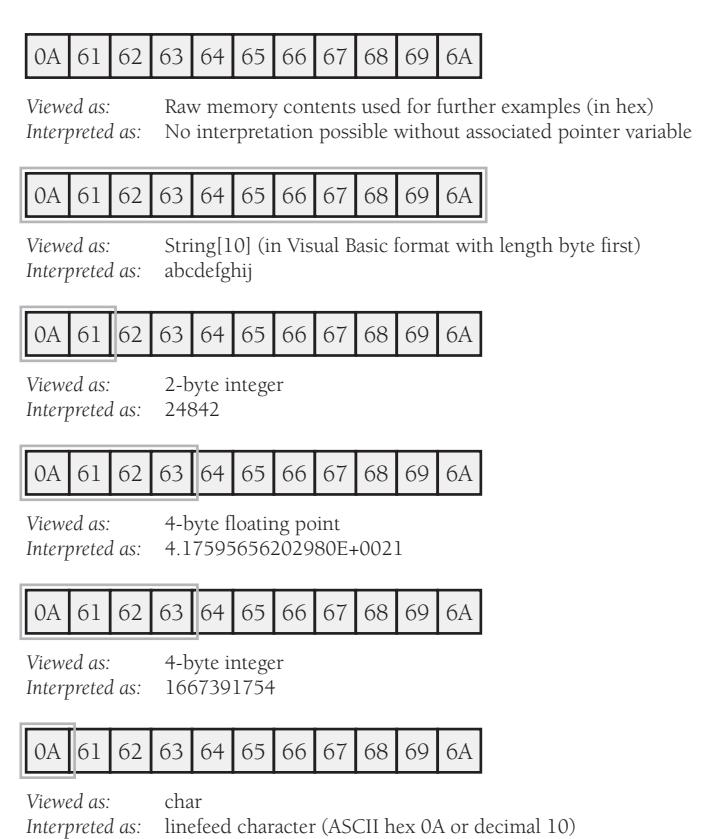
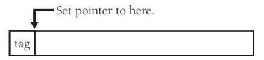
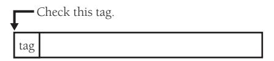
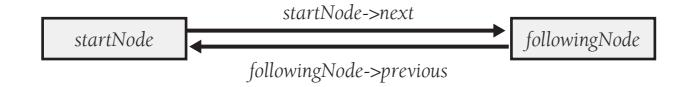
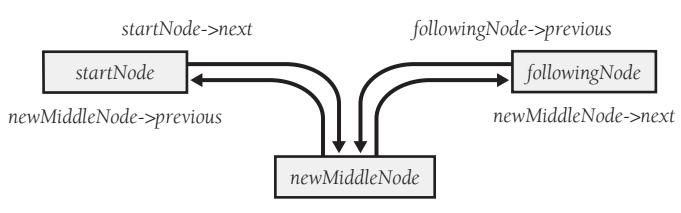

# Chapter 13: Unusual Data Types


<span id="page-355-0"></span>
### cc2e.com/1378 Contents

- 13.1 Structures: page 319
- 13.2 Pointers: page 323
- 13.3 Global Data: page 335

#### Related Topics

- Fundamental data types: Chapter 12
- Defensive programming: Chapter 8
- Unusual control structures: Chapter 17
- Complexity in software development: Section 5.2

Some languages support exotic kinds of data in addition to the data types discussed in Chapter 12, "Fundamental Data Types." Section 13.1 describes when you might still use structures rather than classes in some circumstances. Section 13.2 describes the ins and outs of using pointers. If you've ever encountered problems associated with using global data, Section 13.3 explains how to avoid such difficulties. If you think the data types described in this chapter are not the types you normally read about in modern object-oriented programming books, you're right. That's why the chapter is called "*Unusual* Data Types."

#### 13.1 Structures

The term "structure" refers to data that's built up from other types. Because arrays are a special case, they are treated separately in Chapter 12. This section deals with usercreated structured data—*struct*s in C and C++ and *Structures* in Microsoft Visual Basic. In Java and C++, classes also sometimes perform as structures (when the class consists entirely of public data members with no public routines).

You'll generally want to create classes rather than structures so that you can take advantage of the privacy and functionality offered by classes in addition to the public data supported by structures. But sometimes directly manipulating blocks of data can be useful, so here are some reasons for using structures:

*Use structures to clarify data relationships* Structures bundle groups of related items together. Sometimes the hardest part of figuring out a program is figuring out which data goes with which other data. It's like going to a small town and asking who's related to whom. You come to find out that everybody's kind of related to everybody else, but not really, and you never get a good answer.

If the data has been carefully structured, figuring out what goes with what is much easier. Here's an example of data that hasn't been structured:

```
Visual Basic Example of Misleading, Unstructured Variables
name = inputName
address = inputAddress
phone = inputPhone
title = inputTitle
department = inputDepartment
bonus = inputBonus
```

Because this data is unstructured, it looks as if all the assignment statements belong together. Actually, *name*, *address*, and *phone* are variables associated with individual employees, and *title*, *department*, and *bonus* are variables associated with a supervisor. The code fragment provides no hint that there are two kinds of data at work. In the code fragment below, the use of structures makes the relationships clearer:

```
Visual Basic Example of More Informative, Structured Variables
employee.name = inputName
employee.address = inputAddress
employee.phone = inputPhone
supervisor.title = inputTitle
supervisor.department = inputDepartment
supervisor.bonus = inputBonus
```

In the code that uses structured variables, it's clear that some of the data is associated with an employee, other data with a supervisor.

*Use structures to simplify operations on blocks of data* You can combine related elements into a structure and perform operations on the structure. It's easier to operate on the structure than to perform the same operation on each of the elements. It's also more reliable, and it takes fewer lines of code.

Suppose you have a group of data items that belong together—for instance, data about an employee in a personnel database. If the data isn't combined into a structure, merely copying the group of data can involve a lot of statements. Here's an example in Visual Basic:

#### Visual Basic Example of Copying a Group of Data Items Clumsily

```
newName = oldName
newAddress = oldAddress
newPhone = oldPhone
newSsn = oldSsn
newGender = oldGender
newSalary = oldSalary
```

Every time you want to transfer information about an employee, you have to have this whole group of statements. If you ever add a new piece of employee information—for example, *numWithholdings*—you have to find every place at which you have a block of assignments and add an assignment for *newNumWithholdings = oldNumWithholdings*.

Imagine how horrible swapping data between two employees would be. You don't have to use your imagination—here it is:


#### Visual Basic Example of Swapping Two Groups of Data the Hard Way

```
' swap new and old employee data
previousOldName = oldName
previousOldAddress = oldAddress
previousOldPhone = oldPhone
previousOldSsn = oldSsn
previousOldGender = oldGender
previousOldSalary = oldSalary
oldName = newName
oldAddress = newAddress
oldPhone = newPhone
oldSsn = newSsn
oldGender = newGender
oldSalary = newSalary
newName = previousOldName
newAddress = previousOldAddress
newPhone = previousOldPhone
newSsn = previousOldSsn
newGender = previousOldGender
newSalary = previousOldSalary
```

An easier way to approach the problem is to declare a structured variable:

#### Visual Basic Example of Declaring Structures

Structure Employee name As String address As String phone As String ssn As String gender As String salary As long

```
End Structure
Dim newEmployee As Employee
Dim oldEmployee As Employee
Dim previousOldEmployee As Employee
```

Now you can switch all the elements in the old and new employee structures with three statements:

```
Visual Basic Example of an Easier Way to Swap Two Groups of Data
previousOldEmployee = oldEmployee
oldEmployee = newEmployee
newEmployee = previousOldEmployee
```

If you want to add a field such as *numWithholdings*, you simply add it to the *Structure*  declaration. Neither the three statements above nor any similar statements throughout the program need to be modified. C++ and other languages have similar capabilities.

**Cross-Reference** For details on how much data to share between routines, see "Keep Coupling Loose" in Section 5.3.

*Use structures to simplify parameter lists* You can simplify routine parameter lists by using structured variables. The technique is similar to the one just shown. Rather than passing each of the elements needed individually, you can group related elements into a structure and pass the whole enchilada as a group structure. Here's an example of the hard way to pass a group of related parameters:

```
Visual Basic Example of a Clumsy Routine Call Without a Structure
HardWayRoutine( name, address, phone, ssn, gender, salary )
```

And this is an example of the easy way to call a routine by using a structured variable that contains the elements of the first parameter list:

```
Visual Basic Example of an Elegant Routine Call with a Structure
EasyWayRoutine( employee )
```

If you want to add *numWithholdings* to the first kind of call, you have to wade through your code and change every call to *HardWayRoutine()*. If you add a *numWithholdings* element to *Employee*, you don't have to change the parameters to *EasyWayRoutine()* at all.

**Cross-Reference** For details on the hazards of passing too much data, see "Keep Coupling Loose" in Section 5.3.

You can carry this technique to extremes, putting all the variables in your program into one big, juicy variable and then passing it everywhere. Careful programmers avoid bundling data any more than is logically necessary. Furthermore, careful programmers avoid passing a structure as a parameter when only one or two fields from the structure are needed—they pass the specific fields needed instead. This is an aspect of information hiding: some information is hidden *in* routines, and some is hidden *from* routines. Information is passed around on a need-to-know basis.

*Use structures to reduce maintenance* Because you group related data when you use structures, changing a structure requires fewer changes throughout a program. This is especially true in sections of code that aren't logically related to the change in the structure. Since changes tend to produce errors, fewer changes mean fewer errors. If your *Employee* structure has a *title* field and you decide to delete it, you don't need to change any of the parameter lists or assignment statements that use the whole structure. Of course, you have to change any code that deals specifically with employee titles, but that is conceptually related to deleting the *title* field and is hard to overlook.

The big advantage of structured the data is found in sections of code that bear no logical relation to the *title* field. Sometimes programs have statements that refer conceptually to a collection of data rather than to individual components. In such cases, individual components, such as the *title* field, are referenced merely because they are part of the collection. Such sections of code don't have any logical reason to work with the *title* field specifically, and those sections are easy to overlook when you change *title*. If you use a structure, it's all right to overlook such sections because the code refers to the collection of related data rather than to each component individually.

#### 13.2 Pointers


Pointer usage is one of the most error-prone areas of modern programming, to such an extent that modern languages like Java, C#, and Visual Basic don't provide a pointer data type. Using pointers is inherently complicated, and using them correctly requires that you have an excellent understanding of your compiler's memory-management scheme. Many common security problems, especially buffer overruns, can be traced back to erroneous use of pointers (Howard and LeBlanc 2003).

Even if your language doesn't require you to use pointers, a good understanding of pointers will help your understanding of how your programming language works. A liberal dose of defensive programming practices will help even further.

#### Paradigm for Understanding Pointers

Conceptually, every pointer consists of two parts: a location in memory and a knowledge of how to interpret the contents of that location.

#### Location in Memory

The location in memory is an address, often expressed in hexadecimal notation. An address on a 32-bit processor would be a 32-bit value, such as *0x0001EA40*. The pointer itself contains only this address. To use the data the pointer points to, you have to go to that address and interpret the contents of memory at that location. If you were to look at the memory in that location, it would be just a collection of bits. It has to be interpreted to be meaningful.

#### Knowledge of How to Interpret the Contents

The knowledge of how to interpret the contents of a location in memory is provided by the base type of the pointer. If a pointer points to an integer, what that really means is that the compiler interprets the memory location given by the pointer as an integer. Of course, you can have an integer pointer, a string pointer, and a floating-point pointer all pointing at the same memory location. But only one of the pointers interprets the contents at that location correctly.

In thinking about pointers, it's helpful to remember that memory doesn't have any inherent interpretation associated with it. It is only through use of a specific type of pointer that the bits in a particular location are interpreted as meaningful data.

Figure 13-1 shows several views of the same location in memory, interpreted in several different ways.



**Figure 13-1** The amount of memory used by each data type is shown by double lines.

In each of the cases in Figure 13-1, the pointer points to the location containing the hex value *0x0A*. The number of bytes used beyond the *0A* depends on how the memory is interpreted. The way memory contents are used also depends on how the memory is

interpreted. (It also depends on what processor you're using, so keep that in mind if you try to duplicate these results on your Desktop Cray.) The same raw memory contents can be interpreted as a string, an integer, a floating point, or anything else—it all depends on the base type of the pointer that points to the memory.

#### General Tips on Pointers

With many types of defects, locating the error is the easiest part of dealing with the error and correcting it is the hard part. Pointer errors are different. A pointer error is usually the result of a pointer's pointing somewhere it shouldn't. When you assign a value to a bad pointer variable, you write data into an area of memory you shouldn't. This is called "memory corruption." Sometimes memory corruption produces horrible, fiery system crashes; sometimes it alters the results of a calculation in another part of the program; sometimes it causes your program to skip routines unpredictably; and sometimes it doesn't do anything at all. In the last case, the pointer error is a ticking time bomb, waiting to ruin your program five minutes before you show it to your most important customer. Symptoms of pointer errors tend to be unrelated to causes of pointer errors. Thus, most of the work in correcting a pointer error is locating the cause.


Working with pointers successfully requires a two-pronged strategy. First, avoid installing pointer errors in the first place. Pointer errors are so difficult to find that extra preventive measures are justified. Second, detect pointer errors as soon after they are coded as possible. Symptoms of pointer errors are so erratic that extra measures to make the symptoms more predictable are justified. Here's how to achieve these key goals:

*Isolate pointer operations in routines or classes* Suppose you use a linked list in several places in a program. Rather than traversing the list manually each place it's used, write access routines such as *NextLink()*, *PreviousLink()*, *InsertLink()*, and *DeleteLink()*. By minimizing the number of places in which pointers are accessed, you minimize the possibility of making careless mistakes that spread throughout your program and take forever to find. Because the code is then relatively independent of data-implementation details, you also improve the chance that you can reuse it in other programs. Writing routines for pointer allocation is another way to centralize control over your data.

*Declare and define pointers at the same time* Assigning a variable its initial value close to where it is declared is generally good programming practice, and it's all the more valuable when working with pointers. Here is an example of what not to do:


#### C++ Example of Bad Pointer Initialization

```
Employee *employeePtr;
// lots of code
...
employeePtr = new Employee;
```

If even this code works correctly initially, it's error-prone under modification because a chance exists that someone will try to use *employeePtr* between the point where the pointer is declared and the time it's initialized. Here's a safer approach:

```
C++ Example of Good Pointer Initialization
// lots of code
...
Employee *employeePtr = new Employee;
```

*Delete pointers at the same scoping level as they were allocated* Keep allocation and deallocation of pointers symmetric. If you use a pointer within a single scope, call *new* to allocate and *delete* to deallocate the pointer within the same scope. If you allocate a pointer inside a routine, deallocate it inside a sister routine. If you allocate a pointer inside an object's constructor, deallocate it inside the object's destructor. A routine that allocates memory and then expects its client code to deallocate the memory manually creates an inconsistency that is ripe for error.

*Check pointers before using them* Before you use a pointer in a critical part of your program, make sure the memory location it points to is reasonable. For example, if you expect memory locations to be between *StartData* and *EndData*, you should take a suspicious view of a pointer that points before *StartData* or after *EndData*. You'll have to determine what the values of *StartData* and *EndData* are in your environment. You can set this up to work automatically if you use pointers through access routines rather than manipulate them directly.

*Check the variable referenced by the pointer before using it* Sometimes you can perform reasonableness checks on the value the pointer points to. For example, if you're supposed to be pointing to an integer value between 0 and 1000, you should be suspicious of values over 1000. If you're pointing to a C++-style string, you might be suspicious of strings with lengths greater than 100. This can also be done automatically if you work with pointers through access routines.

*Use dog-tag fields to check for corrupted memory* A "tag field" or "dog tag" is a field you add to a structure solely for the purpose of error checking. When you allocate a variable, put a value that should remain unchanged into its tag field. When you use the structure—especially when you delete the memory—check the tag field's value. If the tag field doesn't have the expected value, the data has been corrupted.

When you delete the pointer, corrupt the field so that if you accidentally try to free the same pointer again, you'll detect the corruption. For example, let's say that you need to allocate 100 bytes:

**1.** First, *new* 104 bytes, 4 bytes more than requested.

| 104 bytes |  |  |
|-----------|--|--|

**2.** Set the first 4 bytes to a dog-tag value, and then return a pointer to the memory that starts after that.



**3.** When the time comes to delete the pointer, check the tag.



- **4.** If the tag is OK, set it to *0* or some other value that you and your program recognize as an invalid tag value. You don't want the value to be mistaken for a valid tag after the memory has been freed. Set the data to *0*, *0xCC*, or some other nonrandom value for the same reason.
- **5.** Finally, delete the pointer.

```
Free the whole 104 bytes
```

Putting a dog tag at the beginning of the memory block you've allocated allows you to check for redundant attempts to deallocate the memory block without needing to maintain a list of all the memory blocks you've allocated. Putting the dog tag at the end of the memory block allows you to check for overwriting memory beyond the location that was supposed to be used. You can use tags at the beginning and the end of the block to accomplish both objectives.

You can use this approach in concert with the reasonableness check suggested earlier—checking that the pointers are between *StartData* and *EndData*. To be sure that a pointer points to a reasonable location, rather than checking for a probable range of memory, check to see that the pointer is in the list of allocated pointers.

You could check the tag field just once before you delete the variable. A corrupted tag would then tell you that sometime during the life of that variable its contents were corrupted. The more often you check the tag field, however, the closer to the root of the problem you will detect the corruption.

*Add explicit redundancies* An alternative to using a tag field is to use certain fields twice. If the data in the redundant fields doesn't match, you know memory has been corrupted. This can result in a lot of overhead if you manipulate pointers directly. If you isolate pointer operations in routines, however, it adds duplicate code in only a few places.

*Use extra pointer variables for clarity* By all means, don't skimp on pointer variables. The point is made elsewhere that a variable shouldn't be used for more than one purpose. This is especially true for pointer variables. It's hard enough to figure out what someone is doing with a linked list without having to figure out why one *genericLink* variable is used over and over again or what *pointer->next->last->next* is pointing at. Consider this code fragment:

```
C++ Example of Traditional Node Insertion Code
                       void InsertLink(
                        Node *currentNode,
                        Node *insertNode
                        ) {
                        // insert "insertNode" after "currentNode"
                        insertNode->next = currentNode->next;
                        insertNode->previous = currentNode;
                        if ( currentNode->next != NULL ) {
This line is needlessly 
difficult.
                        currentNode->next->previous = insertNode;
                        }
                        currentNode->next = insertNode;
                       }
```

This is traditional code for inserting a node in a linked list, and it's needlessly hard to understand. Inserting a new node involves three objects: the current node, the node currently following the current node, and the node to be inserted between them. The code fragment explicitly acknowledges only two objects: *insertNode* and *currentNode*. It forces you to figure out and remember that *currentNode->next* is also involved. If you tried to diagram what is happening without the node originally following *currentNode*, you would get something like this:

```
currentNode insertNode
```

A better diagram would identify all three objects. It would look like this:


Here's code that explicitly references all three of the objects involved:

```
C++ Example of More Readable Node-Insertion Code
void InsertLink(
 Node *startNode,
 Node *newMiddleNode
 ) {
 // insert "newMiddleNode" between "startNode" and "followingNode"
 Node *followingNode = startNode->next;
 newMiddleNode->next = followingNode;
 newMiddleNode->previous = startNode;
 if ( followingNode != NULL ) {
 followingNode->previous = newMiddleNode;
 }
 startNode->next = newMiddleNode;
}
```

This code fragment has an extra line of code, but without the first fragment's *current-Node->next->previous*, it's easier to follow.

*Simplify complicated pointer expressions* Complicated pointer expressions are hard to read. If your code contains expressions like p->q->r->s.data, think about the person who has to read the expression. Here's a particularly egregious example:


```
C++ Example of a Pointer Expression That's Hard to Understand
for ( rateIndex = 0; rateIndex < numRates; rateIndex++ ) {
 netRate[ rateIndex ] = baseRate[ rateIndex ] * rates->discounts->factors->net;
}
```

Complicated expressions like the pointer expression in this example make for code that has to be figured out rather than read. If your code contains a complicated expression, assign it to a well-named variable to clarify the intent of the operation. Here's an improved version of the example:

```
C++ Example of Simplifying a Complicated Pointer Expression
quantityDiscount = rates->discounts->factors->net;
for ( rateIndex = 0; rateIndex < numRates; rateIndex++ ) {
 netRate[ rateIndex ] = baseRate[ rateIndex ] * quantityDiscount;
}
```

With this simplification, not only do you get a gain in readability, but you might also get a boost in performance from simplifying the pointer operation inside the loop. As usual, you'd have to measure the performance benefit before you bet any folding money on it.

*Draw a picture* Code descriptions of pointers can get confusing. It usually helps to draw a picture. For example, a picture of the linked-list insertion problem might look like the one shown in Figure 13-2.

**Cross-Reference** Diagrams such as the one in Figure 13-2 can become part of the external documentation of your program. For details on good documentation practices, see Chapter 32, "Self-Documenting Code."

#### Initial Linkage



#### Desired Linkage



**Figure 13-2** An example of a picture that helps us think through the steps involved in relinking pointers.

*Delete pointers in linked lists in the right order* A common problem in working with dynamically allocated linked lists is freeing the first pointer in the list first and then not being able to get to the next pointer in the list. To avoid this problem, make sure that you have a pointer to the next element in a list before you free the current one.

*Allocate a reserve parachute of memory* If your program uses dynamic memory, you need to avoid the problem of suddenly running out of memory, leaving your user and your user's data lost in RAM space. One way to give your program a margin of error is to preallocate a memory parachute. Determine how much memory your program needs to save work, clean up, and exit gracefully. Allocate that amount of memory at the beginning of the program as a reserve parachute, and leave it alone. When you run out of memory, free the reserve parachute, clean up, and shut down.

**Further Reading** For an excellent discussion of safe approaches to handling pointers in C, see *Writing Solid Code* (Maguire 1993).

*Shred your garbage* Pointer errors are hard to debug because the point at which the memory the pointer points to becomes invalid is not deterministic. Sometimes the memory contents will look valid long after the pointer is freed. Other times, the memory will change right away.

In C, you can force errors related to using deallocated pointers to be more consistent by overwriting memory blocks with junk data right before they're deallocated. As with many other operations, you can do this automatically if you use access routines. In C, each time you delete a pointer, you could use code like this:

```
C Example of Forcing a Deallocated Object to Contain Junk Data
pointer->SetContentsToGarbage();
delete pointer;
```

Of course, this technique will not work in C++ where the pointer points to an object, and it requires you to implement a Set Contents to Garbage routine for each object..

*Set pointers to null after deleting or freeing them* A common type of pointer error is the "dangling pointer," use of a pointer that has been *delete'*d or *free'*d. One reason pointer errors are hard to detect is that sometimes the error doesn't produce any symptoms. By setting pointers to null after freeing them, you don't change the fact that you can read data pointed to by a dangling pointer. But you do ensure that writing data to a dangling pointer produces an error. It will probably be an ugly, nasty, disaster of an error, but at least you'll find it instead of someone else finding it.

The code preceding the *delete* operation in the previous example could be augmented to handle this, too:

```
C++ Example of Setting a Pointer to Null After Deleting It
pointer->SetContentsToGarbage();
delete pointer;
pointer = NULL;
```

*Check for bad pointers before deleting a variable* One of the best ways to ruin a program is to *delete()* or *free()* a pointer after it has already been *delete*'d or *free*'d. Unfortunately, few languages detect this kind of problem.

Setting freed pointers to null also allows you to check whether a pointer is set to null before you use it or attempt to delete it again; if you don't set freed pointers to null, you won't have that option. That suggests another addition to the pointer deletion code:

```
C++ Example of Asserting That a Pointer Is Not Null Before Deleting It
ASSERT( pointer != NULL, "Attempting to delete null pointer." );
pointer->SetContentsToGarbage();
delete pointer;
pointer = NULL;
```

*Keep track of pointer allocations* Keep a list of the pointers you have allocated. This allows you to check whether a pointer is in the list before you dispose of it. Here's an example of how the standard pointer deletion code could be modified to include that:

```
C++ Example of Checking Whether a Pointer Has Been Allocated
ASSERT( pointer != NULL, "Attempting to delete null pointer." );
if ( IsPointerInList( pointer ) ) {
 pointer->SetContentsToGarbage();
 RemovePointerFromList( pointer );
 delete pointer;
 pointer = NULL;
}
else {
 ASSERT( FALSE, "Attempting to delete unallocated pointer." );
}
```

*Write cover routines to centralize your strategy to avoiding pointer problems* As you can see from this example, you can end up with quite a lot of extra code each time a pointer is *new*'d or *delete*'d. Some of the techniques described in this section are mutually exclusive or redundant, and you wouldn't want to have multiple, conflicting strategies in use in the same code base. For example, you don't need to create and check dog-tag values if you're maintaining your own list of valid pointers.

You can minimize programming overhead and reduce chance of errors by creating cover routines for common pointer operations. In C++, you could use these two routines:

■ *SAFE\_NEW* This routine calls new to allocate the pointer, adds the new pointer to a list of allocated pointers, and returns the newly allocated pointer to the calling routine. It can also be checked for an exception or a null return from new (aka an "out-of-memory" error) in this one place only, which simplifies error processing in other parts of your program.

■ *SAFE\_DELETE* This routine checks to see whether the pointer passed to it is in the list of allocated pointers. If it is in the list, it sets the variable the pointer pointed at to garbage values, removes the pointer from the list, calls C++'s delete operator to deallocate the pointer, and sets the pointer to null. If the pointer isn't in the list, *SAFE\_DELETE* displays a diagnostic message and stops the program.

Implemented here as a macro, the *SAFE\_DELETE* routine looks like this:

```
C++ Example of Putting a Wrapper Around Pointer Deletion Code
#define SAFE_DELETE( pointer ) { \
 ASSERT( pointer != NULL, "Attempting to delete null pointer."); \
 if ( IsPointerInList( pointer ) ) { \
 pointer->SetContentsToGarbage();
 RemovePointerFromList( pointer ); \
 delete pointer; \
 pointer = NULL; \
 } \
 else { \
 ASSERT( FALSE, "Attempting to delete unallocated pointer." ); \
 } \
}
```

**Cross-Reference** For details on planning to remove code used for debugging, see "Plan to Remove Debugging Aids" in Section 8.6.

In C++, this routine will delete individual pointers, but you would also need to implement a similar *SAFE\_DELETE\_ARRAY* routine to delete arrays.

By centralizing memory handling in these two routines, you can also make *SAFE\_NEW* and *SAFE\_DELETE* behave differently in debug mode vs. production mode. For example, when *SAFE\_DELETE* detects an attempt to free a null pointer during development, it might stop the program, but during production it might simply log an error and continue processing.

You can easily adapt this scheme to *calloc* and *free* in C and to other languages that use pointers.

*Use a nonpointer technique* Pointers are harder than average to understand, they're error-prone, and they tend to require machine-dependent, unportable code. If you can think of an alternative to using a pointer that works reasonably, save yourself a few headaches and use it instead.

#### C++-Pointer Pointers

**Further Reading** For many more tips on using pointers in C++, see *Effective C++*, 2d ed. (Meyers 1998) and *More Effective C++* (Meyers 1996).

C++ introduces some specific wrinkles related to using pointers and references. The following subsections describe guidelines that apply to using pointers in C++:

*Understand the difference between pointers and references* In C++, both pointers (*\**) and the references (*&*) refer indirectly to an object. To the uninitiated the only difference appears to be a purely cosmetic distinction between referring to fields as *object->field* vs. *object.field*. The most significant differences are that a reference must always refer to an object, whereas a pointer can point to null, and what a reference refers to can't be changed after the reference is initialized.

*Use pointers for "pass by reference" parameters and use* **const** *references for "pass by value" parameters* C++ defaults to passing arguments to routines by value rather than by reference. When you pass an object to a routine by value, C++ creates a copy of the object, and when the object is passed back to the calling routine, a copy is created again. For large objects, that copying can eat up time and other resources. Consequently, when passing objects to a routine, you usually want to avoid copying the object, which means you want to pass it by reference rather than by value.

Sometimes, however, you would like to have the *semantics* of a pass by value—that is, that the passed object should not be altered—with the *implementation* of a pass by reference—that is, passing the actual object rather than a copy.

In C++, the resolution to this issue is that you use pointers for pass by reference and odd as the terminology might sound—"*const* references" for pass by value! Here's an example:

```
C++ Example of Passing Parameters by Reference and by Value
void SomeRoutine(
 const LARGE_OBJECT &nonmodifiableObject,
 LARGE_OBJECT *modifiableObject
);
```

This approach provides the additional benefit of providing a syntactic differentiation within the called routine between objects that are supposed to be treated as modifiable and those that aren't. In a modifiable object, the references to members will use the *object->member* notation, whereas for nonmodifiable objects references to members will use *object.member* notation.

The limitation of this approach is difficulties propagating *const* references. If you control your own code base, it's good discipline to use *const* whenever possible (Meyers 1998), and you should be able to declare pass-by-value parameters as *const* references. For library code or other code you don't control, you'll run into problems using *const* routine parameters. The fallback position is still to use references for read-only parameters but not declare them *const*. With that approach, you won't realize the full benefits of the compiler checking for attempts to modify nonmodifiable arguments to a routine, but you'll at least give yourself the visual distinction between *object->member* and *object.member*.

*Use* **auto\_ptrs** If you haven't developed the habit of using *auto\_ptr*s, get into the habit! By deleting memory automatically when the *auto\_ptr* goes out of scope, *auto\_ptr*s avoid many of the memory-leakage problems associated with regular pointers. In Scott Meyers's *More Effective C++*, Item #9 contains a good discussion of *auto\_ptr* (Meyers 1996).

*Get smart about smart pointers* Smart pointers are a replacement for regular pointers or "dumb" pointers (Meyers 1996). They operate similarly to regular pointers, but they provide more control over resource management, copy operations, assignment operations, object construction, and object destruction. The issues involved are specific to C++. *More Effective C++*, Item #28, contains a complete discussion.

#### C-Pointer Pointers

Here are a few tips on using pointers that apply specifically to the C language:

*Use explicit pointer types rather than the default type* C lets you use *char* or *void* pointers for any type of variable. As long as the pointer points, the language doesn't really care what it points at. If you use explicit types for your pointers, however, the compiler can give you warnings about mismatched pointer types and inappropriate dereferences. If you don't, it can't. Use the specific pointer type whenever you can.

The corollary to this rule is to use explicit type casting when you have to make a type conversion. For example, in this fragment, it's clear that a variable of type *NODE\_ PTR* is being allocated:

```
C Example of Explicit Type Casting
NodePtr = (NODE_PTR) calloc( 1, sizeof( NODE ) );
```

*Avoid type casting* Avoiding type casting doesn't have anything to do with going to acting school or getting out of always playing "the heavy." It has to do with avoiding squeezing a variable of one type into the space for a variable of another type. Type casting turns off your complier's ability to check for type mismatches and therefore creates a hole in your defensive-programming armor. A program that requires many type casts probably has some architectural gaps that need to be revisited. Redesign if that's possible; otherwise, try to avoid type casts as much as you can.

*Follow the asterisk rule for parameter passing* You can pass an argument back from a routine in C only if you have an asterisk (\*) in front of the argument in the assignment statement. Many C programmers have difficulty determining when C allows a value to be passed back to a calling routine. It's easy to remember that, as long as you have an asterisk in front of the parameter when you assign it a value, the value is passed back to the calling routine. Regardless of how many asterisks you stack up in the declaration, you must have at least one in the assignment statement if you want to pass back a value. For example, in the following fragment, the value assigned to *parameter* isn't passed back to the calling routine because the assignment statement doesn't use an asterisk:

```
C Example of Parameter Passing That Won't Work
void TryToPassBackAValue( int *parameter ) {
 parameter = SOME_VALUE;
}
```

Here, the value assigned to *parameter* is passed back because *parameter* has an asterisk in front of it:

```
C Example of Parameter Passing That Will Work
void TryToPassBackAValue( int *parameter ) {
 *parameter = SOME_VALUE;
}
```

*Use* **sizeof()** *to determine the size of a variable in a memory allocation* It's easier to use *sizeof()* than to look up the size in a manual, and *sizeof()* works for structures you create yourself, which aren't in the manual. Because it's calculated at compile time, *sizeof()* doesn't carry a performance penalty. It's portable—recompiling in a different environment automatically changes the value calculated by *sizeof()*. And it requires little maintenance since you can change types you have defined and allocations will be adjusted automatically.

### 13.3 Global Data

**Cross-Reference** For details on the differences between global data and class data, see "Class data mistaken for global data" in Section 5.3.

Global variables are accessible anywhere in a program. The term is also sometimes used sloppily to refer to variables with a broader scope than local variables—such as class variables that are accessible anywhere within a class. But accessibility anywhere within a single class does not by itself mean that a variable is global.

Most experienced programmers have concluded that using global data is riskier than using local data. Most experienced programmers have also concluded that access to data from several routines is pretty useful.


Even if global variables don't always produce errors, however, they're hardly ever the best way to program. The rest of this section fully explores the issues involved.

KEY POINT

#### Common Problems with Global Data

If you use global variables indiscriminately or you feel that not being able to use them is restrictive, you probably haven't caught on to the full value of information hiding and modularity yet. Modularity, information hiding, and the associated use of welldesigned classes might not be revealed truths, but they go a long way toward making large programs understandable and maintainable. Once you get the message, you'll want to write routines and classes with as little connection as possible to global variables and the outside world.

People cite numerous problems in using global data, but the problems boil down to a small number of major issues:

*Inadvertent changes to global data* You might change the value of a global variable in one place and mistakenly think that it has remained unchanged somewhere else. Such a problem is known as a "side effect." For example, in this example, *theAnswer* is a global variable:

```
theAnswer is a global variable. Visual Basic Example of a Side-Effect Problem
GetOtherAnswer() changes 
theAnswer.
averageAnswer is wrong.
                          theAnswer = GetTheAnswer()
                          otherAnswer = GetOtherAnswer()
                          averageAnswer = (theAnswer + otherAnswer) / 2
```

You might assume that the call to *GetOtherAnswer()* doesn't change the value of *theAnswer*; if it does, the average in the third line will be wrong. And, in fact, *GetOtherAnswer()* does change the value of *theAnswer*, so the program has an error to be fixed.

*Bizarre and exciting aliasing problems with global data* "Aliasing" refers to calling the same variable by two or more different names. This happens when a global variable is passed to a routine and then used by the routine both as a global variable and as a parameter. Here's a routine that uses a global variable:


```
Visual Basic Example of a Routine That's Ripe for an Aliasing Problem
Sub WriteGlobal( ByRef inputVar As Integer )
 inputVar = 0
 globalVar = inputVar + 5
 MsgBox( "Input Variable: " & Str( inputVar ) )
 MsgBox( "Global Variable: " & Str( globalVar ) )
End Sub
```

Here's the code that calls the routine with the global variable as an argument:

```
Visual Basic Example of Calling the Routine with an Argument, Which Exposes 
an Aliasing Problem
WriteGlobal( globalVar )
```

Since *inputVar* is initialized to *0* and *WriteGlobal()* adds *5* to *inputVar* to get *globalVar*, you'd expect *globalVar* to be 5 more than *inputVar*. But here's the surprising result:

```
The Result of the Aliasing Problem in Visual Basic
Input Variable: 5
Global Variable: 5
```

The subtlety here is that *globalVar* and *inputVar* are actually the same variable! Since *globalVar* is passed into *WriteGlobal()* by the calling routine, it's referenced or

"aliased" by two different names. The effect of the *MsgBox()* lines is thus quite different from the one intended: they display the same variable twice, even though they refer to two different names.


*Re-entrant code problems with global data* Code that can be entered by more than one thread of control is becoming increasingly common. Multithreaded code creates the possibility that global data will be shared not only among routines, but among different copies of the same program. In such an environment, you have to make sure that global data keeps its meaning even when multiple copies of a program are running. This is a significant problem, and you can avoid it by using techniques suggested later in this section.

*Code reuse hindered by global data* To use code from one program in another program, you have to be able to pull it out of the first program and plug it into the second. Ideally, you'd be able to lift out a single routine or class, plug it into another program, and continue merrily on your way.

Global data complicates the picture. If the class you want to reuse reads or writes global data, you can't just plug it into the new program. You have to modify the new program or the old class so that they're compatible. If you take the high road, you'll modify the old class so that it doesn't use global data. If you do that, the next time you need to reuse the class you'll be able to plug it in with no extra fuss. If you take the low road, you'll modify the new program to create the global data that the old class needs to use. This is like a virus; not only does the global data affect the original program, but it also spreads to new programs that use any of the old program's classes.

*Uncertain initialization-order issues with global data* The order in which data is initialized among different "translation units" (files) is not defined in some languages, notably C++. If the initialization of a global variable in one file uses a global variable that was initialized in a different file, all bets are off on the second variable's value unless you take explicit steps to ensure the two variables are initialized in the right sequence.

This problem is solvable with a workaround that Scott Meyers describes in *Effective C++*, Item #47 (Meyers 1998). But the trickiness of the solution is representative of the extra complexity that using global data introduces.

*Modularity and intellectual manageability damaged by global data* The essence of creating programs that are larger than a few hundred lines of code is managing complexity. The only way you can intellectually manage a large program is to break it into pieces so that you only have to think about one part at a time. Modularization is the most powerful tool at your disposal for breaking a program into pieces.

Global data pokes holes in your ability to modularize. If you use global data, can you concentrate on one routine at a time? No. You have to concentrate on one routine and every other routine that uses the same global data. Although global data doesn't completely destroy a program's modularity, it weakens it, and that's reason enough to try to find better solutions to your problems.

#### Reasons to Use Global Data

Data purists sometimes argue that programmers should never use global data, but most programs use "global data" when the term is broadly construed. Data in a database is global data, as is data in configuration files such as the Windows registry. Named constants are global data, just not global variables.

Used with discipline, global variables are useful in several situations:

*Preservation of global values* Sometimes you have data that applies conceptually to your whole program. This might be a variable that reflects the state of a program—for example, interactive vs. command-line mode, or normal vs. error-recovery mode. Or it might be information that's needed throughout a program—for example, a data table that every routine in the program uses.

**Cross-Reference** For more details on named constants, see Section 12.7, "Named Constants."

*Emulation of named constants* Although C++, Java, Visual Basic, and most modern languages support named constants, some languages such as Python, Perl, Awk, and UNIX shell script still don't. You can use global variables as substitutes for named constants when your language doesn't support them. For example, you can replace the literal values *1* and *0* with the global variables *TRUE* and *FALSE* set to *1* and *0*, or you can replace *66* as the number of lines per page with *LINES\_PER\_PAGE = 66*. It's easier to change code later when this approach is used, and the code tends to be easier to read. This disciplined use of global data is a prime example of the distinction between programming *in* vs. programming *into* a language, which is discussed more in Section 34.4, "Program into Your Language, Not in It."

*Emulation of enumerated types* You can also use global variables to emulate enumerated types in languages such as Python that don't support enumerated types directly.

*Streamlining use of extremely common data* Sometimes you have so many references to a variable that it appears in the parameter list of every routine you write. Rather than including it in every parameter list, you can make it a global variable. However, in cases in which a variable seems to be accessed everywhere, it rarely is. Usually it's accessed by a limited set of routines you can package into a class with the data they work on. More on this later.

*Eliminating tramp data* Sometimes you pass data to a routine or class merely so that it can be passed to another routine or class. For example, you might have an error-processing object that's used in each routine. When the routine in the middle of the call chain doesn't use the object, the object is called "tramp data." Use of global variables can eliminate tramp data.

#### Use Global Data Only as a Last Resort

Before you resort to using global data, consider a few alternatives:

*Begin by making each variable local and make variables global only as you need to* Make all variables local to individual routines initially. If you find they're needed elsewhere, make them private or protected class variables before you go so far as to make them global. If you finally find that you have to make them global, do it, but only when you're sure you have to. If you start by making a variable global, you'll never make it local, whereas if you start by making it local, you might never need to make it global.

*Distinguish between global and class variables* Some variables are truly global in that they are accessed throughout a whole program. Others are really class variables, used heavily only within a certain set of routines. It's OK to access a class variable any way you want to within the set of routines that use it heavily. If routines outside the class need to use it, provide the variable's value by means of an access routine. Don't access class values directly—as if they were global variables—even if your programming language allows you to. This advice is tantamount to saying "Modularize! Modularize! Modularize!"

*Use access routines* Creating access routines is the workhorse approach to getting around problems with global data. More on that in the next section.

#### Using Access Routines Instead of Global Data


Anything you can do with global data, you can do better with access routines. The use of access routines is a core technique for implementing abstract data types and achieving information hiding. Even if you don't want to use a full-blown abstract data type, you can still use access routines to centralize control over your data and to protect yourself against changes.

#### Advantages of Access Routines

Using access routines has multiple advantages:

- You get centralized control over the data. If you discover a more appropriate implementation of the structure later, you don't have to change the code everywhere the data is referenced. Changes don't ripple through your whole program. They stay inside the access routines.
- You can ensure that all references to the variable are barricaded. If you push elements onto the stack with statements like *stack.array[ stack.top ] = newElement*, you can easily forget to check for stack overflow and make a serious mistake. If you use access routines—for example, *PushStack( newElement )*—you can write the check for stack overflow into the *PushStack()* routine. The check will be done automatically every time the routine is called, and you can forget about it.

**Cross-Reference** For more details on barricading, see Section 8.5, "Barricade Your Program to Contain the Damage Caused by Errors."

**Cross-Reference** For details on information hiding, see "Hide Secrets (Information Hiding)" in Section 5.3.

- You get the general benefits of information hiding automatically. Access routines are an example of information hiding, even if you don't design them for that reason. You can change the interior of an access routine without changing the rest of the program. Access routines allow you to redecorate the interior of your house and leave the exterior unchanged so that your friends still recognize it.
- Access routines are easy to convert to an abstract data type. One advantage of access routines is that you can create a level of abstraction that's harder to do when you're working with global data directly. For example, instead of writing code that says *if lineCount > MAX\_LINES*, an access routine allows you to write code that says *if PageFull()*. This small change documents the intent of the *if lineCount test*, and it does so in the code. It's a small gain in readability, but consistent attention to such details makes the difference between beautifully crafted software and code that's just hacked together.

#### How to Use Access Routines

Here's the short version of the theory and practice of access routines: Hide data in a class. Declare that data by using the *static* keyword or its equivalent to ensure only a single instance of the data exists. Write routines that let you look at the data and change it. Require code outside the class to use the access routines rather than working directly with the data.

For example, if you have a global status variable *g\_globalStatus* that describes your program's overall status, you can create two access routines: *globalStatus.Get()* and *global-Status.Set()*, each of which does what it sounds like it does. Those routines access a variable hidden within the class that replaces *g\_globalStatus*. The rest of the program can get all the benefit of the formerly global variable by accessing *globalStatus.Get()* and *globalStatus.Set()*.

If your language doesn't support classes, you can still create access routines to manipulate the global data but you'll have to enforce restrictions on the use of the global data through coding standards in lieu of built-in programming language enforcement.

Here are a few detailed guidelines for using access routines to hide global variables when your language doesn't have built-in support:

*Require all code to go through the access routines for the data* A good convention is to require all global data to begin with the *g\_* prefix, and to further require that no code access a variable with the *g\_* prefix except that variable's access routines. All other code reaches the data through the access routines.

*Don't just throw all your global data into the same barrel* If you throw all your global data into a big pile and write access routines for it, you eliminate the problems of global data but you miss out on some of the advantages of information hiding and abstract data types. As long as you're writing access routines, take a moment to think

**Cross-Reference** Restricting access to global variables even when your language doesn't directly support that is an example of programming *into* a language vs. programming *in* a language. For more details, see Section 34.4, "Program into Your Language, Not in It."

about which class each global variable belongs in and then package the data and its access routines with the other data and routines in that class.

*Use locking to control access to global variables* Similar to concurrency control in a multiuser database environment, locking requires that before the value of a global variable can be used or updated, the variable must be "checked out." After the variable is used, it's checked back in. During the time it's in use (checked out), if some other part of the program tries to check it out, the lock/unlock routine displays an error message or fires an assertion.

**Cross-Reference** For details on planning for differences between developmental and production versions of a program, see "Plan to Remove Debugging Aids" in Section 8.6 and Section 8.7, "Determining How Much Defensive Programming to Leave in Production Code."

This description of locking ignores many of the subtleties of writing code to fully support concurrency. For that reason, simplified locking schemes like this one are most useful during the development stage. Unless the scheme is very well thought out, it probably won't be reliable enough to be put into production. When the program is put into production, the code is modified to do something safer and more graceful than displaying error messages. For example, it might log an error message to a file when it detects multiple parts of the program trying to lock the same global variable.

This sort of development-time safeguard is fairly easy to implement when you use access routines for global data, but it would be awkward to implement if you were using global data directly.

*Build a level of abstraction into your access routines* Build access routines at the level of the problem domain rather than at the level of the implementation details. That approach buys you improved readability as well as insurance against changes in the implementation details.

Compare the pairs of statements in Table 13-1:

**Table 13-1 Accessing Global Data Directly and Through Access Routines**

| Direct Use of Global Data        | Use of Global Data Through Access Routines |
|----------------------------------|--------------------------------------------|
| node = node.next                 | account = NextAccount( account )           |
| node = node.next                 | employee = NextEmployee( employee )        |
| node = node.next                 | rateLevel = NextRateLevel( rateLevel )     |
| event = eventQueue[ queueFront ] | event = HighestPriorityEvent()             |
| event = eventQueue[ queueBack ]  | event = LowestPriorityEvent()              |

In the first three examples, the point is that an abstract access routine tells you a lot more than a generic structure. If you use the structure directly, you do too much at once: you show both what the structure itself is doing (moving to the next link in a linked list) and what's being done with respect to the entity it represents (getting an account, next employee, or rate level). This is a big burden to put on a simple datastructure assignment. Hiding the information behind abstract access routines lets the code speak for itself and makes the code read at the level of the problem domain, rather than at the level of implementation details.

*Keep all accesses to the data at the same level of abstraction* If you use an access routine to do one thing to a structure, you should use an access routine to do everything else to it too. If you read from the structure with an access routine, write to it with an access routine. If you call *InitStack()* to initialize a stack and *PushStack()* to push an item onto the stack, you've created a consistent view of the data. If you pop the stack by writing *value = array[ stack.top ]*, you've created an inconsistent view of the data. The inconsistency makes it harder for others to understand the code. Create a *PopStack()* routine instead of writing *value = array[ stack top ]*.

**Cross-Reference** Using access routines for an event queue suggests the need to create a class. For details, see Chapter 6, "Working Classes."

In the example pairs of statements in Table 13-1, the two event-queue operations occurred in parallel. Inserting an event into the queue would be trickier than either of the two operations in the table, requiring several lines of code to find the place to insert the event, adjust existing events to make room for the new event, and adjust the front or back of the queue. Removing an event from the queue would be just as complicated. During coding, the complex operations would be put into routines and the others would be left as direct data manipulations. This would create an ugly, nonparallel use of the structure. Now compare the pairs of statements in Table 13-2:

**Table 13-2 Parallel and Nonparallel Uses of Complex Data**

| Nonparallel Use of Complex Data  | Parallel Use of Complex Data   |
|----------------------------------|--------------------------------|
| event = EventQueue[ queueFront ] | event = HighestPriorityEvent() |
| event = EventQueue[ queueBack ]  | event = LowestPriorityEvent()  |
| AddEvent( event )                | AddEvent( event )              |
| eventCount = eventCount - 1      | RemoveEvent( event )           |

Although you might think that these guidelines apply only to large programs, access routines have shown themselves to be a productive way of avoiding the problems of global data. As a bonus, they make the code more readable and add flexibility.

#### How to Reduce the Risks of Using Global Data

In most instances, global data is really class data for a class that hasn't been designed or implemented very well. In a few instances, data really does need to be global, but accesses to it can be wrapped with access routines to minimize potential problems. In a tiny number of remaining instances, you really do need to use global data. In those cases, you might think of following the guidelines in this section as getting shots so that you can drink the water when you travel to a foreign country: they're kind of painful, but they improve the odds of staying healthy.

**Cross-Reference** For details on naming conventions for global variables, see "Identify global variables" in Section 11.4.

*Develop a naming convention that makes global variables obvious* You can avoid some mistakes just by making it obvious that you're working with global data. If you're using global variables for more than one purpose (for example, as variables and as substitutes for named constants), make sure your naming convention differentiates among the types of uses.

*Create a well-annotated list of all your global variables* Once your naming convention indicates that a variable is global, it's helpful to indicate what the variable does. A list of global variables is one of the most useful tools that someone working with your program can have.

*Don't use global variables to contain intermediate results* If you need to compute a new value for a global variable, assign the global variable the final value at the end of the computation rather than using it to hold the result of intermediate calculations.

*Don't pretend you're not using global data by putting all your data into a monster object and passing it everywhere* Putting everything into one huge object might satisfy the letter of the law by avoiding global variables, but it's pure overhead, producing none of the benefits of true encapsulation. If you use global data, do it openly. Don't try to disguise it with obese objects.

#### Additional Resources

**cc2e.com/1385** Following are more resources that cover unusual data types:

Maguire, Steve. *Writing Solid Code*. Redmond, WA: Microsoft Press, 1993. Chapter 3 contains an excellent discussion of the hazards of pointer use and numerous specific tips for avoiding problems with pointers.

Meyers, Scott. *Effective C++*, 2d ed. Reading, MA: Addison-Wesley, 1998; Meyers, Scott, *More Effective C++*. Reading, MA: Addison-Wesley, 1996. As the titles suggest, these books contain numerous specific tips for improving C++ programs, including guidelines for using pointers safely and effectively. *More Effective C++* in particular contains an excellent discussion of C++'s memory management issues.

#### cc2e.com/1392 CHECKLIST: Considerations in Using Unusual Data Types Structures

- ❑ Have you used structures instead of naked variables to organize and manipulate groups of related data?
- ❑ Have you considered creating a class as an alternative to using a structure?

#### Global Data

- ❑ Are all variables local or of class scope unless they absolutely need to be global?
- ❑ Do variable naming conventions differentiate among local, class, and global data?
- ❑ Are all global variables documented?

- ❑ Is the code free of pseudoglobal data—mammoth objects containing a mishmash of data that's passed to every routine?
- ❑ Are access routines used instead of global data?
- ❑ Are access routines and data organized into classes?
- ❑ Do access routines provide a level of abstraction beyond the underlying data type implementations?
- ❑ Are all related access routines at the same level of abstraction?

#### Pointers

- ❑ Are pointer operations isolated in routines?
- ❑ Are pointer references valid, or could the pointer be dangling?
- ❑ Does the code check pointers for validity before using them?
- ❑ Is the variable that the pointer references checked for validity before it's used?
- ❑ Are pointers set to null after they're freed?
- ❑ Does the code use all the pointer variables needed for the sake of readability?
- ❑ Are pointers in linked lists freed in the right order?
- ❑ Does the program allocate a reserve parachute of memory so that it can shut down gracefully if it runs out of memory?
- ❑ Are pointers used only as a last resort, when no other method is available?

### Key Points

- Structures can help make programs less complicated, easier to understand, and easier to maintain.
- Whenever you consider using a structure, consider whether a class would work better.
- Pointers are error-prone. Protect yourself by using access routines or classes and defensive-programming practices.
- Avoid global variables, not just because they're dangerous, but because you can replace them with something better.
- If you can't avoid global variables, work with them through access routines. Access routines give you everything that global variables give you, and more.
