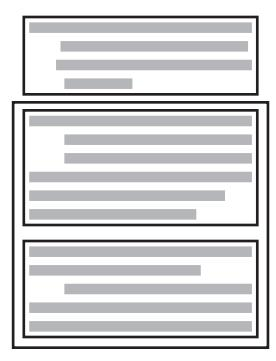

<span id="page-383-0"></span>
# Chapter 14: Organizing Straight-Line Code


### cc2e.com/1465 Contents

- 14.1 Statements That Must Be in a Specific Order: page 347
- 14.2 Statements Whose Order Doesn't Matter: page 351

#### Related Topics

- General control topics: Chapter 19
- Code with conditionals: Chapter 15
- Code with loops: Chapter 16
- Scope of variables and objects: Section 10.4, "Scope"

This chapter turns from a data-centered view of programming to a statement-centered view. It introduces the simplest kind of control flow: putting statements and blocks of statements in sequential order.

Although organizing straight-line code is a relatively simple task, some organizational subtleties influence code quality, correctness, readability, and maintainability.

#### 14.1 Statements That Must Be in a Specific Order

The easiest sequential statements to order are those in which the order counts. Here's an example:

```
Java Example of Statements in Which Order Counts
data = ReadData();
results = CalculateResultsFromData( data );
PrintResults( results );
```

Unless something mysterious is happening with this code fragment, the statement must be executed in the order shown. The data must be read before the results can be calculated, and the results must be calculated before they can be printed.

The underlying concept in this example is that of dependencies. The third statement depends on the second, the second on the first. In this example, the fact that one

statement depends on another is obvious from the routine names. In the following code fragment, the dependencies are less obvious:

```
Java Example of Statements in Which Order Counts, but Not Obviously
revenue.ComputeMonthly();
revenue.ComputeQuarterly();
revenue.ComputeAnnual();
```

In this case, the quarterly revenue calculation assumes that the monthly revenues have already been calculated. A familiarity with accounting—or even common sense might tell you that quarterly revenues have to be calculated before annual revenues. There is a dependency, but it's not obvious merely from reading the code. And here, the dependencies aren't obvious—they're literally hidden:

#### Visual Basic Example of Statements in Which Order Dependencies Are Hidden

ComputeMarketingExpense ComputeSalesExpense ComputeTravelExpense ComputePersonnelExpense DisplayExpenseSummary

Suppose that *ComputeMarketingExpense()* initializes the class member variables that all the other routines put their data into. In such a case, it needs to be called before the other routines. How could you know that from reading this code? Because the routine calls don't have any parameters, you might be able to guess that each of these routines accesses class data. But you can't know for sure from reading this code.


When statements have dependencies that require you to put them in a certain order, take steps to make the dependencies clear. Here are some simple guidelines for ordering statements:

*Organize code so that dependencies are obvious* In the Microsoft Visual Basic example just presented, *ComputeMarketingExpense()* shouldn't initialize the class member variables. The routine names suggest that *ComputeMarketingExpense()* is similar to *ComputeSalesExpense()*, *ComputeTravelExpense()*, and the other routines except that it works with marketing data rather than with sales data or other data. Having *ComputeMarketingExpense()* initialize the member variable is an arbitrary practice you should avoid. Why should initialization be done in that routine instead of one of the other two? Unless you can think of a good reason, you should write another routine, *InitializeExpenseData()*, to initialize the member variable. The routine's name is a clear indication that it should be called before the other expense routines.

*Name routines so that dependencies are obvious* In the Visual Basic example, *ComputeMarketingExpense()* is misnamed because it does more than compute marketing expenses; it also initializes member data. If you're opposed to creating an additional routine to initialize the data, at least give *ComputeMarketingExpense()* a name that

describes all the functions it performs. In this case, *ComputeMarketingExpenseAndInitializeMemberData()* would be an adequate name. You might say it's a terrible name because it's so long, but the name describes what the routine does and is not terrible. The routine itself is terrible!

**Cross-Reference** For details on using routines and their parameters, see Chapter 5, "Design in Construction."

*Use routine parameters to make dependencies obvious* Again in the Visual Basic example, since no data is passed between routines, you don't know whether any of the routines use the same data. By rewriting the code so that data is passed between the routines, you set up a clue that the execution order is important. The new code would look like this:

```
Visual Basic Example of Data That Suggests an Order Dependency
InitializeExpenseData( expenseData )
ComputeMarketingExpense( expenseData )
ComputeSalesExpense( expenseData )
ComputeTravelExpense( expenseData )
ComputePersonnelExpense( expenseData )
DisplayExpenseSummary( expenseData )
```

Because all the routines use *expenseData*, you have a hint that they might be working on the same data and that the order of the statements might be important.

In this particular example, a better approach might be to convert the routines to functions that take *expenseData* as inputs and return updated *expenseData* as outputs, which makes it even clearer that the code includes order dependencies.

```
Visual Basic Example of Data and Routine Calls That Suggest an Order Dependency
expenseData = InitializeExpenseData( expenseData )
expenseData = ComputeMarketingExpense( expenseData )
expenseData = ComputeSalesExpense( expenseData )
expenseData = ComputeTravelExpense( expenseData )
expenseData = ComputePersonnelExpense( expenseData )
DisplayExpenseSummary( expenseData )
```

Data can also indicate that execution order isn't important, as in this case:

```
Visual Basic Example of Data That Doesn't Indicate an Order Dependency
ComputeMarketingExpense( marketingData )
ComputeSalesExpense( salesData )
ComputeTravelExpense( travelData )
ComputePersonnelExpense( personnelData )
DisplayExpenseSummary( marketingData, salesData, travelData, personnelData )
```

Since the routines in the first four lines don't have any data in common, the code implies that the order in which they're called doesn't matter. Because the routine in the fifth line uses data from each of the first four routines, you can assume that it needs to be executed after the first four routines.


KEY POINT

*Document unclear dependencies with comments* Try first to write code without order dependencies.Try second to write code that makes dependencies obvious. If you're still concerned that an order dependency isn't explicit enough, document it. Documenting unclear dependencies is one aspect of documenting coding assumptions, which is critical to writing maintainable, modifiable code. In the Visual Basic example, comments along these lines would be helpful:

#### Visual Basic Example of Statements in Which Order Dependencies Are Hidden but Clarified with Comments

- ' Compute expense data. Each of the routines accesses the
- ' member data expenseData. DisplayExpenseSummary
- ' should be called last because it depends on data calculated
- ' by the other routines.

InitializeExpenseData

ComputeMarketingExpense

ComputeSalesExpense

ComputeTravelExpense

ComputePersonnelExpense

DisplayExpenseSummary

This code doesn't use the techniques for making order dependencies obvious. It's better to rely on such techniques rather than on comments, but if you're maintaining tightly controlled code or you can't improve the code itself for some other reason, use documentation to compensate for code weaknesses.

*Check for dependencies with assertions or error-handling code* If the code is critical enough, you might use status variables and error-handling code or assertions to document critical sequential dependencies. For example, in the class's constructor, you might initialize a class member variable *isExpenseDataInitialized* to *false*. Then in *InitializeExpenseData()*, you can set *isExpenseDataInitialized* to *true*. Each function that depends on *expenseData* being initialized can then check whether *isExpenseDataInitialized* has been set to *true* before performing additional operations on *expenseData*. Depending on how extensive the dependencies are, you might also need variables like *isMarketingExpenseComputed*, *isSalesExpenseComputed*, and so on.

This technique creates new variables, new initialization code, and new error-checking code, all of which create additional possibilities for error. The benefits of this technique should be weighed against the additional complexity and increased chance of secondary errors that this technique creates.

#### 14.2 Statements Whose Order Doesn't Matter

You might encounter cases in which it seems as if the order of a few statements or a few blocks of code doesn't matter at all. One statement doesn't depend on, or logically follow, another statement. But ordering affects readability, performance, and maintainability, and in the absence of execution-order dependencies, you can use secondary criteria to determine the order of statements or blocks of code. The guiding principle is the Principle of Proximity: *Keep related actions together*.

#### Making Code Read from Top to Bottom

As a general principle, make the program read from top to bottom rather than jumping around. Experts agree that top-to-bottom order contributes most to readability. Simply making the control flow from top to bottom at run time isn't enough. If someone who is reading your code has to search the whole program to find needed information, you should reorganize the code. Here's an example:

```
C++ Example of Bad Code That Jumps Around
MarketingData marketingData; 
SalesData salesData;
TravelData travelData;
travelData.ComputeQuarterly();
salesData.ComputeQuarterly();
marketingData.ComputeQuarterly();
salesData.ComputeAnnual();
marketingData.ComputeAnnual();
travelData.ComputeAnnual();
salesData.Print();
travelData.Print();
marketingData.Print();
```

Suppose that you want to determine how *marketingData* is calculated. You have to start at the last line and track all references to *marketingData* back to the first line. *marketingData* is used in only a few other places, but you have to keep in mind how *marketingData* is used everywhere between the first and last references to it. In other words, you have to look at and think about every line of code in this fragment to figure out how *marketingData* is calculated. And of course this example is simpler than code you see in life-size systems. Here's the same code with better organization:

```
C++ Example of Good, Sequential Code That Reads from Top to Bottom
MarketingData marketingData;
marketingData.ComputeQuarterly();
marketingData.ComputeAnnual();
marketingData.Print();
```

```
SalesData salesData;
salesData.ComputeQuarterly();
salesData.ComputeAnnual();
salesData.Print();
TravelData travelData;
travelData.ComputeQuarterly();
travelData.ComputeAnnual();
travelData.Print();
```

**Cross-Reference** A more technical definition of "live" variables is given in "Measuring the Live Time of a Variable" in Section 10.4.

This code is better in several ways. References to each object are kept close together; they're "localized." The number of lines of code in which the objects are "live" is small. And perhaps most important, the code now looks as if it could be broken into separate routines for marketing, sales, and travel data. The first code fragment gave no hint that such a decomposition was possible.

#### Grouping Related Statements

**Cross-Reference** If you follow the Pseudocode Programming Process, your code will automatically be grouped into related statements. For details on the process, see Chapter 9, "The Pseudocode Programming Process."

Put related statements together. They can be related because they operate on the same data, perform similar tasks, or depend on each other's being performed in order.

An easy way to test whether related statements are grouped well is to print out a listing of your routine and then draw boxes around the related statements. If the statements are ordered well, you'll get a picture like that shown in Figure 14-1, in which the boxes don't overlap.



**Figure 14-1** If the code is well organized into groups, boxes drawn around related sections don't overlap. They might be nested.

**Cross-Reference** For more on keeping operations on variables together, see Section 10.4, "Scope."

If statements aren't ordered well, you'll get a picture something like that shown in Figure 14-2, in which the boxes do overlap. If you find that your boxes overlap, reorganize your code so that related statements are grouped better.


**Figure 14-2** If the code is organized poorly, boxes drawn around related sections overlap.

Once you've grouped related statements, you might find that they're strongly related and have no meaningful relationship to the statements that precede or follow them. In such a case, you might want to refactor the strongly related statements into their own routine.

#### cc2e.com/1472 Checklist: Organizing Straight-Line Code

- ❑ Does the code make dependencies among statements obvious?
- ❑ Do the names of routines make dependencies obvious?
- ❑ Do parameters to routines make dependencies obvious?
- ❑ Do comments describe any dependencies that would otherwise be unclear?
- ❑ Have housekeeping variables been used to check for sequential dependencies in critical sections of code?
- ❑ Does the code read from top to bottom?
- ❑ Are related statements grouped together?
- ❑ Have relatively independent groups of statements been moved into their own routines?

#### Key Points

- The strongest principle for organizing straight-line code is ordering dependencies.
- Dependencies should be made obvious through the use of good routine names, parameter lists, comments, and—if the code is critical enough—housekeeping variables.
- If code doesn't have order dependencies, keep related statements as close together as possible.
