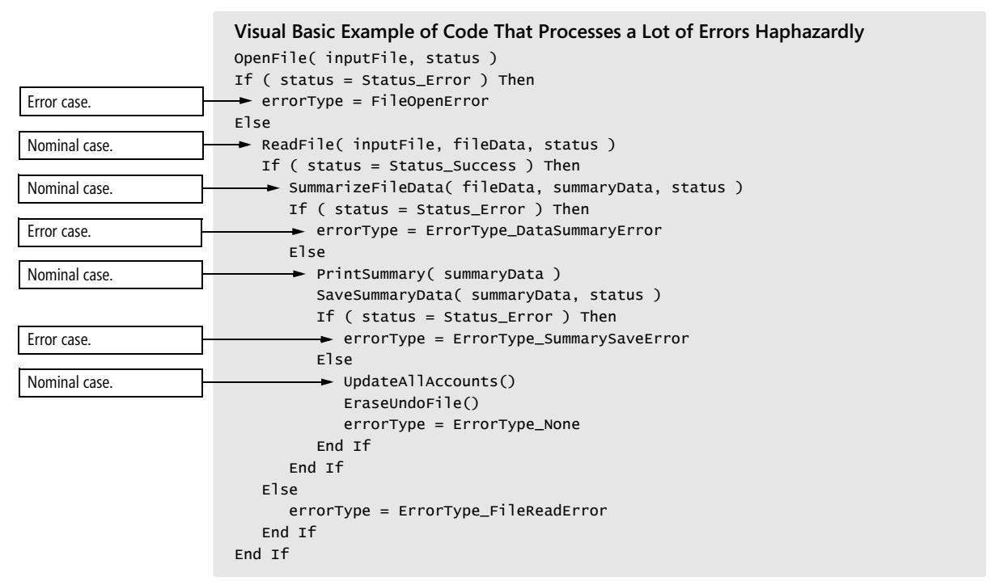
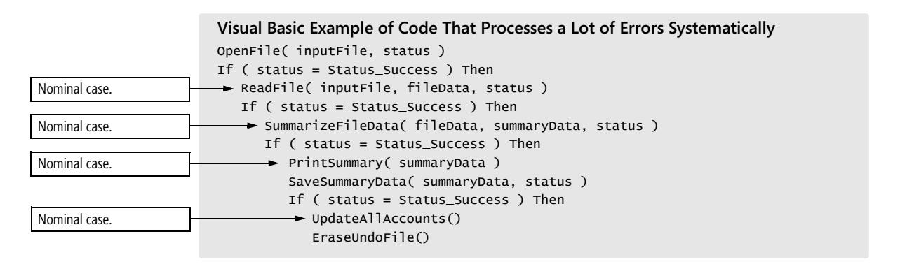
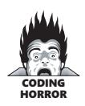
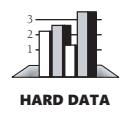
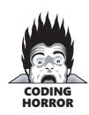
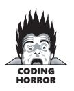

# Chapter 15: Using Conditionals


<span id="page-391-0"></span>
### cc2e.com/1538 Contents

- 15.1 *if* Statements: page 355
- 15.2 *case* Statements: page 361

#### Related Topics

- Taming deep nesting: Section 19.4
- General control issues: Chapter 19
- Code with loops: Chapter 16
- Straight-line code: Chapter 14
- Relationship between data types and control structures: Section 10.7

A conditional is a statement that controls the execution of other statements; execution of the other statements is "conditioned" on statements such as *if*, *else*, *case*, and *switch*. Although it makes sense logically to refer to loop controls such as *while* and *for* as conditionals too, by convention they've been treated separately. Chapter 16, "Controlling Loops," will examine *while* and *for* statements.

### 15.1** *if* **Statements

Depending on the language you're using, you might be able to use any of several kinds of *if* statements. The simplest is the plain *if* or *if-then* statement. The *if-then-else* is a little more complex, and chains of *if-then-else-if* are the most complex.

#### Plain** *if-then* **Statements

Follow these guidelines when writing *if* statements:


KEY POINT

*Write the nominal path through the code first; then write the unusual cases* Write your code so that the normal path through the code is clear. Make sure that the rare cases don't obscure the normal path of execution. This is important for both readability and performance.

*Make sure that you branch correctly on equality* Using > instead of >= or < instead of <= is analogous to making an off-by-one error in accessing an array or computing a loop index. In a loop, think through the endpoints to avoid an off-by-one error. In a conditional statement, think through the equals case to avoid one.

**Cross-Reference** For other ways to handle error-processing code, see "Summary of Techniques for Reducing Deep Nesting" in Section 19.4.

*Put the normal* **case** *after the* **if** *rather than after the* **else** Put the case you normally expect to process first. This is in line with the general principle of putting code that results from a decision as close as possible to the decision. Here's a code example that does a lot of error processing, haphazardly checking for errors along the way:



This code is hard to follow because the nominal cases and the error cases are all mixed together. It's hard to find the path that is normally taken through the code. In addition, because the error conditions are sometimes processed in the *if* clause rather than the *else* clause, it's hard to figure out which *if* test the normal case goes with. In the following rewritten code, the normal path is consistently coded first and all the error cases are coded last. This makes it easier to find and read the nominal case.



```
 errorType = ErrorType_None
                 Else
Error case. errorType = ErrorType_SummarySaveError
                 End If
                 Else
Error case. errorType = ErrorType_DataSummaryError
                 End If
                 Else
Error case. errorType = ErrorType_FileReadError
                 End If
                Else
Error case. errorType = ErrorType_FileOpenError
                End If
```

In the revised example, you can read the main flow of the *if* tests to find the normal case. The revision puts the focus on reading the main flow rather than on wading through the exceptional cases, so the code is easier to read overall. The stack of error conditions at the bottom of the nest is a sign of well-written error-processing code.

This example illustrates one systematic approach to handling normal cases and error cases. A variety of other solutions to this problem are discussed throughout this book, including using guard clauses, converting to polymorphic dispatch, and extracting the inner part of the test into a separate routine. For a complete list of available approaches, see "Summary of Techniques for Reducing Deep Nesting" in Section 19.4.

*Follow the* **if** *clause with a meaningful statement* Sometimes you see code like the next example, in which the *if* clause is null:



```
Java Example of a Null if Clause
if ( SomeTest )
 ;
else {
 // do something
 ...
}
```

**Cross-Reference** One key to constructing an effective *if* statement is writing the right boolean expression to control it. For details on using boolean expressions effectively, see Section 19.1, "Boolean Expressions."

Most experienced programmers would avoid code like this if only to avoid the work of coding the extra null line and the *else* line. It looks silly and is easily improved by negating the predicate in the *if* statement, moving the code from the *else* clause to the *if* clause, and eliminating the *else* clause. Here's how the code would look after those changes:

```
Java Example of a Converted Null if Clause
if ( ! someTest ) {
 // do something
 ...
}
```



*Consider the* **else** *clause* If you think you need a plain *if* statement, consider whether you don't actually need an *if-then-else* statement. A classic General Motors analysis found that 50 to 80 percent of *if* statements should have had an *else* clause (Elshoff 1976).

One option is to code the *else* clause—with a null statement if necessary—to show that the *else* case has been considered. Coding null *else*s just to show that that case has been considered might be overkill, but at the very least, take the *else* case into account. When you have an *if* test without an *else*, unless the reason is obvious, use comments to explain why the *else* clause isn't necessary, like so:

```
Java Example of a Helpful, Commented else Clause
// if color is valid
if ( COLOR_MIN <= color && color <= COLOR_MAX ) {
 // do something
 ...
}
else {
 // else color is invalid
 // screen not written to –- safely ignore command
}
```

*Test the* **else** *clause for correctness* When testing your code, you might think that the main clause, the *if*, is all that needs to be tested. If it's possible to test the *else* clause, however, be sure to do that.

*Check for reversal of the* **if** *and* **else** *clauses* A common mistake in programming *ifthen*s is to flip-flop the code that's supposed to follow the *if* clause and the code that's supposed to follow the *else* clause or to get the logic of the *if* test backward. Check your code for this common error.

#### Chains of** *if-then-else* **Statements

In languages that don't support *case* statements—or that support them only partially you'll often find yourself writing chains of *if-then-else* tests. For example, the code to categorize a character might use a chain like this one:

**Cross-Reference** For more details on simplifying complicated expressions, see Section 19.1, "Boolean Expressions."

```
C++ Example of Using an if-then-else Chain to Categorize a Character
if ( inputCharacter < SPACE ) {
 characterType = CharacterType_ControlCharacter;
}
else if ( 
 inputCharacter == ' ' || 
 inputCharacter == ',' || 
 inputCharacter == '.' ||
 inputCharacter == '!' || 
 inputCharacter == '(' || 
 inputCharacter == ')' ||
```

```
 inputCharacter == ':' ||
 inputCharacter == ';' || 
 inputCharacter == '?' || 
 inputCharacter == '-' 
 ) {
 characterType = CharacterType_Punctuation;
}
else if ( '0' <= inputCharacter && inputCharacter <= '9' ) {
 characterType = CharacterType_Digit;
}
else if ( 
 ( 'a' <= inputCharacter && inputCharacter <= 'z' ) ||
 ( 'A' <= inputCharacter && inputCharacter <= 'Z' ) 
 ) {
 characterType = CharacterType_Letter;
}
```

Consider these guidelines when writing such *if-then-else* chains:

*Simplify complicated tests with boolean function calls* One reason the code in the previous example is hard to read is that the tests that categorize the character are complicated. To improve readability, you can replace them with calls to boolean functions. Here's how the example's code looks when the tests are replaced with boolean functions:

```
C++ Example of an if-then-else Chain That Uses Boolean Function Calls
if ( IsControl( inputCharacter ) ) {
 characterType = CharacterType_ControlCharacter;
}
else if ( IsPunctuation( inputCharacter ) ) {
 characterType = CharacterType_Punctuation;
}
else if ( IsDigit( inputCharacter ) ) {
 characterType = CharacterType_Digit;
}
else if ( IsLetter( inputCharacter ) ) {
 characterType = CharacterType_Letter;
}
```

*Put the most common cases first* By putting the most common cases first, you minimize the amount of exception-case handling code someone has to read to find the usual cases. You improve efficiency because you minimize the number of tests the code does to find the most common cases. In the example just shown, letters would be more common than punctuation but the test for punctuation is made first. Here's the code revised so that it tests for letters first:

```
C++ Example of Testing the Most Common Case First
This test, the most common, 
is now done first.
                         if ( IsLetter( inputCharacter ) ) {
                          characterType = CharacterType_Letter;
                         }
```

```
else if ( IsPunctuation( inputCharacter ) ) {
                         characterType = CharacterType_Punctuation;
                        }
                        else if ( IsDigit( inputCharacter ) ) {
                         characterType = CharacterType_Digit;
                        }
This test, the least common, 
is now done last.
                        else if ( IsControl( inputCharacter ) ) {
                         characterType = CharacterType_ControlCharacter;
                        }
```

*Make sure that all cases are covered* Code a final *else* clause with an error message or assertion to catch cases you didn't plan for. This error message is intended for you rather than for the user, so word it appropriately. Here's how you can modify the character-classification example to perform an "other cases" test:

**Cross-Reference** This is also a good example of how you can use a chain of *if-thenelse* tests instead of deeply nested code. For details on this technique, see Section 19.4, "Taming Dangerously Deep Nesting."

```
C++ Example of Using the Default Case to Trap Errors
if ( IsLetter( inputCharacter ) ) {
 characterType = CharacterType_Letter;
}
else if ( IsPunctuation( inputCharacter ) ) {
 characterType = CharacterType_Punctuation;
}
else if ( IsDigit( inputCharacter ) ) {
 characterType = CharacterType_Digit;
}
else if ( IsControl( inputCharacter ) ) {
 characterType = CharacterType_ControlCharacter;
}
else {
 DisplayInternalError( "Unexpected type of character detected." );
}
```

*Replace* **if-then-else** *chains with other constructs if your language supports them* A few languages—Microsoft Visual Basic and Ada, for example—provide *case* statements that support use of strings, enums, and logical functions. Use them—they are easier to code and easier to read than *if-then-else* chains. Code for classifying character types by using a *case* statement in Visual Basic would be written like this:

```
Visual Basic Example of Using a case Statement Instead of an if-then-else Chain
Select Case inputCharacter
 Case "a" To "z"
 characterType = CharacterType_Letter
 Case " ", ",", ".", "!", "(", ")", ":", ";", "?", "-"
 characterType = CharacterType_Punctuation
 Case "0" To "9"
 characterType = CharacterType_Digit
 Case FIRST_CONTROL_CHARACTER To LAST_CONTROL_CHARACTER
 characterType = CharacterType_Control
 Case Else
 DisplayInternalError( "Unexpected type of character detected." )
End Select
```

#### 15.2** *case* **Statements

The *case* or *switch* statement is a construct that varies a great deal from language to language. C++ and Java support *case* only for ordinal types taken one value at a time. Visual Basic supports *case* for ordinal types and has powerful shorthand notations for expressing ranges and combinations of values. Many scripting languages don't support *case* statements at all.

The following sections present guidelines for using *case* statements effectively:

#### Choosing the Most Effective Ordering of Cases

You can choose from among a variety of ways to organize the cases in a *case* statement. If you have a small *case* statement with three options and three corresponding lines of code, the order you use doesn't matter much. If you have a long *case* statement—for example, a *case* statement that handles dozens of events in an event-driven program order is significant. Following are some ordering possibilities:

*Order cases alphabetically or numerically* If cases are equally important, putting them in A-B-C order improves readability. That way a specific case is easy to pick out of the group.

*Put the normal case first* If you have one normal case and several exceptions, put the normal case first. Indicate with comments that it's the normal case and that the others are unusual.

*Order cases by frequency* Put the most frequently executed cases first and the least frequently executed last. This approach has two advantages. First, human readers can find the most common cases easily. Readers scanning the list for a specific case are likely to be interested in one of the most common cases, and putting the common ones at the top of the code makes the search quicker.

#### Tips for Using** *case* **Statements

Here are several tips for using *case* statements:

**Cross-Reference** For other tips on simplifying code, see Chapter 24, "Refactoring."

*Keep the actions of each case simple* Keep the code associated with each case short. Short code following each case helps make the structure of the *case* statement clear. If the actions performed for a case are complicated, write a routine and call the routine from the case rather than putting the code into the case itself.

*Don't make up phony variables to be able to use the* **case** *statement* A *case* statement should be used for simple data that's easily categorized. If your data isn't simple, use chains of *if-then-else*s instead. Phony variables are confusing, and you should avoid them. For example, don't do this:



```
Java Example of Creating a Phony case Variable—Bad Practice
action = userCommand[ 0 ];
switch ( action ) {
 case 'c': 
 Copy(); 
 break;
 case 'd': 
 DeleteCharacter(); 
 break;
 case 'f': 
 Format(); 
 break;
 case 'h': 
 Help(); 
 break;
 ...
 default: 
 HandleUserInputError( ErrorType.InvalidUserCommand );
}
```

The variable that controls the *case* statement is *action*. In this case, *action* is created by peeling off the first character of the *userCommand* string, a string that was entered by the user.

This troublemaking code is from the wrong side of town and invites problems. In general, when you manufacture a variable to use in a *case* statement, the real data might not map onto the *case* statement the way you want it to. In this example, if the user types **copy**, the *case* statement peels off the first "c" and correctly calls the *Copy()* routine. On the other hand, if the user types **cement overshoes**, **clambake**, or **cellulite**, the *case* statement also peels off the "c" and calls *Copy()*. The test for an erroneous command in the *case* statement's *else* clause won't work very well because it will miss only erroneous first letters rather than erroneous commands.

Rather than making up a phony variable, this code should use a chain of *if-then-else-if* tests to check the whole string. A virtuous rewrite of the code looks like this:

```
Java Example of Using if-then-elses Instead of a Phony case Variable—Good Practice
if ( UserCommand.equals( COMMAND_STRING_COPY ) ) {
 Copy();
}
else if ( UserCommand.equals( COMMAND_STRING_DELETE ) ) {
 DeleteCharacter();
}
else if ( UserCommand.equals( COMMAND_STRING_FORMAT ) ) {
 Format();
}
else if ( UserCommand.equals( COMMAND_STRING_HELP ) ) {
 Help();
}
...
else {
 HandleUserInputError( ErrorType_InvalidCommandInput );
}
```

**Cross-Reference** In contrast to this advice, sometimes you can improve readability by assigning a complicated expression to a well-named boolean variable or function. For details, see "Making Complicated Expressions Simple" in Section 19.1.

*Use the default clause only to detect legitimate defaults* You might sometimes have only one case remaining and decide to code that case as the default clause. Though sometimes tempting, that's dumb. You lose the automatic documentation provided by *case*-statement labels, and you lose the ability to detect errors with the default clause.

Such *case* statements break down under modification. If you use a legitimate default, adding a new case is trivial—you just add the case and the corresponding code. If you use a phony default, the modification is more difficult. You have to add the new case, possibly making it the new default, and then change the case previously used as the default so that it's a legitimate case. Use a legitimate default in the first place.

*Use the default clause to detect errors* If the default clause in a *case* statement isn't being used for other processing and isn't supposed to occur, put a diagnostic message in it:

```
Java Example of Using the Default Case to Detect Errors—Good Practice
switch ( commandShortcutLetter ) {
 case 'a': 
 PrintAnnualReport();
 break;
 case 'p': 
 // no action required, but case was considered
 break;
 case 'q': 
 PrintQuarterlyReport();
 break;
 case 's': 
 PrintSummaryReport();
 break;
 default: 
 DisplayInternalError( "Internal Error 905: Call customer support." );
}
```

Messages like this are useful in both debugging and production code. Most users prefer a message like "Internal Error: Please call customer support" to a system crash or, worse, subtly incorrect results that look right until the user's boss checks them.

If the default clause is used for some purpose other than error detection, the implication is that every case selector is correct. Double-check to be sure that every value that could possibly enter the *case* statement would be legitimate. If you come up with some that wouldn't be legitimate, rewrite the statements so that the default clause will check for errors.

*In C++ and Java, avoid dropping through the end of a* **case** *statement* C-like languages (C, C++, and Java) don't automatically break out of each case. Instead, you have to code the end of each case explicitly. If you don't code the end of a case, the program drops through the end and executes the code for the next case. This can lead to some particularly egregious coding practices, including the following horrible example:



**Cross-Reference** This code's formatting makes it look better than it is. For details on how to use formatting to make good code look good and bad code look bad, see "Endline Layout" in Section 31.3 and the rest of Chapter 31, "Layout and Style."

```
C++ Example of Abusing the case Statement
switch ( InputVar ) {
 case 'A': if ( test ) {
 // statement 1
 // statement 2
 case 'B': // statement 3
 // statement 4
 ...
 } 
 ...
 break;
 ...
}
```

This practice is bad because it intermingles control constructs. Nested control constructs are hard enough to understand; overlapping constructs are all but impossible. Modifications of case *'A'* or case *'B'* will be harder than brain surgery, and it's likely that the cases will need to be cleaned up before any modifications will work. You might as well do it right the first time. In general, it's a good idea to avoid dropping through the end of a *case* statement.

*In C++, clearly and unmistakably identify flow-throughs at the end of a* **case** *statement* If you intentionally write code to drop through the end of a case, clearly comment the place at which it happens and explain why it needs to be coded that way.

```
C++ Example of Documenting Falling Through the End of a case Statement
switch ( errorDocumentationLevel ) {
 case DocumentationLevel_Full:
 DisplayErrorDetails( errorNumber );
 // FALLTHROUGH -- Full documentation also prints summary comments
 case DocumentationLevel_Summary:
 DisplayErrorSummary( errorNumber );
 // FALLTHROUGH -- Summary documentation also prints error number
 case DocumentationLevel_NumberOnly:
 DisplayErrorNumber( errorNumber );
 break;
 default: 
 DisplayInternalError( "Internal Error 905: Call customer support." );
}
```

This technique is useful about as often as you find someone who would rather have a used Pontiac Aztek than a new Corvette. Generally, code that falls through from one case to another is an invitation to make mistakes as the code is modified, and it should be avoided.

#### cc2e.com/1545 CHECKLIST: Using Conditionals

#### if-then* **Statements

- ❑ Is the nominal path through the code clear?
- ❑ Do *if-then* tests branch correctly on equality?
- ❑ Is the *else* clause present and documented?
- ❑ Is the *else* clause correct?
- ❑ Are the *if* and *else* clauses used correctly—not reversed?
- ❑ Does the normal case follow the *if* rather than the *else*?

#### if-then-else-if* **Chains

- ❑ Are complicated tests encapsulated in boolean function calls?
- ❑ Are the most common cases tested first?
- ❑ Are all cases covered?
- ❑ Is the *if-then-else-if* chain the best implementation—better than a *case* statement?

#### case* **Statements

- ❑ Are cases ordered meaningfully?
- ❑ Are the actions for each case simple—calling other routines if necessary?
- ❑ Does the *case* statement test a real variable, not a phony one that's made up solely to use and abuse the *case* statement?
- ❑ Is the use of the default clause legitimate?
- ❑ Is the default clause used to detect and report unexpected cases?
- ❑ In C, C++, or Java, does the end of each case have a *break*?

#### Key Points

- For simple *if-else* statements, pay attention to the order of the *if* and *else* clauses, especially if they process a lot of errors. Make sure the nominal case is clear.
- For *if-then-else* chains and *case* statements, choose an order that maximizes readability.
- To trap errors, use the default clause in a *case* statement or the last *else* in a chain of *if-then-else* statements.
- All control constructs are not created equal. Choose the control construct that's most appropriate for each section of code.
