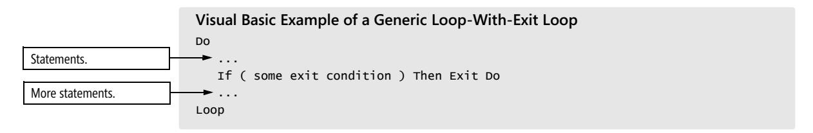
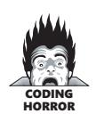
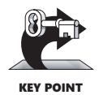
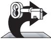

# Chapter 16: Controlling Loops


<span id="page-403-0"></span>
### cc2e.com/1609 Contents

- 16.1 Selecting the Kind of Loop: page 367
- 16.2 Controlling the Loop: page 373
- 16.3 Creating Loops Easily—From the Inside Out: page 385
- 16.4 Correspondence Between Loops and Arrays: page 387

#### Related Topics

- Taming deep nesting: Section 19.4
- General control issues: Chapter 19
- Code with conditionals: Chapter 15
- Straight-line code: Chapter 14
- Relationship between control structures and data types: Section 10.7

"Loop" is an informal term that refers to any kind of iterative control structure—any structure that causes a program to repeatedly execute a block of code. Common loop types are *for*, *while*, and *do-while* in C++ and Java, and *For-Next*, *While-Wend*, and *Do-Loop-While* in Microsoft Visual Basic. Using loops is one of the most complex aspects of programming; knowing how and when to use each kind of loop is a decisive factor in constructing high-quality software.

#### 16.1 Selecting the Kind of Loop

In most languages, you'll use a few kinds of loops:

- The counted loop is performed a specific number of times, perhaps one time for each employee.
- The continuously evaluated loop doesn't know ahead of time how many times it will be executed and tests whether it has finished on each iteration. For example, it runs while money remains, until the user selects quit, or until it encounters an error.
- The endless loop executes forever once it has started. It's the kind you find in embedded systems such as pacemakers, microwave ovens, and cruise controls.
- The iterator loop performs its action once for each element in a container class.

The kinds of loops are differentiated first by flexibility—whether the loop executes a specified number of times or whether it tests for completion on each iteration.

The kinds of loops are also differentiated by the location of the test for completion. You can put the test at the beginning, the middle, or the end of the loop. This characteristic tells you whether the loop executes at least once. If the loop is tested at the beginning, its body isn't necessarily executed. If the loop is tested at the end, its body is executed at least once. If the loop is tested in the middle, the part of the loop that precedes the test is executed at least once, but the part of the loop that follows the test isn't necessarily executed at all.

Flexibility and the location of the test determine the kind of loop to choose as a control structure. Table 16-1 shows the kinds of loops in several languages and describes each loop's flexibility and test location.

| Table 16-1 | The Kinds of Loops |  |  |
|------------|--------------------|--|--|
|------------|--------------------|--|--|

| Language         | Kind of Loop  | Flexibility | Test Location    |
|------------------|---------------|-------------|------------------|
| Visual Basic     | For-Next      | rigid       | beginning        |
|                  | While-Wend    | flexible    | beginning        |
|                  | Do-Loop-While | flexible    | beginning or end |
|                  | For-Each      | rigid       | beginning        |
| C, C++, C#, Java | for           | flexible    | beginning        |
|                  | while         | flexible    | beginning        |
|                  | do-while      | flexible    | end              |
|                  | foreach*      | rigid       | beginning        |

<sup>\*</sup> Available only in C#. Planned for other languages, including Java, at the time of this writing.

#### When to Use a** *while* **Loop

Novice programmers sometimes think that a *while* loop is continuously evaluated and that it terminates the instant the *while* condition becomes false, regardless of which statement in the loop is being executed (Curtis et al. 1986). Although it's not quite that flexible, a *while* loop is a flexible loop choice. If you don't know ahead of time exactly how many times you'll want the loop to iterate, use a *while* loop. Contrary to what some novices think, the test for the loop exit is performed only once each time through the loop, and the main issue with respect to *while* loops is deciding whether to test at the beginning or the end of the loop.

#### Loop with Test at the Beginning

For a loop that tests at the beginning, you can use a *while* loop in C++, C#, Java, Visual Basic, and most other languages. You can emulate a *while* loop in other languages.

#### Loop with Test at the End

You might occasionally have a situation in which you want a flexible loop, but the loop needs to execute at least one time. In such a case, you can use a *while* loop that is tested at its end. You can use *do-while* in C++, C#, and Java, *Do-Loop-While* in Visual Basic, or you can emulate end-tested loops in other languages.

#### When to Use a Loop-With-Exit Loop

A loop-with-exit loop is a loop in which the exit condition appears in the middle of the loop rather than at the beginning or at the end. The loop-with-exit loop is available explicitly in Visual Basic, and you can emulate it with the structured constructs *while* and *break* in C++, C, and Java or with *goto*s in other languages.

#### Normal Loop-With-Exit Loops

A loop-with-exit loop usually consists of the loop beginning, the loop body (including an exit condition), and the loop end, as in this Visual Basic example:



The typical use of a loop-with-exit loop is for the case in which testing at the beginning or at the end of the loop requires coding a loop-and-a-half. Here's a C++ example of a case that warrants a loop-with-exit loop but doesn't use one:

```
C++ Example of Duplicated Code That Will Break Down Under Maintenance
                      // Compute scores and ratings.
                      score = 0;
These lines appear here... GetNextRating( &ratingIncrement );
                      rating = rating + ratingIncrement;
                      while ( ( score < targetScore ) && ( ratingIncrement != 0 ) ) {
                       GetNextScore( &scoreIncrement );
                       score = score + scoreIncrement;
…and are repeated here. GetNextRating( &ratingIncrement );
                       rating = rating + ratingIncrement;
                      }
```

The two lines of code at the top of the example are repeated in the last two lines of code of the *while* loop. During modification, you can easily forget to keep the two sets of lines parallel. Another programmer modifying the code probably won't even realize that the two sets of lines are supposed to be modified in parallel. Either way, the result will be errors arising from incomplete modifications. Here's how you can rewrite the code more clearly:

```
C++ Example of a Loop-With-Exit Loop That's Easier to Maintain
                        // Compute scores and ratings. The code uses an infinite loop
                        // and a break statement to emulate a loop-with-exit loop.
                        score = 0;
                        while ( true ) {
                         GetNextRating( &ratingIncrement );
                         rating = rating + ratingIncrement;
This is the loop-exit condi-
tion (and now it could be 
simplified using DeMorgan's 
Theorems, described in 
Section 19.1).
                         if ( !( ( score < targetScore ) && ( ratingIncrement != 0 ) ) ) {
                         break;
                         }
                         GetNextScore( &scoreIncrement );
                         score = score + scoreIncrement;
                        }
```

Here's how the same code is written in Visual Basic:

```
Visual Basic Example of a Loop-With-Exit Loop
' Compute scores and ratings
score = 0
Do
 GetNextRating( ratingIncrement )
 rating = rating + ratingIncrement
 If ( not ( score < targetScore and ratingIncrement <> 0 ) ) Then Exit Do
 GetNextScore( ScoreIncrement )
 score = score + scoreIncrement
Loop
```

Consider these finer points when you use this kind of loop:

**Cross-Reference** Details on exit conditions are presented later in this chapter. For details on using comments with loops, see "Commenting Control Structures" in Section 32.5.

Put all the exit conditions in one place. Spreading them around practically guarantees that one exit condition or another will be overlooked during debugging, modification, or testing.

Use comments for clarification. If you use the loop-with-exit loop technique in a language that doesn't support it directly, use comments to make what you're doing clear.


The loop-with-exit loop is a one-entry, one-exit, structured control construct, and it is the preferred kind of loop control (Software Productivity Consortium 1989). It has been shown to be easier to understand than other kinds of loops. A study of student programmers compared this kind of loop with those that exited at either the top or the bottom (Soloway, Bonar, and Ehrlich 1983). Students scored 25 percent higher on a test of comprehension when loop-with-exit loops were used, and the authors of the study concluded that the loop-with-exit structure more closely models the way people think about iterative control than other loop structures do.

In common practice, the loop-with-exit loop isn't widely used yet. The jury is still locked in a smoky room arguing about whether it's a good practice for production code. Until the jury is in, the loop-with-exit loop is a good technique to have in your programmer's toolbox—as long as you use it carefully.

#### Abnormal Loop-With-Exit Loops

Another kind of loop-with-exit loop that's used to avoid a loop-and-a-half is shown here:



```
C++ Example of Entering the Middle of a Loop with a goto—Bad Practice
goto Start;
while ( expression ) {
 // do something
 ...
 Start:
 // do something else
 ...
}
```

At first glance, this seems to be similar to the previous loop-with-exit examples. It's used in simulations in which // *do something* doesn't need to be executed at the first pass through the loop but // *do something* else does. It's a one-in, one-out control construct: the only way into the loop is through the *goto* at the top, and the only way out of the loop is through the *while* test. This approach has two problems: it uses a *goto*, and it's unusual enough to be confusing.

In C++, you can accomplish the same effect without using a *goto*, as demonstrated in the following example. If the language you're using doesn't support a *break* command, you can emulate one with a *goto*.

```
C++ Example of Code Rewritten Without a goto—Better Practice
while ( true ) {
 // do something else
 ...
```

The blocks before and after the *break* have been switched.

```
 if ( !( expression ) ) {
 break;
 }
 // do something
 ...
}
```

#### When to Use a** *for* **Loop

**Further Reading** For more good guidelines on using *for* loops, see *Writing Solid Code* (Maguire 1993).

A *for* loop is a good choice when you need a loop that executes a specified number of times. You can use *for* in C++, C, Java, Visual Basic, and most other languages.

Use *for* loops for simple activities that don't require internal loop controls. Use them when the loop control involves simple increments or simple decrements, such as iterating through the elements in a container. The point of a *for* loop is that you set it up at the top of the loop and then forget about it. You don't have to do anything inside the loop to control it. If you have a condition under which execution has to jump out of a loop, use a *while* loop instead.

Likewise, don't explicitly change the index value of a *for* loop to force it to terminate. Use a *while* loop instead. The *for* loop is for simple uses. Most complicated looping tasks are better handled by a *while* loop.

#### When to Use a** *foreach* **Loop

The *foreach* loop or its equivalent (*foreach* in C#, *For-Each* in Visual Basic, *for-in* in Python) is useful for performing an operation on each member of an array or other container. It has the advantage of eliminating loop-housekeeping arithmetic and therefore eliminating any chance of errors in the loop-housekeeping arithmetic. Here's an example of this kind of loop:

```
C# Example of a foreach Loop
int [] fibonacciSequence = new int [] { 0, 1, 1, 2, 3, 5, 8, 13, 21, 34 };
int oddFibonacciNumbers = 0;
int evenFibonacciNumbers = 0;
// count the number of odd and even numbers in a Fibonacci sequence
foreach ( int fibonacciNumber in fibonacciSequence ) {
 if ( fibonacciNumber % 2 ) == 0 ) {
 evenFibonacciNumbers++;
 }
 else {
 oddFibonacciNumbers++;
 }
}
Console.WriteLine( "Found {0} odd numbers and {1} even numbers.", 
 oddFibonacciNumbers, evenFibonacciNumbers );
```

#### 16.2 Controlling the Loop

What can go wrong with a loop? Any answer would have to include incorrect or omitted loop initialization, omitted initialization of accumulators or other variables related to the loop, improper nesting, incorrect termination of the loop, forgetting to increment a loop variable or incrementing the variable incorrectly, and indexing an array element from a loop index incorrectly.



You can forestall these problems by observing two practices. First, minimize the number of factors that affect the loop. Simplify! Simplify! Simplify! Second, treat the inside of the loop as if it were a routine—keep as much of the control as possible outside the loop. Explicitly state the conditions under which the body of the loop is to be executed. Don't make the reader look inside the loop to understand the loop control. Think of a loop as a black box: the surrounding program knows the control conditions but not the contents.

**Cross-Reference** If you use the *while ( true )*-*break* technique described earlier, the exit condition is inside the black box. Even if you use only one exit condition, you lose the benefit of treating the loop as a black box.

```
C++ Example of Treating a Loop as a Black Box
while ( !inputFile.EndOfFile() && moreDataAvailable ) {
}
```

What are the conditions under which this loop terminates? Clearly, all you know is that either *inputFile.EndOfFile()* becomes true or *MoreDataAvailable* becomes false.

#### Entering the Loop

Use these guidelines when entering a loop:

*Enter the loop from one location only* A variety of loop-control structures allows you to test at the beginning, middle, or end of a loop. These structures are rich enough to allow you to enter the loop from the top every time. You don't need to enter at multiple locations.

*Put initialization code directly before the loop* The Principle of Proximity advocates putting related statements together. If related statements are strewn across a routine, it's easy to overlook them during modification and to make the modifications incorrectly. If related statements are kept together, it's easier to avoid errors during modification.

**Cross-Reference** For more on limiting the scope of loop variables, see "Limit the scope of loop-index variables to the loop itself" later in this chapter.

Keep loop-initialization statements with the loop they're related to. If you don't, you're more likely to cause errors when you generalize the loop into a bigger loop and forget to modify the initialization code. The same kind of error can occur when you move or copy the loop code into a different routine without moving or copying its initialization code. Putting initializations away from the loop—in the data-declaration section or in a housekeeping section at the top of the routine that contains the loop—invites initialization troubles.

*Use* **while( true )** *for infinite loops* You might have a loop that runs without terminating—for example, a loop in firmware such as a pacemaker or a microwave oven. Or you might have a loop that terminates only in response to an event—an "event loop." You could code such an infinite loop in several ways. Faking an infinite loop with a statement like *for i = 1 to 99999* is a poor choice because the specific loop limits muddy the intent of the loop—*99999* could be a legitimate value. Such a fake infinite loop can also break down under maintenance.

The *while( true )* idiom is considered a standard way of writing an infinite loop in C++, Java, Visual Basic, and other languages that support comparable structures. Some programmers prefer to use *for( ;; )*, which is an accepted alternative.

*Prefer* **for** *loops when they're appropriate* The *for* loop packages loop-control code in one place, which makes for easily readable loops. One mistake programmers commonly make when modifying software is changing the loop-initialization code at the top of a *while* loop but forgetting to change related code at the bottom. In a *for* loop, all the relevant code is together at the top of the loop, which makes correct modifications easier. If you can use the *for* loop appropriately instead of another kind of loop, do it.

*Don't use a* **for** *loop when a* **while** *loop is more appropriate* A common abuse of the flexible *for* loop structure in C++, C#, and Java is haphazardly cramming the contents of a *while* loop into a *for* loop header. The following example shows a *while* loop crammed into a *for* loop header:


```
C++ Example of a while Loop Abusively Crammed into a for Loop Header
// read all the records from a file 
for ( inputFile.MoveToStart(), recordCount = 0; !inputFile.EndOfFile(); 
 recordCount++ ) {
 inputFile.GetRecord();
}
```

The advantage of C++'s *for* loop over *for* loops in other languages is that it's more flexible about the kinds of initialization and termination information it can use. The weakness inherent in such flexibility is that you can put statements into the loop header that have nothing to do with controlling the loop.

Reserve the *for* loop header for loop-control statements—statements that initialize the loop, terminate it, or move it toward termination. In the example just shown, the *inputFile.GetRecord()* statement in the body of the loop moves the loop toward termination, but the *recordCount* statements don't; they're housekeeping statements that don't control the loop's progress. Putting the *recordCount* statements in the loop header and leaving the *inputFile.GetRecord()* statement out is misleading; it creates the false impression that *recordCount* controls the loop.

If you want to use the *for* loop rather than the *while* loop in this case, put the loop-control statements in the loop header and leave everything else out. Here's the right way to use the loop header:

```
C++ Example of Logical if Unconventional Use of a for Loop Header
recordCount = 0;
for ( inputFile.MoveToStart(); !inputFile.EndOfFile(); inputFile.GetRecord() ) {
 recordCount++;
}
```

The contents of the loop header in this example are all related to control of the loop. The *inputFile.MoveToStart()* statement initializes the loop, the *!inputFile.EndOfFile()* statement tests whether the loop has finished, and the *inputFile.GetRecord()* statement moves the loop toward termination. The statements that affect *recordCount* don't directly move the loop toward termination and are appropriately not included in the loop header. The *while* loop is probably still more appropriate for this job, but at least this code uses the loop header logically. For the record, here's how the code looks when it uses a *while* loop:

```
C++ Example of Appropriate Use of a while Loop
// read all the records from a file 
inputFile.MoveToStart();
recordCount = 0;
while ( !inputFile.EndOfFile() ) {
 inputFile.GetRecord();
 recordCount++;
}
```

#### Processing the Middle of the Loop

The following subsections describe handling the middle of a loop:

*Use* **{** *and* **}** *to enclose the statements in a loop* Use code brackets every time. They don't cost anything in speed or space at run time, they help readability, and they help prevent errors as the code is modified. They're a good defensive-programming practice.

*Avoid empty loops* In C++ and Java, it's possible to create an empty loop, one in which the work the loop is doing is coded on the same line as the test that checks whether the work is finished. Here's an example:

```
C++ Example of an Empty Loop
while ( ( inputChar = dataFile.GetChar() ) != CharType_Eof ) {
 ;
}
```

In this example, the loop is empty because the *while* expression includes two things: the work of the loop—*inputChar = dataFile.GetChar()*—and a test for whether the loop should terminate—*inputChar != CharType\_Eof*. The loop would be clearer if it were recoded so that the work it does is evident to the reader:

```
C++ Example of an Empty Loop Converted to an Occupied Loop
do {
 inputChar = dataFile.GetChar();
} while ( inputChar != CharType_Eof );
```

The new code takes up three full lines rather than one line and a semicolon, which is appropriate since it does the work of three lines rather than that of one line and a semicolon.

*Keep loop-housekeeping chores at either the beginning or the end of the loop* Loophousekeeping chores are expressions like *i = i + 1* or *j++*, expressions whose main purpose isn't to do the work of the loop but to control the loop. The housekeeping is done at the end of the loop in this example:

```
C++ Example of Housekeeping Statements at the End of a Loop
                       nameCount = 0;
                       totalLength = 0;
                       while ( !inputFile.EndOfFile() ) {
                        // do the work of the loop
                        inputFile >> inputString;
                        names[ nameCount ] = inputString;
                        ...
                        // prepare for next pass through the loop--housekeeping
Here are the housekeeping 
statements.
                        nameCount++;
                        totalLength = totalLength + inputString.length();
                       }
```

As a general rule, the variables you initialize before the loop are the variables you'll manipulate in the housekeeping part of the loop.

**Cross-Reference** For more on optimization, see Chapter 25, "Code-Tuning Strategies," and Chapter 26, "Code-Tuning Techniques."

*Make each loop perform only one function* The mere fact that a loop can be used to do two things at once isn't sufficient justification for doing them together. Loops should be like routines in that each one should do only one thing and do it well. If it seems inefficient to use two loops where one would suffice, write the code as two loops, comment that they could be combined for efficiency, and then wait until benchmarks show that the section of the program poses a performance problem before changing the two loops into one.

#### Exiting the Loop

These subsections describe handling the end of a loop:

*Assure yourself that the loop ends* This is fundamental. Mentally simulate the execution of the loop until you are confident that, in all circumstances, it ends. Think through the nominal cases, the endpoints, and each of the exceptional cases.

*Make loop-termination conditions obvious* If you use a *for* loop and don't fool around with the loop index and don't use a *goto* or *break* to get out of the loop, the termination condition will be obvious. Likewise, if you use a *while* or *repeat-until* loop and put all the control in the *while* or *repeat-until* clause, the termination condition will be obvious. The key is putting the control in one place.

*Don't monkey with the loop index of a* **for** *loop to make the loop terminate* Some programmers jimmy the value of a *for* loop index to make the loop terminate early. Here's an example:

```
Java Example of Monkeying with a Loop Index
                     for ( int i = 0; i < 100; i++ ) {
                      // some code
                      ...
                      if ( ... ) {
Here's the monkeying. i = 100;
                      }
                      // more code
                      ...
                     }
          CODING 
          HORROR
```

The intent in this example is to terminate the loop under some condition by setting *i* to *100*, a value that's larger than the end of the *for* loop's range of *0* through *99*. Virtually all good programmers avoid this practice; it's the sign of an amateur. When you set up a *for* loop, the loop counter is off limits. Use a *while* loop to provide more control over the loop's exit conditions.

*Avoid code that depends on the loop index's final value* It's bad form to use the value of the loop index after the loop. The terminal value of the loop index varies from language to language and implementation to implementation. The value is different when the loop terminates normally and when it terminates abnormally. Even if you happen to know what the final value is without stopping to think about it, the next person to read the code will probably have to think about it. It's better form and more self-documenting if you assign the final value to a variable at the appropriate point inside the loop.

This code misuses the index's final value:

```
C++ Example of Code That Misuses a Loop Index's Terminal Value
                        for ( recordCount = 0; recordCount < MAX_RECORDS; recordCount++ ) {
                         if ( entry[ recordCount ] == testValue ) {
                         break;
                         }
                        }
                        // lots of code 
                        ...
Here's the misuse of the loop 
index's terminal value.
                        if ( recordCount < MAX_RECORDS ) {
                         return( true );
                        }
                        else {
                         return( false );
                        }
```

In this fragment, the second test for *recordCount < MaxRecords* makes it appear that the loop is supposed to loop though all the values in *entry[]* and return *true* if it finds the one equal to *testValue* and *false* otherwise. It's hard to remember whether the index gets incremented past the end of the loop, so it's easy to make an off-by-one error. You're better off writing code that doesn't depend on the index's final value. Here's how to rewrite the code:

```
C++ Example of Code That Doesn't Misuse a Loop Index's Terminal Value
found = false;
for ( recordCount = 0; recordCount < MAX_RECORDS; recordCount++ ) {
 if ( entry[ recordCount ] == testValue ) {
 found = true;
 break;
 }
}
// lots of code 
...
return( found );
```

This second code fragment uses an extra variable and keeps references to *recordCount*  more localized. As is often the case when an extra boolean variable is used, the resulting code is clearer.

*Consider using safety counters* A safety counter is a variable you increment each pass through a loop to determine whether a loop has been executed too many times. If you have a program in which an error would be catastrophic, you can use safety counters to ensure that all loops end. This C++ loop could profitably use a safety counter:

```
C++ Example of a Loop That Could Use a Safety Counter
do {
 node = node->Next;
 ...
} while ( node->Next != NULL );
```

Here's the same code with the safety counters added:

```
C++ Example of Using a Safety Counter
                       safetyCounter = 0;
                       do {
                        node = node->Next;
                        ...
Here's the safety-counter 
code.
                        safetyCounter++;
                        if ( safetyCounter >= SAFETY_LIMIT ) {
                        Assert( false, "Internal Error: Safety-Counter Violation." );
                        }
                        ...
                       } while ( node->Next != NULL );
```

Safety counters are not a cure-all. Introduced into the code one at a time, safety counters increase complexity and can lead to additional errors. Because they aren't used in every loop, you might forget to maintain safety-counter code when you modify loops in parts of the program that do use them. If safety counters are instituted as a projectwide standard for critical loops, however, you learn to expect them and the safety-counter code is no more prone to produce errors later than any other code is.

#### Exiting Loops Early

Many languages provide a means of causing a loop to terminate in some way other than completing the *for* or *while* condition. In this discussion, *break* is a generic term for *break* in C++, C, and Java; for *Exit-Do* and *Exit-For* in Visual Basic; and for similar constructs, including those simulated with *goto*s in languages that don't support *break* directly. The *break* statement (or equivalent) causes a loop to terminate through the normal exit channel; the program resumes execution at the first statement following the loop.

The *continue* statement is similar to *break* in that it's an auxiliary loop-control statement. Rather than causing a loop exit, however, *continue* causes the program to skip the loop body and continue executing at the beginning of the next iteration of the loop. A *continue* statement is shorthand for an *if-then* clause that would prevent the rest of the loop from being executed.

*Consider using* **break** *statements rather than boolean flags in a* **while** *loop* In some cases, adding boolean flags to a *while* loop to emulate exits from the body of the loop makes the loop hard to read. Sometimes you can remove several levels of indentation inside a loop and simplify loop control just by using a *break* instead of a series of *if* tests. Putting multiple *break* conditions into separate statements and placing them near the code that produces the *break* can reduce nesting and make the loop more readable.

*Be wary of a loop with a lot of* **break***s scattered through it* A loop's containing a lot of *break*s can indicate unclear thinking about the structure of the loop or its role in the surrounding code. A proliferation of *break*s raises the possibility that the loop could be more clearly expressed as a series of loops rather than as one loop with many exits.

According to an article in *Software Engineering Notes*, the software error that brought down the New York City phone systems for 9 hours on January 15, 1990, was due to an extra *break* statement (SEN 1990):

```
C++ Example of Erroneous Use of a break Statement Within a do-switch-if Block
do {
 ...
 switch
 ...
 if () {
 ...
 break; 
 ...
 }
 ...
} while ( ... );
```

This *break* was intended for the *if* but broke out of the *switch* instead.

> Multiple *break*s don't necessarily indicate an error, but their existence in a loop is a warning sign, a canary in a coal mine that's gasping for air instead of singing as loud as it should be.

> *Use* **continue** *for tests at the top of a loop* A good use of *continue* is for moving execution past the body of the loop after testing a condition at the top. For example, if the loop reads records, discards records of one kind, and processes records of another kind, you could put a test like this one at the top of the loop:

```
Pseudocode Example of a Relatively Safe Use of continue
while ( not eof( file ) ) do
 read( record, file )
 if ( record.Type <> targetType ) then
 continue
 -- process record of targetType
 ...
end while
```

Using *continue* in this way lets you avoid an *if* test that would effectively indent the entire body of the loop. If, on the other hand, the *continue* occurs toward the middle or end of the loop, use an *if* instead.

*Use the labeled* **break** *structure if your language supports it* Java supports use of labeled *break*s to prevent the kind of problem experienced with the New York City telephone outage. A labeled *break* can be used to exit a *for* loop, an *if* statement, or any block of code enclosed in braces (Arnold, Gosling, and Holmes 2000).

Here's a possible solution to the New York City telephone code problem, with the programming language changed from C++ to Java to show the labeled break:

```
Java Example of a Better Use of a Labeled break Statement Within a 
                     do-switch-if Block
                     do {
                      ...
                      switch
                      ...
                      CALL_CENTER_DOWN:
                      if () {
                      ...
The target of the labeled 
break is unambiguous.
                      break CALL_CENTER_DOWN; 
                      ...
                      }
                      ...
                     } while ( ... );
```

*Use* **break** *and* **continue** *only with caution* Use of *break* eliminates the possibility of treating a loop as a black box. Limiting yourself to only one statement to control a loop's exit condition is a powerful way to simplify your loops. Using a *break* forces the person reading your code to look inside the loop for an understanding of the loop control. That makes the loop more difficult to understand.

Use *break* only after you have considered the alternatives. You don't know with certainty whether *continue* and *break* are virtuous or evil constructs. Some computer scientists argue that they are a legitimate technique in structured programming; some argue that they aren't. Because you don't know in general whether *continue* and *break* are right or wrong, use them, but only with a fear that you might be wrong. It really is a simple proposition: if you can't defend a *break* or a *continue*, don't use it.

#### Checking Endpoints

A single loop usually has three cases of interest: the first case, an arbitrarily selected middle case, and the last case. When you create a loop, mentally run through the first, middle, and last cases to make sure that the loop doesn't have any off-by-one errors. If you have any special cases that are different from the first or last case, check those too. If the loop contains complex computations, get out your calculator and manually check the calculations.


KEY POINT

Willingness to perform this kind of check is a key difference between efficient and inefficient programmers. Efficient programmers do the work of mental simulations and hand calculations because they know that such measures help them find errors.

Inefficient programmers tend to experiment randomly until they find a combination that seems to work. If a loop isn't working the way it's supposed to, the inefficient programmer changes the < sign to a <= sign. If that fails, the inefficient programmer changes the loop index by adding or subtracting 1. Eventually the programmer using this approach might stumble onto the right combination or simply replace the original error with a more subtle one. Even if this random process results in a correct program, it doesn't result in the programmer's knowing why the program is correct.

You can expect several benefits from mental simulations and hand calculations. The mental discipline results in fewer errors during initial coding, in more rapid detection of errors during debugging, and in a better overall understanding of the program. The mental exercise means that you understand how your code works rather than guessing about it.

#### Using Loop Variables

Here are some guidelines for using loop variables:

**Cross-Reference** For details on naming loop variables, see "Naming Loop Indexes" in Section 11.2.

*Use ordinal or enumerated types for limits on both arrays and loops* Generally, loop counters should be integer values. Floating-point values don't increment well. For example, you could add 1.0 to 26,742,897.0 and get 26,742,897.0 instead of 26,742,898.0. If this incremented value were a loop counter, you'd have an infinite loop.



KEY POINT

*Use meaningful variable names to make nested loops readable* Arrays are often indexed with the same variables that are used for loop indexes. If you have a onedimensional array, you might be able to get away with using *i*, *j*, or *k* to index it. But if you have an array with two or more dimensions, you should use meaningful index names to clarify what you're doing. Meaningful array-index names clarify both the purpose of the loop and the part of the array you intend to access.

Here's code that doesn't put this principle to work; it uses the meaningless names *i*, *j*, and *k* instead:


```
Java Example of Bad Loop Variable Names
for ( int i = 0; i < numPayCodes; i++ ) {
 for ( int j = 0; j < 12; j++ ) {
 for ( int k = 0; k < numDivisions; k++ ) {
 sum = sum + transaction[ j ][ i ][ k ];
 }
 }
}
```

What do you think the array indexes in *transaction* mean? Do *i*, *j*, and *k* tell you anything about the contents of *transaction*? If you had the declaration of *transaction*, could you easily determine whether the indexes were in the right order? Here's the same loop with more readable loop variable names:

```
Java Example of Good Loop Variable Names
for ( int payCodeIdx = 0; payCodeIdx < numPayCodes; payCodeIdx++ ) {
 for (int month = 0; month < 12; month++ ) {
 for ( int divisionIdx = 0; divisionIdx < numDivisions; divisionIdx++ ) {
 sum = sum + transaction[ month ][ payCodeIdx ][ divisionIdx ];
 }
 }
}
```

What do you think the array indexes in *transaction* mean this time? In this case, the answer is easier to come by because the variable names *payCodeIdx*, *month*, and *divisionIdx* tell you a lot more than *i*, *j*, and *k* did. The computer can read the two versions of the loop equally easily. People can read the second version more easily than the first, however, and the second version is better since your primary audience is made up of humans, not computers.

*Use meaningful names to avoid loop-index cross-talk* Habitual use of *i*, *j*, and *k* can give rise to index cross-talk—using the same index name for two different purposes. Take a look at this example:

```
C++ Example of Index Cross-Talk
i is used first here... for ( i = 0; i < numPayCodes; i++ ) {
                     // lots of code
                     ...
                     for ( j = 0; j < 12; j++ ) {
                     // lots of code 
                     ...
...and again here. for ( i = 0; i < numDivisions; i++ ) {
                     sum = sum + transaction[ j ][ i ][ k ];
                     }
                     }
                    }
```

The use of *i* is so habitual that it's used twice in the same nesting structure. The second *for* loop controlled by *i* conflicts with the first, and that's index cross-talk. Using more meaningful names than *i*, *j*, and *k* would have prevented the problem. In general, if the body of a loop has more than a couple of lines, if it might grow, or if it's in a group of nested loops, avoid *i*, *j*, and *k*.

*Limit the scope of loop-index variables to the loop itself* Loop-index cross-talk and other uses of loop indexes outside their loops is such a significant problem that the designers of Ada decided to make *for* loop indexes invalid outside their loops; trying to use one outside its *for* loop generates an error at compile time.

C++ and Java implement the same idea to some extent—they allow loop indexes to be declared within a loop, but they don't require it. In the example on page 378, the *recordCount* variable could be declared inside the *for* statement, which would limit its scope to the *for* loop, like this:

```
C++ Example of Declaring a Loop-Index Variable Within a for loop
for ( int recordCount = 0; recordCount < MAX_RECORDS; recordCount++ ) {
 // looping code that uses recordCount
}
```

In principle, this technique should allow creation of code that redeclares *recordCount*  in multiple loops without any risk of misusing the two different *recordCounts*. That usage would give rise to code that looks like this:

```
C++ Example of Declaring Loop-Indexes Within for loops and Reusing Them Safely—
Maybe!
for ( int recordCount = 0; recordCount < MAX_RECORDS; recordCount++ ) {
 // looping code that uses recordCount
}
// intervening code
for ( int recordCount = 0; recordCount < MAX_RECORDS; recordCount++ ) {
 // additional looping code that uses a different recordCount
}
```

This technique is helpful for documenting the purpose of the *recordCount* variable; however, don't rely on your compiler to enforce *recordCount*'s scope. Section 6.3.3.1 of *The C++ Programming Language* (Stroustrup 1997) says that *recordCount* should have a scope limited to its loop. When I checked this functionality with three different C++ compilers, however, I got three different results:

- The first compiler flagged *recordCount* in the second *for* loop for multiple variable declarations and generated an error.
- The second compiler accepted *recordCount* in the second *for* loop but allowed it to be used outside the first *for* loop.
- The third compiler allowed both usages of *recordCount* and did not allow either one to be used outside the *for* loop in which it was declared.

As is often the case with more esoteric language features, compiler implementations can vary.

#### How Long Should a Loop Be?

Loop length can be measured in lines of code or depth of nesting. Here are some guidelines:

*Make your loops short enough to view all at once* If you usually look at loops on your monitor and your monitor displays 50 lines, that puts a 50-line restriction on you. Experts have suggested a loop-length limit of one page. When you begin to appreciate the principle of writing simple code, however, you'll rarely write loops longer than 15 or 20 lines.

**Cross-Reference** For details on simplifying nesting, see Section 19.4, "Taming Dangerously Deep Nesting."

*Limit nesting to three levels* Studies have shown that the ability of programmers to comprehend a loop deteriorates significantly beyond three levels of nesting (Yourdon 1986a). If you're going beyond that number of levels, make the loop shorter (conceptually) by breaking part of it into a routine or simplifying the control structure.

*Move loop innards of long loops into routines* If the loop is well designed, the code on the inside of a loop can often be moved into one or more routines that are called from within the loop.

*Make long loops especially clear* Length adds complexity. If you write a short loop, you can use riskier control structures such as *break* and *continue*, multiple exits, complicated termination conditions, and so on. If you write a longer loop and feel any concern for your reader, you'll give the loop a single exit and make the exit condition unmistakably clear.

#### 16.3 Creating Loops Easily—From the Inside Out

If you sometimes have trouble coding a complex loop—which most programmers do you can use a simple technique to get it right the first time. Here's the general process. Start with one case. Code that case with literals. Then indent it, put a loop around it, and replace the literals with loop indexes or computed expressions. Put another loop around that, if necessary, and replace more literals. Continue the process as long as you have to. When you finish, add all the necessary initializations. Since you start at the simple case and work outward to generalize it, you might think of this as coding from the inside out.

**Cross-Reference** Coding a loop from the inside out is similar to the process described in Chapter 9, "The Pseudocode Programming Process."

Suppose you're writing a program for an insurance company. It has life-insurance rates that vary according to a person's age and sex. Your job is to write a routine that computes the total life-insurance premium for a group. You need a loop that takes the rate for each person in a list and adds it to a total. Here's how you'd do it.

First, in comments, write the steps the body of the loop needs to perform. It's easier to write down what needs to be done when you're not thinking about details of syntax, loop indexes, array indexes, and so on.

```
Step 1: Creating a Loop from the Inside Out (Pseudocode Example)
-- get rate from table
-- add rate to total
```

Second, convert the comments in the body of the loop to code, as much as you can without actually writing the whole loop. In this case, get the rate for one person and add it to the overall total. Use concrete, specific data rather than abstractions.

```
Step 2: Creating a Loop from the Inside Out (Pseudocode Example)
table doesn't have any 
indexes yet.
                         rate = table[ ]
                         totalRate = totalRate + rate
```

The example assumes that *table* is an array that holds the rate data. You don't have to worry about the array indexes at first. *rate* is the variable that holds the rate data selected from the rate table. Likewise, *totalRate* is a variable that holds the total of the rates.

Next, put in indexes for the *table* array:

```
Step 3: Creating a Loop from the Inside Out (Pseudocode Example)
rate = table[ census.Age ][ census.Gender ]
totalRate = totalRate + rate
```

The array is accessed by age and sex, so *census.Age* and *census.Gender* are used to index the array. The example assumes that *census* is a structure that holds information about people in the group to be rated.

The next step is to build a loop around the existing statements. Since the loop is supposed to compute the rates for each person in a group, the loop should be indexed by person.

```
Step 4: Creating a Loop from the Inside Out (Pseudocode Example)
For person = firstPerson to lastPerson
 rate = table[ census.Age, census.Gender ]
 totalRate = totalRate + rate
End For
```

All you have to do here is put the *for* loop around the existing code and then indent the existing code and put it inside a *begin-end* pair. Finally, check to make sure that the variables that depend on the *person* loop index have been generalized. In this case, the *census* variable varies with *person*, so it should be generalized appropriately.

```
Step 5: Creating a Loop from the Inside Out (Pseudocode Example)
For person = firstPerson to lastPerson
 rate = table[ census[ person ].Age, census[ person ].Gender ]
 totalRate = totalRate + rate
End For
```

Finally, write any initializations that are needed. In this case, the *totalRate* variable needs to be initialized.

```
Final Step: Creating a Loop from the Inside Out (Pseudocode Example)
totalRate = 0
For person = firstPerson to lastPerson
 rate = table[ census[ person ].Age, census[ person ].Gender ]
 totalRate = totalRate + rate
End For
```

If you had to put another loop around the *person* loop, you would proceed in the same way. You don't need to follow the steps rigidly. The idea is to start with something concrete, worry about only one thing at a time, and build up the loop from simple components. Take small, understandable steps as you make the loop more general and complex. That way, you minimize the amount of code you have to concentrate on at any one time and therefore minimize the chance of error.

#### 16.4 Correspondence Between Loops and Arrays

**Cross-Reference** For further discussion of the correspondence between loops and arrays, see Section 10.7, "Relationship Between Data Types and Control Structures."

Loops and arrays are often related. In many instances, a loop is created to perform an array manipulation, and loop counters correspond one-to-one with array indexes. For example, these Java *for* loop indexes correspond to the array indexes:

```
Java Example of an Array Multiplication
for ( int row = 0; row < maxRows; row++ ) {
 for ( int column = 0; column < maxCols; column++ ) {
 product[ row ][ column ] = a[ row ][ column ] * b[ row ][ column ];
 }
}
```

In Java, a loop is necessary for this array operation. But it's worth noting that looping structures and arrays aren't inherently connected. Some languages, especially APL and Fortran 90 and later, provide powerful array operations that eliminate the need for loops like the one just shown. Here's an APL code fragment that performs the same operation:

```
APL Example of an Array Multiplication
product <- a x b
```

The APL is simpler and less error-prone. It uses only three operands, whereas the Java fragment uses 17. It doesn't have loop variables, array indexes, or control structures to code incorrectly.

One point of this example is that you do some programming to solve a problem and some to solve it in a particular language. The language you use to solve a problem substantially affects your solution.

#### cc2e.com/1616 CHECKLIST: Loops

#### Loop Selection and Creation

- ❑ Is a *while* loop used instead of a *for* loop, if appropriate?
- ❑ Was the loop created from the inside out?

#### Entering the Loop

- ❑ Is the loop entered from the top?
- ❑ Is initialization code directly before the loop?
- ❑ If the loop is an infinite loop or an event loop, is it constructed cleanly rather than using a kludge such as *for i = 1 to 9999*?
- ❑ If the loop is a C++, C, or Java *for* loop, is the loop header reserved for loopcontrol code?

#### Inside the Loop

- ❑ Does the loop use *{* and *}* or their equivalent to enclose the loop body and prevent problems arising from improper modifications?
- ❑ Does the loop body have something in it? Is it nonempty?
- ❑ Are housekeeping chores grouped, at either the beginning or the end of the loop?
- ❑ Does the loop perform one and only one function, as a well-defined routine does?
- ❑ Is the loop short enough to view all at once?
- ❑ Is the loop nested to three levels or less?
- ❑ Have long loop contents been moved into their own routine?
- ❑ If the loop is long, is it especially clear?

#### Loop Indexes

- ❑ If the loop is a *for* loop, does the code inside it avoid monkeying with the loop index?
- ❑ Is a variable used to save important loop-index values rather than using the loop index outside the loop?
- ❑ Is the loop index an ordinal type or an enumerated type—not floatingpoint?
- ❑ Does the loop index have a meaningful name?
- ❑ Does the loop avoid index cross-talk?

#### Exiting the Loop

- ❑ Does the loop end under all possible conditions?
- ❑ Does the loop use safety counters—if you've instituted a safety-counter standard?
- ❑ Is the loop's termination condition obvious?
- ❑ If *break* or *continue* are used, are they correct?

### Key Points

- Loops are complicated. Keeping them simple helps readers of your code.
- Techniques for keeping loops simple include avoiding exotic kinds of loops, minimizing nesting, making entries and exits clear, and keeping housekeeping code in one place.
- Loop indexes are subjected to a great deal of abuse. Name them clearly, and use them for only one purpose.
- Think through the loop carefully to verify that it operates normally under each case and terminates under all possible conditions.
