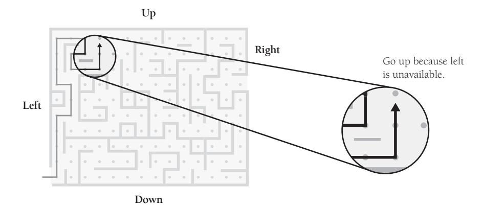
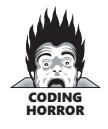
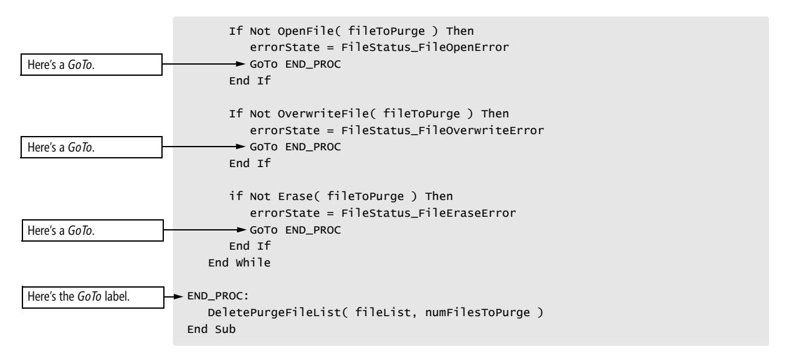
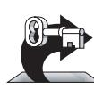

# Chapter 17: Unusual Control Structures


<span id="page-427-0"></span>
### cc2e.com/1778 Contents

- 17.1 Multiple Returns from a Routine: page 391
- 17.2 Recursion: page 393
- 17.3 *goto*: page 398
- 17.4 Perspective on Unusual Control Structures: page 408

#### Related Topics

- General control issues: Chapter 19
- Straight-line code: Chapter 14
- Code with conditionals: Chapter 15
- Code with loops: Chapter 16
- Exception handling: Section 8.4

Several control constructs exist in a hazy twilight zone somewhere between being leading-edge and being discredited and disproved—often in both places at the same time! These constructs aren't available in all languages but can be useful when used with care in those languages that do offer them.

#### 17.1 Multiple Returns from a Routine

Most languages support some means of exiting from a routine partway through the routine. The *return* and *exit* statements are control constructs that enable a program to exit from a routine at will. They cause the routine to terminate through the normal exit channel, returning control to the calling routine. The word *return* is used here as a generic term for *return* in C++ and Java, *Exit Sub* and *Exit Function* in Microsoft Visual Basic, and similar constructs. Here are guidelines for using the *return* statement:


*Use a* **return** *when it enhances readability* In certain routines, once you know the answer, you want to return it to the calling routine immediately. If the routine is defined in such a way that it doesn't require any further cleanup once it detects an error, not returning immediately means that you have to write more code. KEY POINT

The following is a good example of a case in which returning from multiple places in a routine makes sense:

```
C++ Example of a Good Multiple Return from a Routine
This routine returns a 
Comparison enumerated 
type. 
                       Comparison Compare( int value1, int value2 ) {
                        if ( value1 < value2 ) {
                        return Comparison_LessThan;
                        }
                        else if ( value1 > value2 ) {
                        return Comparison_GreaterThan;
                        }
                        return Comparison_Equal;
                       }
```

Other examples are less clear-cut, as the next subsection illustrates.

*Use guard clauses (early returns or exits) to simplify complex error processing* Code that has to check for numerous error conditions before performing its nominal actions can result in deeply indented code and can obscure the nominal case, as shown here:

```
Visual Basic Code That Obscures the Nominal Case
                    If file.validName() Then
                     If file.Open() Then
                     If encryptionKey.valid() Then
                     If file.Decrypt( encryptionKey ) Then
This is the code for the 
nominal case.
                     ' lots of code
                     ...
                     End If
                     End If
                     End If
                    End If
```

Indenting the main body of the routine inside four *if* statements is aesthetically ugly, especially if there's much code inside the innermost *if* statement. In such cases, the flow of the code is sometimes clearer if the erroneous cases are checked first, clearing the way for the nominal path through the code. Here's how that might look:

```
Simple Visual Basic Code That Uses Guard Clauses to Clarify the Nominal Case
' set up, bailing out if errors are found
If Not file.validName() Then Exit Sub
If Not file.Open() Then Exit Sub
If Not encryptionKey.valid() Then Exit Sub
If Not file.Decrypt( encryptionKey ) Then Exit Sub
' lots of code
...
```

This simple code makes this technique look like a tidy solution, but production code often requires more extensive housekeeping or cleanup when an error condition is detected. Here is a more realistic example:

```
More Realistic Visual Basic Code That Uses Guard Clauses to Clarify the Nominal Case
' set up, bailing out if errors are found
If Not file.validName() Then 
 errorStatus = FileError_InvalidFileName
 Exit Sub
End If 
If Not file.Open() Then 
 errorStatus = FileError_CantOpenFile
 Exit Sub
End If 
If Not encryptionKey.valid() Then 
 errorStatus = FileError_InvalidEncryptionKey
 Exit Sub
End If 
If Not file.Decrypt( encryptionKey ) Then 
 errorStatus = FileError_CantDecryptFile
 Exit Sub
End If 
' lots of code
...
```

With production-size code, the *Exit Sub* approach creates a noticeable amount of code before the nominal case is handled. The *Exit Sub* approach does avoid the deep nesting of the first example, however, and, if the code in the first example were expanded to show setting an *errorStatus* variable, the *Exit Sub* approach would do a better job of keeping related statements together. When all the dust settles, the *Exit Sub* approach does appear more readable and maintainable, just not by a very wide margin.

*Minimize the number of returns in each routine* It's harder to understand a routine when, reading it at the bottom, you're unaware of the possibility that it returned somewhere above. For that reason, use returns judiciously—only when they improve readability.

#### 17.2 Recursion

This is the code for the nominal case.

> In recursion, a routine solves a small part of a problem itself, divides the problem into smaller pieces, and then calls itself to solve each of the smaller pieces. Recursion is usually called into play when a small part of the problem is easy to solve and a large part is easy to decompose into smaller pieces.


Recursion isn't useful often, but when used judiciously it produces elegant solutions, as in this example in which a sorting algorithm makes excellent use of recursion:

```
Java Example of a Sorting Algorithm That Uses Recursion
                      void QuickSort( int firstIndex, int lastIndex, String [] names ) {
                       if ( lastIndex > firstIndex ) {
                       int midPoint = Partition( firstIndex, lastIndex, names );
Here are the recursive calls. QuickSort( firstIndex, midPoint-1, names );
                       QuickSort( midPoint+1, lastIndex, names )
                       }
                      }
```

In this case, the sorting algorithm chops an array in two and then calls itself to sort each half of the array. When it calls itself with a subarray that's too small to sort—such as *( lastIndex <= firstIndex )*—it stops calling itself.

For a small group of problems, recursion can produce simple, elegant solutions. For a slightly larger group of problems, it can produce simple, elegant, hard-to-understand solutions. For most problems, it produces massively complicated solutions—in those cases, simple iteration is usually more understandable. Use recursion selectively.

#### Example of Recursion

Suppose you have a data type that represents a maze. A maze is basically a grid, and at each point on the grid you might be able to turn left, turn right, move up, or move down. You'll often be able to move in more than one direction.

How do you write a program to find its way through the maze, as shown in Figure 17- 1? If you use recursion, the answer is fairly straightforward. You start at the beginning and then try all possible paths until you find your way out of the maze. The first time you visit a point, you try to move left. If you can't move left, you try to go up or down, and if you can't go up or down, you try to go right. You don't have to worry about getting lost because you drop a few bread crumbs on each spot as you visit it, and you don't visit the same spot twice.



**Figure 17-1** Recursion can be a valuable tool in the battle against complexity—when used to attack suitable problems.

The recursive code looks like this:

```
C++ Example of Moving Through a Maze Recursively
bool FindPathThroughMaze( Maze maze, Point position ) {
 // if the position has already been tried, don't try it again
 if ( AlreadyTried( maze, position ) ) {
 return false;
 }
 // if this position is the exit, declare success
 if ( ThisIsTheExit( maze, position ) ) {
 return true;
 }
 // remember that this position has been tried
 RememberPosition( maze, position );
 // check the paths to the left, up, down, and to the right; if
 // any path is successful, stop looking 
 if ( MoveLeft( maze, position, &newPosition ) ) {
 if ( FindPathThroughMaze( maze, newPosition ) ) {
 return true;
 }
 }
 if ( MoveUp( maze, position, &newPosition ) ) {
 if ( FindPathThroughMaze( maze, newPosition ) ) {
 return true;
 }
 }
 if ( MoveDown( maze, position, &newPosition ) ) {
 if ( FindPathThroughMaze( maze, newPosition ) ) {
 return true;
 }
 }
 if ( MoveRight( maze, position, &newPosition ) ) {
 if ( FindPathThroughMaze( maze, newPosition ) ) {
 return true;
 }
 }
 return false;
}
```

The first line of code checks to see whether the position has already been tried. One key aim in writing a recursive routine is the prevention of infinite recursion. In this case, if you don't check for having tried a point, you might keep trying it infinitely.

The second statement checks to see whether the position is the exit from the maze. If *ThisIsTheExit()* returns *true*, the routine itself returns *true*.

The third statement remembers that the position has been visited. This prevents the infinite recursion that would result from a circular path.

The remaining lines in the routine try to find a path to the left, up, down, and to the right. The code stops the recursion if the routine ever returns *true*—that is, when the routine finds a path through the maze.

The logic used in this routine is fairly straightforward. Most people experience some initial discomfort using recursion because it's self-referential. In this case, however, an alternative solution would be much more complicated and recursion works well.

#### Tips for Using Recursion

Keep these tips in mind when using recursion:

*Make sure the recursion stops* Check the routine to make sure that it includes a nonrecursive path. That usually means that the routine has a test that stops further recursion when it's not needed. In the maze example, the tests for *AlreadyTried()* and *ThisIsTheExit()* ensure that the recursion stops.

*Use safety counters to prevent infinite recursion* If you're using recursion in a situation that doesn't allow a simple test such as the one just described, use a safety counter to prevent infinite recursion. The safety counter has to be a variable that's not re-created each time you call the routine. Use a class member variable or pass the safety counter as a parameter. Here's an example:

The recursive routine must be able to change the value of *safetyCounter*, so in Visual Basic it's a *ByRef* parameter.

```
Visual Basic Example of Using a Safety Counter to Prevent Infinite Recursion
Public Sub RecursiveProc( ByRef safetyCounter As Integer )
 If ( safetyCounter > SAFETY_LIMIT ) Then
 Exit Sub
 End If
 safetyCounter = safetyCounter + 1
 ...
 RecursiveProc( safetyCounter )
End Sub
```

In this case, if the routine exceeds the safety limit, it stops recursing.

If you don't want to pass the safety counter as an explicit parameter, you could use a member variable in C++, Java, or Visual Basic, or the equivalent in other languages.

*Limit recursion to one routine* Cyclic recursion (A calls B calls C calls A) is dangerous because it's hard to detect. Mentally managing recursion in one routine is tough enough; understanding recursion that spans routines is too much. If you have cyclic recursion, you can usually redesign the routines so that the recursion is restricted to a single routine. If you can't and you still think that recursion is the best approach, use safety counters as a recursive insurance policy.

*Keep an eye on the stack* With recursion, you have no guarantees about how much stack space your program uses and it's hard to predict in advance how the program will behave at run time. You can take a couple of steps to control its run-time behavior, however.

First, if you use a safety counter, one of the considerations in setting a limit for it should be how much stack you're willing to allocate to the recursive routine. Set the safety limit low enough to prevent a stack overflow.

Second, watch for allocation of local variables in recursive functions, especially memory-intensive objects. In other words, use *new* to create objects on the heap rather than letting the compiler create *auto* objects on the stack.

*Don't use recursion for factorials or Fibonacci numbers* One problem with computer-science textbooks is that they present silly examples of recursion. The typical examples are computing a factorial or computing a Fibonacci sequence. Recursion is a powerful tool, and it's really dumb to use it in either of those cases. If a programmer who worked for me used recursion to compute a factorial, I'd hire someone else. Here's the recursive version of the factorial routine:



```
Java Example of an Inappropriate Solution: Using Recursion to Compute a Factorial
int Factorial( int number ) {
 if ( number == 1 ) {
 return 1;
 }
 else {
 return number * Factorial( number - 1 );
 }
}
```

In addition to being slow and making the use of run-time memory unpredictable, the recursive version of this routine is harder to understand than the iterative version, which follows:

```
Java Example of an Appropriate Solution: Using Iteration to Compute a Factorial
int Factorial( int number ) {
 int intermediateResult = 1;
 for ( int factor = 2; factor <= number; factor++ ) {
 intermediateResult = intermediateResult * factor;
 }
 return intermediateResult;
}
```

You can draw three lessons from this example. First, computer-science textbooks aren't doing the world any favors with their examples of recursion. Second, and more important, recursion is a much more powerful tool than its confusing use in computing factorials or Fibonacci numbers would suggest. Third, and most important, you should consider alternatives to recursion before using it. You can do anything with stacks and iteration that you can do with recursion. Sometimes one approach works better; sometimes the other does. Consider both before you choose either one.

#### 17.3** *goto

**cc2e.com/1785** You might think the debate related to *goto*s is extinct, but a quick trip through modern source-code repositories like *SourceForge.net* shows that the *goto* is still alive and well and living deep in your company's server. Moreover, modern equivalents of the *goto* debate still crop up in various guises, including debates about multiple returns, multiple loop exits, named loop exits, error processing, and exception handling.

#### The Argument Against** *goto***s

The general argument against *goto*s is that code without *goto*s is higher-quality code. The famous letter that sparked the original controversy was Edsger Dijkstra's "Go To Statement Considered Harmful" in the March 1968 *Communications of the ACM*. Dijkstra observed that the quality of code was inversely proportional to the number of *goto*s the programmer used. In subsequent work, Dijkstra has argued that code that doesn't contain *goto*s can more easily be proven correct.

Code containing *goto*s is hard to format. Indentation should be used to show logical structure, and *goto*s have an effect on logical structure. Using indentation to show the logical structure of a *goto* and its target, however, is difficult or impossible.

Use of *goto*s defeats compiler optimizations. Some optimizations depend on a program's flow of control residing within a few statements. An unconditional *goto* makes the flow harder to analyze and reduces the ability of the compiler to optimize the code. Thus, even if introducing a *goto* produces an efficiency at the source-language level, it may well reduce overall efficiency by thwarting compiler optimizations.

Proponents of *goto*s sometimes argue that they make code faster or smaller. But code containing *goto*s is rarely the fastest or smallest possible. Donald Knuth's marvelous, classic article "Structured Programming with go to Statements" gives several examples of cases in which using *goto*s makes for slower and larger code (Knuth 1974).

In practice, the use of *goto*s leads to the violation of the principle that code should flow strictly from top to bottom. Even if *goto*s aren't confusing when used carefully, once *goto*s are introduced, they spread through the code like termites through a rotting house. If any *goto*s are allowed, the bad creep in with the good, so it's better not to allow any of them.

Overall, experience in the two decades that followed the publication of Dijkstra's letter showed the folly of producing *goto*-laden code. In a survey of the literature, Ben Shneiderman concluded that the evidence supports Dijkstra's view that we're better off without the *goto* (1980), and many modern languages, including Java, don't even have *goto*s.

#### The Argument for** *goto***s

The argument for the *goto* is characterized by an advocacy of its careful use in specific circumstances rather than its indiscriminate use. Most arguments against *goto*s speak against indiscriminate use. The *goto* controversy erupted when Fortran was the most popular language. Fortran had no presentable loop structures, and in the absence of good advice on programming loops with *goto*s, programmers wrote a lot of spaghetti code. Such code was undoubtedly correlated with the production of low-quality programs, but it has little to do with the careful use of a *goto* to make up for a gap in a modern language's capabilities.

A well-placed *goto* can eliminate the need for duplicate code. Duplicate code leads to problems if the two sets of code are modified differently. Duplicate code increases the size of source and executable files. The bad effects of the *goto* are outweighed in such a case by the risks of duplicate code.

**Cross-Reference** For details on using *goto*s in code that allocates resources, see "Error Processing and *goto*s" in this section. See also the discussion of exception handling in Section 8.4, "Exceptions."

The *goto* is useful in a routine that allocates resources, performs operations on those resources, and then deallocates the resources. With a *goto*, you can clean up in one section of code. The *goto* reduces the likelihood of your forgetting to deallocate the resources in each place you detect an error.

In some cases, the *goto* can result in faster and smaller code. Knuth's 1974 article cited a few cases in which the *goto* produced a legitimate gain.

Good programming doesn't mean eliminating *goto*s. Methodical decomposition, refinement, and selection of control structures automatically lead to *goto*-free programs in most cases. Achieving *goto*-less code is not the aim but the outcome, and putting the focus on avoiding *goto*s isn't helpful.

The evidence suggests only that deliberately chaotic control structure degrades [programmer] performance. These experiments provide virtually no evidence for the beneficial effect of any specific method of structuring control flow.

—*B. A. Sheil*

Decades' worth of research with *goto*s failed to demonstrate their harmfulness. In a survey of the literature, B. A. Sheil concluded that unrealistic test conditions, poor data analysis, and inconclusive results failed to support the claim of Shneiderman and others that the number of bugs in code was proportional to the number of *goto*s (1981). Sheil didn't go so far as to conclude that using *goto*s is a good idea—rather, that experimental evidence against them was not conclusive.

Finally, the *goto* has been incorporated into many modern languages, including Visual Basic, C++, and the Ada language, the most carefully engineered programming language in history. Ada was developed long after the arguments on both sides of the *goto* debate had been fully developed, and after considering all sides of the issue, Ada's engineers decided to include the *goto*.

#### The Phony** *goto* **Debate

A primary feature of most *goto* discussions is a shallow approach to the question. The arguer on the "*goto*s are evil" side presents a trivial code fragment that uses *goto*s and then shows how easy it is to rewrite the fragment without *goto*s. This proves mainly that it's easy to write trivial code without *goto*s.

The arguer on the "I can't live without *goto*s" side usually presents a case in which eliminating a *goto* results in an extra comparison or the duplication of a line of code. This proves mainly that there's a case in which using a *goto* results in one less comparison—not a significant gain on today's computers.

Most textbooks don't help. They provide a trivial example of rewriting some code without a *goto* as if that covers the subject. Here's a disguised example of a trivial piece of code from such a textbook:

```
C++ Example of Code That's Supposed to Be Easy to Rewrite Without gotos
do {
 GetData( inputFile, data );
 if ( eof( inputFile ) ) {
 goto LOOP_EXIT;
 }
 DoSomething( data );
} while ( data != -1 );
LOOP_EXIT:
```

The book quickly replaces this code with *goto*-less code:

```
C++ Example of Supposedly Equivalent Code, Rewritten Without gotos
GetData( inputFile, data );
while ( ( !eof( inputFile ) ) && ( ( data != -1 ) ) ) {
 DoSomething( data );
 GetData( inputFile, data )
}
```

This so-called "trivial" example contains an error. In the case in which *data* equals *-1* entering the loop, the translated code detects the *-1* and exits the loop before executing *DoSomething()*. The original code executes *DoSomething()* before the *-1* is detected. The programming book trying to show how easy it is to code without *goto*s translated its own example incorrectly. But the author of that book shouldn't feel too bad; other books make similar mistakes. Even the pros have difficulty translating code that uses *goto*s.

Here's a faithful translation of the code with no *goto*s:

```
C++ Example of Truly Equivalent Code, Rewritten Without gotos
do {
 GetData( inputFile, data );
 if ( !eof( inputFile )) {
 DoSomething( data );
 }
} while ( ( data != -1 ) && ( !eof( inputFile ) ) );
```

Even with a correct translation of the code, the example is still phony because it shows a trivial use of the *goto*. Such cases are not the ones for which thoughtful programmers choose a *goto* as their preferred form of control.

It would be hard at this late date to add anything worthwhile to the theoretical *goto* debate. What's not usually addressed, however, is the situation in which a programmer fully aware of the *goto*-less alternatives chooses to use a *goto* to enhance readability and maintainability.

The following sections present cases in which some experienced programmers have argued for using *goto*s. The discussions provide examples of code with *goto*s and code rewritten without *goto*s and evaluate the tradeoffs between the versions.

#### Error Processing and** *goto***s

Writing highly interactive code calls for paying a lot of attention to error processing and cleaning up resources when errors occur. The following code example purges a group of files. The routine first gets a group of files to be purged, and then it finds each file, opens it, overwrites it, and erases it. The routine checks for errors at each step.

```
Visual Basic Code with gotos That Processes Errors and Cleans Up Resources
                     ' This routine purges a group of files.
                     Sub PurgeFiles( ByRef errorState As Error_Code )
                      Dim fileIndex As Integer
                      Dim fileToPurge As Data_File
                      Dim fileList As File_List
                      Dim numFilesToPurge As Integer
                      MakePurgeFileList( fileList, numFilesToPurge )
                      errorState = FileStatus_Success
                      fileIndex = 0
                      While ( fileIndex < numFilesToPurge ) 
                      fileIndex = fileIndex + 1
                      If Not ( FindFile( fileList( fileIndex ), fileToPurge ) ) Then
                      errorState = FileStatus_FileFindError
Here's a GoTo. GoTo END_PROC
                      End If
```



This routine is typical of circumstances in which experienced programmers decide to use a *goto*. Similar cases come up when a routine needs to allocate and clean up resources like database connections, memory, or temporary files. The alternative to *goto*s in those cases is usually duplicating code to clean up the resources. In such cases, a programmer might balance the evil of the *goto* against the headache of duplicate-code maintenance and decide that the *goto* is the lesser evil.

You can rewrite the previous routine in a couple of ways to avoid *goto*s, and both ways involve tradeoffs. The possible rewrite strategies follow:

*Rewrite with nested* **if** *statements* To rewrite with nested *if* statements, nest the *if* statements so that each is executed only if the previous test succeeds. This is the standard, textbook programming approach to eliminating *goto*s. Here's a rewrite of the routine using the standard approach:

```
Cross-Reference This rou-
tine could also be rewritten 
with break and no gotos. For 
details on that approach, see 
"Exiting Loops Early" in Sec-
tion 16.2.
                         Visual Basic Code That Avoids gotos by Using Nested ifs
                         ' This routine purges a group of files.
                         Sub PurgeFiles( ByRef errorState As Error_Code )
                          Dim fileIndex As Integer
                          Dim fileToPurge As Data_File
                          Dim fileList As File_List
                          Dim numFilesToPurge As Integer
                          MakePurgeFileList( fileList, numFilesToPurge )
                          errorState = FileStatus_Success
                          fileIndex = 0
The While test has been 
changed to add a test for 
errorState.
                          While ( fileIndex < numFilesToPurge And errorState = FileStatus_Success ) 
                          fileIndex = fileIndex + 1
```

```
 If FindFile( fileList( fileIndex ), fileToPurge ) Then
                    If OpenFile( fileToPurge ) Then
                    If OverwriteFile( fileToPurge ) Then
                    If Not Erase( fileToPurge ) Then
                    errorState = FileStatus_FileEraseError
                    End If
                    Else ' couldn't overwrite file
                    errorState = FileStatus_FileOverwriteError
                    End If
                    Else ' couldn't open file
                    errorState = FileStatus_FileOpenError
                    End If
                    Else ' couldn't find file 
This line is 13 lines away 
from the If statement that 
invokes it.
                    errorState = FileStatus_FileFindError
                    End If
                    End While 
                    DeletePurgeFileList( fileList, numFilesToPurge )
                   End Sub
```

For people used to programming without *goto*s, this code might be easier to read than the *goto* version, and if you use it, you won't have to face an inquisition from the *goto* goon squad.

**Cross-Reference** For more details on indentation and other coding layout issues, see Chapter 31, "Layout and Style." For details on nesting levels, see Section 19.4, "Taming Dangerously Deep Nesting."

The main disadvantage of this nested-*if* approach is that the nesting level is deep, very deep. To understand the code, you have to keep the whole set of nested *if*s in your mind at once. Moreover, the distance between the error-processing code and the code that invokes it is too great: the code that sets *errorState* to *FileStatus\_FileFindError*, for example, is 13 lines from the *if* statement that invokes it.

With the *goto* version, no statement is more than four lines from the condition that invokes it. And you don't have to keep the whole structure in your mind at once. You can essentially ignore any preceding conditions that were successful and focus on the next operation. In this case, the *goto* version is more readable and more maintainable than the nested-*if* version.

*Rewrite with a status variable* To rewrite with a status variable (also called a state variable), create a variable that indicates whether the routine is in an error state. In this case, the routine already uses the *errorState* status variable, so you can use that.

```
Visual Basic Code That Avoids gotos by Using a Status Variable
' This routine purges a group of files.
Sub PurgeFiles( ByRef errorState As Error_Code )
 Dim fileIndex As Integer
 Dim fileToPurge As Data_File
 Dim fileList As File_List
 Dim numFilesToPurge As Integer
 MakePurgeFileList( fileList, numFilesToPurge )
 errorState = FileStatus_Success
 fileIndex = 0
```

```
The While test has been 
changed to add a test for 
errorState.
                      While ( fileIndex < numFilesToPurge ) And ( errorState = FileStatus_Success ) 
                      fileIndex = fileIndex + 1
                      If Not FindFile( fileList( fileIndex ), fileToPurge ) Then
                      errorState = FileStatus_FileFindError
                      End If 
The status variable is tested. If ( errorState = FileStatus_Success ) Then
                      If Not OpenFile( fileToPurge ) Then
                      errorState = FileStatus_FileOpenError
                      End If 
                      End If
The status variable is tested. If ( errorState = FileStatus_Success ) Then
                      If Not OverwriteFile( fileToPurge ) Then
                      errorState = FileStatus_FileOverwriteError
                      End If
                      End If
The status variable is tested. If ( errorState = FileStatus_Success ) Then
                      If Not Erase( fileToPurge ) Then
                      errorState = FileStatus_FileEraseError
                      End If 
                      End If 
                      End While 
                      DeletePurgeFileList( fileList, numFilesToPurge )
                     End Sub
```

The advantage of the status-variable approach is that it avoids the deeply nested *ifthen-else* structures of the first rewrite and is thus easier to understand. It also places the action following the *if-then-else* test closer to the test than the nested-*if* approach did, and it completely avoids *else* clauses.

Understanding the nested-*if* version requires some mental gymnastics. The statusvariable version is easier to understand because it closely models the way people think about the problem. You find the file. If everything is OK, you open the file. If everything is still OK, you overwrite the file. If everything is still OK...

The disadvantage of this approach is that using status variables isn't as common a practice as it should be. Document their use fully, or some programmers might not understand what you're up to. In this example, the use of well-named enumerated types helps significantly.

*Rewrite with* **try-finally** Some languages, including Visual Basic and Java, provide a *try-finally* statement that can be used to clean up resources under error conditions.

To rewrite using the *try-finally* approach, enclose the code that would otherwise need to check for errors inside a *try* block, and place the cleanup code inside a *finally* block. The *try* block specifies the scope of the exception handling, and the *finally* block performs any resource cleanup. The *finally* block will always be called regardless of whether an exception is thrown and regardless of whether the *PurgeFiles()* routine *Catches* any exception that's thrown.

#### **Visual Basic Code That Avoids** *goto***s by Using** *try-finally* ' This routine purges a group of files. Exceptions are passed to the caller. Sub PurgeFiles() Dim fileIndex As Integer Dim fileToPurge As Data\_File Dim fileList As File\_List Dim numFilesToPurge As Integer MakePurgeFileList( fileList, numFilesToPurge ) Try fileIndex = 0 While ( fileIndex < numFilesToPurge ) fileIndex = fileIndex + 1 FindFile( fileList( fileIndex ), fileToPurge ) OpenFile( fileToPurge ) OverwriteFile( fileToPurge ) Erase( fileToPurge ) End While Finally DeletePurgeFileList( fileList, numFilesToPurge ) End Try End Sub

This approach assumes that all function calls throw exceptions for failures rather than returning error codes.

The advantage of the *try-finally* approach is that it is simpler than the *goto* approach and doesn't use *gotos*. It also avoids the deeply nested *if-then-else* structures.

The limitation of the *try-finally* approach is that it must be implemented consistently throughout a code base. If the previous code were part of a code base that used error codes in addition to exceptions, the exception code would be required to set error codes for each possible error, and that requirement would make the code about as complicated as the other approaches.

#### Comparison of the Approaches

Each of the four methods has something to be said for it. The *goto* approach avoids deep nesting and unnecessary tests but of course has *goto*s. The nested-*if* approach avoids *goto*s but is deeply nested and gives an exaggerated picture of the logical complexity of the routine. The status-variable approach avoids *goto*s and deep nesting but introduces extra tests. And the *try-finally* approach avoids both *goto*s and deep nesting but isn't available in all languages.

The *try-finally* approach is the most straightforward in languages that provide *tryfinally* and in code bases that haven't already standardized on another approach. If *try-finally* isn't an option, the status-variable approach is slightly preferable to the *goto* and nested-*if* approaches because it's more readable and it models the problem better, but that doesn't make it the best approach in all circumstances.

Any of these techniques works well when applied consistently to all the code in a project. Consider all the tradeoffs, and then make a projectwide decision about which method to favor.

**Cross-Reference** For a complete list of techniques that can be applied to situations like this, see "Summary of Techniques for Reducing Deep Nesting" in Section 19.4.

#### goto***s and Sharing Code in an** *else* **Clause

One challenging situation in which some programmers would use a *goto* is the case in which you have two conditional tests and an *else* clause and you want to execute code in one of the conditions and in the *else* clause. Here's an example of a case that could drive someone to *goto*:


```
C++ Example of Sharing Code in an else Clause with a goto
if ( statusOk ) {
 if ( dataAvailable ) {
 importantVariable = x;
 goto MID_LOOP;
 }
}
else {
 importantVariable = GetValue();
 MID_LOOP:
 // lots of code
 ...
}
```

This is a good example because it's logically tortuous—it's nearly impossible to read it as it stands, and it's hard to rewrite it correctly without a *goto*. If you think you can easily rewrite it without *goto*s, ask someone to review your code! Several expert programmers have rewritten it incorrectly.

You can rewrite the code in several ways. You can duplicate code, put the common code into a routine and call it from two places, or retest the conditions. In most languages, the rewrite will be a tiny bit larger and slower than the original, but it will be extremely close. Unless the code is in a really hot loop, rewrite it without thinking about efficiency.

The best rewrite would be to put the *// lots of code* part into its own routine. Then you can call the routine from the places you would otherwise have used as origins or destinations of *goto*s and preserve the original structure of the conditional. Here's how it looks:

```
C++ Example of Sharing Code in an else Clause by Putting Common Code 
into a Routine
if ( statusOk ) {
 if ( dataAvailable ) {
 importantVariable = x;
 DoLotsOfCode( importantVariable );
 }
}
else {
 importantVariable = GetValue();
 DoLotsOfCode( importantVariable );
}
```

Normally, writing a new routine is the best approach. Sometimes, however, it's not practical to put duplicated code into its own routine. In this case, you can work around the impractical solution by restructuring the conditional so that you keep the code in the same routine rather than putting it into a new routine:

```
C++ Example of Sharing Code in an else Clause Without a goto
if ( ( statusOk && dataAvailable ) || !statusOk ) {
 if ( statusOk && dataAvailable ) {
 importantVariable = x;
 }
 else {
 importantVariable = GetValue();
 }
 // lots of code
 ...
}
```

**Cross-Reference** Another approach to this problem is to use a decision table. For details, see Chapter 18, "Table-Driven Methods."

This is a faithful and mechanical translation of the logic in the *goto* version. It tests *statusOK* two extra times and *dataAvailable* once, but the code is equivalent. If retesting the conditionals bothers you, notice that the value of *statusOK* doesn't need to be tested twice in the first *if* test. You can also drop the test for *dataAvailable* in the second *if* test.

#### Summary of Guidelines for Using** *goto***s



KEY POINT

Use of *goto*s is a matter of religion. My dogma is that in modern languages, you can easily replace nine out of ten *goto*s with equivalent sequential constructs. In these simple cases, you should replace *goto*s out of habit. In the hard cases, you can still exorcise the *goto* in nine out of ten cases: You can break the code into smaller routines, use *tryfinally*, use nested *if*s, test and retest a status variable, or restructure a conditional. Eliminating the *goto* is harder in these cases, but it's good mental exercise and the techniques discussed in this section give you the tools to do it.

In the remaining one case out of 100 in which a *goto* is a legitimate solution to the problem, document it clearly and use it. If you have your rain boots on, it's not worth walking around the block to avoid a mud puddle. But keep your mind open to *goto*-less approaches suggested by other programmers. They might see something you don't.

Here's a summary of guidelines for using *goto*s:

- Use *goto*s to emulate structured control constructs in languages that don't support them directly. When you do, emulate them exactly. Don't abuse the extra flexibility the *goto* gives you.
- Don't use the *goto* when an equivalent built-in construct is available.
- Measure the performance of any *goto* used to improve efficiency. In most cases, you can recode without *goto*s for improved readability and no loss in efficiency. If your case is the exception, document the efficiency improvement so that *goto*less evangelists won't remove the *goto* when they see it.

**Cross-Reference** For details on improving efficiency, see Chapter 25, "Code-Tuning Strategies," and Chapter 26, "Code-Tuning Techniques."

- Limit yourself to one *goto* label per routine unless you're emulating structured constructs.
- Limit yourself to *goto*s that go forward, not backward, unless you're emulating structured constructs.
- Make sure all *goto* labels are used. Unused labels might be an indication of missing code, namely the code that goes to the labels. If the labels aren't used, delete them.
- Make sure a *goto* doesn't create unreachable code.
- If you're a manager, adopt the perspective that a battle over a single *goto* isn't worth the loss of the war. If the programmer is aware of the alternatives and is willing to argue, the *goto* is probably OK.

#### 17.4 Perspective on Unusual Control Structures

At one time or another, someone thought that each of the following control structures was a good idea:

- Unrestricted use of *goto*s
- Ability to compute a *goto* target dynamically and jump to the computed location
- Ability to use *goto* to jump from the middle of one routine into the middle of another routine
- Ability to call a routine with a line number or label that allowed execution to begin somewhere in the middle of the routine
- Ability to have the program generate code on the fly and then execute the code it just wrote

At one time, each of these ideas was regarded as acceptable or even desirable, even though now they all look hopelessly quaint, outdated, or dangerous. The field of software development has advanced largely through *restricting* what programmers can do with their code. Consequently, I view unconventional control structures with strong skepticism. I suspect that the majority of constructs in this chapter will eventually find their way onto the programmer's scrap heap along with computed *goto* labels, variable routine entry points, self-modifying code, and other structures that favored flexibility and convenience over structure and the ability to manage complexity.

#### Additional Resources

**cc2e.com/1792** The following resources also address unusual control structures:

#### Returns

Fowler, Martin. *Refactoring: Improving the Design of Existing Code*. Reading, MA: Addison-Wesley, 1999. In the description of the refactoring called "Replace Nested Conditional with Guard Clauses," Fowler suggests using multiple *return* statements from a routine to reduce nesting in a set of *if* statements. Fowler argues that multiple *return*s are an appropriate means of achieving greater clarity, and that no harm arises from having multiple returns from a routine.

#### goto***s

These articles contain the whole *goto* debate. It erupts from time to time in most workplaces, textbooks, and magazines, but you won't hear anything that wasn't fully explored 20 years ago.

**cc2e.com/1799** Dijkstra, Edsger. "Go To Statement Considered Harmful." *Communications of the ACM* 11, no. 3 (March 1968): 147–48, also available from *www.cs.utexas.edu/users/EWD/*. This is the famous letter in which Dijkstra put the match to the paper and ignited one of the longest-running controversies in software development.

> Wulf, W. A. "A Case Against the GOTO." *Proceedings of the 25th National ACM Conference*, August 1972: 791–97. This paper was another argument against the indiscriminate use of *goto*s. Wulf argued that if programming languages provided adequate control structures, *goto*s would become largely unnecessary. Since 1972, when the paper was written, languages such as C++, Java, and Visual Basic have proven Wulf correct.

> Knuth, Donald. "Structured Programming with go to Statements," 1974. In *Classics in Software Engineering*, edited by Edward Yourdon. Englewood Cliffs, NJ: Yourdon Press, 1979. This long paper isn't entirely about *goto*s, but it includes a horde of code examples that are made more efficient by eliminating *goto*s and another horde of code examples that are made more efficient by adding *goto*s.

> Rubin, Frank. "'GOTO Considered Harmful' Considered Harmful." *Communications of the ACM* 30, no. 3 (March 1987): 195–96. In this rather hotheaded letter to the editor, Rubin asserts that *goto*-less programming has cost businesses "hundreds of millions of dollars." He then offers a short code fragment that uses a *goto* and argues that it's superior to *goto*-less alternatives.

> The response that Rubin's letter generated was more interesting than the letter itself. For five months, *Communications of the ACM (CACM)* published letters that offered different versions of Rubin's original seven-line program. The letters were evenly divided between those defending *goto*s and those castigating them. Readers suggested roughly 17 different rewrites, and the rewritten code fully covered the spectrum of approaches to avoiding *goto*s. The editor of *CACM* noted that the letter had generated more response by far than any other issue ever considered in the pages of *CACM*.

For the follow-up letters, see

- *Communications of the ACM* 30, no. 5 (May 1987): 351–55.
- *Communications of the ACM* 30, no. 6 (June 1987): 475–78.
- *Communications of the ACM* 30, no. 7 (July 1987): 632–34.

- *Communications of the ACM* 30, no. 8 (August 1987): 659–62.
- *Communications of the ACM* 30, no. 12 (December 1987): 997, 1085.

**cc2e.com/1706** Clark, R. Lawrence, "A Linguistic Contribution of GOTO-less Programming," *Datamation*, December 1973. This classic paper humorously argues for replacing the "go to" statement with the "come from" statement. It was also reprinted in the April 1974 edition of *Communications of the ACM*.

#### cc2e.com/1713 CHECKLIST: Unusual Control Structures

#### return

- ❑ Does each routine use *return* only when necessary?
- ❑ Do *return*s enhance readability?

#### Recursion

- ❑ Does the recursive routine include code to stop the recursion?
- ❑ Does the routine use a safety counter to guarantee that the routine stops?
- ❑ Is recursion limited to one routine?
- ❑ Is the routine's depth of recursion within the limits imposed by the size of the program's stack?
- ❑ Is recursion the best way to implement the routine? Is it better than simple iteration?

#### goto

- ❑ Are *goto*s used only as a last resort, and then only to make code more readable and maintainable?
- ❑ If a *goto* is used for the sake of efficiency, has the gain in efficiency been measured and documented?
- ❑ Are *goto*s limited to one label per routine?
- ❑ Do all *goto*s go forward, not backward?
- ❑ Are all *goto* labels used?

### Key Points

- Multiple *return*s can enhance a routine's readability and maintainability, and they help prevent deeply nested logic. They should, nevertheless, be used carefully.
- Recursion provides elegant solutions to a small set of problems. Use it carefully, too.
- In a few cases, *goto*s are the best way to write code that's readable and maintainable. Such cases are rare. Use *goto*s only as a last resort.
