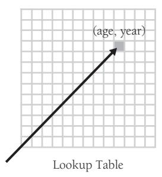
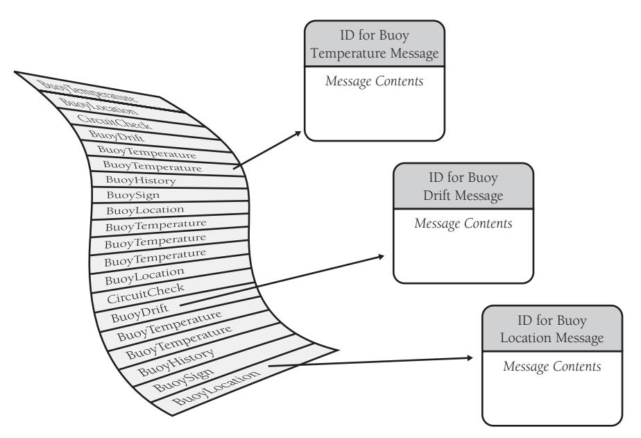
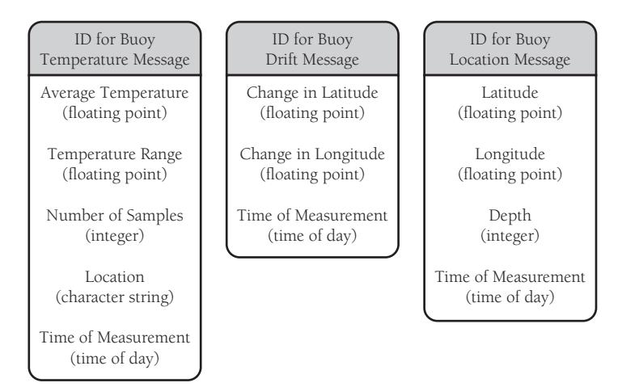
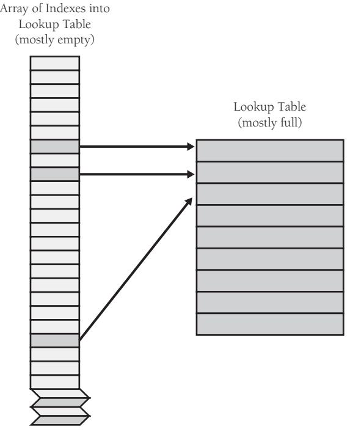
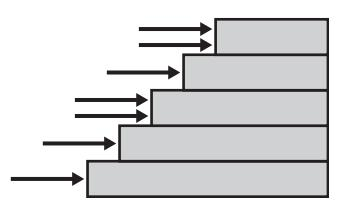

# Chapter 18: Table-Driven Methods


<span id="page-447-0"></span>
### cc2e.com/1865 Contents

- 18.1 General Considerations in Using Table-Driven Methods: page 411
- 18.2 Direct Access Tables: page 413
- 18.3 Indexed Access Tables: page 425
- 18.4 Stair-Step Access Tables: page 426
- 18.5 Other Examples of Table Lookups: page 429

#### Related Topics

- Information hiding: "Hide Secrets (Information Hiding)" in Section 5.3
- Class design: Chapter 6
- Using decision tables to replace complicated logic: in Section 19.1
- Substitute table lookups for complicated expressions: in Section 26.1

A table-driven method is a scheme that allows you to look up information in a table rather than using logic statements (*if* and *case*) to figure it out. Virtually anything you can select with logic statements, you can select with tables instead. In simple cases, logic statements are easier and more direct. As the logic chain becomes more complex, tables become increasingly attractive.

If you're already familiar with table-driven methods, this chapter might be just a review. In that case, you might examine "Flexible-Message-Format Example" in Section 18.2 for a good example of how an object-oriented design isn't necessarily better than any other kind of design just because it's object-oriented, and then you might move on to the discussion of general control issues in Chapter 19.

### 18.1 General Considerations in Using Table-Driven Methods


Used in appropriate circumstances, table-driven code is simpler than complicated logic, easier to modify, and more efficient. Suppose you wanted to classify characters into letters, punctuation marks, and digits; you might use a complicated chain of logic like this one: KEY POINT

```
Java Example of Using Complicated Logic to Classify a Character
if ( ( ( 'a' <= inputChar ) && ( inputChar <= 'z' ) ) ||
 ( ( 'A' <= inputChar ) && ( inputChar <= 'Z' ) ) ) {
 charType = CharacterType.Letter;
} 
else if ( ( inputChar == ' ' ) || ( inputChar == ',' ) ||
 ( inputChar == '.' ) || ( inputChar == '!' ) || ( inputChar == '(' ) ||
 ( inputChar == ')' ) || ( inputChar == ':' ) || ( inputChar == ';' ) ||
 ( inputChar == '?' ) || ( inputChar == '-' ) ) {
 charType = CharacterType.Punctuation;
}
else if ( ( '0' <= inputChar ) && ( inputChar <= '9' ) ) {
 charType = CharacterType.Digit;
}
```

If you used a lookup table instead, you'd store the type of each character in an array that's accessed by character code. The complicated code fragment just shown would be replaced by this:

```
Java Example of Using a Lookup Table to Classify a Character 
charType = charTypeTable[ inputChar ];
```

This fragment assumes that the *charTypeTable* array has been set up earlier. You put your program's knowledge into its data rather than into its logic—in the table instead of in the *if* tests.

#### Two Issues in Using Table-Driven Methods


KEY POINT

When you use table-driven methods, you have to address two issues. First you have to address the question of how to look up entries in the table. You can use some data to access a table directly. If you need to classify data by month, for example, keying into a month table is straightforward. You can use an array with indexes 1 through 12.

Other data is too awkward to be used to look up a table entry directly. If you need to classify data by Social Security Number, for example, you can't use the Social Security Number to key into the table directly unless you can afford to store 999-99-9999 entries in your table. You're forced to use a more complicated approach. Here's a list of ways to look up an entry in a table:

- Direct access
- Indexed access
- Stair-step access

Each of these kinds of accesses is described in more detail in subsections later in this chapter.


The second issue you have to address if you're using a table-driven method is what you should store in the table. In some cases, the result of a table lookup is data. If that's the case, you can store the data in the table. In other cases, the result of a table lookup is an action. In such a case, you can store a code that describes the action or, in some languages, you can store a reference to the routine that implements the action. In either of these cases, tables become more complicated.

#### 18.2 Direct Access Tables

Like all lookup tables, direct-access tables replace more complicated logical control structures. They are "direct access" because you don't have to jump through any complicated hoops to find the information you want in the table. As Figure 18-1 suggests, you can pick out the entry you want directly.



**Figure 18-1** As the name suggests, a direct-access table allows you to access the table element you're interested in directly.

#### Days-in-Month Example

Suppose you need to determine the number of days per month (forgetting about leap year, for the sake of argument). A clumsy way to do it, of course, is to write a large *if* statement:

#### **Visual Basic Example of a Clumsy Way to Determine the Number of Days in a Month** If ( month = 1 ) Then days = 31 ElseIf ( month = 2 ) Then days = 28 ElseIf ( month = 3 ) Then days = 31 ElseIf ( month = 4 ) Then days = 30 ElseIf ( month = 5 ) Then days = 31 ElseIf ( month = 6 ) Then days = 30 ElseIf ( month = 7 ) Then days = 31

```
ElseIf ( month = 8 ) Then
 days = 31
ElseIf ( month = 9 ) Then
 days = 30
ElseIf ( month = 10 ) Then
 days = 31
ElseIf ( month = 11 ) Then
 days = 30
ElseIf ( month = 12 ) Then
 days = 31
End If
```

An easier and more modifiable way to perform the same function is to put the data in a table. In Microsoft Visual Basic, you'd first set up the table:

```
Visual Basic Example of an Elegant Way to Determine the Number of Days in a 
Month
' Initialize Table of "Days Per Month" Data
Dim daysPerMonth() As Integer = _
 { 31, 28, 31, 30, 31, 30, 31, 31, 30, 31, 30, 31 }
```

Now, instead of using the long *if* statement, you can just use a simple array access to find out the number of days in a month:

```
Visual Basic Example of an Elegant Way to Determine the Number of Days in a 
Month (continued)
days = daysPerMonth( month-1 )
```

If you wanted to account for leap year in the table-lookup version, the code would still be simple, assuming *LeapYearIndex()* has a value of either *0* or *1*:

```
Visual Basic Example of an Elegant Way to Determine the Number of Days in a 
Month (continued)
days = daysPerMonth( month-1, LeapYearIndex() )
```

In the *if*-statement version, the long string of *if*s would grow even more complicated if leap year were considered.

Determining the number of days per month is a convenient example because you can use the *month* variable to look up an entry in the table. You can often use the data that would have controlled a lot of *if* statements to access a table directly.

#### Insurance Rates Example

Suppose you're writing a program to compute medical insurance rates and you have rates that vary by age, gender, marital status, and whether a person smokes. If you had to write a logical control structure for the rates, you'd get something like this:


```
Java Example of a Clumsy Way to Determine an Insurance Rate
if ( gender == Gender.Female ) {
 if ( maritalStatus == MaritalStatus.Single ) {
 if ( smokingStatus == SmokingStatus.NonSmoking ) {
 if ( age < 18 ) {
 rate = 200.00;
 }
 else if ( age == 18 ) {
 rate = 250.00;
 }
 else if ( age == 19 ) {
 rate = 300.00;
 }
 ...
 else if ( 65 < age ) {
 rate = 450.00;
 }
 else { 
 if ( age < 18 ) {
 rate = 250.00;
 }
 else if ( age == 18 ) {
 rate = 300.00;
 }
 else if ( age == 19 ) {
 rate = 350.00;
 }
 ...
 else if ( 65 < age ) {
 rate = 575.00;
 }
 }
 else if ( maritalStatus == MaritalStatus.Married )
 ...
}
```

The abbreviated version of the logic structure should be enough to give you an idea of how complicated this kind of thing can get. It doesn't show married females, any males, or most of the ages between 18 and 65. You can imagine how complicated it would get when you programmed the whole rate table.

You might say, "Yeah, but why did you do a test for each age? Why don't you just put the rates in arrays for each age?" That's a good question, and one obvious improvement would be to put the rates into separate arrays for each age.

A better solution, however, is to put the rates into arrays for all the factors, not just age. Here's how you would declare the array in Visual Basic:

```
Visual Basic Example of Declaring Data to Set Up an Insurance Rates Table
Public Enum SmokingStatus
 SmokingStatus_First = 0
 SmokingStatus_Smoking = 0
 SmokingStatus_NonSmoking = 1
 SmokingStatus_Last = 1
End Enum
Public Enum Gender
 Gender_First = 0
 Gender_Male = 0
 Gender_Female = 1
 Gender_Last = 1
End Enum
Public Enum MaritalStatus
 MaritalStatus_First = 0
 MaritalStatus_Single = 0
 MaritalStatus_Married = 1
 MaritalStatus_Last = 1
End Enum
Const MAX_AGE As Integer = 125
Dim rateTable ( SmokingStatus_Last, Gender_Last, MaritalStatus_Last, _
 MAX_AGE ) As Double
```

**Cross-Reference** One advantage of a table-driven approach is that you can put the table's data in a file and read it at run time. That allows you to change something like an insurance rates table without changing the program itself. For more on the idea, see Section 10.6, "Binding Time."

Once you declare the array, you have to figure out some way of putting data into it. You can use assignment statements, read the data from a disk file, compute the data, or do whatever is appropriate. After you've set up the data, you've got it made when you need to calculate a rate. The complicated logic shown earlier is replaced with a simple statement like this one:

```
Visual Basic Example of an Elegant Way to Determine an Insurance Rate 
rate = rateTable( smokingStatus, gender, maritalStatus, age )
```

This approach has the general advantages of replacing complicated logic with a table lookup. The table lookup is more readable and easier to change.

#### Flexible-Message-Format Example

You can use a table to describe logic that's too dynamic to represent in code. With the character-classification example, the days-in-the-month example, and the insurance rates example, you at least knew that you could write a long string of *if* statements if

you needed to. In some cases, however, the data is too complicated to describe with hard-coded *if* statements.

If you think you've got the idea of how direct-access tables work, you might want to skip the next example. It's a little more complicated than the earlier examples, though, and it further demonstrates the power of table-driven approaches.

Suppose you're writing a routine to print messages that are stored in a file. The file usually has about 500 messages, and each file has about 20 kinds of messages. The messages originally come from a buoy and give water temperature, the buoy's location, and so on.

Each of the messages has several fields, and each message starts with a header that has an ID to let you know which of the 20 or so kinds of messages you're dealing with. Figure 18-2 illustrates how the messages are stored.



**Figure 18-2** Messages are stored in no particular order, and each one is identified with a message ID.

The format of the messages is volatile, determined by your customer, and you don't have enough control over your customer to stabilize it. Figure 18-3 shows what a few of the messages look like in detail.



**Figure 18-3** Aside from the Message ID, each kind of message has its own format.

#### Logic-Based Approach

If you used a logic-based approach, you'd probably read each message, check the ID, and then call a routine that's designed to read, interpret, and print each kind of message. If you had 20 kinds of messages, you'd have 20 routines. You'd also have whoknows-how-many lower-level routines to support them—for example, you'd have a *PrintBuoyTemperatureMessage()* routine to print the buoy temperature message. An object-oriented approach wouldn't be much better: you'd typically use an abstract message object with a subclass for each message type.

Each time the format of any message changed, you'd have to change the logic in the routine or class responsible for that message. In the detailed message earlier, if the average-temperature field changed from a floating point to something else, you'd have to change the logic of *PrintBuoyTemperatureMessage()*. (If the buoy itself changed from a "floating point" to something else, you'd have to get a new buoy!)

In the logic-based approach, the message-reading routine consists of a loop to read each message, decode the ID, and then call one of 20 routines based on the message ID. Here's the pseudocode for the logic-based approach:

**Cross-Reference** This lowlevel pseudocode is used for a different purpose than the pseudocode you use for routine design. For details on designing in pseudocode, see Chapter 9, "The Pseudocode Programming Process."

```
While more messages to read
 Read a message header
 Decode the message ID from the message header
 If the message header is type 1 then
 Print a type 1 message
 Else if the message header is type 2 then
 Print a type 2 message
 ...
 Else if the message header is type 19 then
 Print a type 19 message
 Else if the message header is type 20 then
 Print a type 20 message
```

The pseudocode is abbreviated because you can get the idea without seeing all 20 cases.

#### Object-Oriented Approach

If you were using a rote object-oriented approach, the logic would be hidden in the object inheritance structure but the basic structure would be just as complicated:

```
While more messages to read
 Read a message header
 Decode the message ID from the message header
 If the message header is type 1 then
 Instantiate a type 1 message object
 Else if the message header is type 2 then
 Instantiate a type 2 message object
 ...
 Else if the message header is type 19 then
 Instantiate a type 19 message object
 Else if the message header is type 20 then
 Instantiate a type 20 message object
 End if
End While
```

Regardless of whether the logic is written directly or contained within specialized classes, each of the 20 kinds of messages will have its own routine for printing its message. Each routine could also be expressed in pseudocode. This is the pseudocode for the routine to read and print the buoy temperature message:

```
Print "Buoy Temperature Message"
Read a floating-point value
Print "Average Temperature"
Print the floating-point value
Read a floating-point value
Print "Temperature Range"
Print the floating-point value
Read an integer value
Print "Number of Samples"
Print the integer value
Read a character string
Print "Location"
Print the character string
Read a time of day
Print "Time of Measurement"
Print the time of day
```

This is the code for just one kind of message. Each of the other 19 kinds of messages would require similar code. And if a 21st kind of message was added, either a 21st routine or a 21st subclass would need to be added—either way a new message type would require the code to be changed.

#### Table-Driven Approach

The table-driven approach is more economical than the previous approach. The message-reading routine consists of a loop that reads each message header, decodes the ID, looks up the message description in the *Message* array, and then calls the same routine every time to decode the message. With a table-driven approach, you can describe the format of each message in a table rather than hard-coding it in program logic. This makes it easier to code originally, generates less code, and makes it easier to maintain without changing code.

To use this approach, you start by listing the kinds of messages and the types of fields. In C++, you could define the types of all the possible fields this way:

```
C++ Example of Defining Message Data Types 
enum FieldType { 
 FieldType_FloatingPoint, 
 FieldType_Integer,
 FieldType_String,
 FieldType_TimeOfDay, 
 FieldType_Boolean, 
 FieldType_BitField,
 FieldType_Last = FieldType_BitField
};
```

Rather than hard-coding printing routines for each of the 20 kinds of messages, you can create a handful of routines that print each of the primary data types—floating point, integer, character string, and so on. You can describe the contents of each kind of message in a table (including the name of each field) and then decode each message based on the description in the table. A table entry to describe one kind of message might look like this:

```
Example of Defining a Message Table Entry
Message Begin
 NumFields 5
 MessageName "Buoy Temperature Message"
 Field 1, FloatingPoint, "Average Temperature"
 Field 2, FloatingPoint, "Temperature Range"
 Field 3, Integer, "Number of Samples"
 Field 4, String, "Location"
 Field 5, TimeOfDay, "Time of Measurement"
Message End
```

This table could be hard-coded in the program (in which case, each of the elements shown would be assigned to variables), or it could be read from a file at program startup time or later.

Once message definitions are read into the program, instead of having all the information embedded in a program's logic, you have it embedded in data. Data tends to be

more flexible than logic. Data is easy to change when a message format changes. If you have to add a new kind of message, you can just add another element to the data table.

Here's the pseudocode for the top-level loop in the table-driven approach:

The first three lines here are the same as in the logic-based approach.

```
While more messages to read
 Read a message header
 Decode the message ID from the message header
 Look up the message description in the message-description table
 Read the message fields and print them based on the message description
End While
```

Unlike the pseudocode for the logic-based approach, the pseudocode in this case isn't abbreviated because the logic is so much less complicated. In the logic below this level, you'll find one routine that's capable of interpreting a message description from the message description table, reading message data, and printing a message. That routine is more general than any of the logic-based message-printing routines but not much more complicated, and it will be one routine instead of 20:

```
While more fields to print
 Get the field type from the message description
 case ( field type )
 of ( floating point )
 read a floating-point value
 print the field label
 print the floating-point value
 of ( integer )
 read an integer value
 print the field label
 print the integer value
 of ( character string )
 read a character string
 print the field label
 print the character string
 of ( time of day )
 read a time of day
 print the field label
 print the time of day
 of ( boolean )
 read a single flag
 print the field label
 print the single flag
 of ( bit field )
 read a bit field
 print the field label
 print the bit field
 End Case
End While
```

Admittedly, this routine with its six cases is longer than the single routine needed to print the buoy temperature message. But this is the only routine you need. You don't need 19 other routines for the 19 other kinds of messages. This routine handles the six field types and takes care of all the kinds of messages.

This routine also shows the most complicated way of implementing this kind of table lookup because it uses a *case* statement. Another approach would be to create an abstract class *AbstractField* and then create subclasses for each field type. You won't need a *case* statement; you can call the member routine of the appropriate type of object.

Here's how you would set up the object types in C++:

```
C++ Example of Setting Up Object Types
class AbstractField {
 public:
 virtual void ReadAndPrint( string, FileStatus & ) = 0;
};
class FloatingPointField : public AbstractField {
 public:
 virtual void ReadAndPrint( string, FileStatus & ) {
 ...
 }
};
class IntegerField ...
class StringField ...
...
```

This code fragment declares a member routine for each class that has a string parameter and a *FileStatus* parameter.

The next step is to declare an array to hold the set of objects. The array is the lookup table, and here's how it looks:

```
C++ Example of Setting Up a Table to Hold an Object of Each Type
AbstractField* field[ Field_Last+1];
```

The final step required to set up the table of objects is to assign the names of specific objects to the *Field* array:

```
C++ Example of Setting Up a List of Objects
field[ Field_FloatingPoint ] = new FloatingPointField();
field[ Field_Integer ] = new IntegerField();
field[ Field_String ] = new StringField();
field[ Field_TimeOfDay ] = new TimeOfDayField();
field[ Field_Boolean ] = new BooleanField();
field[ Field_BitField ] = new BitFieldField();
```

This code fragment assumes that *FloatingPointField* and the other identifiers on the right side of the assignment statements are names of objects of type *AbstractField*. Assigning the objects to array elements in the array means that you can call the correct *ReadAndPrint()* routine by referencing an array element instead of by using a specific kind of object directly.

Once the table of routines is set up, you can handle a field in the message simply by accessing the table of objects and calling one of the member routines in the table. The code looks like this:

```
C++ Example of Looking Up Objects and Member Routines in a Table
This stuff is just house-
keeping for each field in 
a message.
                          fieldIdx = 1;
                          while ( ( fieldIdx <= numFieldsInMessage ) && ( fileStatus == OK ) ) {
                           fieldType = fieldDescription[ fieldIdx ].FieldType; 
                           fieldName = fieldDescription[ fieldIdx ].FieldName;
This is the table lookup that 
calls a routine depending 
on the type of the field—
just by looking it up in a 
                           field[ fieldType ].ReadAndPrint( fieldName, fileStatus );
                           fieldIdx++;
                          }
```

Remember the original 34 lines of table-lookup pseudocode containing the *case* statement? If you replace the *case* statement with a table of objects, this is all the code you'd need to provide the same functionality. Incredibly, it's also all the code needed to replace all 20 of the individual routines in the logic-based approach. Moreover, if the message descriptions are read from a file, new message types won't require code changes unless there's a new field type.

You can use this approach in any object-oriented language. It's less error-prone, more maintainable, and more efficient than lengthy *if* statements, *case* statements, or copious subclasses.

The fact that a design uses inheritance and polymorphism doesn't make it a good design. The rote object-oriented design described earlier in the "Object-Oriented Approach" section would require as much code as a rote functional design—or more. That approach made the solution space more complicated, rather than less. The key design insight in this case is neither object orientation nor functional orientation—it's the use of a well thought out lookup table.

#### Fudging Lookup Keys

table of objects.

In each of the three previous examples, you could use the data to key into the table directly. That is, you could use *messageID* as a key without alteration, as you could use *month* in the days-per-month example and *gender*, *maritalStatus*, and *smokingStatus* in the insurance rates example.

You'd always like to key into a table directly because it's simple and fast. Sometimes, however, the data isn't cooperative. In the insurance rates example, *age* wasn't well behaved. The original logic had one rate for people under 18, individual rates for ages 18 through 65, and one rate for people over 65. This meant that for ages 0 through 17 and 66 and over, you couldn't use the age to key directly into a table that stored only one set of rates for several ages.

This leads to the topic of fudging table-lookup keys. You can fudge keys in several ways:

*Duplicate information to make the key work directly* One straightforward way to make *age* work as a key into the rates table is to duplicate the under-18 rates for each of the ages 0 through 17 and then use the age to key directly into the table. You can do the same thing for ages 66 and over. The benefits of this approach are that the table structure itself is straightforward and the table accesses are also straightforward. If you needed to add age-specific rates for ages 17 and below, you could just change the table. The drawbacks are that the duplication would waste space for redundant information and increase the possibility of errors in the table—if only because the table would contain redundant data.

*Transform the key to make it work directly* A second way to make *Age* work as a direct key is to apply a function to *Age* so that it works well. In this case, the function would have to change all ages 0 through 17 to one key, say 17, and all ages above 66 to another key, say 66. This particular range is well behaved enough that you could use *min()* and *max()* functions to make the transformation. For example, you could use the expression

```
max( min( 66, Age ), 17 )
```

to create a table key that ranges from 17 to 66.

Creating the transformation function requires that you recognize a pattern in the data you want to use as a key, and that's not always as simple as using the *min()* and *max()* routines. Suppose that in this example the rates were for five-year age bands instead of one-year bands. Unless you wanted to duplicate all your data five times, you'd have to come up with a function that divided *Age* by 5 properly and used the *min()* and *max()* routines.

*Isolate the key transformation in its own routine* If you have to fudge data to make it work as a table key, put the operation that changes the data to a key into its own routine. A routine eliminates the possibility of using different transformations in different places. It makes modifications easier when the transformation changes. A good name for the routine, like *KeyFromAge()*, also clarifies and documents the purpose of the mathematical machinations.

If your environment provides ready-made key transformations, use them. For example, Java provides *HashMap*, which can be used to associate key/value pairs.

#### 18.3 Indexed Access Tables

Sometimes a simple mathematical transformation isn't powerful enough to make the jump from data like *Age* to a table key. Some such cases are suited to the use of an indexed access scheme.

When you use indexes, you use the primary data to look up a key in an index table and then you use the value from the index table to look up the main data you're interested in.

Suppose you run a warehouse and have an inventory of about 100 items. Suppose further that each item has a four-digit part number that ranges from 0000 through 9999. In this case, if you want to use the part number to key directly into a table that describes some aspect of each item, you set up an index array with 10,000 entries (from 0 through 9999). The array is empty except for the 100 entries that correspond to part numbers of the 100 items in your warehouse. As Figure 18-4 shows, those entries point to an item-description table that has far fewer than 10,000 entries.



**Figure 18-4** Rather than being accessed directly, an indexed access table is accessed via an intermediate index.

Indexed access schemes offer two main advantages. First, if each of the entries in the main lookup table is large, it takes a lot less space to create an index array with a lot of wasted space than it does to create a main lookup table with a lot of wasted space. For example, suppose that the main table takes 100 bytes per entry and that the index

array takes 2 bytes per entry. Suppose that the main table has 100 entries and that the data used to access it has 10,000 possible values. In such a case, the choice is between having an index with 10,000 entries or a main data member with 10,000 entries. If you use an index, your total memory use is 30,000 bytes. If you forgo the index structure and waste space in the main table, your total memory use is 1,000,000 bytes.

The second advantage, even if you don't save space by using an index, is that it's sometimes cheaper to manipulate entries in an index than entries in a main table. For example, if you have a table with employee names, hiring dates, and salaries, you can create one index that accesses the table by employee name, another that accesses the table by hiring date, and a third that accesses the table by salary.

A final advantage of an index-access scheme is the general table-lookup advantage of maintainability. Data encoded in tables is easier to maintain than data embedded in code. To maximize the flexibility, put the index-access code in its own routine and call the routine when you need to get a table key from a part number. When it's time to change the table, you might decide to switch the index-accessing scheme or switch to another table-lookup scheme altogether. The access scheme will be easier to change if you don't spread index accesses throughout your program.

#### 18.4 Stair-Step Access Tables

Yet another kind of table access is the stair-step method. This access method isn't as direct as an index structure, but it doesn't waste as much data space.

The general idea of stair-step structures, illustrated in Figure 18-5, is that entries in a table are valid for ranges of data rather than for distinct data points.



**Figure 18-5** The stair-step approach categorizes each entry by determining the level at which it hits a "staircase." The "step" it hits determines its category.

For example, if you're writing a grading program, the "B" entry range might be from 75 percent to 90 percent. Here's a range of grades you might have to program someday:

| ≥ 90.0% | A |
|---------|---|
| < 90.0% | B |
| < 75.0% | C |
| < 65.0% | D |
| < 50.0% | F |

This is an ugly range for a table lookup because you can't use a simple data-transformation function to key into the letters *A* through *F*. An index scheme would be awkward because the numbers are floating point. You might consider converting the floating-point numbers to integers, and in this case that would be a valid design option, but for the sake of illustration, this example will stick with floating point.

To use the stair-step method, you put the upper end of each range into a table and then write a loop to check a score against the upper end of each range. When you find the point at which the score first exceeds the top of a range, you know what the grade is. With the stair-step technique, you have to be careful to handle the endpoints of the ranges properly. Here's the code in Visual Basic that assigns grades to a group of students based on this example:

```
Visual Basic Example of a Stair-Step Table Lookup
' set up data for grading table
Dim rangeLimit() As Double = { 50.0, 65.0, 75.0, 90.0, 100.0 }
Dim grade() As String = { "F", "D", "C", "B", "A" }
maxGradeLevel = grade.Length – 1
...
' assign a grade to a student based on the student's score
gradeLevel = 0
studentGrade = "A"
While ( ( studentGrade = "A" ) and ( gradeLevel < maxGradeLevel ) )
 If ( studentScore < rangeLimit( gradeLevel ) ) Then
 studentGrade = grade( gradeLevel )
 End If
 gradeLevel = gradeLevel + 1
Wend
```

Although this is a simple example, you can easily generalize it to handle multiple students, multiple grading schemes (for example, different grades for different point levels on different assignments), and changes in the grading scheme.

The advantage of this approach over other table-driven methods is that it works well with irregular data. The grading example is simple in that, although grades are assigned at irregular intervals, the numbers are "round," ending with 5s and 0s. The stair-step approach is equally well suited to data that doesn't end neatly with 5s and 0s. You can use the stair-step approach in statistics work for probability distributions with numbers like this:

| Probability | Insurance Claim Amount |
|-------------|------------------------|
| 0.458747    | \$0.00                 |
| 0.547651    | \$254.32               |
| 0.627764    | \$514.77               |
| 0.776883    | \$747.82               |
| 0.893211    | \$1,042.65             |

| Probability | Insurance Claim Amount |
|-------------|------------------------|
| 0.957665    | \$5,887.55             |
| 0.976544    | \$12,836.98            |
| 0.987889    | \$27,234.12            |
|             |                        |

Ugly numbers like these defy any attempt to come up with a function to neatly transform them into table keys. The stair-step approach is the answer.

This approach also enjoys the general advantages of table-driven approaches: it's flexible and modifiable. If the grading ranges in the grading example were to change, the program could easily be adapted by modifying the entries in the *RangeLimit* array. You could easily generalize the grade-assignment part of the program so that it would accept a table of grades and corresponding cut-off scores. The grade-assignment part of the program wouldn't have to use scores expressed as percentages; it could use raw points rather than percentages, and the program wouldn't have to change much.

Here are a few subtleties to consider as you use the stair-step technique:

*Watch the endpoints* Make sure you've covered the case at the top end of each stairstep range. Run the stair-step search so that it finds items that map to any range other than the uppermost range, and then have the rest fall into the uppermost range. Sometimes this requires creating an artificial value for the top of the uppermost range.

Be careful about mistaking < for <=. Make sure that the loop terminates properly with values that fall into the top ranges and that the range boundaries are handled correctly.

*Consider using a binary search rather then a sequential search* In the grading example, the loop that assigns the grade searches sequentially through the list of grading limits. If you had a larger list, the cost of the sequential search might become prohibitive. If it does, you can replace it with a quasi-binary search. It's a "quasi" binary search because the point of most binary searches is to find a value. In this case, you don't expect to find the value; you expect to find the right category for the value. The binary-search algorithm must correctly determine where the value should go. Remember also to treat the endpoint as a special case.

*Consider using indexed access instead of the stair-step technique* An index-access scheme such as the ones described in Section 18.3 might be a good alternative to a stairstep technique. The searching required in the stair-step method can add up, and if execution speed is a concern, you might be willing to trade the space an extra index structure takes up for the time advantage you get with a more direct access method.

Obviously, this alternative isn't a good choice in all cases. In the grading example, you could probably use it; if you had only 100 discrete percentage points, the memory cost of setting up an index array wouldn't be prohibitive. If, on the other hand, you had the probability data listed earlier, you couldn't set up an indexing scheme because you can't key into entries with numbers like 0.458747 and 0.547651.

**Cross-Reference** For more on good approaches to choosing design alternatives, see Chapter 5, "Design in Construction."

In some cases, any of the several options might work. The point of design is choosing one of the several good options for your case. Don't worry too much about choosing the best one. As Butler Lampson, a distinguished engineer at Microsoft, says, it's better to strive for a good solution and avoid disaster rather than trying to find the best solution (Lampson 1984).

*Put the stair-step table lookup into its own routine* When you create a transformation function that changes a value like *StudentGrade* into a table key, put it into its own routine.

#### 18.5 Other Examples of Table Lookups

A few other examples of table lookups appear in other sections of the book. They're used in the course of discussing other techniques, and the contexts don't emphasize the table lookups per se. Here's where you'll find them:

- Looking up rates in an insurance table: Section 16.3, "Creating Loops Easily— From the Inside Out"
- Using decision tables to replace complicated logic: "Use decision tables to replace complicated conditions" in Section 19.1.
- Cost of memory paging during a table lookup: Section 25.3, "Kinds of Fat and Molasses"
- Combinations of boolean values (A or B or C): "Substitute Table Lookups for Complicated Expressions" in Section 26.1
- Precomputing values in a loan repayment table: Section 26.4, "Expressions."

#### cc2e.com/1872 CHECKLIST: Table-Driven Methods

- ❑ Have you considered table-driven methods as an alternative to complicated logic?
- ❑ Have you considered table-driven methods as an alternative to complicated inheritance structures?
- ❑ Have you considered storing the table's data externally and reading it at run time so that the data can be modified without changing code?
- ❑ If the table cannot be accessed directly via a straightforward array index (as in the *age* example), have you put the access-key calculation into a routine rather than duplicating the index calculation in the code?

#### Key Points

- Tables provide an alternative to complicated logic and inheritance structures. If you find that you're confused by a program's logic or inheritance tree, ask yourself whether you could simplify by using a lookup table.
- One key consideration in using a table is deciding how to access the table. You can access tables by using direct access, indexed access, or stair-step access.
- Another key consideration in using a table is deciding what exactly to put into the table.
