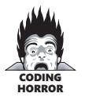
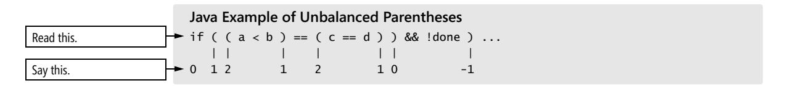
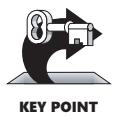
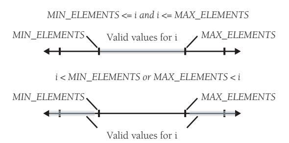
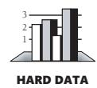
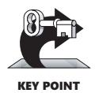
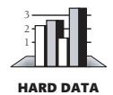

# Chapter 19: General Control Issues


<span id="page-467-0"></span>
### cc2e.com/1978 Contents

- 19.1 Boolean Expressions: page 431
- 19.2 Compound Statements (Blocks): page 443
- 19.3 Null Statements: page 444
- 19.4 Taming Dangerously Deep Nesting: page 445
- 19.5 A Programming Foundation: Structured Programming: page 454
- 19.6 Control Structures and Complexity: page 456

#### Related Topics

- Straight-line code: Chapter 14
- Code with conditionals: Chapter 15
- Code with loops: Chapter 16
- Unusual control structures: Chapter 17
- Complexity in software development: "Software's Primary Technical Imperative: Managing Complexity" in Section 5.2

No discussion of control would be complete unless it went into several general issues that crop up when you think about control constructs. Most of the information in this chapter is detailed and pragmatic. If you're reading for the theory of control structures rather than for the gritty details, concentrate on the historical perspective on structured programming in Section 19.5 and on the relationships between control structures in Section 19.6.

### 19.1 Boolean Expressions

Except for the simplest control structure, the one that calls for the execution of statements in sequence, all control structures depend on the evaluation of boolean expressions.

#### Using** *true* **and** *false* **for Boolean Tests

Use the identifiers *true* and *false* in boolean expressions rather than using values like *0* and *1*. Most modern languages have a boolean data type and provide predefined identifiers for true and false. They make it easy—they don't even allow you to assign

values other than *true* or *false* to boolean variables. Languages that don't have a boolean data type require you to have more discipline to make boolean expressions readable. Here's an example of the problem:



```
Visual Basic Examples of Using Ambiguous Flags for Boolean Values
Dim printerError As Integer
Dim reportSelected As Integer
Dim summarySelected As Integer
...
If printerError = 0 Then InitializePrinter()
If printerError = 1 Then NotifyUserOfError()
If reportSelected = 1 Then PrintReport()
If summarySelected = 1 Then PrintSummary()
If printerError = 0 Then CleanupPrinter()
```

If using flags like *0* and *1* is common practice, what's wrong with it? It's not clear from reading the code whether the function calls are executed when the tests are true or when they're false. Nothing in the code fragment itself tells you whether *1* represents true and *0* false or whether the opposite is true. It's not even clear that the values *1* and *0* are being used to represent true and false. For example, in the *If reportSelected = 1* line, the *1* could easily represent the first report, a *2* the second, a *3* the third; nothing in the code tells you that *1* represents either true or false. It's also easy to write *0* when you mean *1* and vice versa.

Use terms named *true* and *false* for tests with boolean expressions. If your language doesn't support such terms directly, create them using preprocessor macros or global variables. The previous code example is rewritten here using Microsoft Visual Basic's built-in *True* and *False*:

**Cross-Reference** For an even better approach to making these same tests, see the next code example.

```
Good, but Not Great Visual Basic Examples of Using True and False for Tests Instead 
of Numeric Values
```

```
Dim printerError As Boolean
Dim reportSelected As ReportType
Dim summarySelected As Boolean
...
If ( printerError = False ) Then InitializePrinter()
If ( printerError = True ) Then NotifyUserOfError()
If ( reportSelected = ReportType_First ) Then PrintReport()
If ( summarySelected = True ) Then PrintSummary()
If ( printerError = False ) Then CleanupPrinter()
```

Use of the *True* and *False* constants makes the intent clearer. You don't have to remember what *1* and *0* represent, and you won't accidentally reverse them. Moreover, in the rewritten code, it's now clear that some of the *1*s and *0*s in the original Visual Basic example weren't being used as boolean flags. The *If reportSelected = 1* line was not a boolean test at all; it tested whether the first report had been selected.

This approach tells the reader that you're making a boolean test. It's also harder to write *true* when you mean *false* than it is to write *1* when you mean *0*, and you avoid spreading the magic numbers *0* and *1* throughout your code. Here are some tips on defining *true* and *false* in boolean tests:

*Compare boolean values to* **true** *and* **false** *implicitly* You can write clearer tests by treating the expressions as boolean expressions. For example, write

```
while ( not done ) ...
while ( a > b ) ...
rather than
while ( done = false ) ...
while ( (a > b) = true ) ...
```

Using implicit comparisons reduces the number of terms that someone reading your code has to keep in mind, and the resulting expressions read more like conversational English. The previous example could be rewritten with even better style like this:

```
Better Visual Basic Examples of Testing for True and False Implicitly
Dim printerError As Boolean
Dim reportSelected As ReportType
Dim summarySelected As Boolean
...
If ( Not printerError ) Then InitializePrinter()
If ( printerError ) Then NotifyUserOfError()
If ( reportSelected = ReportType_First ) Then PrintReport()
If ( summarySelected ) Then PrintSummary()
If ( Not printerError ) Then CleanupPrinter()
```

**Cross-Reference** For details, see Section 12.5, "Boolean Variables."

If your language doesn't support boolean variables and you have to emulate them, you might not be able to use this technique because emulations of *true* and *false* can't always be tested with statements like *while ( not done )*.

#### Making Complicated Expressions Simple

You can take several steps to simplify complicated expressions:

*Break complicated tests into partial tests with new boolean variables* Rather than creating a monstrous test with half a dozen terms, assign intermediate values to terms that allow you to perform a simpler test.

*Move complicated expressions into boolean functions* If a test is repeated often or distracts from the main flow of the program, move the code for the test into a function and test the value of the function. For example, here's a complicated test:

```
Visual Basic Example of a Complicated Test
If ( ( document.AtEndOfStream ) And ( Not inputError ) ) And _
 ( ( MIN_LINES <= lineCount ) And ( lineCount <= MAX_LINES ) ) And _
 ( Not ErrorProcessing( ) ) Then
 ' do something or other
 ...
End If
```

This is an ugly test to have to read through if you're not interested in the test itself. By putting it into a boolean function, you can isolate the test and allow the reader to forget about it unless it's important. Here's how you could put the *if* test into a function:

**Cross-Reference** For details on the technique of using intermediate variables to clarify a boolean test, see "Use boolean variables to document your program" in Section 12.5.

```
Visual Basic Example of a Complicated Test Moved into a Boolean Function, with 
                       New Intermediate Variables to Make the Test Clearer
                       Function DocumentIsValid( _
                        ByRef documentToCheck As Document, _
                        lineCount As Integer, _
                        inputError As Boolean _
                        ) As Boolean
                        Dim allDataRead As Boolean
                        Dim legalLineCount As Boolean
Intermediate variables are 
introduced here to clarify the 
test on the final line, below. 
                        allDataRead = ( documentToCheck.AtEndOfStream ) And ( Not inputError )
                        legalLineCount = ( MIN_LINES <= lineCount ) And ( lineCount <= MAX_LINES )
                        DocumentIsValid = allDataRead And legalLineCount And ( Not ErrorProcessing() )
                       End Function
```

This example assumes that *ErrorProcessing()* is a boolean function that indicates the current processing status. Now, when you read through the main flow of the code, you don't have to read the complicated test:

```
Visual Basic Example of the Main Flow of the Code Without the Complicated Test
If ( DocumentIsValid( document, lineCount, inputError ) ) Then
 ' do something or other
 ...
End If
```


If you use the test only once, you might not think it's worthwhile to put it into a routine. But putting the test into a well-named function improves readability and makes it easier for you to see what your code is doing, and that's a sufficient reason to do it. The new function name introduces an abstraction into the program that documents the purpose of the test *in code*. That's even better than documenting the test with comments because the code is more likely to be read than the comments and it's more likely to be kept up to date, too.

**Cross-Reference** For details on using tables as substitutes for complicated logic, see Chapter 18, "Table-Driven Methods."

*Use decision tables to replace complicated conditions* Sometimes you have a complicated test involving several variables. It can be helpful to use a decision table to perform the test rather than using *if*s or *case*s. A decision-table lookup is easier to code initially, having only a couple of lines of code and no tricky control structures. This minimization of complexity minimizes the opportunity for mistakes. If your data changes, you can change a decision table without changing the code; you only need to update the contents of the data structure.

#### Forming Boolean Expressions Positively

I ain't not no undummy. —*Homer Simpson*

Not a few people don't have not any trouble understanding a nonshort string of nonpositives—that is, most people have trouble understanding a lot of negatives. You can do several things to avoid complicated negative boolean expressions in your programs:

*In* **if** *statements, convert negatives to positives and flip-flop the code in the* **if** *and* **else** *clauses* Here's an example of a negatively expressed test:

```
Java Example of a Confusing Negative Boolean Test
Here's the negative not. if ( !statusOK ) {
                        // do something
                        ...
                       }
                       else {
                        // do something else
                        ...
                       }
```

You can change this to the following positively expressed test:

```
The test in this line has 
been reversed.
                           Java Example of a Clearer Positive Boolean Test
                           if ( statusOK ) {
                            // do something else
The code in this block has 
been switched...
                            ...
                           }
                           else {
...with the code in this block. // do something
                            ...
                           }
```

**Cross-Reference** The recommendation to frame boolean expressions positively sometimes contradicts the recommendation to code the nominal case after the *if* rather than the *else*. (See Section 15.1, "*if* Statements.") In such a case, you have to think about the benefits of each approach and decide which is better for your situation.

The second code fragment is logically the same as the first but is easier to read because the negative expression has been changed to a positive.

Alternatively, you could choose a different variable name, one that would reverse the truth value of the test. In the example, you could replace *statusOK* with *ErrorDetected*, which would be true when *statusOK* was false.

*Apply DeMorgan's Theorems to simplify boolean tests with negatives* DeMorgan's Theorems let you exploit the logical relationship between an expression and a version of the expression that means the same thing because it's doubly negated. For example, you might have a code fragment that contains the following test:

```
Java Example of a Negative Test
if ( !displayOK || !printerOK ) ...
```

This is logically equivalent to the following:

```
Java Example After Applying DeMorgan's Theorems
if ( !( displayOK && printerOK ) ) ...
```

Here you don't have to flip-flop *if* and *else* clauses; the expressions in the last two code fragments are logically equivalent. To apply DeMorgan's Theorems to the logical operator *and* or the logical operator *or* and a pair of operands, you negate each of the operands, switch the *and*s and *or*s, and negate the entire expression. Table 19-1 summarizes the possible transformations under DeMorgan's Theorems.

**Table 19-1 Transformations of Logical Expressions Under DeMorgan's Theorems**

| Initial Expression | Equivalent Expression   |
|--------------------|-------------------------|
| not A and not B    | not ( A or B )          |
| not A and B        | not ( A or not B )      |
| A and not B        | not ( not A or B )      |
| A and B            | not ( not A or not B )  |
| not A or not B*    | not ( A and B )         |
| not A or B         | not ( A and not B )     |
| A or not B         | not ( not A and B )     |
| A or B             | not ( not A and not B ) |

<sup>\*</sup> This is the expression used in the example.

#### Using Parentheses to Clarify Boolean Expressions

**Cross-Reference** For an example of using parentheses to clarify other kinds of expressions, see "Parentheses" in Section 31.2.

If you have a complicated boolean expression, rather than relying on the language's evaluation order, parenthesize to make your meaning clear. Using parentheses makes less of a demand on your reader, who might not understand the subtleties of how your language evaluates boolean expressions. If you're smart, you won't depend on your own or your reader's in-depth memorization of evaluation precedence—especially when you have to switch among two or more languages. Using parentheses isn't like sending a telegram: you're not charged for each character—the extra characters are free.

Here's an expression with too few parentheses:

```
Java Example of an Expression Containing Too Few Parentheses
if ( a < b == c == d ) ...
```

This is a confusing expression to begin with, and it's even more confusing because it's not clear whether the coder means to test *( a < b ) == ( c == d )* or *( ( a < b ) == c ) == d*. The following version of the expression is still a little confusing, but the parentheses help:

```
Java Example of an Expression Better Parenthesized
if ( ( a < b ) == ( c == d ) ) ...
```

In this case, the parentheses help readability and the program's correctness—the compiler wouldn't have interpreted the first code fragment this way. When in doubt, parenthesize.

**Cross-Reference** Many programmer-oriented text editors have commands that match parentheses, brackets, and braces. For details on programming editors, see "Editing" in Section 30.2.

*Use a simple counting technique to balance parentheses* If you have trouble telling whether parentheses balance, here's a simple counting trick that helps. Start by saying "zero." Move along the expression, left to right. When you encounter an opening parenthesis, say "one." Each time you encounter another opening parenthesis, increase the number you say. Each time you encounter a closing parenthesis, decrease the number you say. If, at the end of the expression, you're back to 0, your parentheses are balanced.

```
Java Example of Balanced Parentheses
Read this. if ( ( ( a < b ) == ( c == d ) ) && !done ) ...
               | | | | | | | |
Say this. 0 1 2 3 2 3 2 1 0
```

In this example, you ended with a 0, so the parentheses are balanced. In the next example, the parentheses aren't balanced:



The 0 before you get to the last closing parenthesis is a tip-off that a parenthesis is missing before that point. You shouldn't get a 0 until the last parenthesis of the expression.

*Fully parenthesize logical expressions* Parentheses are cheap, and they aid readability. Fully parenthesizing logical expressions as a matter of habit is good practice.

#### Knowing How Boolean Expressions Are Evaluated

Many languages have an implied form of control that comes into play in the evaluation of boolean expressions. Compilers for some languages evaluate each term in a boolean expression before combining the terms and evaluating the whole expression. Compilers for other languages have "short-circuit" or "lazy" evaluation, evaluating only the pieces necessary. This is particularly significant when, depending on the results of the first test, you might not want the second test to be executed. For example, suppose you're checking the elements of an array and you have the following test:

```
Pseudocode Example of an Erroneous Test
while ( i < MAX_ELEMENTS and item[ i ] <> 0 ) ...
```

If this whole expression is evaluated, you'll get an error on the last pass through the loop. The variable *i* equals *maxElements*, so the expression *item[ i ]* is equivalent to *item[ maxElements ]*, which is an array-index error. You might argue that it doesn't matter since you're only looking at the value, not changing it. But it's sloppy programming practice and could confuse someone reading the code. In many environments it will also generate either a run-time error or a protection violation.

In pseudocode, you could restructure the test so that the error doesn't occur:

```
Pseudocode Example of a Correctly Restructured Test
while ( i < MAX_ELEMENTS ) 
 if ( item[ i ] <> 0 ) then
 ...
```

This is correct because *item[ i ]* isn't evaluated unless *i* is less than *maxElements*.

Many modern languages provide facilities that prevent this kind of error from happening in the first place. For example, C++ uses short-circuit evaluation: if the first operand of the *and* is false, the second isn't evaluated because the whole expression would be false anyway. In other words, in C++ the only part of

```
if ( SomethingFalse && SomeCondition ) ...
```

that's evaluated is *SomethingFalse*. Evaluation stops as soon as *SomethingFalse* is identified as false.

Evaluation is similarly short-circuited with the *or* operator. In C++ and Java, the only part of

```
if ( somethingTrue || someCondition ) ...
```

that is evaluated is *somethingTrue*. The evaluation stops as soon as *somethingTrue* is identified as true because the expression is always true if any part of it is true. As a result of this method of evaluation, the following statement is a fine, legal statement.

```
Java Example of a Test That Works Because of Short-Circuit Evaluation
if ( ( denominator != 0 ) && ( ( item / denominator ) > MIN_VALUE ) ) ...
```

If this full expression were evaluated when *denominator* equaled *0*, the division in the second operand would produce a divide-by-zero error. But since the second part isn't evaluated unless the first part is true, it is never evaluated when *denominator* equals *0*, so no divide-by-zero error occurs.

On the other hand, because the *&& (and)* is evaluated left to right, the following logically equivalent statement doesn't work:

```
Java Example of a Test That Short-Circuit Evaluation Doesn't Rescue
if ( ( ( item / denominator ) > MIN_VALUE ) && ( denominator != 0 ) ) ...
```

In this case, *item / denominator* is evaluated before *denominator != 0*. Consequently, this code commits the divide-by-zero error.

Java further complicates this picture by providing "logical" operators. Java's logical *&*  and *|* operators guarantee that all terms will be fully evaluated regardless of whether the truth or falsity of the expression could be determined without a full evaluation. In other words, in Java, this is safe:

```
Java Example of a Test That Works Because of Short-Circuit (Conditional) Evaluation
if ( ( denominator != 0 ) && ( ( item / denominator ) > MIN_VALUE ) ) ...
```

But this is not safe:

```
Java Example of a Test That Doesn't Work Because Short-Circuit Evaluation Isn't 
Guaranteed
```

```
if ( ( denominator != 0 ) & ( ( item / denominator ) > MIN_VALUE ) ) ...
```



Different languages use different kinds of evaluation, and language implementers tend to take liberties with expression evaluation, so check the manual for the specific version of the language you're using to find out what kind of evaluation your language uses. Better yet, since a reader of your code might not be as sharp as you are, use nested tests to clarify your intentions instead of depending on evaluation order and short-circuit evaluation.

#### Writing Numeric Expressions in Number-Line Order

Organize numeric tests so that they follow the points on a number line. In general, structure your numeric tests so that you have comparisons like these:

```
MIN_ELEMENTS <= i and i <= MAX_ELEMENTS
i < MIN_ELEMENTS or MAX_ELEMENTS < i
```

The idea is to order the elements left to right, from smallest to largest. In the first line, *MIN\_ELEMENTS* and *MAX\_ELEMENTS* are the two endpoints, so they go at the ends. The variable *i* is supposed to be between them, so it goes in the middle. In the second example, you're testing whether *i* is outside the range, so *i* goes on the outside of the test at either end and *MIN\_ELEMENTS* and *MAX\_ELEMENTS* go on the inside. This approach maps easily to a visual image of the comparison in Figure 19-1:



**Figure 19-1** Examples of using number-line ordering for boolean tests.

If you're testing *i* against *MIN\_ELEMENTS* only, the position of *i* varies depending on where *i* is when the test is successful. If *i* is supposed to be smaller, you'll have a test like this:

```
while ( i < MIN_ELEMENTS ) ...
```

But if *i* is supposed to be larger, you'll have a test like this:

```
while ( MIN_ELEMENTS < i ) ...
```

This approach is clearer than tests like

```
( i > MIN_ELEMENTS ) and ( i < MAX_ELEMENTS )
```

which give the reader no help in visualizing what is being tested.

#### Guidelines for Comparisons to** *0

Programming languages use *0* for several purposes. It's a numeric value. It's a null terminator in a string. It's the value of a null pointer. It's the value of the first item in an enumeration. It's *false* in logical expressions. Because it's used for so many purposes, you should write code that highlights the specific way *0* is used.

*Compare logical variables implicitly* As mentioned earlier, it's appropriate to write logical expressions such as

```
while ( !done ) ...
```

This implicit comparison to *0* is appropriate because the comparison is in a logical expression.

*Compare numbers to* **0** Although it's appropriate to compare logical expressions implicitly, you should compare numeric expressions explicitly. For numbers, write

```
while ( balance != 0 ) ...
rather than
while ( balance ) ...
```

*Compare characters to the null terminator (***'\0'***) explicitly in C* Characters, like numbers, aren't logical expressions. Thus, for characters, write

```
while ( *charPtr != '\0' ) ...
rather than
while ( *charPtr ) ...
```

This recommendation goes against the common C convention for handling character data (as in the second example here), but it reinforces the idea that the expression is working with character data rather than logical data. Some C conventions aren't based on maximizing readability or maintainability, and this is an example of one. Fortunately, this whole issue is fading into the sunset as more code is written using C++ and STL strings.

*Compare pointers to NULL* For pointers, write

```
while ( bufferPtr != NULL ) ...
```

```
rather than
```

```
while ( bufferPtr ) ...
```

Like the recommendation for characters, this one goes against the established C convention, but the gain in readability justifies it.

#### Common Problems with Boolean Expressions

Boolean expressions are subject to a few additional pitfalls that pertain to specific languages:

*In C-derived languages, put constants on the left side of comparisons* C-derived languages pose some special problems with boolean expressions. If you have problems mistyping *=* instead of *==*, consider the programming convention of putting constants and literals on the left sides of expressions, like this:

```
C++ Example of Putting a Constant on the Left Side of an Expression—An Error the 
Compiler Will Catch
```

```
if ( MIN_ELEMENTS = i ) ...
```

In this expression, the compiler should flag the single *=* as an error since assigning anything to a constant is invalid. In contrast, in the following expression, the compiler will flag this only as a warning, and only if you have compiler warnings fully turned on:

```
C++ Example of Putting a Constant on the Right Side of an Expression—An Error the 
Compiler Might Not Catch
```

```
if ( i = MIN_ELEMENTS ) ...
```

This recommendation conflicts with the recommendation to use number-line ordering. My personal preference is to use number-line ordering and let the compiler warn me about unintended assignments.

*In C++, consider creating preprocessor macro substitutions for* **&&***,* **||***, and* **==** *(but only as a last resort)* If you have such a problem, it's possible to create *#define* macros for boolean *and* and *or*, and use *AND* and *OR* instead of *&&* and *||*. Similarly, using *=* when you mean *==* is an easy mistake to make. If you get stung often by this one, you might create a macro like *EQUALS* for logical equals (*==*).

Many experienced programmers view this approach as aiding readability for the programmer who can't keep details of the programming language straight but as degrading readability for the programmer who is more fluent in the language. In addition, most compilers will provide error warnings for usages of assignment and bitwise

operators that seem like errors. Turning on full compiler warnings is usually a better option than creating nonstandard macros.

*In Java, know the difference between* **a==b** *and* **a.equals(b)** In Java, *a==b* tests for whether *a* and *b* refer to the same object, whereas *a.equals(b)* tests for whether the objects have the same logical value. In general, Java programs should use expressions like *a.equals(b)* rather than *a==b*.

#### 19.2 Compound Statements (Blocks)

A "compound statement" or "block" is a collection of statements that are treated as a single statement for purposes of controlling the flow of a program. Compound statements are created by writing *{* and *}* around a group of statements in C++, C#, C, and Java. Sometimes they are implied by the keywords of a command, such as *For* and *Next* in Visual Basic. Guidelines for using compound statements effectively follow:

**Cross-Reference** Many programmer-oriented text editors have commands that match braces, brackets, and parentheses. For details, see "Editing" in Section 30.2.

*Write pairs of braces together* Fill in the middle after you write both the opening and closing parts of a block. People often complain about how hard it is to match pairs of braces or *begin*-and-*end* pairs, and that's a completely unnecessary problem. If you follow this guideline, you will never have trouble matching such pairs again.

Write this first:

```
for ( i = 0; i < maxLines; i++ )
Write this next: 
for ( i = 0; i < maxLines; i++ ) { }
Write this last: 
for ( i = 0; i < maxLines; i++ ) {
 // whatever goes in here ... 
}
```

This applies to all blocking structures, including *if*, *for*, and *while* in C++ and Java and the *If-Then-Else*, *For-Next*, and *While-Wend* combinations in Visual Basic.

*Use braces to clarify conditionals* Conditionals are hard enough to read without having to determine which statements go with the *if* test. Putting a single statement after an *if* test is sometimes appealing aesthetically, but under maintenance such statements tend to become more complicated blocks, and single statements are errorprone when that happens.

Use blocks to clarify your intentions regardless of whether the code inside the block is 1 line or 20.

### 19.3 Null Statements

In C++, it's possible to have a null statement, a statement consisting entirely of a semicolon, as shown here:

```
C++ Example of a Traditional Null Statement
while ( recordArray.Read( index++ ) != recordArray.EmptyRecord() )
 ;
```

The *while* in C++ requires that a statement follow, but it can be a null statement. The semicolon on a line by itself is a null statement. Here are guidelines for handling null statements in C++:

**Cross-Reference** The best way to handle null statements is probably to avoid them. For details, see "Avoid empty loops" in Section 16.2. *Call attention to null statements* Null statements are uncommon, so make them obvious. One way is to give the semicolon of a null statement a line of its own. Indent it, just as you would any other statement. This is the approach shown in the previous example. Alternatively, you can use a set of empty braces to emphasize the null statement. Here are two examples:

```
C++ Examples of a Null Statement That's Emphasized
This is one way to show the 
null statement.
This is another way to show 
it.
                         while ( recordArray.Read( index++ ) ) != recordArray.EmptyRecord() ) {}
                         while ( recordArray.Read( index++ ) != recordArray.EmptyRecord() ) {
                          ;
                         }
```

*Create a preprocessor* **DoNothing()** *macro or inline function for null statements*

The statement doesn't do anything but make indisputably clear the fact that nothing is supposed to be done. This is similar to marking blank document pages with the statement "This page intentionally left blank." The page isn't really blank, but you know nothing else is supposed to be on it.

Here's how you can make your own null statement in C++ by using *#define*. (You could also create it as an *inline* function, which would have the same effect.)

```
C++ Example of a Null Statement That's Emphasized with DoNothing()
#define DoNothing()
...
while ( recordArray.Read( index++ ) != recordArray.EmptyRecord() ) {
 DoNothing();
}
```

In addition to using *DoNothing()*in empty *while* and *for* loops, you can use it for unimportant choices of a *switch* statement; including *DoNothing()* makes it clear that the case was considered and nothing is supposed to be done.

If your language doesn't support preprocessor macros or inline functions, you could create a *DoNothing()* routine that simply immediately returns control back to the calling routine.

*Consider whether the code would be clearer with a non-null loop body* Most of the code that results in loops with empty bodies relies on side effects in the loop-control code. In most cases, the code is more readable when the side effects are made explicit, as shown here:

```
C++ Examples of Rewriting Code More Clearly with a Non-Null Loop Body
RecordType record = recordArray.Read( index );
index++;
while ( record != recordArray.EmptyRecord() ) {
 record = recordArray.Read( index );
 index++;
}
```

This approach introduces an additional loop-control variable and requires more lines of code, but it emphasizes straightforward programming practice rather than clever use of side effects. Such emphasis is preferable in production code.

#### 19.4 Taming Dangerously Deep Nesting



Excessive indentation, or "nesting," has been pilloried in computing literature for 25 years and is still one of the chief culprits in confusing code. Studies by Noam Chomsky and Gerald Weinberg suggest that few people can understand more than three levels of nested *if*s (Yourdon 1986a), and many researchers recommend avoiding nesting to more than three or four levels (Myers 1976, Marca 1981, and Ledgard and Tauer 1987a). Deep nesting works against what Chapter 5, "Design in Construction," describes as Software's Primary Technical Imperative: Managing Complexity. That is reason enough to avoid deep nesting.


KEY POINT

It's not hard to avoid deep nesting. If you have deep nesting, you can redesign the tests performed in the *if* and *else* clauses or you can refactor code into simpler routines. The following subsections present several ways to reduce the nesting depth:

*Simplify a nested* **if** *by retesting part of the condition* If the nesting gets too deep, you can decrease the number of nesting levels by retesting some of the conditions. This code example has nesting that's deep enough to warrant restructuring:


```
C++ Example of Bad, Deeply Nested Code
if ( inputStatus == InputStatus_Success ) {
 // lots of code
 ...
 if ( printerRoutine != NULL ) {
```

**Cross-Reference** Retesting part of the condition to reduce complexity is similar to retesting a status variable. That technique is demonstrated in "Error Processing and *goto*s" in Section 17.3.

```
 // lots of code
 ...
 if ( SetupPage() ) {
 // lots of code
 ...
 if ( AllocMem( &printData ) ) {
 // lots of code
 ...
 } 
 } 
 } 
}
```

This example is contrived to show nesting levels. The // *lots of code* parts are intended to suggest that the routine has enough code to stretch across several screens or across the page boundary of a printed code listing. Here's the code revised to use retesting rather than nesting:

```
C++ Example of Code Mercifully Unnested by Retesting
if ( inputStatus == InputStatus_Success ) {
 // lots of code
 ...
 if ( printerRoutine != NULL ) {
 // lots of code
 ...
 }
}
if ( ( inputStatus == InputStatus_Success ) && 
 ( printerRoutine != NULL ) && SetupPage() ) {
 // lots of code
 ...
 if ( AllocMem( &printData ) ) {
 // lots of code
 ...
 }
}
```

This is a particularly realistic example because it shows that you can't reduce the nesting level for free; you have to put up with a more complicated test in return for the reduced level of nesting. A reduction from four levels to two is a big improvement in readability, however, and is worth considering.

*Simplify a nested* **if** *by using a* **break** *block* An alternative to the approach just described is to define a section of code that will be executed as a block. If some condition in the middle of the block fails, execution skips to the end of the block.

```
C++ Example of Using a break Block
do { 
 // begin break block
 if ( inputStatus != InputStatus_Success ) {
 break; // break out of block
 }
```

```
 // lots of code
 ...
 if ( printerRoutine == NULL ) {
 break; // break out of block
 }
 // lots of code
 ...
 if ( !SetupPage() ) {
 break; // break out of block
 }
 // lots of code
 ...
 if ( !AllocMem( &printData ) ) {
 break; // break out of block
 }
 // lots of code
 ...
} while (FALSE); // end break block
```

This technique is uncommon enough that it should be used only when your entire team is familiar with it and when it has been adopted by the team as an accepted coding practice.

*Convert a nested* **if** *to a set of* **if-then-else***s* If you think about a nested *if* test critically, you might discover that you can reorganize it so that it uses *if-then-else*s rather than nested *if*s. Suppose you have a bushy decision tree like this:

```
Java Example of an Overgrown Decision Tree
if ( 10 < quantity ) {
 if ( 100 < quantity ) {
 if ( 1000 < quantity ) {
 discount = 0.10;
 }
 else {
 discount = 0.05;
 }
 }
 else {
 discount = 0.025;
 }
}
else {
 discount = 0.0;
}
```

This test is poorly organized in several ways, one of which is that the tests are redundant. When you test whether *quantity* is greater than *1000*, you don't also need to test whether it's greater than *100* and greater than *10*. Consequently, you can reorganize the code:

```
Java Example of a Nested if Converted to a Set of if-then-elses
if ( 1000 < quantity ) {
 discount = 0.10;
}
else if ( 100 < quantity ) {
 discount = 0.05;
}
else if ( 10 < quantity ) {
 discount = 0.025;
}
else {
 discount = 0;
}
```

This solution is easier than some because the numbers increase neatly. Here's how you could rework the nested *if* if the numbers weren't so tidy:

```
Java Example of a Nested if Converted to a Set of if-then-elses When the 
Numbers Are "Messy"
if ( 1000 < quantity ) {
 discount = 0.10;
}
else if ( ( 100 < quantity ) && ( quantity <= 1000 ) ) {
 discount = 0.05;
}
else if ( ( 10 < quantity ) && ( quantity <= 100 ) ) {
 discount = 0.025;
}
else if ( quantity <= 10 ) {
 discount = 0;
}
```

The main difference between this code and the previous code is that the expressions in the *else-if* clauses don't rely on previous tests. This code doesn't need the *else* clauses to work, and the tests actually could be performed in any order. The code could consist of four *if*s and no *else*s. The only reason the *else* version is preferable is that it avoids repeating tests unnecessarily.

*Convert a nested* **if** *to a* **case** *statement* You can recode some kinds of tests, particularly those with integers, to use a *case* statement rather than chains of *if*s and *else*s. You can't use this technique in some languages, but it's a powerful technique for those in which you can. Here's how to recode the example in Visual Basic:

```
Visual Basic Example of Converting a Nested if to a case Statement
Select Case quantity
 Case 0 To 10
 discount = 0.0
 Case 11 To 100
 discount = 0.025
```

```
 Case 101 To 1000
 discount = 0.05
 Case Else
 discount = 0.10
End Select
```

This example reads like a book. When you compare it to the two examples of multiple indentations a few pages earlier, it seems like a particularly clean solution.

*Factor deeply nested code into its own routine* If deep nesting occurs inside a loop, you can often improve the situation by putting the inside of the loop into its own routine. This is especially effective if the nesting is a result of both conditionals and iterations. Leave the *if-then-else* branches in the main loop to show the decision branching, and then move the statements within the branches to their own routines. This code needs to be improved by such a modification:

```
C++ Example of Nested Code That Needs to Be Broken into Routines
while ( !TransactionsComplete() ) {
 // read transaction record
 transaction = ReadTransaction();
 // process transaction depending on type of transaction
 if ( transaction.Type == TransactionType_Deposit ) {
 // process a deposit
 if ( transaction.AccountType == AccountType_Checking ) {
 if ( transaction.AccountSubType == AccountSubType_Business )
 MakeBusinessCheckDep( transaction.AccountNum, transaction.Amount );
 else if ( transaction.AccountSubType == AccountSubType_Personal )
 MakePersonalCheckDep( transaction.AccountNum, transaction.Amount );
 else if ( transaction.AccountSubType == AccountSubType_School )
 MakeSchoolCheckDep( transaction.AccountNum, transaction.Amount );
 }
 else if ( transaction.AccountType == AccountType_Savings )
 MakeSavingsDep( transaction.AccountNum, transaction.Amount );
 else if ( transaction.AccountType == AccountType_DebitCard )
 MakeDebitCardDep( transaction.AccountNum, transaction.Amount );
 else if ( transaction.AccountType == AccountType_MoneyMarket )
 MakeMoneyMarketDep( transaction.AccountNum, transaction.Amount );
 else if ( transaction.AccountType == AccountType_Cd )
 MakeCDDep( transaction.AccountNum, transaction.Amount );
 }
 else if ( transaction.Type == TransactionType_Withdrawal ) {
 // process a withdrawal
 if ( transaction.AccountType == AccountType_Checking )
 MakeCheckingWithdrawal( transaction.AccountNum, transaction.Amount );
 else if ( transaction.AccountType == AccountType_Savings )
 MakeSavingsWithdrawal( transaction.AccountNum, transaction.Amount );
 else if ( transaction.AccountType == AccountType_DebitCard )
 MakeDebitCardWithdrawal( transaction.AccountNum, transaction.Amount );
 }
```

```
Here's the 
TransactionType_Transfer
transaction type.
```

```
 else if ( transaction.Type == TransactionType_Transfer ) {
 MakeFundsTransfer( 
 transaction.SourceAccountType, 
 transaction.TargetAccountType, 
 transaction.AccountNum, 
 transaction.Amount 
 );
 }
 else {
 // process unknown kind of transaction
 LogTransactionError( "Unknown Transaction Type", transaction );
 }
}
```

Although it's complicated, this isn't the worst code you'll ever see. It's nested to only four levels, it's commented, it's logically indented, and the functional decomposition is adequate, especially for the *TransactionType\_Transfer* transaction type. In spite of its adequacy, however, you can improve it by breaking the contents of the inner *if* tests into their own routines.

**Cross-Reference** This kind of functional decomposition is especially easy if you initially built the routine using the steps described in Chapter 9, "The Pseudocode Programming Process." Guidelines for functional decomposition are given in "Divide and Conquer" in Section 5.4.

```
C++ Example of Good, Nested Code After Decomposition into Routines
while ( !TransactionsComplete() ) {
 // read transaction record
 transaction = ReadTransaction();
 // process transaction depending on type of transaction
 if ( transaction.Type == TransactionType_Deposit ) {
 ProcessDeposit( 
 transaction.AccountType, 
 transaction.AccountSubType,
 transaction.AccountNum, 
 transaction.Amount 
 );
 }
 else if ( transaction.Type == TransactionType_Withdrawal ) {
 ProcessWithdrawal( 
 transaction.AccountType, 
 transaction.AccountNum,
 transaction.Amount 
 );
 }
 else if ( transaction.Type == TransactionType_Transfer ) {
 MakeFundsTransfer( 
 transaction.SourceAccountType, 
 transaction.TargetAccountType,
 transaction.AccountNum, 
 transaction.Amount 
 );
 }
 else {
 // process unknown transaction type
 LogTransactionError("Unknown Transaction Type", transaction );
 }
}
```

The code in the new routines has simply been lifted out of the original routine and formed into new routines. (The new routines aren't shown here.) The new code has several advantages. First, two-level nesting makes the structure simpler and easier to understand. Second, you can read, modify, and debug the shorter *while* loop on one screen—it doesn't need to be broken across screen or printed-page boundaries. Third, putting the functionality of *ProcessDeposit()* and *ProcessWithdrawal()* into routines accrues all the other general advantages of modularization. Fourth, it's now easy to see that the code could be broken into a *case* statement, which would make it even easier to read, as shown below:

```
C++ Example of Good, Nested Code After Decomposition and Use of a 
case Statement
while ( !TransactionsComplete() ) {
 // read transaction record
 transaction = ReadTransaction();
 // process transaction depending on type of transaction
 switch ( transaction.Type ) {
 case ( TransactionType_Deposit ):
 ProcessDeposit( 
 transaction.AccountType, 
 transaction.AccountSubType,
 transaction.AccountNum, 
 transaction.Amount 
 );
 break;
 case ( TransactionType_Withdrawal ):
 ProcessWithdrawal( 
 transaction.AccountType, 
 transaction.AccountNum,
 transaction.Amount 
 );
 break;
 case ( TransactionType_Transfer ):
 MakeFundsTransfer( 
 transaction.SourceAccountType,
 transaction.TargetAccountType,
 transaction.AccountNum, 
 transaction.Amount 
 );
 break;
 default:
 // process unknown transaction type
 LogTransactionError("Unknown Transaction Type", transaction );
 break;
 }
}
```

*Use a more object-oriented approach* A straightforward way to simplify this particular code in an object-oriented environment is to create an abstract *Transaction* base class and subclasses for *Deposit*, *Withdrawal*, and *Transfer*.

```
C++ Example of Good Code That Uses Polymorphism
TransactionData transactionData;
Transaction *transaction; 
while ( !TransactionsComplete() ) {
 // read transaction record
 transactionData = ReadTransaction();
 // create transaction object, depending on type of transaction
 switch ( transactionData.Type ) {
 case ( TransactionType_Deposit ):
 transaction = new Deposit( transactionData );
 break;
 case ( TransactionType_Withdrawal ):
 transaction = new Withdrawal( transactionData );
 break;
 case ( TransactionType_Transfer ):
 transaction = new Transfer( transactionData );
 break;
 default:
 // process unknown transaction type
 LogTransactionError("Unknown Transaction Type", transactionData );
 return;
 }
 transaction->Complete(); 
 delete transaction;
}
```

In a system of any size, the *switch* statement would be converted to use a factory method that could be reused anywhere an object of *Transaction* type needed to be created. If this code were in such a system, this part of it would become even simpler:

**Cross-Reference** For more beneficial code improvements like this, see Chapter 24, "Refactoring."

```
C++ Example of Good Code That Uses Polymorphism and an Object Factory
TransactionData transactionData;
Transaction *transaction; 
while ( !TransactionsComplete() ) {
 // read transaction record and complete transaction
 transactionData = ReadTransaction();
 transaction = TransactionFactory.Create( transactionData );
 transaction->Complete(); 
 delete transaction;
}
```

For the record, the code in the *TransactionFactory.Create()* routine is a simple adaptation of the code from the prior example's *switch* statement:

```
C++ Example of Good Code for an Object Factory
Transaction *TransactionFactory::Create( 
 TransactionData transactionData 
 ) {
 // create transaction object, depending on type of transaction
 switch ( transactionData.Type ) {
 case ( TransactionType_Deposit ):
 return new Deposit( transactionData );
 break;
 case ( TransactionType_Withdrawal ):
 return new Withdrawal( transactionData );
 break;
 case ( TransactionType_Transfer ):
 return new Transfer( transactionData );
 break;
 default:
 // process unknown transaction type
 LogTransactionError( "Unknown Transaction Type", transactionData );
 return NULL; 
 }
}
```

*Redesign deeply nested code* Some experts argue that *case* statements virtually always indicate poorly factored code in object-oriented programming and are rarely, if ever, needed (Meyer 1997). This transformation from *case* statements that invoke routines to an object factory with polymorphic method calls is one such example.

More generally, complicated code is a sign that you don't understand your program well enough to make it simple. Deep nesting is a warning sign that indicates a need to break out a routine or redesign the part of the code that's complicated. It doesn't mean you have to modify the routine, but you should have a good reason for not doing so if you don't.

#### Summary of Techniques for Reducing Deep Nesting

The following is a list of the techniques you can use to reduce deep nesting, along with references to the sections in this book that discuss the techniques:

- Retest part of the condition (this section)
- Convert to *if-then-else*s (this section)
- Convert to a *case* statement (this section)
- Factor deeply nested code into its own routine (this section)
- Use objects and polymorphic dispatch (this section)

- Rewrite the code to use a status variable (in Section 17.3)
- Use guard clauses to exit a routine and make the nominal path through the code clearer (in Section 17.1)
- Use exceptions (Section 8.4)
- Redesign deeply nested code entirely (this section)

### 19.5 A Programming Foundation: Structured Programming

The term "structured programming" originated in a landmark paper, "Structured Programming," presented by Edsger Dijkstra at the 1969 NATO conference on software engineering (Dijkstra 1969). By the time structured programming came and went, the term "structured" had been applied to every software-development activity, including structured analysis, structured design, and structured goofing off. The various structured methodologies weren't joined by any common thread except that they were all created at a time when the word "structured" gave them extra cachet.

The core of structured programming is the simple idea that a program should use only one-in, one-out control constructs (also called single-entry, single-exit control constructs). A one-in, one-out control construct is a block of code that has only one place it can start and only one place it can end. It has no other entries or exits. Structured programming isn't the same as structured, top-down design. It applies only at the detailed coding level.

A structured program progresses in an orderly, disciplined way, rather than jumping around unpredictably. You can read it from top to bottom, and it executes in much the same way. Less disciplined approaches result in source code that provides a less meaningful, less readable picture of how a program executes in the machine. Less readability means less understanding and, ultimately, lower program quality.

The central concepts of structured programming are still useful today and apply to considerations in using *break*, *continue*, *throw*, *catch*, *return*, and other topics.

#### The Three Components of Structured Programming

The next few sections describe the three constructs that constitute the core of structured programming.

#### Sequence

**Cross-Reference** For details on using sequences, see Chapter 14, "Organizing Straight-Line Code."

A sequence is a set of statements executed in order. Typical sequential statements include assignments and calls to routines. Here are two examples:

```
Java Examples of Sequential Code
// a sequence of assignment statements
a = "1";
b = "2";
c = "3";
// a sequence of calls to routines
System.out.println( a );
System.out.println( b );
System.out.println( c );
```

#### Selection

**Cross-Reference** For details on using selections, see Chapter 15, "Using Conditionals."

A selection is a control structure that causes statements to be executed selectively. The *if-then-else* statement is a common example. Either the *if-then* clause or the *else* clause is executed, but not both. One of the clauses is "selected" for execution.

A *case* statement is another example of selection control. The *switch* statement in C++ and Java and the *select* statement in Visual Basic are all examples of *case*. In each instance, one of several cases is selected for execution. Conceptually, *if* statements and *case* statements are similar. If your language doesn't support *case* statements, you can emulate them with *if* statements. Here are two examples of selection:

```
Java Examples of Selection
// selection in an if statement
if ( totalAmount > 0.0 ) {
 // do something
 ...
}
else {
 // do something else
 ...
}
// selection in a case statement
switch ( commandShortcutLetter ) {
 case 'a': 
 PrintAnnualReport();
 break;
 case 'q': 
 PrintQuarterlyReport();
 break;
 case 's': 
 PrintSummaryReport();
 break;
 default: 
 DisplayInternalError( "Internal Error 905: Call customer support." );
}
```

#### Iteration

**Cross-Reference** For details on using iterations, see Chapter 16, "Controlling Loops."

An iteration is a control structure that causes a group of statements to be executed multiple times. An iteration is commonly referred to as a "loop." Kinds of iterations include *For-Next* in Visual Basic and *while* and *for* in C++ and Java. This code fragment shows examples of iteration in Visual Basic:

```
Visual Basic Examples of Iteration
' example of iteration using a For loop
For index = first To last 
 DoSomething( index )
Next
' example of iteration using a while loop
index = first
While ( index <= last ) 
 DoSomething ( index )
 index = index + 1
Wend
' example of iteration using a loop-with-exit loop
index = first
Do 
 If ( index > last ) Then Exit Do
 DoSomething ( index )
 index = index + 1
Loop
```

The core thesis of structured programming is that any control flow whatsoever can be created from these three constructs of sequence, selection, and iteration (Böhm Jacopini 1966). Programmers sometimes favor language structures that increase convenience, but programming seems to have advanced largely by restricting what we are allowed to do with our programming languages. Prior to structured programming, use of *goto*s provided the ultimate in control-flow convenience, but code written that way turned out to be incomprehensible and unmaintainable. My belief is that use of any control structure other than the three standard structured programming constructs—that is, the use of *break*, *continue*, *return*, *throw-catch*, and so on—should be viewed with a critical eye.

### 19.6 Control Structures and Complexity

One reason so much attention has been paid to control structures is that they are a big contributor to overall program complexity. Poor use of control structures increases complexity; good use decreases it.

Make things as simple as possible—but no simpler. —*Albert Einstein*

One measure of "programming complexity" is the number of mental objects you have to keep in mind simultaneously in order to understand a program. This mental juggling act is one of the most difficult aspects of programming and is the reason programming requires more concentration than other activities. It's the reason programmers get upset about "quick interruptions"—such interruptions are tantamount to asking a juggler to keep three balls in the air and hold your groceries at the same time.



Intuitively, the complexity of a program would seem to largely determine the amount of effort required to understand it. Tom McCabe published an influential paper arguing that a program's complexity is defined by its control flow (1976). Other researchers have identified factors other than McCabe's cyclomatic complexity metric (such as the number of variables used in a routine), but they agree that control flow is at least one of the largest contributors to complexity, if not the largest.

#### How Important Is Complexity?

**Cross-Reference** For more on complexity, see "Software's Primary Technical Imperative: Managing Complexity" in Section 5.2.

Computer-science researchers have been aware of the importance of complexity for at least two decades. Many years ago, Edsger Dijkstra cautioned against the hazards of complexity: "The competent programmer is fully aware of the strictly limited size of his own skull; therefore, he approaches the programming task in full humility" (Dijkstra 1972). This does not imply that you should increase the capacity of your skull to deal with enormous complexity. It implies that you can never deal with enormous complexity and must take steps to reduce it wherever possible.



Control-flow complexity is important because it has been correlated with low reliability and frequent errors (McCabe 1976, Shen et al. 1985). William T. Ward reported a significant gain in software reliability resulting from using McCabe's complexity metric at Hewlett-Packard (1989b). McCabe's metric was used on one 77,000-line program to identify problem areas. The program had a post-release defect rate of 0.31 defects per thousand lines of code. A 125,000-line program had a post-release defect rate of 0.02 defects per thousand lines of code. Ward reported that because of their lower complexity, both programs had substantially fewer defects than other programs at Hewlett-Packard. My own company, Construx Software, has experienced similar results using complexity measures to identify problematic routines in the 2000s.

#### General Guidelines for Reducing Complexity

You can better deal with complexity in one of two ways. First, you can improve your own mental juggling abilities by doing mental exercises. But programming itself is usually enough exercise, and people seem to have trouble juggling more than about five to nine mental entities (Miller 1956). The potential for improvement is small. Second, you can decrease the complexity of your programs and the amount of concentration required to understand them.

#### How to Measure Complexity

**Further Reading** The approach described here is based on Tom McCabe's influential paper "A Complexity Measure" (1976).

You probably have an intuitive feel for what makes a routine more or less complex. Researchers have tried to formalize their intuitive feelings and have come up with several ways of measuring complexity. Perhaps the most influential of the numeric techniques is Tom McCabe's, in which complexity is measured by counting the number of "decision points" in a routine. Table 19-2 describes a method for counting decision points.

#### Table 19-2 Techniques for Counting the Decision Points in a Routine

- 1. Start with 1 for the straight path through the routine.
- 2. Add 1 for each of the following keywords, or their equivalents: *if while repeat for and or*
- 3. Add 1 for each case in a *case* statement.

Here's an example:

```
if ( ( (status = Success) and done ) or
 ( not done and ( numLines >= maxLines ) ) ) then ...
```

In this fragment, you count 1 to start, 2 for the *if*, 3 for the *and*, 4 for the *or*, and 5 for the *and*. Thus, this fragment contains a total of five decision points.

#### What to Do with Your Complexity Measurement

After you have counted the decision points, you can use the number to analyze your routine's complexity:

0–5 The routine is probably fine. 6–10 Start to think about ways to simplify the routine. 10+ Break part of the routine into a second routine and call it from the first routine.

Moving part of a routine into another routine doesn't reduce the overall complexity of the program; it just moves the decision points around. But it reduces the amount of complexity you have to deal with at any one time. Since the important goal is to minimize the number of items you have to juggle mentally, reducing the complexity of a given routine is worthwhile.

The maximum of 10 decision points isn't an absolute limit. Use the number of decision points as a warning flag that indicates a routine might need to be redesigned. Don't use it as an inflexible rule. A *case* statement with many cases could be more than 10 elements long, and, depending on the purpose of the *case* statement, it might be foolish to break it up.

#### Other Kinds of Complexity

**Further Reading** For an excellent discussion of complexity metrics, see *Software Engineering Metrics and Models* (Conte, Dunsmore, and Shen 1986).

The McCabe measure of complexity isn't the only sound measure, but it's the measure most discussed in computing literature and it's especially helpful when you're thinking about control flow. Other measures include the amount of data used, the number of nesting levels in control constructs, the number of lines of code, the number of lines between successive references to variables ("span"), the number of lines that a variable is in use ("live time"), and the amount of input and output. Some researchers have developed composite metrics based on combinations of these simpler ones.

#### cc2e.com/1985 CHECKLIST: Control-Structure Issues

- ❑ Do expressions use *true* and *false* rather than *1* and *0*?
- ❑ Are boolean values compared to *true* and *false* implicitly?
- ❑ Are numeric values compared to their test values explicitly?
- ❑ Have expressions been simplified by the addition of new boolean variables and the use of boolean functions and decision tables?
- ❑ Are boolean expressions stated positively?
- ❑ Do pairs of braces balance?
- ❑ Are braces used everywhere they're needed for clarity?
- ❑ Are logical expressions fully parenthesized?
- ❑ Have tests been written in number-line order?
- ❑ Do Java tests uses *a.equals(b)* style instead of *a == b* when appropriate?
- ❑ Are null statements obvious?
- ❑ Have nested statements been simplified by retesting part of the conditional, converting to *if-then-else* or *case* statements, moving nested code into its own routine, converting to a more object-oriented design, or have they been improved in some other way?
- ❑ If a routine has a decision count of more than 10, is there a good reason for not redesigning it?

#### Key Points

- Making boolean expressions simple and readable contributes substantially to the quality of your code.
- Deep nesting makes a routine hard to understand. Fortunately, you can avoid it relatively easily.
- Structured programming is a simple idea that is still relevant: you can build any program out of a combination of sequences, selections, and iterations.
- Minimizing complexity is a key to writing high-quality code.
