
# Chapter 20: The Software-Quality Landscape

### cc2e.com/2036 Contents

- 20.1 Characteristics of Software Quality: page 463
- 20.2 Techniques for Improving Software Quality: page 466
- 20.3 Relative Effectiveness of Quality Techniques: page 469
- 20.4 When to Do Quality Assurance: page 473
- 20.5 The General Principle of Software Quality: page 474

#### Related Topics

- Collaborative construction: Chapter 21
- Developer testing: Chapter 22
- Debugging: Chapter 23
- Prerequisites to construction: Chapters 3 and 4
- Do prerequisites apply to modern software projects?: in Section 3.1

This chapter surveys software-quality techniques from a construction point of view. The entire book is about improving software quality, of course, but this chapter focuses on quality and quality assurance per se. It focuses more on big-picture issues than it does on hands-on techniques. If you're looking for practical advice about collaborative development, testing, and debugging, move on to the next three chapters.

#### 20.1 Characteristics of Software Quality

Software has both external and internal quality characteristics. External characteristics are characteristics that a user of the software product is aware of, including the following:

- **Correctness** The degree to which a system is free from faults in its specification, design, and implementation.
- **Usability** The ease with which users can learn and use a system.

- **Efficiency** Minimal use of system resources, including memory and execution time.
- **Reliability** The ability of a system to perform its required functions under stated conditions whenever required—having a long mean time between failures.
- **Integrity** The degree to which a system prevents unauthorized or improper access to its programs and its data. The idea of integrity includes restricting unauthorized user accesses as well as ensuring that data is accessed properly that is, that tables with parallel data are modified in parallel, that date fields contain only valid dates, and so on.
- **Adaptability** The extent to which a system can be used, without modification, in applications or environments other than those for which it was specifically designed.
- **Accuracy** The degree to which a system, as built, is free from error, especially with respect to quantitative outputs. Accuracy differs from correctness; it is a determination of how well a system does the job it's built for rather than whether it was built correctly.
- **Robustness** The degree to which a system continues to function in the presence of invalid inputs or stressful environmental conditions.

Some of these characteristics overlap, but all have different shades of meaning that are applicable more in some cases, less in others.

External characteristics of quality are the only kind of software characteristics that users care about. Users care about whether the software is easy to use, not about whether it's easy for you to modify. They care about whether the software works correctly, not about whether the code is readable or well structured.

Programmers care about the internal characteristics of the software as well as the external ones. This book is code-centered, so it focuses on the internal quality characteristics, including

- **Maintainability** The ease with which you can modify a software system to change or add capabilities, improve performance, or correct defects.
- **Flexibility** The extent to which you can modify a system for uses or environments other than those for which it was specifically designed.
- **Portability** The ease with which you can modify a system to operate in an environment different from that for which it was specifically designed.
- **Reusability** The extent to which and the ease with which you can use parts of a system in other systems.
- **Readability** The ease with which you can read and understand the source code of a system, especially at the detailed-statement level.

- **Testability** The degree to which you can unit-test and system-test a system; the degree to which you can verify that the system meets its requirements.
- **Understandability** The ease with which you can comprehend a system at both the system-organizational and detailed-statement levels. Understandability has to do with the coherence of the system at a more general level than readability does.

As in the list of external quality characteristics, some of these internal characteristics overlap, but they too each have different shades of meaning that are valuable.

The internal aspects of system quality are the main subject of this book and aren't discussed further in this chapter.

The difference between internal and external characteristics isn't completely clear-cut because at some level internal characteristics affect external ones. Software that isn't internally understandable or maintainable impairs your ability to correct defects, which in turn affects the external characteristics of correctness and reliability. Software that isn't flexible can't be enhanced in response to user requests, which in turn affects the external characteristic of usability. The point is that some quality characteristics are emphasized to make life easier for the user and some are emphasized to make life easier for the programmer. Try to know which is which and when and how these characteristics interact.

The attempt to maximize certain characteristics inevitably conflicts with the attempt to maximize others. Finding an optimal solution from a set of competing objectives is one activity that makes software development a true engineering discipline. Figure 20-1 shows the way in which focusing on some external quality characteristics affects others. The same kinds of relationships can be found among the internal characteristics of software quality.

The most interesting aspect of this chart is that focusing on a specific characteristic doesn't always mean a tradeoff with another characteristic. Sometimes one hurts another, sometimes one helps another, and sometimes one neither hurts nor helps another. For example, correctness is the characteristic of functioning exactly to specification. Robustness is the ability to continue functioning even under unanticipated conditions. Focusing on correctness hurts robustness and vice versa. In contrast, focusing on adaptability helps robustness and vice versa.

The chart shows only typical relationships among the quality characteristics. On any given project, two characteristics might have a relationship that's different from their typical relationship. It's useful to think about your specific quality goals and whether each pair of goals is mutually beneficial or antagonistic.

| How focusing on the factor below affects the factor to the right | Correctness | Usability | Efficiency | Reliability | Integrity | Adaptability | Accuracy | Robustness |
|------------------------------------------------------------------------------|-------------|-----------|------------|-------------|-----------|--------------|----------|------------|
| Correctness                                                                  | <b>↑</b>    |           | <b>↑</b>   | <b>†</b>    |           |              | 1        | +          |
| Usability                                                                    |             | 1         |            |             |           | <b>†</b>     | <b>↑</b> |            |
| Efficiency                                                                   | +           |           | <b>↑</b>   | +           | +         | +            | +        |            |
| Reliability                                                                  | <b>↑</b>    |           |            | <b>↑</b>    | 1         |              | <b>↑</b> | +          |
| Integrity                                                                    |             |           | +          | <b>↑</b>    | 1         |              |          |            |
| Adaptability                                                                 |             |           |            |             | +         | <b>↑</b>     |          | 1          |
| Accuracy                                                                     | <b>↑</b>    |           | +          | <b>↑</b>    |           | +            | <b>↑</b> | +          |
| Robustness                                                                   | +           | 1         | +          | +           | +         | <b>†</b>     | ¥        | 1          |

Helps it ↑ Hurts it ↓

**Figure 20-1** Focusing on one external characteristic of software quality can affect other characteristics positively, adversely, or not at all.

#### 20.2 Techniques for Improving Software Quality

Software quality assurance is a planned and systematic program of activities designed to ensure that a system has the desired characteristics. Although it might seem that the best way to develop a high-quality product would be to focus on the product itself, in software quality assurance you also need to focus on the software-development process. Some of the elements of a software-quality program are described in the following subsections:

**Software-quality objectives** One powerful technique for improving software quality is setting explicit quality objectives from among the external and internal characteristics described in the previous section. Without explicit goals, programmers might work to maximize characteristics different from the ones you expect them to maximize. The power of setting explicit goals is discussed in more detail later in this section.

**Explicit quality-assurance activity** One common problem in assuring quality is that quality is perceived as a secondary goal. Indeed, in some organizations, quick and dirty programming is the rule rather than the exception. Programmers like Global Gary, who litter their code with defects and "complete" their programs quickly, are rewarded more than programmers like High-Quality Henry, who write excellent programs and make sure that they are usable before releasing them. In such organizations, it shouldn't be surprising that programmers don't make quality their first priority. The organization must show programmers that quality is a priority. Making the quality-assurance activity explicit makes the priority clear, and programmers will respond accordingly.

**Cross-Reference** For details on testing, see Chapter 22, "Developer Testing."

*Testing strategy* Execution testing can provide a detailed assessment of a product's reliability. Part of quality assurance is developing a test strategy in conjunction with the product requirements, architecture, and design. Developers on many projects rely on testing as the primary method of both quality assessment and quality improvement. The rest of this chapter demonstrates in more detail that this is too heavy a burden for testing to bear by itself.

**Cross-Reference** For a discussion of one class of software-engineering guidelines appropriate for construction, see Section 4.2, "Programming Conventions."

*Software-engineering guidelines* Guidelines should control the technical character of the software as it's developed. Such guidelines apply to all software development activities, including problem definition, requirements development, architecture, construction, and system testing. The guidelines in this book are, in one sense, a set of software-engineering guidelines for construction.

*Informal technical reviews* Many software developers review their work before turning it over for formal review. Informal reviews include desk-checking the design or the code or walking through the code with a few peers.

**Cross-Reference** Reviews and inspections are discussed in Chapter 21, "Collaborative Construction."

*Formal technical reviews* One part of managing a software-engineering process is catching problems at the "lowest-value" stage—that is, at the time at which the least investment has been made and at which problems cost the least to correct. To achieve such a goal, developers use "quality gates," periodic tests or reviews that determine whether the quality of the product at one stage is sufficient to support moving on to the next. Quality gates are usually used to transition between requirements development and architecture, architecture and construction, and construction and system testing. The "gate" can be an inspection, a peer review, a customer review, or an audit.

**Cross-Reference** For more details on how development approaches vary depending on the kind of project, see Section 3.2, "Determine the Kind of Software You're Working On."

A "gate" does not mean that architecture or requirements need to be 100 percent complete or frozen; it does mean that you will use the gate to determine whether the requirements or architecture are good enough to support downstream development. "Good enough" might mean that you've sketched out the most critical 20 percent of the requirements or architecture, or it might mean you've specified 95 percent in excruciating detail—which end of the scale you should aim for depends on the nature of your specific project.

*External audits* An external audit is a specific kind of technical review used to determine the status of a project or the quality of a product being developed. An audit team is brought in from outside the organization and reports its findings to whoever commissioned the audit, usually management.

#### Development Process

**Further Reading** For a discussion of software development as a process, see *Professional Software Development* (McConnell 1994).

Each of the elements mentioned so far has something to do explicitly with assuring software quality and implicitly with the process of software development. Development efforts that include quality-assurance activities produce better software than those that do not. Other processes that aren't explicitly quality-assurance activities also affect software quality.

**Cross-Reference** For details on change control, see Section 28.2, "Configuration Management."

*Change-control procedures* One big obstacle to achieving software quality is uncontrolled changes. Uncontrolled requirements changes can result in disruption to design and coding. Uncontrolled changes in design can result in code that doesn't agree with its requirements, inconsistencies in the code, or more time spent modifying code to meet the changing design than spent moving the project forward. Uncontrolled changes in the code itself can result in internal inconsistencies and uncertainties about which code has been fully reviewed and tested and which hasn't. The natural effect of change is to destabilize and degrade quality, so handling changes effectively is a key to achieving high quality levels.

*Measurement of results* Unless results of a quality-assurance plan are measured, you'll have no way to know whether the plan is working. Measurement tells you whether your plan is a success or a failure and also allows you to vary your process in a controlled way to see how it can be improved. You can also measure quality attributes themselves—correctness, usability, efficiency, and so on—and it's useful to do so. For details on measuring quality attributes, see Chapter 9 of *Principles of Software Engineering* (Gilb 1988).

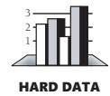

*Prototyping* Prototyping is the development of realistic models of a system's key functions. A developer can prototype parts of a user interface to determine usability, critical calculations to determine execution time, or typical data sets to determine memory requirements. A survey of 16 published and 8 unpublished case studies compared prototyping to traditional, specification-development methods. The comparison revealed that prototyping can lead to better designs, better matches with user needs, and improved maintainability (Gordon and Bieman 1991).

#### Setting Objectives

Explicitly setting quality objectives is a simple, obvious step in achieving quality software, but it's easy to overlook. You might wonder whether, if you set explicit quality objectives, programmers will actually work to achieve them? The answer is, yes, they will, if they know what the objectives are and that the objectives are reasonable. Programmers can't respond to a set of objectives that change daily or that are impossible to meet.

Gerald Weinberg and Edward Schulman conducted a fascinating experiment to investigate the effect on programmer performance of setting quality objectives (1974). They had five teams of programmers work on five versions of the same program. The same five quality objectives were given to each of the five teams, and each team was told to optimize a different objective. One team was told to minimize the memory required, another was told to produce the clearest possible output, another was told to build

the most readable code, another was told to use the minimum number of statements, and the last group was told to complete the program in the least amount of time possible. Table 20-1 shows how each team was ranked according to each objective.

| Table 20-1 | Team Ranking on Each Objective |
|------------|--------------------------------|
|------------|--------------------------------|

| Objective Team Was Told to Optimize | Minimum memory use | Most readable output | Most readable code | Least code | Minimum programming time |
|----------------------------------------|--------------------------|----------------------------|--------------------------|---------------|--------------------------------|
| Minimum memory                         | 1                        | 4                          | 4                        | 2             | 5                              |
| Output readability                     | 5                        | 1                          | 1                        | 5             | 3                              |
| Program readability                    | 3                        | 2                          | 2                        | 3             | 4                              |
| Least code                             | 2                        | 5                          | 3                        | 1             | 3                              |
| Minimum programming time            | 4                        | 3                          | 5                        | 4             | 1                              |

Source: Adapted from "Goals and Performance in Computer Programming" (Weinberg and Schulman 1974).

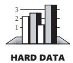

The results of this study were remarkable. Four of the five teams finished first in the objective they were told to optimize. The other team finished second in its objective. None of the teams did consistently well in all objectives.

The surprising implication is that people actually do what you ask them to do. Programmers have high achievement motivation: They will work to the objectives specified, but they must be told what the objectives are. The second implication is that, as expected, objectives conflict and it's generally not possible to do well on all of them.

### 20.3 Relative Effectiveness of Quality Techniques

The various quality-assurance practices don't all have the same effectiveness. Many techniques have been studied, and their effectiveness at detecting and removing defects is known. This and several other aspects of the "effectiveness" of the qualityassurance practices are discussed in this section.

#### Percentage of Defects Detected

If builders built buildings the way programmers wrote programs, then the first woodpecker that came along would destroy civilization. —*Gerald Weinberg*

Some practices are better at detecting defects than others, and different methods find different kinds of defects. One way to evaluate defect-detection methods is to determine the percentage of defects they detect out of the total defects that exist at that

point in the project. Table 20-2 shows the percentages of defects detected by several common defect-detection techniques.

**Table 20-2 Defect-Detection Rates**

| Removal Step                         | Lowest Rate | Modal Rate | Highest Rate |
|--------------------------------------|-------------|------------|--------------|
| Informal design reviews              | 25%         | 35%        | 40%          |
| Formal design inspections            | 45%         | 55%        | 65%          |
| Informal code reviews                | 20%         | 25%        | 35%          |
| Formal code inspections              | 45%         | 60%        | 70%          |
| Modeling or prototyping              | 35%         | 65%        | 80%          |
| Personal desk-checking of code       | 20%         | 40%        | 60%          |
| Unit test                            | 15%         | 30%        | 50%          |
| New function (component) test        | 20%         | 30%        | 35%          |
| Integration test                     | 25%         | 35%        | 40%          |
| Regression test                      | 15%         | 25%        | 30%          |
| System test                          | 25%         | 40%        | 55%          |
| Low-volume beta test (<10 sites)     | 25%         | 35%        | 40%          |
| High-volume beta test (>1,000 sites) | 60%         | 75%        | 85%          |

Source: Adapted from *Programming Productivity* (Jones 1986a), "Software Defect-Removal Efficiency" (Jones 1996), and "What We Have Learned About Fighting Defects" (Shull et al. 2002).

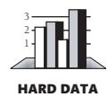

The most interesting facts that this data reveals is that the modal rates don't rise above 75 percent for any single technique and that the techniques average about 40 percent. Moreover, for the most common kinds of defect detection—unit testing and integration testing—the modal rates are only 30–35 percent. The typical organization uses a test-heavy defect-removal approach and achieves only about 85 percent defectremoval efficiency. Leading organizations use a wider variety of techniques and achieve defect-removal efficiencies of 95 percent or higher (Jones 2000).

The strong implication is that if project developers are striving for a higher defectdetection rate, they need to use a combination of techniques. A classic study by Glenford Myers confirmed this implication (1978b). Myers studied a group of programmers with a minimum of 7 and an average of 11 years of professional experience. Using a program with 15 known errors, he had each programmer look for errors by using one of these techniques:

- Execution testing against the specification
- Execution testing against the specification with the source code
- Walk-through/inspection using the specification and the source code

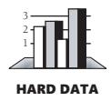

Myers found a huge variation in the number of defects detected in the program, ranging from 1.0 to 9.0 defects found. The average number found was 5.1, or about a third of those known.

When used individually, no method had a statistically significant advantage over any of the others. The variety of errors people found was so great, however, that any combination of two methods—including having two independent groups using the same method—increased the total number of defects found by a factor of almost 2. Studies at NASA's Software Engineering Laboratory, Boeing, and other companies have reported that different people tend to find different defects. Only about 20 percent of the errors found by inspections were found by more than one inspector (Kouchakdjian, Green, and Basili 1989; Tripp, Struck, and Pflug 1991; Schneider, Martin, and Tsai 1992).

Glenford Myers points out that human processes (inspections and walk-throughs, for instance) tend to be better than computer-based testing at finding certain kinds of errors and that the opposite is true for other kinds of errors (1979). This result was confirmed in a later study, which found that code reading detected more interface defects and functional testing detected more control defects (Basili, Selby, and Hutchens 1986). Test guru Boris Beizer reports that informal test approaches typically achieve only 50–60 percent test coverage unless you're using a coverage analyzer (Johnson 1994).

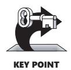

The upshot is that defect-detection methods work better in combination than they do singly. Jones made the same point when he observed that cumulative defect-detection efficiency is significantly higher than that of any individual technique. The outlook for the effectiveness of testing used by itself is bleak. Jones points out that a combination of unit testing, functional testing, and system testing often results in a cumulative defect detection of less than 60 percent, which is usually inadequate for production software.

This data can also be used to understand why programmers who begin working with a disciplined defect-removal technique such as Extreme Programming experience higher defect-removal levels than they have experienced previously. As Table 20-3 illustrates, the set of defect-removal practices used in Extreme Programming would be expected to achieve about 90 percent defect-removal efficiency in the average case and 97 percent in the best case, which is far better than the industry average of 85 percent defect removal. Although some people have linked this effectiveness to synergy among Extreme Programming's practices, it is really just a predictable outcome of using these specific defectremoval practices. Other combinations of practices can work equally well or better, and the determination of which specific defect-removal practices to use to achieve a desired quality level is one part of effective project planning.

| Removal Step                                     | Lowest Rate | Modal Rate | Highest Rate |
|--------------------------------------------------|-------------|------------|--------------|
| Informal design reviews (pair programming)    | 25%         | 35%        | 40%          |
| Informal code reviews (pair programming)      | 20%         | 25%        | 35%          |
| Personal desk-checking of code                   | 20%         | 40%        | 60%          |
| Unit test                                        | 15%         | 30%        | 50%          |
| Integration test                                 | 25%         | 35%        | 40%          |
| Regression test                                  | 15%         | 25%        | 30%          |
| Expected cumulative defect-removal efficiency | ~74%        | ~90%       | ~97%         |

**Table 20-3 Extreme Programming's Estimated Defect-Detection Rate** 

#### Cost of Finding Defects

Some defect-detection practices cost more than others. The most economical practices result in the least cost per defect found, all other things being equal. The qualification that all other things must be equal is important because per-defect cost is influenced by the total number of defects found, the stage at which each defect is found, and other factors besides the economics of a specific defect-detection technique.

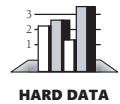

Most studies have found that inspections are cheaper than testing. A study at the Software Engineering Laboratory found that code reading detected about 80 percent more faults per hour than testing (Basili and Selby 1987). Another organization found that it cost six times as much to detect design defects by using testing as by using inspections (Ackerman, Buchwald, and Lewski 1989). A later study at IBM found that only 3.5 staff hours were needed to find each error when using code inspections, whereas 15–25 hours were needed to find each error through testing (Kaplan 1995).

#### Cost of Fixing Defects

The cost of finding defects is only one part of the cost equation. The other is the cost of fixing defects. It might seem at first glance that how the defect is found wouldn't matter—it would always cost the same amount to fix.

**Cross-Reference** For details on the fact that defects become more expensive the longer they stay in a system, see "Appeal to Data" in Section 3.1. For an up-close look at errors themselves, see Section 22.4, "Typical Errors."

That isn't true because the longer a defect remains in the system, the more expensive it becomes to remove. A detection technique that finds the error earlier therefore results in a lower cost of fixing it. Even more important, some techniques, such as inspections, detect the symptoms and causes of defects in one step; others, such as testing, find symptoms but require additional work to diagnose and fix the root cause. The result is that one-step techniques are substantially cheaper overall than two-step ones.

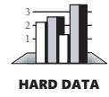

Microsoft's applications division has found that it takes three hours to find and fix a defect by using code inspection, a one-step technique, and 12 hours to find and fix a defect by using testing, a two-step technique (Moore 1992). Collofello and Woodfield reported on a 700,000-line program built by over 400 developers (1989). They found that code reviews were several times as cost-effective as testing—a 1.38 return on investment vs. 0.17.

The bottom line is that an effective software-quality program must include a combination of techniques that apply to all stages of development. Here's a recommended combination for achieving higher-than-average quality:

- Formal inspections of all requirements, all architecture, and designs for critical parts of a system
- Modeling or prototyping
- Code reading or inspections
- Execution testing

#### 20.4 When to Do Quality Assurance

**Cross-Reference** Quality assurance of upstream activities—requirements and architecture, for instance is outside the scope of this book. The "Additional Resources" section at the end of the chapter describes books you can turn to for more information about them.

As Chapter 3 ("Measure Twice, Cut Once: Upstream Prerequisites") noted, the earlier an error is inserted into software, the more entangled it becomes in other parts of the software and the more expensive it becomes to remove. A fault in requirements can produce one or more corresponding faults in design, which can produce many corresponding faults in code. A requirements error can result in extra architecture or in bad architectural decisions. The extra architecture results in extra code, test cases, and documentation. Or a requirements error can result in architecture, code, and test cases that are thrown away. Just as it's a good idea to work out the defects in the blueprints for a house before pouring the foundation in concrete, it's a good idea to catch requirements and architecture errors before they affect later activities.

In addition, errors in requirements or architecture tend to be more sweeping than construction errors. A single architectural error can affect several classes and dozens of routines, whereas a single construction error is unlikely to affect more than one routine or class. For this reason, too, it's cost-effective to catch errors as early as you can.

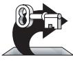

KEY POINT

Defects creep into software at all stages. Consequently, you should emphasize qualityassurance work in the early stages and throughout the rest of the project. It should be planned into the project as work begins; it should be part of the technical fiber of the project as work continues; and it should punctuate the end of the project, verifying the quality of the product as work ends.

#### 20.5 The General Principle of Software Quality

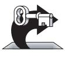

KEY POINT

There's no such thing as a free lunch, and even if there were, there's no guarantee that it would be any good. Software development is a far cry from *haute cuisine*, however, and software quality is unusual in a significant way. The General Principle of Software Quality is that improving quality reduces development costs.

Understanding this principle depends on understanding a key observation: the best way to improve productivity and quality is to reduce the time spent reworking code, whether the rework arises from changes in requirements, changes in design, or debugging. The industry-average productivity for a software product is about 10 to 50 of lines of delivered code per person per day (including all noncoding overhead). It takes only a matter of minutes to type in 10 to 50 lines of code, so how is the rest of the day spent?

**Cross-Reference** For details on the difference between writing an individual program and writing a software product, see "Programs, Products, Systems, and System Products" in Section 27.5.

Part of the reason for these seemingly low productivity figures is that industry average numbers like these factor nonprogrammer time into the lines-of-code-per-day figure. Tester time, project manager time, and administrative support time are all included. Noncoding activities, such as requirements development and architecture work, are also typically factored into those lines-of-code-per-day figures. But none of that is what takes up so much time.

The single biggest activity on most projects is debugging and correcting code that doesn't work properly. Debugging and associated refactoring and other rework consume about 50 percent of the time on a traditional, naive software-development cycle. (See Section 3.1, "Importance of Prerequisites," for more details.) Reducing debugging by preventing errors improves productivity. Therefore, the most obvious method of shortening a development schedule is to improve the quality of the product and decrease the amount of time spent debugging and reworking the software.

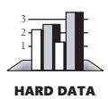

This analysis is confirmed by field data. In a review of 50 development projects involving over 400 work-years of effort and almost 3 million lines of code, a study at NASA's Software Engineering Laboratory found that increased quality assurance was associated with decreased error rate but did not increase overall development cost (Card 1987).

A study at IBM produced similar findings:

*Software projects with the lowest levels of defects had the shortest development schedules and the highest development productivity.... software defect removal is actually the most expensive and time-consuming form of work for software (Jones 2000).*

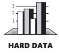

The same effect holds true at the small end of the scale. In a 1985 study, 166 professional programmers wrote programs from the same specification. The resulting programs averaged 220 lines of code and a little under five hours to write. The fascinating result was that programmers who took the median time to complete their programs produced programs with the greatest number of errors. The programmers who took more or less than the median time produced programs with significantly fewer errors (DeMarco and Lister 1985). Figure 20-2 graphs the results.

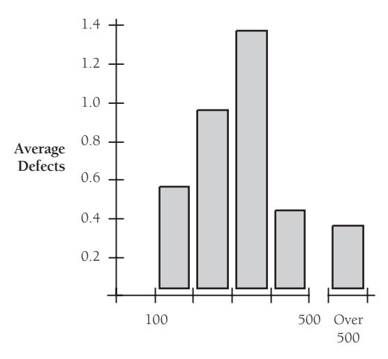

**Time to Complete the Program in Minutes**

**Figure 20-2** Neither the fastest nor the slowest development approach produces the software with the most defects.

The two slowest groups took about five times as long to achieve roughly the same defect rate as the fastest group. It's not necessarily the case that writing software without defects takes more time than writing software with defects. As the graph shows, it can take less.

Admittedly, on certain kinds of projects, quality assurance costs money. If you're writing code for the space shuttle or for a medical life-support system, the degree of reliability required makes the project more expensive.

Compared to the traditional code-test-debug cycle, an enlightened software-quality program saves money. It redistributes resources away from debugging and refactoring into upstream quality-assurance activities. Upstream activities have more leverage on product quality than downstream activities, so the time you invest upstream saves more time downstream. The net effect is fewer defects, shorter development time, and lower costs. You'll see several more examples of the General Principle of Software Quality in the next three chapters.

#### cc2e.com/2043 CHECKLIST: A Quality-Assurance Plan

- ❑ Have you identified specific quality characteristics that are important to your project?
- ❑ Have you made others aware of the project's quality objectives?
- ❑ Have you differentiated between external and internal quality characteristics?
- ❑ Have you thought about the ways in which some characteristics might compete with or complement others?
- ❑ Does your project call for the use of several different error-detection techniques suited to finding several different kinds of errors?
- ❑ Does your project include a plan to take steps to assure software quality during each stage of software development?
- ❑ Is the quality measured in some way so that you can tell whether it's improving or degrading?
- ❑ Does management understand that quality assurance incurs additional costs up front in order to save costs later?

#### Additional Resources

**cc2e.com/2050** It's not hard to list books in this section because virtually any book on effective software methodologies describes techniques that result in improved quality and productivity. The difficulty is finding books that deal with software quality per se. Here are two:

> Ginac, Frank P. *Customer Oriented Software Quality Assurance*. Englewood Cliffs, NJ: Prentice Hall, 1998. This is a very short book that describes quality attributes, quality metrics, QA programs, and the role of testing in quality, as well as well-known quality improvement programs, including the Software Engineering Institute's CMM and ISO 9000.

> Lewis, William E. *Software Testing and Continuous Quality Improvement*, 2d ed. Auerbach Publishing, 2000. This book provides a comprehensive discussion of a quality life cycle, as well as extensive discussion of testing techniques. It also provides numerous forms and checklists.

#### Relevant Standards

**cc2e.com/2057** *IEEE Std 730-2002, IEEE Standard for Software Quality Assurance Plans*.

*IEEE Std 1061-1998, IEEE Standard for a Software Quality Metrics Methodology*.

*IEEE Std 1028-1997, Standard for Software Reviews*.

*IEEE Std 1008-1987 (R1993), Standard for Software Unit Testing*.

*IEEE Std 829-1998, Standard for Software Test Documentation.*

### Key Points

- Quality is free, in the end, but it requires a reallocation of resources so that defects are prevented cheaply instead of fixed expensively.
- Not all quality-assurance goals are simultaneously achievable. Explicitly decide which goals you want to achieve, and communicate the goals to other people on your team.
- No single defect-detection technique is completely effective by itself. Testing by itself is not optimally effective at removing errors. Successful quality-assurance programs use several different techniques to detect different kinds of errors.
- You can apply effective techniques during construction and many equally powerful techniques before construction. The earlier you find a defect, the less intertwined it will become with the rest of your code and the less damage it will cause.
- Quality assurance in the software arena is process-oriented. Software development doesn't have a repetitive phase that affects the final product like manufacturing does, so the quality of the result is controlled by the process used to develop the software.
