# Chapter 21: Collaborative Construction

### cc2e.com/2185 Contents

- 21.1 Overview of Collaborative Development Practices: page 480
- 21.2 Pair Programming: page 483
- 21.3 Formal Inspections: page 485
- 21.4 Other Kinds of Collaborative Development Practices: page 492

#### Related Topics

- The software-quality landscape: Chapter 20
- Developer testing: Chapter 22
- Debugging: Chapter 23
- Prerequisites to construction: Chapters 3 and 4

You might have had an experience common to many programmers. You walk into another programmer's cubicle and say, "Would you mind looking at this code? I'm having some trouble with it." You start to explain the problem: "It can't be a result of this thing, because I did that. And it can't be the result of this other thing, because I did this. And it can't be the result of—wait a minute. It *could* be the result of that. Thanks!" You've solved your problem before your "helper" has had a chance to say a word.

In one way or another, all collaborative construction techniques are attempts to formalize the process of showing your work to someone else for the purpose of flushing out errors.

If you've read about inspections and pair programming before, you won't find much new information in this chapter. The extent of the hard data about the effectiveness of inspections in Section 21.3 might surprise you, and you might not have considered the code-reading alternative described in Section 21.4. You might also take a look at Table 21-1, "Comparison of Collaborative Construction Techniques," at the end of the chapter. If your knowledge is all from your own experience, read on! Other people have had different experiences, and you'll find some new ideas.

#### 21.1 Overview of Collaborative Development Practices

"Collaborative construction" refers to pair programming, formal inspections, informal technical reviews, and document reading, as well as other techniques in which developers share responsibility for creating code and other work products. At my company, the term "collaborative construction" was coined by Matt Peloquin in about 2000. The term appears to have been coined independently by others in the same time frame.

All collaborative construction techniques, despite their differences, are based on the ideas that developers are blind to some of the trouble spots in their work, that other people don't have the same blind spots, and that it's beneficial for developers to have someone else look at their work. Studies at the Software Engineering Institute have found that developers insert an average of 1 to 3 defects per hour into their designs and 5 to 8 defects per hour into code (Humphrey 1997), so attacking these blind spots is a key to effective construction.

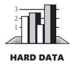

#### Collaborative Construction Complements Other Quality-Assurance Techniques

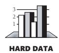

The primary purpose of collaborative construction is to improve software quality. As noted in Chapter 20, "The Software-Quality Landscape," software testing has limited effectiveness when used alone—the average defect-detection rate is only about 30 percent for unit testing, 35 percent for integration testing, and 35 percent for low-volume beta testing. In contrast, the average effectivenesses of design and code inspections are 55 and 60 percent (Jones 1996). The secondary benefit of collaborative construction is that it decreases development time, which in turn lowers development costs.

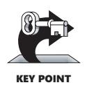

Early reports on pair programming suggest that it can achieve a code-quality level similar to formal inspections (Shull et al 2002). The cost of full-up pair programming is probably higher than the cost of solo development—on the order of 10–25 percent higher—but the reduction in development time appears to be on the order of 45 percent, which in some cases may be a decisive advantage over solo development (Boehm and Turner 2004), although not over inspections which have produced similar results.

Technical reviews have been studied much longer than pair programming, and their results, as described in case studies and elsewhere, have been impressive:

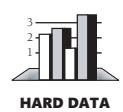

- IBM found that each hour of inspection prevented about 100 hours of related work (testing and defect correction) (Holland 1999).
- Raytheon reduced its cost of defect correction (rework) from about 40 percent of total project cost to about 20 percent through an initiative that focused on inspections (Haley 1996).

- Hewlett-Packard reported that its inspection program saved an estimated \$21.5 million per year (Grady and Van Slack 1994).
- Imperial Chemical Industries found that the cost of maintaining a portfolio of about 400 programs was only about 10 percent as high as the cost of maintaining a similar set of programs that had not been inspected (Gilb and Graham 1993).
- A study of large programs found that each hour spent on inspections avoided an average of 33 hours of maintenance work and that inspections were up to 20 times more efficient than testing (Russell 1991).
- In a software-maintenance organization, 55 percent of one-line maintenance changes were in error before code reviews were introduced. After reviews were introduced, only 2 percent of the changes were in error (Freedman and Weinberg 1990). When all changes were considered, 95 percent were correct the first time after reviews were introduced. Before reviews were introduced, under 20 percent were correct the first time.
- A group of 11 programs were developed by the same group of people, and all were released to production. The first five were developed without reviews and averaged 4.5 errors per 100 lines of code. The other six were inspected and averaged only 0.82 errors per 100 lines of code. Reviews cut the errors by over 80 percent (Freedman and Weinberg 1990).
- Capers Jones reports that of all the software projects he has studied that have achieved 99 percent defect-removal rates or better, all have used formal inspections. Also, none of the projects that achieved less than 75 percent defectremoval efficiency used formal inspections (Jones 2000).

A number of these cases illustrate the General Principle of Software Quality, which holds that reducing the number of defects in the software also improves development time.

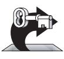

KEY POINT

Various studies have shown that in addition to being more effective at catching errors than testing, collaborative practices find different kinds of errors than testing does (Myers 1978; Basili, Selby, and Hutchens 1986). As Karl Wiegers points out, "A human reviewer can spot unclear error messages, inadequate comments, hard-coded variable values, and repeated code patterns that should be consolidated. Testing won't" (Wiegers 2002). A secondary effect is that when people know their work will be reviewed, they scrutinize it more carefully. Thus, even when testing is done effectively, reviews or other kinds of collaboration are needed as part of a comprehensive quality program.

#### Collaborative Construction Provides Mentoring in Corporate Culture and Programming Expertise

Informal review procedures were passed on from person to person in the general culture of computing for many years before they were acknowledged in print. The need for reviewing was so obvious to the best programmers that they rarely mentioned it in print, while the worst programmers believed they were so good that their work did not need reviewing.

—*Daniel Freedman and Gerald Weinberg*

Software standards can be written down and distributed, but if no one talks about them or encourages others to use them, they won't be followed. Reviews are an important mechanism for giving programmers feedback about their code. The code, the standards, and the reasons for making the code meet the standards are good topics for review discussions.

In addition to feedback about how well they follow standards, programmers need feedback about more subjective aspects of programming: formatting, comments, variable names, local and global variable use, design approaches, the-way-we-do-thingsaround-here, and so on. Programmers who are still wet behind the ears need guidance from those who are more knowledgeable, and more knowledgeable programmers who tend to be busy need to be encouraged to spend time sharing what they know. Reviews create a venue for more experienced and less experienced programmers to communicate about technical issues. As such, reviews are an opportunity for cultivating quality improvements in the future as much as in the present.

One team that used formal inspections reported that inspections quickly brought all the developers up to the level of the best developers (Tackett and Van Doren 1999).

#### Collective Ownership Applies to All Forms of Collaborative Construction

**Cross-Reference** A concept that spans all collaborative construction techniques is the idea of collective ownership. In some development models, programmers own the code they write and official or unofficial restrictions on modifying someone else's code exist. Collective ownership increases the need for work coordination, especially configuration management. For details, see Section 28.2, "Configuration Management."

With collective ownership, all code is owned by the group rather than by individuals and can be accessed and modified by various members of the group. This produces several valuable benefits:

- Better code quality arises from multiple sets of eyes seeing the code and multiple programmers working on the code.
- The impact of someone leaving the project is lessened because multiple people are familiar with each section of code.
- Defect-correction cycles are shorter overall because any of several programmers can potentially be assigned to fix bugs on an as-available basis.

Some methodologies, such as Extreme Programming, recommend formally pairing programmers and rotating their work assignments over time. At my company, we've found that programmers don't need to pair up formally to achieve good code coverage. Over time we achieve cross-coverage through a combination of formal and informal technical reviews, pair programming when needed, and rotation of defectcorrection assignments.

#### Collaboration Applies As Much Before Construction As After

This book is about construction, so collaboration on detailed design and code are the focus of this chapter. However, most of the comments about collaborative construction in this chapter also apply to estimates, plans, requirements, architecture, testing, and maintenance work. By studying the references at the end of the chapter, you can apply collaborative techniques to most software development activities.

#### 21.2 Pair Programming

When pair programming, one programmer types in code at the keyboard and the other programmer watches for mistakes and thinks strategically about whether the code is being written correctly and whether the right code is being written. Pair programming was originally popularized by Extreme Programming (Beck 2000), but it is now being used more widely (Williams and Kessler 2002).

#### Keys to Success with Pair Programming

The basic concept of pair programming is simple, but its use nonetheless benefits from a few guidelines:

*Support pair programming with coding standards* Pair programming will not be effective if the two people in the pair spend their time arguing about coding style. Try to standardize what Chapter 5, "Design in Construction," refers to as the "accidental attributes" of programming so that the programmers can focus on the "essential" task at hand.

*Don't let pair programming turn into watching* The person without the keyboard should be an active participant in the programming. That person is analyzing the code, thinking ahead to what will be coded next, evaluating the design, and planning how to test the code.

*Don't force pair programming of the easy stuff* One group that used pair programming for the most complicated code found it more expedient to do detailed design at the whiteboard for 15 minutes and then to program solo (Manzo 2002). Most organizations that have tried pair programming eventually settle into using pairs for part of their work but not all of it (Boehm and Turner 2004).

*Rotate pairs and work assignments regularly* In pair programming, as with other collaborative development practices, benefit arises from different programmers learning different parts of the system. Rotate pair assignments regularly to encourage crosspollination—some experts recommend changing pairs as often as daily (Reifer 2002).

*Encourage pairs to match each other's pace* One partner going too fast limits the benefit of having the other partner. The faster partner needs to slow down, or the pair should be broken up and reconfigured with different partners.

*Make sure both partners can see the monitor* Even seemingly mundane issues like being able to see the monitor and using fonts that are too small can cause problems.

*Don't force people who don't like each other to pair* Sometimes personality conflicts prevent people from pairing effectively. It's pointless to force people who don't get along to pair, so be sensitive to personality matches (Beck 2000, Reifer 2002).

*Avoid pairing all newbies* Pair programming works best when at least one of the partners has paired before (Larman 2004).

*Assign a team leader* If your whole team wants to do 100 percent of its programming in pairs, you'll still need to assign one person to coordinate work assignments, be held accountable for results, and act as the point of contact for people outside the project.

#### Benefits of Pair Programming

Pair programming produces numerous benefits:

- It holds up better under stress than solo development. Pairs encourage each other to keep code quality high even when there's pressure to write quick and dirty code.
- It improves code quality. The readability and understandability of the code tends to rise to the level of the best programmer on the team.
- It shortens schedules. Pairs tend to write code faster and with fewer errors. The project team spends less time at the end of the project correcting defects.
- It produces all the other general benefits of collaborative construction, including disseminating corporate culture, mentoring junior programmers, and fostering collective ownership.

#### cc2e.com/2192 CHECKLIST: Effective Pair Programming

- ❑ Do you have a coding standard so that pair programmers stay focused on programming rather than on philosophical coding-style discussions?
- ❑ Are both partners participating actively?
- ❑ Are you avoiding pair programming everything and, instead, selecting the assignments that will really benefit from pair programming?
- ❑ Are you rotating pair assignments and work assignments regularly?
- ❑ Are the pairs well matched in terms of pace and personality?
- ❑ Is there a team leader to act as the focal point for management and other people outside the project?

#### 21.3 Formal Inspections

**Further Reading** If you want to read the original article on inspections, see "Design and Code Inspections to Reduce Errors in Program Development" (Fagan 1976).

An inspection is a specific kind of review that has been shown to be extremely effective in detecting defects and to be relatively economical compared to testing. Inspections were developed by Michael Fagan and used at IBM for several years before Fagan published the paper that made them public. Although any review involves reading designs or code, an inspection differs from a run-of-the-mill review in several key ways:

- Checklists focus the reviewers' attention on areas that have been problems in the past.
- The inspection focuses on defect detection, not correction.
- Reviewers prepare for the inspection meeting beforehand and arrive with a list of the problems they've discovered.
- Distinct roles are assigned to all participants.
- The moderator of the inspection isn't the author of the work product under inspection.
- The moderator has received specific training in moderating inspections.
- The inspection meeting is held only if all participants have adequately prepared.
- Data is collected at each inspection and is fed into future inspections to improve them.
- General management doesn't attend the inspection meeting unless you're inspecting a project plan or other management materials. Technical leaders might attend.

#### What Results Can You Expect from Inspections?

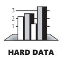

Individual inspections typically catch about 60 percent of defects, which is higher than other techniques except prototyping and high-volume beta testing. These results have been confirmed numerous times at various organizations, including Harris BCSD, National Software Quality Experiment, Software Engineering Institute, Hewlett Packard, and so on (Shull et al 2002).

The combination of design and code inspections usually removes 70–85 percent or more of the defects in a product (Jones 1996). Inspections identify error-prone classes early, and Capers Jones reports that they result in 20–30 percent fewer defects per 1000 lines of code than less formal review practices. Designers and coders learn to improve their work through participating in inspections, and inspections increase productivity by about 20 percent (Fagan 1976, Humphrey 1989, Gilb and Graham 1993, Wiegers 2002). On a project that uses inspections for design and code, the inspections will take up about 10–15 percent of project budget and will typically reduce overall project cost.

Inspections can also be used for assessing progress, but it's the technical progress that is assessed. That usually means answering two questions: Is the technical work being done? And is the technical work being done *well*? The answers to both questions are byproducts of formal inspections.

#### Roles During an Inspection

One key characteristic of an inspection is that each person involved has a distinct role to play. Here are the roles:

*Moderator* The moderator is responsible for keeping the inspection moving at a rate that's fast enough to be productive but slow enough to find the most errors possible. The moderator must be technically competent—not necessarily an expert in the particular design or code under inspection, but capable of understanding relevant details. This person manages other aspects of the inspection, such as distributing the design or code to be reviewed, distributing the inspection checklist, setting up a meeting room, reporting inspection results, and following up on the action items assigned at the inspection meeting.

*Author* The person who wrote the design or code plays a relatively minor role in the inspection. Part of the goal of an inspection is to be sure that the design or code speaks for itself. If the design or code under inspection turns out to be unclear, the author will be assigned the job of making it clearer. Otherwise, the author's duties are to explain parts of the design or code that are unclear and, occasionally, to explain why things that seem like errors are actually acceptable. If the project is unfamiliar to the reviewers, the author might also present an overview of the project in preparation for the inspection meeting.

*Reviewer* A reviewer is anyone who has a direct interest in the design or code but who is not the author. A reviewer of a design might be the programmer who will implement the design. A tester or higher-level architect might also be involved. The role of the reviewers is to find defects. They usually find defects during preparation, and, as the design or code is discussed at the inspection meeting, the group should find considerably more defects.

*Scribe* The scribe records errors that are detected and the assignments of action items during the inspection meeting. Neither the author nor the moderator should be the scribe.

*Management* Including management in inspections is not usually a good idea. The point of a software inspection is that it is a purely technical review. Management's presence changes the interactions: people feel that they, instead of the review materials, are under evaluation, which changes the focus from technical to political. However, management has a right to know the results of an inspection, and an inspection report is prepared to keep management informed.

Similarly, under no circumstances should inspection results be used for performance appraisals. Don't kill the goose that lays the golden eggs. Code examined in an inspection is still under development. Evaluation of performance should be based on final products, not on work that isn't finished.

Overall, an inspection should have no fewer than three participants. It's not possible to have a separate moderator, author, and reviewer with fewer than three people, and those roles shouldn't be combined. Traditional advice is to limit an inspection to about six people because, with any more, the group becomes too large to manage. Researchers have generally found that having more than two to three reviewers doesn't appear to increase the number of defects found (Bush and Kelly 1989, Porter and Votta 1997). However, these general findings are not unanimous, and results appear to vary depending on the kind of material being inspected (Wiegers 2002). Pay attention to your experience, and adjust your approach accordingly.

#### General Procedure for an Inspection

An inspection consists of several distinct stages:

*Planning* The author gives the design or code to the moderator. The moderator decides who will review the material and when and where the inspection meeting will occur; the moderator then distributes the design or code and a checklist that focuses the attention of the inspectors. Materials should be printed with line numbers to speed up error identification during the meeting.

*Overview* When the reviewers aren't familiar with the project they are reviewing, the author can spend up to an hour or so describing the technical environment within which the design or code has been created. Having an overview tends to be a dangerous practice because it can lead to a glossing over of unclear points in the design or code under inspection. The design or code should speak for itself; the overview shouldn't speak for it.

**Cross-Reference** For a list of checklists you can use to improve code quality, see page xxix.

*Preparation* Each reviewer works alone to scrutinize the design or code for errors. The reviewers use the checklist to stimulate and direct their examination of the review materials.

For a review of application code written in a high-level language, reviewers can prepare at about 500 lines of code per hour. For a review of system code written in a highlevel language, reviewers can prepare at only about 125 lines of code per hour (Humphrey 1989). The most effective rate of review varies a great deal, so keep records of preparation rates in your organization to determine the rate that's most effective in your environment.

Some organizations have found that inspections are more effective when each reviewer is assigned a specific perspective. A reviewer might be asked to prepare for the inspection from the point of view of the maintenance programmer, the customer, or the designer, for example. Research on perspective-based reviews has not been comprehensive, but it suggests that perspective-based reviews might uncover more errors than general reviews.

An additional variation in inspection preparation is to assign each reviewer one or more scenarios to check. Scenarios can involve specific questions that a reviewer is assigned to answer, such as "Are there any requirements that are not satisfied by this design?" A scenario might also involve a specific task that a reviewer is assigned to perform, such as listing the specific requirements that a particular design element satisfies. You can also assign some reviewers to read the material front to back, back to front, or inside out.

*Inspection Meeting* The moderator chooses someone other than the author to paraphrase the design or read the code (Wiegers 2003). All logic is explained, including each branch of each logical structure. During this presentation, the scribe records errors as they are detected, but discussion of an error stops as soon as it's recognized as an error. The scribe notes the type and the severity of the error, and the inspection moves on. If you have problems keeping the discussions focused, the moderator might ring a bell to get the group's attention and put the discussion back on track.

The rate at which the design or the code is considered should be neither too slow nor too fast. If it's too slow, attention can lag and the meeting won't be productive. If it's too fast, the group can overlook errors it would otherwise catch. Optimal inspection rates vary from environment to environment, just as preparation rates do. Keep records so that over time you can determine the optimal rate for your environment. Other organizations have found that for system code, an inspection rate of 90 lines of code per hour is optimal. For applications code, the inspection rate can be as rapid as 500 lines of code per hour (Humphrey 1989). An average of about 150–200 nonblank, noncomment source statements per hour is a good place to start (Wiegers 2002).

Don't discuss solutions during the meeting. The group should stay focused on identifying defects. Some inspection groups don't even allow discussion about whether a defect is really a defect. They assume that if someone is confused enough to think it's a defect, the design, code, or documentation needs to be clarified.

The meeting generally should not last more than two hours. This doesn't mean that you have to fake a fire alarm to get everyone out at the two-hour mark, but experience at IBM and other companies has been that reviewers can't concentrate for much more than about two hours at a time. For the same reason, it's unwise to schedule more than one inspection on the same day.

*Inspection Report* Within a day of the inspection meeting, the moderator produces an inspection report (e-mail or equivalent) that lists each defect, including its type and severity. The inspection report helps to ensure that all defects will be corrected, and

it's used to develop a checklist that emphasizes problems specific to the organization. If you collect data on the time spent and the number of errors found over time, you can respond to challenges about inspection's efficacy with hard data. Otherwise, you'll be limited to saying that inspections seem better. That won't be as convincing to someone who thinks testing seems better. You'll also be able to tell if inspections aren't working in your environment and modify or abandon them, as appropriate. Data collection is also important because any new methodology needs to justify its existence.

*Rework* The moderator assigns defects to someone, usually the author, for repair. The assignee resolves each defect on the list.

*Follow-Up* The moderator is responsible for seeing that all rework assigned during the inspection is carried out. Depending on the number of errors found and the severity of those errors, you might follow up by having the reviewers reinspect the entire work product, having the reviewers reinspect only the fixes, or allowing the author to complete the fixes without any follow-up.

*Third-Hour Meeting* Even though during the inspection participants aren't allowed to discuss solutions to the problems raised, some might still want to. You can hold an informal, third-hour meeting to allow interested parties to discuss solutions after the official inspection is over.

#### Fine-Tuning the Inspection

Once you become skilled at performing inspections "by the book," you can usually find several ways to improve them. Don't introduce changes willy-nilly, though. "Instrument" the inspection process so that you know whether your changes are beneficial.

Companies have often found that removing or combining any of the stages costs more than is saved (Fagan 1986). If you're tempted to change the inspection process without measuring the effect of the change, don't. If you have measured the process and you know that your changed process works better than the one described here, go right ahead.

As you do inspections, you'll notice that certain kinds of errors occur more frequently than other kinds. Create a checklist that calls attention to those kinds of errors so that reviewers will focus on them. Over time, you'll find kinds of errors that aren't on the checklist; add those to it. You might find that some errors on the initial checklist cease to occur; remove those. After a few inspections, your organization will have a checklist for inspections customized to its needs, and it might also have some clues about trouble areas in which its programmers need more training or support. Limit your checklist to one page or less. Longer ones are hard to use at the level of detail needed in an inspection.

#### Egos in Inspections

**Further Reading** For a discussion of egoless programming, see *The Psychology of Computer Programming*, 2d ed. (Weinberg 1998).

The point of the inspection itself is to discover defects in the design or code. It is not to explore alternatives or to debate about who is right and who is wrong. The point is most certainly *not* to criticize the author of the design or code. The experience should be a positive one for the author in which it's obvious that group participation improves the program and is a learning experience for all involved. It should not convince the author that some people in the group are jerks or that it's time to look for a new job. Comments like "Anyone who knows Java knows that it's more efficient to loop from *0* to *num-1*, not *1* to *num*" are totally inappropriate, and if they occur, the moderator should make their inappropriateness unmistakably clear.

Because the design or code is being criticized and the author probably feels somewhat attached to it, the author will naturally feel some of the heat directed at the code. The author should anticipate hearing criticisms of several defects that aren't really defects and several more that seem debatable. In spite of that, the author should acknowledge each alleged defect and move on. Acknowledging a criticism doesn't imply that the author agrees with the content of the criticism. The author should not try to defend the work under review. After the review, the author can think about each point in private and decide whether it's valid.

Reviewers must remember that the author has the ultimate responsibility for deciding what to do about a defect. It's fine to enjoy finding defects (and outside the review, to enjoy proposing solutions), but each reviewer must respect the author's ultimate right to decide how to resolve an error.

#### Inspections and** *Code Complete

I had a personal experience using inspections on the second edition of *Code Complete*. For the first edition of this book I initially wrote a rough draft. After letting the rough draft of each chapter sit in a drawer for a week or two, I reread the chapter cold and corrected the errors I found. I then circulated the revised chapter to about a dozen peers for review, several of whom reviewed it quite thoroughly. I corrected the errors they found. After a few more weeks, I reviewed it again myself and corrected more errors. Finally, I submitted the manuscript to the publisher, where it was reviewed by a copy editor, technical editor, and proofreader. The book was in print for more than 10 years, and readers sent in about 200 corrections during that time.

You might think there wouldn't be many errors left in the book that had gone through all that review activity. But that wasn't the case. To create the second edition, I used formal inspections of the first edition to identify issues that needed to be addressed in the second edition. Teams of three to four reviewers prepared according to the guidelines described in this chapter. Somewhat to my surprise, our formal inspections found several hundred errors in the first edition text that had not previously been detected through any of the numerous review activities.

If I had any doubts about the value of formal inspections, my experience in creating the second edition of *Code Complete* eliminated them.

#### Inspection Summary

Inspection checklists encourage focused concentration. The inspection process is systematic because of its standard checklists and standard roles. It is also self-optimizing because it uses a formal feedback loop to improve the checklists and to monitor preparation and inspection rates. With this control over the process and continuing optimization, inspection quickly becomes a powerful technique almost no matter how it begins.

**Further Reading** For more details on the SEI's concept of developmental maturity, see *Managing the Software Process* (Humphrey 1989).

The Software Engineering Institute (SEI) has defined a Capability Maturity Model (CMM) that measures the effectiveness of an organization's software-development process (SEI 1995). The inspection process demonstrates what the highest level is like. The process is systematic and repeatable and uses measured feedback to improve itself. You can apply the same ideas to many of the techniques described in this book. When generalized to an entire development organization, these ideas are, in a nutshell, what it takes to move the organization to the highest possible level of quality and productivity.

#### cc2e.com/2199 CHECKLIST: Effective Inspections

- ❑ Do you have checklists that focus reviewer attention on areas that have been problems in the past?
- ❑ Have you focused the inspection on defect detection rather than correction?
- ❑ Have you considered assigning perspectives or scenarios to help reviewers focus their preparation work?
- ❑ Are reviewersrs given enough time to prepare before the inspection meeting, and is each one prepared?
- ❑ Does each participant have a distinct role to play—moderator, reviewer, scribe, and so on?
- ❑ Does the meeting move at a productive rate?
- ❑ Is the meeting limited to two hours?
- ❑ Have all inspection participants received specific training in conducting inspections, and has the moderator received special training in moderation skills?
- ❑ Is data about error types collected at each inspection so that you can tailor future checklists to your organization?

- ❑ Is data about preparation and inspection rates collected so that you can optimize future preparation and inspections?
- ❑ Are the action items assigned at each inspection followed up, either personally by the moderator or with a reinspection?
- ❑ Does management understand that it should not attend inspection meetings?
- ❑ Is there a follow-up plan to assure that fixes are made correctly?

#### 21.4 Other Kinds of Collaborative Development Practices

Other kinds of collaboration haven't accumulated the body of empirical support that inspections or pair programming have, so they're covered in less depth here. The collaborations covered in this section includes walk-throughs, code reading, and dog-and-pony shows.

#### Walk-Throughs

A walk-through is a popular kind of review. The term is loosely defined, and at least some of its popularity can be attributed to the fact that people can call virtually any kind of review a "walk-through."

Because the term is so loosely defined, it's hard to say exactly what a walk-through is. Certainly, a walk-through involves two or more people discussing a design or code. It might be as informal as an impromptu bull session around a whiteboard; it might be as formal as a scheduled meeting with an overhead presentation prepared by the art department and a formal summary sent to management. In one sense, "where two or three are gathered together," there is a walk-through. Proponents of walk-throughs like the looseness of such a definition, so I'll just point out a few things that all walkthroughs have in common and leave the rest of the details to you:

- The walk-through is usually hosted and moderated by the author of the design or code under review.
- The walk-through focuses on technical issues—it's a working meeting.
- All participants prepare for the walk-through by reading the design or code and looking for errors.
- The walk-through is a chance for senior programmers to pass on experience and corporate culture to junior programmers. It's also a chance for junior programmers to present new methodologies and to challenge timeworn, possibly obsolete, assumptions.
- A walk-through usually lasts 30 to 60 minutes.
- The emphasis is on error detection, not correction.

- Management doesn't attend.
- The walk-through concept is flexible and can be adapted to the specific needs of the organization using it.

#### What Results Can You Expect from a Walk-Through?

Used intelligently and with discipline, a walk-through can produce results similar to those of an inspection—that is, it can typically find between 20 and 40 percent of the errors in a program (Myers 1979, Boehm 1987b, Yourdon 1989b, Jones 1996). But in general, walk-throughs have been found to be significantly less effective than inspections (Jones 1996).

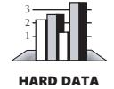

Used unintelligently, walk-throughs are more trouble than they're worth. The low end of their effectiveness, 20 percent, isn't worth much, and at least one organization (Boeing Computer Services) found peer reviews of code to be "extremely expensive." Boeing found it was difficult to motivate project personnel to apply walk-through techniques consistently, and when project pressures increased, walk-throughs became nearly impossible (Glass 1982).

I've become more critical of walk-throughs during the past 10 years as a result of what I've seen in my company's consulting business. I've found that when people have bad experiences with technical reviews, it is nearly always with informal practices such as walk-throughs rather than with formal inspections. A review is basically a meeting, and meetings are expensive. If you're going to incur the overhead of holding a meeting, it's worthwhile to structure the meeting as a formal inspection. If the work product you're reviewing doesn't justify the overhead of a formal inspection, it doesn't justify the overhead of a meeting at all. In such a case you're better off using document reading or another less interactive approach.

Inspections seem to be more effective than walk-throughs at removing errors. So why would anyone choose to use walk-throughs?

If you have a large review group, a walk-through is a good review choice because it brings many diverse viewpoints to bear on the item under review. If everyone involved in the walk-through can be convinced that the solution is all right, it probably doesn't have any major flaws.

If reviewers from other organizations are involved, a walk-through might also be preferable. Roles in an inspection are more formalized and require some practice before people perform them effectively. Reviewers who haven't participated in inspections before are at a disadvantage. If you want to solicit their contributions, a walk-through might be the best choice.

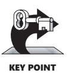

Inspections are more focused than walk-throughs and generally pay off better. Consequently, if you're choosing a review standard for your organization, choose inspections first unless you have good reason not to.

#### Code Reading

Code reading is an alternative to inspections and walk-throughs. In code reading, you read source code and look for errors. You also comment on qualitative aspects of the code, such as its design, style, readability, maintainability, and efficiency.

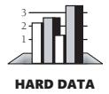

A study at NASA's Software Engineering Laboratory found that code reading detected about 3.3 defects per hour of effort. Testing detected about 1.8 errors per hour (Card 1987). Code reading also found 20 to 60 percent more errors over the life of the project than the various kinds of testing did.

Like the idea of a walk-through, the concept of code reading is loosely defined. A code reading usually involves two or more people reading code independently and then meeting with the author of the code to discuss it. Here's how code reading goes:

- In preparation for the meeting, the author of the code hands out source listings to the code readers. The listings are from 1000 to 10,000 lines of code; 4000 lines is typical.
- Two or more people read the code. Use at least two people to encourage competition between the reviewers. If you use more than two, measure everyone's contribution so that you know how much the extra people contribute.
- Reviewers read the code independently. Estimate a rate of about 1000 lines a day.
- When the reviewers have finished reading the code, the code-reading meeting is hosted by the author of the code. The meeting lasts one or two hours and focuses on problems discovered by the code readers. No one makes any attempt to walk through the code line by line. The meeting is not even strictly necessary.
- The author of the code fixes the problems identified by the reviewers.

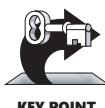

KEY POINT

The difference between code reading on the one hand and inspections and walkthroughs on the other is that code reading focuses more on individual review of the code than on the meeting. The result is that each reviewer's time is focused on finding problems in the code. Less time is spent in meetings in which each person contributes only part of the time and in which a substantial amount of the effort goes into moderating group dynamics. Less time is spent delaying meetings until each person in the group can meet for two hours. Code readings are especially valuable in situations in which reviewers are geographically dispersed.

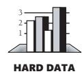

A study of 13 reviews at AT&T found that the importance of the review meeting itself was overrated; 90 percent of the defects were found in preparation for the review meeting, and only about 10 percent were found during the review itself (Votta 1991, Glass 1999).

#### Dog-and-Pony Shows

Dog-and-pony shows are reviews in which a software product is demonstrated to a customer. Customer reviews are common in software developed for government contracts, which often stipulate that reviews will be held for requirements, design, and code. The purpose of a dog-and-pony show is to demonstrate to the customer that the project is OK, so it's a management review rather than a technical review.

Don't rely on dog-and-pony shows to improve the technical quality of your products. Preparing for them might have an indirect effect on technical quality, but usually more time is spent in making good-looking presentation slides than in improving the quality of the software. Rely on inspections, walk-throughs, or code reading for technical quality improvements.

#### Comparison of Collaborative Construction Techniques

What are the differences among the various kinds of collaborative construction? Table 21-1 provides a summary of each technique's major characteristics.

**Table 21-1 Comparison of Collaborative Construction Techniques**

| Property                                                                                | Pair Programming                                  | Formal Inspection      | Informal Review (Walk-Throughs) |
|-----------------------------------------------------------------------------------------|------------------------------------------------------|---------------------------|------------------------------------|
| Defined participant roles                                                               | Yes                                                  | Yes                       | No                                 |
| Formal training in how to per form the roles                                         | Maybe, through coaching                           | Yes                       | No                                 |
| Who "drives" the collaboration                                                          | Person with the keyboard                          | Moderator                 | Author, usually                    |
| Focus of collaboration                                                                  | Design, coding, testing, and defect correction | Defect detec tion only | Varies                             |
| Focused review effort—looks for the most frequently found kinds of errors         | Informal, if at all                                  | Yes                       | No                                 |
| Follow-up to reduce bad fixes                                                           | Yes                                                  | Yes                       | No                                 |
| Fewer future errors because of detailed error feedback to indi vidual programmers | Incidental                                           | Yes                       | Incidental                         |
| Improved process efficiency from analysis of results                                 | No                                                   | Yes                       | No                                 |
| Useful for nonconstruction activities                                                | Possibly                                             | Yes                       | Yes                                |
| Typical percentage of defects found                                                  | 40–60%                                               | 45–70%                    | 20–40%                             |

Pair programming doesn't have decades of data supporting its effectiveness like formal inspection does, but the initial data suggests it's on roughly equal footing with inspections, and anecdotal reports have also been positive.

If pair programming and formal inspections produce similar results for quality, cost, and schedule, the choice between them becomes a matter of personal style rather than one of technical substance. Some people prefer to work solo, only occasionally breaking out of solo mode for inspection meetings. Others prefer to spend more of their time directly working with others. The choice between the two techniques can be driven by the work-style preference of a team's specific developers, and subgroups within the team might be allowed to choose which way they would like to do most of their work. You should also use different techniques with a project, as appropriate.

#### Additional Resources

**cc2e.com/2106** Here are more resources concerning collaborative contruction:

#### Pair Programming

Williams, Laurie and Robert Kessler. *Pair Programming Illuminated*. Boston, MA: Addison Wesley, 2002. This book explains the detailed ins and outs of pair programming, including how to handle various personality matches (for example, expert and inexpert, introvert and extrovert) and other implementation issues.

Beck, Kent. *Extreme Programming Explained: Embrace Change*. Reading, MA: Addison Wesley, 2000. This book touches on pair programming briefly and shows how it can be used in conjunction with other mutually supportive techniques, including coding standards, frequent integration, and regression testing.

Reifer, Donald. "How to Get the Most Out of Extreme Programming/Agile Methods," *Proceedings, XP/Agile Universe 2002*. New York, NY: Springer; pp. 185–196. This paper summarizes industrial experience with Extreme Programming and agile methods and presents keys to success for pair programming.

#### Inspections

Wiegers, Karl. *Peer Reviews in Software: A Practical Guide*. Boston, MA: Addison Wesley, 2002. This well-written book describes the ins and outs of various kinds of reviews, including formal inspections and other, less formal practices. It's well researched, has a practical focus, and is easy to read.

Gilb, Tom and Dorothy Graham. *Software Inspection*. Wokingham, England: Addison-Wesley, 1993. This contains a thorough discussion of inspections circa the early 1990s. It has a practical focus and includes case studies that describe experiences several organizations have had in setting up inspection programs.

Fagan, Michael E. "Design and Code Inspections to Reduce Errors in Program Development." *IBM Systems Journal* 15, no. 3 (1976): 182–211.

Fagan, Michael E. "Advances in Software Inspections." *IEEE Transactions on Software Engineering*, SE-12, no. 7 (July 1986): 744–51. These two articles were written by the developer of inspections. They contain the meat of what you need to know to run an inspection, including all the standard inspection forms.

#### Relevant Standards

*IEEE Std 1028-1997, Standard for Software Reviews*

*IEEE Std 730-2002, Standard for Software Quality Assurance Plans*

### Key Points

- Collaborative development practices tend to find a higher percentage of defects than testing and to find them more efficiently.
- Collaborative development practices tend to find different kinds of errors than testing does, implying that you need to use both reviews and testing to ensure the quality of your software.
- Formal inspections use checklists, preparation, well-defined roles, and continual process improvement to maximize error-detection efficiency. They tend to find more defects than walk-throughs.
- Pair programming typically costs about the same as inspections and produces similar quality code. Pair programming is especially valuable when schedule reduction is desired. Some developers prefer working in pairs to working solo.
- Formal inspections can be used on work products such as requirements, designs, and test cases, as well as on code.
- Walk-throughs and code reading are alternatives to inspections. Code reading offers more flexibility in using each person's time effectively.
