# Chapter 22: Developer Testing


<span id="page-535-0"></span>
### cc2e.com/2261 Contents

- 22.1 Role of Developer Testing in Software Quality: page 500
- 22.2 Recommended Approach to Developer Testing: page 503
- 22.3 Bag of Testing Tricks: page 505
- 22.4 Typical Errors: page 517
- 22.5 Test-Support Tools: page 523
- 22.6 Improving Your Testing: page 528
- 22.7 Keeping Test Records: page 529

#### Related Topics

- The software-quality landscape: Chapter 20
- Collaborative construction practices: Chapter 21
- Debugging: Chapter 23
- Integration: Chapter 29
- Prerequisites to construction: Chapter 3

Testing is the most popular quality-improvement activity—a practice supported by a wealth of industrial and academic research and by commercial experience. Software is tested in numerous ways, some of which are typically performed by developers and some of which are more commonly performed by specialized test personnel:

- *Unit testing* is the execution of a complete class, routine, or small program that has been written by a single programmer or team of programmers, which is tested in isolation from the more complete system.
- *Component testing* is the execution of a class, package, small program, or other program element that involves the work of multiple programmers or programming teams, which is tested in isolation from the more complete system.
- *Integration testing* is the combined execution of two or more classes, packages, components, or subsystems that have been created by multiple programmers or programming teams. This kind of testing typically starts as soon as there are two classes to test and continues until the entire system is complete.

- *Regression testing* is the repetition of previously executed test cases for the purpose of finding defects in software that previously passed the same set of tests.
- *System testing* is the execution of the software in its final configuration, including integration with other software and hardware systems. It tests for security, performance, resource loss, timing problems, and other issues that can't be tested at lower levels of integration.

In this chapter, "testing" refers to testing by the developer, which typically consists of unit tests, component tests, and integration tests but can sometimes include regression tests and system tests. Numerous additional kinds of testing are performed by specialized test personnel and are rarely performed by developers, including beta tests, customer-acceptance tests, performance tests, configuration tests, platform tests, stress tests, usability tests, and so on. These kinds of testing are not discussed further in this chapter.

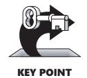

Testing is usually broken into two broad categories: black-box testing and white-box (or glass-box) testing. "Black-box testing" refers to tests in which the tester cannot see the inner workings of the item being tested. This obviously does not apply when you test code that you have written! "White-box testing" refers to tests in which the tester is aware of the inner workings of the item being tested. This is the kind of testing that you as a developer use to test your own code. Both black-box and white-box testing have strengths and weaknesses; this chapter focuses on white-box testing because that's the kind of testing that developers perform.

Some programmers use the terms "testing" and "debugging" interchangeably, but careful programmers distinguish between the two activities. Testing is a means of detecting errors. Debugging is a means of diagnosing and correcting the root causes of errors that have already been detected. This chapter deals exclusively with error detection. Error correction is discussed in detail in Chapter 23, "Debugging."

The whole topic of testing is much larger than the subject of testing during construction. System testing, stress testing, black-box testing, and other topics for test specialists are discussed in the "Additional Resources" section at the end of the chapter.

#### 22.1 Role of Developer Testing in Software Quality

**Cross-Reference** For details on reviews, see Chapter 21, "Collaborative Construction." Testing is an important part of any software-quality program, and in many cases it's the only part. This is unfortunate, because collaborative development practices in their various forms have been shown to find a higher percentage of errors than testing does, and they cost less than half as much per error found as testing does (Card 1987, Russell 1991, Kaplan 1995). Individual testing steps (unit test, component test, and integration test) typically find less than 50 percent of the errors present each. The combination of testing steps often finds less than 60 percent of the errors present (Jones 1998).

Programs do not acquire bugs as people acquire germs, by hanging around other buggy programs. Programmers must insert them. *—Harlan Mills*

If you were to list a set of software-development activities on "Sesame Street" and ask, "Which of these things is not like the others?" the answer would be "Testing." Testing is a hard activity for most developers to swallow for several reasons:

- Testing's goal runs counter to the goals of other development activities. The goal is to find errors. A successful test is one that breaks the software. The goal of every other development activity is to prevent errors and keep the software from breaking.
- Testing can never completely prove the absence of errors. If you have tested extensively and found thousands of errors, does it mean that you've found all the errors or that you have thousands more to find? An absence of errors could mean ineffective or incomplete test cases as easily as it could mean perfect software.
- Testing by itself does not improve software quality. Test results are an indicator of quality, but in and of themselves they don't improve it. Trying to improve software quality by increasing the amount of testing is like trying to lose weight by weighing yourself more often. What you eat before you step onto the scale determines how much you will weigh, and the software-development techniques you use determine how many errors testing will find. If you want to lose weight, don't buy a new scale; change your diet. If you want to improve your software, don't just test more; develop better.

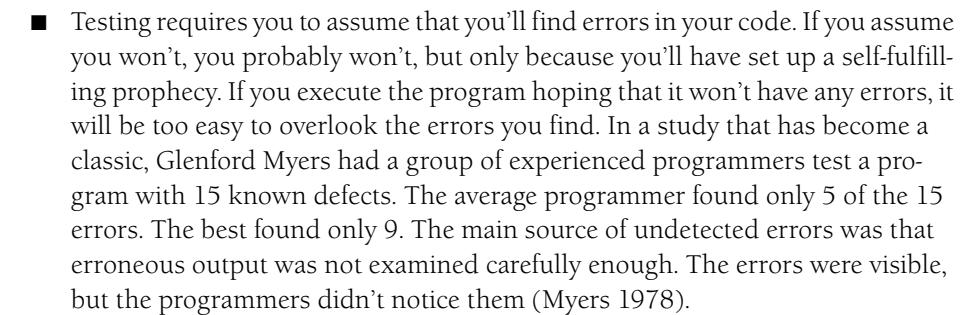

You must hope to find errors in your code. Such a hope might seem like an unnatural act, but you should hope that it's you who finds the errors and not someone else.

A key question is, How much time should be spent in developer testing on a typical project? A commonly cited figure for all testing is 50 percent of the time spent on the project, but that's misleading. First, that particular figure combines testing and debugging; testing alone takes less time. Second, that figure represents the amount of time that's typically spent rather than the time that should be spent. Third, the figure includes independent testing as well as developer testing.

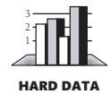

As Figure 22-1 shows, depending on the project's size and complexity, developer testing should probably take 8 to 25 percent of the total project time. This is consistent with much of the data that has been reported.

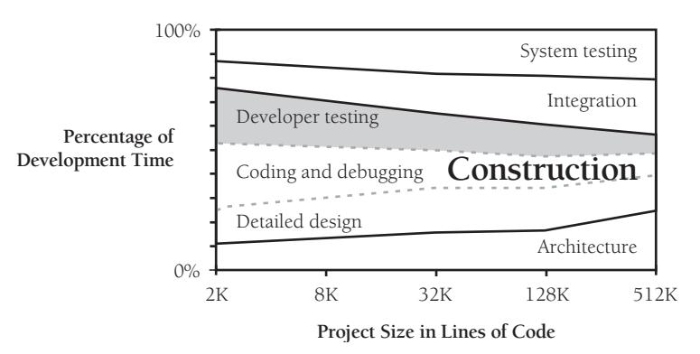

**Figure 22-1** As the size of the project increases, developer testing consumes a smaller percentage of the total development time. The effects of program size are described in more detail in Chapter 27, "How Program Size Affects Construction."

A second question is, What do you do with the results of developer testing? Most immediately, you can use the results to assess the reliability of the product under development. Even if you never correct the defects that testing finds, testing describes how reliable the software is. Another use for the results is that they can and usually do guide corrections to the software. Finally, over time, the record of defects found through testing helps reveal the kinds of errors that are most common. You can use this information to select appropriate training classes, direct future technical review activities, and design future test cases.

#### Testing During Construction

The big, wide world of testing sometimes ignores the subject of this chapter: "white-box" or "glass-box" testing. You generally want to design a class to be a black box—a user of the class won't have to look past the interface to know what the class does. In testing the class, however, it's advantageous to treat it as a glass box, to look at the internal source code of the class as well as its inputs and outputs. If you know what's inside the box, you can test the class more thoroughly. Of course, you also have the same blind spots in testing the class that you had in writing it, and so black-box testing has advantages too.

During construction, you generally write a routine or class, check it mentally, and then review it or test it. Regardless of your integration or system-testing strategy, you should test each unit thoroughly before you combine it with any others. If you're writing several routines, you should test them one at a time. Routines aren't really any easier to test individually, but they're much easier to debug. If you throw several untested routines together at once and find an error, any of the several routines might be guilty. If you add one routine at a time to a collection of previously tested routines, you know

that any new errors are the result of the new routine or of interactions with the new routine. The debugging job is easier.

Collaborative construction practices have many strengths to offer that testing can't match. But part of the problem with testing is that testing often isn't performed as well as it could be. A developer can perform hundreds of tests and still achieve only partial code coverage. A *feeling* of good test coverage doesn't mean that actual test coverage is adequate. An understanding of basic test concepts can support better testing and raise testing's effectiveness.

#### 22.2 Recommended Approach to Developer Testing

A systematic approach to developer testing maximizes your ability to detect errors of all kinds with a minimum of effort. Be sure to cover this ground:

- Test for each relevant requirement to make sure that the requirements have been implemented. Plan the test cases for this step at the requirements stage or as early as possible—preferably before you begin writing the unit to be tested. Consider testing for common omissions in requirements. The level of security, storage, the installation procedure, and system reliability are all fair game for testing and are often overlooked at requirements time.
- Test for each relevant design concern to make sure that the design has been implemented. Plan the test cases for this step at the design stage or as early as possible before you begin the detailed coding of the routine or class to be tested.
- Use "basis testing" to add detailed test cases to those that test the requirements and the design. Add data-flow tests, and then add the remaining test cases needed to thoroughly exercise the code. At a minimum, you should test every line of code. Basis testing and data-flow testing are described later in this chapter.
- Use a checklist of the kinds of errors you've made on the project to date or have made on previous projects.

Design the test cases along with the product. This can help avoid errors in requirements and design, which tend to be more expensive than coding errors. Plan to test and find defects as early as possible because it's cheaper to fix defects early.

#### Test First or Test Last?

Developers sometimes wonder whether it's better to write test cases after the code has been written or beforehand (Beck 2003). The defect-cost increase graph—see Figure 3-1 on page 30—suggests that writing test cases first will minimize the amount of time between when a defect is inserted into the code and when the defect is detected and removed. This turns out to be one of many reasons to write test cases first:

■ Writing test cases before writing the code doesn't take any more effort than writing test cases after the code; it simply resequences the test-case-writing activity.

- When you write test cases first, you detect defects earlier and you can correct them more easily.
- Writing test cases first forces you to think at least a little bit about the requirements and design before writing code, which tends to produce better code.
- Writing test cases first exposes requirements problems sooner, before the code is written, because it's hard to write a test case for a poor requirement.
- If you save your test cases, which you should do, you can still test last, in addition to testing first.

All in all, I think test-first programming is one of the most beneficial software practices to emerge during the past decade and is a good general approach. But it isn't a testing panacea, because it's subject to the general limitations of developer testing, which are described next.

#### Limitations of Developer Testing

Watch for the following limitations with developer testing:

*Developer tests tend to be "clean tests"* Developers tend to test for whether the code works (clean tests) rather than test for all the ways the code breaks (dirty tests). Immature testing organizations tend to have about five clean tests for every dirty test. Mature testing organizations tend to have five dirty tests for every clean test. This ratio is not reversed by reducing the clean tests; it's done by creating 25 times as many dirty tests (Boris Beizer in Johnson 1994).

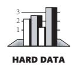

*Developer testing tends to have an optimistic view of test coverage* Average programmers believe they are achieving 95 percent test coverage, but they're typically achieving more like 80 percent test coverage in the best case, 30 percent in the worst case, and more like 50-60 percent in the average case (Boris Beizer in Johnson 1994).

*Developer testing tends to skip more sophisticated kinds of test coverage* Most developers view the kind of test coverage known as "100% statement coverage" as adequate. This is a good start, but it's hardly sufficient. A better coverage standard is to meet what's called "100% branch coverage," with every predicate term being tested for at least one true and one false value. Section 22.3, "Bag of Testing Tricks," provides more details about how to accomplish this.

None of these points reduce the value of developer testing, but they do help put developer testing into proper perspective. As valuable as developer testing is, it isn't sufficient to provide adequate quality assurance on its own and should be supplemented with other practices, including independent testing and collaborative construction techniques.

#### 22.3 Bag of Testing Tricks

Why isn't it possible to prove that a program is correct by testing it? To use testing to prove that a program works, you'd have to test every conceivable input value to the program and every conceivable combination of input values. Even for simple programs, such an undertaking would become massively prohibitive. Suppose, for example, that you have a program that takes a name, an address, and a phone number and stores them in a file. This is certainly a simple program, much simpler than any whose correctness you'd really be worried about. Suppose further that each of the possible names and addresses is 20 characters long and that there are 26 possible characters to be used in them. This would be the number of possible inputs:

Name 2620 (20 characters, each with 26 possible choices) Address 2620 (20 characters, each with 26 possible choices) Phone Number 1010 (10 digits, each with 10 possible choices)

Total Possibilities = 2620 \* 2620 \* 1010 ≈ 10<sup>66</sup>

Even with this relatively small amount of input, you have one-with-66-zeros possible test cases. To put this in perspective, if Noah had gotten off the ark and started testing this program at the rate of a trillion test cases per second, he would be far less than 1 percent of the way done today. Obviously, if you added a more realistic amount of data, the task of exhaustively testing all possibilities would become even more impossible.

#### Incomplete Testing

**Cross-Reference** One way of telling whether you've covered all the code is to use a coverage monitor. For details, see "Coverage Monitors" in Section 22.5, "Test-Support Tools," later in this chapter.

Since exhaustive testing is impossible, practically speaking, the art of testing is that of picking the test cases most likely to find errors. Of the 1066 possible test cases, only a few are likely to disclose errors that the others don't. You need to concentrate on picking a few that tell you different things rather than a set that tells you the same thing over and over.

When you're planning tests, eliminate those that don't tell you anything new—that is, tests on new data that probably won't produce an error if other, similar data didn't produce an error. Various people have proposed various methods of covering the bases efficiently, and several of these methods are discussed in the following sections.

#### Structured Basis Testing

In spite of the hairy name, structured basis testing is a fairly simple concept. The idea is that you need to test each statement in a program at least once. If the statement is a logical statement—an *if* or a *while*, for example—you need to vary the testing according to how complicated the expression inside the *if* or *while* is to make sure that the statement is fully tested. The easiest way to make sure that you've gotten all the bases covered is to calculate the number of paths through the program and then develop the minimum number of test cases that will exercise every path through the program.

You might have heard of "code coverage" testing or "logic coverage" testing. They are approaches in which you test all the paths through a program. Since they cover all paths, they're similar to structured basis testing, but they don't include the idea of covering all paths with a *minimal* set of test cases. If you use code coverage or logic coverage testing, you might create many more test cases than you would need to cover the same logic with structured basis testing.

**Cross-Reference** This procedure is similar to the one for measuring complexity in "How to Measure Complexity" in Section 19.6.

You can compute the minimum number of cases needed for basis testing in this straightforward way:

- **1.** Start with 1 for the straight path through the routine.
- **2.** Add 1 for each of the following keywords, or their equivalents: *if*, *while*, *repeat*, *for*, *and*, and *or*.
- **3.** Add 1 for each case in a *case* statement. If the *case* statement doesn't have a default case, add 1 more.

Here's an example:

```
Simple Example of Computing the Number of Paths Through a Java Program
Count "1" for the routine 
itself.
Count "2" for the if.
                          Statement1;
                          Statement2;
                          if ( x < 10 ) {
                           Statement3;
                          }
                          Statement4;
```

In this instance, you start with one and count the *if* once to make a total of two. That means that you need to have at least two test cases to cover all the paths through the program. In this example, you'd need to have the following test cases:

- Statements controlled by *if* are executed (x < 10).
- Statements controlled by *if* aren't executed (x >= 10).

The sample code needs to be a little more realistic to give you an accurate idea of how this kind of testing works. Realism in this case includes code containing defects.

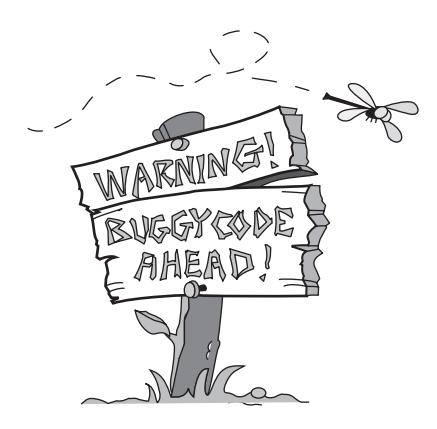

The following listing is a slightly more complicated example. This piece of code is used throughout the chapter and contains a few possible errors.

```
Example of Computing the Number of Cases Needed for Basis Testing 
                      of a Java Program
Count "1" for the routine 
itself.
                      1 // Compute Net Pay
                      2 totalWithholdings = 0;
                      3 
Count "2" for the for. 4 for ( id = 0; id < numEmployees; id++ ) {
                      5 
                      6 // compute social security withholding, if below the maximum
Count "3" for the if. 7 if ( m_employee[ id ].governmentRetirementWithheld < MAX_GOVT_RETIREMENT ) {
                      8 governmentRetirement = ComputeGovernmentRetirement( m_employee[ id ] );
                      9 }
                      10 
                      11 // set default to no retirement contribution
                      12 companyRetirement = 0;
                      13 
                      14 // determine discretionary employee retirement contribution
Count "4" for the if and "5" 
for the &&.
                      15 if ( m_employee[ id ].WantsRetirement &&
                      16 EligibleForRetirement( m_employee[ id ] ) ) {
                      17 companyRetirement = GetRetirement( m_employee[ id ] );
                      18 }
                      19 
                      20 grossPay = ComputeGrossPay ( m_employee[ id ] );
                      21 
                      22 // determine IRA contribution
                      23 personalRetirement = 0;
Count "6" for the if. 24 if ( EligibleForPersonalRetirement( m_employee[ id ] ) ) {
                      25 personalRetirement = PersonalRetirementContribution( m_employee[ id ],
                      26 companyRetirement, grossPay );
                      27 }
                      28 
                      29 // make weekly paycheck
                      30 withholding = ComputeWithholding( m_employee[ id ] );
                      31 netPay = grossPay - withholding - companyRetirement - governmentRetirement –
                      32 personalRetirement;
                      33 PayEmployee( m_employee[ id ], netPay );
```

```
34 
35 // add this employee's paycheck to total for accounting
36 totalWithholdings = totalWithholdings + withholding;
37 totalGovernmentRetirement = totalGovernmentRetirement + governmentRetirement;
38 totalRetirement = totalRetirement + companyRetirement;
39 } 
40 
41 SavePayRecords( totalWithholdings, totalGovernmentRetirement, totalRetirement );
```

In this example, you'll need one initial test case plus one for each of the five keywords, for a total of six. That doesn't mean that any six test cases will cover all the bases. It means that, at a minimum, six cases are required. Unless the cases are constructed carefully, they almost surely won't cover all the bases. The trick is to pay attention to the same keywords you used when counting the number of cases needed. Each keyword in the code represents something that can be either true or false; make sure you have at least one test case for each true and at least one for each false.

| Here is a set of test cases that covers all the bases in this example: |  |
|------------------------------------------------------------------------|--|
|------------------------------------------------------------------------|--|

| Case | Test Description                                                         | Test Data                                                               |
|------|--------------------------------------------------------------------------|-------------------------------------------------------------------------|
| 1    | Nominal case                                                             | All boolean conditions are true                                         |
| 2    | The initial for condi<br>tion is false                                   | numEmployees < 1                                                        |
| 3    | The first<br>if is false                                                 | m_employee[ id ].governmentRetirementWith<br>held >=MAX_GOVT_RETIREMENT |
| 4    | The second if is false<br>because the first part<br>of the and is false  | not m_employee[ id ].WantsRetirement                                    |
| 5    | The second if is false<br>because the second<br>part of the and is false | not EligibleForRetirement( m_employee[id] )                             |
| 6    | The third<br>if is false                                                 | not EligibleForPersonalRetirement( m_employee[<br>id ] )                |

Note: This table will be extended with additional test cases throughout the chapter.

If the routine were much more complicated than this, the number of test cases you'd have to use just to cover all the paths would increase pretty quickly. Shorter routines tend to have fewer paths to test. Boolean expressions without a lot of *and*s and *or*s have fewer variations to test. Ease of testing is another good reason to keep your routines short and your boolean expressions simple.

Now that you've created six test cases for the routine and satisfied the demands of structured basis testing, can you consider the routine to be fully tested? Probably not. This kind of testing assures you only that all of the code will be executed. It does not account for variations in data.

#### Data-Flow Testing

Considering the last section and this one together gives you another example illustrating that control flow and data flow are equally important in computer programming.

Data-flow testing is based on the idea that data usage is at least as error-prone as control flow. Boris Beizer claims that at least half of all code consists of data declarations and initializations (Beizer 1990).

Data can exist in one of three states:

- **Defined** The data has been initialized, but it hasn't been used yet.
- **Used** The data has been used for computation, as an argument to a routine, or for something else.
- **Killed** The data was once defined, but it has been undefined in some way. For example, if the data is a pointer, perhaps the pointer has been freed. If it's a forloop index, perhaps the program is out of the loop and the programming language doesn't define the value of a for-loop index once it's outside the loop. If it's a pointer to a record in a file, maybe the file has been closed and the record pointer is no longer valid.

In addition to having the terms "defined," "used," and "killed," it's convenient to have terms that describe entering or exiting a routine immediately before or after doing something to a variable:

- **Entered** The control flow enters the routine immediately before the variable is acted upon. A working variable is initialized at the top of a routine, for example.
- **Exited** The control flow leaves the routine immediately after the variable is acted upon. A return value is assigned to a status variable at the end of a routine, for example.

#### Combinations of Data States

The normal combination of data states is that a variable is defined, used one or more times, and perhaps killed. View the following patterns suspiciously:

■ **Defined-Defined** If you have to define a variable twice before the value sticks, you don't need a better program, you need a better computer! It's wasteful and error-prone, even if not actually wrong.

- **Defined-Exited** If the variable is a local variable, it doesn't make sense to define it and exit without using it. If it's a routine parameter or a global variable, it might be all right.
- **Defined-Killed** Defining a variable and then killing it suggests that either the variable is extraneous or the code that was supposed to use the variable is missing.
- **Entered-Killed** This is a problem if the variable is a local variable. It wouldn't need to be killed if it hasn't been defined or used. If, on the other hand, it's a routine parameter or a global variable, this pattern is all right as long as the variable is defined somewhere else before it's killed.
- **Entered-Used** Again, this is a problem if the variable is a local variable. The variable needs to be defined before it's used. If, on the other hand, it's a routine parameter or a global variable, the pattern is all right if the variable is defined somewhere else before it's used.
- **Killed-Killed** A variable shouldn't need to be killed twice. Variables don't come back to life. A resurrected variable indicates sloppy programming. Double kills are also fatal for pointers—one of the best ways to hang your machine is to kill (free) a pointer twice.
- **Killed-Used** Using a variable after it has been killed is a logical error. If the code seems to work anyway (for example, a pointer that still points to memory that's been freed), that's an accident, and Murphy's Law says that the code will stop working at the time when it will cause the most mayhem.
- **Used-Defined** Using and then defining a variable might or might not be a problem, depending on whether the variable was also defined before it was used. Certainly if you see a used-defined pattern, it's worthwhile to check for a previous definition.

Check for these anomalous sequences of data states before testing begins. After you've checked for the anomalous sequences, the key to writing data-flow test cases is to exercise all possible defined-used paths. You can do this to various degrees of thoroughness, including

- All definitions. Test every definition of every variable—that is, every place at which any variable receives a value. This is a weak strategy because if you try to exercise every line of code, you'll do this by default.
- All defined-used combinations. Test every combination of defining a variable in one place and using it in another. This is a stronger strategy than testing all definitions because merely executing every line of code does not guarantee that every defined-used combination will be tested.

Here's an example:

```
Java Example of a Program Whose Data Flow Is to Be Tested
if ( Condition 1 ) {
 x = a;
}
else {
 x = b;
}
if ( Condition 2 ) {
 y = x + 1;
}
else {
 y = x - 1;
}
```

To cover every path in the program, you need one test case in which *Condition 1* is true and one in which it's false. You also need a test case in which *Condition 2* is true and one in which it's false. This can be handled by two test cases: Case 1 (*Condition 1=True*, *Condition 2=True*) and Case 2 (*Condition 1=False*, *Condition 2=False*). Those two cases are all you need for structured basis testing. They're also all you need to exercise every line of code that defines a variable; they give you the weak form of data-flow testing automatically.

To cover every defined-used combination, however, you need to add a few more cases. Right now you have the cases created by having *Condition 1* and *Condition 2* true at the same time and *Condition 1* and *Condition 2* false at the same time:

```
x = a
...
y = x + 1
and
x = b
...
y = x - 1
```

But you need two more cases to test every defined-used combination: (1) *x = a* and then *y = x - 1* and (2) *x = b* and then *y = x + 1*. In this example, you can get these combinations by adding two more cases: Case 3 (*Condition 1=True*, *Condition 2=False*) and Case 4 (*Condition 1=False*, *Condition 2=True*).

A good way to develop test cases is to start with structured basis testing, which gives you some if not all of the defined-used data flows. Then add the cases you still need to have a complete set of defined-used data-flow test cases.

As discussed in the previous section, structured basis testing provided six test cases for the routine beginning on page 507. Data-flow testing of each defined-used pair requires several more test cases, some of which are covered by existing test cases and some of which aren't. Here are all the data-flow combinations that add test cases beyond the ones generated by structured basis testing:

| Case | Test Description                                                  |
|------|-------------------------------------------------------------------|
| 7    | Define companyRetirement in line 12, and use it first in line 26. |
|      | This isn't necessarily covered by any of the previous test cases. |
| 8    | Define companyRetirement in line 12, and use it first in line 31. |
|      | This isn't necessarily covered by any of the previous test cases. |
| 9    | Define companyRetirement in line 17, and use it first in line 31. |
|      | This isn't necessarily covered by any of the previous test cases. |

Once you run through the process of listing data-flow test cases a few times, you'll get a sense of which cases are fruitful and which are already covered. When you get stuck, list all the defined-used combinations. That might seem like a lot of work, but it's guaranteed to show you any cases that you didn't test for free in the basis-testing approach.

#### Equivalence Partitioning

**Cross-Reference** Equivalence partitioning is discussed in far more depth in the books listed in the "Additional Resources" section at the end of this chapter.

A good test case covers a large part of the possible input data. If two test cases flush out exactly the same errors, you need only one of them. The concept of "equivalence partitioning" is a formalization of this idea and helps reduce the number of test cases required.

In the listing beginning on page 507, line 7 is a good place to use equivalence partitioning. The condition to be tested is *m\_employee[ ID ].governmentRetirementWithheld < MAX\_GOVT\_RETIREMENT*. This case has two equivalence classes: the class in which *m\_employee[ ID ].governmentRetirementWithheld* is less than *MAX\_GOVT\_RETIREMENT* and the class in which it's greater than or equal to *MAX\_GOVT\_RETIREMENT*. Other parts of the program might have other related equivalence classes that imply that you need to test more than two possible values of *m\_employee[ ID ].government-RetirementWithheld*, but as far as this part of the program is concerned, only two are needed.

Thinking about equivalence partitioning won't give you a lot of new insight into a program when you have already covered the program with basis and data-flow testing. It's especially helpful, however, when you're looking at a program from the outside (from a specification rather than the source code) or when the data is complicated and the complications aren't all reflected in the program's logic.

#### Error Guessing

**Cross-Reference** For details on heuristics, see Section 2.2, "How to Use Software Metaphors."

In addition to the formal test techniques, good programmers use a variety of less formal, heuristic techniques to expose errors in their code. One heuristic is the technique of error guessing. The term "error guessing" is a lowbrow name for a sensible concept. It means creating test cases based upon guesses about where the program might have errors, although it implies a certain amount of sophistication in the guessing.

You can base guesses on intuition or on past experience. Chapter 21, "Collaborative Construction," points out that one virtue of inspections is that they produce and maintain a list of common errors. The list is used to check new code. When you keep records of the kinds of errors you've made before, you improve the likelihood that your "error guess" will discover an error.

The next few sections describe specific kinds of errors that lend themselves to error guessing.

#### Boundary Analysis

One of the most fruitful areas for testing is boundary conditions—off-by-one errors. Saying *num – 1* when you mean *num* and saying *>=* when you mean *>* are common mistakes.

The idea of boundary analysis is to write test cases that exercise the boundary conditions. Pictorially, if you're testing for a range of values that are less than *max*, you have three possible conditions:

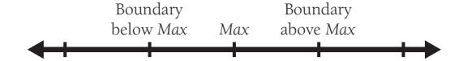

As shown, there are three boundary cases: just less than *max*, *max* itself, and just greater than *max*. It takes three cases to ensure that none of the common mistakes has been made.

The code sample on page 507 contains a check for *m\_employee[ ID ].g*overnmentRetirementWithheld < *MAX\_GOVT\_RETIREMENT*. According to the principles of boundary analysis, three cases should be examined:

| Case | Test Description                                                                                                                                                                                                                                                                                                                      |
|------|---------------------------------------------------------------------------------------------------------------------------------------------------------------------------------------------------------------------------------------------------------------------------------------------------------------------------------------|
| 1    | Case 1 is defined so that the true condition for m_employee[ ID ].govern<br>mentRetirementWithheld < MAX_GOVT_RETIREMENT is the first case on the<br>true side of the boundary. Thus, the Case 1 test case sets m_employee[ ID<br>].governmentRetirementWithheld to MAX_GOVT_RETIREMENT – 1. This test<br>case was already generated. |

| 3  | Case 3 is defined so that the false condition for m_employee[ ID ]. govern<br>mentRetirementWithheld < MAX_GOVT_RETIREMENT is on the false side of<br>the boundary. Thus, the Case 3 test case sets m_employee[ ID ].governmen<br>tRetirementWithheld to MAX_GOVT_RETIREMENT + 1. This test case was<br>also already generated. |
|----|---------------------------------------------------------------------------------------------------------------------------------------------------------------------------------------------------------------------------------------------------------------------------------------------------------------------------------|
| 10 | An additional test case is added for the case directly on the boundary in<br>which m_employee [ ID ].governmentRetirementWithheld =<br>MAX_GOVT_RETIREMENT.                                                                                                                                                                     |

#### Compound Boundaries

Boundary analysis also applies to minimum and maximum allowable values. In this example, it might be minimum or maximum *grossPay*, *companyRetirement*, or *Personal-RetirementContribution*, but because calculations of those values are outside the scope of the routine, test cases for them aren't discussed further here.

A more subtle kind of boundary condition occurs when the boundary involves a combination of variables. For example, if two variables are multiplied together, what happens when both are large positive numbers? Large negative numbers? *0*? What if all the strings passed to a routine are uncommonly long?

In the running example, you might want to see what happens to the variables *total-Withholdings, totalGovernmentRetirement*, and *totalRetirement* when every member of a large group of employees has a large salary—say, a group of programmers at \$250,000 each. (We can always hope!) This calls for another test case:

| Case | Test Description                                                                                                                                                                                                                                                                                                                           |
|------|--------------------------------------------------------------------------------------------------------------------------------------------------------------------------------------------------------------------------------------------------------------------------------------------------------------------------------------------|
| 11   | A large group of employees, each of whom has a large salary (what consti<br>tutes "large" depends on the specific system being developed)—for the<br>sake of example, we'll say 1000 employees, each with a salary of \$250,000,<br>none of whom have had any social security tax withheld and all of whom<br>want retirement withholding. |

A test case in the same vein but on the opposite side of the looking glass would be a small group of employees, each of whom has a salary of \$0.00:

| Case | Test Description                                              |
|------|---------------------------------------------------------------|
| 12   | A group of 10 employees, each of whom has a salary of \$0.00. |

#### Classes of Bad Data

Aside from guessing that errors show up around boundary conditions, you can guess about and test for several other classes of bad data. Typical bad-data test cases include

- Too little data (or no data)
- Too much data

- The wrong kind of data (invalid data)
- The wrong size of data
- Uninitialized data

Some of the test cases you would think of if you followed these suggestions have already been covered. For example, "too little data" is covered by Cases 2 and 12, and it's hard to come up with anything for "wrong size of data." Classes of bad data nonetheless gives rise to a few more cases:

| Case | Test Description                                                                                                                                                                                       |
|------|--------------------------------------------------------------------------------------------------------------------------------------------------------------------------------------------------------|
| 13   | An array of 100,000,000 employees. Tests for too much data. Of course,<br>how much is too much would vary from system to system, but for the sake<br>of the example, assume that this is far too much. |
| 14   | A negative salary. Wrong kind of data.                                                                                                                                                                 |
| 15   | A negative number of employees. Wrong kind of data.                                                                                                                                                    |

#### Classes of Good Data

When you try to find errors in a program, it's easy to overlook the fact that the nominal case might contain an error. Usually the nominal cases described in the basis-testing section represent one kind of good data. Following are other kinds of good data that are worth checking. Checking each of these kinds of data can reveal errors, depending on the item being tested.

- Nominal cases—middle-of-the-road, expected values
- Minimum normal configuration
- Maximum normal configuration
- Compatibility with old data

The minimum normal configuration is useful for testing not just one item, but a group of items. It's similar in spirit to the boundary condition of many minimal values, but it's different in that it creates the set of minimum values out of the set of what is normally expected. One example would be to save an empty spreadsheet when testing a spreadsheet. For testing a word processor, it would be saving an empty document. In the case of the running example, testing the minimum normal configuration would add the following test case:

| Case | Test Description                                                   |
|------|--------------------------------------------------------------------|
| 16   | A group of one employee. To test the minimum normal configuration. |

The maximum normal configuration is the opposite of the minimum. It's similar in spirit to boundary testing, but again, it creates a set of maximum values out of the set of expected values. An example of this would be saving a spreadsheet that's as large as the "maximum spreadsheet size" advertised on the product's packaging. Or printing the maximum-size spreadsheet. For a word processor, it would be saving a document of the largest recommended size. In the case of the running example, testing the maximum normal configuration depends on the maximum normal number of employees. Assuming it's 500, you would add the following test case:

| Case | Test Description                                                    |
|------|---------------------------------------------------------------------|
| 17   | A group of 500 employees. To test the maximum normal configuration. |

The last kind of normal data testing—testing for compatibility with old data—comes into play when the program or routine is a replacement for an older program or routine. The new routine should produce the same results with old data that the old routine did, except in cases in which the old routine was defective. This kind of continuity between versions is the basis for regression testing, the purpose of which is to ensure that corrections and enhancements maintain previous levels of quality without backsliding. In the case of the running example, the compatibility criterion wouldn't add any test cases.

#### Use Test Cases That Make Hand-Checks Convenient

Let's suppose you're writing a test case for a nominal salary; you need a nominal salary, and the way you get one is to type in whatever numbers your hands land on. I'll try it:

#### 1239078382346

OK. That's a pretty high salary, a little over a trillion dollars, in fact, but if I trim it so that it's somewhat realistic, I get *\$90,783.82*.

Now, further suppose that the test case succeeds—that is, it finds an error. How do you know that it's found an error? Well, presumably, you know what the answer is and what it should be because you calculated the correct answer by hand. When you try to do hand-calculations with an ugly number like *\$90,783.82*, however, you're as likely to make an error in the hand-calc as you are to discover one in your program. On the other hand, a nice, even number like *\$20,000* makes number crunching a snap. The *0*s are easy to punch into the calculator, and multiplying by *2* is something most programmers can do without using their fingers and toes.

You might think that an ugly number like *\$90,783.82* would be more likely to reveal errors, but it's no more likely to than any other number in its equivalence class.

#### 22.4 Typical Errors

This section is dedicated to the proposition that you can test best when you know as much as possible about your enemy: errors.

#### Which Classes Contain the Most Errors?

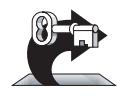

KEY POINT

It's natural to assume that defects are distributed evenly throughout your source code. If you have an average of 10 defects per 1000 lines of code, you might assume that you'll have one defect in a class that contains 100 lines of code. This is a natural assumption, but it's wrong.

Capers Jones reported that a focused quality-improvement program at IBM identified 31 of 425 classes in the IMS system as error-prone. The 31 classes were repaired or completely redeveloped, and, in less than a year, customer-reported defects against IMS were reduced ten to one. Total maintenance costs were reduced by about 45 percent. Customer satisfaction improved from "unacceptable" to "good" (Jones 2000).

Most errors tend to be concentrated in a few highly defective routines. Here is the general relationship between errors and code:

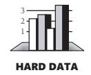

- Eighty percent of the errors are found in 20 percent of a project's classes or routines (Endres 1975, Gremillion 1984, Boehm 1987b, Shull et al 2002).
- Fifty percent of the errors are found in 5 percent of a project's classes (Jones 2000).

These relationships might not seem so important until you recognize a few corollaries. First, 20% of a project's routines contribute 80% of the cost of development (Boehm 1987b). That doesn't necessarily mean that the 20% that cost the most are the same as the 20% with the most defects, but it's pretty suggestive.

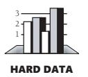

Second, regardless of the exact proportion of the cost contributed by highly defective routines, highly defective routines are extremely expensive. In a classic study in the 1960s, IBM performed an analysis of its OS/360 operating system and found that errors were not distributed evenly across all routines but were concentrated into a few. Those error-prone routines were found to be "the most expensive entities in programming" (Jones 1986a). They contained as many as 50 defects per 1000 lines of code, and fixing them often cost 10 times what it took to develop the whole system. (The costs included customer support and in-the-field maintenance.)

**Cross-Reference** Another class of routines that tend to contain a lot of errors is the class of overly complex routines. For details on identifying and simplifying routines, see "General Guidelines for Reducing Complexity" in Section 19.6.

Third, the implication of expensive routines for development is clear. As the old expression goes, "time is money." The corollary is that "money is time," and if you can cut close to 80 percent of the cost by avoiding troublesome routines, you can cut a substantial amount of the schedule as well. This is a clear illustration of the General Principle of Software Quality: improving quality improves the development schedule and reduces development costs.

Fourth, the implication of avoiding troublesome routines for maintenance is equally clear. Maintenance activities should be focused on identifying, redesigning, and rewriting from the ground up those routines that have been identified as error-prone. In the IMS project mentioned earlier, productivity of IMS releases improved about 15 percent after replacement of the error-prone classes (Jones 2000).

#### Errors by Classification

**Cross-Reference** For a list of all the checklists in the book, see the list following the book's table of contents.

Several researchers have tried to classify errors by type and determine the extent to which each kind of error occurs. Every programmer has a list of errors that have been particularly troublesome: off-by-one errors, forgetting to reinitialize a loop variable, and so on. The checklists presented throughout the book provide more details.

Boris Beizer combined data from several studies, arriving at an exceptionally detailed error taxonomy (Beizer 1990). Following is a summary of his results:

| 25.18% | Structural                    |
|--------|-------------------------------|
| 22.44% | Data                          |
| 16.19% | Functionality as implemented  |
| 9.88%  | Construction                  |
| 8.98%  | Integration                   |
| 8.12%  | Functional requirements       |
| 2.76%  | Test definition or execution  |
| 1.74%  | System, software architecture |
| 4.71%  | Unspecified                   |

Beizer reported his results to a precise two decimal places, but the research into error types has generally been inconclusive. Different studies report wildly different kinds of errors, and studies that report on similar kinds of errors arrive at wildly different results, results that differ by 50% rather than by hundredths of a percentage point.

Given the wide variations in reports, combining results from multiple studies as Beizer has done probably doesn't produce meaningful data. But even if the data isn't conclusive, some of it is suggestive. Following are some of the suggestions that can be derived from the data:

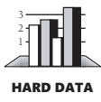

*The scope of most errors is fairly limited* One study found that 85 percent of errors could be corrected without modifying more than one routine (Endres 1975).

*Many errors are outside the domain of construction* Researchers conducting a series of 97 interviews found that the three most common sources of errors were thin application-domain knowledge, fluctuating and conflicting requirements, and communication and coordination breakdown (Curtis, Krasner, and Iscoe 1988).

If you see hoof prints, think horses—not zebras. The OS is probably not broken. And the database is probably just fine.

—*Andy Hunt and Dave Thomas*

*Most construction errors are the programmers' fault* A pair of studies performed many years ago found that, of total errors reported, roughly 95% are caused by programmers, 2% by systems software (the compiler and the operating system), 2% by some other software, and 1% by the hardware (Brown and Sampson 1973, Ostrand and Weyuker 1984). Systems software and development tools are used by many more people today than they were in the 1970s and 1980s, and so my best guess is that, today, an even higher percentage of errors are the programmers' fault.

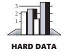

*Clerical errors (typos) are a surprisingly common source of problems* One study found that 36% of all construction errors were clerical mistakes (Weiss 1975). A 1987 study of almost 3 million lines of flight-dynamics software found that 18% of all errors were clerical (Card 1987). Another study found that 4% of all errors were spelling errors in messages (Endres 1975). In one of my programs, a colleague found several spelling errors simply by running all the strings from the executable file through a spelling checker. Attention to detail counts. If you doubt that, consider that three of the most expensive software errors of all time—costing \$1.6 billion, \$900 million, and \$245 million—involved the change of a *single character* in a previously correct program (Weinberg 1983).

*Misunderstanding the design is a recurring theme in studies of programmer errors* Beizer's compilation study, for what it's worth, found that 16% of the errors grew out of misinterpretations of the design (Beizer 1990). Another study found that 19% of the errors resulted from misunderstood design (Weiss 1975). It's worthwhile to take the time you need to understand the design thoroughly. Such time doesn't produce immediate dividends—you don't necessarily look like you're working—but it pays off over the life of the project.

*Most errors are easy to fix* About 85% of errors can be fixed in less than a few hours. About 15% can be fixed in a few hours to a few days. And about 1% take longer (Weiss 1975, Ostrand and Weyuker 1984, Grady 1992). This result is supported by Barry Boehm's observation that about 20% of the errors take about 80% of the resources to fix (Boehm 1987b). Avoid as many of the hard errors as you can by doing requirements and design reviews upstream. Handle the numerous small errors as efficiently as you can.

*It's a good idea to measure your own organization's experiences with errors* The diversity of results cited in this section indicates that people in different organizations have tremendously different experiences. That makes it hard to apply other organizations' experiences to yours. Some results go against common intuition; you might need to supplement your intuition with other tools. A good first step is to start measuring your development process so that you know where the problems are.

#### Proportion of Errors Resulting from Faulty Construction

If the data that classifies errors is inconclusive, so is much of the data that attributes errors to the various development activities. One certainty is that construction always results in a significant number of errors. Sometimes people argue that the errors caused by construction are cheaper to fix than the errors caused by requirements or design. Fixing individual construction errors might be cheaper, but the evidence doesn't support such a claim about the total cost.

Here are my conclusions:


- On small projects, construction defects make up the vast bulk of all errors. In one study of coding errors on a small project (1000 lines of code), 75% of defects resulted from coding, compared to 10% from requirements and 15% from design (Jones 1986a). This error breakdown appears to be representative of many small projects.
- Construction defects account for at least 35% of all defects regardless of project size. Although the proportion of construction defects is smaller on large projects, they still account for at least 35% of all defects (Beizer 1990, Jones 2000). Some researchers have reported proportions in the 75% range even on very large projects (Grady 1987). In general, the better the application area is understood, the better the overall architecture is. Errors then tend to be concentrated in detailed design and coding (Basili and Perricone 1984).
- Construction errors, although cheaper to fix than requirements and design errors, are still expensive. A study of two very large projects at Hewlett-Packard found that the average construction defect cost 25–50% as much to fix as the average design error (Grady 1987). When the greater number of construction defects was figured into the overall equation, the total cost to fix construction defects was one to two times as much as the cost attributed to design defects.

Figure 22-2 provides a rough idea of the relationship between project size and the source of errors.

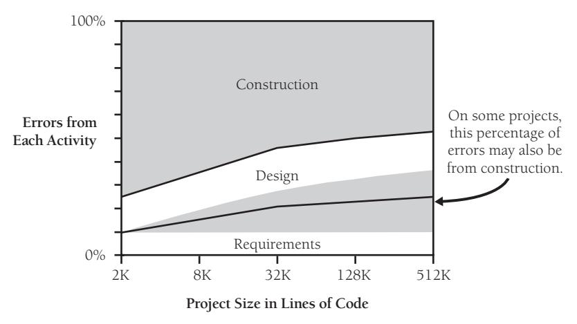

**Figure 22-2** As the size of the project increases, the proportion of errors committed during construction decreases. Nevertheless, construction errors account for 45–75% of all errors on even the largest projects.

#### How Many Errors Should You Expect to Find?

The number of errors you should expect to find varies according to the quality of the development process you use. Here's the range of possibilities:

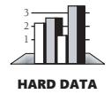

- Industry average experience is about 1–25 errors per 1000 lines of code for delivered software. The software has usually been developed using a hodgepodge of techniques (Boehm 1981, Gremillion 1984, Yourdon 1989a, Jones 1998, Jones 2000, Weber 2003). Cases that have one-tenth as many errors as this are rare; cases that have 10 times more tend not to be reported. (They probably aren't ever completed!)
- The Applications Division at Microsoft experiences about 10–20 defects per 1000 lines of code during in-house testing and 0.5 defects per 1000 lines of code in released product (Moore 1992). The technique used to achieve this level is a combination of the code-reading techniques described in Section 21.4, "Other Kinds of Collaborative Development Practices," and independent testing.
- Harlan Mills pioneered "cleanroom development," a technique that has been able to achieve rates as low as 3 defects per 1000 lines of code during in-house testing and 0.1 defects per 1000 lines of code in released product (Cobb and Mills 1990). A few projects—for example, the space-shuttle software—have achieved a level of 0 defects in 500,000 lines of code by using a system of formal development methods, peer reviews, and statistical testing (Fishman 1996).

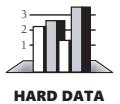

■ Watts Humphrey reports that teams using the Team Software Process (TSP) have achieved defect levels of about 0.06 defects per 1000 lines of code. TSP focuses on training developers not to create defects in the first place (Weber 2003).

The results of the TSP and cleanroom projects confirm another version of the General Principle of Software Quality: it's cheaper to build high-quality software than it is to build and fix low-quality software. Productivity for a fully checked-out, 80,000-line cleanroom project was 740 lines of code per work-month. The industry average rate for fully checked-out code is closer to 250–300 lines per work-month, including all noncoding overhead (Cusumano et al 2003). The cost savings and productivity come from the fact that virtually no time is devoted to debugging on TSP or cleanroom projects. No time spent on debugging? That is truly a worthy goal!

#### Errors in Testing Itself

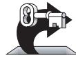

KEY POINT

You may have had an experience like this: The software is found to be in error. You have a few immediate hunches about which part of the code might be wrong, but all that code seems to be correct. You run several more test cases to try to refine the error, but all the new test cases produce correct results. You spend several hours reading and rereading the code and hand-calculating the results. They all check out. After a few more hours, something causes you to reexamine the test data. Eureka! The error's in the test data! How idiotic it feels to waste hours tracking down an error in the test data rather than in the code!

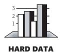

This is a common experience. Test cases are often as likely or more likely to contain errors than the code being tested (Weiland 1983, Jones 1986a, Johnson 1994). The reasons are easy to find—especially when the developer writes the test cases. Test cases tend to be created on the fly rather than through a careful design and construction process. They are often viewed as one-time tests and are developed with the care commensurate with something to be thrown away.

You can do several things to reduce the number of errors in your test cases:

*Check your work* Develop test cases as carefully as you develop code. Such care certainly includes double-checking your own testing. Step through test code in a debugger, line by line, just as you would production code. Walk-throughs and inspections of test data are appropriate.

*Plan test cases as you develop your software* Effective planning for testing should start at the requirements stage or as soon as you get the assignment for the program. This helps to avoid test cases based on mistaken assumptions.

*Keep your test cases* Spend a little quality time with your test cases. Save them for regression testing and for work on version 2. It's easy to justify the trouble if you know you're going to keep them rather than throw them away.

*Plug unit tests into a test framework* Write code for unit tests first, but integrate them into a systemwide test framework (like JUnit) as you complete each test. Having an integrated test framework prevents the tendency, just mentioned, to throw away test cases.

#### 22.5 Test-Support Tools

This section surveys the kinds of testing tools you can buy commercially or build yourself. It won't name specific products because they could easily be out of date by the time you read this. Refer to your favorite programmer's magazine for the most recent specifics.

#### Building Scaffolding to Test Individual Classes

The term "scaffolding" comes from building construction. Scaffolding is built so that workers can reach parts of a building they couldn't reach otherwise. Software scaffolding is built for the sole purpose of making it easy to exercise code.

**Further Reading** For several good examples of scaffolding, see Jon Bentley's essay "A Small Matter of Programming" in *Programming Pearls*, 2d ed. (2000).

One kind of scaffolding is a class that's dummied up so that it can be used by another class that's being tested. Such a class is called a "mock object" or "stub object" (Mackinnon, Freemand, and Craig 2000; Thomas and Hunt 2002). A similar approach can be used with low-level routines, which are called "stub routines." You can make a mock object or stub routines more or less realistic, depending on how much veracity you need. In these cases, the scaffolding can

- Return control immediately, having taken no action.
- Test the data fed to it.
- Print a diagnostic message, perhaps an echo of the input parameters, or log a message to a file.
- Get return values from interactive input.
- Return a standard answer regardless of the input.
- Burn up the number of clock cycles allocated to the real object or routine.
- Function as a slow, fat, simple, or less accurate version of the real object or routine.

Another kind of scaffolding is a fake routine that calls the real routine being tested. This is called a "driver" or, sometimes, a "test harness." This scaffolding can

- Call the object with a fixed set of inputs.
- Prompt for input interactively and call the object with it.
- Take arguments from the command line (in operating systems that support it) and call the object.
- Read arguments from a file and call the object.
- Run through predefined sets of input data in multiple calls to the object.

**Cross-Reference** The line between testing tools and debugging tools is fuzzy. For details on debugging tools, see Section 23.5, "Debugging Tools—Obvious and Not-So-Obvious."

A final kind of scaffolding is the dummy file, a small version of the real thing that has the same types of components that a full-size file has. A small dummy file offers a couple of advantages. Because it's small, you can know its exact contents and can be reasonably sure that the file itself is error-free. And because you create it specifically for testing, you can design its contents so that any error in using it is conspicuous.

**cc2e.com/2268** Obviously, building scaffolding requires some work, but if an error is ever detected in a class, you can reuse the scaffolding. And numerous tools exist to streamline creation of mock objects and other scaffolding. If you use scaffolding, the class can also be tested without the risk of its being affected by interactions with other classes. Scaffolding is particularly useful when subtle algorithms are involved. It's easy to get stuck in a rut in which it takes several minutes to execute each test case because the code being exercised is embedded in other code. Scaffolding allows you to exercise the code directly. The few minutes that you spend building scaffolding to exercise the deeply buried code can save hours of debugging time.

> You can use any of the numerous test frameworks available to provide scaffolding for your programs (JUnit, CppUnit, NUnit, and so on). If your environment isn't supported by one of the existing test frameworks, you can write a few routines in a class and include a *main()* scaffolding routine in the file to test the class, even though the routines being tested aren't intended to stand by themselves. The *main()* routine can read arguments from the command line and pass them to the routine being tested so that you can exercise the routine on its own before integrating it with the rest of the program. When you integrate the code, leave the routines and the scaffolding code that exercises them in the file and use preprocessor commands or comments to deactivate the scaffolding code. Since it's preprocessed out, it doesn't affect the executable code, and since it's at the bottom of the file, it's not in the way visually. No harm is done by leaving it in. It's there if you need it again, and it doesn't burn up the time it would take to remove and archive it.

#### Diff Tools

**Cross-Reference** For details on regression testing, see "Retesting (Regression Testing)" in Section 22.6.

Regression testing, or retesting, is a lot easier if you have automated tools to check the actual output against the expected output. One easy way to check printed output is to redirect the output to a file and use a file-comparison tool such as diff to compare the new output against the expected output that was sent to a file previously. If the outputs aren't the same, you have detected a regression error.

#### Test-Data Generators

**cc2e.com/2275** You can also write code to exercise selected pieces of a program systematically. A few years ago, I developed a proprietary encryption algorithm and wrote a file-encryption program to use it. The intent of the program was to encode a file so that it could be

decoded only with the right password. The encryption didn't just change the file superficially; it altered the entire contents. It was critical that the program be able to decode a file properly, because the file would be ruined otherwise.

I set up a test-data generator that fully exercised the encryption and decryption parts of the program. It generated files of random characters in random sizes, from 0K through 500K. It generated passwords of random characters in random lengths from 1 through 255. For each random case, it generated two copies of the random file, encrypted one copy, reinitialized itself, decrypted the copy, and then compared each byte in the decrypted copy to the unaltered copy. If any bytes were different, the generator printed all the information I needed to reproduce the error.

I weighted the test cases toward the average length of my files, 30K, which was considerably shorter than the maximum length of 500K. If I had not weighted the test cases toward a shorter length, file lengths would have been uniformly distributed between 0K and 500K. The average tested file length would have been 250K. The shorter average length meant that I could test more files, passwords, end-of-file conditions, odd file lengths, and other circumstances that might produce errors than I could have with uniformly random lengths.

The results were gratifying. After running only about 100 test cases, I found two errors in the program. Both arose from special cases that might never have shown up in practice, but they were errors nonetheless and I was glad to find them. After fixing them, I ran the program for weeks, encrypting and decrypting over 100,000 files without an error. Given the range in file contents, lengths, and passwords I tested, I could confidently assert that the program was correct.

Here are some lessons from this story:

- Properly designed random-data generators can generate unusual combinations of test data that you wouldn't think of.
- Random-data generators can exercise your program more thoroughly than you can.
- You can refine randomly generated test cases over time so that they emphasize a realistic range of input. This concentrates testing in the areas most likely to be exercised by users, maximizing reliability in those areas.
- Modular design pays off during testing. I was able to pull out the encryption and decryption code and use it independently of the user-interface code, making the job of writing a test driver straightforward.
- You can reuse a test driver if the code it tests ever has to be changed. Once I had corrected the two early errors, I was able to start retesting immediately.

#### Coverage Monitors

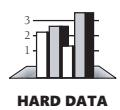

**cc2e.com/2282** Karl Wiegers reports that testing done without measuring code coverage typically exercises only about 50–60% of the code (Wiegers 2002). A coverage monitor is a tool that keeps track of the code that's exercised and the code that isn't. A coverage monitor is especially useful for systematic testing because it tells you whether a set of test cases fully exercises the code. If you run your full set of test cases and the coverage monitor indicates that some code still hasn't been executed, you know that you need more tests.

#### Data Recorder/Logging

Some tools can monitor your program and collect information on the program's state in the event of a failure—similar to the "black box" that airplanes use to diagnose crash results. Strong logging aids error diagnosis and supports effective service after the software has been released.

You can build your own data recorder by logging significant events to a file. Record the system state prior to an error and details of the exact error conditions. This functionality can be compiled into the development version of the code and compiled out of the released version. Alternatively, if you implement logging with self-pruning storage and thoughtful placement and content of error messages, you can include logging functions in release versions.

#### Symbolic Debuggers

**Cross-Reference** The availability of debuggers varies according to the maturity of the technology environment. For more on this phenomenon, see Section 4.3, "Your Location on the Technology Wave."

A symbolic debugger is a technological supplement to code walk-throughs and inspections. A debugger has the capacity to step through code line by line, keep track of variables' values, and always interpret the code the same way the computer does. The process of stepping through a piece of code in a debugger and watching it work is enormously valuable.

Walking through code in a debugger is in many respects the same process as having other programmers step through your code in a review. Neither your peers nor the debugger has the same blind spots that you do. The additional benefit with a debugger is that it's less labor-intensive than a team review. Watching your code execute under a variety of input-data sets is good assurance that you've implemented the code you intended to.

A good debugger is even a good tool for learning about your language because you can see exactly how the code executes. You can toggle back and forth between a view of your high-level language code and a view of the assembler code to see how the high-level code is translated into assembler. You can watch registers and the stack to see how arguments are passed. You can look at code your compiler has

optimized to see the kinds of optimizations that are performed. None of these benefits has much to do with the debugger's intended use—diagnosing errors that have already been detected—but imaginative use of a debugger produces benefits far beyond its initial charter.

#### System Perturbers

**cc2e.com/2289** Another class of test-support tools are designed to perturb a system. Many people have stories of programs that work 99 times out of 100 but fail on the hundredth runthrough with the same data. The problem is nearly always a failure to initialize a variable somewhere, and it's usually hard to reproduce because 99 times out of 100 the uninitialized variable happens to be *0*.

Test-support tools in this class have a variety of capabilities:

- **Memory filling** You want to be sure you don't have any uninitialized variables. Some tools fill memory with arbitrary values before you run your program so that uninitialized variables aren't set to *0* accidentally. In some cases, the memory might be set to a specific value. For example, on the x86 processor, the value *0xCC* is the machine-language code for a breakpoint interrupt. If you fill memory with *0xCC* and have an error that causes you to execute something you shouldn't, you'll hit a breakpoint in the debugger and detect the error.
- **Memory shaking** In multitasking systems, some tools can rearrange memory as your program operates so that you can be sure you haven't written any code that depends on data being in absolute rather than relative locations.
- **Selective memory failing** A memory driver can simulate low-memory conditions in which a program might be running out of memory, fail on a memory request, grant an arbitrary number of memory requests before failing, or fail on an arbitrary number of requests before granting one. This is especially useful for testing complicated programs that work with dynamically allocated memory.
- **Memory-access checking (bounds checking)** Bounds checkers watch pointer operations to make sure your pointers behave themselves. Such a tool is useful for detecting uninitialized or dangling pointers.

#### Error Databases

**cc2e.com/2296** One powerful test tool is a database of errors that have been reported. Such a database is both a management and a technical tool. It allows you to check for recurring errors, track the rate at which new errors are being detected and corrected, and track the status of open and closed errors and their severity. For details on what information you should keep in an error database, see Section 22.7, "Keeping Test Records."

#### 22.6 Improving Your Testing

The steps for improving your testing are similar to the steps for improving any other process. You have to know exactly what the process does so that you can vary it slightly and observe the effects of the variation. When you observe a change that has a positive effect, you modify the process so that it becomes a little better. The following sections describe how to do this with testing.

#### Planning to Test

**Cross-Reference** Part of planning to test is formalizing your plans in writing. To find further information on test documentation, refer to the "Additional Resources" section at the end of Chapter 32.

One key to effective testing is planning from the beginning of the project to test. Putting testing on the same level of importance as design or coding means that time will be allocated to it, it will be viewed as important, and it will be a high-quality process. Test planning is also an element of making the testing process *repeatable*. If you can't repeat it, you can't improve it.

#### Retesting (Regression Testing)

Suppose that you've tested a product thoroughly and found no errors. Suppose that the product is then changed in one area and you want to be sure that it still passes all the tests it did before the change—that the change didn't introduce any new defects. Testing designed to make sure the software hasn't taken a step backward, or "regressed," is called "regression testing."

It's nearly impossible to produce a high-quality software product unless you can systematically retest it after changes have been made. If you run different tests after each change, you have no way of knowing for sure that no new defects have been introduced. Consequently, regression testing must run the same tests each time. Sometimes new tests are added as the product matures, but the old tests are kept too.

#### Automated Testing

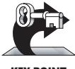

KEY POINT

The only practical way to manage regression testing is to automate it. People become numbed from running the same tests many times and seeing the same test results many times. It becomes too easy to overlook errors, which defeats the purpose of regression testing. Test guru Boriz Beizer reports that the error rate in manual testing is comparable to the bug rate in the code being tested. He estimates that in manual testing, only about half of all the tests are executed properly (Johnson 1994).

Benefits of test automation include the following:

- An automated test has a lower chance of being wrong than a manual test.
- Once you automate a test, it's readily available for the rest of the project with little incremental effort on your part.

- If tests are automated, they can be run frequently to see whether any code checkins have broken the code. Test automation is part of the foundation of test-intensive practices, such as the daily build and smoke test and Extreme Programming.
- Automated tests improve your chances of detecting any given problem at the earliest possible moment, which tends to minimize the work needed to diagnose and correct the problem.
- Automated tests provide a safety net for large-scale code changes because they increase your chance of quickly detecting defects inserted during the modifications.
- Automated tests are especially useful in new, volatile technology environments because they flush out changes in the environments sooner rather than later.

The main tools used to support automated testing provide test scaffolding, generate input, capture output, and compare actual output with expected output. The variety of tools discussed in the preceding section will perform some or all of these functions.

**Cross-Reference** For more on the relationship between technology maturity and development practices, see Section 4.3, "Your Location on the Technology Wave."

#### 22.7 Keeping Test Records

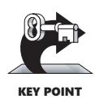

Aside from making the testing process repeatable, you need to measure the project so that you can tell for sure whether changes improve or degrade it. Here are a few kinds of data you can collect to measure your project:

- Administrative description of the defect (the date reported, the person who reported it, a title or description, the build number, the date fixed)
- Full description of the problem
- Steps to take to repeat the problem
- Suggested workaround for the problem
- Related defects
- Severity of the problem—for example, fatal, bothersome, or cosmetic
- Origin of the defect: requirements, design, coding, or testing
- Subclassification of a coding defect: off-by-one, bad assignment, bad array index, bad routine call, and so on
- Classes and routines changed by the fix
- Number of lines of code affected by the defect
- Hours to find the defect
- Hours to fix the defect

Once you collect the data, you can crunch a few numbers to determine whether your project is getting sicker or healthier:

- Number of defects in each class, sorted from worst class to best, possibly normalized by class size
- Number of defects in each routine, sorted from worst routine to best, possibly normalized by routine size
- Average number of testing hours per defect found
- Average number of defects found per test case
- Average number of programming hours per defect fixed
- Percentage of code covered by test cases
- Number of outstanding defects in each severity classification

#### Personal Test Records

In addition to project-level test records, you might find it useful to keep track of your personal test records. These records can include both a checklist of the errors you most commonly make as well as a record of the amount of time you spend writing code, testing code, and correcting errors.

#### Additional Resources

**cc2e.com/2203** Federal truth-in-advising statutes compel me to disclose that several other books cover testing in more depth than this chapter does. Books that are devoted to testing discuss system and black-box testing, which haven't been discussed in this chapter. They also go into more depth on developer topics. They discuss formal approaches such as causeeffect graphing and the ins and outs of establishing an independent test organization.

#### Testing

Kaner, Cem, Jack Falk, and Hung Q. Nguyen. *Testing Computer Software*, 2d ed. New York, NY: John Wiley & Sons, 1999. This is probably the best current book on software testing. It is most applicable to testing applications that will be distributed to a widespread customer base, such as high-volume websites and shrink-wrap applications, but it is also generally useful.

Kaner, Cem, James Bach, and Bret Pettichord. *Lessons Learned in Software Testing*. New York, NY: John Wiley & Sons, 2002. This book is a good supplement to *Testing Computer Software*, 2d ed. It's organized into 11 chapters that enumerate 250 lessons learned by the authors.

Tamre, Louise. *Introducing Software Testing*. Boston, MA: Addison-Wesley, 2002. This is an accessible testing book targeted at developers who need to understand testing. Belying the title, the book goes into some depth on testing details that are useful even to experienced testers.

Whittaker, James A. *How to Break Software: A Practical Guide to Testing*. Boston, MA: Addison-Wesley, 2002. This book lists 23 attacks testers can use to make software fail and presents examples for each attack using popular software packages. You can use this book as a primary source of information about testing or, because its approach is distinctive, you can use it to supplement other testing books.

Whittaker, James A. "What Is Software Testing? And Why Is It So Hard?" *IEEE Software*, January 2000, pp. 70–79. This article is a good introduction to software testing issues and explains some of the challenges associated with effectively testing software.

Myers, Glenford J. *The Art of Software Testing*. New York, NY: John Wiley, 1979. This is the classic book on software testing and is still in print (though quite expensive). The contents of the book are straightforward: A Self-Assessment Test; The Psychology and Economics of Program Testing; Program Inspections, Walkthroughs, and Reviews; Test-Case Design; Class Testing; Higher-Order Testing; Debugging; Test Tools and Other Techniques. It's short (177 pages) and readable. The quiz at the beginning gets you started thinking like a tester and demonstrates how many ways a piece of code can be broken.

#### Test Scaffolding

Bentley, Jon. "A Small Matter of Programming" in *Programming Pearls*, 2d ed. Boston, MA: Addison-Wesley, 2000. This essay includes several good examples of test scaffolding.

Mackinnon, Tim, Steve Freeman, and Philip Craig. "Endo-Testing: Unit Testing with Mock Objects," *eXtreme Programming and Flexible Processes Software Engineering - XP2000" Conference*, 2000. This is the original paper to discuss the use of mock objects to support developer testing.

Thomas, Dave and Andy Hunt. "Mock Objects," *IEEE Software*, May/June 2002. This is a highly readable introduction to using mock objects to support developer testing.

**cc2e.com/2217** *www.junit.org*. This site provides support for developers using JUnit. Similar resources are provided at *cppunit.sourceforge.net* and *nunit.sourceforge.net*.

#### Test First Development

Beck, Kent. *Test-Driven Development: By Example*. Boston, MA: Addison-Wesley, 2003. Beck describes the ins and outs of "test-driven development," a development approach that's characterized by writing test cases first and then writing the code to satisfy the test cases. Despite Beck's sometimes-evangelical tone, the advice is sound, and the book is short and to the point. The book has an extensive running example with real code.

#### Relevant Standards

*IEEE Std 1008-1987 (R1993), Standard for Software Unit Testing*

*IEEE Std 829-1998, Standard for Software Test Documentation*

*IEEE Std 730-2002, Standard for Software Quality Assurance Plans*

#### cc2e.com/2210 CHECKLIST: Test Cases

- ❑ Does each requirement that applies to the class or routine have its own test case?
- ❑ Does each element from the design that applies to the class or routine have its own test case?
- ❑ Has each line of code been tested with at least one test case? Has this been verified by computing the minimum number of tests necessary to exercise each line of code?
- ❑ Have all defined-used data-flow paths been tested with at least one test case?
- ❑ Has the code been checked for data-flow patterns that are unlikely to be correct, such as defined-defined, defined-exited, and defined-killed?
- ❑ Has a list of common errors been used to write test cases to detect errors that have occurred frequently in the past?
- ❑ Have all simple boundaries been tested: maximum, minimum, and off-byone boundaries?
- ❑ Have compound boundaries been tested—that is, combinations of input data that might result in a computed variable that's too small or too large?
- ❑ Do test cases check for the wrong kind of data—for example, a negative number of employees in a payroll program?
- ❑ Are representative, middle-of-the-road values tested?
- ❑ Is the minimum normal configuration tested?
- ❑ Is the maximum normal configuration tested?
- ❑ Is compatibility with old data tested? And are old hardware, old versions of the operating system, and interfaces with old versions of other software tested?
- ❑ Do the test cases make hand-checks easy?

#### Key Points

- Testing by the developer is a key part of a full testing strategy. Independent testing is also important but is outside the scope of this book.
- Writing test cases before the code takes the same amount of time and effort as writing the test cases after the code, but it shortens defect-detection-debug-correction cycles.
- Even considering the numerous kinds of testing available, testing is only one part of a good software-quality program. High-quality development methods, including minimizing defects in requirements and design, are at least as important. Collaborative development practices are also at least as effective at detecting errors as testing, and these practices detect different kinds of errors.
- You can generate many test cases deterministically by using basis testing, dataflow analysis, boundary analysis, classes of bad data, and classes of good data. You can generate additional test cases with error guessing.
- Errors tend to cluster in a few error-prone classes and routines. Find that errorprone code, redesign it, and rewrite it.
- Test data tends to have a higher error density than the code being tested. Because hunting for such errors wastes time without improving the code, testdata errors are more aggravating than programming errors. Avoid them by developing your tests as carefully as your code.
- Automated testing is useful in general and is essential for regression testing.
- In the long run, the best way to improve your testing process is to make it regular, measure it, and use what you learn to improve it.
