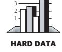
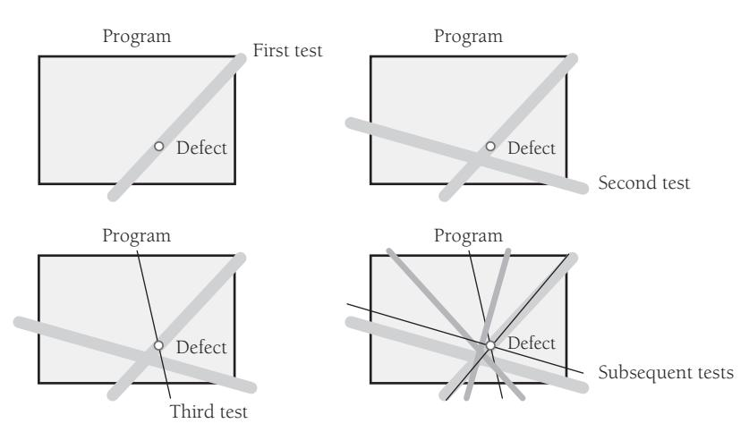
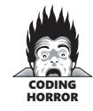
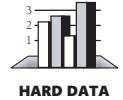
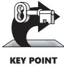

# Chapter 23: Debugging


<span id="page-571-0"></span>
### cc2e.com/2361 Contents

- 23.1 Overview of Debugging Issues: page 535
- 23.2 Finding a Defect: page 540
- 23.3 Fixing a Defect: page 550
- 23.4 Psychological Considerations in Debugging: page 554
- 23.5 Debugging Tools—Obvious and Not-So-Obvious: page 556

#### Related Topics

- The software-quality landscape: Chapter 20
- Developer testing: Chapter 22
- Refactoring: Chapter 24

Debugging is the process of identifying the root cause of an error and correcting it. It contrasts with testing, which is the process of detecting the error initially. On some projects, debugging occupies as much as 50 percent of the total development time. For many programmers, debugging is the hardest part of programming.

Debugging doesn't have to be the hardest part. If you follow the advice in this book, you'll have fewer errors to debug. Most of the defects you'll have will be minor oversights and typos, easily found by looking at a source-code listing or stepping through the code in a debugger. For the remaining harder bugs, this chapter describes how to make debugging much easier than it usually is.

#### Debugging is twice as hard as writing the code in the first place. Therefore, if you write the code as cleverly as possible, you are, by definition, not smart enough to debug it.

—*Brian W. Kernighan*

### 23.1 Overview of Debugging Issues

The late Rear Admiral Grace Hopper, co-inventor of COBOL, always said that the word "bug" in software dated back to the first large-scale digital computer, the Mark I (IEEE 1992). Programmers traced a circuit malfunction to the presence of a large moth that had found its way into the computer, and from that time on, computer problems were blamed on "bugs." Outside software, the word "bug" dates back at least to Thomas Edison, who is quoted as using it as early as 1878 (Tenner 1997).

The word "bug" is a cute word and conjures up images like this one:


The reality of software defects, however, is that bugs aren't organisms that sneak into your code when you forget to spray it with pesticide. They are errors. A bug in software means that a programmer made a mistake. The result of the mistake isn't like the cute picture shown above. It's more likely a note like this one:


In the context of this book, technical accuracy requires that mistakes in the code be called "errors," "defects," or "faults."

#### Role of Debugging in Software Quality

Like testing, debugging isn't a way to improve the quality of your software per se; it's a way to diagnose defects. Software quality must be built in from the start. The best way to build a quality product is to develop requirements carefully, design well, and use high-quality coding practices. Debugging is a last resort.

#### Variations in Debugging Performance

Why talk about debugging? Doesn't everyone know how to debug?


No, not everyone knows how to debug. Studies of experienced programmers have found roughly a 20-to-1 difference in the time it takes experienced programmers to find the same set of defects found by by inexperienced programmers. Moreover, some programmers find more defects and make corrections more accurately. Here are the

| results of a classic study that examined how effectively professional programmers |
|-----------------------------------------------------------------------------------|
| with at least four years of experience debugged a program with 12 defects:        |

|                                                      | Fastest Three<br>Programmers | Slowest Three<br>Programmers |
|------------------------------------------------------|------------------------------|------------------------------|
| Average debug time (minutes)                         | 5.0                          | 14.1                         |
| Average number of defects not found                  | 0.7                          | 1.7                          |
| Average number of defects made correcting<br>defects | 3.0                          | 7.7                          |

Source: "Some Psychological Evidence on How People Debug Computer Programs" (Gould 1975)



The three programmers who were best at debugging were able to find the defects in about one-third the time and inserted only about two-fifths as many new defects as the three who were the worst. The best programmer found all the defects and didn't insert any new defects in correcting them. The worst missed 4 of the 12 defects and inserted 11 new defects in correcting the 8 defects he found.

But this study doesn't really tell the whole story. After the first round of debugging, the fastest three programmers still have 3.7 defects left in their code and the slowest still have 9.4 defects. Neither group is done debugging yet. I wondered what would happen if I applied the same find-and-bad-fix ratios to additional debugging cycles. My results aren't statistically valid, but they're still interesting. When I applied the same find-andbad-fix ratios to successive debugging cycles until each group had less than half a defect remaining, the fastest group required a total of three debugging cycles, whereas the slowest group required 14 debugging cycles. Bearing in mind that each cycle of the slower group takes almost three times as long as each cycle of the fastest group, the slowest group would take about 13 times as long to fully debug its programs as the fastest group, according to my nonscientific extrapolation of this study. This wide variation has been confirmed by other studies (Gilb 1977, Curtis 1981).

**Cross-Reference** For details on the relationship between quality and cost, see Section 20.5, "The General Principle of Software Quality."

In addition to providing insight into debugging, the evidence supports the General Principle of Software Quality: improving quality reduces development costs. The best programmers found the most defects, found the defects most quickly, and made correct modifications most often. You don't have to choose between quality, cost, and time—they all go hand in hand.

#### Defects as Opportunities

What does having a defect mean? Assuming that you don't want the program to have a defect, it means that you don't fully understand what the program does. The idea of not understanding what the program does is unsettling. After all, if you created the program, it should do your bidding. If you don't know exactly what you're telling the computer to do, you're only a small step away from merely trying different things until something seems to work—that is, programming by trial and error. And if you're programming by trial and error, defects are guaranteed. You don't need to learn how to fix defects; you need to learn how to avoid them in the first place.

Most people are somewhat fallible, however, and you might be an excellent programmer who has simply made a modest oversight. If this is the case, an error in your program provides a powerful opportunity for you to learn many things. You can:

*Learn about the program you're working on* You have something to learn about the program because if you already knew it perfectly, it wouldn't have a defect. You would have corrected it already.

**Further Reading** For details on practices that will help you learn about the kinds of errors you are personally prone to, see *A Discipline for Software Engineering*  (Humphrey 1995).

*Learn about the kinds of mistakes you make* If you wrote the program, you inserted the defect. It's not every day that a spotlight exposes a weakness with glaring clarity, but such a day is an opportunity, so take advantage of it. Once you find the mistake, ask yourself how and why you made it. How could you have found it more quickly? How could you have prevented it? Does the code have other mistakes just like it? Can you correct them before they cause problems of their own?

*Learn about the quality of your code from the point of view of someone who has to read it* You'll have to read your code to find the defect. This is an opportunity to look critically at the quality of your code. Is it easy to read? How could it be better? Use your discoveries to refactor your current code or to improve the code you write next.

*Learn about how you solve problems* Does your approach to solving debugging problems give you confidence? Does your approach work? Do you find defects quickly? Or is your approach to debugging weak? Do you feel anguish and frustration? Do you guess randomly? Do you need to improve? Considering the amount of time many projects spend on debugging, you definitely won't waste time if you observe how you debug. Taking time to analyze and change the way you debug might be the quickest way to decrease the total amount of time it takes you to develop a program.

*Learn about how you fix defects* In addition to learning how you find defects, you can learn about how you fix them. Do you make the easiest possible correction by applying *goto* bandages and special-case makeup that changes the symptom but not the problem? Or do you make systemic corrections, demanding an accurate diagnosis and prescribing treatment for the heart of the problem?

All things considered, debugging is an extraordinarily rich soil in which to plant the seeds of your own improvement. It's where all construction roads cross: readability, design, code quality—you name it. This is where building good code pays off, especially if you do it well enough that you don't have to debug very often.

#### An Ineffective Approach

Unfortunately, programming classes in colleges and universities hardly ever offer instruction in debugging. If you studied programming in college, you might have had a lecture devoted to debugging. Although my computer-science education was excellent, the extent of the debugging advice I received was to "put print statements in the program to find the defect." This is not adequate. If other programmers' educational experiences are like mine, a great many programmers are being forced to reinvent debugging concepts on their own. What a waste!

#### The Devil's Guide to Debugging

Programmers do not always use available data to constrain their reasoning. They carry out minor and irrational repairs, and they often don't undo the *incorrect* repairs.

—*Iris Vessey*

In Dante's vision of hell, the lowest circle is reserved for Satan himself. In modern times, Old Scratch has agreed to share the lowest circle with programmers who don't learn to debug effectively. He tortures programmers by making them use these common debugging approaches:

*Find the defect by guessing* To find the defect, scatter print statements randomly throughout a program. Examine the output to see where the defect is. If you can't find the defect with print statements, try changing things in the program until something seems to work. Don't back up the original version of the program, and don't keep a record of the changes you've made. Programming is more exciting when you're not quite sure what the program is doing. Stock up on cola and candy because you're in for a long night in front of the terminal.

*Don't waste time trying to understand the problem* It's likely that the problem is trivial, and you don't need to understand it completely to fix it. Simply finding it is enough.

*Fix the error with the most obvious fix* It's usually good just to fix the specific problem you see, rather than wasting a lot of time making some big, ambitious correction that's going to affect the whole program. This is a perfect example:

```
x = Compute( y )
if ( y = 17 )
 x = $25.15 -- Compute() doesn't work for y = 17, so fix it
```

Who needs to dig all the way into *Compute()* for an obscure problem with the value of *17* when you can just write a special case for it in the obvious place?

#### Debugging by Superstition

Satan has leased part of hell to programmers who debug by superstition. Every group has one programmer who has endless problems with demon machines, mysterious compiler defects, hidden language defects that appear when the moon is full, bad

data, losing important changes, a possessed editor that saves programs incorrectly you name it. This is "programming by superstition."

If you have a problem with a program you've written, it's your fault. It's not the computer's fault, and it's not the compiler's fault. The program doesn't do something different every time. It didn't write itself; you wrote it, so take responsibility for it.


Even if an error at first appears not to be your fault, it's strongly in your interest to assume that it is. That assumption helps you debug. It's hard enough to find a defect in your code when you're looking for it; it's even harder when you assume your code is error-free. Assuming the error is your fault also improves your credibility. If you claim that an error arose from someone else's code, other programmers will believe that you have checked out the problem carefully. If you assume the error is yours, you avoid the embarrassment of having to recant publicly later when you find out that it was your defect after all.

#### 23.2 Finding a Defect

Debugging consists of finding the defect and fixing it. Finding the defect—and understanding it—is usually 90 percent of the work.

Fortunately, you don't have to make a pact with Satan to find an approach to debugging that's better than random guessing. Debugging by thinking about the problem is much more effective and interesting than debugging with an eye of a newt and the dust of a frog's ear.

Suppose you were asked to solve a murder mystery. Which would be more interesting: going door to door throughout the county, checking every person's alibi for the night of October 17, or finding a few clues and deducing the murderer's identity? Most people would rather deduce the person's identity, and most programmers find the intellectual approach to debugging more satisfying. Even better, the effective programmers who debug in one-twentieth the time used by the ineffective programmers aren't randomly guessing about how to fix the program. They're using the scientific method—that is, the process of discovery and demonstration necessary for scientific investigation.

#### The Scientific Method of Debugging

Here are the steps you go through when you use the classic scientific method:

- **1.** Gather data through repeatable experiments.
- **2.** Form a hypothesis that accounts for the relevant data.
- **3.** Design an experiment to prove or disprove the hypothesis.

- **4.** Prove or disprove the hypothesis.
- **5.** Repeat as needed.


The scientific method has many parallels in debugging. Here's an effective approach for finding a defect:

- **1.** Stabilize the error.
- **2.** Locate the source of the error (the "fault").
  - **a.** Gather the data that produces the defect.
  - **b.** Analyze the data that has been gathered, and form a hypothesis about the defect.
  - **c.** Determine how to prove or disprove the hypothesis, either by testing the program or by examining the code.
  - **d.** Prove or disprove the hypothesis by using the procedure identified in 2(c).
- **3.** Fix the defect.
- **4.** Test the fix.
- **5.** Look for similar errors.

The first step is similar to the scientific method's first step in that it relies on repeatability. The defect is easier to diagnose if you can stabilize it—that is, make it occur reliably. The second step uses the steps of the scientific method. You gather the test data that divulged the defect, analyze the data that has been produced, and form a hypothesis about the source of the error. You then design a test case or an inspection to evaluate the hypothesis, and you either declare success (regarding proving your hypothesis) or renew your efforts, as appropriate. When you have proven your hypothesis, you fix the defect, test the fix, and search your code for similar errors.

Let's look at each of the steps in conjunction with an example. Assume that you have an employee database program that has an intermittent error. The program is supposed to print a list of employees and their income-tax withholdings in alphabetical order. Here's part of the output:

| Formatting, Fred Freeform | \$5,877  |
|---------------------------|----------|
| Global, Gary              | \$1,666  |
| Modula, Mildred           | \$10,788 |
| Many-Loop, Mavis          | \$8,889  |
| Statement, Sue Switch     | \$4,000  |
| Whileloop, Wendy          | \$7,860  |

The error is that *Many-Loop, Mavis* and *Modula, Mildred* are out of order.

#### Stabilize the Error

If a defect doesn't occur reliably, it's almost impossible to diagnose. Making an intermittent defect occur predictably is one of the most challenging tasks in debugging.

**Cross-Reference** For details on using pointers safely, see Section 13.2, "Pointers."

An error that doesn't occur predictably is usually an initialization error, a timing issue, or a dangling-pointer problem. If the calculation of a sum is right sometimes and wrong sometimes, a variable involved in the calculation probably isn't being initialized properly—most of the time it just happens to start at *0*. If the problem is a strange and unpredictable phenomenon and you're using pointers, you almost certainly have an uninitialized pointer or are using a pointer after the memory that it points to has been deallocated.

Stabilizing an error usually requires more than finding a test case that produces the error. It includes narrowing the test case to the simplest one that still produces the error. The goal of simplifying the test case is to make it so simple that changing any aspect of it changes the behavior of the error. Then, by changing the test case carefully and watching the program's behavior under controlled conditions, you can diagnose the problem. If you work in an organization that has an independent test team, sometimes it's the team's job to make the test cases simple. Most of the time, it's your job.

To simplify the test case, you bring the scientific method into play again. Suppose you have 10 factors that, used in combination, produce the error. Form a hypothesis about which factors were irrelevant to producing the error. Change the supposedly irrelevant factors, and rerun the test case. If you still get the error, you can eliminate those factors and you've simplified the test. Then you can try to simplify the test further. If you don't get the error, you've disproved that specific hypothesis and you know more than you did before. It might be that some subtly different change would still produce the error, but you know at least one specific change that does not.

In the employee withholdings example, when the program is run initially, *Many-Loop, Mavis* is listed after *Modula, Mildred*. When the program is run a second time, however, the list is fine:

| Formatting, Fred Freeform | \$5,877  |
|---------------------------|----------|
| Global, Gary              | \$1,666  |
| Many-Loop, Mavis          | \$8,889  |
| Modula, Mildred           | \$10,788 |
| Statement, Sue Switch     | \$4,000  |
| Whileloop, Wendy          | \$7,860  |

It isn't until *Fruit-Loop, Frita* is entered and shows up in an incorrect position that you remember that *Modula, Mildred* had been entered just prior to showing up in the wrong spot too. What's odd about both cases is that they were entered singly. Usually, employees are entered in groups.

You hypothesize: the problem has something to do with entering a single new employee. If this is true, running the program again should put *Fruit-Loop, Frita* in the right position. Here's the result of a second run:

| \$5,771  |
|----------|
| \$1,666  |
| \$8,889  |
| \$10,788 |
| \$4,000  |
| \$7,860  |
|          |

This successful run supports the hypothesis. To confirm it, you want to try adding a few new employees, one at a time, to see whether they show up in the wrong order and whether the order changes on the second run.

#### Locate the Source of the Error

Locating the source of the error also calls for using the scientific method. You might suspect that the defect is a result of a specific problem, say an off-by-one error. You could then vary the parameter you suspect is causing the problem—one below the boundary, on the boundary, and one above the boundary—and determine whether your hypothesis is correct.

In the running example, the source of the problem could be an off-by-one defect that occurs when you add one new employee but not when you add two or more. Examining the code, you don't find an obvious off-by-one defect. Resorting to Plan B, you run a test case with a single new employee to see whether that's the problem. You add *Hardcase, Henry* as a single employee and hypothesize that his record will be out of order. Here's what you find:

| Formatting, Fred Freeform | \$5,877  |
|---------------------------|----------|
| Fruit-Loop, Frita         | \$5,771  |
| Global, Gary              | \$1,666  |
| Hardcase, Henry           | \$493    |
| Many-Loop, Mavis          | \$8,889  |
| Modula, Mildred           | \$10,788 |
| Statement, Sue Switch     | \$4,000  |
| Whileloop, Wendy          | \$7,860  |

The line for *Hardcase, Henry* is exactly where it should be, which means that your first hypothesis is false. The problem isn't caused simply by adding one employee at a time. It's either a more complicated problem or something completely different.

Examining the test-run output again, you notice that *Fruit-Loop, Frita* and *Many-Loop, Mavis* are the only names containing hyphens. *Fruit-Loop* was out of order when she was first entered, but *Many-Loop* wasn't, was she? Although you don't have a printout from the original entry, in the original error *Modula, Mildred* appeared to be out of order, but she was next to *Many-Loop*. Maybe *Many-Loop* was out of order and *Modula* was all right. You hypothesize again: the problem arises from names with hyphens, not names that are entered singly.

But how does that account for the fact that the problem shows up only the first time an employee is entered? You look at the code and find that two different sorting routines are used. One is used when an employee is entered, and another is used when the data is saved. A closer look at the routine used when an employee is first entered shows that it isn't supposed to sort the data completely. It only puts the data in approximate order to speed up the save routine's sorting. Thus, the problem is that the data is printed before it's sorted. The problem with hyphenated names arises because the rough-sort routine doesn't handle niceties such as punctuation characters. Now, you can refine the hypothesis even further.

You hypothesize one last time: names with punctuation characters aren't sorted correctly until they're saved.

You later confirm this hypothesis with additional test cases.

#### Tips for Finding Defects

Once you've stabilized an error and refined the test case that produces it, finding its source can be either trivial or challenging, depending on how well you've written your code. If you're having a hard time finding a defect, it could be because the code isn't well written. You might not want to hear that, but it's true. If you're having trouble, consider these tips:

*Use all the data available to make your hypothesis* When creating a hypothesis about the source of a defect, account for as much of the data as you can in your hypothesis. In the example, you might have noticed that *Fruit-Loop, Frita* was out of order and created a hypothesis that names beginning with an "F" are sorted incorrectly. That's a poor hypothesis because it doesn't account for the fact that *Modula, Mildred* was out of order or that names are sorted correctly the second time around. If the data doesn't fit the hypothesis, don't discard the data—ask why it doesn't fit, and create a new hypothesis.

The second hypothesis in the example—that the problem arises from names with hyphens, not names that are entered singly—didn't seem initially to account for the fact that names were sorted correctly the second time around either. In this case, however, the second hypothesis led to a more refined hypothesis that proved to be correct. It's all right that the hypothesis doesn't account for all of the data at first as long as you keep refining the hypothesis so that it does eventually.

*Refine the test cases that produce the error* If you can't find the source of an error, try to refine the test cases further than you already have. You might be able to vary one parameter more than you had assumed, and focusing on one of the parameters might provide the crucial breakthrough.

**Cross-Reference** For more on unit test frameworks, see "Plug unit tests into a test framework" in Section 22.4.

*Exercise the code in your unit test suite* Defects tend to be easier to find in small fragments of code than in large integrated programs. Use your unit tests to test the code in isolation.

*Use available tools* Numerous tools are available to support debugging sessions: interactive debuggers, picky compilers, memory checkers, syntax-directed editors, and so on. The right tool can make a difficult job easy. With one tough-to-find error, for example, one part of the program was overwriting another part's memory. This error was difficult to diagnose using conventional debugging practices because the programmer couldn't determine the specific point at which the program was incorrectly overwriting memory. The programmer used a memory breakpoint to set a watch on a specific memory address. When the program wrote to that memory location, the debugger stopped the code and the guilty code was exposed.

This is an example of a problem that's difficult to diagnose analytically but that becomes quite simple when the right tool is applied.

*Reproduce the error several different ways* Sometimes trying cases that are similar to the error-producing case but not exactly the same is instructive. Think of this approach as triangulating the defect. If you can get a fix on it from one point and a fix on it from another, you can better determine exactly where it is.

As illustrated by Figure 23-1, reproducing an error several different ways helps diagnose the cause of the error. Once you think you've identified the defect, run a case that's close to the cases that produce errors but that should not produce an error itself. If it does produce an error, you don't completely understand the problem yet. Errors often arise from combinations of factors, and trying to diagnose the problem with only one test case often doesn't diagnose the root problem.



**Figure 23-1** Try to reproduce an error several different ways to determine its exact cause.

*Generate more data to generate more hypotheses* Choose test cases that are different from the test cases you already know to be erroneous or correct. Run them to generate more data, and use the new data to add to your list of possible hypotheses.

*Use the results of negative tests* Suppose you create a hypothesis and run a test case to prove it. Suppose further that the test case disproves the hypothesis, so you still don't know the source of the error. You do know something you didn't before namely, that the defect is not in the area you thought it was. That narrows your search field and the set of remaining possible hypotheses.

*Brainstorm for possible hypotheses* Rather than limiting yourself to the first hypothesis you think of, try to come up with several. Don't analyze them at first—just come up with as many as you can in a few minutes. Then look at each hypothesis and think about test cases that would prove or disprove it. This mental exercise is helpful in breaking the debugging logjam that results from concentrating too hard on a single line of reasoning.

*Keep a notepad by your desk, and make a list of things to try* One reason programmers get stuck during debugging sessions is that they go too far down dead-end paths. Make a list of things to try, and if one approach isn't working, move on to the next approach.

*Narrow the suspicious region of the code* If you've been testing the whole program or a whole class or routine, test a smaller part instead. Use print statements, logging, or tracing to identify which section of code is producing the error.

If you need a more powerful technique to narrow the suspicious region of the code, systematically remove parts of the program and see whether the error still occurs. If it doesn't, you know it's in the part you took away. If it does, you know it's in the part you've kept.

Rather than removing regions haphazardly, divide and conquer. Use a binary search algorithm to focus your search. Try to remove about half the code the first time. Determine the half the defect is in, and then divide that section. Again, determine which half contains the defect, and again, chop that section in half. Continue until you find the defect.

If you use many small routines, you'll be able to chop out sections of code simply by commenting out calls to the routines. Otherwise, you can use comments or preprocessor commands to remove code.

If you're using a debugger, you don't necessarily have to remove pieces of code. You can set a breakpoint partway through the program and check for the defect that way instead. If your debugger allows you to skip calls to routines, eliminate suspects by skipping the execution of certain routines and seeing whether the error still occurs. The process with a debugger is otherwise similar to the one in which pieces of a program are physically removed.

**Cross-Reference** For more details on error-prone code, see "Target error-prone modules" in Section 24.5.

*Be suspicious of classes and routines that have had defects before* Classes that have had defects before are likely to continue to have defects. A class that has been troublesome in the past is more likely to contain a new defect than a class that has been defect-free. Reexamine error-prone classes and routines.

*Check code that's changed recently* If you have a new error that's hard to diagnose, it's usually related to code that's changed recently. It could be in completely new code or in changes to old code. If you can't find a defect, run an old version of the program to see whether the error occurs. If it doesn't, you know the error's in the new version or is caused by an interaction with the new version. Scrutinize the differences between the old and new versions. Check the version control log to see what code has changed recently. If that's not possible, use a diff tool to compare changes in the old, working source code to the new, broken source code.

*Expand the suspicious region of the code* It's easy to focus on a small section of code, sure that "the defect *must* be in this section." If you don't find it in the section, consider the possibility that the defect isn't in the section. Expand the area of code you suspect, and then focus on pieces of it by using the binary search technique described earlier.

**Cross-Reference** For a full discussion of integration, see Chapter 29, "Integration."

*Integrate incrementally* Debugging is easy if you add pieces to a system one at a time. If you add a piece to a system and encounter a new error, remove the piece and test it separately.

*Check for common defects* Use code-quality checklists to stimulate your thinking about possible defects. If you're following the inspection practices described in Section 21.3, "Formal Inspections," you'll have your own fine-tuned checklist of the common problems in your environment. You can also use the checklists that appear throughout this book. See the "List of Checklists" following the book's table of contents.

**Cross-Reference** For details on how involving other developers can put a beneficial distance between you and the problem, see Section 21.1, "Overview of Collaborative Development Practices."

*Talk to someone else about the problem* Some people call this "confessional debugging." You often discover your own defect in the act of explaining it to another person. For example, if you were explaining the problem in the salary example, you might sound like this:

*Hey, Jennifer, have you got a minute? I'm having a problem. I've got this list of employee salaries that's supposed to be sorted, but some names are out of order. They're sorted all right the second time I print them out but not the first. I checked to see if it was new names, but I tried some that worked. I know they should be sorted the first time I print them because the program sorts all the names as they're entered and again when they're saved—wait a minute—no, it doesn't sort them when they're entered. That's right. It only orders them roughly. Thanks, Jennifer. You've been a big help.*

Jennifer didn't say a word, and you solved your problem. This result is typical, and this approach is a potent tool for solving difficult defects.

*Take a break from the problem* Sometimes you concentrate so hard you can't think. How many times have you paused for a cup of coffee and figured out the problem on your way to the coffee machine? Or in the middle of lunch? Or on the way home? Or in the shower the next morning? If you're debugging and making no progress, once you've tried all the options, let it rest. Go for a walk. Work on something else. Go home for the day. Let your subconscious mind tease a solution out of the problem.

The auxiliary benefit of giving up temporarily is that it reduces the anxiety associated with debugging. The onset of anxiety is a clear sign that it's time to take a break.

#### Brute-Force Debugging

Brute force is an often-overlooked approach to debugging software problems. By "brute force," I'm referring to a technique that might be tedious, arduous, and timeconsuming but that is *guaranteed* to solve the problem. Which specific techniques are guaranteed to solve a problem are context-dependent, but here are some general candidates:

- Perform a full design and/or code review on the broken code.
- Throw away the section of code and redesign/recode it from scratch.
- Throw away the whole program and redesign/recode it from scratch.
- Compile code with full debugging information.
- Compile code at pickiest warning level and fix all the picky compiler warnings.
- Strap on a unit test harness and test the new code in isolation.
- Create an automated test suite and run it all night.
- Step through a big loop in the debugger manually until you get to the error condition.
- Instrument the code with print, display, or other logging statements.
- Compile the code with a different compiler.
- Compile and run the program in a different environment.
- Link or run the code against special libraries or execution environments that produce warnings when code is used incorrectly.
- Replicate the end-user's full machine configuration.
- Integrate new code in small pieces, fully testing each piece as it's integrated.

*Set a maximum time for quick and dirty debugging* For each brute-force technique, your reaction might well be, "I can't do that—it's too much work!" The point is that it's only too much work if it takes more time than what I call "quick and dirty debugging." It's always tempting to try for a quick guess rather than systematically instrumenting the code and giving the defect no place to hide. The gambler in each of us would rather use a risky approach that might find the defect in five minutes than the sure-fire approach that will find the defect in half an hour. The risk is that if the five-minute approach doesn't work, you get stubborn. Finding the defect the "easy" way becomes a matter of principle, and hours pass unproductively, as do days, weeks, months.... How often have you spent two hours debugging code that took only 30 minutes to write? That's a bad distribution of labor, and you would have been better off to rewrite the code than to debug bad code.

When you decide to go for the quick victory, set a maximum time limit for trying the quick way. If you go past the time limit, resign yourself to the idea that the defect is going to be harder to diagnose than you originally thought, and flush it out the hard way. This approach allows you to get the easy defects right away and the hard defects after a bit longer.

*Make a list of brute-force techniques* Before you begin debugging a difficult error, ask yourself, "If I get stuck debugging this problem, is there some way that I am *guaranteed* to be able to fix the problem?" If you can identify at least one brute-force technique that will fix the problem—including rewriting the code in question—it's less likely that you'll waste hours or days when there's a quicker alternative.

#### Syntax Errors

Syntax-error problems are going the way of the woolly mammoth and the sabertoothed tiger. Compilers are getting better at diagnostic messages, and the days when you had to spend two hours finding a misplaced semicolon in a Pascal listing are almost gone. Here's a list of guidelines you can use to hasten the extinction of this endangered species:

*Don't trust line numbers in compiler messages* When your compiler reports a mysterious syntax error, look immediately before and immediately after the error—the compiler could have misunderstood the problem or could simply have poor diagnostics. Once you find the real defect, try to determine the reason the compiler put the message on the wrong statement. Understanding your compiler better can help you find future defects.

*Don't trust compiler messages* Compilers try to tell you exactly what's wrong, but compilers are dissembling little rascals, and you often have to read between the lines to know what one really means. For example, in UNIX C, you can get a message that says "floating exception" for an integer divide-by-0. With C++'s Standard Template

Library, you can get a pair of error messages: the first message is the real error in the use of the STL; the second message is a message from the compiler saying, "Error message too long for printer to print; message truncated." You can probably come up with many examples of your own.

*Don't trust the compiler's second message* Some compilers are better than others at detecting multiple errors. Some compilers get so excited after detecting the first error that they become giddy and overconfident; they prattle on with dozens of error messages that don't mean anything. Other compilers are more levelheaded, and although they must feel a sense of accomplishment when they detect an error, they refrain from spewing out inaccurate messages. When your compiler generates a series of cascading error messages, don't worry if you can't quickly find the source of the second or third error message. Fix the first one and recompile.

*Divide and conquer* The idea of dividing the program into sections to help detect defects works especially well for syntax errors. If you have a troublesome syntax error, remove part of the code and compile again. You'll either get no error (because the error's in the part you removed), get the same error (meaning you need to remove a different part), or get a different error (because you'll have tricked the compiler into producing a message that makes more sense).

**Cross-Reference** The availability of syntax-directed editors is one characteristic of early-wave vs. maturewave programming environments. For details, see Section 4.3, "Your Location on the Technology Wave."

*Find misplaced comments and quotation marks* Many programming text editors automatically format comments, string literals, and other syntactical elements. In more primitive environments, a misplaced comment or quotation mark can trip up the compiler. To find the extra comment or quotation mark, insert the following sequence into your code in C, C++, and Java:

/\*"/\*\*/

This code phrase will terminate either a comment or string, which is useful in narrowing the space in which the unterminated comment or string is hiding.

#### 23.3 Fixing a Defect

The hard part of debugging is finding the defect. Fixing the defect is the easy part. But as with many easy tasks, the fact that it's easy makes it especially error-prone. At least one study found that defect corrections have more than a 50 percent chance of being wrong the first time (Yourdon 1986b). Here are a few guidelines for reducing the chance of error:


*Understand the problem before you fix it* "The Devil's Guide to Debugging" is right: the best way to make your life difficult and corrode the quality of your program is to fix problems without really understanding them. Before you fix a problem, make sure you understand it to the core. Triangulate the defect both with cases that should reproduce the error and with cases that shouldn't reproduce the error. Keep at it until you understand the problem well enough to predict its occurrence correctly every time.

*Understand the program, not just the problem* If you understand the context in which a problem occurs, you're more likely to solve the problem completely rather than only one aspect of it. A study done with short programs found that programmers who achieve a global understanding of program behavior have a better chance of modifying it successfully than programmers who focus on local behavior, learning about the program only as they need to (Littman et al. 1986). Because the program in this study was small (280 lines), it doesn't prove that you should try to understand a 50,000-line program completely before you fix a defect. It does suggest that you should understand at least the code in the vicinity of the defect correction—the "vicinity" being not a few lines but a few hundred.

*Confirm the defect diagnosis* Before you rush to fix a defect, make sure that you've diagnosed the problem correctly. Take the time to run test cases that prove your hypothesis and disprove competing hypotheses. If you've proven only that the error could be the result of one of several causes, you don't yet have enough evidence to work on the one cause; rule out the others first.

Never debug standing up. —*Gerald Weinberg*

*Relax* A programmer was ready for a ski trip. His product was ready to ship, he was already late, and he had only one more defect to correct. He changed the source file and checked it into version control. He didn't recompile the program and didn't verify that the change was correct.

In fact, the change was not correct, and his manager was outraged. How could he change code in a product that was ready to ship without checking it? What could be worse? Isn't this the pinnacle of professional recklessness?

If this isn't the height of recklessness, it's close and it's common. Hurrying to solve a problem is one of the most time-ineffective things you can do. It leads to rushed judgments, incomplete defect diagnosis, and incomplete corrections. Wishful thinking can lead you to see solutions where there are none. The pressure—often self-imposed encourages haphazard trial-and-error solutions and the assumption that a solution works without verification that it does.

In striking contrast, during the final days of Microsoft Windows 2000 development, a developer needed to fix a defect that was the last remaining defect before a Release Candidate could be created. The developer changed the code, checked his fix, and tested his fix on his local build. But he didn't check the fix into version control at that point. Instead, he went to play basketball. He said, "I'm feeling too stressed right now to be sure that I've considered everything I should consider. I'm going to clear my mind for an hour, and then I'll come back and check in the code—once I've convinced myself that the fix is really correct."

Relax long enough to make sure your solution is right. Don't be tempted to take shortcuts. It might take more time, but it'll probably take less. If nothing else, you'll fix the problem correctly and your manager won't call you back from your ski trip.

**Cross-Reference** General issues involved in changing code are discussed in depth in Chapter 24, "Refactoring." *Save the original source code* Before you begin fixing the defect, be sure to archive a version of the code that you can return to later. It's easy to forget which change in a group of changes is the significant one. If you have the original source code, at least you can compare the old and the new files and see where the changes are.

*Fix the problem, not the symptom* You should fix the symptom too, but the focus should be on fixing the underlying problem rather than wrapping it in programming duct tape. If you don't thoroughly understand the problem, you're not fixing the code. You're fixing the symptom and making the code worse. Suppose you have this code:

```
Java Example of Code That Needs to Be Fixed
for ( claimNumber = 0; claimNumber < numClaims[ client ]; claimNumber++ ) {
 sum[ client ] = sum[ client ] + claimAmount[ claimNumber ];
}
```

Further suppose that when *client* equals *45*, *sum* turns out to be wrong by \$3.45. Here's the wrong way to fix the problem:


```
Java Example of Making the Code Worse by "Fixing" It
for ( claimNumber = 0; claimNumber < numClaims[ client ]; claimNumber++ ) {
 sum[ client ] = sum[ client ] + claimAmount[ claimNumber ];
}
if ( client == 45 ) {
 sum[ 45 ] = sum[ 45 ] + 3.45;
}
```

Here's the "fix."

Now suppose that when *client* equals *37* and the number of claims for the client is *0*, you're not getting *0*. Here's the wrong way to fix the problem:



```
Java Example of Making the Code Worse by "Fixing" It (continued)
                       for ( claimNumber = 0; claimNumber < numClaims[ client ]; claimNumber++ ) {
                        sum[ client ] = sum[ client ] + claimAmount[ claimNumber ];
                       }
                       if ( client == 45 ) {
                        sum[ 45 ] = sum[ 45 ] + 3.45;
                       }
Here's the second "fix." else if ( ( client == 37 ) && ( numClaims[ client ] == 0 ) ) {
                        sum[ 37 ] = 0.0;
                       }
```

If this doesn't send a cold chill down your spine, you won't be affected by anything else in this book either. It's impossible to list all the problems with this approach in a book that's only around 1000 pages long, but here are the top three:

- The fixes won't work most of the time. The problems look as though they're the result of initialization defects. Initialization defects are, by definition, unpredictable, so the fact that the sum for client 45 is off by \$3.45 today doesn't tell you anything about tomorrow. It could be off by \$10,000.02, or it could be correct. That's the nature of initialization defects.
- It's unmaintainable. When code is special-cased to work around errors, the special cases become the code's most prominent feature. The \$3.45 won't always be \$3.45, and another error will show up later. The code will be modified again to handle the new special case, and the special case for \$3.45 won't be removed. The code will become increasingly barnacled with special cases. Eventually the barnacles will be too heavy for the code to support, and the code will sink to the bottom of the ocean—a fitting place for it.
- It uses the computer for something that's better done by hand. Computers are good at predictable, systematic calculations, but humans are better at fudging data creatively. You'd be wiser to treat the output with whiteout and a typewriter than to monkey with the code.

*Change the code only for good reason* Related to fixing symptoms is the technique of changing code at random until it seems to work. The typical line of reasoning goes like this: "This loop seems to contain a defect. It's probably an off-by-one error, so I'll just put a *-1* here and try it. OK. That didn't work, so I'll just put a *+1* in instead. OK. That seems to work. I'll say it's fixed."

As popular as this practice is, it isn't effective. Making changes to code randomly is like rotating a Pontiac Aztek's tires to fix an engine problem. You're not learning anything; you're just goofing around. By changing the program randomly, you say in effect, "I don't know what's happening here, but I'll try this change and hope it works." Don't change code randomly. That's voodoo programming. The more different you make it without understanding it, the less confidence you'll have that it works correctly.

Before you make a change, be confident that it will work. Being wrong about a change should leave you astonished. It should cause self-doubt, personal reevaluation, and deep soul-searching. It should happen rarely.

*Make one change at a time* Changes are tricky enough when they're done one at a time. When done two at a time, they can introduce subtle errors that look like the original errors. Then you're in the awkward position of not knowing whether you didn't correct the error, whether you corrected the error but introduced a new one that looks similar, or whether you didn't correct the error and you introduced a similar new error. Keep it simple: make just one change at a time.

*Check your fix* Check the program yourself, have someone else check it for you, or walk through it with someone else. Run the same triangulation test cases you used to diagnose the problem to make sure that all aspects of the problem have been resolved. If you've solved only part of the problem, you'll find out that you still have work to do.

**Cross-Reference** For details on automated regression testing, see "Retesting (Regression Testing)" in Section 22.6.

Rerun the whole program to check for side effects of your changes. The easiest and most effective way to check for side effects is to run the program through an automated suite of regression tests in JUnit, CppUnit, or equivalent.

*Add a unit test that exposes the defect* When you encounter an error that wasn't exposed by your test suite, add a test case to expose the error so that it won't be reintroduced later.

*Look for similar defects* When you find one defect, look for others that are similar. Defects tend to occur in groups, and one of the values of paying attention to the kinds of defects you make is that you can correct all the defects of that kind. Looking for similar defects requires you to have a thorough understanding of the problem. Watch for the warning sign: if you can't figure out how to look for similar defects, that's a sign that you don't yet completely understand the problem.

#### 23.4 Psychological Considerations in Debugging

**Further Reading** For an excellent discussion of psychological issues in debugging, as well as many other areas of software development, see *The Psychology of Computer Programming* (Weinberg 1998).

Debugging is as intellectually demanding as any other software-development activity. Your ego tells you that your code is good and doesn't have a defect even when you've seen that it has one. You have to think precisely—forming hypotheses, collecting data, analyzing hypotheses, and methodically rejecting them—with a formality that's unnatural to many people. If you're both building code and debugging it, you have to switch quickly between the fluid, creative thinking that goes with design and the rigidly critical thinking that goes with debugging. As you read your code, you have to battle the code's familiarity and guard against seeing what you expect to see.

#### How "Psychological Set" Contributes to Debugging Blindness

When you see a token in a program that says *Num*, what do you see? Do you see a misspelling of the word "Numb"? Or do you see the abbreviation for "Number"? Most likely, you see the abbreviation for "Number." This is the phenomenon of "psychological set"—seeing what you expect to see. What does this sign say?


In this classic puzzle, people often see only one "the." People see what they expect to see. Consider the following:

■ Students learning *while* loops often expect a loop to be continuously evaluated; that is, they expect the loop to terminate as soon as the *while* condition becomes false, rather than only at the top or bottom (Curtis et al. 1986). They expect a *while* loop to act as "while" does in natural language.



- A programmer who unintentionally used both the variable *SYSTSTS* and the variable *SYSSTSTS* thought he was using a single variable. He didn't discover the problem until the program had been run hundreds of times and a book was written containing the erroneous results (Weinberg 1998).
- A programmer looking at code like this code:

```
if ( x < y ) 
 swap = x;
 x = y;
 y = swap;
sometimes sees code like this code:
if ( x < y ) {
 swap = x;
 x = y;
 y = swap;
```

}

People expect a new phenomenon to resemble similar phenomena they've seen before. They expect a new control construct to work the same as old constructs; programming-langauge *while* statements to work the same as real-life "while" statements; and variable names to be the same as they've been before. You see what you expect to see and thus overlook differences, like the misspelling of the word "language" in the previous sentence.

What does psychological set have to do with debugging? First, it speaks to the importance of good programming practices. Good formatting, commenting, variable names, routine names, and other elements of programming style help structure the programming background so that likely defects appear as variations and stand out.

The second impact of psychological set is in selecting parts of the program to examine when an error is found. Research has shown that the programmers who debug most effectively mentally slice away parts of the program that aren't relevant during debugging (Basili, Selby, and Hutchens 1986). In general, the practice allows excellent programmers to narrow their search fields and find defects more quickly. Sometimes, however, the part of the program that contains the defect is mistakenly sliced away. You spend time scouring a section of code for a defect, and you ignore the section that contains the defect. You took a wrong turn at the fork in the road and need to back up before you can go forward again. Some of the suggestions in Section 23.2's discussion of tips for finding defects are designed to overcome this "debugging blindness."

#### How "Psychological Distance" Can Help

**Cross-Reference** For details on creating variable names that won't be confusing, see Section 11.7, "Kinds of Names to Avoid."

Psychological distance can be defined as the ease with which two items can be differentiated. If you are looking at a long list of words and have been told that they're all about ducks, you could easily mistake "Queck" for "Quack" because the two words look similar. The psychological distance between the words is small. You would be much less likely to mistake "Tuack" for "Quack" even though the difference is only one letter again. "Tuack" is less like "Quack" than "Queck" is because the first letter in a word is more prominent than the one in the middle.

Table 23-1 lists examples of psychological distances between variable names:

**Table 23-1 Examples of Psychological Distance Between Variable Names**

| First Variable | Second Variable | Psychological Distance |
|----------------|-----------------|------------------------|
| stoppt         | stcppt          | Almost invisible       |
| shiftrn        | shiftrm         | Almost none            |
| dcount         | bcount          | Small                  |
| claims1        | claims2         | Small                  |
| product        | sum             | Large                  |

As you debug, be ready for the problems caused by insufficient psychological distance between similar variable names and between similar routine names. As you construct code, choose names with large differences so that you avoid the problem.

#### 23.5 Debugging Tools—Obvious and Not-So-Obvious

**Cross-Reference** The line between testing and debugging tools is fuzzy. See Section 22.5 for more on testing tools and Chapter 30 for more on software-development tools.

You can do much of the detailed, brain-busting work of debugging with debugging tools that are readily available. The tool that will drive the final stake through the heart of the defect vampire isn't yet available, but each year brings an incremental improvement in available capabilities.

#### Source-Code Comparators

A source-code comparator such as Diff is useful when you're modifying a program in response to errors. If you make several changes and need to remove some that you can't quite remember, a comparator can pinpoint the differences and jog your memory. If you discover a defect in a new version that you don't remember in an older version, you can compare the files to determine what changed.

#### Compiler Warning Messages



One of the simplest and most effective debugging tools is your own compiler.

*Set your compiler's warning level to the highest, pickiest level possible, and fix the errors it reports* It's sloppy to ignore compiler errors. It's even sloppier to turn off the warnings so that you can't even see them. Children sometimes think that if they close their eyes and can't see you, they've made you go away. Setting a switch on the compiler to turn off warnings just means you can't see the errors. It doesn't make them go away any more than closing your eyes makes an adult go away.

Assume that the people who wrote the compiler know a great deal more about your language than you do. If they're warning you about something, it usually means you have an opportunity to learn something new about your language. Make the effort to understand what the warning really means.

*Treat warnings as errors* Some compilers let you treat warnings as errors. One reason to use the feature is that it elevates the apparent importance of a warning. Just as setting your watch five minutes fast tricks you into thinking it's five minutes later than it is, setting your compiler to treat warnings as errors tricks you into taking them more seriously. Another reason to treat warnings as errors is that they often affect how your program compiles. When you compile and link a program, warnings typically won't stop the program from linking, but errors typically will. If you want to check warnings before you link, set the compiler switch that treats warnings as errors.

*Initiate projectwide standards for compile-time settings* Set a standard that requires everyone on your team to compile code using the same compiler settings. Otherwise, when you try to integrate code compiled by different people with different settings, you'll get a flood of error messages and an integration nightmare. This is easy to enforce if you use a project-standard make file or build script.

#### Extended Syntax and Logic Checking

You can use additional tools to check your code more thoroughly than your compiler does. For example, for C programmers, the lint utility painstakingly checks for use of uninitialized variables (writing *=* when you mean *= =*) and similarly subtle problems.

#### Execution Profilers

You might not think of an execution profiler as a debugging tool, but a few minutes spent studying a program profile can uncover some surprising (and hidden) defects.

For example, I had suspected that a memory-management routine in one of my programs was a performance bottleneck. Memory management had originally been a small component using a linearly ordered array of pointers to memory. I replaced the linearly ordered array with a hash table in the expectation that execution time would drop by at least half. But after profiling the code, I found no change in performance at all. I examined the code more closely and found a defect that was wasting a huge amount of time in the allocation algorithm. The bottleneck hadn't been the linearsearch technique; it was the defect. I hadn't needed to optimize the search after all. Examine the output of an execution profiler to satisfy yourself that your program spends a reasonable amount of time in each area.

#### Test Frameworks/Scaffolding

**Cross-Reference** For details on scaffolding, see "Building Scaffolding to Test Individual Classes" in Section 22.5.

As mentioned in Section 23.2 on finding defects, pulling out a troublesome piece of code, writing code to test it, and executing it by itself is often the most effective way to exorcise the demons from an error-prone program.

#### Debuggers

Commercially available debuggers have advanced steadily over the years, and the capabilities available today can change the way you program. Good debuggers allow you to set breakpoints to break when execution reaches a specific line, or the *n*th time it reaches a specific line, or when a global variable changes, or when a variable is assigned a specific value. They allow you to step through code line by line, stepping through or over routines. They allow the program to be executed backwards, stepping back to the point where a defect originated. They allow you to log the execution of specific statements—similar to scattering "I'm here!" print statements throughout a program.

Good debuggers allow full examination of data, including structured and dynamically allocated data. They make it easy to view the contents of a linked list of pointers or a dynamically allocated array. They're intelligent about user-defined data types. They allow you to make ad hoc queries about data, assign new values, and continue program execution.

You can look at the high-level language or the assembly language generated by your compiler. If you're using several languages, the debugger automatically displays the correct language for each section of code. You can look at a chain of calls to routines and quickly view the source code of any routine. You can change parameters to a program within the debugger environment.

The best of today's debuggers also remember debugging parameters (breakpoints, variables being watched, and so on) for each individual program so that you don't have to re-create them for each program you debug.

System debuggers operate at the systems level rather than the applications level so that they don't interfere with the execution of the program being debugged. They're essential when you are debugging programs that are sensitive to timing or the amount of memory available.

An interactive debugger is an outstanding example of what is not needed—it encourages trial-and-error hacking rather than systematic design, and also hides marginal people barely qualified for precision programming. —*Harlan Mills*

Given the enormous power offered by modern debuggers, you might be surprised that anyone would criticize them. But some of the most respected people in computer science recommend not using them. They recommend using your brain and avoiding debugging tools altogether. Their argument is that debugging tools are a crutch and that you find problems faster and more accurately by thinking about them than by relying on tools. They argue that you, rather than the debugger, should mentally execute the program to flush out defects.

Regardless of the empirical evidence, the basic argument against debuggers isn't valid. The fact that a tool can be misused doesn't imply that it should be rejected. You wouldn't avoid taking aspirin merely because it's possible to overdose. You wouldn't avoid mowing your lawn with a power mower just because it's possible to cut yourself. Any other powerful tool can be used or abused, and so can a debugger.


The debugger isn't a substitute for good thinking. But, in some cases, thinking isn't a substitute for a good debugger either. The most effective combination is good thinking and a good debugger.

#### cc2e.com/2368 CHECKLISTS: Debugging Reminders

#### Techniques for Finding Defects

- ❑ Use all the data available to make your hypothesis.
- ❑ Refine the test cases that produce the error.
- ❑ Exercise the code in your unit test suite.
- ❑ Use available tools.
- ❑ Reproduce the error several different ways.
- ❑ Generate more data to generate more hypotheses.
- ❑ Use the results of negative tests.
- ❑ Brainstorm for possible hypotheses.
- ❑ Keep a notepad by your desk, and make a list of things to try.
- ❑ Narrow the suspicious region of the code.
- ❑ Be suspicious of classes and routines that have had defects before.
- ❑ Check code that's changed recently.
- ❑ Expand the suspicious region of the code.

| ❑ | Integrate incrementally.                                                                                                           |
|---|------------------------------------------------------------------------------------------------------------------------------------|
| ❑ | Check for common defects.                                                                                                          |
| ❑ | Talk to someone else about the problem.                                                                                            |
| ❑ | Take a break from the problem.                                                                                                     |
| ❑ | Set a maximum time for quick and dirty debugging.                                                                                  |
| ❑ | Make a list of brute-force techniques, and use them.                                                                               |
|   | Techniques for Syntax Errors                                                                                                       |
| ❑ | Don't trust line numbers in compiler messages.                                                                                     |
| ❑ | Don't trust compiler messages.                                                                                                     |
| ❑ | Don't trust the compiler's second message.                                                                                         |
| ❑ | Divide and conquer.                                                                                                                |
| ❑ | Use a syntax-directed editor to find misplaced comments and quotation<br>marks.                                                    |
|   | Techniques for Fixing Defects                                                                                                      |
| ❑ | Understand the problem before you fix it.                                                                                          |
| ❑ | Understand the program, not just the problem.                                                                                      |
| ❑ | Confirm the defect diagnosis.                                                                                                      |
| ❑ | Relax.                                                                                                                             |
| ❑ | Save the original source code.                                                                                                     |
| ❑ | Fix the problem, not the symptom.                                                                                                  |
| ❑ | Change the code only for good reason.                                                                                              |
| ❑ | Make one change at a time.                                                                                                         |
| ❑ | Check your fix.                                                                                                                    |
| ❑ | Add a unit test that exposes the defect.                                                                                           |
| ❑ | Look for similar defects.                                                                                                          |
|   | General Approach to Debugging                                                                                                      |
| ❑ | Do you use debugging as an opportunity to learn more about your pro<br>gram, mistakes, code quality, and problem-solving approach? |

❑ Do you avoid the trial-and-error, superstitious approach to debugging?

- ❑ Do you assume that errors are your fault?
- ❑ Do you use the scientific method to stabilize intermittent errors?
- ❑ Do you use the scientific method to find defects?
- ❑ Rather than using the same approach every time, do you use several different techniques to find defects?
- ❑ Do you verify that the fix is correct?
- ❑ Do you use compiler warning messages, execution profiling, a test framework, scaffolding, and interactive debugging?

#### Additional Resources

**cc2e.com/2375** The following resources also address debugging:

Agans, David J. *Debugging: The Nine Indispensable Rules for Finding Even the Most Elusive Software and Hardware Problems*. Amacom, 2003. This book provides general debugging principles that can be applied in any language or environment.

Myers, Glenford J. *The Art of Software Testing*. New York, NY: John Wiley & Sons, 1979. Chapter 7 of this classic book is devoted to debugging.

Allen, Eric. *Bug Patterns In Java*. Berkeley, CA: Apress, 2002. This book lays out an approach to debugging Java programs that is conceptually very similar to what is described in this chapter, including "The Scientific Method of Debugging," distinguishing between debugging and testing, and identifying common bug patterns.

The following two books are similar in that their titles suggest they are applicable only to Microsoft Windows and .NET programs, but they both contain discussions of debugging in general, use of assertions, and coding practices that help to avoid bugs in the first place:

Robbins, John. *Debugging Applications for Microsoft .NET and Microsoft Windows*. Redmond, WA: Microsoft Press, 2003.

McKay, Everett N. and Mike Woodring. *Debugging Windows Programs: Strategies, Tools, and Techniques for Visual C++ Programmers*. Boston, MA: Addison-Wesley, 2000.

#### Key Points

- Debugging is a make-or-break aspect of software development. The best approach is to use other techniques described in this book to avoid defects in the first place. It's still worth your time to improve your debugging skills, however, because the difference between good and poor debugging performance is at least 10 to 1.
- A systematic approach to finding and fixing errors is critical to success. Focus your debugging so that each test moves you a step forward. Use the Scientific Method of Debugging.
- Understand the root problem before you fix the program. Random guesses about the sources of errors and random corrections will leave the program in worse condition than when you started.
- Set your compiler warning to the pickiest level possible, and fix the errors it reports. It's hard to fix subtle errors if you ignore the obvious ones.
- Debugging tools are powerful aids to software development. Find them and use them, and remember to use your brain at the same time.
