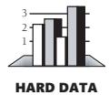
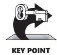
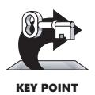
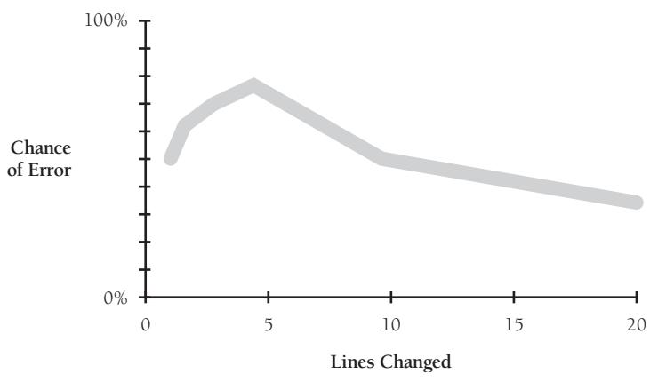
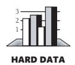
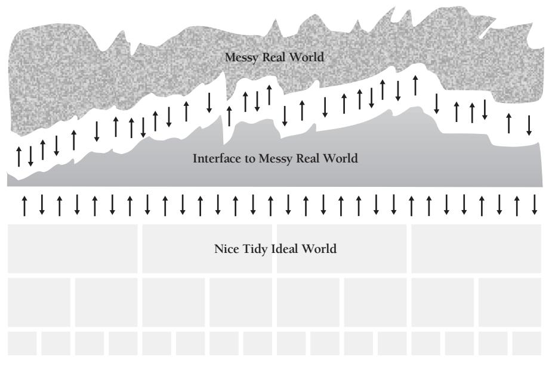
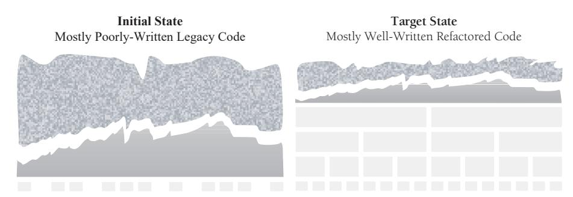

# Chapter 24: Refactoring


<span id="page-599-0"></span>
### cc2e.com/2436 Contents

- 24.1 Kinds of Software Evolution: page 564
- 24.2 Introduction to Refactoring: page 565
- 24.3 Specific Refactorings: page 571
- 24.4 Refactoring Safely: page 579
- 24.5 Refactoring Strategies: page 582

#### Related Topics

- Tips for fixing defects: Section 23.3
- Code-tuning approach: Section 25.6
- Design in construction: Chapter 5
- Working classes: Chapter 6
- High-quality routines: Chapter 7
- Collaborative construction: Chapter 21
- Developer testing: Chapter 22
- Areas likely to change: "Identify Areas Likely to Change" in Section 5.3

All successful software gets changed. —*Fred Brooks*

Myth: a well-managed software project conducts methodical requirements development and defines a stable list of the program's responsibilities. Design follows requirements, and it is done carefully so that coding can proceed linearly, from start to finish, implying that most of the code can be written once, tested, and forgotten. According to the myth, the only time that the code is significantly modified is during the software-maintenance phase, something that happens only after the initial version of a system has been delivered.



Reality: code evolves substantially during its initial development. Many of the changes seen during initial coding are at least as dramatic as changes seen during maintenance. Coding, debugging, and unit testing consume between 30 to 65 percent of the effort on a typical project, depending on the project's size. (See Chapter 27, "How Program Size Affects Construction," for details.) If coding and unit testing were straightforward processes, they would consume no more than 20–30 percent of the total effort on a project. Even on well-managed projects, however, requirements change by about one to four percent per month (Jones 2000). Requirements changes invariably cause corresponding code changes—sometimes substantial code changes.


KEY POINT

Another reality: modern development practices increase the potential for code changes during construction. In older life cycles, the focus—successful or not—was on avoiding code changes. More modern approaches move away from coding predictability. Current approaches are more code-centered, and over the life of a project, you can expect code to evolve more than ever.

#### 24.1 Kinds of Software Evolution

Software evolution is like biological evolution in that some mutations are beneficial and many mutations are not. Good software evolution produces code whose development mimics the ascent from monkeys to Neanderthals to our current exalted state as software developers. Evolutionary forces sometimes beat on a program the other way, however, knocking the program into a deevolutionary spiral.



The key distinction between kinds of software evolution is whether the program's quality improves or degrades under modification. If you fix errors with logical duct tape and superstition, quality degrades. If you treat modifications as opportunities to tighten up the original design of the program, quality improves. If you see that program quality is degrading, that's like that silent canary in a mine shaft I've mentioned before. It's a warning that the program is evolving in the wrong direction.

A second distinction in the kinds of software evolution is the one between changes made during construction and those made during maintenance. These two kinds of evolution differ in several ways. Construction changes are usually made by the original developers, usually before the program has been completely forgotten. The system isn't yet on line, so the pressure to finish changes is only schedule pressure—it's not 500 angry users wondering why their system is down. For the same reason, changes during construction can be more freewheeling—the system is in a more dynamic state, and the penalty for making mistakes is low. These circumstances imply a style of software evolution that's different from what you'd find during software maintenance.

#### Philosophy of Software Evolution

There is no code so big, twisted, or complex that maintenance can't make it worse.

—*Gerald Weinberg*

A common weakness in programmers' approaches to software evolution is that it goes on as an unselfconscious process. If you recognize that evolution during development is an inevitable and important phenomenon and plan for it, you can use it to your advantage.

Evolution is at once hazardous and an opportunity to approach perfection. When you have to make a change, strive to improve the code so that future changes are easier. You never know as much when you begin writing a program as you do afterward. When you have a chance to revise a program, use what you've learned to improve it. Make both your initial code and your changes with further change in mind.



The Cardinal Rule of Software Evolution is that evolution should improve the internal quality of the program. The following sections describe how to accomplish this.

#### 24.2 Introduction to Refactoring

The key strategy in achieving The Cardinal Rule of Software Evolution is refactoring, which Martin Fowler defines as "a change made to the internal structure of the software to make it easier to understand and cheaper to modify without changing its observable behavior" (Fowler 1999). The word "refactoring" in modern programming grew out of Larry Constantine's original use of the word "factoring" in structured programming, which referred to decomposing a program into its constituent parts as much as possible (Yourdon and Constantine 1979).

#### Reasons to Refactor

Sometimes code degenerates under maintenance, and sometimes the code just wasn't very good in the first place. In either case, here are some warning signs —sometimes called "smells" (Fowler 1999)—that indicate where refactorings are needed:

*Code is duplicated* Duplicated code almost always represents a failure to fully factor the design in the first place. Duplicate code sets you up to make parallel modifications—whenever you make changes in one place, you have to make parallel changes in another place. It also violates what Andrew Hunt and Dave Thomas refer to as the "DRY principle": Don't Repeat Yourself (2000). I think David Parnas says it best: "Copy and paste is a design error" (McConnell 1998b).

*A routine is too long* In object-oriented programming, routines longer than a screen are rarely needed and usually represent the attempt to force-fit a structured programming foot into an object-oriented shoe.

One of my clients was assigned the task of breaking up a legacy system's longest routine, which was more than 12,000 lines long. With effort, he was able to reduce the size of the largest routine to only about 4,000 lines.

One way to improve a system is to increase its modularity—increase the number of well-defined, well-named routines that do one thing and do it well. When changes lead you to revisit a section of code, take the opportunity to check the modularity of the routines in that section. If a routine would be cleaner if part of it were made into a separate routine, create a separate routine.

*A loop is too long or too deeply nested* Loop innards tend to be good candidates for being converted into routines, which helps to better factor the code and to reduce the loop's complexity.

*A class has poor cohesion* If you find a class that takes ownership for a hodgepodge of unrelated responsibilities, that class should be broken up into multiple classes, each of which has responsibility for a cohesive set of responsibilities.

*A class interface does not provide a consistent level of abstraction* Even classes that begin life with a cohesive interface can lose their original consistency. Class interfaces tend to morph over time as a result of modifications that are made in the heat of the moment and that favor expediency to interface integrity. Eventually the class interface becomes a Frankensteinian maintenance monster that does little to improve the intellectual manageability of the program.

*A parameter list has too many parameters* Well-factored programs tend to have many small, well-defined routines that don't need large parameter lists. A long parameter list is a warning that the abstraction of the routine interface has not been well thought out.

*Changes within a class tend to be compartmentalized* Sometimes a class has two or more distinct responsibilities. When that happens you find yourself changing either one part of the class or another part of the class—but few changes affect both parts of the class. That's a sign that the class should be cleaved into multiple classes along the lines of the separate responsibilities.

*Changes require parallel modifications to multiple classes* I saw one project that had a checklist of about 15 classes that had to be modified whenever a new kind of output was added. When you find yourself routinely making changes to the same set of classes, that suggests the code in those classes could be rearranged so that changes affect only one class. In my experience, this is a hard ideal to accomplish, but it's nonetheless a good goal.

*Inheritance hierarchies have to be modified in parallel* Finding yourself making a subclass of one class every time you make a subclass of another class is a special kind of parallel modification and should be addressed.

**case** *statements have to be modified in parallel* Although *case* statements are not inherently bad, if you find yourself making parallel modifications to similar *case* statements in multiple parts of the program, you should ask whether inheritance might be a better approach.

*Related data items that are used together are not organized into classes* If you find yourself repeatedly manipulating the same set of data items, you should ask whether those manipulations should be combined into a class of their own.

*A routine uses more features of another class than of its own class* This suggests that the routine should be moved into the other class and then invoked by its old class.

*A primitive data type is overloaded* Primitive data types can be used to represent an infinite number of real-world entities. If your program uses a primitive data type like an integer to represent a common entity such as money, consider creating a simple *Money* class so that the compiler can perform type checking on *Money* variables, so that you can add safety checks on the values assigned to money, and so on. If both *Money* and *Temperature* are integers, the compiler won't warn you about erroneous assignments like *bankBalance = recordLowTemperature*.

*A class doesn't do very much* Sometimes the result of refactoring code is that an old class doesn't have much to do. If a class doesn't seem to be carrying its weight, ask if you should assign all of that class's responsibilities to other classes and eliminate the class altogether.

*A chain of routines passes tramp data* Finding yourself passing data to one routine just so that routine can pass it to another routine is called "tramp data" (Page-Jones 1988). This might be OK, but ask yourself whether passing the specific data in question is consistent with the abstraction presented by each of the routine interfaces. If the abstraction for each routine is OK, passing the data is OK. If not, find some way to make each routine's interface more consistent.

*A middleman object isn't doing anything* If you find that most of the code in a class is just passing off calls to routines in other classes, consider whether you should eliminate the middleman and call those other classes directly.

*One class is overly intimate with another* Encapsulation (information hiding) is probably the strongest tool you have to make your program intellectually manageable and to minimize ripple effects of code changes. Anytime you see one class that knows more about another class than it should—including derived classes knowing too much about their parents—err on the side of stronger encapsulation rather than weaker.

*A routine has a poor name* If a routine has a poor name, change the name of the routine where it's defined, change the name in all places it's called, and then recompile. As hard as it might be to do this now, it will be even harder later, so do it as soon as you notice it's a problem.

*Data members are public* Public data members are, in my view, always a bad idea. They blur the line between interface and implementation, and they inherently violate encapsulation and limit future flexibility. Strongly consider hiding public data members behind access routines.

*A subclass uses only a small percentage of its parents' routines* Typically this indicates that that subclass has been created because a parent class happened to contain the routines it needed, not because the subclass is logically a descendent of the superclass. Consider achieving better encapsulation by switching the subclass's relationship to its superclass from an is-a relationship to a has-a relationship; convert the

superclass to member data of the former subclass, and expose only the routines in the former subclass that are really needed.

*Comments are used to explain difficult code* Comments have an important role to play, but they should not be used as a crutch to explain bad code. The age-old wisdom is dead-on: "Don't document bad code—rewrite it" (Kernighan and Plauger 1978).

**Cross-Reference** For guidelines on the use of global variables, see Section 13.3, "Global Data." For an explanation of the differences between global data and class data, see "Class data mistaken for global data" in Section 5.3.

*Global variables are used* When you revisit a section of code that uses global variables, take time to reexamine them. You might have thought of a way to avoid using global variables since the last time you visited that part of the code. Because you're less familiar with the code than when you first wrote it, you might now find the global variables sufficiently confusing that you're willing to develop a cleaner approach. You might also have a better sense of how to isolate global variables in access routines and a keener sense of the pain caused by not doing so. Bite the bullet and make the beneficial modifications. The initial coding will be far enough in the past that you can be objective about your work yet close enough that you will remember most of what you need to make the revisions correctly. The time during early revisions is the perfect time to improve the code.

*A routine uses setup code before a routine call or takedown code after a routine call*  Code like this should be a warning to you:

```
Bad C++ Example of Setup and Takedown Code for a Routine Call
This setup code is a 
warning.
                        WithdrawalTransaction withdrawal;
                        withdrawal.SetCustomerId( customerId );
                        withdrawal.SetBalance( balance );
                        withdrawal.SetWithdrawalAmount( withdrawalAmount );
                        withdrawal.SetWithdrawalDate( withdrawalDate );
                        ProcessWithdrawal( withdrawal );
This takedown code is 
another warning.
                        customerId = withdrawal.GetCustomerId();
                        balance = withdrawal.GetBalance();
                        withdrawalAmount = withdrawal.GetWithdrawalAmount();
                        withdrawalDate = withdrawal.GetWithdrawalDate();
```

A similar warning sign is when you find yourself creating a special constructor for the *WithdrawalTransaction* class that takes a subset of its normal initialization data so that you can write code like this:

```
Bad C++ Example of Setup and Takedown Code for a Method Call
withdrawal = new WithdrawalTransaction( customerId, balance, 
 withdrawalAmount, withdrawalDate );
withdrawal.ProcessWithdrawal();
delete withdrawal;
```

Anytime you see code that sets up for a call to a routine or takes down after a call to a routine, ask whether the routine interface is presenting the right abstraction. In this case, perhaps the parameter list of *ProcessWithdrawal* should be modified to support code like this:

```
Good C++ Example of a Routine That Doesn't Require Setup or Takedown Code
ProcessWithdrawal( customerId, balance, withdrawalAmount, withdrawalDate );
```

Note that the converse of this example presents a similar problem. If you find yourself usually having a *WithdrawalTransaction* object in hand but needing to pass several of its values to a routine like the one shown here, you should also consider refactoring the *ProcessWithdrawal* interface so that it requires the *WithdrawalTransaction* object rather than its individual fields:

```
C++ Example of Code That Requires Several Method Calls
ProcessWithdrawal( withdrawal.GetCustomerId(), withdrawal.GetBalance(), 
 withdrawal.GetWithdrawalAmount(), withdrawal.GetWithdrawalDate() );
```

Any of these approaches can be right, and any can be wrong—it depends on whether the *ProcessWithdrawal()* interface's abstraction is that it expects to have four distinct pieces of data or expects to have a *WithdrawalTransaction* object.

*A program contains code that seems like it might be needed someday* Programmers are notoriously bad at guessing what functionality might be needed someday. "Designing ahead" is subject to numerous predictable problems:

- Requirements for the "design ahead" code haven't been fully developed, which means the programmer will likely guess wrong about those future requirements. The "code ahead" work will ultimately be thrown away.
- If the programmer's guess about the future requirement is pretty close, the programmer still will not generally anticipate all the intricacies of the future requirement. These intricacies undermine the programmer's basic design assumptions, which means the "design ahead" work will have to be thrown away.
- Future programmers who use the "design ahead" code don't know that it was "design ahead" code, or they assume the code works better than it does. They assume that the code has been coded, tested, and reviewed to the same level as the other code. They waste a lot of time building code that uses the "design ahead" code, only to discover ultimately that the "design ahead" code doesn't actually work.
- The additional "design ahead" code creates additional complexity, which calls for additional testing, additional defect correction, and so on. The overall effect is to slow down the project.

Experts agree that the best way to prepare for future requirements is not to write speculative code; it's to make the *currently required* code as clear and straightforward as possible so that future programmers will know what it does and does not do and will make their changes accordingly (Fowler 1999, Beck 2000).

#### cc2e.com/2443 CHECKLIST: Reasons to Refactor

- ❑ Code is duplicated.
- ❑ A routine is too long.
- ❑ A loop is too long or too deeply nested.
- ❑ A class has poor cohesion.
- ❑ A class interface does not provide a consistent level of abstraction.
- ❑ A parameter list has too many parameters.
- ❑ Changes within a class tend to be compartmentalized.
- ❑ Changes require parallel modifications to multiple classes.
- ❑ Inheritance hierarchies have to be modified in parallel.
- ❑ *case* statements have to be modified in parallel.
- ❑ Related data items that are used together are not organized into classes.
- ❑ A routine uses more features of another class than of its own class.
- ❑ A primitive data type is overloaded.
- ❑ A class doesn't do very much.
- ❑ A chain of routines passes tramp data.
- ❑ A middleman object isn't doing anything.
- ❑ One class is overly intimate with another.
- ❑ A routine has a poor name.
- ❑ Data members are public.
- ❑ A subclass uses only a small percentage of its parents' routines.
- ❑ Comments are used to explain difficult code.
- ❑ Global variables are used.
- ❑ A routine uses setup code before a routine call or takedown code after a routine call.
- ❑ A program contains code that seems like it might be needed someday.

#### Reasons Not to Refactor

In common parlance, "refactoring" is used loosely to refer to fixing defects, adding functionality, modifying the design—essentially as a synonym for making any change to the code whatsoever. This common dilution of the term's meaning is unfortunate. Change in itself is not a virtue, but purposeful change, applied with a teaspoonful of discipline, can be the key strategy that supports steady improvement in a program's quality under maintenance and prevents the all-too-familiar software-entropy death spiral.

### 24.3 Specific Refactorings

In this section, I present a catalog of refactorings, many of which I describe by summarizing the more detailed descriptions presented in *Refactoring* (Fowler 1999). I have not, however, attempted to make this catalog exhaustive. In a sense, every case in this book that shows a "bad code" example and a "good code" example is a candidate for becoming a refactoring. In the interest of space, I've focused on the refactorings I personally have found most useful.

#### Data-Level Refactorings

Here are refactorings that improve the use of variables and other kinds of data.

*Replace a magic number with a named constant* If you're using a numeric or string literal like *3.14*, replace that literal with a named constant like *PI*.

*Rename a variable with a clearer or more informative name* If a variable's name isn't clear, change it to a better name. The same advice applies to renaming constants, classes, and routines, of course.

*Move an expression inline* Replace an intermediate variable that was assigned the result of an expression with the expression itself.

*Replace an expression with a routine* Replace an expression with a routine (usually so that the expression isn't duplicated in the code).

*Introduce an intermediate variable* Assign an expression to an intermediate variable whose name summarizes the purpose of the expression.

*Convert a multiuse variable to multiple single-use variables* If a variable is used for more than one purpose—common culprits are *i*, *j*, *temp*, and *x*—create separate variables for each usage, each of which has a more specific name.

*Use a local variable for local purposes rather than a parameter* If an input-only routine parameter is being used as a local variable, create a local variable and use that instead.

*Convert a data primitive to a class* If a data primitive needs additional behavior (including stricter type checking) or additional data, convert the data to an object and add the behavior you need. This can apply to simple numeric types like *Money* and *Temperature*. It can also apply to enumerated types like *Color*, *Shape*, *Country*, or *OutputType*.

*Convert a set of type codes to a class or an enumeration* In older programs, it's common to see associations like

```
const int SCREEN = 0;
const int PRINTER = 1;
const int FILE = 2;
```

Rather than defining standalone constants, create a class so that you can receive the benefits of stricter type checking and set yourself up to provide richer semantics for *OutputType* if you ever need to. Creating an enumeration is sometimes a good alternative to creating a class.

*Convert a set of type codes to a class with subclasses* If the different elements associated with different types might have different behavior, consider creating a base class for the type with subclasses for each type code. For the *OutputType* base class, you might create subclasses like *Screen*, *Printer*, and *File*.

*Change an array to an object* If you're using an array in which different elements are different types, create an object that has a field for each former element of the array.

*Encapsulate a collection* If a class returns a collection, having multiple instances of the collection floating around can create synchronization difficulties. Consider having the class return a read-only collection, and provide routines to add and remove elements from the collection.

*Replace a traditional record with a data class* Create a class that contains the members of the record. Creating a class allows you to centralize error checking, persistence, and other operations that concern the record.

#### Statement-Level Refactorings

Here are refactorings that improve the use of individual statements.

*Decompose a boolean expression* Simplify a boolean expression by introducing wellnamed intermediate variables that help document the meaning of the expression.

*Move a complex boolean expression into a well-named boolean function* If the expression is complicated enough, this refactoring can improve readability. If the expression is used more than once, it eliminates the need for parallel modifications and reduces the chance of error in using the expression.

*Consolidate fragments that are duplicated within different parts of a conditional* If you have the same lines of code repeated at the end of an *else* block that you have at the end of the *if* block, move those lines of code so that they occur after the entire *ifthen-else* block.

*Use* **break** *or* **return** *instead of a loop control variable* If you have a variable within a loop like *done* that's used to control the loop, use *break* or *return* to exit the loop instead.

*Return as soon as you know the answer instead of assigning a return value within nested* **if-then-else** *statements* Code is often easiest to read and least error-prone if you exit a routine as soon as you know the return value. The alternative of setting a return value and then unwinding your way through a lot of logic can be harder to follow.

*Replace conditionals (especially repeated* **case** *statements) with polymorphism* Much of the logic that used to be contained in *case* statements in structured programs can instead be baked into the inheritance hierarchy and accomplished through polymorphic routine calls.

*Create and use null objects instead of testing for null values* Sometimes a null object will have generic behavior or data associated with it, such as referring to a resident whose name is not known as "occupant." In this case, consider moving the responsibility for handling null values out of the client code and into the class—that is, have the *Customer* class define the unknown resident as "occupant" instead of having *Customer*'s client code repeatedly test for whether the customer's name is known and substitute "occupant" if not.

#### Routine-Level Refactorings

Here are refactorings that improve code at the individual-routine level.

*Extract routine/extract method* Remove inline code from one routine, and turn it into its own routine.

*Move a routine's code inline* Take code from a routine whose body is simple and self-explanatory, and move that routine's code inline where it is used.

*Convert a long routine to a class* If a routine is too long, sometimes turning it into a class and then further factoring the former routine into multiple routines will improve readability.

*Substitute a simple algorithm for a complex algorithm* Replace a complicated algorithm with a simpler algorithm.

*Add a parameter* If a routine needs more information from its caller, add a parameter so that that information can be provided.

*Remove a parameter* If a routine no longer uses a parameter, remove it.

*Separate query operations from modification operations* Normally, query operations don't change an object's state. If an operation like *GetTotals()* changes an object's state, separate the query functionality from the state-changing functionality and provide two separate routines.

*Combine similar routines by parameterizing them* Two similar routines might differ only with respect to a constant value that's used within the routine. Combine the routines into one routine, and pass in the value to be used as a parameter.

*Separate routines whose behavior depends on parameters passed in* If a routine executes different code depending on the value of an input parameter, consider breaking the routine into separate routines that can be called separately, without passing in that particular input parameter.

*Pass a whole object rather than specific fields* If you find yourself passing several values from the same object into a routine, consider changing the routine's interface so that it takes the whole object instead.

*Pass specific fields rather than a whole object* If you find yourself creating an object just so that you can pass it to a routine, consider modifying the routine so that it takes specific fields rather than a whole object.

*Encapsulate downcasting* If a routine returns an object, it normally should return the most specific type of object it knows about. This is particularly applicable to routines that return iterators, collections, elements of collections, and so on.

#### Class Implementation Refactorings

Here are refactorings that improve at the class level.

*Change value objects to reference objects* If you find yourself creating and maintaining numerous copies of large or complex objects, change your usage of those objects so that only one master copy exists (the value object) and the rest of the code uses references to that object (reference objects).

*Change reference objects to value objects* If you find yourself performing a lot of reference housekeeping for small or simple objects, change your usage of those objects so that all objects are value objects.

*Replace virtual routines with data initialization* If you have a set of subclasses that vary only according to constant values they return, rather than overriding member routines in the derived classes, have the derived classes initialize the class with appropriate constant values, and then have generic code in the base class that works with those values.

*Change member routine or data placement* Consider making several general changes in an inheritance hierarchy. These changes are normally performed to eliminate duplication in derived classes:

- Pull a routine up into its superclass.
- Pull a field up into its superclass.
- Pull a constructor body up into its superclass. Several other changes are normally made to support specialization in derived classes:
- Push a routine down into its derived classes.
- Push a field down into its derived classes.
- Push a constructor body down into its derived classes.

*Extract specialized code into a subclass* If a class has code that's used by only a subset of its instances, move that specialized code into its own subclass.

*Combine similar code into a superclass* If two subclasses have similar code, combine that code and move it into the superclass.

#### Class Interface Refactorings

Here are refactorings that make for better class interfaces.

*Move a routine to another class* Create a new routine in the target class, and move the body of the routine from the source class into the target class. You can then call the new routine from the old routine.

*Convert one class to two* If a class has two or more distinct areas of responsibility, break the class into multiple classes, each of which has a clearly defined responsibility.

*Eliminate a class* If a class isn't doing much, move its code into other classes that are more cohesive and eliminate the class.

*Hide a delegate* Sometimes Class A calls Class B and Class C, when really Class A should call only Class B and Class B should call Class C. Ask yourself what the right abstraction is for A's interaction with B. If B should be responsible for calling C, have B call C.

*Remove a middleman* If Class A calls Class B and Class B calls Class C, sometimes it works better to have Class A call Class C directly. The question of whether you should delegate to Class B depends on what will best maintain the integrity of Class B's interface. *Replace inheritance with delegation* If a class needs to use another class but wants more control over its interface, make the superclass a field of the former subclass and then expose a set of routines that will provide a cohesive abstraction.

*Replace delegation with inheritance* If a class exposes every public routine of a delegate class (member class), inherit from the delegate class instead of just using the class.

*Introduce a foreign routine* If a class needs an additional routine and you can't modify the class to provide it, you can create a new routine within the client class that provides that functionality.

*Introduce an extension class* If a class needs several additional routines and you can't modify the class, you can create a new class that combines the unmodifiable class's functionality with the additional functionality. You can do that either by subclassing the original class and adding new routines or by wrapping the class and exposing the routines you need.

*Encapsulate an exposed member variable* If member data is public, change the member data to private and expose the member data's value through a routine instead.

*Remove* **Set()** *routines for fields that cannot be changed* If a field is supposed to be set at object creation time and not changed afterward, initialize that field in the object's constructor rather than providing a misleading *Set()* routine.

*Hide routines that are not intended to be used outside the class* If the class interface would be more coherent without a routine, hide the routine.

*Encapsulate unused routines* If you find yourself routinely using only a portion of a class's interface, create a new interface to the class that exposes only those necessary routines. Be sure that the new interface provides a coherent abstraction.

*Collapse a superclass and subclass if their implementations are very similar* If the subclass doesn't provide much specialization, combine it into its superclass.

#### System-Level Refactorings

Here are refactorings that improve code at the whole-system level.

*Create a definitive reference source for data you can't control* Sometimes you have data maintained by the system that you can't conveniently or consistently access from other objects that need to know about that data. A common example is data maintained in a GUI control. In such a case, you can create a class that mirrors the data in the GUI control, and then have both the GUI control and the other code treat that class as the definitive source of that data.

*Change unidirectional class association to bidirectional class association* If you have two classes that need to use each other's features but only one class can know about the other class, change the classes so that they both know about each other.

*Change bidirectional class association to unidirectional class association* If you have two classes that know about each other's features but only one class that really needs to know about the other, change the classes so that one knows about the other but not vice versa.

*Provide a factory method rather than a simple constructor* Use a factory method (routine) when you need to create objects based on a type code or when you want to work with reference objects rather than value objects.

*Replace error codes with exceptions or vice versa* Depending on your error-handling strategy, make sure the code is using the standard approach.

#### cc2e.com/2450 CHECKLIST: Summary of Refactorings

#### Data-Level Refactorings

- ❑ Replace a magic number with a named constant.
- ❑ Rename a variable with a clearer or more informative name.
- ❑ Move an expression inline.
- ❑ Replace an expression with a routine.
- ❑ Introduce an intermediate variable.
- ❑ Convert a multiuse variable to a multiple single-use variables.
- ❑ Use a local variable for local purposes rather than a parameter.
- ❑ Convert a data primitive to a class.
- ❑ Convert a set of type codes to a class or an enumeration.
- ❑ Convert a set of type codes to a class with subclasses.
- ❑ Change an array to an object.
- ❑ Encapsulate a collection.
- ❑ Replace a traditional record with a data class.

#### Statement-Level Refactorings

- ❑ Decompose a boolean expression.
- ❑ Move a complex boolean expression into a well-named boolean function.

❑ Consolidate fragments that are duplicated within different parts of a conditional. ❑ Use *break* or *return* instead of a loop control variable. ❑ Return as soon as you know the answer instead of assigning a return value within nested *if-then-else* statements. ❑ Replace conditionals (especially repeated *case* statements) with polymorphism. ❑ Create and use null objects instead of testing for null values. **Routine-Level Refactorings** ❑ Extract a routine. ❑ Move a routine's code inline. ❑ Convert a long routine to a class. ❑ Substitute a simple algorithm for a complex algorithm. ❑ Add a parameter. ❑ Remove a parameter. ❑ Separate query operations from modification operations. ❑ Combine similar routines by parameterizing them. ❑ Separate routines whose behavior depends on parameters passed in. ❑ Pass a whole object rather than specific fields. ❑ Pass specific fields rather than a whole object. ❑ Encapsulate downcasting. **Class Implementation Refactorings** ❑ Change value objects to reference objects. ❑ Change reference objects to value objects. ❑ Replace virtual routines with data initialization. ❑ Change member routine or data placement. ❑ Extract specialized code into a subclass.

❑ Combine similar code into a superclass.

#### Class Interface Refactorings

- ❑ Move a routine to another class.
- ❑ Convert one class to two.
- ❑ Eliminate a class.
- ❑ Hide a delegate.
- ❑ Remove a middleman.
- ❑ Replace inheritance with delegation.
- ❑ Replace delegation with inheritance.
- ❑ Introduce a foreign routine.
- ❑ Introduce an extension class.
- ❑ Encapsulate an exposed member variable.
- ❑ Remove *Set()* routines for fields that cannot be changed.
- ❑ Hide routines that are not intended to be used outside the class.
- ❑ Encapsulate unused routines.
- ❑ Collapse a superclass and subclass if their implementations are very similar.

#### System-Level Refactorings

- ❑ Create a definitive reference source for data you can't control.
- ❑ Change unidirectional class association to bidirectional class association.
- ❑ Change bidirectional class association to unidirectional class association.
- ❑ Provide a factory routine rather than a simple constructor.
- ❑ Replace error codes with exceptions or vice versa.

#### 24.4 Refactoring Safely

Opening up a working system is more like opening up a human brain and replacing a nerve than opening up a sink and replacing a washer. Would maintenance be easier if it was called "Software Brain Surgery?"

—*Gerald Weinberg*

Refactoring is a powerful technique for improving code quality. Like all powerful tools, refactoring can cause more harm than good if misused. A few simple guidelines can prevent refactoring missteps.

*Save the code you start with* Before you begin refactoring, make sure you can get back to the code you started with. Save a version in your revision control system, or copy the correct files to a backup directory.

*Keep refactorings small* Some refactorings are larger than others, and exactly what constitutes "one refactoring" can be a little fuzzy. Keep the refactorings small so that you fully understand all the impacts of the changes you make. The detailed refactorings described in *Refactoring* (Fowler 1999) provide many good examples of how to do this.

*Do refactorings one at a time* Some refactorings are more complicated than others. For all but the simplest refactorings, do the refactorings one at a time, recompiling and retesting after a refactoring before doing the next one.

*Make a list of steps you intend to take* A natural extension of the Pseudocode Programming Process is to make a list of the refactorings that will get you from Point A to Point B. Making a list helps you keep each change in context.

*Make a parking lot* When you're midway through one refactoring, you'll sometimes find that you need another refactoring. Midway through that refactoring, you find a third refactoring that would be beneficial. For changes that aren't needed immediately, make a "parking lot," a list of the changes that you'd like to make at some point but that don't need to be made right now.

*Make frequent checkpoints* It's easy to find the code suddenly going sideways while you're refactoring. In addition to saving the code you started with, save checkpoints at various steps in a refactoring session so that you can get back to a working program if you code yourself into a dead end.

*Use your compiler warnings* It's easy to make small errors that slip past the compiler. Setting your compiler to the pickiest warning level possible will help catch many errors almost as soon as you type them.

*Retest* Reviews of changed code should be complemented by retests. Of course, this is dependent on having a good set of test cases in the first place. Regression testing and other test topics are described in more detail in Chapter 22, "Developer Testing."

*Add test cases* In addition to retesting with your old tests, add new unit tests to exercise the new code. Remove any test cases that have been made obsolete by the refactorings.

**Cross-Reference** For details on reviews, see Chapter 21, "Collaborative Construction." *Review the changes* If reviews are important the first time through, they are even more important during subsequent modifications. Ed Yourdon reports that programmers typically have more than a 50 percent chance of making an error on their first attempt to make a change (Yourdon 1986b). Interestingly, if programmers work with a substantial portion of the code, rather than just a few lines, the chance of making a correct modification improves, as shown in Figure 24-1. Specifically, as the number of lines changed increases from one to five lines, the chance of making a bad change increases. After that, the chance of making a bad change decreases.



**Figure 24-1** Small changes tend to be more error-prone than larger changes (Weinberg 1983).

Programmers treat small changes casually. They don't desk-check them, they don't have others review them, and they sometimes don't even run the code to verify that the fix works properly.



The moral is simple: treat simple changes as if they were complicated. One organization that introduced reviews for one-line changes found that its error rate went from 55 percent before reviews to 2 percent afterward (Freedman and Weinberg 1982). A telecommunications organization went from 86 percent correct before reviewing code changes to 99.6 percent afterward (Perrott 2004).

*Adjust your approach depending on the risk level of the refactoring* Some refactorings are riskier than others. A refactoring like "Replace a magic number with a named constant" is relatively risk-free. Refactorings that involve class or routine interface changes, database schema changes, or changes to boolean tests, among others, tend to be more risky. For easier refactorings, you might streamline your refactoring process to do more than one refactoring at a time and to simply retest, without going through an official review.

For riskier refactorings, err on the side of caution. Do the refactorings one at a time. Have someone else review the refactoring or use pair programming for that refactoring, in addition to the normal compiler checking and unit tests.

#### Bad Times to Refactor

Refactoring is a powerful technique, but it isn't a panacea and it's subject to a few specific kinds of abuse.

Do not partially write a feature with the intent of refactoring to get it complete later.

—*John Manzo*

*Don't use refactoring as a cover for code and fix* The worst problem with refactoring is how it's misused. Programmers will sometimes say they're refactoring, when all they're really doing is tweaking the code, hoping to find a way to make it work. Refactoring refers to *changes in working code* that do not affect the program's behavior. Programmers who are tweaking broken code aren't refactoring; they're hacking.

A big refactoring is a recipe for disaster. —*Kent Beck*

*Avoid refactoring instead of rewriting* Sometimes code doesn't need small changes—it needs to be tossed out so that you can start over. If you find yourself in a major refactoring session, ask yourself whether instead you should be redesigning and reimplementing that section of code from the ground up.

#### 24.5 Refactoring Strategies

The number of refactorings that would be beneficial to any specific program is essentially infinite. Refactoring is subject to the same law of diminishing returns as other programming activities, and the 80/20 rule applies. Spend your time on the 20 percent of the refactorings that provide 80 percent of the benefit. Consider the following guidelines when deciding which refactorings are most important:

*Refactor when you add a routine* When you add a routine, check whether related routines are well organized. If not, refactor them.

*Refactor when you add a class* Adding a class often brings issues with existing code to the fore. Use this time as an opportunity to refactor other classes that are closely related to the class you're adding.

*Refactor when you fix a defect* Use the understanding you gain from fixing a bug to improve other code that might be prone to similar defects.

**Cross-Reference** For more on error-prone code, see "Which Classes Contain the Most Errors?" in Section 22.4. *Target error-prone modules* Some modules are more error-prone and brittle than others. Is there a section of code that you and everyone else on your team is afraid of? That's probably an error-prone module. Although most people's natural tendency is to avoid these challenging sections of code, targeting these sections for refactoring can be one of the more effective strategies (Jones 2000).

*Target high-complexity modules* Another approach is to focus on modules that have the highest complexity ratings. (See "How to Measure Complexity" in Section 19.6 for details on these metrics.) One classic study found that program quality improved dramatically when maintenance programmers focused their improvement efforts on the modules that had the highest complexity (Henry and Kafura 1984).

*In a maintenance environment, improve the parts you touch* Code that is never modified doesn't need to be refactored. But when you do touch a section of code, be sure you leave it better than you found it.

*Define an interface between clean code and ugly code, and then move code across the interface* The "real world" is often messier than you'd like. The messiness might come from complicated business rules, hardware interfaces, or software interfaces. A common problem with geriatric systems is poorly written production code that must remain operational at all times.

An effective strategy for rejuvenating geriatric production systems is to designate some code as being in the messy real world, some code as being in an idealized new world, and some code as being the interface between the two. Figure 24-2 illustrates this idea.



**Figure 24-2** Your code doesn't have to be messy just because the real world is messy. Conceive your system as a combination of ideal code, interfaces from the ideal code to the messy real world, and the messy real world.

As you work with the system, you can begin moving code across the "real world interface" into a more organized ideal world. When you begin working with a legacy system, the poorly written legacy code might make up nearly all the system. One policy that works well is that anytime you touch a section of messy code, you are required to bring it up to current coding standards, give it clear variable names, and so on—effectively moving it into the ideal world. Over time this can provide for a rapid improvement in a code base, as shown in Figure 24-3.



**Figure 24-3** One strategy for improving production code is to refactor poorly written legacy code as you touch it, so as to move it to the other side of the "interface to the messy real world."

#### cc2e.com/2457 CHECKLIST: Refactoring Safely

- ❑ Is each change part of a systematic change strategy?
- ❑ Did you save the code you started with before beginning refactoring?
- ❑ Are you keeping each refactoring small?
- ❑ Are you doing refactorings one at a time?
- ❑ Have you made a list of steps you intend to take during your refactoring?
- ❑ Do you have a parking lot so that you can remember ideas that occur to you mid-refactoring?
- ❑ Have you retested after each refactoring?
- ❑ Have changes been reviewed if they are complicated or if they affect mission-critical code?
- ❑ Have you considered the riskiness of the specific refactoring and adjusted your approach accordingly?
- ❑ Does the change enhance the program's internal quality rather than degrade it?
- ❑ Have you avoided using refactoring as a cover for code and fix or as an excuse for not rewriting bad code?

#### Additional Resources

**cc2e.com/2464** The process of refactoring has a lot in common with the process of fixing defects. For more on fixing defects, see Section 23.3, "Fixing a Defect." The risks associated with refactoring are similar to the risks associated with code tuning. For more on managing code-tuning risks, see Section 25.6, "Summary of the Approach to Code Tuning."

> Fowler, Martin. *Refactoring: Improving the Design of Existing Code*. Reading, MA: Addison Wesley, 1999. This is the definitive guide to refactoring. It contains detailed discussions of many of the specific refactorings summarized in this chapter, as well as a handful of other refactorings not summarized here. Fowler provides numerous code samples to illustrate how each refactoring is performed step by step.

#### Key Points

- Program changes are a fact of life both during initial development and after initial release.
- Software can either improve or degrade as it's changed. The Cardinal Rule of Software Evolution is that internal quality should improve with code evolution.
- One key to success in refactoring is learning to pay attention to the numerous warning signs or smells that indicate a need to refactor.
- Another key to refactoring success is learning numerous specific refactorings.
- A final key to success is having a strategy for refactoring safely. Some refactoring approaches are better than others.
- Refactoring during development is the best chance you'll get to improve your program, to make all the changes you'll wish you'd made the first time. Take advantage of these opportunities during development!
