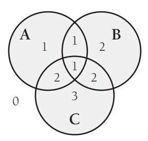
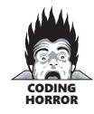

# Chapter 26: Code-Tuning Techniques


<span id="page-645-0"></span>
### cc2e.com/2665 Contents

- 26.1 Logic: page 610
- 26.2 Loops: page 616
- 26.3 Data Transformations: page 624
- 26.4 Expressions: page 630
- 26.5 Routines: page 639
- 26.6 Recoding in a Low-Level Language: page 640
- 26.7 The More Things Change, the More They Stay the Same: page 643

#### Related Topics

- Code-tuning strategies: Chapter 25
- Refactoring: Chapter 24

Code tuning has been a popular topic during most of the history of computer programming. Consequently, once you've decided that you need to improve performance and that you want to do it at the code level (bearing in mind the warnings from Chapter 25, "Code-Tuning Strategies"), you have a rich set of techniques at your disposal.

This chapter focuses on improving speed and includes a few tips for making code smaller. Performance usually refers to both speed and size, but size reductions tend to come more from redesigning classes and data than from tuning code. Code tuning refers to small-scale changes rather than changes in larger-scale designs.

Few of the techniques in this chapter are so generally applicable that you'll be able to copy the example code directly into your programs. The main purpose of the discussion here is to illustrate a handful of code tunings that you can adapt to your situation.

The code-tuning changes described in this chapter might seem cosmetically similar to the refactorings described in Chapter 24, but refactorings are changes that improve a program's internal structure (Fowler 1999). The changes in this chapter might better be called "anti-refactorings." Far from "improving the internal structure," these changes degrade the internal structure in exchange for gains in performance. This is

true by definition. If the changes didn't degrade the internal structure, we wouldn't consider them to be optimizations; we would use them by default and consider them to be standard coding practice.

**Cross-Reference** Code tunings are heuristics. For more on heuristics, see Section 5.3, "Design Building Blocks: Heuristics."

Some books present code-tuning techniques as "rules of thumb" or cite research that suggests that a specific tuning will produce the desired effect. As you'll soon see, the "rules of thumb" concept applies poorly to code tuning. The only reliable rule of thumb is to measure the effect of each tuning in your environment. Thus, this chapter presents a catalog of "things to try," many of which won't work in your environment but some of which will work very well indeed.

#### 26.1 Logic

**Cross-Reference** For other details on using statement logic, see Chapters 14–19.

Much of programming consists of manipulating logic. This section describes how to manipulate logical expressions to your advantage.

#### Stop Testing When You Know the Answer

Suppose you have a statement like

```
if ( 5 < x ) and ( x < 10 ) then ...
```

Once you've determined that *x* is not greater than 5, you don't need to perform the second half of the test.

**Cross-Reference** For more on short-circuit evaluation, see "Knowing How Boolean Expressions Are Evaluated" in Section 19.1.

Some languages provide a form of expression evaluation known as "short-circuit evaluation," which means that the compiler generates code that automatically stops testing as soon as it knows the answer. Short-circuit evaluation is part of C++'s standard operators and Java's "conditional" operators.

If your language doesn't support short-circuit evaluation natively, you have to avoid using *and* and *or*, adding logic instead. With short-circuit evaluation, the code above changes to this:

```
if ( 5 < x ) then
 if ( x < 10 ) then ...
```

The principle of not testing after you know the answer is a good one for many other kinds of cases as well. A search loop is a common case. If you're scanning an array of input numbers for a negative value and you simply need to know whether a negative value is present, one approach is to check every value, setting a *negativeFound* variable when you find one. Here's how the search loop would look:

```
C++ Example of Not Stopping After You Know the Answer
negativeInputFound = false;
for ( i = 0; i < count; i++ ) {
 if ( input[ i ] < 0 ) {
 negativeInputFound = true;
 }
}
```

A better approach would be to stop scanning as soon as you find a negative value. Any of these approaches would solve the problem:

- Add a *break* statement after the *negativeInputFound = true* line.
- If your language doesn't have *break*, emulate a *break* with a *goto* that goes to the first statement after the loop.
- Change the *for* loop to a *while* loop, and check for *negativeInputFound* as well as for incrementing the loop counter past *count*.
- Change the *for* loop to a *while* loop, put a sentinel value in the first array element after the last value entry, and simply check for a negative value in the *while* test. After the loop terminates, see whether the position of the first found value is in the array or one past the end. Sentinels are discussed in more detail later in the chapter.

Here are the results of using the *break* keyword in C++ and Java:

| Language | Straight Time | Code-Tuned Time | Time Savings |
|----------|---------------|-----------------|--------------|
| C++      | 4.27          | 3.68            | 14%          |
| Java     | 4.85          | 3.46            | 29%          |

**Note** (1) Times in this and the following tables in this chapter are given in seconds and are meaningful only for comparisons across rows of each table. Actual times will vary according to the compiler, compiler options used, and the environment in which each test is run. (2) Benchmark results are typically made up of several thousand to many million executions of the code fragments to smooth out the sample-to-sample fluctuations in the results. (3) Specific brands and versions of compilers aren't indicated. Performance characteristics vary significantly from brand to brand and version to version. (4) Comparisons among results from different languages aren't always meaningful because compilers for different languages don't always offer comparable code-generation options. (5) The results shown for interpreted languages (PHP and Python) are typically based on less than 1% of the test runs used for the other languages. (6) Some of the "time savings" percentages might not be exactly reproducible from the data in these tables due to rounding of the "straight time" and "code-tuned time" entries.

The impact of this change varies a great deal depending on how many values you have and how often you expect to find a negative value. This test assumed an average of 100 values and assumed that a negative value would be found 50 percent of the time.

#### Order Tests by Frequency

Arrange tests so that the one that's fastest and most likely to be true is performed first. It should be easy to drop through the normal case, and if there are inefficiencies, they should be in processing the uncommon cases. This principle applies to *case* statements and to chains of *if-then-else*s.

Here's a *Select-Case* statement that responds to keyboard input in a word processor:

```
Visual Basic Example of a Poorly Ordered Logical Test
Select inputCharacter
 Case "+", "="
 ProcessMathSymbol( inputCharacter )
 Case "0" To "9"
 ProcessDigit( inputCharacter )
 Case ",", ".", ":", ";", "!", "?"
 ProcessPunctuation( inputCharacter )
 Case " "
 ProcessSpace( inputCharacter )
 Case "A" To "Z", "a" To "z"
 ProcessAlpha( inputCharacter )
 Case Else
 ProcessError( inputCharacter )
End Select
```

The cases in this *case* statement are ordered in something close to the ASCII sort order. In a *case* statement, however, the effect is often the same as if you had written a big set of *ifthen-elses*, so if you get an *"a"* as an input character, the program tests whether it's a math symbol, a punctuation mark, a digit, or a space before determining that it's an alphabetic character. If you know the likely frequency of your input characters, you can put the most common cases first. Here's the reordered *case* statement:

```
Visual Basic Example of a Well-Ordered Logical Test
Select inputCharacter
 Case "A" To "Z", "a" To "z"
 ProcessAlpha( inputCharacter )
 Case " "
 ProcessSpace( inputCharacter )
 Case ",", ".", ":", ";", "!", "?"
 ProcessPunctuation( inputCharacter )
 Case "0" To "9"
 ProcessDigit( inputCharacter )
 Case "+", "="
 ProcessMathSymbol( inputCharacter )
 Case Else
 ProcessError( inputCharacter )
End Select
```

Because the most common case is usually found sooner in the optimized code, the net effect will be the performance of fewer tests. Following are the results of this optimization with a typical mix of characters:

| Language     | Straight Time | Code-Tuned Time | Time Savings |
|--------------|---------------|-----------------|--------------|
| C#           | 0.220         | 0.260           | -18%         |
| Java         | 2.56          | 2.56            | 0%           |
| Visual Basic | 0.280         | 0.260           | 7%           |

Note: Benchmarked with an input mix of 78 percent alphabetic characters, 17 percent spaces, and 5 percent punctuation symbols.

The Microsoft Visual Basic results are as expected, but the Java and C# results are not as expected. Apparently that's because of the way *switch-case* statements are structured in C# and Java—because each value must be enumerated individually rather than in ranges, the C# and Java code doesn't benefit from the optimization as the Visual Basic code does. This result underscores the importance of not following any optimization advice blindly—specific compiler implementations will significantly affect the results.

You might assume that the code generated by the Visual Basic compiler for a set of *ifthen-else*s that perform the same test as the *case* statement would be similar. Take a look at those results:

| Language     | Straight Time | Code-Tuned Time | Time Savings |
|--------------|---------------|-----------------|--------------|
| C#           | 0.630         | 0.330           | 48%          |
| Java         | 0.922         | 0.460           | 50%          |
| Visual Basic | 1.36          | 1.00            | 26%          |

The results are quite different. For the same number of tests, the Visual Basic compiler takes about five times as long in the unoptimized case, four times in the optimized case. This suggests that the compiler is generating different code for the *case* approach than for the *if-then-else* approach.

The improvement with *if-then-else*s is more consistent than it was with the *case* statements, but that's a mixed blessing. In C# and Visual Basic, both versions of the *case* statement approach are faster than both versions of the *if-then-else* approach, whereas in Java both versions are slower. This variation in results suggests a third possible optimization, described in the next section.

#### Compare Performance of Similar Logic Structures

The test described above could be performed using either a *case* statement or *if-thenelse*s. Depending on the environment, either approach might work better. Here is the data from the preceding two tables reformatted to present the "code-tuned" times comparing *if-then-else* and *case* performance:

| Language     | case  | if-then-else | Time Savings | Performance Ratio |
|--------------|-------|--------------|--------------|-------------------|
| C#           | 0.260 | 0.330        | -27%         | 1:1               |
| Java         | 2.56  | 0.460        | 82%          | 6:1               |
| Visual Basic | 0.260 | 1.00         | -258%        | 1:4               |

These results defy any logical explanation. In one of the languages, *case* is dramatically superior to *if-then-else*, and in another, *if-then-else* is dramatically superior to *case*. In the third language, the difference is relatively small. You might think that because C# and Java share similar syntax for *case* statements, their results would be similar, but in fact their results are opposite each other.

This example clearly illustrates the difficulty of performing any sort of "rule of thumb" or "logic" to code tuning—there is simply no reliable substitute for *measuring* results.

#### Substitute Table Lookups for Complicated Expressions

**Cross-Reference** For details on using table lookups to replace complicated logic, see Chapter 18, "Table-Driven Methods."

In some circumstances, a table lookup might be quicker than traversing a complicated chain of logic. The point of a complicated chain is usually to categorize something and then to take an action based on its category. As an abstract example, suppose you want to assign a category number to something based on which of three groups— Groups *A*, *B*, and *C—*it falls into:



This complicated logic chain assigns the category numbers:

```
C++ Example of a Complicated Chain of Logic
if ( ( a && !c ) || ( a && b && c ) ) {
 category = 1;
}
else if ( ( b && !a ) || ( a && c && !b ) ) {
 category = 2;
}
else if ( c && !a && !b ) {
 category = 3;
}
else {
 category = 0;
}
```

You can replace this test with a more modifiable and higher-performance lookup table:

```
C++ Example of Using a Table Lookup to Replace Complicated Logic
                       // define categoryTable
This table definition is 
somewhat difficult to 
understand. Any comment-
ing you can do to make 
table definitions readable 
helps.
                       static int categoryTable[ 2 ][ 2 ][ 2 ] = {
                        // !b!c !bc b!c bc
                        0, 3, 2, 2, // !a
                        1, 2, 1, 1 // a
                       };
                       ...
                       category = categoryTable[ a ][ b ][ c ];
```

Although the definition of the table is hard to read, if it's well documented it won't be any harder to read than the code for the complicated chain of logic was. If the definition changes, the table will be much easier to maintain than the earlier logic would have been. Here are the performance results:

| Language     | Straight Time | Code-Tuned<br>Time | Time<br>Savings | Performance Ratio |
|--------------|---------------|--------------------|-----------------|-------------------|
| C++          | 5.04          | 3.39               | 33%             | 1.5:1             |
| Visual Basic | 5.21          | 2.60               | 50%             | 2:1               |

#### Use Lazy Evaluation

One of my former roommates was a great procrastinator. He justified his laziness by saying that many of the things people feel rushed to do simply don't need to be done. If he waited long enough, he claimed, the things that weren't important would be procrastinated into oblivion and he wouldn't waste his time doing them.

Lazy evaluation is based on the principle my roommate used. If a program uses lazy evaluation, it avoids doing any work until the work is needed. Lazy evaluation is similar to just-in-time strategies that do the work closest to when it's needed.

Suppose, for example, that your program contains a table of 5000 values, generates the whole table at startup time, and then uses it as the program executes. If the program uses only a small percentage of the entries in the table, it might make more sense to compute them as they're needed rather than all at once. Once an entry is computed, it can still be stored for future reference (otherwise known as "cached").

#### 26.2 Loops

**Cross-Reference** For other details on loops, see Chapter 16, "Controlling Loops."

Because loops are executed many times, the hot spots in a program are often inside loops. The techniques in this section make the loop itself faster.

#### Unswitching

Switching refers to making a decision inside a loop every time it's executed. If the decision doesn't change while the loop is executing, you can unswitch the loop by making the decision outside the loop. Usually this requires turning the loop inside out, putting loops inside the conditional rather than putting the conditional inside the loop. Here's an example of a loop before unswitching:

```
C++ Example of a Switched Loop
for ( i = 0; i < count; i++ ) {
 if ( sumType == SUMTYPE_NET ) {
 netSum = netSum + amount[ i ];
 }
 else { 
 grossSum = grossSum + amount[ i ];
 }
}
```

In this code, the test *if ( sumType == SUMTYPE\_NET )* is repeated through each iteration, even though it'll be the same each time through the loop. You can rewrite the code for a speed gain this way:


```
C++ Example of an Unswitched Loop
if ( sumType == SUMTYPE_NET ) {
 for ( i = 0; i < count; i++ ) {
 netSum = netSum + amount[ i ];
 }
}
else { 
 for ( i = 0; i < count; i++ ) {
 grossSum = grossSum + amount[ i ];
 }
}
```

**Note** This code fragment violates several rules of good programming. Readability and maintenance are usually more important than execution speed or size, but in this chapter the topic is performance, and that implies a tradeoff with the other objectives. As in the last chapter, you'll see examples of coding practices here that aren't recommended in other parts of this book.

|  |  | This is good for about a 20 percent time savings: |  |
|--|--|---------------------------------------------------|--|
|  |  |                                                   |  |

| Language     | Straight Time | Code-Tuned Time | Time Savings |
|--------------|---------------|-----------------|--------------|
| C++          | 2.81          | 2.27            | 19%          |
| Java         | 3.97          | 3.12            | 21%          |
| Visual Basic | 2.78          | 2.77            | <1%          |
| Python       | 8.14          | 5.87            | 28%          |

A hazard distinct to this case is that the two loops have to be maintained in parallel. If *count* changes to *clientCount*, you have to remember to change it in both places, which is an annoyance for you and a maintenance headache for anyone else who has to work with the code.

This example also illustrates a key challenge in code tuning: the effect of any specific code tuning is not predictable. The code tuning produced significant improvements in three of the four languages but not in Visual Basic. To perform this specific optimization in this specific version of Visual Basic would produce less maintainable code without any offsetting gain in performance. The general lesson is that you must measure the effect of each specific optimization to be sure of its effect—no exceptions.

#### Jamming

Jamming, or "fusion," is the result of combining two loops that operate on the same set of elements. The gain lies in cutting the loop overhead from two loops to one. Here's a candidate for loop jamming:

```
Visual Basic Example of Separate Loops That Could Be Jammed
For i = 0 to employeeCount - 1
 employeeName( i ) = ""
Next
...
For i = 0 to employeeCount - 1
 employeeEarnings( i ) = 0
Next
```

When you jam loops, you find code in two loops that you can combine into one. Usually, that means the loop counters have to be the same. In this example, both loops run from *0* to *employeeCount - 1*, so you can jam them:

```
Visual Basic Example of a Jammed Loop
For i = 0 to employeeCount - 1
 employeeName( i ) = "" 
 employeeEarnings( i ) = 0
Next
```

Here are the savings:

| Language     | Straight Time | Code-Tuned Time | Time Savings |
|--------------|---------------|-----------------|--------------|
| C++          | 3.68          | 2.65            | 28%          |
| PHP          | 3.97          | 2.42            | 32%          |
| Visual Basic | 3.75          | 3.56            | 4%           |

Note: Benchmarked for the case in which *employeeCount* equals 100.

As before, the results vary significantly among languages.

Loop jamming has two main hazards. First, the indexes for the two parts that have been jammed might change so that they're no longer compatible. Second, you might not be able to combine the loops easily. Before you combine the loops, make sure they'll still be in the right order with respect to the rest of the code.

#### Unrolling

The goal of loop unrolling is to reduce the amount of loop housekeeping. In Chapter 25, a loop was completely unrolled and 10 lines of code were shown to be faster than 3. In that case, the loop that went from 3 to 10 lines was unrolled so that all 10 array accesses were done individually.

Although completely unrolling a loop is a fast solution and works well when you're dealing with a small number of elements, it's not practical when you have a large number of elements or when you don't know in advance how many elements you'll have. Here's an example of a general loop:

```
Normally, you'd probably use 
a for loop for a job like this, 
but to optimize, you'd have 
to convert to a while loop. 
For clarity, a while loop is 
shown here.
```

```
Java Example of a Loop That Can Be Unrolled
i = 0;
while ( i < count ) {
 a[ i ] = i;
 i = i + 1;
}
```

To unroll the loop partially, you handle two or more cases in each pass through the loop instead of one. This unrolling hurts readability but doesn't hurt the generality of the loop. Here's the loop unrolled once:


#### Java Example of a Loop That's Been Unrolled Once

```
i = 0;
while ( i < count - 1 ) {
 a[ i ] = i;
 a[ i + 1 ] = i + 1;
 i = i + 2;
}
if ( i == count - 1) {
```

a[ count - 1 ] = count - 1;

These lines pick up the case that might fall through the cracks if the loop went by twos instead of by ones.

```
}
```

The technique replaced the original *a[ i ] = i* line with two lines, and *i* is incremented by *2* rather than by *1*. The extra code after the *while* loop is needed when *count* is odd and the loop has one iteration left after the loop terminates.

When five lines of straightforward code expand to nine lines of tricky code, the code becomes harder to read and maintain. Except for the gain in speed, its quality is poor. Part of any design discipline, however, is making necessary tradeoffs. So, even though a particular technique generally represents poor coding practice, specific circumstances might make it the best one to use.

Here are the results of unrolling the loop:

| Language | Straight Time | Code-Tuned Time | Time Savings |
|----------|---------------|-----------------|--------------|
| C++      | 1.75          | 1.15            | 34%          |
| Java     | 1.01          | 0.581           | 43%          |
| PHP      | 5.33          | 4.49            | 16%          |
| Python   | 2.51          | 3.21            | -27%         |

Note: Benchmarked for the case in which *count* equals 100.

A gain of 16 to 43 percent is respectable, although again you have to watch out for hurting performance, as the Python benchmark shows. The main hazard of loop unrolling is an off-by-one error in the code after the loop that picks up the last case.

What if you unroll the loop even further, going for two or more unrollings? Do you get more benefit if you unroll a loop twice?


#### Java Example of a Loop That's Been Unrolled Twice

```
i = 0;
while ( i < count - 2 ) {
 a[ i ] = i;
 a[ i + 1 ] = i+1;
 a[ i + 2 ] = i+2;
 i = i + 3;
}
```

```
if ( i <= count - 1 ) {
 a[ count - 1 ] = count - 1;
}
if ( i == count - 2 ) {
 a[ count -2 ] = count - 2;
}
```

Here are the results of unrolling the loop the second time:

|          |               | Double Unrolled |              |  |
|----------|---------------|-----------------|--------------|--|
| Language | Straight Time | Time            | Time Savings |  |
| C++      | 1.75          | 1.01            | 42%          |  |
| Java     | 1.01          | 0.581           | 43%          |  |
| PHP      | 5.33          | 3.70            | 31%          |  |
| Python   | 2.51          | 2.79            | -12%         |  |

Note: Benchmarked for the case in which count equals 100.

The results indicate that further loop unrolling can result in further time savings, but not necessarily so, as the Java measurement shows. The main concern is how Byzantine your code becomes. When you look at the previous code, you might not think it looks incredibly complicated, but when you realize that it started life a couple of pages ago as a five-line loop, you can appreciate the tradeoff between performance and readability.

#### Minimizing the Work Inside Loops

One key to writing effective loops is to minimize the work done inside a loop. If you can evaluate a statement or part of a statement outside a loop so that only the result is used inside the loop, do so. It's good programming practice, and in some cases it improves readability.

Suppose you have a complicated pointer expression inside a hot loop that looks like this:

```
C++ Example of a Complicated Pointer Expression Inside a Loop
for ( i = 0; i < rateCount; i++ ) {
 netRate[ i ] = baseRate[ i ] * rates->discounts->factors->net;
}
```

In this case, assigning the complicated pointer expression to a well-named variable improves readability and often improves performance.

```
C++ Example of Simplifying a Complicated Pointer Expression
quantityDiscount = rates->discounts->factors->net;
for ( i = 0; i < rateCount; i++ ) {
 netRate[ i ] = baseRate[ i ] * quantityDiscount;
}
```

The extra variable, *quantityDiscount*, makes it clear that the *baseRate* array is being multiplied by a quantity-discount factor to compute the net rate. That wasn't at all clear from the original expression in the loop. Putting the complicated pointer expression into a variable outside the loop also saves the pointer from being dereferenced three times for each pass through the loop, resulting in the following savings:

| Language | Straight Time | Code-Tuned Time | Time Savings |
|----------|---------------|-----------------|--------------|
| C++      | 3.69          | 2.97            | 19%          |
| C#       | 2.27          | 1.97            | 13%          |
| Java     | 4.13          | 2.35            | 43%          |

Note: Benchmarked for the case in which *rateCount* equals 100.

Except for the Java compiler, the savings aren't anything to crow about, implying that during initial coding you can use whichever technique is more readable without worrying about the speed of the code until later.

#### Sentinel Values

When you have a loop with a compound test, you can often save time by simplifying the test. If the loop is a search loop, one way to simplify the test is to use a sentinel value, a value that you put just past the end of the search range and that's guaranteed to terminate the search.

The classic example of a compound test that can be improved by use of a sentinel is the search loop that checks both whether it has found the value it's seeking and whether it has run out of values. Here's the code:

```
C# Example of Compound Tests in a Search Loop
                      found = FALSE;
                      i = 0;
Here's the compound test. while ( ( !found ) && ( i < count ) ) {
                       if ( item[ i ] == testValue ) {
                       found = TRUE;
                       } 
                       else {
                       i++;
                       }
                      }
                      if ( found ) {
                       ...
```

In this code, each iteration of the loop tests for *!found* and for *i < count*. The purpose of the *!found* test is to determine when the desired element has been found. The purpose of the *i < count* test is to avoid running past the end of the array. Inside the loop, each value of *item[]* is tested individually, so the loop really has three tests for each iteration.

In this kind of search loop, you can combine the three tests so that you test only once per iteration by putting a "sentinel" at the end of the search range to stop the loop. In this case, you can simply assign the value you're looking for to the element just beyond the end of the search range. (Remember to leave space for that element when you declare the array.) You then check each element, and if you don't find the element until you find the one you stuck at the end, you know that the value you're looking for isn't really there. Here's the code:

```
C# Example of Using a Sentinel Value to Speed Up a Loop
                         // set sentinel value, preserving the original value
                         initialValue = item[ count ];
Remember to allow space 
for the sentinel value at the 
end of the array.
                         item[ count ] = testValue;
                         i = 0;
                         while ( item[ i ] != testValue ) {
                          i++;
                         }
                         // check if value was found
                         if ( i < count ) {
                          ...
```

When *item* is an array of integers, the savings can be dramatic:

| Language     | Straight Time | Code-Tuned<br>Time | Time<br>Savings | Performance Ratio |
|--------------|---------------|--------------------|-----------------|-------------------|
| C#           | 0.771         | 0.590              | 23%             | 1.3:1             |
| Java         | 1.63          | 0.912              | 44%             | 2:1               |
| Visual Basic | 1.34          | 0.470              | 65%             | 3:1               |

Note: Search is of a 100-element array of integers.

The Visual Basic results are particularly dramatic, but all the results are good. When the kind of array changes, however, the results also change. When *item* is an array of single-precision floating-point numbers, the results are as follows:

| Language     | Straight Time | Code-Tuned Time | Time Savings |
|--------------|---------------|-----------------|--------------|
| C#           | 1.351         | 1.021           | 24%          |
| Java         | 1.923         | 1.282           | 33%          |
| Visual Basic | 1.752         | 1.011           | 42%          |

Note: Search is of a 100-element array of 4-byte floating-point numbers.

As usual, the results vary significantly.

The sentinel technique can be applied to virtually any situation in which you use a linear search—to linked lists as well as arrays. The only caveats are that you must choose the sentinel value carefully and that you must be careful about how you put the sentinel value into the data structure.

#### Putting the Busiest Loop on the Inside

When you have nested loops, think about which loop you want on the outside and which you want on the inside. Following is an example of a nested loop that can be improved:

```
Java Example of a Nested Loop That Can Be Improved
for ( column = 0; column < 100; column++ ) {
 for ( row = 0; row < 5; row++ ) {
 sum = sum + table[ row ][ column ];
 }
}
```

The key to improving the loop is that the outer loop executes much more often than the inner loop. Each time the loop executes, it has to initialize the loop index, increment it on each pass through the loop, and check it after each pass. The total number of loop executions is 100 for the outer loop and 100 \* 5 = 500 for the inner loop, for a total of 600 iterations. By merely switching the inner and outer loops, you can change the total number of iterations to 5 for the outer loop and 5 \* 100 = 500 for the inner loop, for a total of 505 iterations. Analytically, you'd expect to save about (600 – 505) / 600 = 16 percent by switching the loops. Here's the measured difference in performance:

| Language | Straight Time | Code-Tuned Time | Time Savings |
|----------|---------------|-----------------|--------------|
| C++      | 4.75          | 3.19            | 33%          |
| Java     | 5.39          | 3.56            | 34%          |
| PHP      | 4.16          | 3.65            | 12%          |
| Python   | 3.48          | 3.33            | 4%           |

The results vary significantly, which shows once again that you have to measure the effect in your particular environment before you can be sure your optimization will help.

#### Strength Reduction

Reducing strength means replacing an expensive operation such as multiplication with a cheaper operation such as addition. Sometimes you'll have an expression inside a loop that depends on multiplying the loop index by a factor. Addition is usually faster than multiplication, and if you can compute the same number by adding the amount on each iteration of the loop rather than by multiplying, the code will typically run faster. Here's an example of code that uses multiplication:

```
Visual Basic Example of Multiplying a Loop Index
For i = 0 to saleCount - 1
 commission( i ) = (i + 1) * revenue * baseCommission * discount
Next
```

This code is straightforward but expensive. You can rewrite the loop so that you accumulate multiples rather than computing them each time. This reduces the strength of the operations from multiplication to addition.

```
Visual Basic Example of Adding Rather Than Multiplying
incrementalCommission = revenue * baseCommission * discount
cumulativeCommission = incrementalCommission
For i = 0 to saleCount - 1
 commission( i ) = cumulativeCommission
 cumulativeCommission = cumulativeCommission + incrementalCommission
Next
```

Multiplication is expensive, and this kind of change is like a manufacturer's coupon that gives you a discount on the cost of the loop. The original code incremented *i* each time and multiplied it by *revenue \* baseCommission \* discount*—first by 1, then by 2, then by 3, and so on. The optimized code sets *incrementalCommission* equal to *revenue \* baseCommission \* discount*. It then adds *incrementalCommission* to *cumulativeCommission* on each pass through the loop. On the first pass, it's been added once; on the second pass, it's been added twice; on the third pass, it's been added three times; and so on. The effect is the same as multiplying *incrementalCommission* by 1, then by 2, then by 3, and so on, but it's cheaper.

The key is that the original multiplication has to depend on the loop index. In this case, the loop index was the only part of the expression that varied, so the expression could be recoded more economically. Here's how much the rewrite helped in some test cases:

| Language     | Straight Time | Code-Tuned Time | Time Savings |
|--------------|---------------|-----------------|--------------|
| C++          | 4.33          | 3.80            | 12%          |
| Visual Basic | 3.54          | 1.80            | 49%          |
|              |               |                 |              |

Note: Benchmark performed with *saleCount* equals 20. All computed variables are floating point.

#### 26.3 Data Transformations

Changes in data types can be a powerful aid in reducing program size and improving execution speed. Data-structure design is outside the scope of this book, but modest changes in the implementation of a specific data type can also improve performance. Here are a few ways to tune your data types.

#### Use Integers Rather Than Floating-Point Numbers

**Cross-Reference** For details on using integers and floating point, see Chapter 12, "Fundamental Data Types."

Integer addition and multiplication tend to be faster than floating point. Changing a loop index from a floating point to an integer, for example, can save time:



#### Visual Basic Example of a Loop That Uses a Time-Consuming Floating-Point Loop Index

```
Dim x As Single
For x = 0 to 99
 a( x ) = 0
Next
```

Contrast this with a similar Visual Basic loop that explicitly uses the integer type:

```
Visual Basic Example of a Loop That Uses a Timesaving Integer Loop Index
Dim i As Integer
For i = 0 to 99
 a( i ) = 0
Next
```

How much difference does it make? Here are the results for this Visual Basic code and for similar code in C++ and PHP:

| Language     | Straight Time | Code-Tuned<br>Time | Time<br>Savings | Performance Ratio |
|--------------|---------------|--------------------|-----------------|-------------------|
| C++          | 2.80          | 0.801              | 71%             | 3.5:1             |
| PHP          | 5.01          | 4.65               | 7%              | 1:1               |
| Visual Basic | 6.84          | 0.280              | 96%             | 25:1              |

#### Use the Fewest Array Dimensions Possible

**Cross-Reference** For details on arrays, see Section 12.8, "Arrays."

Conventional wisdom maintains that multiple dimensions on arrays are expensive. If you can structure your data so that it's in a one-dimensional array rather than a twodimensional or three-dimensional array, you might be able to save some time. Suppose you have initialization code like this:

```
Java Example of a Standard, Two-Dimensional Array Initialization
for ( row = 0; row < numRows; row++ ) {
 for ( column = 0; column < numColumns; column++ ) {
 matrix[ row ][ column ] = 0;
 }
}
```

When this code is run with 50 rows and 20 columns, it takes twice as long with my current Java compiler as when the array is restructured so that it's one-dimensional. Here's how the revised code would look:

```
Java Example of a One-Dimensional Representation of an Array
for ( entry = 0; entry < numRows * numColumns; entry++ ) {
 matrix[ entry ] = 0;
}
```

And here's a summary of the results, with the addition of comparable results in several other languages:

| Language     | Straight Time | Code-Tuned<br>Time | Time<br>Savings | Performance Ratio |
|--------------|---------------|--------------------|-----------------|-------------------|
| C++          | 8.75          | 7.82               | 11%             | 1:1               |
| C#           | 3.28          | 2.99               | 9%              | 1:1               |
| Java         | 7.78          | 4.14               | 47%             | 2:1               |
| PHP          | 6.24          | 4.10               | 34%             | 1.5:1             |
| Python       | 3.31          | 2.23               | 32%             | 1.5:1             |
| Visual Basic | 9.43          | 3.22               | 66%             | 3:1               |

Note: Times for Python and PHP aren't directly comparable to times for the other languages because they were run <1% as many iterations as the other languages.

The results of this optimization are excellent in Visual Basic and Java, good in PHP and Python, but mediocre in C++ and C#. Of course, the C# compiler's unoptimized time was easily the best of the group, so you can't be too hard on it.

This wide range of results again shows the hazard of following any code-tuning advice blindly. You can never be sure until you try the advice in your specific circumstances.

#### Minimize Array References

In addition to minimizing accesses to doubly or triply dimensioned arrays, it's often advantageous to minimize array accesses, period. A loop that repeatedly uses one element of an array is a good candidate for the application of this technique. Here's an example of an unnecessary array access:

```
C++ Example of Unnecessarily Referencing an Array Inside a Loop
for ( discountType = 0; discountType < typeCount; discountType++ ) {
 for ( discountLevel = 0; discountLevel < levelCount; discountLevel++ ) {
 rate[ discountLevel ] = rate[ discountLevel ] * discount[ discountType ];
 }
}
```

The reference to *discount[ discountType ]* doesn't change when *discountLevel* changes in the inner loop. Consequently, you can move it out of the inner loop so that you'll have only one array access per execution of the outer loop rather than one for each execution of the inner loop. The next example shows the revised code.

```
C++ Example of Moving an Array Reference Outside a Loop
for ( discountType = 0; discountType < typeCount; discountType++ ) {
 thisDiscount = discount[ discountType ];
 for ( discountLevel = 0; discountLevel < levelCount; discountLevel++ ) {
 rate[ discountLevel ] = rate[ discountLevel ] * thisDiscount;
 }
}
```

Here are the results:

| Language     | Straight Time | Code-Tuned Time | Time Savings |
|--------------|---------------|-----------------|--------------|
| C++          | 32.1          | 34.5            | -7%          |
| C#           | 18.3          | 17.0            | 7%           |
| Visual Basic | 23.2          | 18.4            | 20%          |

Note: Benchmark times were computed for the case in which *typeCount* equals 10 and *levelCount* equals 100*.*

As usual, the results vary significantly from compiler to compiler.

#### Use Supplementary Indexes

Using a supplementary index means adding related data that makes accessing a data type more efficient. You can add the related data to the main data type, or you can store it in a parallel structure.

#### String-Length Index

One example of using a supplementary index can be found in the different string-storage strategies. In C, strings are terminated by a byte that's set to 0. In Visual Basic string format, a length byte hidden at the beginning of each string indicates how long the string is. To determine the length of a string in C, a program has to start at the beginning of the string and count each byte until it finds the byte that's set to 0. To determine the length of a Visual Basic string, the program just looks at the length byte. Visual Basic length byte is an example of augmenting a data type with an index to make certain operations—like computing the length of a string—faster.

You can apply the idea of indexing for length to any variable-length data type. It's often more efficient to keep track of the length of the structure rather than computing the length each time you need it.

#### Independent, Parallel Index Structure

Sometimes it's more efficient to manipulate an index to a data type than it is to manipulate the data type itself. If the items in the data type are big or hard to move (on disk, perhaps), sorting and searching index references is faster than working with the data directly. If each data item is large, you can create an auxiliary structure that consists of key values and pointers to the detailed information. If the difference in size between the data-structure item and the auxiliary-structure item is great enough, sometimes you can store the key item in memory even when the data item has to be stored externally. All searching and sorting is done in memory, and you have to access the disk only once, when you know the exact location of the item you want.

#### Use Caching

Caching means saving a few values in such a way that you can retrieve the most commonly used values more easily than the less commonly used values. If a program randomly reads records from a disk, for example, a routine might use a cache to save the records read most frequently. When the routine receives a request for a record, it checks the cache to see whether it has the record. If it does, the record is returned directly from memory rather than from disk.

In addition to caching records on disk, you can apply caching in other areas. In a Microsoft Windows font-proofing program, the performance bottleneck was in retrieving the width of each character as it was displayed. Caching the most recently used character width roughly doubled the display speed.

You can cache the results of time-consuming computations too—especially if the parameters to the calculation are simple. Suppose, for example, that you need to compute the length of the hypotenuse of a right triangle, given the lengths of the other two sides. The straightforward implementation of the routine would look like this:

```
Java Example of a Routine That's Conducive to Caching
double Hypotenuse(
 double sideA,
 double sideB
 ) {
 return Math.sqrt( ( sideA * sideA ) + ( sideB * sideB ) );
}
```

If you know that the same values tend to be requested repeatedly, you can cache values this way:

```
Java Example of Caching to Avoid an Expensive Computation
private double cachedHypotenuse = 0;
private double cachedSideA = 0;
private double cachedSideB = 0;
public double Hypotenuse(
 double sideA,
 double sideB
 ) {
 // check to see if the triangle is already in the cache
 if ( ( sideA == cachedSideA ) && ( sideB == cachedSideB ) ) {
 return cachedHypotenuse;
 }
 // compute new hypotenuse and cache it
 cachedHypotenuse = Math.sqrt( ( sideA * sideA ) + ( sideB * sideB ) );
 cachedSideA = sideA;
 cachedSideB = sideB;
 return cachedHypotenuse;
}
```

The second version of the routine is more complicated than the first and takes up more space, so speed has to be at a premium to justify it. Many caching schemes cache more than one element, so they have even more overhead. Here's the speed difference between these two versions:

| Language     | Straight Time | Code-Tuned<br>Time | Time<br>Savings | Performance Ratio |
|--------------|---------------|--------------------|-----------------|-------------------|
| C++          | 4.06          | 1.05               | 74%             | 4:1               |
| Java         | 2.54          | 1.40               | 45%             | 2:1               |
| Python       | 8.16          | 4.17               | 49%             | 2:1               |
| Visual Basic | 24.0          | 12.9               | 47%             | 2:1               |

Note: The results shown assume that the cache is hit twice for each time it's set.

The success of the cache depends on the relative costs of accessing a cached element, creating an uncached element, and saving a new element in the cache. Success also depends on how often the cached information is requested. In some cases, success might also depend on caching done by the hardware. Generally, the more it costs to generate a new element and the more times the same information is requested, the more valuable a cache is. The cheaper it is to access a cached element and save new elements in the cache, the more valuable a cache is. As with other optimization techniques, caching adds complexity and tends to be error-prone.

#### 26.4 Expressions

**Cross-Reference** For more information on expressions, see Section 19.1, "Boolean Expressions."

Much of the work in a program is done inside mathematical or logical expressions. Complicated expressions tend to be expensive, so this section looks at ways to make them cheaper.

#### Exploit Algebraic Identities

You can use algebraic identities to replace costly operations with cheaper ones. For example, the following expressions are logically equivalent:

```
not a and not b
not (a or b)
```

If you choose the second expression instead of the first, you can save a *not* operation.

Although the savings from avoiding a single *not* operation are probably inconsequential, the general principle is powerful. Jon Bentley describes a program that tested whether *sqrt(x) < sqrt(y)* (1982). Since *sqrt(x)* is less than *sqrt(y)* only when *x* is less than *y*, you can replace the first test with *x < y*. Given the cost of the *sqrt()* routine, you'd expect the savings to be dramatic, and they are. Here are the results:

| Language     | Straight Time | Code-Tuned<br>Time | Time<br>Savings | Performance Ratio |
|--------------|---------------|--------------------|-----------------|-------------------|
| C++          | 7.43          | 0.010              | 99.9%           | 750:1             |
| Visual Basic | 4.59          | 0.220              | 95%             | 20:1              |
| Python       | 4.21          | 0.401              | 90%             | 10:1              |

#### Use Strength Reduction

As mentioned earlier, strength reduction means replacing an expensive operation with a cheaper one. Here are some possible substitutions:

- Replace multiplication with addition.
- Replace exponentiation with multiplication.
- Replace trigonometric routines with their trigonometric identities.
- Replace *longlong* integers with *long*s or *int*s (but watch for performance issues associated with using native-length vs. non-native-length integers)
- Replace floating-point numbers with fixed-point numbers or integers.
- Replace double-precision floating points with single-precision numbers.
- Replace integer multiplication-by-two and division-by-two with shift operations.

Suppose you have to evaluate a polynomial. If you're rusty on polynomials, they're the things that look like A*x*2 + B*x* + C. The letters *A*, *B*, and *C* are coefficients, and *x* is a variable. General code to evaluate an *n*th-order polynomial looks like this:

```
Visual Basic Example of Evaluating a Polynomial
value = coefficient( 0 )
For power = 1 To order
 value = value + coefficient( power ) * x^power
Next
```

If you're thinking about strength reduction, you'll look at the exponentiation operator with a jaundiced eye. One solution would be to replace the exponentiation with a multiplication on each pass through the loop, which is analogous to the strength-reduction case a few sections ago in which a multiplication was replaced with an addition. Here's how the reduced-strength polynomial evaluation would look:

```
Visual Basic Example of a Reduced-Strength Method of Evaluating a Polynomial
value = coefficient( 0 )
powerOfX = x
For power = 1 to order
 value = value + coefficient( power ) * powerOfX
 powerOfX = powerOfX * x
Next
```

This produces a noticeable advantage if you're working with second-order polynomials—that is, polynomials in which the highest-power term is squared—or higher-order polynomials:

| Language     | Straight Time | Code-Tuned<br>Time | Time<br>Savings | Performance Ratio |
|--------------|---------------|--------------------|-----------------|-------------------|
| Python       | 3.24          | 2.60               | 20%             | 1:1               |
| Visual Basic | 6.26          | 0.160              | 97%             | 40:1              |

If you're serious about strength reduction, you still won't care for those two floatingpoint multiplications. The strength-reduction principle suggests that you can further reduce the strength of the operations in the loop by accumulating powers rather than multiplying them each time:

```
Visual Basic Example of Further Reducing the Strength Required to Evaluate 
a Polynomial
value = 0
For power = order to 1 Step -1
 value = ( value + coefficient( power ) ) * x
Next 
value = value + coefficient( 0 )
```

| This method eliminates the extra powerOfX variable and replaces the two multiplica |
|------------------------------------------------------------------------------------|
| tions in each pass through the loop with one. The results:                         |

| Language     | Straight Time | First<br>Optimization | Second<br>Optimization | Savings<br>over First<br>Optimization |
|--------------|---------------|-----------------------|------------------------|---------------------------------------|
| Python       | 3.24          | 2.60                  | 2.53                   | 3%                                    |
| Visual Basic | 6.26          | 0.16                  | 0.31                   | -94%                                  |

This is a good example of theory not holding up very well to practice. The code with reduced strength seems like it should be faster, but it isn't. One possibility is that decrementing a loop by *1* instead of incrementing it by *1* in Visual Basic hurts performance, but you'd have to measure that hypothesis to be sure.

#### Initialize at Compile Time

If you're using a named constant or a magic number in a routine call and it's the only argument, that's a clue that you could precompute the number, put it into a constant, and avoid the routine call. The same principle applies to multiplications, divisions, additions, and other operations.

I once needed to compute the base-two logarithm of an integer, truncated to the nearest integer. The system didn't have a log-base-two routine, so I wrote my own. The quick and easy approach was to use this fact:

```
log(x)base = log(x) / log(base)
```

Given this identity, I could write a routine like this one:

**Cross-Reference** For details on binding variables to their values, see Section 10.6, "Binding Time."

```
C++ Example of a Log-Base-Two Routine Based on System Routines
unsigned int Log2( unsigned int x ) {
 return (unsigned int) ( log( x ) / log( 2 ) );
}
```

This routine was really slow, and because the value of *log(2)* never changed, I replaced *log(2)* with its computed value, *0.69314718*, like this:

```
C++ Example of a Log-Base-Two Routine Based on a System Routine and a Constant
const double LOG2 = 0.69314718;
...
unsigned int Log2( unsigned int x ) {
 return (unsigned int) ( log( x ) / LOG2 );
}
```

Since *log()* tends to be an expensive routine—much more expensive than type conversions or division—you'd expect that cutting the calls to the *log()* function by half would cut the time required for the routine by about half. Here are the measured results:

| Language | Straight Time | Code-Tuned Time | Time Savings |
|----------|---------------|-----------------|--------------|
| C++      | 9.66          | 5.97            | 38%          |
| Java     | 17.0          | 12.3            | 28%          |
| PHP      | 2.45          | 1.50            | 39%          |

In this case, the educated guess about the relative importance of the division and type conversions and the estimate of 50 percent were pretty close. Considering the predictability of the results described in this chapter, the accuracy of my prediction in this case proves only that even a blind squirrel finds a nut occasionally.

#### Be Wary of System Routines

System routines are expensive and provide accuracy that's often wasted. Typical system math routines, for example, are designed to put an astronaut on the moon within ±2 feet of the target. If you don't need that degree of accuracy, you don't need to spend the time to compute it either.

In the previous example, the *Log2()* routine returned an integer value but used a floating-point *log()* routine to compute it. That was overkill for an integer result, so after my first attempt, I wrote a series of integer tests that were perfectly accurate for calculating an integer log2. Here's the code:

```
C++ Example of a Log-Base-Two Routine Based on Integers
unsigned int Log2( unsigned int x ) {
 if ( x < 2 ) return 0 ;
 if ( x < 4 ) return 1 ;
 if ( x < 8 ) return 2 ;
 if ( x < 16 ) return 3 ;
 if ( x < 32 ) return 4 ;
 if ( x < 64 ) return 5 ;
 if ( x < 128 ) return 6 ;
 if ( x < 256 ) return 7 ;
 if ( x < 512 ) return 8 ;
 if ( x < 1024 ) return 9 ;
 ...
 if ( x < 2147483648 ) return 30;
 return 31 ;
}
```

| This routine uses integer operations, never converts to floating point, and blows the |  |
|---------------------------------------------------------------------------------------|--|
| doors off both floating-point versions:                                               |  |

| Language | Straight Time | Code-Tuned<br>Time | Time<br>Savings | Performance Ratio |
|----------|---------------|--------------------|-----------------|-------------------|
| C++      | 9.66          | 0.662              | 93%             | 15:1              |
| Java     | 17.0          | 0.882              | 95%             | 20:1              |
| PHP      | 2.45          | 3.45               | -41%            | 2:3               |

Most of the so-called "transcendental" functions are designed for the worst case—that is, they convert to double-precision floating point internally even if you give them an integer argument. If you find one in a tight section of code and don't need that much accuracy, give it your immediate attention.

Another option is to take advantage of the fact that a right-shift operation is the same as dividing by two. The number of times you can divide a number by two and still have a nonzero value is the same as the log2 of that number. Here's how code based on that observation looks:


```
C++ Example of an Alternative Log-Base-Two Routine Based on the 
Right-Shift Operator
```

```
unsigned int Log2( unsigned int x ) {
 unsigned int i = 0;
 while ( ( x = ( x >> 1 ) ) != 0 ) {
 i++;
 }
 return i ;
}
```

To non-C++ programmers, this code is particularly hard to read. The complicated expression in the *while* condition is an example of a coding practice you should avoid unless you have a good reason to use it.

This routine takes about 350 percent longer than the longer version above, executing in 2.4 seconds rather than 0.66 seconds. But it's faster than the first approach, and it adapts easily to 32-bit, 64-bit, and other environments.


This example highlights the value of not stopping after one successful optimization. The first optimization earned a respectable 30–40 percent savings but had nowhere near the impact of the second or third optimizations.

#### Use the Correct Type of Constants

Use named constants and literals that are the same type as the variables they're assigned to. When a constant and its related variable are different types, the compiler has to do a type conversion to assign the constant to the variable. A good compiler does the type conversion at compile time so that it doesn't affect run-time performance.

A less advanced compiler or an interpreter generates code for a run-time conversion, so you might be stuck. Here are some differences in performance between the initializations of a floating-point variable *x* and an integer variable *i* in two cases. In the first case, the initializations look like this:

x = 5 i = 3.14

and require type conversions, assuming *x* is a floating point variable and *i* is an integer. In the second case, they look like this:

x = 3.14 i = 5

and don't require type conversions. Here are the results, and the variation among compilers is once again notable:

|              |               | Code-Tuned | Time    |                   |
|--------------|---------------|------------|---------|-------------------|
| Language     | Straight Time | Time       | Savings | Performance Ratio |
| C++          | 1.11          | 0.000      | 100%    | not measurable    |
| C#           | 1.49          | 1.48       | <1%     | 1:1               |
| Java         | 1.66          | 1.11       | 33%     | 1.5:1             |
| Visual Basic | 0.721         | 0.000      | 100%    | not measurable    |
| PHP          | 0.872         | 0.847      | 3%      | 1:1               |

#### Precompute Results

A common low-level design decision is the choice of whether to compute results on the fly or compute them once, save them, and look them up as needed. If the results are used many times, it's often cheaper to compute them once and look them up the rest of the time.

This choice manifests itself in several ways. At the simplest level, you might compute part of an expression outside a loop rather than inside. An example of this appeared earlier in the chapter. At a more complicated level, you might compute a lookup table once when program execution begins, using it every time thereafter, or you might store results in a data file or embed them in a program.

**Cross-Reference** For more on using data in tables instead of complex logic, see Chapter 18, "Table-Driven Methods."

subscript into the *loanDivisor* array.

In a space-wars video game, for example, the programmers initially computed gravity coefficients for different distances from the sun. The computation for the gravity coefficients was expensive and affected performance. The program recognized relatively few distinct distances from the sun, however, so the programmers were able to precompute the gravity coefficients and store them in a 10-element array. The array lookup was much faster than the expensive computation.

Suppose you have a routine that computes payment amounts on automobile loans. The code for such a routine would look like this:

```
Java Example of a Complex Computation That Could Be Precomputed
double ComputePayment(
 long loanAmount,
 int months,
 double interestRate
 ) {
 return loanAmount /
 (
 ( 1.0 - Math.pow( ( 1.0 + ( interestRate / 12.0 ) ), -months ) ) /
 ( interestRate / 12.0 )
 );
}
```

The formula for computing loan payments is complicated and fairly expensive. Putting the information into a table instead of computing it each time would probably be cheaper.

How big would the table be? The widest-ranging variable is *loanAmount*. The variable *interestRate* might range from 5 percent through 20 percent by quarter points, but that's only 61 distinct rates. *months* might range from 12 through 72, but that's only 61 distinct periods. *loanAmount* could conceivably range from \$1000 through \$100,000, which is more entries than you'd generally want to handle in a lookup table.

Most of the computation doesn't depend on *loanAmount*, however, so you can put the really ugly part of the computation (the denominator of the larger expression) into a table that's indexed by *interestRate* and *months*. You recompute the *loanAmount* part each time:

```
Java Example of Precomputing a Complex Computation
                       double ComputePayment(
                        long loanAmount,
                        int months,
                        double interestRate
                        ) {
The new variable interest-
Index is created to provide a 
                        int interestIndex =
                        Math.round( ( interestRate - LOWEST_RATE ) * GRANULARITY * 100.00 );
                        return loanAmount / loanDivisor[ interestIndex ][ months ];
                       }
```

In this code, the hairy calculation has been replaced with the computation of an array index and a single array access. Here are the results of that change:

| Language | Straight Time | Code-Tuned<br>Time | Time<br>Savings | Performance Ratio |
|----------|---------------|--------------------|-----------------|-------------------|
| Java     | 2.97          | 0.251              | 92%             | 10:1              |
| Python   | 3.86          | 4.63               | -20%            | 1:1               |

Depending on your circumstances, you would need to precompute the *loanDivisor* array at program initialization time or read it from a disk file. Alternatively, you could initialize it to *0*, compute each element the first time it's requested, store it, and look it up each time it's requested subsequently. That would be a form of caching, discussed earlier.

You don't have to create a table to take advantage of the performance gains you can achieve by precomputing an expression. Code similar to the code in the previous examples raises the possibility of a different kind of precomputation. Suppose you have code that computes payments for many loan amounts, as shown here:

```
Java Example of a Second Complex Computation That Could Be Precomputed
double ComputePayments(
 int months,
 double interestRate
 ) {
 for ( long loanAmount = MIN_LOAN_AMOUNT; loanAmount < MAX_LOAN_AMOUNT; 
 loanAmount++ ) {
 payment = loanAmount / (
 ( 1.0 – Math.pow( 1.0+(interestRate/12.0), - months ) ) /
 ( interestRate/12.0 )
 );
 ...
 }
}
```

The following code would do something with *payment* here; for this example's point, it doesn't matter what.

> Even without precomputing a table, you can precompute the complicated part of the expression outside the loop and use it inside the loop. Here's how it would look:

```
Java Example of Precomputing the Second Complex Computation
                      double ComputePayments(
                       int months,
                       double interestRate
                       ) {
Here's the part that's 
precomputed.
                       long loanAmount;
                       double divisor = ( 1.0 – Math.pow( 1.0+(interestRate/12.0). - months ) ) /
                       ( interestRate/12.0 );
                       for ( long loanAmount = MIN_LOAN_AMOUNT; loanAmount <= MAX_LOAN_AMOUNT;
                       loanAmount++ ) {
                       payment = loanAmount / divisor;
                       ...
                       }
                      }
```

This is similar to the techniques suggested earlier of putting array references and pointer dereferences outside a loop. The results for Java in this case are comparable to the results of using the precomputed table in the first optimization:

| Language | Straight Time | Code-Tuned<br>Time | Time<br>Savings | Performance Ratio |
|----------|---------------|--------------------|-----------------|-------------------|
| Java     | 7.43          | 0.24               | 97%             | 30:1              |
| Python   | 5.00          | 1.69               | 66%             | 3:1               |

Python improved here, but not in the first optimization attempt. Many times when one optimization does not produce the desired results, a seemingly similar optimization will work as expected.

Optimizing a program by precomputation can take several forms:

- Computing results before the program executes, and wiring them into constants that are assigned at compile time
- Computing results before the program executes, and hard-coding them into variables used at run time
- Computing results before the program executes, and putting them into a file that's loaded at run time
- Computing results once, at program startup, and then referencing them each time they're needed
- Computing as much as possible before a loop begins, minimizing the work done inside the loop
- Computing results the first time they're needed, and storing them so that you can retrieve them when they're needed again

#### Eliminate Common Subexpressions

If you find an expression that's repeated several times, assign it to a variable and refer to the variable rather than recomputing the expression in several places. The loan-calculation example has a common subexpression that you could eliminate. This is the original code:

```
Java Example of a Common Subexpression
payment = loanAmount / (
 ( 1.0 – Math.pow( 1.0 + ( interestRate / 12.0 ), -months ) ) /
 ( interestRate / 12.0 )
 );
```

In this sample, you can assign *interestRate/12.0* to a variable that is then referenced twice rather than computing the expression twice. If you have chosen the variable name well, this optimization can improve the code's readability at the same time that it improves performance. This is the revised code:

```
Java Example of Eliminating a Common Subexpression
monthlyInterest = interestRate / 12.0;
payment = loanAmount / (
 ( 1.0 – Math.pow( 1.0 + monthlyInterest, -months ) ) /
 monthlyInterest
 );
```

The savings in this case don't seem impressive:

| Language | Straight Time | Code-Tuned Time | Time Savings |
|----------|---------------|-----------------|--------------|
| Java     | 2.94          | 2.83            | 4%           |
| Python   | 3.91          | 3.94            | -1%          |

It appears that the *Math.pow()* routine is so costly that it overshadows the savings from subexpression elimination. Or possibly the subexpression is already being eliminated by the compiler. If the subexpression were a bigger part of the cost of the whole expression or if the compiler optimizer were less effective, the optimization might have more impact.

### 26.5 Routines

**Cross-Reference** For details on working with routines, see Chapter 7, "High-Quality Routines."

One of the most powerful tools in code tuning is a good routine decomposition. Small, well-defined routines save space because they take the place of doing jobs separately in multiple places. They make a program easy to optimize because you can refactor code in one routine and thus improve every routine that calls it. Small routines are relatively easy to rewrite in a low-level language. Long, tortuous routines are hard enough to understand on their own; in a low-level language like assembler, they're impossible.

#### Rewrite Routines Inline

In the early days of computer programming, some machines imposed prohibitive performance penalties for calling a routine. A call to a routine meant that the operating system had to swap out the program, swap in a directory of routines, swap in the particular routine, execute the routine, swap out the routine, and swap the calling routine back in. All this swapping chewed up resources and made the program slow.

Modern computers collect a far smaller toll for calling a routine. Here are the results of putting a string-copy routine inline:

| Language | Routine Time | Inline-Code Time | Time Savings |
|----------|--------------|------------------|--------------|
| C++      | 0.471        | 0.431            | 8%           |
| Java     | 13.1         | 14.4             | -10%         |

In some cases, you might be able to save a few nanoseconds by putting the code from a routine into the program directly where it's needed via a language feature like C++'s *inline* keyword. If you're working in a language that doesn't support *inline* directly but that does have a macro preprocessor, you can use a macro to put the code in, switching it in and out as needed. But modern machines—and "modern" means any machine you're ever likely to work on—impose virtually no penalty for calling a routine. As the example shows, you're as likely to degrade performance by keeping code inline as to optimize it.

#### 26.6 Recoding in a Low-Level Language

One long-standing piece of conventional wisdom that shouldn't be left unmentioned is the advice that when you run into a performance bottleneck, you should recode in a low-level language. If you're coding in C++, the low-level language might be assembler. If you're coding in Python, the low-level language might be C. Recoding in a lowlevel language tends to improve both speed and code size. Here is a typical approach to optimizing with a low-level language:

- **1.** Write 100 percent of an application in a high-level language.
- **2.** Fully test the application, and verify that it's correct.
- **3.** If performance improvements are needed after that, profile the application to identify hot spots. Since about 5 percent of a program usually accounts for about 50 percent of the running time, you can usually identify small pieces of the program as hot spots.
- **4.** Recode a few small pieces in a low-level language to improve overall performance.

Whether you follow this well-beaten path depends on how comfortable you are with low-level languages, how well-suited the problem is to low-level languages, and on your level of desperation. I got my first exposure to this technique on the Data Encryption Standard program I mentioned in the previous chapter. I had tried every optimization I'd ever heard of, and the program was still twice as slow as the speed goal. Recoding part of the program in assembler was the only remaining option. As an assembler novice, about all I could do was make a straight translation from a high-level language to assembler, but I got a 50 percent improvement even at that rudimentary level.

Suppose you have a routine that converts binary data to uppercase ASCII characters. The next example shows the Delphi code to do it:

**Cross-Reference** For details on the phenomenon of a small percentage of a program accounting for most of its run time, see "The Pareto Principle" in Section 25.2.

```
Delphi Example of Code That's Better Suited to Assembler
procedure HexExpand(
 var source: ByteArray;
 var target: WordArray;
 byteCount: word
);
var
 index: integer;
 targetIndex: integer;
begin
 targetIndex := 1;
 for index := 1 to byteCount do begin
 target[ targetIndex ] := ( (source[ index ] and $F0) shr 4 ) + $41;
 target[ targetIndex+1 ] := (source[ index ] and $0f) + $41;
 targetIndex := targetIndex + 2;
 end;
end;
```

Although it's hard to see where the fat is in this code, it contains a lot of bit manipulation, which isn't exactly Delphi's forte. Bit manipulation is assembler's forte, however, so this code is a good candidate for recoding. Here's the assembler code:

```
Example of a Routine Recoded in Assembler
procedure HexExpand(
 var source;
 var target;
 byteCount : Integer
);
 label
 EXPAND;
 asm
 MOV ECX,byteCount // load number of bytes to expand
 MOV ESI,source // source offset
 MOV EDI,target // target offset
 XOR EAX,EAX // zero out array offset
 EXPAND:
 MOV EBX,EAX // array offset
 MOV DL,[ESI+EBX] // get source byte
 MOV DH,DL // copy source byte
 AND DH,$F // get msbs
 ADD DH,$41 // add 65 to make upper case
 SHR DL,4 // move lsbs into position
 AND DL,$F // get lsbs
 ADD DL,$41 // add 65 to make upper case
```

```
 SHL BX,1 // double offset for target array offset
 MOV [EDI+EBX],DX // put target word
 INC EAX // increment array offset
 LOOP EXPAND // repeat until finished
 end;
```

Rewriting in assembler in this case was profitable, resulting in a time savings of 41 percent. It's logical to assume that code in a language that's more suited to bit manipulation— C++, for instance—would have less to gain than Delphi code would. Here are the results:

| Language | High-Level Time | Assembler Time | Time Savings |
|----------|-----------------|----------------|--------------|
| C++      | 4.25            | 3.02           | 29%          |
| Delphi   | 5.18            | 3.04           | 41%          |

The "before" picture in these measurements reflects the two languages' strengths at bit manipulation. The "after" picture looks virtually identical, and it appears that the assembler code has minimized the initial performance differences between Delphi and C++.

The assembler routine shows that rewriting in assembler doesn't have to produce a huge, ugly routine. Such routines are often quite modest, as this one is. Sometimes assembler code is almost as compact as its high-level-language equivalent.

A relatively easy and effective strategy for recoding in assembler is to start with a compiler that generates assembler listings as a byproduct of compilation. Extract the assembler code for the routine you need to tune, and save it in a separate source file. Using the compiler's assembler code as a base, hand-optimize the code, checking for correctness and measuring improvements at each step. Some compilers intersperse the high-level-language statements as comments in the assembler code. If yours does, you might keep them in the assembler code as documentation.

#### cc2e.com/2672 CHECKLIST: Code-Tuning Techniques

#### Improve Both Speed and Size

- ❑ Substitute table lookups for complicated logic.
- ❑ Jam loops.
- ❑ Use integer instead of floating-point variables.
- ❑ Initialize data at compile time.
- ❑ Use constants of the correct type.
- ❑ Precompute results.
- ❑ Eliminate common subexpressions.
- ❑ Translate key routines to a low-level language.

#### Improve Speed Only

- ❑ Stop testing when you know the answer.
- ❑ Order tests in *case* statements and *if-then-else* chains by frequency.
- ❑ Compare performance of similar logic structures.
- ❑ Use lazy evaluation.
- ❑ Unswitch loops that contain *if* tests.
- ❑ Unroll loops.
- ❑ Minimize work performed inside loops.
- ❑ Use sentinels in search loops.
- ❑ Put the busiest loop on the inside of nested loops.
- ❑ Reduce the strength of operations performed inside loops.
- ❑ Change multiple-dimension arrays to a single dimension.
- ❑ Minimize array references.
- ❑ Augment data types with indexes.
- ❑ Cache frequently used values.
- ❑ Exploit algebraic identities.
- ❑ Reduce strength in logical and mathematical expressions.
- ❑ Be wary of system routines.
- ❑ Rewrite routines inline.

#### 26.7 The More Things Change, the More They Stay the Same

You might expect that performance attributes of systems would have changed somewhat in the 10 years since I wrote the first edition of *Code Complete*, and in some ways they have. Computers are dramatically faster and memory is more plentiful. In the first edition, I ran most of the tests in this chapter 10,000 to 50,000 times to get meaningful, measurable results. For this edition I had to run most tests 1 million to 100 million times. When you have to run a test 100 million times to get measurable results, you have to ask whether anyone will ever notice the impact in a real program. Computers have become so powerful that for many common kinds of programs, the level of performance optimization discussed in this chapter has become irrelevant.

In other ways, performance issues have hardly changed at all. People writing desktop applications may not need this information, but people writing software for embedded systems, real-time systems, and other systems with strict speed or space restrictions can still benefit from it.

The need to measure the impact of each and every attempt at code tuning has been a constant since Donald Knuth published his study of Fortran programs in 1971. According to the measurements in this chapter, the effect of any specific optimization is actually *less predictable* than it was 10 years ago. The effect of each code tuning is affected by the programming language, compiler, compiler version, code libraries, library versions, and compiler settings, among other things.

Code tuning invariably involves tradeoffs among complexity, readability, simplicity, and maintainability on the one hand and a desire to improve performance on the other. It introduces a high degree of maintenance overhead because of all the reprofiling that's required.

I have found that insisting on *measurable improvement* is a good way to resist the temptation to optimize prematurely and a good way to enforce a bias toward clear, straightforward code. If an optimization is important enough to haul out the profiler and measure the optimization's effect, then it's probably important enough to allow—as long as it works. But if an optimization isn't important enough to haul out the profiling machinery, it isn't important enough to degrade readability, maintainability, and other code characteristics. The impact of unmeasured code tuning on performance is speculative at best, whereas the impact on readability is as certain as it is detrimental.

### Additional Resources

**cc2e.com/2679** My favorite reference on code tuning is *Writing Efficient Programs* (Bentley, Englewood Cliffs, NJ: Prentice Hall, 1982). The book is out of print but worth reading if you can find it. It's an expert treatment of code tuning, broadly considered. Bentley describes techniques that trade time for space and space for time. He provides several examples of redesigning data types to reduce both space and time. His approach is a little more anecdotal than the one taken here, and his anecdotes are interesting. He takes a few routines through several optimization steps so that you can see the effects of first, second, and third attempts on a single problem. Bentley strolls through the primary contents of the book in 135 pages. The book has an unusually high signal-to-noise ratio it's one of the rare gems that every practicing programmer should own.

> Appendix 4 of Bentley's *Programming Pearls*, 2d ed. (Boston, MA: Addison-Wesley, 2000) contains a summary of the code-tuning rules from his earlier book.

**cc2e.com/2686** You can also find a full array of technology-specific optimization books. Several are listed below, and the Web link to the left contains an up-to-date list.

> Booth, Rick. *Inner Loops: A Sourcebook for Fast 32-bit Software Development*. Boston, MA: Addison-Wesley, 1997.

Gerber, Richard. *Software Optimization Cookbook: High-Performance Recipes for the Intel Architecture*. Intel Press, 2002.

Hasan, Jeffrey and Kenneth Tu. *Performance Tuning and Optimizing ASP.NET Applications*. Berkeley, CA: Apress, 2003.

Killelea, Patrick. *Web Performance Tuning*, 2d ed. Sebastopol, CA: O'Reilly & Associates, 2002.

Larman, Craig and Rhett Guthrie. *Java 2 Performance and Idiom Guide*. Englewood Cliffs, NJ: Prentice Hall, 2000.

Shirazi, Jack. *Java Performance Tuning*. Sebastopol, CA: O'Reilly & Associates, 2000.

Wilson, Steve and Jeff Kesselman. *Java Platform Performance: Strategies and Tactics*. Boston, MA: Addison-Wesley, 2000.

#### Key Points

- Results of optimizations vary widely with different languages, compilers, and environments. Without measuring each specific optimization, you'll have no idea whether it will help or hurt your program.
- The first optimization is often not the best. Even after you find a good one, keep looking for one that's better.
- Code tuning is a little like nuclear energy. It's a controversial, emotional topic. Some people think it's so detrimental to reliability and maintainability that they won't do it at all. Others think that with proper safeguards, it's beneficial. If you decide to use the techniques in this chapter, apply them with care.
