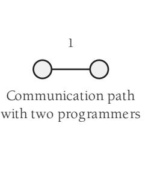
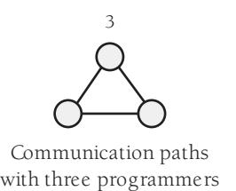
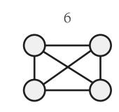
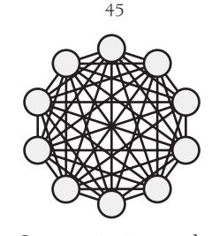
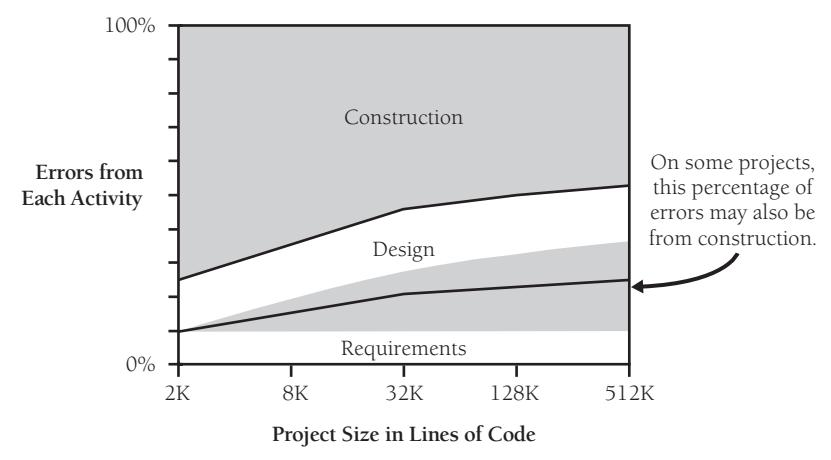
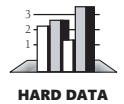
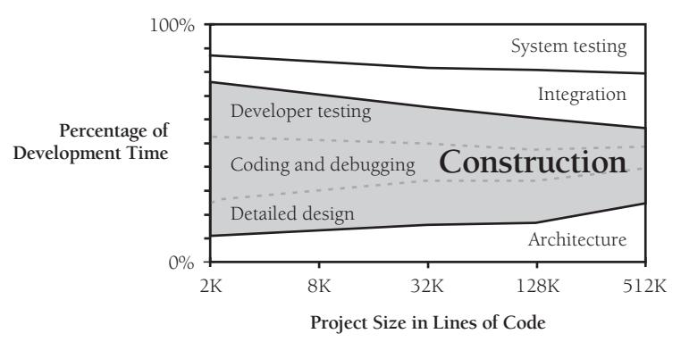
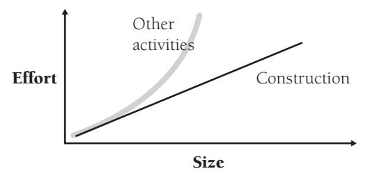
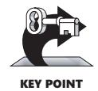
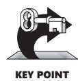

# Chapter 27: How Program Size Affects Construction

### cc2e.com/2761 Contents

- 27.1 Communication and Size: page 650
- 27.2 Range of Project Sizes: page 651
- 27.3 Effect of Project Size on Errors: page 651
- 27.4 Effect of Project Size on Productivity: page 653
- 27.5 Effect of Project Size on Development Activities: page 654

#### Related Topics

- Prerequisites to construction: Chapter 3
- Determining the kind of software you're working on: Section 3.2
- Managing construction: Chapter 28

Scaling up in software development isn't a simple matter of taking a small project and making each part of it bigger. Suppose you wrote the 25,000-line Gigatron software package in 20 staff-months and found 500 errors in field testing. Suppose Gigatron 1.0 is successful, as is Gigatron 2.0, and you start work on the Gigatron Deluxe, a greatly enhanced version of the program that's expected to be 250,000 lines of code.

Even though it's 10 times as large as the original Gigatron, the Gigatron Deluxe won't take 10 times the effort to develop; it'll take 30 times the effort. Moreover, 30 times the total effort doesn't imply 30 times as much construction. It probably implies 25 times as much construction and 40 times as much architecture and system testing. You won't have 10 times as many errors either; you'll have 15 times as many—or more.

If you've been accustomed to working on small projects, your first medium-to-large project can rage riotously out of control, becoming an uncontrollable beast instead of the pleasant success you had envisioned. This chapter tells you what kind of beast to expect and where to find the whip and chair to tame it. In contrast, if you're accustomed to working on large projects, you might use approaches that are too formal on a small project. This chapter describes how you can economize to keep a small project from toppling under the weight of its own overhead.

#### 27.1 Communication and Size

If you're the only person on a project, the only communication path is between you and the customer, unless you count the path across your corpus callosum, the path that connects the left side of your brain to the right. As the number of people on a project increases, the number of communication paths increases, too. The number doesn't increase additively as the number of people increases. It increases multiplicatively, proportionally to the square of the number of people, as illustrated in Figure 27-1.

Communication paths with four programmers

Communication paths with five programmers

Communication paths with ten programmers

**Figure 27-1** The number of communication paths increases proportionate to the square of the number of people on the team.

KEY POINT

As you can see, a two-person project has only one path of communication. A five-person project has 10 paths. A ten-person project has 45 paths, assuming that every person talks to every other person. The 10 percent of projects that have 50 or more programmers have at least 1,200 potential paths. The more communication paths you have, the more time you spend communicating and the more opportunities are created for communication mistakes. Larger-size projects demand organizational techniques that streamline communication or limit it in a sensible way.

The typical approach taken to streamlining communication is to formalize it in documents. Instead of having 50 people talk to each other in every conceivable combination, 50 people read and write documents. Some are text documents; some are graphic. Some are printed on paper; others are kept in electronic form.

#### 27.2 Range of Project Sizes

Is the size of the project you're working on typical? The wide range of project sizes means that you can't consider any single size to be typical. One way of thinking about project size is to think about the size of a project team. Here's a crude estimate of the percentages of all projects that are done by teams of various sizes:

| Team Size | Approximate Percentage of Projects |
|-----------|------------------------------------|
| 1–3       | 25%                                |
| 4–10      | 30%                                |
| 11–25     | 20%                                |
| 26–50     | 15%                                |
| 50+       | 10%                                |

Source: Adapted from "A Survey of Software Engineering Practice: Tools, Methods, and Results" (Beck and Perkins 1983), *Agile Software Development Ecosystems* (Highsmith 2002), and *Balancing Agility and Discipline* (Boehm and Turner 2003).

One aspect of project size data that might not be immediately apparent is the difference between the percentages of projects of various sizes and the number of programmers who work on projects of each size. Because larger projects use more programmers on each project than do small ones, they employ a large percentage of all programmers. Here's a rough estimate of the percentage of all programmers who work on projects of various sizes:

| Team Size | Approximate Percentage of Programmers |
|-----------|---------------------------------------|
| 1–3       | 5%                                    |
| 4–10      | 10%                                   |
| 11–25     | 15%                                   |
| 26–50     | 20%                                   |
| 50+       | 50%                                   |

Source: Derived from data in "A Survey of Software Engineering Practice: Tools, Methods, and Results" (Beck and Perkins 1983), *Agile Software Development Ecosystems* (Highsmith 2002), and *Balancing Agility and Discipline* (Boehm and Turner 2003).

#### 27.3 Effect of Project Size on Errors

**Cross-Reference** For more details on errors, see Section 22.4, "Typical Errors."

Both quantity and type of errors are affected by project size. You might not think that error type would be affected, but as project size increases, a larger percentage of errors can usually be attributed to mistakes in requirements and design, as shown in Figure 27-2.

**Figure 27-2** As project size increases, errors usually come more from requirements and design. Sometimes they still come primarily from construction (Boehm 1981, Grady 1987, Jones 1998).

On small projects, construction errors make up about 75 percent of all the errors found. Methodology has less influence on code quality, and the biggest influence on program quality is often the skill of the individual writing the program (Jones 1998).

On larger projects, construction errors can taper off to about 50 percent of the total errors; requirements and architecture errors make up the difference. Presumably this is related to the fact that more requirements development and architectural design are required on large projects, so the opportunity for errors arising out of those activities is proportionally larger. In some very large projects, however, the proportion of construction errors remains high; sometimes even with 500,000 lines of code, up to 75 percent of the errors can be attributed to construction (Grady 1987).

1998).

As the kinds of defects change with size, so do the numbers of defects. You would naturally expect a project that's twice as large as another to have twice as many errors. But the density of defects—the number of defects per 1000 lines of code—increases. The product that's twice as large is likely to have more than twice as many errors. Table 27-1 shows the range of defect densities you can expect on projects of various sizes.

**Table 27-1 Project Size and Typical Error Density**

| Project Size (in Lines |                                                                                                       |
|------------------------|-------------------------------------------------------------------------------------------------------|
| of Code)               | Typical Error Density                                                                                 |
| Smaller than 2K        | 0–25 errors per thousand lines of code (KLOC)                                                         |
| 2K–16K                 | 0–40 errors per KLOC                                                                                  |
| 16K–64K                | 0.5–50 errors per KLOC                                                                                |
| 64K–512K               | 2–70 errors per KLOC                                                                                  |
| 512K or more           | 4–100 errors per KLOC                                                                                 |
|                        | Sources: "Program Quality and Programmer Productivity" (Jones 1977), Estimating Software Costs (Jones |

**Cross-Reference** The data in this table represents average performance. A handful of organizations have reported better error rates than the minimums shown here. For examples, see "How Many Errors Should You Expect to Find?" in Section 22.4.

The data in this table was derived from specific projects, and the numbers might bear little resemblance to those for the projects you've worked on. As a snapshot of the industry, however, the data is illuminating. It indicates that the number of errors increases dramatically as project size increases, with very large projects having up to four times as many errors per thousand lines of code as small projects. A large project will need to work harder than a small project to achieve the same error rate.

#### 27.4 Effect of Project Size on Productivity

Productivity has a lot in common with software quality when it comes to project size. At small sizes (2000 lines of code or smaller), the single biggest influence on productivity is the skill of the individual programmer (Jones 1998). As project size increases, team size and organization become greater influences on productivity.

How big does a project need to be before team size begins to affect productivity? In "Prototyping Versus Specifying: a Multiproject Experiment," Boehm, Gray, and Seewaldt reported that smaller teams completed their projects with 39 percent higher productivity than larger teams. The size of the teams? Two people for the small projects and three for the large (1984). Table 27-2 gives the inside scoop on the general relationship between project size and productivity.

**Table 27-2 Project Size and Productivity**

| Project Size (in Lines of Code) | Lines of Code per Staff-Year (Cocomo II Nominal in Parentheses) |
|------------------------------------|--------------------------------------------------------------------|
| 1K                                 | 2,500–25,000 (4,000)                                               |
| 10K                                | 2,000–25,000 (3,200)                                               |
| 100K                               | 1,000–20,000 (2,600)                                               |
| 1,000K                             | 700–10,000 (2,000)                                                 |
| 10,000K                            | 300–5,000 (1,600)                                                  |

Source: Derived from data in *Measures for Excellence* (Putnam and Meyers 1992), *Industrial Strength Software* (Putnam and Meyers 1997), *Software Cost Estimation with Cocomo II* (Boehm et al. 2000), and "Software Development Worldwide: The State of the Practice" (Cusumano et al. 2003).

Productivity is substantially determined by the kind of software you're working on, personnel quality, programming language, methodology, product complexity, programming environment, tool support, how "lines of code" are counted, how nonprogrammer support effort is factored into the "lines of code per staff-year" figure, and many other factors, so the specific figures in Table 27-2 vary dramatically.

Realize, however, that the general trend the numbers show is significant. Productivity on small projects can be 2–3 times as high as productivity on large projects, and productivity can vary by a factor of 5–10 from the smallest projects to the largest.

#### 27.5 Effect of Project Size on Development Activities

If you are working on a one-person project, the biggest influence on the project's success or failure is you. If you're working on a 25-person project, it's conceivable that you're still the biggest influence, but it's more likely that no one person will wear the medal for that distinction; your organization will be a stronger influence on the project's success or failure.

#### Activity Proportions and Size

As project size increases and the need for formal communications increases, the kinds of activities a project needs change dramatically. Figure 27-3 shows the proportions of development activities for projects of different sizes.

**Figure 27-3** Construction activities dominate small projects. Larger projects require more architecture, integration work, and system testing to succeed. Requirements work is not shown on this diagram because requirements effort is not as directly a function of program size as other activities are (Albrecht 1979; Glass 1982; Boehm, Gray, and Seewaldt 1984; Boddie 1987; Card 1987; McGarry, Waligora, and McDermott 1989; Brooks 1995; Jones 1998; Jones 2000; Boehm et al. 2000).

On a small project, construction is the most prominent activity by far, taking up as much as 65 percent of the total development time. On a medium-size project, construction is still the dominant activity but its share of the total effort falls to about 50 percent. On very large projects, architecture, integration, and system testing take up more time and construction becomes less dominant. In short, as project size increases, construction becomes a smaller part of the total effort. The chart looks as though you could extend it to the right and make construction disappear altogether, so in the interest of protecting my job, I've cut it off at 512K.

Construction becomes less predominant because as project size increases, the construction activities—detailed design, coding, debugging, and unit testing—scale up proportionately but many other activities scale up faster. Figure 27-4 provides an illustration.

**Figure 27-4** The amount of software construction work is a near-linear function of project size. Other kinds of work increase nonlinearly as project size increases.

Projects that are close in size will perform similar activities, but as sizes diverge, the kinds of activities will diverge, too. As the introduction to this chapter described, when the Gigatron Deluxe comes out at 10 times the size of the original Gigatron, it will need 25 times more construction effort, 25–50 times the planning effort, 30 times the integration effort, and 40 times the architecture and system testing.

Proportions of activities vary because different activities become critical at different project sizes. Barry Boehm and Richard Turner found that spending about five percent of total project costs on architecture and requirements produced the lowest cost for projects in the 10,000-lines-of-code range. But for projects in the 100,000-lines-ofcode range, spending 15–20 percent of project effort on architecture and requirements produced the best results (Boehm and Turner 2004).

Here's a list of activities that grow at a more-than-linear rate as project size increases:

- Communication
- Planning
- Management
- Requirements development
- System functional design
- Interface design and specification
- Architecture
- Integration
- Defect removal
- System testing
- Document production

Regardless of the size of a project, a few techniques are always valuable: disciplined coding practices, design and code inspections by other developers, good tool support, and use of high-level languages. These techniques are valuable on small projects and invaluable on large projects.

#### Programs, Products, Systems, and System Products

**Further Reading** For another explanation of this point, see Chapter 1 in *The Mythical Man-Month* (Brooks 1995).

Lines of code and team size aren't the only influences on a project's size. A more subtle influence is the quality and the complexity of the final software. The original Gigatron, the Gigatron Jr., might have taken only a month to write and debug. It was a single program written, tested, and documented by a single person. If the 2,500-line Gigatron Jr. took one month, why did the full-fledged 25,000-line Gigatron take 20 months?

The simplest kind of software is a single "program" that's used by itself by the person who developed it or, informally, by a few others.

A more sophisticated kind of program is a software "product," a program that's intended for use by people other than the original developer. A software product is used in environments that differ from the environment in which the product was created. It's extensively tested before it's released, it's documented, and it's capable of being maintained by others. A software product costs about three times as much to develop as a software program.

Another level of sophistication is required to develop a group of programs that work together. Such a group is called a software "system." Development of a system is more complicated than development of a simple program because of the complexity of developing interfaces among the pieces and the care needed to integrate the pieces. On the whole, a system also costs about three times as much as a simple program.

When a "system product" is developed, it has the polish of a product and the multiple parts of a system. System products cost about nine times as much as simple programs (Brooks 1995, Shull et al. 2002).

A failure to appreciate the differences in polish and complexity among programs, products, systems, and system products is a common cause of estimation errors. Programmers who use their experience in building a program to estimate the schedule for building a system product can underestimate by a factor of almost 10. As you consider the following example, refer to the chart in Figure 27-3 (on page 654). If you used your experience in writing 2K lines of code to estimate the time it would take you to develop a 2K program, your estimate would be only 65 percent of the total time you'd actually need to perform all the activities that go into developing a program. Writing 2K lines of code doesn't take as long as creating a whole program that contains 2K lines of code. If you don't consider the time it takes to do nonconstruction activities, development will take 50 percent more time than you estimate.

As you scale up, construction becomes a smaller part of the total effort in a project. If you base your estimates solely on construction experience, the estimation error increases. If you used your own 2K construction experience to estimate the time it would take to develop a 32K program, your estimate would be only 50 percent of the total time required; development would take 100 percent more time than you would estimate.

The estimation error here would be completely attributable to your not understanding the effect of size on developing larger programs. If in addition you failed to consider the extra degree of polish required for a product rather than a mere program, the error could easily increase by a factor of three or more.

#### Methodology and Size

Methodologies are used on projects of all sizes. On small projects, methodologies tend to be casual and instinctive. On large projects, they tend to be rigorous and carefully planned.

Some methodologies can be so loose that programmers aren't even aware that they're using them. A few programmers argue that methodologies are too rigid and say that they won't touch them. While it may be true that a programmer hasn't selected a methodology consciously, any approach to programming constitutes a methodology, no matter how unconscious or primitive the approach is. Merely getting out of bed and going to work in the morning is a rudimentary methodology although not a very creative one. The programmer who insists on avoiding methodologies is really only avoiding choosing one explicitly—no one can avoid using them altogether.

Formal approaches aren't always fun, and if they are misapplied, their overhead gobbles up their other savings. The greater complexity of larger projects, however, requires a greater conscious attention to methodology. Building a skyscraper requires a different approach than building a doghouse. Different sizes of software projects work the same way. On large projects, unconscious choices are inadequate to the task. Successful project planners choose their strategies for large projects explicitly.

In social settings, the more formal the event, the more uncomfortable your clothes have to be (high heels, neckties, and so on). In software development, the more formal the project, the more paper you have to generate to make sure you've done your homework. Capers Jones points out that a project of 1,000 lines of code will average about 7 percent of its effort on paperwork, whereas a 100,000-lines-of-code project will average about 26 percent of its effort on paperwork (Jones 1998).

This paperwork isn't created for the sheer joy of writing documents. It's created as a direct result of the phenomenon illustrated in Figure 27-1: the more people's brains you have to coordinate, the more formal documentation you need to coordinate them.

You don't create any of this documentation for its own sake. The point of writing a configuration-management plan, for example, isn't to exercise your writing muscles. The point of your writing the plan is to force you to think carefully about configuration management and to explain your plan to everyone else. The documentation is a tangible side effect of the real work you do as you plan and construct a software system. If you feel as though you're going through the motions and writing generic documents, something is wrong.

 "More" is not better, as far as methodologies are concerned. In their review of agile vs. plan-driven methodologies, Barry Boehm and Richard Turner caution that you'll usually do better if you start your methods small and scale up for a large project than if you start with an all-inclusive method and pare it down for a small project (Boehm and Turner 2004). Some software pundits talk about "lightweight" and "heavyweight" methodologies, but in practice the key is to consider your project's specific size and type and then find the methodology that's "right-weight."

#### Additional Resources

**cc2e.com/2768** Use the following resources to investigate this chapter's subject further:

Boehm, Barry and Richard Turner. *Balancing Agility and Discipline: A Guide for the Perplexed*. Boston, MA: Addison-Wesley, 2004. Boehm and Turner describe how project size affects the use of agile and plan-driven methods, along with other agile and plandriven issues.

Cockburn, Alistair. *Agile Software Development*. Boston, MA: Addison-Wesley, 2002. Chapter 4 discusses issues involved in selecting appropriate project methodologies, including project size. Chapter 6 introduces Cockburn's Crystal Methodologies, which are defined approaches for developing projects of various sizes and degrees of criticality.

Boehm, Barry W. *Software Engineering Economics*. Englewood Cliffs, NJ: Prentice Hall, 1981. Boehm's book is an extensive treatment of the cost, productivity, and quality ramifications of project size and other variables in the software-development process. It includes discussions of the effect of size on construction and other activities. Chapter 11 is an excellent explanation of software's diseconomies of scale. Other information on project size is spread throughout the book. Boehm's 2000 book *Software Cost Estimation with Cocomo II* contains much more up-to-date information on Boehm's Cocomo estimating model, but the earlier book provides more in-depth background discussions that are still relevant.

Jones, Capers. *Estimating Software Costs*. New York, NY: McGraw-Hill, 1998. This book is packed with tables and graphs that dissect the sources of software development productivity. For the impact of project size specifically, Jones's 1986 book, *Programming Productivity*, contains an excellent discussion in the section titled "The Impact of Program Size" in Chapter 3.

Brooks, Frederick P., Jr. *The Mythical Man-Month: Essays on Software Engineering, Anniversary Edition* (2d ed.). Reading, MA: Addison-Wesley, 1995. Brooks was the manager of IBM's OS/360 development, a mammoth project that took 5000 staff-years. He discusses management issues pertaining to small and large teams and presents a particularly vivid account of chief-programmer teams in this engaging collection of essays.

DeGrace, Peter, and Leslie Stahl. *Wicked Problems, Righteous Solutions: A Catalogue of Modern Software Engineering Paradigms*. Englewood Cliffs, NJ: Yourdon Press, 1990. As the title suggests, this book catalogs approaches to developing software. As noted throughout this chapter, your approach needs to vary as the size of the project varies, and DeGrace and Stahl make that point clearly. The section titled "Attenuating and Truncating" in Chapter 5 discusses customizing software-development processes based on project size and formality. The book includes descriptions of models from NASA and the Department of Defense and a remarkable number of edifying illustrations.

Jones, T. Capers. "Program Quality and Programmer Productivity." *IBM Technical Report TR 02.764* (January 1977): 42–78. Also available in Jones's *Tutorial: Programming Productivity: Issues for the Eighties*, 2d ed. Los Angeles, CA: IEEE Computer Society Press, 1986. This paper contains the first in-depth analysis of the reasons large projects have different spending patterns than small ones. It's a thorough discussion of the differences between large and small projects, including requirements and quality-assurance measures. It's dated but still interesting.

#### Key Points

- As project size increases, communication needs to be supported. The point of most methodologies is to reduce communications problems, and a methodology should live or die on its merits as a communication facilitator.
- All other things being equal, productivity will be lower on a large project than on a small one.
- All other things being equal, a large project will have more errors per thousand lines of code than a small one.
- Activities that are taken for granted on small projects must be carefully planned on larger ones. Construction becomes less predominant as project size increases.
- Scaling up a lightweight methodology tends to work better than scaling down a heavyweight methodology. The most effective approach of all is using a "rightweight" methodology.
