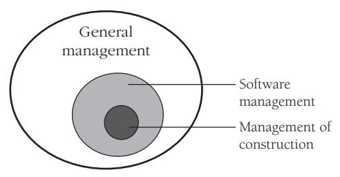
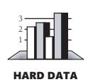
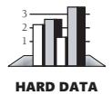
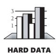
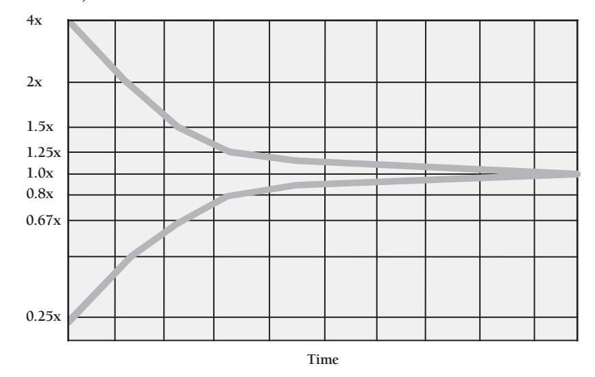
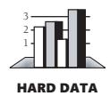
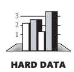
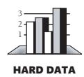
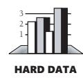
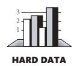

# Chapter 28: Managing Construction

### cc2e.com/2836 Contents

- 28.1 Encouraging Good Coding: page 662
- 28.2 Configuration Management: page 664
- 28.3 Estimating a Construction Schedule: page 671
- 28.4 Measurement: page 677
- 28.5 Treating Programmers as People: page 680
- 28.6 Managing Your Manager: page 686

#### Related Topics

- Prerequisites to construction: Chapter 3
- Determining the kind of software you're working on: Section 3.2
- Program size: Chapter 27
- Software quality: Chapter 20

Managing software development has been a formidable challenge for the past several decades. As Figure 28-1 suggests, the general topic of software-project management extends beyond the scope of this book, but this chapter discusses a few specific management topics that apply directly to construction. If you're a developer, this chapter will help you understand the issues that managers need to consider. If you're a manager, this chapter will help you understand how management looks to developers as well as how to manage construction effectively. Because the chapter covers a broad collection of topics, several of its sections also describe where you can go for more information.

**Figure 28-1** This chapter covers the software-management topics related to construction.

If you're interested in software management, be sure to read Section 3.2, "Determine the Kind of Software You're Working On," to understand the difference between traditional sequential approaches to development and modern iterative approaches. Be sure also to read Chapter 20, "The Software-Quality Landscape," and Chapter 27, "How Program Size Affects Construction." Quality goals and the size of the project both significantly affect how a specific software project should be managed.

#### 28.1 Encouraging Good Coding

Because code is the primary output of construction, a key question in managing construction is "How do you encourage good coding practices?" In general, mandating a strict set of technical standards from the management position isn't a good idea. Programmers tend to view managers as being at a lower level of technical evolution, somewhere between single-celled organisms and the woolly mammoths that died out during the Ice Age, and if there are going to be programming standards, programmers need to buy into them.

If someone on a project is going to define standards, have a respected architect define the standards rather than the manager. Software projects operate as much on an "expertise hierarchy" as on an "authority hierarchy." If the architect is regarded as the project's thought leader, the project team will generally follow standards set by that person.

If you choose this approach, be sure the architect really is respected. Sometimes a project architect is just a senior person who has been around too long and is out of touch with production coding issues. Programmers will resent that kind of "architect" defining standards that are out of touch with the work they're doing.

#### Considerations in Setting Standards

Standards are more useful in some organizations than in others. Some developers welcome standards because they reduce arbitrary variance in the project. If your group resists adopting strict standards, consider a few alternatives: flexible guidelines, a collection of suggestions rather than guidelines, or a set of examples that embody the best practices.

#### Techniques for Encouraging Good Coding

This section describes several techniques for achieving good coding practices that are less heavy-handed than laying down rigid coding standards:

**Cross-Reference** For more details on pair programming, see Section 21.2, "Pair Programming."

*Assign two people to every part of the project* If two people have to work on each line of code, you'll guarantee that at least two people think it works and is readable. The mechanisms for teaming two people can range from pair programming to mentortrainee pairs to buddy-system reviews.

**Cross-Reference** For details on reviews, see Section 21.3, "Formal Inspections," and Section 21.4, "Other Kinds of Collaborative Development Practices."

*Review every line of code* A code review typically involves the programmer and at least two reviewers. That means that at least three people read every line of code. Another name for peer review is "peer pressure." In addition to providing a safety net in case the original programmer leaves the project, reviews improve code quality because the programmer knows that the code will be read by others. Even if your shop hasn't created explicit coding standards, reviews provide a subtle way of moving toward a group coding standard—decisions are made by the group during reviews, and over time the group derives its own standards.

*Require code sign-offs* In other fields, technical drawings are approved and signed by the managing engineer. The signature means that to the best of the engineer's knowledge, the drawings are technically competent and error-free. Some companies treat code the same way. Before code is considered to be complete, senior technical personnel must sign the code listing.

*Route good code examples for review* A big part of good management is communicating your objectives clearly. One way to communicate your objectives is to circulate good code to your programmers or post it for public display. In doing so, you provide a clear example of the quality you're aiming for. Similarly, a coding-standards manual can consist mainly of a set of "best code listings." Identifying certain listings as "best" sets an example for others to follow. Such a manual is easier to update than an English-language standards manual, and it effortlessly presents subtleties in coding style that are hard to capture point by point in prose descriptions.

**Cross-Reference** A large part of programming is communicating your work to other people. For details, see Section 33.5 and Section 34.3. *Emphasize that code listings are public assets* Programmers sometimes feel that the code they've written is "their code," as if it were private property. Although it is the result of their work, code is part of the project and should be freely available to anyone else on the project who needs it. It should be seen by others during reviews and maintenance, even if at no other time.

One of the most successful projects ever reported developed 83,000 lines of code in 11 work-years of effort. Only one error that resulted in system failure was detected in the first 13 months of operation. This accomplishment is even more dramatic when you realize that the project was completed in the late 1960s, without online compilation or interactive debugging. Productivity on the project—7500 lines of code per work-year in the late 1960s—is still impressive by today's standards. The chief programmer on the project reported that one key to the project's success was the identification of all computer runs (erroneous and otherwise) as public rather than private assets (Baker and Mills 1973). This idea has extended into modern contexts, including Open Source Software (Raymond 2000) and Extreme Programming's idea of collective ownership (Beck 2000), as well as in other contexts.

*Reward good code* Use your organization's reward system to reinforce good coding practices. Keep these considerations in mind as you develop your reinforcement system:

- The reward should be something that the programmer wants. (Many programmers find "attaboy" rewards distasteful, especially when they come from nontechnical managers.)
- Code that receives an award should be exceptionally good. If you give an award to a programmer everyone else knows does bad work, you look like Homer Simpson trying to run a nuclear reactor. It doesn't matter that the programmer has a cooperative attitude or always comes to work on time. You lose credibility if your reward doesn't match the technical merits of the situation. If you're not technically skilled enough to make the good-code judgment, don't! Don't make the award at all, or let your team choose the recipient.

*One easy standard* If you're managing a programming project and you have a programming background, an easy and effective technique for eliciting good work is to say "I must be able to read and understand any code written for the project." That the manager isn't the hottest technical hotshot can be an advantage in that it might discourage "clever" or tricky code.

#### The Role of This Book

Most of this book is a discussion of good programming practices. It isn't intended to be used to justify rigid standards, and it's intended even less to be used as a set of rigid standards. Use this book as a basis for discussion, as a sourcebook of good programming practices, and for identifying practices that could be beneficial in your environment.

### 28.2 Configuration Management

A software project is dynamic. The code changes, the design changes, and the requirements change. What's more, changes in the requirements lead to more changes in the design, and changes in the design lead to even more changes in the code and test cases.

#### What Is Configuration Management?

Configuration management is the practice of identifying project artifacts and handling changes systematically so that a system can maintain its integrity over time. Another name for it is "change control." It includes techniques for evaluating proposed changes, tracking changes, and keeping copies of the system as it existed at various points in time.

If you don't control changes to requirements, you can end up writing code for parts of the system that are eventually eliminated. You can write code that's incompatible with new parts of the system. You might not detect many of the incompatibilities until

integration time, which will become finger-pointing time because nobody will really know what's going on.

If changes to code aren't controlled, you might change a routine that someone else is changing at the same time; successfully combining your changes with theirs will be problematic. Uncontrolled code changes can make code seem more tested than it is. The version that's been tested will probably be the old, unchanged version; the modified version might not have been tested. Without good change control, you can make changes to a routine, find new errors, and not be able to back up to the old, working routine.

The problems go on indefinitely. If changes aren't handled systematically, you're taking random steps in the fog rather than moving directly toward a clear destination. Without good change control, rather than developing code you're wasting your time thrashing. Configuration management helps you use your time effectively.

In spite of the obvious need for configuration management, many programmers have been avoiding it for decades. A survey more than 20 years ago found that over a third of programmers weren't even familiar with the idea (Beck and Perkins 1983), and there's little indication that that has changed. A more recent study by the Software Engineering Institute found that, of organizations using informal software-development practices, less than 20 percent had adequate configuration management (SEI 2003).

Configuration management wasn't invented by programmers, but because programming projects are so volatile, it's especially useful to programmers. Applied to software projects, configuration management is usually called "software configuration management" (SCM). SCM focuses on a program's requirements, source code, documentation, and test data.

The systemic problem with SCM is overcontrol. The surest way to stop car accidents is to prevent everyone from driving, and one sure way to prevent software-development problems is to stop all software development. Although that's one way to control changes, it's a terrible way to develop software. You have to plan SCM carefully so that it's an asset rather than an albatross around your neck.

**Cross-Reference** For details on the effects of project size on construction, see Chapter 27, "How Program Size Affects Construction."

On a small, one-person project, you can probably do well with no SCM beyond planning for informal periodic backups. Nonetheless, configuration management is still useful (and, in fact, I used configuration management in creating this manuscript). On a large, 50-person project, you'll probably need a full-blown SCM scheme, including fairly formal procedures for backups, change control for requirements and design, and control over documents, source code, content, test cases, and other project artifacts. If your project is neither very large nor very small, you'll have to settle on a degree of formality somewhere between the two extremes. The following subsections describe some of the options in implementing SCM.

#### Requirements and Design Changes

**Cross-Reference** Some development approaches support changes better than others. For details, see Section 3.2, "Determine the Kind of Software You're Working On."

During development, you're bound to be bristling with ideas about how to improve the system. If you implement each change as it occurs to you, you'll soon find yourself walking on a software treadmill—for all that the system will be changing, it won't be moving closer to completion. Here are some guidelines for controlling design changes:

*Follow a systematic change-control procedure* As Section 3.4 noted, a systematic change-control procedure is a godsend when you have a lot of change requests. By establishing a systematic procedure, you make it clear that changes will be considered in the context of what's best for the project overall.

*Handle change requests in groups* It's tempting to implement easy changes as ideas arise. The problem with handling changes in this way is that good changes can get lost. If you think of a simple change 25 percent of the way through the project and you're on schedule, you'll make the change. If you think of another simple change 50 percent of the way through the project and you're already behind, you won't. When you start to run out of time at the end of the project, it won't matter that the second change is 10 times as good as the first—you won't be in a position to make any nonessential changes. Some of the best changes can slip through the cracks merely because you thought of them later rather than sooner.

A solution to this problem is to write down all ideas and suggestions, no matter how easy they would be to implement, and save them until you have time to work on them. Then, viewing them as a group, choose the ones that will be the most beneficial.

*Estimate the cost of each change* Whenever your customer, your boss, or you are tempted to change the system, estimate the time it would take to make the change, including review of the code for the change and retesting the whole system. Include in your estimate time for dealing with the change's ripple effect through requirements to design to code to test to changes in the user documentation. Let all the interested parties know that software is intricately interwoven and that time estimation is necessary even if the change appears small at first glance.

Regardless of how optimistic you feel when the change is first suggested, refrain from giving an off-the-cuff estimate. Such estimates are often mistaken by a factor of 2 or more.

*Be wary of high change volumes* While some degree of change is inevitable, a high volume of change requests is a key warning sign that requirements, architecture, or top-level designs weren't done well enough to support effective construction. Backing up to work on requirements or architecture might seem expensive, but it won't be nearly as expensive as constructing the software more than once or throwing away code for features that you really didn't need.

**Cross-Reference** For another angle on handling changes, see "Handling Requirements Changes During Construction" in Section 3.4. For advice on handling code changes safely when they do occur, see Chapter 24, "Refactoring."

*Establish a change-control board or its equivalent in a way that makes sense for your project* The job of a change-control board is to separate the wheat from the chaff in change requests. Anyone who wants to propose a change submits the change request to the change-control board. The term "change request" refers to any request that would change the software: an idea for a new feature, a change to an existing feature, an "error report" that might or might not be reporting a real error, and so on. The board meets periodically to review proposed changes. It approves, disapproves, or defers each change. Change-control boards are considered a best practice for prioritizing and controlling requirements changes; however, they are still fairly uncommon in commercial settings (Jones 1998, Jones 2000).

*Watch for bureaucracy, but don't let the fear of bureaucracy preclude effective change control* Lack of disciplined change control is one of the biggest management problems facing the software industry today. A significant percentage of the projects that are perceived to be late would actually be on time if they accounted for the impact of untracked but agreed-upon changes. Poor change control allows changes to accumulate off the books, which undermines status visibility, long-range predictability, project planning, risk management specifically, and project management generally.

Change control tends to drift toward bureaucracy, so it's important to look for ways to streamline the change-control process. If you'd rather not use traditional change requests, set up a simple "ChangeBoard" e-mail alias and have people e-mail change requests to the address. Or have people present change proposals interactively at a change board meeting. An especially powerful approach is to log change requests as defects in your defect-tracking software. Purists will classify such changes as "requirements defects," or you could classify them as changes rather than defects.

You can implement the Change-Control Board itself formally, or you can define a Product Planning Group or War Council that carries the traditional responsibilities of a change-control board. Or you can identify a single person to be the Change Czar. But whatever you call it, do it!

I occasionally see projects suffering from ham-handed implementations of change control. But 10 times as often I see projects suffering from no meaningful change control at all. The substance of change control is what's important, so don't let fear of bureaucracy stop you from realizing its many benefits.

#### Software Code Changes

Another configuration-management issue is controlling source code. If you change the code and a new error surfaces that seems unrelated to the change you made, you'll probably want to compare the new version of the code to the old in your search for the source of the error. If that doesn't tell you anything, you might want to look at a version that's even older. This kind of excursion through history is easy if you have version-control tools that keep track of multiple versions of source code.

KEY POINT

*Version-control software* Good version-control software works so easily that you barely notice you're using it. It's especially helpful on team projects. One style of version control locks source files so that only one person can modify a file at a time. Typically, when you need to work on source code in a particular file, you check the file out of version control. If someone else has already checked it out, you're notified that you can't check it out. When you can check the file out, you work on it just as you would without version control until you're ready to check it in. Another style allows multiple people to work on files simultaneously and handles the issue of merging changes when the code is checked in. In either case, when you check the file in, version control asks why you changed it, and you type in a reason.

For this modest investment of effort, you get several big benefits:

- You don't step on anyone's toes by working on a file while someone else is working on it (or at least you'll know about it if you do).
- You can easily update your copies of all the project's files to the current versions, usually by issuing a single command.
- You can backtrack to any version of any file that was ever checked into version control.
- You can get a list of the changes made to any version of any file.
- You don't have to worry about personal backups because the version-control copy is a safety net.

Version control is indispensable on team projects. It becomes even more powerful when version control, defect tracking, and change management are integrated. The applications division of Microsoft found its proprietary version-control tool to be a "major competitive advantage" (Moore 1992).

#### Tool Versions

For some kinds of projects, it may be necessary to be able to reconstruct the exact environment used to create each specific version of the software, including compilers, linkers, code libraries, and so on. In that case, you should put all of those tools into version control, too.

#### Machine Configurations

Many companies (including my company) have experienced good results from creating standardized development machine configurations. A disk image is created of a standard developer workstation, including all the common developer tools, office applications, and so on. That image is loaded onto each developer's machine. Having standardized configurations helps to avoid a raft of problems associated with slightly different configuration settings, different versions of tools used, and so on. A standardized disk image also greatly streamlines setting up new machines compared to having to install each piece of software individually.

#### Backup Plan

A backup plan isn't a dramatic new concept; it's the idea of backing up your work periodically. If you were writing a book by hand, you wouldn't leave the pages in a pile on your porch. If you did, they might get rained on or blown away, or your neighbor's dog might borrow them for a little bedtime reading. You'd put them somewhere safe. Software is less tangible, so it's easier to forget that you have something of enormous value on one machine.

Many things can happen to computerized data: a disk can fail; you or someone else can delete key files accidentally; an angry employee can sabotage your machine; or you could lose a machine to theft, flood, or fire. Take steps to safeguard your work. Your backup plan should include making backups on a periodic basis and periodic transfer of backups to off-site storage, and it should encompass all the important materials on your project—documents, graphics, and notes—in addition to source code.

One often-overlooked aspect of devising a backup plan is a test of your backup procedure. Try doing a restore at some point to make sure that the backup contains everything you need and that the recovery works.

When you finish a project, make a project archive. Save a copy of everything: source code, compilers, tools, requirements, design, documentation—everything you need to re-create the product. Keep it all in a safe place.

#### cc2e.com/2843 CHECKLIST: Configuration Management

#### General

- ❑ Is your software configuration management plan designed to help programmers and minimize overhead?
- ❑ Does your SCM approach avoid overcontrolling the project?
- ❑ Do you group change requests, either through informal means (such as a list of pending changes) or through a more systematic approach (such as a change-control board)?
- ❑ Do you systematically estimate the cost, schedule, and quality impact of each proposed change?
- ❑ Do you view major changes as a warning that requirements development isn't yet complete?

#### Tools

- ❑ Do you use version-control software to facilitate configuration management?
- ❑ Do you use version-control software to reduce coordination problems of working in teams?

#### Backup

- ❑ Do you back up all project materials periodically?
- ❑ Are project backups transferred to off-site storage periodically?
- ❑ Are all materials backed up, including source code, documents, graphics, and important notes?
- ❑ Have you tested the backup-recovery procedure?

#### Additional Resources on Configuration Management

**cc2e.com/2850** Because this book is about construction, this section has focused on change control from a construction point of view. But changes affect projects at all levels, and a comprehensive change-control strategy needs to do the same.

> Hass, Anne Mette Jonassen. *Configuration Management Principles and Practices*. Boston, MA: Addison-Wesley, 2003. This book provides the big-picture view of software configuration management and practical details on how to incorporate it into your softwaredevelopment process. It focuses on managing and controlling configuration items.

> Berczuk, Stephen P. and Brad Appleton. *Software Configuration Management Patterns: Effective Teamwork, Practical Integration*. Boston, MA: Addison-Wesley, 2003. Like Hass's book, this book provides a SCM overview and is practical. It complements Hass's book by providing practical guidelines that allow teams of developers to isolate and coordinate their work.

**cc2e.com/2857** SPMN. *Little Book of Configuration Management*. Arlington, VA: Software Program Managers Network, 1998. This pamphlet is an introduction to configuration management activities and defines critical success factors. It's available as a free download from the SPMN website at *www.spmn.com/products\_guidebooks.html*.

> Bays, Michael. *Software Release Methodology*. Englewood Cliffs, NJ: Prentice Hall, 1999. This book discusses software configuration management with an emphasis on releasing software into production.

> Bersoff, Edward H., and Alan M. Davis. "Impacts of Life Cycle Models on Software Configuration Management." *Communications of the ACM 34*, no. 8 (August 1991): 104–118. This article describes how SCM is affected by newer approaches to software development, especially prototyping approaches. The article is especially applicable in environments that are using agile development practices.

#### 28.3 Estimating a Construction Schedule

Managing a software project is one of the formidable challenges of the twenty-first century, and estimating the size of a project and the effort required to complete it is one of the most challenging aspects of software-project management. The average large software project is one year late and 100 percent over budget (Standish Group 1994, Jones 1997, Johnson 1999). At the individual level, surveys of estimated vs. actual schedules have found that developers' estimates tend to have an optimism factor of 20 to 30 percent (van Genuchten 1991).This has as much to do with poor size and effort estimates as with poor development efforts. This section outlines the issues involved in estimating software projects and indicates where to look for more information.

#### Estimation Approaches

**Further Reading** For further reading on scheduleestimation techniques, see Chapter 8 of *Rapid Development* (McConnell 1996) and *Software Cost Estimation with Cocomo II* (Boehm et al. 2000).

You can estimate the size of a project and the effort required to complete it in any of several ways:

- Use estimating software.
- Use an algorithmic approach, such as Cocomo II, Barry Boehm's estimation model (Boehm et al. 2000).
- Have outside estimation experts estimate the project.
- Have a walk-through meeting for estimates.
- Estimate pieces of the project, and then add the pieces together.
- Have people estimate their own tasks, and then add the task estimates together.
- Refer to experience on previous projects.
- Keep previous estimates and see how accurate they were. Use them to adjust new estimates.

Pointers to more information on these approaches are given in "Additional Resources on Software Estimation" at the end of this section. Here's a good approach to estimating a project:

**Further Reading** This approach is adapted from *Software Engineering Economics* (Boehm 1981).

*Establish objectives* Why do you need an estimate? What are you estimating? Are you estimating only construction activities, or all of development? Are you estimating only the effort for your project, or your project plus vacations, holidays, training, and other nonproject activities? How accurate does the estimate need to be to meet your objectives? What degree of certainty needs to be associated with the estimate? Would an optimistic or a pessimistic estimate produce substantially different results?

*Allow time for the estimate, and plan it* Rushed estimates are inaccurate estimates. If you're estimating a large project, treat estimation as a miniproject and take the time to miniplan the estimate so that you can do it well.

**Cross-Reference** For more information on software requirements, see Section 3.4, "Requirements Prerequisite."

*Spell out software requirements* Just as an architect can't estimate how much a "pretty big" house will cost, you can't reliably estimate a "pretty big" software project. It's unreasonable for anyone to expect you to be able to estimate the amount of work required to build something when "something" has not yet been defined. Define requirements or plan a preliminary exploration phase before making an estimate.

*Estimate at a low level of detail* Depending on the objectives you identified, base the estimate on a detailed examination of project activities. In general, the more detailed your examination is, the more accurate your estimate will be. The Law of Large Numbers says that a 10 percent error on one big piece will be 10 percent high or 10 percent low. On 50 small pieces, some of the 10 percent errors in the pieces will be high and some will be low, and the errors will tend to cancel each other out.

**Cross-Reference** It's hard to find an area of software development in which iteration is not valuable. Estimation is one case in which iteration is useful. For a summary of iterative techniques, see Section 34.8, "Iterate, Repeatedly, Again and Again."

*Use several different estimation techniques, and compare the results* The list of estimation approaches at the beginning of the section identified several techniques. They won't all produce the same results, so try several of them. Study the different results from the different approaches. Children learn early that if they ask each parent individually for a third bowl of ice cream, they have a better chance of getting at least one "yes" than if they ask only one parent. Sometimes the parents wise up and give the same answer; sometimes they don't. See what different answers you can get from different estimation techniques.

No approach is best in all circumstances, and the differences among them can be illuminating. For example, for the first edition of this book, my original eyeball estimate for the length of the book was 250–300 pages. When I finally did an in-depth estimate, the estimate came out to 873 pages. "That can't be right," I thought. So I estimated it using a completely different technique. The second estimate came out to 828 pages. Considering that these estimates were within about five percent of each other, I concluded that the book was going to be much closer to 850 pages than to 250 pages, and I was able to adjust my writing plans accordingly.

*Reestimate periodically* Factors on a software project change after the initial estimate, so plan to update your estimates periodically. As Figure 28-2 illustrates, the accuracy of your estimates should improve as you move toward completing the project. From time to time, compare your actual results to your estimated results, and use that evaluation to refine estimates for the remainder of the project.

**cc2e.com/2864**

**Variation in Project Scope Estimates (Effort, Cost, or Features)**

**Figure 28-2** Estimates created early in a project are inherently inaccurate. As the project progresses, estimates can become more accurate. Reestimate periodically throughout a project, and use what you learn during each activity to improve your estimate for the next activity.

#### Estimating the Amount of Construction

**Cross-Reference** For details on the amount of coding for projects of various sizes, see "Activity Proportions and Size" in Section 27.5.

The extent to which construction will be a major influence on a project's schedule depends in part on the proportion of the project that will be devoted to construction—understood as detailed design, coding and debugging, and unit testing. Take another look at Figure 27-3 on page 654. As the figure shows, the proportion varies by project size. Until your company has project-history data of its own, the proportion of time devoted to each activity shown in the figure is a good place to start estimates for your projects.

The best answer to the question of how much construction a project will call for is that the proportion will vary from project to project and organization to organization. Keep records of your organization's experience on projects, and use them to estimate the time future projects will take.

#### Influences on Schedule

**Cross-Reference** The effect of a program's size on productivity and quality isn't always intuitively apparent. See Chapter 27, "How Program Size Affects Construction," for an explanation of how size affects construction. The largest influence on a software project's schedule is the size of the program to be produced. But many other factors also influence a software-development schedule. Studies of commercial programs have quantified some of the factors, and they're shown in Table 28-1.

**Table 28-1 Factors That Influence Software-Project Effort**

| Factor                                                                 | Potential Helpful Influence | Potential Harmful Influence |
|------------------------------------------------------------------------|-----------------------------------|-----------------------------------|
| Co-located vs. multisite development                                   | -14%                              | 22%                               |
| Database size                                                          | -10%                              | 28%                               |
| Documentation match to project needs                                   | -19%                              | 23%                               |
| Flexibility allowed in interpreting requirements                       | -9%                               | 10%                               |
| How actively risks are addressed                                       | -12%                              | 14%                               |
| Language and tools experience                                          | -16%                              | 20%                               |
| Personnel continuity (turnover)                                        | -19%                              | 29%                               |
| Platform volatility                                                    | -13%                              | 30%                               |
| Process maturity                                                       | -13%                              | 15%                               |
| Product complexity                                                     | -27%                              | 74%                               |
| Programmer capability                                                  | -24%                              | 34%                               |
| Reliability required                                                   | -18%                              | 26%                               |
| Requirements analyst capability                                        | -29%                              | 42%                               |
| Reuse requirements                                                     | -5%                               | 24%                               |
| State-of-the-art application                                           | -11%                              | 12%                               |
| Storage constraint (how much of available storage will be consumed) | 0%                                | 46%                               |
| Team cohesion                                                          | -10%                              | 11%                               |
| Team's experience in the applications area                             | -19%                              | 22%                               |
| Team's experience on the technology platform                           | -15%                              | 19%                               |
| Time constraint (of the application itself)                            | 0%                                | 63%                               |
| Use of software tools                                                  | -22%                              | 17%                               |

Here are some of the less easily quantified factors that can influence a software-development schedule. These factors are drawn from Barry Boehm's *Software Cost Estimation with Cocomo II* (2000) and Capers Jones's *Estimating Software Costs* (1998).

- Requirements developer experience and capability
- Programmer experience and capability

- Team motivation
- Management quality
- Amount of code reused
- Personnel turnover
- Requirements volatility
- Quality of relationship with customer
- User participation in requirements
- Customer experience with the type of application
- Extent to which programmers participate in requirements development
- Classified security environment for computer, programs, and data
- Amount of documentation
- Project objectives (schedule vs. quality vs. usability vs. the many other possible objectives)

Each of these factors can be significant, so consider them along with the factors shown in Table 28-1 (which includes some of these factors).

#### Estimation vs. Control

The important question is, do you want prediction, or do you want control?

—*Tom Gilb*

Estimation is an important part of the planning needed to complete a software project on time. Once you have a delivery date and a product specification, the main problem is how to control the expenditure of human and technical resources for an on-time delivery of the product. In that sense, the accuracy of the initial estimate is much less important than your subsequent success at controlling resources to meet the schedule.

#### What to Do If You're Behind

The average project overruns its planned schedule by about 100 percent, as mentioned earlier in this chapter. When you're behind, increasing the amount of time usually isn't an option. If it is, do it. Otherwise, you can try one or more of these solutions:

*Hope that you'll catch up* Hopeful optimism is a common response to a project's falling behind schedule. The rationalization typically goes like this: "Requirements took a little longer than we expected, but now they're solid, so we're bound to save time later. We'll make up the shortfall during coding and testing." This is hardly ever the case. One survey of over 300 software projects concluded that delays and overruns generally increase toward the end of a project (van Genuchten 1991). Projects don't make up lost time later; they fall further behind.

*Expand the team* According to Fred Brooks's law, adding people to a late software project makes it later (Brooks 1995). It's like adding gas to a fire. Brooks's explanation is convincing: new people need time to familiarize themselves with a project before they can become productive. Their training takes up the time of the people who have already been trained. And merely increasing the number of people increases the complexity and amount of project communication. Brooks points out that the fact that one woman can have a baby in nine months does not imply that nine women can have a baby in one month.

Undoubtedly the warning in Brooks's law should be heeded more often than it is. It's tempting to throw people at a project and hope that they'll bring it in on time. Managers need to understand that developing software isn't like riveting sheet metal: more workers working doesn't necessarily mean more work will get done.

The simple statement that adding programmers to a late project makes it later, however, masks the fact that under some circumstances it's possible to add people to a late project and speed it up. As Brooks points out in the analysis of his law, adding people to software projects in which the tasks can't be divided and performed independently doesn't help. But if a project's tasks are partitionable, you can divide them further and assign them to different people, even to people who are added late in the project. Other researchers have formally identified circumstances under which you can add people to a late project without making it later (Abdel-Hamid 1989, McConnell 1999).

**Further Reading** For an argument in favor of building only the most-needed features, see Chapter 14, "Feature-Set Control," in *Rapid Development* (McConnell 1996).

*Reduce the scope of the project* The powerful technique of reducing the scope of the project is often overlooked. If you eliminate a feature, you eliminate the design, coding, debugging, testing, and documentation of that feature. You eliminate that feature's interface to other features.

When you plan the product initially, partition the product's capabilities into "must haves," "nice to haves," and "optionals." If you fall behind, prioritize the "optionals" and "nice to haves" and drop the ones that are the least important.

Short of dropping a feature altogether, you can provide a cheaper version of the same functionality. You might provide a version that's on time but that hasn't been tuned for performance. You might provide a version in which the least important functionality is implemented crudely. You might decide to back off on a speed requirement because it's much easier to provide a slow version. You might back off on a space requirement because it's easier to provide a memory-intensive version.

Reestimate development time for the least important features. What functionality can you provide in two hours, two days, or two weeks? What do you gain by building the two-week version rather than the two-day version, or the two-day version rather than the two-hour version?

#### Additional Resources on Software Estimation

**cc2e.com/2871** Here are some additional references about software estimation:

Boehm, Barry, et al. *Software Cost Estimation with Cocomo II*. Boston, MA: Addison-Wesley, 2000. This book describes the ins and outs of the Cocomo II estimating model, which is undoubtedly the most popular model in use today.

Boehm, Barry W. *Software Engineering Economics*. Englewood Cliffs, NJ: Prentice Hall, 1981. This older book contains an exhaustive treatment of software-project estimation considered more generally than in Boehm's newer book.

Humphrey, Watts S. *A Discipline for Software Engineering*. Reading, MA: Addison-Wesley, 1995. Chapter 5 of this book describes Humphrey's Probe method, which is a technique for estimating work at the individual developer level.

Conte, S. D., H. E. Dunsmore, and V. Y. Shen. *Software Engineering Metrics and Models*. Menlo Park, CA: Benjamin/Cummings, 1986. Chapter 6 contains a good survey of estimation techniques, including a history of estimation, statistical models, theoretically based models, and composite models. The book also demonstrates the use of each estimation technique on a database of projects and compares the estimates to the projects' actual lengths.

Gilb, Tom. *Principles of Software Engineering Management*. Wokingham, England: Addison-Wesley, 1988. The title of Chapter 16, "Ten Principles for Estimating Software Attributes," is somewhat tongue-in-cheek. Gilb argues against project estimation and in favor of project control. Pointing out that people don't really want to predict accurately but do want to control final results, Gilb lays out 10 principles you can use to steer a project to meet a calendar deadline, a cost goal, or another project objective.

#### 28.4 Measurement

Software projects can be measured in numerous ways. Here are two solid reasons to measure your process:

KEY POINT

*For any project attribute, it's possible to measure that attribute in a way that's superior to not measuring it at all* The measurement might not be perfectly precise, it might be difficult to make, and it might need to be refined over time, but measurement will give you a handle on your software-development process that you don't have without it (Gilb 2004).

If data is to be used in a scientific experiment, it must be quantified. Can you imagine a scientist recommending a ban on a new food product because a group of white rats "just seemed to get sicker" than another group? That's absurd. You'd demand a quantified reason, like "Rats that ate the new food product were sick 3.7 more days per month than rats that didn't." To evaluate software-development methods, you must measure them. Statements like "This new method seems more productive" aren't good enough.

What gets measured, gets done.

—*Tom Peters*

*Be aware of measurement side effects* Measurement has a motivational effect. People pay attention to whatever is measured, assuming that it's used to evaluate them. Choose what you measure carefully. People tend to focus on work that's measured and to ignore work that isn't.

*To argue against measurement is to argue that it's better not to know what's really happening on your project* When you measure an aspect of a project, you know something about it that you didn't know before. You can see whether the aspect gets bigger or smaller or stays the same. The measurement gives you a window into at least that aspect of your project. The window might be small and cloudy until you refine your measurements, but it will be better than no window at all. To argue against all measurements because some are inconclusive is to argue against windows because some happen to be cloudy.

You can measure virtually any aspect of the software-development process. Table 28-2 lists some measurements that other practitioners have found to be useful.

#### Table 28-2 Useful Software-Development Measurements

Total lines of code written Total comment lines Total number of classes or routines Total data declarations Total blank lines

#### Defect Tracking Maintainability

Severity of each defect Location of each defect (class or routine) Origin of each defect (requirements, design, construction, test) Way in which each defect is corrected Person responsible for each defect Number of lines affected by each defect correction Work hours spent correcting each defect Average time required to find a defect Average time required to fix a defect Number of attempts made to correct each defect Number of new errors resulting from defect correction

#### Productivity

Work-hours spent on the project Work-hours spent on each class or routine Number of times each class or routine changed Dollars spent on project Dollars spent per line of code Dollars spent per defect

#### Size Overall Quality

Total number of defects Number of defects in each class or routine Average defects per thousand lines of code Mean time between failures Compiler-detected errors

Number of public routines on each class Number of parameters passed to each routine Number of private routines and/or variables on each class

Number of local variables used by each routine Number of routines called by each class or routine Number of decision points in each routine Control-flow complexity in each routine Lines of code in each class or routine Lines of comments in each class or routine Number of data declarations in each class or routine Number of blank lines in each class or routine Number of *goto*s in each class or routine Number of input or output statements in each class or routine

You can collect most of these measurements with software tools that are currently available. Discussions throughout the book indicate the reasons that each measurement is useful. At this time, most of the measurements aren't useful for making fine distinctions among programs, classes, and routines (Shepperd and Ince 1989). They're useful mainly for identifying routines that are "outliers"; abnormal measurements in a routine are a warning sign that you should reexamine that routine, checking for unusually low quality.

Don't start by collecting data on all possible measurements—you'll bury yourself in data so complex that you won't be able to figure out what any of it means. Start with a simple set of measurements, such as the number of defects, the number of workmonths, the total dollars, and the total lines of code. Standardize the measurements across your projects, and then refine them and add to them as your understanding of what you want to measure improves (Pietrasanta 1990).

Make sure you're collecting data for a reason. Set goals, determine the questions you need to ask to meet the goals, and then measure to answer the questions (Basili and Weiss 1984). Be sure that you ask for only as much information as is feasible to obtain, and keep in mind that data collection will always take a back seat to deadlines (Basili et al. 2002).

#### Additional Resources on Software Measurement

**cc2e.com/2878** Here are addtional resources:

Oman, Paul and Shari Lawrence Pfleeger, eds. *Applying Software Metrics*. Los Alamitos, CA: IEEE Computer Society Press, 1996. This volume collects more than 25 key papers on software measurement under one cover.

Jones, Capers. *Applied Software Measurement: Assuring Productivity and Quality,* 2d ed. New York, NY: McGraw-Hill, 1997. Jones is a leader in software measurement, and his book is an accumulation of knowledge in this area. It provides the definitive theory and practice of current measurement techniques and describes problems with traditional measurements. It lays out a full program for collecting "function-point metrics." Jones has collected and analyzed a huge amount of quality and productivity data, and this book distills the results in one place—including a fascinating chapter on averages for U.S. software development.

Grady, Robert B. *Practical Software Metrics for Project Management and Process Improvement*. Englewood Cliffs, NJ: Prentice Hall PTR, 1992. Grady describes lessons learned from establishing a software-measurement program at Hewlett-Packard and tells you how to establish a software-measurement program in your organization.

Conte, S. D., H. E. Dunsmore, and V. Y. Shen. *Software Engineering Metrics and Models*. Menlo Park, CA: Benjamin/Cummings, 1986. This book catalogs current knowledge of software measurement circa 1986, including commonly used measurements, experimental techniques, and criteria for evaluating experimental results.

Basili, Victor R., et al. 2002. "Lessons learned from 25 years of process improvement: The Rise and Fall of the NASA Software Engineering Laboratory," *Proceedings of the 24th International Conference on Software Engineering*. Orlando, FL, 2002. This paper catalogs lessons learned by one of the world's most sophisticated software-development organizations. The lessons focus on measurement topics.

**cc2e.com/2892** NASA Software Engineering Laboratory. *Software Measurement Guidebook*, June 1995, NASA-GB-001-94. This guidebook of about 100 pages is probably the best source of practical information on how to set up and run a measurement program. It can be downloaded from NASA's website.

**cc2e.com/2899** Gilb, Tom. *Competitive Engineering*. Boston, MA: Addison-Wesley, 2004. This book presents a measurement-focused approach to defining requirements, evaluating designs, measuring quality, and, in general, managing projects. It can be downloaded from Gilb's website.

### 28.5 Treating Programmers as People

KEY POINT

The abstractness of the programming activity calls for an offsetting naturalness in the office environment and rich contacts among coworkers. Highly technical companies offer parklike corporate campuses, organic organizational structures, comfortable offices, and other "high-touch" environmental features to balance the intense, sometimes arid intellectuality of the work itself. The most successful technical companies combine elements of high-tech and high-touch (Naisbitt 1982). This section describes ways in which programmers are more than organic reflections of their silicon alter egos.

#### How Do Programmers Spend Their Time?

Programmers spend their time programming, but they also spend time in meetings, on training, on reading their mail, and on just thinking. A 1964 study at Bell Laboratories found that programmers spent their time this way as described in Table 28-3.

**Table 28-3 One View of How Programmers Spend Their Time**

| Activity             | Source Code | Business | Personal | Meetings | Training | Mail/Misc. Documents | Technical Manuals | Operating Procedures, Misc. | Program Test | Totals |
|----------------------|----------------|----------|----------|----------|----------|-------------------------|----------------------|-----------------------------------|-----------------|--------|
| Talk or listen       | 4%             | 17%      | 7%       | 3%       |          |                         |                      | 1%                                |                 | 32%    |
| Talk with manager |                | 1%       |          |          |          |                         |                      |                                   |                 | 1%     |
| Telephone            |                | 2%       | 1%       |          |          |                         |                      |                                   |                 | 3%     |
| Read                 | 14%            |          |          |          |          | 2%                      | 2%                   |                                   |                 | 18%    |
| Write/record         | 13%            |          |          |          |          | 1%                      |                      |                                   |                 | 14%    |
| Away or out          |                | 4%       | 1%       | 4%       | 6%       |                         |                      |                                   |                 | 15%    |
| Walking              | 2%             | 2%       | 1%       |          |          | 1%                      |                      |                                   |                 | 6%     |
| Miscellaneous        | 2%             | 3%       | 3%       |          |          | 1%                      |                      | 1%                                | 1%              | 11%    |
| Totals               | 35%            | 29%      | 13%      | 7%       | 6%       | 5%                      | 2%                   | 2%                                | 1%              | 100%   |

This data is based on a time-and-motion study of 70 programmers. The data is old, and the proportions of time spent in the different activities would vary among programmers, but the results are nonetheless thought-provoking. About 30 percent of a programmer's time is spent in nontechnical activities that don't directly help the project: walking, personal business, and so on. Programmers in this study spent six percent of their time walking; that's about 2.5 hours a week, about 125 hours a year. That might not seem like much until you realize that programmers spend as much time each year walking as they spend in training, three times as much time as they spend reading technical manuals, and six times as much as they spend talking with their managers. I personally have not seen much change in this pattern today.

#### Variation in Performance and Quality

Talent and effort among individual programmers vary tremendously, as they do in all fields. One study found that in a variety of professions—writing, football, invention, police work, and aircraft piloting—the top 20 percent of the people produced about 50 percent of the output (Augustine 1979). The results of the study are based on an analysis of productivity data, such as touchdowns, patents, solved cases, and so on. Since some people make no tangible contribution whatsoever and weren't considered in the study (quarterbacks who make no touchdowns, inventors who own no patents, detectives who don't close cases, and so on), the data probably understates the actual variation in productivity.

In programming specifically, many studies have shown order-of-magnitude differences in the quality of the programs written, the sizes of the programs written, and the productivity of programmers.

#### Individual Variation

The original study that showed huge variations in individual programming productivity was conducted in the late 1960s by Sackman, Erikson, and Grant (1968). They studied professional programmers with an average of 7 years' experience and found that the ratio of initial coding time between the best and worst programmers was about 20 to 1, the ratio of debugging times over 25 to 1, of program size 5 to 1, and of program execution speed about 10 to 1. They found no relationship between a programmer's amount of experience and code quality or productivity.

Although specific ratios such as 25 to 1 aren't particularly meaningful, more general statements such as "There are order-of-magnitude differences among programmers" are meaningful and have been confirmed by many other studies of professional programmers (Curtis 1981, Mills 1983, DeMarco and Lister 1985, Curtis et al. 1986, Card 1987, Boehm and Papaccio 1988, Valett and McGarry 1989, Boehm et al. 2000).

#### Team Variation

Programming teams also exhibit sizable differences in software quality and productivity. Good programmers tend to cluster, as do bad programmers, an observation that has been confirmed by a study of 166 professional programmers from 18 organizations (Demarco and Lister 1999).

In one study of seven identical projects, the efforts expended varied by a factor of 3.4 to 1 and program sizes by a factor of 3 to 1 (Boehm, Gray, and Seewaldt 1984). In spite of the productivity range, the programmers in this study were not a diverse group. They were all professional programmers with several years of experience who were enrolled in a computer-science graduate program. It's reasonable to assume that a study of a less homogeneous group would turn up even greater differences.

An earlier study of programming teams observed a 5-to-1 difference in program size and a 2.6-to-1 variation in the time required for a team to complete the same project (Weinberg and Schulman 1974).

After reviewing more than 20 years of data in constructing the Cocomo II estimation model, Barry Boehm and other researchers concluded that developing a program with a team in the 15th percentile of programmers ranked by ability typically requires about 3.5 times as many work-months as developing a program with a team in the 90th percentile (Boehm et al. 2000). Boehm and other researchers have found that 80 percent of the contribution comes from 20 percent of the contributors (Boehm 1987b).

The implication for recruiting and hiring is clear. If you have to pay more to get a top-10 percent programmer rather than a bottom-10-percent programmer, jump at the chance. You'll get an immediate payoff in the quality and productivity of the programmer you hire, and you'll get a residual effect in the quality and productivity of the other programmers your organization is able to retain because good programmers tend to cluster.

#### Religious Issues

Managers of programming projects aren't always aware that certain programming issues are matters of religion. If you're a manager and you try to require compliance with certain programming practices, you're inviting your programmers' ire. Here's a list of religious issues:

- Programming language
- Indentation style
- Placing of braces
- Choice of IDE
- Commenting style
- Efficiency vs. readability tradeoffs
- Choice of methodology—for example, Scrum vs. Extreme Programming vs. evolutionary delivery
- Programming utilities
- Naming conventions
- Use of *goto*s
- Use of global variables
- Measurements, especially productivity measures such as lines of code per day

The common denominator among these topics is that a programmer's position on each is a reflection of personal style. If you think you need to control a programmer in any of these religious areas, consider these points:

*Be aware that you're dealing with a sensitive area* Sound out the programmer on each emotional topic before jumping in with both feet.

*Use "suggestions" or "guidelines" with respect to the area* Avoid setting rigid "rules" or "standards."

*Finesse the issues you can by sidestepping explicit mandates* To finesse indentation style or brace placement, require source code to be run through a pretty-printer formatter before it's declared finished. Let the pretty printer do the formatting. To finesse commenting style, require that all code be reviewed and that unclear code be modified until it's clear.

*Have your programmers develop their own standards* As mentioned elsewhere, the details of a specific standard are often less important than the fact that some standard exists. Don't set standards for your programmers, but do insist they standardize in the areas that are important to you.

Which of the religious topics are important enough to warrant going to the mat? Conformity in minor matters of style in any area probably won't produce enough benefit to offset the effects of lower morale. If you find indiscriminate use of *goto*s or global variables, unreadable styles, or other practices that affect whole projects, be prepared to put up with some friction to improve code quality. If your programmers are conscientious, this is rarely a problem. The biggest battles tend to be over nuances of coding style, and you can stay out of those with no loss to the project.

#### Physical Environment

Here's an experiment: go out to the country, find a farm, find a farmer, and ask how much money in equipment the farmer has for each worker. The farmer will look at the barn and see a few tractors, some wagons, a combine for wheat, and a peaviner for peas and will tell you that it's over \$100,000 per employee.

Next go to the city, find a programming shop, find a programming manager, and ask how much money in equipment the programming manager has for each worker. The programming manager will look at an office and see a desk, a chair, a few books, and a computer and will tell you that it's under \$25,000 per employee.

Physical environment makes a big difference in productivity. DeMarco and Lister asked 166 programmers from 35 organizations about the quality of their physical environments. Most employees rated their workplaces as not acceptable. In a subsequent programming competition, the programmers who performed in the top 25 percent had bigger, quieter, more private offices and fewer interruptions from people and phone calls. Here's a summary of the differences in office space between the best and worst performers:

| Environmental Factor                                | Top 25%    | Bottom 25% |  |
|-----------------------------------------------------|------------|------------|--|
| Dedicated floor space                               | 78 sq. ft. | 46 sq. ft. |  |
| Acceptably quiet workspace                          | 57% yes    | 29% yes    |  |
| Acceptably private workspace                        | 62% yes    | 19% yes    |  |
| Ability to silence phone                            | 52% yes    | 10% yes    |  |
| Ability to divert calls                             | 76% yes    | 19% yes    |  |
| Frequent needless interruptions                     | 38% yes    | 76% yes    |  |
| Workspace that makes programmer feel appreciated | 57% yes    | 29% yes    |  |

Source: *Peopleware* (DeMarco and Lister 1999).

The data shows a strong correlation between productivity and the quality of the workplace. Programmers in the top 25 percent were 2.6 times more productive than programmers in the bottom 25 percent. DeMarco and Lister thought that the better programmers might naturally have better offices because they had been promoted, but further examination revealed that this wasn't the case. Programmers from the same organizations had similar facilities, regardless of differences in their performance.

Large software-intensive organizations have had similar experiences. Xerox, TRW, IBM, and Bell Labs have indicated that they realize significantly improved productivity with a \$10,000 to \$30,000 capital investment per person, sums that were more than recaptured in improved productivity (Boehm 1987a). With "productivity offices," selfreported estimates ranged from 39 to 47 percent improvement in productivity (Boehm et al. 1984).

In summary, if your workplace is a bottom-25 percent environment, you can realize about a 100 percent improvement in productivity by making it a top-25 percent environment. If your workplace is average, you can still realize a productivity improvement of 40 percent or more by making it a top-25 percent environment.

#### Additional Resources on Programmers as Human Beings

**cc2e.com/2806** Here are additional resources:

Weinberg, Gerald M. *The Psychology of Computer Programming*, 2d ed. New York, NY: Van Nostrand Reinhold, 1998. This is the first book to explicitly identify programmers as human beings, and it's still the best on programming as a human activity. It's crammed with acute observations about the human nature of programmers and its implications.

DeMarco, Tom and Timothy Lister. *Peopleware: Productive Projects and Teams*, 2d ed. New York, NY: Dorset House, 1999. As the title suggests, this book also deals with the human factor in the programming equation. It's filled with anecdotes about managing people, the office environment, hiring and developing the right people, growing teams, and enjoying work. The authors lean on the anecdotes to support some uncommon viewpoints and their logic is thin in places, but the people-centered spirit of the book is what's important and the authors deliver that message without faltering.

**cc2e.com/2820** McCue, Gerald M. "IBM's Santa Teresa Laboratory—Architectural Design for Program Development," *IBM Systems Journal* 17, no. 1 (1978): 4–25. McCue describes the process that IBM used to create its Santa Teresa office complex. IBM studied programmer needs, created architectural guidelines, and designed the facility with programmers in mind. Programmers participated throughout. The result is that in annual opinion surveys each year, the physical facilities at the Santa Teresa facility are rated the highest in the company.

McConnell, Steve. *Professional Software Development*. Boston, MA: Addison-Wesley, 2004. Chapter 7, "Orphans Preferred," summarizes studies on programmer demographics, including personality types, educational backgrounds, and job prospects.

Carnegie, Dale. *How to Win Friends and Influence People*, Revised Edition. New York, NY: Pocket Books, 1981. When Dale Carnegie wrote the title for the first edition of this book in 1936, he couldn't have realized the connotation it would carry today. It sounds like a book Machiavelli would have displayed on his shelf. The spirit of the book is diametrically opposed to Machiavellian manipulation, however, and one of Carnegie's key points is the importance of developing a genuine interest in other people. Carnegie has a keen insight into everyday relationships and explains how to work with other people by understanding them better. The book is filled with memorable anecdotes, sometimes two or three to a page. Anyone who works with people should read it at some point, and anyone who manages people should read it *now*.

#### 28.6 Managing Your Manager

In software development, nontechnical managers are common, as are managers who have technical experience but who are 10 years behind the times. Technically competent, technically current managers are rare. If you work for one, do whatever you can to keep your job. It's an unusual treat.

In a hierarchy, every employee tends to rise to his level of incompetence. —*The Peter Principle*

If your manager is more typical, you're faced with the unenviable task of managing your manager. "Managing your manager" means that you need to tell your manager what to do rather than the other way around. The trick is to do it in a way that allows your manager to continue believing that you are the one being managed. Here are some approaches to dealing with your manager:

- Plant ideas for what you want to do, and then wait for your manager to have a brainstorm (your idea) about doing what you want to do.
- Educate your manager about the right way to do things. This is an ongoing job because managers are often promoted, transferred, or fired.
- Focus on your manager's interests, doing what he or she really wants you to do, and don't distract your manager with unnecessary implementation details. (Think of it as "encapsulation" of your job.)
- Refuse to do what your manager tells you, and insist on doing your job the right way.
- Find another job.

The best long-term solution is to try to educate your manager. That's not always an easy task, but one way you can prepare for it is by reading Dale Carnegie's *How to Win Friends and Influence People*.

#### Additional Resources on Managing Construction

**cc2e.com/2813** Here are a few books that cover issues of general concern in managing software projects:

Gilb, Tom. *Principles of Software Engineering Management*. Wokingham, England: Addison-Wesley, 1988. Gilb has charted his own course for thirty years, and most of the time he's been ahead of the pack whether or not the pack realizes it. This book is a good example. This was one of the first books to discuss evolutionary development practices, risk management, and the use of formal inspections. Gilb is keenly aware of leadingedge approaches; indeed, this book published more than 15 years ago contains most of the good practices currently flying under the "Agile" banner. Gilb is incredibly pragmatic, and the book is still one of the best software-management books.

McConnell, Steve. *Rapid Development*. Redmond, WA: Microsoft Press, 1996. This book covers project-leadership and project-management issues from the perspective of projects that are experiencing significant schedule pressure, which in my experience is most projects.

Brooks, Frederick P., Jr. *The Mythical Man-Month: Essays on Software Engineering, Anniversary Edition* (2d ed). Reading, MA: Addison-Wesley, 1995. This book is a hodgepodge of metaphors and folklore related to managing programming projects. It's entertaining, and it will give you many illuminating insights into your own projects. It's based on Brooks's challenges in developing the OS/360 operating system, which gives me some reservations. It's full of advice along the lines of "We did this and it failed" and "We should have done this because it would have worked." Brooks's observations about techniques that failed are well grounded, but his claims that other techniques would have worked are too speculative. Read the book critically to separate the observations from the speculations. This warning doesn't diminish the book's basic value. It's still cited in computing literature more often than any other book, and even though it was originally published in 1975, it seems fresh today. It's hard to read it without saying "Right on!" every couple of pages.

#### Relevant Standards

*IEEE Std 1058-1998, Standard for Software Project Management Plans*.

*IEEE Std 12207-1997, Information Technology—Software Life Cycle Processes*.

*IEEE Std 1045-1992, Standard for Software Productivity Metrics*.

*IEEE Std 1062-1998, Recommended Practice for Software Acquisition*.

*IEEE Std 1540-2001, Standard for Software Life Cycle Processes—Risk Management*.

*IEEE Std 828-1998, Standard for Software Configuration Management Plans*

*IEEE Std 1490-1998, Guide—Adoption of PMI Standard—A Guide to the Project Management Body of Knowledge*.

#### Key Points

- Good coding practices can be achieved either through enforced standards or through more light-handed approaches.
- Configuration management, when properly applied, makes programmers' jobs easier. This especially includes change control.
- Good software estimation is a significant challenge. Keys to success are using multiple approaches, tightening down your estimates as you work your way into the project, and making use of data to create the estimates.
- Measurement is a key to successful construction management. You can find ways to measure any aspect of a project that are better than not measuring it at all. Accurate measurement is a key to accurate scheduling, to quality control, and to improving your development process.
- Programmers and managers are people, and they work best when treated as such.
