# Chapter 29: Integration

### cc2e.com/2985 Contents

- 29.1 Importance of the Integration Approach: page 689
- 29.2 Integration Frequency—Phased or Incremental?: page 691
- 29.3 Incremental Integration Strategies: page 694
- 29.4 Daily Build and Smoke Test: page 702

#### Related Topics

- Developer testing: Chapter 22
- Debugging: Chapter 23
- Managing construction: Chapter 28

The term "integration" refers to the software-development activity in which you combine separate software components into a single system. On small projects, integration might consist of a morning spent hooking a handful of classes together. On large projects, it might consist of weeks or months of hooking sets of programs together. Regardless of the size of the task, common principles apply.

The topic of integration is intertwined with the topic of construction sequence. The order in which you build classes or components affects the order in which you can integrate them—you can't integrate something that hasn't been built yet. Both integration and construction sequence are important topics. This chapter addresses both topics from the integration point of view.

#### 29.1 Importance of the Integration Approach

In engineering fields other than software, the importance of proper integration is well known. The Pacific Northwest, where I live, saw a dramatic illustration of the hazards of poor integration when the football stadium at the University of Washington collapsed partway through construction, as shown in Figure 29-1.

**Figure 29-1** The football stadium add-on at the University of Washington collapsed because it wasn't strong enough to support itself during construction. It likely would have been strong enough when completed, but it was constructed in the wrong order—an integration error.

It doesn't matter that the stadium would have been strong enough by the time it was done; it needed to be strong enough at each step. If you construct and integrate software in the wrong order, it's harder to code, harder to test, and harder to debug. If none of it will work until all of it works, it can seem as though it will never be finished. It too can collapse under its own weight during construction—the bug count might seem insurmountable, progress might be invisible, or the complexity might be overwhelming—even though the finished product would have worked.

Because it's done after a developer has finished developer testing and in conjunction with system testing, integration is sometimes thought of as a testing activity. It's complex enough, however, that it should be viewed as an independent activity.

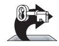

KEY POINT

You can expect some of these benefits from careful integration:

- Easier defect diagnosis
- Fewer defects
- Less scaffolding
- Shorter time to first working product
- Shorter overall development schedules
- Better customer relations
- Improved morale
- Improved chance of project completion
- More reliable schedule estimates
- More accurate status reporting
- Improved code quality
- Less documentation

These might seem like elevated claims for system testing's forgotten cousin, but the fact that it's overlooked in spite of its importance is precisely the reason integration has its own chapter in this book.

#### 29.2 Integration Frequency—Phased or Incremental?

Programs are integrated by means of either the phased or the incremental approach.

#### Phased Integration

Until a few years ago, phased integration was the norm. It follows these well-defined steps, or phases:

- **1.** Design, code, test, and debug each class. This step is called "unit development."
- **2.** Combine the classes into one whopping-big system ("system integration").
- **3.** Test and debug the whole system. This is called "system dis-integration." (Thanks to Meilir Page-Jones for this witty observation.)

One problem with phased integration is that when the classes in a system are put together for the first time, new problems inevitably surface and the causes of the problems could be anywhere. Since you have a large number of classes that have never worked together before, the culprit might be a poorly tested class, an error in the interface between two classes, or an error caused by an interaction between two classes. All classes are suspect.

The uncertainty about the location of any of the specific problems is compounded by the fact that all the problems suddenly present themselves at once. This forces you to deal not only with problems caused by interactions between classes but with problems that are hard to diagnose because the problems themselves interact. For this reason, another name for phased integration is "big bang integration," as shown in Figure 29-2.

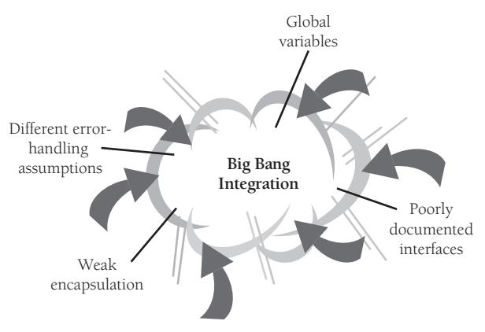

**Figure 29-2** Phased integration is also called "big bang" integration for a good reason!

Phased integration can't begin until late in the project, after all the classes have been developer-tested. When the classes are finally combined and errors surface by the score, programmers immediately go into panicky debugging mode rather than methodical error detection and correction.

For small programs—no, for tiny programs—phased integration might be the best approach. If the program has only two or three classes, phased integration might save you time, if you're lucky. But in most cases, another approach is better.

#### Incremental Integration

**Cross-Reference** Metaphors appropriate for incremental integration are discussed in "Software Oyster Farming: System Accretion" and "Software Construction: Building Software," both in Section 2.3. In incremental integration, you write and test a program in small pieces and then combine the pieces one at a time. In this one-piece-at-a-time approach to integration, you follow these steps:

- **1.** Develop a small, functional part of the system. It can be the smallest functional part, the hardest part, a key part, or some combination. Thoroughly test and debug it. It will serve as a skeleton on which to hang the muscles, nerves, and skin that make up the remaining parts of the system.
- **2.** Design, code, test, and debug a class.
- **3.** Integrate the new class with the skeleton. Test and debug the combination of skeleton and new class. Make sure the combination works before you add any new classes. If work remains to be done, repeat the process starting at step 2.

Occasionally, you might want to integrate units larger than a single class. If a component has been thoroughly tested, for example, and each of its classes put through a mini-integration, you can integrate the whole component and still be doing incremental integration. As you add pieces to it, the system grows and gains momentum in the same way that a snowball grows and gains momentum when it rolls down a hill, as shown in Figure 29-3.

#### Incremental Integration

**Figure 29-3** Incremental integration helps a project build momentum, like a snowball going down a hill.

#### Benefits of Incremental Integration

The incremental approach offers many advantages over the traditional phased approach regardless of which incremental strategy you use:

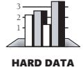

Errors are easy to locate When new problems surface during incremental integration, the new class is obviously involved. Either its interface to the rest of the program contains an error or its interaction with a previously integrated class produces an error. Either way, as suggested by Figure 29-4, you know exactly where to look. Moreover, simply because you have fewer problems at once, you reduce the risk that multiple problems will interact or that one problem will mask another. The more interface errors you tend to have, the more this benefit of incremental integration will help your projects. An accounting of errors for one project revealed that 39 percent were intermodule interface errors (Basili and Perricone 1984). Because developers on many projects spend up to 50 percent of their time debugging, maximizing debugging effectiveness by making errors easy to locate provides benefits in quality and productivity.

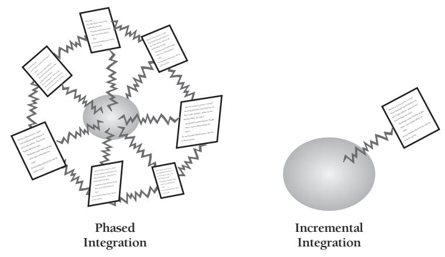

**Figure 29-4** In phased integration, you integrate so many components at once that it's hard to know where the error is. It might be in any of the components or in any of their connections. In incremental integration, the error is usually either in the new component or in the connection between the new component and the system.

*The system succeeds early in the project* When code is integrated and running, even if the system isn't usable, it's apparent that it soon will be. With incremental integration, programmers see early results from their work, so their morale is better than when they suspect that their project will never draw its first breath.

**You get improved progress monitoring** When you integrate frequently, the features that are present and not present are obvious. Management will have a better sense of progress from seeing 50 percent of a system's capability working than from hearing that coding is "99 percent complete."

*You'll improve customer relations* If frequent integration has an effect on developer morale, it also has an effect on customer morale. Customers like signs of progress, and incremental builds provide signs of progress frequently.

*The units of the system are tested more fully* Integration starts early in the project. You integrate each class as it's developed, rather than waiting for one magnificent binge of integration at the end. Classes are developer-tested in both cases, but each class is exercised as a part of the overall system more often with incremental integration than it is with phased integration.

*You can build the system with a shorter development schedule* If integration is planned carefully, you can design part of the system while another part is being coded. This doesn't reduce the total number of work-hours required to develop the complete design and code, but it allows some work to be done in parallel, an advantage when calendar time is at a premium.

Incremental integration supports and encourages other incremental strategies. The advantages of incrementalism applied to integration are the tip of the iceberg.

#### 29.3 Incremental Integration Strategies

With phased integration, you don't have to plan the order in which project components are built. All components are integrated at the same time, so you can build them in any order as long as they're all ready by D-day.

With incremental integration, you have to plan more carefully. Most systems will call for the integration of some components before the integration of others. Planning for integration thus affects planning for construction; the order in which components are constructed has to support the order in which they will be integrated.

Integration-order strategies come in a variety of shapes and sizes, and none is best in every case. The best integration approach varies from project to project, and the best solution is always the one that you create to meet the specific demands of a specific project. Knowing the points on the methodological number line will give you insight into the possible solutions.

#### Top-Down Integration

In top-down integration, the class at the top of the hierarchy is written and integrated first. The top is the main window, the applications control loop, the object that contains *main()* in Java, *WinMain()* for Microsoft Windows programming, or similar. Stubs have to be written to exercise the top class. Then, as classes are integrated from the top down, stub classes are replaced with real ones. This kind of integration proceeds as illustrated in Figure 29-5.

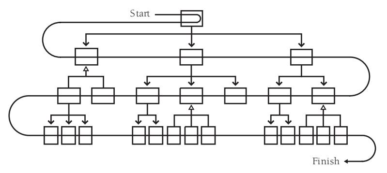

**Figure 29-5** In top-down integration, you add classes at the top first, at the bottom last.

An important aspect of top-down integration is that the interfaces between classes must be carefully specified. The most troublesome errors to debug are not the ones that affect single classes but those that arise from subtle interactions between classes. Careful interface specification can reduce the problem. Interface specification isn't an integration activity, but making sure that the interfaces have been specified well is.

In addition to the advantages you get from any kind of incremental integration, an advantage of top-down integration is that the control logic of the system is tested relatively early. All the classes at the top of the hierarchy are exercised a lot so that big, conceptual, design problems are exposed quickly.

Another advantage of top-down integration is that, if you plan it carefully, you can complete a partially working system early in the project. If the user-interface parts are at the top, you can get a basic interface working quickly and flesh out the details later. The morale of both users and programmers benefits from getting something visible working early.

Top-down incremental integration also allows you to begin coding before the lowlevel design details are complete. Once the design has been driven down to a fairly low level of detail in all areas, you can begin implementing and integrating the classes at the higher levels without waiting to dot every "i" and cross every "t."

In spite of these advantages, pure top-down integration usually involves disadvantages that are more troublesome than you'll want to put up with. Pure top-down integration leaves exercising the tricky system interfaces until last. If system interfaces are buggy or a performance problem, you'd usually like to get to them long before the end of the project. It's not unusual for a low-level problem to bubble its way to the top of the system, causing high-level changes and reducing the benefit of earlier integration work. Minimize the bubbling problem through careful, early developer testing and performance analysis of the classes that exercise system interfaces.

Another problem with pure top-down integration is that you need a dump truck full of stubs to integrate from the top down. Many low-level classes haven't been integrated, which implies that a large number of stubs will be needed during intermediate steps in integration. Stubs are problematic in that, as test code, they're more likely to contain errors than the more carefully designed production code. Errors in the new stubs that support a new class defeat the purpose of incremental integration, which is to restrict the source of errors to one new class.

**Cross-Reference** Top-down integration is related to topdown design in name only. For details on top-down design, see "Top-Down and Bottom-Up Design Approaches" in Section 5.4.

Top-down integration is also nearly impossible to implement purely. In top-down integration done by the book, you start at the top—call it Level 1—and then integrate all the classes at the next level (Level 2). When you've integrated all the classes from Level 2, and not before, you integrate the classes from Level 3. The rigidity in pure topdown integration is completely arbitrary. It's hard to imagine anyone going to the trouble of using pure top-down integration. Most people use a hybrid approach, such as integrating from the top down in sections instead.

Finally, you can't use top-down integration if the collection of classes doesn't have a top. In many interactive systems, the location of the "top" is subjective. In many systems, the user interface is the top. In other systems, *main()* is the top.

A good alternative to pure top-down integration is the vertical-slice approach shown in Figure 29-6. In this approach, the system is implemented top-down in sections, perhaps fleshing out areas of functionality one by one and then moving to the next area.

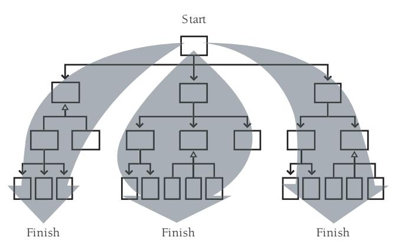

**Figure 29-6** As an alternative to proceeding strictly top to bottom, you can integrate from the top down in vertical slices.

Even though pure top-down integration isn't workable, thinking about it will help you decide on a general approach. Some of the benefits and hazards that apply to a pure top-down approach apply, less obviously, to looser top-down approaches like verticalslice integration, so keep them in mind.

#### Bottom-Up Integration

In bottom-up integration, you write and integrate the classes at the bottom of the hierarchy first. Adding the low-level classes one at a time rather than all at once is what makes bottom-up integration an incremental integration strategy. You write test drivers to exercise the low-level classes initially and add classes to the test-driver scaffolding as they're developed. As you add higher-level classes, you replace driver classes with real ones. Figure 29-7 shows the order in which classes are integrated in the bottom-up approach.

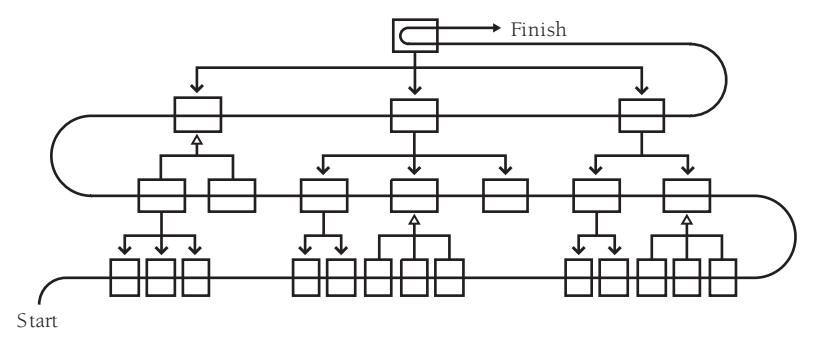

**Figure 29-7** In bottom-up integration, you integrate classes at the bottom first, at the top last.

Bottom-up integration provides a limited set of incremental integration advantages. It restricts the possible sources of error to the single class being integrated, so errors are easy to locate. Integration can start early in the project. Bottom-up integration also exercises potentially troublesome system interfaces early. Since system limitations often determine whether you can meet the system's goals, making sure the system has done a full set of calisthenics is worth the trouble.

The main problem with bottom-up integration is that it leaves integration of the major, high-level system interfaces until last. If the system has conceptual design problems at the higher levels, construction won't find them until all the detailed work has been done. If the design must be changed significantly, some of the low-level work might have to be discarded.

Bottom-up integration requires you to complete the design of the whole system before you start integration. If you don't, assumptions that needn't have controlled the design might end up deeply embedded in low-level code, giving rise to the awkward situation in which you design high-level classes to work around problems in low-level ones. Letting low-level details drive the design of higher-level classes contradicts principles of information hiding and object-oriented design. The problems of integrating higher-level classes are but a teardrop in a rainstorm compared to the problems you'll have if you don't complete the design of high-level classes before you begin low-level coding.

As with top-down integration, pure bottom-up integration is rare, and you can use a hybrid approach instead, including integrating in slices as shown in Figure 29-8.

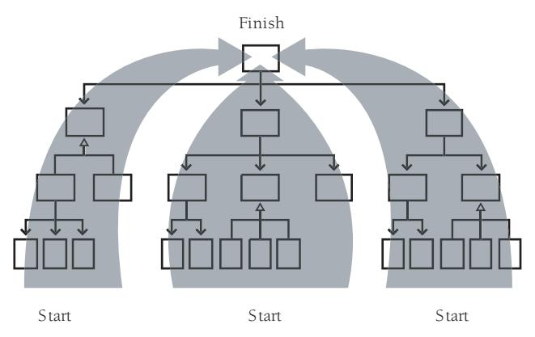

**Figure 29-8** As an alternative to proceeding purely bottom to top, you can integrate from the bottom up in sections. This blurs the line between bottom-up integration and featureoriented integration, which is described later in this chapter.

#### Sandwich Integration

The problems with pure top-down and pure bottom-up integration have led some experts to recommend a sandwich approach (Myers 1976). You first integrate the high-level business-object classes at the top of the hierarchy. Then you integrate the device-interface classes and widely used utility classes at the bottom. These high-level and low-level classes are the bread of the sandwich.

You leave the middle-level classes until later. These make up the meat, cheese, and tomatoes of the sandwich. If you're a vegetarian, they might make up the tofu and bean sprouts of the sandwich, but the author of sandwich integration is silent on this point maybe his mouth was full. Figure 29-9 offers an illustration of the sandwich approach.

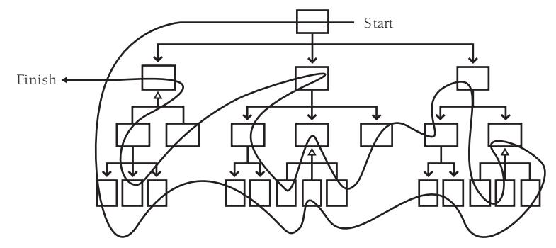

**Figure 29-9** In sandwich integration, you integrate top-level and widely used bottom-level classes first and you save middle-level classes for last.

This approach avoids the rigidity of pure bottom-up or top-down integration. It integrates the often-troublesome classes first and has the potential to minimize the amount of scaffolding you'll need. It's a realistic, practical approach. The next approach is similar but has a different emphasis.

#### Risk-Oriented Integration

Risk-oriented integration is also called "hard part first integration." It's like sandwich integration in that it seeks to avoid the problems inherent in pure top-down or pure bottom-up integration. Coincidentally, it also tends to integrate the classes at the top and the bottom first, saving the middle-level classes for last. The motivation, however, is different.

In risk-oriented integration, you identify the level of risk associated with each class. You decide which will be the most challenging parts to implement, and you implement them first. Experience indicates that top-level interfaces are risky, so they are often at the top of the risk list. System interfaces, usually at the bottom level of the hierarchy, are also risky, so they're also at the top of the risk list. In addition, you might know of classes in the middle that will be challenging. Perhaps a class implements a poorly understood algorithm or has ambitious performance goals. Such classes can also be identified as high risks and integrated relatively early.

The remainder of the code, the easy stuff, can wait until later. Some of it will probably turn out to be harder than you thought, but that's unavoidable. Figure 29-10 presents an illustration of risk-oriented integration.

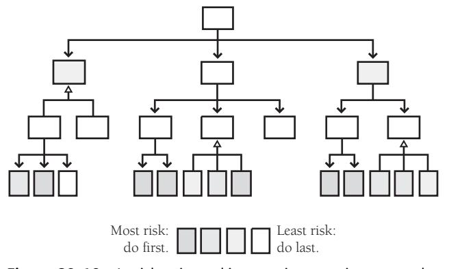

**Figure 29-10** In risk-oriented integration, you integrate classes that you expect to be most troublesome first; you implement easier classes later.

#### Feature-Oriented Integration

Another approach is to integrate one feature at a time. The term "feature" doesn't refer to anything fancy, just an identifiable function of the system you're integrating. If you're writing a word processor, a feature might be displaying underlining on the screen or reformatting the document automatically—something like that.

When the feature to be integrated is bigger than a single class, the "increment" in incremental integration is bigger than a single class. This diminishes the benefit of incrementalism a little in that it reduces your certainty about the source of new errors, but if you have thoroughly tested the classes that implement the new feature before you integrate them, that's only a small disadvantage. You can use the incremental integration strategies recursively by integrating small pieces to form features and then incrementally integrating features to form a system.

You'll usually want to start with a skeleton you've chosen for its ability to support the other features. In an interactive system, the first feature might be the interactive menu system. You can hang the rest of the features on the feature that you integrate first. Figure 29-11 shows how it looks graphically.

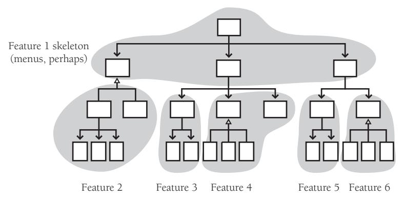

**Figure 29-11** In feature-oriented integration, you integrate classes in groups that make up identifiable features—usually, but not always, multiple classes at a time.

Components are added in "feature trees," hierarchical collections of classes that make up a feature. Integration is easier if each feature is relatively independent, perhaps calling the same low-level library code as the classes for other features but having no calls to middle-level code in common with other features. (The shared, low-level library classes aren't shown in Figure 29-11.)

Feature-oriented integration offers three main advantages. First, it eliminates scaffolding for virtually everything except low-level library classes. The skeleton might need a little scaffolding, or some parts of the skeleton might simply not be operational until particular features have been added. When each feature has been hung on the structure, however, no additional scaffolding is needed. Since each feature is self-contained, each feature contains all the support code it needs.

The second main advantage is that each newly integrated feature brings about an incremental addition in functionality. This provides evidence that the project is moving steadily forward. It also creates functional software that you can provide to your customers for evaluation or that you can release earlier and with less functionality than originally planned.

A third advantage is that feature-oriented integration works well with object-oriented design. Objects tend to map well to features, which makes feature-oriented integration a natural choice for object-oriented systems.

Pure feature-oriented integration is as difficult to pursue as pure top-down or bottomup integration. Usually some of the low-level code must be integrated before certain significant features can be.

#### T-Shaped Integration

A final approach that often addresses the problems associated with top-down and bottom-up integration is called "T-shaped integration." In this approach, one specific vertical slice is selected for early development and integration. That slice should exercise the system end-to-end and should be capable of flushing out any major problems in the system's design assumptions. Once that vertical slice has been implemented—and any associated problems have been corrected—the overall breadth of the system can be developed (such as the menu system in a desktop application). This approach, illustrated in Figure 29-12, is often combined with risk-oriented or feature-oriented integration.

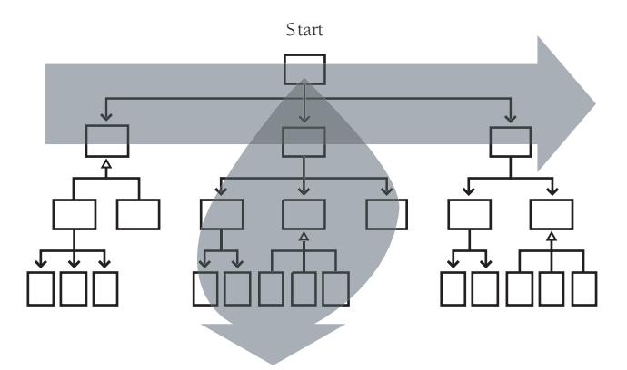

**Figure 29-12** In T-shaped integration, you build and integrate a deep slice of the system to verify architectural assumptions, and then you build and integrate the breadth of the system to provide a framework for developing the remaining functionality.

#### Summary of Integration Approaches

Bottom-up, top-down, sandwich, risk-oriented, feature-oriented, T-shaped—do you get the feeling that people are making these names up as they go along? They are. None of these approaches are robust procedures that you should follow methodically from step 1 to step 47 and then declare yourself to be done. Like software-design approaches, they are heuristics more than algorithms, and rather than following any procedure dogmatically, you come out ahead by making up a unique strategy tailored to your specific project.

#### 29.4 Daily Build and Smoke Test

**Further Reading** Much of this discussion is adapted from Chapter 18 of *Rapid Development* (McConnell 1996). If you've read that discussion, you might skip ahead to the "Continuous Integration" section.

Whatever integration strategy you select, a good approach to integrating the software is the "daily build and smoke test." Every file is compiled, linked, and combined into an executable program every day, and the program is then put through a "smoke test," a relatively simple check to see whether the product "smokes" when it runs.

This simple process produces several significant benefits. It reduces the risk of low quality, which is a risk related to the risk of unsuccessful or problematic integration. By smoke-testing all the code daily, quality problems are prevented from taking control of the project. You bring the system to a known, good state, and then you keep it there. You simply don't allow it to deteriorate to the point where time-consuming quality problems can occur.

This process also supports easier defect diagnosis. When the product is built and tested every day, it's easy to pinpoint why the product is broken on any given day. If the product worked on Day 17 and is broken on Day 18, something that happened between the two builds broke the product.

It improves morale. Seeing a product work provides an incredible boost to morale. It almost doesn't matter what the product does. Developers can be excited just to see it display a rectangle! With daily builds, a bit more of the product works every day, and that keeps morale high.

One side effect of frequent integration is that it surfaces work that can otherwise accumulate unseen until it appears unexpectedly at the end of the project. That accumulation of unsurfaced work can turn into an end-of-project tar pit that takes weeks or months to struggle out of. Teams that haven't used the daily build process sometimes feel that daily builds slow their progress to a snail's crawl. What's really happening is that daily builds amortize work more steadily throughout the project, and the project team is just getting a more accurate picture of how fast it's been working all along.

Here are some of the ins and outs of using daily builds:

*Build daily* The most fundamental part of the daily build is the "daily" part. As Jim McCarthy says, treat the daily build as the heartbeat of the project (McCarthy 1995). If there's no heartbeat, the project is dead. A little less metaphorically, Michael Cusumano and Richard W. Selby describe the daily build as the sync pulse of a project (Cusumano and Selby 1995). Different developers' code is allowed to get a little out of sync between these pulses, but every time there's a sync pulse, the code has to come back into alignment. When you insist on keeping the pulses close together, you prevent developers from getting out of sync entirely.

Some organizations build every week, rather than every day. The problem with this is that if the build is broken one week, you might go for several weeks before the next good build. When that happens, you lose virtually all of the benefit of frequent builds.

*Check for broken builds* For the daily-build process to work, the software that's built has to work. If the software isn't usable, the build is considered to be broken and fixing it becomes top priority.

Each project sets its own standard for what constitutes "breaking the build." The standard needs to set a quality level that's strict enough to keep showstopper defects out but lenient enough to disregard trivial defects, which can paralyze progress if given undue attention.

At a minimum, a "good" build should

- Compile all files, libraries, and other components successfully.
- Link all files, libraries, and other components successfully.
- Not contain any showstopper bugs that prevent the program from being launched or that make it hazardous to operate; in other words, a good build should pass the smoke test.

*Smoke test daily* The smoke test should exercise the entire system from end to end. It does not have to be exhaustive, but it should be capable of exposing major problems. The smoke test should be thorough enough that if the build passes, you can assume that it is stable enough to be tested more thoroughly.

The daily build has little value without the smoke test. The smoke test is the sentry that guards against deteriorating product quality and creeping integration problems. Without it, the daily build becomes just a time-wasting exercise in ensuring that you have a clean compile every day.

*Keep the smoke test current* The smoke test must evolve as the system evolves. At first, the smoke test will probably test something simple, such as whether the system can say "Hello, World." As the system develops, the smoke test will become more thorough. The first test might take a matter of seconds to run; as the system grows, the smoke test can grow to 10 minutes, an hour, or more. If the smoke test isn't kept current, the daily build can become an exercise in self-deception, in which a fractional set of test cases creates a false sense of confidence in the product's quality.

*Automate the daily build and smoke test* Care and feeding of the build can become time-consuming. Automating the build and smoke test helps ensure that the code gets built and the smoke test gets run. It isn't practical to build and smoke test daily without automation.

*Establish a build group* On most projects, tending the daily build and keeping the smoke test up to date becomes a big enough task to be an explicit part of someone's job. On large projects, it can become a full-time job for more than one person. On the first release of Microsoft Windows NT, for example, there were four full-time people in the build group (Zachary 1994).

*Add revisions to the build only when it makes sense to do so...* Individual developers usually don't write code quickly enough to add meaningful increments to the system on a daily basis. They should work on a chunk of code and then integrate it when they have a collection of code in a consistent state—usually once every few days.

*...but don't wait too long to add a set of revisions* Beware of checking in code infrequently. It's possible for a developer to become so embroiled in a set of revisions that every file in the system seems to be involved. That undermines the value of the daily build. The rest of the team will continue to realize the benefit of incremental integration, but that particular developer will not. If a developer goes more than a couple of days without checking in a set of changes, consider that developer's work to be at risk. As Kent Beck points out, frequent integration sometimes forces you to break the construction of a single feature into multiple episodes. That overhead is an acceptable price to pay for the reduced integration risk, improved status visibility, improved testability, and other benefits of frequent integration (Beck 2000).

*Require developers to smoke test their code before adding it to the system* Developers need to test their own code before they add it to the build. A developer can do this by creating a private build of the system on a personal machine, which the developer then tests individually. Or the developer can release a private build to a "testing buddy," a tester who focuses on that developer's code. The goal in either case is to be sure that the new code passes the smoke test before it's allowed to influence other parts of the system.

*Create a holding area for code that's to be added to the build* Part of the success of the daily build process depends on knowing which builds are good and which are not. In testing their own code, developers need to be able to rely on a known good system.

Most groups solve this problem by creating a holding area for code that developers think is ready to be added to the build. New code goes into the holding area, the new build is built, and if the build is acceptable, the new code is migrated into the master sources.

On small and medium-sized projects, a version-control system can serve this function. Developers check new code into the version-control system. Developers who want to

use a known good build simply set a date flag in their version-control options file that tells the system to retrieve files based on the date of the last-known good build.

On large projects or projects that use unsophisticated version-control software, the holding area function has to be handled manually. The author of a set of new code sends e-mail to the build group to tell them where to find the new files to be checked in. Or the group establishes a "check-in" area on a file server where developers put new versions of their source files. The build group then assumes responsibility for checking new code into version control after they have verified that the new code doesn't break the build.

*Create a penalty for breaking the build* Most groups that use daily builds create a penalty for breaking the build. Make it clear from the beginning that keeping the build healthy is one of the project's top priorities. A broken build should be the exception, not the rule. Insist that developers who have broken the build stop all other work until they've fixed it. If the build is broken too often, it's hard to take seriously the job of not breaking the build.

A light-hearted penalty can help to emphasize this priority. Some groups give out lollipops to each "sucker" who breaks the build. This developer then has to tape the sucker to his office door until he fixes the problem. Other groups have guilty developers wear goat horns or contribute \$5 to a morale fund.

Some projects establish a penalty with more bite. Microsoft developers on high-profile projects such as Windows 2000 and Microsoft Office have taken to wearing beepers in the late stages of their projects. If they break the build, they get called in to fix it even if their defect is discovered at 3 a.m.

*Release builds in the morning* Some groups have found that they prefer to build overnight, smoke test in the early morning, and release new builds in the morning rather than the afternoon. Smoke testing and releasing builds in the morning has several advantages.

First, if you release a build in the morning, testers can test with a fresh build that day. If you generally release builds in the afternoon, testers feel compelled to launch their automated tests before they leave for the day. When the build is delayed, which it often is, the testers have to stay late to launch their tests. Because it's not their fault that they have to stay late, the build process becomes demoralizing.

When you complete the build in the morning, you have more reliable access to developers when there are problems with the build. During the day, developers are down the hall. During the evening, developers can be anywhere. Even when developers are given beepers, they're not always easy to locate.

It might be more macho to start smoke testing at the end of the day and call people in the middle of the night when you find problems, but it's harder on the team, it wastes time, and in the end you lose more than you gain.

*Build and smoke test even under pressure* When schedule pressure becomes intense, the work required to maintain the daily build can seem like extravagant overhead. The opposite is true. Under stress, developers lose some of their discipline. They feel pressure to take construction shortcuts that they would not take under less stressful circumstances. They review and test their own code less carefully than usual. The code tends toward a state of entropy more quickly than it does during less stressful times.

Against this backdrop, daily builds enforce discipline and keep pressure-cooker projects on track. The code still tends toward a state of entropy, but the build process brings that tendency to heel every day.

#### What Kinds of Projects Can Use the Daily Build Process?

Some developers protest that it's impractical to build every day because their projects are too large. But what was perhaps the most complex software project in recent history used daily builds successfully. By the time it was released, Microsoft Windows 2000 consisted of about 50 million lines of code spread across tens of thousands of source files. A complete build took as many as 19 hours on several machines, but the Windows 2000 development team still managed to build every day. Far from being a nuisance, the Windows 2000 team attributed much of its success on that huge project to their daily builds. The larger the project, the more important incremental integration becomes.

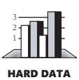

A review of 104 projects in the U.S., India, Japan, and Europe found that only 20–25 percent of projects used daily builds at either the beginning or middle of their projects (Cusumano et al. 2003), so this represents a significant opportunity for improvement.

#### Continuous Integration

Some software writers have taken daily builds as a jumping-off point and recommend integrating *continuously* (Beck 2000). Most of the published references to continuous integration use the word "continuous" to mean "at least daily" (Beck 2000), which I think is reasonable. But I occasionally encounter people who take the word "continuous" literally. They aim to integrate each change with the latest build every couple of hours. For most projects, I think literal continuous integration is too much of a good thing.

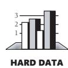

In my free time, I operate a discussion group consisting of the top technical executives from companies like Amazon.com, Boeing, Expedia, Microsoft, Nordstrom, and other Seattle-area companies. In a poll of these top technical executives, *none* of them thought that continuous integration was superior to daily integration. On mediumsized and large projects, there is value in letting the code get out of sync for short periods. Developers frequently get out of sync when they make larger-scale changes. They can then resynchronize after a short time. Daily builds allow the project team rendezvous points that are frequently enough. As long as the team syncs up every day, they don't need to rendezvous continuously.

#### cc2e.com/2992 CHECKLIST: Integration

#### Integration Strategy

- ❑ Does the strategy identify the optimal order in which subsystems, classes, and routines should be integrated?
- ❑ Is the integration order coordinated with the construction order so that classes will be ready for integration at the right time?
- ❑ Does the strategy lead to easy diagnosis of defects?
- ❑ Does the strategy keep scaffolding to a minimum?
- ❑ Is the strategy better than other approaches?
- ❑ Have the interfaces between components been specified well? (Specifying interfaces isn't an integration task, but verifying that they have been specified well is.)

#### Daily Build and Smoke Test

- ❑ Is the project building frequently—ideally, daily—to support incremental integration?
- ❑ Is a smoke test run with each build so that you know whether the build works?
- ❑ Have you automated the build and the smoke test?
- ❑ Do developers check in their code frequently—going no more than a day or two between check-ins?
- ❑ Is the smoke test kept up to date with the code, expanding as the code expands?
- ❑ Is a broken build a rare occurrence?
- ❑ Do you build and smoke test the software even when you're under pressure?

#### Additional Resources

**cc2e.com/2999** Following are additional resources related to this chapter's subjects:

#### Integration

Lakos, John. *Large-Scale C++ Software Design*. Boston, MA: Addison-Wesley, 1996. Lakos argues that a system's "physical design"—its hierarchy of files, directories, and libraries—significantly affects a development team's ability to build software. If you don't pay attention to the physical design, build times will become long enough to undermine frequent integration. Lakos's discussion focuses on C++, but the insights related to "physical design" apply just as much to projects in other languages.

Myers, Glenford J. *The Art of Software Testing*. New York, NY: John Wiley & Sons, 1979. This classic testing book discusses integration as a testing activity.

#### Incrementalism

McConnell, Steve. *Rapid Development*. Redmond, WA: Microsoft Press, 1996. Chapter 7, "Lifecycle Planning," goes into much detail about the tradeoffs involved with moreflexible and less-flexible life-cycle models. Chapters 20, 21, 35, and 36 discuss specific life-cycle models that support various degrees of incrementalism. Chapter 19 describes "designing for change," a key activity needed to support iterative and incremental development models.

Boehm, Barry W. "A Spiral Model of Software Development and Enhancement." *Computer*, May 1988: 61–72. In this paper, Boehm describes his "spiral model" of software development. He presents the model as an approach to managing risk in a software-development project, so the paper is about development generally rather than about integration specifically. Boehm is one of the world's foremost experts on the big-picture issues of software development, and the clarity of his explanations reflects the quality of his understanding.

Gilb, Tom. *Principles of Software Engineering Management*. Wokingham, England: Addison-Wesley, 1988. Chapters 7 and 15 contain thorough discussions of evolutionary delivery, one of the first incremental development approaches.

Beck, Kent. *Extreme Programming Explained: Embrace Change*. Reading, MA: Addison-Wesley, 2000. This book contains a more modern, more concise, and more evangelical presentation of many of the ideas in Gilb's book. I personally prefer the depth of analysis presented in Gilb's book, but some readers may find Beck's presentation more accessible or more directly applicable to the kind of project they're working on.

### Key Points

- The construction sequence and integration approach affect the order in which classes are designed, coded, and tested.
- A well-thought-out integration order reduces testing effort and eases debugging.
- Incremental integration comes in several varieties, and, unless the project is trivial, any one of them is better than phased integration.
- The best integration approach for any specific project is usually a combination of top-down, bottom-up, risk-oriented, and other integration approaches. Tshaped integration and vertical-slice integration are two approaches that often work well.
- Daily builds can reduce integration problems, improve developer morale, and provide useful project management information.
