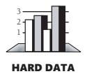
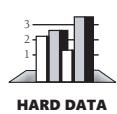

# Chapter 30: Programming Tools


<span id="page-745-0"></span>
### cc2e.com/3084 Contents

- 30.1 Design Tools: page 710
- 30.2 Source-Code Tools: page 710
- 30.3 Executable-Code Tools: page 716
- 30.4 Tool-Oriented Environments: page 720
- 30.5 Building Your Own Programming Tools: page 721
- 30.6 Tool Fantasyland: page 722

#### Related Topics

- Version-control tools: in Section 28.2
- Debugging tools: Section 23.5
- Test-support tools: Section 22.5

Modern programming tools decrease the amount of time required for construction. Use of a leading-edge tool set—and familiarity with the tools used—can increase productivity by 50 percent or more (Jones 2000; Boehm et al. 2000). Programming tools can also reduce the amount of tedious detail work that programming requires.



A dog might be man's best friend, but a few good tools are a programmer's best friends. As Barry Boehm discovered long ago, 20 percent of the tools tend to account for 80 percent of the tool usage (1987b). If you're missing one of the more helpful tools, you're missing something that you could use a lot.

This chapter is focused in two ways. First, it covers only construction tools. Requirements-specification, management, and end-to-end-development tools are outside the scope of the book. Refer to the "Additional Resources" section at the end of the chapter for more information on tools for those aspects of software development. Second, this chapter covers kinds of tools rather than specific brands. A few tools are so common that they're discussed by name, but specific versions, products, and companies change so quickly that information about most of them would be out of date before the ink on these pages was dry.

A programmer can work for many years without discovering some of the most valuable tools available. The mission of this chapter is to survey available tools and help you determine whether you've overlooked any tools that might be useful. If you're a tool expert, you won't find much new information in this chapter. You might skim the earlier parts of the chapter, read Section 30.6 on "Tool Fantasyland," and then move on to the next chapter.

#### 30.1 Design Tools

**Cross-Reference** For details on design, see Chapters 5 through 9.

Current design tools consist mainly of graphical tools that create design diagrams. Design tools are sometimes embedded in a computer-aided software engineering (CASE) tool with broader functions; some vendors advertise standalone design tools as CASE tools. Graphical design tools generally allow you to express a design in common graphical notations: UML, architecture block diagrams, hierarchy charts, entity relationship diagrams, or class diagrams. Some graphical design tools support only one notation. Others support a variety.

In one sense, these design tools are just fancy drawing packages. Using a simple graphics package or pencil and paper, you can draw everything that the tool can draw. But the tools offer valuable capabilities that a simple graphics package can't. If you've drawn a bubble chart and you delete a bubble, a graphical design tool will automatically rearrange the other bubbles, including connecting arrows and lower-level bubbles connected to the bubble. The tool takes care of the housekeeping when you add a bubble, too. A design tool can enable you to move between higher and lower levels of abstraction. A design tool will check the consistency of your design, and some tools can create code directly from your design.

### 30.2 Source-Code Tools

The tools available for working with source code are richer and more mature than the tools available for working with designs.

#### Editing

This group of tools relates to editing source code.

#### Integrated Development Environments (IDEs)



Some programmers estimate that they spend as much as 40 percent of their time editing source code (Parikh 1986, Ratliff 1987). If that's the case, spending a few extra dollars for the best possible IDE is a good investment.

In addition to basic word-processing functions, good IDEs offer these features:

- Compilation and error detection from within the editor
- Integration with source-code control, build, test, and debugging tools

- Compressed or outline views of programs (class names only or logical structures without the contents, also known as "folding")
- Jump to definitions of classes, routines, and variables
- Jump to all places where a class, routine, or variable is used
- Language-specific formatting
- Interactive help for the language being edited
- Brace (*begin-end*) matching
- Templates for common language constructs (the editor completing the structure of a *for* loop after the programmer types *for*, for example)
- Smart indenting (including easily changing the indentation of a block of statements when logic changes)
- Automated code transforms or refactorings
- Macros programmable in a familiar programming language
- Listing of search strings so that commonly used strings don't need to be retyped
- Regular expressions in search-and-replace
- Search-and-replace across a group of files
- Editing multiple files simultaneously
- Side-by-side diff comparisons
- Multilevel undo

Considering some of the primitive editors still in use, you might be surprised to learn that several editors include all these capabilities.

#### Multiple-File String Searching and Replacing

If your editor doesn't support search-and-replace across multiple files, you can still find supplementary tools to do that job. These tools are useful for search for all occurrences of a class name or routine name. When you find an error in your code, you can use such tools to check for similar errors in other files.

You can search for exact strings, similar strings (ignoring differences in capitalization), or regular expressions. Regular expressions are particularly powerful because they let you search for complex string patterns. If you wanted to find all the array references containing magic numbers (digits "0" through "9"), you could search for "[", followed by zero or more spaces, followed by one or more digits, followed by zero or more spaces, followed by "]". One widely available search tool is called "grep." A grep query for magic numbers would look like this:

You can make the search criteria more sophisticated to fine-tune the search.

It's often helpful to be able to change strings across multiple files. For example, if you want to give a routine, constant, or global variable a better name, you might have to change the name in several files. Utilities that allow string changes across multiple files make that easy to do, which is good because you should have as few obstructions as possible to creating excellent class names, routine names, and constant names. Common tools for handling multiple-file string changes include Perl, AWK, and sed.

#### Diff Tools

Programmers often need to compare two files. If you make several attempts to correct an error and need to remove the unsuccessful attempts, a file comparator will make a comparison of the original and modified files and list the lines you've changed. If you're working on a program with other people and want to see the changes they have made since the last time you worked on the code, a comparator tool such as Diff will make a comparison of the current version with the last version of the code you worked on and show the differences. If you discover a new defect that you don't remember encountering in an older version of a program, rather than seeing a neurologist about amnesia, you can use a comparator to compare current and old versions of the source code, determine exactly what changed, and find the source of the problem. This functionality is often built into revision-control tools.

#### Merge Tools

One style of revision control locks source files so that only one person can modify a file at a time. Another style allows multiple people to work on files simultaneously and handles merging changes at check-in time. In this working mode, tools that merge changes are critical. These tools typically perform simple merges automatically and query the user for merges that conflict with other merges or that are more involved.

#### Source-Code Beautifiers

**Cross-Reference** For details on program layout, see Chapter 31, "Layout and Style."

Source-code beautifiers spruce up your source code so that it looks consistent. They highlight class and routine names, standardize your indentation style, format comments consistently, and perform other similar functions. Some beautifiers can put each routine onto a separate Web page or printed page or perform even more dramatic formatting. Many beautifiers let you customize the way in which the code is beautified.

There are at least two classes of source-code beautifiers. One class takes the source code as input and produces much better looking output without changing the original source code. Another kind of tool changes the source code itself—standardizing indentation, parameter list formatting, and so on. This capability is useful when working with large quantities of legacy code. The tool can do much of the tedious formatting work needed to make the legacy code conform to your coding style conventions.

#### Interface Documentation Tools

Some tools extract detailed programmer-interface documentation from source-code files. The code inside the source file uses clues such as *@tag* fields to identify text that should be extracted. The interface documentation tool then extracts that tagged text and presents it with nice formatting. Javadoc is a prominent example of this kind of tool.

#### Templates

Templates help you exploit the simple idea of streamlining keyboarding tasks that you do often and want to do consistently. Suppose you want a standard comment prolog at the beginning of your routines. You could build a skeleton prolog with the correct syntax and places for all the items you want in the standard prolog. This skeleton would be a "template" you'd store in a file or a keyboard macro. When you created a new routine, you could easily insert the template into your source file. You can use the template technique for setting up larger entities, such as classes and files, or smaller entities, such as loops.

If you're working on a group project, templates are an easy way to encourage consistent coding and documentation styles. Make templates available to the whole team at the beginning of the project, and the team will use them because they make its job easier—you get the consistency as a side benefit.

#### Cross-Reference Tools

A cross-reference tool lists variables and routines and all the places in which they're used—typically on Web pages.

#### Class Hierarchy Generators

A class-hierarchy generator produces information about inheritance trees. This is sometimes useful in debugging but is more often used for analyzing a program's structure or modularizing a program into packages or subsystems. This functionality is also available in some IDEs.

#### Analyzing Code Quality

Tools in this category examine the static source code to assess its quality.

#### Picky Syntax and Semantics Checkers

Syntax and semantics checkers supplement your compiler by checking code more thoroughly than the compiler normally does. Your compiler might check for only rudimentary syntax errors. A picky syntax checker might use nuances of the language to check for more subtle errors—things that aren't wrong from a compiler's point of view but that you probably didn't intend to write. For example, in C++, the statement

```
while ( i = 0 ) ...
```

is a perfectly legal statement, but it's usually meant to be

```
while ( i = = 0 ) ...
```

The first line is syntactically correct, but switching *=* and *==* is a common mistake and the line is probably wrong. Lint is a picky syntax and semantics checker you can find in many C/C++ environments. Lint warns you about uninitialized variables, completely unused variables, variables that are assigned values and never used, parameters of a routine that are passed out of the routine without being assigned a value, suspicious pointer operations, suspicious logical comparisons (like the one in the example just shown), inaccessible code, and many other common problems. Other languages offer similar tools.

#### Metrics Reporters

**Cross-Reference** For more information on metrics, see Section 28.4, "Measurement."

Some tools analyze your code and report on its quality. For example, you can obtain tools that report on the complexity of each routine so that you can target the most complicated routines for extra review, testing, or redesign. Some tools count lines of code, data declarations, comments, and blank lines in either entire programs or individual routines. They track defects and associate them with the programmers who made them, the changes that correct them, and the programmers who make the corrections. They count modifications to the software and note the routines that are modified the most often. Complexity analysis tools have been found to have about a 20 percent positive impact on maintenance productivity (Jones 2000).

#### Refactoring Source Code

A few tools aid in converting source code from one format to another.

#### Refactorers

**Cross-Reference** For more on refactoring, see Chapter 24, "Refactoring."

A refactoring program supports common code refactorings either on a standalone basis or integrated into an IDE. Refactoring browsers allow you to change the name of a class across an entire code base easily. They allow you to extract a routine simply by highlighting the code you'd like to turn into a new routine, entering the new routine's name, and ordering parameters in a parameter list. Refactorers make code changes quicker and less error-prone. They're available for Java and Smalltalk and are becoming available for other languages. For more about refactoring tools, see Chapter 14, "Refactoring Tools" in *Refactoring* (Fowler 1999).

#### Restructurers

A restructurer will convert a plate of spaghetti code with *goto*s to a more nutritious entrée of better-structured code without *goto*s. Capers Jones reports that in maintenance environments code restructuring tools can have a 25–30 percent positive impact on maintenance productivity (Jones 2000). A restructurer has to make a lot of assumptions when it converts code, and if the logic is terrible in the original, it will still be terrible in the converted version. If you're doing a conversion manually, however, you can use a restructurer for the general case and hand-tune the hard cases. Alternatively, you can run the code through the restructurer and use it for inspiration for the hand conversion.

#### Code Translators

Some tools translate code from one language to another. A translator is useful when you have a large code base that you're moving to another environment. The hazard in using a language translator is that if you start with bad code the translator simply translates the bad code into an unfamiliar language.

#### Version Control

**Cross-Reference** These tools and their benefits are described in "Software Code Changes" in Section 28.2.

You can deal with proliferating software versions by using version-control tools for

- Source-code control
- Dependency control like that offered by the make utility associated with UNIX
- Project documentation versioning
- Relating project artifacts like requirements, code, and test cases so that when a requirement changes, you can find the code and tests that are affected

#### Data Dictionaries

A data dictionary is a database that describes all the significant data in a project. In many cases, the data dictionary focuses primarily on database schemas. On large projects, a data dictionary is also useful for keeping track of the hundreds or thousands of class definitions. On large team projects, it's useful for avoiding naming clashes. A clash might be a direct, syntactic clash, in which the same name is used twice, or it might be a more subtle clash (or gap) in which different names are used to mean the same thing or the same name is used to mean subtly different things. For each data item (database table or class), the data dictionary contains the item's name and description. The dictionary might also contain notes about how the item is used.

#### 30.3 Executable-Code Tools

Tools for working with executable code are as rich as the tools for working with source code.

#### Code Creation

The tools described in this section help with code creation.

#### Compilers and Linkers

Compilers convert source code to executable code. Most programs are written to be compiled, although some are still interpreted.

A standard linker links one or more object files, which the compiler has generated from your source files, with the standard code needed to make an executable program. Linkers typically can link files from multiple languages, allowing you to choose the language that's most appropriate for each part of your program without your having to handle the integration details yourself.

An overlay linker helps you put 10 pounds in a five-pound sack by developing programs that execute in less memory than the total amount of space they consume. An overlay linker creates an executable file that loads only part of itself into memory at any one time, leaving the rest on a disk until it's needed.

#### Build Tools

The purpose of a build tool is to minimize the time needed to build a program using current versions of the program's source files. For each target file in your project, you specify the source files that the target file depends on and how to make it. Build tools also eliminate errors related to sources being in inconsistent states; the build tool ensures they are all brought to a consistent state. Common build tools include the make utility that's associated with UNIX and the ant tool that's used for Java programs.

Suppose you have a target file named *userface.obj*. In the make file, you indicate that to make *userface.obj*, you have to compile the file *userface.cpp*. You also indicate that *userface.cpp* depends on *userface.h*, *stdlib.h*, and *project.h*. The concept of "depends on" simply means that if *userface.h*, *stdlib.h*, or *project.h* changes, *userface.cpp* needs to be recompiled.

When you build your program, the make tool checks all the dependencies you've described and determines the files that need to be recompiled. If five of your 250 source files depend on data definitions in *userface.h* and it changes, make automatically recompiles the five files that depend on it. It doesn't recompile the 245 files that don't depend on *userface.h*. Using make or ant beats the alternatives of recompiling all 250 files or recompiling each file manually, forgetting one, and getting weird out-ofsynch errors. Overall, build tools like make or ant substantially improve the time and reliability of the average compile-link-run cycle.

Some groups have found interesting alternatives to dependency-checking tools like make. For example, the Microsoft Word group found that simply rebuilding all source files was faster than performing extensive dependency checking with make as long as the source files themselves were optimized (header file contents and so on). With this approach, the average developer's machine on the Word project could rebuild the entire Word executable—several million lines of code—in about 13 minutes.

#### Code Libraries

A good way to write high-quality code in a short amount of time is not to write it all but to find an open source version or buy it instead. You can find high-quality libraries in at least these areas:

- Container classes
- Credit card transaction services (e-commerce services)
- Cross-platform development tools. You might write code that executes in Microsoft Windows, Apple Macintosh, and the X Window System just by recompiling for each environment.
- Data compression tools
- Data types and algorithms
- Database operations and data-file manipulation tools
- Diagramming, graphing, and charting tools
- Imaging tools
- License managers
- Mathematical operations
- Networking and internet communications tools
- Report generators and report query builders
- Security and encryption tools
- Spreadsheet and grid tools
- Text and spelling tools
- Voice, phone, and fax tools

#### Code-Generation Wizards

If you can't find the code you want, how about getting someone else to write it instead? You don't have to put on your yellow plaid jacket and slip into a car salesman's patter to con someone else into writing your code. You can find tools that write code for you, and such tools are often integrated into IDEs.

Code-generating tools tend to focus on database applications, but that includes a lot of applications. Commonly available code generators write code for databases, user interfaces, and compilers. The code they generate is rarely as good as code generated by a human programmer, but many applications don't require handcrafted code. It's worth more to some users to have 10 working applications than to have one that works exceptionally well.

Code generators are also useful for making prototypes of production code. Using a code generator, you might be able to hack out a prototype in a few hours that demonstrates key aspects of a user interface or you might be able to experiment with various design approaches. It might take you several weeks to hand-code as much functionality. If you're just experimenting, why not do it in the cheapest possible way?

The common drawback of code generators is that they tend to generate code that's nearly unreadable. If you ever have to maintain such code, you can regret not writing it by hand in the first place.

#### Setup and Installation

Numerous vendors provide tools that support creation of setup programs. These tools typically support the creation of disks, CDs, or DVDs or installation over the Web. They check whether common library files already exist on the target installation machine, perform version checking, and so on.

#### Preprocessors

**Cross-Reference** For details on moving debugging aids in and out of the code, see "Plan to Remove Debugging Aids" in Section 8.6.

Preprocessors and preprocessor macro functions are useful for debugging because they make it easy to switch between development code and production code. During development, if you want to check memory fragmentation at the beginning of each routine, you can use a macro at the beginning of each routine. You might not want to leave the checks in production code, so for the production code you can redefine the macro so that it doesn't generate any code at all. For similar reasons, preprocessor macros are good for writing code that's targeted to be compiled in multiple environments—for example, in both Windows and Linux.

If you use a language with primitive control constructs, such as assembler, you can write a control-flow preprocessor to emulate the structured constructs of *if-then-else* and *while* loops in your language.

**cc2e.com/3091** If your language doesn't have a preprocessor, you can use a standalone preprocessor as part of your build process. One readily available preprocessor is M4, available from *www.gnu.org/software/m4/*.

#### Debugging

**Cross-Reference** These tools and their benefits are described in Section 23.5, "Debugging Tools—Obvious and Not-So-Obvious."

These tools help in debugging:

- Compiler warning messages
- Test scaffolding
- Diff tools (for comparing different versions of source-code files)
- Execution profilers
- Trace monitors
- Interactive debuggers—both software and hardware

Testing tools, discussed next, are related to debugging tools.

#### Testing

**Cross-Reference** These tools and their benefits are described in Section 22.5, "Test-Support Tools."

These features and tools can help you do effective testing:

- Automated test frameworks like JUnit, NUnit, CppUnit, and so on
- Automated test generators
- Test-case record and playback utilities
- Coverage monitors (logic analyzers and execution profilers)
- Symbolic debuggers
- System perturbers (memory fillers, memory shakers, selective memory failers, memory-access checkers)
- Diff tools (for comparing data files, captured output, and screen images)
- Scaffolding
- Defect-injection tools
- Defect-tracking software

#### Code Tuning

These tools can help you fine-tune your code.

#### Execution Profilers

An execution profiler watches your code while it runs and tells you how many times each statement is executed or how much time the program spends on each statement or execution path. Profiling your code while it's running is like having a doctor press a stethoscope to your chest and tell you to cough. It gives you insight into how your program works, where the hot spots are, and where you should focus your code-tuning efforts.

#### Assembler Listings and Disassemblers

Some day you might want to look at the assembler code generated by your high-level language. Some high-level-language compilers generate assembler listings. Others don't, and you have to use a disassembler to re-create the assembler from the machine code that the compiler generates. Looking at the assembler code generated by your compiler shows you how efficiently your compiler translates high-level-language code into machine code. It can tell you why high-level code that looks fast runs slowly. In Chapter 26, "Code-Tuning Techniques," several of the benchmark results are counterintuitive. While benchmarking that code, I frequently referred to the assembler listings to better understand the results that didn't make sense in the high-level language.

If you're not comfortable with assembly language and you want an introduction, you won't find a better one than comparing each high-level-language statement you write to the assembler instructions generated by the compiler. A first exposure to assembler is often a loss of innocence. When you see how much code the compiler creates—how much more than it needs to—you'll never look at your compiler in quite the same way again.

Conversely, in some environments the compiler must generate extremely complex code. Studying the compiler output can foster an appreciation for just how much work would be required to program in a lower level language.

### 30.4 Tool-Oriented Environments

Some environments have proven to be better suited to tool-oriented programming than others.

The UNIX environment is famous for its collection of small tools with funny names that work well together: grep, diff, sort, make, crypt, tar, lint, ctags, sed, awk, vi, and others. The C and C++ languages, closely coupled with UNIX, embody the same philosophy; the standard C++ library is composed of small functions that can easily be composed into larger functions because they work so well together.

**cc2e.com/3026** Some programmers work so productively in UNIX that they take it with them. They use UNIX work-alike tools to support their UNIX habits in Windows and other environments. One tribute to the success of the UNIX paradigm is the availability of tools that put a UNIX costume on other machines. For example, cygwin provides UNIXequivalent tools that work under Windows (*www.cygwin.com*).

> Eric Raymond's *The Art of Unix Programming* (2004) contains an insightful discussion of the UNIX programming culture.

#### 30.5 Building Your Own Programming Tools

Suppose you're given five hours to do the job and you have a choice:

- Do the job comfortably in five hours, or
- Spend four hours and 45 minutes feverishly building a tool to do the job, and then have the tool do the job in 15 minutes.

Most good programmers would choose the first option one time out of a million and the second option in every other case. Building tools is part of the warp and woof of programming. Nearly all large organizations (organizations with more than 1000 programmers) have internal tool and support groups. Many have proprietary requirements and design tools that are superior to those on the market (Jones 2000).

You can write many of the tools described in this chapter. Doing so might not be costeffective, but there aren't any mountainous technical barriers to doing it.

#### Project-Specific Tools

Most medium-sized and large projects need special tools unique to the project. For example, you might need tools to generate special kinds of test data, to verify the quality of data files, or to emulate hardware that isn't yet available. Here are some examples of project-specific tool support:

- An aerospace team was responsible for developing in-flight software to control an infrared sensor and analyze its data. To verify the performance of the software, an in-flight data recorder documented the actions of the in-flight software. Engineers wrote custom data-analysis tools to analyze the performance of the in-flight systems. After each flight, they used the custom tools to check the primary systems.
- Microsoft planned to include a new font technology in a release of its Windows graphical environment. Since both the font data files and the software to display the fonts were new, errors could have arisen from either the data or the software. Microsoft developers wrote several custom tools to check for errors in the data files, which improved their ability to discriminate between font data errors and software errors.

■ An insurance company developed an ambitious system to calculate its rate increases. Because the system was complicated and accuracy was essential, hundreds of computed rates needed to be checked carefully, even though hand calculating a single rate took several minutes. The company wrote a separate software tool to compute rates one at a time. With the tool, the company could compute a single rate in a few seconds and check rates from the main program in a small fraction of the time it would have taken to check the main program's rates by hand.

Part of planning for a project should be thinking about the tools that might be needed and allocating time for building them.

#### Scripts

A script is a tool that automates a repetitive chore. In some systems, scripts are called batch files or macros. Scripts can be simple or complex, and some of the most useful are the easiest to write. For example, I keep a journal, and to protect my privacy, I encrypt it except when I'm writing in it. To make sure that I always encrypt and decrypt it properly, I have a script that decrypts my journal, executes the word processor, and then encrypts the journal. The script looks like this:

```
crypto c:\word\journal.* %1 /d /Es /s 
word c:\word\journal.doc 
crypto c:\word\journal.* %1 /Es /s
```

The *%1* is the field for my password which, for obvious reasons, isn't included in the script. The script saves me the work of typing (and mistyping) all the parameters and ensures that I always perform all the operations and perform them in the right order.

If you find yourself typing something longer than about five characters more than a few times a day, it's a good candidate for a script or batch file. Examples include compile/link sequences, backup commands, and any command with a lot of parameters.

#### 30.6 Tool Fantasyland

**Cross-Reference** Tool availability depends partly on the maturity of the technical environment. For more on this, see Section 4.3, "Your Location on the Technology Wave."

For decades, tool vendors and industry pundits have promised that the tools needed to eliminate programming are just over the horizon. The first, and perhaps most ironic, tool to receive this moniker was Fortran. Fortran or "Formula Translation Language" was conceived so that scientists and engineers could simply type in formulas, thus supposedly eliminating the need for programmers.

Fortran did succeed in making it possible for scientists and engineers to write programs, but from our vantage point today, Fortran appears to be a comparatively lowlevel programming language. It hardly eliminated the need for programmers, and what the industry experienced with Fortran is indicative of progress in the software industry as a whole.

The software industry constantly develops new tools that reduce or eliminate some of the most tedious aspects of programming: details of laying out source statements; steps needed to edit, compile, link, and run a program; work needed to find mismatched braces; the number of steps needed to create standard message boxes; and so on. As each of these new tools begins to demonstrate incremental gains in productivity, pundits extrapolate those gains out to infinity, assuming that the gains will eventually "eliminate the need for programming." But what's happening in reality is that each new programming innovation arrives with a few blemishes. As time goes by, the blemishes are removed and that innovation's full potential is realized. However, once the fundamental tool concept is realized, further gains are achieved by stripping away the accidental difficulties that were created as side effects of creating the new tool. Elimination of these accidental difficulties does not increase productivity per se; it simply eliminates the "one step back" from the typical "two steps forward, one step back" equation.

Over the past several decades, programmers have seen numerous tools that were supposed to eliminate programming. First it was third-generation languages. Then it was fourth generation languages. Then it was automatic programming. Then it was CASE tools. Then it was visual programming. Each of these advances spun off valuable, incremental improvements to computer programming—and collectively they have made programming unrecognizable to anyone who learned programming before these advances. But none of these innovations succeeded in eliminating programming.

**Cross-Reference** Reasons for the difficulty of programming are described in "Accidental and Essential Difficulties" in Section 5.2.

The reason for this dynamic is that, at its essence, programming is fundamentally *hard*—even with good tool support. No matter what tools are available, programmers will have to wrestle with the messy real world; we will have to think rigorously about sequences, dependencies, and exceptions; and we'll have to deal with end users who can't make up their minds. We will always have to wrestle with ill-defined interfaces to other software and hardware, and we'll have to account for regulations, business rules, and other sources of complexity that arise from outside the world of computer programming.

We will always need people who can bridge the gap between the real-world problem to be solved and the computer that is supposed to be solving the problem. These people will be called programmers regardless of whether we're manipulating machine registers in assembler or dialog boxes in Microsoft Visual Basic. As long as we have computers, we'll need people who tell the computers what to do, and that activity will be called programming.

When you hear a tool vendor claim "This new tool will eliminate computer programming," run! Or at least smile to yourself at the vendor's naive optimism.

#### Additional Resources

**cc2e.com/3098** Take a look at these additional resources for more on programming tools:

**cc2e.com/3005** *www.sdmagazine.com/jolts*. *Software Development Magazine*'s annual Jolt Productivity award website is a good source of information about the best current tools.

> Hunt, Andrew and David Thomas. *The Pragmatic Programmer*. Boston, MA: Addison-Wesley, 2000. Section 3 of this book provides an in-depth discussion of programming tools, including editors, code generators, debuggers, source-code control, and related tools.

**cc2e.com/3012** Vaughn-Nichols, Steven. "Building Better Software with Better Tools," *IEEE Computer*, September 2003, pp. 12–14. This article surveys tool initiatives led by IBM, Microsoft Research, and Sun Research.

> Glass, Robert L. *Software Conflict: Essays on the Art and Science of Software Engineering*. Englewood Cliffs, NJ: Yourdon Press, 1991. The chapter titled "Recommended: A Minimum Standard Software Toolset" provides a thoughtful counterpoint to the moretools-is-better view. Glass argues for the identification of a minimum set of tools that should be available to all developers and proposes a starting kit.

Jones, Capers. *Estimating Software Costs*. New York, NY: McGraw-Hill, 1998.

Boehm, Barry, et al. *Software Cost Estimation with Cocomo II*. Reading, MA: Addison-Wesley, 2000. Both the Jones and the Boehm books devote sections to the impact of tool use on productivity.

#### cc2e.com/3019 Checklist: Programming Tools

- ❑ Do you have an effective IDE?
- ❑ Does your IDE support integration with source-code control; build, test, and debugging tools; and other useful functions?
- ❑ Do you have tools that automate common refactorings?
- ❑ Are you using version control to manage source code, content, requirements, designs, project plans, and other project artifacts?
- ❑ If you're working on a very large project, are you using a data dictionary or some other central repository that contains authoritative descriptions of each class used in the system?
- ❑ Have you considered code libraries as alternatives to writing custom code, where available?

- ❑ Are you making use of an interactive debugger?
- ❑ Do you use make or other dependency-control software to build programs efficiently and reliably?
- ❑ Does your test environment include an automated test framework, automated test generators, coverage monitors, system perturbers, diff tools, and defect-tracking software?
- ❑ Have you created any custom tools that would help support your specific project's needs, especially tools that automate repetitive tasks?
- ❑ Overall, does your environment benefit from adequate tool support?

#### Key Points

- Programmers sometimes overlook some of the most powerful tools for years before discovering them.
- Good tools can make your life a lot easier.
- Tools are readily available for editing, analyzing code quality, refactoring, version control, debugging, testing, and code tuning.
- You can make many of the special-purpose tools you need.
- Good tools can reduce the more tedious aspects of software development, but they can't eliminate the need for programming, although they will continue to reshape what we mean by "programming."
