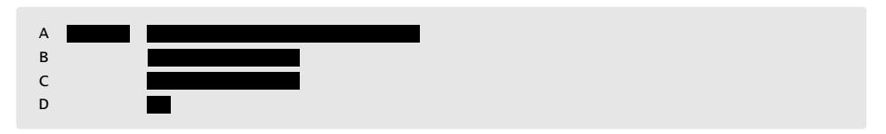
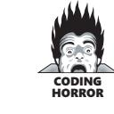
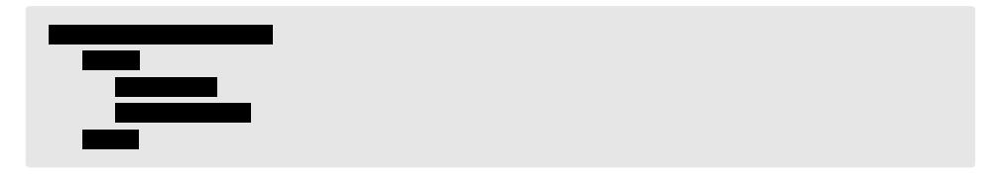
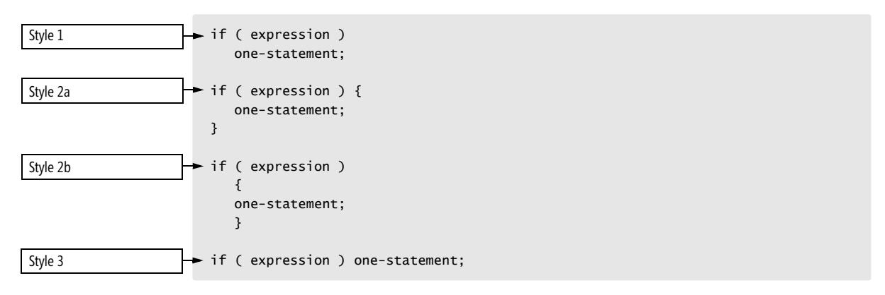
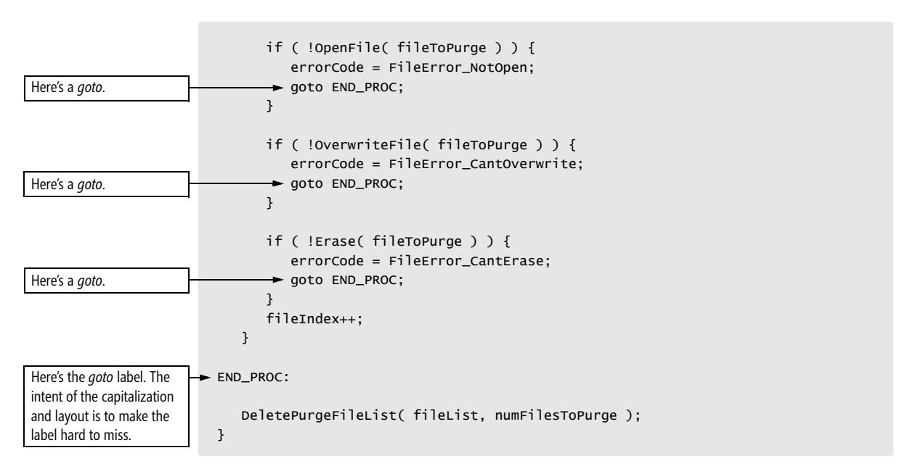
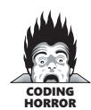
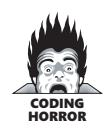
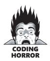
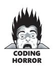

# Chapter 31: Layout and Style


<span id="page-765-0"></span>
### cc2e.com/3187 Contents

- 31.1 Layout Fundamentals: page 730
- 31.2 Layout Techniques: page 736
- 31.3 Layout Styles: page 738
- 31.4 Laying Out Control Structures: page 745
- 31.5 Laying Out Individual Statements: page 753
- 31.6 Laying Out Comments: page 763
- 31.7 Laying Out Routines: page 766
- 31.8 Laying Out Classes: page 768

#### Related Topics

- Self-documenting code: Chapter 32
- Code formatting tools: "Editing" in Section 30.2

This chapter turns to an aesthetic aspect of computer programming: the layout of program source code. The visual and intellectual enjoyment of well-formatted code is a pleasure that few nonprogrammers can appreciate. But programmers who take pride in their work derive great artistic satisfaction from polishing the visual structure of their code.

The techniques in this chapter don't affect execution speed, memory use, or other aspects of a program that are visible from outside the program. They affect how easy it is to understand the code, review it, and revise it months after you write it. They also affect how easy it is for others to read, understand, and modify once you're out of the picture.

This chapter is full of the picky details that people refer to when they talk about "attention to detail." Over the life of a project, attention to such details makes a difference in the initial quality and the ultimate maintainability of the code you write. Such details are too integral to the coding process to be changed effectively later. If they're to be done at all, they must be done during initial construction. If you're working on a team project, have your team read this chapter and agree on a team style before you begin coding.

You might not agree with everything you read here, but my point is less to win your agreement than to convince you to consider the issues involved in formatting style. If you have high blood pressure, move on to the next chapter—it's less controversial.

#### 31.1 Layout Fundamentals

This section explains the theory of good layout. The rest of the chapter explains the practice.

#### Layout Extremes

Consider the routine shown in Listing 31-1:

**Listing 31-1** Java layout example #1.


/\* Use the insertion sort technique to sort the "data" array in ascending order. This routine assumes that data[ firstElement ] is not the first element in data and that data[ firstElement-1 ] can be accessed. \*/ public void InsertionSort( int[] data, int firstElement, int lastElement ) { /\* Replace element at lower boundary with an element guaranteed to be first in a sorted list. \*/ int lowerBoundary = data[ firstElement-1 ]; data[ firstElement-1 ] = SORT\_MIN; /\* The elements in positions firstElement through sortBoundary-1 are always sorted. In each pass through the loop, sortBoundary is increased, and the element at the position of the new sortBoundary probably isn't in its sorted place in the array, so it's inserted into the proper place somewhere between firstElement and sortBoundary. \*/ for ( int sortBoundary = firstElement+1; sortBoundary <= lastElement; sortBoundary++ ) { int insertVal = data[ sortBoundary ]; int insertPos = sortBoundary; while ( insertVal < data[ insertPos-1 ] ) { data[ insertPos ] = data[ insertPos-1 ]; insertPos = insertPos-1; } data[ insertPos ] = insertVal; } /\* Replace original lower-boundary element \*/ data[ firstElement-1 ] = lowerBoundary; }

The routine is syntactically correct. It's thoroughly commented and has good variable names and clear logic. If you don't believe that, read it and find a mistake! What the routine doesn't have is good layout. This is an extreme example, headed toward "negative infinity" on the number line of bad-to-good layout. Listing 31-2 is a less extreme example:

**Listing 31-2** Java layout example #2.


```
/* Use the insertion sort technique to sort the "data" array in ascending 
order. This routine assumes that data[ firstElement ] is not the 
first element in data and that data[ firstElement-1 ] can be accessed. */ 
public void InsertionSort( int[] data, int firstElement, int lastElement ) { 
/* Replace element at lower boundary with an element guaranteed to be first in a 
sorted list. */ 
int lowerBoundary = data[ firstElement-1 ]; 
data[ firstElement-1 ] = SORT_MIN; 
/* The elements in positions firstElement through sortBoundary-1 are 
always sorted. In each pass through the loop, sortBoundary 
is increased, and the element at the position of the 
new sortBoundary probably isn't in its sorted place in the 
array, so it's inserted into the proper place somewhere 
between firstElement and sortBoundary. */ 
for ( 
int sortBoundary = firstElement+1; 
sortBoundary <= lastElement;
```

```
sortBoundary++ 
) { 
int insertVal = data[ sortBoundary ]; 
int insertPos = sortBoundary; 
while ( insertVal < data[ insertPos-1 ] ) { 
data[ insertPos ] = data[ insertPos-1 ]; 
insertPos = insertPos-1; 
} 
data[ insertPos ] = insertVal; 
} 
/* Replace original lower-boundary element */ 
data[ firstElement-1 ] = lowerBoundary; 
}
```

This code is the same as Listing 31-1's. Although most people would agree that the code's layout is much better than the first example's, the code is still not very readable. The layout is still crowded and offers no clue to the routine's logical organization. It's at about 0 on the number line of bad-to-good layout. The first example was contrived, but the second one isn't at all uncommon. I've seen programs several thousand lines long with layout at least as bad as this. With no documentation and bad variable names, overall readability was worse than in this example. This code is formatted for the computer; there's no evidence that the author expected the code to be read by humans. Listing 31-3 is an improvement.

**Listing 31-3** Java layout example #3.

```
/* Use the insertion sort technique to sort the "data" array in ascending 
order. This routine assumes that data[ firstElement ] is not the 
first element in data and that data[ firstElement-1 ] can be accessed. 
*/ 
public void InsertionSort( int[] data, int firstElement, int lastElement ) { 
 // Replace element at lower boundary with an element guaranteed to be 
 // first in a sorted list. 
 int lowerBoundary = data[ firstElement-1 ]; 
 data[ firstElement-1 ] = SORT_MIN; 
 /* The elements in positions firstElement through sortBoundary-1 are 
 always sorted. In each pass through the loop, sortBoundary 
 is increased, and the element at the position of the 
 new sortBoundary probably isn't in its sorted place in the 
 array, so it's inserted into the proper place somewhere 
 between firstElement and sortBoundary. 
 */ 
 for ( int sortBoundary = firstElement + 1; sortBoundary <= lastElement; 
 sortBoundary++ ) { 
 int insertVal = data[ sortBoundary ]; 
 int insertPos = sortBoundary; 
 while ( insertVal < data[ insertPos - 1 ] ) { 
 data[ insertPos ] = data[ insertPos - 1 ]; 
 insertPos = insertPos - 1; 
 }
```

```
 data[ insertPos ] = insertVal; 
 } 
 // Replace original lower-boundary element 
 data[ firstElement - 1 ] = lowerBoundary; 
}
```

This layout of the routine is a strong positive on the number line of bad-to-good layout. The routine is now laid out according to principles that are explained throughout this chapter. The routine has become much more readable, and the effort that has been put into documentation and good variable names is now evident. The variable names were just as good in the earlier examples, but the layout was so poor that they weren't helpful.

The only difference between this example and the first two is the use of white space the code and comments are exactly the same. White space is of use only to human readers—your computer could interpret any of the three fragments with equal ease. Don't feel bad if you can't do as well as your computer!

#### The Fundamental Theorem of Formatting

The Fundamental Theorem of Formatting says that good visual layout shows the logical structure of a program.


Making the code look pretty is worth something, but it's worth less than showing the code's structure. If one technique shows the structure better and another looks better, use the one that shows the structure better. This chapter presents numerous examples of formatting styles that look good but that misrepresent the code's logical organization. In practice, prioritizing logical representation usually doesn't create ugly code—unless the logic of the code is ugly. Techniques that make good code look good and bad code look bad are more useful than techniques that make all code look good.

#### Human and Computer Interpretations of a Program

Any fool can write code that a computer can understand. Good programmers write code that humans can understand.

—*Martin Fowler*

Layout is a useful clue to the structure of a program. Whereas the computer might care exclusively about braces or *begin* and *end*, a human reader is apt to draw clues from the visual presentation of the code. Consider the code fragment in Listing 31-4, in which the indentation scheme makes it look to a human as if three statements are executed each time the loop is executed.

**Listing 31-4** Java example of layout that tells different stories to humans and computers.

```
// swap left and right elements for whole array 
for ( i = 0; i < MAX_ELEMENTS; i++ ) 
 leftElement = left[ i ]; 
 left[ i ] = right[ i ]; 
 right[ i ] = leftElement;
```

If the code has no enclosing braces, the compiler will execute the first statement *MAX\_ELEMENTS* times and the second and third statements one time each. The indentation makes it clear to you and me that the author of the code wanted all three statements to be executed together and intended to put braces around them. That won't be clear to the compiler. Listing 31-5 is another example:

**Listing 31-5** Another Java example of layout that tells different stories to humans and computers.

```
x = 3+4 * 2+7;
```

A human reader of this code would be inclined to interpret the statement to mean that *x* is assigned the value *(3+4) \* (2+7)*, or *63*. The computer will ignore the white space and obey the rules of precedence, interpreting the expression as *3 + (4\*2) + 7*, or *18*. The point is that a good layout scheme would make the visual structure of a program match the logical structure, or tell the same story to the human that it tells to the computer.

#### How Much Is Good Layout Worth?

*Our studies support the claim that knowledge of programming plans and rules of programming discourse can have a significant impact on program comprehension. In their book called [The] Elements of [Programming] Style, Kernighan and Plauger also identify what we would call discourse rules. Our empirical results put teeth into these rules: It is not merely a matter of aesthetics that programs should be written in a particular style. Rather there is a psychological basis for writing programs in a conventional manner: programmers have strong expectations that other programmers will follow these discourse rules. If the rules are violated, then the utility afforded by the expectations that programmers have built up over time is effectively nullified. The results from the experiments with novice and advanced student programmers and with professional programmers described in this paper provide clear support for these claims.*

*—Elliot Soloway and Kate Ehrlich*

In layout, perhaps more than in any other aspect of programming, the difference between communicating with the computer and communicating with human readers comes into play. The smaller part of the job of programming is writing a program so that the computer can read it; the larger part is writing it so that other humans can read it.

In their classic paper "Perception in Chess," Chase and Simon reported on a study that compared the abilities of experts and novices to remember the positions of pieces in chess (1973). When pieces were arranged on the board as they might be during a game, the experts' memories were far superior to the novices'. When the pieces were arranged randomly, there was little difference between the memories of the experts and the novices. The traditional interpretation of this result is that an

**Cross-Reference** Good layout is one key to readability. For details on the value of readability, see Section 34.3, "Write Programs for People First, Computers Second."

expert's memory is not inherently better than a novice's but that the expert has a knowledge structure that helps him or her remember particular kinds of information. When new information corresponds to the knowledge structure—in this case, the sensible placement of chess pieces—the expert can remember it easily. When new information doesn't correspond to a knowledge structure—the chess pieces are randomly positioned—the expert can't remember it any better than the novice.

A few years later, Ben Shneiderman duplicated Chase and Simon's results in the computer-programming arena and reported his results in a paper called "Exploratory Experiments in Programmer Behavior" (1976). Shneiderman found that when program statements were arranged in a sensible order, experts were able to remember them better than novices. When statements were shuffled, the experts' superiority was reduced. Shneiderman's results have been confirmed in other studies (McKeithen et al. 1981, Soloway and Ehrlich 1984). The basic concept has also been confirmed in the games Go and bridge and in electronics, music, and physics (McKeithen et al. 1981).

After I published the first edition of this book, Hank, one of the programmers who reviewed the manuscript, said "I was surprised that you didn't argue more strongly in favor of a brace style that looks like this:

```
for ( ...) 
 { 
 }
```

"I was surprised that you even included the brace style that looked like this:

```
for ( ...) { 
}
```

"I thought that, with both Tony and me arguing for the first style, you'd prefer that."

I responded, "You mean you were arguing for the first style, and Tony was arguing for the second style, don't you? Tony argued for the second style, not the first."

Hank responded, "That's funny. The last project Tony and I worked on together, I preferred style #2, and Tony preferred style #1. We spent the whole project arguing about which style was best. I guess we talked one another into preferring each other's styles!"

This experience, as well as the studies cited above, suggest that structure helps experts to perceive, comprehend, and remember important features of programs. Expert programmers often cling to their own styles tenaciously, even when they're vastly different from other styles used by other expert programmers. The bottom line is that the details of a specific method of structuring a program are much less important than the fact that the program is structured consistently.


#### Layout as Religion

The importance to comprehension and memory of structuring one's environment in a familiar way has led some researchers to hypothesize that layout might harm an expert's ability to read a program if the layout is different from the scheme the expert uses (Sheil 1981, Soloway and Ehrlich 1984). That possibility, compounded by the fact that layout is an aesthetic as well as a logical exercise, means that debates about program formatting often sound more like religious wars than philosophical discussions.


**Cross-Reference** If you're mixing software and religion, you might read Section 34.9, "Thou Shalt Rend Software and Religion Asunder" before reading the rest of this chapter.

At a coarse level, it's clear that some forms of layout are better than others. The successively better layouts of the same code at the beginning of this chapter made that evident. This book won't steer clear of the finer points of layout just because they're controversial. Good programmers should be open-minded about their layout practices and accept practices proven to be better than the ones they're used to, even if adjusting to a new method results in some initial discomfort.

#### Objectives of Good Layout

The results point out the fragility of programming expertise: advanced programmers have *strong* expectations about what programs should look like, and when those expectations are violated in seemingly innocuous ways—their performance drops drastically. —*Elliot Soloway and Kate Ehrlich*

Many decisions about layout details are a matter of subjective aesthetics; often, you can accomplish the same goal in many ways. You can make debates about subjective issues less subjective if you explicitly specify the criteria for your preferences. Explicitly, then, a good layout scheme should do the following:

*Accurately represent the logical structure of the code* That's the Fundamental Theorem of Formatting again: the primary purpose of good layout is to show the logical structure of the code. Typically, programmers use indentation and other white space to show the logical structure.

*Consistently represent the logical structure of the code* Some styles of layout have rules with so many exceptions that it's hard to follow the rules consistently. A good style applies to most cases.

*Improve readability* An indentation strategy that's logical but that makes the code harder to read is useless. A layout scheme that calls for spaces only where they are required by the compiler is logical but not readable. A good layout scheme makes code easier to read.

*Withstand modifications* The best layout schemes hold up well under code modification. Modifying one line of code shouldn't require modifying several others.

In addition to these criteria, minimizing the number of lines of code needed to implement a simple statement or block is also sometimes considered.

#### How to Put the Layout Objectives to Use


You can use the criteria for a good layout scheme to ground a discussion of layout so that the subjective reasons for preferring one style over another are brought into the open.

Weighting the criteria in different ways might lead to different conclusions. For example, if you feel strongly that minimizing the number of lines used on the screen is important—perhaps because you have a small computer screen—you might criticize one style because it uses two more lines for a routine parameter list than another.

#### 31.2 Layout Techniques

You can achieve good layout by using a few layout tools in several different ways. This section describes each of them.

#### White Space

Usewhitespacetoenhancereadability. White space, including spaces, tabs, line breaks, and blank lines, is the main tool available to you for showing a program's structure.

**Cross-Reference** Some researchers have explored the similarity between the structure of a book and the structure of a program. For information, see "The Book Paradigm for Program Documentation" in Section 32.5. You wouldn't think of writing a book with no spaces between words, no paragraph breaks, and no divisions into chapters. Such a book might be readable cover to cover, but it would be virtually impossible to skim it for a line of thought or to find an important passage. Perhaps more important, the book's layout wouldn't show the reader how the author intended to organize the information. The author's organization is an important clue to the topic's logical organization.

Breaking a book into chapters, paragraphs, and sentences shows a reader how to mentally organize a topic. If the organization isn't evident, the reader has to provide the organization, which puts a much greater burden on the reader and adds the possibility that the reader may never figure out how the topic is organized.

The information contained in a program is denser than the information contained in most books. Whereas you might read and understand a page of a book in a minute or two, most programmers can't read and understand a naked program listing at anything close to that rate. A program should give more organizational clues than a book, not fewer.

*Grouping* From the other side of the looking glass, white space is grouping, making sure that related statements are grouped together.

In writing, thoughts are grouped into paragraphs. A well-written paragraph contains only sentences that relate to a particular thought. It shouldn't contain extraneous sentences. Similarly, a paragraph of code should contain statements that accomplish a single task and that are related to each other.

*Blank lines* Just as it's important to group related statements, it's important to separate unrelated statements from each other. The start of a new paragraph in English is identified with indentation or a blank line. The start of a new paragraph of code should be identified with a blank line.

Using blank lines is a way to indicate how a program is organized. You can use them to divide groups of related statements into paragraphs, to separate routines from one another, and to highlight comments.


Although this particular statistic may be hard to put to work, a study by Gorla, Benander, and Benander found that the optimal number of blank lines in a program is about 8 to 16 percent. Above 16 percent, debug time increases dramatically (1990).

*Indentation* Use indentation to show the logical structure of a program. As a rule, you should indent statements under the statement to which they are logically subordinate.


Indentation has been shown to be correlated with increased programmer comprehension. The article "Program Indentation and Comprehensibility" reported that several studies found correlations between indentation and improved comprehension (Miaria et al. 1983). Subjects scored 20 to 30 percent higher on a test of comprehension when programs had a two-to-four-spaces indentation scheme than they did when programs had no indentation at all.


The same study found that it was important to neither underemphasize nor overemphasize a program's logical structure. The lowest comprehension scores were achieved on programs that were not indented at all. The second lowest were achieved on programs that used six-space indentation. The study concluded that two-to-fourspace indentation was optimal. Interestingly, many subjects in the experiment felt that the six-space indentation was easier to use than the smaller indentations, even though their scores were lower. That's probably because six-space indentation looks pleasing. But regardless of how pretty it looks, six-space indentation turns out to be less readable. This is an example of a collision between aesthetic appeal and readability.

#### Parentheses

Use more parentheses than you think you need. Use parentheses to clarify expressions that involve more than two terms. They may not be needed, but they add clarity and they don't cost you anything. For example, how are the following expressions evaluated?

```
C++ version: 12 + 4 % 3 * 7 / 8
Microsoft Visual Basic version: 12 + 4 mod 3 * 7 / 8
```

The key question is, did you have to think about how the expressions are evaluated? Can you be confident in your answer without checking some references? Even experienced programmers don't answer confidently, and that's why you should use parentheses whenever there's any doubt about how an expression is evaluated.

#### 31.3 Layout Styles

Most layout issues have to do with laying out blocks, the groups of statements below control statements. A block is enclosed between braces or keywords: *{* and *}* in C++ and Java, *if-then-endif* in Visual Basic, and other similar structures in other languages. For simplicity, much of this discussion uses *begin* and *end* generically, assuming that you can figure out how the discussion applies to braces in C++ and Java or other blocking mechanisms in other languages. The following sections describe four general styles of layout:

- Pure blocks
- Emulating pure blocks
- Using *begin-end* pairs (braces) to designate block boundaries
- Endline layout

#### Pure Blocks

Much of the layout controversy stems from the inherent awkwardness of the more popular programming languages. A well-designed language has clear block structures that lend themselves to a natural indentation style. In Visual Basic, for example, each control construct has its own terminator and you can't use a control construct without using the terminator. Code is blocked naturally. Some examples in Visual Basic are shown in Listing 31-6, Listing 31-7, and Listing 31-8:

#### **Listing 31-6** Visual Basic example of a pure *if* block.

```
If pixelColor = Color_Red Then 
 statement1 
 statement2 
 ... 
End If
```

#### **Listing 31-7** Visual Basic example of a pure *while* block.

```
While pixelColor = Color_Red 
 statement1 
 statement2 
 ... 
Wend
```

**Listing 31-8** Visual Basic example of a pure *case* block.

```
Select Case pixelColor 
 Case Color_Red 
 statement1 
 statement2 
 ... 
 Case Color_Green 
 statement1 
 statement2 
 ... 
 Case Else 
 statement1 
 statement2 
 ... 
End Select
```

A control construct in Visual Basic always has a beginning statement—*If-Then*, *While*, and *Select-Case* in the examples—and it always has a corresponding *End* statement. Indenting the inside of the structure isn't a controversial practice, and the options for aligning the other keywords are somewhat limited. Listing 31-9 is an abstract representation of how this kind of formatting works:

**Listing 31-9** Abstract example of the pure-block layout style.

```
A XXXXXXXXXXXXXXXXXXXX 
B XXXXXXXXXXXX 
C XXXXXXXXXXXXXXX 
D XXXX
```

In this example, statement A begins the control construct and statement D ends the control construct. The alignment between the two provides solid visual closure.

The controversy about formatting control structures arises in part from the fact that some languages don't *require* block structures. You can have an *if-then* followed by a single statement and not have a formal block. You have to add a *begin-end* pair or opening and closing braces to create a block rather than getting one automatically with each control construct. Uncoupling *begin* and *end* from the control structure—as languages like C++ and Java do with *{* and *}*—leads to questions about where to put the *begin* and *end*. Consequently, many indentation problems are problems only because you have to compensate for poorly designed language structures. Various ways to compensate are described in the following sections.

#### Emulating Pure Blocks

A good approach in languages that don't have pure blocks is to view the *begin* and *end* keywords (or *{* and *}* tokens) as extensions of the control construct they're used with. Then it's sensible to try to emulate the Visual Basic formatting in your language. Listing 31-10 is an abstract view of the visual structure you're trying to emulate:

**Listing 31-10** Abstract example of the pure-block layout style.

```
A XXXXXXXXXXXXXXXXXXXX 
B XXXXXXXXXXXX 
C XXXXXXXXXXXXXXX 
D XXXX
```

In this style, the control structure opens the block in statement A and finishes the block in statement D. This implies that the *begin* should be at the end of statement A and the *end* should be statement D. In the abstract, to emulate pure blocks, you'd have to do something like Listing 31-11:

**Listing 31-11** Abstract example of emulating the pure-block style.

```
A XXXXXXXXXXXXXX{X 
B XXXXXXXXXXXXXX 
C XXXXXXXXXXXXXXXXX 
D }X
```

Some examples of how the style looks in C++ are shown in Listing 31-12, Listing 31-13, and Listing 31-14:

#### **Listing 31-12** C++ example of emulating a pure *if* block.

```
if ( pixelColor == Color_Red ) { 
 statement1; 
 statement2; 
 ... 
}
```

#### **Listing 31-13** C++ example of emulating a pure *while* block.

```
while ( pixelColor == Color_Red ) { 
 statement1; 
 statement2; 
 ... 
}
```

#### **Listing 31-14** C++ example of emulating a pure *switch/case* block.

```
switch ( pixelColor ) { 
 case Color_Red: 
 statement1; 
 statement2; 
 ... 
 break; 
 case Color_Green: 
 statement1; 
 statement2; 
 ... 
 break; 
 default: 
 statement1; 
 statement2; 
 ... 
 break; 
}
```

This style of alignment works pretty well. It looks good, you can apply it consistently, and it's maintainable. It supports the Fundamental Theorem of Formatting in that it helps to show the logical structure of the code. It's a reasonable style choice. This style is standard in Java and common in C++.

#### Using** *begin-end* **Pairs (Braces) to Designate Block Boundaries

A substitute for a pure-block structure is to view *begin-end* pairs as block boundaries. (The following discussion uses *begin-end* to refer generically to *begin-end* pairs, braces, and other equivalent language structures.) If you take that approach, you view the *begin* and the *end* as statements that follow the control construct rather than as fragments that are part of it. Graphically, this is the ideal, just as it was with the pure-block emulation shown again in Listing 31-15:

**Listing 31-15** Abstract example of the pure-block layout style.

```
A XXXXXXXXXXXXXXXXXXX 
B XXXXXXXXXXXX 
C XXXXXXXXXXXXXX 
D XXXX
```

But in this style, to treat the *begin* and the *end* as parts of the block structure rather than the control statement, you have to put the *begin* at the beginning of the block (rather than at the end of the control statement) and the *end* at the end of the block (rather than terminating the control statement). In the abstract, you'll have to do something like what's done in Listing 31-16:

**Listing 31-16** Abstract example of using *begin* and *end* as block boundaries.

```
A XXXXXXXXXXXXXXXXXXXX 
 {XXXXXXXXXXXXXXXX 
B XXXXXXXXXXXXXXXXX 
C XXXXXXXXXXXXXXXXX 
 }X
```

Some examples of how using *begin* and *end* as block boundaries looks in C++ are shown in Listing 31-17, Listing 31-18, and Listing 31-19:

**Listing 31-17** C++ example of using *begin* and *end* as block boundaries in an *if* block.

```
if ( pixelColor == Color_Red ) 
 { 
 statement1; 
 statement2; 
 ... 
 }
```

**Listing 31-18** C++ example of using *begin* and *end* as block boundaries in a *while* block.

```
while ( pixelColor == Color_Red ) 
 { 
 statement1; 
 statement2; 
 ... 
 }
```

**Listing 31-19** C++ example of using *begin* and *end* as block boundaries in a *switch/case* block.

```
switch ( pixelColor ) 
 { 
 case Color_Red: 
 statement1; 
 statement2; 
 ... 
 break; 
 case Color_Green: 
 statement1; 
 statement2; 
 ... 
 break; 
 default: 
 statement1; 
 statement2; 
 ... 
 break; 
 }
```

This alignment style works well; it supports the Fundamental Theorem of Formatting (once again, by exposing the code's underlying logical structure). Its only limitation is that it can't be applied literally in *switch/case* statements in C++ and Java, as shown by Listing 31-19. (The *break* keyword is a substitute for the closing brace, but there is no equivalent to the opening brace.)

#### Endline Layout

Another layout strategy is "endline layout," which refers to a large group of layout strategies in which the code is indented to the middle or end of the line. The endline indentation is used to align a block with the keyword that began it, to make a routine's subsequent parameters line up under its first parameter, to line up cases in a *case* statement, and for other similar purposes. Listing 31-20 is an abstract example:

**Listing 31-20** Abstract example of the endline layout style.



In this example, statement A begins the control construct and statement D ends it. Statements B, C, and D are aligned under the keyword that began the block in statement A.

The uniform indentation of B, C, and D shows that they're grouped together. Listing 31-21 is a less abstract example of code formatted using this strategy:

**Listing 31-21** Visual Basic example of endline layout of a *while* block.

```
While ( pixelColor = Color_Red ) 
 statement1; 
 statement2; 
 ... 
 Wend
```

In the example, the *begin* is placed at the end of the line rather than under the corresponding keyword. Some people prefer to put *begin* under the keyword, but choosing between those two fine points is the least of this style's problems.

The endline layout style works acceptably in a few cases. Listing 31-22 is an example in which it works:

**Listing 31-22** A rare Visual Basic example in which endline layout seems appealing.

```
If ( soldCount > 1000 ) Then 
              markdown = 0.10 
              profit = 0.05
The else keyword is aligned 
with the then keyword 
above it.
              Else 
              markdown = 0.05 
              End If
```

In this case, the *Then*, *Else*, and *End If* keywords are aligned and the code following them is also aligned. The visual effect is a clear logical structure.

If you look critically at the earlier *case*-statement example, you can probably predict the unraveling of this style. As the conditional expression becomes more complicated, the style will give useless or misleading clues about the logical structure. Listing 31-23 is an example of how the style breaks down when it's used with a more complicated conditional:

**Listing 31-23** A more typical Visual Basic example, in which endline layout breaks down.


```
If ( soldCount > 10 And prevMonthSales > 10 ) Then 
 If ( soldCount > 100 And prevMonthSales > 10 ) Then 
 If ( soldCount > 1000 ) Then 
 markdown = 0.1 
 profit = 0.05 
 Else 
 markdown = 0.05 
 End If 
 Else 
 markdown = 0.025 
 End If 
 Else 
 markdown = 0.0 
 End If
```

What's the reason for the bizarre formatting of the *Else* clauses at the end of the example? They're consistently indented under the corresponding keywords, but it's hard to argue that their indentations clarify the logical structure. And if the code were modified so that the length of the first line changed, the endline style would require that the indentation of corresponding statements be changed. This poses a maintenance problem that pure block, pure-block emulation, and using *begin-end* to designate block boundaries do not.

You might think that these examples are contrived just to make a point, but this style has been persistent despite its drawbacks. Numerous textbooks and programming references have recommended this style. The earliest book I saw that recommended this style was published in the mid-1970s, and the most recent was published in 2003.

Overall, endline layout is inaccurate, hard to apply consistently, and hard to maintain. You'll see other problems with endline layout throughout the chapter.

#### Which Style Is Best?

If you're working in Visual Basic, use pure-block indentation. (The Visual Basic IDE makes it hard not to use this style anyway.)

In Java, standard practice is to use pure-block indentation.

In C++, you might simply choose the style you like or the one that is preferred by the majority of people on your team. Either pure-block emulation or *begin-end* block boundaries work equally well. The only study that has compared the two styles found no statistically significant difference between the two as far as understandability is concerned (Hansen and Yim 1987).

Neither of the styles is foolproof, and each requires an occasional "reasonable and obvious" compromise. You might prefer one or the other for aesthetic reasons. This book uses pure-block style in its code examples, so you can see many more illustrations of how that style works just by skimming through its examples. Once you've chosen a style, you reap the most benefit from good layout when you apply it consistently.

#### 31.4 Laying Out Control Structures

**Cross-Reference** For details on documenting control structures, see "Commenting Control Structures" in Section 32.5. For a discussion of other aspects of control structures, see Chapters 14 through 19.

The layout of some program elements is primarily a matter of aesthetics. Layout of control structures, however, affects readability and comprehensibility and is therefore a practical priority.

#### Fine Points of Formatting Control-Structure Blocks

Working with control-structure blocks requires attention to some fine details. Here are some guidelines:

*Avoid unindented* **begin-end** *pairs* In the style shown in Listing 31-24, the *begin-end* pair is aligned with the control structure, and the statements that *begin* and *end* enclose are indented under *begin*.

**Listing 31-24** Java example of unindented *begin-end* pairs.

```
The begin is aligned with 
the for.
The statements are indented 
under begin.
The end is aligned with 
the for.
                          for ( int i = 0; i < MAX_LINES; i++ ) 
                          {
                           ReadLine( i ); 
                           ProcessLine( i );
                          }
                       Although this approach looks fine, it violates the Fundamental Theorem of Formatting; 
                       it doesn't show the logical structure of the code. Used this way, the begin and end aren't 
                       part of the control construct, but they aren't part of the statement(s) after it either.
```

Listing 31-25 is an abstract view of this approach:

**Listing 31-25** Abstract example of misleading indentation.

```
A XXXXXXXXXXXXXXXXXXXX 
B XXXXXXX 
C XXXXXXXX 
D XXXXXXXXXXXXXX 
E XXXX
```

In this example, is statement B subordinate to statement A? It doesn't look like part of statement A, and it doesn't look as if it's subordinate to it either. If you have used this approach, change to one of the two layout styles described earlier and your formatting will be more consistent.

*Avoid double indentation with* **begin** *and* **end** A corollary to the rule against nonindented *begin-end* pairs is the rule against doubly indented *begin-end* pairs. In this style, shown in Listing 31-26, *begin* and *end* are indented and the statements they enclose are indented again:

**Listing 31-26** Java example of inappropriate double indentation of *begin-end* block.

```
for ( int i = 0; i < MAX_LINES; i++ ) 
 {
 ReadLine( i ); 
 ProcessLine( i ); 
 }
```



The statements below the *begin* are indented as if they were subordinate to it.

This is another example of a style that looks fine but violates the Fundamental Theorem of Formatting. One study showed no difference in comprehension between programs that are singly indented and programs that are doubly indented (Miaria et al. 1983), but this style doesn't accurately show the logical structure of the program. *ReadLine()* and *ProcessLine()* are shown as if they are logically subordinate to the *beginend* pair, and they aren't.

The approach also exaggerates the complexity of a program's logical structure. Which of the structures shown in Listing 31-27 and Listing 31-28 looks more complicated?

**Listing 31-27** Abstract Structure 1.



**Listing 31-28** Abstract Structure 2.


Both are abstract representations of the structure of the *for* loop. Abstract Structure 1 looks more complicated even though it represents the same code as Abstract Structure 2. If you were to nest statements to two or three levels, double indentation would give you four or six levels of indentation. The layout that resulted would look more complicated than the actual code would be. Avoid the problem by using pure-block emulation or by using *begin* and *end* as block boundaries and aligning *begin* and *end* with the statements they enclose.

#### Other Considerations

Although indentation of blocks is the major issue in formatting control structures, you'll run into a few other kinds of issues, so here are some more guidelines:

*Use blank lines between paragraphs* Some blocks of code aren't demarcated with *begin-end* pairs. A logical block—a group of statements that belong together—should be treated the way paragraphs in English are. Separate them from one another with blank lines. Listing 31-29 shows an example of paragraphs that should be separated:

**Listing 31-29** C++ example of code that should be grouped and separated.

```
cursor.start = startingScanLine; 
cursor.end = endingScanLine; 
window.title = editWindow.title; 
window.dimensions = editWindow.dimensions; 
window.foregroundColor = userPreferences.foregroundColor; 
cursor.blinkRate = editMode.blinkRate; 
window.backgroundColor = userPreferences.backgroundColor; 
SaveCursor( cursor ); 
SetCursor( cursor );
```

**Cross-Reference** If you use the Pseudocode Programming Process, your blocks of code will be separated automatically. For details, see Chapter 9, "The Pseudocode Programming Process."

This code looks all right, but blank lines would improve it in two ways. First, when you have a group of statements that don't have to be executed in any particular order, it's tempting to lump them all together this way. You don't need to further refine the statement order for the computer, but human readers appreciate more clues about which statements need to be performed in a specific order and which statements are just along for the ride. The discipline of putting blank lines throughout a program makes you think harder about which statements really belong together. The revised fragment in Listing 31-30 shows how this collection should really be organized.

**Listing 31-30** C++ example of code that is appropriately grouped and separated.

```
These lines set up a text 
window.
These lines set up a cursor 
and should be separated 
from the preceding lines.
                         window.dimensions = editWindow.dimensions; 
                         window.title = editWindow.title; 
                         window.backgroundColor = userPreferences.backgroundColor; 
                         window.foregroundColor = userPreferences.foregroundColor; 
                         cursor.start = startingScanLine; 
                         cursor.end = endingScanLine; 
                         cursor.blinkRate = editMode.blinkRate; 
                         SaveCursor( cursor ); 
                         SetCursor( cursor );
```

The reorganized code shows that two things are happening. In the first example, the lack of statement organization and blank lines, and the old aligned–equals signs trick, make the statements look more related than they are.

The second way in which using blank lines tends to improve code is that it opens up natural spaces for comments. In Listing 31-30, a comment above each block would nicely supplement the improved layout.

*Format single-statement blocks consistently* A single-statement block is a single statement following a control structure, such as one statement following an *if* test. In such a case, *begin* and *end* aren't needed for correct compilation and you have the three style options shown in Listing 31-31:

**Listing 31-31** Java example of style options for single-statement blocks.



There are arguments in favor of each of these approaches. Style 1 follows the indentation scheme used with blocks, so it's consistent with other approaches. Style 2 (either 2a or 2b) is also consistent, and the *begin-end* pair reduces the chance that you'll add statements after the *if* test and forget to add *begin* and *end*. This would be a particularly subtle error because the indentation would tell you that everything is OK, but the indentation wouldn't be interpreted the same way by the compiler. Style 3's main advantage over Style 2 is that it's easier to type. Its advantage over Style 1 is that if it's copied to another place in the program, it's more likely to be copied correctly. Its disadvantage is that in a line-oriented debugger, the debugger treats the line as one line and the debugger doesn't show you whether it executes the statement after the *if* test.

I've used Style 1 and have been the victim of incorrect modification many times. I don't like the exception to the indentation strategy caused by Style 3, so I avoid it altogether. On a group project, I favor either variation of Style 2 for its consistency and safe modifiability. Regardless of the style you choose, use it consistently and use the same style for *if* tests and all loops.

*For complicated expressions, put separate conditions on separate lines* Put each part of a complicated expression on its own line. Listing 31-32 shows an expression that's formatted without any attention to readability:

**Listing 31-32** Java example of an essentially unformatted (and unreadable) complicated expression.

```
if ((('0' <= inChar) && (inChar <= '9')) || (('a' <= inChar) && 
 (inChar <= 'z')) || (('A' <= inChar) && (inChar <= 'Z'))) 
 ...
```

This is an example of formatting for the computer instead of for human readers. By breaking the expression into several lines, as in Listing 31-33, you can improve readability.

**Listing 31-33** Java example of a readable complicated expression.

**Cross-Reference** Another technique for making complicated expressions readable is to put them into boolean functions. For details on that technique and other readability techniques, see Section 19.1, "Boolean Expressions."

**Cross-Reference** For details on the use of *goto*s, see Section 17.3, "*goto*."

*Goto* labels should be leftaligned in all caps and should include the programmer's name, home phone number, and credit card number.

—*Abdul Nizar*

**Cross-Reference** For other methods of addressing this problem, see "Error Processing and *goto*s" in Section 17.3.

```
if ( ( ( '0' <= inChar ) && ( inChar <= '9' ) ) || 
 ( ( 'a' <= inChar ) && ( inChar <= 'z' ) ) || 
 ( ( 'A' <= inChar ) && ( inChar <= 'Z' ) ) ) 
 ...
```

The second fragment uses several formatting techniques—indentation, spacing, number-line ordering, and making each incomplete line obvious—and the result is a readable expression. Moreover, the intent of the test is clear. If the expression contained a minor error, such as using a *z* instead of a *Z*, it would be obvious in code formatted this way, whereas the error wouldn't be clear with less careful formatting.

*Avoid* **goto***s* The original reason to avoid *goto*s was that they made it difficult to prove that a program was correct. That's a nice argument for all the people who want to prove their programs correct, which is practically no one. The more pressing problem for most programmers is that *goto*s make code hard to format. Do you indent all the code between the *goto* and the label it goes to? What if you have several *goto*s to the same label? Do you indent each new one under the previous one? Here's some advice for formatting *goto*s:

- Avoid *goto*s. This sidesteps the formatting problem altogether.
- Use a name in all caps for the label the code goes to. This makes the label obvious.
- Put the statement containing the *goto* on a line by itself. This makes the *goto* obvious.
- Put the label the *goto* goes to on a line by itself. Surround it with blank lines. This makes the label obvious. Outdent the line containing the label to the left margin to make the label as obvious as possible.

Listing 31-34 shows these *goto* layout conventions at work.

**Listing 31-34** C++ example of making the best of a bad situation (using *goto*).

```
void PurgeFiles( ErrorCode & errorCode ) { 
                     FileList fileList; 
                     int numFilesToPurge = 0; 
                     MakePurgeFileList( fileList, numFilesToPurge ); 
                     errorCode = FileError_Success; 
                     int fileIndex = 0; 
                     while ( fileIndex < numFilesToPurge ) { 
                     DataFile fileToPurge; 
                     if ( !FindFile( fileList[ fileIndex ], fileToPurge ) ) { 
                     errorCode = FileError_NotFound;
Here's a goto. goto END_PROC; 
                     }
```



**Cross-Reference** For details on using *case* statements, see Section 15.2, "*case*  Statements."

The C++ example in Listing 31-34 is relatively long so that you can see a case in which an expert programmer might conscientiously decide that a *goto* is the best design choice. In such a case, the formatting shown is about the best you can do.

*No endline exception for* **case** *statements* One of the hazards of endline layout comes up in the formatting of *case* statements. A popular style of formatting *case*s is to indent them to the right of the description of each case, as shown in Listing 31-35. The big problem with this style is that it's a maintenance headache.

**Listing 31-35** C++ example of hard-to-maintain endline layout of a *case* statement.

```
switch ( ballColor ) { 
 case BallColor_Blue: Rollout(); 
 break; 
 case BallColor_Orange: SpinOnFinger(); 
 break; 
 case BallColor_FluorescentGreen: Spike(); 
 break; 
 case BallColor_White: KnockCoverOff(); 
 break; 
 case BallColor_WhiteAndBlue: if ( mainColor == BallColor_White ) { 
 KnockCoverOff(); 
 } 
 else if ( mainColor == BallColor_Blue ) { 
 RollOut(); 
 } 
 break; 
 default: FatalError( "Unrecognized kind of ball." ); 
 break; 
}
```

If you add a case with a longer name than any of the existing names, you have to shift out all the cases and the code that goes with them. The large initial indentation makes it awkward to accommodate any more logic, as shown in the *WhiteAndBlue* case. The solution is to switch to your standard indentation increment. If you indent statements in a loop three spaces, indent cases in a *case* statement the same number of spaces, as in Listing 31-36:

**Listing 31-36** C++ example of good standard indentation of a *case* statement.

```
switch ( ballColor ) { 
 case BallColor_Blue: 
 Rollout(); 
 break; 
 case BallColor_Orange: 
 SpinOnFinger(); 
 break; 
 case BallColor_FluorescentGreen: 
 Spike(); 
 break; 
 case BallColor_White: 
 KnockCoverOff(); 
 break; 
 case BallColor_WhiteAndBlue: 
 if ( mainColor == BallColor_White ) { 
 KnockCoverOff(); 
 } 
 else if ( mainColor == BallColor_Blue ) { 
 RollOut(); 
 } 
 break; 
 default: 
 FatalError( "Unrecognized kind of ball." ); 
 break; 
}
```

This is an instance in which many people might prefer the looks of the first example. For the ability to accommodate longer lines, consistency, and maintainability, however, the second approach wins hands down.

If you have a *case* statement in which all the cases are exactly parallel and all the actions are short, you could consider putting the case and action on the same line. In most instances, however, you'll live to regret it. The formatting is a pain initially and breaks under modification, and it's hard to keep the structure of all the cases parallel as some of the short actions become longer ones.

#### 31.5 Laying Out Individual Statements

This section explains many ways to improve individual statements in a program.

#### Statement Length

**Cross-Reference** For details on documenting individual statements, see "Commenting Individual Lines" in Section 32.5.

A common and somewhat outdated rule is to limit statement line length to 80 characters. Here are the reasons:

- Lines longer than 80 characters are hard to read.
- The 80-character limitation discourages deep nesting.
- Lines longer than 80 characters often won't fit on 8.5" x 11" paper, especially when code is printed "2 up" (2 pages of code to each physical printout page).

With larger screens, narrow typefaces, and landscape mode, the 80-character limit appears increasingly arbitrary. A single 90-character-long line is usually more readable than one that has been broken in two just to avoid spilling over the 80th column. With modern technology, it's probably all right to exceed 80 columns occasionally.

#### Using Spaces for Clarity

Add white space within a statement for the sake of readability:

*Use spaces to make logical expressions readable* The expression

```
while(pathName[startPath+position]<>';') and 
 ((startPath+position)<length(pathName)) do
```

is about as readable as Idareyoutoreadthis.

As a rule, you should separate identifiers from other identifiers with spaces. If you use this rule, the *while* expression looks like this:

```
while ( pathName[ startPath+position ] <> ';' ) and 
 (( startPath + position ) < length( pathName )) do
```

Some software artists might recommend enhancing this particular expression with additional spaces to emphasize its logical structure, this way:

```
while ( pathName[ startPath + position ] <> ';' ) and 
 ( ( startPath + position ) < length( pathName ) ) do
```

This is fine, although the first use of spaces was sufficient to ensure readability. Extra spaces hardly ever hurt, however, so be generous with them.

*Use spaces to make array references readable* The expression

```
grossRate[census[groupId].gender,census[groupId].ageGroup]
```

is no more readable than the earlier dense *while* expression. Use spaces around each index in the array to make the indexes readable. If you use this rule, the expression looks like this:

```
grossRate[ census[ groupId ].gender, census[ groupId ].ageGroup ]
```

*Use spaces to make routine arguments readable* What is the fourth argument to the following routine?

```
ReadEmployeeData(maxEmps,empData,inputFile,empCount,inputError);
```

Now, what is the fourth argument to the following routine?

```
GetCensus( inputFile, empCount, empData, maxEmps, inputError );
```

Which one was easier to find? This is a realistic, worthwhile question because argument positions are significant in all major procedural languages. It's common to have a routine specification on one half of your screen and the call to the routine on the other half, and to compare each formal parameter with each actual parameter.

#### Formatting Continuation Lines

One of the most vexing problems of program layout is deciding what to do with the part of a statement that spills over to the next line. Do you indent it by the normal indentation amount? Do you align it under the keyword? What about assignments?

Here's a sensible, consistent approach that's particularly useful in Java, C, C++, Visual Basic, and other languages that encourage long variable names:

*Make the incompleteness of a statement obvi .* Sometimes a statement must be broken across lines, either because it's longer than programming standards allow or because it's too absurdly long to put on one line. Make it obvious that the part of the statement on the first line is only part of a statement. The easiest way to do that is to break up the statement so that the part on the first line is blatantly incorrect syntactically if it stands alone. Some examples are shown in Listing 31-37:

**Listing 31-37** Java examples of obviously incomplete statements.

```
The && signals that the 
statement isn't complete.
                          while ( pathName[ startPath + position ] != ';' ) && 
                           ( ( startPath + position ) <= pathName.length() ) 
                          ... 
The plus sign (+) signals that 
the statement isn't complete.
                          totalBill = totalBill + customerPurchases[ customerID ] + 
                           SalesTax( customerPurchases[ customerID ] ); 
                          ... 
The comma (,) signals that 
the statement isn't complete.
                          DrawLine( window.north, window.south, window.east, window.west, 
                           currentWidth, currentAttribute ); 
                          ...
```

In addition to telling the reader that the statement isn't complete on the first line, the break helps prevent incorrect modifications. If the continuation of the statement were deleted, the first line wouldn't look as if you had merely forgotten a parenthesis or semicolon—it would clearly need something more.

An alternative approach that also works well is to put the continuation character at the beginning of the continuation line, as shown in Listing 31-38.

**Listing 31-38** Java examples of obviously incomplete statements—alternate style.

```
while ( pathName[ startPath + position ] != ';' ) 
 && ( ( startPath + position ) <= pathName.length() ) 
... 
totalBill = totalBill + customerPurchases[ customerID ] 
 + SalesTax( customerPurchases[ customerID ] );
```

While this style won't induce a syntax error with a hanging *&&* or *+*, it does make it easier to scan for operators at the left edge of the column, where the text is aligned, than at the right edge, where it's ragged. It has the additional advantage of illuminating the structure of operations, as illustrated in Listing 31-39.

**Listing 31-39** Java example of a style that illuminates complex operations.

```
totalBill = totalBill 
 + customerPurchases[ customerID ] 
 + CitySalesTax( customerPurchases[ customerID ] ) 
 + StateSalesTax( customerPurchases[ customerID ] ) 
 + FootballStadiumTax() 
 - SalesTaxExemption( customerPurchases[ customerID ] );
```

*Keep closely related elements together* When you break a line, keep things together that belong together: array references, arguments to a routine, and so on. The example shown in Listing 31-40 is poor form:

**Listing 31-40** Java example of breaking a line poorly.



```
customerBill = PreviousBalance( paymentHistory[ customerID ] ) + LateCharge( 
 paymentHistory[ customerID ] );
```

Admittedly, this line break follows the guideline of making the incompleteness of the statement obvious, but it does so in a way that makes the statement unnecessarily hard to read. You might find a case in which the break is necessary, but in this case it isn't. It's better to keep the array references all on one line. Listing 31-41 shows better formatting:

**Listing 31-41** Java example of breaking a line well.

```
customerBill = PreviousBalance( paymentHistory[ customerID ] ) + 
 LateCharge( paymentHistory[ customerID ] );
```

*Indent routine-call continuation lines the standard amount* If you normally indent three spaces for statements in a loop or a conditional, indent the continuation lines for a routine by three spaces. Some examples are shown in Listing 31-42:

**Listing 31-42** Java examples of indenting routine-call continuation lines using the standard indentation increment.

```
DrawLine( window.north, window.south, window.east, window.west, 
 currentWidth, currentAttribute ); 
SetFontAttributes( faceName[ fontId ], size[ fontId ], bold[ fontId ], 
 italic[ fontId ], syntheticAttribute[ fontId ].underline, 
 syntheticAttribute[ fontId ].strikeout );
```

One alternative to this approach is to line up the continuation lines under the first argument to the routine, as shown in Listing 31-43:

**Listing 31-43** Java examples of indenting a routine-call continuation line to emphasize routine names.

```
DrawLine( window.north, window.south, window.east, window.west, 
 currentWidth, currentAttribute ); 
SetFontAttributes( faceName[ fontId ], size[ fontId ], bold[ fontId ], 
 italic[ fontId ], syntheticAttribute[ fontId ].underline, 
 syntheticAttribute[ fontId ].strikeout );
```

From an aesthetic point of view, this looks a little ragged compared to the first approach. It is also difficult to maintain as routine names change, argument names change, and so on. Most programmers tend to gravitate toward the first style over time.

*Make it easy to find the end of a continuation line* One problem with the approach shown above is that you can't easily find the end of each line. Another alternative is to put each argument on a line of its own and indicate the end of the group with a closing parenthesis. Listing 31-44 shows how it looks.

**Listing 31-44** Java examples of formatting routine-call continuation lines one argument to a line.

```
DrawLine( 
 window.north, 
 window.south, 
 window.east, 
 window.west, 
 currentWidth,
```

```
 currentAttribute 
); 
SetFontAttributes( 
 faceName[ fontId ], 
 size[ fontId ], 
 bold[ fontId ], 
 italic[ fontId ], 
 syntheticAttribute[ fontId ].underline, 
 syntheticAttribute[ fontId ].strikeout 
);
```

Obviously, this approach takes up a lot of real estate. If the arguments to a routine are long object-field references or pointer names, however, as the last two are, using one argument per line improves readability substantially. The *);* at the end of the block makes the end of the call clear. You also don't have to reformat when you add a parameter; you just add a new line.

In practice, usually only a few routines need to be broken into multiple lines. You can handle others on one line. Any of the three options for formatting multiple-line routine calls works all right if you use it consistently.

*Indent control-statement continuation lines the standard amount* If you run out of room for a *for* loop, a *while* loop, or an *if* statement, indent the continuation line by the same amount of space that you indent statements in a loop or after an *if* statement. Two examples are shown in Listing 31-45:

**Listing 31-45** Java examples of indenting control-statement continuation lines.

```
while ( ( pathName[ startPath + position ] != ';' ) &&
This continuation line is 
indented the standard 
number of spaces...
                         ( ( startPath + position ) <= pathName.length() ) ) { 
                         ... 
                        } 
                        for ( int employeeNum = employee.first + employee.offset;
...as is this one. employeeNum < employee.first + employee.offset + employee.total; 
                         employeeNum++ ) { 
                         ... 
                        }
```

**Cross-Reference** Sometimes the best solution to a complicated test is to put it into a boolean function. For examples, see "Making Complicated Expressions Simple" in Section 19.1.

This meets the criteria set earlier in the chapter. The continuation part of the statement is done logically—it's always indented underneath the statement it continues. The indentation can be done consistently—it uses only a few more spaces than the original line. It's as readable as anything else, and it's as maintainable as anything else. In some cases you might be able to improve readability by fine-tuning the indentation or spacing, but be sure to keep the maintainability tradeoff in mind when you consider fine-tuning.

*Do not align right sides of assignment statements* In the first edition of this book I recommended aligning the right sides of statements containing assignments as shown in Listing 31-46:

**Listing 31-46** Java example of endline layout used for assignment-statement continuation—bad practice.

```
customerPurchases = customerPurchases + CustomerSales( CustomerID ); 
customerBill = customerBill + customerPurchases; 
totalCustomerBill = customerBill + PreviousBalance( customerID ) + 
 LateCharge( customerID ); 
customerRating = Rating( customerID, totalCustomerBill );
```

With the benefit of 10 years' hindsight, I have found that, while this indentation style might look attractive, it becomes a headache to maintain the alignment of the equals signs as variable names change and code is run through tools that substitute tabs for spaces and spaces for tabs. It is also hard to maintain as lines are moved among different parts of the program that have different levels of indentation.

For consistency with the other indentation guidelines as well as maintainability, treat groups of statements containing assignment operations just as you would treat other statements, as Listing 31-47 shows:

**Listing 31-47** Java example of standard indentation for assignment-statement continuation—good practice.

```
customerPurchases = customerPurchases + CustomerSales( CustomerID ); 
customerBill = customerBill + customerPurchases; 
totalCustomerBill = customerBill + PreviousBalance( customerID ) + 
 LateCharge( customerID ); 
customerRating = Rating( customerID, totalCustomerBill );
```

*Indent assignment-statement continuation lines the standard amount* In Listing 31-47, the continuation line for the third assignment statement is indented the standard amount. This is done for the same reasons that assignment statements in general are not formatted in any special way: general readability and maintainability.

#### Using Only One Statement Per Line

Modern languages such as C++ and Java allow multiple statements per line. The power of free formatting is a mixed blessing, however, when it comes to putting multiple statements on a line. This line contains several statements that could logically be separated onto lines of their own:

```
i = 0; j = 0; k = 0; DestroyBadLoopNames( i, j, k );
```

One argument in favor of putting several statements on one line is that it requires fewer lines of screen space or printer paper, which allows more of the code to be viewed at once. It's also a way to group related statements, and some programmers believe that it provides optimization clues to the compiler.

These are good reasons, but the reasons to limit yourself to one statement per line are more compelling:

- Putting each statement on a line of its own provides an accurate view of a program's complexity. It doesn't hide complexity by making complex statements look trivial. Statements that are complex look complex. Statements that are easy look easy.
- Putting several statements on one line doesn't provide optimization clues to modern compilers. Today's optimizing compilers don't depend on formatting clues to do their optimizations. This is illustrated later in this section.
- With statements on their own lines, the code reads from top to bottom, instead of top to bottom and left to right. When you're looking for a specific line of code, your eye should be able to follow the left margin of the code. It shouldn't have to dip into each and every line just because a single line might contain two statements.
- With statements on their own lines, it's easy to find syntax errors when your compiler provides only the line numbers of the errors. If you have multiple statements on a line, the line number doesn't tell you which statement is in error.
- With one statement to a line, it's easy to step through the code with line-oriented debuggers. If you have several statements on a line, the debugger executes them all at once and you have to switch to assembler to step through individual statements.
- With one to a line, it's easy to edit individual statements—to delete a line or temporarily convert a line to a comment. If you have multiple statements on a line, you have to do your editing between other statements.

*In C++, avoid using multiple operations per line (side effects)* Side effects are consequences of a statement other than its main consequence. In C++, the *++* operator on a line that contains other operations is a side effect. Likewise, assigning a value to a variable and using the left side of the assignment in a conditional is a side effect.

Side effects tend to make code difficult to read. For example, if *n* equals *4*, what is the printout of the statement shown in Listing 31-48?

**Listing 31-48** C++ example of an unpredictable side effect.

```
PrintMessage( ++n, n + 2 );
```

**Cross-Reference** Code-level performance optimizations are discussed in Chapter 25, "Code-Tuning Strategies," and Chapter 26, "Code-Tuning Techniques."

Is it *4* and *6*? Is it *5* and *7*? Is it *5* and *6*? The answer is "None of the above." The first argument, *++n*, is *5*. But the C++ language does not define the order in which terms in an expression or arguments to a routine are evaluated. So the compiler can evaluate the second argument, *n + 2*, either before or after the first argument; the result might be either *6* or *7*, depending on the compiler. Listing 31-49 shows how you should rewrite the statement so that the intent is clear:

**Listing 31-49** C++ example of avoiding an unpredictable side effect.

```
++n; 
PrintMessage( n, n + 2 );
```

If you're still not convinced that you should put side effects on lines by themselves, try to figure out what the routine shown in Listing 31-50 does:

**Listing 31-50** C example of too many operations on a line.

```
strcpy( char * t, char * s ) { 
 while ( *++t = *++s ) 
 ; 
}
```

Some experienced C programmers don't see the complexity in that example because it's a familiar function. They look at it and say, "That's *strcpy()*." In this case, however, it's not quite *strcpy()*. It contains an error. If you said, "That's *strcpy()*" when you saw the code, you were recognizing the code, not reading it. This is exactly the situation you're in when you debug a program: the code that you overlook because you "recognize" it rather than read it can contain the error that's harder to find than it needs to be.

The fragment shown in Listing 31-51 is functionally identical to the first and is more readable:

**Listing 31-51** C example of a readable number of operations on each line.

```
strcpy( char * t, char * s ) { 
 do { 
 ++t; 
 ++s; 
 *t = *s; 
 } 
 while ( *t != '\0' ); 
}
```

In the reformatted code, the error is apparent. Clearly, *t* and *s* are incremented before *\*s* is copied to *\*t*. The first character is missed.

The second example looks more elaborate than the first, even though the operations performed in the second example are identical. The reason it looks more elaborate is that it doesn't hide the complexity of the operations.

**Cross-Reference** For details on code tuning, see Chapter 25, "Code-Tuning Strategies," and Chapter 26, "Code-Tuning Techniques."

Improved performance doesn't justify putting multiple operations on the same line either. Because the two *strcpy()* routines are logically equivalent, you would expect the compiler to generate identical code for them. When both versions of the routine were profiled, however, the first version took 4.81 seconds to copy 5,000,000 strings and the second took 4.35 seconds.

In this case, the "clever" version carries an 11 percent speed penalty, which makes it look a lot less clever. The results vary from compiler to compiler, but in general they suggest that until you've measured performance gains, you're better off striving for clarity and correctness first, performance second.

Even if you read statements with side effects easily, take pity on other people who will read your code. Most good programmers need to think twice to understand expressions with side effects. Let them use their brain cells to understand the larger questions of how your code works rather than the syntactic details of a specific expression.

#### Laying Out Data Declarations

**Cross-Reference** For details on documenting data declarations, see "Commenting Data Declarations" in Section 32.5. For aspects of data use, see Chapters 10 through 13.

*Use only one data declaration per line* As shown in the previous examples, you should give each data declaration its own line. It's easier to put a comment next to each declaration if each one is on its own line. It's easier to modify declarations because each declaration is self-contained. It's easier to find specific variables because you can scan a single column rather than reading each line. It's easier to find and fix syntax errors because the line number the compiler gives you has only one declaration on it.

Quickly—in the data declaration in Listing 31-52, what type of variable is *currentBottom*?

**Listing 31-52** C++ example of crowding more than one variable declaration onto a line.



int rowIndex, columnIdx; Color previousColor, currentColor, nextColor; Point previousTop, previousBottom, currentTop, currentBottom, nextTop, nextBottom; Font previousTypeface, currentTypeface, nextTypeface; Color choices[ NUM\_COLORS ];

This is an extreme example, but it's not too far removed from a much more common style shown in Listing 31-53:

**Listing 31-53** C++ example of crowding more than one variable declaration onto a line.



```
int rowIndex, columnIdx; 
Color previousColor, currentColor, nextColor; 
Point previousTop, previousBottom, currentTop, currentBottom, nextTop, 
nextBottom; 
Font previousTypeface, currentTypeface, nextTypeface; 
Color choices[ NUM_COLORS ];
```

This is not an uncommon style of declaring variables, and the variable is still hard to find because all the declarations are jammed together. The variable's type is hard to find, too. Now, what is *nextColor*'s type in Listing 31-54?

**Listing 31-54** C++ example of readability achieved by putting only one variable declaration on each line.

```
int rowIndex; 
int columnIdx; 
Color previousColor; 
Color currentColor; 
Color nextColor; 
Point previousTop; 
Point previousBottom; 
Point currentTop; 
Point currentBottom; 
Point nextTop; 
Point nextBottom; 
Font previousTypeface; 
Font currentTypeface; 
Font nextTypeface; 
Color choices[ NUM_COLORS ];
```

The variable *nextColor* was probably easier to find than *nextTypeface* was in Listing 31- 53. This style is characterized by one declaration per line and a complete declaration, including the variable type, on each line.

Admittedly, this style chews up a lot of screen space—20 lines instead of the three in the first example, although those three lines were pretty ugly. I can't point to any studies that show that this style leads to fewer bugs or greater comprehension. If Sally Programmer, Jr., asked me to review her code, however, and her data declarations looked like the first example, I'd say "No way—too hard to read." If they looked like the second example, I'd say "Uh...maybe I'll get back to you." If they looked like the final example, I would say "Certainly—it's a pleasure."

*Declare variables close to where they're first used* A style that's preferable to declaring all variables in a big block is to declare each variable close to where it's first used. This reduces "span" and "live time" and facilitates refactoring code into smaller routines when necessary. For more details, see "Keep Variables 'Live' for as Short a Time as Possible" in Section 10.4.

*Order declarations sensibly* In Listing 31-54, the declarations are grouped by types. Grouping by types is usually sensible since variables of the same type tend to be used in related operations. In other cases, you might choose to order them alphabetically by variable name. Although alphabetical ordering has many advocates, my feeling is that it's too much work for what it's worth. If your list of variables is so long that alphabetical ordering helps, your routine is probably too big. Break it up so that you have smaller routines with fewer variables.

*In C++, put the asterisk next to the variable name in pointer declarations or declare pointer types* It's common to see pointer declarations that put the asterisk next to the type, as in Listing 31-55:

**Listing 31-55** C++ example of asterisks in pointer declarations.

```
EmployeeList* employees; 
File* inputFile;
```

The problem with putting the asterisk next to the type name rather than the variable name is that, when you put more than one declaration on a line, the asterisk will apply only to the first variable even though the visual formatting suggests it applies to all variables on the line. You can avoid this problem by putting the asterisk next to the variable name rather than the type name, as in Listing 31-56:

**Listing 31-56** C++ example of using asterisks in pointer declarations.

```
EmployeeList *employees; 
File *inputFile;
```

This approach has the weakness of suggesting that the asterisk is part of the variable name, which it isn't. The variable can be used either with or without the asterisk.

The best approach is to declare a type for the pointer and use that instead. An example is shown in Listing 31-57:

**Listing 31-57** C++ example of good uses of a pointer type in declarations.

```
EmployeeListPointer employees; 
FilePointer inputFile;
```

The particular problem addressed by this approach can be solved either by requiring all pointers to be declared using pointer types, as shown in Listing 31-57, or by requiring no more than one variable declaration per line. Be sure to choose at least one of these solutions!

#### 31.6 Laying Out Comments

**Cross-Reference** For details on other aspects of comments, see Chapter 32, "Self-Documenting Code."

Comments done well can greatly enhance a program's readability; comments done poorly can actually hurt it. The layout of comments plays a large role in whether they help or hinder readability.

*Indent a comment with its corresponding code* Visual indentation is a valuable aid to understanding a program's logical structure, and good comments don't interfere with the visual indentation. For example, what is the logical structure of the routine shown in Listing 31-58?

**Listing 31-58** Visual Basic example of poorly indented comments.



```
For transactionId = 1 To totalTransactions 
' get transaction data 
 GetTransactionType( transactionType ) 
 GetTransactionAmount( transactionAmount ) 
' process transaction based on transaction type 
 If transactionType = Transaction_Sale Then 
 AcceptCustomerSale( transactionAmount ) 
 Else 
 If transactionType = Transaction_CustomerReturn Then 
' either process return automatically or get manager approval, if required 
 If transactionAmount >= MANAGER_APPROVAL_LEVEL Then 
' try to get manager approval and then accept or reject the return 
' based on whether approval is granted 
 GetMgrApproval( isTransactionApproved ) 
 If ( isTransactionApproved ) Then 
 AcceptCustomerReturn( transactionAmount ) 
 Else 
 RejectCustomerReturn( transactionAmount ) 
 End If 
 Else 
' manager approval not required, so accept return 
 AcceptCustomerReturn( transactionAmount ) 
 End If 
 End If 
 End If 
Next
```

In this example, you don't get much of a clue to the logical structure because the comments completely obscure the visual indentation of the code. You might find it hard to believe that anyone ever makes a conscious decision to use such an indentation style, but I've seen it in professional programs and know of at least one textbook that recommends it.

The code shown in Listing 31-59 is exactly the same as that in Listing 31-58, except for the indentation of the comments.

**Listing 31-59** Visual Basic example of nicely indented comments.

```
For transactionId = 1 To totalTransactions 
 ' get transaction data 
 GetTransactionType( transactionType ) 
 GetTransactionAmount( transactionAmount ) 
 ' process transaction based on transaction type 
 If transactionType = Transaction_Sale Then 
 AcceptCustomerSale( transactionAmount ) 
 Else 
 If transactionType = Transaction_CustomerReturn Then 
 ' either process return automatically or get manager approval, if required 
 If transactionAmount >= MANAGER_APPROVAL_LEVEL Then 
 ' try to get manager approval and then accept or reject the return 
 ' based on whether approval is granted 
 GetMgrApproval( isTransactionApproved ) 
 If ( isTransactionApproved ) Then 
 AcceptCustomerReturn( transactionAmount ) 
 Else 
 RejectCustomerReturn( transactionAmount ) 
 End If 
 Else 
 ' manager approval not required, so accept return 
 AcceptCustomerReturn( transactionAmount ) 
 End If 
 End If 
 End If 
Next
```

In Listing 31-59, the logical structure is more apparent. One study of the effectiveness of commenting found that the benefit of having comments was not conclusive, and the author speculated that it was because they "disrupt visual scanning of the program" (Shneiderman 1980). From these examples, it's obvious that the *style* of commenting strongly influences whether comments are disruptive.

*Set off each comment with at least one blank line* If someone is trying to get an overview of your program, the most effective way to do it is to read the comments without reading the code. Setting comments off with blank lines helps a reader scan the code. An example is shown in Listing 31-60:

**Listing 31-60** Java example of setting off a comment with a blank line.

```
// comment zero 
CodeStatementZero; 
CodeStatementOne; 
// comment one 
CodeStatementTwo; 
CodeStatementThree;
```

Some people use a blank line both before and after the comment. Two blanks use more display space, but some people think the code looks better than with just one. An example is shown in Listing 31-61:

**Listing 31-61** Java example of setting off a comment with two blank lines.

```
// comment zero 
CodeStatementZero; 
CodeStatementOne; 
// comment one 
CodeStatementTwo; 
CodeStatementThree;
```

Unless your display space is at a premium, this is a purely aesthetic judgment and you can make it accordingly. In this, as in many other areas, the fact that a convention exists is more important than the convention's specific details.

#### 31.7 Laying Out Routines

**Cross-Reference** For details on documenting routines, see "Commenting Routines" in Section 32.5. For details on the process of writing a routine, see Section 9.3, "Constructing Routines by Using the PPP." For a discussion of the differences between good and bad routines, see Chapter 7, "High-Quality Routines."

Routines are composed of individual statements, data, control structures, comments all the things discussed in the other parts of the chapter. This section provides layout guidelines unique to routines.

*Use blank lines to separate parts of a routine* Use blank lines between the routine header, its data and named-constant declarations (if any), and its body.

*Use standard indentation for routine arguments* The options with routine-header layout are about the same as they are in a lot of other areas of layout: no conscious layout, endline layout, or standard indentation. As in most other cases, standard indentation does better in terms of accuracy, consistency, readability, and modifiability. Listing 31-62 shows two examples of routine headers with no conscious layout:

**Listing 31-62** C++ examples of routine headers with no conscious layout.

```
bool ReadEmployeeData(int maxEmployees,EmployeeList *employees, 
 EmployeeFile *inputFile,int *employeeCount,bool *isInputError) 
... 
void InsertionSort(SortArray data,int firstElement,int lastElement)
```

These routine headers are purely utilitarian. The computer can read them as well as it can read headers in any other format, but they cause trouble for humans. Without a conscious effort to make the headers hard to read, how could they be any worse?

The second approach in routine-header layout is the endline layout, which usually works all right. Listing 31-63 shows the same routine headers reformatted:

**Listing 31-63** C++ example of routine headers with mediocre endline layout.

```
bool ReadEmployeeData( int maxEmployees, 
 EmployeeList *employees, 
 EmployeeFile *inputFile, 
 int *employeeCount, 
 bool *isInputError ) 
... 
void InsertionSort( SortArray data, 
 int firstElement, 
 int lastElement )
```

**Cross-Reference** For more details on using routine parameters, see Section 7.5, "How to Use Routine Parameters."

The endline approach is neat and aesthetically appealing. The main problem is that it takes a lot of work to maintain, and styles that are hard to maintain aren't maintained. Suppose that the function name changes from *ReadEmployeeData()* to *ReadNewEmployeeData()*. That would throw the alignment of the first line off from that of the other four lines. You'd have to reformat the other four lines of the parameter list to align with the new position of *maxEmployees* caused by the longer function name. And you'd probably run out of space on the right side since the elements are so far to the right already.

The examples shown in Listing 31-64, formatted using standard indentation, are just as appealing aesthetically but take less work to maintain.

**Listing 31-64** C++ example of routine headers with readable, maintainable standard indentation.

```
public bool ReadEmployeeData( 
 int maxEmployees, 
 EmployeeList *employees, 
 EmployeeFile *inputFile, 
 int *employeeCount, 
 bool *isInputError 
) 
... 
public void InsertionSort( 
 SortArray data, 
 int firstElement, 
 int lastElement 
)
```

This style holds up better under modification. If the routine name changes, the change has no effect on any of the parameters. If parameters are added or deleted, only one line has to be modified—plus or minus a comma. The visual cues are similar to those in the indentation scheme for a loop or an *if* statement. Your eye doesn't have to scan different parts of the page for every individual routine to find meaningful information; it knows where the information is every time.

This style translates to Visual Basic in a straightforward way, though it requires the use of line-continuation characters, as shown in Listing 31-65:

**Listing 31-65** Visual Basic example of routine headers with readable, maintainable standard indentation.

```
Here's the "_" character 
used as a line-continuation 
character.
                        Public Sub ReadEmployeeData ( _ 
                         ByVal maxEmployees As Integer, _ 
                         ByRef employees As EmployeeList, _ 
                         ByRef inputFile As EmployeeFile, _ 
                         ByRef employeeCount As Integer, _ 
                         ByRef isInputError As Boolean _ 
                        )
```

#### 31.8 Laying Out Classes

This section presents guidelines for laying out code in classes. The first subsection describes how to lay out the class interface. The second subsection describes how to lay out the class implementations. The final subsection discusses laying out files and programs.

#### Laying Out Class Interfaces

**Cross-Reference** For details on documenting classes, see "Commenting Classes, Files, and Programs" in Section 32.5. For a discussion of the differences between good and bad classes, see Chapter 6, "Working Classes."

In laying out class interfaces, the convention is to present the class members in the following order:

- **1.** Header comment that describes the class and provides any notes about the overall usage of the class
- **2.** Constructors and destructors
- **3.** Public routines
- **4.** Protected routines
- **5.** Private routines and member data

#### Laying Out Class Implementations

Class implementations are generally laid out in this order:

- **1.** Header comment that describes the contents of the file the class is in
- **2.** Class data
- **3.** Public routines
- **4.** Protected routines
- **5.** Private routines

*If you have more than one class in a file, identify each class clearly* Routines that are related should be grouped together into classes. A reader scanning your code should be able to tell easily which class is which. Identify each class clearly by using several blank lines between it and the classes next to it. A class is like a chapter in a book. In a book, you start each chapter on a new page and use big print for the chapter title. Emphasize the start of each class similarly. An example of separating classes is shown in Listing 31-66:

**Listing 31-66** C++ example of formatting the separation between classes.

```
This is the last routine in a 
class.
                       // create a string identical to sourceString except that the 
                       // blanks are replaced with underscores. 
                       void EditString::ConvertBlanks( 
                        char *sourceString, 
                        char *targetString 
                        ) { 
                        Assert( strlen( sourceString ) <= MAX_STRING_LENGTH ); 
                        Assert( sourceString != NULL ); 
                        Assert( targetString != NULL ); 
                        int charIndex = 0; 
                        do { 
                        if ( sourceString[ charIndex ] == " " ) { 
                        targetString[ charIndex ] = '_'; 
                        } 
                        else { 
                        targetString[ charIndex ] = sourceString[ charIndex ]; 
                        } 
                        charIndex++; 
                        } while sourceString[ charIndex ] != '\0'; 
                       } 
The beginning of the new 
class is marked with several 
blank lines and the name of 
the class.
                       //---------------------------------------------------------------------- 
                       // MATHEMATICAL FUNCTIONS 
                       // 
                       // This class contains the program's mathematical functions. 
                       //---------------------------------------------------------------------- 
This is the first routine in a 
new class.
                       // find the arithmetic maximum of arg1 and arg2 
                       int Math::Max( int arg1, int arg2 ) { 
                        if ( arg1 > arg2 ) { 
                        return arg1; 
                        } 
                        else { 
                        return arg2; 
                        } 
                       } 
This routine is separated 
from the previous routine 
by blank lines only.
                       // find the arithmetic minimum of arg1 and arg2 
                       int Math::Min( int arg1, int arg2 ) { 
                        if ( arg1 < arg2 ) { 
                        return arg1; 
                        } 
                        else { 
                        return arg2; 
                        } 
                       }
```

Avoid overemphasizing comments within classes. If you mark every routine and comment with a row of asterisks instead of blank lines, you'll have a hard time coming up with a device that effectively emphasizes the start of a new class. An example is shown in Listing 31-67:

**Listing 31-67** C++ example of overformatting a class.

```
//**********************
//*******************
// MATHEMATICAL FUNCTIONS
// This class contains the program's mathematical functions.
//********************
//*********************
//****************
// find the arithmetic maximum of arg1 and arg2
//********************
int Math::Max( int arg1, int arg2 ) {
//*********************
 if ( arg1 > arg2 ) {
   return arg1;
 }
 else {
   return arg2;
 }
}
//*******************
// find the arithmetic minimum of arg1 and arg2
//*********************
int Math::Min( int arg1, int arg2 ) {
//********************
 if ( arg1 < arg2 ) {
   return arg1;
 }
 else {
   return arg2;
 }
}
```

In this example, so many things are highlighted with asterisks that nothing is really emphasized. The program becomes a dense forest of asterisks. Although it's more an aesthetic than a technical judgment, in formatting, less is more.

If you must separate parts of a program with long lines of special characters, develop a hierarchy of characters (from densest to lightest) instead of relying exclusively on asterisks. For example, use asterisks for class divisions, dashes for routine divisions, and blank lines for important comments. Refrain from putting two rows of asterisks or dashes together. An example is shown in Listing 31-68:

**Listing 31-68** C++ example of good formatting with restraint.

```
//********************************************************************** 
                       // MATHEMATICAL FUNCTIONS 
                       // 
                       // This class contains the program's mathematical functions. 
                       //********************************************************************** 
The lightness of this line 
compared to the line of 
asterisks visually reinforces 
the fact that the routine is 
subordinate to the class.
                       //---------------------------------------------------------------------- 
                       // find the arithmetic maximum of arg1 and arg2 
                       //---------------------------------------------------------------------- 
                       int Math::Max( int arg1, int arg2 ) { 
                        if ( arg1 > arg2 ) { 
                        return arg1; 
                        } 
                        else { 
                        return arg2; 
                        } 
                       } 
                       //---------------------------------------------------------------------- 
                       // find the arithmetic minimum of arg1 and arg2 
                       //---------------------------------------------------------------------- 
                       int Math::Min( int arg1, int arg2 ) { 
                        if ( arg1 < arg2 ) { 
                        return arg1; 
                        } 
                        else { 
                        return arg2; 
                        } 
                       }
```

This advice about how to identify multiple classes within a single file applies only when your language restricts the number of files you can use in a program. If you're using C++, Java, Visual Basic, or other languages that support multiple source files, put only one class in each file unless you have a compelling reason to do otherwise (such as including a few small classes that make up a single pattern). Within a single class, however, you might still have subgroups of routines, and you can group them using techniques such as the ones shown here.

#### Laying Out Files and Programs

**Cross-Reference** For documentation details, see "Commenting Classes, Files, and Programs" in Section 32.5.

Beyond the formatting techniques for classes is a larger formatting issue: how do you organize classes and routines within a file, and how do you decide which classes to put in a file in the first place?

*Put one class in one file* A file isn't just a bucket that holds some code. If your language allows it, a file should hold a collection of routines that supports one and only one purpose. A file reinforces the idea that a collection of routines are in the same class.

**Cross-Reference** For details on the differences between classes and routines and how to make a collection of routines into a class, see Chapter 6, "Working Classes."

All the routines within a file make up the class. The class might be one that the program really recognizes as such, or it might be just a logical entity that you've created as part of your design.

Classes are a semantic language concept. Files are a physical operating-system concept. The correspondence between classes and files is coincidental and continues to weaken over time as more environments support putting code into databases or otherwise obscuring the relationship between routines, classes, and files.

*Give the file a name related to the class name* Most projects have a one-to-one correspondence between class names and file names. A class named *CustomerAccount* would have files named *CustomerAccount.cpp* and *CustomerAccount.h*, for example.

*Separate routines within a file clearly* Separate each routine from other routines with at least two blank lines. The blank lines are as effective as big rows of asterisks or dashes, and they're a lot easier to type and maintain. Use two or three to produce a visual difference between blank lines that are part of a routine and blank lines that separate routines. An example is shown in Listing 31-69:

**Listing 31-69** Visual Basic example of using blank lines between routines.

```
'find the arithmetic maximum of arg1 and arg2 
                       Function Max( arg1 As Integer, arg2 As Integer ) As Integer 
                        If ( arg1 > arg2 ) Then 
                        Max = arg1 
                        Else 
                        Max = arg2 
                        End If 
                       End Function
At least two blank lines 
separate the two routines.
                       'find the arithmetic minimum of arg1 and arg2 
                       Function Min( arg1 As Integer, arg2 As Integer ) As Integer 
                        If ( arg1 < arg2 ) Then 
                        Min = arg1 
                        Else 
                        Min = arg2 
                        End If 
                       end Function
```

Blank lines are easier to type than any other kind of separator and look at least as good. Three blank lines are used in this example so that the separation between routines is more noticeable than the blank lines within each routine.

*Sequence routines alphabetically* An alternative to grouping related routines in a file is to put them in alphabetical order. If you can't break a program up into classes or if your editor doesn't allow you to find functions easily, the alphabetical approach can save search time.

*In C++, order the source file carefully* Here's a typical order of source-file contents in C++:

- **1.** File-description comment
- **2.** *#include* files
- **3.** Constant definitions that apply to more than one class (if more than one class in the file)
- **4.** Enums that apply to more than one class (if more than one class in the file)
- **5.** Macro function definitions
- **6.** Type definitions that apply to more than one class (if more than one class in the file)
- **7.** Global variables and functions imported
- **8.** Global variables and functions exported
- **9.** Variables and functions that are private to the file
- **10.** Classes, including constant definitions, enums, and type definitions within each class

#### cc2e.com/3194 CHECKLIST: Layout

#### General

- ❑ Is formatting done primarily to illuminate the logical structure of the code?
- ❑ Can the formatting scheme be used consistently?
- ❑ Does the formatting scheme result in code that's easy to maintain?
- ❑ Does the formatting scheme improve code readability?

#### Control Structures

- ❑ Does the code avoid doubly indented *begin-end* or *{}* pairs?
- ❑ Are sequential blocks separated from each other with blank lines?
- ❑ Are complicated expressions formatted for readability?
- ❑ Are single-statement blocks formatted consistently?
- ❑ Are *case* statements formatted in a way that's consistent with the formatting of other control structures?
- ❑ Have *goto*s been formatted in a way that makes their use obvious?

#### Individual Statements

- ❑ Is white space used to make logical expressions, array references, and routine arguments readable?
- ❑ Do incomplete statements end the line in a way that's obviously incorrect?
- ❑ Are continuation lines indented the standard indentation amount?
- ❑ Does each line contain at most one statement?
- ❑ Is each statement written without side effects?
- ❑ Is there at most one data declaration per line?

#### Comments

- ❑ Are the comments indented the same number of spaces as the code they comment?
- ❑ Is the commenting style easy to maintain?

#### Routines

- ❑ Are the arguments to each routine formatted so that each argument is easy to read, modify, and comment?
- ❑ Are blank lines used to separate parts of a routine?

#### Classes, Files and Programs

- ❑ Is there a one-to-one relationship between classes and files for most classes and files?
- ❑ If a file does contain multiple classes, are all the routines in each class grouped together and is each class clearly identified?
- ❑ Are routines within a file clearly separated with blank lines?
- ❑ In lieu of a stronger organizing principle, are all routines in alphabetical sequence?

#### Additional Resources

**cc2e.com/3101** Most programming textbooks say a few words about layout and style, but thorough discussions of programming style are rare; discussions of layout are rarer still. The following books talk about layout and programming style:

> Kernighan, Brian W. and Rob Pike. *The Practice of Programming* Reading, MA: Addison-Wesley, 1999. Chapter 1 of this book discusses programming style focusing on C and C++.

Vermeulen, Allan, et al. *The Elements of Java Style*. Cambridge University Press, 2000.

Misfeldt, Trevor, Greg Bumgardner, and Andrew Gray. *The Elements of C++ Style*. Cambridge University Press, 2004.

Kernighan, Brian W., and P. J. Plauger. *The Elements of Programming Style*, 2d ed. New York, NY: McGraw-Hill, 1978. This is the classic book on programming style—the first in the genre of programming-style books.

For a substantially different approach to readability, take a look at the following book:

Knuth, Donald E. *Literate Programming*. Cambridge University Press, 2001. This is a collection of papers describing the "literate programming" approach of combining a programming language and a documentation language. Knuth has been writing about the virtues of literate programming for about 20 years, and in spite of his strong claim to the title Best Programmer on the Planet, literate programming isn't catching on. Read some of his code to form your own conclusions about the reason.

#### Key Points

- The first priority of visual layout is to illuminate the logical organization of the code. Criteria used to assess whether that priority is achieved include accuracy, consistency, readability, and maintainability.
- Looking good is secondary to the other criteria—a distant second. If the other criteria are met and the underlying code is good, however, the layout will look fine.
- Visual Basic has pure blocks and the conventional practice in Java is to use pureblock style, so you can use a pure-block layout if you program in those languages. In C++, either pure-block emulation or *begin-end* block boundaries work well.
- Structuring code is important for its own sake. The specific convention you follow is less important than the fact that you follow some convention consistently. A layout convention that's followed inconsistently can actually hurt readability.
- Many aspects of layout are religious issues. Try to separate objective preferences from subjective ones. Use explicit criteria to help ground your discussions about style preferences.
