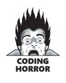
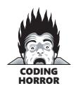
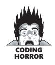
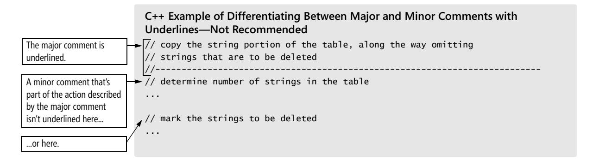
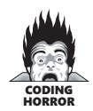
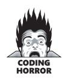

# Chapter 32: Self-Documenting Code


<span id="page-813-0"></span>
### cc2e.com/3245 Contents

- 32.1 External Documentation: page 777
- 32.2 Programming Style as Documentation: page 778
- 32.3 To Comment or Not to Comment: page 781
- 32.4 Keys to Effective Comments: page 785
- 32.5 Commenting Techniques: page 792
- 32.6 IEEE Standards: page 813

#### Related Topics

- Layout: Chapter 31
- The Pseudocode Programming Process: Chapter 9
- Working classes: Chapter 6
- High-quality routines: Chapter 7
- Programming as communication: Sections 33.5 and 34.3

Code as if whoever maintains your program is a violent psychopath who knows where you live.

—*Anonymous*

Most programmers enjoy writing documentation if the documentation standards aren't unreasonable. Like layout, good documentation is a sign of the professional pride a programmer puts into a program. Software documentation can take many forms, and, after describing the sweep of the documentation landscape, this chapter cultivates the specific patch of documentation known as "comments."

#### 32.1 External Documentation

**Cross-Reference** For more on external documentation, see Section 32.6, "IEEE Standards."

Documentation on a software project consists of information both inside the sourcecode listings and outside them—usually in the form of separate documents or unit development folders. On large, formal projects, most of the documentation is outside the source code (Jones 1998). External construction documentation tends to be at a high level compared to the code, at a low level compared to the documentation from the problem definition, requirements, and architecture activities.

**Further Reading** For a detailed description, see "The Unit Development Folder (UDF): An Effective Management Tool for Software Development" (Ingrassia 1976) or "The Unit Development Folder (UDF): A Ten-Year Perspective" (Ingrassia 1987).

*Unit development folders* A unit-development folder (UDF), or software-development folder (SDF), is an informal document that contains notes used by a developer during construction. A "unit" is loosely defined, usually to mean a class, although it could also mean a package or a component. The main purpose of a UDF is to provide a trail of design decisions that aren't documented elsewhere. Many projects have standards that specify the minimum content of a UDF, such as copies of the relevant requirements, the parts of the top-level design the unit implements, a copy of the development standards, a current code listing, and design notes from the unit's developer. Sometimes the customer requires a software developer to deliver the project's UDFs; often they are for internal use only.

*Detailed-design document* The detailed-design document is the low-level design document. It describes the class-level or routine-level design decisions, the alternatives that were considered, and the reasons for selecting the approaches that were selected. Sometimes this information is contained in a formal document. In such cases, detailed design is usually considered to be separate from construction. Sometimes it consists mainly of developers' notes collected into a UDF. And sometimes often—it exists only in the code itself.

### 32.2 Programming Style as Documentation

In contrast to external documentation, internal documentation is found within the program listing itself. It's the most detailed kind of documentation, at the sourcestatement level. Because it's most closely associated with the code, internal documentation is also the kind of documentation most likely to remain correct as the code is modified.

The main contributor to code-level documentation isn't comments, but good programming style. Style includes good program structure, use of straightforward and easily understandable approaches, good variable names, good routine names, use of named constants instead of literals, clear layout, and minimization of control-flow and data-structure complexity.

Here's a code fragment with poor style:


#### Java Example of Poor Documentation Resulting from Bad Programming Style

```
for ( i = 2; i <= num; i++ ) { 
meetsCriteria[ i ] = true; 
} 
for ( i = 2; i <= num / 2; i++ ) { 
j = i + i; 
while ( j <= num ) {
```

```
meetsCriteria[ j ] = false; 
j = j + i; 
} 
} 
for ( i = 2; i <= num; i++ ) { 
if ( meetsCriteria[ i ] ) { 
System.out.println ( i + " meets criteria." ); 
} 
}
```

What do you think this routine does? It's unnecessarily cryptic. It's poorly documented not because it lacks comments, but because it lacks good programming style. The variable names are uninformative, and the layout is crude. Here's the same code improved—just improving the programming style makes its meaning much clearer:

```
Java Example of Documentation Without Comments (with Good Style)
for ( primeCandidate = 2; primeCandidate <= num; primeCandidate++ ) { 
 isPrime[ primeCandidate ] = true; 
} 
for ( int factor = 2; factor < ( num / 2 ); factor++ ) { 
 int factorableNumber = factor + factor; 
 while ( factorableNumber <= num ) { 
 isPrime[ factorableNumber ] = false; 
 factorableNumber = factorableNumber + factor; 
 } 
} 
for ( primeCandidate = 2; primeCandidate <= num; primeCandidate++ ) { 
 if ( isPrime[ primeCandidate ] ) { 
 System.out.println( primeCandidate + " is prime." ); 
 } 
}
```

Unlike the first piece of code, this one lets you know at first glance that it has something to do with prime numbers. A second glance reveals that it finds the prime numbers between *1* and *Num*. With the first code fragment, it takes more than two glances just to figure out where the loops end.

The difference between the two code fragments has nothing to do with comments neither fragment has any. The second one is much more readable, however, and approaches the Holy Grail of legibility: self-documenting code. Such code relies on good programming style to carry the greater part of the documentation burden. In well-written code, comments are the icing on the readability cake.

**Cross-Reference** In this code, the variable *factorableNumber* is added solely for the sake of clarifying the operation. For details on adding variables to clarify operations, see "Making Complicated Expressions Simple" in Section 19.1.

#### cc2e.com/3252 CHECKLIST: Self-Documenting Code

#### Classes

- ❑ Does the class's interface present a consistent abstraction?
- ❑ Is the class well named, and does its name describe its central purpose?
- ❑ Does the class's interface make obvious how you should use the class?
- ❑ Is the class's interface abstract enough that you don't have to think about how its services are implemented? Can you treat the class as a black box?

#### Routines

- ❑ Does each routine's name describe exactly what the routine does?
- ❑ Does each routine perform one well-defined task?
- ❑ Have all parts of each routine that would benefit from being put into their own routines been put into their own routines?
- ❑ Is each routine's interface obvious and clear?

#### Data Names

- ❑ Are type names descriptive enough to help document data declarations?
- ❑ Are variables named well?
- ❑ Are variables used only for the purpose for which they're named?
- ❑ Are loop counters given more informative names than *i*, *j*, and *k*?
- ❑ Are well-named enumerated types used instead of makeshift flags or boolean variables?
- ❑ Are named constants used instead of magic numbers or magic strings?
- ❑ Do naming conventions distinguish among type names, enumerated types, named constants, local variables, class variables, and global variables?

#### Data Organization

- ❑ Are extra variables used for clarity when needed?
- ❑ Are references to variables close together?
- ❑ Are data types simple so that they minimize complexity?
- ❑ Is complicated data accessed through abstract access routines (abstract data types)?

#### Control

- ❑ Is the nominal path through the code clear?
- ❑ Are related statements grouped together?

- ❑ Have relatively independent groups of statements been packaged into their own routines?
- ❑ Does the normal case follow the *if* rather than the *else*?
- ❑ Are control structures simple so that they minimize complexity?
- ❑ Does each loop perform one and only one function, as a well-defined routine would?
- ❑ Is nesting minimized?
- ❑ Have boolean expressions been simplified by using additional boolean variables, boolean functions, and decision tables?

#### Layout

❑ Does the program's layout show its logical structure?

#### Design

- ❑ Is the code straightforward, and does it avoid cleverness?
- ❑ Are implementation details hidden as much as possible?
- ❑ Is the program written in terms of the problem domain as much as possible rather than in terms of computer-science or programming-language structures?

#### 32.3 To Comment or Not to Comment

Comments are easier to write poorly than well, and commenting can be more damaging than helpful. The heated discussions over the virtues of commenting often sound like philosophical debates over moral virtues, which makes me think that if Socrates had been a computer programmer, he and his students might have had the following discussion.

#### The Commento

#### *Characters*:

THRASYMACHUS A green, theoretical purist who believes everything he reads

CALLICLES A battle-hardened veteran from the old school—a "real" programmer

GLAUCON A young, confident, hot-shot computer jock

ISMENE A senior programmer tired of big promises, just looking for a few practices that work

SOCRATES The wise old programmer

*Setting:*

#### END OF THE TEAM'S DAILY STANDUP MEETING

"Does anyone have any other issues before we get back to work?" Socrates asked.

"I want to suggest a commenting standard for our projects," Thrasymachus said. "Some of our programmers barely comment their code, and everyone knows that code without comments is unreadable."

"You must be fresher out of college than I thought," Callicles responded. "Comments are an academic panacea, but everyone who's done any real programming knows that comments make the code harder to read, not easier. English is less precise than Java or Visual Basic and makes for a lot of excess verbiage. Programming-language statements are short and to the point. If you can't make the code clear, how can you make the comments clear? Plus, comments get out of date as the code changes. If you believe an out-of-date comment, you're sunk."

"I agree with that," Glaucon joined in. "Heavily commented code is harder to read because it means more to read. I already have to read the code; why should I have to read a lot of comments, too?"

"Wait a minute," Ismene said, putting down her coffee mug to put in her two drachmas' worth. "I know that commenting can be abused, but good comments are worth their weight in gold. I've had to maintain code that had comments and code that didn't, and I'd rather maintain code with comments. I don't think we should have a standard that says use one comment for every *x* lines of code, but we should encourage everyone to comment."

"If comments are a waste of time, why does anyone use them, Callicles?" Socrates asked.

"Either because they're required to or because they read somewhere that they're useful. No one who's thought about it could ever decide they're useful."

"Ismene thinks they're useful. She's been here three years, maintaining your code without comments and other code with comments, and she prefers the code with comments. What do you make of that?"

"Comments are useless because they just repeat the code in a more verbose—"


"Wait right there," Thrasymachus interrupted. "Good comments don't repeat the code or explain it. They clarify its intent. Comments should explain, at a higher level of abstraction than the code, what you're trying to do."

"Right," Ismene said. "I scan the comments to find the section that does what I need to change or fix. You're right that comments that repeat the code don't help at all

because the code says everything already. When I read comments, I want it to be like reading headings in a book or a table of contents. Comments help me find the right section, and then I start reading the code. It's a lot faster to read one sentence in English than it is to parse 20 lines of code in a programming language." Ismene poured herself another cup of coffee.

"I think that people who refuse to write comments (1) think their code is clearer than it could possibly be, (2) think that other programmers are far more interested in their code than they really are, (3) think other programmers are smarter than they really are, (4) are lazy, or (5) are afraid someone else might figure out how their code works.

"Code reviews would be a big help here, Socrates," Ismene continued. "If someone claims they don't need to write comments and are bombarded by questions during a review—when several peers start saying, 'What the heck are you trying to do in this piece of code?'—then they'll start putting in comments. If they don't do it on their own, at least their manager will have the ammo to make them do it.

"I'm not accusing you of being lazy or afraid that people will figure out your code, Callicles. I've worked on your code and you're one of the best programmers in the company. But have a heart, huh? Your code would be easier for me to work on if you used comments."

"But they're a waste of resources," Callicles countered. "A good programmer's code should be self-documenting; everything you need to know should be in the code."

"No way!" Thrasymachus was out of his chair. "Everything the compiler needs to know is in the code! You might as well argue that everything you need to know is in the binary executable file! If you were smart enough to read it! What is *meant* to happen is not in the code."

Thrasymachus realized he was standing up and sat down. "Socrates, this is ridiculous. Why do we have to argue about whether comments are valuable? Everything I've ever read says they're valuable and should be used liberally. We're wasting our time."

"Cool down, Thrasymachus. Ask Callicles how long he's been programming."

"How long, Callicles?"

"Well, I started on the Acropolis IV about 15 years ago. I guess I've seen about a dozen major systems from the time they were born to the time we gave them a cup of hemlock. And I've worked on major parts of a dozen more. Two of those systems had over half a million lines of code, so I know what I'm talking about. Comments are pretty useless."

Socrates looked at the younger programmer. "As Callicles says, comments have a lot of legitimate problems, and you won't realize that without more experience. If they're not done right, they're worse than useless."

Clearly, at some level comments *have* to be useful. To believe otherwise would be to believe that the comprehensibility of a program is independent of how much information the reader might already have about it. —*B. A. Sheil*

"Even when they're done right, they're useless," Callicles said. "Comments are less precise than a programming language. I'd rather not have them at all."

"Wait a minute," Socrates said. "Ismene agrees that comments are less precise. Her point is that comments give you a higher level of abstraction, and we all know that levels of abstraction are one of a programmer's most powerful tools."

"I don't agree with that," Glaucon replied. "Instead of focusing on commenting, you should focus on making code more readable. Refactoring eliminates most of my comments. Once I've refactored, my code might have 20 or 30 routine calls without needing any comments. A good programmer can read the intent from the code itself, and what good does it do to read about somebody's intent when you know the code has an error?" Glaucon was pleased with his contribution. Callicles nodded.

"It sounds like you guys have never had to modify someone else's code," Ismene said. Callicles suddenly seemed very interested in the pencil marks on the ceiling tiles. "Why don't you try reading your own code six months or a year after you write it? You can improve your code-reading ability and your commenting. You don't have to choose one or the other. If you're reading a novel, you might not want section headings. But if you're reading a technical book, you'd like to be able to find what you're looking for quickly. I shouldn't have to switch into ultra-concentration mode and read hundreds of lines of code just to find the two lines I want to change."

"All right, I can see that it would be handy to be able to scan code," Glaucon said. He'd seen some of Ismene's programs and had been impressed. "But what about Callicles' other point, that comments get out of date as the code changes? I've only been programming for a couple of years, but even I know that nobody updates their comments."

"Well, yes and no," Ismene said. "If you take the comment as sacred and the code as suspicious, you're in deep trouble. Actually, finding a disagreement between the comment and the code tends to mean both are wrong. The fact that some comments are bad doesn't mean that commenting is bad. I'm going to the lunchroom to get another pot of coffee." Ismene left the room.

"My main objection to comments," Callicles said, "is that they're a waste of resources."

"Can anyone think of ways to minimize the time it takes to write the comments?" Socrates asked.

"Design routines in pseudocode, and then convert the pseudocode to comments and fill in the code between them," Glaucon said.

"OK, that would work as long as the comments don't repeat the code," Callicles said.

"Writing a comment makes you think harder about what your code is doing," Ismene said, returning from the lunchroom. "If it's hard to comment, either it's bad code or you don't understand it well enough. Either way, you need to spend more time on the code, so the time you spent commenting wasn't wasted because it pointed you to required work."

"All right," Socrates said. "I can't think of any more questions, and I think Ismene got the best of you guys today. We'll encourage commenting, but we won't be naive about it. We'll have code reviews so that everyone will get a good sense of the kind of comments that actually help. If you have trouble understanding someone else's code, let them know how they can improve it."

#### 32.4 Keys to Effective Comments

As long as there are illdefined goals, bizarre bugs, and unrealistic schedules, there will be Real Programmers willing to jump in and Solve The Problem, saving the documentation for later. Long live Fortran!

—*Ed Post*

What does the following routine do?

```
Java Mystery Routine Number One
// write out the sums 1..n for all n from 1 to num 
current = 1; 
previous = 0; 
sum = 1; 
for ( int i = 0; i < num; i++ ) { 
 System.out.println( "Sum = " + sum ); 
 sum = current + previous; 
 previous = current; 
 current = sum; 
}
```

Your best guess?

This routine computes the first *num* Fibonacci numbers. Its coding style is a little better than the style of the routine at the beginning of the chapter, but the comment is wrong, and if you blindly trust the comment, you head down the primrose path in the wrong direction.

What about this one?

```
Java Mystery Routine Number Two
// set product to "base" 
product = base; 
// loop from 2 to "num" 
for ( int i = 2; i <= num; i++ ) { 
 // multiply "base" by "product" 
 product = product * base; 
} 
System.out.println( "Product = " + product );
```

This routine raises an integer *base* to the integer power *num*. The comments in this routine are accurate, but they add nothing to the code. They are merely a more verbose version of the code itself.

Here's one last routine:

```
Java Mystery Routine Number Three
// compute the square root of Num using the Newton-Raphson approximation 
r = num / 2; 
while ( abs( r - (num/r) ) > TOLERANCE ) { 
 r = 0.5 * ( r + (num/r) ); 
} 
System.out.println( "r = " + r );
```

This routine computes the square root of *num*. The code isn't great, but the comment is accurate.

Which routine was easiest for you to figure out correctly? None of the routines is particularly well written—the variable names are especially poor. In a nutshell, however, these routines illustrate the strengths and weaknesses of internal comments. Routine One has an incorrect comment. Routine Two's commenting merely repeats the code and is therefore useless. Only Routine Three's commenting earns its rent. Poor comments are worse than no comments. Routines One and Two would be better with no comments than with the poor comments they have.

The following subsections describe keys to writing effective comments.

#### Kinds of Comments

Comments can be classified into six categories:

#### Repeat of the Code

A repetitious comment restates what the code does in different words. It merely gives the reader of the code more to read without providing additional information.

#### Explanation of the Code

Explanatory comments are typically used to explain complicated, tricky, or sensitive pieces of code. In such situations they are useful, but usually that's only because the code is confusing. If the code is so complicated that it needs to be explained, it's nearly always better to improve the code than it is to add comments. Make the code itself clearer, and then use summary or intent comments.

#### Marker in the Code

A marker comment is one that isn't intended to be left in the code. It's a note to the developer that the work isn't done yet. Some developers type in a marker that's syntactically incorrect (\*\*\*\*\*\*, for example) so that the compiler flags it and reminds them that they have more work to do. Other developers put a specified set of characters in comments that don't interfere with compilation so that they can search for them.

Few feelings are worse than having a customer report a problem in the code, debugging the problem, and tracing it to a section of code where you find something like this:

```
return NULL; // ****** NOT DONE! FIX BEFORE RELEASE!!!
```

Releasing defective code to customers is bad enough; releasing code that you *knew*  was defective is even worse.

I've found that standardizing the style of marker comments is helpful. If you don't standardize, some programmers will use *\*\*\*\*\*\*\**, some will use *!!!!!!*, some will use *TBD*, and some will use various other conventions. Using a variety of notations makes mechanical searching for incomplete code error-prone or impossible. Standardizing on one specific marker style allows you to do a mechanical search for incomplete sections of code as one of the steps in a release checklist, which avoids the *FIX BEFORE RELEASE!!!* problem. Some editors support "to do" tags and allow you to navigate to them easily.

#### Summary of the Code

A comment that summarizes code does just that: it distills a few lines of code into one or two sentences. Such comments are more valuable than comments that merely repeat the code because a reader can scan them more quickly than the code. Summary comments are particularly useful when someone other than the code's original author tries to modify the code.

#### Description of the Code's Intent

A comment at the level of intent explains the purpose of a section of code. Intent comments operate more at the level of the problem than at the level of the solution. For example,

```
-- get current employee information
is an intent comment, whereas
-- update employeeRecord object
```


is a summary comment in terms of the solution. A six-month study conducted by IBM found that maintenance programmers "most often said that understanding the original programmer's intent was the most difficult problem" (Fjelstad and Hamlen 1979). The distinction between intent and summary comments isn't always clear, and it's usually not important. Examples of intent comments are given throughout this chapter.

#### Information That Cannot Possibly Be Expressed by the Code Itself

Some information can't be expressed in code but must still be in the source code. This category of comments includes copyright notices, confidentiality notices, version numbers, and other housekeeping details; notes about the code's design; references to related requirements or architecture documentation; pointers to online references; optimization notes; comments required by editing tools such as Javadoc and Doxygen; and so on.

The three kinds of comments that are acceptable for completed code are information that can't be expressed in code, intent comments, and summary comments.

#### Commenting Efficiently

Effective commenting isn't that time-consuming. Too many comments are as bad as too few, and you can achieve a middle ground economically.

Comments can take a lot of time to write for two common reasons. First, the commenting style might be time-consuming or tedious. If it is, find a new style. A commenting style that requires a lot of busy work is a maintenance headache. If the comments are hard to change, they won't be changed and they'll become inaccurate and misleading, which is worse than having no comments at all.

Second, commenting might be difficult because the words to describe what the program is doing don't come easily. That's usually a sign that you don't understand what the program does. The time you spend "commenting" is really time spent understanding the program better, which is time that needs to be spent regardless of whether you comment.

Following are guidelines for commenting efficiently:

*Use styles that don't break down or discourage modification* Any style that's too fancy is annoying to maintain. For example, pick out the part of the comment below that won't be maintained:

```
Java Example of a Commenting Style That's Hard to Maintain
// Variable Meaning 
// -------- ------- 
// xPos .......... XCoordinate Position (in meters) 
// yPos .......... YCoordinate Position (in meters)
```

```
// ndsCmptng..... Needs Computing (= 0 if no computation is needed,
```

If you said that the leader dots (.....) will be hard to maintain, you're right! They look nice, but the list is fine without them. They add busy work to the job of modifying comments, and you'd rather have accurate comments than nice-looking ones, if that's the choice—and it usually is.

Here's another example of a common style that's hard to maintain:

```
C++ Example of a Commenting Style That's Hard to Maintain

/***********************************
```

This is a nice-looking block comment. It's clear that the whole block belongs together, and the beginning and ending of the block are obvious. What isn't clear about this block is how easy it is to change. If you have to add the name of a file to the bottom of the comment, chances are pretty good that you'll have to fuss with the pretty column of asterisks at the right. If you need to change the paragraph comments, you'll have to fuss with asterisks on both the left and the right. In practice, this means that the block won't be maintained because it will be too much work. If you can press a key and get neat columns of asterisks, that's great. Use it. The problem isn't the asterisks but that they're hard to maintain. The following comment looks almost as good and is a cinch to maintain:

```
C++ Example of a Commenting Style That's Easy to Maintain

/***********************************
```

Here's a particularly difficult style to maintain:



#### Microsoft Visual Basic Example of a Commenting Style That's Hard to Maintain

' set up Color enumerated type ' +--------------------------+ ... ' set up Vegetable enumerated type ' +------------------------------+ ...

It's hard to know what value the plus sign at the beginning and end of each dashed line adds to the comment, but it's easy to guess that every time a comment changes, the underline has to be adjusted so that the ending plus sign is in precisely the right place. And what do you do when a comment spills over into two lines? How do you align the plus signs? Take words out of the comment so that it takes up only one line? Make both lines the same length? The problems with this approach multiply when you try to apply it consistently.

A common guideline for Java and C++ that arises from a similar motivation is to use // syntax for single-line comments and /\* ... \*/ syntax for longer comments, as shown here:

#### Java Example of Using Different Comment Syntaxes for Different Purposes

// This is a short comment ...

/\* This is a much longer comment. Four score and seven years ago our fathers brought forth on this continent a new nation, conceived in liberty and dedicated to the proposition that all men are created equal. Now we are engaged in a great civil war, testing whether that nation or any nation so conceived and so dedicated can long endure. We are met on a great battlefield of that war. We have come to dedicate a portion of that field as a final resting-place for those who here gave their lives that that nation might live. It is altogether fitting and proper that we should do this. \*/

The first comment is easy to maintain as long as it's kept short. For longer comments, the task of creating long columns of double slashes, manually breaking lines of text between rows, and similar activities is not very rewarding, and so the /\* ... \*/ syntax is more appropriate for multiline comments.


The point is that you should pay attention to how you spend your time. If you spend a lot of time entering and deleting dashes to make plus signs line up, you're not programming; you're wasting time. Find a more efficient style. In the case of the underlines with plus signs, you could choose to have just the comments without any underlining. If you need to use underlines for emphasis, find some way other than

underlines with plus signs to emphasize those comments. One way would be to have a standard underline that's always the same length regardless of the length of the comment. Such a line requires no maintenance, and you can use a text-editor macro to enter it in the first place.

**Cross-Reference** For details on the Pseudocode Programming Process, see Chapter 9, "The Pseudocode Programming Process."

*Use the Pseudocode Programming Process to reduce commenting time* If you outline the code in comments before you write it, you win in several ways. When you finish the code, the comments are done. You don't have to dedicate time to comments. You also gain all the design benefits of writing in high-level pseudocode before filling in the low-level programming-language code.

*Integrate commenting into your development style* The alternative to integrating commenting into your development style is leaving commenting until the end of the project, and that has too many disadvantages. It becomes a task in its own right, which makes it seem like more work than when it's done a little bit at a time. Commenting done later takes more time because you have to remember or figure out what the code is doing instead of just writing down what you're already thinking about. It's also less accurate because you tend to forget assumptions or subtleties in the design.

The common argument against commenting as you go along is "When you're concentrating on the code, you shouldn't break your concentration to write comments." The appropriate response is that, if you have to concentrate so hard on writing code that commenting interrupts your thinking, you need to design in pseudocode first and then convert the pseudocode to comments. Code that requires that much concentration is a warning sign.


If your design is hard to code, simplify the design before you worry about comments or code. If you use pseudocode to clarify your thoughts, coding is straightforward and the comments are automatic.

*Performance is not a good reason to avoid commenting* One recurring attribute of the rolling wave of technology discussed in Section 4.3, "Your Location on the Technology Wave," is interpreted environments in which commenting imposes a measurable performance penalty. In the 1980s, comments in Basic programs on the original IBM PC slowed programs. In the 1990s, *.asp* pages did the same thing. In the 2000s, JavaScript code and other code that needs to be sent across network connections presents a similar problem.

In each of these cases, the ultimate solution has not been to avoid commenting; it's been to create a release version of the code that's different from the development version. This is typically accomplished by running the code through a tool that strips out comments as part of the build process.

#### Optimum Number of Comments


Capers Jones points out that studies at IBM found that a commenting density of one comment roughly every 10 statements was the density at which clarity seemed to peak. Fewer comments made the code hard to understand. More comments also reduced code understandability (Jones 2000).

This kind of research can be abused, and projects sometimes adopt a standard such as "programs must have one comment at least every five lines." This standard addresses the symptom of programmers' not writing clear code, but it doesn't address the cause.

If you use the Pseudocode Programming Process effectively, you'll probably end up with a comment for every few lines of code. The number of comments, however, will be a side effect of the process itself. Rather than focusing on the number of comments, focus on whether each comment is efficient. If the comments describe why the code was written and meet the other criteria established in this chapter, you'll have enough comments.

#### 32.5 Commenting Techniques

Commenting is amenable to several different techniques depending on the level to which the comments apply: program, file, routine, paragraph, or individual line.

#### Commenting Individual Lines

In good code, the need to comment individual lines of code is rare. Here are two possible reasons a line of code would need a comment:

- The single line is complicated enough to need an explanation.
- The single line once had an error, and you want a record of the error.

Here are some guidelines for commenting a line of code:

*Avoid self-indulgent comments* Many years ago, I heard the story of a maintenance programmer who was called out of bed to fix a malfunctioning program. The program's author had left the company and couldn't be reached. The maintenance programmer hadn't worked on the program before, and after examining the documentation carefully, he found only one comment. It looked like this:

```
MOV AX, 723h ; R. I. P. L. V. B.
```

After working with the program through the night and puzzling over the comment, the programmer made a successful patch and went home to bed. Months later, he met the program's author at a conference and found out that the comment stood for "Rest in peace, Ludwig van Beethoven." Beethoven died in 1827 (decimal), which is 723 (hexadecimal). The fact that 723h was needed in that spot had nothing to do with the comment. Aaarrrrghhhhh!

#### Endline Comments and Their Problems

Endline comments are comments that appear at the ends of lines of code:

```
Visual Basic Example of Endline Comments
For employeeId = 1 To employeeCount 
 GetBonus( employeeId, employeeType, bonusAmount ) 
 If employeeType = EmployeeType_Manager Then 
 PayManagerBonus( employeeId, bonusAmount ) ' pay full amount 
 Else 
 If employeeType = EmployeeType_Programmer Then 
 If bonusAmount >= MANAGER_APPROVAL_LEVEL Then 
 PayProgrammerBonus( employeeId, StdAmt() ) ' pay std. amount 
 Else 
 PayProgrammerBonus( employeeId, bonusAmount ) ' pay full amount 
 End If 
 End If 
 End If 
Next
```

Although useful in some circumstances, endline comments pose several problems. The comments have to be aligned to the right of the code so that they don't interfere with the visual structure of the code. If you don't align them neatly, they'll make your listing look like it's been through the washing machine. Endline comments tend to be hard to format. If you use many of them, it takes time to align them. Such time is not spent learning more about the code; it's dedicated solely to the tedious task of pressing the spacebar or the Tab key.

Endline comments are also hard to maintain. If the code on any line containing an endline comment grows, it bumps the comment farther out and all the other endline comments will have to be bumped out to match. Styles that are hard to maintain aren't maintained, and the commenting deteriorates under modification rather than improving.

Endline comments also tend to be cryptic. The right side of the line usually doesn't offer much room, and the desire to keep the comment on one line means that the comment must be short. Work then goes into making the line as short as possible instead of as clear as possible.

*Avoid endline comments on single lines* In addition to their practical problems, endline comments pose several conceptual problems. Here's an example of a set of endline comments:

```
C++ Example of Useless Endline Comments
The comments merely 
repeat the code.
                      memoryToInitialize = MemoryAvailable(); // get amount of memory available 
                      pointer = GetMemory( memoryToInitialize ); // get a ptr to the available memory 
                      ZeroMemory( pointer, memoryToInitialize ); // set memory to 0 
                      ... 
                      FreeMemory( pointer ); // free memory allocated
```

A systemic problem with endline comments is that it's hard to write a meaningful comment for one line of code. Most endline comments just repeat the line of code, which hurts more than it helps.

*Avoid endline comments for multiple lines of code* If an endline comment is intended to apply to more than one line of code, the formatting doesn't show which lines the comment applies to:



```
Visual Basic Example of a Confusing Endline Comment on Multiple Lines of Code
For rateIdx = 1 to rateCount ' Compute discounted rates 
 LookupRegularRate( rateIdx, regularRate ) 
 rate( rateIdx ) = regularRate * discount( rateIdx ) 
Next
```

Even though the content of this particular comment is fine, its placement isn't. You have to read the comment and the code to know whether the comment applies to a specific statement or to the entire loop.

#### When to Use Endline Comments

Consider three exceptions to the recommendation against using endline comments:

**Cross-Reference** Other aspects of endline comments on data declarations are described in "Commenting Data Declarations," later in this section.

*Use endline comments to annotate data declarations* Endline comments are useful for annotating data declarations because they don't have the same systemic problems as endline comments on code, provided that you have enough width. With 132 columns, you can usually write a meaningful comment beside each data declaration:

```
Java Example of Good Endline Comments for Data Declarations
int boundary = 0; // upper index of sorted part of array 
String insertVal = BLANK; // data elmt to insert in sorted part of array 
int insertPos = 0; // position to insert elmt in sorted part of array
```

*Avoid using endline comments for maintenance notes* Endline comments are sometimes used for recording modifications to code after its initial development. This kind of comment typically consists of a date and the programmer's initials, or possibly an error-report number. Here's an example:

```
for i = 1 to maxElmts – 1 -- fixed error #A423 10/1/05 (scm)
```

Adding such a comment can be gratifying after a late-night debugging session on software that's in production, but such comments really have no place in production code. Such comments are handled better by version-control software. Comments should explain why the code works *now*, not why the code didn't work at some point in the past.

**Cross-Reference** Use of endline comments to mark ends of blocks is described further in "Commenting Control Structures," later in this section.

*Use endline comments to mark ends of blocks* An endline comment is useful for marking the end of a long block of code—the end of a *while* loop or an *if* statement, for example. This is described in more detail later in this chapter.

Aside from a couple of special cases, endline comments have conceptual problems and tend to be used for code that's too complicated. They are also difficult to format and maintain. Overall, they're best avoided.

#### Commenting Paragraphs of Code

Most comments in a well-documented program are one-sentence or two-sentence comments that describe paragraphs of code:

```
Java Example of a Good Comment for a Paragraph of Code
// swap the roots 
oldRoot = root[0]; 
root[0] = root[1]; 
root[1] = oldRoot;
```

The comment doesn't repeat the code—it describes the code's intent. Such comments are relatively easy to maintain. Even if you find an error in the way the roots are swapped, for example, the comment won't need to be changed. Comments that aren't written at the level of intent are harder to maintain.

*Write comments at the level of the code's intent* Describe the purpose of the block of code that follows the comment. Here's an example of a comment that's ineffective because it doesn't operate at the level of intent:

**Cross-Reference** This code that performs a simple string search is used only for purposes of illustration. For real code, you'd use Java's built-in string library functions instead. For more on the importance of understanding your language's capabilities, see "Read!" in Section 33.3.

```
Java Example of an Ineffective Comment
/* check each character in "inputString" until a dollar sign 
is found or all characters have been checked 
*/ 
done = false; 
maxLen = inputString.length(); 
i = 0; 
while ( !done && ( i < maxLen ) ) { 
 if ( inputString[ i ] == '$' ) { 
 done = true; 
 } 
 else { 
 i++; 
 } 
}
```

You can figure out that the loop looks for a *\$* by reading the code, and it's somewhat helpful to have that summarized in the comment. The problem with this comment is that it merely repeats the code and doesn't give you any insight into what the code is supposed to be doing. This comment would be a little better:

```
// find '$' in inputString
```

This comment is better because it indicates that the goal of the loop is to find a *\$*. But it still doesn't give you much insight into why the loop would need to find a *\$*—in other words, into the deeper intent of the loop. Here's a comment that's better still:

```
// find the command-word terminator ($)
```

This comment actually contains information that the code listing does not, namely that the *\$* terminates a command word. In no way could you deduce that fact merely from reading the code fragment, so the comment is genuinely helpful.

Another way of thinking about commenting at the level of intent is to think about what you would name a routine that did the same thing as the code you want to comment. If you're writing paragraphs of code that have one purpose each, it isn't difficult. The comment in the previous code sample is a good example. *FindCommandWordTerminator()* would be a decent routine name. The other options, *Find\$InInputString()* and *Check-EachCharacterInInputStrUntilADollarSignIsFoundOrAllCharactersHaveBeenChecked()*, are poor names (or invalid) for obvious reasons. Type the description without shortening or abbreviating it, as you might for a routine name. That description is your comment, and it's probably at the level of intent.


*Focus your documentation efforts on the code itself* For the record, the code itself is always the first documentation you should check. In the previous example, the literal, *\$*, should be replaced with a named constant and the variables should provide more of a clue about what's going on. If you want to push the edge of the readability envelope, add a variable to contain the result of the search. Doing that clearly distinguishes between the loop index and the result of the loop. Here's the code rewritten with good comments and good style:

```
Java Example of a Good Comment and Good Code
// find the command-word terminator 
foundTheTerminator = false; 
commandStringLength = inputString.length(); 
testCharPosition = 0; 
while ( !foundTheTerminator && ( testCharPosition < commandStringLength ) ) { 
 if ( inputString[ testCharPosition ] == COMMAND_WORD_TERMINATOR ) { 
 foundTheTerminator = true;
 terminatorPosition = testCharPosition; 
 } 
 else { 
 testCharPosition = testCharPosition + 1; 
 } 
}
```

Here's the variable that contains the result of the search.

If the code is good enough, it begins to read at close to the level of intent, encroaching on the comment's explanation of the code's intent. At that point, the comment and the code might become somewhat redundant, but that's a problem few programs have.

**Cross-Reference** For more on moving a section of code into its own routine, see "Extract routine/extract method" in Section 24.3.

Another good step for this code would be to create a routine called something like *FindCommandWordTerminator()* and move the code from the sample into that routine. A comment that describes that thought is useful but is more likely than a routine name to become inaccurate as the software evolves.

*Focus paragraph comments on the why rather than the how* Comments that explain how something is done usually operate at the programming-language level rather than the problem level. It's nearly impossible for a comment that focuses on how an operation is done to explain the intent of the operation, and comments that tell how are often redundant. What does the following comment tell you that the code doesn't?



```
Java Example of a Comment That Focuses on How
// if account flag is zero 
if ( accountFlag == 0 ) ...
```

The comment tells you nothing more than the code itself does. What about this comment?

```
Java Example of a Comment That Focuses on Why
// if establishing a new account 
if ( accountFlag == 0 ) ...
```

This comment is a lot better because it tells you something you couldn't infer from the code itself. The code itself could still be improved by use of a meaningful enumerated type name instead of *O* and a better variable name. Here's the best version of this comment and code:

```
Java Example of Using Good Style In Addition to a "Why" Comment
// if establishing a new account 
if ( accountType == AccountType.NewAccount ) ...
```

When code attains this level of readability, it's appropriate to question the value of the comment. In this case, the comment has been made redundant by the improved code, and it should probably be removed. Alternatively, the purpose of the comment could be subtly shifted, like this:

```
Java Example of Using a "Section Heading" Comment
// establish a new account 
if ( accountType == AccountType.NewAccount ) { 
 ... 
}
```

If this comment documents the whole block of code following the *if* test, it serves as a summary-level comment and it's appropriate to retain it as a section heading for the paragraph of code it references.

*Use comments to prepare the reader for what is to follow* Good comments tell the person reading the code what to expect. A reader should be able to scan only the comments and get a good idea of what the code does and where to look for a specific activity. A corollary to this rule is that a comment should always precede the code it describes. This idea isn't always taught in programming classes, but it's a well-established convention in commercial practice.

*Make every comment count* There's no virtue in excessive commenting—too many comments obscure the code they're meant to clarify. Rather than writing more comments, put the extra effort into making the code itself more readable.

*Document surprises* If you find anything that isn't obvious from the code itself, put it into a comment. If you have used a tricky technique instead of a straightforward one to improve performance, use comments to point out what the straightforward technique would be and quantify the performance gain achieved by using the tricky technique. Here's an example:

```
C++ Example of Documenting a Surprise
for ( element = 0; element < elementCount; element++ ) { 
 // Use right shift to divide by two. Substituting the 
 // right-shift operation cuts the loop time by 75%. 
 elementList[ element ] = elementList[ element ] >> 1; 
}
```

The selection of the right shift in this example is intentional. Among experienced programmers, it's common knowledge that for integers, right shift is functionally equivalent to divide-by-two.

If it's common knowledge, why document it? Because the purpose of the operation is not to perform a right shift; it is to perform a divide-by-two. The fact that the code doesn't use the technique most suited to its purpose is significant. Moreover, most compilers optimize integer division-by-two to be a right shift anyway, meaning that the reduced clarity is usually unnecessary. In this particular case, the compiler evidently doesn't optimize the divide-by-two, and the time saved will be significant. With the documentation, a programmer reading the code would see the motivation for using the nonobvious technique. Without the comment, the same programmer would be inclined to grumble that the code is unnecessarily "clever" without any meaningful gain in performance. Usually such grumbling is justified, so it's important to document the exceptions.

*Avoid abbreviations* Comments should be unambiguous, readable without the work of figuring out abbreviations. Avoid all but the most common abbreviations in comments. Unless you're using endline comments, using abbreviations isn't usually a temptation. If you are and it is, realize that abbreviations are another strike against a technique that struck out several pitches ago.

*Differentiate between major and minor comments* In a few cases, you might want to differentiate between different levels of comments, indicating that a detailed comment is part of a previous, broader comment. You can handle this in a couple of ways. You can try underlining the major comment and not underlining the minor comment:



The weakness of this approach is that it forces you to underline more comments than you'd really like to. If you underline a comment, it's assumed that all the nonunderlined comments that follow it are subordinate to it. Consequently, when you write the first comment that isn't subordinate to the underlined comment, it too must be underlined and the cycle starts all over. The result is too much underlining or inconsistent underlining in some places and no underlining in others.

This theme has several variations that all have the same problem. If you put the major comment in all caps and the minor comments in lowercase, you substitute the problem of too many all-caps comments for too many underlined comments. Some programmers use an initial cap on major statements and no initial cap on minor ones, but that's a subtle visual cue too easily overlooked.

A better approach is to use ellipses in front of the minor comments:

```
The major comment is 
formatted normally.
A minor comment that's part 
of the action described by 
the major comment is pre-
ceded by an ellipsis here...
...and here.
                          C++ Example of Differentiating Between Major and Minor Comments with Ellipses
                          // copy the string portion of the table, along the way omitting 
                          // strings that are to be deleted 
                          // ... determine number of strings in the table 
                          ... 
                          // ... mark the strings to be deleted 
                          ...
```

Another approach that's often best is to put the major-comment operation into its own routine. Routines should be logically "flat," with all their activities on about the same logical level. If your code differentiates between major and minor activities within a routine, the routine isn't flat. Putting the complicated group of activities into its own routine makes for two logically flat routines instead of one logically lumpy one.

This discussion of major and minor comments doesn't apply to indented code within loops and conditionals. In such cases, you'll often have a broad comment at the top of the loop and more detailed comments about the operations within the indented code. In those cases, the indentation provides the clue to the logical organization of the comments. This discussion applies only to sequential paragraphs of code in which several paragraphs make up a complete operation and some paragraphs are subordinate to others.

*Comment anything that gets around an error or an undocumented feature in a language or an environment* If it's an error, it probably isn't documented. Even if it's documented somewhere, it doesn't hurt to document it again in your code. If it's an undocumented feature, by definition it isn't documented elsewhere and it should be documented in your code.

Suppose you find that the library routine *WriteData( data, numItems, blockSize )* works properly except when *blockSize* equals *500*. It works fine for *499*, *501*, and every other value you've ever tried, but you've found that the routine has a defect that appears only when *blockSize* equals *500*. In code that uses *WriteData()*, document why you're making a special case when *blockSize* is *500*. Here's an example of how it could look:

```
Java Example of Documenting the Workaround for an Error
blockSize = optimalBlockSize( numItems, sizePerItem ); 
/* The following code is necessary to work around an error in 
WriteData() that appears only when the third parameter 
equals 500. '500' has been replaced with a named constant 
for clarity. 
*/ 
if ( blockSize == WRITEDATA_BROKEN_SIZE ) { 
 blockSize = WRITEDATA_WORKAROUND_SIZE; 
} 
WriteData ( file, data, blockSize );
```

*Justify violations of good programming style* If you've had to violate good programming style, explain why. That will prevent a well-intentioned programmer from changing the code to a better style, possibly breaking your code. The explanation will make it clear that you knew what you were doing and weren't just sloppy—give yourself credit where credit is due!

*Don't comment tricky code; rewrite it* Here's a comment from a project I worked on:



```
C++ Example of Commenting Clever Code
// VERY IMPORTANT NOTE: 
// The constructor for this class takes a reference to a UiPublication. 
// The UiPublication object MUST NOT BE DESTROYED before the DatabasePublication
```

// object. If it is, the DatabasePublication object will cause the program to

This is a good example of one of the most prevalent and hazardous bits of programming folklore: that comments should be used to document especially "tricky" or "sensitive" sections of code. The reasoning is that people should know they need to be careful when they're working in certain areas.

This is a scary idea.

// die a horrible death.

Commenting tricky code is exactly the wrong approach to take. Comments can't rescue difficult code. As Kernighan and Plauger emphasize, "Don't document bad code rewrite it" (1978).


One study found that areas of source code with large numbers of comments also tended to have the most defects and to consume the most development effort (Lind and Vairavan 1989). The authors hypothesized that programmers tended to comment difficult code heavily.


KEY POINT

When someone says, "This is really *tricky* code," I hear them say, "This is really *bad* code." If something seems tricky to you, it will be incomprehensible to someone else. Even something that doesn't seem all that tricky to you can seem impossibly convoluted to another person who hasn't seen the trick before. If you have to ask yourself "Is this tricky?" it is. You can always find a rewrite that's not tricky, so rewrite the code. Make your code so good that you don't need comments, and then comment it to make it even better.

This advice applies mainly to code you're writing for the first time. If you're maintaining a program and don't have the latitude to rewrite bad code, commenting the tricky parts is a good practice.

#### Commenting Data Declarations

**Cross-Reference** For details on formatting data, see "Laying Out Data Declarations" in Section 31.5. For details on how to use data effectively, see Chapters 10 through 13.

Comments for variable declarations describe aspects of the variable that the variable name can't describe. It's important to document data carefully; at least one company that studied its own practices has concluded that annotations on data are even more important than annotations on the processes in which the data is used (SDC, in Glass 1982). Here are some guidelines for commenting data:

*Comment the units of numeric data* If a number represents length, indicate whether the length is expressed in inches, feet, meters, or kilometers. If it's time, indicate whether it's expressed in elapsed seconds since 1-1-1980, milliseconds since the start of the program, and so on. If it's coordinates, indicate whether they represent latitude, longitude, and altitude and whether they're in radians or degrees; whether they represent an *X*, *Y*, *Z* coordinate system with its origin at the earth's center; and so on. Don't assume that the units are obvious. To a new programmer, they won't be. To someone who's been working on another part of the system, they won't be. After the program has been substantially modified, they won't be.

Alternatively, in many cases you should embed the units in the variable names rather than in comments. An expression like *distanceToSurface = marsLanderAltitude* looks like it's probably correct, but *distanceToSurfaceInMeters = marsLanderAltitudeInFeet*  exposes an obvious error.

**Cross-Reference** A stronger technique for documenting allowable ranges of variables is to use assertions at the beginning and end of a routine to assert that the variable's values should be within a prescribed range. For more details, see Section 8.2, "Assertions."

*Comment the range of allowable numeric values* If a variable has an expected range of values, document the expected range. One of the powerful features of the Ada programming language was the ability to restrict the allowable values of a numeric variable to a range of values. If your language doesn't support that capability (and most languages don't), use a comment to document the expected range of values. For example, if a variable represents an amount of money in dollars, indicate that you expect it to be between \$1 and \$100. If a variable indicates a voltage, indicate that it should be between 105v and 125v.

*Comment coded meanings* If your language supports enumerated types—as C++ and Visual Basic do—use them to express coded meanings. If it doesn't, use comments to indicate what each value represents—and use a named constant rather than a literal for each of the values. If a variable represents kinds of electrical current, comment the fact that *1* represents alternating current, *2* represents direct current, and *3* represents *undefined*.

Here's an example of documenting variable declarations that illustrates the three preceding recommendations—all the range information is given in comments:

```
Visual Basic Example of Nicely Documented Variable Declarations
Dim cursorX As Integer ' horizontal cursor position; ranges from 1..MaxCols 
Dim cursorY As Integer ' vertical cursor position; ranges from 1..MaxRows 
Dim antennaLength As Long ' length of antenna in meters; range is >= 2 
Dim signalStrength As Integer ' strength of signal in kilowatts; range is >= 1 
Dim characterCode As Integer ' ASCII character code; ranges from 0..255 
Dim characterAttribute As Integer ' 0=Plain; 1=Italic; 2=Bold; 3=BoldItalic 
Dim characterSize As Integer ' size of character in points; ranges from 4..127
```

*Comment limitations on input data* Input data might come from an input parameter, a file, or direct user input. The previous guidelines apply as much to routine-input parameters as to other kinds of data. Make sure that expected and unexpected values are documented. Comments are one way of documenting that a routine is never supposed to receive certain data. Assertions are another way to document valid ranges, and if you use them the code becomes that much more self-checking.

*Document flags to the bit level* If a variable is used as a bit field, document the meaning of each bit:

**Cross-Reference** For details on naming flag variables, see "Naming Status Variables" in Section 11.2.

```
Visual Basic Example of Documenting Flags to the Bit Level
' The meanings of the bits in statusFlags are as follows, from most 
' significant bit to least significant bit: 
' MSB 0 error detected: 1=yes, 0=no 
' 1-2 kind of error: 0=syntax, 1=warning, 2=severe, 3=fatal 
' 3 reserved (should be 0) 
' 4 printer status: 1=ready, 0=not ready 
' ... 
' 14 not used (should be 0) 
' LSB 15-32 not used (should be 0) 
Dim statusFlags As Integer
```

If the example were written in C++, it would call for bit-field syntax so that the bit-field meanings would be self-documenting.

*Stamp comments related to a variable with the variable's name* If you have comments that refer to a specific variable, make sure the comment is updated whenever the variable is updated. One way to improve the odds of a consistent modification is to stamp the comment with the variable name. That way, string searches for the variable name will find the comment as well as the variable.

**Cross-Reference** For details on using global data, see Section 13.3, "Global Data."

*Document global data* If global data is used, annotate each piece well at the point at which it's declared. The annotation should indicate the purpose of the data and why it needs to be global. At each point at which the data is used, make it clear that the data is global. A naming convention is the first choice for highlighting a variable's global status. If a naming convention isn't used, comments can fill the gap.

#### Commenting Control Structures

**Cross-Reference** For other details on control structures, see Section 31.3, "Layout Styles," Section 31.4, "Laying Out Control Structures," and Chapters 14 through 19.

The space before a control structure is usually a natural place to put a comment. If it's an *if* or a *case* statement, you can provide the reason for the decision and a summary of the outcome. If it's a loop, you can indicate the purpose of the loop.

```
C++ Example of Commenting the Purpose of a Control Structure
Purpose of the following 
loop.
                         // copy input field up to comma 
                         while ( ( *inputString != ',' ) && ( *inputString != END_OF_STRING ) ) { 
                          *field = *inputString; 
                          field++; 
                          inputString++;
End of the loop (useful for 
longer, nested loops—
although the need for such 
a comment indicates overly 
complicated code).
Purpose of the loop. Position 
of comment makes it clear 
that inputString is being set 
up for the loop.
                         } // while -- copy input field 
                         *field = END_OF_STRING; 
                         if ( *inputString != END_OF_STRING ) {
                          // read past comma and subsequent blanks to get to the next input field 
                          inputString++; 
                          while ( ( *inputString == ' ' ) && ( *inputString != END_OF_STRING ) ) { 
                          inputString++; 
                          } 
                         } // if -- at end of string
```

This example suggests some guidelines:

*Put a comment before each* **if***,* **case***, loop, or block of statements* Such a place is a natural spot for a comment, and these constructs often need explanation. Use a comment to clarify the purpose of the control structure.

*Comment the end of each control structure* Use a comment to show what ended—for example,

```
} // for clientIndex — process record for each client
```

A comment is especially helpful at the end of long loops and to clarify loop nesting. Here's a Java example of using comments to clarify the ends of loop structures:

```
Java Example of Using Comments to Show Nesting
                       for ( tableIndex = 0; tableIndex < tableCount; tableIndex++ ) { 
                        while ( recordIndex < recordCount ) { 
                        if ( !IllegalRecordNumber( recordIndex ) ) { 
                        ...
These comments indicate 
which control structure is 
ending.
                        } // if 
                        } // while 
                       } // for
```

This commenting technique supplements the visual clues about the logical structure given by the code's indentation. You don't need to use the technique for short loops that aren't nested. When the nesting is deep or the loops are long, however, the technique pays off.

**Treat end-of-loop comments as a warning indicating complicated code** If a loop is complicated enough to need an end-of-loop comment, treat the comment as a warning sign: the loop might need to be simplified. The same rule applies to complicated *if* tests and *case* statements.

End-of-loop comments provide useful clues to logical structure, but writing them initially and then maintaining them can become tedious. The best way to avoid such tedious work is often to rewrite any code that's complicated enough to require tedious documentation.

#### Commenting Routines

**Cross-Reference** For details on formatting routines, see Section 31.7. For details on how to create high-quality routines, see Chapter 7.

Routine-level comments are the subject of some of the worst advice in typical computer-science textbooks. Many textbooks urge you to pile up a stack of information at the top of every routine, regardless of its size or complexity:



```
Visual Basic Example of a Monolithic, Kitchen-Sink Routine Prolog
```

\*\*\*\*\*\*\*\*\*\*\*\*\*\*\*\*\*\*\*\*\*\*\*\*\* ' Name: CopyString Purpose: This routine copies a string from the source string (source) to the target string (target). ' Algorithm: It gets the length of "source" and then copies each character, one at a time, into "target". It uses the loop index as an array index into both "source" and "target" and increments the loop/array index after each character is copied. input The string to be copied Inputs: output The string to receive the copy of "input" Outputs: ' Interface Assumptions: None ' Modification History: None ' Author: Dwight K. Coder ' Date Created: 10/1/04 ' Phone: (555) 222-2255 ' SSN: 111-22-3333 ' Eye Color: Green ' Maiden Name: None ' Blood Type: AB-' Mother's Maiden Name: None ' Favorite Car: Pontiac Aztek ' Personalized License Plate: "Tek-ie" \*\*\*\*\*\*\*\*\*\*\*\*\*\*\*\*\*\*\*\*\*\*

This is ridiculous. *CopyString* is presumably a trivial routine—probably fewer than five lines of code. The comment is totally out of proportion to the scale of the routine. The parts about the routine's *Purpose* and *Algorithm* are strained because it's hard to describe something as simple as *CopyString* at a level of detail that's between "copy a string" and the code itself. The boilerplate comments *Interface Assumptions* and *Modification History* aren't useful either—they just take up space in the listing. Requiring the author's name is redundant with information that can be retrieved more accurately from the revision-control system. To require all these ingredients for every routine is a recipe for inaccurate comments and maintenance failure. It's a lot of make-work that never pays off.

Another problem with heavy routine headers is that they discourage good factoring of the code—the overhead to create a new routine is so high that programmers will tend to err on the side of creating fewer routines, not more. Coding conventions should encourage good practices; heavy routine headers do the opposite.

Here are some guidelines for commenting routines:

*Keep comments close to the code they describe* One reason that the prolog to a routine shouldn't contain voluminous documentation is that such a practice puts the comments far away from the parts of the routine they describe. During maintenance, comments that are far from the code tend not to be maintained with the code. The comments and the code start to disagree, and suddenly the comments are worthless. Instead, follow the Principle of Proximity and put comments as close as possible to the code they describe. They're more likely to be maintained, and they'll continue to be worthwhile.

Several components of routine prologs are described below and should be included as needed. For your convenience, create a boilerplate documentation prolog. Just don't feel obliged to include all the information in every case. Fill out the parts that matter, and delete the rest.

**Cross-Reference** Good routine names are key to routine documentation. For details on how to create them, see Section 7.3, "Good Routine Names."

*Describe each routine in one or two sentences at the top of the routine* If you can't describe the routine in a short sentence or two, you probably need to think harder about what it's supposed to do. Difficulty in creating a short description is a sign that the design isn't as good as it should be. Go back to the design drawing board and try again. The short summary statement should be present in virtually all routines except for simple *Get* and *Set* accessor routines.

*Document parameters where they are declared* The easiest way to document input and output variables is to put comments next to the parameter declarations:

```
Java Example of Documenting Input and Output Data Where It's 
Declared—Good Practice
public void InsertionSort( 
 int[] dataToSort, // elements to sort in locations firstElement..lastElement 
 int firstElement, // index of first element to sort (>=0) 
 int lastElement // index of last element to sort (<= MAX_ELEMENTS) 
)
```

**Cross-Reference** Endline comments are discussed in more detail in "Endline Comments and Their Problems," earlier in this section.

This practice is a good exception to the rule of not using endline comments; they are exceptionally useful in documenting input and output parameters. This occasion for commenting is also a good illustration of the value of using standard indentation rather than endline indentation for routine parameter lists—you wouldn't have room for meaningful endline comments if you used endline indentation. The comments in the example are strained for space even with standard indentation. This example also demonstrates that comments aren't the only form of documentation. If your variable names are good enough, you might be able to skip commenting them. Finally, the need to document input and output variables is a good reason to avoid global data. Where do you document it? Presumably, you document the globals in the monster prolog. That makes for more work and, unfortunately, in practice usually means that the global data doesn't get documented. That's too bad because global data needs to be documented at least as much as anything else.

*Take advantage of code documentation utilities such as Javadoc* If the code in the previous example were actually written in Java, you would have the additional ability to set up the code to take advantage of Java's document extraction utility, Javadoc. In that case, "documenting parameters where they are declared" would change to look like this:

```
Java Example of Documenting Input and Output Data To Take Advantage of Javadoc 
/** 
 * ... <description of the routine> ... 
 * 
 * @param dataToSort elements to sort in locations firstElement..lastElement 
 * @param firstElement index of first element to sort (>=0) 
 * @param lastElement index of last element to sort (<= MAX_ELEMENTS) 
 */ 
public void InsertionSort( 
 int[] dataToSort, 
 int firstElement, 
 int lastElement 
)
```

With a tool like Javadoc, the benefit of setting up the code to extract documentation outweighs the risks associated with separating the parameter description from the parameter's declaration. If you're not working in an environment that supports document extraction, like Javadoc, you're usually better off keeping the comments closer to the parameter names to avoid inconsistent edits and duplication of the names themselves.

*Differentiate between input and output data* It's useful to know which data is used as input and which is used as output. Visual Basic makes it relatively easy to tell because output data is preceded by the *ByRef* keyword and input data is preceded by the *ByVal* keyword. If your language doesn't support such differentiation automatically, put it into comments. Here's an example in C++:

**Cross-Reference** The order of these parameters follows the standard order for C++ routines but conflicts with more general practices. For details, see "Put parameters in input-modify-output order" in Section 7.5. For details on using a naming convention to differentiate between input and output data, see Section 11.4.

```
C++ Example of Differentiating Between Input and Output Data
void StringCopy( 
 char *target, // out: string to copy to 
 const char *source // in: string to copy from 
) 
...
```

C++-language routine declarations are a little tricky because some of the time the asterisk (\*) indicates that the argument is an output argument and a lot of the time it just means that the variable is easier to handle as a pointer than as a nonpointer type. You're usually better off identifying input and output arguments explicitly.

If your routines are short enough and you maintain a clear distinction between input and output data, documenting the data's input or output status is probably unnecessary. If the routine is longer, however, it's a useful service to anyone who reads the routine.

*Document interface assumptions* Documenting interface assumptions might be viewed as a subset of the other commenting recommendations. If you have made any assumptions about the state of variables you receive—legal and illegal values, arrays being in sorted order, member data being initialized or containing only good data, and so on—document them either in the routine prolog or where the data is declared. This documentation should be present in virtually every routine.

Make sure that global data that's used is documented. A global variable is as much an interface to a routine as anything else and is all the more hazardous because it sometimes doesn't seem like one.

As you're writing the routine and realize that you're making an interface assumption, write it down immediately.

*Comment on the routine's limitations* If the routine provides a numeric result, indicate the accuracy of the result. If the computations are undefined under some conditions, document the conditions. If the routine has a default behavior when it gets into trouble, document the behavior. If the routine is expected to work only on arrays or tables of a certain size, indicate that. If you know of modifications to the program that would break the routine, document them. If you ran into gotchas during the development of the routine, document those also.

**Cross-Reference** For details on other considerations for routine interfaces, see Section 7.5, "How to Use Routine Parameters." To document assumptions using assertions, see "Use assertions to document and verify preconditions and postconditions" in Section 8.2.

*Document the routine's global effects* If the routine modifies global data, describe exactly what it does to the global data. As mentioned in Section 13.3, "Global Data," modifying global data is at least an order of magnitude more dangerous than merely reading it, so modifications should be performed carefully, part of the care being clear documentation. As usual, if documenting becomes too onerous, rewrite the code to reduce global data.

*Document the source of algorithms that are used* If you've used an algorithm from a book or magazine, document the volume and page number you took it from. If you developed the algorithm yourself, indicate where the reader can find the notes you've made about it.

*Use comments to mark parts of your program* Some programmers use comments to mark parts of their program so that they can find them easily. One such technique in C++ and Java is to mark the top of each routine with a comment beginning with these characters:

/\*\*

This allows you to jump from routine to routine by doing a string search for */\*\** or to use your editor to jump automatically if it supports that.

A similar technique is to mark different kinds of comments differently, depending on what they describe. For example, in C++ you could use *@keyword*, where *keyword* is a code you use to indicate the kind of comment. The comment *@param* could indicate that the comment describes a parameter to a routine, *@version* could indicate file-version information, *@throws* could document the exceptions thrown by a routine, and so on. This technique allows you to use tools to extract different kinds of information from your source files. For example, you could search for *@throws* to retrieve documentation about all the exceptions thrown by all the routines in a program.

**cc2e.com/3259** This C++ convention is based on the Javadoc convention, which is a well-established interface documentation convention for Java programs (*java.sun.com/j2se/javadoc/*). You can define your own conventions in other languages.

#### Commenting Classes, Files, and Programs

**Cross-Reference** For layout details, see Section 31.8, "Laying Out Classes." For details on using classes, see Chapter 6, "Working Classes."

Classes, files, and programs are all characterized by the fact that they contain multiple routines. A file or class should contain a collection of related routines. A program contains all the routines in a program. The documentation task in each case is to provide a meaningful, top-level view of the contents of the file, class, or program.

#### General Guidelines for Class Documentation

For each class, use a block comment to describe general attributes of the class:

*Describe the design approach to the class* Overview comments that provide information that can't readily be reverse-engineered from coding details are especially useful. Describe the class's design philosophy, overall design approach, design alternatives that were considered and discarded, and so on.

*Describe limitations, usage assumptions, and so on* Similar to routines, be sure to describe any limitations imposed by the class's design. Also describe assumptions about input and output data, error-handling responsibilities, global effects, sources of algorithms, and so on.

*Comment the class interface* Can another programmer understand how to use a class without looking at the class's implementation? If not, class encapsulation is seriously at risk. The class's interface should contain all the information anyone needs to use the class. The Javadoc convention is to require, at a minimum, documentation for each parameter and each return value (Sun Microsystems 2000). This should be done for all exposed routines of each class (Bloch 2001).

*Don't document implementation details in the class interface* A cardinal rule of encapsulation is that you expose information only on a need-to-know basis: if there is any question about whether information needs to be exposed, the default is to keep it hidden. Consequently, class interface files should contain information needed to use the class but not information needed to implement or maintain the inner workings of the class.

#### General Guidelines for File Documentation

At the top of a file, use a block comment to describe the contents of the file:

*Describe the purpose and contents of each file* The file header comment should describe the classes or routines contained in a file. If all the routines for a program are in one file, the purpose of the file is pretty obvious—it's the file that contains the whole program. If the purpose of the file is to contain one specific class, the purpose is also obvious—it's the file that contains the class with a similar name.

If the file contains more than one class, explain why the classes need to be combined into a single file.

If the division into multiple source files is made for some reason other than modularity, a good description of the purpose of the file will be even more helpful to a programmer who is modifying the program. If someone is looking for a routine that does *x*, does the file's header comment help that person determine whether this file contains such a routine?

*Put your name, e-mail address, and phone number in the block comment* Authorship and primary responsibility for specific areas of source code becomes important on large projects. Small projects (fewer than 10 people) can use collaborative development approaches, such as shared code ownership in which all team members are equally responsible for all sections of code. Larger systems require that programmers specialize in different areas of code, which makes full-team shared-code ownership impractical.

In that case, authorship is important information to have in a listing. It gives other programmers who work on the code a clue about the programming style, and it gives them someone to contact if they need help. Depending on whether you work on individual routines, classes, or programs, you should include author information at the routine, class, or program level.

*Include a version-control tag* Many version-control tools will insert version information into a file. In CVS, for example, the characters

```
// $Id$
will automatically expand to
// $Id: ClassName.java,v 1.1 2004/02/05 00:36:43 ismene Exp $
```

This allows you to maintain current versioning information within a file without requiring any developer effort other than inserting the original *\$Id\$* comment.

*Include legal notices in the block comment* Many companies like to include copyright statements, confidentiality notices, and other legal notices in their programs. If yours is one of them, include a line similar to the one below. Check with your company's legal advisor to determine what information, if any, to include in your files.

```
Java Example of a Copyright Statement
// (c) Copyright 1993-2004 Steven C. McConnell. All Rights Reserved. 
...
```

*Give the file a name related to its contents* Normally, the name of the file should be closely related to the name of the public class contained in the file. For example, if the class is named *Employee*, the file should be named *Employee.cpp*. Some languages, notably Java, require the file name to match the class name.

### The Book Paradigm for Program Documentation

**Further Reading** This discussion is adapted from "The Book Paradigm for Improved Maintenance" (Oman and Cook 1990a) and "Typographic Style Is More Than Cosmetic" (Oman and Cook 1990b). A similar analysis is presented in detail in *Human Factors and Typography for More Readable Programs* (Baecker and Marcus 1990).

Most experienced programmers agree that the documentation techniques described in the previous section are valuable. The hard, scientific evidence for the value of any one of the techniques is still weak. When the techniques are combined, however, evidence of their effectiveness is strong.

In 1990, Paul Oman and Curtis Cook published a pair of studies on the "Book Paradigm" for documentation (1990a, 1990b). They looked for a coding style that would support several different styles of code reading. One goal was to support top-down, bottom-up, and focused searches. Another was to break up the code into chunks that programmers could remember more easily than a long listing of homogeneous code. Oman and Cook wanted the style to provide for both high-level and low-level clues about code organization.

They found that by thinking of code as a special kind of book and by formatting it accordingly, they could achieve their goals. In the Book Paradigm, code and its documentation are organized into several components similar to the components of a book to help programmers get a high-level view of the program.

The "preface" is a group of introductory comments such as those usually found at the beginning of a file. It functions as the preface to a book does. It gives the programmer an overview of the program.

The "table of contents" shows the top-level files, classes, and routines (chapters). They might be shown in a list, as a traditional book's chapters are, or graphically in a structure chart.

The "sections" are the divisions within routines—routine declarations, data declarations, and executable statements, for example.

The "cross-references" are cross-reference maps of the code, including line numbers.

The low-level techniques that Oman and Cook use to take advantage of the similarities between a book and a code listing are similar to the techniques described in Chapter 31, "Layout and Style," and in this chapter.


The upshot of using their techniques to organize code was that when Oman and Cook gave a maintenance task to a group of experienced, professional programmers, the average time to perform a maintenance task in a 1000-line program was only about three-quarters of the time it took the programmers to do the same task in a traditional source listing (1990b). Moreover, the maintenance scores of programmers on code documented with the Book Paradigm averaged about 20 percent higher than on traditionally documented code. Oman and Cook concluded that by paying attention to the typographic principles of book design, you can get a 10 to 20 percent improvement in

comprehension. A study with programmers at the University of Toronto produced similar results (Baecker and Marcus 1990).

The Book Paradigm emphasizes the importance of providing documentation that explains both the high-level and the low-level organization of your program.

#### 32.6 IEEE Standards

For documentation beyond the source-code level, valuable sources of information are the IEEE (Institute for Electric and Electrical Engineers) Software Engineering Standards. IEEE standards are developed by groups composed of practitioners and academicians who are expert in a particular area. Each standard contains a summary of the area covered by the standard and typically contains the outline for the appropriate documentation for work in that area.

Several national and international organizations participate in standards work. The IEEE is a group that has taken the lead in defining software engineering standards. Some standards are jointly adopted by ISO (International Standards Organization), EIA (Electronic Industries Alliance), or IEC (International Engineering Consortium).

Standards names are composed of the standards number, the year the standard was adopted, and the name of the standard. So, *IEEE/EIA Std 12207-1997, Information Technology—Software Life Cycle Processes*, refers to standard number 12207.2, which was adopted in 1997 by the IEEE and EIA.

Here are some of the national and international standards most applicable to software projects:

**cc2e.com/3266** The top-level standard is *ISO/IEC Std 12207, Information Technology—Software Life Cycle Processes*, which is the international standard that defines a life-cycle framework for developing and managing software projects. This standard was adopted in the United States as *IEEE/EIA Std 12207, Information Technology—Software Life Cycle Processes*.

#### Software-Development Standards

**cc2e.com/3273** Here are software-development standards to consider:

*IEEE Std 830-1998, Recommended Practice for Software Requirements Specifications*

*IEEE Std 1233-1998, Guide for Developing System Requirements Specifications*

*IEEE Std 1016-1998, Recommended Practice for Software Design Descriptions*

*IEEE Std 828-1998, Standard for Software Configuration Management Plans*

*IEEE Std 1063-2001, Standard for Software User Documentation*

*IEEE Std 1219-1998, Standard for Software Maintenance*

#### Software Quality-Assurance Standards

**cc2e.com/3280** And here are software quality-assurance standards:

*IEEE Std 730-2002, Standard for Software Quality Assurance Plans*

*IEEE Std 1028-1997, Standard for Software Reviews*

*IEEE Std 1008-1987 (R1993), Standard for Software Unit Testing*

*IEEE Std 829-1998, Standard for Software Test Documentation*

*IEEE Std 1061-1998, Standard for a Software Quality Metrics Methodology*

#### Management Standards

**cc2e.com/3287** Here are some software-management standards:

*IEEE Std 1058-1998, Standard for Software Project Management Plans*

*IEEE Std 1074-1997, Standard for Developing Software Life Cycle Processes*

*IEEE Std 1045-1992, Standard for Software Productivity Metrics*

*IEEE Std 1062-1998, Recommended Practice for Software Acquisition*

*IEEE Std 1540-2001, Standard for Software Life Cycle Processes - Risk Management*

*IEEE Std 1490-1998, Guide - Adoption of PMI Standard - A Guide to the Project Management Body of Knowledge*

#### Overview of Standards

**cc2e.com/3294** Here are sources that provide overviews of standards:

**cc2e.com/3201** *IEEE Software Engineering Standards Collection, 2003 Edition*. New York, NY: Institute of Electrical and Electronics Engineers (IEEE). This comprehensive volume contains 40 of the most recent ANSI/IEEE standards for software development as of 2003. Each standard includes a document outline, a description of each component of the outline, and a rationale for that component. The document includes standards for qualityassurance plans, configuration-management plans, test documents, requirements specifications, verification and validation plans, design descriptions, project-management plans, and user documentation. The book is a distillation of the expertise of hundreds of people at the top of their fields and would be a bargain at virtually any price. Some of the standards are also available individually. All are available from the IEEE Computer Society in Los Alamitos, California and from *www.computer.org/cspress*.

> Moore, James W. *Software Engineering Standards: A User's Road Map*. Los Alamitos, CA: IEEE Computer Society Press, 1997. Moore provides an overview of IEEE software engineering standards.

### Additional Resources

**cc2e.com/3208** In addition to the IEEE standards, numerous other resources are available on program documentation.

> Spinellis, Diomidis. *Code Reading: The Open Source Perspective*. Boston, MA: Addison-Wesley, 2003. This book is a pragmatic exploration of techniques for reading code, including where to find code to read, tips for reading large code bases, tools that support code reading, and many other useful suggestions.

#### cc2e.com/3215

I wonder how many great novelists have never read someone else's work, how many great painters have never studied another's brush strokes, how many skilled surgeons never learned by looking over a colleague's shoulder.... And yet that's what we expect programmers to do. —*Dave Thomas*

*SourceForge.net*. For decades, a perennial problem in teaching software development has been finding life-size examples of production code to share with students. Many people learn quickest from studying real-life examples, but most life-size code bases are treated as proprietary information by the companies that created them. This situation has improved dramatically through the combination of the Internet and opensource software. The Source Forge website contains code for thousands of programs in C, C++, Java, Visual Basic, PHP, Perl, Python, and many other languages, all which you can download for free. Programmers can benefit from wading through the code on the website to see much larger real-world examples than *Code Complete, Second Edition*, is able to show in its short code examples. Junior programmers who haven't previously seen extensive examples of production code will find this website especially valuable as a source of both good and bad coding practices.

**cc2e.com/3222** Sun Microsystems. "How to Write Doc Comments for the Javadoc Tool," 2000. Available from *http://java.sun.com/j2se/javadoc/writingdoccomments/*. This article describes how to use Javadoc to document Java programs. It includes detailed advice about how to tag comments by using an *@tag* style notation. It also includes many specific details about how to wordsmith the comments themselves. The Javadoc conventions are probably the most fully developed code-level documentation standards currently available.

Here are sources of information on other topics in software documentation:

McConnell, Steve. *Software Project Survival Guide*. Redmond, WA: Microsoft Press, 1998. This book describes the documentation required by a medium-sized businesscritical project. A related website provides numerous related document templates.

**cc2e.com/3229** *www.construx.com*. This website (my company's website) contains numerous document templates, coding conventions, and other resources related to all aspects of software development, including software documentation.

**cc2e.com/3236** Post, Ed. "Real Programmers Don't Use Pascal," *Datamation*, July 1983, pp. 263–265. This tongue-in-cheek paper argues for a return to the "good old days" of Fortran programming when programmers didn't have to worry about pesky issues like readability.

#### cc2e.com/3243 CHECKLIST: Good Commenting Technique

#### General

- ❑ Can someone pick up the code and immediately start to understand it?
- ❑ Do comments explain the code's intent or summarize what the code does, rather than just repeating the code?
- ❑ Is the Pseudocode Programming Process used to reduce commenting time?
- ❑ Has tricky code been rewritten rather than commented?
- ❑ Are comments up to date?
- ❑ Are comments clear and correct?
- ❑ Does the commenting style allow comments to be easily modified?

#### Statements and Paragraphs

- ❑ Does the code avoid endline comments?
- ❑ Do comments focus on *why* rather than *how*?
- ❑ Do comments prepare the reader for the code to follow?
- ❑ Does every comment count? Have redundant, extraneous, and self-indulgent comments been removed or improved?
- ❑ Are surprises documented?
- ❑ Have abbreviations been avoided?
- ❑ Is the distinction between major and minor comments clear?
- ❑ Is code that works around an error or undocumented feature commented?

#### Data Declarations

- ❑ Are units on data declarations commented?
- ❑ Are the ranges of values on numeric data commented?
- ❑ Are coded meanings commented?
- ❑ Are limitations on input data commented?
- ❑ Are flags documented to the bit level?
- ❑ Has each global variable been commented where it is declared?
- ❑ Has each global variable been identified as such at each usage, by a naming convention, a comment, or both?
- ❑ Are magic numbers replaced with named constants or variables rather than just documented?

#### Control Structures

- ❑ Is each control statement commented?
- ❑ Are the ends of long or complex control structures commented or, when possible, simplified so that they don't need comments?

#### Routines

- ❑ Is the purpose of each routine commented?
- ❑ Are other facts about each routine given in comments, when relevant, including input and output data, interface assumptions, limitations, error corrections, global effects, and sources of algorithms?

#### Files, Classes, and Programs

- ❑ Does the program have a short document, such as that described in the Book Paradigm, that gives an overall view of how the program is organized?
- ❑ Is the purpose of each file described?
- ❑ Are the author's name, e-mail address, and phone number in the listing?

### Key Points

- The question of whether to comment is a legitimate one. Done poorly, commenting is a waste of time and sometimes harmful. Done well, commenting is worthwhile.
- The source code should contain most of the critical information about the program. As long as the program is running, the source code is more likely than any other resource to be kept current, and it's useful to have important information bundled with the code.
- Good code is its own best documentation. If the code is bad enough to require extensive comments, try first to improve the code so that it doesn't need extensive comments.
- Comments should say things about the code that the code can't say about itself—at the summary level or the intent level.
- Some commenting styles require a lot of tedious clerical work. Develop a style that's easy to maintain.
