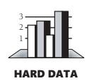

# Chapter 33: Personal Character

### cc2e.com/3313 Contents

- 33.1 Isn't Personal Character Off the Topic?: page 820
- 33.2 Intelligence and Humility: page 821
- 33.3 Curiosity: page 822
- 33.4 Intellectual Honesty: page 826
- 33.5 Communication and Cooperation: page 828
- 33.6 Creativity and Discipline: page 829
- 33.7 Laziness: page 830
- 33.8 Characteristics That Don't Matter As Much As You Might Think: page 830
- 33.9 Habits: page 833

#### Related Topics

- Themes in software craftsmanship: Chapter 34
- Complexity: Sections 5.2 and 19.6

Personal character has received a rare degree of attention in software development. Ever since Edsger Dijkstra's landmark 1965 article, "Programming Considered as a Human Activity," programmer character has been regarded as a legitimate and fruitful area of inquiry. Titles such as *The Psychology of Bridge Construction* and "Exploratory Experiments in Attorney Behavior" might seem absurd, but in the computer field *The Psychology of Computer Programming*, "Exploratory Experiments in Programmer Behavior," and similar titles are classics.

Engineers in every discipline learn the limits of the tools and materials they work with. If you're an electrical engineer, you know the conductivity of various metals and a hundred ways to use a voltmeter. If you're a structural engineer, you know the loadbearing properties of wood, concrete, and steel.

If you're a software engineer, your basic building material is human intellect and your primary tool is *you*. Rather than designing a structure to the last detail and then handing the blueprints to someone else for construction, you know that once you've designed a piece of software to the last detail, it's done. The whole job of programming is building air castles—it's one of the most purely mental activities you can do.

Consequently, when software engineers study the essential properties of their tools and raw materials, they find that they're studying people: intellect, character, and other attributes that are less tangible than wood, concrete, and steel.

If you're looking for concrete programming tips, this chapter might seem too abstract to be useful. Once you've absorbed the specific advice in the rest of the book, however, this chapter spells out what you need to do to continue improving. Read the next section, and then decide whether you want to skip the chapter.

#### 33.1 Isn't Personal Character Off the Topic?

The intense inwardness of programming makes personal character especially important. You know how difficult it is to put in eight concentrated hours in one day. You've probably had the experience of being burned out one day from concentrating too hard the day before or burned out one month from concentrating too hard the month before. You've probably had days on which you've worked well from 8:00 A.M. to 2:00 P.M. and then felt like quitting. You didn't quit, though; you pushed on from 2:00 P.M. to 5:00 P.M. and then spent the rest of the week fixing what you wrote from 2:00 to 5:00.

Programming work is essentially unsupervisable because no one ever really knows what you're working on. We've all had projects in which we spent 80 percent of the time working on a small piece we found interesting and 20 percent of the time building the other 80 percent of the program.

Your employer can't force you to be a good programmer; a lot of times your employer isn't even in a position to judge whether you're good. If you want to be great, you're responsible for making yourself great. It's a matter of your personal character.

Once you decide to make yourself a superior programmer, the potential for improvement is huge. Study after study has found differences on the order of 10 to 1 in the time required to create a program. They have also found differences on the order of 10 to 1 in the time required to debug a program and 10 to 1 in the resulting size, speed, error rate, and number of errors detected (Sackman, Erikson, and Grant 1968; Curtis 1981; Mills 1983; DeMarco and Lister 1985; Curtis et al. 1986; Card 1987; Valett and McGarry 1989).

You can't do anything about your intelligence, so the classical wisdom goes, but you can do something about your character. And it turns out that character is the more decisive factor in the makeup of a superior programmer.

#### 33.2 Intelligence and Humility

We become authorities and experts in the practical and scientific spheres by so many separate acts and hours of work. If a person keeps faithfully busy each hour of the working day, he can count on waking up some morning to find himself one of the competent ones of his generation. —*William James*

Intelligence doesn't seem like an aspect of personal character, and it isn't. Coincidentally, great intelligence is only loosely connected to being a good programmer.

What? You don't have to be superintelligent?

No, you don't. Nobody is really smart enough to program computers. Fully understanding an average program requires an almost limitless capacity to absorb details and an equal capacity to comprehend them all at the same time. The way you focus your intelligence is more important than how much intelligence you have.

As Chapter 5 ("Design in Construction") mentioned, at the 1972 Turing Award Lecture, Edsger Dijkstra delivered a paper titled "The Humble Programmer." He argued that most of programming is an attempt to compensate for the strictly limited size of our skulls. The people who are best at programming are the people who realize how small their brains are. They are humble. The people who are the worst at programming are the people who refuse to accept the fact that their brains aren't equal to the task. Their egos keep them from being great programmers. The more you learn to compensate for your small brain, the better a programmer you'll be. The more humble you are, the faster you'll improve.

The purpose of many good programming practices is to reduce the load on your gray cells. Here are a few examples:

- The point of "decomposing" a system is to make it simpler to understand. (See "Levels of Design" in Section 5.2 for more details.)
- Conducting reviews, inspections, and tests is a way of compensating for anticipated human fallibilities. These review techniques originated as part of "egoless programming" (Weinberg 1998). If you never made mistakes, you wouldn't need to review your software. But you know that your intellectual capacity is limited, so you augment it with someone else's.
- Keeping routines short reduces the load on your brain.
- Writing programs in terms of the problem domain rather than in terms of lowlevel implementation details reduces your mental workload.
- Using conventions of all sorts frees your brain from the relatively mundane aspects of programming, which offer little payback.

You might think that the high road would be to develop better mental abilities so that you wouldn't need these programming crutches. You might think that a programmer who uses mental crutches is taking the low road. Empirically, however, it's been shown that humble programmers who compensate for their fallibilities write code that's easier for themselves and others to understand and that has fewer errors. The real low road is the road of errors and delayed schedules.

#### 33.3 Curiosity

Once you admit that your brain is too small to understand most programs and you realize that effective programming is a search for ways to offset that fact, you begin a career-long search for ways to compensate. In the development of a superior programmer, curiosity about technical subjects must be a priority. The relevant technical information changes continually. Many Web programmers have never had to program in Microsoft Windows, and many Windows programmers never had to deal with DOS or UNIX or punch cards. Specific features of the technical environment change every 5 to 10 years. If you aren't curious enough to keep up with the changes, you might find yourself down at the old-programmers' home playing cards with T-Bone Rex and the Brontosaurus sisters.

Programmers are so busy working they often don't have time to be curious about how they might do their jobs better. If this is true for you, you're not alone. The following subsections describe a few specific actions you can take to exercise your curiosity and make learning a priority.

**Cross-Reference** For a fuller discussion of the importance of process in software development, see Section 34.2, "Pick Your Process."

*Build your awareness of the development process* The more aware you are of the development process, whether from reading or from your own observations about software development, the better position you're in to understand changes and to move your group in a good direction.

If your workload consists entirely of short-term assignments that don't develop your skills, be dissatisfied. If you're working in a competitive software market, half of what you now need to know to do your job will be out of date in three years. If you're not learning, you're turning into a dinosaur.

HARD DATA

You're in too much demand to spend time working for management that doesn't have your interests in mind. Despite some ups and downs and some jobs moving overseas, the average number of software jobs available in the U.S. is expected to increase dramatically between 2002 and 2012. Jobs for systems analysts are expected to increase by about 60 percent and for software engineers by about 50 percent. For all computer-job categories combined, about 1 million new jobs will be created beyond the 3 million that currently exist (Hecker 2001, BLS 2004). If you can't learn at your job, find a new one.

**Cross-Reference** Several key aspects of programming revolve around the idea of experimentation. For details, see "Experimentation" in Section 34.9.

*Experiment* One effective way to learn about programming is to experiment with programming and the development process. If you don't know how a feature of your language works, write a short program to exercise the feature and see how it works. Prototype! Watch the program execute in the debugger. You're better off working with a short program to test a concept than you are writing a larger program with a feature you don't quite understand.

What if the short program shows that the feature doesn't work the way you want it to? That's what you wanted to find out. Better to find it out in a small program than a large one. One key to effective programming is learning to make mistakes quickly, learning from them each time. Making a mistake is no sin. Failing to learn from a mistake is.

**Further Reading** A great book that teaches problem solving is James Adams's *Conceptual Blockbusting* (2001).

*Read about problem solving* Problem solving is the core activity in building computer software. Herbert Simon reported a series of experiments on human problem solving. They found that human beings don't always discover clever problem-solving strategies themselves, even though the same strategies could readily be taught to the same people (Simon 1996). The implication is that even if you want to reinvent the wheel, you can't count on success. You might reinvent the square instead.

*Analyze and plan before you act* You'll find that there's a tension between analysis and action. At some point you have to quit gathering data and act. The problem for most programmers, however, isn't an excess of analysis. The pendulum is currently so far on the "acting" side of the arc that you can wait until it's at least partway to the middle before worrying about getting stuck on the "analysis-paralysis" side.

**cc2e.com/3320** *Learn about successful projects* One especially good way to learn about programming is to study the work of the great programmers. Jon Bentley thinks that you should be able to sit down with a glass of brandy and a good cigar and read a program the way you would a good novel. That might not be as far-fetched as it sounds. Most people wouldn't want to use their recreational time to scrutinize a 500-page source listing, but many people would enjoy studying a high-level design and dipping into more detailed source listings for selected areas.

> The software-engineering field makes extraordinarily limited use of examples of past successes and failures. If you were interested in architecture, you'd study the drawings of Louis Sullivan, Frank Lloyd Wright, and I. M. Pei. You'd probably visit some of their buildings. If you were interested in structural engineering, you'd study the Brooklyn Bridge; the Tacoma Narrows Bridge; and a variety of other concrete, steel, and wood structures. You would study examples of successes and failures in your field.

> Thomas Kuhn points out that a part of any mature science is a set of solved problems that are commonly recognized as examples of good work in the field and that serve as examples for future work (Kuhn 1996). Software engineering is only beginning to mature to this level. In 1990, the Computer Science and Technology Board concluded that there were few documented case studies of either successes or failures in the software field (CSTB 1990).

> An article in the *Communications of the ACM* argued for learning from case studies of programming problems (Linn and Clancy 1992). The fact that someone has to argue

for this is significant. That one of the most popular computing columns, "Programming Pearls," was built around case studies of programming problems is also suggestive. And one of the most popular books in software engineering is *The Mythical Man-Month*, a case study in programming management of the IBM OS/360 project.

With or without a book of case studies in programming, find code written by superior programmers and read it. Ask to look at the code of programmers you respect. Ask to look at the code of programmers you don't. Compare their code, and compare their code to your own. What are the differences? Why are they different? Which way is better? Why?

In addition to reading other people's code, develop a desire to know what expert programmers think about your code. Find world-class programmers who'll give you their criticism. As you listen to the criticism, filter out points that have to do with their personal idiosyncrasies and concentrate on the points that matter. Then change your programming so that it's better.

*Read!* Documentation phobia is rampant among programmers. Computer documentation tends to be poorly written and poorly organized, but for all its problems, there's much to gain from overcoming an excessive fear of computer-screen photons or paper products. Documentation contains the keys to the castle, and it's worth spending time reading it. Overlooking information that's readily available is such a common oversight that a familiar acronym on newsgroups and bulletin boards is "RTFM!" which stands for "Read the !#\*%\*@ Manual!"

A modern language product is usually bundled with an enormous set of library code. Time spent browsing through the library documentation is well invested. Often the company that provides the language product has already created many of the classes you need. If it has, make sure you know about them. Skim the documentation every couple of months.

**Cross-Reference** For books you can use in a personal reading program, see Section 35.4, "A Software Developer's Reading Plan."

*Read other books and periodicals* Pat yourself on the back for reading this book. You're already learning more than most people in the software industry because one book is more than most programmers read each year (DeMarco and Lister 1999). A little reading goes a long way toward professional advancement. If you read even one good programming book every two months, roughly 35 pages a week, you'll soon have a firm grasp on the industry and distinguish yourself from nearly everyone around you.

*Affiliate with other professionals* Find other people who care about sharpening their software-development skills. Attend a conference, join a local user group, or participate in an online discussion group.

**Further Reading** For other discussions of programmer levels, see "Construx's Professional Development Program" (Chapter 16) in *Professional Software Development* (McConnell 2004).

*Make a commitment to professional development* Good programmers constantly look for ways to become better. Consider the following professional development ladder used at my company and several others:

- **Level 1: Beginning** A beginner is a programmer capable of using the basic capabilities of one language. Such a person can write classes, routines, loops, and conditionals and use many of the features of a language.
- **Level 2: Introductory** An intermediate programmer who has moved past the beginner phase is capable of using the basic capabilities of multiple languages and is very comfortable in at least one language.
- **Level 3: Competency** A competent programmer has expertise in a language or an environment or both. A programmer at this level might know all the intricacies of J2EE or have the *Annotated C++ Reference Manual* memorized. Programmers at this level are valuable to their companies, and many programmers never move beyond this level.
- **Level 4: Leadership** A leader has the expertise of a Level 3 programmer and recognizes that programming is only 15 percent communicating with the computer and 85 percent communicating with people. Only 30 percent of an average programmer's time is spent working alone (McCue 1978). Even less time is spent communicating with the computer. The guru writes code for an audience of people rather than machines. True guru-level programmers write code that's crystal-clear, and they document it, too. They don't want to waste their valuable gray cells reconstructing the logic of a section of code that they could have read in a one-sentence comment.

A great coder who doesn't emphasize readability is probably stuck at Level 3, but even that isn't usually the case. In my experience, the main reason people write unreadable code is that their code is bad. They don't say to themselves, "My code is bad, so I'll make it hard to read." They just don't understand their code well enough to make it readable, which locks them into one of the lower levels.

The worst code I've ever seen was written by someone who wouldn't let anyone go near her programs. Finally, her manager threatened to fire her if she didn't cooperate. Her code was uncommented and littered with variables like *x, xx, xxx, xx1*, and *xx2*, all of which were global. Her manager's boss thought she was a great programmer because she fixed errors quickly. The quality of her code gave her abundant opportunities to demonstrate her error-correcting ability.

It's no sin to be a beginner or an intermediate. It's no sin to be a competent programmer instead of a leader. The sin is in how long you remain a beginner or intermediate after you know what you have to do to improve.

#### 33.4 Intellectual Honesty

Part of maturing as a programming professional is developing an uncompromising sense of intellectual honesty. Intellectual honesty commonly manifests itself in several ways:

- Refusing to pretend you're an expert when you're not
- Readily admitting your mistakes
- Trying to understand a compiler warning rather than suppressing the message
- Clearly understanding your program—not compiling it to see if it works
- Providing realistic status reports
- Providing realistic schedule estimates and holding your ground when management asks you to adjust them

The first two items on this list—admitting that you don't know something or that you made a mistake—echo the theme of intellectual humility discussed earlier. How can you learn anything new if you pretend that you know everything already? You'd be better off pretending that you don't know anything. Listen to people's explanations, learn something new from them, and assess whether *they* know what *they* are talking about.

Be ready to quantify your degree of certainty on any issue. If it's usually 100 percent, that's a warning sign.

Any fool can defend his or her mistakes—and most fools do. —*Dale Carnegie*

Refusing to admit mistakes is a particularly annoying habit. If Sally refuses to admit a mistake, she apparently believes that not admitting the mistake will trick others into believing that she didn't make it. The opposite is true. Everyone will know she made a mistake. Mistakes are accepted as part of the ebb and flow of complex intellectual activities, and as long as she hasn't been negligent, no one will hold mistakes against her.

If she refuses to admit a mistake, the only person she'll fool is herself. Everyone else will learn that they're working with a prideful programmer who's not completely honest. That's a more damning fault than making a simple error. If you make a mistake, admit it quickly and emphatically.

Pretending to understand compiler messages when you don't is another common blind spot. If you don't understand a compiler warning or if you think you know what it means but are too pressed for time to check it, guess what's really a waste of time? You'll probably end up trying to solve the problem from the ground up while the compiler waves the solution in your face. I've had several people ask for help in debugging programs. I'll ask if they have a clean compile, and they'll say yes. Then they'll start to explain the symptoms of the problem, and I'll say, "Hmmmm. That sounds like it would be an uninitialized pointer, but the compiler should have warned you about that." Then they'll say, "Oh yeah—it did warn about that. We

thought it meant something else." It's hard to fool other people about your mistakes. It's even harder to fool the computer, so don't waste your time trying.

A related kind of intellectual sloppiness occurs when you don't quite understand your program and "just compile it to see if it works." One example is running the program to see whether you should use *<* or *<=*. In that situation, it doesn't really matter whether the program works because you don't understand it well enough to know why it works. Remember that testing can show only the presence of errors, not their absence. If you don't understand the program, you can't test it thoroughly. Feeling tempted to compile a program to "see what happens" is a warning sign. It might mean that you need to back up to design or that you began coding before you were sure you knew what you were doing. Make sure you have a strong intellectual grip on the program before you relinquish it to the compiler.

The first 90 percent of the code accounts for the first 90 percent of the development time. The remaining 10 percent of the code accounts for the other 90 percent of the development time.

—*Tom Cargill*

Status reporting is an area of scandalous duplicity. Programmers are notorious for saying that a program is "90 percent complete" during the last 50 percent of the project. If your problem is that you have a poor sense of your own progress, you can solve it by learning more about how you work. But if your problem is that you don't speak your mind because you want to give the answer your manager wants to hear, that's a different story. A manager usually appreciates honest observations about the status of a project, even if they're not the opinions the manager wants to hear. If your observations are well thought out, give them as dispassionately as you can and in private. Management needs to have accurate information to coordinate development activities, and full cooperation is essential.

**cc2e.com/3341** An issue related to inaccurate status reporting is inaccurate estimation. The typical scenario goes like this: Management asks Bert for an estimate of how long it would take to develop a new database product. Bert talks to a few programmers, crunches some numbers, and comes back with an estimate of eight programmers and six months. His manager says, "That's not really what we're looking for. Can you do it in a shorter time, with fewer programmers?" Bert goes away and thinks about it and decides that for a short period he could cut training and vacation time and have everyone work a little overtime. He comes back with an estimate of six programmers and four months. His manager says, "That's great. This is a relatively low-priority project, so try to keep it on time without any overtime because the budget won't allow it."

> The mistake Bert made was not realizing that estimates aren't negotiable. He can revise an estimate to be more accurate, but negotiating with his boss won't change the time it takes to develop a software project. IBM's Bill Weimer says, "We found that technical people, in general, were actually very good at estimating project requirements and schedules. The problem they had was defending their decisions; they needed to learn how to hold their ground" (Weimer in Metzger and Boddie 1996). Bert's not going to make his manager any happier by promising to deliver a project in

four months and delivering it in six than he would by promising and delivering it in six. He'll lose credibility by compromising, and he'll gain respect by standing firm on his estimate.

If management applies pressure to change your estimate, realize that ultimately the decision whether to do a project rests with management: "Look. This is how much it's going to cost. I can't say whether it's worth this price to the company—that's your job. But I can tell you how long it takes to develop a piece of software—that's my job. I can't 'negotiate' how long it will take; that's like negotiating how many feet are in a mile. You can't negotiate laws of nature. We can, however, negotiate other aspects of the project that affect the schedule and then reestimate the schedule. We can eliminate features, reduce performance, develop the project in increments, or use fewer people and a longer schedule or more people and a shorter schedule."

One of the scariest exchanges I've ever heard was at a lecture on managing software projects. The speaker was the author of a best-selling software-project-management book. A member of the audience asked, "What do you do if management asks for an estimate and you know that if you give them an accurate estimate they'll say it's too high and decide not to do the project?" The speaker responded that that was one of those tricky areas in which you had to get management to buy into the project by underestimating it. He said that once they'd invested in the first part of the project, they'd see it through to the end.

Wrong answer! Management is responsible for the big-picture issues of running a company. If a certain software capability is worth \$250K to a company and you estimate it will cost \$750K to develop, the company shouldn't develop the software. It's management's responsibility to make such judgments. When the speaker advocated lying about the project's cost, telling management it would cost less than it really would, he advocated covertly stealing management's authority. If you think a project is interesting, breaks important new ground for the company, or provides valuable training, say so. Management can weigh those factors, too. But tricking management into making the wrong decision could literally cost the company hundreds of thousands of dollars. If it costs you your job, you'll have gotten what you deserve.

#### 33.5 Communication and Cooperation

Truly excellent programmers learn how to work and play well with others. Writing readable code is part of being a team player. The computer probably reads your program as often as other people do, but it's a lot better at reading poor code than people are. As a readability guideline, keep the person who has to modify your code in mind. Programming is communicating with another programmer first and communicating with the computer second.

#### 33.6 Creativity and Discipline

*When I got out of school, I thought I was the best programmer in the world. I could write an unbeatable tic-tac-toe program, use five different computer languages, and create 1000-line programs that WORKED (really!). Then I got out into the Real World. My first task in the Real World was to read and understand a 200,000-line Fortran program and then speed it up by a factor of two. Any Real Programmer will tell you that all the Structured Coding in the world won't help you solve a problem like that—it takes actual talent. —Ed Post*

It's hard to explain to a fresh computer-science graduate why you need conventions and engineering discipline. When I was an undergraduate, the largest program I wrote was about 500 lines of executable code. As a professional, I've written dozens of utilities that have been smaller than 500 lines, but the average main-project size has been 5,000 to 25,000 lines, and I've participated in projects with over a half million lines of code. This type of effort requires not the same skills on a larger scale, but a new set of skills altogether.

Some creative programmers view the discipline of standards and conventions as stifling to their creativity. The opposite is true. Can you imagine a website on which each page used different fonts, colors, text alignment, graphics styles, and navigation clues? The effect would be chaotic, not creative. Without standards and conventions on large projects, project completion itself is impossible. Creativity isn't even imaginable. Don't waste your creativity on things that don't matter. Establish conventions in noncritical areas so that you can focus your creative energies in the places that count.

In a 15-year retrospective on work at NASA's Software Engineering Laboratory, McGarry and Pajerski reported that methods and tools that emphasize human discipline have been especially effective (1990). Many highly creative people have been extremely disciplined. "Form is liberating," as the saying goes. Great architects work within the constraints of physical materials, time, and cost. Great artists do, too. Anyone who has examined Leonardo's drawings has to admire his disciplined attention to detail. When Michelangelo designed the ceiling of the Sistine Chapel, he divided it into symmetric collections of geometric forms, such as triangles, circles, and squares. He designed it in three zones corresponding to three Platonic stages. Without this self-imposed structure and discipline, the 300 human figures would have been merely chaotic rather than the coherent elements of an artistic masterpiece.

A programming masterpiece requires just as much discipline. If you don't try to analyze requirements and design before you begin coding, much of your learning about the project will occur during coding and the result of your labors will look more like a three-year-old's finger painting than a work of art.

### 33.7 Laziness

Laziness: The quality that makes you go to great effort to reduce overall energy expenditure. It makes you write labor-saving programs that other people will find useful, and document what you wrote so that you don't have to answer so many questions about it. *—Larry Wall*

Laziness manifests itself in several ways:

- Deferring an unpleasant task
- Doing an unpleasant task quickly to get it out of the way
- Writing a tool to do the unpleasant task so that you never have to do the task again

Some of these manifestations of laziness are better than others. The first is hardly ever beneficial. You've probably had the experience of spending several hours futzing with jobs that didn't really need to be done so that you wouldn't have to face a relatively minor job that you couldn't avoid. I detest data entry, and many programs require a small amount of data entry. I've been known to delay working on a program for days just to delay the inevitable task of entering several pages of numbers by hand. This habit is "true laziness." It manifests itself again in the habit of compiling a class to see if it works so that you can avoid the exercise of checking the class with your mind.

The small tasks are never as bad as they seem. If you develop the habit of doing them right away, you can avoid the procrastinating kind of laziness. This habit is "enlightened laziness"—the second kind of laziness. You're still lazy, but you're getting around the problem by spending the smallest possible amount of time on something that's unpleasant.

The third option is to write a tool to do the unpleasant task. This is "long-term laziness." It is undoubtedly the most productive kind of laziness (provided that you ultimately save time by having written the tool). In these contexts, a certain amount of laziness is beneficial.

When you step through the looking glass, you see the other side of the laziness picture. "Hustle" or "making an effort" doesn't have the rosy glow it does in high-school physical education class. Hustle is extra, unnecessary effort. It shows that you're eager but not that you're getting your work done. It's easy to confuse motion with progress, busy-ness with being productive. The most important work in effective programming is thinking, and people tend not to look busy when they're thinking. If I worked with a programmer who looked busy all the time, I'd assume that he was not a good programmer because he wasn't using his most valuable tool, his brain.

### 33.8 Characteristics That Don't Matter As Much As You Might Think

Hustle isn't the only characteristic that you might admire in other aspects of your life but that doesn't work very well in software development.

#### Persistence

Depending on the situation, persistence can be either an asset or a liability. Like most value-laden concepts, it's identified by different words depending on whether you think it's a good quality or a bad one. If you want to identify persistence as a bad quality, you say it's "stubbornness" or "pigheadedness." If you want it to be a good quality, you call it "tenacity" or "perseverance."

Most of the time, persistence in software development is pigheadedness—it has little value. Persistence when you're stuck on a piece of new code is hardly ever a virtue. Try redesigning the class, try an alternative coding approach, or try coming back to it later. When one approach isn't working, that's a good time to try an alternative (Pirsig 1974).

**Cross-Reference** For a more detailed discussion of persistence in debugging, see "Tips for Finding Defects" in Section 23.2.

In debugging, it can be mighty satisfying to track down the error that has been annoying you for four hours, but it's often better to give up on the error after a certain amount of time with no progress—say 15 minutes. Let your subconscious chew on the problem for a while. Try to think of an alternative approach that would circumvent the problem altogether. Rewrite the troublesome section of code from scratch. Come back to it later when your mind is fresh. Fighting computer problems is no virtue. Avoiding them is better.

It's hard to know when to give up, but it's essential that you ask. When you notice that you're frustrated, that's a good time to ask the question. Asking doesn't necessarily mean that it's time to give up, but it probably means that it's time to set some parameters on the activity: "If I don't solve the problem using this approach within the next 30 minutes, I'll take 10 minutes to brainstorm about different approaches and try the best one for the next hour."

#### Experience

The value of hands-on experience as compared to book learning is smaller in software development than in many other fields for several reasons. In many other fields, basic knowledge changes slowly enough that someone who graduated from college 10 years after you did probably learned the same basic material that you did. In software development, even basic knowledge changes rapidly. The person who graduated from college 10 years after you did probably learned twice as much about effective programming techniques. Older programmers tend to be viewed with suspicion not just because they might be out of touch with specific technology but because they might never have been exposed to basic programming concepts that became well known after they left school.

In other fields, what you learn about your job today is likely to help you in your job tomorrow. In software, if you can't shake the habits of thinking you developed while using your former programming language or the code-tuning techniques that worked on your old machine, your experience will be worse than none at all. A lot of software people spend their time preparing to fight the last war rather than the next one. If you can't change with the times, experience is more a handicap than a help.

Aside from the rapid changes in software development, people often draw the wrong conclusions from their experiences. It's hard to view your own life objectively. You can overlook key elements of your experience that would cause you to draw different conclusions if you recognized them. Reading studies of other programmers is helpful because the studies reveal other people's experience—filtered enough that you can examine it objectively.

People also put an absurd emphasis on the *amount* of experience programmers have. "We want a programmer with five years of C programming experience" is a silly statement. If a programmer hasn't learned C after a year or two, the next three years won't make much difference. This kind of "experience" has little relationship to performance.

The fact that information changes quickly in programming makes for weird dynamics in the area of "experience." In many fields, a professional who has a history of achievement can coast, relaxing and enjoying the respect earned by a string of successes. In software development, anyone who coasts quickly becomes out of touch. To stay valuable, you have to stay current. For young, hungry programmers, this is an advantage. Older programmers sometimes feel they've already earned their stripes and resent having to prove themselves year after year.

The bottom line on experience is this: if you work for 10 years, do you get 10 years of experience or do you get 1 year of experience 10 times? You have to reflect on your activities to get true experience. If you make learning a continuous commitment, you'll get experience. If you don't, you won't, no matter how many years you have under your belt.

#### Gonzo Programming

*If you haven't spent at least a month working on the same program—working 16 hours a day, dreaming about it during the remaining 8 hours of restless sleep, working several nights straight through trying to eliminate that "one last bug" from the program—then you haven't really written a complicated computer program. And you may not have the sense that there is something exhilarating about programming.*

*—Edward Yourdon*

This lusty tribute to programming machismo is pure B.S. and an almost certain recipe for failure. Those all-night programming stints make you feel like the greatest programmer in the world, but then you have to spend several weeks correcting the defects you installed during your blaze of glory. By all means, get excited about programming. But excitement is no substitute for competency. Remember which is more important.

#### 33.9 Habits

*The moral virtues, then, are engendered in us neither by nor contrary to nature...their full development in us is due to habit....Anything that we have to learn to do we learn by the actual doing of it....Men will become good builders as a result of building well and bad ones as a result of building badly....So it is a matter of no little importance what sort of habits we form from the earliest age—it makes a vast difference, or rather all the difference in the world.*

*—Aristotle*

Good habits matter because most of what you do as a programmer you do without consciously thinking about it. For example, at one time, you might have thought about how you wanted to format indented loops, but now you don't think about it again each time you write a new loop. You do it the way you do it out of habit. This is true of virtually all aspects of program formatting. When was the last time you seriously questioned your formatting style? Chances are good that if you've been programming for five years, you last questioned it four and a half years ago. The rest of the time you've relied on habit.

**Cross-Reference** For details on errors in assignment statements, see "Errors by Classification" in Section 22.4.

You have habits in many areas. For example, programmers tend to check loop indexes carefully and not to check assignment statements, which makes errors in assignment statements much harder to find than errors in loop indexes (Gould 1975). You respond to criticism in a friendly way or in an unfriendly way. You're always looking for ways to make code readable or fast, or you're not. If you have to choose between making code fast and making it readable, and you make the same choice every time, you're not really choosing—you're responding out of habit.

Study the quotation from Aristotle and substitute "programming virtues" for "moral virtues." He points out that you are not predisposed to either good or bad behavior but are constituted in such a way that you can become either a good or a bad programmer. The main way you become good or bad at what you do is by doing—builders by building and programmers by programming. What you do becomes habit, and over time your good and bad habits determine whether you're a good or a bad programmer.

Bill Gates says that any programmer who will ever be good is good in the first few years. After that, whether a programmer is good or not is cast in concrete (Lammers 1986). After you've been programming a long time, it's hard to suddenly start saying, "How do I make this loop faster?" or "How do I make this code more readable?" These are habits that good programmers develop early.

When you first learn something, learn it the right way. When you first do it, you're actively thinking about it and you still have an easy choice between doing it in a good way and doing it in a bad way. After you've done it a few times, you pay less attention to what you're doing and "force of habit" takes over. Make sure that the habits that take over are the ones you want to have.

What if you don't already have the most effective habits? How do you change a bad habit? If I had the definitive answer to that, I could sell self-help tapes on late-night TV. But here's at least part of an answer. You can't replace a bad habit with no habit at all. That's why people who suddenly stop smoking or swearing or overeating have such a hard time unless they substitute something else, like chewing gum. It's easier to replace an old habit with a new one than it is to eliminate one altogether. In programming, try to develop new habits that work. Develop the habits of writing a class in pseudocode before coding it and carefully reading the code before compiling it, for instance. You won't have to worry about losing the bad habits; they'll naturally drop by the wayside as new habits take their places.

#### Additional Resources

**cc2e.com/3327** Following are additional resources on the human aspects of software development:

**cc2e.com/3334** Dijkstra, Edsger. "The Humble Programmer." Turing Award Lecture. *Communications of the ACM* 15, no. 10 (October 1972): 859–66. This classic paper helped begin the inquiry into how much computer programming depends on the programmer's mental abilities. Dijkstra has persistently stressed the message that the essential task of programming is mastering the enormous complexity of computer science. He argues that programming is the only activity in which humans have to master nine orders of magnitude of difference between the lowest level of detail and the highest. This paper would be interesting reading solely for its historical value, but many of its themes sound fresh decades later. It also conveys a good sense of what it was like to be a programmer in the early days of computer science.

> Weinberg, Gerald M. *The Psychology of Computer Programming: Silver Anniversary Edition*. New York, NY: Dorset House, 1998. This classic book contains a detailed exposition of the idea of egoless programming and of many other aspects of the human side of computer programming. It contains many entertaining anecdotes and is one of the most readable books yet written about software development.

> Pirsig, Robert M. *Zen and the Art of Motorcycle Maintenance: An Inquiry into Values*. William Morrow, 1974. Pirsig provides an extended discussion of "quality," ostensibly as it relates to motorcycle maintenance. Pirsig was working as a software technical writer when he wrote *ZAMM*, and his insightful comments apply as much to the psychology of software projects as to motorcycle maintenance.

> Curtis, Bill, ed. *Tutorial: Human Factors in Software Development*. Los Angeles, CA: IEEE Computer Society Press, 1985. This is an excellent collection of papers that address the human aspects of creating computer programs. The 45 papers are divided into sections on mental models of programming knowledge, learning to program, problem solving and design, effects of design representations, language characteristics, error diagnosis, and methodology. If programming is one of the most

difficult intellectual challenges that humankind has ever faced, learning more about human mental capacities is critical to the success of the endeavor. These papers about psychological factors also help you to turn your mind inward and learn about how you individually can program more effectively.

McConnell, Steve. *Professional Software Development.* Boston, MA: Addison-Wesley, 2004. Chapter 7, "Orphans Preferred," provides more details on programmer personalities and the role of personal character.

#### Key Points

- Your personal character directly affects your ability to write computer programs.
- The characteristics that matter most are humility, curiosity, intellectual honesty, creativity and discipline, and enlightened laziness.
- The characteristics of a superior programmer have almost nothing to do with talent and everything to do with a commitment to personal development.
- Surprisingly, raw intelligence, experience, persistence, and guts hurt as much as they help.
- Many programmers don't actively seek new information and techniques and instead rely on accidental, on-the-job exposure to new information. If you devote a small percentage of your time to reading and learning about programming, after a few months or years you'll dramatically distinguish yourself from the programming mainstream.
- Good character is mainly a matter of having the right habits. To be a great programmer, develop the right habits and the rest will come naturally.
